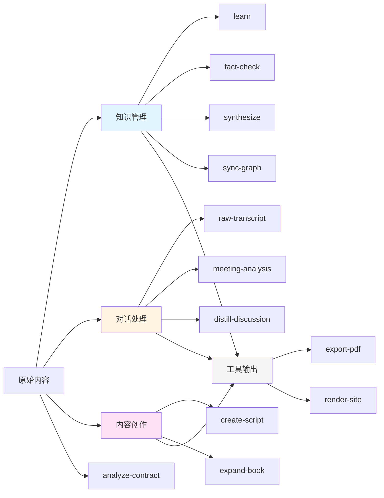

# 🔧 Workflows 导引手册

> **快速选择指南** - 根据你的任务类型，快速找到对应的workflow
>
> 📁 完整文档位置: `.agent/workflows/README.md`

---

## 🎯 我想做什么？

### 📚 学习和知识管理

| 任务 | 使用Workflow | 说明 |
|------|-------------|------|
| 学习新课程/文章/书籍 | [`/learn`](workflows/learn.md) | 生成标准化知识文档+3D图谱 |
| 核查知识准确性 | [`/fact-check`](workflows/fact-check.md) | 事实核查+知识增密 |
| 整合多个知识模块 | [`/synthesize`](workflows/synthesize.md) | 多文档升华为统一输出 |
| 更新知识图谱 | [`/sync-graph`](workflows/sync-graph.md) | 同步概念到3D可视化 |

### 💬 会议和对话处理

| 任务 | 使用Workflow | 说明 |
|------|-------------|------|
| 保存原始对话记录 | [`/raw-transcript`](workflows/raw-transcript-recording.md) | 语音转文字→格式化存档 |
| 深度分析重要会议 | [`/meeting-analysis`](workflows/meeting-analysis.md) | 10部分完整分析+行动方案 |
| 提炼讨论核心内容 | [`/distill-discussion`](workflows/distill-discussion.md) | 观点还原+共识提取 |

### ✍️ 内容创作

| 任务 | 使用Workflow | 说明 |
|------|-------------|------|
| 创作视频脚本 | [`/create-script`](workflows/create-script.md) | 深度科普/评论类脚本 |
| 书籍写作 | [`/expand-book`](workflows/expand-book.md) | 大纲→完整书式叙事 |

### 🛠️ 工具和输出

| 任务 | 使用Workflow | 说明 |
|------|-------------|------|
| 导出PDF文档 | [`/export-pdf`](workflows/export-pdf.md) | Markdown→PDF（含Mermaid） |
| 生成HTML网站 | [`/render-site`](workflows/render-site.md) | Markdown→精美网站 |
| 分析合同风险 | [`/analyze-contract`](workflows/analyze-contract.md) | 风险识别+谈判策略 |

---

## 🔄 典型工作流程

### 场景1: 学习新知识
```
1. /learn → 创建知识文档
2. /fact-check → 核查增密
3. /sync-graph → 更新图谱
4. /export-pdf → 输出分享
```

### 场景2: 会议处理
```
1. 会议录音 → 语音转文字
2. /raw-transcript → 原始存档
3. /meeting-analysis → 深度分析
4. /sync-graph → 提取概念到图谱
```

### 场景3: 内容创作
```
1. 从知识库选题
2. /create-script 或 /expand-book
3. 迭代优化
4. /export-pdf → 最终稿
```

---

## 📊 Workflows 全景图



---

## 🎯 选择建议

### 优先级 P0 (必须做)
- ✅ 重要战略会议 → `/meeting-analysis`
- ✅ 核心学习模块 → `/learn` + `/fact-check`
- ✅ 重要合同 → `/analyze-contract`
- ✅ 新增概念 → `/sync-graph`

### 优先级 P1 (建议做)
- ⭐ 一般会议 → `/raw-transcript` + 简化 `/meeting-analysis`
- ⭐ 头脑风暴 → `/distill-discussion`
- ⭐ 跨模块整合 → `/synthesize`
- ⭐ 内容创作 → `/create-script` 或 `/expand-book`

### 优先级 P2 (可选)
- 💡 日常会议 → 简单记录
- 💡 临时笔记 → 不需要workflow

---

## 📝 快速命令参考

```bash
# 知识管理
/learn [模块名] [素材]
/fact-check [文件路径]
/synthesize [文档1] [文档2] ... -> [输出名]
/sync-graph [模块名]

# 对话处理
/raw-transcript [语音文件/文本]
/meeting-analysis [Raw_Transcript路径]
/distill-discussion [对话内容]

# 内容创作
/create-script [选题关键词]
/expand-book

# 工具
/export-pdf [文件路径]
/render-site [文件路径]
/analyze-contract
```

---

## 📚 详细文档

需要了解某个workflow的详细信息？

1. **查看完整README**: [workflows/README.md](workflows/README.md)
2. **查看单个workflow**: `workflows/[workflow-name].md`
3. **查看示例输出**: `00_Archive/Meeting_Notes/` 或 `00_Archive/Raw_Transcripts/`

---

## 🆕 添加新Workflow清单

当你创建新workflow时，需要更新以下文件：

- [ ] 在 `workflows/` 创建新的 `[workflow-name].md`
- [ ] 更新 `workflows/README.md` 的索引表
- [ ] 更新本文档的快速选择指南
- [ ] 更新关系图（如适用）
- [ ] 在 Claude Skill 中添加触发器（如适用）

---

## 🔗 相关资源

| 资源 | 位置 | 说明 |
|------|------|------|
| 完整Workflows文档 | `.agent/workflows/README.md` | 13个workflows详细说明 |
| 知识图谱 | `Modules/3D_Knowledge_Graph.html` | 3D可视化知识网络 |
| 原始对话存档 | `00_Archive/Raw_Transcripts/` | 最小编辑的原始记录 |
| 会议分析存档 | `00_Archive/Meeting_Notes/` | 深度结构化分析 |
| 学习模块 | `Modules/` | 标准化知识文档 |

---

*最后更新: 2026-01-23*
*Workflows总数: 13个*
*维护者: Asher*
