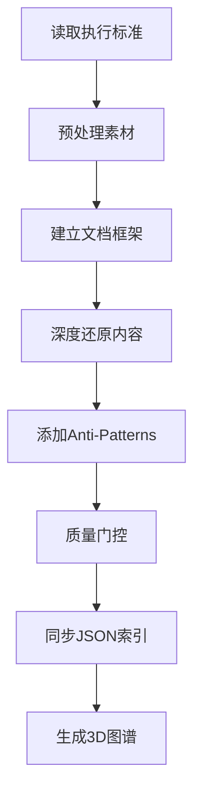
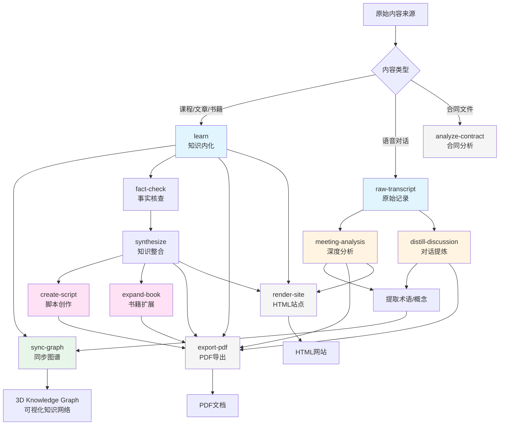

# Workflows 工作流总览

> **最后更新**: 2026-01-23
> **工作流总数**: 13个

---

## 📋 快速索引

| Workflow | 用途 | 输入 | 输出 |
|----------|------|------|------|
| **知识管理 Knowledge Management** |
| [learn](#learn) | 学习新内容并生成标准化知识文档+3D图谱 | 课程/文章/书籍 | 模块MD+3D图谱 |
| [sync-graph](#sync-graph) | 同步概念到3D知识图谱 | 模块MD文件 | 更新的3D_Knowledge_Graph.html |
| [synthesize](#synthesize) | 整合多个文档为升华版知识输出 | 2+个文档 | 统一知识文档 |
| [fact-check](#fact-check) | 事实核查与知识增密 | 任意MD文档 | 核查报告+知识扩展 |
| **对话处理 Dialogue Processing** |
| [distill-discussion](#distill-discussion) | 提炼对话核心意图、共识、分歧 | 对话录音/文字 | 结构化知识文档 |
| [raw-transcript-recording](#raw-transcript-recording) | 记录原始对话 | 语音转文字 | Raw_Transcripts/XX.md |
| [meeting-analysis](#meeting-analysis) | 深度分析会议 | Raw_Transcript | Meeting_Notes/XX.md |
| **内容创作 Content Creation** |
| [create-script](#create-script) | 创作深度科普/评论类视频脚本 | 选题关键词 | 视频脚本 |
| [expand-book](#expand-book) | 将大纲扩展为书式叙事 | 大纲/段落 | 完整书式内容 |
| **工具 Tools** |
| [export-pdf](#export-pdf) | Markdown转PDF（含Mermaid自动渲染） | MD文件 | PDF文件 |
| [render-site](#render-site) | Markdown转HTML站点 | MD文件 | HTML网站 |
| [analyze-contract](#analyze-contract) | 合同风险分析与谈判策略 | 合同文本 | 风险报告+谈判策略 |

---

## 🔄 Workflow详细说明

### 知识管理 (Knowledge Management)

<details>
<summary><b>1. learn - 知识内化工作流</b></summary>

#### 📌 核心功能
学习新内容并生成标准化知识文档，同时创建3D知识图谱节点。这是整个知识系统的**入口工作流**。

#### 🎯 适用场景
- ✅ 学习新课程、阅读新文章、新书籍
- ✅ 系统化整理某个领域的知识
- ✅ 需要创建可复用的学习材料
- ✅ 需要建立知识图谱节点

#### 🚫 不适用场景
- ❌ 简单信息记录（用raw-transcript）
- ❌ 已有现成结构化内容（用synthesize）
- ❌ 临时性笔记（不需要长期保留）

#### 📥 输入要求
```bash
/learn [模块名] [素材来源]

# 示例
/learn AI_Agent_Revolution 附件是课程transcript
```

**前置条件:**
- 必须先读取`Modules/_Learn standard.md`
- 必须先读取`Modules/_TEMPLATE.md`
- 必须先读取`Modules/_TEMPLATE_GRAPH.html`

#### 📤 输出内容
1. **标准化MD文档** (包含10个部分)
   - 元信息、核心概念、Anti-Patterns、Glossary、Formula Table等
2. **3D知识图谱HTML**
   - 包含所有概念节点和关系
3. **JSON索引文件**
   - `_Glossary_Index.json` (术语≥15个)
   - `_Formula_Index.json` (公式≥5个)

#### ⚙️ 执行流程


#### 📊 质量标准
- 输出字数 ≥ 原文30%
- 视觉化数量：< 2000字需8+，2000-5000字需12+，> 5000字需15+
- Glossary术语 ≥ 15个
- Formula公式 ≥ 5个
- 必须包含Anti-Patterns章节

#### 📖 详细文档
[查看完整文档](./learn.md)

</details>

---

<details>
<summary><b>2. sync-graph - 同步术语/公式到3D知识图谱</b></summary>

#### 📌 核心功能
自动扫描模块文件中的9大类概念（术语、公式、执行阶段、反模式陷阱、路线、发展阶段、核心概念、JSON索引），并将缺失的概念作为节点添加到3D知识图谱中。

#### 🎯 适用场景
- ✅ 完成新学习模块后
- ✅ 添加了新的Glossary术语
- ✅ 创建了新的Formula表
- ✅ 定义了新的Phase/Trap/Route/Stage

#### 🚫 不适用场景
- ❌ 概念尚未在MD文件中定义
- ❌ 临时性的、不需要长期保留的概念

#### 📥 输入要求
```bash
/sync-graph [模块名]

# 示例
/sync-graph AI_Landscape
```

#### 📤 输出内容
- 更新的3D知识图谱HTML文件
- 新增节点和关系
- 完成报告（提取/已有/新增统计）

#### ⚠️ 注意事项
- **零遗漏原则**: 每一个可节点化的概念都必须作为独立节点出现
- **禁止合并**: 即使语义相近也必须分开
- **关系必须正确**: Links必须指向存在的节点ID

#### 📖 详细文档
[查看完整文档](./sync-graph.md)

</details>

---

<details>
<summary><b>3. synthesize - 知识整合工作流</b></summary>

#### 📌 核心功能
将多个文档整合为升华版知识输出。**这不是简单的"合并"，而是"升华"**——输出文档应该比任何单个输入都更有价值。

#### 🎯 适用场景
- ✅ 多个学习模块需要整合
- ✅ 项目总结+核查报告需要合并
- ✅ 需要创建跨模块的综合材料
- ✅ 准备可对外分享的完整知识输出

#### 🚫 不适用场景
- ❌ 只有单个文档
- ❌ 文档间没有关联性
- ❌ 仅需简单合并文本

#### 📥 输入要求
```bash
/synthesize [文档1路径] [文档2路径] ... [输出名称]

# 示例
/synthesize Project_Summary.md Fact_Check_Report.md -> Unified_Knowledge_Document.md
```

**前置条件:**
- 至少2个输入文档
- 文档有明确的主题关联

#### 📤 输出内容
**完整的学习材料文档**，包含：
1. 导读（Executive Summary）
2. 核心逻辑链（可视化）
3. 核心概念详解（第一性原理重构）
4. 金句解构
5. 反模式清单
6. 术语表
7. 公式表
8. 被忽略的维度
9. 开放问题
10. 附录：原始来源

#### 🎨 核心方法论
- **第一性原理重构**: 把"观点"转化为"知识"
- **知识增密**: 每个概念都有定义+机制+案例
- **视觉优先**: 复杂关系必须可视化
- **去重合并**: 同一概念取最完整版本

#### 📊 质量标准
- 输出字数 ≥ 输入总和的80%
- 视觉化：< 3000字需10+，3000-8000字需15+，> 8000字需20+
- 每个核心概念都有完整解构
- 每个金句都被拆开分析

#### 📖 详细文档
[查看完整文档](./synthesize.md)

</details>

---

<details>
<summary><b>4. fact-check - 事实核查与知识增密</b></summary>

#### 📌 核心功能
逐点核查文档中的论断，同时进行**知识增密**。核心原则：**量大管饱**——每一个核查点都是一次知识扩展的机会。

#### 🎯 适用场景
- ✅ 完成学习模块后的质量保证
- ✅ 重要内容需要验证准确性
- ✅ 需要识别被忽略的维度
- ✅ 需要生成新洞察

#### 🚫 不适用场景
- ❌ 纯主观观点（无可验证论断）
- ❌ 虚构创作内容
- ❌ 时效性极强的新闻（无法立即核查）

#### 📥 输入要求
```bash
/fact-check [文件路径]

# 示例
/fact-check Modules/AI_Landscape/1.0_Core_Concepts.md
```

#### 📤 输出内容
**事实核查报告**，包含：
1. 核查结论汇总（✅正确/⚠️部分正确/❌需修正）
2. 知识点扩展（逐点详解，含概念+案例）
3. 被忽略的维度
4. 新洞察
5. 错误修正记录（如有）
6. 参考来源

#### 🎨 核心方法
- **即时扩展**: 核查的同时进行知识增密
- **多维审视**: 反面论证、边界条件、历史脉络、竞争观点、实践维度、受众盲区
- **增密标准**: 定义+核心机制+为什么重要+至少2个案例+类比+边界说明+行动指引

#### 📊 质量标准
- 每个核查点必须有概念+案例
- 每个核心论断至少2个案例
- 至少输出3个新洞察
- 至少识别2个被忽略维度
- 输出长度 ≥ 原文长度的50%

#### 📖 详细文档
[查看完整文档](./fact-check.md)

</details>

---

### 对话处理 (Dialogue Processing)

<details>
<summary><b>5. distill-discussion - 对话提炼工作流</b></summary>

#### 📌 核心功能
从对话录音/文字中提炼核心意图、共识、分歧和待定事项，形成**可独立阅读、逻辑自洽的完整内容**。

**关键区别**: 这个工作流的目标是**把内容做好**，而不是**把内容记下来**。

#### 🎯 适用场景
- ✅ 深度讨论需要结构化输出
- ✅ 头脑风暴需要提炼共识
- ✅ 争论性讨论需要识别分歧点
- ✅ 需要从对话中产生可执行的行动

#### 🚫 不适用场景
- ❌ 简单信息同步会议
- ❌ 纯社交性质对话
- ❌ 没有明确议题的闲聊

#### 📥 输入要求
```bash
/distill-discussion [粘贴对话内容或提供文件路径]
```

#### 📤 输出内容
**结构化知识文档**，包含：
1. 元认知（讨论背景、核心问题）
2. 观点还原（含即时核查）
3. 共识合成（强共识/分歧点/待定项）
4. 核查汇总
5. 行动转化
6. 系统关联
7. Glossary（如有新术语）

#### 🎨 核心方法
**观点即时核查框架**:
- What (是什么)
- Why (为什么会形成)
- Context (边界与前提)
- 🔍 即时核查（逻辑/事实/完整性）
- Implication (衍生结论)

#### 📊 质量标准
- 每个观点都讲完整（What+Why+Context）
- 每个观点都有即时核查
- 视觉化 ≥ 15个（长文档）
- 输出字数 ≥ 原文30%
- 底部有核查汇总表

#### 📖 详细文档
[查看完整文档](./distill-discussion.md)

</details>

---

<details>
<summary><b>6. raw-transcript-recording - 记录原始语音转文字对话</b></summary>

#### 📌 核心功能
将语音转文字的原始输出转化为格式规范的MD文档，进行**最小化编辑**，保留完整对话流。

#### 🎯 适用场景
- ✅ 重要会议需要完整记录
- ✅ 访谈、头脑风暴
- ✅ 可能需要追溯原话的场景
- ✅ 法律或合规要求保留原始记录

#### 🚫 不适用场景
- ❌ 简单的信息交换（无需存档）
- ❌ 纯文字聊天（直接保存即可）
- ❌ 高度敏感信息（需特殊处理）

#### 📥 输入要求
```bash
/raw-transcript [语音文件路径或转写文本]

# 示例
/raw-transcript ./meeting_20260123.txt
```

#### 📤 输出内容
**文件位置**: `00_Archive/Raw_Transcripts/YYYY-MM-DD_原始对话_参与者.md`

**文件结构**:
- 元信息（日期、参与者、来源、转写质量、时长）
- 编辑说明（最小化编辑原则）
- 对话内容（按说话人分段）
- 备注（转写质量、环境信息等）

#### ✅ 编辑原则
**允许:**
- ✅ 纠正明显识别错误
- ✅ 添加基础标点
- ✅ 区分说话人
- ✅ 添加段落分隔

**禁止:**
- ❌ 删除口语化表达
- ❌ 调整对话顺序
- ❌ 删除重复内容
- ❌ 改写句子结构

#### 📖 详细文档
[查看完整文档](./raw-transcript-recording.md)

</details>

---

<details>
<summary><b>7. meeting-analysis - 深度分析会议并生成结构化报告</b></summary>

#### 📌 核心功能
将Raw_Transcript转化为高度结构化的知识输出，包含观点还原、事实核查、共识提取、行动方案等**10个部分**。

#### 🎯 适用场景
- ✅ 重要会议需要深度复盘
- ✅ 需要提取可执行的行动方案
- ✅ 需要对外分享或引用
- ✅ 需要建立知识关联

#### 🚫 不适用场景
- ❌ 简单信息同步会议
- ❌ 纯社交性质对话
- ❌ 没有明确议题的闲聊

#### 📥 输入要求
```bash
/meeting-analysis [Raw_Transcript路径]

# 示例
/meeting-analysis 00_Archive/Raw_Transcripts/2026-01-23_原始对话_修荷_万达.md
```

**前置条件:**
- Raw_Transcript已创建并保存
- 对话有明确的议题或主题
- 对话时长建议30分钟以上

#### 📤 输出内容
**文件位置**: `00_Archive/Meeting_Notes/YYYY-MM-DD_参与者_主题.md`

**文件结构 (10个部分)**:
1. 元信息 + 标题
2. 共识清单（强共识/待确认/分歧）
3. 元认知（背景/核心问题/讨论脉络）
4. 观点还原（10-15个核心观点，WWHIS分析）
5. 事实核查（引用验证）
6. 维度梳理（认知/创作/传播/商业/哲学等）
7. 最终共识与行动方案（短中长期）
8. 系统关联（输入依赖/输出影响）
9. 术语表
10. 元数据

#### 🎨 核心方法论
**WWHIS观点分析框架:**
- **What** (是什么): 引用核心句
- **Who** (谁说的): 标注说话人
- **Why** (为什么): 形成原因
- **How** (怎么做): 实现路径
- **Implication** (So What): 衍生思考
- **Situation** (边界): 适用/不适用场景

#### 📊 质量标准
- 观点数量: 10-15个
- Mermaid图: 至少5个
- 事实核查: 所有引用
- 共识明确度: 清晰区分
- 行动方案: 具体、可执行
- 时间投入: 4-8小时

#### 📖 详细文档
[查看完整文档](./meeting-analysis.md)

</details>

---

### 内容创作 (Content Creation)

<details>
<summary><b>8. create-script - 视频脚本创作工作流</b></summary>

#### 📌 核心功能
创建深度科普/评论类视频脚本，具备反直觉钩子、跨领域引用、通俗易懂的特点。

**核心原则**: 好的作品需要结构，但好的创作者的结构不能是死的。本工作流提供**思考框架**而非**固定模板**。

#### 🎯 适用场景
- ✅ 深度科普视频脚本
- ✅ 热点评论类内容
- ✅ 跨领域知识科普
- ✅ 需要反直觉角度的选题

#### 🚫 不适用场景
- ❌ 纯信息播报
- ❌ 简单教程类内容
- ❌ 娱乐轻松向内容

#### 📥 输入要求
```bash
/create-script [选题关键词]

# 示例
/create-script AI取代工作的真相
```

#### 📤 输出内容
**视频脚本**，包含：
- 多个切入角度（选题发散）
- 核心洞察明确
- 灵活的叙事结构
- 素材与知识支撑
- 反直觉钩子
- 跨领域类比

#### 🎨 风格原则
- **短句优先**: 能短则短，但不刻意
- **人话表达**: 像对朋友讲故事
- **有画面感**: 让人能"看见"
- **节奏感**: 有张有弛
- **信息可靠**: 能查证的要查证

#### 📊 执行流程
1. 选题发散（多角度思考）
2. 确定核心洞察
3. 素材与知识检索
4. 创作（灵活结构）
5. 自检与迭代
6. 学习反馈

#### 📖 详细文档
[查看完整文档](./create-script.md)

</details>

---

<details>
<summary><b>9. expand-book - 将大纲扩展为书式叙事</b></summary>

#### 📌 核心功能
将**点状描述/大纲结构**扩展为**完整的书式叙事**。工作流强调与用户的**对话式协作**，每个段落都需要讨论确认。

#### 🎯 适用场景
- ✅ 书籍写作
- ✅ 长篇内容创作
- ✅ 需要融入个人经历的内容
- ✅ 需要引经据典的深度内容

#### 🚫 不适用场景
- ❌ 简单文章扩写
- ❌ 纯数据报告
- ❌ 技术文档

#### 📥 输入要求
```bash
/expand-book

然后指出要扩展的段落范围
```

#### 📤 输出内容
**完整的书式叙事内容**，特点：
- 第一人称叙事
- 对话式语气
- 融入个人经历
- 哲学引用与解读
- 反直觉观点作为钩子

#### 🎨 创作工具箱（灵活使用）
- **钩子**: 反直觉观点、个人故事、尖锐问题
- **血肉**: 个人经历、具体案例、真实对话
- **骨架**: 哲学家引用、历史印证、科学数据
- **呼吸**: 停顿、反问、留白
- **连接**: 与其他章节呼应、与读者生活呼应

#### 📊 关键原则
1. 先写得"乱"一点，再整理
2. 如果某个概念写着写着自己变长了，就让它长
3. 如果某个概念觉得没话说，考虑删掉
4. 听从内心的节奏，不要强行填充

#### 📖 详细文档
[查看完整文档](./expand-book.md)

</details>

---

### 工具 (Tools)

<details>
<summary><b>10. export-pdf - Markdown转PDF工作流</b></summary>

#### 📌 核心功能
将包含Mermaid图表的Markdown文档转换为PDF，图表自动渲染为高清图片。

**核心价值**: 不是把文本变成纸，而是把**思考结构**变成可阅读的视觉结构。

#### 🎯 适用场景
- ✅ 需要打印或分享的学习材料
- ✅ 正式的报告输出
- ✅ 含Mermaid图表的文档

#### 📥 输入要求
```bash
/export-pdf [文件路径]

# 或直接运行脚本
python3 .agent/scripts/md_to_pdf.py "input.md" "output.pdf"
```

#### 📤 输出内容
**PDF文件**，特点：
- Mermaid图表自动渲染为高清PNG（@2x，宽1200px）
- 优雅的排版（中文楷体、英文Times New Roman、代码Menlo）
- 合理的版面（行距1.5x，页边距适中）
- 图表尺寸控制（最大高度≤页面40%）

#### ⚙️ 依赖工具
- `mmdc` (Mermaid渲染)
- `pandoc` (Markdown转换)
- `xelatex` (PDF引擎)
- Python 3 (流程控制)

#### 📖 详细文档
[查看完整文档](./export-pdf.md)

</details>

---

<details>
<summary><b>11. render-site - Markdown转HTML站点</b></summary>

#### 📌 核心功能
将Markdown文件转换为精美的"Ascension Reader" HTML网站，支持Mermaid图表。

#### 🎯 适用场景
- ✅ 在线分享知识内容
- ✅ 创建可交互的学习材料
- ✅ 需要美观的网页展示

#### 📥 输入要求
```bash
/render-site [文件路径]

# 或直接运行脚本
python3 .agent/scripts/generate_html.py --input "input.md"
```

#### 📤 输出内容
**HTML网站文件**，特点：
- 精美的Ascension Reader主题
- Mermaid图表自动渲染
- 响应式设计
- 独立可分享

#### 📖 详细文档
[查看完整文档](./render-site.md)

</details>

---

<details>
<summary><b>12. analyze-contract - 合同分析工作流</b></summary>

#### 📌 核心功能
分析合同风险、识别漏洞、生成谈判策略。输出包含红旗预警、优势条款、修改建议、谈判话术。

#### 🎯 适用场景
- ✅ 签署重要合同前
- ✅ 需要谈判合同条款
- ✅ 识别合同风险和漏洞
- ✅ 保护自身权益

#### 🚫 不适用场景
- ❌ 标准化无法修改的合同（仅可识别风险）
- ❌ 已签署的合同（仅可事后分析）

#### 📥 输入要求
```bash
/analyze-contract

提供以下信息：
- 合同原文（上传或粘贴）
- 我的角色（甲方/乙方）
- 合同类型（服务/租赁/商业代理/劳动）
- 我的目标（可选）
- 我的底线（可选）
```

#### 📤 输出内容
**完整的合同分析报告**，包含：
1. 合同概要
2. 整体评估（风险评分、机会评分）
3. 红旗预警（按严重程度排序）
4. 优势条款（可作为筹码）
5. 漏洞识别（我方可利用/对方设置的陷阱）
6. 修改建议（带优先级）
7. 谈判策略（必赢点、可交易点、退出触发器）
8. 止损触发器

#### 🎨 核心方法
- 基于`Contract_Warfare`模块的知识库
- 4级风险分类系统
- 漏洞地图集
- 谈判话术库

#### 📖 详细文档
[查看完整文档](./analyze-contract.md)

</details>

---

## 🔗 Workflows 之间的关系



---

## 📚 典型使用场景

### 场景1: 学习新知识并建立知识图谱
```
1. 获取学习素材（课程/文章/书籍）
   ↓
2. /learn → 创建标准化知识文档
   ↓
3. /fact-check → 核查并增密知识
   ↓
4. /sync-graph → 同步到3D知识图谱
   ↓
5. /export-pdf 或 /render-site → 输出分享
```

### 场景2: 会议记录与深度分析
```
1. 会议进行 → 语音转文字
   ↓
2. /raw-transcript → 创建原始记录
   ↓
3. /meeting-analysis → 深度分析
   ↓
4. 识别新概念 → /sync-graph → 更新知识图谱
   ↓
5. /export-pdf → 生成会议报告
```

### 场景3: 跨模块知识整合
```
1. 完成多个学习模块
   ↓
2. 对每个模块执行 /fact-check
   ↓
3. /synthesize → 整合为升华版知识输出
   ↓
4. /sync-graph → 同步概念到图谱
   ↓
5. /render-site → 创建在线知识库
```

### 场景4: 内容创作工作流
```
1. 从知识库识别选题
   ↓
2. /create-script → 创作视频脚本
   ↓
或
2. /expand-book → 扩展为书式内容
   ↓
3. 迭代优化（与用户协作）
   ↓
4. /export-pdf → 输出最终稿
```

### 场景5: 对话提炼与知识沉淀
```
1. 深度讨论 → 录音/文字记录
   ↓
2. /distill-discussion → 提炼共识与分歧
   ↓
3. 识别可复用知识 → 同步到对应Modules
   ↓
4. /sync-graph → 更新知识图谱
```

### 场景6: 合同谈判准备
```
1. 收到合同文本
   ↓
2. /analyze-contract → 风险分析
   ↓
3. 基于报告准备谈判策略
   ↓
4. 修改合同条款
   ↓
5. 再次 /analyze-contract → 验证修改效果
```

---

## 🎯 优先级建议

### P0 (必须做)
- 重要战略会议 → **meeting-analysis**
- 核心学习模块 → **learn** + **fact-check**
- 重要合同 → **analyze-contract**
- 新增概念 → **sync-graph**

### P1 (建议做)
- 一般会议 → **raw-transcript**（先存档）+ 简化**meeting-analysis**
- 头脑风暴 → **distill-discussion**
- 跨模块整合 → **synthesize**
- 内容创作 → **create-script** 或 **expand-book**

### P2 (可选)
- 日常同步会议 → 简单记录即可
- 临时笔记 → 不需要workflow

---

## 🛠️ 工具集成

### 推荐工具栈
| 阶段 | 推荐工具 | 备选 |
|------|----------|------|
| 语音转文字 | 讯飞听见、腾讯云 | Whisper API |
| 质量检查 | Claude/GPT-4 | 人工校对 |
| 可视化 | Mermaid | Draw.io |
| 事实核查 | Perplexity | Google Scholar |
| 知识图谱 | Force-directed Graph | Neo4j |
| PDF导出 | Pandoc + XeLaTeX | LaTeX直接编译 |
| HTML生成 | Pandoc + Custom CSS | Static Site Generator |

---

## 📈 质量改进

### 常见问题
1. **观点提取不全** → 使用AI辅助识别高频概念
2. **Mermaid图不美观** → 使用模板库
3. **事实核查耗时** → 批量处理、使用AI预筛
4. **行动方案不具体** → 使用SMART原则
5. **输出太短** → 检查是否遵守字数下限标准
6. **知识密度不够** → 每个概念必须有定义+机制+案例

### 迭代方向
- [ ] 自动化raw-transcript的基础编辑
- [ ] AI辅助生成Mermaid图
- [ ] 自动识别并标注核心观点
- [ ] 自动生成术语表
- [ ] 批量执行fact-check
- [ ] 跨workflow的自动触发（如learn完成后自动sync-graph）

---

## 📝 更新日志

### v2.0 (2026-01-23)
- ✅ 新增 **raw-transcript-recording** workflow（对话原始记录）
- ✅ 新增 **meeting-analysis** workflow（会议深度分析）
- ✅ 完善 workflows 分类体系（知识管理/对话处理/内容创作/工具）
- ✅ 建立 13个workflows的完整索引
- ✅ 绘制 workflows 关系图
- ✅ 定义典型使用场景

### v1.0 (更早)
- ✅ 创建 sync-graph workflow
- ✅ 创建 learn workflow
- ✅ 创建 synthesize workflow
- ✅ 创建 fact-check workflow
- ✅ 创建 distill-discussion workflow
- ✅ 创建 create-script workflow
- ✅ 创建 expand-book workflow
- ✅ 创建 export-pdf workflow
- ✅ 创建 render-site workflow
- ✅ 创建 analyze-contract workflow

---

## 🔮 未来计划

### 短期 (1-3个月)
- [ ] 开发workflow自动化脚本
- [ ] 建立workflow模板库
- [ ] 优化Mermaid图生成
- [ ] 创建workflow执行checklist

### 中期 (3-6个月)
- [ ] AI辅助workflow执行
- [ ] 建立质量评分系统
- [ ] 集成更多工具
- [ ] 跨workflow的智能推荐

### 长期 (6-12个月)
- [ ] 完全自动化pipeline
- [ ] 多语言支持
- [ ] 实时协作功能
- [ ] 知识图谱可视化增强

---

*维护者: Asher*
*创建日期: 2026-01-23*
*最后更新: 2026-01-23*
