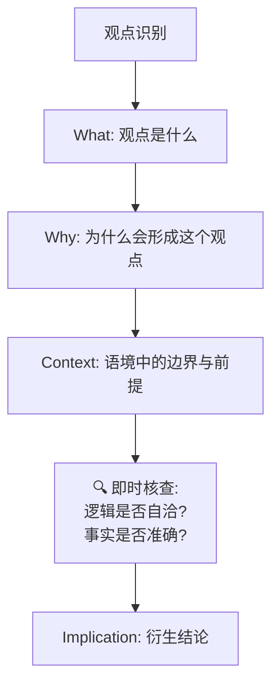
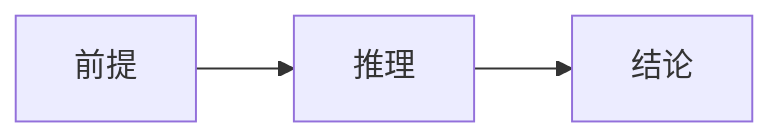
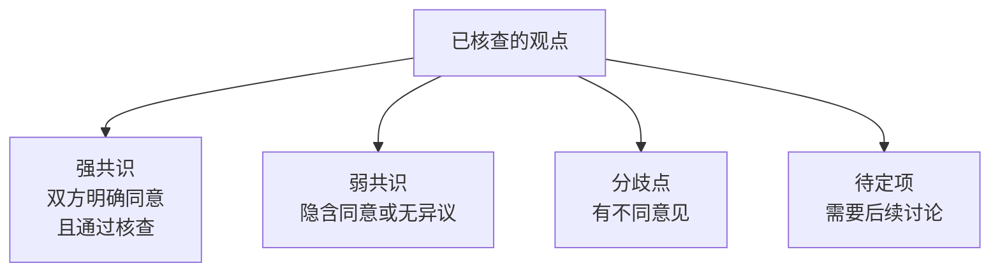
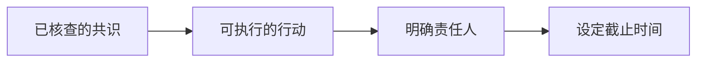

# /distill-discussion 对话提炼工作流

---
description: 从对话录音/文字中提炼核心意图、共识、分歧和待定事项，形成结构化知识文档
---

## 核心原则

> **关键区别:** 这个工作流的目标是**把内容做好**，而不是**把内容记下来**。
> 
> 输出必须是**可独立阅读、逻辑自洽的完整内容**，而非用一二三的要点式（Bullet Points）做简要记录。

**执行标准:**
- 遵守 `_Learn standard.md` 的所有要求
- 每个观点必须**讲完整**: 不仅"是什么"，还要"为什么会形成"，以及"边界与前提"
- 必须配套视觉化表达 (Mermaid / 表格)
- **事实核查贯穿全程**: 在还原每个观点时就进行核查，不是最后才做

---

## 配置文件 (动态引用)

| 文件 | 用途 |
|------|------|
| `Modules/_Learn standard.md` | 执行标准 (字数底线/视觉化要求) |
| `Modules/_TEMPLATE.md` | 文档结构参考 |

**Execution Lock:** 开始工作前必须读取上述文件。

---

## Phase 0: 输入与预处理

**输入方式:**
- 对话录音转录文本
- 会议记录文字
- 口述内容

**预处理动作:**
```
1. 全文阅读/收听素材
2. 识别参与者 (Who said what)
3. 标记关键论点、疑问、共识
4. 计算原文字数 -> 设定输出下限 (30%)
```

---

## Phase 1: 观点还原 + 即时核查 (Deep Reconstruction with Inline Verification)

> **核心变化:** 事实核查不再是单独的步骤，而是**在每个观点还原的同时进行**。

**每个观点必须包含以下维度:**



**单个观点的完整模板:**

---

### 观点: [观点标题]

**内容 (What):**
> [观点的完整陈述，不是摘要，而是完整表达]

**形成原因 (Why):**
[这个观点是如何形成的？基于什么经验、数据、推理？]

**边界与前提 (Context):**
- **适用场景:** [什么情况下这个观点成立]
- **不适用场景:** [什么情况下可能需要修正]
- **隐含假设:** [这个观点背后有什么假设]

**🔍 即时核查 (Inline Verification):**

| 核查项 | 结果 | 说明 |
|--------|------|------|
| 逻辑自洽 | ✅/⚠️ | [是否有矛盾或跳跃] |
| 事实准确 | ✅/⚠️ | [引用的数据/案例是否正确] |
| 完整性 | ✅/⚠️ | [是否遗漏重要反面观点] |

[如有问题，在此处补充真实情况]

**衍生结论 (Implication):**
基于此观点 + 核查结果，可以进一步推导:
- [推论1]
- [推论2]

**逻辑链可视化:**


---

## Phase 2: 共识合成 (Consensus Synthesis)

> **原则:** 共识以内容为主体，不归属到具体个人。

共识从已核查的观点中提取，按强度分类:

**共识分类:**



**输出结构:**

### 强共识 (Verified Consensus)

| 共识内容 | 核查结果 | 衍生方向 |
|----------|----------|----------|
| [内容] | ✅ 逻辑+事实皆通过 | [可推导的结论/行动] |

### 分歧点 (Divergence)

| 分歧内容 | 各方立场 | 分歧原因 | 建议解决方式 |
|----------|----------|----------|--------------|
| [内容] | [A vs B] | [为什么有分歧] | [如何解决] |

---

## Phase 3: 核查总结 (Verification Summary)

> **位置:** 在文档底部提供所有核查的汇总表

**汇总表格式:**

| 观点/共识 | 逻辑核查 | 事实核查 | 需要修正的内容 |
|-----------|----------|----------|----------------|
| [观点1] | ✅/⚠️ | ✅/⚠️ | [无/修正内容] |
| [观点2] | ✅/⚠️ | ✅/⚠️ | [无/修正内容] |
| ... | ... | ... | ... |

**核查统计:**
- 总观点数: X
- 通过核查: Y
- 需要修正: Z
- 修正后确认: W

---

## Phase 4: 行动转化 (Action Derivation)

**从已核查的共识推导行动:**



**行动项格式:**

| 行动 | 来源共识 | 核查状态 | 责任人 | 截止日期 |
|------|----------|----------|--------|----------|
| [做什么] | [基于哪条共识] | ✅ 已核查 | [谁做] | [什么时候] |

---

## Phase 5: 质量检查 (Quality Gate)

**必须检查:**

- [ ] 每个观点是否讲完整了？(What + Why + Context)
- [ ] 每个观点是否有即时核查？
- [ ] 是否有足够的视觉化？(长文档 ≥ 15 个)
- [ ] 底部是否有核查汇总表？
- [ ] 输出字数是否达到原文 30%？

---

## Phase 6: 归档与同步

**归档位置:**
- `/00_Archive/Meeting_Notes/` — 对话记录
- 如果产生了可复用知识 → 同步到对应 Modules

**数据同步:**
- 更新 `_Glossary_Index.json` (如有新术语)
- 更新工作流文件 (如有新流程)

---

## 输出模板

```markdown
# [讨论主题] - 对话提炼

> **日期:** YYYY-MM-DD
> **参与者:** xxx, xxx
> **来源:** 录音/文字/口述
> **原文字数:** X 字
> **输出字数:** Y 字 (比例: Y/X %)

---

## 1. 元认知 (Metacognition)

**讨论背景:**
[这次讨论的背景是什么？为什么会有这次讨论？]

**核心问题:**
[这次讨论要解决什么问题？]

## 2. 观点还原 (Viewpoints with Inline Verification)

### 2.1 [观点1标题]
[What + Why + Context + 🔍即时核查 + 衍生结论 + 可视化]

### 2.2 [观点2标题]
...

## 3. 共识合成 (Verified Consensus)

### 3.1 强共识
[表格，包含核查状态]

### 3.2 分歧点
[表格]

### 3.3 待确认问题
[需要后续讨论的问题]

## 4. 核查汇总 (Verification Summary)

[所有核查的总结表 + 统计]

## 5. 行动转化 (Actions)

[行动项表格，包含核查状态]

## 6. 系统关联 (Interlinkages)

- **输入:** [这次讨论依赖什么前置知识]
- **输出:** [这次讨论影响什么后续模块]

## Glossary (如有新术语)

## 备注与引用
```

---

## 使用方式

```
/distill-discussion [粘贴对话内容或提供文件路径]
```

AI 会按照上述流程将对话转化为可独立阅读、逻辑自洽、**每个观点都经过即时核查**的完整知识文档。
