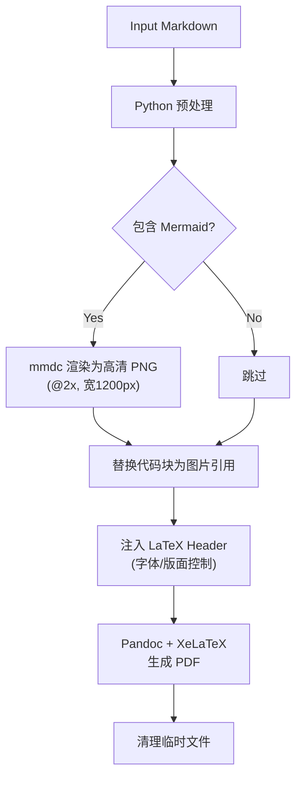

# /export-pdf Markdown转PDF工作流

---
description: 将包含Mermaid图表的Markdown文档转换为PDF，图表自动渲染为图片
---

## 核心价值

不是把文本变成纸，而是把**思考结构**变成可阅读的视觉结构。

**三大自动化控制:**
1. **尺寸控制:** 图表最大高度 ≤ 页面 40%，宽度 ≤ 正文宽度
2. **版面平衡:** 行距 1.5x，段距适中，防止页面过密或过疏
3. **极简依赖:** 仅使用最基础的 LaTeX 包，确保在 TinyTeX 等简易环境下稳定运行

---

## 依赖工具

| 工具 | 用途 | 安装 |
|------|------|------|
| `mmdc` | 渲染 Mermaid 图表 | `npm install -g @mermaid-js/mermaid-cli` |
| `pandoc` | Markdown 转换 | `brew install pandoc` |
| `xelatex` | PDF 引擎 | `brew install --cask mactex-no-gui` (或 TinyTeX) |
| Python 3 | 流程控制 | 系统自带或 `brew install python` |

---

## 使用方式

### 方式1: 直接运行脚本
// turbo
```bash
python3 .agent/scripts/md_to_pdf.py "[markdown文件].md" "[输出文件].pdf"
```

### 方式2: Slash Command
```
/export-pdf [文件路径]
```

---

## 工作流程 (Automated Pipeline)



## 版面设计规范 (Hardcoded in Script)

- **中文字体:** Kaiti SC (楷体) — 适合长文阅读
- **英文字体:** Times New Roman — 经典衬线体
- **代码字体:** Menlo — 等宽清晰
- **行距:** 1.5倍 (LaTeX `\linespread{1.5}`)
- **页边距:** 上 2.5cm / 下 3cm / 左右 2.8cm
- **图表:** `keepaspectratio`，最大高度 40% 页面高度

---

## 脚本位置

```
/.agent/scripts/md_to_pdf.py
```

**提示:** 该脚本已内置 LaTeX Header，无需额外的 `.sty` 文件。
