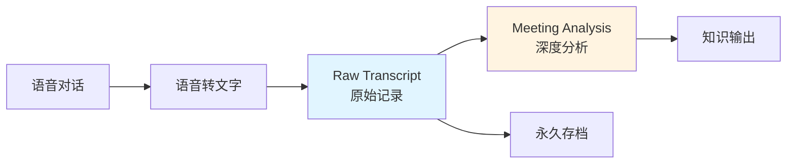

# /raw-transcript - 原始对话记录工作流

> [!NOTE]
> **目的:** 保留完整、原始的对话内容，作为后续深度分析的源数据

## 触发条件
- 手动触发: `/raw-transcript [语音文件路径]`
- 语音转文字完成后自动执行
- 适用场景：会议、访谈、头脑风暴等需要完整记录的对话

---

## 工作流程

### Step 1: 获取原始转写文本
// turbo
```
输入来源可能包括：
1. 语音识别工具输出（如讯飞、腾讯云）
2. 视频会议转写（如Zoom、腾讯会议）
3. 手动提供的文字记录
4. AI语音转文字服务（如Whisper）
```

### Step 2: 基础质量检查
// turbo
检查项：
- [ ] 是否包含明显的识别错误（如"示爱"应为"SM"）
- [ ] 是否缺少标点符号
- [ ] 是否能区分说话人
- [ ] 是否有大段缺失或乱码

### Step 3: 最小化编辑
// turbo
**允许的编辑:**
✅ 纠正明显的语音识别错误
✅ 添加基础标点符号（句号、逗号、问号）
✅ 区分并标注说话人
✅ 添加段落分隔（按话题）

**禁止的编辑:**
❌ 删除口语化表达（如"就是"、"然后"、"这个"）
❌ 调整对话顺序
❌ 删除重复内容
❌ 改写句子结构
❌ 添加分析性内容
❌ 删除看似无关的闲聊

> [!CAUTION]
> **保真原则:** 宁可保留冗余，不可丢失信息。原始记录的价值在于"原始"。

### Step 4: 结构化存储
// turbo
文件命名规范:
```
YYYY-MM-DD_原始对话_参与者1_参与者2.md
示例: 2026-01-23_原始对话_修荷_万达.md
```

文件结构模板:
```markdown
# 原始对话记录

> **日期**: YYYY-MM-DD
> **参与者**: 参与者1、参与者2
> **来源**: 语音转文字工具名
> **转写质量**: ⭐⭐⭐⭐ (X/5)
> **环境**: 描述对话环境
> **时长**: 约 XX 分钟

---

## 📝 编辑说明
[说明本文档的编辑程度和原则]

---

## 对话内容

### [话题标题1]
**说话人A:** [对话内容]
**说话人B:** [对话内容]

### [话题标题2]
...

---

## 备注

### 转写质量说明
- [记录转写过程中的问题]

### 环境信息
- [记录对话环境、音质等]

### 后续处理
- [链接到对应的Meeting_Notes文档]
```

### Step 5: 保存位置
// turbo
```
目标目录: 00_Archive/Raw_Transcripts/
文件格式: Markdown (.md)
编码: UTF-8
```

### Step 6: 创建交叉引用
// turbo
在文档末尾添加：
```markdown
### 后续处理
- ✅ 已创建结构化分析文档：[YYYY-MM-DD_主题.md](../Meeting_Notes/YYYY-MM-DD_主题.md)
```

---

## 质量标准

| 检查项 | 要求 |
|--------|------|
| 说话人区分 | 100% 准确 |
| 对话完整性 | 100% 保留 |
| 口语化保留 | 100% 保留 |
| 识别错误纠正 | 仅纠正明显错误 |
| 时间标注 | 可选（长对话建议添加） |
| 文件命名 | 符合规范 |

---

## 与 Meeting Analysis 的关系



---

## 使用场景

### 适用场景
✅ 需要完整保留对话细节
✅ 可能需要追溯原话
✅ 对话内容会被多次分析
✅ 法律或合规要求保留原始记录

### 不适用场景
❌ 简单的信息交换（无需存档）
❌ 纯文字交流（直接保存聊天记录即可）
❌ 高度敏感信息（需要特殊处理）

---

## 常见问题

### Q1: 如何处理多人对话？
**A:** 使用明确的说话人标记，如 `**张三:**`、`**李四:**`

### Q2: 如何处理听不清的部分？
**A:** 使用 `[听不清]` 或 `[音频不清晰]` 标注

### Q3: 是否需要添加时间戳？
**A:** 对于超过1小时的对话，建议每15-30分钟添加一个时间标记

### Q4: 如何处理非语言信息（如笑声、停顿）？
**A:** 使用方括号标注，如 `[笑]`、`[长时间停顿]`

---

## 执行检查清单

执行 `/raw-transcript` 后，确认：
- [ ] 文件命名符合规范
- [ ] 说话人标记清晰
- [ ] 对话内容完整
- [ ] 保留了口语化表达
- [ ] 添加了元信息（日期、参与者等）
- [ ] 添加了编辑说明
- [ ] 保存到正确目录
- [ ] 创建了交叉引用

---

*版本: v1.0*
*最后更新: 2026-01-23*
