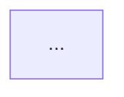
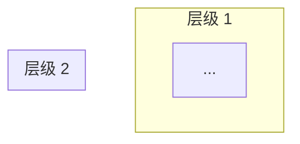

# /synthesize - 知识整合工作流

> **触发方式:** `/synthesize [文档1路径] [文档2路径] ... [输出名称]`
> **示例:** `/synthesize Project_Summary.md Fact_Check_Report.md -> Unified_Knowledge_Document.md`
> **最低输入:** 2 个文档

---

## 核心原则

> [!CAUTION]
> **这不是简单的"合并"，而是"升华"。**
> 输出文档应该比任何单个输入都更有价值。

| 原则 | 描述 |
|:---|:---|
| **第一性原理** | 抛去"谁说了什么"，直接从本质剖析 |
| **知识增密** | 每个概念都有 定义 + 机制 + 案例 |
| **视觉优先** | 复杂关系必须可视化 |
| **引用友好** | 输出格式便于被其他文档引用 |
| **学习材料级** | 读完应该能"教给别人" |

---

## 配置文件引用

> [!IMPORTANT]
> **本工作流依赖以下标准:**

| 文件 | 用途 |
|------|------|
| `_TEMPLATE.md` | 输出文档的基础结构 |
| `_Learn standard.md` | 字数/视觉化数量标准 |
| `/fact-check.md` | 核查格式参考 |

---

## 工作流程

### Phase 0: 预处理

// turbo
```
1. 读取所有输入文档
2. 识别每个文档的:
   - 核心主题
   - 关键论断
   - 已核查的事实
   - 知识点扩展
3. 计算总输入字数 -> 设定输出下限 (输入总和的 80%)
```

---

### Phase 1: 概念抽取与去重

**从所有输入文档中提取:**

| 类型 | 提取方式 |
|:---|:---|
| **核心概念** | 识别所有被定义的术语 |
| **公式/模型** | 识别所有逻辑公式 |
| **案例** | 识别所有具体例子 |
| **金句** | 识别所有标注为重点的引述 |
| **视觉化** | 识别所有已有图表 |

**去重规则:**
- 同一概念在多个文档出现 → 合并为一个，取最完整版本
- 案例重复 → 保留最详细的

---

### Phase 2: 第一性原理重构

> [!IMPORTANT]
> **核心任务:** 把"观点"转化为"知识"

**重构规则:**

```
原文: "某专家说 X 是 Y"
重构为: "X 的本质是 Y，因为 [机制]，表现为 [案例]"
```

**每个核心概念的输出格式:**

```markdown
### [概念名]

〔定义〕
> **[概念名]** 是指 [用一句话定义]

〔本质〕
- **是什么:** ...
- **不是什么:** ...
- **为什么重要:** ...

〔机制〕
1. [第一步/第一层]
2. [第二步/第二层]
3. ...

〔可视化〕


〔案例〕

**案例 1: [标题]**
- 背景: ...
- 过程: ...
- 结果: ...
- 关联: ...

**案例 2: [标题]**
- ...

〔边界〕
- **适用场景:** ...
- **不适用场景:** ...
- **常见误用:** ...

〔金句〕
> "..." — [来源]
```

---

### Phase 3: 逻辑链构建

**识别并可视化概念之间的关系:**

| 关系类型 | 表示方式 |
|:---|:---|
| A 导致 B | `A -->|causes| B` |
| A 是 B 的一部分 | `A -->|part_of| B` |
| A 与 B 相互作用 | `A <-->|interacts| B` |
| A 支持 B | `A -.->|supports| B` |
| A 与 B 是对立面 | `A ---|opposite| B` |

**输出: 整体逻辑链图谱**

```markdown
## 核心逻辑链


```

---

### Phase 4: 金句解构

> [!IMPORTANT]
> **金句不是装饰，而是浓缩的知识。**
> 每个金句都必须被"拆开"。

**金句解构格式:**

```markdown
### 金句 [编号]: "[原文]"

〔表层含义〕
> 这句话字面上在说...

〔深层逻辑〕
- **核心论断:** ...
- **隐含假设:** ...
- **推导过程:** ...

〔应用场景〕
- 当你遇到 [情况] 时，可以用这个原则来 [行动]

〔反例〕
- 这句话在 [情况] 下不成立，因为...
```

---

### Phase 5: Anti-Patterns 汇总

**从所有输入文档中提取"坑"和"错误做法":**

```markdown
## 反模式清单

| # | 陷阱 | 心理机制 | 正确做法 | 案例 |
|---|------|----------|---------|------|
| 1 | ... | ... | ... | ... |
| 2 | ... | ... | ... | ... |
```

---

### Phase 6: 术语表与公式表

// turbo

**Glossary 格式:**

```markdown
## 术语表

| 术语 | 英文 | 定义 | 来源模块 |
|:---|:---|:---|:---|
| 注意力经济 | Attention Economics | ... | A层知识点 |
```

**Formula Table 格式:**

```markdown
## 公式表

| 公式名 | 表达式 | 变量定义 | 适用场景 |
|:---|:---|:---|:---|
| 内容价值公式 | `价值 = 不可替代性 × 放大效率` | ... | ... |
```

---

### Phase 7: 视觉化质检

**检查并补充视觉化:**

| 文档长度 | 最低视觉化数量 |
|---------|---------------|
| < 3000 字 | 10+ |
| 3000-8000 字 | 15+ |
| > 8000 字 | 20+ |

**视觉化类型分布:**
- 流程图: ≥ 30%
- 关系图: ≥ 30%
- 表格: ≥ 20%
- 其他 (对比图/时间线等): ≥ 10%

---

### Phase 8: 输出结构

**最终文档结构:**

```markdown
# [主题名] - 知识整合文档

> **整合来源:** [列出所有输入文档]
> **整合时间:** YYYY-MM-DD
> **总字数:** [X 字]
> **视觉化:** [Y 个]

---

## 导读 (Executive Summary)
[3-5 句话概括全文核心]

---

## 核心逻辑链
[整体架构可视化]

---

## 核心概念详解
[按第一性原理重构的概念]

---

## 金句解构
[每个金句的深度拆解]

---

## 反模式清单
[所有"坑"]

---

## 术语表
[Glossary]

---

## 公式表
[Formula Table]

---

## 被忽略的维度
[从 fact-check 中提取]

---

## 开放问题
[尚未解决的问题]

---

## 附录: 原始来源
[列出所有输入文档及其关键贡献]
```

---

### Phase 9: 质量门控

**必须通过以下检查:**

| 检查项 | 标准 |
|:---|:---|
| 字数 | ≥ 输入总和的 80% |
| 视觉化 | ≥ 最低数量要求 |
| 概念完整性 | 每个核心概念都有完整解构 |
| 金句解构 | 每个金句都被拆开 |
| 引用格式 | 所有术语可被其他文档引用 |

---

## 输出位置

**默认规则:**
- 如果输入来自同一模块 → 输出到同一模块
- 如果输入跨模块 → 输出到 `00_Archive` 或创建新模块

---

## 示例调用

```
/synthesize 
  Content_Creation_OS_Project_Summary.md 
  Content_Creation_OS_Fact_Check_Report.md 
  -> Content_Creation_OS_Unified_Knowledge.md
```

**预期输出:**
- 完整的学习材料
- 可被 3D 图谱索引
- 可被其他模块引用
- 读完即可"教给别人"
