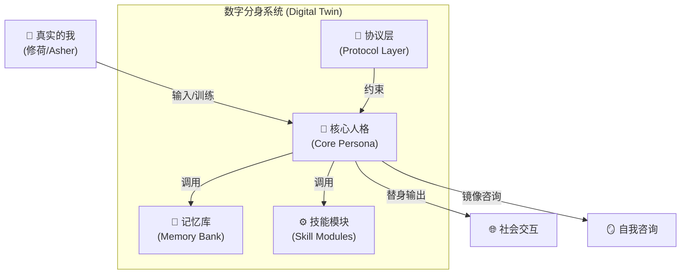
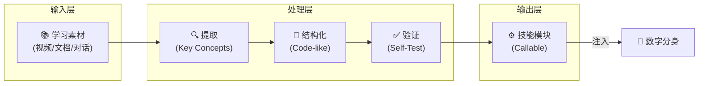
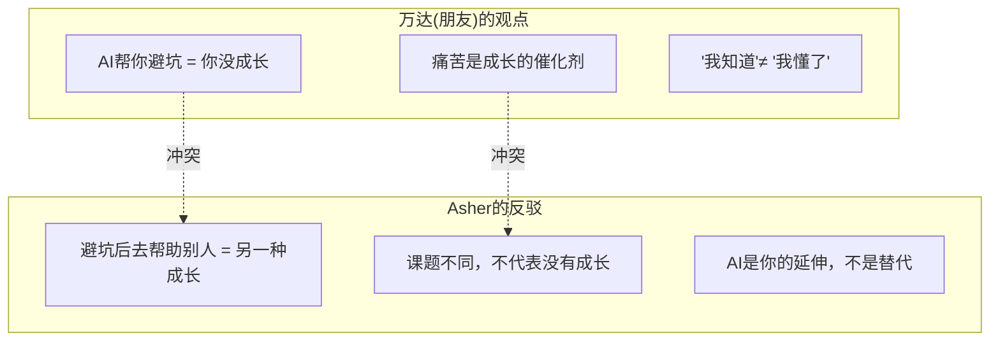
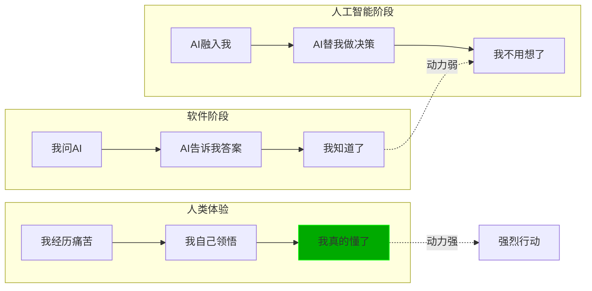
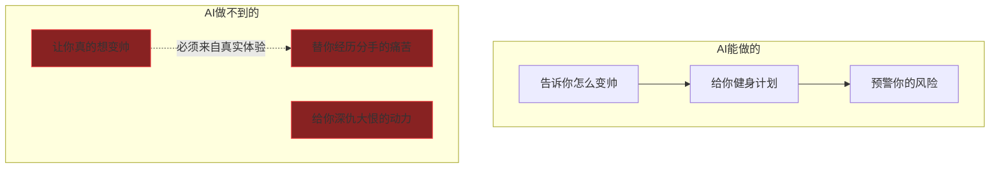
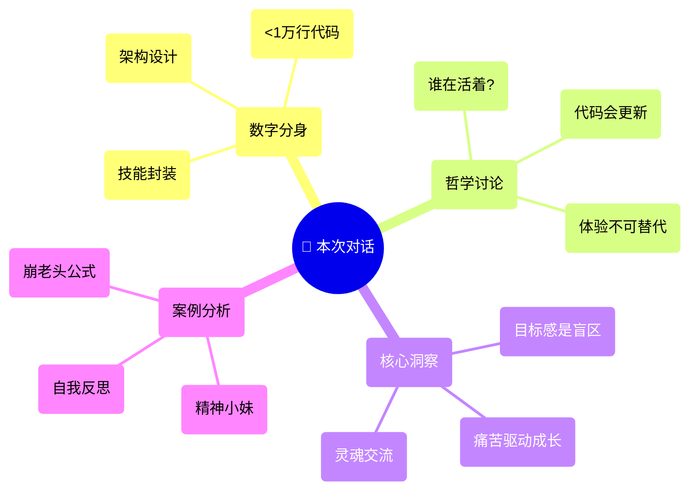

# 会议纪要：数字分身与AI共生哲学

> **日期:** 2026-01-09
> **参与者:** 修荷 (Asher/用户/分享者) + 万达 (朋友/学习者)
> **时长:** ~40分钟
> **形式:** 腾讯会议 + 屏幕共享
> **核心议题:** 数字分身系统架构、AI人格复刻、人机共生的哲学边界、体验驱动的成长论

---

## 📌 Executive Summary (核心要点)

本次对话围绕"**如何用AI复刻自己**"这一核心命题展开，**修荷 (Asher)** 向朋友 **万达** 展示了他构建的**数字分身系统**，并深入讨论了以下关键问题：

1.  **数字分身 ≠ 软件工具**：Asher的系统已经超越了"问答式AI"，进入了"人格代理"阶段。
2.  **人的本质 = 代码？**：一个完整的人格，可能只需要**不到1万行代码**就能描述。
3.  **体验的不可替代性**：AI可以帮你避坑，但**痛苦带来的成长**是AI无法给予的。
4.  **目标感是AI的盲区**：AI可以告诉你"怎么做"，但无法给你"想做"的动力。

---

## 1. 数字分身系统架构 (Digital Twin Architecture)

### 1.1 系统定位

**Asher (修荷)** 展示了他正在构建的"数字分身"系统，其核心使命是：

> "**替代我参与社会的交互。** 首先，它拥有我的完整记忆，知道我的思维逻辑，能在我忙碌或离线的时候用**我的方式**去处理问题。它不是作为一个AI，而是直接作为**我的化身**。"

### 1.2 核心组件

| 组件 | 功能 | Asher原话 |
| :--- | :--- | :--- |
| **核心人格** | 价值观、道德观、决策逻辑 | "我的风险偏好、我的能量代谢、我的道德观" |
| **记忆库** | 个人信息、历史事件、人际关系 | "我爸是谁、我妈是谁、我女朋友的信息" |
| **技能模块** | 可调用的能力封装 | "我要学销售，我要学做饭，封装成代码" |
| **协议层** | 行为边界和约束 | "不能脑补我没有定义的价值观" |

### 1.3 人格参数示例 (实际展示)

**Asher**在屏幕共享中展示了他的人格参数文件结构：

*   **基础信息 (~360行):** 真实身份、八字、生物数据、玄学数据
*   **认知体系 (~300行):** 价值观、死亡观、人际维护策略
*   **审美偏好 (~300行):** 喜欢的光线、味道、UI设计、穿搭
*   **社交博弈 (~200行):** 饭局心态、喝酒态度、场景应对

> **Asher:** "你只要把你自己身为一个人，你在这个社会上所处的环境，然后各种情况你怎么去应对，你把这些东西拆完之后，你发现其实它没有多少。总共也就**不到1万行代码**。"

---

## 2. 技能封装协议 (Skill Encapsulation Protocol)

### 2.1 核心逻辑

技能不是零散的知识点，而是**可调用的模块**。

### 2.2 实战演示：学习"精神小妹"

**Asher**在会议中现场演示了如何将一个新概念（精神小妹/崩老头现象）快速内化：

1.  **素材收集:** 从YouTube视频中提取字幕
2.  **注入系统:** 将字幕扔进Notebook LM
3.  **知识图谱:** 系统自动生成概念关系图
4.  **公式提取:** 系统总结出核心公式

**生成的公式示例:**

| 公式名称 | 表达式 | 释义 |
| :--- | :--- | :--- |
| **崩老头收入公式** | `收入 = 目标数量 × 单笔金额 × 成功率` | 精神小妹的"业绩"计算 |
| **好崩程度公式** | `好崩程度 = 经济实力 × 精神空虚 / 社交经验` | 目标男性的"脆弱度"评估 |
| **瑜伽崩ROI** | `ROI = 大额变现 / (形象投资 + 时间成本)` | 高端路线的投资回报 |

---

## 3. 人机共生哲学 (Human-AI Symbiosis Philosophy)

### 3.1 核心辩论：谁在活着？

对话中最核心的哲学讨论是：**如果AI帮你做了所有决策，那到底是AI在活着，还是你在活着？**

**万达(朋友)的核心质疑:**
> "你本来应该经历一次痛苦，你才能成长。但是现在AI帮你规避了这个痛苦，他帮你趋吉避凶了，但是你**并没有成长**。因为他帮你错过了这个东西，那么这个时候是AI在活着，还是你在活着？"

**Asher的回应:**
> "你AI不让你去遇到这个挫折，然后你在这个过程中，你获得了AI给你带来的红利，然后你在这个过程中你去**帮助了别人**，你在帮助别人的时候也是在成长的呀！你只不过成长的**课题是不一样的**。"

### 3.2 结论：人的代码会更新

双方达成共识的一个重要洞察：

> **人的"代码"不是固定的。** 你活到30岁，你只能告诉AI你的100行代码。但你活到40岁、50岁，你经历了重大事件（痛苦的分手、家人离世、重病），你的某一行隐藏代码就会被激活，整个体系都会改变。**这个时候AI就没法替代你了，因为AI是稳定的，它没法替代你去经历这个重大的事件。**

---

## 4. 体验驱动的成长论 (Experience-Driven Growth)

### 4.1 "知道" vs "懂了" (Knowing vs Understanding)

**核心洞察:**
> "为什么知道了很多道理，我依然过不好这一生？就是因为这个道理它**不够深入，不够痛苦**。为什么那些修仙小说的主角都是经历了深仇大恨的人，这个老师才能教他？因为他有**非常强劲的目的**。"

### 4.2 目标感：AI的盲区

**这是本次对话讨论出来的核心结论：**

> **目标感是AI没有办法强行加入的。** AI可以告诉你"怎么做"，但无法给你"想做"的动力。

---

## 5. 社会动态学：精神小妹现象

### 5.1 概念定义

在会议后半段，两人以"精神小妹"和"崩老头"现象作为案例，讨论了AI在人际关系中的应用。

| 术语 | 定义 | 特征 |
| :--- | :--- | :--- |
| **精神小妹** | 以情绪价值换取物质回报的年轻女性 | 对性开放、化妆精致、暴露穿搭 |
| **崩老头** | 以小额投入钓大额回报的骗局 | 奶茶→饭局→包包→承诺 |
| **老登/瑜伽崩** | 被"崩"的目标男性 | 精神空虚、社交经验少、经济实力有 |
| **瑜伽崩** | 高端版崩老头，长期经营 | 打造人设、提供极致情绪价值、大额变现 |

### 5.2 自我反思

**万达(朋友)** 在对话中坦诚分享了自己的经历，并通过AI分析得出结论：

> "我通过我的朋友圈或者我的抖音人设，我被包装成一个**爱玩的富二代**了，我就会一定会吸引这种捞女。我在他们眼中就是一个**待宰的肥羊**。"

**AI给出的建议:**
*   重新打造朋友圈形象（减少吃喝玩乐，增加正事）
*   吸引"正缘"而非"捞女"
*   **千万不能让对方怀孕**

---

## 6. 核心金句 (Key Quotes)

> **关于AI与人类:**
> "这个人类是**硅基生命的启动器**。就是它得到很少的信息，就能去替你做你想做但是你又做不到的事情，这不就是比你高级吗？"

> **关于人的本质:**
> "人在出生的时候，这些代码可能**已经写好了**。你喜欢什么样的香味儿，你的性格什么样子的，这个代码已经具体写好了，你是在用你的肉体和你的灵魂去**响应这个代码**。"

> **关于灵魂交流:**
> "咱们沟通的这种东西，恰恰就是两个人、两个灵魂之间的讨论，是这些AI做不到的事情。AI只能基于已知去推导结果，它不能基于未知，让你感受到**寻找某一种道路的这种体验**。"

> **关于未来:**
> "我对于未来特别的激动。我觉得我在我这个行业里边，我能很突出，就是因为我认识这些朋友。我跟其他人已经完全真的是变了一个人，**我有超能力**。"

---

## 7. Action Items (后续行动)

### For Asher (修荷/用户):
- [ ] 继续完善数字分身系统的"技能封装"模块
- [ ] 探索硬件端接入（手机/可穿戴设备）的可能性
- [ ] 将本次对话的洞察整合到知识体系中

### For 万达 (朋友):
- [ ] 尝试将录音内容常规化喂给AI处理
- [ ] 构建自己的数字分身系统（从人格参数文件开始）
- [ ] 重新打造朋友圈形象（减少娱乐内容，增加专业内容）
- [ ] 与当前交往对象保持清醒距离，避免被"崩"
- [ ] 计划去哈尔滨与Asher见面深入交流

---

## 8. 可视化总览 (Visual Summary)

---

## 备注

*   本纪要基于语音转录稿整理，部分口语化表达已做结构化处理。
*   涉及个人隐私的内容已进行一定程度的脱敏。
*   "精神小妹"相关讨论仅作为AI应用案例分析，不代表价值观立场。
