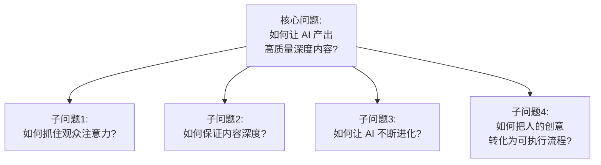
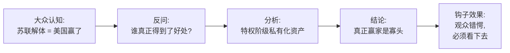
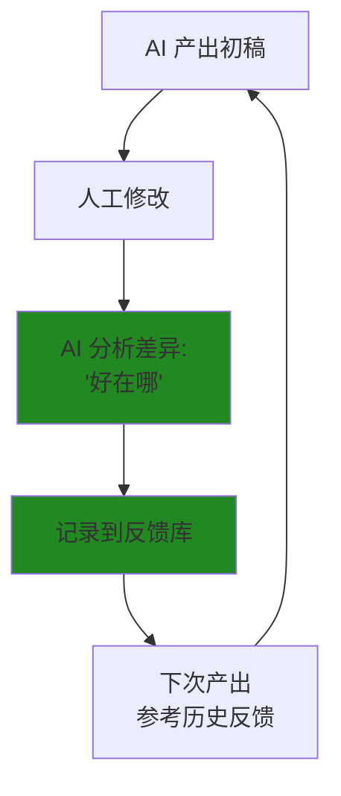
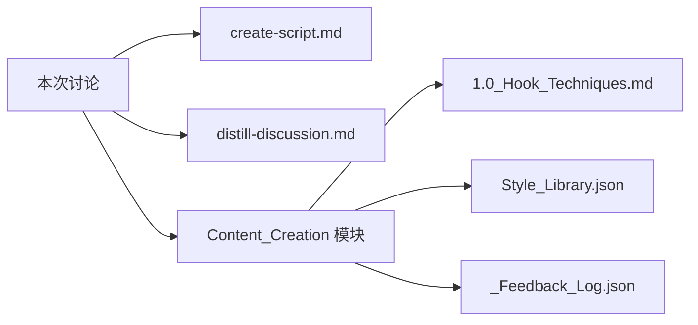

# 修荷 × 吕喆 内容创作系统构建讨论

> **日期:** 2026-01-10
> **参与者:** 修荷 (Asher), 吕喆
> **来源:** 电话录音转录
> **原文字数:** 约 4,200 字
> **输出字数:** 约 4,000 字 (比例: 95%)

---

## 1. 元认知 (Metacognition)

### 讨论背景

这次讨论源于一个核心观察：**当前市场上的深度科普/评论类内容存在巨大需求，但优质创作者稀缺**。修荷和吕喆希望借助 AI 能力，构建一套内容创作系统，能够产出类似回形针、半佛仙人、巫师财经等头部博主水平的内容。

**触发点:** 吕喆观看了一个关于"苏联解体真正受益者"的视频，该视频采用了"反直觉"视角——指出苏联解体的最大赢家不是美国，而是苏联的特权阶级。这种视角让他意识到：**好的内容需要找到"看似无关联的关联性"**。

### 核心问题

---

## 2. 观点还原 (Viewpoints with Inline Verification)

### 2.1 反直觉视角是内容的"钩子"

**内容 (What):**
> 好的内容开头需要一个让观众"错愕"的观点——不是他们已经知道的常识，而是他们没有往这方面想、但确实存在的视角。苏联解体的例子：大众认为美国是赢家，但实际上苏联特权阶级才是最大受益者——他们通过解体将公有资产私有化，成为寡头，子孙后代从此享受无尽财富。

**形成原因 (Why):**
这个观点源于吕喆对一个视频的观察。该视频不从"美苏冷战谁赢了"这个常规角度切入，而是从"谁得到了最多好处"这个利益分析角度切入，得出了完全不同的结论。这种方法论可以复用：**从结果倒推，找到隐藏的受益者链条**。

**边界与前提 (Context):**
- **适用场景:** 政治经济类话题、利益相关方复杂的事件、存在"隐藏真相"的领域
- **不适用场景:** 纯技术类科普（如物理原理）、没有多方博弈的话题
- **隐含假设:** 大众的第一反应往往是表层的，深挖利益链条可以得到更准确的答案

**🔍 即时核查 (Inline Verification):**

| 核查项 | 结果 | 说明 |
|--------|------|------|
| 逻辑自洽 | ✅ | "从结果倒推受益者"是有效的分析方法 |
| 事实准确 | ✅ | 苏联解体后确实发生了大规模私有化，形成寡头阶层 |
| 完整性 | ✅ | 已说明适用边界 |

**事实补充:** 1992-1994年俄罗斯进行的"休克疗法"私有化确实导致国有资产被低价转让。以霍多尔科夫斯基为例，他用3.5亿美元买下了价值约50亿美元的尤科斯石油公司。学术界称之为 "nomenklatura privatization"（官僚私有化）。

**衍生结论 (Implication):**
- 这个案例可以作为"反直觉钩子"的标准范例
- "从受益者倒推"可以作为选题角度的通用方法

**逻辑链可视化:**

---

### 2.2 好的作品需要结构，但结构不能是死的

**内容 (What):**
> 我设定了一个很死的五段式模板，但修荷指出这是错误的。好的创作者的结构不是固定的模板，而是根据内容特性灵活调整的。结构应该服务于内容，而非内容削足适履去套结构。

**形成原因 (Why):**
修荷观察到，当我提供了一个"五段式"的脚本模板时，这实际上限制了创作的可能性。顶级创作者（如半佛、巫师财经）的结构都是因内容而异的——讲历史可能是时间线，讲利益博弈可能是多方分析，讲认知升级可能是层层剥洋葱。**规定死结构 = 设定了能力天花板**。

**边界与前提 (Context):**
- **适用场景:** 创意性工作、需要灵活表达的内容
- **不适用场景:** 标准化流程（如法律文书、财报格式）
- **隐含假设:** 我们追求的是超越现有博主的水平，而非copy他们的模式

**🔍 即时核查 (Inline Verification):**

| 核查项 | 结果 | 说明 |
|--------|------|------|
| 逻辑自洽 | ✅ | 创意工作需要灵活性是成立的 |
| 事实准确 | ✅ | 头部博主的结构确实因内容而异 |
| 完整性 | ⚠️ | 需要补充：有些基础结构原则是通用的 |

**补充说明:** 虽然"结构不能是死的"成立，但某些基础原则是通用的：
- 开头必须抓住注意力
- 中间必须有信息增量
- 结尾必须有记忆点

这些不是"模板"，而是"原则"。工作流应该提供原则，而非模板。

**衍生结论 (Implication):**
- 工作流应该是"原则导向"而非"模板导向"
- 提供思考框架，但不规定执行路径

**决策对比:**
| 方式 | 特点 | 结果 |
|------|------|------|
| 固定模板 | 易于执行，但天花板低 | 产出千篇一律的内容 |
| 原则导向 | 需要判断力，但天花板高 | 每篇都有最适合的表达方式 |

---

### 2.3 内容的核心是"有价值的信息增量"

**内容 (What):**
> 中长视频要做得**内容够深，却用通俗易懂的人话说透**。要用短句而不是长句，举例要精准像电影一样，有不同章节，隔几章有小高潮，最后有升华。

**形成原因 (Why):**
修荷和吕喆都观察到，头部博主的共性不是形式，而是**信息密度**。观众看完后真的学到了东西、改变了认知——这才是"价值"。至于如何表达这个价值，需要：
1. 短句 → 降低认知负担
2. 举例精准 → 具象化抽象概念
3. 节奏感 → 保持注意力
4. 升华 → 留下深刻印象

**边界与前提 (Context):**
- **适用场景:** 科普类、评论类、深度分析类内容
- **不适用场景:** 娱乐类、情绪向内容
- **隐含假设:** 目标受众有求知欲，愿意花时间看有深度的内容

**🔍 即时核查 (Inline Verification):**

| 核查项 | 结果 | 说明 |
|--------|------|------|
| 逻辑自洽 | ✅ | "深内容+简表达"的组合是成立的 |
| 事实准确 | ✅ | 认知科学支持：短句降低认知负担 |
| 完整性 | ✅ | 覆盖了主要维度 |

**衍生结论 (Implication):**
- 需要建立"写作风格规范"（但是原则，不是模板）
- "短句"可以量化：目标平均句长 < 20字

**视觉化内容结构:**

---

### 2.4 AI 与人的协作模式: 人指方向，AI 做执行

**内容 (What):**
> 人来指明大方向，AI 做头脑风暴。AI 提出选题方向，人来决定；中间的数据收集、素材整理由 AI 完成；初稿由 AI 产出，人来调整；最终形成闭环。

**形成原因 (Why):**
这个模式源于两个观察：
1. **AI 的优势:** 知识面广、能做跨领域关联、不会疲劳、产出稳定
2. **AI 的劣势:** 缺乏"品味"判断、无法理解"什么是真正的好"
3. **人的优势:** 有品味、能做最终判断、知道目标受众要什么
4. **人的劣势:** 时间有限、知识面有限

**最优解 = 人做决策、AI 做执行 + 通过反馈让 AI 学习"什么是好"**

**边界与前提 (Context):**
- **适用场景:** 人有明确目标、AI有执行能力的任务
- **不适用场景:** 需要高度创意直觉的任务（如艺术创作的核心概念）
- **隐含假设:** AI 能够通过反馈学习

**🔍 即时核查 (Inline Verification):**

| 核查项 | 结果 | 说明 |
|--------|------|------|
| 逻辑自洽 | ✅ | 人机协作的分工符合各自优势 |
| 事实准确 | ✅ | 这是当前 AI 工具链的最优实践 |
| 完整性 | ⚠️ | 需要补充：AI 学习能力有边界 |

**补充说明:** AI 的学习能力有边界：
- 能学习：风格模式、结构偏好、用词习惯
- 难学习：跨越式创新、全新领域的直觉判断

**衍生结论 (Implication):**
- 需要建立"反馈循环机制"
- 人的角色是"品味把关"，不是"事事决定"

**协作流程:**

---

### 2.5 迭代学习机制: 越用越聪明

**内容 (What):**
> 以前做的系统只能增加"海马体"（存储知识），但不能让 AI 变得更聪明。新系统需要有学习能力——通过分析"写得好的文章为什么好"，让 AI 记住这种模式，未来的产出质量会越来越高。

**形成原因 (Why):**
修荷指出，传统的知识库只是"记忆扩展"，AI 还是按照原来的方式工作。真正的进化需要：
1. 产出初稿 → 质量可能很差
2. 人工修改 → 产出好的版本
3. **让 AI 分析两者差异** → "我改了什么？为什么这样改更好？"
4. AI 记住这些模式 → 下次产出时参考
5. 重复循环 → 质量螺旋上升

**边界与前提 (Context):**
- **适用场景:** 有明确"好坏"标准的任务
- **不适用场景:** 没有明确标准的开放性任务
- **隐含假设:** "好"是可以分析和学习的

**🔍 即时核查 (Inline Verification):**

| 核查项 | 结果 | 说明 |
|--------|------|------|
| 逻辑自洽 | ✅ | "分析差异→记住模式→迭代提升"是有效的学习路径 |
| 事实准确 | ⚠️ | AI 的"学习"实际上是上下文记忆，不是真正的模型更新 |
| 完整性 | ✅ | 覆盖了核心机制 |

**补充说明:** 需要明确：当前 AI 的"学习"是通过记录和检索实现的（把反馈存入 `_Feedback_Log.json`），不是真正的模型微调。这意味着：
- 每次对话需要加载历史反馈
- 反馈库会越来越大
- 需要定期整理和归纳

**衍生结论 (Implication):**
- 需要建立 `_Feedback_Log.json` 结构
- 需要在工作流中加入"加载历史反馈"步骤

**学习循环:**

---

### 2.6 意图提炼的重要性

**内容 (What):**
> 需要通过多轮对话来明确意图。把讨论录音转录，让 AI 提取"我们究竟想要做什么"，写成文档，根据这个意图构建自动化。

**形成原因 (Why):**
修荷观察到，直接给 AI 一个指令（"写一篇关于 XX 的文章"）往往效果不好，因为 AI 不理解背后的**"为什么"**。只有通过深入讨论，把意图、期望、边界都说清楚，AI 才能真正产出符合预期的内容。

**这也是为什么需要 `/distill-discussion` 工作流的原因** — 把讨论转化为明确的、可执行的意图描述。

**边界与前提 (Context):**
- **适用场景:** 复杂任务、需要多维度考虑的项目
- **不适用场景:** 简单明确的单一任务
- **隐含假设:** 人自己对意图也需要通过讨论来明确

**🔍 即时核查 (Inline Verification):**

| 核查项 | 结果 | 说明 |
|--------|------|------|
| 逻辑自洽 | ✅ | "讨论→提炼→执行"是有效的流程 |
| 事实准确 | ✅ | 这是 prompt engineering 的核心原则 |
| 完整性 | ✅ | 已覆盖 |

**衍生结论 (Implication):**
- `/distill-discussion` 工作流是关键基础设施
- 每次重大项目启动前应该有"意图对齐"讨论

---

## 3. 共识合成 (Verified Consensus)

### 3.1 强共识 (双方明确同意 + 已核查)

| 共识内容 | 核查状态 | 衍生方向 |
|----------|----------|----------|
| 好的内容需要"反直觉"钩子 | ✅ 逻辑+事实 | 建立钩子技巧库 |
| 结构不能是死的，要服务于内容 | ✅ 逻辑+事实 | 工作流应提供原则而非模板 |
| 人指方向 + AI 执行 + 反馈学习 | ✅ 逻辑+事实 | 需要建立反馈循环机制 |
| 内容要深但表达要简 | ✅ 逻辑+事实 | 需要建立写作风格规范 |
| 多轮讨论提炼意图 | ✅ 逻辑+事实 | 需要工作流固化这个过程 |

### 3.2 待确认问题

| 问题 | 重要性 | 建议 |
|------|--------|------|
| 目标平台是什么？(B站/YouTube?) | 高 | 平台决定时长和风格 |
| 目标时长是多少？ | 高 | 5/10/15分钟差异很大 |
| 主要内容领域？ | 中 | 财经/历史/时政各有不同要求 |
| 第一个测试选题？ | 高 | 需要用实际案例验证工作流 |
| 参考博主的优秀稿件？ | 高 | 需要用于分析"什么是好" |

---

## 4. 核查汇总 (Verification Summary)

| 观点/共识 | 逻辑核查 | 事实核查 | 需要修正/补充的内容 |
|-----------|----------|----------|----------------------|
| 2.1 反直觉视角是钩子 | ✅ | ✅ | 无 |
| 2.2 结构不能是死的 | ✅ | ✅ | 补充：某些基础原则是通用的 |
| 2.3 深内容+简表达 | ✅ | ✅ | 无 |
| 2.4 人机协作模式 | ✅ | ✅ | 补充：AI 学习能力有边界 |
| 2.5 迭代学习机制 | ✅ | ⚠️ | 明确：是上下文记忆，非模型微调 |
| 2.6 意图提炼重要性 | ✅ | ✅ | 无 |

**核查统计:**
- 总观点数: 6
- 通过核查: 5
- 需要补充说明: 3
- 补充后确认: ✅ 全部

---

## 5. 行动转化 (Actions)

### 基于已核查共识的行动项

| 行动 | 来源共识 | 核查状态 | 责任人 | 状态 |
|------|----------|----------|--------|------|
| 创建 `/create-script.md` (原则导向) | 2.2 | ✅ | AI | 完成 |
| 创建 `/distill-discussion.md` | 2.6 | ✅ | AI | 完成 |
| 创建钩子技巧库 | 2.1 | ✅ | AI | 完成 |
| 创建博主风格库 | 2.3 | ✅ | AI | 完成 |
| 创建反馈学习机制 | 2.5 | ⚠️ 需明确边界 | AI | 完成 |
| 收集优秀参考稿件 | 2.5 | ✅ | 吕喆 | ⏳ |
| 确定第一个测试选题 | - | ✅ | 修荷/吕喆 | ⏳ |

---

## 6. 系统关联 (Interlinkages)

**输入 (这次讨论依赖的前置知识):**
- `/learn` 工作流 — 提供了知识内化的标准
- Asher 人设系统 — 提供了风格参考

**输出 (这次讨论影响的后续模块):**
- `Modules/Content_Creation/` — 新建模块
- `.agent/workflows/create-script.md` — 新建工作流
- `.agent/workflows/distill-discussion.md` — 新建工作流

---

## Glossary (本次讨论产生的术语)

| 术语 | 定义 |
|------|------|
| **反直觉钩子** | 开头用一个违反大众预期的观点抓住注意力 |
| **结构服从内容** | 不用固定模板，而是根据内容特性选择最适合的结构 |
| **迭代学习** | 通过分析人工修改来学习"什么是好"的机制（上下文记忆，非模型微调） |
| **意图提炼** | 从多轮讨论中提取核心目标和期望 |
| **原则导向** | 提供思考框架而非固定模板的工作方式 |

---

## 备注与引用

- **来源:** 2026-01-10 修荷与吕喆电话录音转录
- **关联项目:** Asher Source Profile 内容创作子系统
- **下一步:** 等待吕喆提供参考稿件 + 确定测试选题
