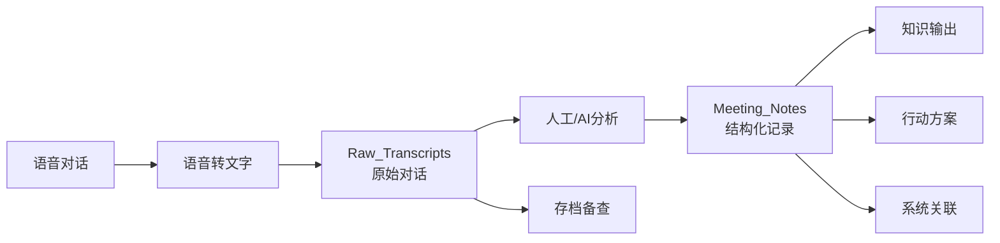

# 00_Archive 档案结构说明

## 📁 文件夹维度划分

### 1. Meeting_Notes (会议梳理内容)
**用途**: 存放经过深度分析和结构化处理的会议记录

**特点**:
- ✅ 高度结构化
- ✅ 包含元认知分析
- ✅ 观点还原与事实核查
- ✅ 维度梳理与共识达成
- ✅ 可直接作为知识输出使用

**命名规范**: `YYYY-MM-DD_参与者_主题.md`

**示例**:
```
2026-01-23_修荷_万达_AI思想与书籍创作讨论.md
2026-01-18_飞升讨论_AI时代升维与社会转型.md
```

**文档结构** (标准模板):
1. 元信息 (日期、参与者、字数、时长)
2. 共识清单 (强共识、待确认、分歧点)
3. 元认知 (背景、核心问题、讨论脉络)
4. 观点还原 (每个核心观点的详细分析)
5. 事实核查 (引用验证)
6. 维度梳理 (讨论的各个维度)
7. 最终共识与行动方案
8. 系统关联
9. 术语表
10. 元数据

---

### 2. Raw_Transcripts (原始对话内容)
**用途**: 存放未经深度处理的原始语音转文字内容

**特点**:
- ✅ 保留完整对话流
- ✅ 最小化编辑（仅纠正明显错误）
- ✅ 保留口语化表达
- ✅ 作为 Meeting_Notes 的源数据

**命名规范**: `YYYY-MM-DD_原始对话_参与者.md`

**示例**:
```
2026-01-23_原始对话_修荷_万达.md
```

**文档结构** (标准模板):
1. 元信息 (日期、参与者、来源)
2. 对话内容 (按说话人分段)
3. 备注 (记录转写质量、环境等)

---

## 🔄 工作流程关系



---

## 📊 两种维度的对比

| 维度 | Raw_Transcripts | Meeting_Notes |
|------|----------------|---------------|
| **目的** | 保留原始信息 | 提取价值与洞察 |
| **编辑程度** | 最小化 | 高度结构化 |
| **可读性** | 口语化 | 专业化 |
| **使用场景** | 追溯原话、核查细节 | 复盘、知识管理、对外分享 |
| **时间投入** | 低 (1-2h) | 高 (4-8h) |
| **字数比例** | 100% | 80-120% (增加分析内容) |

---

## 🛠️ 相关 Workflows

### Meeting Analysis Workflow
- **触发**: 新的语音对话需要分析
- **输入**: Raw_Transcripts 原始对话
- **输出**: Meeting_Notes 结构化记录
- **工具**: AI 辅助分析、事实核查、维度梳理

### Raw Transcript Recording Workflow
- **触发**: 语音转文字完成
- **输入**: 原始转写文本
- **输出**: Raw_Transcripts MD 文档
- **工具**: 语音识别、基础纠错

详见: `/Users/yixuanzhang/Library/Mobile Documents/com~apple~CloudDocs/工作/修荷/Asher_Source_Profile_v1.agent/workflows/meeting-analysis.md` 和 `raw-transcript-recording.md`

---

## 📝 使用建议

### 何时查看 Raw_Transcripts?
- ✅ 需要核查某人的原话
- ✅ 对 Meeting_Notes 中的观点有疑问
- ✅ 需要找回被精简掉的细节
- ✅ 研究对话的自然流动

### 何时查看 Meeting_Notes?
- ✅ 快速复盘会议要点
- ✅ 提取行动方案
- ✅ 引用观点和共识
- ✅ 对外分享（去除口语化内容）

---

## 🗂️ 文件管理规则

1. **每次对话必须同时生成两个文档**：
   - Raw_Transcripts 中的原始记录
   - Meeting_Notes 中的结构化分析

2. **文件名日期必须一致**：
   - 便于对应查找

3. **定期归档**：
   - 每季度将超过 3 个月的记录移入子文件夹

4. **索引维护**：
   - 重要讨论在此 README 中添加快速索引

---

## 📌 重要讨论快速索引

| 日期 | 主题 | 参与者 | 关键词 |
|------|------|--------|--------|
| 2026-01-23 | AI思想与书籍创作 | 修荷、万达 | 书籍策略、道vs术、精英受众、记录数据化 |
| 2026-01-18 | AI时代升维与社会转型 | 修荷、万达 | 飞升、社会阶层、去中心化、领袖本质 |

---

*最后更新: 2026-01-23*
