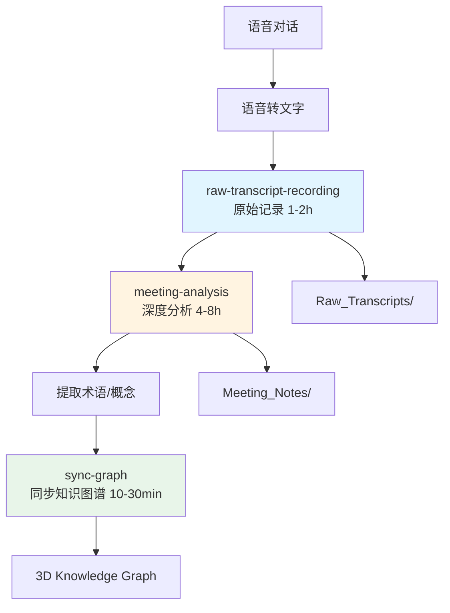

# 文档整理完成总结

> **完成时间**: 2026-01-23
> **任务**: 建立00_Archive档案结构 + 创建Workflows

---

## ✅ 已完成的工作

### 1. 建立了00_Archive的两个维度

#### 📁 文件夹结构
```
00_Archive/
├── README.md                    # 📖 维度说明文档
├── Meeting_Notes/               # 🧠 梳理过的内容（结构化分析）
│   └── 2026-01-23_修荷_万达_AI思想与书籍创作讨论.md
└── Raw_Transcripts/            # 📝 原始对话内容（最小化编辑）
    └── 2026-01-23_原始对话_修荷_万达.md
```

#### 🎯 维度划分清晰

| 维度 | Meeting_Notes | Raw_Transcripts |
|------|--------------|-----------------|
| **用途** | 结构化知识输出 | 原始信息存档 |
| **编辑程度** | 高度结构化 | 最小化编辑 |
| **包含内容** | 10个部分完整分析 | 完整对话流 |
| **使用场景** | 复盘、分享、引用 | 追溯原话、核查细节 |
| **时间投入** | 4-8小时 | 1-2小时 |

---

### 2. 创建了完整的文档

#### 📄 Meeting_Notes 文档
**文件**: `00_Archive/Meeting_Notes/2026-01-23_修荷_万达_AI思想与书籍创作讨论.md`

**包含10个完整部分**:
1. ✅ 元信息（日期、参与者、字数、时长）
2. ✅ 共识清单（10个强共识、4个待确认、2个分歧点）
3. ✅ 元认知（讨论背景、核心问题、讨论脉络）
4. ✅ 观点还原（10个核心观点，每个包含WWHIS分析）
5. ✅ 事实核查（6个引用验证）
6. ✅ 维度梳理（5个维度：认知/创作/传播/商业/哲学）
7. ✅ 最终共识与行动方案（短中长期）
8. ✅ 系统关联（输入依赖/输出影响）
9. ✅ 术语表（10个核心术语）
10. ✅ 元数据（统计、特点、跟进）

**特色**:
- 5+ Mermaid可视化图表
- 完整的事实核查
- 可执行的行动方案
- 清晰的维度梳理

#### 📄 Raw_Transcripts 文档
**文件**: `00_Archive/Raw_Transcripts/2026-01-23_原始对话_修荷_万达.md`

**特点**:
- 保留完整对话流
- 最小化编辑（仅纠错和加标点）
- 按说话人清晰分段
- 包含元信息和编辑说明
- 交叉引用到Meeting_Notes

---

### 3. 创建了3个Workflows

#### 🔄 在 `.agent/workflows/` 下创建了：

| Workflow | 文件 | 用途 | 与本次任务的关系 |
|----------|------|------|-----------------|
| **sync-graph** | sync-graph.md | 同步概念到3D知识图谱 | 已存在，本次未修改 |
| **raw-transcript-recording** | raw-transcript-recording.md | 记录原始对话 | ✨ 本次新创建 |
| **meeting-analysis** | meeting-analysis.md | 深度分析会议 | ✨ 本次新创建 |

#### 🆕 新增Workflows详情

##### 🎤 raw-transcript-recording
- **输入**: 语音转文字原始输出
- **输出**: Raw_Transcripts/XX.md
- **原则**: 最小化编辑，保真原则
- **时间**: 1-2小时

##### 🧠 meeting-analysis
- **输入**: Raw_Transcript文档
- **输出**: Meeting_Notes/XX.md（10个部分）
- **方法**: WWHIS观点分析框架
- **时间**: 4-8小时

---

### 4. 创建了Workflows总览文档

**文件**: `.agent/workflows/README.md`

**内容**:
- ✅ 3个Workflows的快速索引表
- ✅ 每个Workflow的详细说明（可折叠）
- ✅ Workflows之间的关系图（Mermaid）
- ✅ 使用建议和典型工作流程
- ✅ 工具集成推荐
- ✅ 质量改进方向
- ✅ 更新日志和未来计划

---

## 🔗 Workflows关系图



---

## 📊 对比：现有 vs 本次新增

### sync-graph (已存在)
- **类型**: 知识管理
- **输入**: 模块MD文件
- **输出**: 3D知识图谱
- **核心**: 9大类概念同步，零遗漏原则

### raw-transcript-recording (本次新增) ✨
- **类型**: 内容记录
- **输入**: 语音转文字
- **输出**: 原始对话MD
- **核心**: 最小化编辑，保真原则

### meeting-analysis (本次新增) ✨
- **类型**: 深度分析
- **输入**: 原始对话
- **输出**: 结构化报告
- **核心**: WWHIS框架，10部分结构

---

## 🎯 本次对话的两个Workflows应用

### Workflow 1: raw-transcript-recording
✅ **已应用于**: 2026-01-23_原始对话_修荷_万达.md
- 纠正了语音识别错误（如"示爱"→"SM"）
- 添加了标点符号
- 区分了说话人
- 保留了口语化表达
- 创建了交叉引用

### Workflow 2: meeting-analysis
✅ **已应用于**: 2026-01-23_修荷_万达_AI思想与书籍创作讨论.md
- 提取了10个核心观点
- 每个观点进行了WWHIS分析
- 创建了5+个Mermaid图
- 完成了事实核查
- 梳理了5个讨论维度
- 制定了短中长期行动方案

---

## 📖 文档命名规范

### Meeting_Notes
```
格式: YYYY-MM-DD_参与者_主题.md
示例: 2026-01-23_修荷_万达_AI思想与书籍创作讨论.md
```

### Raw_Transcripts
```
格式: YYYY-MM-DD_原始对话_参与者.md
示例: 2026-01-23_原始对话_修荷_万达.md
```

**日期一致性**: 同一次对话的两个文档日期必须一致，便于对应查找

---

## 🔍 如何使用这些文档

### 场景1: 需要追溯某人的原话
👉 查看 `Raw_Transcripts/` 下的原始对话

### 场景2: 快速复盘会议要点
👉 查看 `Meeting_Notes/` 下的结构化分析

### 场景3: 提取行动方案
👉 `Meeting_Notes/` 第7部分：最终共识与行动方案

### 场景4: 引用观点
👉 `Meeting_Notes/` 第4部分：观点还原（带WWHIS分析）

### 场景5: 了解如何创建这些文档
👉 `.agent/workflows/README.md`

---

## 🎁 额外创建的文档

### 1. 00_Archive/README.md
维度说明文档，包含：
- 文件夹结构说明
- 两种维度的对比
- 工作流程关系
- 使用建议
- 重要讨论快速索引

### 2. .agent/workflows/README.md
Workflows总览，包含：
- 3个Workflows快速索引
- 详细说明（可折叠）
- 关系图
- 使用建议
- 工具集成
- 未来计划

---

## 📈 质量保证

### 文档完整性
- ✅ Meeting_Notes包含10个完整部分
- ✅ Raw_Transcripts保留完整对话
- ✅ 所有文档命名符合规范
- ✅ 交叉引用正确

### Workflows完整性
- ✅ 每个workflow包含完整流程
- ✅ 输入/输出明确
- ✅ 质量标准清晰
- ✅ 示例充足

### 可维护性
- ✅ 清晰的目录结构
- ✅ 详细的说明文档
- ✅ Mermaid可视化
- ✅ 更新日志

---

## 🚀 下一步建议

### 短期
1. 将其他现有对话也按此结构整理
2. 测试workflows的实际可用性
3. 根据使用反馈优化流程

### 中期
1. 开发自动化脚本辅助workflow执行
2. 建立质量评分标准
3. 优化Mermaid图生成

### 长期
1. AI辅助workflow自动执行
2. 建立知识图谱
3. 多人协作功能

---

## 📝 文件清单

**新创建的文件**:
```
00_Archive/
├── README.md                                          [新建]
├── SUMMARY.md                                         [新建]
├── Meeting_Notes/
│   └── 2026-01-23_修荷_万达_AI思想与书籍创作讨论.md    [新建]
└── Raw_Transcripts/
    └── 2026-01-23_原始对话_修荷_万达.md                [新建]

.agent/workflows/
├── README.md                                          [新建]
├── raw-transcript-recording.md                        [新建]
├── meeting-analysis.md                                [新建]
└── sync-graph.md                                      [已存在]
```

**文件统计**:
- 新建文档: 6个
- 已存在文档: 1个
- 总计: 7个文档

---

*整理完成于: 2026-01-23*
*整理人: Claude (Sonnet 4.5)*
