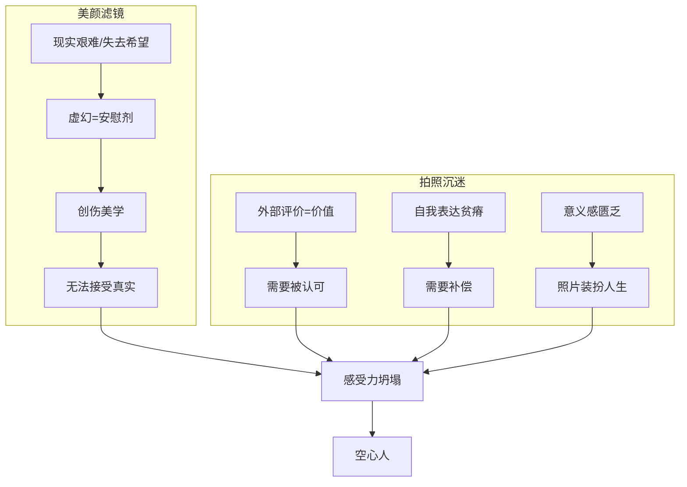
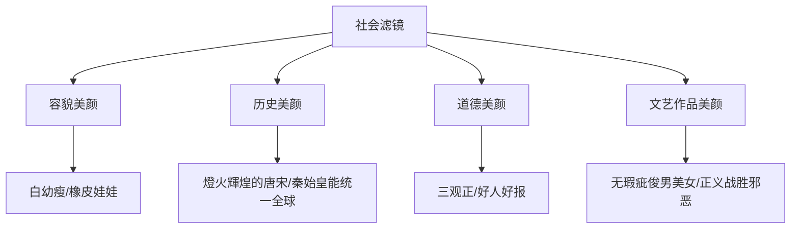
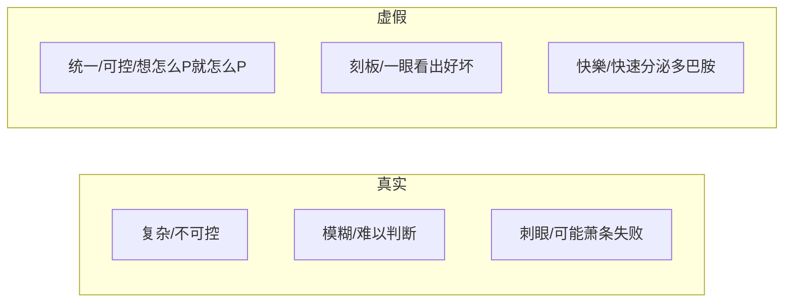
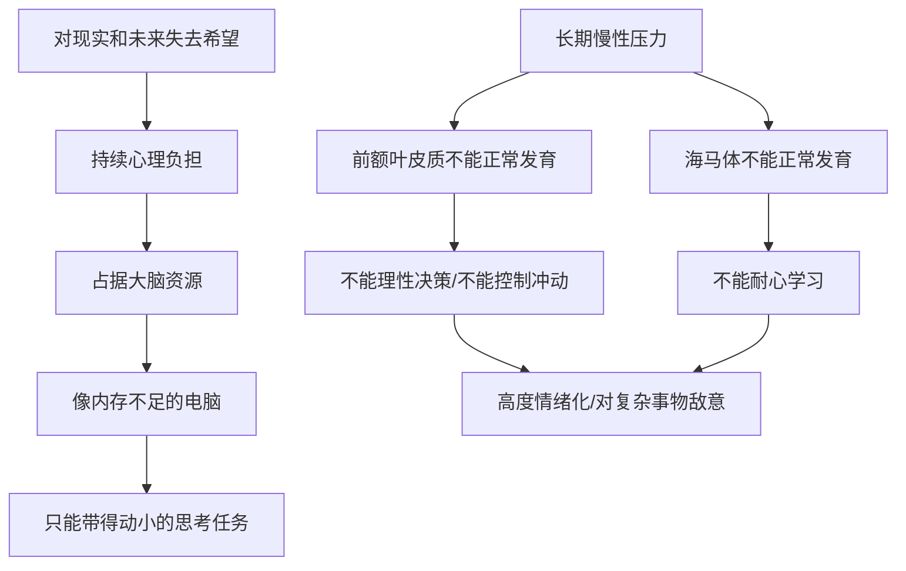
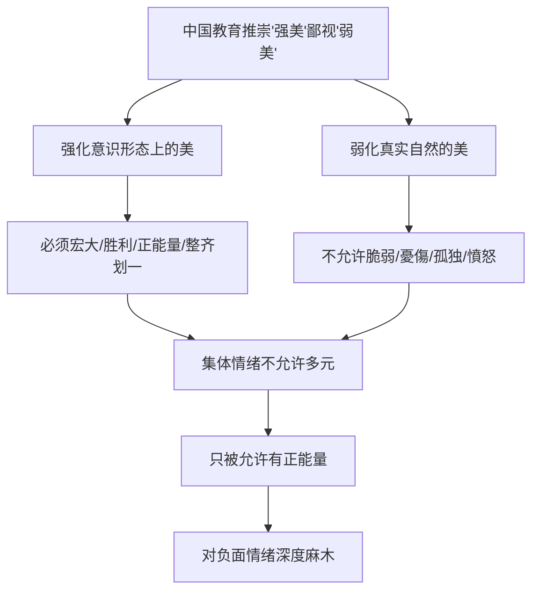
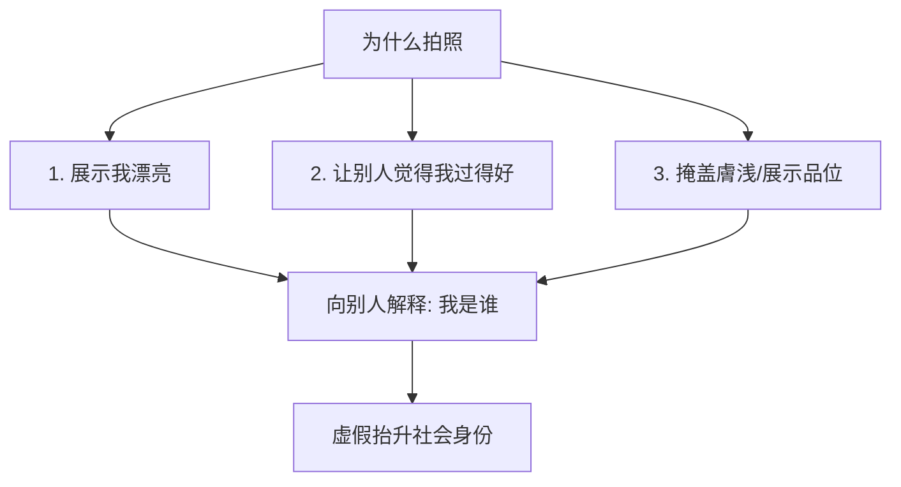
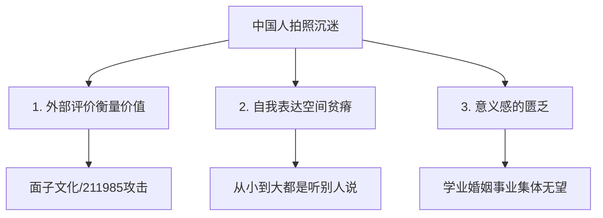
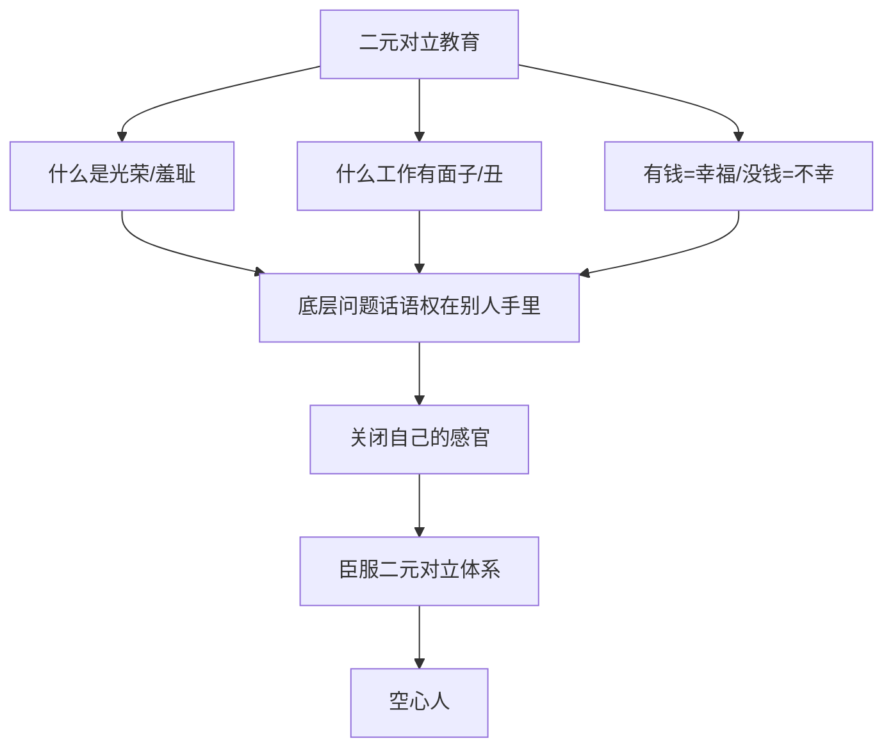

# 美颜滤镜与拍照心理: 中国人逃避真实的集体性创伤

> **Source:** 视频 - 美颜滤镜与逃避真实 & 中国人为什么如此沉迷拍照
> **Date Created:** 2026-01-12
> **Tags:** #美颜 #拍照 #逃避真实 #感受力 #意义感 #创伤美学

---

## 一、元认知 (Metacognition)

### 1.1 为什么需要关注这个主题？(Why)

> 💡 **核心困惑:**
> 为什么中国人如此沉迷于美颜和拍照？为什么真实的自己会让自己不快樂？这背后反映的是一个**社会性的对真实的集体性回避**——不仅是照片，我们的历史、道德、文艺作品都被全面美颜化了。当整个社会集体性地呈现出对"品味真实、思考真实"的回避，**它反映的是整个社会当前的问題**。

### 1.2 核心观点 (Core Thesis)

> [!IMPORTANT]
> **本期核心洞见:** 
> 1. **美颜滤镜**是经济下行期的创伤美学——虚幻的繁荣和美丽是集体选择的安慰剂
> 2. **拍照沉迷**反映的是感受力的全面坍塌——人们已无法靠自己体会什么是幸福
> 3. **二元对立教育**从小切断了私密的、百分百信任自己体验的感受力
> 4. **被他人认可**成为中国人唯一的自我评价的价值来源

### 1.3 系统定位 (System Role)

本模块是理解中国社会心理的**感受力层**，解释"为什么中国人感受不到真实的幸福"。与以下模块关联：
- `Face_Culture`: 外部评价=价值 来源于面子文化
- `Eating_Bitterness_Culture`: 情感麻木与感受力丧失
- `Exam_Education_Psychology`: 二元对立教育

---

## 二、Part 1: 美颜滤镜与逃避真实

### 2.1 美颜相机的悖论

> **洞察:** "用美颜相机久了，当有一天你用手机直出，你会对自己产生一种莫名的厌恶和嫌弃。也就是说，**真实的自己会让自己不快樂**。"

**全社会的人种改造:**
- 人均九头身、人均白种人、人均超模腿
- 每个人的脸都像橡皮娃娃
- 集体性变成"白幼瘦"
- 影视剧全线开美颜

### 2.2 巨大的社会滤镜

**历史的美颜:**
> "在当今的叙事中，古代中国人早就变了——高大、富有、俊朗、身穿绫罗绸缎，古代城市燈火通明，**用蜡烛的时代比用电的时代还要亮**。"

**真实的古人 (清代影像):**
> "最接近现代的古代就是清代。这些清代的王公大臣、北京人，在中国算经济水平较好的一群人。在这些图片中的才是**真实的中国人**。"

### 2.3 道德的美颜

**90年代-2000年代的写实:**
- 《来来往往》《一年又一年》《蜗居》《大宅门》《血色浪漫》《大明王朝》
- 认真讨论**人是什么**
- 好人有阴暗，坏人有发光
- 出轨/贪婪/懦弱/妒忌 = 人性正常部分

**现在的三观正:**
- 好人是好人，坏人是坏人
- 善有善报，恶有恶报
- 正义战胜邪恶，主角永不言败

> **底层原因:** "现在的人已经没有力气接受真正的真实，思索真实本身的价值。"

### 2.4 为什么人类选择逃避真实

| 维度 | 真实 | 虚假 |
|:----|:----|:----|
| **可控性** | 复杂/不可控 | 统一/可控 |
| **判断性** | 模糊/很难判断对错 | 刻板/一眼看出好坏 |
| **情绪性** | 刺眼/可能萧条失败 | 快樂/快速多巴胺 |

> **洞察:** "抖音是中华民族第五大发明。它和经济周期完美结合，是一种**没有化学成分的合法致幻剂**，是一种谋取暴利的社会稳定机。"

### 2.5 慢性压力对大脑的影响

> **洞察:** "为什么简中网络那么爱骂人？因为在长期慢性压力下，人负责控制决策和冲动的**前额叶皮质**和负责学习的**海马体**都不能正常发育。"

### 2.6 创伤美学

> **核心定义:** "视觉的完美和刺激是疲惫灵魂的刚需。功能强大的美颜外挂、全是橡皮娃娃的影视作品、燈火輝煌的唐宋古城——这些看起来更加华丽、更加不现实的审美，其实是一种**经济下行期的创伤美学**。"

**创伤美学的沃土:**

### 2.7 负面情绪的价值

> **洞察:** "痛有什么用？痛帮我们远离伤害、对抗伤害。**负面情绪也是同样的道理**——它帮助我们识别哪些痛苦和命运是我们不该承受的，我们有权对抗的。"

**识别情绪的重要性:**
- 识别情绪 = 人格成长的一部分
- 识别情绪 = 彼此理解支持的基础
- 从小对情绪认知单一/道德化/用好坏评判 → 没有能力辨别情绪 → 抑郁和自我攻击

### 2.8 虚假与脆弱的恶性循环

**后果:** 大幅削弱对真实的接受和理解能力，把年轻人培养成**无法理解复杂问题的道德斗士**。

### 2.9 幻灭感的产生

> "当他们进入社会，发现外面是一个**集法家、儒家、马基雅维利主义和社会达尔文主义于一体的社会**，努力没有回报的社会，失业问题频发的社会——他们对于社会的幻觉就会被撕碎，产生一种**幻灭感**。"

**心理后果:**
- 大梦一场的幻灭和抑郁
- 被欺骗的愤怒和无力感
- "我的前半生又算什么呢？"

---

## 三、Part 2: 中国人为什么沉迷拍照

### 3.1 拍照的三层心理

> **洞察:** "现实中的美丽和高端需要足够多的努力和幸运，但照片中的这一切，可能**只需要一个下午**就够了。"

### 3.2 拍照的深层心理

**1. 对美好的瞬间占有:**
> "极致的美太不日常了，我太想拥有了。通过拍照可以实现瞬间占有。"

**2. 加强存在的感知:**
> "我是否存在是人类的核心焦虑。当我发出照片被别人点赞、赞美——就会极大加强我作为个体存在的意义感。"

**3. 肉体的诅咒:**
> "本质上我们只是一团意识，意识是自由的。但意识被困在有年限的肉体里，就有了民族、性别、年龄、社会身份、漂亮丑陋——成为一个无期徒刑的监狱。"

### 3.3 中国人特别沉迷的三大原因

**原因一：通过外部评价衡量自己的价值**
- "你是不是211/985" = 人的价值被公认的外部标准评判
- 30岁未婚女性 = 应该降低标准
- 文科生 = 没有逻辑思维
- **点贊=认可=有价值**

**原因二：自我表达空间的贫瘠**
- 从小到大：听老师说/听家长说/听领导说
- 表达体系在空话套话假话里空转
- 社交网络 = 自我表达空间的彌补

**原因三：意义感的匮乏**
- 上学不一定找到好工作
- 婚姻已经不相信爱情
- 事业35岁淘汰
- **三种人生敘事集体缺乏希望**

### 3.4 感受力的坍塌

> **核心洞察:** "感受力因**单纯**而存在，因**功利**而消失。中国孩子从小被切断的第一个东西，就是**私密的、百分百信任自己体验的感受力**。"

### 3.5 私密的自我信任的感受力

> **定义:** "一种私密的自我信任的感受力——我一个人爬山，没告诉任何人，也没拍任何照片，但我知道我感受到了极大的幸福。我沉浸在某种体验中，感到深深的感恩和满足，因为**我知道这就是我想要的全部**。"

**关键特征:**
- 不需要分享
- 不需要被认可
- "我活得很幸福"这句话永远在脑子里很大声

### 3.6 中国人思想根源

> **洞察:** "中国人在思想根源上，并不相信一个人不靠他人的认可和看见就可以过得很好。"

**表现:**
- 单身=不完整
- 没孩子=不完整
- 一个人的生活=可怜 (形单影只/孤儿寡母/六亲缘浅)

> "中国人根深蒂固认为：人只能从**关系**中获得意义，而不能从**个人体验**中获得意义。"

### 3.7 生命意义的来源

> **终极洞察:** "生命的意义不在照片里，而在日复一日的生活里，在我们独一无二的感受里。一个能够轻易感受到美的人，不会轻易怀疑生命的意义。"

---

## 四、The Great Gatsby 隐喻

> "《了不起的盖茨比》1925年出版后没人看。因为在盛世，一部关于梦想幻灭的小说是不合时宜的。大萧条之后这本书逐渐火了起来——因为盖茨比的人生很像大萧条前后的美国。"

**小说与时代:**
- 丰盛华丽消费主义
- 违法/欺骗/在虚荣和真实情感间徘徊
- 底层小子用谎言获得上等生活
- 认为有资格追求真爱时——生命匆匆落幕

> "不知道什么时候，我们也会有这样的小说、这样的电影——里面的主演**没有美颜、没有道德滤镜**，如同这个时代一样，裹挟着空气中的狂热、虚榮、躁动、失望、欺骗、恐懼、憤怒，以及残存的一丁点纯真。"

---

## 五、反模式 (Anti-Patterns)

### ❌ 反模式1: 用出片来证明生活有意义

**表现:** 吃饭要出片、喝咖啡要出片、旅游要出片——出片比活动本身更重要。

**危害:** 无法真正沉浸体验，感受力进一步萎缩。

**修正:** 练习"不拍照的体验"——专注于当下感受，不考虑如何呈现。

**✅ 正向案例:** "我在泰国游泳3小时，没拍任何照片。但我记得阳光、水的触感、和自己相处的满足。这比100张照片更珍贵。"

---

### ❌ 反模式2: 用点赞数衡量自己的价值

**表现:** 照片发出去后反复刷新看点赞，点赞少就焦虑。

**危害:** 价值感完全外包给他人，内在空虚加剧。

**修正:** 区分"分享的快樂"和"被认可的焦虑"。前者健康，后者是依赖。

**✅ 正向案例:** "我发这张照片是因为我自己喜欢，不是为了点赞。如果没人赞，我依然喜欢这个瞬间。"

---

### ❌ 反模式3: 认为负面情绪是"不对的"

**表现:** 我郁闷是我的错、我消极是我的错、我愤怒是我的错、别人都能正能量为什么我不行。

**危害:** 自我攻击加剧，无法识别真正的问题来源。

**修正:** 负面情绪是信号，帮助你识别什么是不该承受的。情绪没有好坏，只有真实。

**✅ 正向案例:** "我今天很愤怒。这说明有些事情触犯了我的边界。我要思考是什么，以及如何处理——而不是责备自己不够正能量。"

---

## 六、术语表 (Glossary)

| 术语 | Term | 定义 (人话) |
|:----|:----|:----------|
| 创伤美学 | Trauma Aesthetics | 经济下行期用华丽不真实的审美作为集体安慰剂 |
| 感受力 | Sensory Capacity | 对美和幸福的私密的自我信任的体验能力 |
| 空心人 | Hollow Person | 没有内在感受力，只追逐外部标签的人 |
| 二元对立 | Binary Opposition | 非此即彼的思维模式，摧毁感受力的根源 |
| 私密幸福 | Private Happiness | 不需分享、不需认可的内在满足感 |
| 意义感匮乏 | Meaning Poverty | 传统人生敘事(学业/婚姻/事业)集体失效 |
| 社会滤镜 | Social Filter | 笼罩整个社会的对真实的系统性美化 |
| 点赞依赖 | Like Dependency | 把自我价值外包给社交媒体互动 |
| 强美弱美 | Strong vs Weak Beauty | 教育推崇宏大胜利的美，压制脆弱自然的美 |

---

## 七、公式表 (Formula Table)

| 公式名称 | 逻辑表达式 | 说明 |
|:--------|:----------|:----|
| **逃避真实公式** | `逃避程度 = 现实艰难度 × 希望匮乏度` | 现实越难+希望越少=越逃避真实 |
| **感受力公式** | `感受力 = 单纯度 / 功利度` | 越单纯感受力越强，越功利感受力越弱 |
| **拍照依赖公式** | `拍照依赖 = 外部评价权重 × 自我表达缺失 × 意义感匮乏` | 三因素相乘决定拍照沉迷程度 |
| **空心人公式** | `空心程度 = Σ(外部标签) - 内在感受力` | 外部标签多+内在感受弱=空心 |
| **幻灭公式** | `幻灭程度 = 美颜叙事 ÷ 真实现实` | 前后反差越大，幻灭越强 |

---

## 八、深度概念详解

### 8.1 中国大妈的彩色丝巾

> **案例保留:** "人们嘲讽中国大妈没有品位，全身大红大绿彩色丝巾。但很少有人意识到这是一种**心理创伤补偿**。你无法想象她们在幼年、少女、青年时期都只能穿宽大破舊的灰黑蓝单调度日。追求个性追求美=内心丑陋=被政治批判。这种前半生的创伤终于在老年迎来了**后青春期的觉醒**。"

### 8.2 虚假美颜的终结

**三个原因必然终结:**

1. **虚假不能解决现实问题**
   - 水分会被现实的大手挤干
   - 燈火輝煌的长安 vs 自己的失业房贷

2. **追求真实是人的内在本性**
   - 搞笑短视频都围绕对立讽刺
   - 搞笑背后是对真实感受的追求

3. **触动灵魂的只有真实本身**
   - 100张美颜美女不如张曼玉两道法令纹
   - 虚假很刺激，但真实更感人

### 8.3 演算法机制的漏洞

> "审核机构可以一刀切——切掉不确定性。但演算法机制做不到。机器人无法像人一样感受精神世界的微妙变化和错综复杂的隐喻。**怀舊本身就是对当下现实的攻击**——这种演算法怎么控制？"

---

## 备注与引用 (Notes & References)

### 素材来源
- 视频1: 美颜滤镜与逃避真实
- 视频2: 中国人为什么如此沉迷拍照

### 关键引用
- 菲茨杰拉德《了不起的盖茨比》: 大萧条注脚
- 笛卡尔: 我思故我在
- 阿德勒: 幸福的人用童年治愈一生
- 柏拉图: 美是理念世界的反映
