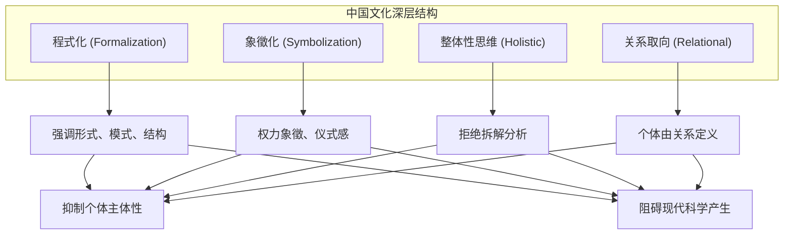
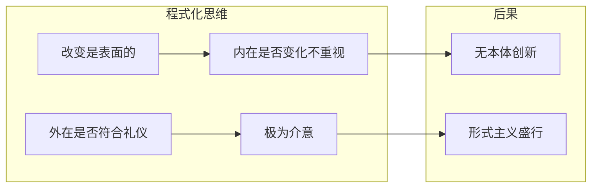
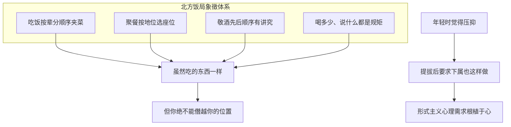
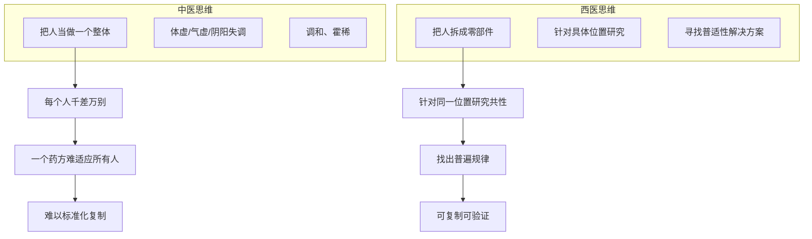
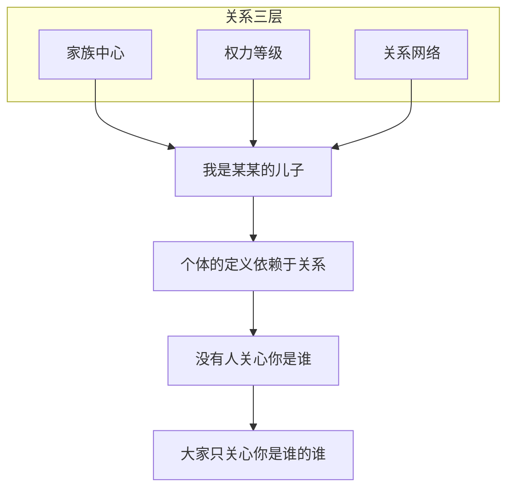
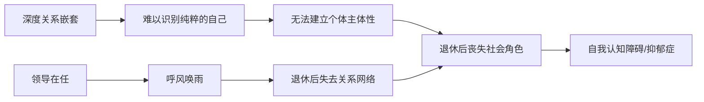
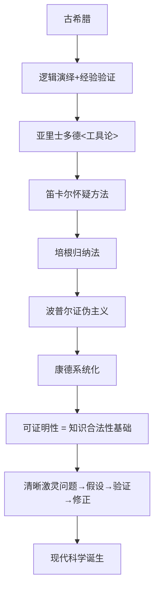
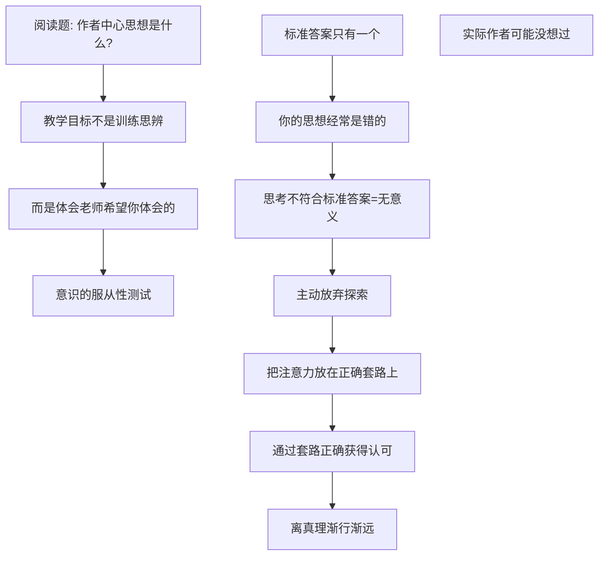
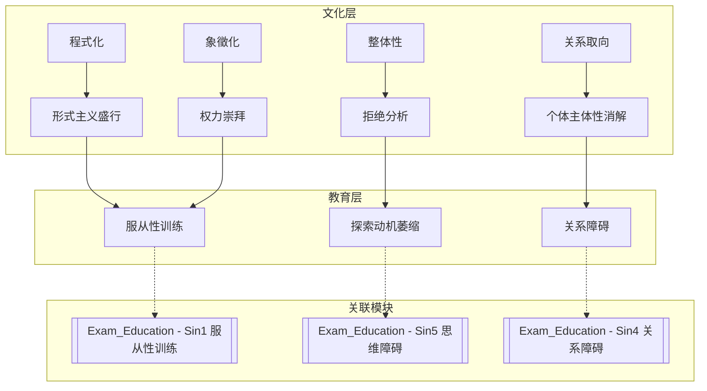
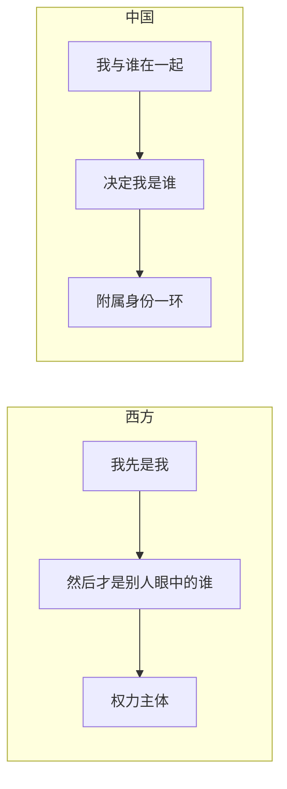

# 中国文化的深层结构: 程式化、象徵化与关系取向如何抑制个体主体性

> **Source:** 视频 - 基于孙隆基《中国文化的深层结构》
> **Date Created:** 2026-01-11
> **Tags:** #文化批判 #社会心理学 #主体性 #科学哲学

---

## 一、元认知 (Metacognition)

### 1.1 为什么需要关注这个主题？(Why)

> 💡 **核心困惑:**
> 为什么高考满分作文除了拿高分几乎没有任何意义？为什么辩论节目像抖音口播——场景、感受、金句，越煽动越好？为什么网红只要会朗诵古诗就被封为"大才子"，却无人关心他们是否言之有物？

答案藏在一个更深层的问题里：**为什么我们的社会如此重视形式和感受，却很少有人关注逻辑？这背后有没有特定的文化基因在驅动？**

### 1.2 核心观点 (Core Thesis)

> [!IMPORTANT]
> **孙隆基的核心洞见:** 我们不是自觉地活在文化当中，而是被一种**历史深成的、结构化的文化逻辑**塑造着。这种结构如同空气——**不可见、难察觉、无所不在**。

中国文化的深层结构有**四大特征**：

### 1.3 系统定位 (System Role)

本模块是理解中国社会心理的**文化根源层**，解释"为什么中国人是这样的"。它与以下模块高度关联：
- `Exam_Education_Psychology`: 应试教育七宗罪是文化深层结构的表征
- `Philosophy_of_Love`: 关系取向如何影响爱情观
- `Enterprise_Operation_System`: 形式主义在企业中的表现

---

## 二、核心架构 (Core Framework) - 文化深层结构的四大特征

### 2.1 程式化 (Formalization) — 形式重于实质

中国文化特别强调**模式、形式和结构**，而并不追求本质的、实质性的、本体创新。

| 维度 | 表现 | 意义 |
|:----|:----|:----|
| **书法** | 强调"行与势"的美感 | 形式本身成为目的 |
| **八股文** | 破题、承题、起入手、起股...格式复杂 | 符合形式 > 思想内容 |
| **高考作文** | 名人名言+宏大排比+政治正确感受 | 契合形式主义得高分 |
| **跑操跑步** | 人贴人、豆腐块、喊口号 | 统一性本身是目的 |

**北京奥运会开幕式案例:**
- 上千演员动作整齐划一 → 集体秩序美
- 林妙可口型配音 → 形式 > 真实
- 西方观众：多元、个性、幽默 → 中国观众：乱糟糟、缺乏组织纪律

> **隐喻保留:** "相比于多样性带来的美，我们更在意**一致性带来的美**；相比于真实带来的感动，更在意**形式带来的感动**。"

### 2.2 象徵化 (Symbolization) — 权力的仪式表达

程式化带有非常强烈的**权力象徵意义**。形式不只是美学，更是**秩序与服从的表征**。

**从小到大的形式主义训练:**

| 场合 | 形式要求 | 后果 |
|:----|:--------|:----|
| 学校活动 | 整齐划一、按相貌身高筛选 | 不符合标准 = 不够格参与 |
| 春节联欢 | 统一服装、统一动作 | 个体差异被抹杀 |
| 端茶倒水 | 动作笑容统一训练 | 简单服务变满满仪式感 |

> **核心洞察:** 豆腐块式的统一舞蹈 vs 每个人都有角色的舞蹈——前者要求你**禁止思考、禁止创新、禁止犯错**，最好脑子是空的，这样才能更好地嵌入统一的系统。

### 2.3 整体性思维 (Holistic Thinking) — 拒绝分析拆解

中国文化强调**天人合一**、**整体感知**，认为世界本来就是一个整体，不应该被简单拆解为零部件。

**"道可道，非常道"的困境:**

| 特征 | 表现 | 后果 |
|:----|:----|:----|
| **只可意会不可言传** | 你懂就是你懂，你不懂是你的问题 | 知识无法积累 |
| **玄之又玄** | 美感有了，但说不清楚是什么 | 无法形成可验证体系 |
| **感悟优于论证** | 总结道理 > 推理过程透明化 | 科学方法无法产生 |

> **隐喻保留:** "我们老祖宗的智慧始终在一种**只可意会不可言传**的玄妙状态之下。你听明白了就是你明白了，你不明白就是你的问题，而不是老祖宗的问题。"

### 2.4 关系取向 (Relational Orientation) — 个体由关系定义

中国文化的核心不是**个体与世界**的理性关系，而是**人与人之间的复杂网络**。

**具体表现:**

| 场景 | 中国方式 | 西方方式 |
|:----|:--------|:--------|
| **办事** | 找人、托关系、塞钱 | 登录网站、按规则申请 |
| **信任** | 通过关系彼此背书 | 通过规则和契约执行 |
| **个人价值** | 取决于你爹是谁 | 取决于你自己做了什么 |
| **公务员吃香** | 规则是虚的，关系是实的 | (相对)规则就是规则 |

> **核心洞察:** "西方强调主体性：**我先是我，然后才是别人眼中的谁**。中国讲究关系性：**我是谁，要由我与谁在一起来决定**。"

**后果 — 个体主体性的消解:**

---

## 三、文化差异的哲学根源

### 3.1 西方思想传统

**关键区分:**

| 西方 | 中国 |
|:----|:----|
| 感悟需要论证支持 | 感悟本身就是结论 |
| 个人是权力主体 | 个人是附属身份一环 |
| 国家合法性来自契约 | 国家与个人是父母-孩子关系 |
| 王子犯法与庶民同罪 | 免死金牌、上方宝剑可超越法律 |

### 3.2 对教育的影响

> **隐喻保留:** "这种标准答案的权威性对孩子是一种**思想的恐吓**。一个孩子在自我探索欲望最强烈的年纪，大脑就被上了一个紧的锁链。"

---

## 四、反模式 (Anti-Patterns)

### ❌ 反模式1: 形式主义审美盲从

**表现:** 看到整齐划一的表演就感动，看到多元化表演就觉得"乱糟糟"。

**危害:** 无法欣赏个性化表达，审美被权力符号绑架。

**修正:** 有意识地接触多元文化作品，练习识别"形式美"与"内容美"的区别。

**✅ 正向案例:** 故意观看不同国家的奥运开幕式，不带预设地分析每个表演想表达什么。

---

### ❌ 反模式2: 关系优先于规则

**表现:** 办事第一反应是找人托关系，而非了解规则自主申请。

**危害:** 强化关系网络的权力结构，削弱规则的权威性，增加社会交易成本。

**修正:** 先尝试走正规渠道，除非证明规则渠道失效才考虑关系。

**✅ 正向案例:** 在澳洲办事直接网上预约、按流程提交，不需要"认识人"。

---

### ❌ 反模式3: 感悟替代论证

**表现:** 辩论/写作用情绪煽动、金句堆砌，而非证据+逻辑链条推理。

**危害:** 无法形成可验证、可积累的知识体系，思辨能力退化。

**修正:** 训练"观点成立不是因为听起来像真理，而是因为经得起质疑、能在逻辑上推演、能被证据支持"。

**✅ 正向案例:** 写文章时先列出论点，再为每个论点找证据，最后检查论证链条是否完整。

---

## 五、系统关联 (System Interlinkages)

---

## 六、术语表 (Glossary)

| 术语 | Term | 定义 (人话) |
|:----|:----|:----------|
| 程式化 | Formalization | 强调形式、模式、结构，不追求本质创新 |
| 象徵化 | Symbolization | 形式带有权力象徵意义，仪式感 = 秩序表征 |
| 整体性思维 | Holistic Thinking | 把事物当整体看，拒绝拆解分析 |
| 关系取向 | Relational Orientation | 个体由关系定义，不是独立存在 |
| 主体性 | Subjectivity | 个人作为独立主体的自我认知和行动能力 |
| 嵌入人 | Embedded Person | 基于关系网络定义的个人，非抽象平等的契约人 |
| 清疏远近 | Intimacy Gradient | 中国社会的信任结构，按关系远近区分对待 |
| 证伪主义 | Falsificationism | 波普尔提出，科学理论必须能被证伪 |
| 契约人 | Contractual Person | 通过理性协商放弃部分自由换取法律保障的个人 |

---

## 七、公式表 (Formula Table)

| 公式名称 | 逻辑表达式 | 说明 |
|:--------|:----------|:----|
| **形式主义审美公式** | `感动程度 = 统一性 × 规模 × 权力象徵` | 解释为什么整齐划一让中国人感动 |
| **关系定义公式** | `个人价值 = Σ(关系权重 × 关系方地位)` | 你是谁取决于你是谁的谁 |
| **知识积累障碍公式** | `可积累性 = 可言传性 × 可验证性` | 只可意会不可言传阻断知识积累 |
| **主体性消解公式** | `主体性 = 自我认知 - 关系嵌套深度` | 关系嵌套越深，主体性越弱 |
| **科学产生条件公式** | `科学可能性 = 论证传统 × 个体独立性 × 质疑权` | 中国文化三项都弱 |

---

## 八、深度概念详解

### 8.1 "我是谁的谁" vs "我是谁"

这是东西方文化的根本分歧：

这解释了：
- 为什么中国领导退休后容易抑郁——**失去关系网络 = 失去自我定义**
- 为什么公务员那么吃香——**有关系的人 = 办事成本降低**
- 为什么"你爸是谁"如此重要——**继承关系 = 继承社会资本**

### 8.2 为什么中国没有产生现代科学

| 条件 | 西方 | 中国 |
|:----|:----|:----|
| **论证传统** | 亚里士多德→笛卡尔→培根 | 道可道非常道 |
| **个体独立性** | 契约人，独立权力主体 | 嵌入人，关系定义身份 |
| **质疑权** | 观点需经得起质疑 | 标准答案不可挑战 |
| **可验证性** | 证伪主义 | 只可意会不可言传 |

> **核心洞察:** 西方社会强大不是因为技术强大，而是因为他们**具备产生这些技术的思想条件**。

---

## 备注与引用 (Notes & References)

### 素材来源
- 视频: 基于孙隆基《中国文化的深层结构》第一章内容

### 主要引用
- 孙隆基,《中国文化的深层结构》
- 亚里士多德,《工具论》(Organon)
- 笛卡尔,《方法论》(Discourse on Method)
- 培根,《新工具》(Novum Organum)
- 波普尔,《猜想与反驳》(Conjectures and Refutations)
- 康德,《纯粹理性批判》(Critique of Pure Reason)
- 罗尔斯,《正义论》(A Theory of Justice)
