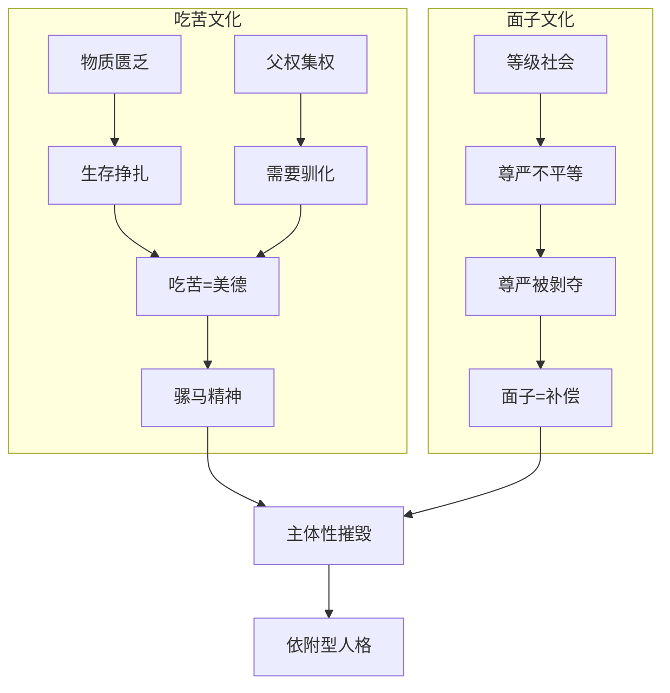
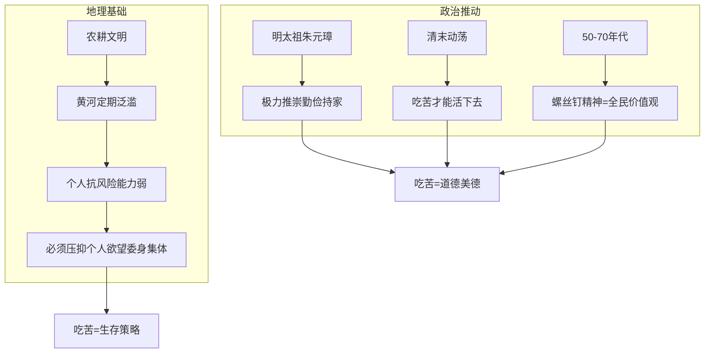
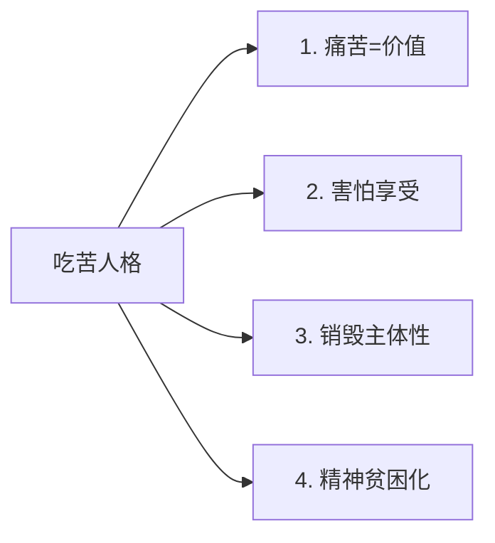
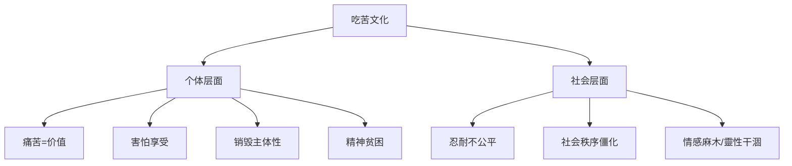
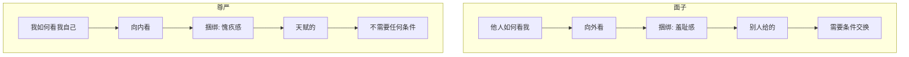
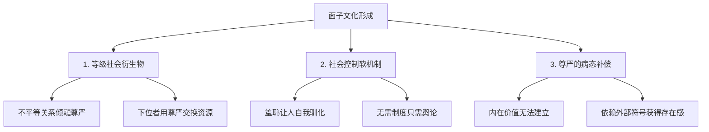
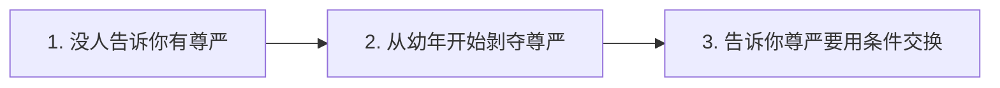
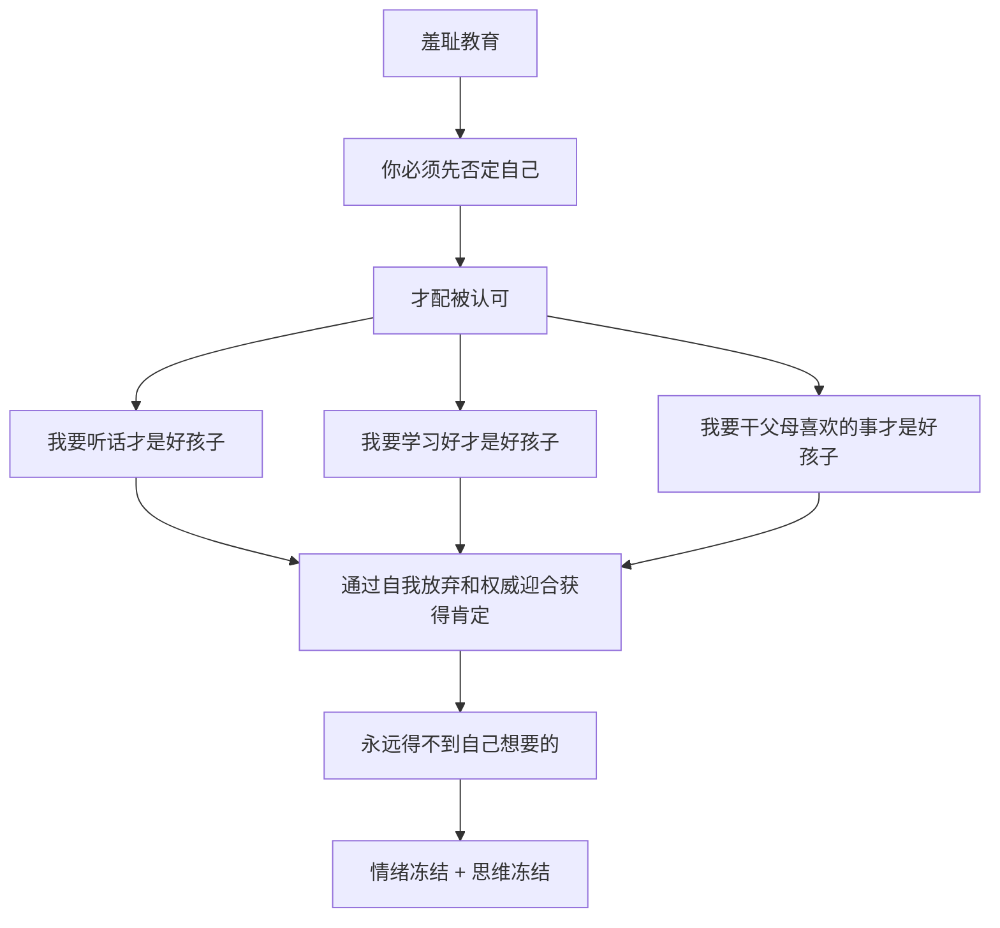
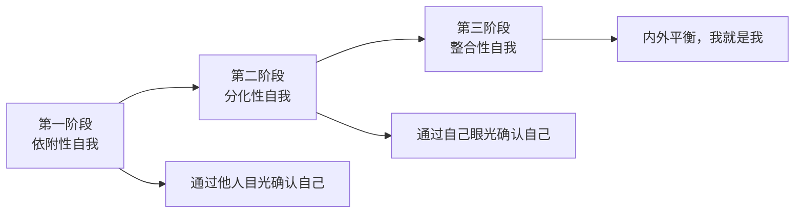
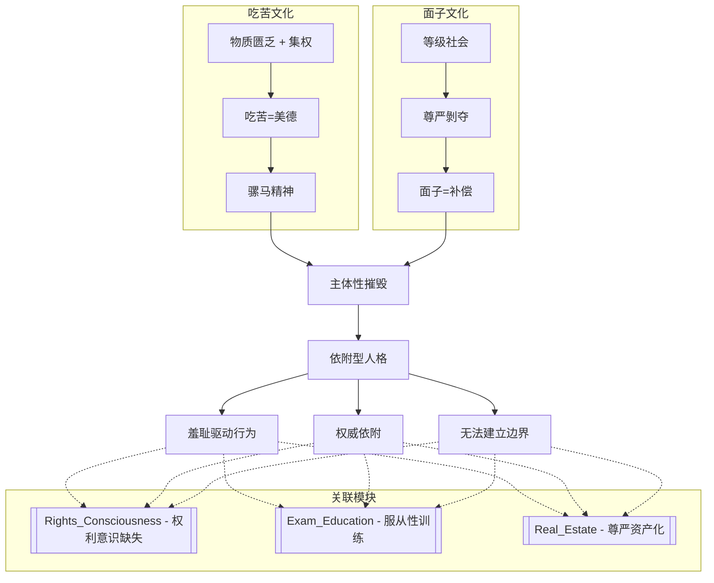

# 吃苦文化与面子尊严: 中国人的双重精神枷锁

> **Source:** 视频 - 吃苦文化 & 面子与尊严
> **Date Created:** 2026-01-12
> **Tags:** #吃苦 #面子 #尊严 #依附型人格 #羞耻文化 #社会批判

---

## 一、元认知 (Metacognition)

### 1.1 为什么需要关注这个主题？(Why)

> 💡 **核心困惑:**
> 中国人对"吃苦"有近乎宗教般的崇拜，把忍耐痛苦当作美德本身。同时，中国人极度在意"面子"而对"尊严"却麻木不仁。这两者背后有着共同的文化根源——**尊严的系统性剥夺和病态补偿**。

### 1.2 核心观点 (Core Thesis)

> [!IMPORTANT]
> **本期核心洞见:** 
> 1. **吃苦精神**是父权制集权和物质匮乏"交配"所产生的特殊宝宝——用道德的高帽子让人忍受本不该忍受的痛苦
> 2. **面子文化**是尊严被剝夺之后的幻觉补偿——当内在价值无法建立，人只能依赖外部符号获得存在感
> 3. 两者共同造成中国人**主体性的系统性摧毁**

### 1.3 系统定位 (System Role)

本模块是理解中国社会心理的**精神控制层**，解释"为什么中国人活得那么压抑"。与以下模块关联：
- `Rights_Consciousness_Deficit`: 吃苦文化压制权利意识
- `Exam_Education_Psychology`: 教育系统复制羞耻控制
- `Real_Estate_Domestication`: 面子文化驱动房产焦虑

---

## 二、Part 1: 吃苦文化

### 2.1 吃苦的陰間故事

> **隐喻保留 (奶奶的故事):** "我问她60年那三年大饥荒的经历。她说到邻居——一个男人，在60年吃掉了自己的儿子。我说然后呢？'然后他就活下来了呀...'我说那他活的好吗？'很多年后他就上吊了呀...'
>
> **我看到我奶奶的时候，她是笑着的。她讲这个故事全程都是笑着的。在那一瞬间我突然明白了，苦难到底会给一个人带来什么。**"

### 2.2 吃苦并非普世价值

| 文化 | 对待苦难的态度 |
|:----|:-------------|
| **西方(文艺复兴后)** | 追求人的价值，体力劳动应被避免，强调创新和效率 |
| **日本** | 忍耐源于羞耻文化——不想在别人眼中蒙羞 |
| **韩国** | 因被强国包围而自强——强调个人拼搏和争取 |
| **非洲** | 艰辛是不得不面对的现实，艰辛劳动后更需享乐 |
| **中国** | 吃苦=美德，吃苦=道德正义，吃苦=目的本身 |

> **洞察:** 把吃苦当做美德，并不是人的本性，**它是被外在环境强加的价值观**。

### 2.3 吃苦精神的形成机制

**关键历史节点:**
- **1960年3月**: 王进喜在零下三四十度肉身跳进水泥泥浆搅拌——"铁人精神"
- **1960年1月**: 雷锋"螺丝钉精神"成为全民宣传
- **三年大饥荒**: 吃树皮、抢粮票、为一口饭打架——匮乏和饥饿贯穿童年

### 2.4 骡马精神

> **隐喻保留:** "为什么不用马不用驴，要用马和驴杂交的、没有生育能力的骡子呢？因为马吃得多，驴干活不行脾气差。骡子结合了两者优点：**吃得少、干得多、脾气好、寿命长**。非常耐用。"

**吃苦精神的统治功能:**
1. 人在极度艰苦状态下容易精神崩溃
2. 会质疑活着的意义和生而为人的尊严
3. 此时告诉你"吃苦是高尚的、光荣的"
4. 就能通过精神安慰让你熬过匮乏和痛苦
5. 熬过来后会更认可吃苦的正当性和道德性
6. **不厌其烦地传递给下一代**

### 2.5 吃苦人格的四大症状

| 症状 | 表现 | 机制 |
|:----|:----|:----|
| **痛苦=价值** | 鄙视不能吃苦的人，把忍耐当作自我价值来源 | 吃苦从个人选择上升到道德优劣 |
| **害怕享受** | 对幸福舒适有负罪感，不配得感 | 快乐=懲罚的潛意识 |
| **销毁主体性** | 忍受不公平环境而不想离开/改变 | "忍一下就好了"=美德 |
| **精神贫困化** | 忙碌停不下来，凝视自己是深渊 | 大脑没空间向深处走 |

> **案例保留 (衡水中学同学):** "回来路上他非常痛苦、愧疚、自责。他觉得自己为什么要把中午可以学习的时间用在去KTV唱歌这种无意义的事情上。他觉得自己在浪费生命。**当你习惯了匮乏和吃苦，宽裕和轻松的生活反而对你是一种惩罚。**"

### 2.6 吃苦文化的社会效应

**社会效应:**
1. **忍耐不公平** → 贫穷/压迫/劳累=自我修行，不反思公共事务
2. **社会秩序僵化** → 懒得走路的人发明轮子，选择忍耐=丧失糾错能力
3. **情感麻木** → 為回避痛苦而变得麻木 → 生存主义/实用主义 → 精神生活单调

---

## 三、Part 2: 面子与尊严

### 3.1 開篇震撼

> **案例保留:** "多年前朋友圈看到一条状态：'**奋斗，就是有一天吃饭没人敢转桌。**'配图是中餐转动大圆桌。给我带来了很大震撼。我没想到原来**被别人畏惧**，具有如此强烈的诱惑力。"

### 3.2 面子 vs 尊严：核心区别

| 维度 | 面子 | 尊严 |
|:----|:----|:----|
| **视角** | 他人如何看我 (向外) | 我如何看我自己 (向内) |
| **捆绑情绪** | 羞耻感 | 愧疚感 |
| **获取方式** | 需努力换取，昂贵 | 天赋的，与努力无关 |
| **英文对应** | Face (不常用) | Dignity (高频) |
| **词源** | 中国本土 | 20世纪初从日本传入 |

### 3.3 四种组合

| 组合 | 例子 |
|:----|:----|
| **有面子无尊严** | 傍大款开豪车，但需要长期跪舔 |
| **有尊严无面子** | 开洒水车，孩子们追逐尖叫，我活得很有尊严 |
| **有面子有尊严** | 内外一致的成功者 |
| **无面子无尊严** | 社会底层被双重剝夺 |

### 3.4 为什么中国形成面子文化

**原因一：等级社会的衍生物**
> "在不平等的关系中，下位者需要通过自我尊严的犧牲来换取上位者的资源配置。**上面的人分配资源，下面的人交换尊严**——这个金字塔才稳定。"

**原因二：社会控制的软机制**
> "面子是极其高效的社会控制机制。它让人们不需要用制度约束，只需要用輿论/羞耻/丢脸，就能让个体完成**自我驯化**。"

**原因三：尊严的病态补偿**
> "面子是尊严被剝夺之后的一种幻觉补偿。它本质上并不是尊严，而是尊严被剝夺之后的一种非常无奈的**代餐**。"

### 3.5 尊严剝夺的三步走

> **案例保留 (红领巾分批):** "小学二年级进入少先队系红领巾是分批的——好学生一批、后进生一批、差学生一批。当时只有七八岁，对孩子来说这是非常残酷的侮辱。虽然语言能力有限无法命名，但你的感受已经在告诉你：**你是二等人，你的价值不能由你决定，要由更大的权威决定。**"

### 3.6 羞耻教育的核心逻辑

### 3.7 官癮：补偿性心理的典型表现

> **洞察:** "受儒家思想影响越深、等级观念越强的地方，人的官癮越重。当一个人从小到大都生活在等级森严、无法被平等对待的环境中，就会极度渴望被尊重。但这种渴望是一种**病态**——长久心理损伤后的补偿性心理。"

**补偿循环:**
1. 被上级羞辱过 → 也会羞辱下级
2. 被权力碾压过 → 更执着于权力
3. 曾经渴求尊严 → 成为制造屈辱的人
4. **屠龙少年终成恶龙**

### 3.8 自我发展的三个阶段

| 阶段 | 特征 | 心态 |
|:----|:----|:----|
| **依附性自我** | 通过他人目光确认自己 | 别人不喜欢我→羞耻恐惧 |
| **分化性自我** | 通过自己眼光确认自己 | 别人不喜欢我→但我喜欢我自己 |
| **整合性自我** | 内外平衡，我就是我 | 能看见自己也能看见别人的价值 |

> **教育压制效应:** "我们的教育把孩子们批量压抑在第一阶段。即便体格长到1米8、博士学历，**自我内核依然停留在五六岁**——为别人一句评价感到羞耻恐惧。"

---

## 四、系统关联 (System Interlinkages)

---

## 五、反模式 (Anti-Patterns)

### ❌ 反模式1: 用"忍一忍就好了"合理化不公

**表现:** 面对不合理的环境，不想改变/离开，而是说服自己忍耐。

**危害:** 把对不公的忍耐等同于美德，主体性被系统性销毁。

**修正:** 区分"值得忍耐的挑战"和"不应忍耐的不公"。不公需要反抗，不是忍耐。

**✅ 正向案例:** "这个环境确实不合理，但我暂时没有离开的能力。我选择暂时忍耐，同时积极准备离开的能力——这是策略，不是美德。"

---

### ❌ 反模式2: 把"别人看不起我"内化为羞耻

**表现:** 别人区别对待我→一定是我有问题→羞耻。

**危害:** 把他人人格缺陷内化为自己的羞耻，加深依附型人格。

**修正:** 区分"他人的评判"和"自己的价值"。别人的偏见是别人的问题。

**✅ 正向案例:** "柜姐因为我穿着朴素而不礼貌——这是她人格上的瑕疵，不是我的问题。我没有什么可羞耻的。"

---

### ❌ 反模式3: 用"吃苦"逃避思考人生方向

**表现:** 用忙碌填满时间，害怕闲下来面对自己的空虚。

**危害:** 吃苦成为逃避工具，精神世界"黑蕩蕩空洞洞"。

**修正:** 练习"无结构时间"——不做事、不消费、只是存在。面对自己是勇气的开始。

**✅ 正向案例:** "我留出每天30分钟什么都不做，开始时很不舒服，但慢慢能和自己相处了。发现自己其实有很多想法。"

---

## 六、术语表 (Glossary)

| 术语 | Term | 定义 (人话) |
|:----|:----|:----------|
| 吃苦文化 | Eating Bitterness Culture | 把忍耐痛苦当作美德本身 |
| 骡马精神 | Mule Spirit | 吃得少干得多脾气好——被驯化的理想状态 |
| 面子 | Face | 他人如何看我——向外看，捆绑羞耻感 |
| 尊严 | Dignity | 我如何看我自己——向内看，天赋人权 |
| 羞耻教育 | Shame-based Education | 通过羞耻控制行为，而非培养内在价值 |
| 依附性自我 | Dependent Self | 通过他人目光确认自己的心理阶段 |
| 分化性自我 | Differentiated Self | 通过自己眼光确认自己的心理阶段 |
| 整合性自我 | Integrated Self | 内外平衡的成熟心理阶段 |
| 官癮 | Power Addiction | 对权力地位的病态渴望——补偿性心理 |

---

## 七、公式表 (Formula Table)

| 公式名称 | 逻辑表达式 | 说明 |
|:--------|:----------|:----|
| **吃苦价值公式** | `道德感 = 忍耐程度 × 痛苦程度` | 越忍耐越痛苦=越高尚(病态逻辑) |
| **面子依赖公式** | `面子需求 = 尊严缺失 × 外部评价敏感度` | 尊严越缺失，越依赖面子补偿 |
| **依附程度公式** | `依附程度 = 羞耻敏感度 / 内在价值感` | 羞耻越敏感+内在价值越低=越依附 |
| **官癮公式** | `官癮强度 = Σ(尊严剝夺经历) × 补偿渴望` | 被剝夺越多，补偿渴望越强 |
| **主体性公式** | `主体性 = 自我认同 - 外部依赖` | 自我认同越强+外部依赖越低=主体性越强 |

---

## 八、深度概念详解

### 8.1 康德的人格尊严观

> "**人永远都不能被当做手段，而应该被当作目的。**"

反观中国日常：前几年叫自己"社畜"，现在叫自己"牛马""人矿"——都是把自己当做手段而不是目的。但**人活着，本质上就是为了成为人本身**。

### 8.2 世界的祛魅与道德反弹

> "当经济持续下行，剩下的蛋糕都没有的时候，人类本能会选择**无中生有**——站在徒劳的废墟上，重新思考：我为什么活着？人性的良善、底层互助、家人关心才会重新浮现。"

**临界点理论:**
- 金钱和竞争敘事被剝离
- 视角从不确定的未来→可以改变的当下
- 重新发现亲情友情爱情邻里之情

### 8.3 心灵的勇士

> "菩萨在藏语中的意思是**心灵的勇士**。对心灵的诚实和对勇敢的追求，是被我们文化大大低估的美德。希望每一位朋友都能成为自己生命的菩萨，做自己心灵的勇士。"

---

## 备注与引用 (Notes & References)

### 素材来源
- 视频1: 吃苦文化
- 视频2: 面子与尊严

### 关键引用
- 康德: 人永远不能被当做手段
- 余华《活着》: 中国人毕生挣扎的命题
- 孙立平: 有股力量拽着几乎所有人向下坠落
- 菩萨=心灵的勇士(藏语)
