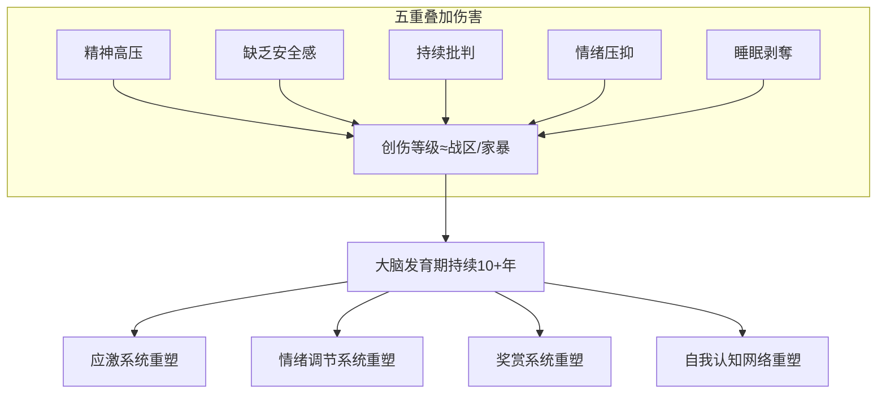
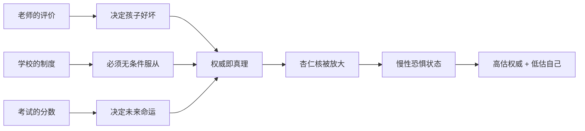
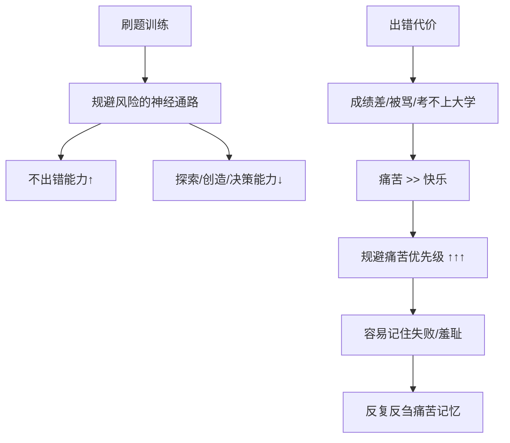
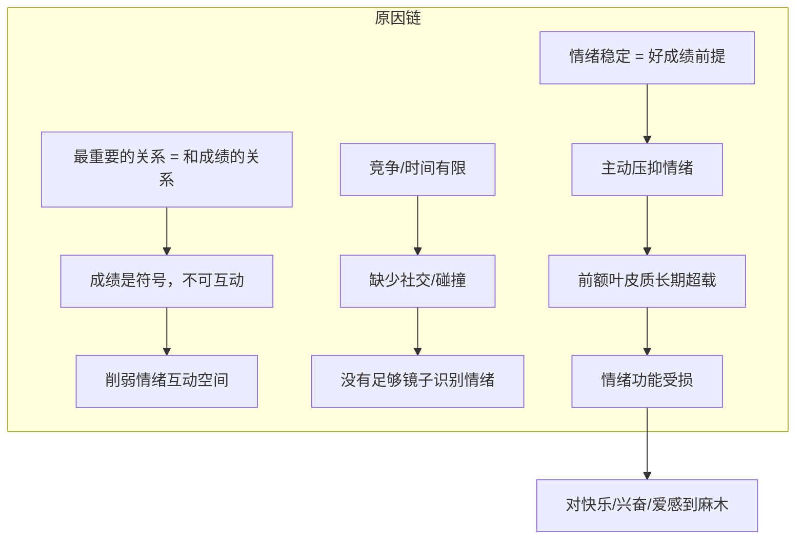
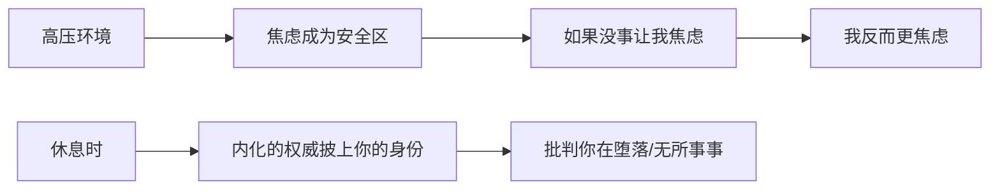
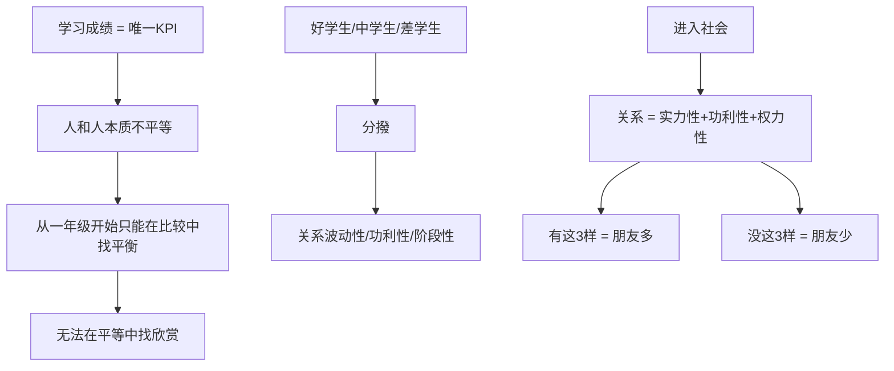
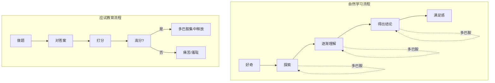
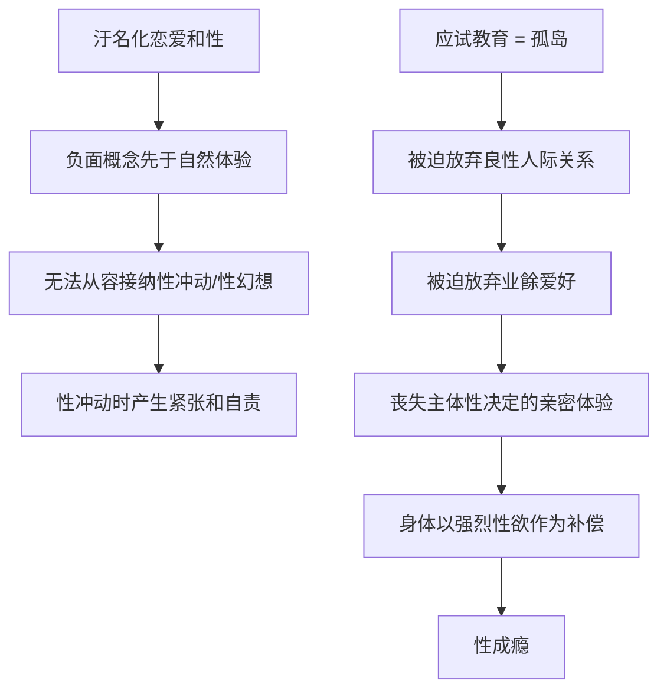
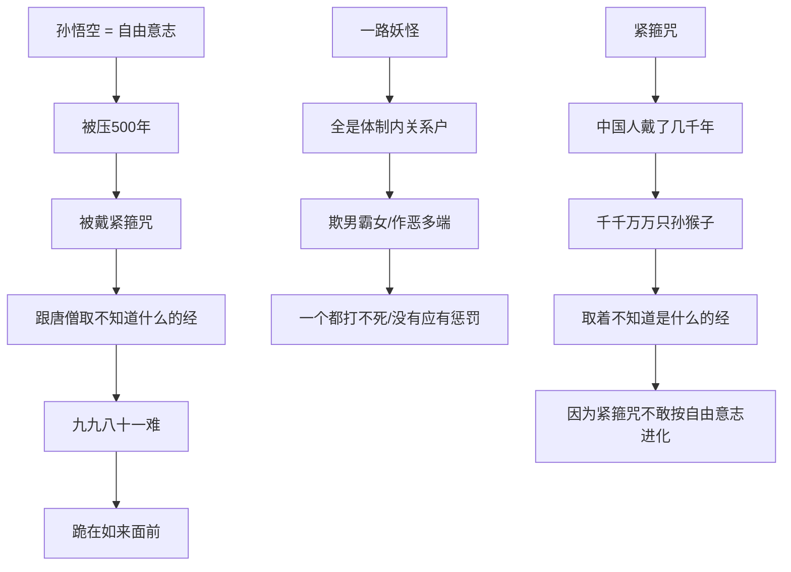
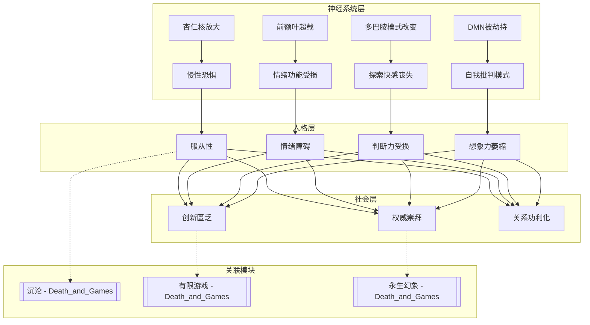

# 应试教育七宗罪: 十年制度化压抑如何重塑大脑

> **Source:** 心理学视频 - 应试教育对人格的塑造
> **Date Created:** 2026-01-11
> **Tags:** #心理学 #神经科学 #教育批判 #人格障碍

---

## 一、元认知 (Metacognition)

### 1.1 为什么需要关注这个主题？(Why)

> 💡 **核心困惑:**
> 为什么很多人高考毕业几十年后，仍然会在压力大时梦到高考？这个反复出现的梦魇背后，隐藏着什么？

很多人把"高考梦"当作简单的梦境一笔带过，却很少探究：经年累月的应试生涯，到底给我们的**精神世界**、**神经系统**和**人格**带来了哪些**不可逆的影响**。

### 1.2 核心问题 (Problem)

**应试教育 = 精神层面的奥斯维辛集中营**

共同特征：
1. **消灭人的个体性** - 通过统一标准抹杀差异
2. **恐惧和惩罚维持秩序** - 建立条件反射
3. **封闭空间切断联系** - 阻断外部参照系
4. **意识形态统一思想** - 口号替代思考



### 1.3 核心哲学 (Philosophy)

| 表层逻辑 | 深层真相 |
|:--------|:---------|
| "为了你好" | 驯化服从性 |
| "公平竞争" | 零和博弈思维 |
| "刻苦努力" | 自我剥削合理化 |
| "光明未来" | 意义系统窄化 |

> ⚠️ **核心洞见:** 应试教育高度重合人的大脑高速发展期，对孩子的影响与成年人经历战区环境**本质不同**——它直接**塑造**了神经回路本身，而非后天创伤。

---

## 二、应试教育七宗罪 (Core Framework)

### 🔴 第一宗罪: 服从性训练 — 低估自己，高估权威



**关键机制 - 习得性无助:**

> 🐘 **驯象隐喻:** 小象被绳子绑住脖子，怎么努力都挣脱不了，最终陷入习得性无助。长大后虽已强壮，因内心恐惧也不敢挣脱——他**低估了自己的力量，高估了绳子的力量**。

**神经科学解释:**

| 脑区 | 变化 | 后果 |
|:----|:----|:----|
| **杏仁核 (Amygdala)** | 被放大、长期活跃 | 负责警觉、恐惧、羞耻的区域持续激活 |
| **前额叶** | 被恐惧抑制 | 理性判断受损 |

**镜像效应:** 服从性 = 奴性，奴性的镜像 = **对权力的极度渴望**。被长期支配者会在精神世界模仿支配者。

---

### 🟠 第二宗罪: 判断力受损 — 高逻辑能力，低决策能力



**悖论解析:**

| 能力类型 | 表现 | 原因 |
|:--------|:----|:----|
| **逻辑能力** | 分析头头是道 | 刷题训练出的模式匹配 |
| **决策能力** | 遇到不确定性崩溃 | 避错神经通路抑制探索 |

> 🧠 **神经机制:** 决策能力需要对**不确定性的接受力**。但避免出错的神经通路让人一旦做带有不确定性的决策就产生**巨大焦虑**，进一步影响思维表现。

**结果:** 聪明但懦弱的性格——一辈子无法体验冒险的快乐。

---

### 🟡 第三宗罪: 情绪障碍 — 不能感知快乐，不能享受快乐

#### A. 为什么感知不到快乐？



#### B. 为什么无法享受快乐？

**核心程序:** `放松 = 堕落`



**关键脑区: DMN (自我网络/默认模式网络)**

| 正常功能 | 被训练成的功能 |
|:--------|:--------------|
| 自我反思 | 自我审问 |
| 自我想象 | 自我批评 |
| 做白日梦 | 自我羞耻 |
| 放松时产生灵感 | 空闲 = 浪费 = 负罪 |

> 🎬 **电影参照:** 《阳光灿烂的日子》里小军对米兰的各种想象——那就是DMN高度活跃的状态。

---

### 🟢 第四宗罪: 关系障碍 — 永远焦虑，永远在比



**两种普遍的人际心理障碍:**

| 类型 | 表现 | 心理机制 |
|:----|:----|:--------|
| **焦虑型** | 拼命讨好、害怕被拋弃 | "我比你位置低" |
| **回避型** | 主动疏离 | 害怕被评价、被利用 |

> 💔 **文化切断:** 文化的特质会切断人们构成某些关系的可能性——在中国，**激烈竞争同时保持真挚友谊**几乎不可能。

**出国后的延续:** 用他人所在国家的GDP、学歷来量化人的价值——看不到具体的人，只能看到可量化的东西。

---

### 🔵 第五宗罪: 思维探索能力障碍 — 别废话，上结论！



**多巴胺释放模式对比:**

| 自然学习 | 应试模式 |
|:--------|:--------|
| 分阶段逐步释放 | 仅在得高分瞬间集中释放 |
| 每个流程都快乐 | 只有结果快乐 |
| 探索本身有奖励 | 探索过程无奖励（甚至焦虑） |

**大脑自动节能:** 直接跳过推理阶段（没有快感甚至焦虑），所有快感都等揭晓答案那一刻释放。

> 📚 **表现:** "西方人写书太囉嗦" —— 因为他们重视思维过程：感性→理性，证据→结论。而应试思维**轻论证重结论**。

**社会文化后果:** "你到底支持谁？这件事到底对还是错？别囉嗦上结论！" —— 人们非常追求立场和答案的确定性，因为这能带来心理安全感和多巴胺释放。

---

### 🟣 第六宗罪: 性心理障碍 — 性压抑×性成瘾



**社会层面的表现:**

| 现象 | 心理解读 |
|:----|:--------|
| 桃色新闻狂欢 | 通过批判他人性行为合理化自己的性压抑 |
| 百度网盘链接满天飞 | 通过偷窺释放自己的性压抑 |
| 对"那点事"大惊小怪 | 如果性像吃饭喝水，为何会好奇别人吃饭喝水？ |

> 🎙️ **案例洞察:** 某大陆女性性愛博主热衷分享性话题——因为性话题是最挑战常规秩序的话题，是对过去体制性压抑生活的**创伤性补偿**。

---

### ⚫ 第七宗罪: 想象力萎縮 — 未来只可以被计划，不可以被想象

```mermaid
graph TD
    A[刚出生婴儿照片] --> B[距离高考还有6xxx天]
    B --> C[代代传递的教育焦虑]
    
    D[一年级] --> E[未来=考上好大学]
    E --> F[未来被狭小/精确定义]
    F --> G[只有一个路径/一个标准/一种正确]
    
    H[面对"未来"这个词] --> I[不启动想象系统]
    I --> J[启动任务执行系统]
    J --> K[未来=具体命令，不是可能性]
```

**负面期待的内化:**

```
幼稚園好好玩吧，小学可就没好日子了
小学还能玩一玩，初中可就没时间了
初中还能玩一玩，高中可就一天好日子都没了
```

> 🚨 **逆向逻辑:** 正常情况下，人应该越来越期待长大（更强大、更多冒险）。但在应试教育下，随年龄增长反而发生**命运自主性的倒退**。

**后果:**

| 层面 | 表现 |
|:----|:----|
| **经济层面** | 创新的匮乏 |
| **社会层面** | 崇拜权威、害怕变化 |
| **个人层面** | 停不下来的焦虑 + 对自由的恐惧 |

---

## 三、意义系统坍縮

### 3.1 流程式人生 vs 想象式人生

**典型中国人的"意义流程":**

```
努力学习 → 拿好成绩 → 进好大学 → 找好工作 → 找好对象 → 结婚生孩子
```

> ❓ 看着这个流程，你会感到兴奋/快乐/满足吗？
> 不会——因为**流程式思维带不来任何意义感**。

**原因:** 意义的生成高度依赖**个人主体性**和**想象力**。

```mermaid
graph LR
    A[想象] --> B[美好未来/伟大公司/完美爱情]
    B --> C[主动把自己放进美好预期]
    C --> D[自己有意义 + 生命有意义]
    D --> E[对工作/关系/挑战有期待]
    
    F[无想象] --> G[内在没有积极/热情/丰富的"我"]
    G --> H[黑色影子落在灰色背景板上]
    H --> I[没有回声的黑洞]
    I --> J[人到中年/大学毕业 = 空虚]
```

### 3.2 三类贫困户

| 类型 | 特征 |
|:----|:----|
| **时间贫困户** | 所有时间用于满足当下指标 |
| **意义贫困户** | 行为模式被彻底工具化 |
| **情感贫困户** | 无法感受温度/感情/人性光辉 |

---

## 四、西游记隐喻



> 🐵 **吴承恩的隔空共鸣:**
> - 500年前写出西游记
> - 创造似猴似人的经典角色（300年后达尔文才写进化论）
> - 没有基因技术却想象出"拔猴毛生无数猴子"

**中国古典小说的共同底色:** 无论是《西游记》、《红楼梦》还是《水滸传》，都体现出对权威的**深深恐惧**和**无力感**。过程中的斗争只是表现，最终的失败都是必然——像在诉说中国人意识深层的**集体潜意识**。

---

## 五、反模式 (Anti-Patterns)

### ❌ 反模式1: 海淀妈妈式时间填满

**表现:** 孩子时间从早到睡前，每15分钟都安排极其緊湊。即便是玩也要"玩中学、学中玩"，有具体的目标和知识点。

**危害:** 孩子的DMN被训练成自我审问模式，一旦休息就开始批判自己在堕落。

**修正:** 保留大块无结构时间，允许孩子发呆、做白日梦、漫无目的地玩耍。

**✅ 正向案例:** 芬兰教育模式——课间长达15-20分钟的自由活动时间，被证明能提高学习效果和创造力。

---

### ❌ 反模式2: 成绩大排名公示

**表现:** 从一年级开始年级、班级大排名，分为好学生、中学生、差学生。

**危害:** 从幼年开始建立人与人之间不平等的关系模式，培养功利性交往心态。

**修正:** 取消公开排名，采用个人成长档案替代横向比较。

**✅ 正向案例:** 德国小学禁止给学生打分排名，鼓励自我参照式评价（和过去的自己比）。

---

### ❌ 反模式3: 性教育汙名化

**表现:** "女德课"要求女生潔身自好，安全套被发现直接开除。

**危害:** 负面概念先于自然体验，导致无法从容接纳性冲动，甚至产生性心理障碍或病态补偿。

**修正:** 提供科学、积极的性教育，将性视为人格健康发展的自然部分。

**✅ 正向案例:** 荷兰从4岁开始进行渐进式性教育，青少年性相关问题发生率全球最低。

---

## 六、系统关联 (System Interlinkages)



---

## 七、术语表 (Glossary)

| 术语 | 英文 | 定义 |
|:----|:----|:----|
| **习得性无助** | Learned Helplessness | 长期失败后形成的"无论怎样努力都没用"的信念 |
| **杏仁核** | Amygdala | 大脑中负责警觉、恐惧、羞耻反应的区域 |
| **前额叶皮质** | Prefrontal Cortex | 负责理性决策、情绪调节的大脑区域 |
| **DMN (自我网络)** | Default Mode Network | 休息时自我反思、想象的脑区，做白日梦时高度活跃 |
| **焦虑型依附** | Anxious Attachment | 害怕被拋弃，拼命讨好的人际模式 |
| **回避型依附** | Avoidant Attachment | 害怕被评价/利用，主动疏离的人际模式 |
| **多巴胺** | Dopamine | 与奖励、动机、快感相关的神经递质 |
| **应试教育七宗罪** | Seven Sins of Exam Education | 服从性、判断力、情绪、关系、思维、性、想象力障碍 |

---

## 八、公式表 (Formula Table)

| 公式名称 | 公式 | 说明 |
|:--------|:----|:----|
| **恐惧投射公式** | `权威感知 = 实际权力 × 恐惧放大系数` | 被驯化者高估权威、低估自己的机制 |
| **决策抑制公式** | `决策能力 = 逻辑能力 - 避错焦虑` | 解释高IQ低决策力的悖论 |
| **多巴胺模式公式** | `探索动机 ∝ 过程奖励 / 结果奖励` | 过程无奖励导致探索动机萎縮 |
| **意义生成公式** | `意义感 = 主体性 × 想象力` | 流程式思维无法产生意义感的原因 |
| **关系功利度公式** | `关系质量 ∝ 1 / (比较强度 × 竞争压力)` | 高竞争环境压缩真挚友谊的可能性 |

---

## 九、深度概念详解

### 9.1 紧箍咒隐喻

紧箍咒不仅仅是外在的控制工具，更是一种**内化的心理机制**——即使唐僧不念咒，孙悟空也会因为害怕被念咒而自我约束。

这与应试教育的终极效果完全一致：**外在权威内化为自我审查**。毕业后没有老师打分了，但你依然会用内化的标准不断评判自己。

### 9.2 战区对比

为什么将应试教育比作战区环境？关键差异：

| 维度 | 战区创伤 | 应试创伤 |
|:----|:--------|:--------|
| 时间 | 通常数月至数年 | 持续10-15年 |
| 发育重合度 | 成年后遭遇 | 完全覆盖大脑发育期 |
| 创伤性质 | 后天PTSD | 原发性神经塑造 |
| 可逆性 | 相对可治疗 | 需要大量"反学习" |

战区创伤是在已形成的人格上留下伤痕；应试创伤是**直接塑造人格本身**。

---

> 📎 **延伸阅读:**
> - [Death_and_Games.md](file:///Users/yixuanzhang/Library/Mobile%20Documents/com~apple~CloudDocs/%E5%B7%A5%E4%BD%9C/%E4%BF%AE%E8%8D%B7/Asher_Source_Profile_v1/02_Skill_Tree/Modules/Death_and_Games/Death_and_Games.md) - 沉沦与本真的存在哲学
