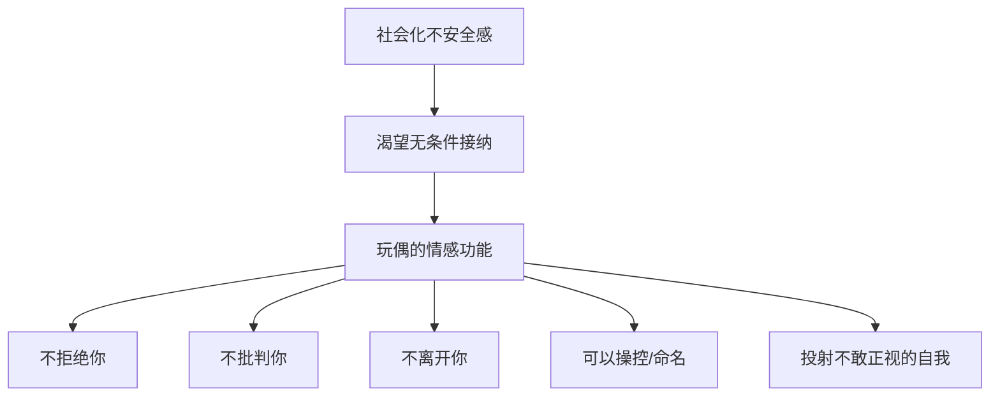
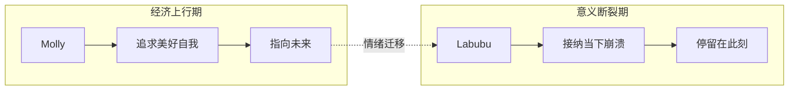
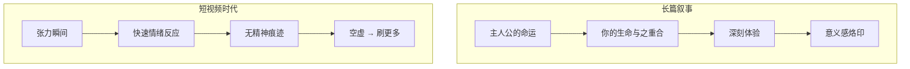
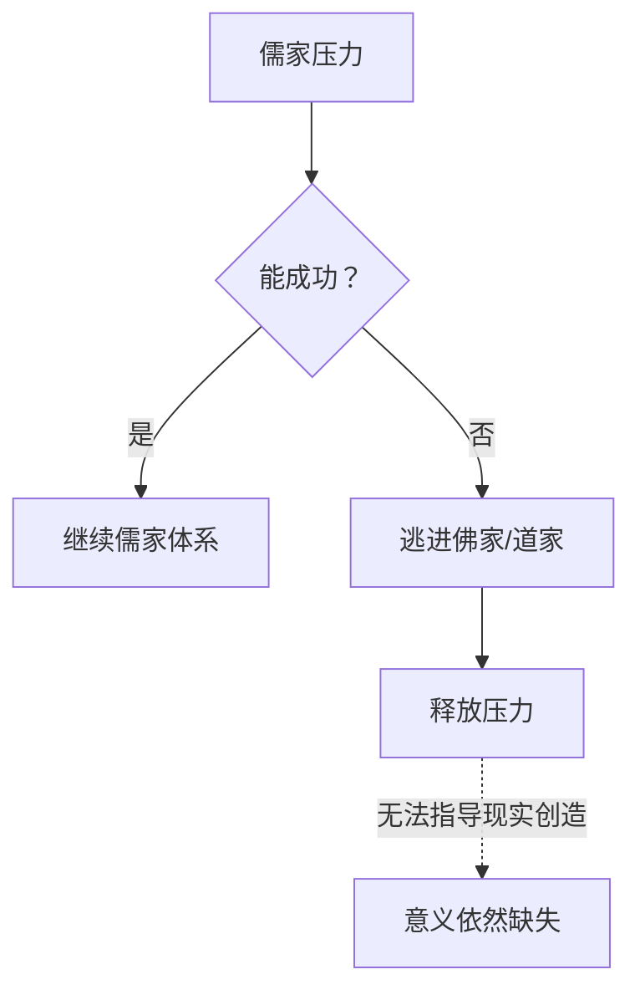
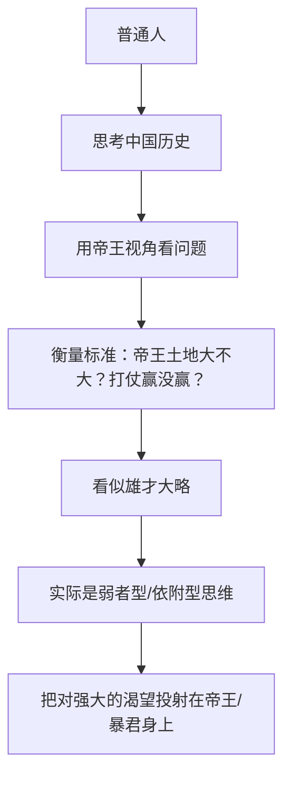
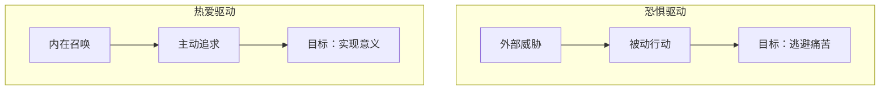
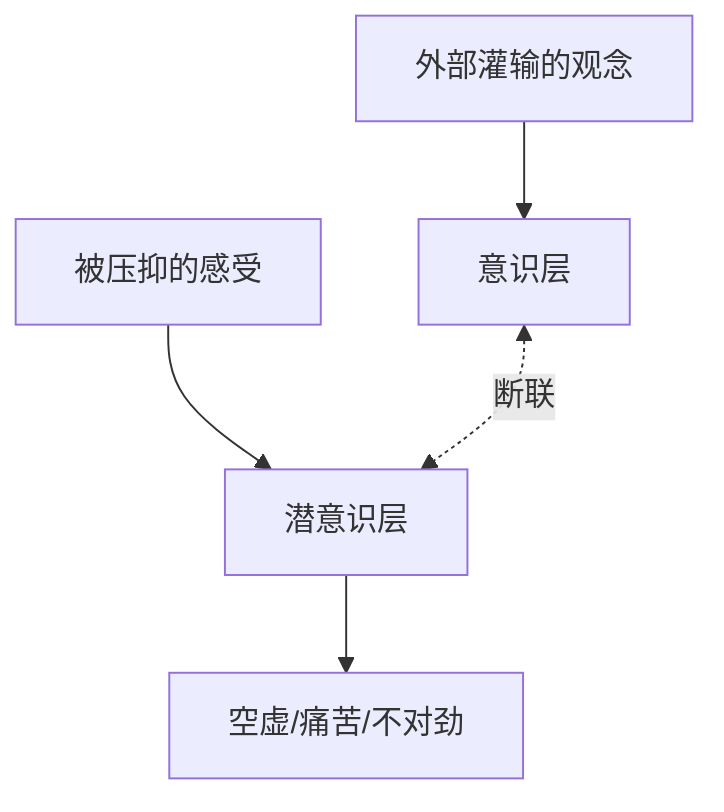
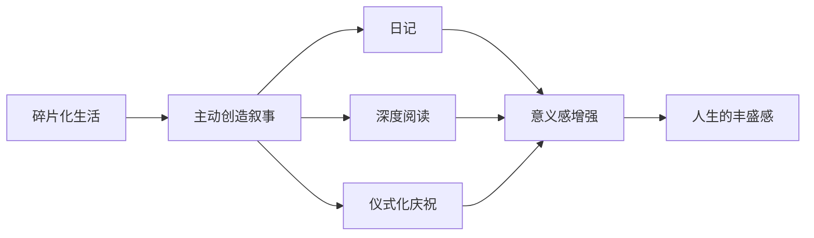
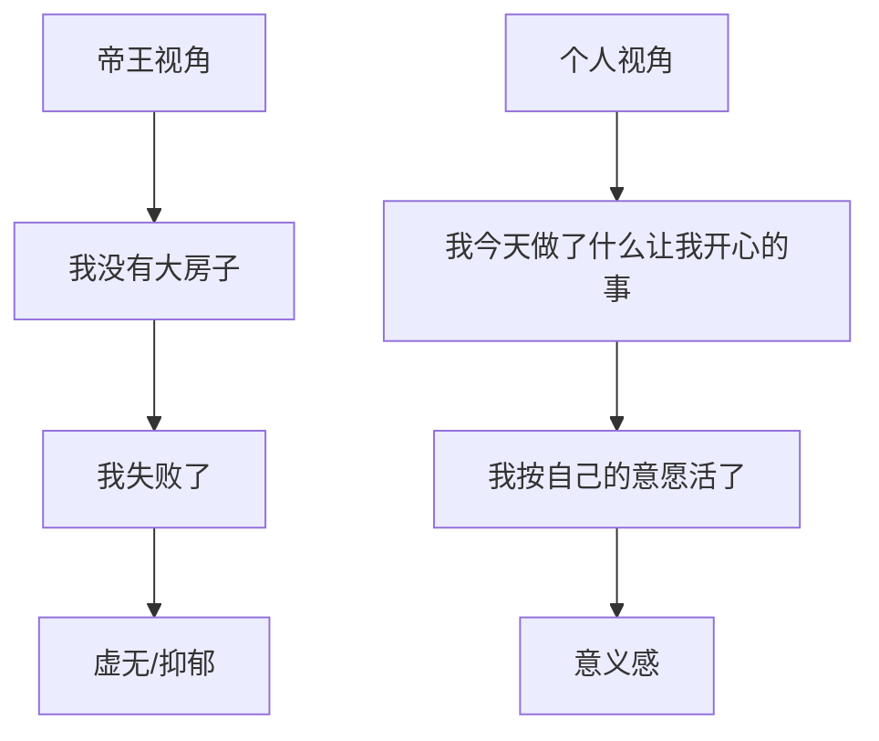

# 中国人的叙事危机 (Narrative Crisis of Chinese People)

> **Tags:** `社会心理`, `文化批评`, `意义构建`, `历史叙事`
> **Date Added:** `2026-01-19`
> **一句话总结 (One-Liner):** 中国人的精神空虚源于公共叙事的长期缺失——没有一个贯穿千年、人人可参与的意义框架，个体只能在血缘与现实中寻找碎片化的慰藉。
> **关键协议 (Critical Protocol):**
> 1.  **结构服从内容:** 本文以"玩偶现象 → 情绪迁移 → 叙事危机 → 历史根因 → 个人出路"为逻辑主线
> 2.  **原子级视觉化:** 每个核心概念配图
> 3.  **拒绝阉割:** 保留原文所有关键隐喻

---

## 1. 元认知 (Metacognition) - 为什么这个问题重要

### 问题定义

当代中国人普遍感受到一种难以言说的**精神空虚**——不是物质匮乏，而是"意义感的荒芜"。这种空虚不是个人问题，而是**结构性的集体困境**。

核心问题：**为什么中国人不容易感受到快乐？为什么不容易感受到人生意义？**

这个问题的答案不在个人心理，而在**历史文化结构**——中国民间缺乏一个像西方圣经那样的、贯穿千年的公共叙事框架。

### 核心哲学

> "人是靠故事来理解世界的。我们每个人都是活在故事当中的。"

当一个人把自己的人生纳入一个"高尚而连贯的叙事"中，他会感受到意义。反之，当这个叙事断裂或缺席，人就会陷入悲观和虚无。

### 系统定位 (System Role)

本模块是理解当代中国社会心理问题的**根因分析框架**，与以下模块形成上下游关系：
- **上游:** 中国文化深层结构、差序格局
- **下游:** 内卷、躺平、中年危机、教育焦虑

> [!IMPORTANT]
> **核心洞察 (Key Insight):** Labubu 和 Molly 的流行趋势变化，不是简单的商业现象，而是**集体情绪迁移的精准映射**——从"追求美好未来"到"拥抱当下崩溃"。

---

## 2. 核心架构 (Core Framework - The "What")

### 2.1 玩偶：成年人的情绪庇护所

玩偶对人类的吸引力是**普遍性的情感倾向**，其功能随年龄变化：

| 阶段 | 功能 | 心理机制 |
|:---|:---|:---|
| **童年期** | 替代母亲的安慰作用 | 缓解分离焦虑，感受"我没有被抛弃" |
| **成年期** | 社会化不安全感的出口 | 相比复杂的成人关系，玩偶"不会拒绝、不会批判、不会离开" |

**玩偶的核心吸引力：**



> 玩偶可以承载转化、寄託我们不敢正视的自己——痛苦、愤怒、渴望、懦弱。

### 2.2 Molly vs Labubu：两种集体情绪的画像

这两款玩偶的交替流行，精准映射了社会情绪的**快速迁移**：

| 维度 | **Molly** (2016-2021) | **Labubu** (2022-) |
|:---|:---|:---|
| **外观气质** | 漂亮、精致、傲娇、高冷、小资 | 邪气、鬼马、癲狂、有点醜、獠牙凶 |
| **情绪基调** | "我值得被呵护" | "我现在就要崩溃" |
| **时间指向性** | 指向**未来**的期待 | 只属于**当下** |
| **人格投射** | 理想化自我 (我想成为谁) | 当下状态 (我已经这样了) |
| **时代背景** | 经济上行期的人格追求 | 意义断裂、情绪外溢的碎片时代 |
| **代表歌曲类比** | — | 单依纯《李白》"试试又能怎？如何呢？" |



**关键特征：两者都是"空心人"**

与奥特曼、哆啦A梦、小熊维尼等有丰富背景故事的IP不同，Molly 和 Labubu 都**没有叙事背景**。这反而成为优势——"一切皆可装"，它们是时代心理的**空白投影幕布**。

### 2.3 意义的本质：一个与时间合并的向量

> [!IMPORTANT]
> "意義最大的特點就是它有方向性，它是一個與時間合併的向量。"

```
意义 = 事物 × 时间方向 × 积极变化
```

只有当一个事物或一个人**被放在时间的坐标轴上，持续向右产生积极变化**，才会被人们认为"有意义"。

**视觉理解：**

```
                    意义感
                      ↑
    ─────────────────┼─────────────────→ 时间
                     |
         过去        |        未来
                    现在
                     
    Labubu 停留在此点 (无时间指向)
    Molly 有箭头指向右侧 (有未来期待)
```

**这就解释了为什么 Labubu 代表意义的缺失：**
- 崩溃是一种**没有时间指向**的情绪
- 没有人会说"我希望明年崩溃"
- 它只存在于**当下这一刻**

### 2.4 长篇叙事 vs 短视频：意义感的生成机制对比

| 维度 | **长篇作品** (小说/电视剧) | **短视频/新闻** |
|:---|:---|:---|
| **体验方式** | 和主人公"跳双人舞"，共享命运 | 频繁转场的"吃瓜群众" |
| **时间结构** | 有起伏、有因果、有成长和救贖 | 张力瞬间的碎片堆砌 |
| **情绪反应** | 深刻烙印在你阅读的那段时光 | 快速哭、快速笑，看后无痕迹 |
| **意义生成** | 通过参与命运体验，产生意义感 | 无法构建意义，反而加倍空虚 |
| **隐喻** | 命运花园，每人收获不同智慧 | 快餐连锁，吃完即忘 |



> "敘事不是說教，它更像是一種充滿了無數植被的命運花園。每個人進去逛一圈，關於命運的體驗和收穫是不同的。"

---

## 3. 中国叙事危机的历史根源

### 3.1 西方：一部80万字的公共故事

西方社会有**基督教**作为贯穿千年的公共叙事：

| 要素 | 内容 |
|:---|:---|
| **体量** | 圣经约80万字 (繁体) |
| **时间结构** | 从创世到末日审判的完整时间线 |
| **三段敘事** | 起源(上帝创世/人有原罪) → 救赎(耶稣降世赎罪) → 终极(末日审判/永生或地狱) |
| **传播方式** | 每周教堂集体聆听，代代相传 |
| **现代痕迹** | 烙印在法律、艺术、日常用语中 (如《星际穿越》《黑客帝国》的圣经隐喻) |

**这套叙事为每个人回答了人生四大问题：**
1. 你从哪里来？
2. 你为何而生存？
3. 你应当如何活着？
4. 你将往哪里去？


> "所有在场的人、不在場的人、活著的人、死去的人，一旦他們把自己的人生納入這套固定的敘事，他們就自然而然的成為了超時空的命運共同體。"

### 3.2 中国：碎片化的民间叙事

| 维度 | 西方 (基督教) | 中国 (民间) |
|:---|:---|:---|
| **公共文本** | 80万字圣经 | 无统一长篇文本 |
| **神话特点** | 众神嵌套在连续故事中，各有缺陷 | 孤立事件，神仙是超级完人 |
| **典型神话** | 希腊神话、圣经故事 | 盘古开天、女娲补天、夸父追日 (无连续性) |
| **道德叙事** | 有缺陷的人物在故事中成长 | 二十四孝：道德拉到制高点的碎片故事 |
| **史诗性** | 可从前向后延续的链条 | 孤立事件，非史诗链条 |

### 3.3 儒释道：为何无法担当公共叙事

| 教派 | 核心主张 | 为什么无法成为公共叙事 |
|:---|:---|:---|
| **儒家** | 服从社会伦理体系 | 无神论现实主义，不鼓励个体探索创造 |
| **佛教** | 脱离苦海、修行解脱 | 语言晦涩，实际成为"儒家失败后的逃避地" |
| **道教** | 顺其自然、返璞归真 | 不关心社会，敘事性很弱 |



> "佛教在中國有一種緩解儒家壓力的作用。人一旦在儒家體系內無法實現成功和理想，馬上就會逃進佛家。"

### 3.4 皇权叙事：弱肉强食的历史书写

| 特征 | 影响 |
|:---|:---|
| **皇权更迭频繁** | 几十年、几百年换一次，敘事短暂 |
| **历史书写者** | 知识分子为皇权服务，"谁赢谁书写历史" |
| **对失败者的态度** | 不欣赏失败者，不给失败者安美学色彩 |
| **形成的思维** | "胜利有时是邪恶的，失败有时是光荣的"——这种观点无法形成 |
| **深层逻辑** | 自然形成**弱肉强食**，不敬畏制度和契约 |

**这形成了一种扭曲的"帝王视角"思维：**



> "這種看起來像是一種雄才大略式的思維模式，其實呢，是一種弱者型的依附型的思維模式。"

---

## 4. 叙事匮乏的社会后果

### 4.1 差序格局：无法超越血缘的信任

费孝通的经典理论解释了中国人的关系模式：

```
             自己 (中心)
              ↓
         ┌───┴───┐
        家人    亲戚
              ↓
         熟人/朋友
              ↓
         陌生人 (无信任)
```

**关键问题：**
- 家族之外没有现成的、基于集体共识的信任机制
- 走出家门后"无人可信，法律又不健全"
- 自然退行到原始的血缘关系中

**双重后果：**
1. 加强家族对个体的控制
2. 不利于形成高效的契约社会

### 4.2 意义感的塌陷

| 缺失的归属感 | 导致的行为模式 |
|:---|:---|
| 超越血缘的命运共同体 | 只能在血缘中找意义 |
| 长期可信赖的公共叙事 | 骨子里的实用主义和现实主义 |
| 自我超越性的创造路径 | 重视传宗接代、光宗耀祖 |

> "人對於意義的至高體驗是對於自我身份的創造。但是呢，這個在我們古代的社會體系當中是沒有路徑的。"

### 4.3 中年危机的必然性

当一个人无法在"狭小的公认上升路径"中实现成就时：

| 症状 | 填充方式 |
|:---|:---|
| 精神虚无、漂浮、麻木 | 用权力、金钱、出轨填充 |
| 觉得"活成了自己最讨厌的人" | 放弃自我，深度介入孩子人生 |
| 对善良和道德产生否定 | 陷入抑郁，觉得社会丑陋 |

> "他甚至連他曾經引以為傲的善良和道德都會抱以否定。他除了自身的家庭家族，他不知道自己可以永恆的屬於誰。"

### 4.4 驱动力的差异：恐惧 vs 热爱

| 驱动中国人 | 驱动西方人 (有叙事传统) |
|:---|:---|
| 自尊的受辱 | 热爱 |
| 福利的短缺 | 召唤 |
| 养老的焦虑 | 由内而外的信仰 |
| **由外而内的恐惧** | **由内而外的追求** |



> "我們中國人勤於勤奮，但不敢於勇敢。因為我們在意現實，因為我們恐懼生存。"

### 4.5 悲情美学：中国文人的虚无底色

```
"滾滾長江東逝水，浪花淘盡英雄
是非成敗轉頭空，青山依舊在，幾度夕陽紅"
```

这段歌词看似悲壮，实则是**虚无美学**：
- 不是"英雄虽败犹荣"的悲壮
- 而是"不管成功还是失败，都毫无意义"的虚无

| 特征 | 解读 |
|:---|:---|
| 哀伤、不得志、愁苦为美 | 特定的悲情美学传统 |
| 缺乏"与黑暗势力你死我活、虽败犹荣"的悲壮 | 文化不欣赏失败者 |
| 苏轼一生郁郁不得志 | 人们喜欢他，还是一种悲情共振？ |

> "這些所謂的英雄人物，匆忙一生，居然都沒有認領自己是誰。"

---

## 5. 执行协议 (Execution Protocol) - 个人如何构建意义

### Phase 1: 认识意识与潜意识的断裂

**问题诊断：**
- 中国教育"观念为先"，等级强迫和灌输无处不在
- 不断构建你的意识，同时压抑你的潜意识
- 导致意识和潜意识**长期断联**



> "我們往往不去思考我們感受到的，而會去思考我們以為正確的。"

### Phase 2: 忠于感受

**核心心法：**

> "很多學習繪畫的人會比不學習繪畫的人看到更多的光和更多的顏色。不是因為他們學到了更多，而是因為他們把所有的感受都投入到了自己所看到的一切。"

**实操：**
- 把注意力从"我以为正确的"转移到"我感受到的"
- 感受是潜意识在替你表达
- 忠于感受 = 与潜意识重建连接

### Phase 3: 主动创造个人叙事

| 行动 | 频率 | 作用 |
|:---|:---|:---|
| 写日记 | 每天 | 让生活有记录、有反思 |
| 看有深度的电影 | 每周 | 参与他人命运，产生共鸣 |
| 看有意思的小说 | 每月 | 建立长篇叙事体验 |
| 与亲友隆重庆祝节日 | 每个节日 | 创造意义锚点 |
| 把时间放进深度体验 | 持续 | 增强人生的丰盛感和意义感 |



### Phase 4: 与命运共同创造

> "命運最眷顧的並非順從她的人，而是能與她共同創造的人。"

**开悟的喜悦来源：**
- 自我同一性的高度整合
- 意识和潜意识不再彼此陌生，而是高度亲密和默契
- 内在矛盾自然消失
- 存在不再是弥散的，而是**确定的**
- 你会真正感受到"存在的恩典"

---

## 6. Anti-Patterns (反模式 - The "Don'ts")

### 陷阱 1：用"帝王视角"评价自己的人生

- **Trap:** 用自己没有大房子、职位不高、没有实现"成功"来否定自己的人生价值
- **Why:** 从小被灌输"历史=帝王将相史"，不自觉把帝王的成功标准套在自己身上
- **Fix:** 意识到这是**弱者型依附思维**的表现；用"我今天有没有按自己的意愿活"来评价
- **Positive Scenario:** 一个普通的咖啡店老板，每天按自己的节奏生活，和常客建立了真诚的关系，周末陪家人爬山——他的人生意义感可能远超很多"成功人士"



### 陷阱 2：把刷短视频当成"休息"

- **Trap:** 工作累了就刷短视频，以为这样是在休息和放松
- **Why:** 短视频带来的是**碎片化的情绪刺激**，而非真正的精神恢复
- **Fix:** 用散步、冥想、阅读、和朋友聊天来替代
- **Example:** 刷了2小时短视频后，你会发现自己更加空虚，而不是更有精神
- **Positive Scenario:** 用2小时看一部好电影，结束后你会有收获感，甚至产生对人生的新思考

| 活动 | 即时感受 | 事后感受 | 意义积累 |
|:---|:---|:---|:---|
| 刷短视频 | 爽 | 空虚 | 无 |
| 看电影/读书 | 需要专注 | 充实 | 有 |

### 陷阱 3：只在血缘关系中寻找意义

- **Trap:** 把所有的意义感寄托在孩子身上，深度介入孩子的人生
- **Why:** 自己的意义感已经塌陷，只能通过控制孩子来获得代偿
- **Fix:** 在血缘之外发展兴趣、友谊、创造性活动
- **Nuance:** 爱孩子没有错，但如果你的全部意义都来自孩子，那是一种依附，而非爱
- **Positive Scenario:** 一位中年母亲在孩子上大学后，开始学习绘画、加入读书会、和旧友恢复联系——她发现自己的人生依然丰盛

### 陷阱 4：用"成功学"弥补意义缺失

- **Trap:** 相信"弱者服从规则，强者改变规则"，追求不择手段的成功
- **Why:** 这是弱肉强食文化的内化，本质上是对规则和契约的不信任
- **Fix:** 意识到真正的强大来自**内在的笃定**，而非外在的权力
- **Example:** "黄灯亮的时候敢于踩油门的人"——这种思维带来的是焦虑，而非真正的自由
- **Positive Scenario:** 一个企业家选择诚信经营，短期可能慢一些，但建立了可持续的信任资本

---

## 7. Glossary (术语表)

| 术语 (EN) | 术语 (CN) | 定义 |
|:---|:---|:---|
| Narrative Crisis | 叙事危机 | 因公共叙事缺失导致的集体性意义感塌陷 |
| Hollow Person | 空心人 | 没有背景故事的IP形象，可承载任意情绪投射 |
| Collective Unconscious | 集体潜意识 | 荣格概念：一个社会群体共享的深层心理模式 |
| Meaning Vector | 意义向量 | 意义的本质是与时间合并的方向性变化 |
| Differential Mode of Association | 差序格局 | 费孝通概念：以自己为中心、由近及远递减的信任圈 |
| Folk Narrative | 平民叙事 | 来自民间、人人可参与的公共故事传统 |
| Melancholic Aesthetics | 悲情美学 | 以哀伤、不得志、愁苦为美的文化倾向 |
| Self-Identity | 自我同一性 | 意识与潜意识高度整合的状态 |
| Consciousness Dissociation | 意识-潜意识断联 | 意识层与潜意识层长期分离的心理状态 |
| Temporal Directionality | 时间指向性 | 一种情绪或期待是否指向未来的特性 |
| Atomization | 原子化 | 个体与社会联结断裂，各自孤立的状态 |
| Public Narrative Structure | 公共叙事结构 | 贯穿社会的、人人可参与的意义框架 |
| Community of Destiny | 命运共同体 | 因共享叙事而形成的跨时空群体认同 |
| Pragmatism | 实用主义 | 以眼前现实利益为导向的思维方式 |
| Fear-Driven vs Love-Driven | 恐惧驱动 vs 热爱驱动 | 两种行动的底层动力来源 |

---

## 8. Formula Table (公式表)

| 公式名称 | 公式 / 逻辑 | 变量定义 |
|:---|:---|:---|
| **意义公式** | `意义 = 事物 × 时间方向 × 积极变化` | 只有在时间轴上持续产生积极变化，才有意义感 |
| **玩偶投射公式** | `情感寄托 = 社会化不安全感 × 可控需求` | 越是社交中受挫，越渴望一个"不拒绝、可操控"的对象 |
| **叙事缺失公式** | `意义感 = 归属感 × 公共叙事强度` | 没有公共叙事，归属感无从建立，意义感必然塌陷 |
| **驱动力公式** | `行动力 = 恐惧 × 外部压力 ∨ 热爱 × 内在召唤` | 两种驱动模式，前者被动、后者主动 |
| **自我整合公式** | `喜悦 = 意识与潜意识的一致性` | 当两者高度亲密默契，内在矛盾消失，喜悦自然产生 |
| **短视频空虚公式** | `空虚感 = 情绪刺激频率 / 意义积累度` | 刺激越频繁、积累越少，空虚感越强 |

---

## 备注与引用 (Notes & References)

- **素材来源:** 用户提供的 Transcript "从Labubu看中国人的敘事危機"
- **关键引用:** 费孝通《乡土中国》(差序格局)、荣格 (集体潜意识)
- **相关模块:** 中国文化深层结构、内卷研究、中年危机分析
