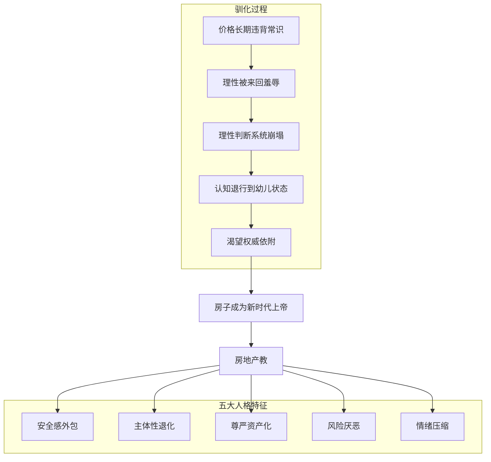
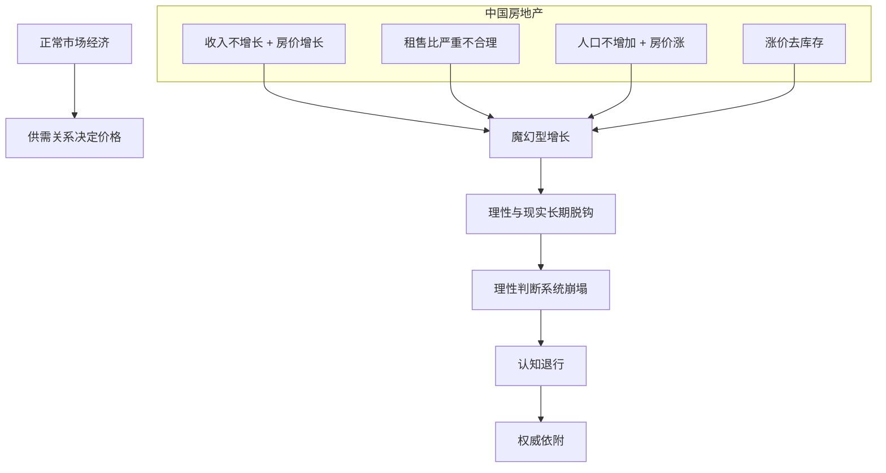
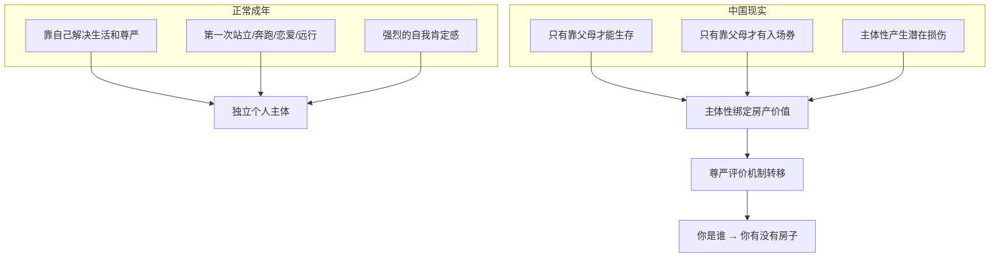
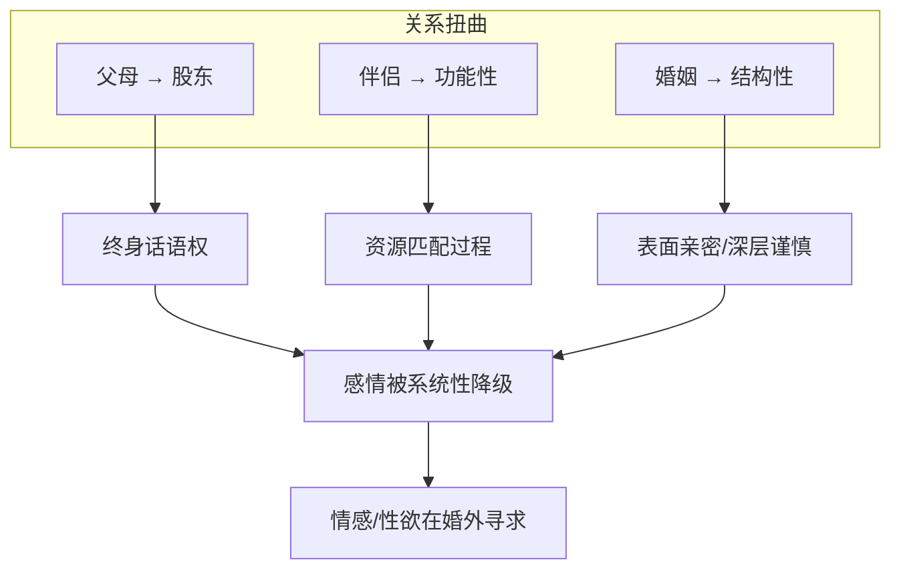
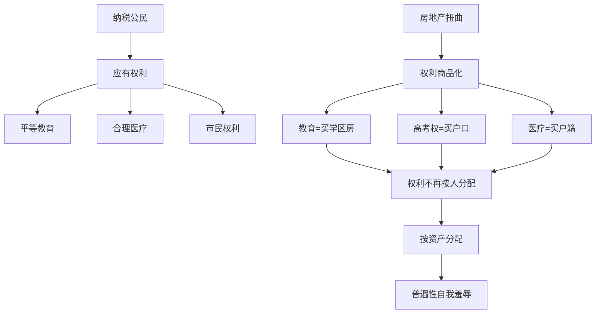
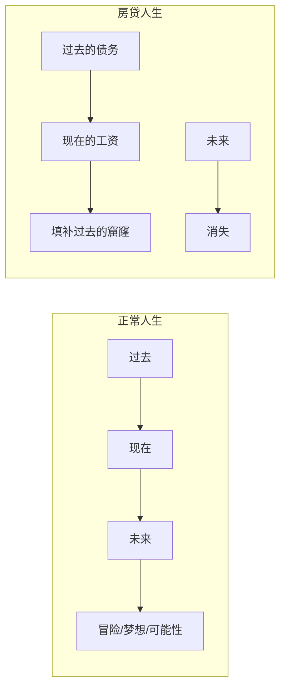
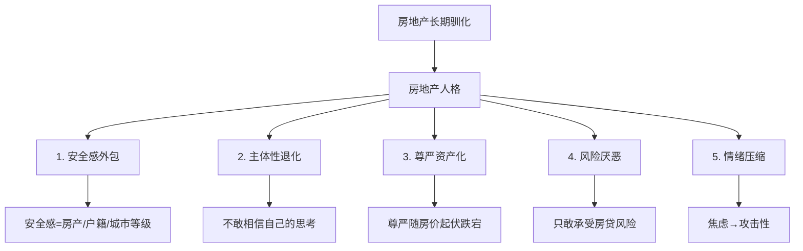
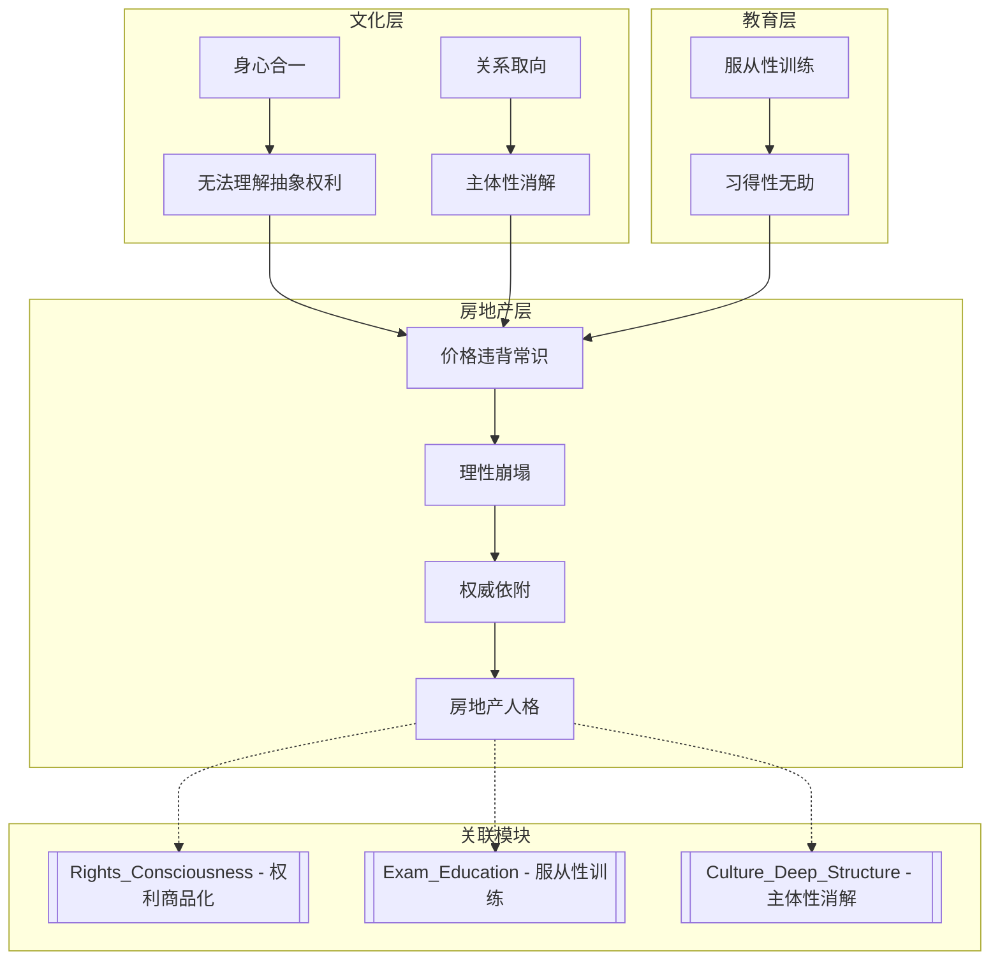

# 房地产驯化论: 中国人是如何被房地产改变人格结构的

> **Source:** 视频 - 房地产如何驯化中国人
> **Date Created:** 2026-01-12
> **Tags:** #房地产 #认知退行 #主体性丧失 #尊严资产化 #社会批判

---

## 一、元认知 (Metacognition)

### 1.1 为什么需要关注这个主题？(Why)

> 💡 **核心困惑:**
> 房子在中国有着**宗教一般的地位**。它从简单的资产，渗透进个人尊嚴，转变成让十几亿中国人五体投地的终身信仰。这中间经历了一个长达几十年的**全民驯化过程**，根本性地改变了中国人的理性思维和人格结构。

### 1.2 核心观点 (Core Thesis)

> [!IMPORTANT]
> **本期核心洞见:** 房地产给中国人带来的心理效应，完全符合**心理创伤的三个判断依据**：
> 1. 感受弥漫心中、长期重复、无法退出
> 2. 与生存安全和身份尊严直接绑定
> 3. 个体无法通过个人努力彻底解除
>
> 它塑造了一种高度趋同的**房地产人格**。

### 1.3 系统定位 (System Role)

本模块是理解中国社会心理的**资产-人格层**，解释"为什么中国人活得那么累"。与以下模块关联：
- `Rights_Consciousness_Deficit`: 权利商品化是权利意识缺失的延续
- `Exam_Education_Psychology`: 服从性训练为驯化奠定基础
- `Chinese_Culture_Deep_Structure`: 主体性消解的另一维度

---

## 二、核心架构 (Core Framework)

### 2.1 五大驯化机制

| 机制 | 表现 | 后果 |
|:----|:----|:----|
| **理性放弃** | 价格长期违背常识 | 认知退行、权威依附 |
| **主体性转移** | 个人尊严→房产价值 | 焦虑感弥漫社会 |
| **关系功利化** | 股东型父母、功能性伴侣 | 感情被系统性降级 |
| **权利商品化** | 公民权利需要购买 | 普遍性自我羞辱 |
| **未来萎缩** | 房贷偷走未来选择 | 创新能力被抑制 |

---

## 三、深度解析: 五大驯化机制

### 3.1 机制一: 理性的彻底放弃 → 权威依附

> **隐喻保留 (赵本山短剧):** "这个男人本来以为自己和所有人一样，每次吃完饭拉的都是屎。但有一天开始，他每次拉屎的时候，屎掉下来都会被偷偷替换成鸡蛋。他发现自己每次使劲拉屎，都会拉出几个鸡蛋。他忍不住怀疑：**我到底是一个人，还是一个老母鸡转世？**"

**心理机制:**
- 当理性被徹底放弃 → 主体性丧失
- 认知能力退行到**无法自我掌控的幼儿状态**
- 充满被抛弃的担忧和恐惧
- 充满对权威的渴望和依附

**房子成为"新时代上帝":**
- 不可预测、力量强大、永远增长
- 决定社会地位、个人尊嚴、孩子教育、市民权利
- 每套房子价值不同 → 层层鄙视链
- 构成**所有人虔诚跪拜的房地产教**

### 3.2 机制二: 主体性被房产取代 → 尊严资产化

> **隐喻保留:** "每个人在第一次站立、第一次奔跑、第一次恋爱、第一次给自己买大额资产的过程中，都会产生一种强烈的自我肯定感：**我作为一个独立的个人主体，我可以。我被这个世界深度肯定着。**"

**尊严评价机制被扭曲:**

| 正常社会 | 房地产教社会 |
|:--------|:-----------|
| 努力工作→职位提升 | 一切努力不如一套房 |
| 创业成功→公司越好 | 开厂十年不如炒房一年 |
| 投资收益→眼光有回报 | 买房时机>个人能力 |
| 个人正直勤奋赢得尊重 | 被拆迁比勤奋更受尊重 |

> **案例保留:** "一个从小地方出身的人来到北上广，一年二三十万收入，他就是勤劳有尊嚴的人。但在房地产教的逻辑下——只要没有房子，你就是'北漂'，就是被嘲讽的'小镇做题家'。你的孩子没法接受优质教育，你会被同学和老家老乡看不起。"

### 3.3 机制三: 亲密关系功利化 → 感情降级

**股东型父母:**
- 父母对成年阶段的介入 = 侵蚀孩子的主体性
- 父母作为股东：终身话语权
- 结婚/工作/生孩子 = 考虑父母感受
- **没有合同，但终身有效的心理债务**

**功能性伴侣:**
- 有感情没房子 → 分手
- 有房子没感情 → 结婚
- 择偶 = **和感情无关的精准资源匹配**

> **案例保留:** "一个男生说，他从中学到大学就没有女生喜欢过他。但自从在北京有了房子，他变得很自信，相亲相一个中一个，终于感受到了'万花丛中过，片片都沾身'的快乐。"

**结果:** 虽然性资源变多了，但内心深处依然有**巨大的失落感和空虚感**——因为他没有真正得到一个真实的人的真实肯定。

### 3.4 机制四: 公民权利商品化 → 自我羞辱

> **洞察保留:** "人出生最大的分水岭就是'羊水'——每个人从出生起，个人权利不再以人为单位分配，而是**以资产为单位分配**。这就带来了比贫富羞辱更大的**权利羞辱**。"

**自我羞辱的内化:**
- 没法和女朋友结婚 = **我没本事**
- 孩子上不了好学校 = **我没本事**
- 父母在北京看不起病 = **我没本事**
- 整个社会 → **长期的、无法摆脱的自我责备**

### 3.5 机制五: 对未来的想象萎缩 → 人生塌陷

**房贷的心理效应:**
1. **每月还贷** = 上月劳动→本月工资→填补过去的窟窿
2. **不敢冒险** = 任何失败可能影响下月房贷
3. **理想消失** = 小时候的渴望→常年欠债的恐惧

> **核心洞察:** "人们从'人生的探索者'变成'现金流的维护者'。人生的可能性被徹底收缩。所有关于未来的狂想，在产生之前就被自己提前消灭。人们变成了**不配按照自己意愿活着的人**。"

---

## 四、房地产人格 (Real Estate Personality)

| 特征 | 表现 | 后果 |
|:----|:----|:----|
| **安全感外包** | 安全感来自房产/户籍/城市，不来自自己 | 内在安全系统被摧毁 |
| **主体性退化** | 不敢相信自己思考，等待上面的信号 | 把人生判断交付外部系统 |
| **尊严资产化** | 自尊随房价起伏，尊严长在房产证上 | 心理状态被资产价格绑架 |
| **风险厌恶** | 只敢承受房贷风险，不敢创业 | 社会创新能力被抑制 |
| **情绪压缩** | 长期焦虑说不出原因，对他人有攻击性 | 社会弥漫愤怒和戾气 |

---

## 五、反模式 (Anti-Patterns)

### ❌ 反模式1: 用"众人皆醉我独醒"合理化不买房

**表现:** 看到房价不合理就骄傲地不参与，结果错过上涨周期，陷入更深的焦虑。

**危害:** 在失衡的系统中讲理性是无效的——系统本身就不讲理。

**修正:** 认清系统规则 ≠ 认同系统价值。在系统中生存，同时保持精神独立。

**✅ 正向案例:** "我清楚知道这是一场击鼓传花的游戏，但我选择在某个时点参与、某个时点退出——这是策略选择，不是价值认同。"

---

### ❌ 反模式2: 把房产价值和自我价值混为一谈

**表现:** 房价涨=我成功；房价跌=我失败。尊严完全绑定资产。

**危害:** 心理状态被资产价格操控，丧失内在稳定性。

**修正:** 区分"财务结果"和"人格价值"——投资成败不等于人生成败。

**✅ 正向案例:** "我的房子跌了30%，这是我的一个投资决策的结果。但我依然是一个有价值的人，我的能力和品格没有改变。"

---

### ❌ 反模式3: 用"为了孩子"合理化一切牺牲

**表现:** 为了学区房牺牲一切——储蓄、梦想、婚姻质量，全部献祭。

**危害:** 孩子背负"你的牺牲"的心理债务，代际创伤传递。

**修正:** 孩子需要的是**情绪健康的父母**，不是透支一切的父母。

**✅ 正向案例:** "我选择一个够用的学校，但保留自己的储蓄和生活质量。我相信我的情绪稳定和陪伴质量，比学区房更能帮助孩子。"

---

## 六、系统关联 (System Interlinkages)

---

## 七、术语表 (Glossary)

| 术语 | Term | 定义 (人话) |
|:----|:----|:----------|
| 房地产教 | Real Estate Religion | 房子成为全民信仰的宗教般地位 |
| 认知退行 | Cognitive Regression | 理性崩塌后退化到幼儿依附状态 |
| 权威依附 | Authority Dependence | 放弃独立思考，渴望依附更大力量 |
| 尊严资产化 | Dignity Assetization | 尊严由房产价值决定，不由人格决定 |
| 主体性转移 | Subjectivity Transfer | 个人主体感从"我是谁"转移到"我有什么" |
| 股东型父母 | Shareholder Parents | 父母作为买房出资人获得终身话语权 |
| 功能性伴侣 | Functional Partner | 以解决房子问题为目的选择的伴侣 |
| 权利商品化 | Rights Commodification | 公民权利需要用金钱购买而非天然拥有 |
| 权利羞辱 | Rights Shaming | 因缺乏购买权利的能力而产生的羞耻 |

---

## 八、公式表 (Formula Table)

| 公式名称 | 逻辑表达式 | 说明 |
|:--------|:----------|:----|
| **理性崩塌公式** | `理性崩塌 = Σ(现实违背常识) × 持续时间` | 价格越长时间违背常识，理性越崩塌 |
| **认知退行公式** | `认知退行程度 = 理性崩塌 / 个人主体性` | 理性崩塌+主体性弱=退化到幼儿状态 |
| **尊严资产化公式** | `尊严波动 = 房价涨跌 × 资产依附度` | 资产依附度越高，尊严越随房价起伏 |
| **关系功利化公式** | `关系功利度 = 房产压力 / 情感需求` | 房产压力越大，越倾向功利化择偶 |
| **未来萎缩公式** | `未来想象力 = 可支配资源 - 债务压力` | 债务越重，对未来的想象越萎缩 |

---

## 九、深度概念详解

### 9.1 房地产教的形成机制

房子从资产变成宗教的过程：
1. **价格长期违背常识** → 理性被羞辱
2. **讲逻辑的人都错了** → 理性判断系统崩塌
3. **不可预测但影响一切** → 宗教特征显现
4. **决定地位/尊嚴/教育/权利** → 全知全能上帝角色
5. **价格分层形成鄙视链** → 宗教等级制度

### 9.2 世界的祛魅 (马克斯·韦伯)

> "房地产教倒下了，人们会重新选择相信自己吗？也许并不会——当一个宗教倒下去，另一堆宗教会顶上来。"

**人们什么时候会真正脱离宗教?**
- 努力 = 回报
- 行动 = 改变
- 失败可以复盘
- **法律替代正义，福利替代救济，心理学替代求神问鬼**
- 世界从不可预测 → 可预测
- 软弱让位于理性，宗教权威让位于制度

> "每个人自己就拥有了力量。他可以对自己说'要有光'，于是就有了光。"

---

## 备注与引用 (Notes & References)

### 素材来源
- 视频: 房地产如何驯化中国人

### 关键引用
- 马克斯·韦伯: 世界的祛魅
- 左暉 (链家创始人): 行业兴衰隐喻
- 巴甫洛夫效应: 被信息来回玩弄
