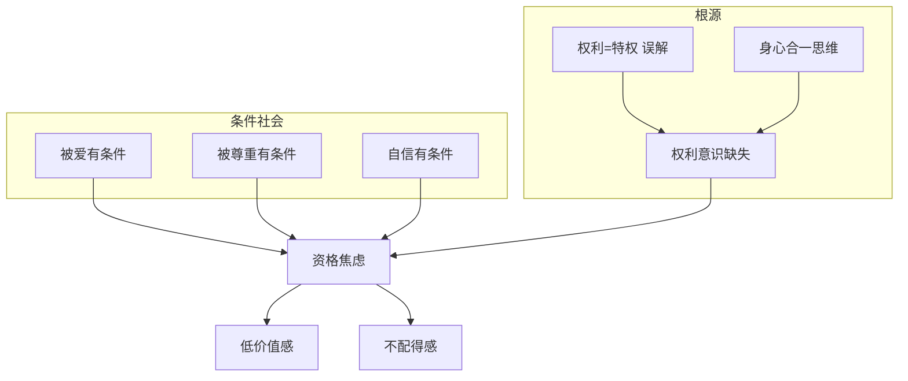
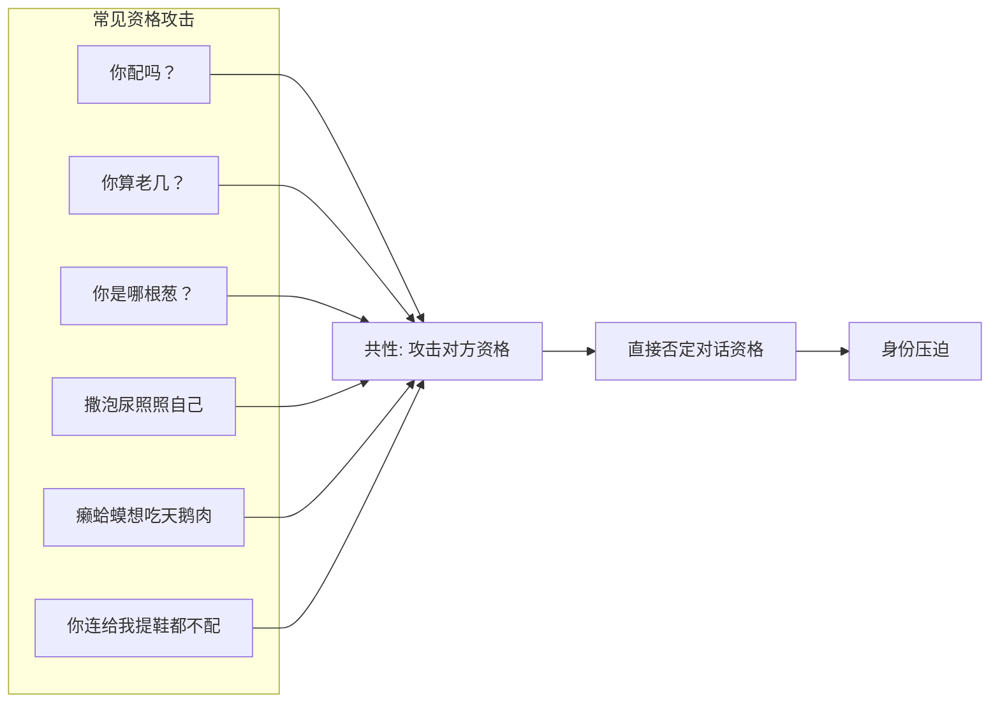
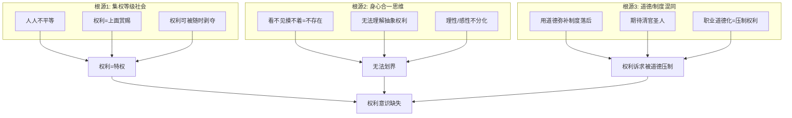
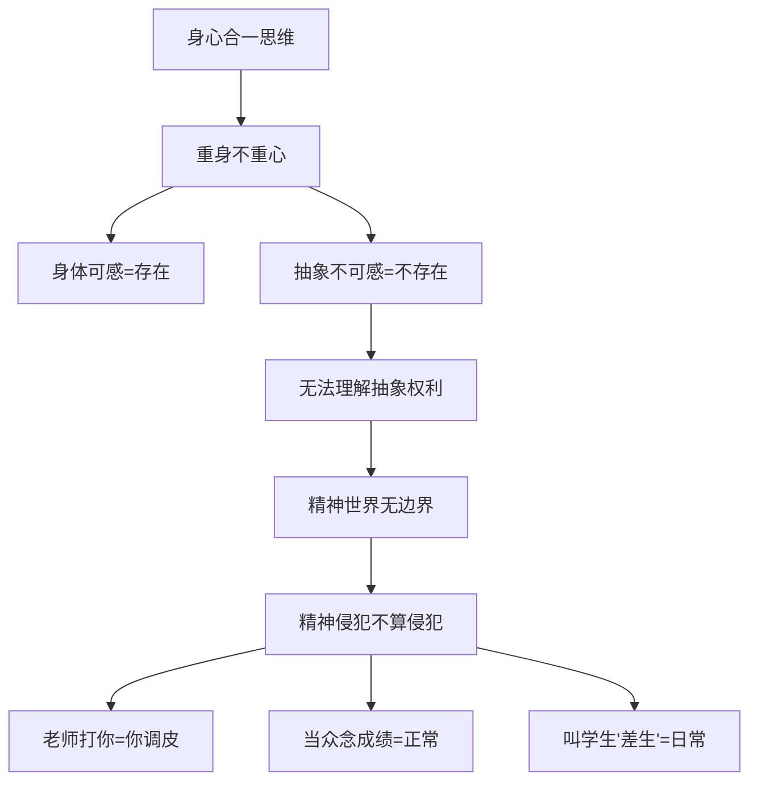
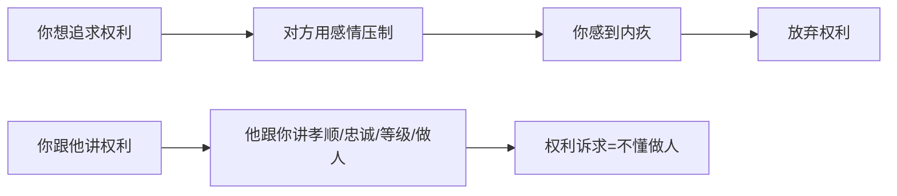
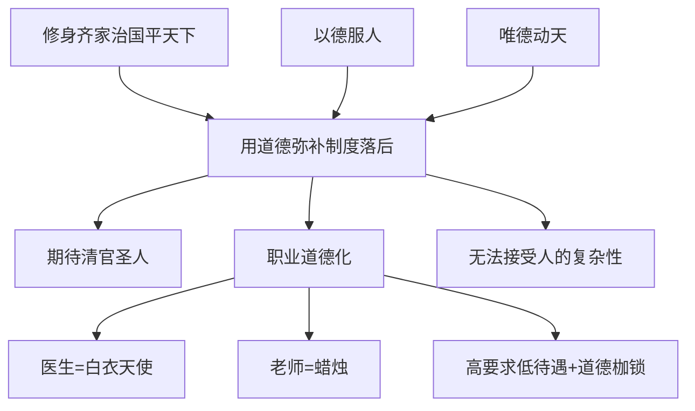
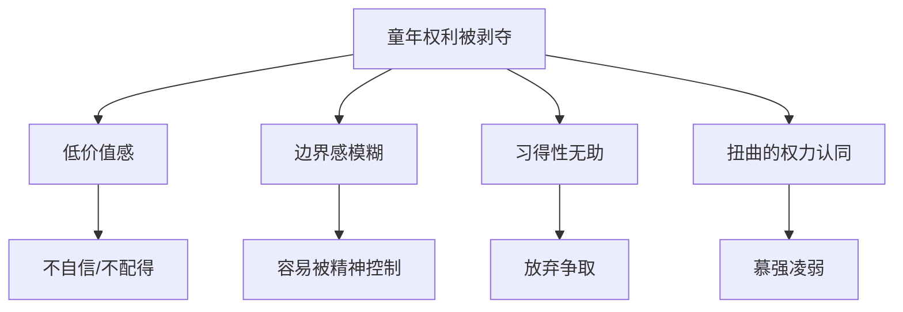
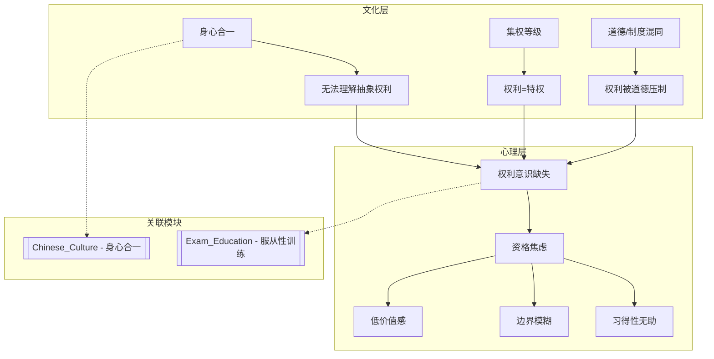

# 权利意识缺失: 条件社会如何剥夺自信与主体性

> **Source:** 视频 - 中国条件社会与权利意识
> **Date Created:** 2026-01-11
> **Tags:** #权利意识 #条件社会 #资格焦虑 #主体性 #社会批判

---

## 一、元认知 (Metacognition)

### 1.1 为什么需要关注这个主题？(Why)

> 💡 **核心困惑:**
> 为什么在中国，**享受几乎所有东西都是有条件的**？被父母爱要做"乖孩子"，被尊重要有地位，自信也要有"资格"——凤姐公开说择偶标准是帅哥，就遭到全国嘲笑。为什么"无条件自信"的人那么少？

答案藏在更深的问题里：**谁给你的资格自信？**

### 1.2 核心观点 (Core Thesis)

> [!IMPORTANT]
> **本期核心洞见:** 这一切都是因为**权利意识的缺失**导致的一系列心理和行为障碍。中国人普遍无法理解"什么是权利"——很多人一说到权利就觉得那是当官的人才有的，老百姓有什么权利？

**权利 vs 权力的混淆:**
- **权利 (Rights):** 个体应当拥有的、受保护的、不可随意剥夺的行为自由或利益
- **权力 (Power):** 支配他人的能力，通常由上位者授予

中国人分不清这两者，因为在传统文化中，**权利被当做了特权的一部分**——上面不授权，你没有权利。

### 1.3 系统定位 (System Role)

本模块是理解中国社会心理的**权利层**，解释"为什么中国人缺乏主体性和边界感"。与以下模块关联：
- `Exam_Education_Psychology`: 服从性训练剥夺权利的具体机制
- `Chinese_Culture_Deep_Structure`: 身心合一思维限制权利理解
- `Philosophy_of_Love`: 关系中的边界感问题

---

## 二、核心架构 (Core Framework)

### 2.1 条件社会 (Conditional Society)

在中国，几乎所有美好的东西都是**有条件**才能享受的：

| 需要 | 条件 | 后果 |
|:----|:----|:----|
| **被父母爱** | 乖孩子、好孩子、优秀孩子 | 不符合=不被爱 |
| **被尊重** | 有地位、有钱、有权 | 保洁/保安对视会低头 |
| **自信** | 优秀、成功、符合主流标准 | 否则=普信男/女 |
| **发言权** | 有资格、有身份 | 否则="你配吗？" |

> **隐喻保留:** "自信本来是一个个人的权利，每个人都有权利自信。但是在我们的社会，它是一项**有条件的特权**。"

### 2.2 资格攻击文化 (Qualification Attack Culture)

中国人骂人的方式，揭示了文化最深层的焦虑：

**中国资格攻击的特点:**
1. **高频** — 极其普遍
2. **攻击社会地位** — 不针对能力，直接攻击阶层、权力位阶
3. **否定对话资格** — 迅速贬低对方，占据权力高位

### 2.3 不配得感 (Unworthiness)

资格攻击的另一面是**内化的不配得感**：

| 表现 | 心理机制 |
|:----|:--------|
| 觉得自己不配得到爱 | 从小被有条件地爱 |
| 觉得自己不配得到钱 | 成功=别人的，我不配 |
| 拥有后担忧失去 | 没有"本该如此"的安全感 |
| 总觉得自己不够好 | 内化的资格审查 |
| 讨好型人格 | 牺牲自己换取认可 |

> **核心公式:** `资格焦虑 = 外在资格攻击 + 内化不配得感`

### 2.4 权利意识缺失的三大根源

---

## 三、根源深度解析

### 3.1 根源一: 集权等级社会天然抑制权利

权利是一种**抽象概念**，只有成为集体共识时才存在（如美元、国家、民族）。

**西方 vs 中国:**

| 维度 | 西方 | 中国 |
|:----|:----|:----|
| **平等观** | 上帝面前人人平等 | 天子→君臣→父子，垂直等级 |
| **权利来源** | 天赋人权 | 上面赏赐 |
| **权利性质** | 不可剥夺 | 可随时剥夺 |
| **对自己负责** | 个人是权力主体 | 只需对上面的人负责 |

> **隐喻保留:** "君要臣死，臣不得不死。父母在，不远游。不孝有三，无后为大。我们的价值观——忠、孝——都是**下面的人对上面的人负责**，不包含一个人要对自己负责。"

### 3.2 根源二: 身心合一限制权利理解

**后果:**
- 不让吃饭、毆打 = 虐待
- 精神恐惧、没尊严 = **不算**（实际伤害更大更持久）

> **案例保留:** "老师让女同学脱裤子证明屁股上有针眼，否则就挨打。全班觉得毛骨悚然，但没人想到——她的**权利被严重侵犯了**。"

### 3.3 用感情剥削权利 — "我是为你好"

**典型话术:**
- 老师打你 → "老师是为你好"
- 父母控制你 → "父母是为你好"
- 老板剥削你 → "我栽培你这么多年"

> **核心洞察:** "你跟他讲权利，他跟你讲**孝顺**。你跟他讲权利，他跟你讲**忠诚**。你跟他讲权利，他跟你讲**等级**。你跟他讲权利，他跟你讲**做人**。"

### 3.4 根源三: 道德性与制度性混同

> **隐喻保留:** "就算是彻头彻尾的大圣人，他不还是会拉屎、会放屁、会有性欲吗？孔子孟子看到美女，难道就没有生理反应了吗？**只有当你把圣人当人，把你自己也当人的时候，你就会知道道德相比于制度是多么的不靠谱。**"

---

## 四、权利缺失的四大人格创伤

### 4.1 低价值感 (Low Self-Worth)

- 没有"我有权"的思维
- 极端追求他人认可
- **他人认同 = 自己有价值；他人不认同 = 自己没价值**
- 对凤姐的嘲讽 = 自信资格审查（先审查了自己）

### 4.2 边界感模糊 (Blurred Boundaries)

- 精神世界没有独立权利边界
- 容易被血缘/权威关系模糊界限
- **例:** 高中生一天学16小时不敢上厕所，怕老师不高兴——却不知道休息是**不可剥夺的权利**
- 被父母催婚——却不知道是否婚育是**自己的权利**

### 4.3 习得性无助 (Learned Helplessness)

- 权利主张不被理解，反被说"自私"
- 长期道德折磨 → 放弃争取
- **想要的东西，还没争取就已经开始放弃**

### 4.4 扭曲的权力认同 (Distorted Power Identification)

| 表现 | 心理机制 |
|:----|:--------|
| 看清宫剧喜欢帝王视角 | 权力补偿 |
| 刷短视频看富人玩弄小人物 | 幻想代入 |
| 知识付费找大佬 | 寻求权威庇护 |
| 消费=唯一自由战场 | 补偿性权利发泄 |

> **核心洞察:** "当人们在现实生活中没有办法满足自己的权利需求，就会转而投身**消费战场**——因为在消费中，我是自由的，我是可以掌控的，我终于有了掌控自我的主权。"

---

## 五、反模式 (Anti-Patterns)

### ❌ 反模式1: 用"为你好"接受权利剥夺

**表现:** 老师打你、父母控制你、老板剥削你，你用"他是为我好"合理化。

**危害:** 无法识别权利边界，被精神控制。

**修正:** 建立"权利优先"意识——无论动机如何，**侵犯权利就是侵犯**。

**✅ 正向案例:** 孩子对父母说"我理解你关心我，但这是我的权利，我有权自己决定。"

---

### ❌ 反模式2: 内化资格审查

**表现:** 在追求任何东西之前，先问自己"我配吗？"

**危害:** 自我设限，低价值感。

**修正:** 意识到**自信是人权，不是特权**——不需要任何人授权。

**✅ 正向案例:** "我就是这么普通，就是这么自信。"——不需要资格证明。

---

### ❌ 反模式3: 用道德压制权利诉求

**表现:** 追求合理报酬被说"不懂感恩"，追求休息被说"不够努力"。

**危害:** 用道德高帽压制正当权利。

**修正:** 区分道德和制度——**道德是感性的、不确定的；制度是理性的、可执行的**。

**✅ 正向案例:** "我尊重你的感受，但这是我的权利，与道德无关。"

---

## 六、系统关联 (System Interlinkages)

---

## 七、术语表 (Glossary)

| 术语 | Term | 定义 (人话) |
|:----|:----|:----------|
| 条件社会 | Conditional Society | 享受任何美好事物都需要满足条件 |
| 资格焦虑 | Qualification Anxiety | 担心自己不够格、不配得 |
| 不配得感 | Unworthiness | 内化的"我不配"信念 |
| 权利意识 | Rights Consciousness | 知道自己有什么不可剥夺的权利 |
| 资格攻击 | Qualification Attack | 通过质疑对方资格来贬低对方 |
| 身份压迫 | Identity Oppression | 用社会地位直接压制对方 |
| 权利 | Rights | 不可随意剥夺的行为自由或利益 |
| 权力 | Power | 支配他人的能力，由上位者授予 |
| 天赋人权 | Natural Rights | 人生而拥有的、不需授权的权利 |

---

## 八、公式表 (Formula Table)

| 公式名称 | 逻辑表达式 | 说明 |
|:--------|:----------|:----|
| **资格焦虑公式** | `资格焦虑 = 外在资格攻击 × 内化不配得感` | 两者相互强化 |
| **权利混淆公式** | `权利认知 = 0 (当 权利=特权 in 文化)` | 权利被当作特权时，普通人没有权利意识 |
| **感情剥削公式** | `权利丧失 = 感情绑架 × 道德压制 / 权利意识` | 权利意识越弱，越容易被剥削 |
| **边界模糊公式** | `边界清晰度 = 精神独立性 × 权利意识` | 身心合一限制精神独立，导致边界模糊 |
| **补偿消费公式** | `消费欲望 = 现实权利缺失 × 可支配收入` | 权利越缺失，越倾向用消费补偿 |

---

## 九、深度概念详解

### 9.1 为什么分不清"权利"和"权力"

这不仅仅是同音词的问题。在传统文化中：
- **权力** = 上面赏赐的支配能力
- **权利** = 也被理解为上面赏赐的"特权"

所以普通人觉得自己没有"权利"——因为你不是官，上面没给你"权"。

> **核心洞察:** "一个工具，你所有的权利都必须由上面的人来授权，那么你的权利也可以随时被上面的人剥夺。"

### 9.2 原生家庭背的锅太多了

> "一个原生家庭有问题，那是父母的问题。**10万个原生家庭有问题，那就是社会的问题**。因为家庭只是社会的文化代理人，是社会情绪的容器。"

原生家庭问题的根源不是个别父母的问题，而是：
- 整个社会缺乏权利意识
- 权利侵犯被合理化
- 创伤行为被集体性接受

### 9.3 自信应该是人权，不是特权

> "希望未来的某一天，每个人都可以坦然的说：**我就是这么的普通，就是这么的自信**。而他周围的每一个人，都能像欣赏自己特殊性的眼光一样，来欣赏这个普通又自信的人。"

---

## 备注与引用 (Notes & References)

### 素材来源
- 视频: 中国条件社会与权利意识缺失

### 关键引用
- 杨笠: "为什么你那么普通，又那么自信？"
- 《万历十五年》— 高育良的绝望隐喻
- 《人民的名义》— 道德与制度的冲突
