# Intent Factor System (意图因子系统)

> **Tags:** `[Content_Creation]`, `[Asyre]`, `[Parameter_Derivation]`, `[Rhetoric]`
> **Date Added:** `2026-01-13`
> **一句话总结 (One-Liner):** 意图因子是创作目的的原子单位——把"我想让观众怎样"拆解成可量化、可推导参数的元理论。
> **关键协议 (Critical Protocol):**
>
> 1. **意图先于形式 (Intent Before Format):** 先问"我要达成什么"，再问"用什么形式达成"
> 2. **加权组合 (Weighted Combination):** 每篇内容是多个意图因子的叠加，不是单一目的
> 3. **可推导性 (Derivability):** 意图因子可以自动推导出执行参数

---

## 1. 元认知 (Metacognition) - 为什么需要意图因子？

### 问题定义

**传统创作的困境：** 当我们用 AI 写内容时，总是在描述"形式"——写一篇口播稿、写一篇公众号文章、写一个短视频脚本。但这忽略了一个关键问题：**同样是口播稿，说服型和科普型的写法完全不同。**

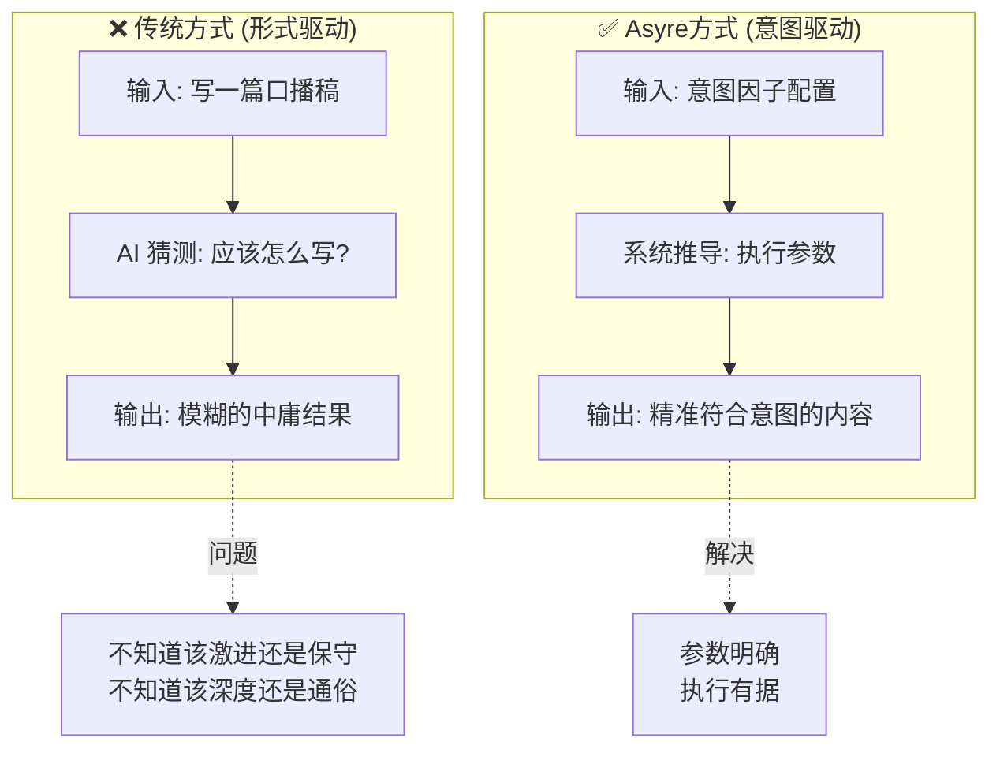

### 核心哲学

**意图因子 = 创作目的的原子单位。**

什么叫"原子单位"？就是不能再拆分的最小意图颗粒度。比如：

- "想让读者认同我的观点" → 这是一个意图因子 (`persuasion`)
- "想让读者学会一个技能" → 这是另一个意图因子 (`knowledge_transfer`)
- "想让读者感到被理解" → 又是一个意图因子 (`emotional_resonance`)

一篇内容往往不是单一目的，而是多个意图因子的**加权叠加**。这就是为什么需要把意图"因子化"——就像化学元素一样，不同元素的组合会产生完全不同的化合物。

### 系统定位

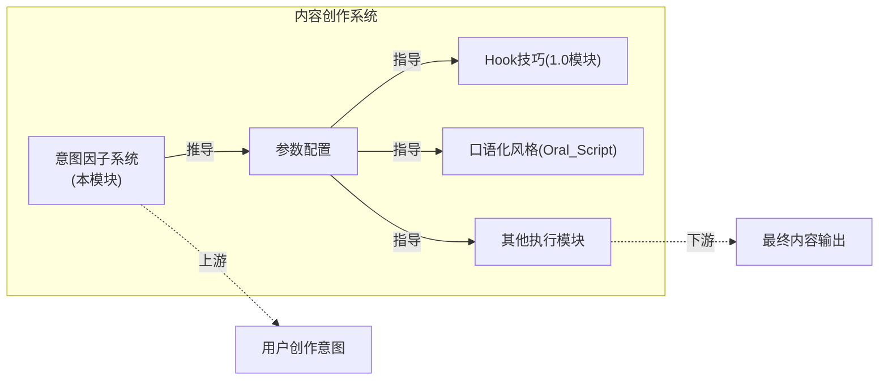

意图因子系统是 Asyre 引擎的**核心决策层**。它回答的问题是："这篇内容到底要达成什么目的？"——有了答案，后续的钩子选择、语言风格、情绪节奏才有据可依。

> [!IMPORTANT]
> **核心洞察 (Key Insight):** 内容创作的本质不是"写什么"，而是"改变什么"——改变认知、改变态度、改变行为、还是满足情感？想清楚这个，其他都是技术问题。

---

## 2. 理论基础 (Theoretical Foundation)

意图因子不是凭空发明的，它站在巨人的肩膀上。

### 2.1 古典修辞学 (Aristotle)

亚里士多德在 2000 多年前就提出了 **PIE 模型**：

| 目的           | 英文      | 含义               | 现代对应           |
| :------------- | :-------- | :----------------- | :----------------- |
| **说服** | Persuade  | 让受众接受你的观点 | 态度改变类意图因子 |
| **告知** | Inform    | 让受众获得新知识   | 认知改变类意图因子 |
| **娱乐** | Entertain | 让受众获得愉悦     | 情感满足类意图因子 |

同时他还提出了**三大诉求 (Appeals)**：

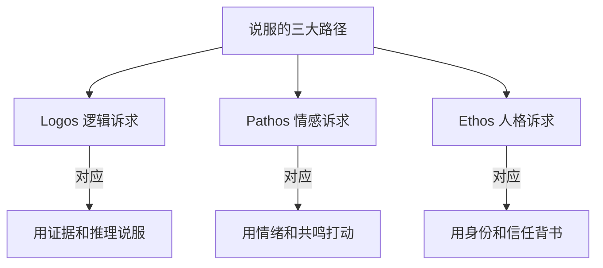

### 2.2 精细加工可能性模型 (ELM)

Cacioppo 和 Petty 在 1980 年代提出的经典传播学理论：

| 路径                                  | 特点                             | 适用场景                  | 对应意图因子                 |
| :------------------------------------ | :------------------------------- | :------------------------ | :--------------------------- |
| **中心路径 (Central Route)**    | 深度处理、逻辑分析、持久态度改变 | 观众有动机+能力深度思考时 | 概念澄清、知识传递、说服     |
| **外围路径 (Peripheral Route)** | 浅层处理、情绪驱动、短暂态度改变 | 观众懒得深想或能力不足时  | 情感共鸣、娱乐消遣、认知验证 |

**为什么这很重要？** 因为它决定了你该用多少逻辑、多少情绪。如果你的目标受众不会深度思考（比如短视频用户），那堆砌论证是无效的，情绪才是王道。

### 2.3 现代扩展

在 PIE 模型基础上，现代传播学扩展了更多意图类型：

- **Explain** (解释): 把复杂变简单
- **Describe** (描述): 还原事实全貌
- **Educate** (教育): 系统性传授
- **Motivate** (激励): 推动行动
- **Validate** (验证): 强化已有认知

这些扩展 + 古典理论 = 意图因子系统的分类基础。

---

## 3. 核心架构 (Core Framework - The "What")

### 3.1 两层分类结构

意图因子采用**两层结构**：

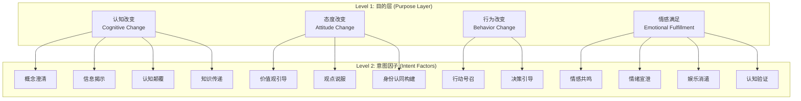

### 3.2 四大目的层详解

#### 目的层 1: 认知改变 (Cognitive Change)

**核心目标：** 让受众的脑子里装进新东西，或者把旧东西换掉。

| 属性               | 说明                                        |
| :----------------- | :------------------------------------------ |
| **修辞基础** | Logos (逻辑诉求) + Central Route (中心路径) |
| **受众状态** | 需要有一定的认知投入意愿                    |
| **持久度**   | 高——认知一旦改变，不容易回退              |
| **典型场景** | 科普、深度分析、观念纠偏                    |

#### 目的层 2: 态度改变 (Attitude Change)

**核心目标：** 让受众对某件事的态度发生转变——从不认可到认可，从无感到有感。

| 属性               | 说明                           |
| :----------------- | :----------------------------- |
| **修辞基础** | Persuade + Ethos (人格诉求)    |
| **受众状态** | 需要信任感或情绪触发           |
| **持久度**   | 中——容易被新信息覆盖         |
| **典型场景** | 观点输出、价值观传递、立场表达 |

#### 目的层 3: 行为改变 (Behavior Change)

**核心目标：** 让受众做出具体动作——点赞、购买、关注、尝试。

| 属性               | 说明                      |
| :----------------- | :------------------------ |
| **修辞基础** | Persuade + Call to Action |
| **受众状态** | 需要紧迫感和明确指引      |
| **持久度**   | 看行为是否形成习惯        |
| **典型场景** | 带货、教程引导、号召行动  |

#### 目的层 4: 情感满足 (Emotional Fulfillment)

**核心目标：** 让受众在情感层面获得满足——被理解、被认可、被娱乐。

| 属性               | 说明                                             |
| :----------------- | :----------------------------------------------- |
| **修辞基础** | Pathos (情感诉求) + Entertain + Peripheral Route |
| **受众状态** | 不需要深度思考，情绪共振即可                     |
| **持久度**   | 低——但形成情感连接后粘性高                     |
| **典型场景** | 情感类内容、吐槽、轻松娱乐                       |

---

## 4. 十三大意图因子详解 (The 13 Intent Factors)

### A 类: 认知改变 (Cognitive Change) — 4 个因子

---

#### 意图因子 #1: 概念澄清 (Concept Clarification)

**一句话定义：** 让受众真正理解一个概念的本质，消除误解。

**核心问题 (Key Question)：** 受众之前的理解哪里有偏差？正确理解是什么？

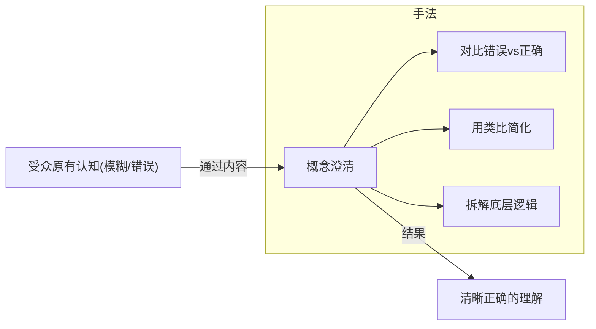

**典型示例：**

- 解释"内卷"的真正含义 (不是努力，是无效竞争)
- 澄清"被动收入"的误解 (不是躺赚，是前期积累后期收割)
- 纠正"情商高=会说话"的错误 (情商是情绪管理，不是话术)

**关联参数：**

| 参数               | 推导逻辑                   |
| :----------------- | :------------------------- |
| `simplification` | 必须高——复杂概念需要简化 |
| `analogy_usage`  | 必须高——类比是澄清利器   |
| `rigor`          | 高——不能为了简单牺牲准确 |
| `source_quality` | 高——需要权威背书         |

---

#### 意图因子 #2: 信息揭示 (Hidden Information Reveal)

**一句话定义：** 揭示表面之下的隐藏信息、潜规则或被忽视的事实。

**核心问题 (Key Question)：** 什么是大多数人不知道但应该知道的？

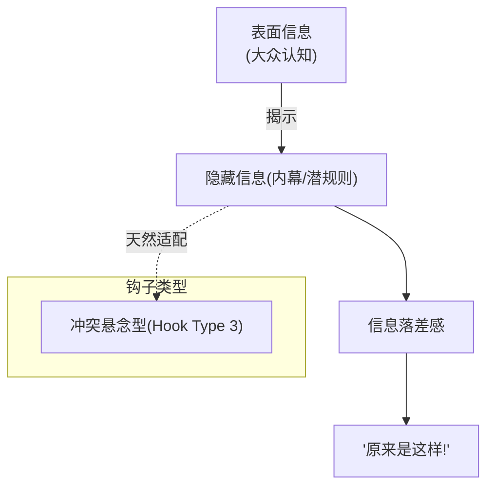

**典型示例：**

- 揭示行业潜规则："为什么大厂招人只看第一学历"
- 指出被媒体忽视的事实："这个政策背后真正的目的"
- 揭露现象背后的原因："年轻人不买房的真正原因不是没钱"

**关联参数：**

| 参数                   | 推导逻辑                                 |
| :--------------------- | :--------------------------------------- |
| `conflict_intensity` | 高——需要制造"我们 vs 他们"的张力       |
| `source_quality`     | 高——揭秘需要可信度                     |
| `hook_type`          | 冲突悬念型 (与 Hook Techniques 模块关联) |

---

#### 意图因子 #3: 认知颠覆 (Cognitive Disruption)

**一句话定义：** 打破受众的固有认知，提出反直觉观点。

**核心问题 (Key Question)：** 受众普遍相信什么？为什么是错的？


**公式：** `冲击力 = (常识 X) 与 (真相 Y) 的距离`

距离越大，冲击越强。但距离太大会失去可信度，需要用证据填补。

**典型示例：**

- 挑战常识：**"努力工作不会让你变有钱"**
- 反主流：**"读书多不代表有文化"**
- 揭示认知偏差：**"你以为的理性决策其实全是情绪"**

**关联参数：**

| 参数                           | 推导逻辑                 |
| :----------------------------- | :----------------------- |
| `counter_intuitive_strength` | 核心参数——颠覆程度     |
| `source_quality`             | 必须高——颠覆需要强证据 |
| `rigor`                      | 高——反直觉不等于胡说   |

---

#### 意图因子 #4: 知识传递 (Knowledge Transfer)

**一句话定义：** 系统性地传授知识、技能或方法。

**核心问题 (Key Question)：** 受众需要学会什么？怎么教最有效？

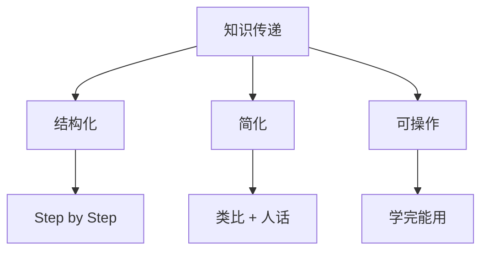

**典型示例：**

- 教授一个技能：如何做 PPT
- 科普一个领域：区块链到底是什么
- 分享一套方法论：我的时间管理系统

**关联参数：**

| 参数               | 推导逻辑             |
| :----------------- | :------------------- |
| `simplification` | 高——知识需要降维   |
| `structure_type` | Step by Step 结构    |
| `rigor`          | 中高——准确但不晦涩 |

---

### B 类: 态度改变 (Attitude Change) — 3 个因子

---

#### 意图因子 #5: 价值观引导 (Value Guidance)

**一句话定义：** 有目的性地引导受众的价值判断和道德取向。

**核心问题 (Key Question)：** 希望受众认为什么是对的/好的/值得的？

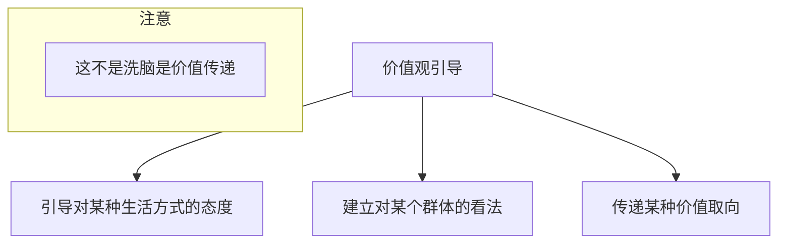

**典型示例：**

- 引导对生活方式的态度："为什么我不再追求稳定"
- 建立对群体的看法："创业者不是疯子，是清醒的人"
- 传递价值取向："赚钱是一种能力，更是一种责任"

**关联参数：**

| 参数                  | 推导逻辑               |
| :-------------------- | :--------------------- |
| `attitude_strength` | 高——价值观必须鲜明   |
| `we_perspective`    | 高——构建"我们"的认同 |
| `emotion_peaks`     | 中高——情绪强化记忆   |

---

#### 意图因子 #6: 观点说服 (Persuasion)

**一句话定义：** 让受众认同作者的具体观点或立场。

**核心问题 (Key Question)：** 希望受众相信什么结论？

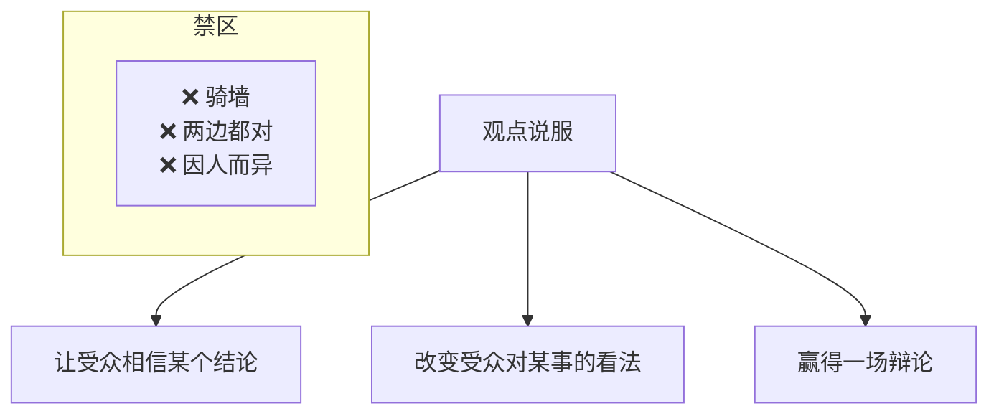

**说服的核心：立场必须鲜明。**

一个骑墙的观点等于没有观点。受众看完不知道你到底想说什么。

**典型示例：**

- 让受众相信结论："房价不会崩盘"
- 改变对某事的看法："996 不是福报，是剥削"
- 赢得辩论："年轻人不结婚是理性选择"

**关联参数：**

| 参数                        | 推导逻辑               |
| :-------------------------- | :--------------------- |
| `attitude_strength`       | 关键参数 — [0.8, 1.0] |
| `fence_sitting_tolerance` | 必须低 — [0.0, 0.2]   |
| `source_quality`          | 高——说服需要证据     |

**执行规则：**

- 禁止"一方面...另一方面..."句式
- 必须在前 30% 内明确立场

---

#### 意图因子 #7: 身份认同构建 (Identity Construction)

**一句话定义：** 帮助受众构建或强化某种身份认同。

**核心问题 (Key Question)：** 受众是谁？他们想成为谁？

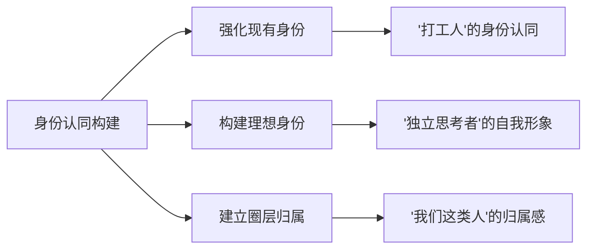

**典型示例：**

- 强化现有身份："打工人的痛，只有打工人懂"
- 构建理想身份："真正的精英是这样思考问题的"
- 建立圈层归属："只有看懂这个视频的人，才是我的同类"

**关联参数：**

| 参数                 | 推导逻辑                 |
| :------------------- | :----------------------- |
| `we_perspective`   | 关键参数——构建"我们"   |
| `pain_point_depth` | 中高——共同痛点强化认同 |

---

### C 类: 行为改变 (Behavior Change) — 2 个因子

---

#### 意图因子 #8: 行动号召 (Call to Action)

**一句话定义：** 推动受众采取具体行动。

**核心问题 (Key Question)：** 希望受众做什么具体动作？

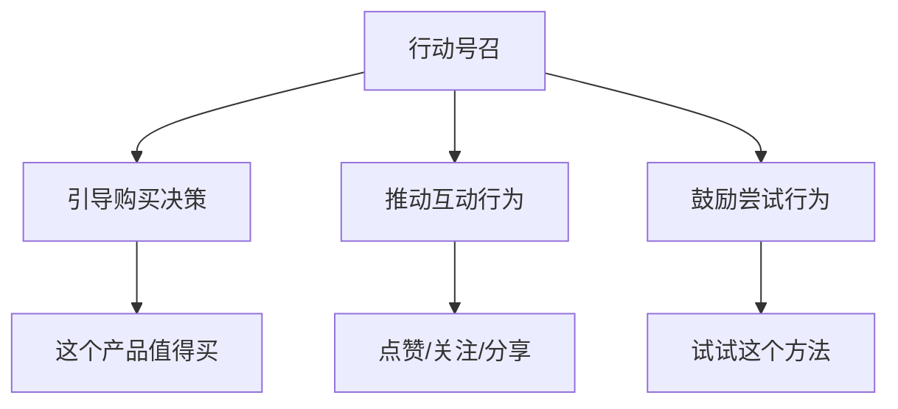

**典型示例：**

- 引导购买："这个课程现在入手最划算"
- 推动互动："如果你也这么想，点个赞让我知道"
- 鼓励尝试："今天就试试这个方法，评论区告诉我结果"

**关联参数：**

| 参数              | 推导逻辑               |
| :---------------- | :--------------------- |
| `cta_intensity` | 关键参数 — [0.7, 1.0] |
| `urgency_level` | 高——紧迫感推动行动   |

**执行规则：**

- 结尾必须有明确的行动指引
- 行动必须具体可执行

---

#### 意图因子 #9: 决策引导 (Decision Guidance)

**一句话定义：** 帮助受众在选择中做出决策。

**核心问题 (Key Question)：** 受众面临什么选择？应该选哪个？

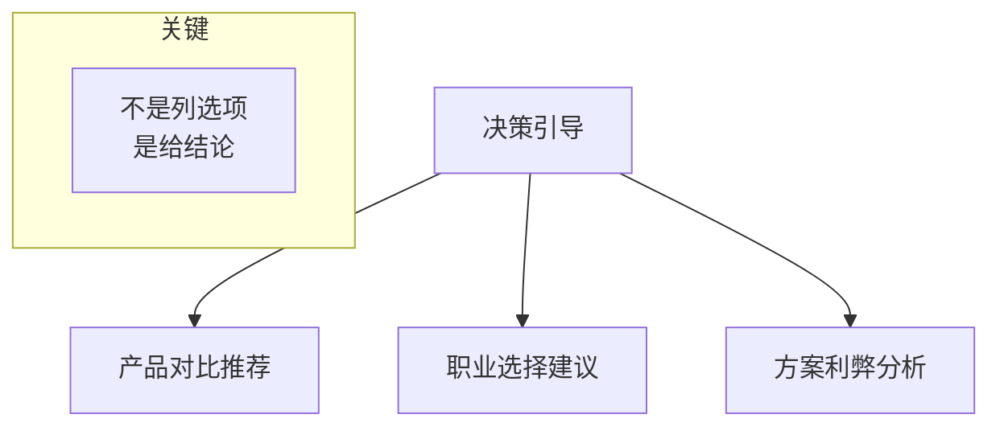

**典型示例：**

- 产品对比："iPhone vs Android，到底买哪个"
- 职业选择："该去大厂还是创业公司"
- 方案分析："考研还是工作，这样选不后悔"

**关联参数：**

| 参数                  | 推导逻辑               |
| :-------------------- | :--------------------- |
| `rigor`             | 高——决策需要全面分析 |
| `source_quality`    | 高——需要可信依据     |
| `attitude_strength` | 中——可以有倾向性     |

---

### D 类: 情感满足 (Emotional Fulfillment) — 4 个因子

---

#### 意图因子 #10: 情感共鸣 (Emotional Resonance)

**一句话定义：** 唤起受众的情感认同，让他们感到被理解。

**核心问题 (Key Question)：** 受众有什么未被表达的情感？

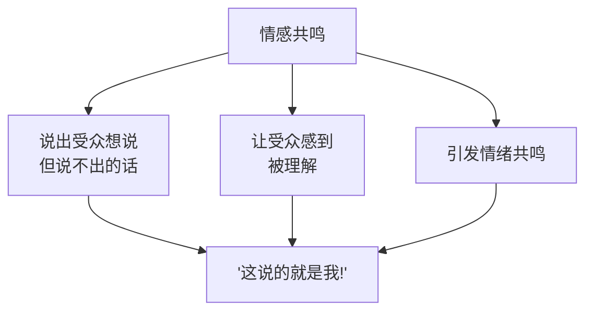

**典型示例：**

- 说出心声："每次快下班的时候来任务，真的很崩溃"
- 让人被理解："其实内向的人不是不想社交，是社交太累了"
- 引发共鸣："凌晨三点睡不着的时候，你在想什么"

**关联参数：**

| 参数                 | 推导逻辑               |
| :------------------- | :--------------------- |
| `we_perspective`   | 关键参数——"我们"视角 |
| `emotion_peaks`    | 高——设计情绪高潮点   |
| `pain_point_depth` | 高——深挖共同痛点     |

**执行规则：**

- 必须设计至少 2 个情绪高潮点
- 使用"我们/咱们"视角

---

#### 意图因子 #11: 情绪宣泄 (Emotional Catharsis)

**一句话定义：** 替受众宣泄情绪，提供情绪出口。

**核心问题 (Key Question)：** 受众压抑着什么情绪？

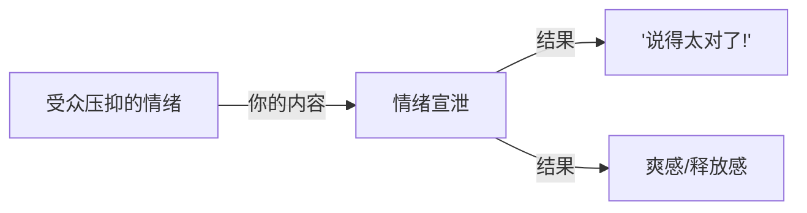

**与情感共鸣的区别：**

| 维度               | 情感共鸣         | 情绪宣泄       |
| :----------------- | :--------------- | :------------- |
| **核心动作** | 让受众感到被理解 | 替受众骂出来   |
| **情绪强度** | 温和 — 触动     | 强烈 — 发泄   |
| **受众反应** | "这说的就是我"   | "说得太痛快了" |

**典型示例：**

- 替受众骂："我真的很烦那种'年轻人要吃苦'的说法"
- 表达共同愤怒："凭什么我们 996，他们躺着赚钱"
- 提供发泄出口："受够了他们的双标"

**关联参数：**

| 参数                   | 推导逻辑           |
| :--------------------- | :----------------- |
| `emotion_peaks`      | 高——情绪必须强烈 |
| `attitude_strength`  | 高——立场必须鲜明 |
| `conflict_intensity` | 高——制造对立     |

---

#### 意图因子 #12: 娱乐消遣 (Entertainment)

**一句话定义：** 让受众获得轻松愉快的体验。

**核心问题 (Key Question)：** 怎么让内容有趣/好玩/轻松？

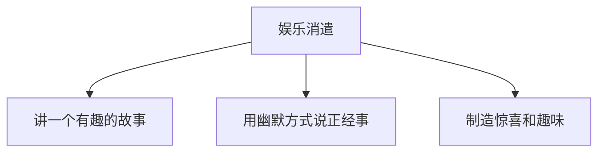

**典型示例：**

- 有趣故事："我第一次创业差点把自己送进派出所"
- 幽默表达："用游戏的方式解释经济学"
- 制造惊喜："这个反转你绝对想不到"

**关联参数：**

| 参数                     | 推导逻辑             |
| :----------------------- | :------------------- |
| `structure_type`       | 灵活——可以打破常规 |
| `oral_language_weight` | 高——口语化更轻松   |

---

#### 意图因子 #13: 认知验证 (Validation)

**一句话定义：** 验证受众已有的想法，让他们感到"我早就这么想了"。

**核心问题 (Key Question)：** 受众已经相信什么？如何强化？

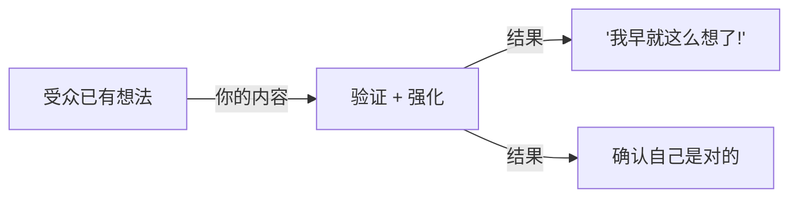

**与说服的区别：**

| 维度           | 说服           | 认知验证       |
| :------------- | :------------- | :------------- |
| **起点** | 受众不认同     | 受众已认同     |
| **目标** | 改变态度       | 强化态度       |
| **难度** | 高——需要翻转 | 低——顺应已有 |

**典型示例：**

- 强化已有观点："不爱社交不是缺点，是选择"
- 提供理论支持："为什么你的直觉是对的——科学解释"
- 让受众感到正确："你没错，是这个世界的问题"

**关联参数：**

| 参数                  | 推导逻辑           |
| :-------------------- | :----------------- |
| `attitude_strength` | 中高——立场鲜明   |
| `we_perspective`    | 高——"我们是对的" |

---

## 5. 意图因子组合模式 (Combo Patterns)

一篇好内容往往不是单一意图，而是多个因子的**加权组合**。以下是 7 种常见组合模式：

### 模式 1: 社会评论 (Social Commentary)

**场景：** 对社会现象发表态度鲜明的评论

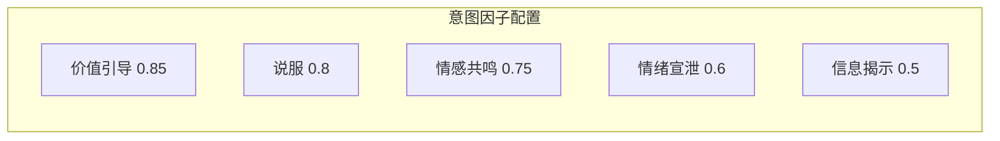

**典型案例：** "年轻人为什么不结婚了"

---

### 模式 2: 深度科普 (Deep Explainer)

**场景：** 深入解释一个复杂概念或现象

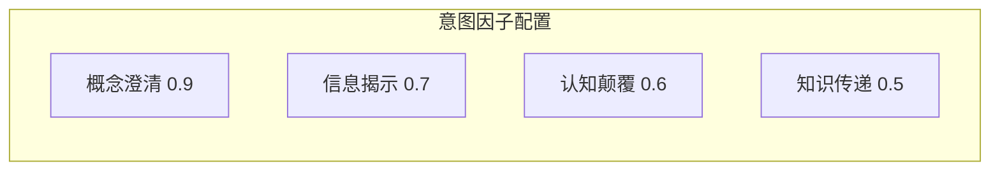

**典型案例：** "货币的本质到底是什么"

---

### 模式 3: 观点输出 (Opinion Piece)

**场景：** 表达鲜明立场并说服受众

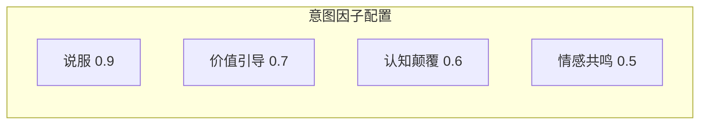

**典型案例：** "读研究生是浪费时间"

---

### 模式 4: 教程干货 (Tutorial)

**场景：** 系统教授知识或技能

```mermaid
graph LR
    subgraph 意图因子配置
        A["知识传递 0.9"]
        B["行动号召 0.6"]
        C["概念澄清 0.5"]
    end
```

**典型案例：** "零基础学 Python 的正确姿势"

---

### 模式 5: 情感陪伴 (Emotional Support)

**场景：** 提供情感共鸣和支持

```mermaid
graph LR
    subgraph 意图因子配置
        A["情感共鸣 0.9"]
        B["认知验证 0.8"]
        C["身份认同 0.6"]
        D["情绪宣泄 0.5"]
    end
```

**典型案例：** "致所有 30 岁还在迷茫的人"

---

### 模式 6: 种草带货 (Sales Content)

**场景：** 引导购买决策

```mermaid
graph LR
    subgraph 意图因子配置
        A["决策引导 0.9"]
        B["行动号召 0.85"]
        C["说服 0.7"]
        D["情感共鸣 0.5"]
    end
```

**典型案例：** "用了一年，这三款设备改变了我的生活"

---

### 模式 7: 揭秘爆料 (Expose)

**场景：** 揭示隐藏信息或潜规则

```mermaid
graph LR
    subgraph 意图因子配置
        A["信息揭示 0.9"]
        B["认知颠覆 0.7"]
        C["情绪宣泄 0.6"]
        D["价值引导 0.5"]
    end
```

**典型案例：** "行业不想让你知道的 10 个潜规则"

---

## 6. 推导规则 (Derivation Rules)

意图因子不只是描述，更是**可执行的推导起点**。当意图因子被量化后，系统会根据规则自动推导执行参数。

### 规则 R001: 说服 + 价值引导 → 态度必须鲜明

**触发条件：** `persuasion >= 0.7 AND value_guidance >= 0.6`

**推导参数：**

| 参数                        | 重要性 | 范围       |
| :-------------------------- | :----- | :--------- |
| `attitude_strength`       | 关键   | [0.8, 1.0] |
| `fence_sitting_tolerance` | 关键   | [0.0, 0.2] |

**执行规则：**

- ❌ 禁止"一方面...另一方面..."句式
- ✅ 必须在前 30% 内明确立场

---

### 规则 R002: 概念澄清 + 认知颠覆 → 需要深度参考和简化能力

**触发条件：** `concept_clarification >= 0.7 AND cognitive_disruption >= 0.5`

**推导参数：**

| 参数               | 重要性 | 范围       |
| :----------------- | :----- | :--------- |
| `source_quality` | 关键   | [0.8, 1.0] |
| `simplification` | 高     | [0.6, 0.8] |
| `analogy_usage`  | 高     | [0.7, 1.0] |

**执行规则：**

- ✅ 必须引用权威来源
- ✅ 复杂概念必须配类比

---

### 规则 R003: 情感共鸣高 → 情绪节奏设计

**触发条件：** `emotional_resonance >= 0.7`

**推导参数：**

| 参数                 | 重要性 | 范围            |
| :------------------- | :----- | :-------------- |
| `emotion_peaks`    | 关键   | [2, 4] 个高潮点 |
| `we_perspective`   | 高     | [0.7, 1.0]      |
| `pain_point_depth` | 高     | [0.6, 0.9]      |

**执行规则：**

- ✅ 必须设计至少 2 个情绪高潮点
- ✅ 使用"我们/咱们"视角

---

### 规则 R004: 信息揭示 → 冲突悬念钩子

**触发条件：** `hidden_reveal >= 0.6`

**推导参数：**

| 参数                   | 重要性 | 值         |
| :--------------------- | :----- | :--------- |
| `hook_type`          | 高     | 冲突悬念型 |
| `conflict_intensity` | 高     | [0.6, 0.9] |

**执行规则：**

- ✅ 开头暗示"有内幕"
- ✅ 建立"我们 vs 他们"的对立

---

### 规则 R005: 行动号召高 → CTA 设计

**触发条件：** `action_call >= 0.7`

**推导参数：**

| 参数              | 重要性 | 范围       |
| :---------------- | :----- | :--------- |
| `cta_intensity` | 关键   | [0.7, 1.0] |
| `urgency_level` | 高     | [0.5, 0.8] |

**执行规则：**

- ✅ 结尾必须有明确的行动指引
- ✅ 行动必须具体可执行

---

### 规则 R006: 知识传递 → 结构化和严谨性

**触发条件：** `knowledge_transfer >= 0.7`

**推导参数：**

| 参数               | 重要性 | 值/范围      |
| :----------------- | :----- | :----------- |
| `structure_type` | 高     | Step by Step |
| `rigor`          | 高     | [0.7, 1.0]   |
| `simplification` | 高     | [0.6, 0.8]   |

**执行规则：**

- ✅ 内容需要分步骤/分层次
- ✅ 事实陈述需要可验证

---

### 规则 R007: 口播场景 → 语言口语化

**触发条件：** `output_format == 'oral_script'`

**推导参数：**

| 参数                     | 重要性 | 范围       |
| :----------------------- | :----- | :--------- |
| `oral_language_weight` | 关键   | [0.8, 1.0] |
| `sentence_length`      | 高     | [5, 15] 字 |

**执行规则：**

- ❌ 禁止使用书面套话
- ✅ 句子长度控制在 15 字以内

---

## 7. 完整推导示例 (Derivation Example)

### 输入案例

```
话题: "年轻人为什么不结婚了"
意图: 表达对婚姻制度的批判立场，引发讨论
```

### Step 1: 意图因子量化

```mermaid
graph LR
    subgraph 量化结果
        A["价值引导 0.85"]
        B["说服 0.8"]
        C["信息揭示 0.7"]
        D["情感共鸣 0.75"]
        E["认知颠覆 0.6"]
    end
```

### Step 2: 规则匹配

| 规则 | 条件检查                                               | 结果    |
| :--- | :----------------------------------------------------- | :------ |
| R001 | persuasion(0.8) >= 0.7 AND value_guidance(0.85) >= 0.6 | ✅ 触发 |
| R003 | emotional_resonance(0.75) >= 0.7                       | ✅ 触发 |
| R004 | hidden_reveal(0.7) >= 0.6                              | ✅ 触发 |

### Step 3: 参数推导

```json
{
    "attitude_strength": { "importance": "critical", "target": 0.9 },
    "fence_sitting_tolerance": { "importance": "critical", "target": 0.1 },
    "emotion_peaks": { "importance": "high", "target": 2 },
    "we_perspective": { "importance": "high", "target": 0.8 },
    "hook_type": { "importance": "high", "value": "emotional_vent + hidden_reveal" },
    "conflict_intensity": { "importance": "high", "target": 0.75 }
}
```

### Step 4: 执行指令

1. 开头使用情绪宣泄 + 信息揭示组合钩子
2. 必须在前 20% 内明确立场
3. 禁止骑墙，禁止"因人而异"
4. 设计 2 个情绪高潮点
5. 使用"我们/咱们"视角
6. 建立"年轻人 vs 旧制度"的对立

---

## 8. Anti-Patterns (反模式 - The "Don'ts")

### ❌ 反模式 1: 意图模糊

**Trap:** 不知道这篇内容到底要达成什么——是说服还是科普？是带货还是娱乐？

**Why:** 意图模糊导致内容"四不像"——什么都想要，什么都做不好。AI 没有明确方向，只能输出平庸的中庸内容。

**Fix:** 在创作前强制回答："这篇内容成功的标准是什么？受众看完会有什么改变？"

**Example:**

> ❌ 模糊意图："写一篇关于理财的文章"
> ✅ 明确意图："写一篇说服年轻人开始理财的内容 (persuasion: 0.8)，同时教会他们一个具体方法 (knowledge_transfer: 0.5)"

**Positive Real Scenario:** 李子柒的视频意图非常明确——情感满足 (娱乐消遣 + 情感共鸣)。她从不试图教你怎么做菜，也不说服你去乡下生活。纯粹的审美享受，意图单一，所以极致。

---

### ❌ 反模式 2: 意图冲突

**Trap:** 意图因子之间互相打架——既想严谨科普，又想轻松娱乐；既想说服立场，又想两边讨好。

**Why:** 不同意图需要不同的执行参数。严谨科普需要高 rigor，轻松娱乐需要低 rigor。两者同时高权重，AI 会精神分裂。

**Fix:** 意图因子可以组合，但必须有主次。主意图权重 >= 0.7，次意图权重 <= 0.5。

```mermaid
graph TD
    A["冲突组合\n(危险)"] --> B["科普 0.8 + 娱乐 0.8"]
    A --> C["说服 0.9 + 中立分析 0.8"]

    D["和谐组合\n(安全)"] --> E["科普 0.8 + 娱乐 0.3"]
    D --> F["说服 0.9 + 情感共鸣 0.6"]
```

**Example:**

> ❌ 冲突配置：`persuasion: 0.9, rigor: 0.9, entertainment: 0.9` (不可能同时激进说服、严谨论证、轻松娱乐)
> ✅ 协调配置：`persuasion: 0.85, emotional_resonance: 0.7, hidden_reveal: 0.5` (说服为主，情感加持，适度爆料)

**Positive Real Scenario:** 罗翔讲刑法——主意图是知识传递，次意图是娱乐消遣。知识传递的严谨性确保内容靠谱，娱乐的调味让严肃话题不无聊。主次分明，不冲突。

---

### ❌ 反模式 3: 骑墙综合症

**Trap:** 说服类意图配了"两边都有道理"的骑墙内容。

**Why:** 骑墙是最安全的写法，不会得罪任何人。但骑墙也最无效——受众看完不知道你想说什么，没有记忆点，不会转发。

**Fix:** 当 persuasion >= 0.7 时，fence_sitting_tolerance 必须 <= 0.2。你必须选边站。

**Example:**

> ❌ 骑墙表达："房价会不会降要看情况，有的城市会跌，有的城市会涨"
> ✅ 鲜明立场："北上广深的房价不会崩盘，这是我的结论。以下是我的三个理由..."

**Positive Real Scenario:** 半佛仙人讲商业——从不骑墙。他的内容永远有鲜明立场，即使争议也换来了记忆和传播。

---

### ❌ 反模式 4: 过度堆砌

**Trap:** 一篇内容塞进 8 个高权重意图因子，想面面俱到。

**Why:** 每增加一个高权重意图，复杂度指数级增长。超过 4 个高权重因子，内容必然失控。

**Fix:** 高权重意图因子 (>= 0.7) 不超过 3 个，中权重意图因子 (0.4-0.6) 不超过 3 个。

```mermaid
graph TD
    subgraph 安全配置
        A["主意图 x1 (0.8-0.9)"]
        B["次意图 x2 (0.5-0.7)"]
        C["调味 x2 (0.3-0.4)"]
    end

    subgraph 危险配置
        D["全部 0.8+"]
        E["意图 x8"]
    end
```

**Example:**

> ❌ 过度堆砌：8 个意图因子全部 >= 0.7
> ✅ 聚焦配置：persuasion 0.85, value_guidance 0.7, emotional_resonance 0.6, hidden_reveal 0.4

**Positive Real Scenario:** 乔布斯发布会——每次只讲一件事 (一个主意图)。iPhone 发布会不会同时讲 Mac、iPod、Apple TV。聚焦才有力量。

---

## 9. 系统关联 (Interlinkages)

### 上游 (Input)

- **用户创作意图:** 用户描述想要达成的效果
- **Asyre 配置系统:** 从 `intent_factors.json` 读取因子定义

### 下游 (Output)

- **[1.0_Hook_Techniques.md](1.0_Hook_Techniques.md):** 意图因子决定钩子类型选择
  - `hidden_reveal` → 冲突悬念型钩子
  - `cognitive_disruption` → 反直觉型钩子
  - `emotional_resonance` → 痛点共鸣型钩子
- **[Oral_Script_Style.md](Oral_Script_Style.md):** 意图因子影响语言风格参数
- **参数推导引擎:** 意图因子触发推导规则，输出执行参数

### 关联图谱

```mermaid
graph TD
    A["用户意图描述"] --> B["意图因子系统\n(本模块)"]
    B -->|量化| C["意图因子配置"]
    C -->|匹配| D["推导规则"]
    D -->|生成| E["执行参数"]

    E --> F["Hook 选择"]
    E --> G["语言风格"]
    E --> H["情绪节奏"]
    E --> I["结构设计"]

    F --> J["最终内容"]
    G --> J
    H --> J
    I --> J
```

---

## 10. Glossary (术语表)

| 术语       | Term                 | 定义 (人话)                                          |
| :--------- | :------------------- | :--------------------------------------------------- |
| 意图因子   | Intent Factor        | 创作目的的最小单位，可以量化和组合                   |
| 目的层     | Purpose Layer        | 意图因子的上层分类 (认知/态度/行为/情感)             |
| 加权组合   | Weighted Combination | 多个意图因子按权重叠加形成最终配置                   |
| 推导规则   | Derivation Rule      | 从意图因子自动推导出执行参数的逻辑                   |
| 中心路径   | Central Route        | 受众深度思考时的信息处理方式                         |
| 外围路径   | Peripheral Route     | 受众浅层处理时的信息处理方式                         |
| Logos      | 逻辑诉求             | 用证据和推理说服的方式                               |
| Pathos     | 情感诉求             | 用情绪和共鸣打动的方式                               |
| Ethos      | 人格诉求             | 用身份和信任背书的方式                               |
| PIE 模型   | PIE Model            | 亚里士多德的三大传播目的 (Persuade/Inform/Entertain) |
| 骑墙       | Fence-sitting        | 两边讨好、不表明立场的表达方式                       |
| 情绪高潮点 | Emotion Peak         | 内容中设计的情绪最高点                               |
| CTA        | Call to Action       | 行动号召——让受众做具体动作                         |
| 信息落差   | Information Gap      | 你知道但受众不知道的信息差                           |
| 认知冲突   | Cognitive Conflict   | 新信息与旧认知矛盾产生的心理张力                     |

---

## 11. Formula Table (公式表 - 3D Knowledge)

| Formula Name               | Equation / Logic                                               | Variable Definition        |
| :------------------------- | :------------------------------------------------------------- | :------------------------- |
| **意图因子权重公式** | `总配置 = Σ(因子i × 权重i)`                                | 各因子加权叠加形成最终配置 |
| **规则触发公式**     | `触发 = (因子A >= 阈值A) AND (因子B >= 阈值B)`               | 多条件满足时触发推导规则   |
| **意图冲突检测**     | `冲突 = abs(因子A.rigor - 因子B.rigor) > 0.4`                | 当参数需求冲突时发出警告   |
| **主次比例公式**     | `主意图 >= 0.7, 次意图 <= 0.5`                               | 控制意图因子的主次关系     |
| **复杂度控制**       | `高权重因子 <= 3, 中权重因子 <= 3`                           | 防止意图过度堆砌           |
| **说服鲜明度**       | `鲜明度 = attitude_strength × (1 - fence_sitting)`          | 立场越鲜明，骑墙越少       |
| **情感共鸣强度**     | `共鸣 = pain_point_depth × we_perspective × emotion_peaks` | 三要素乘积决定共鸣效果     |

---

## 备注与引用 (Notes & References)

### 来源

- Asyre 项目配置文件: `intent_factors.json`, `derivation_rules.json`
- 古典修辞学: Aristotle, *Rhetoric*
- 精细加工可能性模型: Cacioppo & Petty, ELM (1980s)

### 核心原则速查

1. **意图先于形式** — 先问"改变什么"再问"怎么写"
2. **加权组合** — 一篇内容是多个意图的叠加
3. **主次分明** — 高权重不超过 3 个
4. **可推导性** — 意图因子自动推导执行参数
5. **禁止骑墙** — 说服类内容必须选边站
