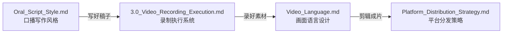
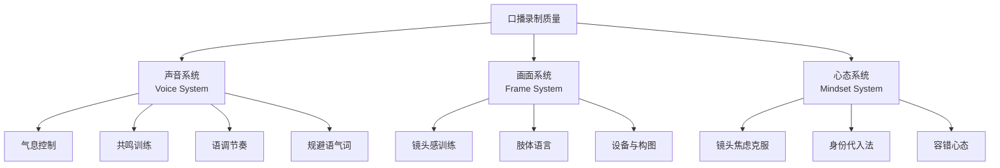
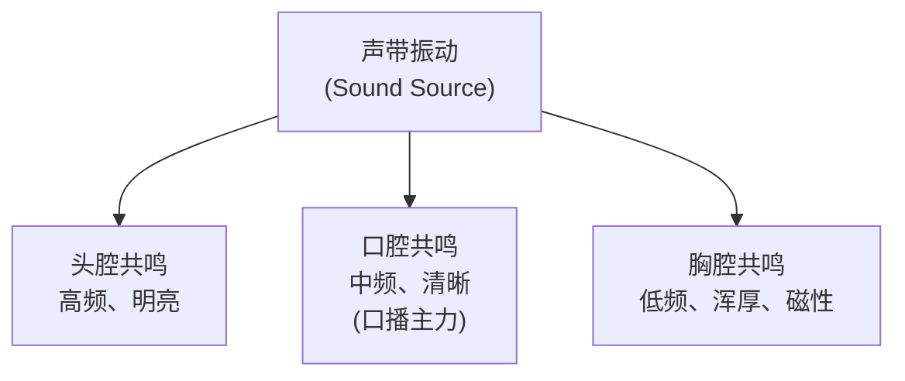
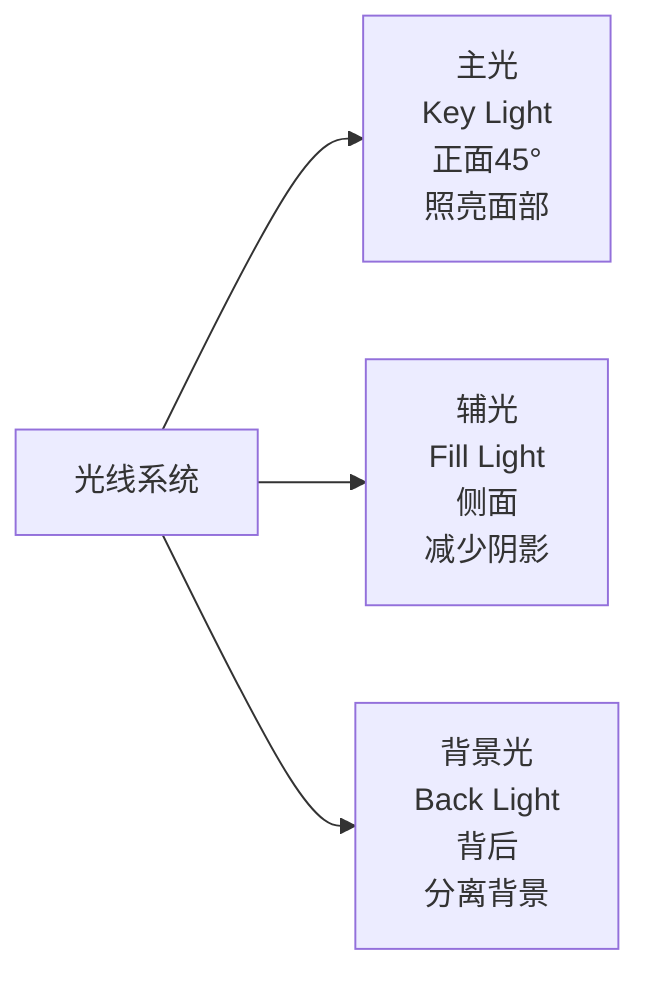
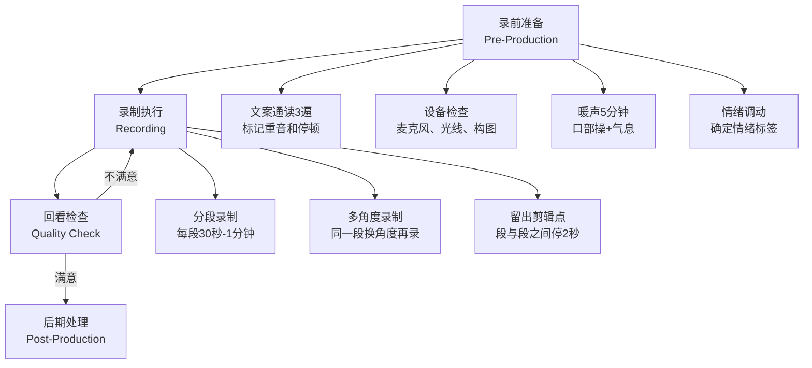

# 口播录制执行系统 (Video Recording Execution System)

> **Tags:** `[Content_Creation]`, `[Video]`, `[Voice]`, `[Self_Media]`, `[Execution]`
> **Date Added:** 2026-01-27
> **一句话总结 (One-Liner):** 你觉得自己声音奇怪、画面别扭，不是因为你不好看或声音差——而是因为你从来没有被训练过"如何成为镜头前的自己"。
> **关键协议 (Critical Protocol):**
> 1. **结构服从内容 (Structure Follows Content):** 本模块按"声音→画面→心态→设备→流程"的执行链条展开，而非按模板硬套。
> 2. **原子级视觉化 (Atomic Visualization):** 每个训练方法必须配图或表格。
> 3. **拒绝阉割 (No Summary):** 保留所有训练细节和心理机制的解释，不做干瘪总结。

---

## 1. 元认知 (Metacognition) — 为什么录出来的自己"不像自己"？

### 问题定义

你录完口播回看，会觉得两件事很不对劲：

1. **声音怪**：听起来不像自己平时说话的声音，又薄又尖，或者气息不稳，"嗯""啊"一大堆。
2. **画面怪**：表情僵硬，眼神游离，整个人看着就是不自然，跟别人的视频比起来差了一大截。

这两个问题背后有**科学原因**，搞清楚了你才不会陷入"我就是不行"的自我怀疑。

### 核心哲学：镜头前的你 ≠ 生活中的你

这里有三个底层认知必须先建立：

**第一，声音传导差异 (Bone Conduction vs Air Conduction)**

你平时听到的自己的声音，是通过**骨传导**（振动从声带经颅骨传到内耳）和**空气传导**两条路径叠加的。骨传导会增加低频成分，所以你觉得自己声音浑厚。但录音设备只能捕捉空气传导的声音，丢掉了低频，所以听起来"又薄又尖"。

这不是你的声音不好，而是**你从来没有真正听过别人听到的你的声音**。那个录音里的声音才是真实的。

**第二，镜像效应 (Mirror Image Effect)**

你照镜子时看到的是左右反转的自己。你习惯了那个版本。但视频里的你是**未翻转的真实形象**——别人每天看到的你。你觉得"不像自己"，其实你看到的才是别人一直看到的样子。

**第三，镜头焦虑 (Camera Anxiety)**

面对镜头时的紧张不是心理素质差，而是一个进化本能。一个"黑洞洞的圆形物体盯着你"，大脑的杏仁核（amygdala，大脑的报警器）会自动触发轻微的战斗-逃跑反应 (Fight-or-Flight Response)。结果就是：肌肉紧张、表情僵硬、声音发紧、语速加快。

> [!IMPORTANT]
> **核心洞察 (Key Insight):** 你觉得自己"录出来不好"，90%的原因不是你长得不行或声音差，而是**感知偏差 + 缺乏训练**。声音传导差异让你觉得声音奇怪，镜像效应让你觉得脸奇怪，镜头焦虑让你的身体自动进入防御模式。这三件事都可以通过训练解决。

### 系统定位 (System Role)

本模块在 Asher 内容创作系统中的位置：



| 模块 | 解决什么问题 | 关键词 |
| :--- | :--- | :--- |
| Oral_Script_Style | 怎么**写**口播稿 | 文字、节奏、金句 |
| **本模块 (3.0)** | 怎么**录**口播 | 声音、镜头、心态、设备 |
| Video_Language | 怎么**设计画面** | 镜头语言、景别、B-Roll |
| Platform_Distribution | 怎么**发** | 平台算法、分发策略 |

---

## 2. 核心架构 (Core Framework) — 录制执行的三大系统

口播录制的质量由三个系统共同决定：



**核心概念：**

- **声音系统 (Voice System)：** 你的声音是一个乐器。气息是动力源，共鸣腔是音箱，嘴唇舌头是阀门。大多数人说话只用了这个乐器10%的能力。口播需要你至少开到50%。
- **画面系统 (Frame System)：** 镜头前的你不是"被拍的人"，而是"在和一个人聊天的人"。你需要的不是演技，而是**把镜头变成一个具体的人**。
- **心态系统 (Mindset System)：** 紧张不是敌人。完全放松的人在镜头前是瘫的。你需要的是**可控的兴奋感**——比日常说话高出20%的能量。

**三大系统的权重分配：**

| 系统 | 对最终效果的影响 | 训练难度 | 见效速度 |
| :--- | :--- | :--- | :--- |
| 声音系统 | 40% | ★★★☆☆ | 中（2-4周日常练习） |
| 画面系统 | 35% | ★★☆☆☆ | 快（当天可改善） |
| 心态系统 | 25% | ★★★★☆ | 慢（需要持续录制积累） |

> 声音占比最高，因为短视频平台上用户经常不看画面只听声音（刷到了但没停下来看），声音是第一道过滤器。

---

## 3. 执行协议 (Execution Protocol) — 手把手训练

### Phase 1: 声音系统训练 (Voice Training)

#### 1.1 气息控制 — 声音的"发动机"

**为什么你录出来的声音气息不稳？**

日常说话你不需要太大的气息支撑，因为距离近、环境安静。但录口播时，你需要声音**穿透麦克风、穿透手机喇叭、穿透观众正在刷的信息流**。这要求气息量是日常的1.5-2倍。没训练过的人，说到句子后半段就会"气虚"——声音越来越小、越来越飘。

**训练方法：胸腹式联合呼吸 (Diaphragmatic Breathing)**

这不是深呼吸，而是**让气息沉到腹部**，用横膈膜（膈肌，diaphragm）控制气流，而不是用胸腔和肩膀。

| 步骤 | 动作 | 感受 | 常见错误 |
| :--- | :--- | :--- | :--- |
| 1. 站姿 | 双脚与肩同宽，身体放松 | 头顶像有根线往上提 | 耸肩、驼背 |
| 2. 吸气 | 鼻子慢慢吸气，想象"闻花香" | 腹部微微向外膨胀，胸口不动 | 猛吸一口气导致胸部上抬 |
| 3. 保持 | 保持2秒 | 腹部保持膨胀 | 憋气导致身体紧张 |
| 4. 呼气 | 嘴巴慢慢吐气，发"丝—"声 | 腹部慢慢向内收 | 一下子把气全放掉 |

**进阶训练：吹蜡烛法**

想象你面前有一根蜡烛。你说话的每一个字都要像一股均匀的气流吹在火焰上——**火焰在晃，但不能灭**。这个训练的目的是让你的气息**均匀、持续**，而不是一阵一阵的。

**"狗喘气"练习 (Panting Exercise)**

快速用腹部力量做短促的呼吸（像小狗喘气），手放在腹部感受肌肉的快速收缩。这个练习的目的是激活你的横膈膜肌肉，让它从"自动驾驶"模式切换到"手动控制"模式。每天做30秒×3组。

```
日常说话的气息路径:
胸腔浅呼吸 → 气量小 → 声音薄 → 句末气虚

口播需要的气息路径:
腹式深呼吸 → 气量充足 → 声音稳 → 全句饱满
```

#### 1.2 共鸣训练 — 声音的"音箱"

**为什么有些人声音好听、有磁性？**

不是天生的喉咙不同，而是他们（有意或无意地）用到了更多的**共鸣腔体**。人体有三个主要共鸣腔：



| 共鸣腔 | 声音特点 | 口播中的角色 | 激活方法 |
| :--- | :--- | :--- | :--- |
| 头腔 | 高亮、穿透力 | 强调重点词时用 | 哼鸣"嗯—"，感受鼻梁和额头的振动 |
| 口腔 | 清晰、自然 | **主力共鸣**，80%时间用 | 打开牙关（像含半个鸡蛋），提颧肌（微笑） |
| 胸腔 | 浑厚、磁性 | 开头/结尾/金句时用 | 低声说"嗡—"，手放胸口感受振动 |

**口腔共鸣激活：半打哈欠法**

做一个打哈欠的动作，但只打到一半就停住——此时你的口腔是**充分打开**的（软腭抬起、喉部放松、下巴松弛）。记住这个感觉，在说话时尽量保持这个口腔状态。

**口部操 (Mouth Exercise) — 每日5分钟**

| 动作 | 说明 | 次数 |
| :--- | :--- | :--- |
| 提颧肌 | 嘴角上提，像微笑，保持3秒放下 | 20次 |
| 打牙关 | 张大嘴，手指能竖着放进三指宽 | 20次 |
| 撅唇-咧唇 | 嘴巴撅起再用力咧开，交替进行 | 20次 |
| 转唇 | 嘴唇做顺时针/逆时针转圈 | 各10圈 |
| 弹舌 | 舌头快速弹击上颚发"嗒嗒嗒" | 30秒 |
| 绕舌 | 舌头在口腔内壁做环形运动 | 各10圈 |

> 要点：极致、夸张地做。练的时候觉得很傻没关系，上了镜头你的嘴唇灵活度和清晰度会提升一个档次。

#### 1.3 语调与节奏 — 声音的"旋律"

**为什么你说话像念稿子？**

因为你在"读"而不是在"说"。读和说的区别：

| 维度 | 读稿子 | 说话 |
| :--- | :--- | :--- |
| 语调 | 平的，像机器人 | 有高低起伏，重要的词会自然加重 |
| 节奏 | 匀速，没有停顿 | 有快有慢，关键点前会停一下 |
| 情绪 | 没有，只是在发出声音 | 有态度——惊讶、不屑、兴奋、认真 |
| 气口 | 到了句号才换气 | 根据意群自然换气，有时故意停顿制造期待 |

**节奏公式：重音 + 停顿 + 语速变化**

```
平铺直叙（❌）:
"这种恐慌本身就是被制造出来的"

有节奏感（✅）:
"这种恐慌本身——（停顿0.5秒）
就是被（语速放慢）制——造——出——来——的。"（重音落在"制造"）
```

**训练方法：情绪代入法**

在录之前，先确定这段话的**情绪标签**：

| 情绪标签 | 语调特征 | 适用场景 |
| :--- | :--- | :--- |
| 💢 义愤填膺 | 语速快、声音大、重音多 | 吐槽、揭露真相 |
| 🤔 深度思考 | 语速慢、声音适中、多停顿 | 分析、讲道理 |
| 😄 兴奋分享 | 语调上扬、声音明亮、语速适中 | 推荐、好消息 |
| 😎 淡定陈述 | 语速慢、声音低沉、平稳 | 金句、结论 |
| 🫣 悄悄告诉你 | 音量降低、语速放慢、靠近感 | 揭秘、私货 |

#### 1.4 规避语气词 — 声音的"杂质"

"嗯"、"啊"、"呃"、"然后"、"就是"——这些是口播的寄生虫。一旦多了，观众会觉得你不专业、没准备好。

**为什么会有语气词？**

因为你的嘴比脑子快——嘴已经开始说了，但脑子还没想好下一句说什么。语气词是大脑的"缓冲加载动画"。

**解决方法：用沉默替代语气词**

当你想说"嗯"的时候，闭嘴。什么都不说。停0.5秒。然后继续。观众不会觉得你卡了，反而会觉得你在**思考**——这比"嗯嗯嗯"高级100倍。

**训练：录30秒自我介绍，回听，标记每一个语气词，重录。反复直到语气词<3个。**

---

### Phase 2: 画面系统训练 (Visual Presence Training)

#### 2.1 镜头感 — 把黑洞变成人

**核心技巧：把镜头当成一个具体的人**

这是口播镜头感的第一原则。不要对着"镜头"说话——对着一个**你脑子里想象出来的人**说话。

| 你的内容类型 | 镜头 = 谁？ | 你的语气应该是 |
| :--- | :--- | :--- |
| 知识分享 | 你的好朋友 | 轻松、有来有去 |
| 吐槽批判 | 你的哥们/闺蜜 | 直接、带情绪 |
| 教程指南 | 你的学弟/学妹 | 耐心、手把手 |
| 商业推荐 | 你的客户 | 专业、有说服力 |
| 深度思考 | 你自己 | 自言自语、沉浸 |

**眼神训练：看镜头 = 看人的眼睛**

前置摄像头上贴一个小贴纸（比如一个眼睛的贴纸），提醒自己视线落点。不要盯着屏幕里的自己看——那样你的视线会偏下，观众会觉得你"没看他"。

```
❌ 视线落在屏幕上（看自己）→ 观众感觉：你在照镜子，不在跟我说话
✅ 视线落在摄像头上（看镜头）→ 观众感觉：你在看着我说话
```

#### 2.2 肢体语言 — 让身体"开口说话"

**为什么你在镜头前像根木头？**

日常说话时，你的手会自然地比划、身体会自然地晃动。但一面对镜头，你就"端着"了——手不知道往哪放，身体僵直，像被点了穴。

这是因为镜头焦虑导致的肌肉紧张。解决方法不是"放松"（你越想放松越紧张），而是**给手找事做**。

**手部动作指南：**

| 手势类型 | 动作 | 适用时机 | 效果 |
| :--- | :--- | :--- | :--- |
| 列举式 | 伸出手指数"第一、第二、第三" | 列要点时 | 结构清晰 |
| 强调式 | 手掌向下按，或握拳 | 说重点时 | 增加力量感 |
| 开放式 | 双手摊开 | 提问或共情时 | 亲和力 |
| 指向式 | 指向镜头 | "你有没有发现..." | 互动感、抓注意力 |
| 持物式 | 手里拿杯子/笔/玩偶 | 全程 | 缓解紧张、增加自然感 |

**缓解紧张的隐藏技巧：手里拿个东西**

抱一个玩偶、端一个杯子、握一支笔。手里有东西，身体就有了"锚点"，紧张感会降低30%以上。很多头部博主录口播时桌上一定有个杯子，不是为了喝水，是为了**让手有地方放**。

#### 2.3 镜头构图 — 你在画面里的"位置"

**竖屏口播黄金构图法则：**

```
┌─────────────────────┐
│                     │
│    ┌───────────┐    │  ← 头顶留白：约画面高度的 1/8
│    │           │    │
│    │   头部     │    │  ← 头部在上三分之一线
│    │           │    │
│    ├───────────┤    │
│    │           │    │
│    │   胸部     │    │  ← 双肩完整入画
│    │           │    │
│    │   腰部     │    │  ← 人物占画面 2/3
│    │           │    │
│    └───────────┘    │
│                     │
└─────────────────────┘
```

| 构图要素 | 推荐设置 | 为什么 |
| :--- | :--- | :--- |
| 人物占比 | 画面的2/3 | 太大压迫感，太小没存在感 |
| 头部位置 | 三分线上1/3处 | 符合黄金分割，视觉舒适 |
| 双肩 | 完整入画 | 只露半边肩膀会显得局促 |
| 视线方向 | 正对镜头或微偏 | 正对=直接对话，微偏=采访感 |

---

### Phase 3: 设备与环境 (Equipment & Environment)

#### 3.1 音频设备 — 声音质量的底线

**一条铁律：声音质量 > 画面质量**

观众可以接受480p的画面，但无法接受有杂音、有回声、忽大忽小的声音。一条声音清晰但画质普通的视频，永远比一条4K但声音嗡嗡响的视频效果好。

| 设备层级 | 推荐方案 | 预算 | 效果 |
| :--- | :--- | :--- | :--- |
| 入门 | 手机自带麦克风 + 安静环境 | ¥0 | 60分（能用但不出彩） |
| 进阶 | 领夹麦（如 RODE Wireless GO） | ¥500-1500 | 85分（清晰、稳定） |
| 专业 | 电容麦 + 声卡（桌面录制） | ¥1000-3000 | 95分（播客级） |

**麦克风类型选择：**

| 类型 | 特点 | 适用场景 |
| :--- | :--- | :--- |
| 动圈麦 | 抗噪强、底噪低、声音厚实 | 嘈杂环境 |
| 电容麦 | 灵敏度高、细节丰富 | 安静室内 |
| 领夹麦 | 便携、距离嘴近 | 走动口播、户外 |

**关键：嘴和麦克风的距离**

领夹麦：夹在胸口，距嘴约15-20cm。
桌面麦：距嘴约20-30cm，侧面45度角（减少喷音）。
太远→声音空旷+环境噪声。太近→喷麦+声音闷。

#### 3.2 画面设备 — 手机就够了

| 设置项 | 推荐值 | 说明 |
| :--- | :--- | :--- |
| 分辨率 | 4K (3840×2160) | 后期裁剪有余量 |
| 帧率 | 30fps 或 60fps | 30fps更"电影感"，60fps更"丝滑" |
| 摄像头 | 后置 > 前置 | 后置画质远优于前置（用提词器App辅助） |
| 防抖 | 三脚架/手机支架 | 手持会抖，影响观感 |

**光线三要素：**



| 光线层级 | 方案 | 成本 |
| :--- | :--- | :--- |
| 零成本 | 面对窗户（自然光做主光） | ¥0 |
| 入门 | 环形灯 (Ring Light) | ¥50-200 |
| 进阶 | 两盏LED面板灯（主光+辅光） | ¥300-800 |

> 光线的核心原则：**光打在脸上，不打在后脑勺上**。面对光源拍，不要背对光源拍。背光会让你变成剪影。

#### 3.3 环境处理

| 要素 | 推荐 | 避免 |
| :--- | :--- | :--- |
| 背景 | 简洁、不杂乱（书架、纯色墙、绿植） | 凌乱的床铺、杂物堆 |
| 噪音 | 关窗、关空调（或离空调远） | 风扇声、键盘声、宠物叫 |
| 回声 | 有软装的房间（窗帘、沙发吸音） | 空旷硬墙房间（回声大） |

---

### Phase 4: 录制流程 (Recording Workflow)

一次完整的口播录制应该按以下流程执行：



#### 4.1 录前准备 Checklist

| 序号 | 检查项 | 动作 |
| :--- | :--- | :--- |
| 1 | 文案通读 | 至少读3遍，标记**重音词**和**停顿点** |
| 2 | 难发音替换 | 绕口的词换成平替词 |
| 3 | 设备就位 | 手机/相机固定、麦克风测试、光线检查 |
| 4 | 暖声 | 做5分钟口部操+气息练习 |
| 5 | 情绪代入 | 确定这段话的情绪标签，酝酿情绪 |
| 6 | 测录 | 录10秒回看：声音大小、画面构图、光线 |

#### 4.2 录制技巧

**分段录制 vs 一镜到底**

| 方式 | 优点 | 缺点 | 适合谁 |
| :--- | :--- | :--- | :--- |
| 一镜到底 | 流畅、自然 | 容错率低，一句说错全部重来 | 熟练者 |
| 分段录制 | 容错率高，可以一段一段来 | 需要后期拼接 | **新手首选** |

**分段录制要诀：**
- 每段30秒到1分钟
- 每段结束后停2秒再开始下一段（给剪辑留空间）
- 每段开头从上一段最后一句的后半句开始说（方便剪辑衔接）

**提词器使用进阶路径：**

```
阶段1（新手）: 100%看提词器 + 侧面角度拍 (视线自然偏向提词器)
     ↓
阶段2（进阶）: 关键词提词 (只显示要点，自己展开说)
     ↓
阶段3（熟练）: 不用提词器，看镜头自由发挥
```

> 不要觉得用提词器丢人。很多大博主、甚至新闻主播都用提词器。关键是你用得越熟练，越能做到"看着提词器但观众感觉你在看他们"。

#### 4.3 声音比平时大20%法则

你平时说话的音量是为了1米以内的面对面交流设计的。但口播的声音需要**穿透屏幕**，到达观众的耳朵。

经验法则：录口播时，声音要比你平时说话**大20%左右**，情绪也要比平时**高20%**。你觉得"有点夸张"的状态，在镜头里看起来恰好是"有感染力"的。

```
日常说话能量: ██████░░░░ (60%)
口播需要能量: ████████░░ (80%)
你觉得夸张的: ██████████ (100%) ← 在镜头里看起来其实刚好
```

---

## 4. Anti-Patterns (反模式 — 常见的坑)

### 陷阱 1: "追求完美一镜到底" (Perfectionism Trap)

- **Trap:** 坚持从头到尾不能有任何错误，一个字说错就从头来。
- **Why:** 完美主义心理 + 对后期剪辑不熟悉。觉得"剪辑痕迹"会被看出来很low。
- **Fix:** 分段录制。每段30秒-1分钟。说错了没关系，从这段重新录。现在的剪辑软件（剪映、CapCut）可以做到无缝拼接，观众根本看不出来。
- **Example:** 你录一个4分钟的口播，一镜到底要反复录20遍以上（每次到第3分钟就说错），最后3小时过去了什么都没出来。但如果分8段录，每段1-3遍就能过，总共30分钟搞定。
- **Positive Real Scenario:** 几乎所有你在B站/抖音看到的"流畅口播"都是剪辑拼接的。注意看他们说话时画面的微小跳切——那就是拼接点。
- **Visual:**

| 方法 | 录制时间 | 心理压力 | 出片率 |
| :--- | :--- | :--- | :--- |
| 一镜到底 | 3小时+ | ★★★★★ | 极低 |
| 分段录制 | 30分钟 | ★★☆☆☆ | 高 |

### 陷阱 2: "照读文稿" (Script Reading Trap)

- **Trap:** 把稿子一字不差地读出来，像新闻联播一样字正腔圆。
- **Why:** 觉得稿子写得好就应该原封不动地读出来；害怕忘词；觉得"像主播那样说话"才专业。
- **Fix:** 文案要口语化。写完稿子后，**用嘴巴说一遍，语音转文字，再改这个版本**。如果你的稿子读起来像作文，那它就不适合口播。
- **Example:** 书面语"该现象的底层逻辑在于社会工程学的系统性运作" → 口语化"说白了就是有人在玩你，而且这套路100年前就有了"。
- **Positive Real Scenario:** 你看那些百万粉丝的口播博主，没有一个说话像念课文的。他们的"随意感"其实是精心设计的口语化文案+反复练习。
- **Visual:**


### 陷阱 3: "忽视音频质量" (Audio Neglect Trap)

- **Trap:** 花大钱买相机追求画面4K，但用手机自带麦克风录音，环境有回声、有噪音。
- **Why:** 人是视觉动物，直觉上觉得"好看"比"好听"重要。但短视频恰恰相反——**很多用户是"听"视频而不是"看"视频**（比如锁屏听、后台放、吃饭时听个响）。
- **Fix:** 先投资音频。¥200的领夹麦 + ¥0的安静环境 > ¥5000的相机 + 嘈杂录音。
- **Example:** 同一个人、同一段话——用手机自带麦在咖啡馆录 vs 用领夹麦在安静房间录。后者的完播率会高出30%以上。
- **Positive Real Scenario:** 播客行业的铁律就是"Audio is King"。很多头部播客画面只有静态图，但因为声音质量过硬，听众粘性极强。
- **Visual:**

| 投资方向 | 成本 | 对完播率的影响 |
| :--- | :--- | :--- |
| 画面升级（4K相机） | ¥5000+ | +5-10% |
| **音频升级（领夹麦）** | **¥200-500** | **+20-30%** |
| 灯光升级（环形灯） | ¥100-300 | +10-15% |

### 陷阱 4: "过度在意外表" (Appearance Obsession Trap)

- **Trap:** "我脸大/皮肤差/不好看，不适合出镜口播。"
- **Why:** 镜像效应导致你看到的"未翻转的自己"觉得陌生；加上社交媒体上的美颜滤镜给了你不切实际的参照。
- **Fix:** 你在镜头里看到的"奇怪的自己"，就是**别人每天看到的正常的你**。观众看的是你的**表达力和内容价值**，不是你的脸。
- **Example:** 罗翔老师长啥样？罗振宇长啥样？他们有美颜吗？没有。但他们的口播有几千万播放。因为观众来这里不是看脸的。
- **Positive Real Scenario:** 抖音上很多丑萌的博主（表情夸张、不修边幅）反而更有亲和力。完美的脸在信息流里反而让人觉得假。真实感 > 精致感。

### 陷阱 5: "不做测试录直接开干" (No Test Run Trap)

- **Trap:** 准备好了直接录正式内容，不做测试。录完30分钟发现光线全黑 / 麦克风没开 / 画面切了一半。
- **Why:** 急于出片，觉得测试浪费时间。
- **Fix:** 每次录制前**必须测录10秒**，回看检查：画面构图、光线、声音大小、有无杂音。10秒的测试可以避免30分钟的返工。
- **Example:** 你辛辛苦苦录了20分钟口播，回看发现麦克风没连上，全程用的手机自带收音，声音又小又空。全部作废。

---

## 5. 系统关联 (Interlinkages)

- **上游 (Input):**
  - `Oral_Script_Style.md` → 提供口播文案（本模块负责把文案"说"出来）
  - `1.0_Hook_Techniques.md` → 提供开头钩子设计（本模块负责用声音和表情"演"出来）
- **下游 (Output):**
  - `Video_Language.md` → 本模块录好的素材，交给画面语言设计去做镜头切换、B-Roll叠加
  - `Platform_Distribution_Strategy.md` → 成片发往各平台

---

## 6. 执行速查表 (Quick Reference)

**每次录制前快速过一遍：**

| 检查项 | 状态 |
| :--- | :--- |
| ☐ 文案通读3遍，标记重音和停顿 | |
| ☐ 口部操+气息练习 5分钟 | |
| ☐ 设备就位：麦克风、灯光、手机固定 | |
| ☐ 测录10秒，回看确认 | |
| ☐ 确定情绪标签，酝酿情绪 | |
| ☐ 声音调到比平时大20% | |
| ☐ 视线看镜头，不看屏幕 | |
| ☐ 手里拿个东西 or 准备好手势 | |

---

## 7. Glossary (术语表)

- **骨传导 (Bone Conduction):** 声音通过颅骨直接传到内耳的方式。你平时听到的自己的声音比别人听到的更低沉，就是因为骨传导叠加了低频。录音只有空气传导，所以你觉得"不像自己"。
- **镜像效应 (Mirror Image Effect):** 你在镜子里看到的自己是左右反转的，你习惯了那个版本。视频里的你是未翻转的——别人看到的真实的你。所以你觉得"哪里不对"。
- **镜头焦虑 (Camera Anxiety):** 面对镜头时产生的紧张反应。本质是杏仁核将"被盯着看"解读为潜在威胁，触发轻微的战斗-逃跑反应。
- **胸腹式联合呼吸 (Diaphragmatic Breathing):** 用横膈膜控制气流的呼吸方式，气息沉到腹部而不是停在胸腔。口播发声的基础。
- **口腔共鸣 (Oral Resonance):** 声音在口腔中产生的共振效果，是口播声音清晰度的主要来源。激活方法：打开牙关+提颧肌。
- **胸腔共鸣 (Chest Resonance):** 声音在胸腔中产生的共振效果，带来浑厚感和磁性。低声说"嗡—"时手放胸口能感受到。
- **头腔共鸣 (Head Resonance):** 声音在鼻腔和额窦中的共振，带来高亮穿透力。哼鸣"嗯—"时额头振动就是头腔共鸣。
- **语气词 (Filler Words):** "嗯"、"啊"、"呃"、"然后"、"就是"等无意义的口头禅。本质是大脑思考时嘴巴发出的"缓冲音"。
- **重音 (Stress/Emphasis):** 说话时故意加大某个词的音量或放慢速度，让观众注意到关键信息。口播中的"视觉高亮"。
- **情绪标签 (Emotion Tag):** 在录制前为每段话确定的情绪基调（义愤、兴奋、深思、淡定等），用来指导语调和节奏的选择。
- **分段录制 (Segmented Recording):** 将长篇口播拆成30秒-1分钟的小段分别录制，后期拼接。新手口播的核心技巧。
- **提词器 (Teleprompter):** 显示文稿内容的辅助工具，可以是独立设备或手机App。让你看着镜头的同时能看到文案。
- **三分构图法 (Rule of Thirds):** 将画面横竖各分三等份，人物放在交叉点上。口播中头部通常放在上三分之一线。
- **主光 (Key Light):** 打在面部正面45°的主要光源，决定面部的明暗和立体感。口播中最重要的光源。
- **声音穿透力 (Voice Projection):** 声音"传得远"的能力，取决于气息支撑和共鸣使用。口播需要的声音穿透力约是日常说话的1.5-2倍。
- **半打哈欠法 (Half-Yawn Technique):** 做打哈欠动作只打到一半，此时口腔处于最佳共鸣状态（软腭抬起、喉部放松）。保持这个状态说话。
- **跳切 (Jump Cut):** 剪辑中将同一个镜头的不同段落直接拼接，画面会有微小的"跳"。口播视频中极为常见，观众早已习惯。

---

## 8. Formula Table (公式表)

| 公式名称 | 公式表达 | 变量定义 |
| :--- | :--- | :--- |
| **口播声音公式** | `Voice Quality = Breath × Resonance × Rhythm` | Breath: 气息支撑力; Resonance: 共鸣腔使用程度; Rhythm: 语调节奏变化丰富度 |
| **镜头自然度公式** | `Natural Presence = (1 / Anxiety) × Physical Anchor × Role Identity` | Anxiety: 紧张程度(越小越好); Physical Anchor: 肢体有事做的程度; Role Identity: 把镜头当成谁的明确度 |
| **音频优先公式** | `Video Impact = Audio Quality × 3 + Visual Quality × 1` | 音频质量的权重是画面质量的3倍，因为用户可以不看但不能不听 |
| **20%能量溢出法则** | `Camera Energy = Daily Energy × 1.2` | 录口播时的声音和情绪要比日常大20%，镜头会"吃掉"能量 |
| **录制效率公式** | `Output Rate = Segment Recording / (Perfectionism + Retakes)` | 分段录制效率 = 分段法 / (完美主义程度 + 重录次数)。分段越短、容错越高，出片越快 |
| **练声投入公式** | `Voice Improvement = Daily Practice (5min) × Consistency (30 days)` | 每天5分钟口部操+气息训练，坚持30天，声音会有质的变化 |

---

## 备注与引用 (Notes & References)

- 素材来源：口播录制技巧综合整理（知乎、播音教程、自媒体经验）
- 相关模块：`Oral_Script_Style.md`、`Video_Language.md`、`Platform_Distribution_Strategy.md`
- 用户痛点：声音听起来奇怪 + 画面看着奇怪 → 本模块从科学原理和实操训练两个层面解决
