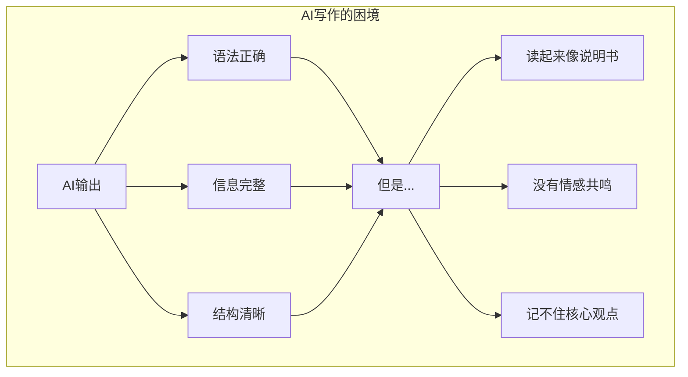
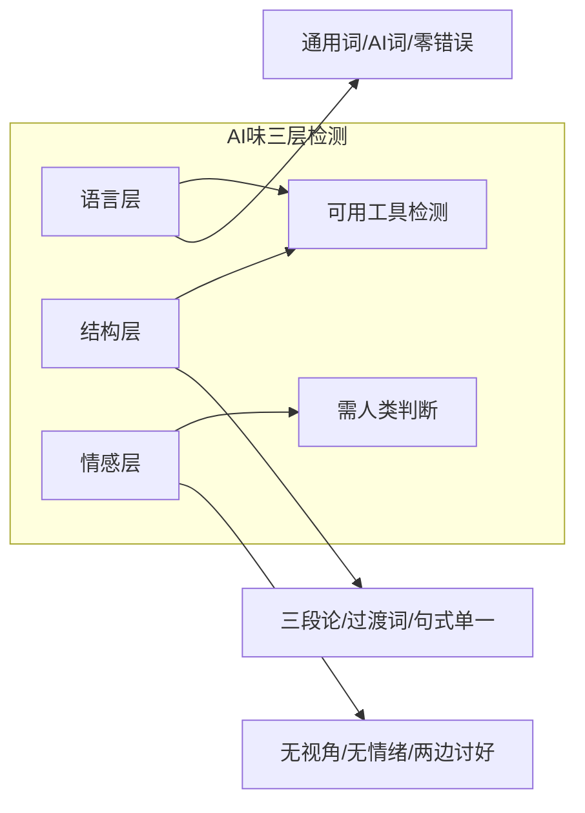
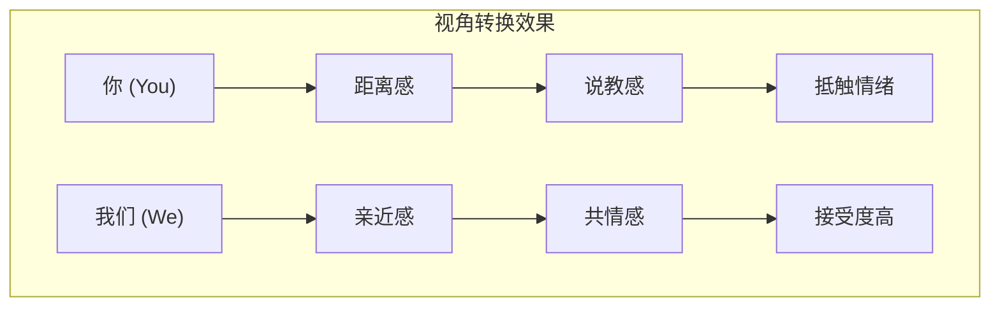
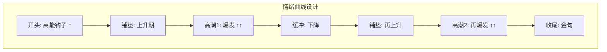
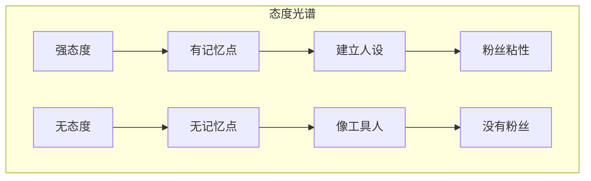
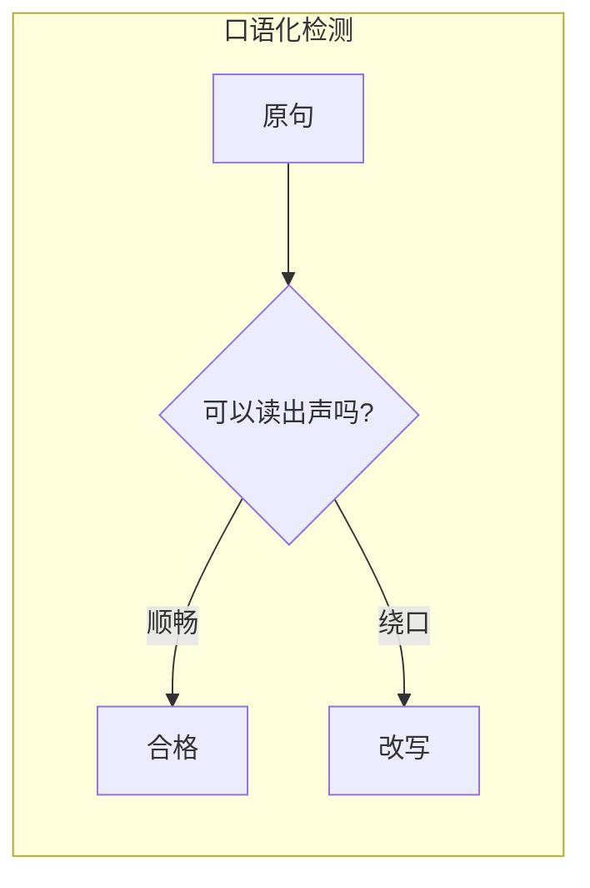
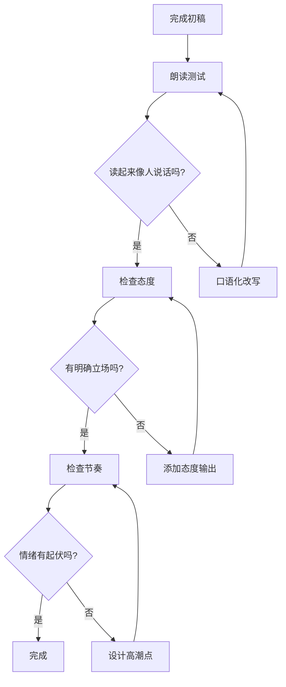

# Human-Like Expression: 去除AI味的写作技巧

> **Tags:** `Writing`, `Anti-AI`, `Authenticity`, `Engagement`
> **Date Added:** `2026-01-12`
> **一句话总结 (One-Liner):** AI写作的本质问题是"没有人味"——只有把人性注入文字，才能与读者建立真正的共鸣。
> **关键协议 (Critical Protocol):**
> 1.  **结构服从内容 (Structure Follows Content):** 本文档旨在解决AI生成内容的"冷感"问题。
> 2.  **原子级视觉化 (Atomic Visualization):** 每一个重要概念必须配图。
> 3.  **拒绝阉割 (No Summary):** 保留所有案例和隐喻。

---

## 1. 元认知 (Metacognition) - 为什么我们要谈这个

### 问题定义

> **核心矛盾:** 用AI提升效率 vs 内容失去人味

在AI辅助写作时代，我们面对一个悖论：
- AI可以快速产出内容，但内容没有人味
- 人手写太慢，但才有真正的温度

**这个模块要解决的问题是：如何让AI辅助的内容，像是"你"写的，而不是"AI"写的。**

### 核心哲学

> [!IMPORTANT]
> **核心洞察 (Key Insight):** AI写作的根本问题不是"写错了"，而是"写对了但没有灵魂"——它写了一份完美的说明书，但我们需要的是一封有温度的信。



### 系统定位 (System Role)

| 角色 | 说明 |
|:-----|:-----|
| **上游依赖** | 内容策划、选题确定 |
| **本模块位置** | 表达设计 (D层) + 执行方法 (A层) |
| **下游输出** | 口播脚本、文章、评论 |

---

## 2. 核心架构 (Core Framework - The "What")

### 2.1 AI味的12个典型特征

AI生成的内容之所以"一眼假"，是因为存在以下可识别模式：

#### 语言层面

| 特征 | 表现 | 例子 |
|:-----|:-----|:-----|
| **1. 通用模糊语言** | 空洞、没有具体细节 | "这是一个很有趣的话题" |
| **2. 重复词汇** | 同一篇文章用10次"此外" | "此外...此外...此外..." |
| **3. 过度正式** | 像在写学术论文 | "鉴于上述情况，我们认为..." |
| **4. AI专属词汇** | 特定高频词暴露身份 | "深入探讨"、"值得一提的是"、"显著" |
| **5. 零语法错误** | 人类会犯小错，AI不会 | 每一句都完美无缺 |

#### 结构层面

| 特征 | 表现 | 例子 |
|:-----|:-----|:-----|
| **6. 三段论式列举** | 总是列三个例子 | "第一...第二...第三..." |
| **7. 过度使用过渡词** | 人工的连贯感 | "然而"、"因此"、"综上所述" |
| **8. 句式单一** | 长度和结构都很均匀 | 每句话都是15-20个字 |
| **9. 缺失话题跳跃** | 人会跑题，AI不会 | 从头到尾严格按大纲 |

#### 情感层面

| 特征 | 表现 | 例子 |
|:-----|:-----|:-----|
| **10. 无个人视角** | 缺乏"我认为"、"据我经验" | 纯客观陈述 |
| **11. 情绪平淡** | 没有激动、愤怒、惊讶 | 语气始终如一 |
| **12. 两边讨好** | 强行辩证不敢表态 | "这个问题要看情况..." |



### 2.2 人性化写作的6大核心技巧

#### 技巧总览

| # | 技巧 | 核心转换 | 效果 |
|:-:|:-----|:---------|:-----|
| 1 | **共情视角** | 你 → 我们 | 拉近距离 |
| 2 | **问题钩子** | 陈述 → 提问 | 抓住注意力 |
| 3 | **情绪高潮** | 平铺 → 设计峰值 | 增强记忆 |
| 4 | **态度鲜明** | 辩证 → 表态 | 建立人设 |
| 5 | **口语温度** | 书面 → 说话 | 有温度 |
| 6 | **节奏变化** | 均匀 → 起伏 | 保持吸引 |

---

#### 技巧1: 共情视角 (We-Perspective)

**核心转换:** 把"你如何如何"转换成"我们一起"

| AI写法 | 人性化写法 |
|:-------|:-----------|
| "你需要理解这个概念" | "我们先来搞清楚一件事" |
| "你可能会遇到这个问题" | "这个问题我们都遇到过" |
| "你应该这样做" | "咱们试试换个方法" |

**心理机制:** 
- "你"= 居高临下的说教者
- "我们"= 并肩作战的伙伴



---

#### 技巧2: 问题钩子 (Question Hook)

**核心转换:** 开头不要陈述，要抛问题

| AI写法 | 人性化写法 |
|:-------|:-----------|
| "在现代社会，人们普遍有一种感受..." | "为什么我们总觉得生不逢时？" |
| "本文将探讨焦虑的成因..." | "你有没有发现，越努力越焦虑？" |
| "随着科技发展..." | "2025年了，为什么我们还这么累？" |

**心理机制:**
- 问题触发大脑的"未完成感" (Zeigarnik Effect)
- 观众会想"为什么呢？"然后继续看


---

#### 技巧3: 情绪高潮 (Emotion Peak)

**核心转换:** 不要平铺直叙，要设计情绪曲线

**情绪曲线公式:**
```
酝酿(1-2分) → 爆发(关键点) → 缓冲(过渡) → 再酝酿 → 再爆发 → 收尾
```

| 结构位置 | 情绪设计 | 技巧 |
|:---------|:---------|:-----|
| **开头** | 先给高能 | 问题/冲突/反直觉 |
| **中段1** | 铺垫上升 | 讲道理/举例 |
| **高潮1** | 爆发 | 短句连发/态度输出 |
| **中段2** | 缓冲 | 过渡/新话题 |
| **高潮2** | 再爆发 | 核心结论 |
| **结尾** | 收 | 金句/号召 |



---

#### 技巧4: 态度鲜明 (Clear Stance)

**核心转换:** 不要两边讨好，要敢于表态

| AI写法 | 人性化写法 |
|:-------|:-----------|
| "这个问题比较复杂，需要辩证看待" | "这就是错的，没什么好辩的" |
| "有人认为A，也有人认为B" | "我直接告诉你：选A" |
| "各有利弊，因人而异" | "根据我的经验，B方案不行" |

**心理机制:**
- 人类记住的是观点，不是分析
- 没有立场的内容没有记忆点
- 观众想看的是"你怎么想"，不是"百度百科"



---

#### 技巧5: 口语温度 (Conversational Warmth)

**核心转换:** 像跟朋友聊天，不像写学术论文

| AI写法 | 人性化写法 |
|:-------|:-----------|
| "现代人普遍存在一种共识" | "我们总觉得" |
| "鉴于上述分析可以得出" | "所以你看" |
| "值得注意的是" | "但有一点要小心" |
| "综上所述" | "说到底" |

**口语化改写规则:**
1. 句子缩短 (≤15字)
2. 用"你看"、"你想"连接
3. 加语气词 "嘛"、"啊"、"吧"
4. 用比喻替代抽象概念



---

#### 技巧6: 节奏变化 (Rhythm Variation)

**核心转换:** 句子长短交替，不要全是中等长度

| 问题 | 表现 | 修复 |
|:-----|:-----|:-----|
| **全是长句** | 读起来累 | 拆成短句 |
| **全是短句** | 像念经 | 穿插长句解释 |
| **全是中句** | AI味很重 | 刻意设计长短 |

**爆发时刻用短句:**
```
错：为了让观众能够更好地记住这个核心观点，我建议你可以尝试使用更加简洁的表达方式。

对：记住一个道理。短句有力。就这么简单。
```

---

## 3. 执行协议 (Execution Protocol - The "How")

### Phase 1: 写作前 - 视角设定

**动作:** 确定你和读者的关系

| 模式 | 适用场景 | 语言特征 |
|:-----|:---------|:---------|
| **"我们"模式** | 科普、评论 | 并肩作战感 |
| **"我"模式** | 故事、经历分享 | 个人叙述 |
| **"你"模式** | 教程(谨慎使用) | 有说教风险 |

**心法:** 除非必要，避免用"你"开头。

### Phase 2: 写作中 - 实时检测

**自检清单:**
- [ ] 这段话读出声顺不顺？
- [ ] 有没有连续3个"此外/然而/因此"？
- [ ] 是不是每段都是三点论？
- [ ] 我有没有表达自己的态度？
- [ ] 情绪有没有起伏？

### Phase 3: 写作后 - AI味检测

**检测流程:**



---

## 4. Anti-Patterns (反模式 - The "Don'ts")

### 陷阱1: 说教者综合症 (Preacher Syndrome)

**Trap:** 用"你应该"、"你需要"开头，居高临下教训读者。

**Why:** 
- 写作者下意识把自己放在"老师"位置
- AI默认用第二人称陈述

**Fix:**
- 用"我们"替代"你"
- 用问句替代陈述句

**Example:**
```
错：你需要意识到，这个问题的本质是...
对：我们来想想，这事儿到底怎么回事...
```

**Positive Real Scenario:**
罗翔讲法律，从不说"你们应该知道"，而是说"我们看这个案子"——这就是为什么他有2000万粉丝。

---

### 陷阱2: 冰冷分析师 (Cold Analyst)

**Trap:** 只分析不表态，像在写研究报告。

**Why:**
- 害怕得罪人
- AI默认"客观中立"

**Fix:**
- 明确说"我认为"
- 敢用"这就是错的"

**Example:**
```
错：关于这个问题，有多种不同观点，各有其道理...
对：说白了，这个想法就是错的。原因很简单...
```

**Positive Real Scenario:**
何同学评测产品，会直接说"这个设计太脑残了"——而不是"这个设计有待商榷"。

---

### 陷阱3: 三段论依赖症 (Rule-of-Three Addiction)

**Trap:** 所有例子都是三个，所有列表都是三点。

**Why:**
- AI训练数据中"三段论"模式出现频率极高
- 人类习惯了这种模式

**Fix:**
- 有时用2个例子
- 有时用4-5个例子
- 打破预期

**Example:**
```
错：这有三个原因。第一...第二...第三...
对：原因就俩，很简单：一是...二是...
```

---

### 陷阱4: 过渡词滥用 (Transition Overflow)

**Trap:** "此外"、"然而"、"因此"用到泛滥。

**Why:**
- AI用过渡词制造虚假的连贯感
- 人类写作时思维更跳跃

**Fix:**
- 删掉80%的过渡词
- 用段落分隔代替过渡词

**Example:**
```
错：首先...此外...然而...因此...综上所述...
对：[直接说观点，段落自然过渡]
```

---

### 陷阱5: 温度缺失症 (Warmth Deficiency)

**Trap:** 语言冰冷，像在读用户手册。

**Why:**
- AI没有情感体验
- 默认用中性正式语言

**Fix:**
- 加语气词：嘛、啊、吧
- 加感叹句
- 加自己的比喻

**Example:**
```
错：现代社会中，人们普遍面临着选择过多的困扰。
对：选择太多，反而选不出来——这事儿谁没遇到过啊？
```

---

## 5. 系统关联 (Interlinkages)

**上游 (Input):**
- 选题策划 → 确定内容方向
- Hook_Techniques → 开头吸引力

**下游 (Output):**
- 口播脚本 → 直接应用
- Asyre参数系统 → 量化为参数

**强关联模块:**
- `1.0_Hook_Techniques.md` - 钩子技术
- `Oral_Script_Style.md` - 口播风格

---

## 6. Glossary (术语表)

| 术语 | 英文 | 定义 |
|:-----|:-----|:-----|
| **AI味** | AI-Like Writing | 机器生成文本的可识别特征，如通用语言、重复结构、情绪缺失 |
| **共情视角** | We-Perspective | 用"我们"代替"你"，与读者并肩而非说教 |
| **问题钩子** | Question Hook | 用问句开头抓住注意力，触发"未完成感" |
| **情绪高潮** | Emotion Peak | 内容中设计的情绪爆发点，增强记忆 |
| **态度输出** | Stance Output | 明确表达个人观点，不两边讨好 |
| **口语温度** | Conversational Warmth | 像跟朋友聊天的表达方式，有温度 |
| **说教者综合症** | Preacher Syndrome | 过度使用"你应该"的说教式写作 |
| **冰冷分析师** | Cold Analyst | 只分析不表态，缺乏个人色彩 |
| **三段论依赖** | Rule-of-Three | AI过度使用"三个例子"的模式 |
| **过渡词滥用** | Transition Overflow | 过度使用"此外、然而、因此" |

---

## 7. Formula Table (公式表)

| 公式名 | 表达式 | 变量说明 |
|:-------|:-------|:---------|
| **人味指数** | `人味 = 态度强度 × 情绪起伏 × 视角亲近度` | 三者都要有，任一为0则无人味 |
| **口语化公式** | `口语化 = 1 - (书面词比例 + 过渡词密度)` | 书面词和过渡词越多，口语化越低 |
| **记忆公式** | `记忆度 = 态度鲜明度 × 情绪高峰强度` | 没态度没高潮 = 没记忆 |
| **AI味检测** | `AI味 = 通用词 + 重复结构 + 情绪平淡 + 无视角` | 四项中符合两项以上即有AI味 |
| **共情转换** | `共情 = "你" → "我们" + 问句开头` | 视角+句式双转换 |

---

## 备注与引用 (Notes & References)

**研究来源:**
- AI文本检测特征研究
- 文案写作情感连接技巧
- 口播内容创作实践

**版本历史:**
| 版本 | 日期 | 变更 |
|:-----|:-----|:-----|
| v1.0 | 2026-01-12 | 初始版本，基于反馈创建 |
