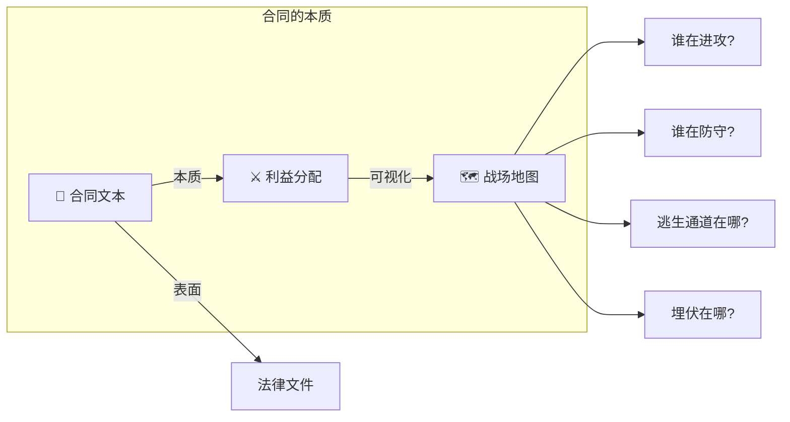
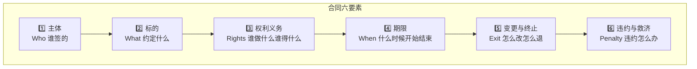
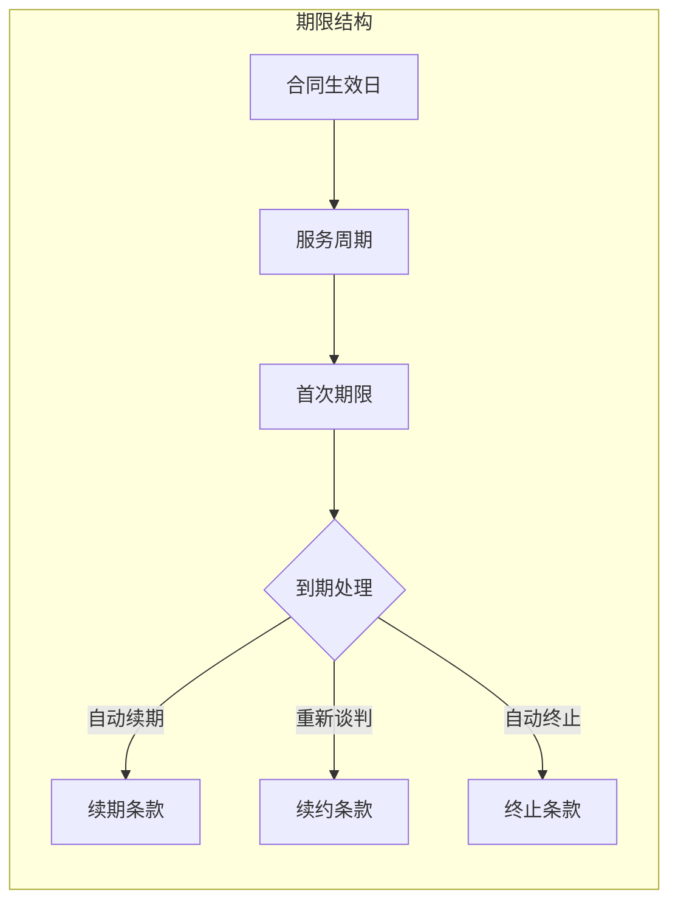
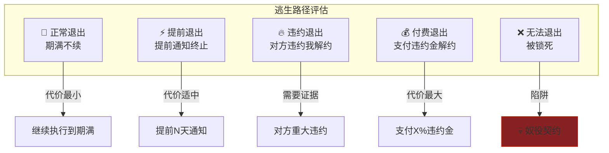
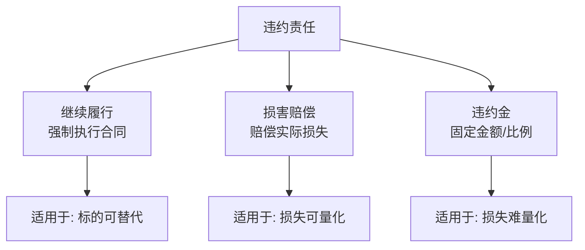
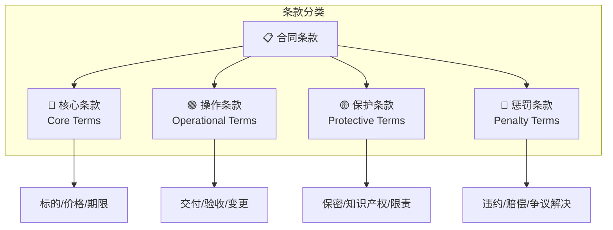
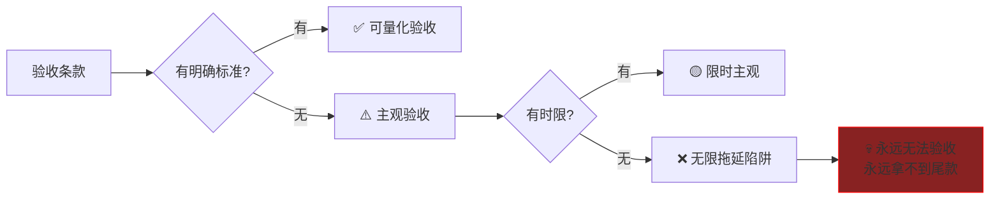
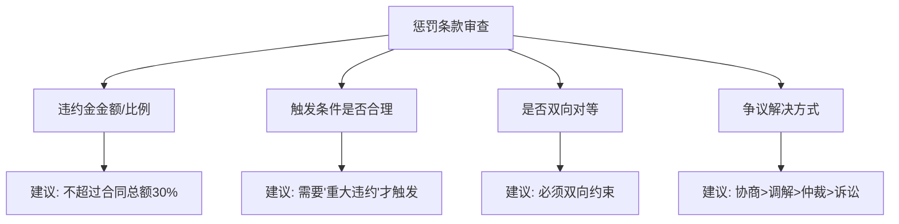
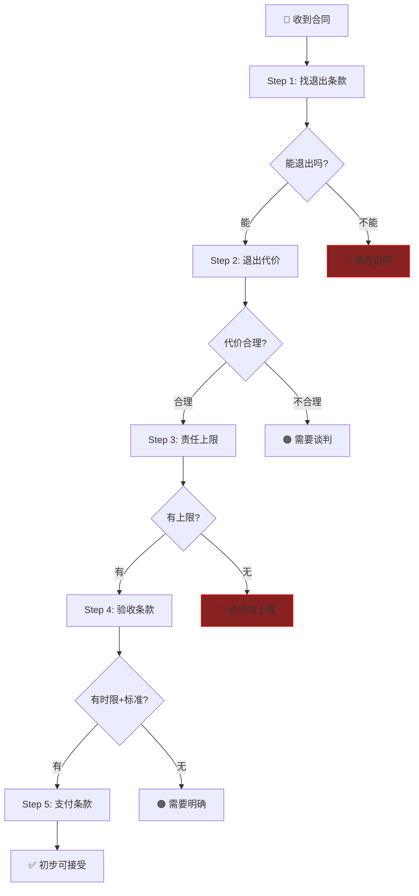
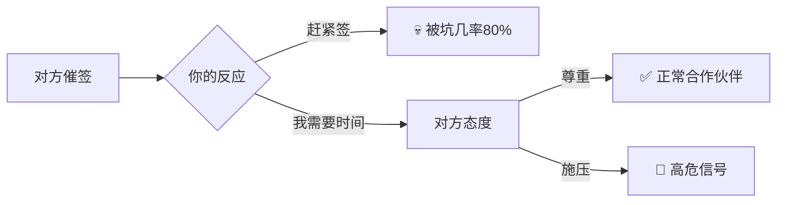

# Contract Warfare: 合同解剖学 (Contract Anatomy)

> **Tags:** `[Legal]`, `[Contract]`, `[Negotiation]`, `[Risk]`, `[Asher-Customized]`
> **Date Added:** `2026-01-10`
> **一句话总结 (One-Liner):** 合同不是法律文件，是利益分配的战场地图——看懂结构，你就知道谁在进攻、谁在防守、逃生通道在哪里。
> **关键协议 (Critical Protocol):**
> 1.  **逃生路径必检 (Exit Path Mandatory):** 每份合同第一件事：找退出条款。没有退出权 = 奴役契约。
> 2.  **条款原子化 (Clause Atomization):** 把每个条款拆解到不可再分的原子单元，才能识别隐藏的陷阱。
> 3.  **对等性扫描 (Symmetry Scan):** 任何只约束你不约束对方的条款，都是敌意条款。

---

## 1. 元认知 (Metacognition)

### 1.1 问题定义：为什么要学合同？

> **普通人的误区:** "合同就是走个形式，出事了再说。"
> **Asher的态度:** "合同是我签字前唯一能改变规则的时刻。签完之后，我就是规则的奴隶。"

合同之所以重要，是因为它是**利益分配的固化**：
- 签字前，一切可谈
- 签字后，白纸黑字就是法律

**核心恐惧 (Asher人设适配):**
> "我最恐惧的不是亏钱，是**失去选择权**。一份糟糕的合同可以把我锁在地狱里，想跑都跑不掉。"

### 1.2 核心哲学：合同是战场地图



### 1.3 系统定位

| 角色 | 合同场景描述 | Asher专属策略 |
| :--- | :--- | :--- |
| **乙方 (服务提供者)** | 提供服务换取报酬 | 确保收款权，保留提价权，设计退出权 |
| **乙方 (租客)** | 租赁物业使用 | 锁定租金，保护押金，维护续租权 |
| **乙方 (代理商)** | 代理商家产品/服务 | 确保独家区域，保护佣金结构，防止甩锅 |
| **甲方 (雇主)** | 雇佣员工 | 保护商业秘密，保留解约权，防止被讹 |

> [!IMPORTANT]
> **核心洞察 (Key Insight):** 
> 合同的每一条都是**零和博弈**——你拿到的权利，就是对方失去的权利。不存在"对大家都好"的条款，只存在"双方都能接受"的妥协点。

---

## 2. 合同骨架：法律结构解剖

### 2.1 合同的六大构成要素



### 2.2 要素一：主体资格 (The Parties)

> **核心问题:** 你签的人有资格代表对方吗？

| 审查项 | 为什么重要 | 审查方法 |
| :--- | :--- | :--- |
| **法人资格** | 和皮包公司签约=打水漂 | 查工商登记，看注册资本/实缴 |
| **签字权** | 员工签的字公司可能不认 | 要求出示授权委托书 |
| **代理权限** | 代理人可能越权 | 确认代理范围 |
| **连带责任** | 个人保证vs公司保证 | 明确责任承担主体 |

**Asher专属检查项：**
- [ ] 对方注册资本多少？实缴还是认缴？
- [ ] 对方成立多久？有无诉讼记录？
- [ ] 签字人是法定代表人还是授权代表？
- [ ] 如果是个人，有无资产可执行？

**企业信用查询渠道:**
```
国家企业信用信息公示系统: http://www.gsxt.gov.cn
天眼查/企查查: 诉讼记录、关联公司、实际控制人
```

### 2.3 要素二：标的 (Subject Matter)

> **核心问题:** 你们到底约定的是什么？

**模糊标的 = 无限责任陷阱**

| 模糊表述 (危险) | 明确表述 (安全) |
| :--- | :--- |
| "提供营销服务" | "在2026年1月-3月期间，为甲方小红书账号发布30篇图文内容" |
| "保证效果" | "保证月均曝光量达到50万次" |
| "协助运营" | "每周提供2次线上会议，每次不超过1小时" |
| "优质产品" | "符合GB/T XXXX-2020标准的产品" |

**Asher专属原则:**
> "如果标的写得越模糊，说明对方越想保留解释权。解释权在谁手里，谁就能随时变卦。"


### 2.4 要素三：权利义务 (Rights & Obligations)

> **核心问题:** 谁做什么？谁得什么？

**对等性检查表:**

| 检查项 | 你的义务 | 对方的义务 | 对等吗? |
| :--- | :--- | :--- | :--- |
| **交付** | 按时交付服务 | 按时支付款项 | ✅ 对等 |
| **验收** | 配合验收 | 在X天内完成验收 | ⚠️ 要明确天数 |
| **保密** | 保密对方信息 | 保密我方信息 | ✅ 对等 |
| **违约** | 违约赔偿100% | 对方违约赔偿50% | ❌ 不对等！ |

**Asher专属扫描:**
> "任何只约束我、不约束对方的条款，都是**敌意条款**。我会标红，要么删掉，要么加上对等条款。"

### 2.5 要素四：期限 (Term & Duration)

> **核心问题:** 什么时候开始？什么时候结束？能续吗？



**关键期限条款:**

| 条款类型 | 对乙方有利版本 | 对甲方有利版本 |
| :--- | :--- | :--- |
| **自动续期** | 除非提前30天书面终止，自动续期1年 | 除非双方书面同意，期满自动终止 |
| **试用期** | 试用期内双方可随时终止 | 试用期内乙方完成指标才转正式 |
| **锁定期** | 无锁定期 | 锁定期内乙方不得解约 |

### 2.6 要素五：变更与终止 (Amendment & Termination)

> **核心问题:** 我怎么才能跑？

**Asher专属核心:** 这是最重要的部分！



**终止条款清单 (Asher必检项):**

| 检查项 | 问题 | 理想答案 |
| :--- | :--- | :--- |
| **通知期** | 提前多久通知可以终止？ | 30天或更短 |
| **终止条件** | 什么情况下可以无责终止？ | 对方违约、不可抗力、协商一致 |
| **提前终止违约金** | 我想提前走要赔多少？ | 不超过剩余合同金额的20% |
| **对方终止补偿** | 对方提前终止补偿我多少？ | 已完成工作量+损失补偿 |
| **自动续期陷阱** | 会不会不通知就自动续了？ | 明确需要双方确认才续期 |

### 2.7 要素六：违约与救济 (Breach & Remedy)

> **核心问题:** 出事了怎么办？

**违约责任的三种形态:**



**违约金的陷阱:**

| 条款表述 | 风险评估 | Asher建议 |
| :--- | :--- | :--- |
| "违约方赔偿全部损失" | 🔴 无上限，恐怖 | 加上"但不超过合同总金额" |
| "违约金为合同金额的30%" | 🟡 可接受 | 确认是"总金额"还是"剩余金额" |
| "违约方承担对方律师费" | 🔴 成本不可控 | 删除或加上"合理律师费" |
| "违约方赔偿可得利益损失" | 🔴 无限责任 | 必须删除或加上上限 |

---

## 3. 条款分类学：识别每一种武器

### 3.1 条款的四大类型



### 3.2 核心条款 (Core Terms)

> **定义:** 合同的灵魂，决定这笔交易是什么。

| 条款名 | 谈判要点 | Asher策略 |
| :--- | :--- | :--- |
| **价格条款** | 金额、支付方式、支付时间 | 先款后货，分期里程碑 |
| **标的条款** | 服务/产品的精确定义 | 量化一切，拒绝模糊 |
| **期限条款** | 起止时间、续期条件 | 短期试水，保留退出 |

**服务合同价格条款示例:**

| 版本 | 条款内容 | 对谁有利 |
| :--- | :--- | :--- |
| **甲方版** | 服务费10万元，验收合格后30日内支付 | 甲方 |
| **乙方版** | 服务费10万元，签约后3日内支付50%，验收后3日内支付50% | 乙方 |
| **妥协版** | 服务费10万元，签约后7日内支付30%，中期验收后支付40%，终验后支付30% | 平衡 |

### 3.3 操作条款 (Operational Terms)

> **定义:** 怎么执行合同的细节。

| 条款名 | 为什么重要 | 陷阱警示 |
| :--- | :--- | :--- |
| **交付条款** | 定义什么算"交付完成" | "甲方满意"是无底洞 |
| **验收条款** | 定义验收标准和时限 | 无时限=无限拖延 |
| **变更条款** | 需求变了怎么办 | 免费变更=无偿加班 |
| **配合条款** | 对方需要提供什么 | 配合不到位谁担责 |

**验收条款陷阱分析:**



**Asher专属验收条款模板:**
> "甲方应在收到乙方交付成果后**7个工作日内**完成验收并书面反馈。逾期未反馈视为**验收通过**。如验收不通过，甲方应提供**书面修改意见**，乙方在收到意见后**5个工作日内**完成修改。修改次数**不超过3次**，超过3次的修改需另行协商费用。"

### 3.4 保护条款 (Protective Terms)

> **定义:** 保护各方权益的兜底条款。

| 条款名 | 保护对象 | Asher审查重点 |
| :--- | :--- | :--- |
| **保密条款** | 商业秘密 | 是否双向对等？保密期多长？ |
| **知识产权条款** | 著作权/专利 | 谁拥有成果？能否二次使用？ |
| **责任限制条款** | 赔偿上限 | 有没有责任上限？ |
| **不可抗力条款** | 天灾人祸 | 疫情算不算？政策变化算不算？ |
| **反腐败条款** | 合规 | 有无连带责任？ |

**责任限制条款的重要性:**

> "没有责任上限的合同，就是一张签了的空白支票。"

| 版本 | 条款内容 | 风险评估 |
| :--- | :--- | :--- |
| **无限责任** | "乙方应赔偿甲方因本合同遭受的一切损失" | 🔴 灾难 |
| **有限责任** | "乙方赔偿责任以已收取的服务费为上限" | 🟢 安全 |
| **排除特定损失** | "任何情况下，乙方不承担间接损失、可得利益损失" | 🟢 安全 |

### 3.5 惩罚条款 (Penalty Terms)

> **定义:** 违约了怎么罚。



**争议解决条款对比:**

| 方式 | 优点 | 缺点 | 适合场景 |
| :--- | :--- | :--- | :--- |
| **协商** | 快速、无成本 | 无强制力 | 友好分手 |
| **调解** | 快速、成本低 | 无强制力 | 有和解意愿 |
| **仲裁** | 一裁终局、保密 | 费用较高 | 商业纠纷 |
| **诉讼** | 有强制力 | 耗时长、公开 | 撕破脸 |

**Asher的选择逻辑:**
> "我优先选仲裁——一裁终局，不会被对方用上诉拖死。选管辖地时，选我所在地或中立城市，绝不选对方主场。"

---

## 4. 法律语言解码器

### 4.1 高频法律术语翻译

| 法律术语 | 人话翻译 | 使用场景 |
| :--- | :--- | :--- |
| **"应当" / "shall"** | 必须做，不做违约 | 强制性义务 |
| **"可以" / "may"** | 有权做，但不是必须 | 选择性权利 |
| **"不得" / "shall not"** | 禁止做，做了违约 | 禁止性条款 |
| **"除非另有约定"** | 特殊情况可以改 | 例外条款 |
| **"在合理范围内"** | 留有解释空间 | 弹性条款 |
| **"不可撤销"** | 一旦发生不能反悔 | 锁定条款 |
| **"排他性"** | 只能和我合作 | 独家条款 |
| **"连带责任"** | 任何一方都要承担全部 | 担保条款 |

### 4.2 危险表述识别

| 危险表述 | 为什么危险 | 如何修改 |
| :--- | :--- | :--- |
| "乙方保证甲方满意" | 满意标准由甲方定义 | 改为"符合附件X标准" |
| "乙方应承担一切责任" | 无上限责任 | 加上"以服务费为上限" |
| "如有争议由甲方最终解释" | 解释权单方 | 删除或改为双方协商 |
| "甲方有权随时终止" | 单方解约权 | 加上"提前30天通知" |
| "乙方不得向第三方披露任何信息" | 可能影响正常业务 | 加上"公开信息除外" |

### 4.3 数字与期限的陷阱

| 表述 | 实际含义 | 建议修改 |
| :--- | :--- | :--- |
| "7天内" | 7×24小时？7个工作日？ | 明确"7个工作日" |
| "合同金额的20%" | 总金额？已支付金额？ | 明确基数 |
| "月付" | 每月1号？每月末？ | 明确"每月X日前" |
| "长期合作" | 1年？5年？永久？ | 明确具体期限 |

---

## 5. Asher专属：合同审查清单

### 5.1 五分钟快速扫描

> "我没时间逐字读完，但我必须在5分钟内知道这份合同有没有大坑。"



### 5.2 服务合同专项清单

| 检查项 | 问题 | Asher标准 | ✓ |
| :--- | :--- | :--- | :--- |
| **服务范围** | 是否量化？是否可无限扩展？ | 必须有边界 | ☐ |
| **验收标准** | 是否客观可量化？ | 拒绝"满意为准" | ☐ |
| **验收时限** | 多久必须完成验收？ | 不超过7个工作日 | ☐ |
| **默认验收** | 逾期不反馈视为通过？ | 必须有 | ☐ |
| **修改次数** | 免费修改几次？ | 不超过3次 | ☐ |
| **需求变更** | 新增需求如何计费？ | 必须额外计费 | ☐ |
| **付款节点** | 是否有预付？分几期？ | 预付≥30% | ☐ |
| **尾款触发** | 什么条件支付尾款？ | 验收通过后X天 | ☐ |
| **提前终止** | 我能提前走吗？代价？ | 可以，代价合理 | ☐ |
| **责任上限** | 赔偿有没有封顶？ | 以服务费为上限 | ☐ |

### 5.3 租赁合同专项清单

| 检查项 | 问题 | Asher标准 | ✓ |
| :--- | :--- | :--- | :--- |
| **租金锁定** | 租期内会涨租吗？ | 首年锁定价格 | ☐ |
| **押金退还** | 什么条件全额退？ | 正常退租即退 | ☐ |
| **维修责任** | 设备坏了谁修？ | 非人为的房东修 | ☐ |
| **转租权** | 能转租吗？ | 允许或书面同意后可 | ☐ |
| **提前退租** | 我能提前走吗？ | 提前1月通知可退 | ☐ |
| **续租优先权** | 期满优先续租？ | 同等条件优先 | ☐ |
| **装修处置** | 装修能拆走吗？赔偿？ | 明确约定 | ☐ |
| **违约责任** | 双方违约责任对等？ | 必须对等 | ☐ |

### 5.4 商业代理合同专项清单

| 检查项 | 问题 | Asher标准 | ✓ |
| :--- | :--- | :--- | :--- |
| **代理区域** | 独家还是共享？ | 争取独家 | ☐ |
| **佣金结构** | 比例多少？何时结算？ | 月结，比例明确 | ☐ |
| **销售指标** | 有没有最低指标？ | 要合理可达成 | ☐ |
| **指标未达惩罚** | 达不到怎么办？ | 不能解约或降佣 | ☐ |
| **品牌支持** | 有无市场支持？ | 明确支持内容 | ☐ |
| **退货责任** | 客户退货谁担？ | 非代理原因归品牌 | ☐ |
| **终止后客户** | 老客户归谁？ | 继续享有佣金X期 | ☐ |
| **竞业限制** | 能代理竞品吗？ | 不能有或期限合理 | ☐ |

### 5.5 劳动合同专项清单 (雇主视角)

| 检查项 | 问题 | Asher标准 | ✓ |
| :--- | :--- | :--- | :--- |
| **试用期** | 期限合法吗？ | ≤6个月(3年合同) | ☐ |
| **商业秘密** | 保密条款覆盖全面？ | 要明确保密范围 | ☐ |
| **竞业限制** | 离职后限制期和补偿？ | 按月支付补偿金 | ☐ |
| **知识产权** | 职务成果归属？ | 明确归公司 | ☐ |
| **解约条件** | 什么情况可以解约？ | 列明具体情形 | ☐ |
| **交接义务** | 离职必须交接什么？ | 列明交接清单 | ☐ |
| **违约责任** | 员工违约赔偿？ | 专项培训费可约定 | ☐ |

---

## 6. Anti-Patterns (反模式)

### 陷阱 1: "先签了再说"心态

*   **Trap:** 急于成交，没仔细看就签字。"合同都差不多，出了事再说。"
*   **Why:** 迫于时间压力，或被对方营造的紧迫感绑架，或单纯懒得看。
*   **Fix:** 
    - 任何合同至少看24小时再签
    - 对方催得越急，越要警惕
    - 实在没时间，至少用5分钟快速扫描清单
*   **Example:** 某创业者为了快速拿到投资，没仔细看对赌条款，结果业绩没达标，被迫低价出让股份，失去公司控制权。
*   **Positive Real Scenario:** 某服务商收到大客户合同，客户催促"今天必须签"。该服务商坚持"我司法务审核需要3天"，最终发现合同中有"甲方可随时无责解约"条款，成功删除后再签约，保护了自己。



### 陷阱 2: "模糊条款是好事"错觉

*   **Trap:** 认为模糊条款对双方都好，留有弹性空间。
*   **Why:** 不想撕破脸，或对自己理解力过于自信。
*   **Fix:**
    - 模糊条款=解释权之争
    - 谁强势谁拿解释权
    - 你是乙方，你就是弱势
*   **Example:** "乙方应提供优质服务"——什么是"优质"？当甲方不满意时，永远可以说"你不优质"来拒绝付款。
*   **Positive Real Scenario:** 某设计师签约时坚持把"设计稿"改为"3张首页设计稿+1张详情页设计稿，尺寸1920x1080，格式PSD/PNG"，结果甲方要求加做5张详情页时，设计师可以理直气壮地报价增加工作量。

### 陷阱 3: "违约责任不用看"轻视

*   **Trap:** 觉得"我不会违约，所以违约责任不用看"。
*   **Why:** 过于乐观，低估意外发生的概率。
*   **Fix:**
    - 即使你不违约，对方也可能诬陷你违约
    - 违约责任决定了出事时的最大损失
    - 必须加责任上限
*   **Example:** 某IT外包公司签了"因乙方原因导致甲方任何损失，乙方应全额赔偿"条款。项目延期1周（乙方责任），甲方声称因此损失了一个500万的订单，起诉索赔500万。
*   **Positive Real Scenario:** 某咨询公司在合同中坚持加入"乙方责任以已收取咨询费为上限"条款。后来项目出问题，甲方只能追偿已付的10万咨询费，而非主张的"预期损失100万"。

### 陷阱 4: "对方是大公司，合同是标准版"

*   **Trap:** 认为大公司的合同是行业标准，没有谈判空间。
*   **Why:** 被品牌光环吓住，放弃谈判主动权。
*   **Fix:**
    - 大公司合同是**对他们最有利**的版本
    - "标准合同"只是起点，不是终点
    - 越是格式合同，越要逐条审查
*   **Example:** 某供应商与电商平台签约，平台说"这是我们的标准合同，不能改"。结果平台动辄以"影响平台形象"为由罚款，供应商毫无申诉渠道。
*   **Positive Real Scenario:** 某网红与MCN机构谈约，机构声称"都是这个合同"。网红坚持修改"收入分成从7:3改为5:5"以及"合约期从5年改为2年"，机构最终让步——因为他们比网红更需要签约。

---

## 7. Glossary (术语表)

*   **甲方/乙方 (Party A/B):** 合同双方的称呼。一般甲方是付款方/需求方，乙方是收款方/服务方。但法律上无优劣之分。
*   **标的 (Subject Matter):** 合同约定的核心内容——你们到底在交易什么。
*   **对价 (Consideration):** 一方得到的东西，必须用另一样东西来交换。没有对价的承诺不构成合同。
*   **生效条件 (Conditions Precedent):** 合同生效前必须满足的条件。比如"政府批准后生效"。
*   **不可抗力 (Force Majeure):** 天灾人祸等不可预见、不可避免、不可克服的客观情况。疫情是否算需要看具体约定。
*   **连带责任 (Joint and Several Liability):** 多个责任人中，任何一个都可能被要求承担全部责任。很可怕的条款。
*   **善意第三人 (Bona Fide Third Party):** 不知情且无过错的外部方。在纠纷中可能享有特殊保护。
*   **默示条款 (Implied Terms):** 虽然没写在合同里，但法律默认存在的条款。比如"商品应适合其通常用途"。
*   **弃权 (Waiver):** 明确放弃某项权利。谨慎签署任何"弃权声明"。

---

## 8. Formula Table (公式表)

| Formula Name | Equation / Logic | Variable Definition |
| :--- | :--- | :--- |
| **合同风险评分** | `Risk = (模糊条款数 × 0.3) + (单方条款数 × 0.4) + (无限责任条款 × 0.3)` | 评分越高风险越大 |
| **退出成本公式** | `Exit Cost = 违约金 + 已投入沉没成本 + 机会成本` | 评估提前跑的代价 |
| **谈判杠杆公式** | `Leverage = 你的替代方案数量 / 对方的替代方案数量` | 比值>1你强势 |
| **条款对等度** | `Symmetry = 双向约束条款数 / 总条款数` | 越接近1越公平 |
| **隐藏成本识别** | `Hidden Cost = 显性价格 × (1 + 隐藏费率)` | 务必识别所有费率 |

---

## 9. 系统关联 (Interlinkages)

*   **上游 (Input):**
    - `1.1_Character_Stats.md` — 风险偏好、自由本位估值
    - `1.4_Social_Game.md` — 谈判协议、武器化真诚
*   **下游 (Output):**
    - `2.0_Attack_Defense_Playbook.md` — 攻防战术
    - `3.0_Loophole_Atlas.md` — 漏洞识别

---

## 备注与引用 (Notes & References)

*   **法律依据:** 《中华人民共和国民法典》合同编
*   **定制基础:** Asher人设参数 (非对称套利、自由本位、武器化真诚)
*   **下一步:** 继续学习 `2.0_Attack_Defense_Playbook.md` (攻防博弈论)
