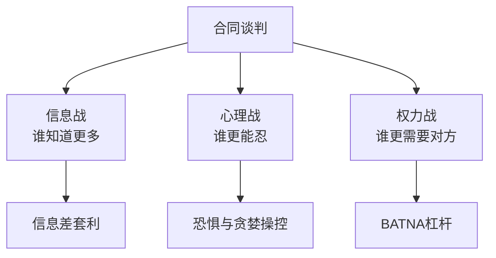
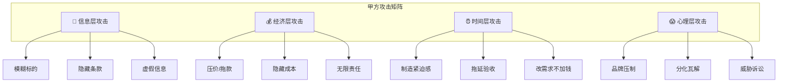
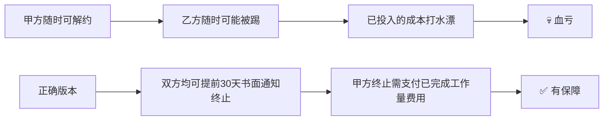
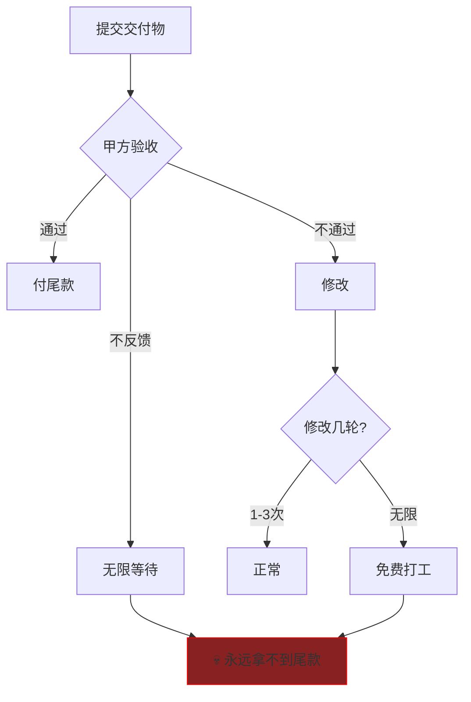
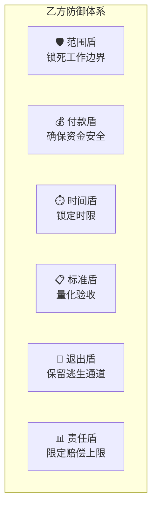
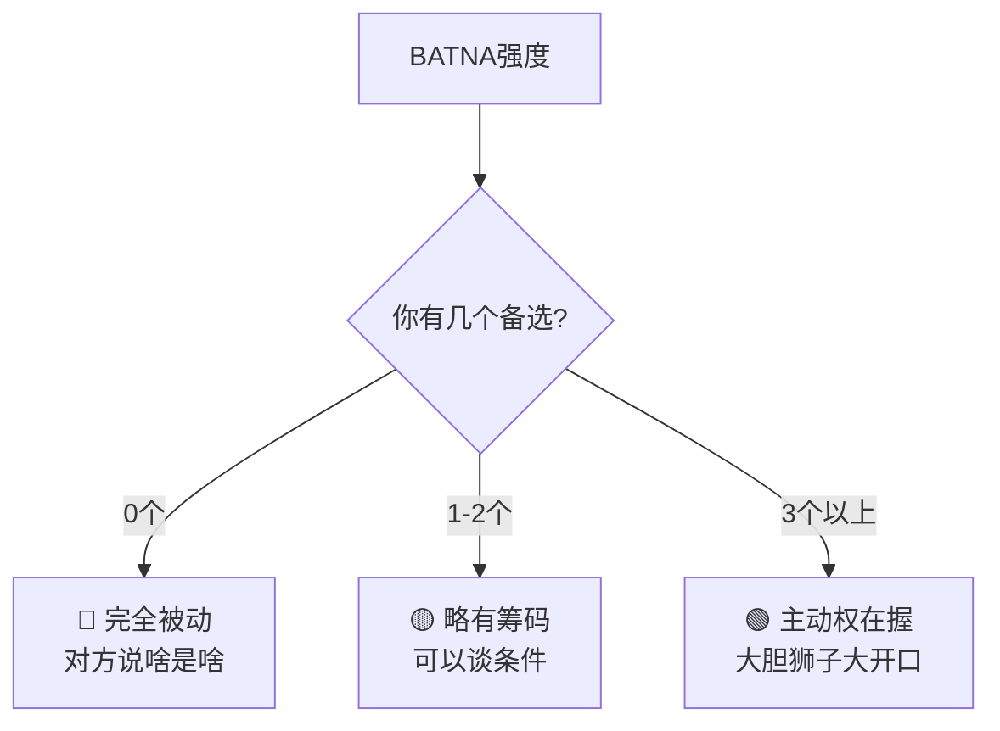
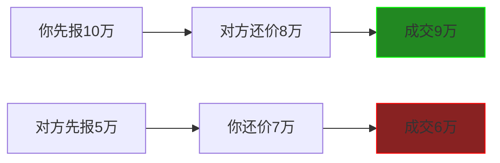
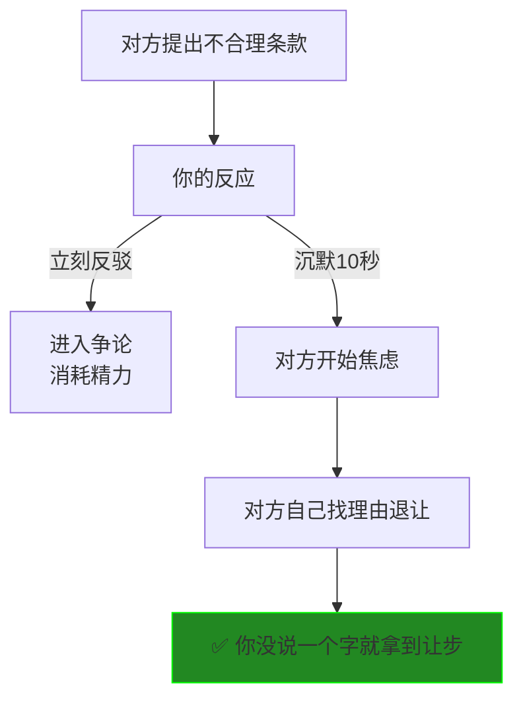
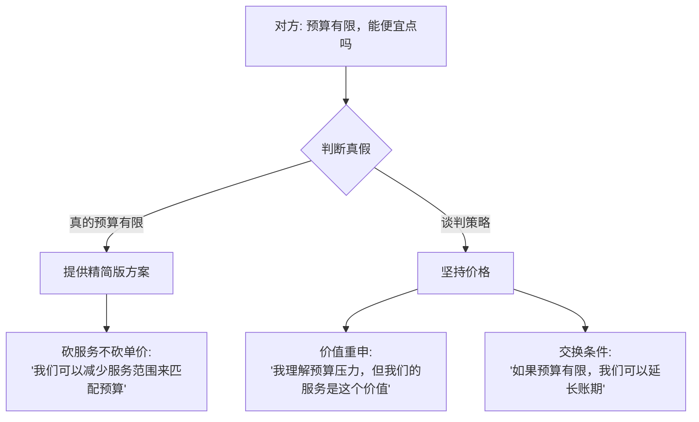
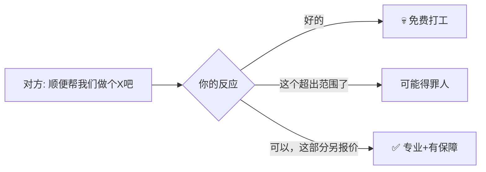

# Contract Warfare: 攻防博弈论 (Attack & Defense Playbook)

> **Tags:** `[Negotiation]`, `[Game_Theory]`, `[Psychology]`, `[Asher-Customized]`
> **Date Added:** `2026-01-10`
> **一句话总结 (One-Liner):** 合同谈判是一场心理战——谁先暴露底牌谁先输，谁能制造恐惧谁掌握主动。
> **关键协议 (Critical Protocol):**
> 1.  **非对称套利 (Asymmetric Arbitrage):** 永远不接受50/50条款，必须找到信息差和规则漏洞。
> 2.  **武器化真诚 (Weaponized Sincerity):** 主动暴露小缺陷换取对方降低防备，再拿关键利益。
> 3.  **冷血共情 (Cold Empathy):** 精准理解对方的恐惧与欲望，但内心绝不被感染。

---

## 1. 元认知 (Metacognition)

### 1.1 问题定义：什么是合同博弈？

> **普通人的视角:** "合同就是明码标价，没什么好谈的。"
> **Asher的视角:** "合同是一场牌局。每一条条款都是筹码，每一次让步都是策略。"

**合同谈判的本质:**



### 1.2 核心哲学：博弈四原则

| 原则 | 含义 | Asher应用 |
| :--- | :--- | :--- |
| **信息不对称** | 知道对方不知道的，就是你的武器 | 调研对方背景、财务、诉讼记录 |
| **替代方案** | 你有多少其他选择决定你的谈判力 | 永远准备PlanB，让对方知道你有退路 |
| **锚定效应** | 谁先出价谁设定参照系 | 先抛高价/严条款，等对方还 |
| **承诺升级** | 对方投入越多越难退出 | 让对方先付定金、先签MOU |

> [!IMPORTANT]
> **核心洞察 (Key Insight):** 
> 谈判的目的不是"赢"，而是让对方觉得他赢了——同时你拿到了真正重要的东西。

---

## 2. 甲方攻击套路大全

### 2.1 甲方的12种常见攻击招数



### 2.2 招数详解与破解

#### 攻击1: 模糊标的 (Ambiguous Scope)

> **表现:** "提供专业营销服务"、"确保项目成功"、"达到甲方满意"

| 攻击手法 | 甲方意图 | 乙方破解 |
| :--- | :--- | :--- |
| 故意不写具体交付物 | 无限扩展工作范围 | 要求附件列明具体清单 |
| 用"等"字结尾 | 保留解释权 | 删除"等"或改为"以上述为限" |
| "甲方满意为准" | 主观验收权 | 改为"符合附件X标准" |

**破解话术:**
> "为了更好地服务贵司，我们需要明确工作范围，这样双方都有清晰的预期。麻烦补充一下具体的交付物清单？"

#### 攻击2: 单方解约权 (Unilateral Termination)

> **表现:** "甲方可随时终止本合同"



**破解话术:**
> "我理解贵司需要灵活性，但我们也需要基本保障。建议改为'任一方可提前30天书面通知终止，终止方应支付对方已产生的合理成本'？"

#### 攻击3: 无限责任条款 (Unlimited Liability)

> **表现:** "乙方应赔偿甲方因本合同遭受的一切损失，包括但不限于直接损失、间接损失、可得利益损失"

| 风险等级 | 条款类型 | 破解方法 |
| :--- | :--- | :--- |
| 🔴 灾难级 | "一切损失" | 必须加上限："以服务费为上限" |
| 🔴 灾难级 | "可得利益损失" | 必须删除 |
| 🟡 高危级 | "间接损失" | 尽量删除，或加合理上限 |
| 🟢 可接受 | "直接实际损失" | 可接受，仍建议加上限 |

**破解话术:**
> "这个无限责任条款对我们风险太大，我们没办法接受。建议双方的赔偿责任都以合同金额为上限，这样也比较公平。"

#### 攻击4: 验收陷阱 (Acceptance Trap)

> **表现:** 无验收时限、无验收标准、需要甲方"确认满意"

**陷阱分析:**


**破解条款模板:**
> "甲方应在收到交付物后**7个工作日内**书面反馈验收意见。逾期未反馈视为验收通过。验收不通过应书面列明具体问题，乙方修改次数不超过**3次**。超过3次修改的工作量另行计费。"

#### 攻击5: 付款拖延术 (Payment Delay)

> **表现:** "验收合格后90天内付款"、"甲方资金到位后付款"

| 拖延手法 | 真实意图 | 破解方法 |
| :--- | :--- | :--- |
| 超长账期(60-90天) | 免费使用你的资金 | 要求缩短至30天或预付款 |
| "验收后付款"无时限 | 无限验收=无限拖延 | 加上验收时限和自动通过 |
| "资金到位后付款" | 风险转嫁给你 | 必须删除，改为固定期限 |
| 小额分多期 | 控制你，随时可停 | 增大预付比例 |

**破解话术:**
> "90天账期对我们现金流压力太大。我们可以接受30天账期，或者预付50%——这也是行业通行做法。"

#### 攻击6: 需求蔓延 (Scope Creep)

> **表现:** 合同签完后，不断加需求但不加钱


**破解条款模板:**
> "本合同服务范围以附件《工作说明书》为准。任何超出该范围的工作需求，双方应另行签订书面变更协议，并就增加的工作量协商费用。"

---

## 3. 乙方防御反击术

### 3.1 乙方防御六大盾牌



### 3.2 乙方反击策略

#### 反击1: 预付款锁定

> **原则:** 永远在开始工作前拿到钱

| 预付比例 | 适用场景 | 风险等级 |
| :--- | :--- | :--- |
| 100%预付 | 低金额、新客户 | 🟢 最安全 |
| 50%预付 + 50%验收后 | 中等金额 | 🟡 可接受 |
| 30%预付 + 40%中期 + 30%验收后 | 大项目 | 🟡 可接受 |
| 0%预付 | 除非大客户信用极好 | 🔴 高危 |

**Asher专属策略:**
> "我对新客户的原则是：不见兔子不撒鹰。至少30%预付，否则免谈。这不是不信任你，这是保护双方——你预付了也会更认真配合。"

#### 反击2: 变更计费条款

**标准版:**
> "任何超出原始服务范围的需求变更，乙方有权就增加的工作量另行报价。甲方确认报价后，乙方方开始执行变更工作。未经确认的变更请求，乙方有权拒绝执行。"

**加强版:**
> "项目启动后的需求变更，按以下标准计费：
> - 小变更(10%以内工作量增加): 免费1次，后续按时薪X元/小时计算
> - 中变更(10-30%工作量增加): 按增加工作量的120%计费
> - 大变更(30%以上工作量增加): 需签订补充协议，费用另行协商"

#### 反击3: 默认验收条款

> **核心逻辑:** 沉默=同意

**条款模板:**
> "甲方应在收到交付物后**7个工作日内**书面反馈验收意见。逾期未反馈的，**视为验收通过**。甲方反馈的修改意见应具体、明确、可执行。笼统的否定意见(如'不满意'、'不够好')不构成有效的验收意见。"

#### 反击4: 责任上限保护

**标准条款:**
> "无论基于何种原因，乙方在本合同项下的责任总额**以乙方已收取的服务费为上限**。乙方在任何情况下不对甲方的间接损失、可得利益损失、数据丢失或商誉损失承担责任。"

#### 反击5: 提前终止权

> **原则:** 永远给自己留一扇门

**乙方版终止条款:**
> "任一方可提前**30天**书面通知终止本合同。如甲方提前终止，应支付乙方已完成工作量的全部费用及预期利润的**30%**作为补偿。如乙方提前终止，已收取的预付款按已完成工作量比例结算，多退少补。"

---

## 4. 谈判杠杆识别

### 4.1 BATNA：你的最强武器

> **BATNA (Best Alternative To a Negotiated Agreement):** 谈不成的情况下，你的最佳替代方案。



**Asher专属BATNA策略:**
> "我永远不会只谈一个客户。即使这个客户90%会成，我也要同时保持2-3个候选。这不是贪心，这是确保我在任何谈判中都不会因为'等米下锅'而被压价。"

### 4.2 识别对方的BATNA

| 信号 | 含义 | 你的策略 |
| :--- | :--- | :--- |
| 对方很急切 | 他们没有替代方案 | 可以坚持条件 |
| 对方慢慢谈 | 他们有其他选择 | 需要展示独特价值 |
| 对方频繁比价 | 他们在玩你 | 明确你的差异化 |
| 对方强调预算有限 | 可能是真的，也可能是谈判策略 | 探测真假 |

### 4.3 谈判杠杆公式

```
谈判力 = 你的BATNA强度 / 对方的BATNA强度
        × 你掌握的独特价值
        × 时间压力等级(谁更着急)
```

**提升谈判力的四种方法:**
1. **增加你的替代方案** — 同时谈多家
2. **减少对方的替代方案** — 让对方知道市场上像你这样的不多
3. **增加你的独特价值** — 强调只有你能提供的东西
4. **制造时间压力** — "这个价格只有本周有效"

---

## 5. 心理操控技术

### 5.1 锚定效应 (Anchoring)

> **原理:** 谁先出价，谁设定参照系



**Asher策略:**
> "报价时永远先出手，而且报高一档。对方杀价是必然的，你的任务是让杀完价之后的数字正好是你的心理价位。"

### 5.2 让步策略 (Concession Strategy)

| 让步类型 | 描述 | 效果 |
| :--- | :--- | :--- |
| **逐步递减让步** | 10万→9万→8.8万→8.7万 | 让对方觉得接近底线了 |
| **交换式让步** | "我可以降价，但账期要缩短" | 拿到对价 |
| **假装痛苦的让步** | 叹气、沉默、"这真的很难..." | 让对方珍惜这个让步 |
| **Package让步** | 一次性给一个方案 | 显示诚意，快速成交 |

**Asher专属技巧:**
> "每一次让步都要让对方付出代价来'换'。不能白送。他要降价，你就要缩短账期。他要增加服务，你就要提高总价。等价交换，否则你会被蚕食。"

### 5.3 恐惧与贪婪操控

**制造恐惧 (Fear):**
- "这个价格只限本周，下周要涨15%"
- "我手上还有2个客户在等，先到先得"
- "行业里出过X公司的案例，没选我们结果..."

**激发贪婪 (Greed):**
- "现在签约我们送额外3个月服务"
- "老客户推荐的话，你们都有返点"
- "我们接了竞品的单子，但你们先来的，优先给你们"

### 5.4 沉默的力量 (The Power of Silence)

> **Asher专属武器:** 静默否决 (Silent Veto)



**使用方法:**
1. 对方说完不合理的条件后，不要立刻回应
2. 表情保持中性，直视对方，沉默5-10秒
3. 对方会因为"真空"而焦虑，开始自我解释或退让
4. 如果对方不退让，缓缓说："这个条件我们很难接受。"

---

## 6. 场景化攻防剧本

### 6.1 场景：对方说"预算有限"



**话术模板:**
> "我完全理解预算压力。我们可以这样：保持单价不变，但调整服务范围来匹配您的预算。您看哪些部分是必须的，哪些可以先放一放？"

### 6.2 场景：对方说"别人报价更低"

**判断真假:**
| 信号 | 真实情况 | 应对策略 |
| :--- | :--- | :--- |
| 能具体说出竞争对手名字 | 可能是真的 | 强调差异化 |
| 只说"有人报价更低"不说是谁 | 很可能是谈判策略 | 不必太在意 |
| 对方已经在你身上投入时间精力 | 不太可能真的转投竞争对手 | 坚持价格 |

**话术模板:**
> "市场上确实有不同价位的供应商。我们的价格反映的是XX年的行业经验、XX的交付标准、以及XX的售后保障。您可以对比一下，看看其他报价是否包含这些。"

### 6.3 场景：对方要求"附加服务"

> **原则:** 每一个附加服务都是工作量，工作量就是钱



**话术模板:**
> "这个需求完全可以做，不在我们原来的服务范围内，我给您单独报个价？这样我们都有保障。"

### 6.4 场景：对方拖延签约

**原因分析:**
| 原因 | 表现 | 应对 |
| :--- | :--- | :--- |
| 在比价 | 反复问细节/要资料 | 设定deadline |
| 内部流程慢 | 说"还在走审批" | 询问具体流程/节点 |
| 不是真的要买 | 一直"考虑考虑" | 放弃，节省精力 |
| 等你急了降价 | 故意不回复 | 表现出你不急 |

**制造紧迫感:**
> "我们团队近期接了一个大项目，如果本周内不能确定，可能要排到下个月了。您这边方便加快一下节奏吗？"

---

## 7. Asher专属：非对称博弈话术库

### 7.1 武器化真诚 (Weaponized Sincerity)

> **原理:** 主动暴露小缺陷，换取对方降低防备，再拿关键利益

**话术示例:**
| 暴露的小缺陷 | 换取的大利益 |
| :--- | :--- |
| "说实话，我们团队人不多" | "但这意味我亲自盯你的项目" |
| "我们价格确实不是最低的" | "但我们从没有客户投诉过交付质量" |
| "这个时间确实比较赶" | "不过如果能预付60%，我可以调资源优先做" |

### 7.2 冷血共情 (Cold Empathy)

> **原理:** 精准理解对方的恐惧与欲望，用同理心的外壳包装利益诉求

**话术示例:**
> "我完全理解您的顾虑——换作是我，也会担心外包质量控制不了。所以我们才设计了这个分期付款+阶段验收的方案，您每个阶段都能看到成果再付款，这样您也放心。"

**内心独白 (Asher人设):**
> "他担心我跑路，我就设计一个让他觉得'我跑不了'的方案——但实际上这个分期方式对我现金流影响不大，而且每一期付款都有保障。"

### 7.3 被动引力 (Inbound Gravity)

> **原理:** 不追着客户跑，让客户来追你

**话术示例:**
> "我这边最近项目比较多，不一定能马上安排。不过您如果感兴趣，可以先把需求发过来，我看看能不能挤时间。"

**效果:**
- 传递"我很忙=我很抢手"的信号
- 降低你的需求感，提高谈判地位
- 让客户产生"要争取你"的心理

---

## 8. Anti-Patterns (反模式)

### 陷阱 1: 过早暴露底牌

*   **Trap:** 一开始就说"我的底线是8万"或"我最多能接受30天账期"
*   **Why:** 急于成交，或者被对方套话
*   **Fix:**
    - 永远不要主动说底线
    - 被问底线时反问："您的预算是多少？"
    - 用区间代替具体数字："根据工作量，应该在10-15万之间"
*   **Positive Real Scenario:** 某顾问被问"你最低多少钱"时回答"根据您的需求，我们通常是X-Y万之间，具体要看工作量"。最终以高于底线40%的价格成交。

### 陷阱 2: 单方面让步

*   **Trap:** 对方要求降价，你直接说"好，降5000"
*   **Why:** 想表现出诚意，或害怕丢单
*   **Fix:**
    - 每一次让步都要换回对价
    - "可以降5000，但账期要从60天改成30天"
    - 不给对价，就不让步
*   **Positive Real Scenario:** 某设计公司面对客户降价要求时说"价格可以再谈，但我们需要缩短验收周期到5天，这样双方都有效率保障"。客户接受，设计公司既保证了现金流，又没有单纯降价。

### 陷阱 3: 情绪化谈判

*   **Trap:** 被对方的强硬态度激怒，或者被压价搞得很焦虑
*   **Why:** 把谈判当成了人格攻击
*   **Fix:**
    - 谈判是角色扮演，不是个人攻击
    - 对方的强硬可能只是策略
    - 保持"绝对观测者"视角，把自己抽离出来
*   **Positive Real Scenario:** 某创业者在被投资人"虐"了2小时后，依然面带微笑说"我理解您的顾虑，我们可以这样调整..."。最终拿到比预期更好的条款——因为投资人反而欣赏他的稳定性。

### 陷阱 4: 口头承诺当真

*   **Trap:** 对方说"后面还有大单给你"、"做好了给你介绍客户"，你就降价
*   **Why:** 贪婪，以及对"未来"的乐观预期
*   **Fix:**
    - 没写进合同的都不算
    - 未来的承诺换现在的让步，不划算
    - "那我们先把这次做好，后面的单子再签新合同"
*   **Positive Real Scenario:** 某服务商被"后面还有大单"诱惑时说"那太好了，我们先把这个做漂亮，后面的我们再谈新价格"。结果"后面的大单"根本没出现——但至少这一单没亏。

---

## 9. Glossary (术语表)

*   **BATNA:** Best Alternative To a Negotiated Agreement，谈判破裂后的最佳替代方案。BATNA越强，谈判力越大。
*   **锚定效应 (Anchoring):** 第一个被提出的数字会成为后续谈判的参照系。先出价往往占优势。
*   **零和博弈 (Zero-Sum Game):** 一方所得等于另一方所失的博弈。合同条款往往是零和的。
*   **信息不对称 (Information Asymmetry):** 双方掌握的信息不同。信息优势方往往谈判力更强。
*   **承诺升级 (Commitment Escalation):** 一方已投入的成本越多，越难退出。让对方先投入是策略。
*   **需求蔓延 (Scope Creep):** 项目范围在执行过程中不断扩大，但费用不变。乙方大敌。
*   **沉默成本 (Sunk Cost):** 已经投入且无法收回的成本。不应影响未来决策，但人们往往难以忽视。

---

## 10. Formula Table (公式表)

| Formula Name | Equation / Logic | Variable Definition |
| :--- | :--- | :--- |
| **谈判力公式** | `Power = Your BATNA / Their BATNA × Unique Value × Time Pressure` | BATNA越强力量越大 |
| **让步回报率** | `Concession ROI = 获得的对价价值 / 让出的让步价值` | 必须>1才值得让步 |
| **虚假底线位置** | `Fake Bottom = True Bottom × 1.2` | 报价时留20%谈判空间 |
| **时间压力指数** | `Time Pressure = 你的截止日期 / 对方的截止日期` | 指数>1你更急，指数<1对方更急 |

---

## 11. 系统关联 (Interlinkages)

*   **上游 (Input):**
    - `1.0_Contract_Anatomy.md` — 合同结构认知
    - `1.4_Social_Game.md` — 博弈协议
*   **下游 (Output):**
    - `3.0_Loophole_Atlas.md` — 漏洞利用
    - `5.0_Negotiation_Scripts.md` — 场景话术

---

## 备注与引用 (Notes & References)

*   **理论基础:** 哈佛谈判术、博弈论、行为经济学
*   **定制基础:** Asher人设参数 (非对称套利、武器化真诚、冷血共情)
*   **实战来源:** 商业谈判经验、法律纠纷案例
