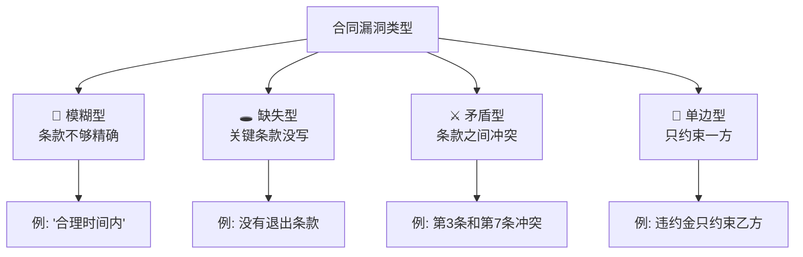
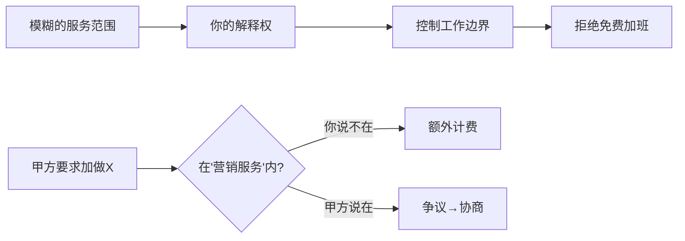
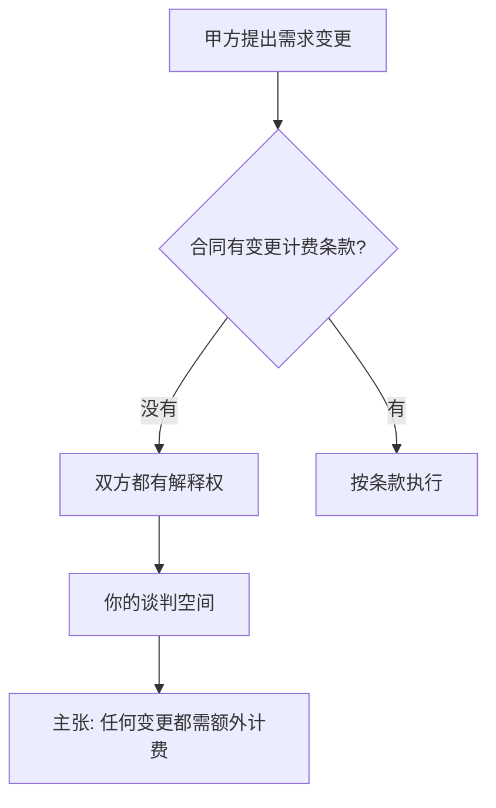
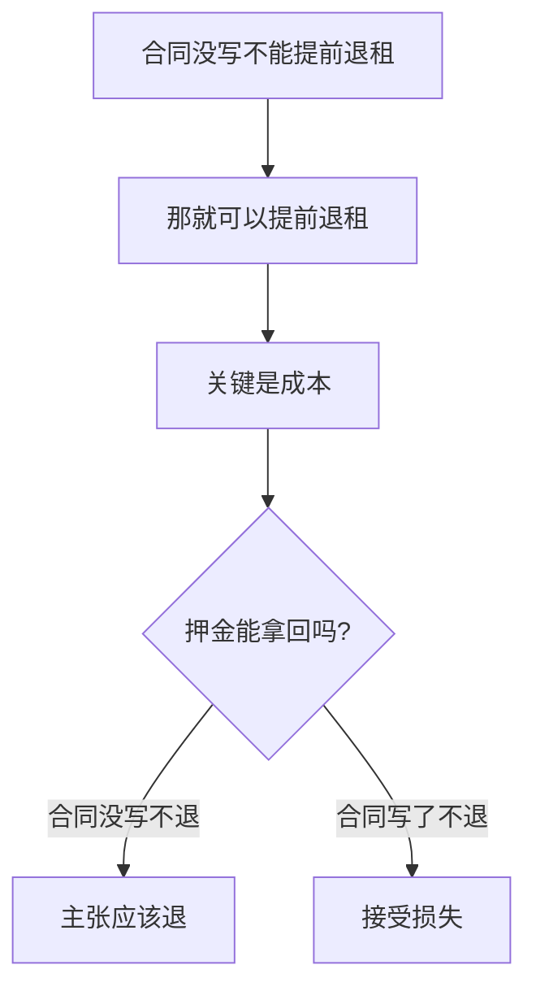
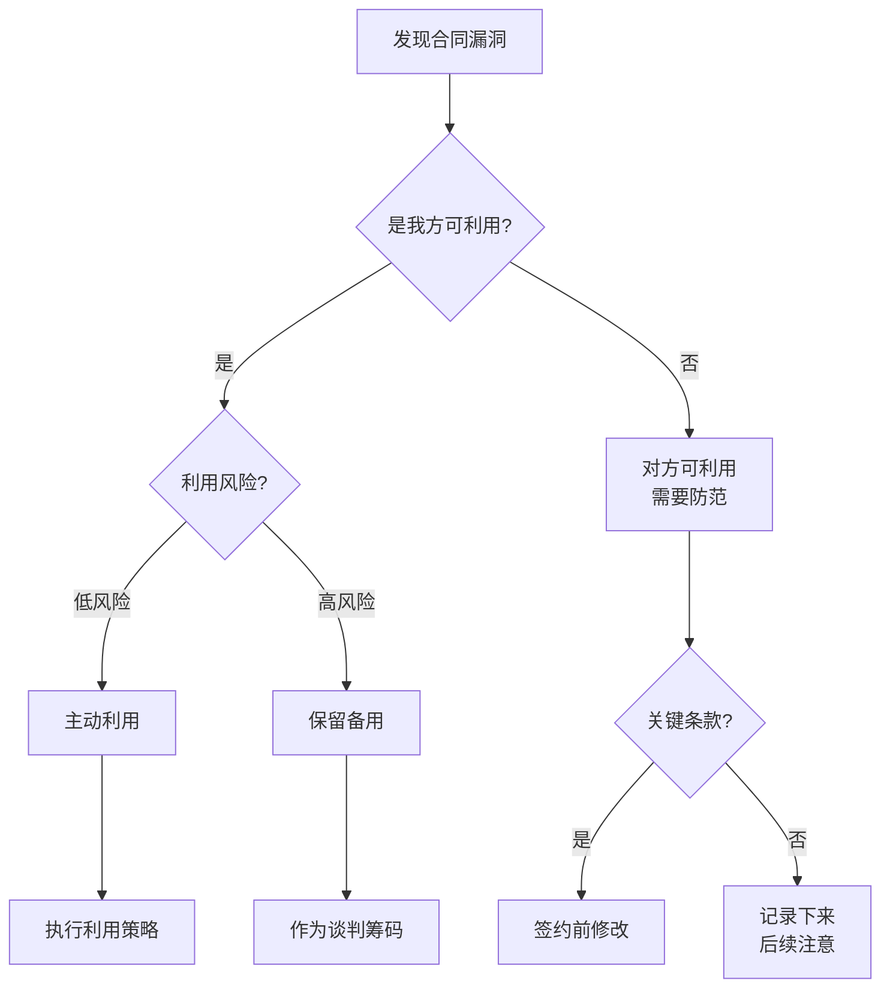

# Contract Warfare: 漏洞图谱 (Loophole Atlas)

> **Tags:** `[Loophole]`, `[Service]`, `[Lease]`, `[Agency]`, `[Labor]`, `[Asher-Customized]`
> **Date Added:** `2026-01-10`
> **一句话总结 (One-Liner):** 漏洞不是违法，是规则的边界——找到规则没有明确覆盖的灰色地带，你就找到了可操作空间。
> **关键协议 (Critical Protocol):**
> 1.  **漏洞 ≠ 违法:** 合同漏洞是规则的模糊地带，利用漏洞是合法的博弈，不是违法行为。
> 2.  **双向视角:** 你要找漏洞利用，也要发现漏洞防范——攻防一体。
> 3.  **具体合同具体分析:** 本文提供的是通用漏洞模式，实际漏洞取决于具体条款。

---

## 1. 元认知 (Metacognition)

### 1.1 什么是合同漏洞？

> **漏洞的定义:** 合同条款中**模糊、缺失、矛盾**的地方，导致双方对同一条款可以有不同解释。

### 1.2 漏洞利用的道德边界

> **Asher的边界:** "法律是不可穿越的物理墙，道德与潜规则是可重构的变量。"

| 行为类型 | 属性 | Asher态度 |
| :--- | :--- | :--- |
| **利用合同漏洞** | 合法 | ✅ 可以做 |
| **利用对方疏忽** | 合法 | ✅ 可以做 |
| **恶意欺诈** | 违法 | ❌ 绝不做 |
| **伪造文件** | 违法 | ❌ 绝不做 |
| **胁迫强迫** | 违法 | ❌ 绝不做 |

---

## 2. 服务合同漏洞图谱

### 2.1 乙方可利用的漏洞

#### 漏洞 S-1: 服务范围模糊

> **漏洞描述:** 服务范围未精确定义，留有解释空间

**条款示例:**
> "乙方为甲方提供营销服务"（模糊）

**利用方法:**

**操作要点:**
1. 签约时留着模糊条款不改（对你有利）
2. 自己内部明确一个"最窄解释"
3. 甲方要求超范围时，指出"这不在原始范围内"
4. 要么加钱，要么不做

**防范建议 (如果你是甲方):**
> 服务范围必须用附件清单形式列明，包括但不限于：具体交付物、数量、格式、时间节点。

#### 漏洞 S-2: 验收标准缺失

> **漏洞描述:** 没有明确的验收标准，验收通过与否取决于主观判断

**条款示例:**
> "甲方验收合格后支付尾款"（没说什么是合格）

**利用方法 (乙方):**

| 场景 | 操作 |
| :--- | :--- |
| 交付后甲方说"不满意" | 要求甲方书面列明具体问题 |
| 甲方提不出具体问题 | 主张验收通过 |
| 甲方提出无关问题 | 指出该问题不在服务范围内 |

**操作要点:**
1. 交付时书面记录（邮件）
2. 要求甲方在X天内书面反馈
3. 反馈必须具体、可执行
4. 笼统的"不满意"不构成有效反馈

#### 漏洞 S-3: 变更无费用约定

> **漏洞描述:** 合同没有约定需求变更如何计费

**利用方法 (乙方):**

**操作话术:**
> "这个需求不在我们原始的工作范围内，属于变更。由于合同没有提前约定变更费用，我们需要另行协商这部分的工作量和费用。"

#### 漏洞 S-4: 付款节点模糊

> **漏洞描述:** 付款条件不够明确，有多种解释可能

**条款示例:**
> "项目完成后30天内付款"

**问题:** "完成"的定义是什么？交付？验收？上线？

**利用方法 (乙方):**
- 主张"交付即完成"，开始计算30天
- 若甲方主张"验收才算完成"，你可以反驳"合同写的是'完成'不是'验收'"

### 2.2 甲方常设的陷阱 (乙方须警惕)

#### 陷阱 S-A: 验收无时限

> **陷阱描述:** 没有规定甲方必须在多少天内完成验收

**危害:**

**破解:** 在签约时加入"X天内未反馈视为验收通过"条款

#### 陷阱 S-B: 无限修改义务

> **陷阱描述:** 合同要求"乙方应根据甲方反馈进行修改"，没有次数限制

**危害:** 甲方可以无限提修改意见，你改到天荒地老

**破解:** 明确"修改不超过3次"或"超过3次修改另行计费"

#### 陷阱 S-C: 可得利益赔偿

> **陷阱描述:** 违约责任包括"可得利益损失"

**危害:** 甲方可以声称因你违约损失了一个亿的项目机会

**破解:** 必须删除"可得利益"，或加责任上限

---

## 3. 租赁合同漏洞图谱

### 3.1 租客可利用的漏洞

#### 漏洞 L-1: 退租条件模糊

> **漏洞描述:** 合同没有明确约定提前退租的条件和流程

**条款示例:**
> "租赁期限为一年"（没说能不能提前走）

**利用方法:**

**操作要点:**
1. 合同没有明确禁止 = 可以做
2. 争议点在于押金处理
3. 协商优于对抗，提前通知体现诚意

#### 漏洞 L-2: 维修责任不清

> **漏洞描述:** 没有明确哪些维修由房东负责，哪些由租客负责

**条款示例:**
> "租赁物由乙方合理使用和维护"（没有细分）

**利用方法 (租客):**

| 情况 | 主张 |
| :--- | :--- |
| 设备自然老化损坏 | 房东责任 |
| 管道漏水 | 房东责任（结构问题） |
| 门锁更换 | 可双方协商 |
| 人为损坏 | 租客责任 |

**操作话术:**
> "空调这个是正常使用导致的老化，属于房东应该维护的固定设施，不应该由我来承担维修费用。"

#### 漏洞 L-3: 涨租条款缺失

> **漏洞描述:** 合同没有约定租金调整机制

**利用方法:**
- 没有涨租条款 = 租期内租金锁定
- 即使市场价上涨，房东也不能单方面涨租
- 续租时再谈新价格

### 3.2 房东常设的陷阱 (租客须警惕)

#### 陷阱 L-A: 押金扣除弹性条款

> **陷阱描述:** "甲方有权从押金中扣除乙方应承担的费用"

**危害:** 什么是"应承担的费用"没有定义，房东可以无限找理由扣押金

**破解:** 明确列明可扣押金的情形，加入"扣款需提供正规票据"

#### 陷阱 L-B: 违约金不对等

> **陷阱描述:** 租客违约赔偿2个月租金，房东违约只退押金

**危害:** 房东想赶你走的成本远低于你想走的成本

**破解:** 要求双方违约责任对等

#### 陷阱 L-C: 转租禁止条款

> **陷阱描述:** "未经甲方书面同意，乙方不得转租"

**危害:** 你想走但找不到下家，或者转租利润被房东截胡

**策略:** 尝试删除或改为"经甲方同意（同意不得无理拒绝）"

---

## 4. 商业代理合同漏洞图谱

### 4.1 代理商可利用的漏洞

#### 漏洞 A-1: 独家条款模糊

> **漏洞描述:** "甲方授权乙方为XX区域代理"（没说是独家还是非独家）

**利用方法:**

#### 漏洞 A-2: 佣金结算周期模糊

> **漏洞描述:** "按月结算佣金"（没说哪天，没说多少天内）

**利用方法:**
- 主张"月结"应为"次月5日前结算上月佣金"
- 如品牌方拖延，有理由催促

#### 漏洞 A-3: 销售指标无惩罚

> **漏洞描述:** 合同有最低销售指标，但没有写未达标的后果

**利用方法:**
- 没有后果 = 没有约束力
- 即使未达标，品牌方也不能以此为由解约（除非另有约定）

### 4.2 品牌方常设的陷阱

#### 陷阱 A-A: 单方调整佣金权

> **陷阱描述:** "甲方有权根据市场情况调整佣金比例"

**危害:** 品牌方随时可以降你的佣金

**破解:** 加入"调整需提前30天通知，且每年调整幅度不超过X%"

#### 陷阱 A-B: 无限竞业禁止

> **陷阱描述:** "合同期内及终止后2年内，乙方不得代理竞争产品"

**危害:** 被解约后还要2年不能做同行业

**破解:** 终止后竞业期限不超过6个月，且需支付补偿金

#### 陷阱 A-C: 客户资源归属

> **陷阱描述:** "乙方开发的客户资源归甲方所有"

**危害:** 你辛苦开发的客户，解约后全归品牌方

**破解:** 协商"代理期间开发的客户，终止后12个月内成交的仍享佣金"

---

## 5. 劳动合同漏洞图谱 (雇主视角)

### 5.1 雇主可利用的漏洞

#### 漏洞 E-1: 工作内容弹性

> **漏洞描述:** "员工需完成公司安排的其他工作"

**利用方法:**
- 合法调岗的依据
- 但不能滥用，需与原岗位相关

#### 漏洞 E-2: 绩效考核条款

> **漏洞描述:** "员工应达成公司制定的绩效指标"

**利用方法:**
- 合法解雇不胜任员工的依据
- 需有书面考核记录和辅导记录

### 5.2 员工常钻的漏洞 (雇主须防范)

#### 陷阱 E-A: 竞业补偿缺失

> **陷阱描述:** 合同有竞业限制条款，但没有约定补偿金

**风险:** 未约定补偿金，竞业条款可能被认定无效

**修复:** 明确"竞业期内按月支付员工离职前月薪的X%作为补偿"

#### 陷阱 E-B: 商业秘密定义模糊

> **陷阱描述:** "员工应保守公司商业秘密"（没有定义什么是商业秘密）

**风险:** 员工主张"我不知道这是秘密"

**修复:** 附件明确列明商业秘密范围，员工签字确认

#### 陷阱 E-C: 培训费用追偿

> **陷阱描述:** 员工接受公司付费专项培训后短期内离职

**利用方法:**
- 必须有书面培训协议
- 必须有培训费用凭证
- 服务期约定必须合理

---

## 6. 漏洞利用决策树

### 6.1 发现漏洞后的决策流程

### 6.2 利用 vs 修补 决策矩阵

| 漏洞类型 | 对我有利 | 对我不利 |
| :--- | :--- | :--- |
| **关键条款漏洞** | 保留不改 | 必须修改 |
| **次要条款漏洞** | 可保留 | 可忽略 |
| **高风险漏洞** | 权衡再定 | 必须修改 |
| **低风险漏洞** | 保留利用 | 记录备查 |

---

## 7. Anti-Patterns (反模式)

### 陷阱 1: 漏洞寄托幻想

*   **Trap:** 发现一个漏洞就觉得"对方不会发现的"，不做任何防护
*   **Why:** 过度乐观，低估对方或其法务的水平
*   **Fix:**
    - 对方也可能发现同一个漏洞
    - 关键利益不能依赖漏洞
    - 核心条款必须明确
*   **Positive Real Scenario:** 某创业者发现投资协议有对自己有利的漏洞，但没有依赖它，而是在正常条款上争取到了合理保护。后来投资方确实发现了那个漏洞并进行了修补，但创业者的核心利益没有受损。

### 陷阱 2: 漏洞≠保险

*   **Trap:** 觉得"反正有漏洞可以钻，万一出问题就用漏洞"
*   **Why:** 把漏洞当成了保险，放松了其他防护
*   **Fix:**
    - 漏洞是博弈工具，不是保险
    - 漏洞的解释权可能在对方
    - 诉讼/仲裁结果不确定
*   **Positive Real Scenario:** 某服务商在合同中发现了一个对自己有利的模糊条款，但仍然按照"最不利解释"来评估风险，并据此谈判争取到了额外的保护条款。

### 陷阱 3: 过度利用导致关系破裂

*   **Trap:** 发现漏洞就立刻利用到极致，丝毫不给对方面子
*   **Why:** 短期利益最大化的冲动
*   **Fix:**
    - 漏洞利用要适度
    - 给对方留台阶下
    - 长期合作关系有时比单次博弈更值钱
*   **Positive Real Scenario:** 某代理商发现合同中品牌方的一个漏洞，没有立刻利用，而是"不经意"地提了一句。品牌方主动修补了漏洞，并因为代理商的"坦诚"给了额外的市场支持费用。

---

## 8. Glossary (术语表)

*   **合同漏洞 (Contract Loophole):** 合同条款中模糊、缺失或矛盾的地方，导致可以有多种解释。
*   **解释权 (Right of Interpretation):** 对模糊条款进行解释的权力。通常强势方更容易获得解释权。
*   **格式条款 (Standard Terms):** 一方预先拟定、用于重复使用的合同条款。对格式条款提供方有不利解释规则。
*   **合同漏洞补充 (Gap-Filling):** 当合同缺失某条款时，法律或惯例自动填补的规则。
*   **模糊利益原则 (Contra Proferentem):** 当条款有歧义时，应作出对提供该条款一方不利的解释。

---

## 9. Formula Table (公式表)

| Formula Name | Equation / Logic | Variable Definition |
| :--- | :--- | :--- |
| **漏洞价值评估** | `Value = 潜在利益 × 被发现概率 × 利用成功率` | 决定是否值得利用 |
| **漏洞风险评估** | `Risk = 对方发现概率 × 利用被反转概率 × 关系损失` | 决定利用力度 |
| **修补优先级** | `Priority = 漏洞危害度 × 被利用概率` | 决定是否必须修补 |

---

## 10. 系统关联 (Interlinkages)

*   **上游 (Input):**
    - `1.0_Contract_Anatomy.md` — 合同结构理解
    - `2.0_Attack_Defense_Playbook.md` — 攻防策略
*   **下游 (Output):**
    - `4.0_Risk_Warning_System.md` — 风险预警
    - `5.0_Negotiation_Scripts.md` — 利用话术

---

## 备注与引用 (Notes & References)

*   **法律依据:** 《民法典》合同编、相关司法解释
*   **定制基础:** Asher人设 (非对称套利、规则相对论)
*   **实战来源:** 商业纠纷案例、仲裁裁决
