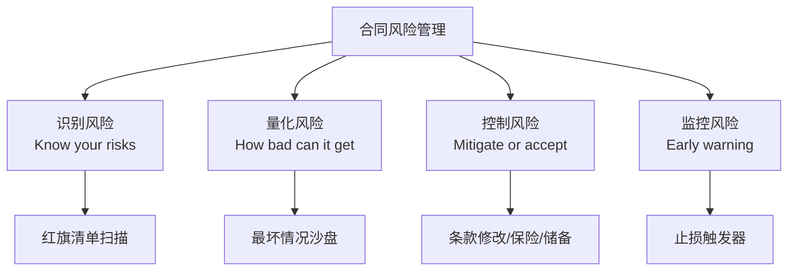
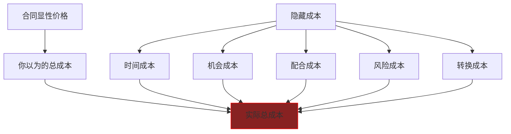
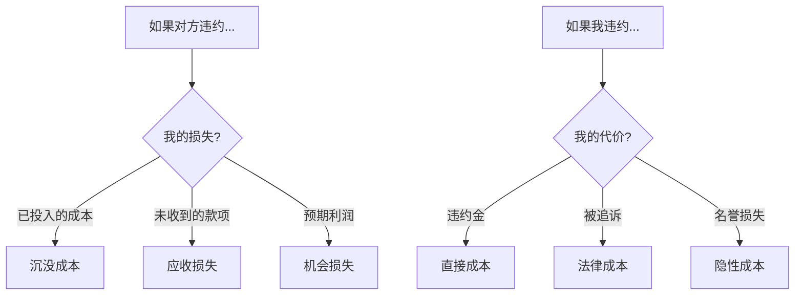

# Contract Warfare: 风险预警系统 (Risk Warning System)

> **Tags:** `[Risk]`, `[Warning]`, `[Due_Diligence]`, `[Protection]`, `[Asher-Customized]`
> **Date Added:** `2026-01-10`
> **一句话总结 (One-Liner):** 识别合同中的地雷，在踩下去之前拆掉——不是所有风险都能避免，但所有风险都必须被看见。
> **关键协议 (Critical Protocol):**
> 1.  **红旗原则 (Red Flag Principle):** 任何让你"觉得不对劲"的条款都值得深挖。
> 2.  **最坏情况模拟 (Worst-Case Sandbox):** 永远问"如果出了问题，最坏会怎样？"
> 3.  **止损触发器 (Stop-Loss Trigger):** 事先设定好"如果X发生，我就Y"的自动反应。

---

## 1. 元认知 (Metacognition)

### 1.1 风险管理哲学

> **Asher的风险观:** "我不介意冒险，我介意的是**不知道自己在冒什么险**。"



### 1.2 风险分类框架

| 风险类型 | 描述 | 典型来源 |
| :--- | :--- | :--- |
| **履约风险** | 对方不履行合同 | 对方信用差、能力不足 |
| **责任风险** | 我方被追责 | 违约金、赔偿、连带责任 |
| **现金流风险** | 收不到钱或付款压力 | 账期长、预付多 |
| **控制权风险** | 失去主动权 | 锁定期、独家条款 |
| **隐藏成本风险** | 合同外的意外支出 | 模糊条款、附加费用 |

---

## 2. 危险条款红旗清单

### 2.1 🚩 一级红旗 (必须立即处理)

| 红旗 | 危险描述 | 处理方式 |
| :--- | :--- | :--- |
| **无限责任** | "赔偿一切损失" | 必须加责任上限 |
| **单方解约无补偿** | "甲方可随时终止" | 必须加提前通知+补偿 |
| **可得利益赔偿** | "包括预期利润损失" | 必须删除 |
| **连带无限担保** | "承担连带责任" | 拒绝或设上限 |
| **自动续期陷阱** | "到期自动续期X年" | 改为需双方确认 |

### 2.2 🟠 二级红旗 (需要谈判修改)

| 红旗 | 危险描述 | 处理方式 |
| :--- | :--- | :--- |
| **验收无时限** | 没写多久验收 | 加入时限+默认通过 |
| **付款条件模糊** | "完成后付款" | 明确"完成"定义 |
| **单方解释权** | "由甲方解释" | 删除或改为双方协商 |
| **超长竞业限制** | "2年内不得..." | 缩短期限+要求补偿 |
| **知识产权归属模糊** | 没写成果归谁 | 明确约定 |

### 2.3 🟡 三级红旗 (记录关注)

| 红旗 | 危险描述 | 处理方式 |
| :--- | :--- | :--- |
| **管辖地不在你那里** | 争议需去对方城市 | 尝试改为中立地 |
| **保密期限过长** | "永久保密" | 尝试缩短至3-5年 |
| **通知方式限制** | "以书面挂号信为准" | 加入电子邮件方式 |

---

## 3. 隐藏成本识别

### 3.1 常见隐藏成本类型



### 3.2 隐藏成本清单

| 成本类型 | 来源 | 识别方法 |
| :--- | :--- | :--- |
| **无限修改成本** | 没有修改次数限制 | 检查验收条款 |
| **需求蔓延成本** | 没有变更计费条款 | 检查变更条款 |
| **配合成本** | 需要大量配合对方 | 列出你需要做的事 |
| **锁定机会成本** | 独家/锁定期 | 计算期间失去的机会 |
| **违约风险成本** | 可能的违约金 | 模拟违约场景 |
| **法律费用** | 如果发生纠纷 | 估算律师费+时间 |

### 3.3 真实成本计算公式

```
真实成本 = 显性价格 
         + (修改成本 × 预期修改次数)
         + (配合成本 × 时薪)
         + (违约金 × 违约概率)
         + (锁定期 × 机会成本)
```

---

## 4. 违约风险评估

### 4.1 对方违约概率评估

| 维度 | 低风险信号 | 高风险信号 |
| :--- | :--- | :--- |
| **企业信用** | 成立5年+，无诉讼 | 新成立，有纠纷记录 |
| **财务状况** | 实缴资本充足 | 注册资本大但实缴少 |
| **行业口碑** | 同行评价好 | 有"跑路"传闻 |
| **合作态度** | 条款可谈 | 强硬不让步 |
| **付款意愿** | 愿意预付 | 坚持长账期 |

### 4.2 违约场景沙盘



---

## 5. Asher专属：止损触发器设计

### 5.1 止损触发器原理

> **Asher人设:** "决策前后台自动模拟最坏情况。一旦确认最坏情况不致死，所有焦虑感清零。"

**止损触发器:** 事先设定的"如果X发生，立即执行Y"的自动反应。

### 5.2 止损触发器模板

| 触发条件 | 止损行动 | 备用方案 |
| :--- | :--- | :--- |
| 对方逾期付款超过30天 | 暂停服务，发催款函 | 启动法律程序 |
| 对方要求超过3次无理修改 | 书面拒绝，要求加费 | 终止合同 |
| 发现对方涉及重大诉讼 | 要求增加担保或预付 | 终止合作 |
| 服务范围蔓延超过20% | 书面要求签追加合同 | 完成已约定部分后终止 |
| 发现合同有重大漏洞对我不利 | 立即协商修改 | 评估继续履行的风险 |

### 5.3 退出成本评估

```
退出成本 = 已支付不可退款金额
         + 违约金
         + 已投入时间 × 时薪
         + 关系损失评估
         + 替代方案的切换成本
```

**退出决策:**
- 退出成本 < 继续履行的预期损失 → 退出
- 退出成本 > 继续履行的预期损失 → 继续但设防

---

## 6. Anti-Patterns (反模式)

### 陷阱 1: 侥幸心理

*   **Trap:** "应该不会出问题的"
*   **Why:** 懒得深想，或对方看起来"靠谱"
*   **Fix:**
    - 永远假设会出问题
    - 问自己：出问题了最坏情况是什么
    - 能接受最坏情况才签约
*   **Positive Real Scenario:** 某创业者在签投资协议前坚持做了"如果投资失败"的沙盘模拟，发现了一个可能导致个人连带责任的条款，成功修改后才签约。后来项目确实失败了，但他个人资产没有受损。

### 陷阱 2: 不看对方背景

*   **Trap:** 只看合同条款，不调查对方
*   **Why:** 觉得"白纸黑字"就够了
*   **Fix:**
    - 合同只是纸，执行要靠人
    - 对方没钱/没信用，合同再好也没用
    - 必做：工商查询+诉讼记录查询
*   **Positive Real Scenario:** 某服务商在签约前查了对方的诉讼记录，发现该公司有5起未决的合同纠纷，果断拒绝合作。后来得知该公司确实在到处拖欠货款。

### 陷阱 3: 条款都能谈

*   **Trap:** 以为所有条款都可以慢慢改
*   **Why:** 低估对方的坚持和谈判能力
*   **Fix:**
    - 有些条款对方不会让步
    - 识别真正的必争条款
    - 次要条款可用于交换
*   **Positive Real Scenario:** 某代理商在与品牌方谈判时，先放弃了几个不重要的条款，换取了品牌方在佣金比例这个核心条款上的让步。

---

## 7. Glossary (术语表)

*   **红旗 (Red Flag):** 合同中需要警惕的危险信号。
*   **止损 (Stop-Loss):** 在损失达到一定程度时主动终止，防止更大损失。
*   **尽职调查 (Due Diligence):** 签约前对对方进行的全面调查。
*   **沉没成本 (Sunk Cost):** 已经投入且无法收回的成本。
*   **机会成本 (Opportunity Cost):** 选择一个方案而放弃其他方案的潜在收益。

---

## 8. Formula Table (公式表)

| Formula Name | Equation / Logic | Variable Definition |
| :--- | :--- | :--- |
| **综合风险评分** | `Risk Score = Σ(红旗数量 × 红旗权重)` | 红旗越多风险越高 |
| **真实成本** | `Total = 显性成本 + 隐藏成本 + 风险成本` | 评估真实投入 |
| **退出决策** | `If 退出成本 < 继续损失 Then 退出` | 止损判断 |
| **对方信用评分** | `Credit = 成立年限 + 诉讼记录 + 付款意愿` | 履约能力评估 |

---

## 备注与引用 (Notes & References)

*   **工具:** 天眼查/企查查（企业信用查询）、裁判文书网（诉讼记录）
*   **定制基础:** Asher人设 (最坏情况沙盘、止损机制)
