# Contract Warfare: 跨境合同法指南 (Cross-Border Contract Law Guide)

> **Tags:** `[Cross-Border]`, `[USA]`, `[Australia]`, `[China]`, `[India]`, `[Malaysia]`, `[Japan]`, `[Comparative]`
> **Date Added:** `2026-01-10`
> **一句话总结 (One-Liner):** 同一份合同在不同国家可能完全不同的命运——了解差异，才能在跨境博弈中获得信息对等。
> **关键协议 (Critical Protocol):**
> 1.  **法系决定一切:** Common Law和Civil Law的思维方式完全不同，决定了合同如何被解释。
> 2.  **当地法律优先:** 无论合同怎么写，当地强制性法律都会覆盖你的约定。
> 3.  **文化即规则:** 法律条文之外，商业文化决定了合同如何被执行。

---

# Part 1: 法系基础与核心差异

## 1. 两大法系：思维方式的根本差异

### 1.1 Common Law vs Civil Law

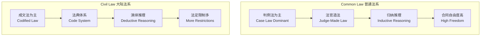

### 1.2 六国法系归属

| 国家 | 法系 | 特点 | 对合同的影响 |
| :--- | :--- | :--- | :--- |
| 🇺🇸 **美国** | Common Law | 联邦+州双轨，UCC统一商法典 | 极度灵活，州际差异大 |
| 🇦🇺 **澳大利亚** | Common Law | 英式传统+消费者保护 | 灵活但消费者保护强 |
| 🇨🇳 **中国** | Civil Law | 民法典体系，政府影响大 | 法定限制多，格式条款严管 |
| 🇮🇳 **印度** | Common Law | 英式传统+本土法案 | 判例多，specific performance偏好 |
| 🇲🇾 **马来西亚** | Mixed | Common Law+伊斯兰法 | 部分领域受宗教法影响 |
| 🇯🇵 **日本** | Civil Law | 德式传统+本土化 | 诚信原则极强，文化影响大 |

### 1.3 法系差异对合同的具体影响

| 维度 | Common Law国家 | Civil Law国家 |
| :--- | :--- | :--- |
| **合同解释** | 看字面意思 (Literal) | 看立法目的 (Purposive) |
| **隐含条款** | 依靠判例填补 | 依靠法典填补 |
| **格式条款** | 相对宽松 | 严格限制 |
| **违约救济** | 损害赔偿优先 | 继续履行优先 |
| **诚信义务** | 有限适用 | 广泛适用 |
| **合同修改** | 需要consideration | 不需要consideration |

---

## 2. 六国核心差异速查表

### 2.1 合同成立要件对比

| 要件 | 🇺🇸 美国 | 🇦🇺 澳洲 | 🇨🇳 中国 | 🇮🇳 印度 | 🇲🇾 马来 | 🇯🇵 日本 |
| :--- | :--- | :--- | :--- | :--- | :--- | :--- |
| **书面要求** | 部分需要 | 部分需要 | 建议书面 | 部分需要 | 部分需要 | 不强制 |
| **Consideration** | ✅ 必须 | ✅ 必须 | ❌ 不需要 | ✅ 必须 | ✅ 必须 | ❌ 不需要 |
| **签字/盖章** | 签字 | 签字 | 签字+公章 | 签字 | 签字 | 签字+印章 |
| **公证要求** | 罕见 | 罕见 | 部分需要 | 罕见 | 罕见 | 部分需要 |

> [!IMPORTANT]
> **Consideration (对价):** 英美法系的核心概念——合同必须有交换。中国和日本不需要，这意味着**单方承诺在这些国家也可能有约束力**。

### 2.2 违约救济对比

| 救济方式 | 🇺🇸 美国 | 🇦🇺 澳洲 | 🇨🇳 中国 | 🇮🇳 印度 | 🇲🇾 马来 | 🇯🇵 日本 |
| :--- | :--- | :--- | :--- | :--- | :--- | :--- |
| **损害赔偿** | 首选 | 首选 | 常用 | 常用 | 首选 | 常用 |
| **继续履行** | 例外 | 例外 | 首选 | 偏好 | 例外 | 常用 |
| **惩罚性赔偿** | ✅ 存在 | ⚠️ 有限 | ⚠️ 有限 | ❌ 罕见 | ❌ 罕见 | ❌ 无 |
| **约定违约金** | 不能过高 | 不能过高 | 可调整 | 可调整 | 可调整 | 可调整 |

### 2.3 争议解决对比

| 维度 | 🇺🇸 美国 | 🇦🇺 澳洲 | 🇨🇳 中国 | 🇮🇳 印度 | 🇲🇾 马来 | 🇯🇵 日本 |
| :--- | :--- | :--- | :--- | :--- | :--- | :--- |
| **仲裁态度** | 友好 | 友好 | 友好 | 友好 | 友好 | 友好 |
| **诉讼时长** | 1-3年 | 1-2年 | 6月-2年 | 3-10年 | 2-5年 | 1-3年 |
| **诉讼成本** | 极高 | 高 | 中等 | 中等 | 中等 | 高 |
| **判决执行** | 强 | 强 | 较强 | 弱 | 较强 | 强 |
| **纽约公约** | ✅ | ✅ | ✅ | ✅ | ✅ | ✅ |

---

# Part 2: 美国合同法 🇺🇸

## 1. 美国合同法的独特性

### 1.1 联邦制下的双轨体系

> **美国没有统一的"合同法"。** 合同法主要由**州法**管辖，50个州可能有50种不同的规则。

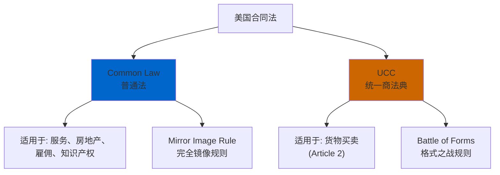

### 1.2 Common Law vs UCC 核心区别

| 维度 | Common Law | UCC (Article 2) |
| :--- | :--- | :--- |
| **适用范围** | 服务、房地产、雇佣 | 货物买卖 |
| **要约接受** | 必须完全镜像 (Mirror Image) | 可以有附加条款 |
| **合同修改** | 需要新的consideration | 不需要，善意即可 |
| **必要条款** | 必须明确所有关键条款 | 只需数量，其他可由UCC填补 |
| **Firm Offer** | 需要consideration才能撤销 | 商人书面承诺不可撤销(≤3个月) |

### 1.3 州际差异：关键州特点

| 州 | 特点 | 常见选择原因 | 风险提示 |
| :--- | :--- | :--- | :--- |
| **特拉华州** | 公司法极度友好 | 公司注册、股东协议 | 对消费者保护弱 |
| **纽约州** | 商业合同首选 | 金融、国际贸易 | 诉讼成本极高 |
| **加利福尼亚** | 劳动法极严 | 科技公司 | 竞业限制无效 |
| **德克萨斯** | 商业友好 | 能源、制造 | 陪审团判决不可预测 |

### 1.4 美国专属概念

#### 🔸 At-Will Employment (随意雇佣)

> **美国独有:** 雇主可以**无理由解雇**员工，员工也可以无理由辞职。

| 对比 | 美国 | 其他5国 |
| :--- | :--- | :--- |
| **解雇保护** | 几乎没有 | 有法定保护 |
| **解雇补偿** | 通常不需要 | 通常需要 |
| **正当理由** | 不需要 | 大多需要 |

**Asher策略 (作为雇主在美国):**
> "在美国雇人风险最低——你可以随时让人走。但要注意不能因为歧视原因解雇（种族、性别、年龄等），否则会被告到破产。"

**Asher策略 (作为员工在美国):**
> "在美国打工最没保障——随时可能被裁。所以必须有Plan B，永远不要把全部鸡蛋放在一个篮子里。"

#### 🔸 Punitive Damages (惩罚性赔偿)

> **美国独有:** 法院可以判决**远超实际损失**的赔偿金来惩罚恶意行为。


**典型案例:** 麦当劳咖啡烫伤案——实际医疗费$20,000，最终判决$2,700,000。

**Asher策略:**
> "在美国做生意最怕的不是违约，是被告侵权/欺诈。一旦涉及惩罚性赔偿，可能赔到破产。所以合同里要加入**仲裁条款**来规避陪审团。"

#### 🔸 Mandatory Arbitration (强制仲裁)

> **美国趋势:** 越来越多公司在合同中加入强制仲裁+集体诉讼豁免条款。

| 条款 | 效果 | 合法性 |
| :--- | :--- | :--- |
| **强制仲裁** | 禁止去法院，必须仲裁 | ✅ 大多有效 |
| **集体诉讼豁免** | 禁止联合起诉 | ✅ 大多有效 |
| **仲裁地选择** | 指定对你有利的仲裁地 | ✅ 有效 |

**Asher策略 (作为甲方):**
> "在美国，我的合同必须有强制仲裁条款——这样可以避开陪审团的不可预测性，也可以防止一个原告变成一千个原告的集体诉讼噩梦。"

### 1.5 美国合同关键条款模板

#### 管辖权条款 (Jurisdiction Clause)
```
This Agreement shall be governed by and construed in accordance 
with the laws of the State of [Delaware/New York], without regard 
to its conflict of laws principles. Any dispute arising out of or 
relating to this Agreement shall be subject to the exclusive 
jurisdiction of the state and federal courts located in [City, State].
```

#### 仲裁条款 (Arbitration Clause)
```
Any dispute, controversy, or claim arising out of or relating to 
this Agreement shall be resolved by binding arbitration administered 
by the American Arbitration Association (AAA) in accordance with 
its Commercial Arbitration Rules. The arbitration shall take place 
in [City, State]. The decision of the arbitrator shall be final 
and binding. Each party waives any right to a jury trial and to 
participate in a class action.
```

### 1.6 美国合同避坑清单

| 风险 | 说明 | Asher应对 |
| :--- | :--- | :--- |
| **陪审团不可预测** | 感情用事，判决巨额赔偿 | 强制仲裁条款 |
| **At-Will风险** | 作为员工随时被裁 | 争取书面保障或股权 |
| **惩罚性赔偿** | 赔偿可能是损失的100倍 | 买足保险，行为合规 |
| **州际法律冲突** | 不同州规则不同 | 明确选择有利的州法 |
| **加州竞业限制无效** | 在加州无法限制员工跳槽 | 改用NDA和客户保护条款 |

---

# Part 3: 澳大利亚合同法 🇦🇺

## 1. 澳大利亚合同法的独特性

### 1.1 英式传统+消费者保护强化

> **澳大利亚特色:** 继承英国普通法，但在**消费者保护**和**不公平条款**方面走得比英国更远。

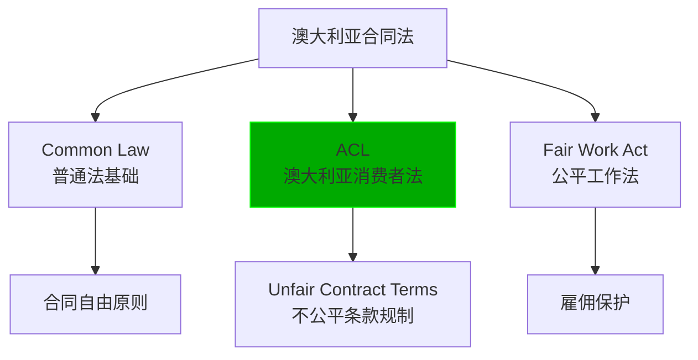

### 1.2 澳大利亚消费者法 (ACL) 的冲击

> **2023年11月9日生效的重大改革:** 不公平合同条款不再只是"可撤销"，而是**违法+巨额罚款**。

| 改革前 | 改革后 (2023.11.9起) |
| :--- | :--- |
| 不公平条款可被法院撤销 | 使用不公平条款直接违法 |
| 无直接罚款 | 公司最高罚款5000万澳元 |
| 小企业定义模糊 | 员工<100人或营业额<1000万澳元 |

### 1.3 什么是"不公平条款" (Unfair Contract Terms)

**三要素测试:**
1. 造成双方权利义务的**重大不平衡**
2. 该条款**不是合理必要的**来保护提供方的合法利益
3. 如果被执行，会对一方造成**损害**

| 常见不公平条款 | 为什么不公平 | 澳洲后果 |
| :--- | :--- | :--- |
| 单方解约权 | 只有一方能随时终止 | ❌ 可能无效 |
| 单方涨价权 | 只有一方能调整价格 | ❌ 可能无效 |
| 无限责任条款 | 一方承担无上限责任 | ❌ 可能无效 |
| 自动续期陷阱 | 不通知就自动续约 | ❌ 可能无效 |
| 过宽的赔偿条款 | 赔偿范围不合理 | ❌ 可能无效 |

**Asher策略 (在澳洲做甲方):**
> "在澳洲不能像在美国那样搞霸王条款。任何单方权利条款都要配上对等条款，否则可能被认定无效，还要被罚款。表面上吃亏，实际上避免了更大的法律风险。"

**Asher策略 (在澳洲做乙方):**
> "澳洲是乙方天堂——法律站在弱势方这边。遇到不公平条款大胆指出来，告诉对方这在澳洲可能违法，对方大概率会让步。"

### 1.4 Fair Work Act: 雇佣法的特殊性

> **澳大利亚劳动法比美国严格100倍。**

| 维度 | 美国 | 澳大利亚 |
| :--- | :--- | :--- |
| **解雇保护** | At-Will，无需理由 | 需要正当理由 |
| **解雇通知** | 通常无需 | 1-5周（按工作年限） |
| **遣散费** | 通常无需 | 有法定计算公式 |
| **不当解雇诉讼** | 仅限歧视 | 广泛适用 |
| **最低工资** | 联邦$7.25/小时 | $23.23/小时 (2024) |

**关键概念: Unfair Dismissal (不公平解雇)**

| 条件 | 说明 |
| :--- | :--- |
| **适用范围** | 员工在公司工作满6个月(大公司)或12个月(小公司) |
| **不公平标准** | 解雇理由不充分、程序不公正、处罚过重 |
| **救济** | 复职或最高6个月工资的赔偿 |

**Asher策略 (在澳洲雇人):**
> "在澳洲解雇员工比美国复杂得多。必须有书面警告记录、绩效改进计划，走完整个程序才能解雇。否则就等着被告吧。所以招人时一定要谨慎，试用期要用足。"

### 1.5 澳洲租赁法特点

> **各州差异大，但总体对租客保护强于美国。**

| 州 | 租金上涨限制 | 押金上限 | 提前终止 |
| :--- | :--- | :--- | :--- |
| **NSW** | 每年最多涨一次 | 4周租金 | 需要Break Fee |
| **VIC** | 需要60天通知 | 1个月租金 | 有法定计算公式 |
| **QLD** | 无限制 | 4周租金 | 需协商 |

### 1.6 澳洲合同关键条款模板

#### 管辖权条款
```
This Agreement shall be governed by and construed in accordance with 
the laws of [New South Wales/Victoria/Queensland], Australia. The 
parties submit to the non-exclusive jurisdiction of the courts of 
that State and any courts which may hear appeals from those courts.
```

#### 消费者法合规声明 (服务合同必备)
```
Consumer Guarantees: Nothing in this Agreement excludes, restricts 
or modifies any consumer guarantee, right or remedy conferred on 
you by the Australian Consumer Law or any other applicable law 
that cannot be excluded, restricted or modified by agreement.
```

### 1.7 澳洲合同避坑清单

| 风险 | 说明 | Asher应对 |
| :--- | :--- | :--- |
| **不公平条款罚款** | 最高5000万澳元 | 确保条款双向对等 |
| **Unfair Dismissal** | 解雇程序复杂 | 完整记录+试用期用足 |
| **高最低工资** | $23.23/小时 | 雇佣成本预估要充足 |
| **消费者保证不可排除** | 无法豁免 | 不要尝试排除，会适得其反 |
| **州际法律差异** | 各州规则不同 | 明确选择哪个州法 |

---

# Part 1 小结：美国 vs 澳大利亚 关键差异

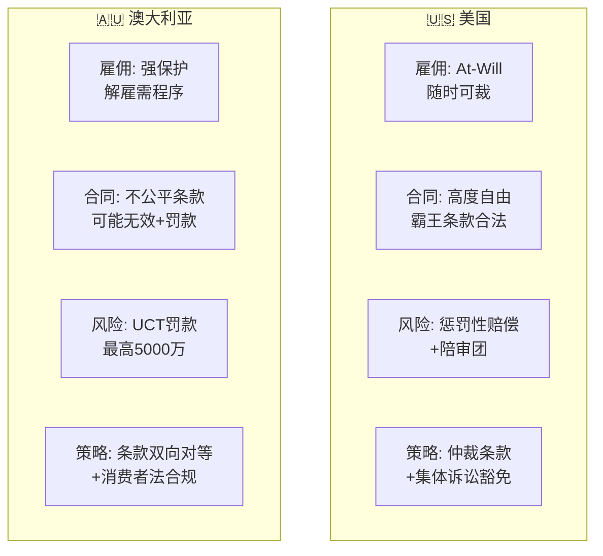

| 维度 | 美国 | 澳大利亚 | Asher选择 |
| :--- | :--- | :--- | :--- |
| **雇人友好度** | ⭐⭐⭐⭐⭐ | ⭐⭐ | 短期项目选美国 |
| **被雇保护度** | ⭐ | ⭐⭐⭐⭐⭐ | 打工选澳洲 |
| **甲方友好度** | ⭐⭐⭐⭐⭐ | ⭐⭐⭐ | 开公司选美国 |
| **乙方保护度** | ⭐⭐ | ⭐⭐⭐⭐ | 做服务商澳洲好 |
| **诉讼风险** | ⭐⭐⭐⭐⭐ | ⭐⭐⭐ | 澳洲更温和 |
| **法律成本** | ⭐⭐⭐⭐⭐ (极高) | ⭐⭐⭐⭐ (高) | 都不便宜 |

---

# Part 2: 中国合同法 🇨🇳

## 1. 中国合同法的独特性

### 1.1 民法典体系

> **2021年1月1日《民法典》生效**，取代了原《合同法》《物权法》《担保法》等，成为中国民事法律的基础。

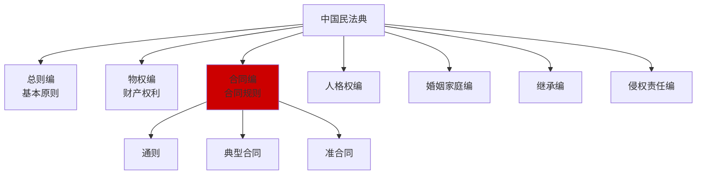

### 1.2 中国合同法的核心特点

| 特点 | 说明 | 与其他国家对比 |
| :--- | :--- | :--- |
| **成文法主导** | 不看判例，看法条 | 与美澳相反 |
| **诚实信用原则** | 贯穿始终 | 比Common Law更强调 |
| **格式条款严管** | 对提供方不利 | 类似澳洲，比美国严 |
| **政府干预可能** | 涉及政策时有不确定性 | 独特的中国特色 |
| **公章文化** | 公章比签字更重要 | 独特 |

### 1.3 中国专属概念

#### 🔸 公章 (Official Company Seal)

> **中国独有:** 公司的公章具有法律效力，在很多情况下比法定代表人签字更有效。

| 印章类型 | 效力 | 用途 |
| :--- | :--- | :--- |
| **公章 (公司章)** | 最高效力 | 对外所有法律文件 |
| **合同专用章** | 仅用于合同 | 合同签订 |
| **财务章** | 财务事项 | 银行、税务 |
| **法人章** | 代表法人 | 配合公章使用 |

**Asher策略:**
> "在中国签合同，**只看公章不看签字**。一个授权代表的签字可能被公司否认，但盖了公章就跑不掉。所以每份重要合同都要求对方盖公章，而不是只签字。"

**风险提示:**
> "伪造公章在中国是犯罪，但仍然时有发生。重要合同建议要求对方当面盖章，或者去公证处见证。"

#### 🔸 格式条款 (Standard Terms) 严管

> **民法典第496-498条:** 对格式条款提供方的严格限制。

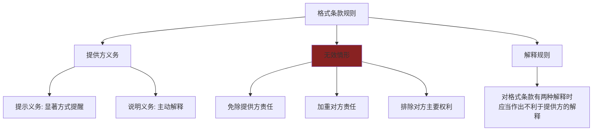

| 格式条款 | 在美国 | 在中国 |
| :--- | :--- | :--- |
| "本条款最终解释权归甲方" | ⚠️ 可能有效 | ❌ 无效 |
| "甲方可随时单方解约" | ⚠️ 可能有效 | ❌ 可能无效 |
| "乙方放弃一切索赔权" | ⚠️ 可能有效 | ❌ 无效 |

**Asher策略 (在中国做甲方):**
> "在中国不能搞霸王条款——法律明确说格式条款对提供方不利解释。所以重要条款必须写在**特别提示**区域，用**加粗/红色**标注，并让对方签字确认'已阅读并理解'。"

**Asher策略 (在中国做乙方):**
> "遇到不公平的格式条款，大胆援引民法典——告诉对方这个条款可能无效，他们的法务会让步的。"

#### 🔸 劳动合同法 (强劳动保护)

> **中国劳动法对员工的保护程度：世界前列。**

| 维度 | 美国 | 中国 |
| :--- | :--- | :--- |
| **解雇保护** | At-Will | 需要法定理由 |
| **书面合同** | 不强制 | 强制，否则赔双倍工资 |
| **试用期上限** | 无限制 | 最长6个月 |
| **解雇补偿** | 通常无 | N+1 (工作年限+1个月) |
| **无固定期合同** | 罕见 | 满10年或连续两次固定期后强制 |

**解雇的法定理由 (第39-41条):**

| 可解雇情形 | 补偿 |
| :--- | :--- |
| 员工有过错 (严重违纪/犯罪) | 无需补偿 |
| 员工不能胜任工作 | N+1 |
| 客观情况变化 | N+1 |
| 经济性裁员 | N+1 |
| 协商一致 | 协商 (通常N+1或更多) |

**禁止解雇的情形:**
- 患职业病或工伤丧失劳动能力
- 在医疗期内
- 女职工孕期、产期、哺乳期
- 连续工作满15年且距退休不足5年

**Asher策略 (在中国雇人):**
> "在中国解雇成本高——要么员工有错，要么给钱。所以：
> 1. 试用期最长只能6个月，能干的留，不能干的试用期内走
> 2. 重要岗位签竞业限制，离职时才能关掉
> 3. 员工手册要让每个人签字确认
> 4. 所有考核和警告都要书面记录"

#### 🔸 仲裁 vs 诉讼

| 维度 | 仲裁 | 诉讼 |
| :--- | :--- | :--- |
| **保密性** | ✅ 保密 | ❌ 公开 |
| **速度** | 较快 (6个月) | 较慢 (6月-2年) |
| **上诉** | ❌ 一裁终局 | ✅ 可上诉 |
| **涉外承认** | ✅ 纽约公约 | ⚠️ 需要双边协议 |
| **执行力** | 较强 | 较强 |

**常用仲裁机构:**
- CIETAC (中国国际经济贸易仲裁委员会) — 涉外首选
- BAC (北京仲裁委员会) — 国内商事
- SHIAC (上海国际仲裁中心) — 国际化程度高

**Asher策略:**
> "跨境合同选仲裁不要选诉讼——中国法院判决在海外很难执行，但仲裁裁决依据纽约公约在全球160多个国家都能执行。"

### 1.4 中国合同关键条款模板

#### 管辖权条款 (仲裁版)
```
因本合同引起的或与本合同有关的任何争议，均应提交中国国际经济
贸易仲裁委员会（CIETAC），按照申请仲裁时该会现行有效的仲裁规则
进行仲裁。仲裁地点为北京。仲裁裁决是终局的，对双方均有约束力。
```

#### 格式条款提示声明
```
【特别提示】以下条款涉及甲方责任限制、乙方权利限制，请乙方仔细
阅读并理解后签字确认：
[条款内容，加粗或红色标注]

乙方签字确认：我已完整阅读并理解上述条款内容。
签字：_____________ 日期：_____________
```

### 1.5 中国合同避坑清单

| 风险 | 说明 | Asher应对 |
| :--- | :--- | :--- |
| **公章被盗/伪造** | 合同可能无效或涉及欺诈 | 当面盖章或公证 |
| **格式条款无效** | 不公平条款可能无效 | 显著提示+签字确认 |
| **劳动法刚性** | 解雇成本高、限制多 | 试用期用足+书面记录 |
| **政策不确定性** | 某些行业受政策影响 | 加入不可抗力条款 |
| **判决执行难** | 胜诉也可能执行不了 | 先调查对方资产 |
| **外资限制** | 部分行业外资不能进入 | 事先确认准入政策 |

---

# Part 2: 印度合同法 🇮🇳

## 1. 印度合同法的独特性

### 1.1 法律框架

> **Indian Contract Act, 1872** 是印度合同法的基础，至今已超过150年，但核心条款仍然有效。

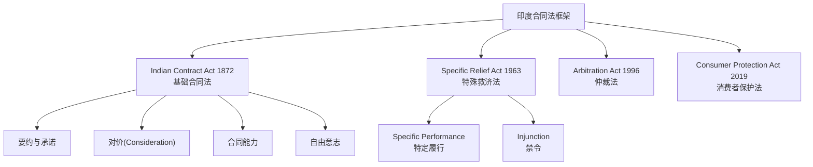

### 1.2 印度专属概念

#### 🔸 Consideration (对价) 的特殊规则

> **第2(d)条:** 对价可以由承诺人以外的第三人提供。

| 对比 | 英国 | 印度 |
| :--- | :--- | :--- |
| 对价必须由承诺人提供? | ✅ 是 | ❌ 可由第三人 |
| 过去的对价有效? | ❌ 通常无效 | ✅ 有效 |

**Asher视角:**
> "这意味着在印度，即使你没有给对价，只要有第三人给了，你也可以执行合同。比如：父亲欠你钱，儿子承诺还，即使儿子没得到任何东西，这个承诺也可能有效。"

#### 🔸 Specific Performance (特定履行) 偏好

> **2018年修订后的趋势:** 印度法院更倾向于判决**继续履行合同**，而不是仅仅赔偿损失。

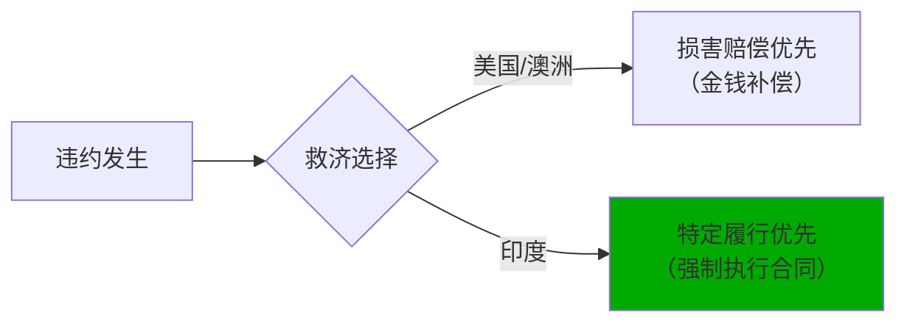

| 维度 | 2018年前 | 2018年后 |
| :--- | :--- | :--- |
| **特定履行** | 法院自由裁量 | 原则上应当判决 |
| **例外** | 广泛 | 收窄 |
| **商业合同** | 常被拒绝 | 更容易获得 |

**Asher策略:**
> "在印度，如果对方违约，你很可能争取到法院强制对方履行合同——不只是赔钱了事。这对卖方有利（可以强制买方付款），对买方也有利（可以强制卖方交货）。"

#### 🔸 印度诉讼的特殊性

> **印度诉讼的"著名"特点：慢。**

| 数据 | 说明 |
| :--- | :--- |
| **平均诉讼时长** | 3-10年 |
| **积压案件** | 超过4000万件 |
| **最高法院积压** | 超过7万件 |

**为什么这么慢？**
- 法官数量严重不足（每百万人仅19名法官，美国是108名）
- 程序复杂，上诉层级多
- 延期申请容易获批

**Asher策略:**
> "在印度，诉讼是最后的手段——你可能打赢官司时已经老了。所以：
> 1. **仲裁条款是必须的** — 仲裁比诉讼快得多
> 2. **选择新加坡/香港仲裁** — 效率更高
> 3. **留有实际杠杆** — 比如控制货款、押金"

#### 🔸 Stamp Duty (印花税)

> **印度独特的合同成立要求：** 合同必须贴足印花税，否则可能不能作为证据使用。

| 合同类型 | 印花税率 | 后果 |
| :--- | :--- | :--- |
| 租赁合同 | 各州不同，2-5% | 未贴印花不能在法院使用 |
| 服务合同 | 较低 | 未贴印花不能在法院使用 |
| 股权转让 | 较高 | 未贴印花不能在法院使用 |

**Asher策略:**
> "在印度签合同，一定要确保贴足印花税。否则打官司时这份合同可能不被法院承认——相当于你手无寸铁。"

### 1.3 印度劳动法

| 维度 | 美国 | 印度 |
| :--- | :--- | :--- |
| **解雇保护** | At-Will | 法定保护(较弱于中国) |
| **遣散费** | 通常无 | 工作满5年有Gratuity |
| **工会影响** | 较弱 | 某些行业很强 |
| **劳动法碎片化** | 较统一 | 40+部法律 |

**2020年劳动法改革 (Labor Codes):**
- 整合了29部旧法律为4部综合法典
- 简化了合规要求
- 但各邦实施进度不一

### 1.4 印度合同关键条款模板

#### 管辖权条款 (仲裁版)
```
Any dispute arising out of or in connection with this Agreement 
shall be settled by arbitration under the Arbitration and 
Conciliation Act, 1996. The arbitration shall be conducted in 
English in [Mumbai/New Delhi/Bangalore]. The award shall be 
final and binding on both parties.
```

#### 仲裁条款 (选择新加坡)
```
Any dispute arising out of or in connection with this contract, 
including any question regarding its existence, validity or 
termination, shall be referred to and finally resolved by 
arbitration administered by the Singapore International 
Arbitration Centre (SIAC) in accordance with the Arbitration 
Rules of the SIAC for the time being in force.
```

### 1.5 印度合同避坑清单

| 风险 | 说明 | Asher应对 |
| :--- | :--- | :--- |
| **诉讼极慢** | 可能等5-10年 | 强制仲裁条款 |
| **印花税必须** | 否则合同作废 | 确保贴足印花 |
| **执行困难** | 胜诉也难执行 | 控制实际杠杆 |
| **官僚主义** | 审批慢 | 预留充足时间 |
| **各邦法律不同** | 复杂性高 | 选择主流邦(Maharashtra/Karnataka) |

---

# Part 2 小结：中国 vs 印度 关键差异

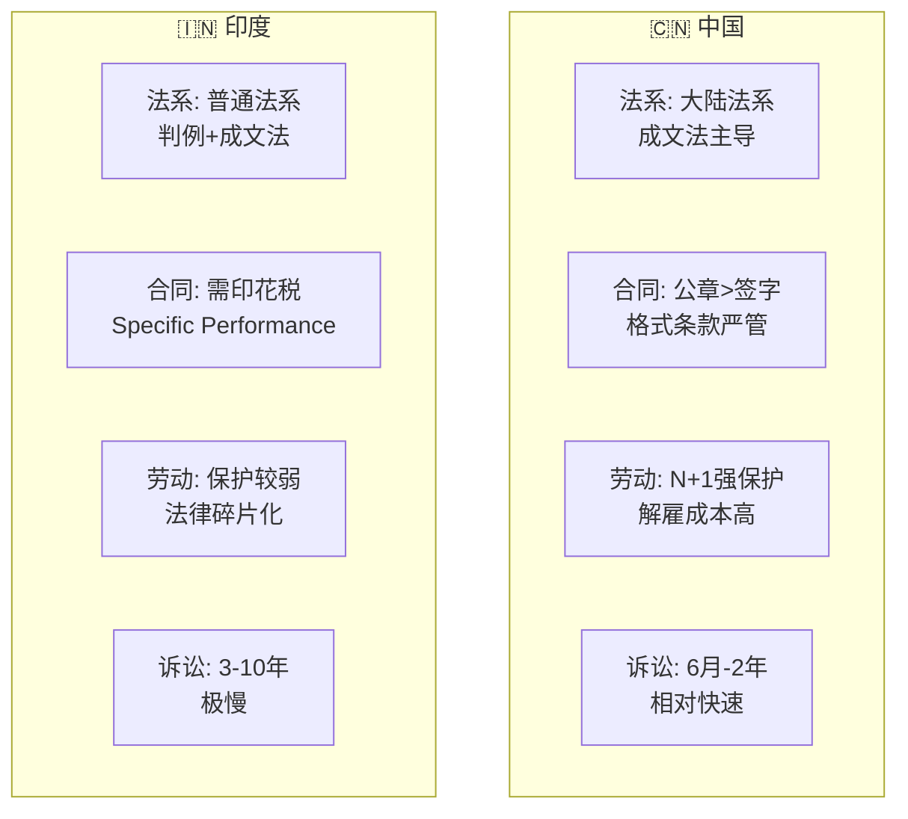

| 维度 | 中国 | 印度 | Asher选择 |
| :--- | :--- | :--- | :--- |
| **合同执行速度** | ⭐⭐⭐⭐ | ⭐⭐ | 中国更快 |
| **法律确定性** | ⭐⭐⭐⭐ | ⭐⭐⭐ | 中国更确定 |
| **雇佣成本** | ⭐⭐ (高) | ⭐⭐⭐⭐ (低) | 印度更便宜 |
| **解雇灵活度** | ⭐⭐ | ⭐⭐⭐ | 印度更灵活 |
| **仲裁信任度** | ⭐⭐⭐⭐ | ⭐⭐⭐⭐ | 都OK |
| **政策风险** | ⭐⭐⭐ | ⭐⭐⭐⭐ | 印度更稳定 |

---

# Part 3: 马来西亚合同法 🇲🇾

## 1. 马来西亚合同法的独特性

### 1.1 双轨法律体系

> **马来西亚特色:** Common Law基础 + 伊斯兰法(Syariah Law)的双轨体系。

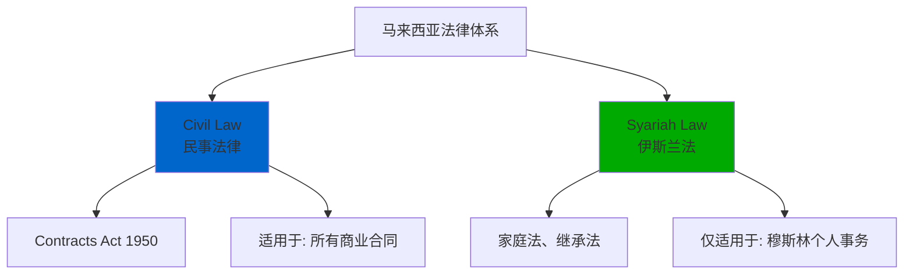

### 1.2 Contracts Act 1950

> **马来西亚合同法的基础:** 基于印度Contract Act 1872，保留了英式Common Law传统。

| 维度 | 马来西亚 | 印度 |
| :--- | :--- | :--- |
| **法源** | 英式+印度影响 | 英式 |
| **Consideration** | ✅ 必须 | ✅ 必须 |
| **第三人对价** | ✅ 有效 | ✅ 有效 |
| **过去的对价** | ✅ 有效 | ✅ 有效 |

### 1.3 马来西亚专属概念

#### 🔸 伊斯兰法的有限影响

> **重要:** 伊斯兰法**仅适用于穆斯林的个人事务**（婚姻、继承、宗教义务），**不适用于商业合同**。

| 领域 | 适用法律 |
| :--- | :--- |
| **商业合同** | Civil Law (Contracts Act 1950) |
| **公司法** | Companies Act 2016 |
| **雇佣** | Employment Act 1955 |
| **穆斯林婚姻/离婚** | Syariah Law |
| **穆斯林继承** | Syariah Law |

**Asher策略:**
> "在马来西亚做生意，不用担心伊斯兰法——普通商业合同用的是和英美一样的Common Law。只有涉及穆斯林个人身份事务才会用到伊斯兰法庭。"

#### 🔸 伊斯兰金融的特殊规则

> **例外情况:** 如果选择伊斯兰金融产品（Sukuk、伊斯兰银行贷款等），需要遵守Syariah合规要求。

| 禁止事项 | 说明 | 替代方案 |
| :--- | :--- | :--- |
| **Riba (利息)** | 禁止固定利率 | 利润分成(Musharakah) |
| **Gharar (不确定性)** | 禁止过度投机 | 明确标的 |
| **Haram产业** | 禁止猪肉、酒、博彩 | 选择Halal行业 |

**Asher策略:**
> "如果在马来西亚和穆斯林合作伙伴做伊斯兰金融相关业务，需要注意Syariah合规。但普通商业合同不受影响。"

#### 🔸 Employment Act 1955

| 维度 | 马来西亚 | 美国 |
| :--- | :--- | :--- |
| **适用范围** | 月薪≤RM4000或体力劳动者 | 所有员工 |
| **解雇保护** | 有，需正当理由 | At-Will |
| **遣散费** | 有法定计算 | 通常无 |
| **加班费** | 强制 | 仅非豁免员工 |

**2022年修订:**
- 适用范围扩大到所有员工（不限薪资）
- 产假从60天增加到98天
- 灵活工作安排权利

**Asher策略 (在马来西亚雇人):**
> "马来西亚劳动法比美国严、比中国松。解雇需要正当理由和程序，但没有中国那么复杂。最低工资RM1500/月（约320美元），比中国大城市低很多。"

### 1.4 马来西亚合同关键条款模板

#### 管辖权条款
```
This Agreement shall be governed by and construed in accordance 
with the laws of Malaysia. The parties submit to the exclusive 
jurisdiction of the courts of Malaysia.
```

#### 仲裁条款
```
Any dispute arising out of or in connection with this Agreement 
shall be referred to and finally resolved by arbitration 
administered by the Asian International Arbitration Centre (AIAC) 
in Kuala Lumpur in accordance with its Arbitration Rules.
```

### 1.5 马来西亚合同避坑清单

| 风险 | 说明 | Asher应对 |
| :--- | :--- | :--- |
| **双轨法律混淆** | 误以为伊斯兰法适用于商业 | 明确：商业合同用Civil Law |
| **诉讼较慢** | 2-5年 | 选择仲裁 (AIAC) |
| **外资限制** | 某些行业有Bumiputera要求 | 事先确认持股限制 |
| **语言问题** | 马来语为官方语言 | 合同建议英马双语 |

---

# Part 3: 日本合同法 🇯🇵

## 1. 日本合同法的独特性

### 1.1 民法典体系

> **日本特色:** 德式Civil Law传统 + 2020年大规模修订（120年来最大修订）。

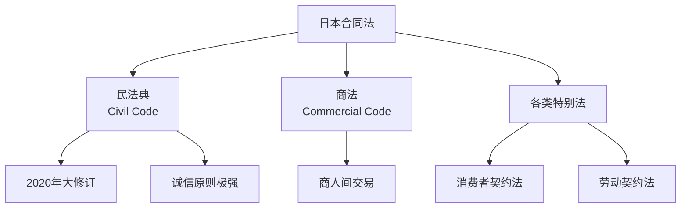

### 1.2 日本专属概念

#### 🔸 诚信原则 (信義誠実の原則)

> **日本法律的核心:** 民法典第1条第2项——"权利的行使和义务的履行，必须诚实进行。"

| 对比 | 美国 | 日本 |
| :--- | :--- | :--- |
| **诚信义务范围** | 有限（主要在履行阶段） | 广泛（从谈判到履行全程） |
| **谈判中途终止** | 通常无责任 | 可能需赔偿信赖利益 |
| **合同解释** | 字面解释优先 | 考虑诚信和当事人真意 |

**Asher策略:**
> "在日本，诚信原则比合同条款更重要。即使合同没写清楚，法院也可能根据诚信原则判定你有某些义务。所以在日本做生意，不能只看字面意思，要考虑'这样做合理吗'。"

#### 🔸 印章文化 (判子/押印)

> **日本独有:** 个人和公司都有印章，在正式文件上盖章比签字更重要。

| 印章类型 | 用途 | 法律效力 |
| :--- | :--- | :--- |
| **実印 (Jitsuin)** | 在政府登记的正式印章 | 最高效力，用于重要合同 |
| **銀行印 (Ginko-in)** | 银行专用 | 银行业务 |
| **認印 (Mitome-in)** | 日常使用 | 较低效力 |
| **会社印 (Kaisha-in)** | 公司印章 | 代表公司 |

**2020年后的变化:**
- 疫情加速了电子签名的接受
- 电子签名法已认可部分电子签约
- 但传统印章文化仍然根深蒂固

**Asher策略:**
> "在日本签重要合同，最好用実印并附上印鑑証明（印章登记证明）。虽然2020年后电子签名开始普及，但很多日本公司仍然偏好传统盖章。入乡随俗。"

#### 🔸 终身雇佣与解雇限制

> **日本特色:** 虽然法律上没有明确"终身雇佣"，但判例法形成了极强的解雇限制。

| 维度 | 美国 | 日本 |
| :--- | :--- | :--- |
| **解雇保护** | At-Will | 极强（判例法） |
| **解雇条件** | 无需理由 | 需"合理的解雇事由" |
| **赔偿金** | 通常无 | 可能极高 |
| **文化因素** | 流动性高 | 终身雇佣传统 |

**"解雇权滥用法理" (解雇濫用法理):**
> 即使有法定解雇事由，如果解雇被认为"缺乏客观合理的理由并且不被社会一般观念所认可"，则解雇无效。

**Asher策略 (在日本雇人):**
> "在日本解雇正式员工几乎不可能——文化上被视为背叛，法律上有极强保护。所以：
> 1. 招聘时极其谨慎
> 2. 多用合同工/派遣工
> 3. 如果必须解雇，协商一致+高额补偿是唯一出路"

#### 🔸 2020年民法典修订要点

| 修订内容 | 意义 |
| :--- | :--- |
| **定型約款 (格式条款)** | 明确了格式条款的成立与效力条件 |
| **消滅時効 (诉讼时效)** | 统一为5年（知道权利被侵害时起算） |
| **法定利率** | 从固定5%改为浮动利率（3%起） |
| **契約解除** | 不需要催告的情形明确化 |

### 1.3 日本合同关键条款模板

#### 管辖权条款
```
本契約に関する紛争については、東京地方裁判所を第一審の専属的合意管轄裁判所とする。
(关于本合同的纠纷，以东京地方法院为第一审的专属管辖法院。)
```

```
This Agreement shall be governed by and construed in accordance 
with the laws of Japan. Any dispute shall be submitted to the 
exclusive jurisdiction of the Tokyo District Court.
```

#### 仲裁条款
```
本契約に関する紛争は、日本商事仲裁協会の仲裁規則に従って仲裁により解決する。
仲裁地は東京とする。
(本合同的纠纷，依照日本商事仲裁协会的仲裁规则通过仲裁解决。仲裁地为东京。)
```

### 1.4 日本合同避坑清单

| 风险 | 说明 | Asher应对 |
| :--- | :--- | :--- |
| **诚信原则扩张** | 可能产生合同外义务 | 行为合理，不投机取巧 |
| **印章文化** | 电子签名接受度仍低 | 准备实印+印鑑証明 |
| **解雇几乎不可能** | 极强的员工保护 | 慎重招聘+多用合同工 |
| **语言障碍** | 商业日语复杂 | 聘请专业翻译 |
| **关系导向** | 关系比合同重要 | 先建立信任再谈业务 |

---

# Part 4: 跨境合同实战策略

## 1. 管辖权选择策略

### 1.1 管辖权选择决策树

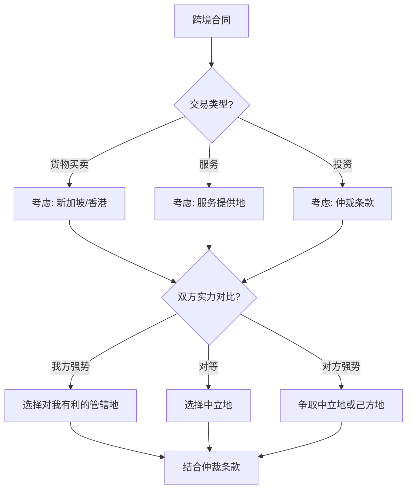

### 1.2 最优管辖权推荐

| 场景 | 推荐管辖权 | 理由 |
| :--- | :--- | :--- |
| 中美贸易 | 新加坡/香港仲裁 | 双方都能接受，执行力强 |
| 中日贸易 | 香港仲裁或东京诉讼 | 文化接近，效率高 |
| 美澳贸易 | 纽约或悉尼 | 法系相同，可预测性高 |
| 印度涉外 | 新加坡仲裁 | 避开印度漫长诉讼 |
| 东南亚区域 | 新加坡仲裁 (SIAC) | 区域公认中立地 |

### 1.3 适用法律 vs 管辖权

> **重要区别:** 适用法律（Governing Law）和管辖权（Jurisdiction）是两回事！

| 概念 | 含义 | 可否分离 |
| :--- | :--- | :--- |
| **适用法律** | 用哪国法律解释合同 | ✅ 可以选择 |
| **管辖权** | 在哪里解决争议 | ✅ 可以选择 |
| **分离可能** | 可以选择A国法律+B国法院 | 常见操作 |

**常见组合:**
```
适用法律: 英国法
仲裁地: 新加坡 (SIAC)
仲裁语言: 英语
```

## 2. 仲裁机构选择

### 2.1 主要国际仲裁机构对比

| 机构 | 所在地 | 特点 | 适合场景 |
| :--- | :--- | :--- | :--- |
| **SIAC** | 新加坡 | 亚洲首选，效率高 | 亚洲区域交易 |
| **HKIAC** | 香港 | 涉华交易首选 | 中国相关交易 |
| **ICC** | 巴黎 | 全球顶级，成本高 | 大型国际交易 |
| **LCIA** | 伦敦 | 英式传统 | 英联邦国家 |
| **AAA** | 美国 | 美国交易 | 涉美交易 |
| **CIETAC** | 中国 | 中国官方 | 涉华交易 |
| **JCAA** | 日本 | 日本首选 | 涉日交易 |

### 2.2 仲裁条款模板

**万能版 (SIAC):**
```
Any dispute arising out of or in connection with this contract, 
including any question regarding its existence, validity or 
termination, shall be referred to and finally resolved by 
arbitration administered by the Singapore International 
Arbitration Centre ("SIAC") in accordance with the Arbitration 
Rules of the SIAC for the time being in force, which rules are 
deemed to be incorporated by reference in this clause.

The seat of the arbitration shall be Singapore.
The Tribunal shall consist of [one/three] arbitrator(s).
The language of the arbitration shall be English.
```

## 3. 文化适配指南

### 3.1 六国商业文化对比

| 维度 | 🇺🇸 美国 | 🇦🇺 澳洲 | 🇨🇳 中国 | 🇮🇳 印度 | 🇲🇾 马来 | 🇯🇵 日本 |
| :--- | :--- | :--- | :--- | :--- | :--- | :--- |
| **谈判风格** | 直接 | 直接 | 关系导向 | 灵活 | 温和 | 含蓄 |
| **时间观念** | 严格 | 较严格 | 灵活 | 极灵活 | 灵活 | 严格 |
| **合同态度** | 合同为王 | 合同重要 | 关系>合同 | 灵活解释 | 关系重要 | 诚信>条款 |
| **决策速度** | 快 | 较快 | 层层审批 | 慢 | 中等 | 慢(共识) |
| **面子重要性** | 低 | 低 | 极高 | 较高 | 较高 | 极高 |

### 3.2 文化适配策略

#### 🇺🇸 美国
- **直奔主题:** 不需要太多寒暄
- **数据说话:** 用数字和事实支撑论点
- **法律至上:** 合同条款被严格执行
- **时间就是金钱:** 会议准时开始准时结束

#### 🇦🇺 澳大利亚
- **平等氛围:** 不要太端着，保持轻松
- **直接但友好:** 可以直接表达，但要礼貌
- **工作生活平衡:** 不要在周末或下班后打扰
- **反对虚伪:** 不喜欢过度恭维

#### 🇨🇳 中国
- **关系先行:** 先建立信任再谈业务
- **面子工程:** 不要让对方在公开场合丢脸
- **宴请文化:** 重要deal往往在饭桌上敲定
- **层层审批:** 决策需要时间

#### 🇮🇳 印度
- **灵活时间观:** 会议可能延迟开始
- **讨价还价:** 价格谈判是预期中的
- **关系网络:** 人脉很重要
- **耐心等待:** 决策过程漫长

#### 🇲🇾 马来西亚
- **多元文化:** 马来人、华人、印度人风格不同
- **尊重宗教:** 了解伊斯兰教的祈祷时间和节日
- **温和方式:** 避免冲突，寻求和谐
- **建立信任:** 关系导向

#### 🇯🇵 日本
- **共识决策:** 一个人说了不算，需要内部讨论
- **极度含蓄:** "我们会考虑"可能意味着拒绝
- **形式重要:** 名片交换、鞠躬礼节
- **长期导向:** 一次交易是长期关系的开始

---

## 4. 六国速查卡片

### 🇺🇸 美国合同速查

| 项目 | 要点 |
| :--- | :--- |
| **合同成立** | Consideration必须有 |
| **签名方式** | 签字即可 |
| **仲裁态度** | 非常友好 |
| **解雇规则** | At-Will (大多数州) |
| **关键风险** | 惩罚性赔偿、陪审团 |
| **推荐州法** | 特拉华(公司)、纽约(商业) |
| **文化提示** | 直接、高效、法律至上 |

### 🇦🇺 澳大利亚合同速查

| 项目 | 要点 |
| :--- | :--- |
| **合同成立** | Consideration必须有 |
| **签名方式** | 签字即可 |
| **仲裁态度** | 友好 |
| **解雇规则** | 需正当理由+程序 |
| **关键风险** | UCT罚款(最高5000万) |
| **推荐州法** | NSW、VIC |
| **文化提示** | 直接但友好、工作生活平衡 |

### 🇨🇳 中国合同速查

| 项目 | 要点 |
| :--- | :--- |
| **合同成立** | 不需要Consideration |
| **签名方式** | 签字+公章 |
| **仲裁态度** | 友好 (CIETAC) |
| **解雇规则** | N+1补偿，限制多 |
| **关键风险** | 格式条款无效、公章伪造 |
| **推荐仲裁** | CIETAC、BAC |
| **文化提示** | 关系先行、面子重要 |

### 🇮🇳 印度合同速查

| 项目 | 要点 |
| :--- | :--- |
| **合同成立** | Consideration必须有 |
| **签名方式** | 签字+印花税 |
| **仲裁态度** | 友好 |
| **解雇规则** | 有保护，但较灵活 |
| **关键风险** | 诉讼极慢(3-10年)、执行难 |
| **推荐仲裁** | 新加坡SIAC |
| **文化提示** | 耐心、灵活、讨价还价 |

### 🇲🇾 马来西亚合同速查

| 项目 | 要点 |
| :--- | :--- |
| **合同成立** | Consideration必须有 |
| **签名方式** | 签字即可 |
| **仲裁态度** | 友好 (AIAC) |
| **解雇规则** | 需正当理由 |
| **关键风险** | 外资限制、诉讼较慢 |
| **推荐仲裁** | AIAC |
| **文化提示** | 多元文化、尊重宗教 |

### 🇯🇵 日本合同速查

| 项目 | 要点 |
| :--- | :--- |
| **合同成立** | 不需要Consideration |
| **签名方式** | 签字+印章(推荐実印) |
| **仲裁态度** | 友好 (JCAA) |
| **解雇规则** | 极难解雇正式员工 |
| **关键风险** | 诚信原则扩张、印章文化 |
| **推荐管辖** | 东京、JCAA |
| **文化提示** | 含蓄、共识、长期关系 |

---

## 5. Glossary (跨境术语表)

*   **Consideration (对价):** 英美法系合同成立的必要条件，指双方交换的有价值的东西。
*   **Governing Law (适用法律):** 用于解释和执行合同的法律体系。
*   **Jurisdiction (管辖权):** 对争议有审判权的法院或仲裁机构。
*   **New York Convention (纽约公约):** 承认和执行外国仲裁裁决的国际公约，160+国家成员。
*   **Seat of Arbitration (仲裁地):** 决定仲裁程序适用法律的地点。
*   **Unfair Contract Terms (不公平条款):** 在澳洲/中国等国可能被认定无效的单方有利条款。
*   **Specific Performance (特定履行):** 法院命令当事人继续履行合同的救济方式。
*   **Stamp Duty (印花税):** 某些国家要求在合同上缴纳的税款，否则合同可能无效。
*   **At-Will Employment (随意雇佣):** 美国特有的雇佣制度，允许无理由解雇。
*   **Inkan/Hanko (印章):** 日本的个人或公司印章，在正式文件上具有法律效力。

---

# Part 5: 跨境漏洞图谱 (Cross-Border Loophole Atlas)

> **Asher核心策略:** 不同国家的法律差异本身就是漏洞——懂得利用这些差异，就能在跨境博弈中获得不对称优势。

## 1. 法律套利机会矩阵

### 1.1 Consideration漏洞

> **核心发现:** 中国和日本不需要Consideration，这意味着**单方承诺在这些国家可能有约束力**。

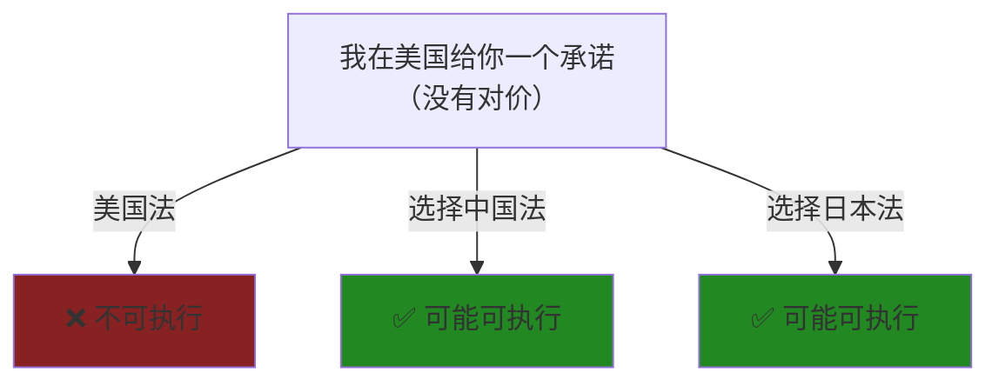

| 场景 | 漏洞利用方式 | Asher策略 |
| :--- | :--- | :--- |
| **对方给你承诺但没有对价** | 选择中国/日本法 | 让对方的承诺有约束力 |
| **你给对方承诺但不想被约束** | 选择美国/澳洲法 | 因为没有对价，承诺不可执行 |
| **修改合同不想给新对价** | 选择中国/日本法 | 修改不需要新的consideration |

**实战案例:**
> 你和美国客户签约，客户口头承诺"如果项目成功，额外奖励10%"。如果选择美国法，这个承诺可能因缺少consideration而不可执行。但如果选择中国法作为适用法律，这个单方承诺可能有约束力。

### 1.2 格式条款漏洞

> **核心发现:** 美国对格式条款宽松，中国/澳洲对格式条款严管。这意味着**同一份霸王条款在不同国家命运完全不同**。

| 条款类型 | 美国 | 澳洲 | 中国 | Asher套利 |
| :--- | :--- | :--- | :--- | :--- |
| "最终解释权归甲方" | ⚠️ 可能有效 | ❌ 无效 | ❌ 无效 | 做甲方选美国法 |
| "单方解约无需理由" | ✅ 有效 | ❌ 可能无效 | ❌ 可能无效 | 做甲方选美国法 |
| "免除一切责任" | ⚠️ 可能有效 | ❌ 无效 | ❌ 无效 | 做甲方选美国法 |
| "自动续期陷阱" | ✅ 有效 | ❌ 可能无效 | ⚠️ 看情况 | 做甲方选美国法 |

**Asher策略矩阵:**

| 你的角色 | 最优法律选择 | 理由 |
| :--- | :--- | :--- |
| **甲方/强势方** | 美国法（特拉华/纽约） | 霸王条款最容易生效 |
| **乙方/弱势方** | 澳洲法或中国法 | 不公平条款可能被否决 |
| **服务提供商** | 澳洲法/中国法 | 防止验收陷阱、付款陷阱 |
| **平台运营商** | 美国法 | 用户协议限责条款有效 |

### 1.3 解雇成本漏洞

> **核心发现:** 美国At-Will雇佣成本最低，日本/中国解雇成本最高。雇佣和解雇策略应因地制宜。

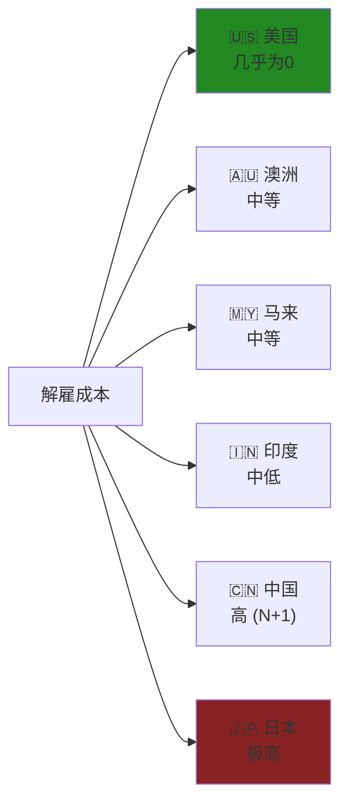

| 场景 | 最优选择 | Asher策略 |
| :--- | :--- | :--- |
| **短期项目，需要快速组建/解散团队** | 在美国雇佣 | At-Will随时可以解雇 |
| **长期稳定团队，低流动性** | 在日本/中国雇佣 | 员工稳定，但解雇成本高 |
| **远程团队，成本敏感** | 在印度/马来雇佣 | 成本低，解雇也相对容易 |
| **高薪核心员工** | 美国雇佣+股权激励 | 灵活+激励 |

### 1.4 诉讼速度漏洞

> **核心发现:** 印度诉讼极慢（3-10年），可以被被告利用来"拖死"原告。

| 策略 | 适用场景 | Asher应用 |
| :--- | :--- | :--- |
| **选择印度管辖权拖延** | 当你是被告且需要时间 | 对方诉讼成本极高，可能放弃 |
| **避开印度管辖权** | 当你是原告且需要快速执行 | 选择新加坡/香港仲裁 |
| **利用中国速度优势** | 需要快速拿到判决 | 中国诉讼6月-2年 |

### 1.5 仲裁裁决执行漏洞

> **核心发现:** 纽约公约国家的仲裁裁决在全球可执行，但各国法院判决互相承认有限。

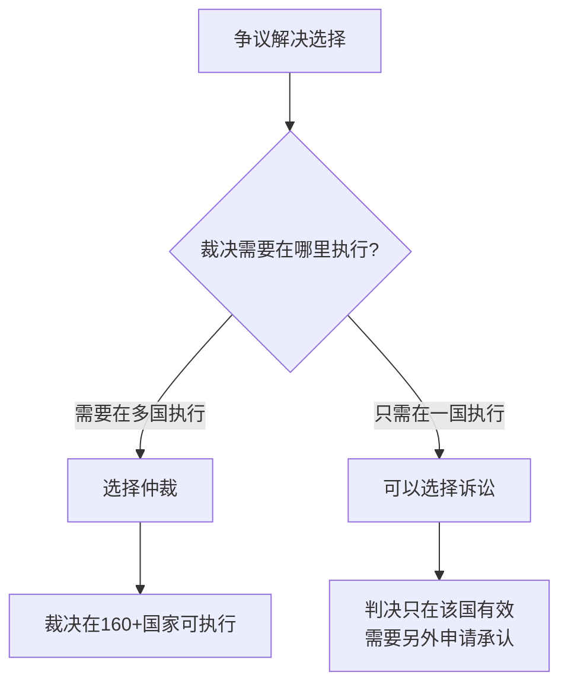

**Asher策略:**
> "如果对方的资产分散在多个国家，必须选择仲裁——仲裁裁决依据纽约公约可以在160多个国家执行。如果选择诉讼，中国法院的判决在美国几乎不可能被执行。"

---

## 2. 行业专项漏洞分析

### 2.1 服务合同 (Service Agreements)

| 漏洞点 | 美国 | 澳洲 | 中国 | 印度 | 马来 | 日本 |
| :--- | :--- | :--- | :--- | :--- | :--- | :--- |
| **无限修改条款** | ✅ 可能有效 | ❌ UCT | ❌ 格式条款 | ⚠️ 看情况 | ⚠️ 看情况 | ❌ 诚信原则 |
| **验收无时限** | ✅ 可能有效 | ❌ UCT | ⚠️ 可争议 | ⚠️ 看情况 | ⚠️ 看情况 | ❌ 诚信原则 |
| **付款账期60天+** | ✅ 有效 | ✅ 有效 | ✅ 有效 | ✅ 有效 | ✅ 有效 | ✅ 有效 |
| **竞业限制2年** | ⚠️ 州际差异 | ⚠️ 需合理 | ✅ 需补偿 | ⚠️ 需合理 | ⚠️ 需合理 | ❌ 难执行 |

**Asher作为服务提供商策略:**
> "优先选择澳洲法或中国法——这两个国家对格式条款管控严格，可以否决甲方的验收陷阱和无限修改条款。"

### 2.2 租赁合同 (Lease Agreements)

| 漏洞点 | 美国 | 澳洲 | 中国 | 印度 | 马来 | 日本 |
| :--- | :--- | :--- | :--- | :--- | :--- | :--- |
| **租金涨幅无上限** | ⚠️ 州际差异 | ⚠️ 州际限制 | ✅ 市场化 | ✅ 市场化 | ✅ 市场化 | ⚠️ 受限 |
| **押金无上限** | ⚠️ 州际差异 | ❌ 有上限 | ✅ 协商 | ✅ 协商 | ⚠️ 有限制 | ❌ 有上限 |
| **驱逐租客难度** | ⚠️ 州际差异 | ❌ 较难 | ✅ 相对容易 | ❌ 极难 | ⚠️ 中等 | ❌ 极难 |
| **提前终止** | ✅ 按合同 | ⚠️ 有保护 | ✅ 按合同 | ⚠️ 有保护 | ✅ 按合同 | ❌ 难 |

**Asher作为房东策略:**
> "在中国做房东最灵活——租金可以市场化调整，驱逐租客也相对容易。在日本做房东最难——租客保护极强，一旦租出去就很难收回。"

### 2.3 劳动合同 (Employment Contracts)

| 漏洞点 | 美国 | 澳洲 | 中国 | 印度 | 马来 | 日本 |
| :--- | :--- | :--- | :--- | :--- | :--- | :--- |
| **无理由解雇** | ✅ At-Will | ❌ 需理由 | ❌ 需理由 | ⚠️ 需理由 | ❌ 需理由 | ❌ 几乎不可能 |
| **试用期无上限** | ✅ | ⚠️ 有上限 | ❌ 最长6个月 | ⚠️ 有上限 | ⚠️ 有上限 | ⚠️ 有上限 |
| **竞业限制** | ⚠️ 加州无效 | ⚠️ 需合理 | ✅ 需补偿 | ⚠️ 需合理 | ⚠️ 需合理 | ⚠️ 需合理 |
| **最低工资** | $7.25/h | $23.23/h | 市级差异 | ~$0.5/h | ~$2.5/h | ~$9/h |

**Asher雇佣策略决策树:**

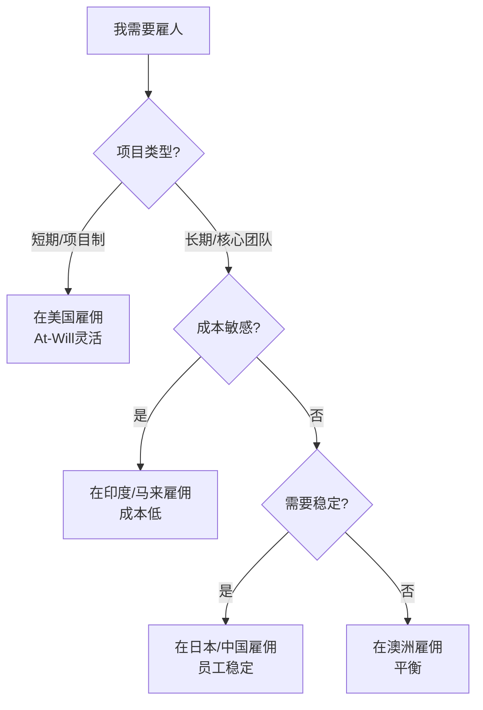

### 2.4 代理/分销合同 (Agency/Distribution)

| 漏洞点 | 美国 | 澳洲 | 中国 | 印度 | 马来 | 日本 |
| :--- | :--- | :--- | :--- | :--- | :--- | :--- |
| **独家代理强制更新** | ❌ 不需要 | ❌ 不需要 | ❌ 不需要 | ❌ 不需要 | ❌ 不需要 | ⚠️ 有判例 |
| **终止代理需补偿** | ⚠️ 看州 | ⚠️ 看情况 | ⚠️ 看合同 | ⚠️ 看情况 | ⚠️ 看情况 | ✅ 可能需要 |
| **佣金追索期** | ✅ 按合同 | ✅ 按合同 | ✅ 按合同 | ✅ 按合同 | ✅ 按合同 | ⚠️ 有保护 |

---

## 3. Asher跨境套利剧本

### 3.1 场景：我是甲方（发包/采购方）

**目标:** 最大化控制权，最小化责任

| 策略 | 具体操作 | 法律选择 |
| :--- | :--- | :--- |
| **霸王条款生效** | 加入单方解约、无限修改、验收无时限 | 选择美国法（特拉华/纽约） |
| **限责条款生效** | 责任上限、免责条款 | 选择美国法 |
| **规避消费者保护** | 如果澳洲法不可避免 | 确保对方不是"消费者"定义范围 |
| **快速解雇权** | 雇佣合同 | 在美国雇佣 |

**Asher甲方合同模板要素:**
```
管辖权: 特拉华州法 / 纽约州法
仲裁: AAA强制仲裁 + 集体诉讼豁免
责任: 上限=合同金额
验收: 甲方书面确认
修改: 书面变更令
解约: 甲方提前30天通知可终止
```

### 3.2 场景：我是乙方（服务提供商）

**目标:** 保障收款，限制范围蔓延

| 策略 | 具体操作 | 法律选择 |
| :--- | :--- | :--- |
| **否决霸王条款** | 援引格式条款无效规则 | 选择澳洲法或中国法 |
| **验收保护** | 加入验收时限+默认通过 | 澳洲法/中国法更支持 |
| **付款保护** | 预付款+里程碑付款 | 任何法律都可以约定 |
| **范围限制** | 明确服务范围+变更计费 | 任何法律都可以约定 |

**Asher乙方谈判话术:**
> "这个[无限责任/单方解约/验收无时限]条款在澳大利亚消费者法下可能被认定为不公平条款，最高可能有5000万澳元的罚款。我建议我们调整一下措辞..."

### 3.3 场景：跨境投资/合资

**目标:** 保护投资，保留退出权

| 策略 | 具体操作 | 法律选择 |
| :--- | :--- | :--- |
| **仲裁保护** | 选择中立第三地仲裁 | SIAC（新加坡）或HKIAC（香港） |
| **适用法律** | 选择发达国家法律 | 英国法或新加坡法 |
| **退出机制** | 明确拖带权/随售权 | 任何法律 |
| **信息权** | 财务报表获取权 | 任何法律 |

**Asher投资合同必备条款:**
```
仲裁: SIAC新加坡
适用法律: 英国法
退出: 5年后可启动Put Option
拖带权: 控股方出售时小股东必须跟随
反稀释: 全棘轮反稀释保护
清算优先: 1x参与型清算优先权
```

### 3.4 场景：跨境远程雇佣

**目标:** 低成本+灵活性

| 员工所在地 | 成本 | 灵活性 | 推荐场景 |
| :--- | :--- | :--- | :--- |
| **印度** | ⭐ 极低 | ⭐⭐⭐⭐ 高 | 技术开发、客服 |
| **马来西亚** | ⭐⭐ 低 | ⭐⭐⭐ 中高 | 东南亚市场 |
| **中国** | ⭐⭐⭐ 中 | ⭐⭐ 低 | 中国市场 |
| **美国** | ⭐⭐⭐⭐⭐ 极高 | ⭐⭐⭐⭐⭐ 极高 | 短期项目 |
| **澳洲** | ⭐⭐⭐⭐ 高 | ⭐⭐⭐ 中 | 澳洲市场 |
| **日本** | ⭐⭐⭐⭐ 高 | ⭐ 极低 | 日本市场长期 |

**Asher远程团队配置建议:**
```
核心决策层: 美国雇佣 (At-Will灵活)
技术开发: 印度EOR (成本低)
区域运营: 当地雇佣 (合规)
财务/法务: 澳洲雇佣 (质量+保护平衡)
```

---

# Part 6: 深度国家对比矩阵

## 1. 合同类型适配矩阵

### 1.1 按合同类型选择最优法律

| 合同类型 | 对甲方最友好 | 对乙方最友好 | 中立/平衡 |
| :--- | :--- | :--- | :--- |
| **服务合同** | 🇺🇸 美国 | 🇦🇺 澳洲/🇨🇳 中国 | 🇲🇾 马来/🇮🇳 印度 |
| **货物买卖** | 🇺🇸 美国 (UCC) | 🇨🇳 中国 | 🇯🇵 日本 |
| **雇佣合同** | 🇺🇸 美国 (雇主) | 🇯🇵 日本/🇨🇳 中国 (员工) | 🇦🇺 澳洲 |
| **租赁合同** | 🇨🇳 中国 (房东) | 🇯🇵 日本 (租客) | 🇦🇺 澳洲 |
| **投资合同** | 🇺🇸 美国 (投资人) | 🇨🇳 中国 (创始人) | 🇸🇬 新加坡 |
| **代理分销** | 🇺🇸 美国 (品牌方) | 🇯🇵 日本 (代理) | 🇲🇾 马来 |

### 1.2 按谈判力选择策略

| 我的谈判力 | 法律选择策略 | 具体操作 |
| :--- | :--- | :--- |
| **我方强势** | 选择对我有利的法律 | 美国法(甲方)、条款控制权 |
| **双方对等** | 选择中立第三地 | 新加坡/香港法、SIAC仲裁 |
| **对方强势** | 争取对我有利的法律 | 援引不公平条款规则、选择保护性强的法律 |
| **极端弱势** | 利用强制性法律保护 | 当地劳动法、消费者法不可排除 |

---

## 2. 时间与成本对比

### 2.1 诉讼/仲裁时间成本

| 国家 | 诉讼时长 | 仲裁时长 | 执行时长 | 总周期 |
| :--- | :--- | :--- | :--- | :--- |
| 🇺🇸 美国 | 1-3年 | 6-18月 | 3-12月 | 1.5-4年 |
| 🇦🇺 澳洲 | 1-2年 | 6-12月 | 3-6月 | 1-2.5年 |
| 🇨🇳 中国 | 6月-2年 | 6-12月 | 3-12月 | 1-3年 |
| 🇮🇳 印度 | 3-10年 | 1-3年 | 1-5年 | 5-15年 |
| 🇲🇾 马来 | 2-5年 | 1-2年 | 6-18月 | 3-7年 |
| 🇯🇵 日本 | 1-3年 | 1-2年 | 3-6月 | 1.5-4年 |

### 2.2 诉讼/仲裁金钱成本

| 国家 | 律师费/小时 | 诉讼费 | 仲裁费 | 100万美元案件总成本 |
| :--- | :--- | :--- | :--- | :--- |
| 🇺🇸 美国 | $400-1000 | 高 | 高 | $200,000-500,000 |
| 🇦🇺 澳洲 | $300-800 | 中高 | 中高 | $150,000-400,000 |
| 🇨🇳 中国 | $100-400 | 低 | 中 | $50,000-150,000 |
| 🇮🇳 印度 | $50-200 | 低 | 低 | $30,000-100,000 |
| 🇲🇾 马来 | $100-300 | 低 | 中 | $40,000-120,000 |
| 🇯🇵 日本 | $300-600 | 中 | 中高 | $100,000-300,000 |

**Asher成本效益分析:**
> "争议金额100万美元以下，在印度诉讼成本最低但时间最长。如果时间敏感，选择中国诉讼或新加坡仲裁。如果金额巨大（1000万+），美国诉讼虽然贵但惩罚性赔偿可能是值得的。"

---

## 3. 风险与保护对比

### 3.1 被起诉风险

| 国家 | 诉讼文化 | 惩罚性赔偿 | 陪审团 | 集体诉讼 | 风险评级 |
| :--- | :--- | :--- | :--- | :--- | :--- |
| 🇺🇸 美国 | 极高 | ✅ 有 | ✅ 有 | ✅ 有 | 🔴 极高风险 |
| 🇦🇺 澳洲 | 中 | ⚠️ 有限 | ❌ 无 | ⚠️ 有限 | 🟡 中等风险 |
| 🇨🇳 中国 | 中低 | ⚠️ 有限 | ❌ 无 | ❌ 无 | 🟢 较低风险 |
| 🇮🇳 印度 | 中 | ❌ 罕见 | ❌ 无 | ⚠️ 有 | 🟡 中等风险 |
| 🇲🇾 马来 | 低 | ❌ 无 | ❌ 无 | ❌ 无 | 🟢 低风险 |
| 🇯🇵 日本 | 极低 | ❌ 无 | ❌ 无 | ❌ 无 | 🟢 极低风险 |

### 3.2 合同保护强度

| 国家 | 消费者保护 | 劳动者保护 | 小企业保护 | 租户保护 |
| :--- | :--- | :--- | :--- | :--- |
| 🇺🇸 美国 | ⭐⭐ | ⭐ | ⭐⭐ | ⭐⭐ |
| 🇦🇺 澳洲 | ⭐⭐⭐⭐⭐ | ⭐⭐⭐⭐ | ⭐⭐⭐⭐ | ⭐⭐⭐⭐ |
| 🇨🇳 中国 | ⭐⭐⭐ | ⭐⭐⭐⭐⭐ | ⭐⭐⭐ | ⭐⭐ |
| 🇮🇳 印度 | ⭐⭐⭐ | ⭐⭐⭐ | ⭐⭐ | ⭐⭐⭐ |
| 🇲🇾 马来 | ⭐⭐⭐ | ⭐⭐⭐ | ⭐⭐ | ⭐⭐ |
| 🇯🇵 日本 | ⭐⭐⭐⭐ | ⭐⭐⭐⭐⭐ | ⭐⭐⭐ | ⭐⭐⭐⭐⭐ |

---

# Part 7: 条款模板库

## 1. 管辖权条款模板

### 1.1 美国版 (甲方友好)
```
GOVERNING LAW AND JURISDICTION

This Agreement shall be governed by and construed in accordance 
with the laws of the State of Delaware, USA, without regard to 
its conflict of laws provisions. 

Any dispute arising out of or relating to this Agreement shall 
be resolved exclusively by binding arbitration administered by 
the American Arbitration Association (AAA) in accordance with 
its Commercial Arbitration Rules in Wilmington, Delaware. 

THE PARTIES HEREBY WAIVE ANY RIGHT TO A JURY TRIAL AND TO 
PARTICIPATE IN A CLASS ACTION.

The arbitral award shall be final and binding, and judgment 
thereon may be entered in any court of competent jurisdiction.
```

### 1.2 中国版 (平衡)
```
法律适用与争议解决

本协议适用中华人民共和国法律。

因本协议引起的或与本协议有关的任何争议，双方应首先通过友好协商
解决。协商不成的，任何一方均可将争议提交【中国国际经济贸易仲裁
委员会/北京仲裁委员会】，按照其届时有效的仲裁规则进行仲裁。
仲裁地点为北京/上海。仲裁裁决是终局的，对双方均有约束力。
```

### 1.3 新加坡版 (国际中立)
```
GOVERNING LAW AND ARBITRATION

This Agreement shall be governed by and construed in accordance 
with English law.

Any dispute arising out of or in connection with this Agreement, 
including any question regarding its existence, validity or 
termination, shall be referred to and finally resolved by 
arbitration administered by the Singapore International 
Arbitration Centre ("SIAC") in accordance with the SIAC Rules 
for the time being in force.

The seat of arbitration shall be Singapore.
The Tribunal shall consist of one arbitrator.
The language of arbitration shall be English.
```

### 1.4 日本版 (日方接受)
```
準拠法および紛争解決

本契約は日本法に準拠し、解釈されるものとする。

本契約に関連する紛争は、東京地方裁判所を第一審の専属的
合意管轄裁判所として解決するものとする。

[または仲裁版]
本契約に関する紛争は、一般社団法人日本商事仲裁協会の商事仲裁
規則に従い、仲裁により最終的に解決されるものとする。
仲裁地は東京とする。
```

---

## 2. 责任限制条款模板

### 2.1 美国版 (最大限责)
```
LIMITATION OF LIABILITY

TO THE MAXIMUM EXTENT PERMITTED BY APPLICABLE LAW:

(a) IN NO EVENT SHALL EITHER PARTY BE LIABLE FOR ANY INDIRECT, 
INCIDENTAL, SPECIAL, CONSEQUENTIAL OR PUNITIVE DAMAGES, 
INCLUDING WITHOUT LIMITATION LOSS OF PROFITS, REVENUE, DATA, 
OR BUSINESS OPPORTUNITIES.

(b) THE TOTAL LIABILITY OF EITHER PARTY UNDER THIS AGREEMENT 
SHALL NOT EXCEED THE AMOUNTS PAID OR PAYABLE UNDER THIS 
AGREEMENT IN THE TWELVE (12) MONTHS PRECEDING THE CLAIM.

(c) THE FOREGOING LIMITATIONS SHALL APPLY REGARDLESS OF THE 
FORM OF ACTION AND EVEN IF SUCH PARTY HAS BEEN ADVISED OF 
THE POSSIBILITY OF SUCH DAMAGES.
```

### 2.2 澳洲版 (消费者法合规)
```
LIMITATION OF LIABILITY

Subject to clause [X] (Consumer Guarantees), to the maximum 
extent permitted by law:

(a) Neither party shall be liable for any indirect, incidental, 
special or consequential loss or damage.

(b) The total liability of either party shall not exceed the 
greater of: (i) the fees paid under this Agreement in the 
preceding 12 months; or (ii) AUD $[X].

CONSUMER GUARANTEES
Nothing in this Agreement excludes, restricts or modifies any 
consumer guarantee, right or remedy conferred on you by the 
Australian Consumer Law (Schedule 2, Competition and Consumer 
Act 2010) or any other applicable law that cannot be excluded, 
restricted or modified by agreement.
```

---

## 3. 竞业限制条款模板

### 3.1 美国版 (非加州)
```
NON-COMPETITION

During employment and for a period of [12/24] months following 
termination, Employee agrees not to:

(a) Engage in, own, manage, or operate any business that competes 
with the Company within [geographic area];

(b) Solicit or accept business from any customer or client of 
the Company with whom Employee had contact during employment;

(c) Solicit, recruit, or hire any employee of the Company.

This covenant is supported by adequate consideration, including 
[initial employment/promotion/bonus of $X].

[Note: This clause is void in California under Cal. Bus. & Prof. 
Code § 16600]
```

### 3.2 中国版 (必须有补偿)
```
竞业限制

1. 员工在离职后【12/24】个月内，不得到与公司有竞争关系的单位
任职，也不得自己开业生产或者经营同类产品、从事同类业务。

2. 公司在竞业限制期间按月向员工支付经济补偿，补偿金额为员工
离职前十二个月平均工资的【30%/50%】。

3. 若员工违反竞业限制义务，应当向公司支付违约金人民币【X】元，
并继续履行竞业限制义务。

4. 若公司超过三个月未支付竞业限制补偿金，员工可以解除竞业限制
协议。

【注意：根据《劳动合同法》第23条，竞业限制必须支付补偿金，
否则条款可能无效或员工可解除】
```

---

# Part 8: Anti-Patterns (反模式)

## 1. 跨境合同常见陷阱

### 陷阱 1: 忽视法律差异

*   **Trap:** "美国合同在中国也一样有效"
*   **Why:** 认为合同条款可以超越当地法律
*   **Fix:**
    - 当地强制性法律会覆盖合同约定
    - 劳动法、消费者保护法通常不可排除
    - 每份跨境合同都要考虑当地法律合规
*   **Positive Scenario:** 某公司在和中国员工签约时，专门咨询了中国劳动法，避免了N+1解雇补偿的意外成本。

### 陷阱 2: 管辖权选择不当

*   **Trap:** "选择我熟悉的法律就好"
*   **Why:** 没有考虑执行地
*   **Fix:**
    - 判决需要在哪里执行?
    - 对方资产在哪里?
    - 仲裁裁决在纽约公约国家更容易执行
*   **Positive Scenario:** 某公司在与印度供应商签约时选择了新加坡仲裁，避免了在印度出诉讼的3-10年漫长等待。

### 陷阱 3: 忽视文化差异

*   **Trap:** "合同签了就万事大吉"
*   **Why:** 在关系导向的国家，合同只是开始
*   **Fix:**
    - 在中国/日本，合同之外的关系维护同样重要
    - 在美国，合同条款被严格执行
    - 了解对方的商业文化
*   **Positive Scenario:** 某公司在日本做生意时，先花6个月建立信任关系，然后签约。虽然初期投入大，但后续合作极其顺利。

### 陷阱 4: 翻译错误

*   **Trap:** "用Google翻译合同就行"
*   **Why:** 法律术语的翻译需要专业知识
*   **Fix:**
    - 专业法律翻译
    - 双语合同注明"以X语版本为准"
    - 关键术语列表
*   **Positive Scenario:** 某公司在中英双语合同中明确"以英文版本为准"，避免了因翻译歧义产生的争议。

---

## 6. 系统关联 (Interlinkages)

*   **上游 (Input):**
    - `1.0_Contract_Anatomy.md` — 合同基础结构
    - `2.0_Attack_Defense_Playbook.md` — 攻防策略
    - `3.0_Loophole_Atlas.md` — 通用漏洞识别
*   **下游 (Output):**
    - `/analyze-contract` Agent工作流 — 应用跨境规则进行分析
    - `_Glossary_Index.json` — 术语同步
    - `3D_Knowledge_Graph.html` — 可视化节点

---

## 备注与引用 (Notes & References)

*   **法律依据:**
    - 美国: UCC, Restatement (Second) of Contracts
    - 澳洲: Australian Consumer Law 2010 (2023修订)
    - 中国: 民法典 (2021), 劳动合同法 (2008)
    - 印度: Indian Contract Act 1872, Specific Relief Act 1963 (2018修订)
    - 马来: Contracts Act 1950, Employment Act 1955 (2022修订)
    - 日本: 民法典 (2020修订)
*   **仲裁规则:** SIAC Rules 2024, HKIAC Rules, ICC Rules, AAA Rules
*   **国际公约:** 纽约公约 (1958), CISG (联合国国际货物销售合同公约)
*   **定制基础:** Asher人设 (非对称套利、跨境业务场景、信息对等需求)
