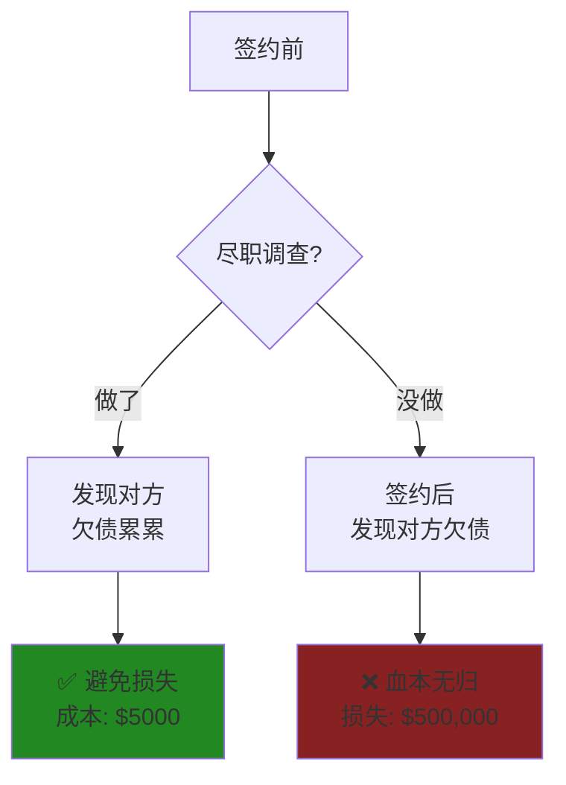
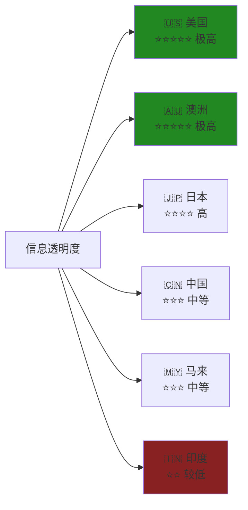
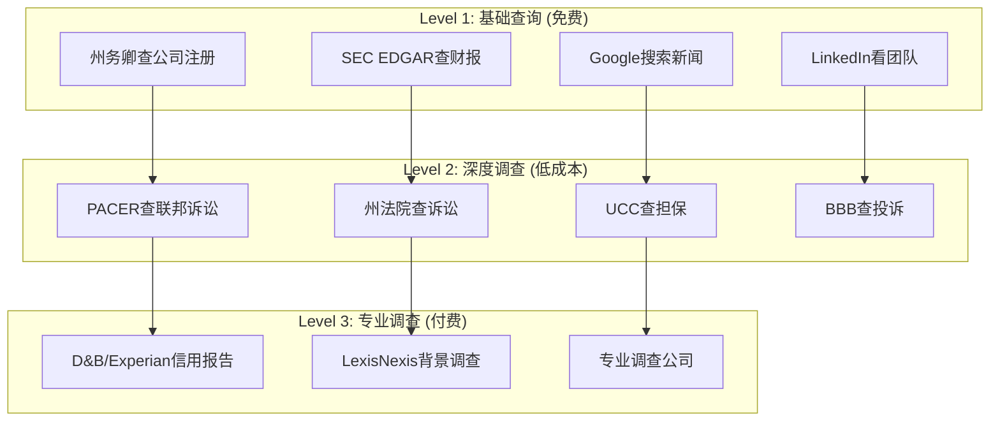
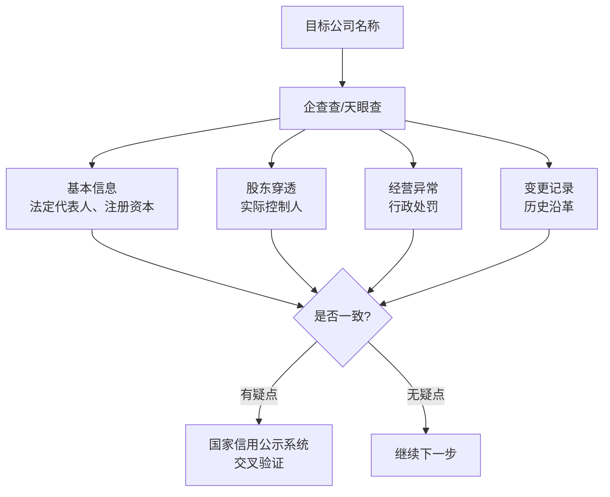
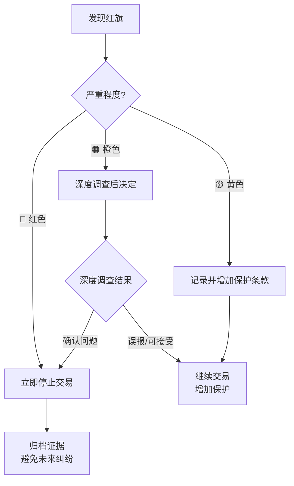

# Cross-Border Due Diligence Guide (跨境尽职调查指南)

> **Tags:** `[Due-Diligence]`, `[Cross-Border]`, `[USA]`, `[Australia]`, `[China]`, `[India]`, `[Malaysia]`, `[Japan]`
> **Date Added:** `2026-01-10`
> **一句话总结 (One-Liner):** 不同国家的尽职调查有不同的信息透明度、法律要求和执行成本——在信息不对称的战场上，知道去哪里挖、挖什么，决定了你是猎人还是猎物。
> **关键协议 (Critical Protocol):**
>
> 1. **国家决定信息成本:** 美国信息透明度极高但贵，中国信息分散但便宜，印度信息混乱且慢。
> 2. **公开信息 ≠ 全部真相:** 财务报表可以被粉饰，诉讼记录可以被隐藏。尽职调查是科学+艺术。
> 3. **Asher原则——信息对等:** 在对方对你了如指掌之前，你必须先了解对方。

---

# Part 1: 尽职调查基础框架

## 1. 元认知：为什么需要跨境尽职调查？

### 1.1 核心问题

> [!IMPORTANT]
> **核心洞察:** 合同只是一张纸——真正决定合同能否执行的，是签约对象的**能力**、**信用**和**意愿**。尽职调查的本质是**在签约前验证对方的真实状态**。



### 1.2 尽职调查的三个维度

| 维度               | 核心问题             | 关键信息                     |
| :----------------- | :------------------- | :--------------------------- |
| **法律合规** | 对方有没有法律问题？ | 诉讼记录、行政处罚、合规状态 |
| **财务健康** | 对方能不能付得起钱？ | 财务报表、资产负债、现金流   |
| **商业信誉** | 对方值不值得信任？   | 历史履约、客户评价、行业口碑 |

### 1.3 尽职调查的成本-收益公式

```
风险调整收益 = 交易收益 - (违约概率 × 损失金额) - 尽职调查成本

当 {违约概率 × 损失金额} > 尽职调查成本 时，尽职调查必做
```

**Asher决策矩阵:**

| 交易金额                                           | 尽职调查深度 | 成本预算 |
| :------------------------------------------------- | :----------- | :------- |
| < $10,000 | 基础查询 (1小时) | < $100              |              |          |
| $10,000-100,000 | 标准调查 (1天) | $500-2000       |              |          |
| $100,000-1,000,000 | 深度调查 (1周) | $5000-20,000 |              |          |
| > $1,000,000 | 全面调查 (2-4周) | $50,000+         |              |          |

---

## 2. 全球尽职调查信息透明度地图

### 2.1 六国信息透明度对比



### 2.2 信息获取难度与成本对比

| 信息类型               | 🇺🇸 美国    | 🇦🇺 澳洲  | 🇨🇳 中国  | 🇮🇳 印度  | 🇲🇾 马来 | 🇯🇵 日本 |
| :--------------------- | :----------- | :--------- | :--------- | :--------- | :-------- | :-------- |
| **公司注册信息** | 免费在线     | 付费在线   | 付费在线   | 付费在线   | 付费在线  | 付费在线  |
| **财务报表**     | 上市公司免费 | 付费获取   | 信用报告   | 难获取     | 付费获取  | 付费获取  |
| **诉讼记录**     | 大部分公开   | 大部分公开 | 需专业查询 | 公开但混乱 | 部分公开  | 需申请    |
| **实际控制人**   | 容易查到     | 容易查到   | 需要穿透   | 复杂       | 容易查到  | 需要穿透  |
| **不动产信息**   | 公开         | 付费       | 需要授权   | 公开但混乱 | 付费      | 付费      |
| **银行信用**     | 信用报告     | 信用报告   | 央行征信   | 难获取     | 信用报告  | 银行调查  |

---

# Part 2: 美国尽职调查 🇺🇸

## 1. 美国信息透明度的优势

> **核心特点:** 美国是全球信息透明度**最高**的国家之一。几乎所有的公开信息都可以免费或低成本获取。

### 1.1 可用公开资源

| 资源名称             | 网址/渠道          | 免费/付费 | 可获取信息                    |
| :------------------- | :----------------- | :-------- | :---------------------------- |
| **SEC EDGAR**  | sec.gov/edgar      | 免费      | 上市公司财报、10-K、10-Q、8-K |
| **州务卿网站** | 各州不同           | 免费/低价 | 公司注册、代理人、状态        |
| **PACER**      | pacer.uscourts.gov | 低价      | 联邦法院诉讼记录              |
| **Free PACER** | recap.law          | 免费      | 部分联邦诉讼记录              |
| **州法院系统** | 各州不同           | 免费/低价 | 州级诉讼记录                  |
| **UCC Filing** | 各州               | 低价      | 担保权益登记                  |
| **USPTO**      | uspto.gov          | 免费      | 专利商标信息                  |
| **OFAC SDN**   | treasury.gov       | 免费      | 制裁名单查询                  |
| **BBB**        | bbb.org            | 免费      | 商业信誉评级                  |
| **Glassdoor**  | glassdoor.com      | 免费      | 员工评价                      |

### 1.2 美国尽职调查流程



### 1.3 关键红旗识别

| 红旗类型               | 如何发现             | 风险评级    |
| :--------------------- | :------------------- | :---------- |
| **公司刚注册**   | 州务卿网站查成立日期 | 🟡 注意     |
| **频繁换代理人** | 州务卿历史记录       | 🟠 警惕     |
| **多起诉讼**     | PACER/州法院         | 🔴 高风险   |
| **UCC担保过多**  | UCC Filing检索       | 🔴 高风险   |
| **创始人有前科** | 背景调查             | 🔴 高风险   |
| **SEC警告/退市** | SEC EDGAR            | 🔴 立即停止 |

### 1.4 Asher美国调查策略

**成本效益优化:**

> "美国的公开信息极其丰富。90%的调查可以在$200以内完成。只有在发现红旗或交易金额超过$100,000时，才需要使用付费的专业服务。"

**必做清单:**

- [ ] 州务卿查公司状态 (Active? Good Standing?)
- [ ] 创始人/CEO LinkedIn背景验证
- [ ] PACER联邦诉讼检索
- [ ] 新闻搜索 (公司名 + "lawsuit"/"fraud"/"complaint")
- [ ] BBB评分检查

---

# Part 3: 澳大利亚尽职调查 🇦🇺

## 1. 澳洲信息透明度特点

> **核心特点:** 澳洲与美国类似，信息透明度高。**ASIC** (澳大利亚证券投资委员会) 是核心信息来源。

### 1.1 可用公开资源

| 资源名称               | 网址/渠道                         | 免费/付费 | 可获取信息           |
| :--------------------- | :-------------------------------- | :-------- | :------------------- |
| **ASIC Connect** | connectonline.asic.gov.au         | 付费      | 公司注册、董事、股东 |
| **ABN Lookup**   | abr.business.gov.au               | 免费      | ABN验证、GST状态     |
| **NSW Court**    | onlineregistry.lawlink.nsw.gov.au | 付费      | 新州诉讼记录         |
| **VIC Courts**   | courts.vic.gov.au                 | 付费      | 维州诉讼记录         |
| **PPSR**         | ppsr.gov.au                       | 付费      | 担保权益登记         |
| **IP Australia** | ipaustralia.gov.au                | 免费      | 商标、专利           |
| **AUSTRAC**      | austrac.gov.au                    | 限制      | 反洗钱合规           |

### 1.2 ASIC公司搜索

**可获取信息:**

- 公司注册日期和状态
- 注册地址和主营业务
- 董事和秘书名单
- 股东信息 (Top 20)
- 历史变更记录
- 是否有外部管理 (Administrator, Liquidator)

**费用:** $9-$40 AUD 不等

### 1.3 澳洲特色：PPSR (担保权益登记)

> **重要:** 澳洲的PPSR相当于美国的UCC，是查询公司资产担保状态的关键工具。

**如何使用:**

1. 访问 ppsr.gov.au
2. 输入公司ACN或ABN
3. 获取已登记的担保权益列表

**红旗:** 如果目标公司有大量担保登记，说明资产已被抵押，偿债能力可疑。

### 1.4 澳洲关键红旗

| 红旗类型                         | 如何发现             | 风险评级    |
| :------------------------------- | :------------------- | :---------- |
| **External Administrator** | ASIC搜索             | 🔴 立即停止 |
| **ASIC Deregistered**      | ASIC搜索             | 🔴 立即停止 |
| **Director Disqualified**  | ASIC Banned Register | 🔴 高风险   |
| **多起PPSR登记**           | PPSR检索             | 🟠 警惕     |
| **频繁换董事**             | ASIC历史记录         | 🟡 注意     |

### 1.5 Asher澳洲调查策略

**必做清单:**

- [ ] ABN Lookup确认公司存在且GST有效
- [ ] ASIC搜索公司状态和董事信息
- [ ] PPSR查询担保权益
- [ ] 州法院诉讼检索
- [ ] Google搜索公司负面新闻

---

# Part 4: 中国尽职调查 🇨🇳

## 1. 中国信息环境的独特性

> **核心特点:** 中国的公开信息分散在多个政府平台，需要**多平台交叉验证**。部分信息需要通过专业渠道获取。

### 1.1 可用公开资源

| 资源名称                           | 网址/渠道                        | 免费/付费 | 可获取信息                 |
| :--------------------------------- | :------------------------------- | :-------- | :------------------------- |
| **企查查/天眼查/启信宝**     | qcc.com/tianyancha.com           | 免费+付费 | 工商信息、股东、诉讼、失信 |
| **国家企业信用信息公示系统** | gsxt.gov.cn                      | 免费      | 官方工商信息               |
| **中国裁判文书网**           | wenshu.court.gov.cn              | 免费      | 法院判决文书               |
| **中国执行信息公开网**       | zxgk.court.gov.cn                | 免费      | 被执行人、失信名单         |
| **中国专利公布公告**         | pss-system.cponline.cnipa.gov.cn | 免费      | 专利信息                   |
| **中国商标网**               | sbj.cnipa.gov.cn                 | 免费      | 商标信息                   |
| **央行征信中心**             | pbccrc.org.cn                    | 需授权    | 企业/个人信用报告          |

### 1.2 中国尽职调查关键查询

#### 1.2.1 工商信息查询



#### 1.2.2 诉讼与执行查询

| 查询内容               | 平台           | 重点关注           |
| :--------------------- | :------------- | :----------------- |
| **民事诉讼**     | 中国裁判文书网 | 合同纠纷、劳动纠纷 |
| **被执行记录**   | 执行信息公开网 | 未履行金额、次数   |
| **失信被执行人** | 执行信息公开网 | 🔴 黑名单！        |
| **行政处罚**     | 信用中国       | 违规记录           |

### 1.3 中国特色：公章与失信

#### 1.3.1 公章验证

> **风险:** 中国存在"萝卜章"问题——伪造公章签订假合同。

**验证方法:**

1. 要求对方提供**加盖公章的营业执照复印件**
2. 在国家信用系统核对公司名称与统一社会信用代码
3. 重大交易：要求**法定代表人身份验证**或**公证**

#### 1.3.2 失信被执行人 (黑名单)

> **核心红旗:** 如果对方在失信被执行人名单上，**立即停止交易**。

**失信后果:**

- 不得乘坐飞机、高铁
- 不得贷款
- 不得担任公司高管
- **合同执行能力极低**

### 1.4 中国关键红旗

| 红旗类型                     | 如何发现       | 风险评级    |
| :--------------------------- | :------------- | :---------- |
| **失信被执行人**       | 执行信息公开网 | 🔴 立即停止 |
| **被执行金额大**       | 执行信息公开网 | 🔴 高风险   |
| **经营异常名录**       | 信用公示系统   | 🔴 高风险   |
| **行政处罚多**         | 企查查/天眼查  | 🟠 警惕     |
| **法定代表人频繁变更** | 企查查变更记录 | 🟡 注意     |
| **注册资本认缴未实缴** | 企查查         | 🟡 注意     |
| **关联公司有问题**     | 股东穿透       | 🟠 警惕     |

### 1.5 Asher中国调查策略

**必做清单:**

- [ ] 天眼查/企查查查基本工商信息
- [ ] 国家信用公示系统交叉验证
- [ ] 执行信息公开网查失信/被执行
- [ ] 裁判文书网查诉讼历史
- [ ] 股东穿透找实际控制人
- [ ] 法定代表人个人背景核查

**Asher警告:**

> "在中国做生意，一定要查失信名单。一个失信被执行人的承诺，就是废纸一张。"

---

# Part 5: 印度尽职调查 🇮🇳

## 1. 印度信息环境的挑战

> **核心特点:** 印度的信息透明度相对**较低**，信息分散在多个联邦和邦级机构，获取速度慢、准确性存疑。

### 1.1 可用公开资源

| 资源名称             | 网址/渠道      | 免费/付费 | 可获取信息           |
| :------------------- | :------------- | :-------- | :------------------- |
| **MCA21**      | mca.gov.in     | 付费      | 公司注册、董事、财报 |
| **CIBIL**      | cibil.com      | 付费      | 商业信用报告         |
| **eCourts**    | ecourts.gov.in | 免费      | 法院案件查询         |
| **ROC Search** | 各邦注册处     | 付费      | 地区公司信息         |
| **SEBI**       | sebi.gov.in    | 免费      | 上市公司信息         |

### 1.2 印度信息获取的特殊挑战

| 挑战                     | 具体表现               | 应对策略                 |
| :----------------------- | :--------------------- | :----------------------- |
| **信息分散**       | 28个邦各有自己的系统   | 使用聚合平台 (如Veridoc) |
| **更新滞后**       | 数据可能滞后6-12个月   | 结合实地调查             |
| **语言障碍**       | 部分邦级文件是地方语言 | 聘请本地顾问             |
| **数据不一致**     | 不同来源数据矛盾       | 多源交叉验证             |
| **诉讼记录不完整** | 很多案件未上网         | 线下法院查询             |

### 1.3 印度关键红旗

| 红旗类型                     | 如何发现      | 风险评级  |
| :--------------------------- | :------------ | :-------- |
| **公司未年报**         | MCA21检索     | 🔴 高风险 |
| **多起诉讼**           | eCourts检索   | 🔴 高风险 |
| **CIBIL评分低**        | 信用报告      | 🟠 警惕   |
| **董事在多家问题公司** | MCA21交叉查询 | 🟠 警惕   |
| **财报未审计**         | 公司文件      | 🟡 注意   |

### 1.4 Asher印度调查策略

**必做清单:**

- [ ] MCA21查公司注册和状态
- [ ] 要求对方提供审计后的财报
- [ ] eCourts查诉讼记录
- [ ] CIBIL商业信用报告
- [ ] 聘请本地调查公司进行实地核查

**Asher警告:**

> "在印度做尽职调查，永远不要相信纸面上的数据。必须进行实地调查——很多'公司'的注册地址根本不存在。"

---

# Part 6: 马来西亚尽职调查 🇲🇾

## 1. 马来西亚信息环境

> **核心特点:** 马来西亚的信息透明度中等。**SSM** (马来西亚公司委员会) 是核心信息来源。

### 1.1 可用公开资源

| 资源名称             | 网址/渠道                  | 免费/付费 | 可获取信息           |
| :------------------- | :------------------------- | :-------- | :------------------- |
| **SSM e-Info** | ssm-einfo.my               | 付费      | 公司注册、董事、股东 |
| **MyIPO**      | myipo.gov.my               | 免费      | 商标、专利           |
| **eCourt**     | eservices.kehakiman.gov.my | 免费      | 法院案件             |
| **CCRIS**      | 银行渠道                   | 需授权    | 信用报告             |
| **CTOS**       | ctos.com.my                | 付费      | 商业信用报告         |

### 1.2 SSM公司搜索

**可获取信息:**

- 公司注册号和状态
- 董事和秘书名单
- 股东信息
- 已缴资本
- 地址和经营范围

**费用:** RM 10-30 不等

### 1.3 马来西亚关键红旗

| 红旗类型                 | 如何发现     | 风险评级    |
| :----------------------- | :----------- | :---------- |
| **公司被除名**     | SSM搜索      | 🔴 立即停止 |
| **公司在清盘**     | SSM搜索      | 🔴 立即停止 |
| **多起法院案件**   | eCourt检索   | 🔴 高风险   |
| **CTOS评分低**     | CTOS报告     | 🟠 警惕     |
| **董事有不良记录** | SSM/CTOS交叉 | 🟠 警惕     |

### 1.4 Asher马来调查策略

**必做清单:**

- [ ] SSM e-Info查公司状态和董事
- [ ] CTOS信用报告
- [ ] eCourt诉讼检索
- [ ] 新闻搜索 (英语+马来语)
- [ ] 如涉及伊斯兰金融，确认Shariah合规

---

# Part 7: 日本尽职调查 🇯🇵

## 1. 日本信息环境特点

> **核心特点:** 日本信息透明度较高，但很多信息**需要书面申请**或通过**专业机构**获取，且**日语为主**。

### 1.1 可用公开资源

| 资源名称                           | 网址/渠道                   | 免费/付费 | 可获取信息                      |
| :--------------------------------- | :-------------------------- | :-------- | :------------------------------ |
| **登記情報提供サービス**     | www1.touki.or.jp            | 付费      | 公司登记信息                    |
| **EDINET**                   | disclosure.edinet-fsa.go.jp | 免费      | 上市公司财报                    |
| **帝国データバンク**         | tdb.co.jp                   | 付费      | 商业信用报告 (Teikoku Databank) |
| **東京商工リサーチ**         | tsr-net.co.jp               | 付费      | 商业信用报告 (TSR)              |
| **裁判所**                   | courts.go.jp                | 付费      | 诉讼记录 (需申请)               |
| **特許情報プラットフォーム** | j-platpat.inpit.go.jp       | 免费      | 专利商标                        |

### 1.2 日本尽职调查的独特挑战

| 挑战                     | 具体表现             | 应对策略          |
| :----------------------- | :------------------- | :---------------- |
| **语言障碍**       | 几乎所有信息都是日语 | 聘请日语顾问/翻译 |
| **诉讼不公开**     | 需通过法院申请       | 委托律师事务所    |
| **信用报告昂贵**   | TDB/TSR报告费用高    | 根据交易规模决定  |
| **实际控制人复杂** | 交叉持股多           | 需要专业穿透      |

### 1.3 日本关键红旗

| 红旗类型                   | 如何发现    | 风险評级    |
| :------------------------- | :---------- | :---------- |
| **会社清算中**       | 登记搜索    | 🔴 立即停止 |
| **破産手続中**       | 登记/TDB    | 🔴 立即停止 |
| **TDB评分极低**      | TDB报告     | 🔴 高风险   |
| **频繁换代表取締役** | 登记历史    | 🟡 注意     |
| **关連会社有问题**   | TDB/TSR交叉 | 🟠 警惕     |

### 1.4 Asher日本调查策略

**必做清单:**

- [ ] 登記情報提供サービス查公司登记
- [ ] TDB或TSR商业信用报告
- [ ] 新闻搜索 (日语!)
- [ ] 聘请日本本地律师/调查公司
- [ ] 实地拜访 (日本商业文化重视见面)

**Asher警告:**

> "在日本做生意，纸面调查只是开始。日本人重视长期关系，建议安排面对面会议，观察对方的诚意和专业度。"

---

# Part 8: 跨境尽职调查实战指南

## 1. 按交易类型选择调查深度

| 交易类型                | 风险等级 | 推荐调查深度 | 成本预算        |
| :---------------------- | :------- | :----------- | :-------------- |
| **一次性采购**    | 低       | 基础查询     | $100-500        |
| **长期供应合同**  | 中       | 标准调查     | $1000-5000      |
| **代理/分销协议** | 中高     | 深度调查     | $5000-10,000    |
| **合资/投资**     | 高       | 全面调查     | $20,000-100,000 |
| **并购**          | 极高     | 专业DD团队   | $100,000+       |

## 2. 尽职调查清单模板

### 2.1 基础清单 (所有交易必做)

- [ ] **公司存在性验证:** 官方注册系统确认
- [ ] **公司状态:** Active/Good Standing
- [ ] **法定代表人/董事:** 身份验证
- [ ] **基础诉讼检索:** 有无重大诉讼
- [ ] **新闻搜索:** 负面报道
- [ ] **联系方式验证:** 电话、地址是否真实

### 2.2 标准清单 (中等交易)

基础清单 +

- [ ] **财务信息:** 财报或信用报告
- [ ] **担保权益:** UCC/PPSR/执行信息
- [ ] **股东穿透:** 实际控制人
- [ ] **行业口碑:** 客户/供应商询问
- [ ] **合规记录:** 行政处罚

### 2.3 深度清单 (重大交易)

标准清单 +

- [ ] **专业信用报告:** D&B/TDB/天眼查VIP
- [ ] **实地调查:** 办公室/工厂验证
- [ ] **管理层背景:** 教育、履历、前科
- [ ] **关联方调查:** 母公司/子公司
- [ ] **知识产权核查:** 专利、商标有效性
- [ ] **环保/劳动合规:** ESG风险

## 3. 红旗汇总与决策矩阵



| 红旗级别         | 典型情况                       | Asher行动              |
| :--------------- | :----------------------------- | :--------------------- |
| 🔴**红色** | 失信被执行人、破产、欺诈       | 立即终止，不再联系     |
| 🟠**橙色** | 多起诉讼、信用评分低、财务异常 | 深度调查，要求增强担保 |
| 🟡**黄色** | 公司年轻、频繁变更、小负面新闻 | 记录，增加保护条款     |

---

# Part 9: Anti-Patterns (反模式)

## 陷阱 1: 只看表面信息

* **Trap:** 只查公司存在，不查诉讼和执行记录。
* **Why:** 懒惰，或者认为"大公司肯定没问题"。
* **Fix:** 任何交易都要查诉讼、执行、失信。这是基础中的基础。
* **Example:** 某公司在工商系统显示正常，但在执行信息公开网有3000万未执行债务——签约后对方直接跑路。
* **Positive Scenario:** 某投资人在签约前发现目标公司法定代表人是失信被执行人，及时终止交易，避免了500万损失。

## 陷阱 2: 相信对方提供的材料

* **Trap:** 对方给什么信用报告、财务报表就信什么。
* **Why:** 信任惯性，或者觉得没必要重复查。
* **Fix:** 永远自己独立获取信息。对方提供的材料可以参考，但必须交叉验证。
* **Example:** 对方提供的"审计报告"是伪造的，签字会计师事务所根本不存在。
* **Positive Scenario:** 某公司收到供应商提供的财报后，主动从企查查获取独立财报，发现数据完全不一致，避免了合作。

## 陷阱 3: 忽视实际控制人

* **Trap:** 只查公司，不查公司背后的人。
* **Why:** 以为法人和自然人是分开的。
* **Fix:** 穿透股权结构，找到最终实际控制人，调查其个人背景和其他关联公司。
* **Example:** 某公司看起来正常，但实际控制人同时控制另外5家公司，其中3家已经破产。
* **Positive Scenario:** 某投资人通过股权穿透发现创始人之前的公司有欺诈历史，及时放弃投资。

## 陷阱 4: 只用一个信息源

* **Trap:** 只用天眼查，或只用企查查。
* **Why:** 图省事，或者认为一个平台足够。
* **Fix:** 多平台交叉验证。尤其是官方来源（信用公示系统、裁判文书网）和商业平台结合使用。
* **Example:** 天眼查显示无诉讼，但裁判文书网发现有10起未同步的判决。
* **Positive Scenario:** 某公司用企查查+裁判文书网+执行信息公开三个平台交叉验证，发现了供应商隐藏的执行案件。

---

## 10. Glossary (术语表)

* **尽职调查 (Due Diligence):** 签约前对对方进行的全面调查，验证其法律合规、财务健康和商业信誉。
* **实际控制人 (Ultimate Beneficial Owner, UBO):** 最终拥有或控制公司的自然人。
* **失信被执行人 (Defaulter/Dishonest Debtor):** 中国法院认定的拒不履行法律判决的人，俗称"老赖"。
* **被执行人 (Judgment Debtor):** 被法院强制执行的人或公司。
* **信用报告 (Credit Report):** 由征信机构出具的公司或个人的信用历史和评分报告。
* **UCC (Uniform Commercial Code):** 美国统一商法典，UCC Filing是担保权益登记。
* **PPSR (Personal Property Securities Register):** 澳洲个人财产担保登记。
* **红旗 (Red Flag):** 尽职调查中发现的警示信号。
* **股权穿透:** 追溯公司股东结构，找到最终实际控制人的过程。

## 11. Formula Table (公式表)

| Formula Name           | Equation / Logic                                    | Variable Definition                    |
| :--------------------- | :-------------------------------------------------- | :------------------------------------- |
| **尽职调查ROI**  | `ROI = (避免损失金额 - 调查成本) / 调查成本`      | 避免损失=发现问题后规避的潜在损失      |
| **风险调整收益** | `Value = Profit - (P(default) × Loss) - DD_Cost` | P=违约概率, Loss=潜在损失, DD=调查成本 |
| **调查深度决策** | `IF (交易金额 × 风险因子) > 阈值 THEN 深度调查`  | 风险因子=对方信誉×行业×国家风险      |

---

## 12. 系统关联 (Interlinkages)

* **上游 (Input):**
  - `6.0_Cross_Border_Contract_Law.md` — 跨境法律基础
  - `4.0_Risk_Warning_System.md` — 风险预警系统
* **下游 (Output):**
  - `/analyze-contract` Agent工作流 — 签约前调查
  - `_Glossary_Index.json` — 术语同步

---

## 备注与引用 (Notes & References)

* **官方来源:**
  - 美国: SEC EDGAR, PACER, State SOS
  - 澳洲: ASIC, ABN Lookup, PPSR
  - 中国: 国家企业信用信息公示系统, 裁判文书网
  - 印度: MCA21, eCourts
  - 马来: SSM, eCourt
  - 日本: 登记情报提供サービス, EDINET
* **商业平台:**
  - 全球: D&B, Experian, LexisNexis
  - 中国: 天眼查, 企查查, 启信宝
  - 日本: TDB, TSR
  - 马来: CTOS
* **定制基础:** Asher人设 (信息对等、风险厌恶、跨境业务场景)
