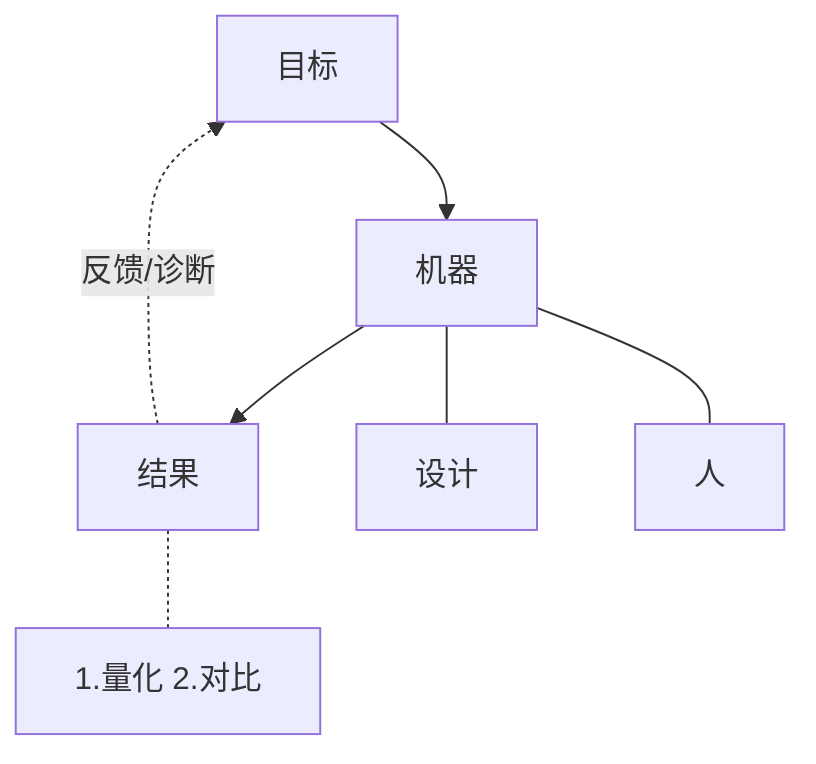
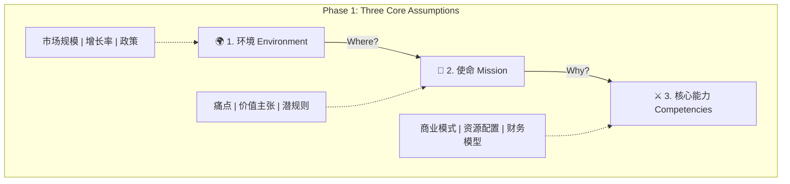
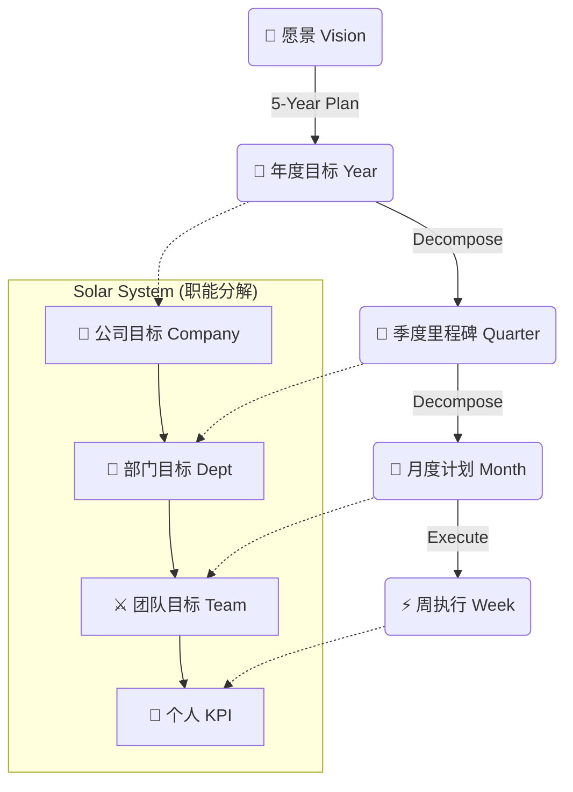
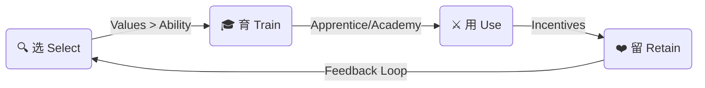
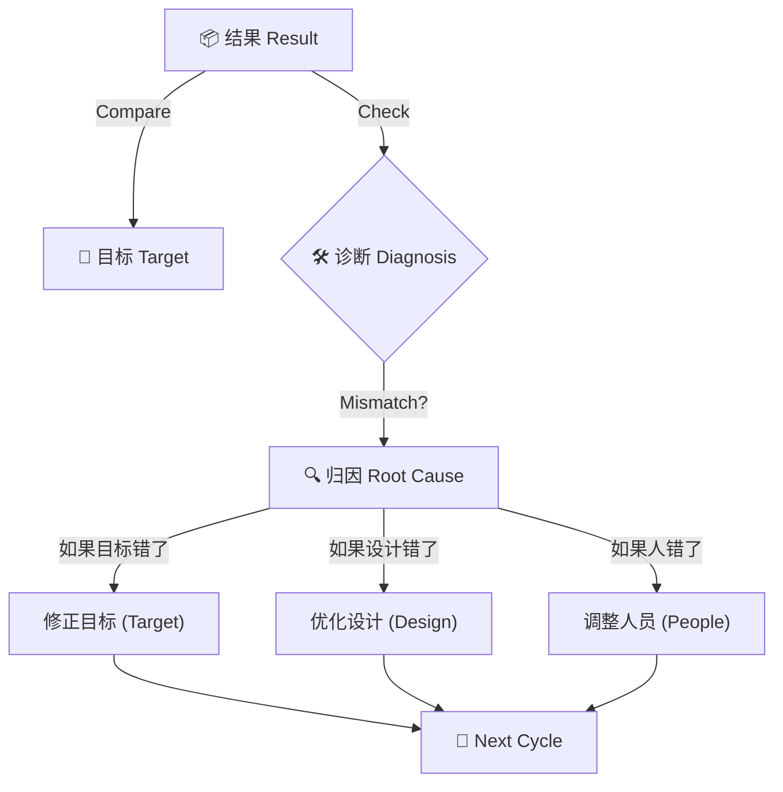

# 1.0_Core_Framework (企业运作原理全解)

> **Tags:** `[Business]`, `[Management]`, `[System Arch]`
> **Date Added:** `2026-01-07`
> **Source Logic:** Peter Drucker's 3 Assumptions + System Engineering

## 1. Core Logic (核心逻辑)
企业不是一个为了“赚钱”而随机存在的组织，它是一台为了服务特定目标而被精密设计出来的**机器**。
其运作的核心逻辑是：通过**[设计]**（规则流）与**[人]**（能量流）的物理结合，将资源转化为符合目标的结果。不仅仅是这台机器在跑，更重要的是不断的**[反馈与诊断]**——通过结果来反推是目标设错了，还是机器的设计或零件（人）出了问题。



```text
       [目标]
          │
          ▼
       [机器] ──────┬────── [结果] ── (1.量化 2.对比)
      ╱      ╲      │        │
     ▼        ▼     └──── (反馈/诊断) 
  [设计]    [人]             │
                             ▼
                        (回到目标)
```

---

## 2. Trigger Conditions (触发条件)
- **When (何时使用):**
    - **0-1 启动期:** 准备创建一家新公司，书写商业计划书 (BP) 时。
    - **诊断期:** 公司有营收但利润低，或人效低下（结果无法对标目标）时，用于排查是“设计”用了问题还是“人”出了问题。
    - **融资期:** 需要向资本市场清晰阐述商业逻辑与退出机制时。
- **Context (核心语境 - BP的真相):**
    - **BP不是给投资人看的，是给自己看的:**
        - 很多人误以为不融资就不用写BP。错。BP是你对自己思维逻辑的第一次全面“体检”。
    - **为什么必须自己看？**
        - 如果你这里有一个逻辑漏洞（Bug），在纸面上改只需要几分钟。
        - 但如果带着这个 Bug 投入市场，在未来的某一个时间节点，**这个错误会被市场无限放大**。
        - 届时，市场上所有“对的人”（你的客户、你的供应商、你的对手）都会因为这个 Bug 站在你的对立面，成为你的对手方。你会为此付出头破血流的代价。

---

## 3. Execution Flow (执行流程)

### Phase 1: 设定三大假设 (The 3 Drucker Assumptions)
*任何企业之所以能成立，仅仅是因为它对这三个问题做出了“暂时正确”的假设。*

#### Step 1.1: 组织环境假设 (Environment)
> **Question:** 你的盘子有多大？你到底在赚谁的钱？

1.  **市场规模 (Market Scale):**
    - 定义你的“盘子”。是几百亿的盘子，还是几千亿的盘子？这决定了天花板。
2.  **市场增长率 (Growth Rate):**
    - 既然盘子大，是否一定好？不一定。
    - 如果盘子大但增长率为负（夕阳产业），那是红海沉船。如果盘子小但增速极快（朝阳产业），那是机会。
3.  **市场份额 (Market Share):**
    - **格局判断:** 这个盘子里是已经被巨头垄断了（寡头市场），还是群雄逐鹿（充分竞争），还是像蓝海一样没人？
    - **切割逻辑:** 你凭什么能切走这一块？
4.  **相关政策法规 (Regulations):**
    - **深层理解:** 政策法规不仅仅是限制，它是**“另一维度的市场意志”**。
    - 它可能代表国家意志或行业协会意志。政策变动不仅打击你，也打击你的对手。利用好政策，由于合规成本的存在，它反而能成为你的护城河。
5.  **海外市场发展比较 (Overseas Comparison):**
    - **时间机器原理 (Time Machine Theory):**
        - 在发达市场（如美国）已经验证并流行的东西，在国内尚未流行。
        - **商机:** 将成熟市场的模式“搬运”到未成熟市场。如果不做搬运，这个观察也提供了“未来会发生什么”的确定性预测。

**Visual: Time Machine Logic**

```mermaid
graph LR
    US((Developed Mkt)) --"Copy Model"--> CN((Emerging Mkt))
    US --"Predict Future"--> CN
    style US fill:#222,stroke:#fff,stroke-width:2px
    style CN fill:#444,stroke:#0f0,stroke-width:2px
```


#### Step 1.2: 组织特殊使命假设 (Mission)
> **Question:** 为什么是你？你的存在对市场意味着什么合法性？

1.  **行业痛点 (Pain Points = Opportunity):**
    - **定义:** 痛点就是商机。
    - **商机校验三问:**
        - 1. 它真的痛吗？（还是伪需求）
        - 2. 已经有人满足它了吗？（如果有人做得很好，你为什么还要做）
        - 3. 有足够的复购吗？（是不是一锤子买卖）
2.  **价值主张 (Value Proposition):**
    - 你不是在卖产品，你是在卖“痛点的解决方案”。
    - 市场之所以给你现金，是对你的解决方案进行的**“对价”**。你解决了多大的痛，市场就给你多大的钱。
    
**Visual: Value Proposition Calculation**
```text
[ PAIN MAGNITUDE ]  x  [ SOLUTION ACCURACY ]  =  [ CASH VALUATION ]
(How much it hurts)    (How well you fix it)     (What they pay you)
```

3.  **使命、愿景、价值观 (The Trinity - 核心文化):**
    *很多人觉得这些虚，错。它们是组织内部最高效的“潜规则”。*
    - **潜规则逻辑:** 公司的规章制度不可能细化到每一个动作。当制度没有规定时，员工怎么做？**靠文化。**
    - **[使命 Mission]:**
        - **定义:** 你这家公司存在的先天合法性。为什么这个社会允许你活下去？因为你提供了正向价值。
        - **竞争:** 你的使命最好独一无二。如果你的使命和巨头一样，那你一出生就在和巨头抢饭碗。
    - **[愿景 Vision]:**
        - **定义:** 给内部人看的一张“具体的画”。
        - **例子:** “未来5年，我们要成为行业Top3。” 这是一个极具象的坐标，用来凝聚人心。
    - **[价值观 Values]:**
        - **定义:** 一起玩游戏的**隐形边界**。
        - **舆论武器:** 当某人行为不端但不违规时（如自私、甩锅），你无法用制度惩罚他，但可以用价值观引发“舆论”去攻击他、纠正他。
    - **[Critical - 第一人定律]:**
        - 什么是好的文化？在你招**第一个员工**时就注定了。
        - 如果你和第一个员工协作紧密、互补、争事不争功，第三个员工进来时，会模仿你们，这就形成了“好文化”。
        - 如果你们互相甩锅、推诿，第三个人也会迅速学会怎么甩锅。**基因一旦形成，极难修改。**

**Visual: Cultural DNA Transmission**

```mermaid
graph TD
    Founder[Founder 创始人] --"Behavioral Modeling"--> Employee1[1st Employee]
    Employee1 --"Replication"--> Employee3[3rd Employee]
    Founder --"Direct Influence"--> Employee3
    
    style Founder fill:#000,stroke:#f00,stroke-width:2px
    style Employee1 fill:#333,stroke:#fff
    style Employee3 fill:#555,stroke:#fff,stroke-dasharray: 5 5
```


#### Step 1.3: 完成使命所需核心能力假设 (Core Competencies)
> **Question:** 凭什么你能做成？你的手里有什么绝活？

1.  **商业/盈利模式:**
    - 你如何设计交易结构？你的触角怎么伸到客户口袋里？如果和对手完全一样，你就没有优势（除非你成本极低）。
2.  **竞对分析 (Competitor Analysis):**
    - 对手怎么赚钱？对手的软肋在哪里？
3.  **SWOT 分析:**
    - 优势 (Strengths)、劣势 (Weaknesses)、机遇 (Opportunities)、挑战 (Threats)。这不是填空题，是防止你思维遗漏的清单。
4.  **资源配置能力 (Resource Allocation):**
    - **社会学本质:** 社会结构 = **规则 + 资源**。
    - 掌握了资源，又能制定规则，就是掌握了**权力**。
    - **核心能力不完全等于资源:** 核心能力是你把一堆原材料（资源），通过加工，转化为独特产品和服务的能力。一定要产生 **1+1 > 2** 的增值效应。

**Visual: Power Formula**
```text
   [ RESOURCES ]  +  [ RULES ]  =  [ POWER ]
(Raw Materials)    (Algorithmic Control)
```

5.  **财务模型 (三件套):**
    - **打平周期:** 你投进去的钱，按现在的赚钱速度，哪一天能回本？之后每一天才是净赚。
    - **融资计划:** 即使现在不缺钱，也要规划分几轮融资？每一轮让出多少股份？估值逻辑是什么？
    - **退出机制 (Exit Strategy):**
        - 投资人不是慈善家，他们进来的目的就是为了退出（变现）。
        - 必须设计好退出路径（IPO? 并购? 回购?）。满足他们的时间偏好（有的玩短期，有的玩长期），才能实现**共赢**。

**Summary: The 3 Assumptions Matrix**
| Dimension | Key Question | Critical Factor | Failure Mode |
| :--- | :--- | :--- | :--- |
| **1. Environment** | 盘子有多大？ | Market Scale, Growth, Logic | **红海沉船** (夕阳产业) |
| **2. Mission** | 为什么是你？ | Pain Point, Culture, Trinity | **伪需求** (自嗨) |
| **3. Competencies** | 凭什么赢？ | 1+1>2 Resources | **平庸陷阱** (同质化) |



---

### Phase 2: 设计机器 (Designing The Machine)
*这是公司的骨架。设计决定了资源流动的效率。*

1.  **战略管理 (Strategy):**
    - **隐喻:** 就像一个人站在**半山腰**（现状），看着远方（未来）。
    - **战略目标:** 先选目的地。是去那片草地，还是去那座山头？
    - **战略视野:** 你能看多远？如果你只能看方圆5里，别人能看10里，别人的选择权就比你多。
    - **战略清晰度:** 你以为那是“水草丰美”的地方，用望远镜一看发现旁边是沼泽（风险）。清晰度不够会让你选错目标。
    - **战略路径:** 选好目标后，怎么走？
        - 要规划一条**路径 (Path)**。
        - 这条路要短（效率）、要省体力（成本）、要避开猛兽（竞争/风险）。
    - **战略分解 (Decomposition - 太阳图):**
        - 怎么把那个遥远的目标变成今天的动作？
        - **时间轴切割:** 5年战略 -> 1年目标 -> 季度里程碑 -> 月度计划 -> 周任务。
        - **职能轴切割:** 公司目标 -> 部门目标 -> 团队目标 -> 个人KPI。
        - *工具:* **太阳图 (Solar System Map)**（一种同心圆式的目标分解图，视觉化呈现每一层的承接关系）。

```text
        [ 5-Year Vision ]   <-- The Sun (Gravity Source)
               |
        [ 1-Year Goal ]     <-- Planet
               |
      [ Quarterly Milestone ]
               |
       [ Monthly Plan ]
               |
      [ Weekly Execution ]  <-- Satellite (Ground Zero)
```

2.  **治理结构:**
    - **股权设计:** 这是一个动态过程。随资源层（股东）的变化而变化。天下熙熙皆为利来，不同阶段需要不同资源，股东进进出出，股权结构要随之调整。
    - **公司章程:** 公司的宪法。
    - **议事规则:** 会怎么开？票怎么投？什么算通过？没有规则就会陷入无休止且低效的扯皮。

3.  **组织架构 (Structure):**
    - 公司的骨架。
    - **岗位图谱:** 基于部门职能，生成具体的岗位 (Position)。
    - **三定:** 定岗、定编、定责。
    - **指挥链:** 每个员工进来拿到 JD (岗位说明书)，必须清楚：
        - 我归谁管？
        - 我管谁？
        - 我怎么晋升？
        - 我的 KPI 从哪几项指标里提取？

4.  **支撑体系:**
    - **流程 (Process):** 解决跨部门协作的问题。没有流程，部门之间就是数据孤岛。
    - **信息管理:** 好的企业没有数据孤岛。数据的交互能产生 **1+1 > 2** 的价值。



---

### Phase 3: 注入灵魂 (The People)
*人是一切生产力的来源。只有人能发挥主观能动性，把死物变成活钱。*

#### Step 3.1: 选 (Select)
- **标准排序 (长期主义):** **价值观 > 能力 > 技能**。
- **为什么这么排？**
    - **技能 (Skills):** 只是术。可以教，可以练。
    - **能力 (Ability):** 底层素质（如学习力、逻辑）。虽然难改，但也能提升。
    - **价值观 (Values):** 对错的判断。如果价值观歪了（如吃回扣、出卖公司），能力越强，破坏力越大。
- **高阶选人指标:**
    - **格局:** 当部门利益和公司利益冲突时，是否愿意牺牲这一块肉，保全大局？有格局的人能做高管。
    - **韧性:** 逆商。遇到挫折是崩了还是扛得住？
    - **概念力:** 听不懂人话不行。概念力强意味着学习速度极快。

#### Step 3.2: 育 (Train)
*怎么把人培养出来？分两种流派。*

- **学徒制 (Apprentice - The Art Path):**
    - **适用场景:** **技术+艺术** 结合的行业。如医生、律师、管理咨询、匠人 (PSF Professional Service Firm)。
    - **逻辑:** 技术可以在学校学，但“艺术”的部分（火候、分寸、手感）无法言传，只能身教。
    - **代价:** 必须跟着师父大量时间观察、内化。**时间成本极高**，不可替代性极高。
- **学院制 (Academy - The Tech Path):**
    - **适用场景:** 标准化程度高的行业。技术为主。
    - **逻辑:** 既然是技术，写成手册，谁教都一样，甚至可以自学。可批量复制。

**Comparison: Art vs Tech Path**
| Feature | Apprentice (Art) | Academy (Tech) |
| :--- | :--- | :--- |
| **Core Logic** | 身教 (Internalization) | 手册 (Standardization) |
| **Content** | Nuance, Intuition, "Feel" | Procedures, Rules, Logic |
| **Cost** | High (Time/Energy) | Low (Scalable) |
| **Replaceability** | Low (Unique) | High (Commodity) |

#### Step 3.3: 用 (Use)
- **核心逻辑:** **激励相容**。
- **解释:** 不要指望员工大公无私。要设计一套机制，使得“员工为了自己赚钱的同时，顺便帮公司赚了钱”。
- **工具:** 绩效考核 + 年终评审。

#### Step 3.4: 留 (Retain)
- **手段:** 情感留人 + 待遇留人 + 晋升希望（给他画饼且能吃到）。
- **Cost Logic:**
    - 前面的“选”和“育”花费了巨大的隐性成本（时间、精力、试错）。
    - 如果人没留住，这些投入全部归零，变成**净亏损**。所以留人是止损。



---

### Phase 4: 结果与反馈 (Result & Feedback)
1.  **结果类型:**
    - **可量化结果:** 营收、利润、日活、市占率。直接看数字。
    - **不可量化结果:** 调性、氛围、品牌感。
        - *怎么量化？* **先天评分法**（设定一套S/A/B/C标准，强行量化）。
        - *怎么对比？* **属加种差**。找一个对标物（同行），看同类点是什么，不同点是什么，差异就出来了。
2.  **诊断逻辑:**
    - 把 [结果] 拿去对标最开始的 [目标]。
    - 一致？Good，继续扩大规模。
    - 不一致？这是**诊断**的开始：
        - 是我**目标**定得太离谱？（半山腰看错了）
        - 是我**设计**得一塌糊涂？（流程阻碍了人）
        - 还是我**人**没用对？（价值观不符、能力不够）
    - 找到原因，修正，进入下一个循环。

```text
[RESULT] vs [TARGET]
    |
    +-- Match? --> [SCALE UP]
    |
    +-- Mismatch? --> [DIAGNOSIS REQUIRED]
           |
           +-- Target Wrong? (Strategic Blindness)
           |
           +-- Design Wrong? (Process Friction)
           |
           +-- People Wrong? (Value/Skill Mismatch)
```



## 6. Anti-Patterns (反模式 - Teacher Mode)
*Common logical failures in system design.*

### Trap 1: The "Busy Fool" Trap (战术勤奋陷阱)
*   **Trap:** 团队每天加班到深夜，任务列表总是满的，但公司营收不增长。
*   **Why:** 陷入了 **Strategic Laziness (战略懒惰)**。只顾着“低头拉车”（执行），忘了“抬头看路”（战略）。做了一堆正确但无关紧要的事。
*   **Fix:** **Stop & Think**. 强制引入“战略暂停”。回到太阳图 (Solar System Map)，问自己：我今天做的这件事，到底指向哪一个季度的里程碑？如果连不上，**直接砍掉**。
*   **Positive Real Scenario (正向实例):**
    *   **Steve Jobs (1997 Return):** 乔布斯回归苹果时，苹果有几百个产品线。大家都在忙着改进每一个产品。
    *   **Action:** 乔布斯画了一个 2x2 矩阵 (Pro/Consumer x Desktop/Laptop)，砍掉了 70% 的产品线。
    *   **Result:** 苹果起死回生。不做“更多”，只做“更少但更好”。

### Trap 2: The "Toxic Competence" Trap (有才无德陷阱)
*   **Trap:** 为了短期业绩，招聘了能力极强但价值观极差（如抢单、内斗）的 Sales Top，并容忍他的行为。
*   **Why:** 贪图 **Short-term Gain (短期利益)**，忽略了 **Cultural Debt (文化负债)**。“第一人定律”告诉我们要慎重，坏榜样会被无限复制。
*   **Fix:** **Zero Tolerance (零容忍)**。必须挥泪斩马谡。开除一个 Top Sales 的震慑力，远大于奖励十个听话的员工。这向全员传递了最强的文化信号。
*   **Positive Real Scenario (正向实例):**
    *   **Netflix (Culture Deck):** 网飞著名的文化手册里明确写着："No Brilliant Jerks" (不要天才混蛋)。
    *   **Action:** 无论你技术多牛，只要破坏团队协作，立刻给高额遣散费走人。
    *   **Result:** 维持了极高的人才密度和极低的内部摩擦成本，创造了流媒体帝国。

### Trap 3: The "Paper General" Trap (纸上谈兵陷阱)
*   **Trap:** BP 写得完美无缺，战略图画得像艺术品，但迟迟不肯下场干活，总觉得“没准备好”。
*   **Why:** **Analysis Paralysis (分析瘫痪)**。试图在真空中推演所有变量，恐惧真实世界的反馈。
*   **Fix:** **MVP (Minimal Viable Product)**。承认三大假设只是“假设”，必须用最小的成本扔到市场上验证。
*   **Positive Real Scenario (正向实例):**
    *   **Dropbox:** 创始人想做云存储，但开发太难。
    *   **Action:** 他没有写一行代码，而是拍了一段 3 分钟的 **Demo Video** (假装做好了) 发到网上。
    *   **Result:** 一夜之间几十万注册。这证实了“痛点”真实存在，然后才开始融资招人写代码。用最低成本验证了最核心的假设。

## 7. Tools & Resources (工具与资源)
- **Visual Tools:** 太阳图 (Solar System Map) - *战略逐层分解神器*.
- **Frameworks:**
    - 德鲁克三大假设 (Drucker's 3 Assumptions).
    - SWOT / PEST / 波特五力.
- **Documents:**
    - **BP:** 你的逻辑自检报告。
    - **JD:** 员工的操作手册。
    - **章程:** 公司的宪法。

## 5. Notes (备注)
- **关于“成功学”与“幸存者偏差”:** 很多时候成功是因为运气（踩中了风口），但**失败一定是有逻辑漏洞的**。这套系统就是为了帮你封堵那些显而易见的逻辑漏洞。
- **关于初创团队:** 创始人的天花板就是企业的天花板。创始人的格局（舍小我）决定了能聚多少人。
