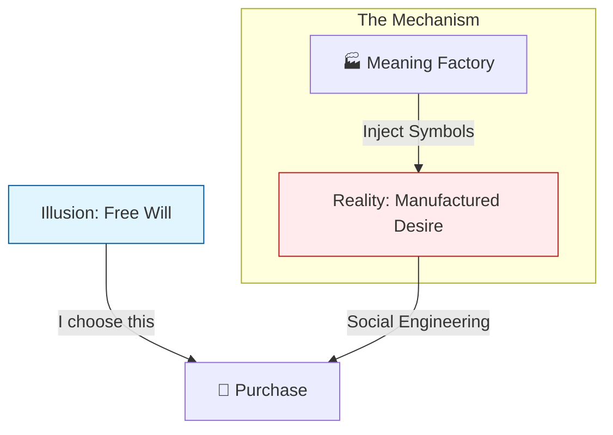
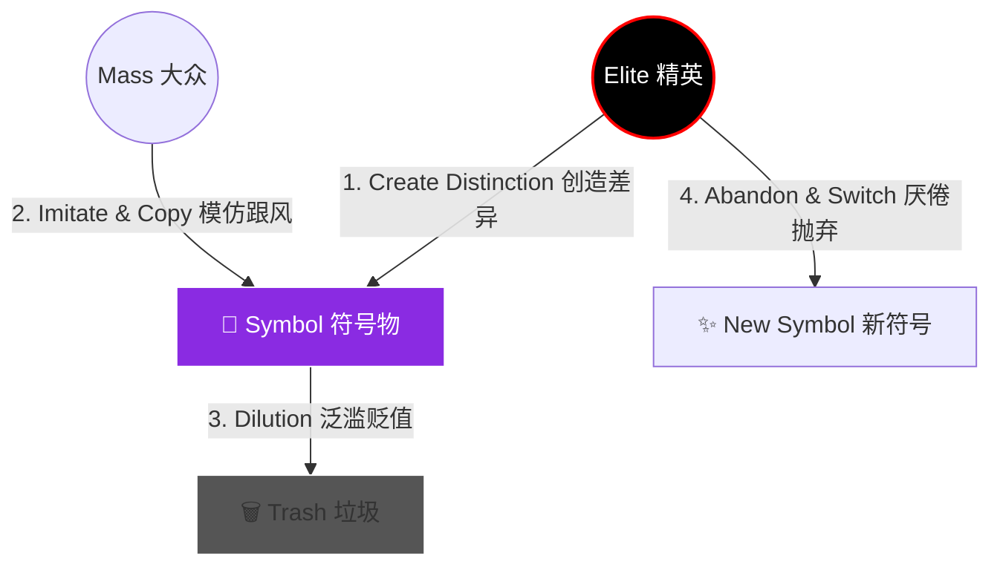
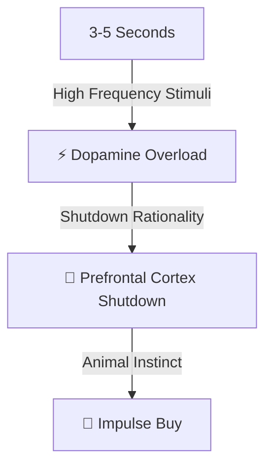
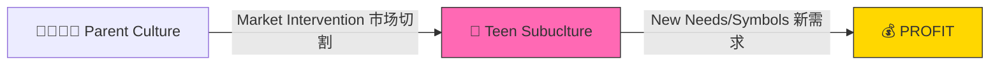
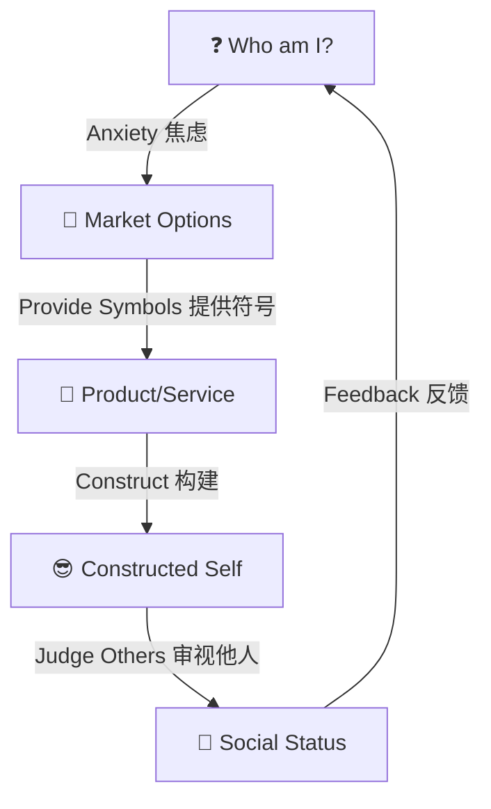
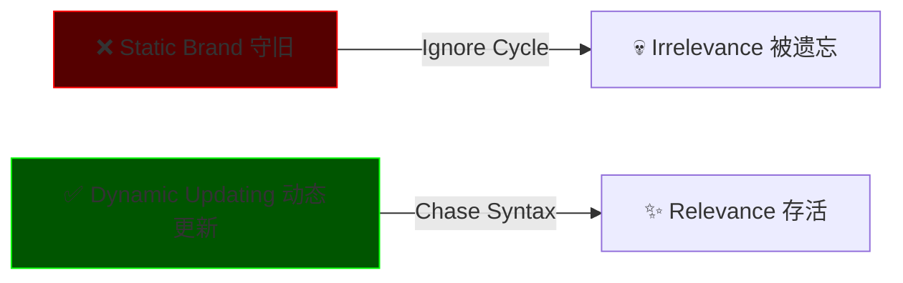

# 1.1_Market_Psychology (消费者心理与符号政治)

> **Tags:** `[Marketing]`, `[Psychology]`, `[Sociology]`
> **Date Added:** `2026-01-07`
> **One-Liner (核心本质):** 消费者不是天然存在的，而是被**制造**出来的。商业的终极形态是运用“社会工程”和“符号价值”构建一套迫使个体不断追求差异化的强迫体系。

---

## 1. The Origins (起源: 谁是市场先生？)

### 1.1 背景与视角 (The Consultant's View)
Up主曾任职于顶级跨国战略咨询公司 (Strategy Consulting)，这与大众熟知的管理咨询 (Management Consulting) 有本质区别。
*   **战略咨询 (Strategist):** 解决“去哪里”的问题。通常直接服务于资本方，在收购一家公司后进场。
*   **核心动作 - "Cleaning and Shuffling" (清洗与洗牌):**
    *   **Cleaning:** 确保核心资源（如客户名单、核心技术）不会流失。
    *   **Shuffling:** 强制改变企业文化，注入资方意志。
    *   *Nuance:* 这就像给这就房子换一个新的主人，但家具(中层)和地基(底层)可能保留，但生活方式(文化)必须完全重置。
这种“上帝视角”让我们得以窥见商业运作中最冷酷、最底层的逻辑：商业不讲温情，只讲效率和控制。

**Visual 1: Strategy vs Management (Role Definition)**
| 维度 | Strategy Consultant (战略) | Management Consultant (管理) |
| :--- | :--- | :--- |
| **Client** | 资方/董事会 (Capital/Board) | CEO/高管层 (Ops/Execs) |
| **Goal** | **Define the Game** (制定规则/方向) | **Play Better** (提升效率/执行) |
| **Action** | M&A, Market Entry, Restructuring | Process Opt, KPI, Digital Trans |

### 1.2 市场先生的真面目 (Mister Market)
我们常说 "Mister Market" (市场先生)，仿佛它是一个客观存在的物理场所。错。
**市场是无数消费者心理活动的集合体 (A Collection of Psyches)。**
*   **The Warning:** 如果你不试图理解消费者心理，你的产品再好也只是“自嗨” (Onanism)，最终会撞得头破血流 (南墙)。
*   **The Core Truth:**
    *   稀缺 (Scarcity) 是被制造出来的。
    *   **消费者 (Consumer) 也是被制造出来的。**
    *   这是一套被称为 **"最复杂的强迫和控制体系"** 的社会工程。

**Visual 2: The Reality of Market (Illusion vs Truth)**


---

## 2. The Cycle of Doom (宿命: 绝对周期率)
为什么没有任何网红单品能永生？为什么 Nike、Supreme、Starbucks 必须像西西弗斯一样不断推出新品？
这不仅仅是流行气象学，这是 **商品动力学 (Product Dynamics)** 的铁律。

### 2.1 供给侧的命运由需求决定
这一章的核心是解答：**为什么流行总是会过气？**
答案在于 **符号传播的熵增 (Entropy)**。任何符号一旦被创造出来，就开始走向耗散。

### 2.2 循环机制 (The Mechanism: Trickle-Down)
基于齐美尔 (Simmel) 的“涓滴理论” (Trickle-Down Theory) 和罗杰斯的“创新扩散理论”。这是一个始乱终弃的残酷过程：

1.  **精英 (Elite) 的逃离:** 精英阶层为了确立自己的统治地位和社会身份，必须使用“大众难以获得”的符号（稀缺的包、晦涩的艺术）。
2.  **大众 (Mass) 的模仿:** 小资产阶级和大众为了获得某种幻觉上的“阶级跃迁”，会疯狂模仿精英的符号。
3.  **泛滥 (Saturation):** 当山寨和仿制品出现，符号变得唾手可得时，它就丧失了“差异化价值”。
4.  **寂灭 (Abandonment):** 精英发现这东西“烂大街”了，感到厌恶，将其抛弃，转而寻找下一个新符号。

**Visual 3: The Cycle of Doom (Absolute Cycle)**


> **Case Study: 始祖鸟 (Arc'teryx) 的周期宿命**
> *   **Phase 1 (Elite):** 最初，它是硬核户外老炮和硅谷新贵的“掌上明珠”。穿着它意味着“我懂行”、“我有钱且低调”。
> *   **Phase 2 (Mass):** 突然爆火，成为“中年人三宝”。大街小巷全是始祖鸟。
> *   **Phase 3 (Death):** 真正的精英看到满大街的鸟，为了避免被误认为跟风，他们会立刻停止穿着。始祖鸟的“符号价值”在此刻归零。
> *   **Lesson:** 所有的网红单品必死，因为它们都逃不过这个周期。

**Visual 4: Innovation Diffusion Curve (The Roles)**
```text
     [Innovators]      [Early Adopters]       [Early Majority]       [Laggards]
          |                   |                       |                   |
    (Dandies/Artists)    (Followers/KOLs)          (The Mass)          (Outdated)
     Create Style        Learn Syntax             Copy Style          Don't Care
     (发明风格)           (学习语法)               (盲目跟风)           (后知后觉)
```

---

## 3. The Mechanism (机制: 鲍德里亚的符号价值)
我们买的到底是什么？为什么三无产品和贴牌的大牌，物理属性完全一样，价格却差100倍？
法国思想家 **Jean Baudrillard (鲍德里亚)** 的符号物三部曲为我们解开了这个谜题。

### 3.1 价值三部曲 (The Trilogy of Value)
商品不仅有物理属性，更有社会属性。

**Visual 5: The Trilogy of Value (Deep Dive)**
| 维度 | 定义 | 例子 (爱马仕包) | 逻辑基础 | 关键点 |
| :--- | :--- | :--- | :--- | :--- |
| **1. 使用价值 (Use Values)** | 物品的功能性。 | 能装东西，结实。 | **物理学** | "Is it useful?" (Utility) |
| **2. 交换价值 (Exchange Value)** | 物品的市场价格。 | 标价 100,000 元。 | **经济学** | "Is it expensive?" (Price) |
| **3. 符号价值 (Sign Value)** | **物品的社会差异性。** | "这是身份的象征。" | **社会学** | "Does it make me DIFFERENT?" (Status) |

> **Nuance:** 在现代消费社会，我们购买的绝大多数溢价，都是在为 **Sign Value (符号价值)** 买单。

### 3.2 风格语法 (Style Syntax)
如果你有了符号，你如何组合它们？这就需要“语法”。
*   **吃穿住行** = 词汇 (Vocabulary)。
*   **风格 (Style)** = 句子 (Sentences)。
*   **语法 (Syntax)** = 组合的规则。

谁掌握了语法，谁就掌握了话语权。

**Visual 6: The Creators of Syntax**
| 角色 | 定义 | 行为逻辑 | 典型案例 |
| :--- | :--- | :--- | :--- |
| **Dandies (丹第主义者)** | 极其讲究的纨绔子弟。 | **Invent Style (发明风格)** | 19世纪英国的 Beau Brummell。 |
| **Bohemians (波西米亚)** | 艺术家，流浪者。 | **Create Lifestyle (创造生活)** | 巴黎左岸的艺术家。 |
| **Followers (跟随者)** | 高效学习者。 | **Chase Syntax (拼命追赶)** | 现在的时尚博主、KOL。 |
| **Laggards (后知后觉)** | 大多数普通人。 | **Adopt Late (捡剩下的)** | 广场舞大妈穿的曾经的潮牌。 |

---

## 4. The Engineering (工程: B端如何制造消费者?)
如果说符号学是原理，那么 **工程学 (Engineering)** 就是手段。
B端企业通过两条引力线来控制大众：**社会工程 (Social Engineering)** 和 **符号工程 (Symbolic Engineering)**。

### 4.1 社会工程 (Social Engineering)
这是一门被严重低估的学科，起源于勒庞 (Le Bon) 的《乌合之众》和 Tarde (塔尔德) 的群体心理学。
核心逻辑：**Manipulating Probability (操纵可能性)**。通过制造情境，让群体“自动”做出你想要的选择。

**Visual 7: Timeline of Manipulation**
```text
[ Gustave Le Bon ] --> [ Ivy Lee ] --> [ Edward Bernays ] --> [ CPI (1917) ]
(群体心理学原理)      (现代公关起点)    (公关之父/制造情境)    (威尔逊总统/战时宣传)
                                                                 |
                                                                 v
                                                         { 4-Minute Men }
                                                         (4分钟演讲志愿者)
                                                         (KOL的雏形)
```
> **Deep Dive: 4-Minute Men**
> 1917年，美国CPI组织招募了75,000名志愿者（4-Minute Men），在电影院换胶片的4分钟空隙，向观众发表爱国演讲。这不仅是KOL的雏形，更证明了 **"Context (情境)" + "Peer Pressure (社交压力)"** 的洗脑威力。

### 4.2 符号工程 (Symbolic Engineering)
核心动作：**Meaning Mounting (意义挂载)**。
*   **Problem:** 消费者脑中的观念 (Idea) 和信条 (Belief) 是根深蒂固，像岩石一样，你是改变不了的。
*   **Solution Strategy:** 不要试图改变它，要去**利用 (Utilize)** 它。把大家已经相信的概念（自由、爱国、性感、母爱）**转移**到你的商品上。

**Visual 8: Meaning Mounting Process**

> **Nuance:** 广告的作用不是介绍产品功能，而是完成这次 **"价值转移" (Value Transfer)**。

### 4.3 媒体矩阵 (The Media Matrix)
媒体的三大功能构成了意识生产的流水线。

**Visual 9: The Media Evolution Matrix**
| 时代 | 形式 | 核心功能 | 心理机制 | 效果 |
| :--- | :--- | :--- | :--- | :--- |
| **1.0 杂志** | 图片 (Image) | **消费教育** | 灌输新词汇、新标准、**新焦虑**。 | "我不够好，我需要买这个。" |
| **2.0 电影** | 影像 (Cinema) | **商品平常化** | **感官剥夺 (Sensory Deprivation)**。 | "这很正常，我也要这样生活。" |
| **3.0 短视频** | 碎片 (Clips) | **社会想象** | **多巴胺过载 (Dopamine Overload)**。 | "不管了，现在就想要！" (Impulse) |

**Visual 10: Cinema Mechanism (Deep Dive)**


**Visual 11: Short Video Mechanism**


> **Case Study: The Invention of Teenagers (青春期的发明)**
> 1950年代之前，并没有 "Teenager" 作为一个独立的消费阶层。孩子之后就是小大人。
> 市场为了创造新的消费增长点，**发明**了 Teenager 这个概念，灌输独立、叛逆、摇滚乐等符号，硬生生把孩子从父母的文化中 **撕裂 (Split)** 出来，创造了一个巨大的消费缺口。

**Visual 12: Creating a Market (The Teenager Invention)**


---

## 5. The Consumption (C-Side: 个人如何构建自我?)
C端面临的是：**不透明性 (Opacity)** 和 **差异体制 (Difference Regime)**。

### 5.1 不透明性与符号依赖
我们无法判断商品的真实价值（原材料/工时）。
**Result:** 我们被迫依赖“符号价值”来判断交换逻辑。

**Visual 13: Opacity Trap**
```text
[ Product ] --> [ No Brand ] --> Value = ??? (Unknown, High Risk)
[ Product ] --> [ Supreme ]  --> Value = $$$ (High Value, Low Risk)
Conclusion: We buy the LOGO because we can't judge the LABOR.
```

### 5.2 自我构建 (Self-Construction)
现代社会中，自我不是既定的，而是一个 **"Permanent Project" (永久性项目)**。
我们通过消费来回答 "我是谁"。

**Visual 15: The Self-Loop**


---

## 6. Anti-Patterns (反模式 - Teacher Mode)
本章节旨在通过“逆向工程”，帮助你识别并避开那些看似正确实则致命的商业陷阱。

### Trap 1: The Use-Value Trap (物理价值陷阱)
*   **Trap:** 拼命在营销中强调“我的原材料多好”、“我的工艺多复杂”、“我的成本多高”。
*   **Why (Psychology):** 创始人和工程师往往有“工匠思维”，认为好东西自然有人买。但在消费者眼中，所有产品都是 **不透明 (Opaque)** 的。他们根本看不出 100支棉 和 200支棉的区别，除非你告诉他这代表了什么“身份”。
*   **Fix:** 停止解释物理属性 (Physics)，开始构建符号价值 (Metaphysics)。告诉消费者：使用了这个产品，他/她会成为**谁**。
*   **Positive Real Scenario (正向实例):**
    *   **De Beers Diamonds:** 钻石在物理上只是碳。但在1947年之前，它并不昂贵。De Beers 没有解释“硬度”，而是制造了 "A Diamond is Forever" (钻石恒久远) 的符号。
    *   **Result:** 他们通过符号工程，创造了千倍的溢价，让全世界男人相信：**不买钻石 = 不爱她**。这是人类历史上最成功的符号植入。
*   **Visual:** Engineer vs Marketer
    | Dimension | Engineer (Wrong) | Marketer (Right) |
    | :--- | :--- | :--- |
    | Focus | Materials/Specs | Identity/Feeling |
    | Message | "We used T6 Aluminum." | "You are an explorer." |

### Trap 2: The Authenticity Trap (真实性陷阱)
*   **Trap:** 认为品牌宣传必须绝对真实，甚至因为一点瑕疵而不敢宣传。
*   **Why:** 勒庞和伯辉斯告诉我们，大众关心的不是 **Fact (事实)**，而是 **Belief (信念)** 和 **Sentiment (情绪)**。
*   **Fix:** **Manufacture Context (制造情境)**。利用“4-Minute Men”式的 KOL，利用“意义挂载”，去构建一个让消费者愿意相信的故事。信念比事实更有力量。
*   **Positive Real Scenario (正向实例):**
    *   **Crocs (洞洞鞋):** 它丑吗？客观上很丑。如果是“真实性陷阱”，Crocs 应该道歉并改设计。
    *   **Action:** 它们反其道而行之，制造了 "Ugly is Beautiful" (Ugly Comfort) 的情境。
    *   **Result:** 它把“丑”重新定义为“自信”和“松弛感”的符号。现在穿 Crocs 代表你足够自信，不在乎他人眼光。

### Trap 3: The Static Brand Trap (守旧陷阱)
*   **Trap:** 认为品牌定位一旦确定就不能变，“我们要坚持初心”。
*   **Why:** 忽略了 **Cycle of Doom (绝对周期率)**。符号必然熵增，必然泛滥，必然过气。今天的酷，明天就是土。
*   **Fix:** 必须像“追赶时尚”一样，不断更新你的“风格语法”。在波峰消退前，制造下一个波峰。
*   **Positive Real Scenario (正向实例):**
    *   **Supreme:** 作为一个街头品牌，理应在3年内过气。
    *   **Action:** 疯狂的 **Collab (联名)**。从 LV 到 地铁卡，从 砖头 到 奥利奥。
    *   **Result:** 它通过不断借用其他领域的“最新符号”，强行延续了自己的寿命。它不是在卖衣服，它是在卖“此时此刻的注意力”。

**Visual 16: The Static Brand Trap**


---

## 7. Glossary (术语表)
*Define technical terms in plain language.*

*   **Mister Market (市场先生):** 并非一个真实的人，而是无数消费者心理活动的集合体，也是最大的不可控变量。
*   **Symbolic Value (符号价值):** 区别于好用(使用价值)和值钱(交换价值)，指用了这个东西能证明"我是谁"的社会价值。
*   **Style Syntax (风格语法):** 像语言一样，把衣服、车子、生活方式组合起来的一套规则。懂规则的人看起来像老钱，不懂的像暴发户。
*   **Trickle-Down (涓滴理论):** 流行趋势像水一样，从上流社会滴落到大众，一旦滴到底层，上流社会就会关水龙头换地方。
*   **Sensory Deprivation (感官剥夺):** 电影院关灯不是为了制造氛围，而是为了屏蔽除了视觉以外的信号，让人更容易被洗脑。
*   **Meaning Mounting (意义挂载):** 也就是把“自由”这个词贴在“吉普车”上，让你觉得买了车就买了自由。

## 备注与引用 (Notes & References)
*   **Source:** Up主视频 Transcript (哲学/商业/消费者心理).
*   **Key Concept:** "The consumer is manufactured." (消费者是被制造出来的).
