# 1.2_Solopreneur_System (一人公司系统工程)

> **Tags:** `[Business]`, `[Passive Income]`, `[System Design]`, `[AI Leverage]`
> **Date Added:** `2026-01-08`
> **Source Logic:** 艺人公司运作原理 (Up主 Transcript)

## 1. Core Logic (核心逻辑)

一人公司 (Solopreneur / 艺人公司) 的本质不是"一个人干所有事"，而是**用系统、人工智能或他人的时间，来替代你自己的时间**。

人这一生最稀缺的资源是**时间**，因为它不可复制、不可存储、不可购买。想要同时拥有"自由"和"被动收入"，你唯一的路径是：**把自己从执行层面解放出来**。

一人公司不是一蹴而就的，它是一个**从极度主动到逐渐被动的系统工程**：

* **系统 (System):** 杂多复杂事物的有机集合。系统 = 门槛。不是每个人都能构建这样的机器。
* **工程 (Engineering):** 可以被人为设计、可以通过学习减少试错、可以在贝叶斯优化中找到最短路径。工程 = 可复制性。

```mermaid
graph TD
    You["👤 你 (创始人)"] -->|投入时间| Active["⚡ 主动收入"]
    You -->|构建系统| System["⚙️ 系统"]
    System -->|替代你| Passive["💰 被动收入"]
  
    Active -.->|消耗| Time["⏳ 时间 (不可再生)"]
    Passive -.->|解放| Freedom["🏖️ 自由"]
  
    style You fill:#333,stroke:#fff
    style Active fill:#550000,stroke:#f00
    style Passive fill:#005500,stroke:#0f0
```

**关于"一人公司是伪命题"的反驳：**
任何伟大的公司，在最开始的时候，又何尝不是一个人或几个人呢？真正做战略选择的"实际控制人"，在任何公司里其实都只有一个。**骗局与商业的本质区别在于：是否虚构事实、是否交付价值——而不在于人数。**

---

## 2. Trigger Conditions (触发条件)

### Route 1: 一人公司路线 (Solopreneur Path)

* **When:** 你发现了一个可以**一己之力验证**的商业模式，不需要大规模资本介入，可以从 0 开始靠自己跑通闭环。
* **Goal:** 构建一个能够自我运转、产生现金流、**不需要你时时刻刻介入**的被动资产。
* **Exit:** 持有分红 或 以 3-5x 年利润价格出售。

### Route 2: 万人敌路线 (Capital Path)

* **When:** 你发现了一种商业模式，但它要么**无法一己之力验证**，要么**已经出现在大厂的视野里**，你一出场就面临血战。
* **Goal:** 需要资本的力量，需要更高维度的意志（重新制定游戏规则），需要压制既得利益者。
* **Requirement:** 融资三件套 (BP, Financial Model, Exit Strategy)。*详见 [1.0_Core_Framework.md](./1.0_Core_Framework.md)*

```text
                    ┌───────────────────────────────────────┐
                    │         商业机会 (Opportunity)          │
                    └───────────────────┬───────────────────┘
                                        │
                    ┌───────────────────┼───────────────────┐
                    ▼                                       ▼
          ┌─────────────────┐                   ┌─────────────────┐
          │   Route 1       │                   │   Route 2       │
          │  一人公司路线     │                   │  万人敌路线      │
          │  (Solopreneur)  │                   │  (Capital)      │
          ├─────────────────┤                   ├─────────────────┤
          │ ✅ 可独立验证     │                   │ ❌ 需资本验证     │
          │ ✅ 竞争不激烈     │                   │ ❌ 大厂已入场     │
          │ ✅ 边际成本低     │                   │ ❌ 烧钱换规模     │
          └─────────────────┘                   └─────────────────┘
```

---

## 3. Execution Flow (执行流程 - Route 1)

*路线一的从 0 到 1，分为四个阶段。顺序至关重要，切勿跳步。*

### Phase 1: Selection & Validation (选品与验证) `0 → 0.1`

> **目标:** 找到一个可以脱钩时间的高利润模型，并验证其真实需求。
> **角色:** 产品经理 + 销售
> **关键产出:** 一个被市场验证过的 Idea + 第一笔正向现金流

#### Step 1: 选择高杠杆商业模式

**核心原则:** 不要选择单纯靠卖时间的生意（如按小时计费的咨询、外包），这些生意极难被动化。你需要选择**边际成本趋近于零 (Marginal Cost → 0)** 或**极易标准化**的模式。

**什么是边际成本？** 每多生产一份产品或服务，你所投入的额外成本。咨询的边际成本接近恒定（每次咨询都要花同等时间），而数字产品的边际成本趋近于零（开发一次，无限销售）。

**高杠杆模式清单:**

| 模式                       | 描述                       | 边际成本 | 例子                   |
| :------------------------- | :------------------------- | :------- | :--------------------- |
| **SaaS / 数字产品**  | 软件、电子书、课程、会员站 | 趋近于 0 | Notion, Udemy 课程     |
| **内容 IP / 流量站** | 短视频、博客、垂类网站     | 趋近于 0 | 抖音/B站流量主         |
| **产品化服务**       | 固定价格、固定范围的服务包 | 低       | 500元/月无限 Logo 设计 |
| **自动化电商**       | Dropshipping, 无货源       | 低       | 小红书带货             |

#### Step 2: MVP 最小可行性验证

**核心原则:** 不要先注册公司、租办公室、或开发完美产品。这些都是成本，与验证无关。

**动作:**

1. **做一个简单的 Landing Page (落地页):** 描述你的价值主张 (Value Proposition)。不需要真正的产品，只需要展示"如果你买了会得到什么"。
2. **投放测试:** 在公域流量池（如抖音、小红书）投放少量广告，或在私域（朋友圈、社群）推广。
3. **观察:** 是否有人愿意付费？

**决策规则:**

* ✅ 有人买 → Validated (进入 Phase 2)
* ❌ 没人买 → **立刻换方向**。不要在没有人要的东西上构建系统。

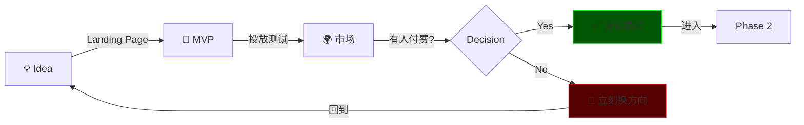

---

### Phase 2: Build & Standardize (构建与标准化) `0.1 → 0.5`

> **目标:** 完成初始交付后，将所有操作流程化、标准化。
> **角色:** 全能执行者 (**最辛苦的阶段**)
> **关键产出:** 一套完整的 SOP (Standard Operating Procedure) 文档库

#### Step 3: 亲力亲为完成初始闭环

在初期，你既是客服，又是销售，还是交付，还是财务。**目的不是为了省钱，而是为了搞清楚每一个环节的细节**——这是未来 SOP 的基础。

> **给我一个支点，我就可以撬动地球。** 如果公司的规模是杠杆，那么 **SOP 就是支点**。没有这个支点，你什么都撬不起来。

**积累:**

* 收集客户的常见问题 (FAQ)
* 优化交付流程
* 积累第一批好评 (Social Proof)

#### Step 4: 建立 SOP 标准作业程序库

**这是你的公司从"个体户"变成"资产"的关键转折点。** 你必须把脑子里的经验变成可执行的文档。

**文档化规则:** 任何重复超过 **3 次**的工作，都必须写成文档或录制成视频。保存到云盘，做好物理备份。（*曾有公司因失火导致上市推迟多年。*）

**SOP 结构 (最小闭环):**

```text
┌────────────────────────────────────────────────────────────┐
│                     SOP Documentation                      │
├──────────────┬──────────────┬──────────────┬───────────────┤
│   获客       │    转化      │    交付      │    售后       │
│  (Traffic)   │   (Sales)    │  (Delivery)  │  (Support)    │
├──────────────┼──────────────┼──────────────┼───────────────┤
│ 流量来源     │ 销售话术     │ 执行步骤     │ 问题处理      │
│ 投放渠道     │ 异议处理     │ 质量标准     │ 退款流程      │
│ 内容策略     │ 报价逻辑     │ 交付时间     │ 客诉升级      │
└──────────────┴──────────────┴──────────────┴───────────────┘
```

**SOP 有效性测试:** 找一个新手，让他完全按照你的 SOP 来操作。如果他能做到你 **80% 的效果**，说明你的 SOP 合格了。

---

### Phase 3: Automation & Outsourcing (自动化与外包) `0.5 → 0.9`

> **目标:** 用工具和团队替代你自己，让你从"亲手做业务"转变为"动脑子设计业务"。
> **角色:** 架构师 + 招聘官
> **关键产出:** 自动化工作流 + 外包团队

*劳心者制人，劳力者制于人。*

#### Step 5: 部署自动化工具 (AI 杠杆)

人工智能比人便宜，而且不用休息。以上海为例，按国家法规，一个员工的最低成本（工资+五险一金）至少 5400 元/月。这笔钱可以购买大量的大模型 Token。

**核心工具:**

* **连接器 (Connectors / Zapier / n8n):** 连接你的各个软件。例如：客户付款 → 自动发短信 → 自动开通权限 → 自动记账。
* **营销自动化 (Marketing Automation):** 设置自动邮件/消息序列，自动培育潜在客户 (Lead Nurturing)。

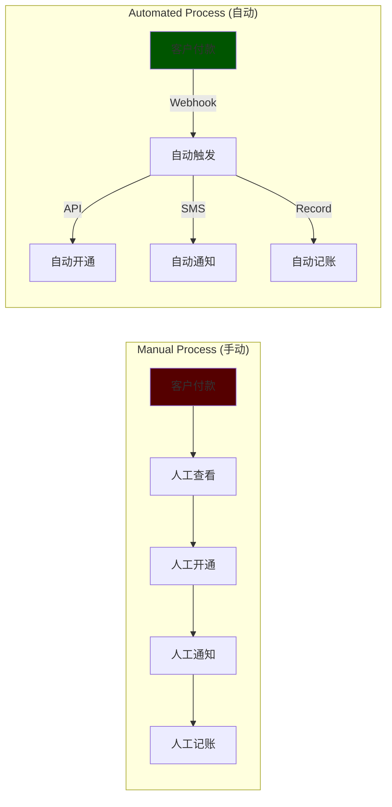

#### Step 6: 搭建最小化团队 (人力杠杆)

把机器做不了的、低价值的、重复性的工作外包出去。

**雇佣原则:**

* **不要雇佣昂贵的全职专家。** 先从虚拟助理 (VA) 或兼职实习生开始。
* **任务分配:** 把你之前写好的 SOP 交给他们执行。

**角色升级:** 你现在的角色已经升级到"救火队员 + 质量检查员"，而不再是苦逼的牛马了。

---

### Phase 4: De-founder & Exit (去创始人化与退出) `0.9 → 1.0`

> **目标:** 切断公司对你的依赖，实现真正的被动。让制度管理，而不是你这个人去管理。
> **角色:** 董事长 / 投资人
> **关键产出:** 运营负责人 + 阅读报表的能力

#### Step 7: 聘请运营负责人

当你有了稳定的现金流，你需要雇佣一个项目经理或运营总监，把你上一步做的事情（管理 VA、处理异常、跟踪 KPI）彻底交给他。

**赋权 (Empowerment):**

* 给他决策权，让他处理 99% 的问题。
* 你只看月度报表。

**关于犯错:**

* 是人就会犯错。他又不是那个从零跑通闭环的人（如果他自己跑通了，他还给你打工干嘛？）。
* **允许他犯错，允许他学习。** 但要提前告诉他哪些错误是**绝对不可以犯的**（红线），以及犯了会付出什么代价。把这些固定在合同文本里，在合理对价的前提下，取得他的认可。
  * *不合理对价，法律不认可。他不认可，合作无法达成。*

#### Step 8: 压力测试 (Stress Test)

**动作 (最爽的阶段):**

1. 尝试**消失 1 周**。不看飞书、企微，不回消息。（可以看，但不要回。保持实验环境纯净。）
2. **观察 (最痛苦的动作):** 回来后，看公司是否还在运转。哪里崩了？哪里垮了？
3. **修复漏洞:** 崩溃的部分通常是 **SOP 缺失** 或 **权限不足**。
4. **重复:** 消失 1 周成功后，尝试**消失 1 个月**。

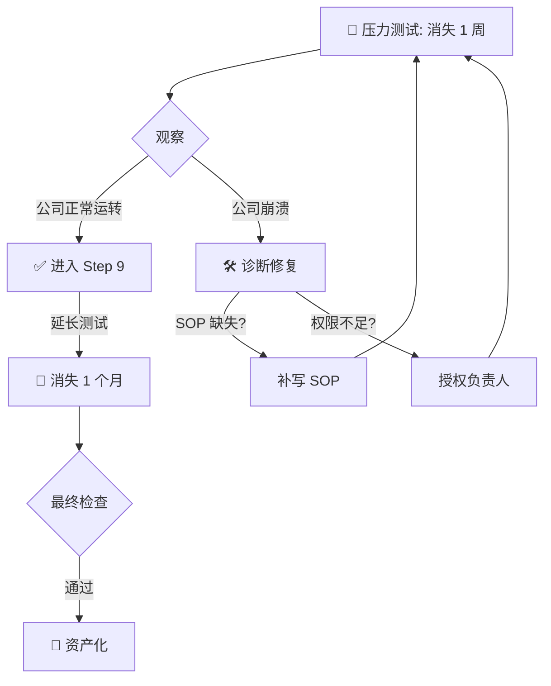

#### Step 9: 资产化决策 (The Endgame)

当你的公司能够**在你消失一个月后依然正常运转**，它就已经是一个**独立的资产包**了。

**你的选择 (这可能是你人生最爽的一道选择题):**

| Option                   | Description                               | Action         |
| :----------------------- | :---------------------------------------- | :------------- |
| **A. 持有 (Hold)** | 每周花 2-4 小时开会，享受分红。           | 继续当董事长   |
| **B. 出售 (Sell)** | 有 SOP、有团队、不依赖创始人 = 优质资产。 | 卖给财务投资人 |

* **出售估值:** 这种小而美的被动资产，在并购市场上通常可以卖出 **年利润的 3-5 倍**。
* **买家:** 偏好现金流的财务投资人 (他们非常喜欢这种项目)。不需要等上市。

---

## 4. Route 2: The Blood Path (万人敌路线 - Teaser)

当你发现的商业模式无法一己之力验证，或者已经出现在大厂的视野里，你的护城河叫做**流血的护城河 (Bleeding Moat)**——你一出场就面临血战。

这意味着你需要：

1. **资本的力量 (Capital)**
2. **更高维度的意志 (Higher Will):** 想要重新塑造游戏规则的力量
3. **压制既得利益者的能力**

**Requirement: 融资三件套**

* 商业计划书 (BP)
* 财务模型 (Financial Model)
* 退出机制 (Exit Strategy)

*详见 [1.0_Core_Framework.md](./1.0_Core_Framework.md) Phase 1 (Drucker's 3 Assumptions) 和财务模型部分。*

---

## 5. Anti-Patterns (反模式 - Teacher Mode)

*顺序至关重要。很多人失败是因为顺序搞错了。*

### Trap 1: The Premature Automation Trap (过早自动化陷阱)

* **Trap:** 在没有验证需求的时候就开始搞自动化。花了几个月搭建一套完美的系统，结果发现市场根本不需要你卖的东西。
* **Why:** 工程师思维作祟。认为"只要我把东西做好，就会有人买"。忽略了市场才是唯一的验证者。
* **Fix:** **MVP First (最小可行性产品优先)**。先用最简陋的方式卖出去第一单，再考虑优化。
* **Positive Real Scenario (正向实例):**
  * **Dropbox:** 创始人想做云存储，但开发太复杂。他没有写一行代码，而是拍了一段 3 分钟的 Demo Video（假装产品做好了）发到网上。
  * **Result:** 一夜之间几十万注册。证明了痛点真实存在，然后才开始融资写代码。**用最低成本验证了最核心的假设。**

### Trap 2: The SOP-less Hiring Trap (无 SOP 招人陷阱)

* **Trap:** 在没有 SOP 的时候就招人。你跟他讲不清楚，他也听不清楚，最后他做出来的东西和你做的完全不一样。
* **Why:** 急于摆脱繁重的执行工作，幻想"招个人来帮忙就好了"。忽略了招人是有隐性成本的（培训、沟通、纠错）。
* **Fix:** **Document First (先文档化)**。任何重复 3 次以上的工作，先写成 SOP 再招人。让新人按照 SOP 执行，如果能达到 80% 的效果，才算合格。
* **Positive Real Scenario (正向实例):**
  * **McDonald's:** 一个高中生第一天上班就能做出标准的汉堡。不是因为他天赋异禀，而是因为麦当劳有一套极度精细化的 SOP（包括薯条炸多少秒、汉堡肉翻几次）。
  * **Result:** 全球 4 万家门店，品质高度一致。**SOP 是规模化的前提。**

### Trap 3: The Premature Exit Trap (过早退出陷阱)

* **Trap:** 在没有稳定正向现金流的时候，就想完全退出、撒手不管。
* **Why:** 太渴望"被动收入"和"自由"，忽略了被动需要建立在"主动构建完成"的基础上。
* **Fix:** **Cash Flow First (现金流优先)**。只有当公司能够在你消失一个月后依然产生稳定利润，你才能真正放手。在此之前，你的退出只会导致公司迅速死亡。
* **Positive Real Scenario (正向实例):**
  * **Warren Buffett (Berkshire Hathaway):** 巴菲特说他最喜欢的持有期是"永远"，但前提是他投资的公司必须有 **Durable Competitive Advantage (持久竞争优势)** 和 **Stable Cash Flow (稳定现金流)**。
  * **Result:** 他能在奥马哈的办公室里每天只工作几小时，因为他投资的公司都能自己印钱。**退出的前提是资产已经成熟。**

**Visual: The Order Matters (顺序决定生死)**

```mermaid
graph TD
    Start["🚩 开始"] --> Step1["1. 选品与验证"]
    Step1 -->|验证通过| Step2["2. 构建 SOP"]
    Step2 -->|SOP 完成| Step3["3. 自动化与外包"]
    Step3 -->|现金流稳定| Step4["4. 去创始人化"]
  
    Step1 -.->|跳步到3| Fail1["💀 自嗨 - 没人买的系统"]
    Step1 -.->|跳步到2| Fail2["💀 管理混乱 - 讲不清楚"]
    Step3 -.->|跳步到4| Fail3["💀 公司死亡 - 没钱发工资"]
  
    style Start fill:#333
    style Step1 fill:#004400,stroke:#0f0
    style Step2 fill:#004400,stroke:#0f0
    style Step3 fill:#004400,stroke:#0f0
    style Step4 fill:#004400,stroke:#0f0
    style Fail1 fill:#440000,stroke:#f00
    style Fail2 fill:#440000,stroke:#f00
    style Fail3 fill:#440000,stroke:#f00
```

---

## 6. Glossary (术语表)

### 基础术语 (Sections 1-5)

* **一人公司 (Solopreneur):** 并非指"一个人干所有事"，而是指用系统和杠杆替代自己的时间，最终实现一个人控制一家能自动运转的公司。
* **边际成本 (Marginal Cost):** 每多生产一份产品或服务所需的额外成本。数字产品的边际成本趋近于零（做一次，卖无限次）。
* **MVP (Minimum Viable Product / 最小可行性产品):** 用最少的资源验证核心假设的产品版本。目的不是做完美，而是快速获取市场反馈。
* **SOP (Standard Operating Procedure / 标准作业程序):** 把脑子里的经验变成文档，让任何新手都能按流程执行，且结果不走样。SOP 是规模化的前提。
* **万人敌 (Capital Path):** 出自《史记·项羽本纪》。指需要借助资本力量、重塑游戏规则、与既得利益者血战的创业路线。
* **压力测试 (Stress Test):** 创始人主动"消失"一段时间（1 周到 1 个月），观察公司能否在无人干预下继续运转，以此检验系统的健壮性。

### 价值创造者术语 (Sections 7-12)

* **价值创造者 (Value Creator):** 用脑子赚钱而非用时间赚钱的人。通过研究兴趣、提炼知识、分发内容、销售产品形成闭环。与传统"卖时间换钱"的模式本质不同。
* **综合者 (Synthesizer):** 跨领域连接想法的人。与专家 (Specialist) 相反，综合者理解多个领域并创造新品类。"Specialization is for insects" — 综合者雇佣专家，而非被雇佣。
* **精通领域 (Domain of Mastery):** 三个兴趣的交集：(1) 赚钱技能、(2) 让你兴奋的领域、(3) 心理/哲学发展。找到这个交集就是你独特的内容和产品定位。
* **四大永恒市场 (Eternal Markets):** 健康 (Health)、财富 (Wealth)、关系 (Relationships)、幸福 (Happiness)。这些领域有最高的支付意愿，因为痛点最燃眉。
* **创业方法论 (Entrepreneurial Method):** 发现问题 → 自学解决 → 记录过程 → 系统化 → 分享给他人。类似科学方法，但用于商业。
* **PPP 框架 (PPP Framework):** 短内容创作公式。Pull (吸引注意) → Perspective (独特视角) → Punchline (金句收尾)。
* **两小时内容生态 (Two Hour Writer):** Dan Koe 的内容系统。每天 2 小时写作，产出周报 Newsletter → Thread → Tweets → YouTube，形成完整内容帝国。
* **MVO (Minimum Viable Offer / 最小可行报价):** 第一个变现产品。两种形式：单一技能服务 ($500-1000) 或咨询套餐 (4 次通话)。目的是快速验证市场需求。
* **产品阶梯 (Product Ladder):** 从免费到高价的产品结构。Free (Newsletter) → Low-Ticket (电子书 $20-100) → Mid-Ticket (课程 $300-1000) → Premium (社群 $2000+)。
* **信息产品 (Information Product):** 打包知识销售的产品形态。本质是聚合碎片信息、节省他人研究时间、提供便利性。"人们付钱买的是不用自己去 YouTube 上研究 20 小时"。
* **心流状态 (Flow State):** 最佳表现状态。由动机 → 学习 → 创造力 → 心流形成循环。通过有意义的副项目进入心流是幸福的秘密。
* **自我依赖 (Self Reliance):** 核心价值观。不把别人的建议当法律，通过直接经验测试一切，相信自己的判断而非盲从权威。
* **生活方式设计 (Lifestyle Design):** 有意识地设计日常生活结构。包括理解数字游民幻觉、工程化心流状态、建立自我依赖价值观。
* **冒名顶替综合症 (Imposter Syndrome):** 认为"我没资格教别人"的心理障碍。解法：你不需要比所有人强，只需要比昨天的自己强、比受众强一两步。

---

## 7. The Value Creator Path (价值创造者路径)

> **Core Motto:** Work less, earn more, enjoy life. (少干活，多赚钱，享受生活)
> **Source:** Dan Koe's One Person Business Model

**价值创造者 (Value Creator)** 是一种新的职业路径，由互联网创造。它与传统创业者的区别在于：**用脑子赚钱，而不是用时间赚钱 (Earn with your mind, not your time)**。

### 7.1 What is a Value Creator?

价值创造者是那些：

1. **研究自己的痴迷 (Research their obsessions)** - 深入探索自己真正感兴趣的领域
2. **提炼所学 (Distill their learnings)** - 把复杂信息变成可消化的内容
3. **通过写作和视频分发 (Distribute via writing/video)** - 把知识变成媒体资产
4. **成为一人媒体公司 (Become a one-person media company)** - 在社交媒体上建立名声，从流量中销售产品

```mermaid
graph TD
    subgraph "Value Creator Engine (价值创造者引擎)"
        Research["🔬 研究痴迷"] --> Distill["✨ 提炼精华"]
        Distill --> Create["📝 创造内容"]
        Create --> Distribute["📡 分发流量"]
        Distribute --> Monetize["💰 变现转化"]
        Monetize --> Research
    end
  
    Research -.->|专注| Deep["深度 > 广度"]
    Monetize -.->|产出| Product["数字产品"]
  
    style Research fill:#1a1a4a,stroke:#4444aa
    style Monetize fill:#4a1a1a,stroke:#aa4444
```

**为什么这是未来：**

- 60% 的新工作尚未被创造出来——它们将由互联网创造
- 传统教育系统无法跟上技术的进化速度
- 互联网上的个人教育者正在取代学校

> **The Kybalion Quote:** "The lips of wisdom are closed except to the ears of understanding." (智慧之唇只对理解之耳开启)
> 这意味着：**你无法帮助那些不想被帮助的人**。接受这个事实，专注于服务那些真正想成长的人。

### 7.2 Synthesizer vs Specialist (综合者 vs 专家)

**核心观点：专业化是给昆虫的 (Specialization is for insects)**

> *"A human being should be able to change a diaper, plan an invasion, butcher a hog, con a ship, design a building, write a sonnet, balance accounts, build a wall, set a bone, comfort the dying, take orders, give orders, cooperate, act alone, solve equations, analyze a new problem, pitch manure, program a computer, cook a tasty meal, fight efficiently, die gallantly, specialization is for insects."* — Robert A. Heinlein

| 维度                 | **专家 (Specialist)** | **综合者 (Synthesizer)** |
| -------------------- | --------------------------- | ------------------------------ |
| **技能范围**   | 单一技能，做一件事          | 多领域交叉，连接全局           |
| **自动化风险** | 高 (Robot can replace)      | 低 (Need human creativity)     |
| **收入天花板** | 受限于时间                  | 可以杠杆化                     |
| **工作方式**   | 执行指令                    | 设计系统                       |
| **未来定位**   | 被雇佣                      | 雇佣专家                       |

**为什么专家会被淘汰：**
如果你像机器人一样工作（执行特定任务、使用特定技能），那你就是机器人，你的工作会被外包给机器人。**Specialists get automated. Generalists orchestrate automation.**

**Synthesizer (综合者) 的定义：**

- 跨领域连接想法的人
- 现实不是隔离的。学校系统是隔离的（生物系、商学院、心理系），但**真实世界是一个整体**
- 我们需要更多能够连接全貌、创造新品类的人

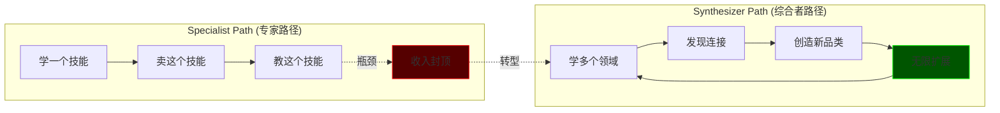

### 7.3 Domain of Mastery (精通领域三元组)

**问题：我该写什么内容？我该卖什么？**

**答案：Domain of Mastery (精通领域)** — 三个兴趣的交集。

| 兴趣序号             | 类型                         | 描述                     | 例子               |
| -------------------- | ---------------------------- | ------------------------ | ------------------ |
| **Interest 1** | 赚钱的 (Money-Making)        | 你用来赚钱的可变现技能   | 写作、设计、编程   |
| **Interest 2** | 让你兴奋的 (Exciting)        | 你真正享受、能进入心流的 | 健身、游戏、旅行   |
| **Interest 3** | 发展型的 (Development-Based) | 帮你理解人类进步模式的   | 心理学、哲学、灵性 |

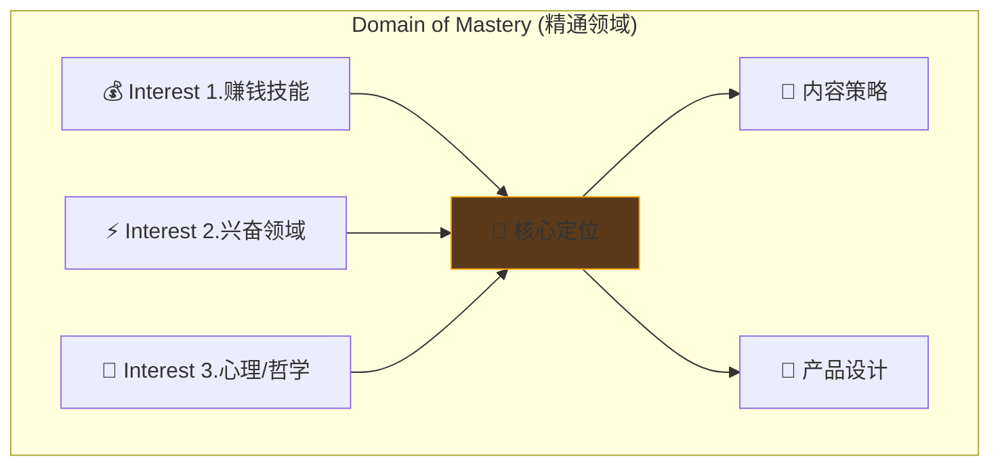

**如何找到你的 Domain of Mastery：**

1. 看你的 YouTube 历史记录 — 你自然被什么吸引？
2. 看你真正读完的书 — 不是买了没读的
3. 看你关注的创作者 — 谁在做你想做的事？
4. 看你生活中做什么 — 你改善了哪些方面？

**陷阱警告：** 你可能觉得"每个人都在做自我提升/编程/健身"，但这是因为**你只关注了那些领域的人**。打破你的信息茧房，你会发现市场比你想象的大得多。

### 7.4 The Eternal Markets (四大永恒市场)

世界上最赚钱的市场是那些人们**追求崇高目标、却有燃眉问题**的领域：

```text
┌─────────────────────────────────────────────────────────────────┐
│                    ETERNAL MARKETS (永恒市场)                     │
├────────────────┬────────────────┬────────────────┬──────────────┤
│   💪 HEALTH    │   💰 WEALTH    │  ❤️ RELATION   │  😊 HAPPINESS│
│     健康        │     财富        │     关系        │     幸福      │
├────────────────┼────────────────┼────────────────┼──────────────┤
│ • 减肥          │ • 副业赚钱       │ • 找对象        │ • 焦虑抑郁     │
│ • 增肌          │ • 财务自由       │ • 挽回前任       │ • 人生意义     │
│ • 慢性病        │ • 投资理财       │ • 亲子关系       │ • 自我实现     │
│ • 抗衰老        │ • 职业发展       │ • 社交恐惧       │ • 精神修行     │
└────────────────┴────────────────┴────────────────┴──────────────┘
```

**为什么从这里开始：**

- 这四个领域有最高的支付意愿 (Willingness to pay)
- 这些是"燃烧的问题 (Burning problems)" — 人们急需解决
- 你自己的人生改善通常也在这四个领域

**Path 1 (技能型) vs Path 2 (发展型)：**

| 路径                       | 描述                           | 风险                   |
| -------------------------- | ------------------------------ | ---------------------- |
| **Path 1: 技能型**   | 学技能 → 卖技能 → 教技能     | 容易变成一维、被自动化 |
| **Path 2: 发展型**   | 追求目标 → 解决问题 → 教别人 | 更难开始，但更有深度   |
| **Path 3: 两者结合** | 在追求目标的过程中学技能       | 最佳路径               |

```mermaid
graph TD
    Self["👤 你自己"]
  
    Self -->|目标是什么?| Brand["🏷️ 品牌(你在追求什么)"]
    Self -->|遇到什么问题?| Content["📝 内容(你如何解决)"]
    Self -->|如何系统化?| Product["📦 产品(帮别人快速解决)"]
    Self -->|为什么有效?| Marketing["📣 营销(证明有效性)"]
  
    Brand --> Follower["👥 追随者"]
    Content --> Follower
    Product --> Customer["💳 客户"]
    Marketing --> Customer
  
    style Self fill:#333,stroke:#fff
```

---

## 8. Entrepreneurial Method (创业方法论)

> **核心公式：** Problem → Learn → Document → Systematize → Share
> (发现问题 → 自学解决 → 记录过程 → 系统化 → 分享给他人)

这就像科学方法，但用于商业。**唯一的区别是你在解决自己的问题，然后教别人怎么做。**

### 8.1 The 5-Step Cycle (五步循环)

```mermaid
graph LR
    Step1["1. 🔍 发现问题"] --> Step2["2. 📚 自学解决"]
    Step2 --> Step3["3. 📝 记录过程"]
    Step3 --> Step4["4. ⚙️ 系统化"]
    Step4 --> Step5["5. 📤 分享"]
    Step5 -->|新问题| Step1
  
    Step3 -.->|同时| Post["发布内容"]
    Step4 -.->|最终| Course["打包成产品"]
  
    style Step1 fill:#1a3a4a,stroke:#4a9aaa
    style Step5 fill:#3a4a1a,stroke:#9aaa4a
```

**每一步的细节：**

**Step 1: 发现问题 (Find a Problem)**

- 所有故事、所有营销、所有人类行为都围绕问题展开
- 问题创造好奇心缺口 (Curiosity Gap) — 人们想知道解决方案
- 你自己的问题就是最好的起点

**Step 2: 自学解决 (Self-Educate)**

- 不要雇人帮你做，自己学
- 通过解决问题获得的经验是不可替代的
- 这个过程本身就是你未来产品的素材

**Step 3: 记录过程 (Document)**

- 把 Twitter/社交媒体当作公开笔记软件
- 你的发现对别人也有价值
- 如果你对某个想法感到兴奋，别人也会

**Step 4: 系统化 (Systematize)**

- 人们想要的是**一步一步的建议**来达到具体结果
- 回顾你的过程：如何能做得更好？
- 创建可复制的框架

**Step 5: 分享 (Share)**

- 提升你自己的意识 = 创造现实的地图
- 分享这个地图 = 提升集体意识
- 这是一种现代的自我实现方式

### 8.2 Writing as Foundation (写作是一切的基础)

**为什么写作？**

互联网的后端是代码，前端是媒体。如果你想利用互联网的无限杠杆，你需要学会其中之一。

- **代码 (Code):** 现在有 No-Code 工具，人人都能建网站
- **媒体 (Media):** 写作是媒体的基础

**媒体金字塔 (Media Pyramid)：**

```text
                    ┌─────────────┐
                    │   YouTube   │  ← 需要剧本 (写作)
                    ├─────────────┤
                    │   Podcast   │  ← 需要大纲 (写作)
                    ├─────────────┤
                    │  Short Video│  ← 通常是念推文
                    ├─────────────┤
                    │  Newsletter │  ← 纯写作
                    ├─────────────┤
                    │   Twitter   │  ← 纯写作
                    └─────────────┘
                         ↓
             ┌───────────────────────┐
             │  📝 WRITING (写作)    │
             │  一切的基础            │
             └───────────────────────┘
```

**为什么从 Twitter 开始：**

1. **低门槛:** 只需要键盘，不需要好看
2. **转发按钮:** 比其他平台更容易传播
3. **创意的练习场:** 每条推文都是实验
4. **直接验证:** 有人喜欢就会互动

### 8.3 PPP Framework (短内容公式)

**PPP = Pull → Perspective → Punchline**
(吸引 → 视角 → 金句)

| 阶段                         | 目的               | 技巧示例         |
| ---------------------------- | ------------------ | ---------------- |
| **Pull (吸引)**        | 停止滚动，开始阅读 | 数字、统计、"你" |
| **Perspective (视角)** | 提供独特角度       | 与常识相反的观点 |
| **Punchline (金句)**   | 留下深刻印象       | 简洁有力的总结句 |

**例子分析：**

```markdown
"People will spend 10 hours worrying about a task that takes 10 minutes to complete."

- Pull: "People" + 数字 (10 hours vs 10 minutes)
- Perspective: 揭示人们的非理性行为
- Punchline: 整句话就是金句
```


### 8.4 Two Hour Content Ecosystem (两小时内容生态)

**每天 2 小时写作，可以支撑你的整个内容帝国：**

```mermaid
graph TD
    Newsletter["📧 周报 Newsletter(深度长文)"] --> Thread["🧵 Thread(摘取要点)"]
    Thread --> Tweets["🐦 Tweets(碎片内容)"]
    Newsletter --> YouTube["🎬 YouTube(视频版)"]
  
    Tweets -->|持续发布| Traffic["📈 流量"]
    Traffic --> Leads["📬 订阅者"]
    Leads --> Newsletter
  
    Newsletter -.->|内嵌| Product["💰 产品链接"]
  
    style Newsletter fill:#1a3a4a,stroke:#4a9aaa
    style Product fill:#4a3a1a,stroke:#aa9a4a
```

**流程：**

1. **每周写一篇 Newsletter** (1000+ 字深度内容)
2. **把 actionable 部分变成 Thread** (Twitter 长推)
3. **把核心观点拆成 Tweets** (日常发布)
4. **Newsletter 可以变成 YouTube 视频** (视觉化)
5. **产品链接嵌入 Newsletter** (不用天天推销)

---

## 9. Information Product Architecture (信息产品架构)

> **Core Insight:** 你脑子里有价值 10 万美元的信息。(You have $100K in your head.)

大多数人不认为自己 18-35 岁的人生经历有价值。这是因为你没有足够的**自我反思**来看到自己克服的问题。

### 9.1 The $100K in Your Head (脑子里的十万美元)

**为什么你比你以为的更有价值：**

| 误解               | 真相                               |
| ------------------ | ---------------------------------- |
| "我没有经验"       | 你能教朋友的东西，就能教陌生人     |
| "我的生活太无聊"   | 你不需要炫耀的生活，需要有趣的兴趣 |
| "每个人都在做这个" | 你只关注了那个领域的创作者         |
| "我是冒名顶替者"   | 你已经在帮朋友了，只是没公开       |

**信息产品的本质：**

- **聚合 (Aggregation):** 把碎片信息整合成系统
- **速度 (Speed):** 帮人节省自己摸索的时间
- **便利 (Convenience):** 打包成可消费的格式

**人们付钱买的是"不用自己去 YouTube 上研究 20 小时"。**

### 9.2 Minimum Viable Offer (最小可行报价)

**不要等到"准备好"才开始变现。** 第一个产品一定是垃圾，你需要尽快把它做出来才能迭代。

**两种 MVO:**

| 类型                           | 描述                              | 价格      |
| ------------------------------ | --------------------------------- | --------- |
| **Type 1: 单一技能服务** | 一项可变现的技能 (设计/写作/编程) | $500-1000 |
| **Type 2: 咨询套餐**     | 4 次通话的咨询包                  | $500-1000 |

```mermaid
graph TD
    Start["🚀 开始变现"] --> Q1{你有可变现的技能吗?}
  
    Q1 -->|是| Freelance["💼 Type 1 单一技能服务 $500-1000"]
    Q1 -->|否| Consult["🎯 Type 咨询套餐 4次通话 $500-1000"]
  
    Freelance --> Validate["✅ 验证需求"]
    Consult --> Validate
  
    Validate --> Product["📦 打包成课程"]
  
    style Start fill:#333,stroke:#fff
    style Validate fill:#005500,stroke:#0f0
```

**为什么要从 MVO 开始：**

1. **立即开始赚钱** — 不用等受众增长
2. **获取真实反馈** — 客户会告诉你哪里可以改进
3. **积累案例** — 为未来的课程准备素材
4. **找到共性** — 每次咨询讨论的内容会重复，打包成课程

### 9.3 Product Ladder (产品阶梯)

```text
                           ┌──────────────┐
                           │ 💎 Premium   │
                           │ 社群/Cohort  │  $2000+
                           │ (高触点)     │
                       ┌───┴──────────────┴───┐
                       │ 📚 Mid-Ticket        │
                       │ 课程/Workshop        │  $300-1000
                       │ (自助学习)           │
                   ┌───┴──────────────────────┴───┐
                   │ 📖 Low-Ticket                │
                   │ 电子书/Mini-Course          │  $20-100
                   │ (入门产品)                   │
               ┌───┴──────────────────────────────┴───┐
               │ 🆓 Free                              │
               │ Newsletter / Lead Magnet            │  $0
               │ (建立信任)                           │
               └──────────────────────────────────────┘
```

**阶梯逻辑：**

- **Free:** 吸引流量，建立信任
- **Low-Ticket:** 筛选愿意付费的人
- **Mid-Ticket:** 主要收入来源
- **Premium:** 高利润，少客户

### 9.4 Evolution: Course → Cohort → Community

**信息产品的进化路径：**

| 阶段         | 形式             | 特点               | 扩展性   |
| ------------ | ---------------- | ------------------ | -------- |
| **V1** | 电子书/录播课程  | 一次制作，无限销售 | 高       |
| **V2** | Cohort (训练营)  | 固定周期，直播互动 | 中       |
| **V3** | Community (社群) | 持续运营，会员付费 | 低但稳定 |

```mermaid
graph LR
    Book["📖 电子书"] --> Course["🎬 录播课程"]
    Course --> Cohort["👥 训练营"]
    Cohort --> Community["🏠 社群"]
  
    Book -.->|边际成本| Zero["≈ 0"]
    Community -.->|边际成本| Time["需要时间"]
  
    style Book fill:#1a3a1a,stroke:#4a9a4a
    style Community fill:#3a3a1a,stroke:#9a9a4a
```

**我的进化案例 (Dan Koe)：**

1. 卖 Freelancing 课程 (教我如何做六位数 Web 设计)
2. 迭代成 Modern Mastery (捆绑多个课程)
3. 开始 Two Hour Writer (写作课程)
4. 现在运营 Cohort + Community

---

## 10. Lifestyle Design (生活方式设计)

> **反直觉洞察:** 成功是反直觉的 (Success is counterintuitive)。
> 当所有人都说"做短视频"时，我开始写长文 Newsletter。

### 10.1 The Myth of Digital Nomad (数字游民的幻觉)

**期待 vs 现实：**

| 期待 (Expectation) | 现实 (Reality)               |
| ------------------ | ---------------------------- |
| 沙滩上敲代码 🏖️  | 阳光太刺眼看不见屏幕         |
| 每天换城市 ✈️    | Wi-Fi 不稳定，效率低         |
| 派对到天亮 🎉      | 语言障碍，社交疲劳           |
| 永远的自由 🌴      | 新鲜感会消退 (Dopamine fade) |

**真相：**

> *"我曾以为我想要的是数字游民生活，直到我真正过上了。" — Dan*

你必须通过**试错**来理解自己真正想要什么。社交媒体上的高光时刻 (Highlight Reel) 不是真实生活。

### 10.2 Flow State Engineering (心流状态工程)

**人类作为创造者的本质：**

> 人类是唯一能够**有想法并使其成真**的生物。我们用意识构建了语言、政府、宗教、互联网。

**Flow State 是关键：**

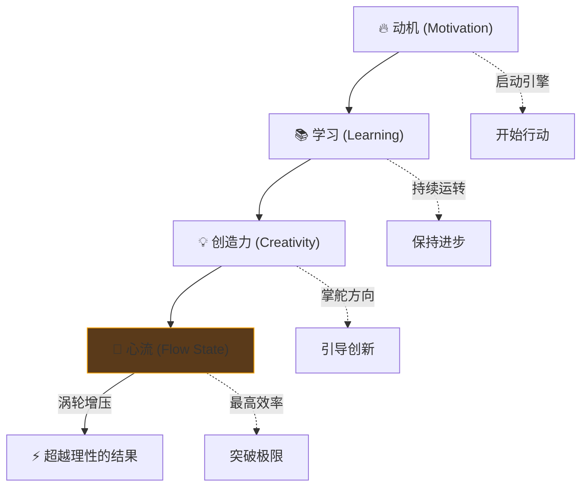

**关于有意义的副项目：**
从 16 岁到 25 岁，我一直有一个让我快乐的副项目。可能是：

- 一个编程项目
- 一个商业想法
- 一项正在学习的技能
- 一件正在创造的作品

**这就是心流的秘密：** 有一个你自己选择的目标，有意义地朝它努力。这是内在驱动的，不是别人告诉你该做什么。

### 10.3 Self Reliance as Core Value (自我依赖作为核心价值)

> **Self Reliance (自我依赖)** 是我生命中可能最重要的价值观。它给我带来了最大的价值。

**自我依赖意味着：**

1. **自己搞明白** — 别把别人的建议当法律
2. **测试一切** — 通过直接经验验证
3. **相信自己的经验** — 而不是盲从权威
4. **做与众不同的事** — 当所有人往东时，考虑往西

**例子：**
当所有人都说"做短视频、上 Reels"时，我开始写 Newsletter 长文。结果这教会了我的比任何课程都多——因为我在**直接经历、试错、学习**。

**应用于任何领域：**

- **健康:** 有人说生吃肝脏最好？试试看，感受自己的身体
- **商业:** 有人说必须这样做？测试不同方法，找到适合你的
- **意识形态:** 接受任何信仰为绝对真理？关闭了新机会的大门

```mermaid
graph TD
    External["🌐 外部建议(他人的经验)"]
    Internal["🧭 内部罗盘(自我依赖)"]
  
    External --> Filter["🔍 过滤器:这对我有用吗?"]
    Filter --> Test["🧪 测试(直接经验)"]
    Test --> Learn["📝 学习(形成自己的观点)"]
    Learn --> Internal
  
    Internal -->|指导| Action["✅ 行动"]
  
    style Internal fill:#1a4a1a,stroke:#44aa44
    style External fill:#4a4a4a,stroke:#aaaaaa
```

---

## 11. Extended Anti-Patterns (扩展反模式 - Teacher Mode)

*除了之前的三个陷阱，以下是来自 Value Creator 路径的新陷阱。*

### Trap 4: The Specialization Trap (专业化陷阱)

* **Trap:** 认为"我必须成为某个领域的专家才能开始"。把自己限制在一个狭窄的技能里，像机器人一样只做一件事。
* **Why:**
  - 被传统教育系统洗脑 (他们需要可预测的员工)
  - 害怕成为"杂而不精"
  - 看到专家似乎很成功
* **Fix:**
  - **成为综合者，而不是专家**
  - 学习多个领域，找到它们之间的连接
  - 专家适合被雇佣；综合者适合雇佣专家
* **Example:**
  - 你是一个只会写 Email Marketing 的专家。恭喜，你的工作马上要被 AI 自动化工具取代了。
  - 反之，如果你理解心理学 + 营销 + 写作 + 商业模式，你可以为客户设计整个增长系统，收费 10x。
* **Positive Real Scenario:**
  - **Elon Musk:** 不是火箭专家，不是汽车专家，不是 AI 专家。他是**系统思考者**，能够跨领域整合知识，雇佣各领域专家为他工作。
  - **Result:** 创建了多个行业领先的公司，因为他不把自己限制在一个领域。

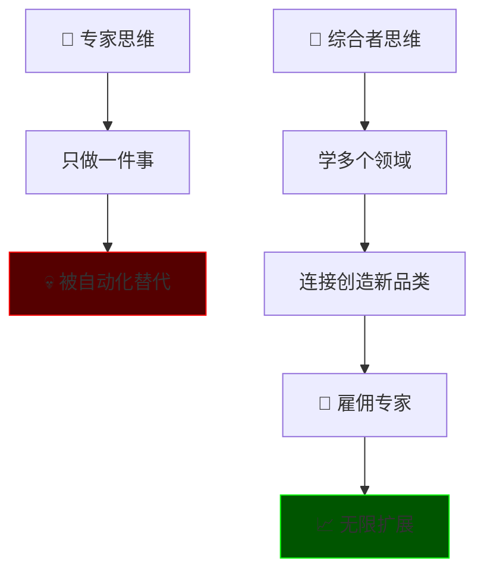

### Trap 5: The Content Rat Race Trap (内容老鼠赛跑陷阱)

* **Trap:** 每天发 10 条推文、5 个 Reels、3 个 TikTok，但从不写有深度的长内容。被增长焦虑驱动，而不是被价值驱动。
* **Why:**
  - 看到别人通过高频发帖增长
  - 把"数量"误解为"质量"
  - 害怕停下来会被遗忘
* **Fix:**
  - **深度优先，频率其次**
  - 建立 Newsletter/长文内容作为核心
  - 短内容是长内容的碎片，而不是反过来
* **Example:**
  - 你每天发 10 条推文，全是"10 lessons I learned..."这类浅薄内容。一年后，你有 5000 粉丝，但没有产品、没有信任、没有权威。
  - 反之，每周写一篇 2000 字深度 Newsletter，然后把它拆成推文。一年后，你有信任你的读者，可以卖 $500+ 的产品。
* **Positive Real Scenario:**
  - **Tim Ferriss:** 他的播客每集 3 小时深度访谈。他不追求数量，追求深度。结果每一集都有几百万播放量，因为价值密度极高。
  - **Result:** 他可以每集收 $100k+ 广告费，因为听众信任他。

### Trap 6: The Knowledge Hoarding Trap (知识囤积陷阱)

* **Trap:** 读 100 本书，买 50 个课程，但从不创造任何东西。"我还没准备好分享，我需要学更多。"
* **Why:**
  - 冒名顶替综合症 (Imposter Syndrome)
  - 把消费知识当作进步
  - 害怕被批评
* **Fix:**
  - **学习 → 创造 → 教学 是完整循环**
  - 你今天学到的东西，对昨天的你来说是有价值的内容
  - 通过教学发现知识空白，然后去填补
* **Example:**
  - 你花 3 个月学 Web 设计，但从不发布任何作品。3 个月后，你仍然觉得"不够好"。
  - 反之，学 1 个月后就开始发布作品、接客户。反馈会让你学得更快。
* **Positive Real Scenario:**
  - **Naval Ravikant:** 他说"If you can't explain it simply, you don't understand it."通过他在 Twitter 上分享的简单智慧，他建立了巨大影响力——尽管他"只是"在分享他读书学到的东西。
  - **Result:** 他的每一条推文都被截图转发，因为他把复杂变简单。

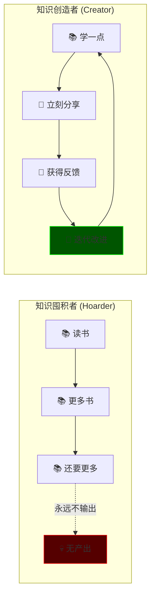

### Trap 7: The Imposter Syndrome Trap (冒名顶替综合症陷阱)

* **Trap:** "我没有资格教别人，我不是专家，我只有 [X] 年经验。"
* **Why:**
  - 只看到领先自己很远的人
  - 忽略了身后有无数人正在经历你已经解决的问题
  - 把"权威"等同于"完美"
* **Fix:**
  - **你不需要比所有人强，只需要比你昨天的自己强，比你的受众强一两步**
  - 用"Here's how I'm going to..."不是"Here's how you should..."
  - 定位自己为"学习者+分享者"而不是"大师"
* **Example:**
  - 你从没做过六位数收入，所以不敢教商业。
  - 换个视角：写"我如何计划在 5 年内达成六位数收入"，然后带着观众一起成长。你在领导，不是在假装已经到达。
* **Positive Real Scenario:**
  - **Ali Abdaal:** 他开始做 YouTube 时只是一个医学生分享学习方法。他不是学习科学专家，他只是比普通学生更努力地研究了学习方法，然后分享出来。
  - **Result:** 现在他是 YouTube 上最大的生产力频道之一，因为他从"学习者"的视角分享，而不是从"专家"的视角说教。

---

## 12. The Meaning of Life (生命的意义 - Meta Layer)

> 这是一个困难的问题，但让我分享我通过研究多种视角后发现的模式。

**两步框架：**

### Step 1: 提升自己的意识 (Raise Your Consciousness)

- 主动探索现实中**未知的方面** — 不要回避挑战或失败
- 使无意识变得有意识
- 使不可预测变得可预测
- 通过解决自己的问题，创造一张**现实的地图**

### Step 2: 提升集体意识 (Raise Collective Consciousness)

- 把你的地图分享给他人
- 通过在线写作/发布来分发地图片段
- 你的产品本身就是这张地图

```mermaid
graph TD
    Unknown["❓ 未知"]
    You["👤 你"]
    Known["✅ 已知"]
    Others["👥 他人"]
  
    Unknown -->|探索| You
    You -->|解决问题| Known
    Known -->|创建地图| Map["🗺️ 现实地图"]
    Map -->|分享| Others
    Others -->|吸收| Evolution["🌍 集体进化"]
  
    style You fill:#333,stroke:#fff
    style Evolution fill:#1a4a1a,stroke:#44aa44
```

> **Naval Ravikant:** "The internet enables 8 billion monopolies." (互联网使 80 亿垄断成为可能)
>
> 这听起来有点简单，甚至像陈词滥调——但它极其深刻。每个人都可以在互联网上成为独一无二的"你"。

---

## 备注与引用 (Notes & References)

* **Source:** Up主视频 Transcript (一人公司运作原理) + Dan Koe Transcript (One Person Business / Value Creator Model)
* **Key Concept:** "用系统替代时间，用杠杆替代自己。" (Replace your time with systems, replace yourself with leverage.)
* **Cross-Reference:** [1.0_Core_Framework.md](./1.0_Core_Framework.md) (德鲁克三假设, 财务模型, 退出机制)
* **Metaphors Preserved:**
  - "8 billion monopolies" (Naval)
  - "The lips of wisdom are closed except to the ears of understanding" (Kybalion)
  - "$100k in your head"
  - "Get the shit out of the faucet"
  - "Specialization is for insects" (Heinlein)
