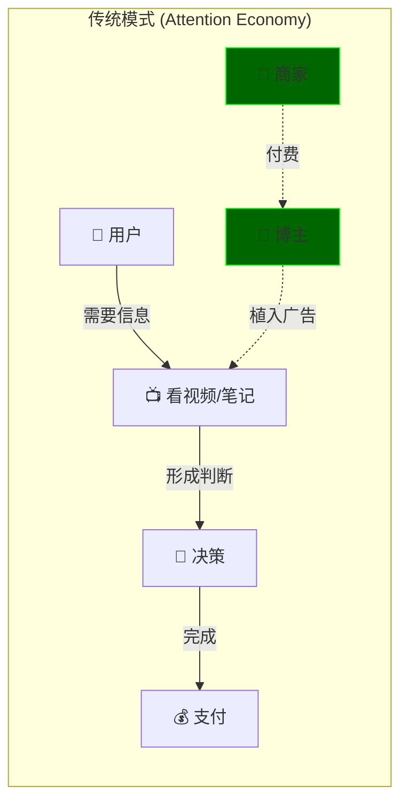
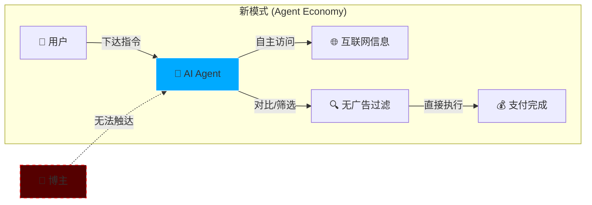
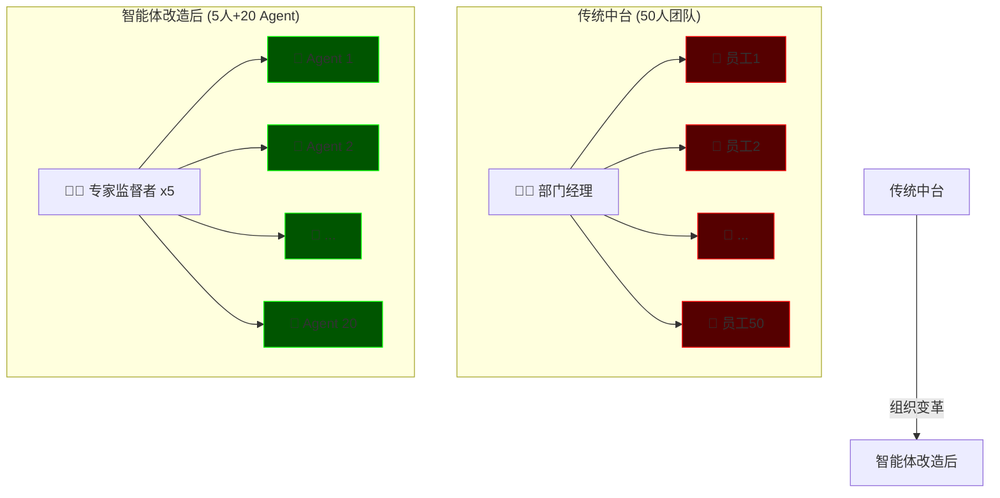
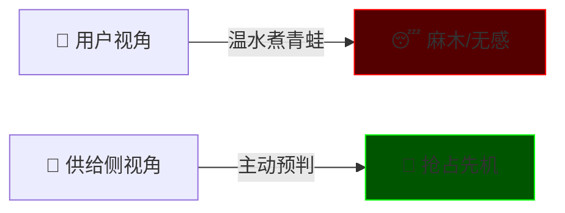

# 1.3_AI_Agent_Revolution (智能体大爆发)

> **Tags:** `[AI]`, `[Business Strategy]`, `[Disruption]`, `[Future Vision]`
> **Date Added:** `2026-01-09`
> **Source Logic:** Up主 Transcript (赛道发现 / AI Agent 大灭绝)
> **一句话总结:** 当 AI Agent 成为你的私人决策代理，自媒体、APP、甚至企业中台都会成批倒下——因为它们的商业模式本质上是**租用你的注意力**。

---

## 1. 元认知 (Metacognition) - 本期核心问题

> **回应听众质疑:** 就算学会了怎么做一人公司、怎么从 0 到 1，可是去**哪里发现这样的赛道、这样的机会**呢？

本期视频的目标是回答这个问题。答案藏在一个判断里：**几乎所有自媒体接下来都会死光，包括 99% 的所谓头部自媒体，信不信？如果还包括绝大多数的 APP 呢？**

这不是危言耸听。当**科技创新**叠加**模式创新**再叠加**范式创新**，三期叠加，就能叠加出一个**颠覆式创新 (Disruptive Innovation)**。这样的创新会影响、重塑、颠覆很多人的生活方式。

> [!IMPORTANT]
> **关于"感觉变化不大"的反驳:**
> 你觉得生活没多大变化？错，那是因为所有这些变化是**循序渐进**的，而且你是以**用户的身份**去感受的。如果你能站在一个更加宏大的时间跨度去看，一切都明白了：
>
> * 10 年前，自媒体主理人在你身边出现了，时长和分量和今天能比吗？
> * 20 年前，智能手机的使用频率和 10 年前能比吗？
> * 30 年前的互联网和 20 年前能比吗？

**供给侧视角 vs 需求侧视角:**

| 视角                           | 感受                     | 结果     |
| :----------------------------- | :----------------------- | :------- |
| **需求侧 (用户)**        | 感受、接受、享用         | 无需深思 |
| **供给侧 (创业者/员工)** | 被颠覆、被裁员、被边缘化 | 必须预判 |

一批批倒下去的昔日商业巨头，一个个崛起的独角兽，因前者被裁员下岗的员工，因后者崛起而赚得盆满钵满的员工股东——这是两个完全不同的世界。

**那我问你，3 年前的 AI 和今天的 AI 能不能比？如果就这样发展下去，谁会倒霉？**

---

## 2. 核心洞察 (Core Insight) - 注意力链条

### 2.1 自媒体/APP 为什么会死？

先理解一个场景：

> **Case:** 你要做一个旅行规划。在传统模式下，你需要打开小红书/抖音，看一堆旅行博主的视频，对比笔记和评论，自己做决策，然后再打开携程/飞猪订机票酒店。
>
> **新模式 (AI Agent):** 你直接给 AI Agent 下一个指令："**帮我做个海岛度假攻略，订好机票和酒店，预算 5 万。**" 然后 AI 智能体就会开始默默工作。它会访问几十个网页，包括各种笔记和评论，对比价格，填完表格完成支付。在这整个过程中，你**一条广告都看不到**，无论是软的还是硬的。

**这意味着什么？**

我们需要往下再挖一层，理解自媒体和主理人之"火"的点在哪里。为什么会有所谓的旅行博主、探店博主、带货博主？

**因为你需要看他们的视频，需要通过他们的视频去做出决策。**



* 当博主能够**被动参与你的决策**时，他们就能够对你**施加影响**。
* 当他们能够对你施加影响时，他们就对你**拥有某种权力**。
* 而希望你购买他们产品或服务的商家，就会认为这种权力是值得进行**对价 (Pay for)** 的。
* 他们会付费给那些自媒体主理人，让他们把自己的产品、服务巧妙地包藏在他们的作品中，从而潜移默化地推动你完成支付。

**这就是广告的本质：买断你的注意力，租用你的决策参与权。**

```text
┌─────────────────────────────────────────────────────────────────────┐
│                   THE ATTENTION-INFLUENCE-DECISION CHAIN            │
│                   (注意力-影响力-决策链)                              │
├─────────────────────────────────────────────────────────────────────┤
│                                                                     │
│   ┌─────────────┐     ┌─────────────┐     ┌─────────────┐          │
│   │  ATTENTION  │────▶│  INFLUENCE  │────▶│  DECISION   │          │
│   │   注意力     │     │   影响力     │     │   决策权     │          │
│   └─────────────┘     └─────────────┘     └─────────────┘          │
│         │                   ▲                   │                   │
│         │    ┌──────────────┴──────────────┐   │                   │
│         └───▶│  谁拥有了你的注意力，         │◀──┘                   │
│              │  谁就拥有对你的影响力，       │                       │
│              │  谁能被动参与你的决策，       │                       │
│              │  谁就站在了风口上。           │                       │
│              └─────────────────────────────┘                       │
│                                                                     │
└─────────────────────────────────────────────────────────────────────┘
```

### 2.2 AI Agent 如何打断这条链？

当你**不需要再劳心费神地去看视频**，去比较笔记和评论，当你的智能体把这些所有事情都**按照你的偏好**全部处理好，你还**不用看广告**，不用担心被骗的时候——**自媒体主理人的视频谁又还会去看呢？**



**结论：绝大多数自媒体和主理人都会消失。** APP 同理——谁拥有了你的注意力，谁就站在风口上。当 Agent 代替你与世界交互，APP 的"流量入口"价值就归零了。

---

## 3. 核心隐喻 (The Electricity Metaphor)

### 3.1 大模型 = 电

大语言模型 (LLM)，就像**电**。所谓的 Gemini、Banana、GPT、Claude，或者某包、某宝、某些国产的，你可以把它当成各种电的类型——有风电、水电、火电等等。

### 3.2 智能体 = 家用电器

智能体 (AI Agent) 是什么呢？**智能体就是在你家里随处可见的，在某些更具体的场景下使用体验更加丝滑的家用电器**，比如你的吸尘器、美容仪、电子秤等等。

我们所使用的那些AI，其实更加像它们最最基本的应用——就好比**电灯泡**一样，是对电子最简单的应用。而那些各种各样奇思妙想的电器，包装着更加丝滑的体验以及更加人性化的外壳，**就像电器时代大爆发一样，这就是属于 AI 的寒武纪大爆发时代。**

```text
┌───────────────────────────────────────────────────────────────────────────┐
│                        THE ELECTRICITY ANALOGY                            │
│                             (电力类比)                                     │
├───────────────────────────────────────────────────────────────────────────┤
│                                                                           │
│   ┌─────────────────────────────────────────────────────────────────┐    │
│   │                         电 (LLM)                                 │    │
│   │   风电 = Gemini | 水电 = GPT | 火电 = Claude | 核电 = Deepseek  │    │
│   └───────────────────────────────┬─────────────────────────────────┘    │
│                                   │                                       │
│                                   ▼                                       │
│   ┌─────────────────────────────────────────────────────────────────┐    │
│   │                      电器 (AI Agent)                             │    │
│   ├─────────────────────────────────────────────────────────────────┤    │
│   │   💡 电灯泡 = ChatGPT / 豆包 (最基础应用)                         │    │
│   │   🧹 吸尘器 = 自动化客服 Agent                                    │    │
│   │   ❄️ 冰箱 = 旅行规划 Agent                                        │    │
│   │   📺 电视机 = 内容策展 Agent                                      │    │
│   │   🔧 工业机器人 = RPA + Agent (企业自动化)                        │    │
│   └─────────────────────────────────────────────────────────────────┘    │
│                                                                           │
│   [ 寒武纪大爆发 (Cambrian Explosion) = AI Agent 场景化应用爆发 ]         │
│                                                                           │
└───────────────────────────────────────────────────────────────────────────┘
```

**对比表:**

| 电力时代              | AI 时代           | 类比逻辑                   |
| :-------------------- | :---------------- | :------------------------- |
| 电 (Electricity)      | 大语言模型 (LLM)  | 底层能源，通用能力         |
| 电灯泡 (Light Bulb)   | ChatGPT / 豆包    | 最简单、最通用的应用       |
| 家用电器 (Appliances) | AI Agent (智能体) | 场景化、体验丝滑的具体应用 |
| 电器时代大爆发        | AI 寒武纪大爆发   | 千万种细分场景涌现         |

---

## 4. B 端冲击 (Enterprise Disruption)

### 4.1 C 端的冲击只是前菜

以上讲的都是面向 C 端 (Consumer) 可能引起的巨大变革。然而**接下来才是最关键的**——因为你作为用户，市场怎么变，其实你都可以很笃定。但如果你作为**公司**或者**公司里的一员**，那么接下来的内容你有必要认真听。

### 4.2 核心判断

> **AI 是不是能把所有行业都做一遍？不一定。但至少能够把所有行业的一部分都重做一遍。**

哪一部分？**中台部门 (Mid-Office)**。

中台部门有个很显著的特点：它的**标准化程度特别高**。比如像财务、行政 (行程)、HR，甚至是某些程度的法务，这些标准化程度很高的部门，是站在最前线的，**最容易被智能体进行部分取代的**。

### 4.3 为什么是"部分"取代？

**因为智能体有个先天缺陷：它始终不是自然人，所以它不可能为它的错误负责。** 这就走到了 **AI 伦理** 的边界。

也正因为如此，你**至少要留一个员工去监管这些智能体**。当有的智能体犯错的时候，人类监管者要及时纠正错误。

**不要小看这些变化，这已经是翻天覆地的变化了。**



### 4.4 真实案例

| 公司                        | 变革内容           | 原规模        | 新规模            |
| :-------------------------- | :----------------- | :------------ | :---------------- |
| **西班牙某银行**      | 信贷审批智能体化   | 50 人团队     | 5 专家 + 20 Agent |
| **麦肯锡 (McKinsey)** | 部署智能体取代员工 | 裁撤 4 万员工 | 1.2 万个 Agent    |

> 以前麦肯锡可是只从 **Target School** (顶级院校) 里面找人啊。

---

## 5. 市场信号 (Market Signals)

你需要从**学习转向实践**，理解信息意味着要用信息去**获取价值**。

### 5.1 一级市场动向

如果你关心过一级市场，你会发现：

* 在西海岸 LA，大量的智能体创业正在**野蛮生长 (Wild Growth)**。
* 从去年到今年，很多大厂的**全栈工程师、AI 产品经理在裸辞出来自己搞创业**，搞的就是 AI 智能体。

### 5.2 大裁员信号

* 硅谷的**10 万大裁员**。
* 中国各种跨国互联网公司把他们设在中国的**研发中心裁撤掉**，又是因为 AI。

**有人赢就意味着有人输。先明白的先赢，后明白的只能输。**

### 5.3 麻木陷阱

通过两年时间的打磨，你可能已经对 AI 感到**麻木**了，这种飞速变化的感觉已经让你迟钝了。但恰恰是这种**渗透到应用层水平的创新**，才是真正让聚变开启的前兆。

> 豆包手机这件事情大家都知道，吃瓜的多余战队的，那就太浪费这个信息了。

---

## 6. Anti-Patterns (反模式 - Teacher Mode)

### Trap 1: The "User Mindset" Trap (用户心态陷阱)

* **Trap:** 以用户的身份去感受变化，觉得"生活没多大变化"，然后继续躺平。
* **Why:** 用户是需求侧，变化是**循序渐进、无感知**的。就像温水煮青蛙。
* **Fix:** 强制切换到**供给侧视角**。问自己：如果我是那个博主/那个 APP 开发者/那个中台员工，我会怎样？
* **Positive Real Scenario (正向实例):**
  * **某 AI 产品经理:** 嗅到 Agent 风口后，裸辞出来创业，抓住了西海岸创投热潮。
  * **Result:** 在别人还在"感受变化"的时候，他已经站在了供给侧的制高点。



### Trap 2: The "Too Early / Too Late" Trap (时间节点陷阱)

* **Trap:** 要么 All-in 太早（市场还没起来就把子弹打光了），要么 All-in 太晚（市场已经被巨头瓜分了）。
* **Why:** 对"颠覆式创新落地周期"的误判。
* **Fix:** **任何事情，创业也好，投资也好，时间节点非常重要。不可以太早，也不可以太晚。** 持续观察市场信号（一级市场动向、大厂裁员/招聘、头部玩家动作）。
* **Nuance:** 想得太远太快和想得太短太慢没什么区别。"过犹不及"原则。

### Trap 3: The "AI Immunity" Trap (AI 豁免幻觉)

* **Trap:** 认为自己的岗位/行业不会被 AI 影响，因为"需要人情味/创意/判断力"。
* **Why:** 对 AI 能力边界的误判 + 自我安慰的心理防御机制。
* **Fix:** 重新审视你的工作内容：有多少是**标准化、可重复、可被 SOP 描述**的？这些部分就是 Agent 最先下手的地方。
* **Positive Real Scenario (正向实例):**
  * **麦肯锡:** 顶级咨询公司，需要的是"判断力/洞察力"对吧？结果部署了 1.2 万个 Agent，裁了 4 万人。
  * **Lesson:** 没有谁是绝对豁免的。

---

## 7. 未来追问 (Future Questions)

> 如果未来的生活方式中，连自媒体和 APP 都面临大规模灭绝的前提下，**手机是否还有必要作为人类的一个必备品存在呢？** 还是会有什么其他新的形式取代？

*(留白待续)*

---

## 8. Glossary (术语表)

* **AI Agent (智能体):** 不是简单的聊天机器人，而是能够**自主规划、执行任务、与外部世界交互**的 AI 程序。好比家用电器，是对"电"（大模型）的更高级应用。
* **LLM (大语言模型):** 底层的通用人工智能能力，好比"电"。不同公司有不同版本（风电、水电、火电）。
* **Attention Chain (注意力链条):** 注意力 → 影响力 → 决策权。谁拥有了你的注意力，谁就能影响你的决策。传统广告和自媒体的商业模式基础。
* **Mid-Office (中台部门):** 企业内部不直接面向客户、也不直接创造产品，但负责标准化支撑的部门，如财务、HR、行政、部分法务。标准化程度高，最容易被 Agent 取代。
* **Disruptive Innovation (颠覆式创新):** 科技创新 + 模式创新 + 范式创新 三期叠加产生的创新，会重塑整个行业乃至生活方式。
* **Cambrian Explosion (寒武纪大爆发):** 生物演化史上物种多样性急剧增加的时期。此处比喻 AI Agent 细分场景应用的涌现。

---

## 9. Formula Table (公式表 - 3D Knowledge)

| Formula Name                   | Equation / Logic                                                          | Variable Definition                                             |
| :----------------------------- | :------------------------------------------------------------------------ | :-------------------------------------------------------------- |
| **Influence Value**      | `Influence = Attention x Decision Participation`                        | Attention: 注意力占有; Decision Participation: 能否被动参与决策 |
| **Agent Replaceability** | `Replaceability = Standardization Level / Human Accountability Need`    | Standardization: 标准化程度; Accountability: 需要人类担责的程度 |
| **Disruption Equation**  | `Disruption = Tech Innovation x Model Innovation x Paradigm Innovation` | 三期叠加 = 颠覆式创新                                           |

---

## 10. 系统关联 (Interlinkages)

* **上游 (Input):** [1.2_Solopreneur_System.md](./1.2_Solopreneur_System.md) - 本期回答"去哪里找赛道"的问题。
* **下游 (Output):** 未来可展开 "AI Agent 创业实操" 模块。
* **横向关联:** [1.0_Core_Framework.md](./1.0_Core_Framework.md) - 德鲁克三假设中的"环境假设"可以被本期内容大幅更新（AI 作为环境巨变）。

---

## 备注与引用 (Notes & References)

* **Source:** Up主视频 Transcript (AI Agent / 自媒体大灭绝 / 赛道发现)
* **Key Quote:** "几乎所有自媒体接下来都会死光，包括 99% 的所谓头部自媒体。"
* **Original Article:** 公众号 "continent" 同名文章
* **Cross-Reference:** [1.2_Solopreneur_System.md](./1.2_Solopreneur_System.md) → 本期解答 "赛道发现" 问题
