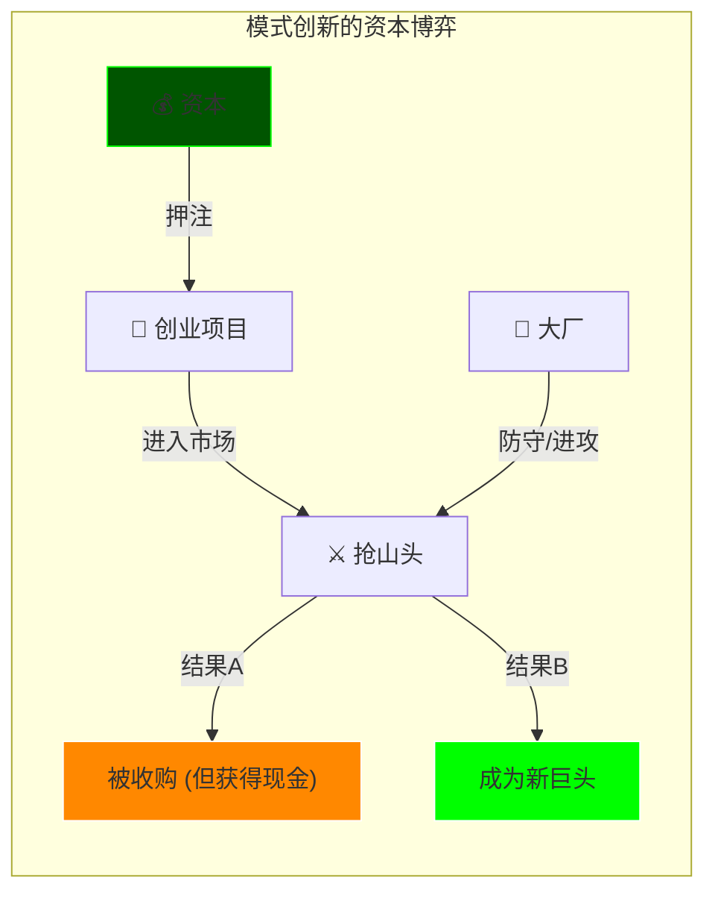
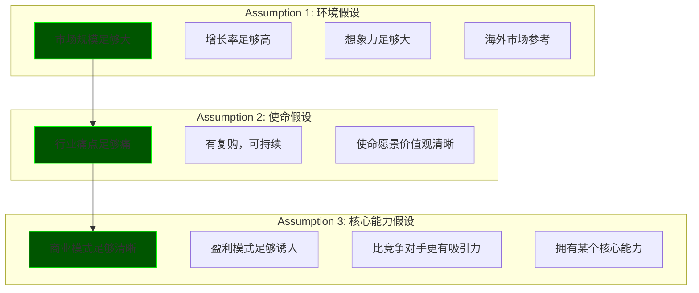

# 2.0_Capital_Leverage (资本的阿基米德点)

> **Tags:** `[Capital]`, `[Startup]`, `[Investment]`, `[Route 2: 万人敌]`
> **Date Added:** `2026-01-09`
> **Source Logic:** Up主 Transcript (资本的阿基米德点 / 路线2)
> **一句话总结:** 当你的想法大到一个人无法执行时，就需要资本杠杆——用支点撬动整座山。

---

## 1. 元认知 (Metacognition) - 为什么学这个？

### 1.1 黄金窗口

> **"经济萧条期，现金为王；经济复苏期，资本为王。"**

当经济开始复苏的时候，**最先将货币兑换为资产的人**，最先享受市场复苏的红利。搬砖和搬山就在一念之间。

### 1.2 搬砖 vs 搬山

有人可能会说，搬山？做梦吧。不用反驳，答案记在心里就好：

| 搬砖 | 搬山 |
| :--- | :--- |
| 永远是搬给别人的 | 哪怕没搬成，搬出一口矿、一个采石场、一块菜地，也是**自己的** |
| 剩余价值被分配 | 这叫**被动资产** |
| — | 哪怕你不会搬，识别那个有潜力的搬山人，递给他锄头——这叫**投资**，分享搬山红利 |

**第四条：** 如果真的没人能搬成，那你现在眼前用到的这一切都不会存在。事实胜于雄辩。

### 1.3 路线2 的适用场景

有时候你会发现，你找到了一个商机，或者说能够解决某个市场痛点的解决方案，但是这件事情**太大了**——大到凭借你一人之力无法完成，没办法用**路线1（一人公司）**跑通并复制。那说明你想到的这件事需要借助于**资本的力量**。

> [!IMPORTANT]
> **资本的逻辑:** 资本往往会流向那些在**单位时间内增长更多**的地方。只要你想干的这件事，能够在单位时间为资本带来更多的收益——跑赢定存、跑赢大盘、跑赢其他创业项目——他们为什么不选择你？

---

## 2. 创新的三座山 (Three Types of Innovation)

在宏观层面审视你的想法，它得至少属于以下三类中的一类：

```text
┌─────────────────────────────────────────────────────────────────────────────────┐
│                      THE THREE MOUNTAINS OF INNOVATION                          │
│                           (创新金字塔)                                           │
├─────────────────────────────────────────────────────────────────────────────────┤
│                                                                                 │
│                            ┌───────────────┐                                    │
│                            │  范式创新      │  ← 最罕见，10年难得一见            │
│                            │  (Paradigm)   │  重新定义行业本质                   │
│                            └───────┬───────┘                                    │
│                                    │                                            │
│                      ┌─────────────┴─────────────┐                              │
│                      │       模式创新             │  ← 怎么卖/怎么赚/怎么组织      │
│                      │       (Model)             │  效率与价值分配               │
│                      └─────────────┬─────────────┘                              │
│                                    │                                            │
│            ┌───────────────────────┴───────────────────────┐                    │
│            │                 科技创新                        │  ← 能不能做出来    │
│            │                (Technology)                    │  硬实力单点爆破     │
│            └────────────────────────────────────────────────┘                    │
│                                                                                 │
└─────────────────────────────────────────────────────────────────────────────────┘
```

### 2.1 科技创新 (Technology Innovation)

*   **解决的问题:** 能不能做出来？
*   **核心:** 基于科学技术、材料、算法或工程学的突破
*   **特征:**
    *   高研发投入
    *   长周期
    *   能够形成明确的**技术壁垒**

| 案例 | 类型 | 突破点 |
| :--- | :--- | :--- |
| 宁德时代 麒麟电池 | 材料与结构 | 电池能量密度突破 |
| OpenAI GPT-4 | 算法 | Transformer + RLHF |
| SpaceX 火箭回收 | 工程学 | 可重复使用火箭 |

> 这是基于一个点的**硬实力的单点爆破**。技术流同学比较受用。

### 2.2 模式创新 (Model Innovation)

*   **解决的问题:** 怎么卖？怎么赚？怎么组织？
*   **核心:** 重组资本、改变成本结构、改变交易方式
*   **特征:**
    *   见效快
    *   门槛相对低（容易被模仿）
    *   依赖**网络效应**构建壁垒

> **"流血的护城河":** 你的项目一出来，你就要和大厂抢山头。没有资本加持，肯定玩完。但如果资本押你赢，甚至下场亲自和你干，那就说明他们铁了心要改变既得利益格局。



### 2.3 范式创新 (Paradigm Innovation)

*   **解决的问题:** 我们到底在做什么？（原问题 / 哲学问题）
*   **核心:** 改变人们看待事物的**底层逻辑 (Mental Model)**
*   **特征:**
    *   重新定义行业的**属性**
    *   重新定义产品的**本质**
    *   伴随**新词汇诞生**
    *   让之前的巨头显得"过时"（而不是"无能"）

| 案例 | 旧定义 | 新定义 | 效果 |
| :--- | :--- | :--- | :--- |
| PayPal | 银行转账 | 互联网支付 | 创造新品类 |
| iPhone | 手机 = 通讯工具 | 手机 = 智能终端 | 诺基亚、摩托罗拉过时 |
| Tesla | 汽车 = 机械产品 | 汽车 = 装轮子的电脑 | 重新定义电动汽车本质 |

> **乔布斯:** "用户根本不知道他自己想要什么，只有我知道。"

---

## 3. 时间机器理论 (Time Machine Theory)

*   **核心:** 你不需要做到**全球首发**，你可以做到**国内首发**，甚至是**某个行业细分的首发**都可以。
*   **本质:** 是的，这就是"抄"。**但不是谁都能抄，也不是谁都能抄得好。**
*   **壁垒来源:**
    *   本土化问题
    *   规模化问题
    *   在抄的过程中解决的大量问题，无形之中塑造了你的核心优势

> [!WARNING]
> **不是抄得越早越好。** 如果你的市场还没有被教育起来，那优势就在后来者那里——因为你可能把太多资本都烧在了教育市场上，而被后来者摘桃子。

---

## 4. 资本三件套 (The Three Documents)

当你在宏观上审视完你的想法之后，接下来是要**系统地梳理**你的想法——把灵光一闪变成一个**商业机器的蓝图**。这样的蓝图会以一个标准构成出现，我们称之为**三件套**。

```text
┌─────────────────────────────────────────────────────────────────────────────────┐
│                         THE THREE DOCUMENTS (三件套)                             │
├─────────────────────────────────────────────────────────────────────────────────┤
│                                                                                 │
│   ┌─────────────────┐     ┌─────────────────┐     ┌─────────────────┐          │
│   │   ONE PAGE      │────▶│       BP        │────▶│   PITCH DECK   │          │
│   │   执行摘要       │     │   商业计划书      │     │   路演 PPT      │          │
│   │   ≤3 页         │     │   几十页         │     │   视频+现场      │          │
│   └────────┬────────┘     └────────┬────────┘     └────────┬────────┘          │
│            │                       │                       │                   │
│            ▼                       ▼                       ▼                   │
│   邮件/社交软件/圈子       投资人深入研究         路演现场 + 答辩              │
│   大范围发送               想了解更多时发送       生动讲述 + 视频素材            │
│                                                                                 │
│   口述版本: Elevator Pitch (30s / 1min / 3min)                                  │
│   用人话，排除学术概念、行业黑话                                                 │
│                                                                                 │
└─────────────────────────────────────────────────────────────────────────────────┘
```

### 4.1 One Page (执行摘要 / Teaser)

*   **篇幅:** 3 页以内，最好 1 页
*   **内容:**
    *   一句话痛点
    *   解决方案
    *   市场规模
    *   核心数据
    *   团队背景
    *   融资需求
*   **目标:** 在 1 分钟不到的时间里让投资人知道你在做什么
*   **用途:** 邮件、社交软件、中间人在圈子里大范围发送

**口述版本: Elevator Pitch**
*   30 秒 / 1 分钟 / 3 分钟
*   用人话，排除所有学术概念、行业黑话
*   让对方知道：你是谁，解决了什么问题，为什么要选择你

### 4.2 BP (Business Plan / 商业计划书)

*   **篇幅:** 洋洋洒洒几十页
*   **定位:** One Page 的完整版
*   **用途:** 当投资人看完 One Page 感兴趣，想要了解更多时发送
*   **资方术语:** MP (Management Presentation)

### 4.3 Pitch Deck (路演 PPT / Road Show)

*   **定位:** 生动讲述的 BP 版本
*   **内容:** 可以呈现视频素材
*   **关键:** **现场提问**（跟论文答辩差不多）——投资人会把特别关心的问题在现场追问

---

## 5. 三件套的内核：德鲁克三假设 (Drucker's 3 Assumptions)

三件套要涵盖的内容，必须覆盖彼得·德鲁克的三大假设（对应 `1.0_Core_Framework.md` 的 1.1~3.6）：



### 5.1 环境假设 (市场)

*   市场规模要**足够大**
*   增长率要**足够多**，要有**足够的想象力**
*   这意味着哪怕竞争对手一拥而上，大家也在相当一段时间里面**不会短兵相接**——各圈各的地
*   **海外市场参考:** 全球视野，本土功夫。你总得知道别人怎么干的

### 5.2 使命假设 (需求)

*   行业痛点要**足够痛**
    *   痒点不行——用户会忍、会替代
    *   痛点就不行——得付费解决
*   要有**复购**，要**可持续**
*   公司的使命、愿景、价值观要**清晰、正向**
    *   不好的企业文化发展着发展着管理跟不上会崩

### 5.3 核心能力假设 (能力)

*   商业模式要**足够清晰**
*   盈利模式要**足够诱人**
*   要比竞争对手**更有吸引力**
*   在各种成熟的商业分析框架下表现**出色**
*   最好已经拥有了某个**核心能力**

---

## 6. 数字的语言 (The Language of Numbers)

> **资方非常看重数字。** 语言的修辞往往存在滤镜，但是**数字总是比修辞更加可靠**。

### 6.1 财务模型 (Financial Model)

**这是创始人喜欢忽略，但资方极为重视的。** 你不能拿我的钱去乱烧。

财务模型至少包含：
*   未来 **3~5 年**的收入预测
*   成本结构
*   利润表
*   现金流预测

### 6.2 核心指标 (Key Metrics)

| 指标 | 英文 | 含义 |
| :--- | :--- | :--- |
| **获客成本** | CAC (Customer Acquisition Cost) | 获取一个客户花多少钱 |
| **生命周期价值** | LTV (Lifetime Value) | 一个客户一辈子给你贡献多少钱 |
| **烧钱速度** | Burn Rate | 每个月烧多少钱 |
| **毛利** | Gross Margin | 毛利率 |

> [!IMPORTANT]
> **投资人通过模型看什么？** 他不是看这些数字本身，而是通过模型看到你的**商业逻辑是否跑得通**——因为早期来讲，预测通常都不准。但他就是干这个的，他知道你这些数字背后的**逻辑**和**能量**有多大。

### 6.3 股权结构 (Equity Structure)

资方非常重视股权结构是否**健康**：
*   股权分配情况（创始人、联合创始人、期权池 ESOP）
*   过往投资人的持股比例
*   创始人有没有**足够的控制权**
*   有没有不合理的**股权代持**

---

## 7. 当前市场现实 (Market Reality)

> **曾几何时那种光凭一个 DEMO 就可以拿到钱的时候已经不存在了。如果你还以为靠几页 PPT 就能融到钱，那可能得重生在十几年前。**

**当前环境要求:**


*   你可能需要**烧一些自己的钱**先跑起来
*   做出**最小可行性产品 (MVP)**——砍掉很多终极形态的功能，仅保留核心功能
*   投放到市场上，获得客户，**用户愿意为之付费**
*   在拿到这样的结果下，资方对你的投资意愿会高很多

---

## 8. Anti-Patterns (反模式 - Teacher Mode)

### Trap 1: PPT 融资幻觉

*   **Trap:** 以为靠几十页精美的 PPT 就能融到钱。
*   **Why:** 这是十几年前的一级市场玩法。当时资本充裕，创业风险高收益高，投资人愿意赌早期。现在资本收紧，投资人要看到**真实的牵引力 (Traction)**。
*   **Fix:** 先烧自己的钱，做出 MVP，跑出数据，带着**结果**去融资。
*   **Positive Real Scenario:**
    *   **拼多多早期:** 黄峥没有一开始就找资本，而是先用自己的钱跑通了拼团模型，证明了用户愿意付费、愿意拉人，再带着数据去找投资。

### Trap 2: 抄得太早

*   **Trap:** 看到美国有个新东西，立刻复制到中国。
*   **Why:** 如果市场还没有被教育起来，你就把资本都烧在了教育市场上，结果被后来者摘桃子。
*   **Fix:** 等市场被初步教育后再进入，用**更高效的执行力**碾压先行者。
*   **Nuance:** 时间机器理论的关键不是"最早"，而是"**刚刚好**"。

### Trap 3: 忽视财务模型

*   **Trap:** 觉得财务模型只是走形式，随便编几个数字。
*   **Why:** 投资人不是看你的数字预测准不准（早期肯定不准），而是看你的**商业逻辑是否自洽**。如果你连自己的成本结构、盈利模型都说不清楚，说明你没想清楚。
*   **Fix:** 认真做财务模型，把每一个假设的来源、依据都标注清楚。
*   **Positive Real Scenario:**
    *   **Stripe:** 早期融资时，Patrick Collison 的财务模型非常清晰，每一个假设都有数据支撑，投资人看完模型就知道这个人是认真的、想清楚了的。

---

## 9. Glossary (术语表)

*   **阿基米德点 (Archimedes Point):** "给我一个支点，我能撬动地球。" 资本就是撬动大创意的支点。
*   **科技创新:** 基于技术、材料、算法、工程学的创新，解决"能不能做出来"的问题。
*   **模式创新:** 改变怎么卖、怎么赚、怎么组织，解决"效率和价值分配"的问题。
*   **范式创新:** 改变人们看待事物的底层逻辑，重新定义行业属性和产品本质。10 年难得一见。
*   **时间机器理论:** 不需要全球首发，可以做国内首发或细分首发。本质是"抄"，但在抄的过程中解决的问题构建了壁垒。
*   **One Page / Teaser:** 1~3 页的执行摘要，用于大范围传播。
*   **BP (Business Plan):** 几十页的商业计划书，用于投资人深入研究。
*   **Pitch Deck:** 路演 PPT，用于现场演示 + 答辩。
*   **Elevator Pitch:** 30 秒~3 分钟的口述版 One Page。
*   **CAC (Customer Acquisition Cost):** 获客成本。
*   **LTV (Lifetime Value):** 客户生命周期价值。
*   **Burn Rate:** 烧钱速度。
*   **Gross Margin:** 毛利率。
*   **MVP (Minimum Viable Product):** 最小可行性产品，砍掉终极形态功能，仅保留核心功能。
*   **Traction:** 牵引力，证明产品有市场需求的实际数据。
*   **ESOP (Employee Stock Ownership Plan):** 员工期权池。

---

## 10. Formula Table (公式表 - 3D Knowledge)

| Formula Name | Equation / Logic | Variable Definition |
| :--- | :--- | :--- |
| **Capital Logic** | `Investment Value = ROI x Time Efficiency` | 资本流向单位时间增长更多的地方 |
| **Innovation Pyramid** | `Impact = Technology ∪ Model ∪ Paradigm` | 三类创新可叠加 |
| **Unit Economics** | `LTV / CAC > 3` | 健康的单位经济模型 |
| **Runway** | `Runway (months) = Cash / Burn Rate` | 现金跑道 |

---

## 11. 系统关联 (Interlinkages)

*   **上游 (Input):** [1.0_Core_Framework.md](./1.0_Core_Framework.md) - 德鲁克三假设
*   **平级 (Parallel):** [1.2_Solopreneur_System.md](./1.2_Solopreneur_System.md) - 路线1（一人公司）
*   **下游 (Output):** 未来可展开 "2.1_Due_Diligence.md" (尽职调查)

---

## 备注与引用 (Notes & References)

*   **Source:** Up主视频 Transcript (资本的阿基米德点 / 路线2 / 万人敌)
*   **Key Quote:** "搬砖永远是搬给别人的，搬山哪怕没搬成，搬出一口矿也是你自己的。"
*   **Cross-Reference:** [1.0_Core_Framework.md](./1.0_Core_Framework.md) → 德鲁克三假设完整版
