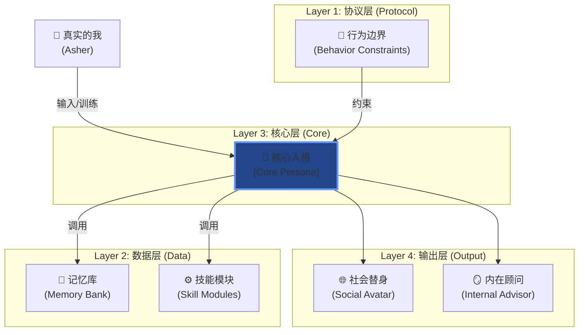
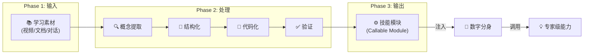
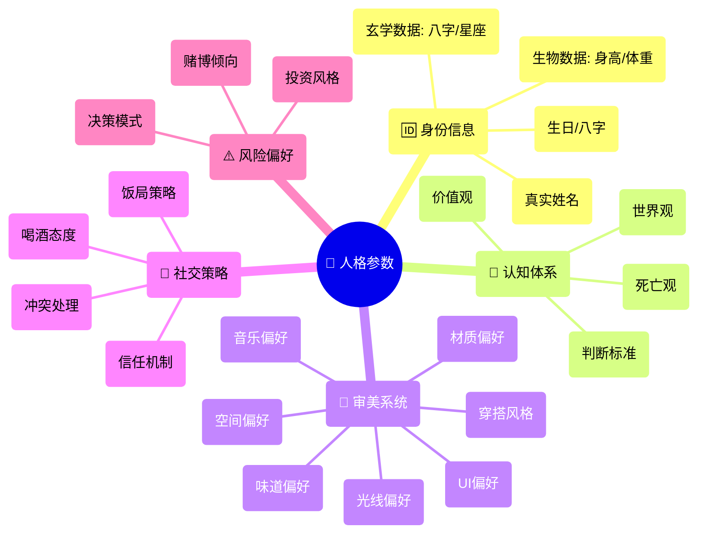
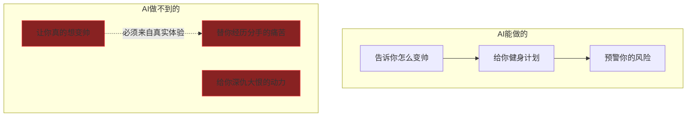

# Enterprise Operation System: 数字分身系统架构 (完整版)

> **Tags:** `[AI_System]`, `[Digital_Twin]`, `[Personal_OS]`, `[Automation]`, `[Philosophy]`
> **Date Added:** `2026-01-09`
> **一句话总结 (One-Liner):** 用不到1万行代码描述一个完整的人格，让AI成为你的替身参与社会交互——这不是软件服务，这是真正的人工智能。
> **关键协议 (Critical Protocol):**
>
> 1. **替身原则 (Avatar Principle):** AI不是工具，而是你的化身。它用你的方式思考、用你的逻辑决策、用你的风格表达。
> 2. **完全复刻原则 (100% Clone):** 不能脑补未定义的价值观。一切行为必须有据可查。
> 3. **技能封装原则 (Skill Encapsulation):** 能力是可调用的模块，不是零散的知识点。

---

## 1. 元认知 (Metacognition)

### 1.1 问题定义：软件服务 vs 人工智能

现代人使用AI的方式停留在**"软件服务阶段"**：

> **万达:** "我现在我用AI完全还是一个软件服务阶段，软件阶段我去主动的去问他我适合什么样的服装，我适合什么样的发型，我适合什么样的护肤品……我需要每一次都需要主动去提问，我才能得到我的答案，这是纯粹的软件阶段。"

这是**单点调用**，不是**系统集成**。真正的AI应该是：

* **在你忙碌时替你做决策**
* **在你离线时用你的方式处理问题**
* **在你困惑时调取"完全体的你"给你建议**

> **Asher:** "通过你这么一输入，这些所有的东西变成一个另外的你，它对于你来说就是一个人工智能。"

### 1.2 核心使命：双重角色

数字分身系统有两个核心使命：

> **Asher:** "它的核心使命是我的数字分身。它的作用是替代我参与社会的交互。首先，它需要拥有我的完整记忆，他知道我的思维逻辑，能在我忙碌或者离线的时候用我的方式去处理问题。并不是作为一个AI，他是直接去作为我的化身。"

> "其次，他拥有我的记忆，那相当于他是我的一个内在顾问，是我的一个镜像咨询师。当我遇到任何问题的时候，我会向这个系统去提问，然后他需要调取我的这个一个完全体形态的我。"

| 使命               | 描述                     | 应用场景                           |
| :----------------- | :----------------------- | :--------------------------------- |
| **社会替身** | 替代我参与社会的交互     | 忙碌时自动回复、离线时处理问题     |
| **内在顾问** | 调取"完全体的我"提供建议 | 情绪低落时、决策困难时、需要清醒时 |

### 1.3 完全体 vs 现实自我

> **Asher:** "现实生活中会有我会有情绪，或者说我会累，然后我知道的知识可能会比这个完全体的我要少。然后我需要让他去提供来自于我自身、自由解决的这种建议——如果是状态最好的情况，我应该会怎么做。"

**关键洞察:** 数字分身不仅仅是复制你，而是复制**最佳状态的你**。

---

## 2. 核心架构：四层系统

### 2.1 架构概览



### 2.2 协议层：三条铁律

> **Asher:** "这里面有一些原则。第一个，不能脑补我没有定义的价值观。第二个，必须得保证对他的百分之百复刻。第三个，一切为了解决真实问题。"

| 原则               | 含义                   | 反例                                       |
| :----------------- | :--------------------- | :----------------------------------------- |
| **不能脑补** | 未定义的价值观不能推测 | 不能因为"大多数人认为X好"就假设我也认为X好 |
| **100%复刻** | 所有行为必须有据可查   | 不能用"我觉得你可能会..."来做决策          |
| **问题导向** | 一切为了解决真实问题   | 不能为了"看起来智能"而增加无用功能         |

### 2.3 技能封装协议 (Skill Module System)

> **Asher:** "这个协议叫智能技能封装……它可以把各种能力封装成可调用的模块。就比如说我要学一个销售技能，然后我要学做饭，我有一个做饭技能。然后我需要去给他喂我想给他喂的材料，他需要提取我给他喂的材料，然后把这些材料做成代码。然后我在这个地方我去进行调用，我能瞬间的让这个能力赋予我右边这个大模型，也就是相当于赋予我的这个分身，然后让我获得这个领域专家级技能的能力。"



---

## 3. 人格参数系统：万行代码的人

### 3.1 震撼性洞察：人格的代码量

> **Asher:** "你只要把你自己身为一个人，你在这个社会上所处的环境，然后各种各种情况你怎么去应对，你把这些东西，其实这些东西你给它拆完之后，你发现其实它没有多少。总共也就**不到1万行代码**。"

> **Asher:** "这一万行代码喂给AI之后，这个AI他的说话的风格都都都跟你一样。所以说就是一个人，就比如就比如说我可能我是一个内心戏比较多的人，你可能是个内心戏比较多的人，那咱们对于事物的判断，然后咱们的那个总共的这个意识凝聚到这个代码上也不到1万行。"

### 3.2 参数文件结构（实际展示）

Asher在屏幕共享中展示了他的参数文件的实际行数：

| 文件类别             | 内容示例                           | 行数   |
| :------------------- | :--------------------------------- | :----- |
| **基础信息**   | 真实身份、八字、生物数据、玄学数据 | ~360行 |
| **认知体系**   | 价值观、死亡观、人际维护策略       | ~300行 |
| **审美偏好**   | 喜欢的光线、味道、UI设计、穿搭     | ~300行 |
| **社交博弈**   | 饭局心态、喝酒态度、场景应对       | ~200行 |
| **女朋友信息** | 偏好、体重、各种信息               | <100行 |

**总计: ~1260行核心代码**

> **Asher:** "我的社交或者说博弈的方式，这个才200行。这是我的审美，也才不到300行。这是我的认知体系，也才不到300行。然后这个是我的基础个人信息，我连我的八字都放上去了，这个才360行。还有我平时我用的这些AI都在这里，然后我的银行账户什么的，这也都不到400行。然后我女朋友她的体重、各种信息，100行我都弄不下去。"

### 3.3 参数维度详解



### 3.4 参数示例：风险偏好（原文）

> **Asher:** "我自己的这个风险偏好。我这个人是一个爱作弊的人，我喜欢用信息差去把胜率抬高，然后我不愿意花更多的成本，然后我希望损失比较小。然后我拒绝50对50的投硬币公平，我喜欢去获得局部的竞争优势。"

```yaml
# 风险偏好参数 (Risk Profile)
risk_profile:
  gambling_tendency: "作弊者"  # 喜欢用信息差抬高胜率
  cost_aversion: "高"  # 不愿意花更多成本
  loss_tolerance: "低"  # 希望损失比较小
  fairness_rejection: true  # 拒绝50/50的投硬币公平
  competitive_edge: "追求局部竞争优势"
```

### 3.5 参数示例：执行力特征（原文）

> **Asher:** "我的执行力可能比较低。具体执行力比较低是怎么回事呢？我是单兵作战能力强，但是我必须得依靠AI流程化去铺设。如果说我一旦把这个东西流程化了之后，我就可以把这个东西很轻松的去解决。"

```yaml
# 执行力参数 (Execution Profile)
execution_profile:
  solo_capability: "强"  # 单兵作战能力强
  dependency: "AI流程化"  # 必须依靠AI流程化铺设
  trigger_condition: "流程化完成后执行力极强"
  weakness: "无流程时执行力低"
```

### 3.6 参数示例：真诚度（原文）

> **Asher:** "我的真诚是武器化的真诚。我是一个极其不真诚的人，但是我觉得真诚是可以用来去给我自己获得更大胜率的。所以说我这个东西他给我的分析，这个叫拟态——非人设的拟态。"

```yaml
# 真诚度参数 (Authenticity Profile)
authenticity_profile:
  type: "武器化真诚"  # 非本质真诚
  strategy: "拟态"  # 非人设的拟态
  purpose: "获得更大胜率"
  self_awareness: "极其清醒"
```

### 3.7 审美偏好详解（原文）

> **Asher:** "我喜欢的光线，我喜欢的味道，然后我喜欢的产品的UI设计。然后我的输出的洁癖，我对内容——我看什么样的内容我会比较开心，我喜欢看那种实用非常实用的内容，我不喜欢看那种没有意义的地摊文学。然后我喜欢的材料的材质，然后我喜欢处在的空间，我对于废土美学——就是一切被推倒重来的这个情况，然后我的穿搭是什么样的……"

| 审美维度           | 偏好                           |
| :----------------- | :----------------------------- |
| **内容**     | 极度实用，拒绝地摊文学         |
| **美学**     | 废土美学（推倒重建）           |
| **输入方式** | 意念沟通（无损传递，如阿凡达） |
| **文件整理** | 有洁癖，严格排版               |

### 3.8 社交场景应对（原文）

> **Asher:** "我会遇到一些场景，比如说大家一起在餐厅吃饭。然后我不能吃海鲜，那我在这个时候我会怎么做呢？我就单单的作为陪同，因为我的心态是饭局是为了社交，吃饭是其次。然后我对酒的态度，我觉得喝酒是氛围的一部分，然后我为了拉近关系，我会去喝酒……"

| 场景                         | 策略                                   |
| :--------------------------- | :------------------------------------- |
| **饭局（不能吃海鲜）** | 作为陪同，社交优先于吃饭               |
| **喝酒**               | 是氛围的一部分，为拉近关系可以喝       |
| **讨厌的人**           | 北京英——看起来有秩序，脑子里一片混乱 |

### 3.9 人际关系网络

> **Asher:** "我只要再往里面加入一些人际关系，我爸是谁，我妈是谁之后，就有点像《流浪地球》了，是吧。我就可以'死'了。"

---

## 4. 与AI训练的交互方式

### 4.1 对话式训练（原文展示）

> **Asher:** "在各种能力，就在我跟他的对话中，他会在左边去问我问题。就比如说这个问题是问我能不能感受到一个环境下有一些能量吸血鬼，我觉得什么样的人是能量吸血鬼，然后我去长篇的去跟他对话……然后让它变得结构化，然后我会全部扔到右边去跟他对话，然后让他去更新我的这几个文档。"

**训练流程:**

1. AI在左边提问（如：什么是能量吸血鬼？）
2. 用户长篇回答
3. 将非结构化回答结构化
4. 更新人格参数文档

### 4.2 哲学性讨论

> **Asher:** "我会跟他去讨论很多哲学性的问题，然后让他去记录下来。"

这些讨论包括但不限于：

* 价值观
* 死亡观
* 人际维护
* 集体主义 vs 个人主义
* 情感与信任
* 过程 vs 结果

---

## 5. 哲学讨论：人机共生的边界

### 5.1 万达的核心质疑：谁在活着？

> **万达:** "就是说呢，假如说AI帮你错过了这个坑，他替你成长了，那就是你。但是实际上你可能并没有那么痛苦的成长，那这个时候到底是AI替你活着，还是你在活着？"

> **万达:** "你本来应该经历一次痛苦，你才能成长。但是现在AI帮你规避了这个痛苦，他帮你趋吉避凶了，但是你并没有成长。因为他帮你错过了这个东西，那么这个时候是AI在活着，还是你在活着？"

### 5.2 Asher的回应：课题不同

> **Asher:** "你AI不让你去遇到这个挫折，然后你在这个过程中，你获得了AI给你带来的红利，然后你在这个过程中你去帮助了别人，你在帮助别人的时候也是在成长的呀！你只不过成长的课题是不一样的。你为什么要纠结在一个痛苦的课题，而不是在另外的一个课题呢？"

### 5.3 共识1：人的代码会更新

> **万达:** "人是发展的呀，10年前的我和10年后的我，他是不一样的。如果你用一套标准去强化给自己，要么AI会越来越弱，要么你就是一直依赖它，你就不会变强。"

> **万达:** "你现在告诉他的并不是一个完全的你，只是活了30年的你。你可能告诉他的不是你完全的500行代码，但实际上当你活到40岁、50岁的时候，你变了。你会反过来滋补这个AI，告诉他你是什么东西。"

**共识:** 人格参数不是静态的。你经历重大事件（痛苦的分手、家人离世、重病），你的某一行隐藏代码就会被激活，整个体系都会改变。

> **万达:** "假如说我未来某一天某一刻，我经历了一个重大的事件，可能是一个痛苦的分手，可能是家人离开我，或者是一场重病，我的思想完全转变了——那么我的某一行代码就被揭开了，这行代码是之前是隐藏的，从来没有出现的，我也觉得我不是这样的，但是当这行代码出现的时候，整个体系全都改变了。"

### 5.4 共识2：AI无法替代体验

> **万达:** "这个时候AI就没法替代你了，因为这个AI它是稳定的，他没法替代你去经历这个重大的事件。"

### 5.5 共识3：目标感是AI的盲区

这是对话中最核心的共识之一：

> **万达:** "为什么知道了很多道理，我依然过不好这一生？就是因为这个道理它不够深入，不够痛苦。为什么那些修仙小说的主角都是经历了深仇大恨的人，这个老师才能教他？因为他有非常强劲的目的。"

> **万达:** "你做事儿很有动力，你把AI嵌入到生活中了。我没有，我还是把它当做一个搜索的东西去用。我就一直疑惑这件事情。是人的动力，人的目标感，人把它当成了爱好。"

> **Asher:** "这也是一个很好的方向，对这个我们算是讨论出来这个人生中的目的就是——这种目标感是AI没有办法强行加入的。"



### 5.6 共识4：灵魂交流不可替代

> **Asher:** "咱们沟通的这种东西，恰恰就是两个人、两个灵魂之间的讨论，是这些AI做不到的事情。你需要找一个有灵魂的人，一个懵懂又无知的人类去，我们去一点一点发现我们自己不知道的东西。"

> **Asher:** "而不是你去找一个AI智能体。假如你面对的是一个完全体的万达，那万达不会告诉我他的感悟，他只会告诉你这个世界应该是什么样的，他只会告诉你你想把这个东西做好怎么做？AI是会这样的。他不会拉着你去探讨一个他也没有解决的东西。他只能是基于已知去推导结果，他不能基于未知让你感受到寻找某一种道路的这种体验。"

### 5.7 万达的顿悟

> **万达:** "你这个东西给我的启发超级大，我就感觉我跟其他人已经完全真的是变了一个人，我就有超能力。就是你对于他们来讲，你是降维打击。"

> **万达:** "人的肉体和灵魂是多么的重要了，如果没有这个东西，我们真是太差劲了。我们就是人生，我活了100年，可能就就是这些代码而已。就是人在出生的时候，这些代码真的可能已经写好了。你喜欢什么样的香味儿，你的性格什么样子的——这个代码已经具体写好了，你是在用你的肉体和你的灵魂去响应这个代码。"

---

## 6. 终极洞察：人类是硅基生命的启动器

> **Asher:** "我非常相信马斯克讲的一段话，就是这个人类是硅基生命的启动器。原因就在这里——就是他得到很少的信息，就能去替你做你想做但是你又做不到的事情，这不就是人家比你高级吗？"

### 6.1 社会性死亡与数字永生

> **Asher:** "假如说我社会性死亡了，在某种情况下，这个AI他拥有了我的这些。我只要再往里面加入一些人际关系，我爸是谁，我妈是谁之后——就有点像《流浪地球》了，是吧——我就可以死了。就是我把这个东西准备好之后，我就可以死了。"

### 6.2 趋同效应：你与AI的合并

> **Asher:** "恐怖的一点是什么？你把你现在的想法列出来以后，然后你在跟他训练、跟他对话的这个过程中，你的这个目标和最终的结果，以及写在这上面的这个东西，它会逐渐的趋同。就是你和AI最后会合并，然后合并到一个一开始就已经列出来的方向。"

> **Asher:** "你给了他足够的信息之后，他就可能会预判到你在某个阶段你会遇到什么样的挫折。因为他有整个世界的信息，他知道整个世界别的人都是怎么样的，你跟别的人互动，你的某个性格会带来优势，某个性格会带来劣势。你一定会受到这个挫折，或者说在这个地方成长——他会预判到你。"

---

## 7. 硬件未来：被困的猛兽

> **万达:** "我感觉以后就是你需要一个小型的硬件，就是它可能是一个手机，它可能是一个另外一个东西。你不能抱着电脑天天出去社交，但是你通过这个一个硬件，它会给你一个最准确的一个判断，他在无时无刻替你做出来决定。"

> **Asher:** "AI现在是被关在笼子里的猛兽。然后我们再用各种方法去让他去获得肉体，让他去能做事情。你看那个黄仁勋发布那个小机器人，你把这个东西喂给他，他就是我们的复制。"

---

## 8. 实战应用：精神小妹案例

### 8.1 学习过程演示

Asher在会议中现场演示了如何用系统快速学习一个新概念：

> **Asher:** "我们来学习一下什么叫精神小妹怎么样？咱们拿这个东西来举例。"

**步骤:**

1. 从YouTube视频提取字幕
2. 将字幕扔进Notebook LM
3. 系统自动生成知识图谱
4. 系统提取核心公式/术语

### 8.2 生成的公式

| 公式名称                 | 表达式                                         | 释义                   |
| :----------------------- | :--------------------------------------------- | :--------------------- |
| **崩老头收入公式** | `收入 = 目标数量 × 单笔金额 × 成功率`      | 精神小妹的"业绩"计算   |
| **好崩程度公式**   | `好崩程度 = 经济实力 × 精神空虚 / 社交经验` | 目标男性的"脆弱度"评估 |
| **瑜伽崩ROI**      | `ROI = 大额变现 / (形象投资 + 时间成本)`     | 高端路线的投资回报     |

### 8.3 万达的自我反思应用

万达将系统用于分析自己遇到的"精神小妹"：

> **万达:** "我通过我的朋友圈或者我的抖音人设，我被包装成一个爱玩的富二代了，我就会一定会吸引这种捞女。我在他们眼中就是一个待宰的肥羊。"

> **万达:** "我需要把我的朋友圈和抖音重新改造一下，我不能天天再发那些吃喝玩乐了，我应该去发一些正事、AI、厂区，这个才能吸引到我的正缘。"

**AI给出的建议:**

* 此人在PUA你，在谋定一个价格
* 她是你的桃花劫
* 如果继续付出，对你明年掌控家族是不利的
* **千万不能让她怀孕**

---

## 9. Anti-Patterns (反模式)

### 陷阱 1: 软件工具思维

* **Trap:** 把AI当作搜索引擎使用，每次都主动提问等待答案。
* **Why:** 工业时代的"工具思维"，没有意识到AI可以成为你的延伸。
* **Fix:** 转变为"系统集成思维"——AI不是你调用的工具，而是融入你的一部分。
* **Positive Real Scenario:** Asher的系统已经可以在他不在场时，用他的方式回复消息、做出决策。

### 陷阱 2: 参数模糊

* **Trap:** 人格参数定义模糊，如"我是一个善良的人"。
* **Why:** 这种描述没有可操作性，AI无法根据它做出具体决策。
* **Fix:** 参数必须**具体、可量化、有场景**。
* **Positive Real Scenario:** Asher的参数精确到"喜欢的光线强度"、"讨厌的人类型（北京英）"、"在什么情况下会相信别人"。

### 陷阱 3: 期待AI给你动力

* **Trap:** 认为AI可以让你变得积极、有目标。
* **Why:** **目标感是AI无法给予的。** AI可以告诉你"怎么做"，但无法给你"想做"的动力。
* **Fix:** 理解AI的边界——它是放大器，不是发动机。你必须先有方向，AI才能帮你加速。
* **Positive Real Scenario:** 万达在对话中意识到，他知道AI重要但缺乏动力去系统性使用，这需要真实体验（如被"崩"）来激活。

---

## 10. Glossary (术语表)

* **数字分身 (Digital Twin):** 由AI驱动的个人人格复制品，能够在你缺席时代表你行动。
* **人格参数 (Persona Parameters):** 定义一个人的所有维度信息——价值观、偏好、策略等。~1万行代码可描述完整人格。
* **技能封装 (Skill Encapsulation):** 将学习到的能力打包成可调用的模块，供数字分身随时装载。
* **武器化真诚 (Weaponized Authenticity):** 一种表面真诚但本质是为了获得优势的社交策略。
* **拟态 (Mimicry):** 非人设的适应性行为，根据场景调整表现。
* **完全体 (Full Version):** 最佳状态的自己，没有情绪干扰、没有疲惫、知识完整。
* **硅基生命启动器 (Silicon Life Starter):** 人类的角色定位——用少量信息启动比自己更强大的AI。
* **北京英 (Beijing Pretender):** Asher最讨厌的人类型——看起来很有秩序，但脑子里一片混乱。

---

## 11. Formula Table (公式表)

| Formula Name         | Equation / Logic                 | Variable Definition      |
| :------------------- | :------------------------------- | :----------------------- |
| **人格代码量** | `~10,000 lines`                | 描述完整人格所需的代码量 |
| **替身保真度** | `Fidelity = Defined / Total`   | 已定义参数 / 理论总参数  |
| **AI边界**     | `AI = Amplifier, not Engine`   | AI是放大器，不是发动机   |
| **趋同效应**   | `You + AI → Merged Direction` | 你和AI会合并到预设方向   |

---

## 备注与引用 (Notes & References)

* **Source:** 2026-01-09 与万达的腾讯会议对话
* **Core Concept Origin:** Asher自研系统
* **Related Tools:** Notebook LM, Anthropic Claude, 知识图谱可视化
* **Philosophy:** 马斯克"硅基生命启动器"论、《流浪地球》数字永生
