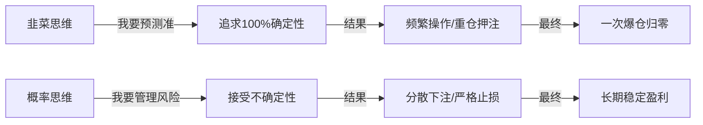
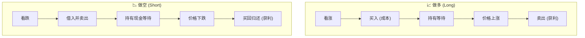
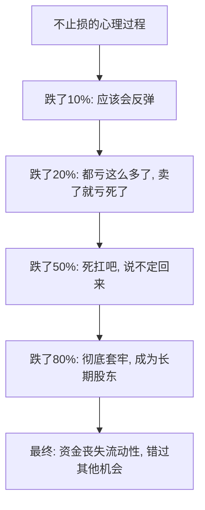
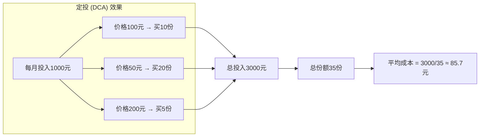
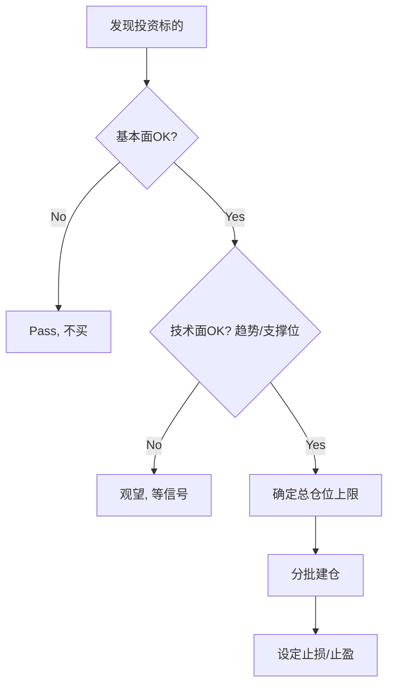
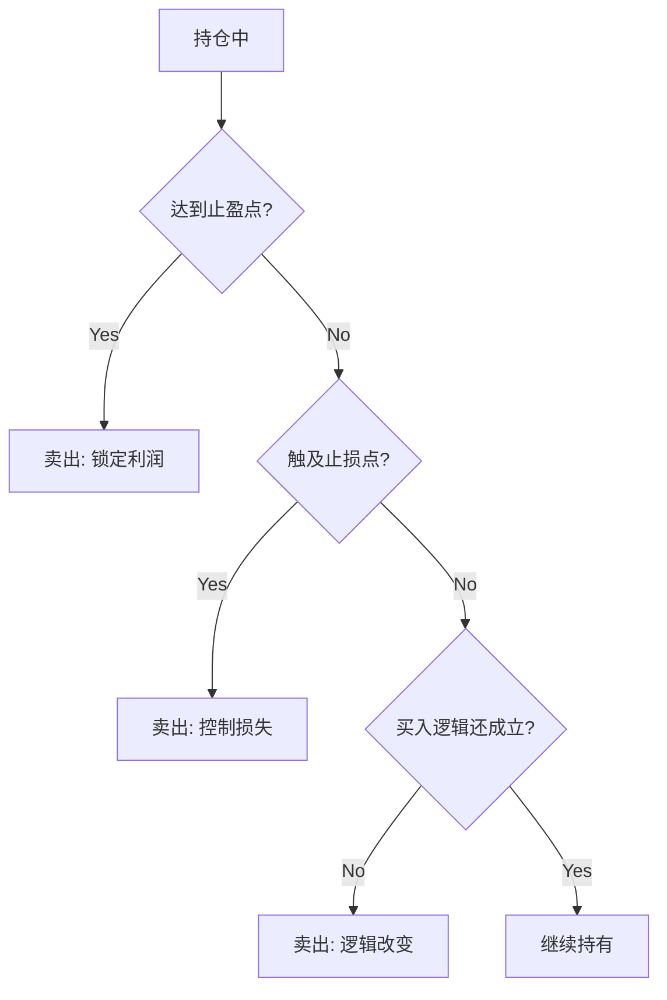
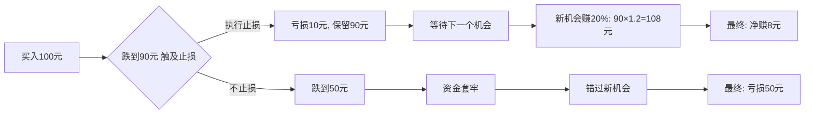
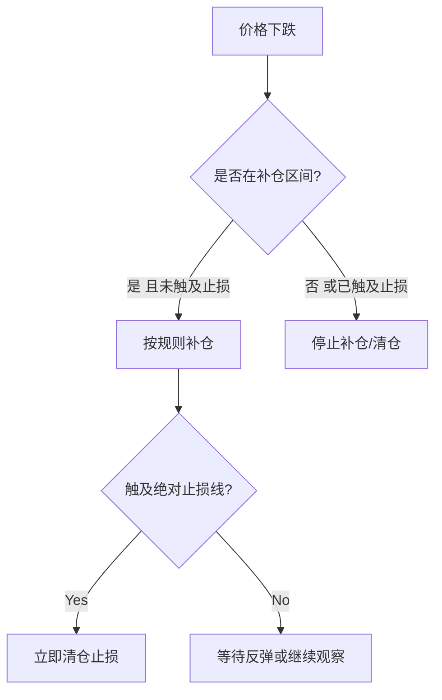

# Trading Fundamentals: 投资交易入门操作体系

> **Tags:** `Investment`, `Trading`, `Risk Management`, `Position Sizing`
> **Date Added:** `2026-01-14`
> **一句话总结 (One-Liner):** 投资交易的本质是**概率游戏中的风险管理**——不是预测市场，而是在不确定性中控制损失、放大收益。
> **关键协议 (Critical Protocol):**
> 1.  **结构服从内容 (Structure Follows Content):** 本文档按照"认知→操作→风控"的逻辑链条组织。
> 2.  **原子级视觉化 (Atomic Visualization):** 每个核心概念配图。
> 3.  **拒绝阉割 (No Summary):** 保留所有"为什么"的解释。

---

## 1. 元认知 (Metacognition) - 交易的本质是什么？

### 1.1 问题定义

大多数人对投资交易的理解停留在"低买高卖"——这是一个**正确但无用**的废话。真正的问题是：
- **什么时候买？** (Entry)
- **买多少？** (Position Sizing)
- **什么时候卖？** (Exit)
- **亏了怎么办？** (Risk Management)

### 1.2 核心哲学：概率思维 vs 确定性思维

> **交易的本质不是预测，而是下注。**

你永远无法100%确定明天涨还是跌。但你可以做到：
- 让**赢的时候赚得多** (盈利最大化)
- 让**输的时候亏得少** (损失最小化)

这就是为什么"高手"和"韭菜"的区别不在于预测准确率，而在于**风险收益比**。

### 1.3 系统定位

本模块是 **Asher 财务自由系统** 的操作层。它回答的问题是："我理解了宏观趋势后，**具体怎么操作**？"

> [!IMPORTANT]
> **核心洞察 (Key Insight):**
>
> **"20%止损法则"的数学原理：** 如果你亏损20%，你需要**盈利25%**才能回本；如果亏损50%，你需要盈利**100%**才能回本。亏损和回本不是线性关系！
>
> | 亏损幅度 | 需要盈利才能回本 | 难度等级 |
> |---------|-----------------|---------|
> | -10% | +11.1% | 容易 |
> | -20% | +25% | 中等 |
> | -30% | +42.9% | 困难 |
> | -50% | +100% | 极难 |
> | -70% | +233% | 几乎不可能 |
> | -90% | +900% | 基本归零 |

---

## 2. 核心架构 (Core Framework) - 交易术语体系

### 2.1 方向类术语 (Direction)

#### 做多 (Long / 买涨)
**定义：** 你认为价格会**上涨**，所以先买入，等涨了再卖出赚差价。

**操作流程：**
1. 看涨 → 买入 (成本100元)
2. 价格上涨 → 卖出 (卖出120元)
3. 利润 = 120 - 100 = **+20元**

**隐喻：** 像买房一样——你预期房价涨，先买入，涨了卖出赚差价。

#### 做空 (Short / 买跌)
**定义：** 你认为价格会**下跌**，所以先借来卖出，等跌了再买回来还给人家，赚中间的差价。

**操作流程：**
1. 看跌 → 借入资产并卖出 (卖出得到100元)
2. 价格下跌 → 买回 (花80元买回)
3. 还给借方，利润 = 100 - 80 = **+20元**

**隐喻：** 像借朋友的包卖掉，等降价了再买个一模一样的还给他，差价归你。

> **为什么做空更危险？**
> - 做多：最多亏100%（本金归零）
> - 做空：理论上可以亏**无限大**（价格可以无限上涨）

---

### 2.2 仓位类术语 (Position)

#### 仓位 (Position)
**定义：** 你投入的资金占总资金的比例。

**隐喻：** 仓位就是你的"筹码量"。

| 术语 | 仓位比例 | 含义 |
|------|---------|------|
| **空仓** | 0% | 全部是现金，没有任何投资 |
| **轻仓** | 10-30% | 小部分资金入场，试探性投资 |
| **半仓** | 50% | 一半资金投入，一半现金观望 |
| **重仓** | 70-90% | 大部分资金投入，看好后市 |
| **满仓** | 100% | 全部资金投入，没有现金储备 |

#### 开仓 (Open Position / 建仓)
**定义：** 从空仓状态开始买入，建立头寸。

#### 加仓 (Add Position)
**定义：** 在已有仓位基础上继续买入，增加投资规模。

**关键问题：什么时候加仓？**
- **越涨越买 (追涨加仓):** 趋势确认后顺势而为
- **越跌越买 (补仓/抄底):** 认为价格被低估，趁低吸纳

> **警告：** 盲目"越跌越买"是韭菜最常见的死法——因为你不知道底在哪。

#### 减仓 (Reduce Position)
**定义：** 卖出部分持仓，降低风险敞口。

#### 清仓 (Close Position)
**定义：** 卖出全部持仓，彻底退出该投资。

---

### 2.3 盈亏类术语 (Profit & Loss)

#### 浮盈 / 浮亏 (Unrealized P&L)
**定义：** 你还没卖出，但按当前价格计算的账面盈亏。

**隐喻：** "纸面富贵"——只有卖出锁定利润后才是真的赚了。

#### 止盈 (Take Profit / TP)
**定义：** 设定一个目标价格，涨到这个价格就**自动卖出锁定利润**。

**为什么需要止盈？**
- 贪婪是人性——不设止盈，涨了还想涨更多，结果坐过山车
- 利润不锁定就是浮盈，浮盈不是真钱

#### 止损 (Stop Loss / SL)
**定义：** 设定一个底线价格，跌到这个价格就**自动卖出控制损失**。

**为什么止损是铁律？**

**止损的心理障碍：**
- **损失厌恶：** 人类对损失的痛苦是同等收益快乐的2倍
- **锚定效应：** 总是用买入价作为参考点，不愿承认错误
- **沉没成本谬误：** "都亏这么多了，再亏一点也无所谓"

> **止损的本质不是认输，而是保存实力等待下一次机会。**

---

### 2.4 分阶段买入策略 (Dollar-Cost Averaging & Pyramiding)

#### 为什么不要一次性满仓？

1. **没有人能精准抄底：** 你以为的"底"可能只是半山腰
2. **保留子弹的灵活性：** 如果继续跌，你有钱补仓摊低成本
3. **降低心理压力：** 分批买入让你更从容

#### 定投 (Dollar-Cost Averaging / DCA)
**定义：** 不管涨跌，固定时间、固定金额买入。

**原理：**
- 价格高时，同样的钱买得少
- 价格低时，同样的钱买得多
- 长期下来，持仓成本趋向于平均价格

#### 金字塔加仓法 (Pyramiding)
**定义：** 按层级递减的方式分批买入。

**上涨金字塔（趋势跟随）：**
| 层级 | 触发条件 | 买入比例 |
|------|---------|---------|
| 第1层 | 初始建仓 | 50% |
| 第2层 | 涨5%确认趋势 | 30% |
| 第3层 | 涨10%趋势强化 | 20% |

**下跌金字塔（抄底策略）：**
| 层级 | 触发条件 | 买入比例 |
|------|---------|---------|
| 第1层 | 初始建仓 | 30% |
| 第2层 | 跌10% | 30% |
| 第3层 | 跌20% | 40% |

> **关键：** 下跌金字塔必须配合**绝对止损线**（如-30%清仓），否则可能无限抄底到归零。

---

## 3. 执行协议 (Execution Protocol) - 实战操作框架

### Phase 1: 买入决策框架 (Entry)

**买入前的灵魂三问：**
1. **我为什么买？** (逻辑是什么)
2. **错了怎么办？** (止损在哪里)
3. **对了怎么办？** (止盈在哪里)

### Phase 2: 持仓管理框架 (Holding)

| 情况 | 操作 | 原因 |
|------|------|------|
| 浮盈+趋势继续 | 持有或加仓 | 让利润奔跑 |
| 浮盈+趋势减弱 | 减仓锁定部分利润 | 落袋为安 |
| 浮亏+逻辑未变 | 持有或小幅补仓 | 给市场时间 |
| 浮亏+触及止损 | 立即清仓 | 纪律第一 |
| 浮亏+逻辑已变 | 立即清仓 | 买入理由不存在了 |

### Phase 3: 卖出决策框架 (Exit)

**三种卖出理由：**
1. **止盈卖出：** 达到目标价/收益率
2. **止损卖出：** 触及止损线
3. **逻辑卖出：** 买入的理由不再成立

---

## 4. Anti-Patterns (反模式) - 常见的致命错误

### 陷阱 1: 不设止损 (No Stop Loss)

**Trap:** "我相信它会涨回来的"——然后被套牢几年。

**Why (心理机制):**
- **损失厌恶 (Loss Aversion):** 卖出 = 承认错误 = 痛苦，所以选择逃避
- **沉没成本谬误:** "都亏这么多了，卖了就白亏了"

**Fix:**
- **买入前**就设定止损点（如-10%或-15%）
- 把止损当成"保险费"——花小钱买安心
- 记住：**止损不是认输，是保存实力**

**Example:**
- 小明买入某股票100元，不设止损
- 跌到80元："应该反弹了，不卖"
- 跌到50元："都亏一半了，卖了太亏"
- 跌到20元：彻底套牢，资金丧失流动性3年

**Positive Real Scenario:**
- 专业交易员每笔交易风险控制在总资金1-2%
- 即使连续错10次，也只亏损10-20%，还有机会翻盘

---

### 陷阱 2: 满仓梭哈 (All-In)

**Trap:** "这个机会太好了，我要全仓杀进去！"

**Why (心理机制):**
- **过度自信:** 认为自己的判断100%正确
- **FOMO (Fear Of Missing Out):** 怕错过这班车
- **赌徒心态:** 想一把翻身

**Fix:**
- **单一标的最大仓位不超过总资金的30%**
- 分批建仓，不要一次性买入
- 永远留有现金应对意外

**Example:**
- 小红把全部积蓄梭哈某币种
- 遇到黑天鹅事件，暴跌70%
- 不仅亏掉本金，还失去了抄底/换仓的机会

**Positive Real Scenario:**
- 巴菲特永远留有大量现金储备
- 2008年金融危机时有钱抄底，获利数倍

---

### 陷阱 3: 频繁交易 (Overtrading)

**Trap:** 每天盯盘，看到波动就想操作。

**Why (心理机制):**
- **控制幻觉:** 交易 = 感觉在"做点什么"
- **噪音误判:** 把短期波动当成趋势变化
- **交易成本忽视:** 每次交易都有手续费/滑点

**Fix:**
- 设定"冷静期"——做完决策后24小时内不操作
- 降低看盘频率（每天1-2次足够）
- 把交易成本计入收益计算

**Example:**
- 小李一个月交易50次，每次手续费0.1%
- 光手续费就亏掉5%
- 即使预测准确率60%，扣除手续费后可能还是亏钱

**Positive Real Scenario:**
- 长期持有者（巴菲特风格）交易成本极低
- 把省下的手续费复利滚存，长期收益显著

---

### 陷阱 4: 越跌越买却不设底线 (Catching a Falling Knife)

**Trap:** "跌了这么多肯定是底了"——然后一直抄底到归零。

**Why (心理机制):**
- **锚定效应:** 用历史高点作参考，觉得"便宜了"
- **均值回归幻觉:** 认为跌多了一定会涨回来
- **忽视基本面恶化:** 只看价格，不看公司/项目是否出问题

**Fix:**
- **抄底必须配合绝对止损线**（如总亏损-30%清仓）
- 设定"最多补仓N次"的规则
- 补仓前问自己：如果我现在没有仓位，还会买吗？

**Example:**
- 某股票从100跌到80，小王买入
- 跌到60，补仓摊成本
- 跌到40，继续补
- 跌到10，公司暴雷退市，全部归零

**Positive Real Scenario:**
- 设定规则：跌10%补仓30%，跌20%补仓40%，跌30%触及止损全部清仓
- 即使判断错误，最大亏损可控

---

## 5. 系统关联 (Interlinkages)

### 上游 (Input)
- **宏观分析模块:** 判断大趋势牛/熊 → 决定整体仓位风格
- **Political Economy:** 理解货币政策对资产价格的影响

### 下游 (Output)
- **具体标的分析:** 黄金/股票/加密货币的专项策略
- **自动化交易系统:** 把规则编程为自动执行

---

## 6. 关键指标速查 (Key Indicators)

### 6.1 风险收益比 (Risk-Reward Ratio / RRR)

**公式：** `RRR = 预期收益 / 预期亏损`

**示例：**
- 买入价100元，止损设在90元（风险10元），目标120元（收益20元）
- RRR = 20 / 10 = **2:1**

**黄金法则：** 不要进入 RRR < 2:1 的交易

| RRR | 盈亏平衡所需胜率 | 评价 |
|-----|----------------|------|
| 1:1 | 50% | 不赚不亏 |
| 2:1 | 33% | 可接受 |
| 3:1 | 25% | 良好 |
| 5:1 | 17% | 优秀 |

### 6.2 最大回撤 (Maximum Drawdown / MDD)

**定义：** 从历史最高点跌到最低点的幅度。

**公式：** `MDD = (最高点 - 最低点) / 最高点 × 100%`

**用途：** 衡量投资策略最坏情况下的亏损程度。

### 6.3 盈亏比 (Win Rate × Avg Win / Avg Loss)

**公式：** `期望值 = 胜率 × 平均盈利 - 败率 × 平均亏损`

**示例：**
- 胜率40%，平均每次赚3元
- 败率60%，平均每次亏1元
- 期望值 = 0.4 × 3 - 0.6 × 1 = 1.2 - 0.6 = **+0.6元/次**

> 胜率不重要，期望值为正才重要！

---

## 7. Glossary (术语表)

| 术语 | 英文 | 定义 (人话版) |
|------|------|-------------|
| **做多** | Long | 看涨买入，涨了卖出赚差价 |
| **做空** | Short | 看跌先卖，跌了买回赚差价 |
| **仓位** | Position | 你投入资金占总资金的比例 |
| **开仓** | Open Position | 开始买入，建立头寸 |
| **加仓** | Add Position | 在已有仓位上继续买入 |
| **减仓** | Reduce Position | 卖出部分持仓 |
| **清仓** | Close Position | 卖出全部持仓 |
| **浮盈/浮亏** | Unrealized P&L | 账面盈亏（还没卖不算真的） |
| **止盈** | Take Profit (TP) | 涨到目标价自动卖出锁定利润 |
| **止损** | Stop Loss (SL) | 跌到底线价自动卖出控制损失 |
| **定投** | DCA | 固定时间固定金额买入 |
| **梭哈** | All-In | 把全部资金一次性买入 |
| **套牢** | Stuck / Trapped | 深度亏损无法卖出的状态 |
| **抄底** | Bottom Fishing | 在下跌中买入，试图买在最低点 |
| **追涨** | Chase Rally | 在上涨中买入，跟随趋势 |
| **杠杆** | Leverage | 借钱放大投资规模（收益和亏损都放大） |
| **爆仓** | Liquidation | 杠杆交易中亏损超过保证金，被强制平仓 |
| **回撤** | Drawdown | 从高点跌落的幅度 |
| **风险收益比** | Risk-Reward Ratio | 预期收益/预期亏损的比值 |

---

## 8. Formula Table (公式表)

| 公式名称 | 表达式 | 变量定义 | 应用场景 |
|---------|--------|---------|---------|
| **回本盈利率** | `回本盈利 = 亏损率 / (1 - 亏损率)` | 亏损率: 当前跌幅 | 判断解套难度 |
| **风险收益比** | `RRR = (目标价 - 买入价) / (买入价 - 止损价)` | 三个价格点 | 评估交易是否值得 |
| **期望值** | `EV = 胜率 × 平均盈利 - 败率 × 平均亏损` | 胜率、盈亏金额 | 判断策略长期是否赚钱 |
| **仓位控制** | `单笔风险金额 = 总资金 × 单笔风险比例` | 总资金、风险比例(1-2%) | 计算每笔最多亏多少 |
| **摊平成本** | `新成本 = (原成本×原数量 + 新成本×新数量) / 总数量` | 各次买入数据 | 计算补仓后的持仓成本 |

---

## 备注与引用 (Notes & References)

- 本文档为投资交易通用框架，具体标的（黄金、股票、加密货币）有各自的特殊规则
- 后续模块：`2.0_Gold_Trading.md` (黄金专项)、`3.0_Technical_Analysis.md` (技术分析)
- 相关模块：[[Political_Economy/1.0_Money_Philosophy.md]] (货币本质)
