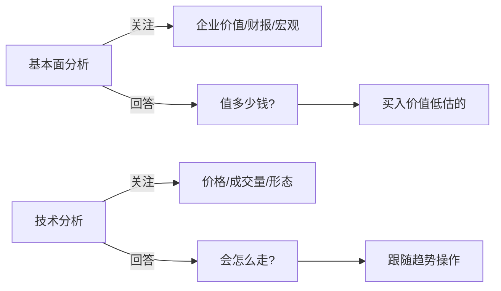
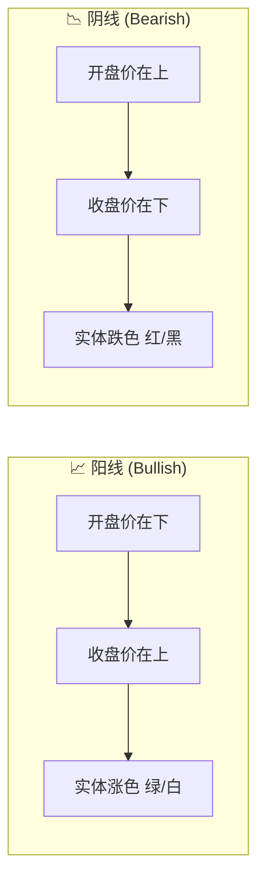
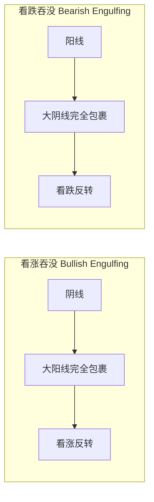
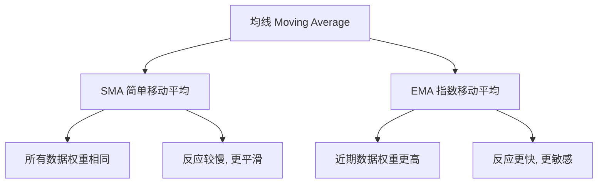
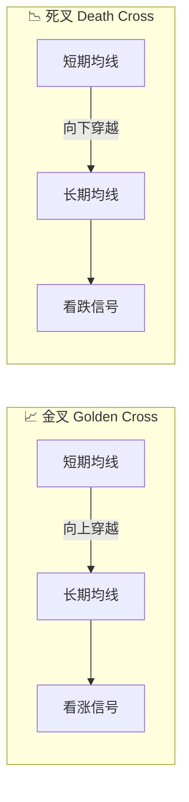
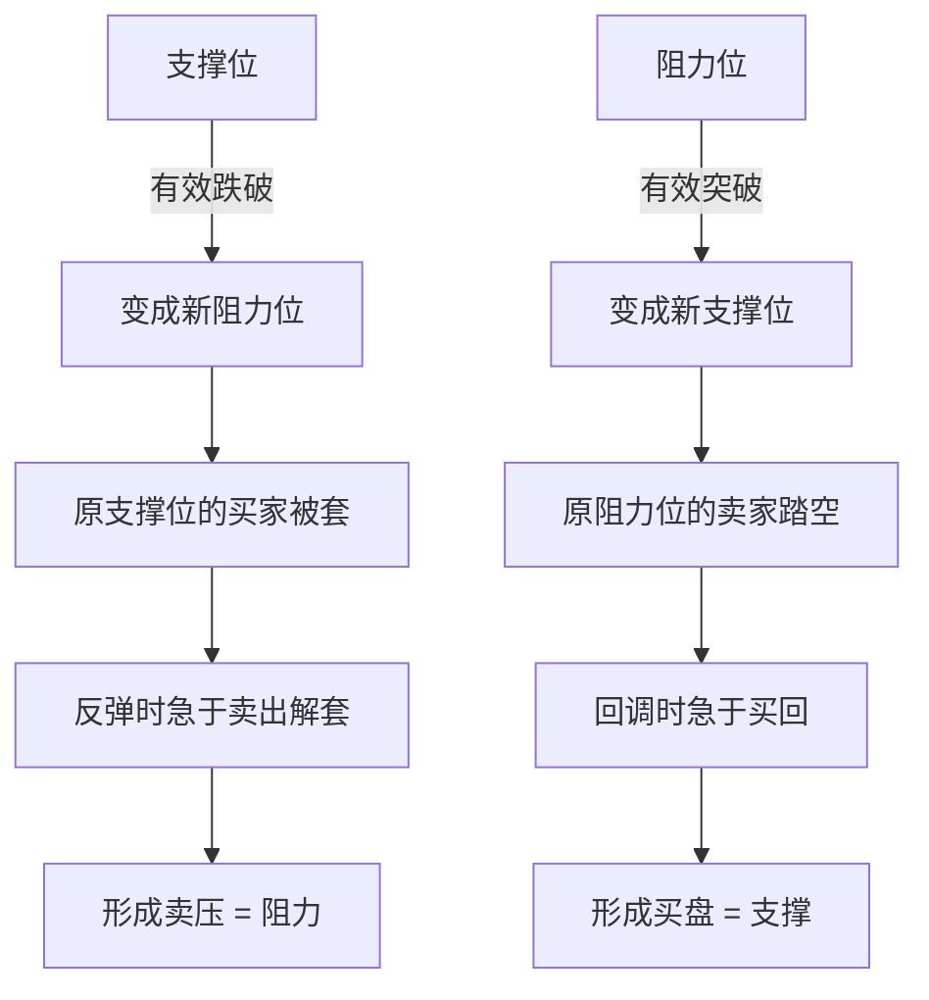
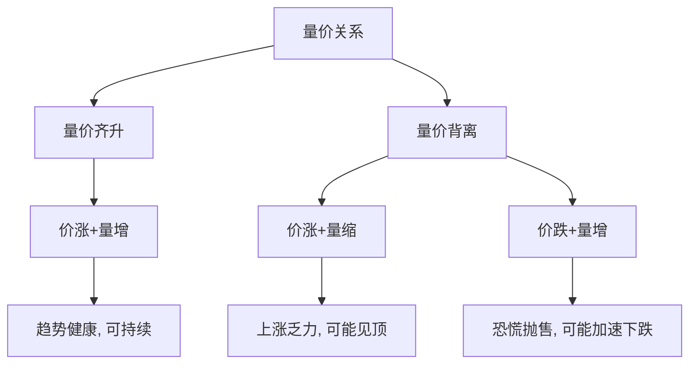
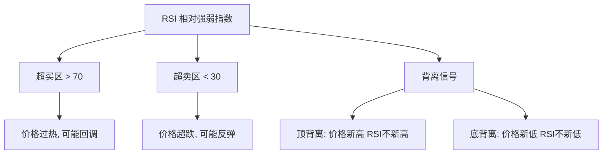
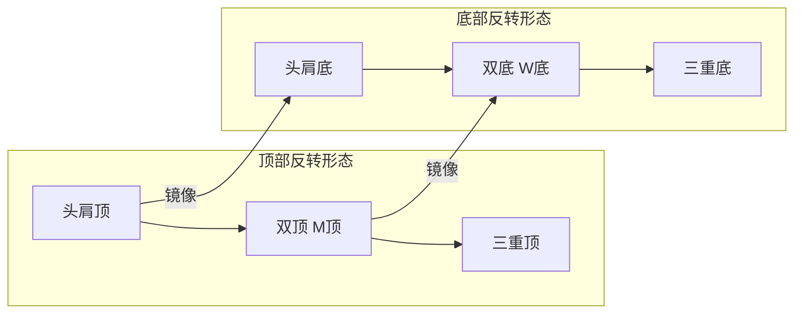
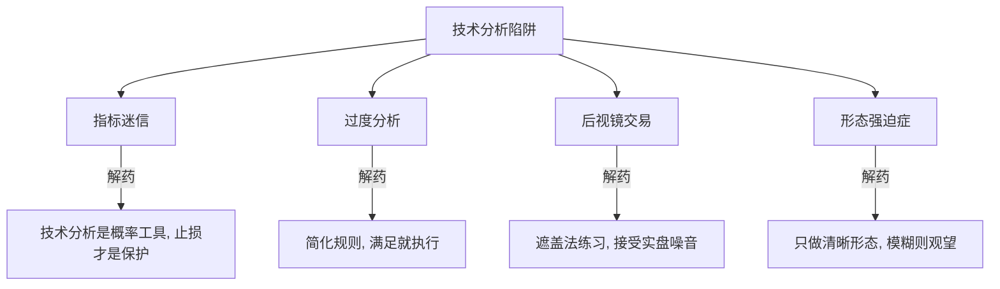

# Technical Analysis: 技术分析完全指南

> **Tags:** `Technical Analysis`, `Chart Reading`, `Indicators`, `Price Action`
> **Date Added:** `2026-01-14`
> **一句话总结 (One-Liner):** 技术分析是**通过历史价格和成交量数据预测未来走势**的方法论——它不关心"为什么涨"，只关心"怎么涨"。
> **关键协议 (Critical Protocol):**
> 1.  **结构服从内容 (Structure Follows Content):** 本文档按照"K线→均线→指标→形态"的学习路径组织。
> 2.  **原子级视觉化 (Atomic Visualization):** 每个概念配图解释。
> 3.  **术语全覆盖 (Full Glossary):** 每个专业术语都有人话解释。

---

## 1. 元认知 (Metacognition) - 技术分析是什么？

### 1.1 问题定义

**基本面分析 (Fundamental Analysis)** 问的是："这个资产**值多少钱**？"（内在价值）
**技术分析 (Technical Analysis)** 问的是："这个资产**会怎么走**？"（价格趋势）

技术分析的核心假设：
1. **价格反映一切：** 所有信息（基本面、消息、情绪）都已经体现在价格中
2. **历史会重演：** 人性不变，所以价格形态会重复出现
3. **趋势会延续：** 价格倾向于沿着既定方向运动，直到出现反转信号

### 1.2 核心哲学：读图如读心

> **技术分析的本质是研究市场参与者的集体心理。**

每一根K线、每一个形态，都是多空双方博弈的结果。你看的不是"线"，而是背后千万人的贪婪与恐惧。



### 1.3 系统定位

本模块是 **Investment Trading** 的第二层，承接 `1.0_Trading_Fundamentals.md`。

> [!IMPORTANT]
> **核心洞察 (Key Insight):**
>
> 技术分析**不是预言术**，而是**概率工具**。它告诉你："在这种形态下，历史上有X%的概率会这样走。" 你依然可能错，所以**止损永远是必须的**。

---

## 2. 核心架构 (Core Framework) - K线基础

### 2.1 K线/蜡烛图 (Candlestick Chart)

K线（又叫蜡烛图）是技术分析的基本单位，由日本米商在18世纪发明。

#### 2.1.1 K线的四个价格

每一根K线包含**四个关键价格**：

| 价格 | 英文 | 含义 |
|------|------|------|
| **开盘价 (Open)** | Open / O | 这个周期开始时的第一笔成交价 |
| **收盘价 (Close)** | Close / C | 这个周期结束时的最后一笔成交价 |
| **最高价 (High)** | High / H | 这个周期内的最高成交价 |
| **最低价 (Low)** | Low / L | 这个周期内的最低成交价 |

> **周期可以是任意时间单位：** 1分钟、5分钟、1小时、4小时、1天、1周、1月...

#### 2.1.2 K线的结构

```
        ┌───┐ ← 最高价 (High)
        │   │
        │   │ ← 上影线 (Upper Shadow/Wick)
        │   │
    ┌───┼───┼───┐
    │   │   │   │
    │   │实 │   │ ← 实体 (Body) = 开盘价与收盘价之间
    │   │体 │   │
    │   │   │   │
    └───┼───┼───┘
        │   │
        │   │ ← 下影线 (Lower Shadow/Wick)
        │   │
        └───┘ ← 最低价 (Low)
```

#### 2.1.3 阳线与阴线

| 类型 | 条件 | 颜色 | 含义 |
|------|------|------|------|
| **阳线 (Bullish Candle)** | 收盘价 > 开盘价 | 绿色/白色 | 多方胜利，价格上涨 |
| **阴线 (Bearish Candle)** | 收盘价 < 开盘价 | 红色/黑色 | 空方胜利，价格下跌 |

> **注意：** 中国股市习惯"红涨绿跌"，但国际市场（美股、加密货币）通常"绿涨红跌"。



#### 2.1.4 影线的含义

| 影线类型 | 形态 | 含义 |
|---------|------|------|
| **长上影线** | 上方有长影线 | 多方冲高后被空方打压下来，**上方有压力** |
| **长下影线** | 下方有长影线 | 空方杀跌后被多方拉回来，**下方有支撑** |
| **无影线** | 光头光脚阳/阴线 | 一方完全主导，趋势强劲 |
| **上下影线都长** | 十字星形态 | 多空激烈博弈，**方向不明/可能反转** |

---

### 2.2 常见K线形态 (Candlestick Patterns)

#### 2.2.1 单根K线形态

| 形态名称 | 英文 | 特征 | 含义 |
|---------|------|------|------|
| **十字星 (Doji)** | Doji | 开盘价≈收盘价，有上下影线 | 多空平衡，**可能反转** |
| **锤子线 (Hammer)** | Hammer | 小实体+长下影线，出现在下跌底部 | **看涨反转信号** |
| **上吊线 (Hanging Man)** | Hanging Man | 小实体+长下影线，出现在上涨顶部 | **看跌反转信号** |
| **倒锤子 (Inverted Hammer)** | Inverted Hammer | 小实体+长上影线，出现在下跌底部 | **潜在看涨** |
| **射击之星 (Shooting Star)** | Shooting Star | 小实体+长上影线，出现在上涨顶部 | **看跌反转信号** |
| **大阳线 (Marubozu Bullish)** | Bullish Marubozu | 光头光脚阳线，无影线 | **强烈看涨** |
| **大阴线 (Marubozu Bearish)** | Bearish Marubozu | 光头光脚阴线，无影线 | **强烈看跌** |

```
锤子线 Hammer          上吊线 Hanging Man      射击之星 Shooting Star
    ┌─┐                     ┌─┐                        │
    │ │                     │ │                       ┌┴┐
    └┬┘                     └┬┘                       │ │
     │                       │                        └─┘
     │ (长下影)              │ (长下影)
     │                       │
     ▼                       ▼
  出现在底部              出现在顶部               出现在顶部
  = 看涨                  = 看跌                   = 看跌
```

#### 2.2.2 双根K线形态

| 形态名称 | 英文 | 特征 | 含义 |
|---------|------|------|------|
| **看涨吞没 (Bullish Engulfing)** | Bullish Engulfing | 阳线实体完全包裹前一根阴线实体 | **强烈看涨反转** |
| **看跌吞没 (Bearish Engulfing)** | Bearish Engulfing | 阴线实体完全包裹前一根阳线实体 | **强烈看跌反转** |
| **乌云盖顶 (Dark Cloud Cover)** | Dark Cloud Cover | 阴线开盘高于前阳线高点，收盘深入阳线实体50%以上 | **看跌反转** |
| **刺透形态 (Piercing Pattern)** | Piercing Pattern | 阳线开盘低于前阴线低点，收盘深入阴线实体50%以上 | **看涨反转** |



#### 2.2.3 三根K线形态

| 形态名称 | 英文 | 特征 | 含义 |
|---------|------|------|------|
| **早晨之星 (Morning Star)** | Morning Star | 长阴线 → 小实体/十字星 → 长阳线 | **强看涨反转** (出现在底部) |
| **黄昏之星 (Evening Star)** | Evening Star | 长阳线 → 小实体/十字星 → 长阴线 | **强看跌反转** (出现在顶部) |
| **三只乌鸦 (Three Black Crows)** | Three Black Crows | 连续三根依次下跌的阴线 | **强看跌** |
| **三个白兵 (Three White Soldiers)** | Three White Soldiers | 连续三根依次上涨的阳线 | **强看涨** |

---

## 3. 均线系统 (Moving Average System)

### 3.1 什么是均线？

**均线 (Moving Average / MA)** 是过去N个周期收盘价的平均值连成的线。

**作用：**
- 平滑价格波动，显示趋势方向
- 作为动态支撑/阻力位
- 产生交易信号（金叉/死叉）

### 3.2 均线类型

#### 3.2.1 简单移动平均线 (SMA)

**公式：** `SMA = (P1 + P2 + ... + Pn) / n`

**含义：** 过去n个周期收盘价的算术平均。

**特点：** 每个数据点权重相同，反应较慢。

#### 3.2.2 指数移动平均线 (EMA)

**公式：** `EMA = 今日收盘价 × K + 昨日EMA × (1-K)`，其中 `K = 2/(n+1)`

**含义：** 给近期价格更高权重的加权平均。

**特点：** 对价格变化反应更快，更敏感。



### 3.3 常用均线周期

| 周期 | 名称 | 用途 |
|------|------|------|
| **MA5** | 5日均线 / 周线 | 超短线，反映一周内趋势 |
| **MA10** | 10日均线 / 半月线 | 短线参考 |
| **MA20** | 20日均线 / 月线 | **短期趋势核心参考** |
| **MA50** | 50日均线 | 中期趋势 |
| **MA60** | 60日均线 / 季线 | 中期趋势（中国股市常用） |
| **MA120** | 120日均线 / 半年线 | 中长期趋势 |
| **MA200** | 200日均线 / 年线 | **长期趋势分水岭**（牛熊线） |

> **经验法则：** 价格站上MA200通常是牛市，跌破MA200通常是熊市。

### 3.4 均线交叉信号

#### 3.4.1 金叉 (Golden Cross)

**定义：** 短期均线从下方**向上穿越**长期均线。

**信号：** **看涨信号**，趋势可能由跌转涨。

**经典组合：**
- MA5 上穿 MA20：短期金叉
- MA50 上穿 MA200：**"死亡交叉的反面"，强烈牛市信号**

#### 3.4.2 死叉 (Death Cross)

**定义：** 短期均线从上方**向下穿越**长期均线。

**信号：** **看跌信号**，趋势可能由涨转跌。

**经典组合：**
- MA5 下穿 MA20：短期死叉
- MA50 下穿 MA200：**"死亡交叉"，强烈熊市信号**



### 3.5 均线多头/空头排列

| 排列类型 | 特征 | 含义 |
|---------|------|------|
| **多头排列 (Bullish Alignment)** | MA5 > MA10 > MA20 > MA60，依次向下 | **强势上涨趋势** |
| **空头排列 (Bearish Alignment)** | MA5 < MA10 < MA20 < MA60，依次向上 | **强势下跌趋势** |
| **粘合 (Consolidation)** | 多条均线缠绕在一起 | **盘整，蓄势待发** |

---

## 4. 支撑与阻力 (Support & Resistance)

### 4.1 基本概念

#### 4.1.1 支撑位 (Support Level)

**定义：** 价格下跌时，遇到的"托住"价格的水平区域。

**形成原因：**
- 历史上的**买入密集区**（多头愿意接盘）
- 心理整数关口（如10元、100元）
- 前期低点

**隐喻：** 支撑位像地板——价格跌到这里会"弹起来"。

#### 4.1.2 阻力位 (Resistance Level)

**定义：** 价格上涨时，遇到的"压住"价格的水平区域。

**形成原因：**
- 历史上的**卖出密集区**（空头愿意出货）
- 心理整数关口
- 前期高点

**隐喻：** 阻力位像天花板——价格涨到这里会"回落"。

```
价格
  │
  │         阻力位 ────────────────────── (天花板)
  │              ╲        ╱╲
  │               ╲      ╱  ╲
  │                ╲    ╱    ╲
  │                 ╲  ╱      ╲
  │                  ╲╱        ╲
  │                             ╲  ╱
  │                              ╲╱
  │         支撑位 ──────────────────── (地板)
  │
  └────────────────────────────────────── 时间
```

### 4.2 支撑阻力互换

> **核心原则：** 支撑位一旦被**有效跌破**，就会变成阻力位；阻力位一旦被**有效突破**，就会变成支撑位。

| 场景 | 结果 |
|------|------|
| 价格跌破支撑位 | 原支撑位 → 新阻力位 |
| 价格突破阻力位 | 原阻力位 → 新支撑位 |

**为什么会互换？**
- 在支撑位买入的人，跌破后被套牢，反弹时急于"解套"卖出 → 变成阻力
- 在阻力位卖出的人，突破后后悔，回调时急于"补回"买入 → 变成支撑



### 4.3 突破与假突破

#### 4.3.1 有效突破 (Valid Breakout)

**判断标准：**
1. **收盘价突破**（而非只是盘中触及）
2. **成交量放大**（放量突破更可信）
3. **持续确认**（连续2-3根K线站稳）

#### 4.3.2 假突破 (False Breakout / Fakeout)

**定义：** 价格短暂突破支撑/阻力后，迅速反转回原区间。

**成因：** 主力诱多/诱空、止损盘触发后的回补。

**应对策略：**
- 不要在突破瞬间追入，等待**回踩确认**
- 设好止损，假突破被打止损也正常


---

## 5. 成交量 (Volume)

### 5.1 什么是成交量？

**成交量 (Volume)** 是在某个周期内成交的股数/合约数/金额总量。

**核心原则：** **量在价先**——成交量的变化往往先于价格变化。

### 5.2 成交量术语

| 术语 | 英文 | 定义 |
|------|------|------|
| **放量 (High Volume)** | Volume Surge | 成交量明显高于近期平均 |
| **缩量 (Low Volume)** | Volume Decline | 成交量明显低于近期平均 |
| **天量 (Climax Volume)** | Climax Volume | 极端放量，历史高位 |
| **地量 (Dry-up Volume)** | Dry-up Volume | 极端缩量，历史低位 |
| **量价齐升** | Volume-Price Confirmation | 价涨量增，趋势健康 |
| **量价背离** | Volume-Price Divergence | 价涨量缩或价跌量增，趋势可能反转 |

### 5.3 量价关系

| 价格 | 成交量 | 含义 |
|------|--------|------|
| **涨** | **放量** | 多方资金进场，上涨**健康** |
| **涨** | **缩量** | 追涨意愿不足，上涨**乏力**，可能见顶 |
| **跌** | **放量** | 恐慌性抛售，下跌**加速** |
| **跌** | **缩量** | 抛压减轻，下跌**趋缓**，可能见底 |
| **盘整** | **缩量** | 多空观望，蓄势待发 |



### 5.4 经典量价形态

| 形态 | 特征 | 含义 |
|------|------|------|
| **放量突破** | 价格突破阻力位 + 成交量大增 | 有效突破，趋势确认 |
| **缩量回调** | 上涨趋势中回调 + 成交量萎缩 | 健康回调，趋势未变 |
| **天量天价** | 极端放量 + 价格创新高 | **危险信号**，可能是顶部 |
| **地量地价** | 极端缩量 + 价格创新低 | **潜在底部**，抛压耗尽 |

> **口诀：** "地量见地价，天量见天价"

---

## 6. 技术指标 (Technical Indicators)

### 6.1 RSI - 相对强弱指数

**全称：** Relative Strength Index

**发明者：** J. Welles Wilder Jr. (1978)

**公式：**
```
RSI = 100 - [100 / (1 + RS)]
RS = 平均上涨幅度 / 平均下跌幅度 (过去N期)
```

**常用参数：** RSI(14) 即14个周期

**数值范围：** 0 - 100

| RSI区间 | 状态 | 操作建议 |
|---------|------|---------|
| **> 70** | **超买 (Overbought)** | 价格可能过热，考虑卖出/观望 |
| **50** | 多空平衡 | 趋势不明 |
| **< 30** | **超卖 (Oversold)** | 价格可能超跌，考虑买入 |

**RSI背离：**
- **顶背离：** 价格创新高，RSI没创新高 → 上涨动能衰减，可能见顶
- **底背离：** 价格创新低，RSI没创新低 → 下跌动能衰减，可能见底



---

### 6.2 MACD - 指数平滑异同移动平均线

**全称：** Moving Average Convergence Divergence

**发明者：** Gerald Appel (1970s)

**组成部分：**

| 成分 | 公式 | 含义 |
|------|------|------|
| **DIF (快线/MACD线)** | EMA(12) - EMA(26) | 短期与长期均线的差值 |
| **DEA (慢线/信号线)** | DIF的EMA(9) | DIF的移动平均，更平滑 |
| **MACD柱 (Histogram)** | (DIF - DEA) × 2 | 快慢线的差距，柱状图显示 |
| **零轴 (Zero Line)** | 0 | 多空分界线 |

**核心信号：**

| 信号 | 条件 | 含义 |
|------|------|------|
| **金叉 (Bullish Cross)** | DIF 上穿 DEA | 看涨信号 |
| **死叉 (Bearish Cross)** | DIF 下穿 DEA | 看跌信号 |
| **零轴上方金叉** | DIF > 0 且 金叉 | 强势上涨 |
| **零轴下方死叉** | DIF < 0 且 死叉 | 强势下跌 |

**MACD背离：**
- **顶背离：** 价格创新高，MACD柱没创新高 → 看跌
- **底背离：** 价格创新低，MACD柱没创新低 → 看涨

```
MACD 示意图:

  价格 │    ╱╲
       │   ╱  ╲    ╱╲
       │  ╱    ╲  ╱  ╲
       │ ╱      ╲╱
       │
       └─────────────────────

  DIF  │      ╱╲
       │    ╱    ╲
  ─────│───╱──────╲─────── 零轴
       │  ╱        ╲
       │ ╱          ╲
       │
  DEA  │     ╱──╲
       │   ╱      ╲
  ─────│──╱────────╲─────
       │

  柱状 │   ▓▓▓
       │  ▓▓▓▓▓
       │ ▓▓▓▓▓▓▓
  ─────│────────────────
       │          ░░░
       │         ░░░░░
```

---

### 6.3 布林带 (Bollinger Bands)

**发明者：** John Bollinger (1980s)

**组成部分：**

| 轨道 | 公式 | 含义 |
|------|------|------|
| **中轨 (Middle Band)** | MA(20) | 20日移动平均线 |
| **上轨 (Upper Band)** | 中轨 + 2 × 标准差 | 价格上边界 |
| **下轨 (Lower Band)** | 中轨 - 2 × 标准差 | 价格下边界 |

**核心原理：** 约95%的价格波动应该在上下轨之间（基于正态分布）。

**信号解读：**

| 现象 | 含义 |
|------|------|
| **价格触及上轨** | 超买，可能回调 |
| **价格触及下轨** | 超卖，可能反弹 |
| **布林带收窄** | 波动率降低，**大行情即将来临** |
| **布林带张开** | 波动率增加，趋势正在发展 |
| **价格沿上轨运行** | 强势上涨趋势 |
| **价格沿下轨运行** | 强势下跌趋势 |

```
布林带示意图:

  价格 │
       │   ╱──────────────────╲   ← 上轨 (Upper Band)
       │  ╱                    ╲
       │ ╱    价格波动范围      ╲
       │ ──────────────────────── ← 中轨 (MA20)
       │ ╲                    ╱
       │  ╲                  ╱
       │   ╲────────────────╱    ← 下轨 (Lower Band)
       │
       └──────────────────────────
                时间
```

---

### 6.4 KDJ - 随机指标

**全称：** Stochastic Oscillator (KDJ是中国改良版)

**组成部分：**

| 线 | 含义 |
|----|------|
| **K值** | 快速随机值，最敏感 |
| **D值** | K的移动平均，较平滑 |
| **J值** | 3K - 2D，最敏感/最容易超买超卖 |

**数值范围：** 0 - 100 (J值可超出)

| 区间 | 状态 |
|------|------|
| **K/D > 80** | 超买区 |
| **K/D < 20** | 超卖区 |
| **J > 100** | 极度超买 |
| **J < 0** | 极度超卖 |

**核心信号：**
- **K上穿D (金叉):** 买入信号（尤其在超卖区）
- **K下穿D (死叉):** 卖出信号（尤其在超买区）

---

### 6.5 指标对比表

| 指标 | 类型 | 优势 | 劣势 | 最佳场景 |
|------|------|------|------|---------|
| **RSI** | 振荡器 | 简单直观，超买超卖清晰 | 趋势强时会钝化 | 震荡市 |
| **MACD** | 趋势 | 趋势跟踪能力强，背离可靠 | 信号滞后 | 趋势市 |
| **布林带** | 波动率 | 动态通道，可视化强 | 不提供方向信号 | 判断突破/收窄 |
| **KDJ** | 振荡器 | 反应快，适合短线 | 假信号多 | 短线/震荡市 |

> **最佳实践：** 不要只看一个指标，**多指标共振**时信号更可靠。

---

## 7. 趋势与形态 (Trend & Patterns)

### 7.1 趋势线 (Trend Line)

**定义：** 连接价格的一系列高点（下降趋势线）或低点（上升趋势线）的直线。

**画法规则：**
- **上升趋势线：** 连接两个或以上的**更高低点**
- **下降趋势线：** 连接两个或以上的**更低高点**
- 至少需要**2个点**，3个点以上更可靠

**应用：**
- 趋势线 = 动态支撑/阻力
- 价格跌破上升趋势线 = 潜在趋势反转
- 价格突破下降趋势线 = 潜在趋势反转

```
上升趋势线:                   下降趋势线:

     │      ╱                      ╲
     │    ╱ ╲ ╱                     ╲ ╱╲
     │  ╱    ╲                       ╲  ╲
     │ ╱      ╱                        ╲  ╲ ╱
     │╱      ╱                          ╲  ╲
     │      ╱                            ╲  ╲
     │     ╱  ← 上升趋势线               ╲ ← 下降趋势线
     └──────────                    ──────────
```

### 7.2 经典反转形态

#### 7.2.1 头肩顶 (Head and Shoulders Top)

**形态特征：**
- 左肩（Left Shoulder）：第一个高点
- 头部（Head）：更高的高点
- 右肩（Right Shoulder）：较低的高点，与左肩高度相近
- 颈线（Neckline）：连接两个低点的线

**信号：** 价格跌破颈线 = **强烈看跌反转**

**目标价：** 颈线 - (头部到颈线的距离)

```
头肩顶形态:

                头部
                 ╱╲
      左肩      ╱  ╲      右肩
       ╱╲     ╱    ╲     ╱╲
      ╱  ╲   ╱      ╲   ╱  ╲
     ╱    ╲ ╱        ╲ ╱    ╲
    ╱      ╳          ╳      ╲
   ╱       ╲  颈线    ╱         ╲
  ─────────────────────────────── 跌破颈线 = 卖出信号
```

#### 7.2.2 头肩底 (Head and Shoulders Bottom / Inverse H&S)

**形态特征：** 头肩顶的倒置版本

**信号：** 价格突破颈线 = **强烈看涨反转**

#### 7.2.3 双顶 (Double Top / M顶)

**形态特征：**
- 两个高度相近的高点
- 中间有一个回调低点
- 形成"M"字形

**信号：** 价格跌破颈线（中间低点）= **看跌反转**

#### 7.2.4 双底 (Double Bottom / W底)

**形态特征：**
- 两个高度相近的低点
- 中间有一个反弹高点
- 形成"W"字形

**信号：** 价格突破颈线（中间高点）= **看涨反转**



### 7.3 持续形态

#### 7.3.1 三角形态 (Triangle Patterns)

| 类型 | 特征 | 含义 |
|------|------|------|
| **对称三角形 (Symmetrical)** | 高点下降 + 低点上升，收敛 | 方向不定，等待突破 |
| **上升三角形 (Ascending)** | 高点水平 + 低点上升 | **偏多**，大概率向上突破 |
| **下降三角形 (Descending)** | 高点下降 + 低点水平 | **偏空**，大概率向下突破 |

```
对称三角形:           上升三角形:           下降三角形:

   ╲    ╱              ────────             ╲
    ╲  ╱              ╱                      ╲
     ╲╱              ╱                        ╲
     ╱╲             ╱                        ────────
    ╱  ╲           ╱
   ╱    ╲
```

#### 7.3.2 旗形与楔形

| 类型 | 特征 | 含义 |
|------|------|------|
| **牛旗 (Bull Flag)** | 上涨后平行向下整理 | 上涨中继，突破后继续涨 |
| **熊旗 (Bear Flag)** | 下跌后平行向上整理 | 下跌中继，跌破后继续跌 |
| **上升楔形 (Rising Wedge)** | 向上收敛 | **看跌**，通常向下突破 |
| **下降楔形 (Falling Wedge)** | 向下收敛 | **看涨**，通常向上突破 |

---

## 8. Anti-Patterns (反模式) - 技术分析的常见错误

### 陷阱 1: 指标迷信 (Indicator Worship)

**Trap:** 沉迷于找"完美指标"，以为能100%预测市场。

**Why (心理机制):**
- **确定性渴望：** 人类讨厌不确定性，希望找到"圣杯"
- **后视镜偏差：** 回看历史，很多形态"完美有效"，但那是事后诸葛亮

**Fix:**
- 技术分析是**概率工具**，不是预言术
- 任何指标都有失灵的时候，**止损才是真正的保护**
- 指标用来**提高胜率**，不是追求100%

**Positive Real Scenario:**
- 专业交易员用多指标共振 + 严格止损
- 单个信号可能错，但系统长期正期望值

---

### 陷阱 2: 过度分析 (Analysis Paralysis)

**Trap:** 画了无数条线、看了10个指标，结果不敢下单。

**Why (心理机制):**
- **完美主义：** 想等"完美信号"才行动
- **责任逃避：** 不下单就不会亏钱

**Fix:**
- 制定**简单明确的交易规则**，满足就执行
- 同时满足3个条件就足够（如：趋势+支撑+放量）
- 接受"没有完美入场点"的事实

**Positive Real Scenario:**
- 简化系统：只看价格+均线+成交量
- 规则触发就进场，错了就止损，不内耗

---

### 陷阱 3: 后视镜交易 (Trading the Rearview Mirror)

**Trap:** 看历史图表觉得"太明显了"，实盘却完全不一样。

**Why (心理机制):**
- **后见之明偏差：** 事后看，所有反转点都"清晰可见"
- **忽视右侧未知：** 复盘时右边是确定的，实盘时右边是空白的

**Fix:**
- 用**遮盖法练习**：遮住右边，只看左边做判断
- 接受实盘会有更多噪音和假信号
- 建立交易日志，记录**事前判断**而非事后分析

**Positive Real Scenario:**
- 模拟盘/回测时用遮盖法
- 培养"在不确定中决策"的能力

---

### 陷阱 4: 形态强迫症 (Pattern Forcing)

**Trap:** 明明只有一点点像，硬说"这是头肩顶"。

**Why (心理机制):**
- **确认偏误：** 只看支持自己判断的证据
- **想交易的冲动：** 急于进场，找理由给自己

**Fix:**
- 形态必须**清晰明确**才算有效
- 模糊形态 = 不是形态 = 观望
- 宁可错过，不可乱做

**Positive Real Scenario:**
- 只交易教科书级别的标准形态
- 放弃"似是而非"的机会



---

## 9. 系统关联 (Interlinkages)

### 上游 (Input)
- **1.0_Trading_Fundamentals.md:** 止损/止盈/仓位管理
- 技术分析告诉你**何时进出**，基础模块告诉你**如何控制风险**

### 下游 (Output)
- **3.0_Market_Psychology.md:** 技术形态背后的心理机制
- **具体标的策略:** 黄金/加密货币的特殊技术分析

---

## 10. Glossary (术语表)

### K线相关

| 术语 | 英文 | 定义 (人话版) |
|------|------|---------------|
| **K线/蜡烛图** | Candlestick | 显示开盘、收盘、最高、最低四个价格的图表单位 |
| **开盘价** | Open | 该周期第一笔成交价 |
| **收盘价** | Close | 该周期最后一笔成交价 |
| **最高价** | High | 该周期最高成交价 |
| **最低价** | Low | 该周期最低成交价 |
| **阳线** | Bullish Candle | 收盘价 > 开盘价，涨了 |
| **阴线** | Bearish Candle | 收盘价 < 开盘价，跌了 |
| **实体** | Body | 开盘价与收盘价之间的粗柱子 |
| **上影线** | Upper Shadow/Wick | 实体上方的细线，代表被打压的高点 |
| **下影线** | Lower Shadow/Wick | 实体下方的细线，代表被拉回的低点 |
| **十字星** | Doji | 开盘价≈收盘价，多空平衡 |
| **锤子线** | Hammer | 小实体+长下影，出现在底部看涨 |
| **射击之星** | Shooting Star | 小实体+长上影，出现在顶部看跌 |
| **吞没形态** | Engulfing Pattern | 后一根K线实体完全包裹前一根 |
| **早晨之星** | Morning Star | 三根K线底部反转形态 |
| **黄昏之星** | Evening Star | 三根K线顶部反转形态 |

### 均线相关

| 术语 | 英文 | 定义 (人话版) |
|------|------|---------------|
| **均线** | Moving Average (MA) | 过去N个周期收盘价的平均值 |
| **简单移动平均** | SMA | 所有数据权重相同的均线 |
| **指数移动平均** | EMA | 近期数据权重更高的均线 |
| **金叉** | Golden Cross | 短期均线上穿长期均线，看涨 |
| **死叉** | Death Cross | 短期均线下穿长期均线，看跌 |
| **多头排列** | Bullish Alignment | 短期均线在上，长期在下，强势 |
| **空头排列** | Bearish Alignment | 短期均线在下，长期在上，弱势 |
| **粘合** | Consolidation | 多条均线缠绕，方向不明 |

### 支撑阻力相关

| 术语 | 英文 | 定义 (人话版) |
|------|------|---------------|
| **支撑位** | Support Level | 价格下跌时遇到的"地板" |
| **阻力位** | Resistance Level | 价格上涨时遇到的"天花板" |
| **突破** | Breakout | 价格有效穿越支撑或阻力 |
| **假突破** | False Breakout / Fakeout | 短暂突破后快速反转回原区间 |
| **回踩确认** | Retest | 突破后价格回测原位验证有效性 |

### 成交量相关

| 术语 | 英文 | 定义 (人话版) |
|------|------|---------------|
| **成交量** | Volume | 某周期内的成交总量 |
| **放量** | Volume Surge | 成交量明显高于平均 |
| **缩量** | Volume Decline | 成交量明显低于平均 |
| **天量** | Climax Volume | 极端放量，历史高位 |
| **地量** | Dry-up Volume | 极端缩量，历史低位 |
| **量价齐升** | Volume-Price Confirmation | 价涨量增，趋势健康 |
| **量价背离** | Volume-Price Divergence | 价与量方向不一致，可能反转 |

### 技术指标相关

| 术语 | 英文 | 定义 (人话版) |
|------|------|---------------|
| **RSI** | Relative Strength Index | 相对强弱指数，衡量超买超卖 |
| **超买** | Overbought | 价格涨过头，可能回调 |
| **超卖** | Oversold | 价格跌过头，可能反弹 |
| **MACD** | Moving Average Convergence Divergence | 趋势跟踪指标 |
| **DIF/MACD线** | DIF / MACD Line | 短期与长期EMA的差值 |
| **DEA/信号线** | Signal Line | DIF的移动平均 |
| **MACD柱** | Histogram | DIF与DEA的差值柱状图 |
| **零轴** | Zero Line | 多空分界线 |
| **布林带** | Bollinger Bands | 基于标准差的动态通道 |
| **上轨** | Upper Band | 布林带上边界 |
| **中轨** | Middle Band | 20日移动平均线 |
| **下轨** | Lower Band | 布林带下边界 |
| **KDJ** | Stochastic Oscillator | 随机振荡指标 |
| **背离** | Divergence | 价格与指标走势相反，预示反转 |
| **顶背离** | Bearish Divergence | 价格新高，指标不新高，看跌 |
| **底背离** | Bullish Divergence | 价格新低，指标不新低，看涨 |

### 形态相关

| 术语 | 英文 | 定义 (人话版) |
|------|------|---------------|
| **趋势线** | Trend Line | 连接高点或低点的直线 |
| **头肩顶** | Head and Shoulders | 三峰反转形态，中间最高 |
| **头肩底** | Inverse Head and Shoulders | 头肩顶的倒置版，底部反转 |
| **双顶/M顶** | Double Top | 两个等高高点的反转形态 |
| **双底/W底** | Double Bottom | 两个等低低点的反转形态 |
| **颈线** | Neckline | 头肩/双顶双底中的关键水平线 |
| **三角形态** | Triangle Pattern | 价格收敛形成的三角形 |
| **旗形** | Flag Pattern | 趋势中的平行整理形态 |
| **楔形** | Wedge Pattern | 收敛的斜向整理形态 |

---

## 11. Formula Table (公式表)

| 公式名称 | 表达式 | 变量定义 | 应用场景 |
|---------|--------|---------|---------|
| **SMA** | `SMA = ΣP(n) / n` | P: 收盘价, n: 周期数 | 计算简单移动平均线 |
| **EMA** | `EMA = P × K + EMA(昨) × (1-K)`, K = 2/(n+1) | P: 今日收盘价, n: 周期 | 计算指数移动平均线 |
| **RSI** | `RSI = 100 - 100/(1 + RS)`, RS = 平均涨幅/平均跌幅 | 14周期常用 | 判断超买超卖 |
| **布林带上轨** | `Upper = MA(20) + 2 × σ` | σ: 标准差 | 动态压力位 |
| **布林带下轨** | `Lower = MA(20) - 2 × σ` | σ: 标准差 | 动态支撑位 |
| **头肩顶目标价** | `Target = Neckline - (Head - Neckline)` | 颈线、头部价格 | 预测下跌目标 |

---

## 备注与引用 (Notes & References)

- 本文档为技术分析通用框架
- 实盘应用需结合具体标的特性和基本面
- 后续模块：`3.0_Market_Psychology.md` (市场心理)
- 相关模块：[[1.0_Trading_Fundamentals.md]] (交易基础)
