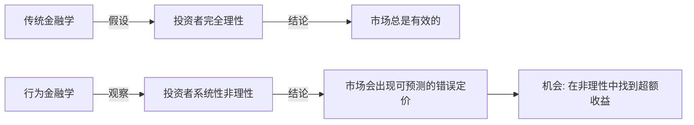
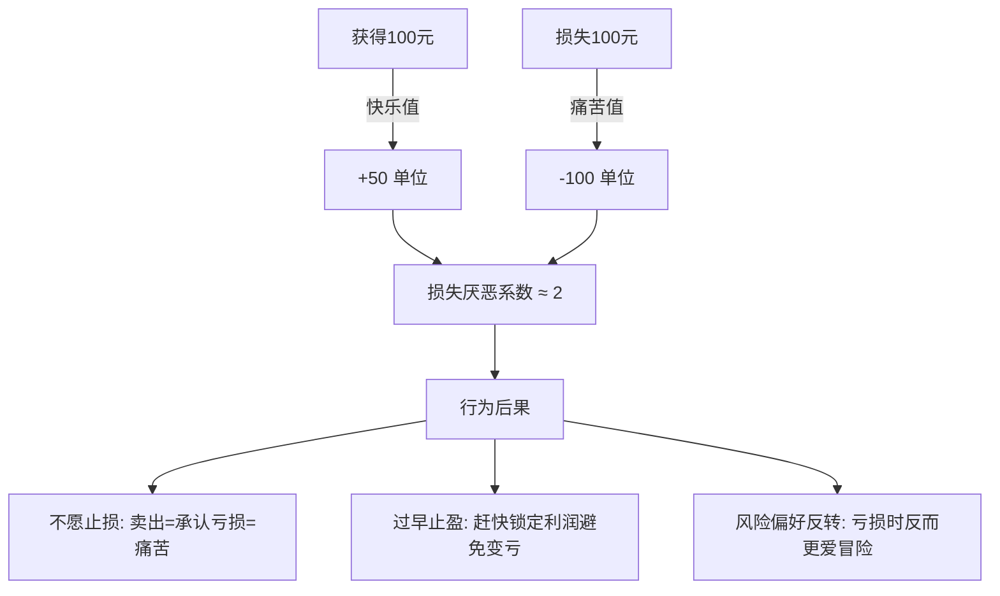
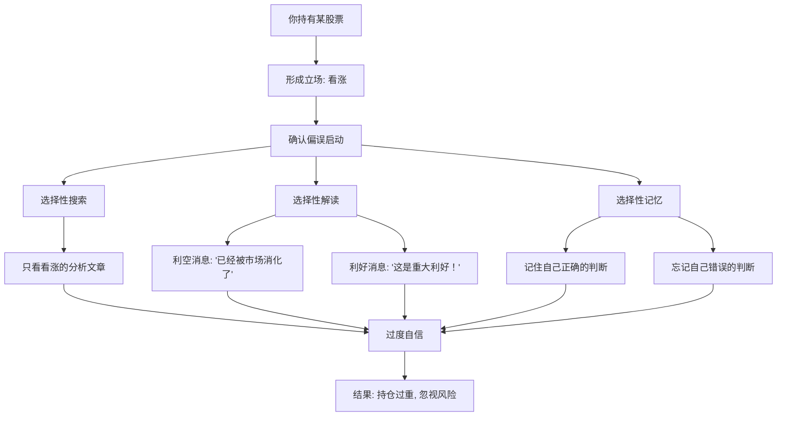
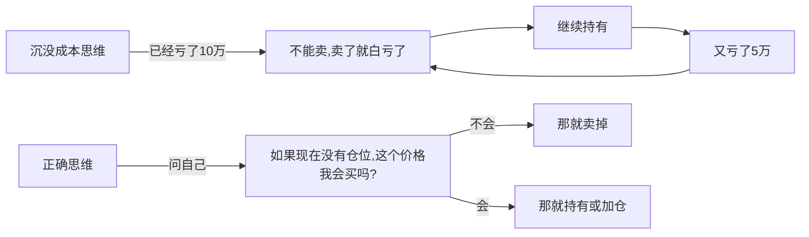
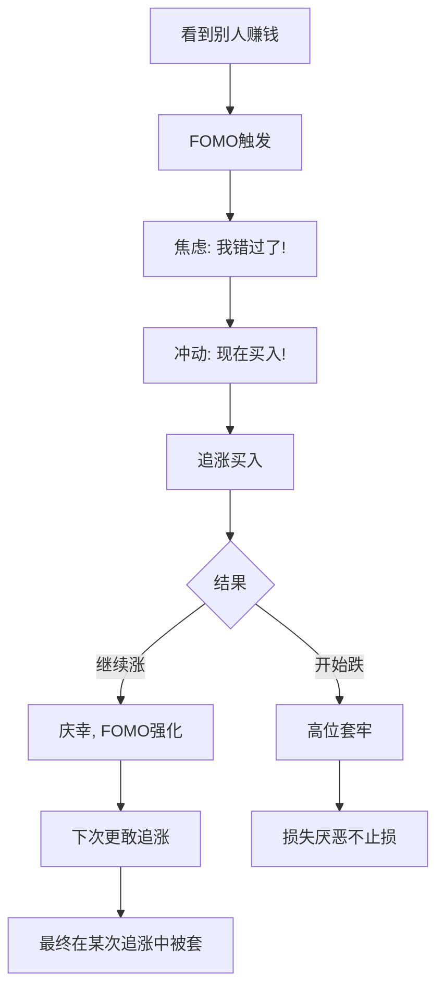
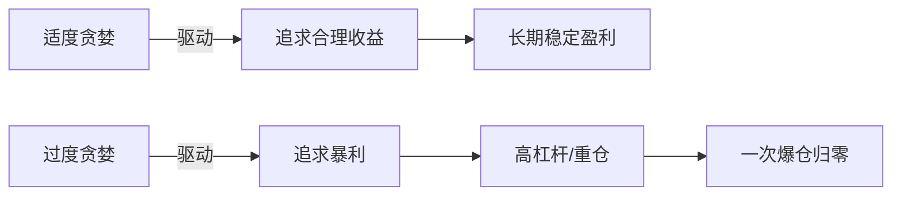
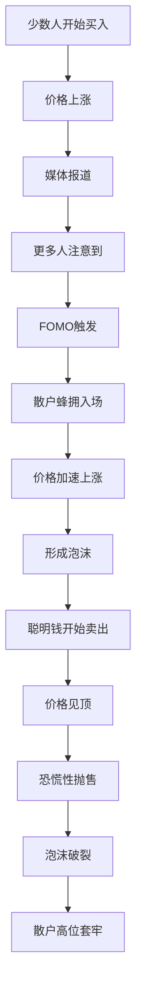
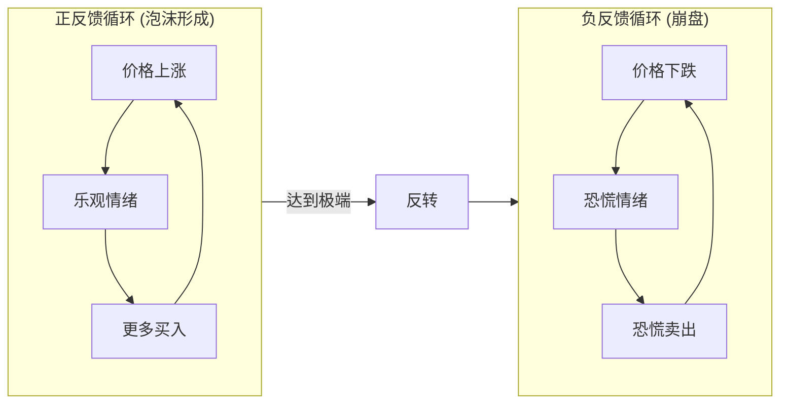
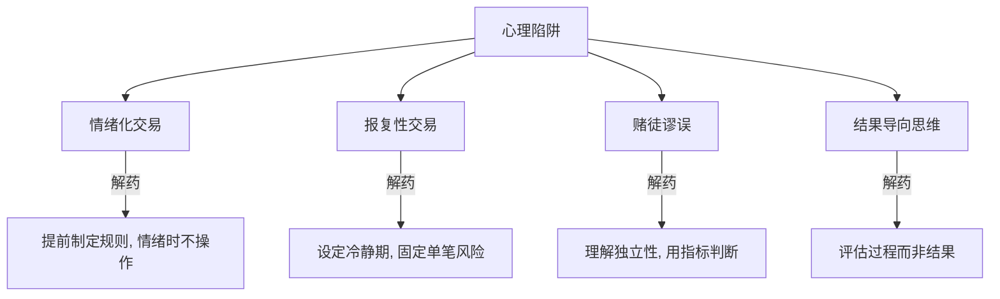

# Market Psychology: 市场心理与行为金融完全指南

> **Tags:** `Behavioral Finance`, `Market Psychology`, `Cognitive Bias`, `Trading Mindset`
> **Date Added:** `2026-01-14`
> **一句话总结 (One-Liner):** 市场心理学揭示了**投资者非理性行为的系统性规律**——理解这些规律，你就能预测群体行为、避免自身陷阱、在别人恐惧时贪婪。
> **关键协议 (Critical Protocol):**
> 1.  **结构服从内容 (Structure Follows Content):** 本文档按照"认知偏差→情绪陷阱→群体心理→实战应对"的逻辑链条组织。
> 2.  **原子级视觉化 (Atomic Visualization):** 每个心理概念配图解释。
> 3.  **术语全覆盖 (Full Glossary):** 每个心理学术语都有人话解释。

---

## 1. 元认知 (Metacognition) - 为什么交易心理学如此重要？

### 1.1 问题定义

> **"市场短期是投票机，长期是称重机。"** —— 本杰明·格雷厄姆

传统金融学假设投资者是"理性人"(Homo Economicus)——永远做出最优决策。但现实是：

**人类是"有限理性"的生物**，我们的决策受到：
- **认知偏差 (Cognitive Bias):** 系统性的思维错误
- **情绪干扰 (Emotional Interference):** 贪婪、恐惧、后悔
- **社会压力 (Social Pressure):** 从众、攀比、舆论

**行为金融学 (Behavioral Finance)** 研究的就是这些"非理性"行为的规律。

### 1.2 核心哲学：理解人性才能战胜市场

> **市场不是被"基本面"驱动的，而是被"对基本面的情绪反应"驱动的。**

这意味着：
- 好消息不一定涨（可能已经被预期消化）
- 坏消息不一定跌（可能恐慌过度后反弹）
- **理解群体心理，就能预判市场过度反应的拐点**



### 1.3 系统定位

本模块是 **Investment Trading** 的第三层，承接 `1.0_Trading_Fundamentals.md` 和 `2.0_Technical_Analysis.md`。

> [!IMPORTANT]
> **核心洞察 (Key Insight):**
>
> 技术分析研究的是**价格行为**，而市场心理学研究的是**价格行为背后的人性驱动力**。理解心理学，你就知道为什么某些形态有效、为什么趋势会持续、为什么反转会发生。

---

## 2. 核心架构 (Core Framework) - 认知偏差体系

### 2.1 损失厌恶 (Loss Aversion)

**定义：** 人们对损失的痛苦感受是同等收益快乐的**约2倍**。

**发现者：** Daniel Kahneman & Amos Tversky (前景理论, 1979)

**数学表达：** `U(loss) ≈ -2 × U(gain)`（同等金额下）



#### 损失厌恶的交易表现

| 情境 | 理性选择 | 实际行为 | 原因 |
|------|---------|---------|------|
| 持仓浮亏10% | 根据止损规则决定 | 死扛不卖 | 卖出=确认亏损=痛苦 |
| 持仓浮盈10% | 让利润奔跑 | 赶快卖出锁定 | 害怕利润变成亏损 |
| 面对两个选择 | 选期望值高的 | 选有确定收益的 | 规避"可能亏损"的选项 |

#### 如何克服

1. **交易前设定止损**：把止损当成"保险费"，买入时就接受可能发生
2. **关注百分比而非金额**：亏10%和亏10万元感受不同，但风险控制应该一致
3. **记住回本公式**：亏50%需要涨100%回本——早止损比晚止损理性得多
4. **批量复盘**：每月回顾止损记录，发现不止损的反而亏得更多

---

### 2.2 锚定效应 (Anchoring Effect)

**定义：** 人们在做判断时，会过度依赖最先获得的信息（"锚点"），即使这个信息与判断无关。

**交易中的锚点：**
- **买入价**：总是用买入价衡量涨跌，而不是用当前基本面
- **历史高点**：认为"跌了这么多肯定要反弹"
- **整数关口**：对100元、10000点等整数价格特别敏感

```
锚定效应示意:

买入价 100元 (你的锚点)
        │
        │  "回到100我就卖"
        ▼
当前价 80元
        │
        │  "跌了这么多，肯定能涨回去"
        ▼
实际走势: 继续跌到 50元
        │
        │  100元的锚点让你忽略了基本面恶化
        ▼
正确思维: "如果我现在没有仓位，80元我会买吗？"
```

#### 锚定效应的危害

| 锚点类型 | 思维陷阱 | 后果 |
|---------|---------|------|
| **买入价锚定** | "回本我就卖" | 永远等不到回本，错过止损机会 |
| **高点锚定** | "从高点跌了50%肯定到底了" | 抄在半山腰，继续深套 |
| **整数锚定** | "跌破1万点就是熊市" | 被整数关口操控决策 |
| **预期锚定** | "分析师说目标价200" | 忽视市场实际走势 |

#### 如何克服

1. **零仓位思维**：问自己"如果我现在没有仓位，这个价格我会买/卖吗？"
2. **关注基本面变化**：买入理由还成立吗？不要被历史价格束缚
3. **多看相对估值**：用PE、PB等指标判断贵贱，而非用历史价格
4. **设定机械规则**：用技术指标（均线、支撑位）替代主观锚点

---

### 2.3 确认偏误 (Confirmation Bias)

**定义：** 人们倾向于寻找、解读、记忆支持自己已有观点的信息，忽视或贬低反面证据。

**机制：**
- **选择性搜索**：只搜索支持自己观点的资料
- **选择性解读**：同样的数据，看涨者解读为利好，看跌者解读为利空
- **选择性记忆**：记住自己判断对的时候，忘记错的时候



#### 确认偏误的交易表现

- **重仓后找理由**：买入后不断找利好消息安慰自己
- **忽视止损信号**：技术破位后找借口"这是假突破"
- **加入"信仰群"**：只和看法一致的人交流，形成回音室
- **神话化偶像**：某大V说的一定对，忽视其错误记录

#### 如何克服

1. **主动找反面证据**：买入前，强迫自己列出3个不应该买的理由
2. **找唱反调的人**：故意听取与自己观点相反的分析
3. **记录决策日志**：写下买入理由，定期回顾哪些判断对了、错了
4. **设定无条件止损**：不管你多看好，触及止损就执行，不找借口

---

### 2.4 过度自信 (Overconfidence)

**定义：** 人们普遍高估自己的能力、知识和判断准确性。

**研究数据：**
- 90%的司机认为自己驾驶水平高于平均（数学上不可能）
- 交易者平均认为自己的预测准确率是70%+，实际只有50%左右
- 男性交易者的过度自信程度显著高于女性

```
过度自信的三种形态:

1. 过度精确 (Overprecision)
   "我预测明天涨到105.50"
   (实际上根本无法精确到小数点)

2. 过度估计 (Overestimation)
   "我的预测准确率有80%"
   (实际统计只有50%)

3. 过度定位 (Overplacement)
   "我比90%的交易者强"
   (韭菜和高手都这么认为)
```

#### 过度自信的后果

| 表现 | 行为 | 后果 |
|------|------|------|
| 高估预测能力 | 重仓押单一判断 | 一次错误损失惨重 |
| 高估择时能力 | 频繁交易 | 手续费吃掉利润 |
| 高估信息优势 | 忽视止损 | "我知道内情，不会跌" |
| 高估学习曲线 | 过早上杠杆 | 在学费期就爆仓 |

#### 如何克服

1. **假设自己是平均水平**：除非有大量数据证明，否则假设自己预测准确率50%
2. **使用凯利公式控制仓位**：根据实际胜率和盈亏比计算最优仓位
3. **记录预测，统计胜率**：用数据打脸自己的过度自信
4. **从小仓位开始**：新策略先用小钱验证，别一上来就重仓

---

### 2.5 沉没成本谬误 (Sunk Cost Fallacy)

**定义：** 因为已经投入了大量资源（时间、金钱、精力），而继续投入，即使理性上应该止损。

**本质错误：** 把"过去的投入"作为"未来决策"的依据



#### 沉没成本在交易中的表现

- **"都亏这么多了，卖了就亏死了"** —— 把已实现亏损当成更大的损失
- **"我研究这个币花了100小时，不能放弃"** —— 把时间投入当成持有理由
- **"我都加仓3次了，不能认输"** —— 把补仓次数当成不止损的理由
- **"我在这个价位套了2年了，等解套"** —— 把等待时间当成未来上涨的依据

#### 正确的思维方式

**过去的投入是"沉没成本"（Sunk Cost）——已经无法挽回，不应该影响当前决策。**

| 错误问法 | 正确问法 |
|---------|---------|
| "我已经亏了多少？" | "这笔持仓的未来预期收益是多少？" |
| "我投入了多少时间？" | "这个标的的基本面现在怎么样？" |
| "我补仓了多少次？" | "如果没有仓位，现在我会买吗？" |
| "我等了多久了？" | "资金的机会成本是多少？" |

---

### 2.6 后见之明偏差 (Hindsight Bias)

**定义：** 事情发生后，人们倾向于认为"我早就知道会这样"，高估自己事前的预测能力。

**别名：** "我早就说过"效应 / "马后炮"

```
后见之明示意:

事前 (2024年1月):
├── 分析师A: "比特币会涨到10万"
├── 分析师B: "比特币会跌到1万"
├── 分析师C: "比特币会在3-5万震荡"
└── 你: "不确定，观望"

事后 (2024年12月, 比特币涨到10万):
├── 分析师A: "我早就说过！"
├── 分析师B: (沉默)
├── 分析师C: (找借口)
└── 你: "我当时其实也觉得会涨的..." ← 后见之明
```

#### 后见之明的危害

1. **高估自己的判断能力**：以为自己"早就知道"，下次更敢重仓
2. **低估市场的不确定性**：以为涨跌是"显而易见的"
3. **无法从错误中学习**：把错误归因于"运气差"，正确归因于"我聪明"
4. **看历史图表时产生幻觉**：觉得每个顶和底都"很明显"

#### 如何克服

1. **事前记录预测**：写下你的判断和理由，事后对照
2. **遮盖法练习**：复盘时遮住K线右边，只看左边做判断
3. **概率思维**：承认"即使判断对了，也可能只是运气"
4. **关注过程而非结果**：正确的决策过程比单次结果更重要

---

### 2.7 处置效应 (Disposition Effect)

**定义：** 投资者倾向于**过早卖出盈利的股票**（落袋为安），同时**过晚卖出亏损的股票**（死扛不认输）。

**本质：** 损失厌恶 + 风险偏好反转的综合体现

```
处置效应示意:

盈利持仓:
买入100 → 涨到110 → "赶快卖,万一跌回去"
                      ├── 卖出锁定10元利润
                      └── 错过后续涨到150

亏损持仓:
买入100 → 跌到90 → "再等等,会涨回来的"
                    ├── 继续持有
                    └── 最终跌到50,亏50元

结论: 赚小钱,亏大钱 = 长期必亏
```

#### 处置效应的数学证明

假设两个交易者：
- **处置效应交易者**：赚10%就卖，亏30%才卖
- **理性交易者**：按2:1风险收益比操作

| 指标 | 处置效应者 | 理性交易者 |
|------|-----------|-----------|
| 平均盈利 | +10% | +20% |
| 平均亏损 | -30% | -10% |
| 盈亏比 | 1:3 | 2:1 |
| 需要胜率 | 75% 才能保本 | 33% 就能盈利 |

#### 如何克服

1. **设定止盈止损后严格执行**：不要盘中改变计划
2. **使用移动止损**：让利润奔跑，而不是过早锁定
3. **定期清理亏损仓位**：设定"最长持有期限"规则
4. **关注期望值而非胜率**：接受"赢少输多但每次赢得多"的策略

---

## 3. 情绪陷阱 (Emotional Traps)

### 3.1 FOMO - 错失恐惧症 (Fear of Missing Out)

**定义：** 害怕错过赚钱机会而产生的焦虑，导致冲动追涨。

**触发场景：**
- 看到别人晒收益
- 看到某资产连涨几天
- 听说"内幕消息"
- 社交媒体充斥"上车"言论



#### FOMO的危害

| 阶段 | 心理状态 | 行为 | 后果 |
|------|---------|------|------|
| 观望期 | "还会涨吗？再看看" | 观望 | 错过早期机会 |
| 上涨期 | "真的涨了！但已经涨这么多..." | 继续观望 | 继续错过 |
| 加速期 | "不能再错过了！冲！" | 追涨买入 | 买在高位 |
| 见顶期 | "终于上车了，稳了" | 持有等更高 | 错过卖点 |
| 下跌期 | "回调而已，很快涨回来" | 死扛 | 深度套牢 |

#### 如何克服

1. **接受错过是常态**：不可能抓住每一个机会
2. **设定买入纪律**：只在特定条件（如回调到支撑位）满足时买入
3. **屏蔽噪音**：减少看社交媒体上的"晒单"
4. **反问自己**：如果没有这波上涨，你会在这个价位买入吗？

---

### 3.2 FUD - 恐惧、不确定、怀疑 (Fear, Uncertainty, Doubt)

**定义：** 由负面消息引发的恐慌情绪，导致非理性抛售。

**来源：**
- 媒体渲染的负面新闻
- 竞争对手/空头散布的谣言
- 宏观经济的不确定性
- 监管政策的风险

```
FUD传播机制:

负面消息发布
    │
    ▼
社交媒体放大 (标题党/断章取义)
    │
    ▼
散户恐慌性抛售
    │
    ▼
价格下跌
    │
    ▼
更多人恐慌 (下跌本身就是FUD)
    │
    ▼
价格进一步下跌
    │
    ▼
聪明钱抄底
    │
    ▼
价格反弹
    │
    ▼
FUD卖出的人追悔莫及
```

#### FUD vs 真风险

| 特征 | FUD (情绪化恐惧) | 真风险 (理性评估) |
|------|----------------|----------------|
| 来源 | 媒体渲染、谣言 | 基本面恶化、财务数据 |
| 验证 | 难以证实或证伪 | 有具体证据支持 |
| 时效 | 短期情绪冲击 | 长期结构性问题 |
| 应对 | 理性分析，考虑抄底 | 评估后可能需要止损 |

#### 如何应对FUD

1. **信息溯源**：这个消息的原始来源是什么？是权威的吗？
2. **反向思考**：谁从FUD中获益？是不是有人在故意制造恐慌？
3. **时间检验**：等24-48小时，很多FUD会自然消散
4. **行动准则**：不基于情绪操作，回顾自己的投资逻辑是否还成立

---

### 3.3 贪婪 (Greed)

**定义：** 对收益的过度渴望，导致承担超出承受能力的风险。

**表现：**
- 赚了还想赚更多
- 使用过高杠杆
- 不设止盈
- 忽视风险只看收益



#### 贪婪周期

| 阶段 | 心理 | 行为 | 风险 |
|------|------|------|------|
| 初期盈利 | "我真有天赋！" | 逐步加仓 | 低 |
| 持续盈利 | "赚钱太容易了" | 开始用杠杆 | 中 |
| 加速盈利 | "要抓住这波机会" | 高杠杆重仓 | 高 |
| 触顶 | "还会涨的" | 不止盈 | 极高 |
| 回调 | "回调是机会" | 加仓抄底 | 极高 |
| 崩盘 | "怎么会这样" | 爆仓/深套 | 已实现 |

#### 如何控制贪婪

1. **设定止盈目标**：达到目标就至少卖出一部分
2. **收益实现原则**：每隔一段时间，把部分浮盈变成"真钱"
3. **杠杆上限**：设定最大杠杆倍数，不可逾越
4. **回顾历史**：记得自己曾经因为贪婪吃过的亏

---

### 3.4 恐惧 (Fear)

**定义：** 对损失的过度担忧，导致错过机会或恐慌性卖出。

**表现：**
- 不敢在底部买入
- 一有波动就想卖
- 过早止损
- 空仓踏空

```
恐惧 vs 贪婪 周期图:

                贪婪                     恐惧
                  │                       │
       ╱▔▔▔▔▔▔▔▔╲                  │
      ╱            ╲                 │
    ╱    兴奋       ╲               │
   ╱     贪婪        ╲              ╱
  ╱      狂热         ╲           ╱
─╱────────────────────╲────────╱────────
  乐观                  否认    恐惧
  希望              焦虑  绝望  投降
                   恐慌

"在别人恐惧时贪婪，在别人贪婪时恐惧" —— 巴菲特
```

---

## 4. 群体心理 (Herd Psychology)

### 4.1 羊群效应 (Herding Behavior)

**定义：** 投资者倾向于跟随大众的行为，而非独立思考。

**原因：**
- **信息不对称**：认为别人知道自己不知道的信息
- **社会证明**：别人都这么做，应该是对的
- **责任分散**：跟大家一起亏，心理负担更小
- **FOMO**：不想被落下



#### 羊群效应的历史案例

| 事件 | 时间 | 羊群行为 | 结果 |
|------|------|---------|------|
| 郁金香泡沫 | 1637 | 全民炒郁金香球茎 | 暴跌99%+ |
| 南海泡沫 | 1720 | 抢购南海公司股票 | 崩盘 |
| 互联网泡沫 | 2000 | 追捧.com公司 | 纳斯达克跌78% |
| 比特币2017 | 2017 | 散户FOMO入场 | 从2万跌到3000 |
| GME逼空 | 2021 | Reddit散户抱团 | 暴涨后暴跌90%+ |

#### 如何避免羊群效应

1. **逆向思考**：当所有人都看涨时，问"谁还没买？"
2. **定量分析**：用数据而非情绪做决策
3. **设定规则**：在平静时制定规则，波动时执行规则
4. **延迟决策**：冲动时等24小时再行动

---

### 4.2 市场情绪周期 (Market Sentiment Cycle)

**定义：** 市场参与者的集体情绪随价格波动呈现周期性变化。

```
市场情绪周期图:

价格
  │
  │           ╱▔▔╲ 狂热/贪婪
  │         ╱     ╲
  │       ╱ 兴奋   ╲ 自满
  │     ╱          ╲
  │   ╱ 乐观     焦虑╲
  │  ╱               ╲ 否认
  │ ╱ 希望         恐惧╲
  │╱                    ╲ 恐慌
  │─────────────────────────╲─────
  │ 怀疑              绝望   ╲
  │ 谨慎            投降/抑郁  ╲__╱ 愤怒
  │
  └─────────────────────────────── 时间

      底部                    顶部
   "在绝望中诞生"         "在狂热中消亡"
```

#### 各阶段的特征

| 阶段 | 情绪 | 市场特征 | 操作建议 |
|------|------|---------|---------|
| **底部** | 绝望/投降 | 成交量极低,无人问津 | 开始建仓 |
| **复苏** | 怀疑/谨慎 | 价格缓慢上涨,多数人不信 | 逐步加仓 |
| **上涨** | 希望/乐观 | 趋势确认,媒体开始关注 | 持有为主 |
| **亢奋** | 兴奋/贪婪 | 加速上涨,散户入场 | 开始减仓 |
| **顶部** | 狂热/自满 | 全民谈论,利好无法推动价格 | 清仓离场 |
| **下跌** | 焦虑/否认 | 回调被视为"买入机会" | 观望 |
| **恐慌** | 恐惧/恐慌 | 加速下跌,媒体唱空 | 等待企稳 |
| **触底** | 抑郁/愤怒 | 无人愿意讨论,市场被遗忘 | 准备抄底 |

---

### 4.3 反身性 (Reflexivity)

**定义：** 乔治·索罗斯提出的理论——市场参与者的观点会影响市场本身，而市场变化又会影响参与者的观点，形成反馈循环。

**核心观点：**
- 市场价格不仅反映基本面，还**影响**基本面
- 价格上涨 → 信心增强 → 更多买入 → 价格继续上涨
- 价格下跌 → 信心崩溃 → 恐慌卖出 → 价格继续下跌



#### 反身性的交易应用

1. **识别反身性阶段**：当"叙事"比"基本面"更能影响价格时，反身性正在发挥作用
2. **不要与趋势对抗**：在反身性阶段，理性分析可能会失效
3. **关注拐点**：当正反馈循环无法自我强化时（如利好无法推动价格），可能是拐点
4. **利用过度反应**：反身性导致的过度涨跌是价值投资者的机会

---

## 5. 实战应对框架 (Practical Framework)

### 5.1 交易心理检查清单

**买入前检查：**

| 检查项 | 问题 | 目的 |
|--------|------|------|
| FOMO检查 | "我是因为害怕错过才想买的吗？" | 避免追涨 |
| 锚定检查 | "我是因为'跌了很多'才想买的吗？" | 避免抄底陷阱 |
| 确认偏误检查 | "我有没有认真找过反面证据？" | 避免单边思维 |
| 过度自信检查 | "我的确信度是否与仓位匹配？" | 控制风险 |

**持有期间检查：**

| 检查项 | 问题 | 目的 |
|--------|------|------|
| 沉没成本检查 | "如果现在没有仓位，我会买吗？" | 客观评估 |
| 处置效应检查 | "我是不是赚了想跑，亏了想扛？" | 反向操作 |
| 基本面检查 | "买入的理由还成立吗？" | 逻辑判断 |

**卖出前检查：**

| 检查项 | 问题 | 目的 |
|--------|------|------|
| 恐惧检查 | "我是因为恐惧想卖还是逻辑改变？" | 避免恐慌卖出 |
| 贪婪检查 | "我是不是已经达到目标还想更多？" | 及时止盈 |
| 羊群检查 | "大家都在卖，我应该跟吗？" | 独立思考 |

### 5.2 心理纪律清单

```
交易心理铁律:

1. 先设止损再下单
   - 不设止损 = 不下单
   - 止损是保险费，不是认输

2. 仓位先于判断
   - 再有把握也不满仓
   - 用仓位体现确信度

3. 规则优先于情绪
   - 情绪化时不操作
   - 提前设定规则，触发就执行

4. 小仓位验证策略
   - 新策略用小钱试
   - 盈利后再逐步加仓

5. 记录复盘学习
   - 每笔交易记录理由和情绪
   - 定期复盘，发现模式
```

---

## 6. Anti-Patterns (反模式) - 心理陷阱的典型错误

### 陷阱 1: 情绪化交易 (Emotional Trading)

**Trap:** 基于情绪而非逻辑做交易决策。

**Why (心理机制):**
- 市场波动触发原始的"战或逃"反应
- 盈利时多巴胺分泌产生兴奋
- 亏损时杏仁核激活产生恐惧

**Fix:**
- 制定交易计划，提前写下买卖条件
- 情绪激动时强制等待24小时
- 用清单检查决策是否基于逻辑

**Positive Real Scenario:**
- 量化交易者用算法执行，完全规避情绪干扰
- 有纪律的交易者用规则覆盖情绪反应

---

### 陷阱 2: 报复性交易 (Revenge Trading)

**Trap:** 亏损后急于"赚回来"，导致冲动交易和更大亏损。

**Why (心理机制):**
- 损失厌恶：想尽快消除亏损的痛苦
- 控制幻觉：以为能通过更多交易扭转局面
- 赌徒谬误：以为亏损后更可能盈利

**Fix:**
- 设定"冷静期"：连续亏损后强制休息
- 固定单笔风险：不因亏损而提高下注
- 复盘找原因：不是"加倍下注"而是"找出问题"

**Positive Real Scenario:**
- 职业交易员有"单日亏损上限"，触及就停止交易
- 每周一固定开始，不受上周结果影响

---

### 陷阱 3: 赌徒谬误 (Gambler's Fallacy)

**Trap:** 认为独立事件之间存在因果关系——"跌了5天肯定要涨了"。

**Why (心理机制):**
- 人类大脑擅长找规律，即使规律不存在
- 对"均值回归"的误解
- 把随机事件当成可预测事件

**Fix:**
- 理解独立性：昨天跌不影响今天的概率
- 区分随机波动和趋势
- 用客观指标而非"感觉"判断

**Positive Real Scenario:**
- 用技术指标判断趋势是否反转
- 等待确认信号而非猜测"该涨了"

---

### 陷阱 4: 结果导向思维 (Outcome Bias)

**Trap:** 用结果好坏评判决策质量——"赚了所以决策正确，亏了所以决策错误"。

**Why (心理机制):**
- 结果可见而过程不可见
- 成功归因于能力，失败归因于运气
- 忽视概率的本质

**Fix:**
- 评估决策过程，而非只看结果
- 记录决策时的信息和逻辑
- 接受"正确的决策也可能亏钱"

**Positive Real Scenario:**
- 专业交易员评估"是否按规则执行"而非"是否盈利"
- 长期追踪策略的统计指标，而非单笔结果



---

## 7. 系统关联 (Interlinkages)

### 上游 (Input)
- **1.0_Trading_Fundamentals.md:** 止损/止盈的执行依赖心理纪律
- **2.0_Technical_Analysis.md:** 技术形态背后是群体心理的体现

### 下游 (Output)
- **交易日志系统:** 记录心理状态用于复盘
- **量化策略设计:** 用规则规避心理陷阱

### 横向关联
- **Cognitive_Philosophy:** 认知偏差的深层原理
- **Enterprise_Operation_System:** 投资决策的心理博弈

---

## 8. Glossary (术语表)

### 认知偏差类

| 术语 | 英文 | 定义 (人话版) |
|------|------|---------------|
| **损失厌恶** | Loss Aversion | 亏损的痛苦是同等盈利快乐的2倍 |
| **锚定效应** | Anchoring Effect | 过度依赖第一个获得的信息（如买入价） |
| **确认偏误** | Confirmation Bias | 只看支持自己观点的信息，忽视反面证据 |
| **过度自信** | Overconfidence | 高估自己的判断能力和预测准确率 |
| **沉没成本谬误** | Sunk Cost Fallacy | 因为已经投入太多而继续投入 |
| **后见之明偏差** | Hindsight Bias | 事后觉得"我早就知道会这样" |
| **处置效应** | Disposition Effect | 赚了想跑，亏了死扛 |
| **赌徒谬误** | Gambler's Fallacy | 认为独立事件之间有因果关系 |
| **结果导向偏差** | Outcome Bias | 用结果评判决策质量 |
| **代表性启发** | Representativeness Heuristic | 根据相似性而非概率做判断 |
| **可得性启发** | Availability Heuristic | 容易想到的事例被认为更常见 |
| **框架效应** | Framing Effect | 相同内容不同表述导致不同决策 |

### 情绪类

| 术语 | 英文 | 定义 (人话版) |
|------|------|---------------|
| **FOMO** | Fear of Missing Out | 害怕错过赚钱机会的焦虑 |
| **FUD** | Fear, Uncertainty, Doubt | 恐惧、不确定、怀疑导致的恐慌 |
| **贪婪** | Greed | 对收益的过度渴望 |
| **恐惧** | Fear | 对损失的过度担忧 |
| **报复性交易** | Revenge Trading | 亏损后急于"赚回来"的冲动交易 |
| **情绪化交易** | Emotional Trading | 基于情绪而非逻辑的交易决策 |
| **过度交易** | Overtrading | 交易频率超出合理范围 |

### 群体心理类

| 术语 | 英文 | 定义 (人话版) |
|------|------|---------------|
| **羊群效应** | Herding Behavior | 跟随大众行动而非独立思考 |
| **市场情绪** | Market Sentiment | 市场参与者的集体情绪状态 |
| **反身性** | Reflexivity | 市场预期和市场现实相互影响 |
| **正反馈循环** | Positive Feedback Loop | 上涨→买入→更多上涨的自我强化 |
| **负反馈循环** | Negative Feedback Loop | 下跌→卖出→更多下跌的自我强化 |
| **泡沫** | Bubble | 价格远超内在价值的不可持续状态 |
| **恐慌性抛售** | Panic Selling | 由恐惧驱动的非理性卖出 |
| **投降** | Capitulation | 市场参与者放弃抵抗，集体卖出 |

---

## 9. Formula Table (公式表)

| 公式名称 | 表达式 | 变量定义 | 应用场景 |
|---------|--------|---------|---------|
| **前景理论价值函数** | `V(x) = x^α if x≥0; -λ(-x)^β if x<0` | λ≈2.25 (损失厌恶系数) | 理解为何亏损感觉更痛 |
| **贝叶斯更新** | `P(H\|E) = P(E\|H)×P(H) / P(E)` | H:假设, E:证据 | 正确更新信念 |
| **凯利公式** | `f* = (bp - q) / b` | b:赔率, p:胜率, q:败率 | 最优仓位计算 |
| **情绪指数** | `Sentiment = Bulls / (Bulls + Bears)` | 看多/看空比例 | 判断市场情绪极端程度 |
| **恐惧贪婪指数** | `FGI = Σ(指标权重 × 指标值)` | 综合波动率/成交量等 | 判断情绪周期位置 |

---

## 备注与引用 (Notes & References)

- 本文档为市场心理学通用框架
- 核心理论来源：Daniel Kahneman《思考,快与慢》、George Soros《金融炼金术》
- 相关模块：[[1.0_Trading_Fundamentals.md]] (交易基础)、[[2.0_Technical_Analysis.md]] (技术分析)
- 后续拓展：交易日志系统、量化情绪指标
