# Reverse Shopping Protocol: The "Prop" Strategy

> **Tags:** `[Lifestyle_Hacking]`, `[Shopping]`, `[Algorithm_Optimization]`
> **Date Added:** `2026-01-09`
> **一句话总结 (One-Liner):** 利用商家"用最好的配饰卖裤子"的心理，通过搜索配饰来反向锁定高质量的服装单品，实现从"买家秀"到"卖家秀"的降维打击。
> **关键协议 (Critical Protocol):**
> 1.  **反直觉逻辑:** 买什么不搜什么，搜它的"最佳绿叶"。
> 2.  **视觉本质论:** 透过卖家秀的精修图，看清版型和实穿率的本质。
> 3.  **设计师心理:** 只有在基础款上，设计师才会克制不住加此小巧思。

---

## 1. 元认知 (Metacognition)

### 问题定义
**传统购物是"正向"的：** 想买裤子 → 搜"裤子" → 陷入同质化推荐、大数据杀熟和精修图陷阱。
**核心痛点：** 卖家秀太美，买家秀太丑。因为卖家为了卖这条裤子，搭配了比裤子还贵的鞋子、修了比衣服还贵的图。

### 核心哲学
> **"救世主"算法:** 商家为了卖他们的核心单品（Prop A），一定会搭配最好看的辅助单品（Prop B）。
> **策略：** 我们不买 Prop A，我们去找 Prop B。因为 Prop B 是商家精心挑选用来提升整体质感的"秘密武器"。

---

## 2. 反向购物算法 (Reverse Shopping Algorithm)

### 2.1 关联搜索逻辑 (The Association Link)

```mermaid
graph LR
    subgraph "买什么 (Target)"
        Pants["👖 裤子"]
        Coat["🧥 外套"]
        Top["👕 上衣"]
        Bag["👜 包包"]
        Set["👗 套装"]
    end

    subgraph "搜什么 (Search Query)"
        Shoes["👟 鞋子"]
        Inner["👚 内搭"]
        Pants2["👖 裤子"]
        Coat2["🧥 外套"]
        Cafe["☕️ 咖啡厅拍照姿势"]
    end

    Pants -->|"商家为了显腿长必配好鞋"| Shoes
    Coat -->|"商家为了显高级必配好内搭"| Inner
    Top -->|"商家为了显比例必配好裤型"| Pants2
    Bag -->|"商家为了显包贵必配好大衣"| Coat2
    Set -->|"商家为了显氛围必配场景"| Cafe

    style Pants fill:#442222,stroke:#ff5555
    style Shoes fill:#224422,stroke:#55ff55
```



### 2.2 细节搜索矩阵

| 你想买什么 | 你应该搜什么 | 为什么 (商家心理) |
| :--- | :--- | :--- |
| **裤子** | **鞋子** | 裤子好不好看，全看鞋子搭得对不对。卖鞋的为了展示鞋，裤子版型一定绝佳且不抢戏。 |
| **外套** | **内搭** | 卖内搭的为了展示贴身效果，外面套的大衣一定是剪裁利落、能撑气场的。 |
| **上衣** | **裤子** | 卖裤子的为了展示腰臀比，上衣一定是显瘦且比例好的短款或修身款。 |
| **包包** | **外套** | 卖外套的为了不让衣服显得单调，配的包包通常是点睛之笔，且质感在线。 |
| **配饰** | **发型/美甲** | 做发型的为了展示脸型，耳钉一定是修饰脸型的；做美甲的戒指同理。 |
| **出边衣服** | **女团穿搭** | 女团风是"设计过剩"的集中地，能找到很多有设计感的基础款。 |

---

## 3. 视觉本质过滤 (Visual Essence Filter)

即使反向搜索到了商品，如何判断是否实穿？

### 3.1 "图片看本质" 协议

```mermaid
graph TD
    Start["📸 看到一张卖家秀"] --> Q1{"背景是否过于复杂?"}
    Q1 -->|"Yes"| P1["PASS: 氛围感大于版型"]
    Q1 -->|"No"| Q2{"模特能否好好站着?"}
    
    Q2 -->|"No: 叉腰/侧身/踢腿"| P2["PASS: 版型缺陷遮掩术"]
    Q2 -->|"Yes: 正面直立"| Q3{"是否基础款?"}
    
    Q3 -->|"Yes"| Success["✅ 加入购物车"]
    Q3 -->|"No"| P3["PASS: 实穿率低"]
    
    style Success fill:#224422,stroke:#55ff55
    style P1 fill:#442222,stroke:#ff5555
    style P2 fill:#442222,stroke:#ff5555
    style P3 fill:#442222,stroke:#ff5555
```



### 3.2 避雷指南

*   **叉腰/侧面怪:** 90% 是为了掩盖腰身没有收好，或者显壮。
*   **踢腿怪:** 模特提一脚踢裙子的，不是裙摆太宽像孕妇装，就是太长容易绊倒。
*   **氛围怪:** 滤镜厚重、背景杂乱，通常是衣服质感不行，靠氛围来凑。

---

## 4. Anti-Patterns (反模式)

### Trap 1: 沉迷"氛围感" (The Atmosphere Trap)
*   **Trap:** 看到模特在巴黎铁塔下喝咖啡的照片，觉得衣服高级。
*   **Why:** 你买的是衣服，不是巴黎的空气。商家在卖"生活方式"而非"布料剪裁"。
*   **Fix:** 想象这件衣服挂在优衣库的衣架上是什么样子。
*   **Positive Scenario:** 极简背景、光线明亮的棚拍图，衣服细节一览无余，所见即所得。

### Trap 2: 追逐"设计过剩" (The Over-Design Trap)
*   **Trap:** 买充满各种带子、扣子、不对称设计的"潮牌"。
*   **Why:** 设计师在基础款上"克制不住"的小巧思才是绝(Subtle Nuance)，而为了设计而设计的通常是灾难(Gimmick)。
*   **Fix:** 去风格夸张的店铺找**基础款**。
*   **Visual:**
    ```text
    夸张店铺的基础款 = 经过审美筛选的精品
    普通店铺的基础款 = 真的普通
    ```

---

## 5. Glossary (术语表)

*   **反向购物 (Reverse Shopping):** 一种通过搜索关联商品而非目标商品来寻找高质量单品的策略。利用了商家的搭配审美红利。
*   **出边衣服 (Stage Outfit):** 类似女团打歌服，设计感强、适合特定场合但可能不日常的衣服。
*   **实穿率 (Wearability Rate):** 一件衣服在日常生活中能被穿出门的频率。背景复杂的卖家秀通常实穿率低。
*   **版型遮掩术 (Fit Masking):** 模特通过特定姿势（叉腰、侧身、踢腿）来掩盖衣服版型缺陷的拍摄技巧。

---

## 6. Formula Table (公式表)

| Formula Name | Equation / Logic | Variable Definition |
| :--- | :--- | :--- |
| **Search Query** | `Target Item = Complement(Target Item)` | Target: 想买的; Complement: 它的最佳配饰 |
| **Wearability** | `Score = (Simplicity × Stance) ÷ Filter` | Simplicity: 背景简单度; Stance: 模特站姿端正度; Filter: 滤镜浓度 |
