# 逻辑与推理: 三把利剑与认知的本质

> **Tags:** `逻辑学`, `认知科学`, `推理`, `类比`, `思维工具`
> **Date Added:** 2026-01-12
> **一句话总结:** 演绎逻辑是最锋利但最难用的利剑，归纳推理是我们高效思考的前提但永远只是"无限逼近"，而类比才是思维之火——我们无时无刻不在做类比，却对此毫无察觉。
> **关键协议:**
> 1. **形式大于内容:** 逻辑的合法性来自形式的合理性，形式服务于内容，但最终形式脱离内容，创造出改天换地的实践能力。
> 2. **有限理性:** 人只有在封闭的有限变量空间中才能有效决策——知识的使命就是压缩逻辑可能性到经验可能性。
> 3. **原型即监狱:** 我们是悬挂在自己编织的意义之网上的动物。原型既给了我们发散空间，又把我们锁死在信念网络中。

---

## 一、元认知 (Metacognition)

### 1.1 为什么需要理解逻辑？

> 💡 **核心困惑:**
> 逻辑书都有一种感觉：理论感太强，和现实关联太少。说白了就是**逻辑的知识和逻辑的能力之间还隔着很长的距离**。本模块的目标就是在知识和能力之间搭一座小桥，把逻辑给聊透。

### 1.2 桥上有什么？

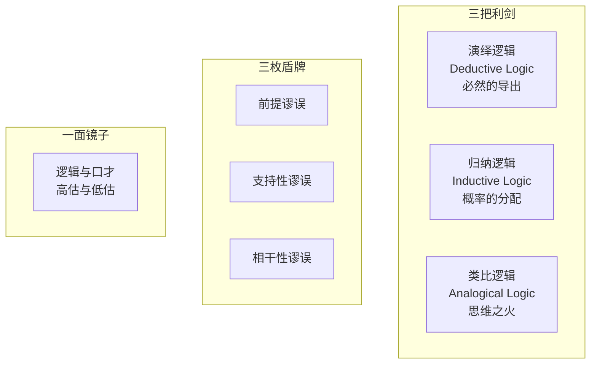

### 1.3 思维的层次结构

> **思维的基本单位是概念** → 用概念为事物分类、建立对象
> **比概念大的单位是模型** → 模型包含多个概念，用来把握概念之间的关系
> **模型可以是命题/公式/图式** → 用来形成有效的判断
> **逻辑的位置** → 确保从已知命题推断出未知命题的规则

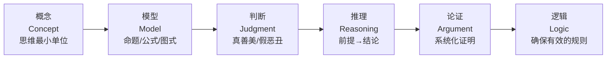

---

## 二、第一把剑: 演绎逻辑 (从AEIO到阿尔法Go)

### 2.1 逻辑的合法性从何而来？

> **核心问题:** 逻辑凭什么确保推理和论证的有效性？谁给它的权利？

**答案:** 逻辑的合法性来自**形式的合理性**，形式的合理性来自**实践的有效性**。

### 2.2 三种推理的范畴关系

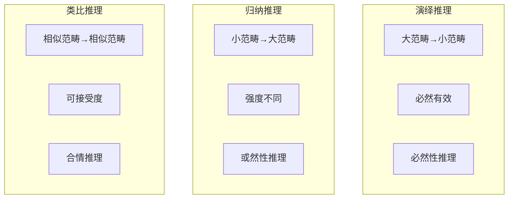

| 推理类型 | 方向 | 有效性 | 评价标准 | 别称 |
|:--------|:----|:------|:--------|:-----|
| **演绎** | 大→小 | 必然有效 | 有效/无效 | 形式逻辑 |
| **归纳** | 小→大 | 或然的 | 归纳强度 | 合情推理 |
| **类比** | 相似→相似 | 或然的 | 可接受度 | 合情推理 |

### 2.3 AEIO：四个基本命题

想象你是地球上第一个拥有自我意识的人，看到一个苹果，你会构建什么命题？

**"我不是苹果"** (E命题：全称否定)

当你得出这个判断，你也拒绝了：
- **"我是苹果"** (A命题：全称肯定) 
- **"一部分我是苹果"** (I命题：特称肯定)
- 但默认接受了 **"一部分我不是苹果"** (O命题：特称否定)

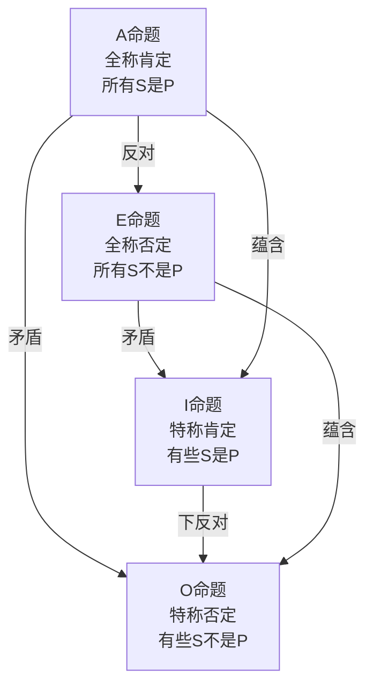

> **洞察:** "这还用逻辑吗？3岁小孩都能得出的判断！" 但哲学家比我们谦虚——他们真的会问"有什么规律吗？"**还真让他们得逞了**。

### 2.4 三段论：在脑子里画圈圈

**例1：有效的三段论**
- 所有苹果都是食物 (大前提)
- 所有食物都可以吃 (小前提)
- ∴ 所有苹果都可以吃 (结论)

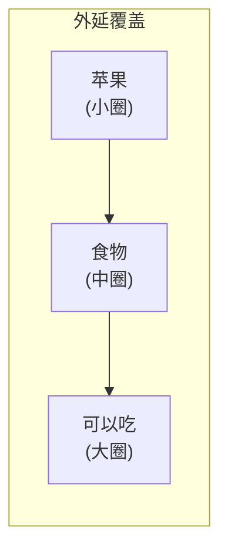

**例2：无效的三段论**
- 一些食物有毒
- 香蕉是食物
- ∴ 一些香蕉有毒 ❌

> **规则:** 中项必须在前提中至少被完整覆盖一次。这里"食物"没有成为香蕉和"有毒"的中介。

**三段论的规模:**
- 每一段都是4种基本命题之一
- 64种基本组合
- 根据大中小项位置 → 4大类型
- **256种三段论形式，只有15种有效！**
- 6条规则就能判断有效性

> **关键区分:** 推理的有效≠内容的真假。逻辑是**形式科学**，内容真假需要**实证科学**。

### 2.5 从词项逻辑到命题逻辑

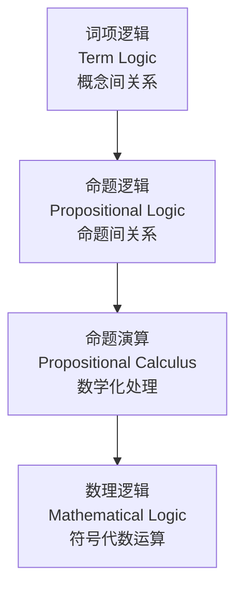

**基本命题** → 真/假
**复合命题** = 基本命题 + 命题连接词 (而且/或者/如果那么/并非)

**命题连接词的真值表:**

| P | Q | P∧Q (而且) | P∨Q (或者) | P→Q (如果那么) |
|:-|:-|:---------|:---------|:-------------|
| T | T | T | T | T |
| T | F | F | T | F |
| F | T | F | T | T |
| F | F | F | F | T |

### 2.6 布尔代数：质变的时刻

**1854年，乔治·布尔的发现:**
- 真/假 → 1/0
- 而且 → 乘法 (1×1=1, 1×0=0)
- 或者 → 加法
- 否定 → 1减去

> **核心洞见:** "如果节目很好看，那么汤汁很用心" = "节目不好看 **或者** 汤汁很用心"
> 
> **这是人话吗？** 你不用在意这是不是日常语言，你只要知道**它是一个运算**就可以了。

**三个逻辑运算符 (与/或/非) 可以表示所有16种二元复合命题形式！**

### 2.7 从布尔到阿尔法Go

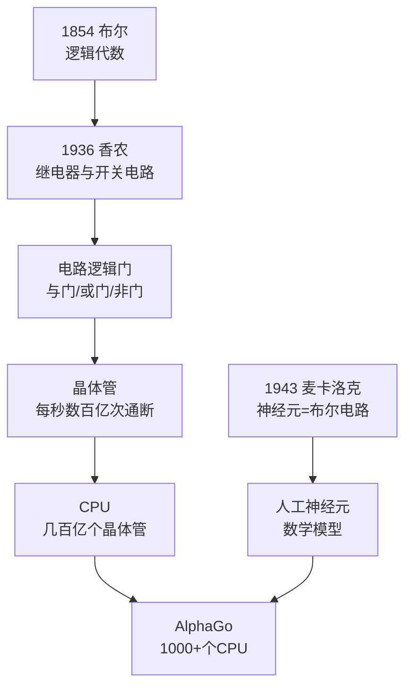

> **震撼:** 在最微观的层面，AlphaGo依然只是在不断地**连通和断开**。但在宏观层面，它做出了只有人类才能做出、甚至人类都做不出的复杂判断。

### 2.8 形式大于内容

**形式的进化历程:**
1. **形式服务内容:** 一开始只有内容没有形式，提炼形式是为了规范内容
2. **形式大于内容:** 三段论整出256种形式，形式开始膨胀
3. **形式脱离内容:** 数理逻辑中，内容被抽象成无意义的占位符，判断变成计算

> **神奇的魔法盒子:** 一台电脑摆在面前，里面没有任何魔法，没有任何这个世界不存在的物质。我们居然循着有效的形式，在上帝给定的范畴中**必然的得出**一部手机。

### 2.9 演绎逻辑的尴尬

**完全析取推理测试:**
> 汤汁盯着张三，张三盯着韩梅梅。汤汁已婚，韩梅梅未婚。
> 问：是不是有一个已婚人士盯着一个未婚人士？
> A. 是  B. 不是  C. 不能确定

**80%的人选C。正确答案是A。**

因为张三要么已婚要么未婚：
- 如果张三已婚 → 张三(已婚)盯着韩梅梅(未婚) ✓
- 如果张三未婚 → 汤汁(已婚)盯着张三(未婚) ✓

> **洞察:** 计算机就是这么自然而然思考的，但这对人来说**非常不自然**。

**斯坦诺维奇说:** "人类都是**认知吝啬鬼**。"

> "绝大多数普通人都是不自觉的**归纳鬼才**、**类比高手**和**演绎残废**。"

---

## 三、第二把剑: 归纳逻辑 (概率与因果的博弈)

### 3.1 有限理性：西蒙的洞见

> **赫伯特·西蒙:** "知识的使命就是在所有**逻辑可能性**的总类中挑选出一个**经验可能性**较为有限的子类，从而在描述可能性的各变量之间建立一定的功能联系。知识的最终目的是确定过去和现在的事实与未来的事实之间的联系，从而由当前状况推出唯一一种可能性。"

**简化版:**
- 知识 = 从无限种类中找出有限子类
- 目的 = 描述变量间关系 → 从状况推出可能性

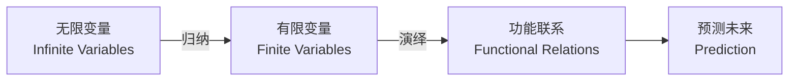

### 3.2 霍兰德职业模型：归纳的典范

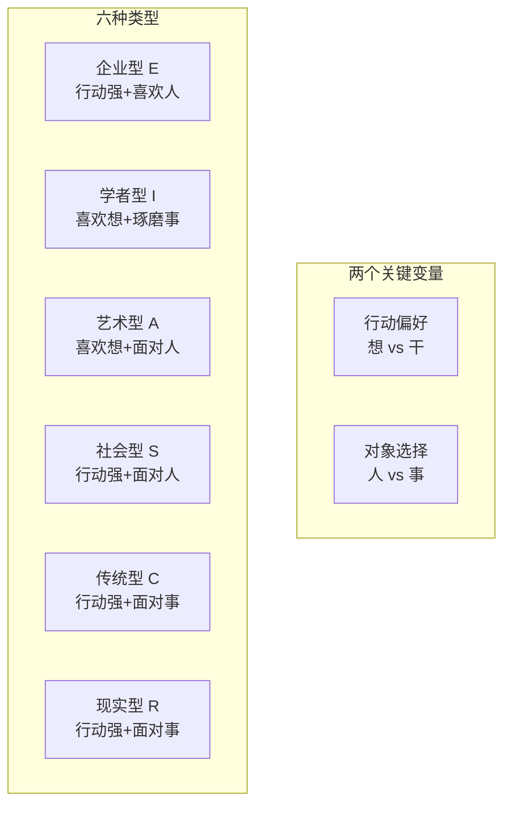

> **原始人归纳法:** 二分法——好人/坏人，安全/危险，喜欢/不喜欢。判断标准来自生存本能。
> 
> **高级归纳:** 找出更多变量 → 划分更多类型 → 更多元的理解。

### 3.3 密尔五法：归纳方法论的进步

| 方法 | 原理 | 局限 |
|:----|:----|:----|
| **求同法** | 在不同情境中寻找共同因素 | 因果难分、变量遗漏 |
| **求异法** | 在差异中寻找原因 | 需要对照组 |
| **共变法** | 量的变化对应 | 相关≠因果 |
| **剩余法** | 排除已知找剩余 | 依赖已有知识 |
| **并用法** | 综合运用 | 复杂费力 |

**求同法的致命缺陷:**
> "过去10天，有3天思维状态特别好，正好那3天我也跑步了。所以跑步导致思维状态变好？"
> 
> **问题1:** 不知道是跑步导致状态好，还是状态好才跑步
> **问题2:** 睡眠、饮食、天气都会同时影响跑步意愿和思维状态

### 3.4 从因果到相关：统计学的颠覆

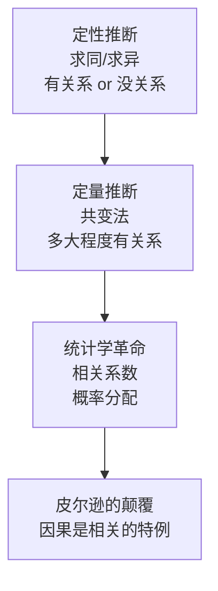

**高尔顿的发现:**
> 身高高的人臂长也相对更长——但这不是因果关系，共同受遗传因子影响。只能用**相关性**描述。

**皮尔逊的颠覆:**
> "存在一个比因果关系更广泛的范畴，即**相关性**，而因果关系只是被囊括于其中的一个有限的范畴。"

| 传统观念 | 皮尔逊观念 |
|:--------|:---------|
| 相关性反映因果关系 | 因果关系反映相关性 |
| 因果是自然的语言 | 概率是自然的语言 |
| 相关表现因果 | 因果是相关系数=1的特例 |

### 3.5 随机对照试验：最强实证手段

**费舍尔的发明:**
- 随机取样 → 稀释混杂因子的影响
- 对照组 → 隔离单一变量

> **理想状态:** 只要资源无限多，就能得到一张表达所有人类行为与身心状态变化关系的表格——这就是关于"人类"这个总体的参数。

### 3.6 吸烟与肺癌：因果推断的困境

**60年数据:** 美国人均吸烟量猛增，肺癌从罕见变成常见。

**反对意见:**
1. "张学良天天抽烟喝酒烫头，活到103岁" → 孤证
2. "汽车尾气、空气质量也在恶化" → 混杂因子
3. "某些基因导致喜欢吸烟，同时导致不健康生活习惯" → **费舍尔本人的反对！**

> **讽刺:** 随机抽样大法的发明者费舍尔，因为自己是老烟枪，成为了最高明的反对者。

**最终突破:**
- 实验室证据：小白鼠涂抹烟焦油患癌
- 化学分析：从烟雾中分离出已知致癌物
- 1964年：美国卫生局局长声明因果关系，烟草销量骤降

### 3.7 休谟之叉：知识的根基性问题

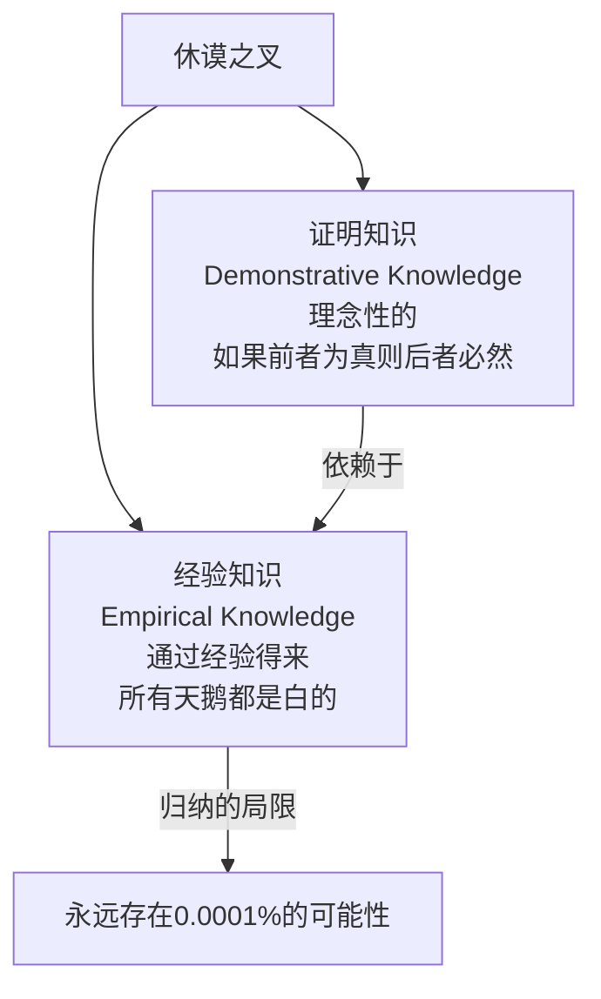

> **休谟之叉一把插进知识的深处，摧毁了知识的根基。**

因为：
- 所有演绎知识都基于归纳知识建立
- 所有归纳知识又受限于人的经验能力
- 密尔、皮尔逊、费舍尔的工作，只是把叉子**捏得紧了一点**

### 3.8 科学的本质

> **奎因:** "物理对象和诸神只是**程度上**而非**种类上**的不同，两种东西只是作为文化的设定物进入我们的概念。物理对象之所以在认识论上优于大多数其他神话，原因在于它作为把一个易于处理的结构嵌入人的经验之流的手段，已证明是比其他神话**更有效**的。"

**皮尔逊的类似观点:**
> "力作为运动的因，与树神作为生长的因，可以等同视之。"

**区别在于:** 物理对象更容易被**实证手段测定**，被**形式逻辑演绎**。

> ⚠️ **警告:** 不要把科学当成新的神话和新的宗教，这是一种**原始人的归纳法**。

---

## 四、第三把剑: 类比逻辑 (思维之火)

### 4.1 类比的三种形式

| 类比类型 | 对象 | 学习场景 | 例子 |
|:--------|:----|:--------|:----|
| **属性类比** | 形容词 | 学习某物性质 | 通过"美丽"理解"优雅" |
| **关系类比** | 动词/介词 | 学习对象间关系 | 通过"拿"理解"抓" |
| **结构类比** | 名词 | 学习复杂对象 | 通过"流水"理解"时间" |

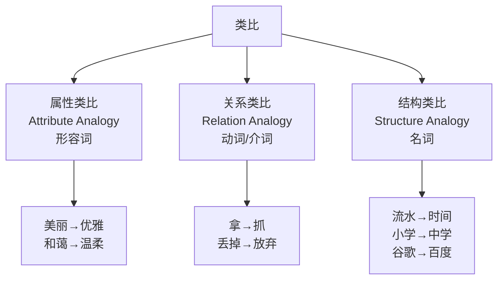

### 4.2 概念网络与投射

> **洞察:** 我们的概念系统像一张巨大的网，任何概念的定义取决于它与其他概念的关系。**没有一个概念可以被孤立定义。**

**用"流水"理解"时间"的机制:**
- 把"流水"背后的整个概念关系网络投射给"时间"
- 时间这么抽象的概念突然变得生动
- 于是我们能说：时间在**流逝**，**漫长**的等待，在历史的**长河**中

### 4.3 隐喻：类比的隐身形态

**核心隐喻：心理内容即物理实体**

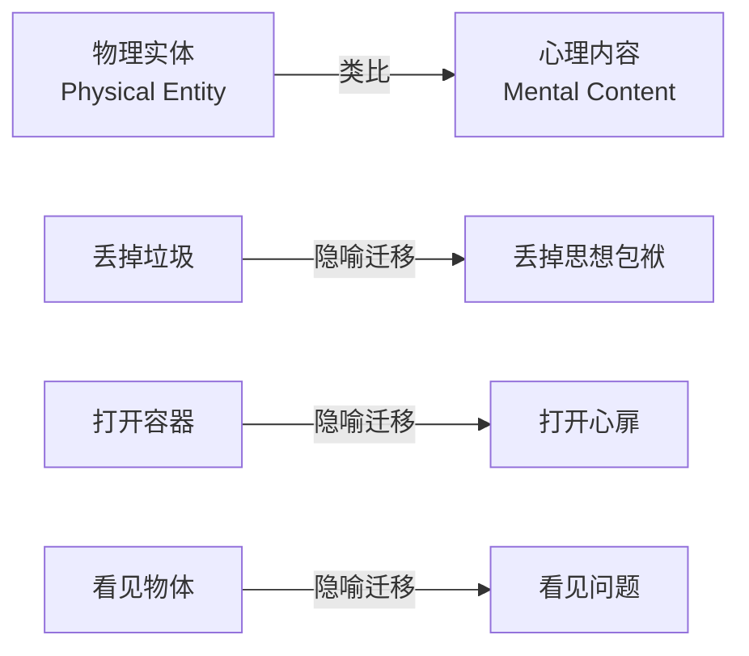

**日常语言中的隐喻:**
| 心理表达 | 背后的物理类比 |
|:--------|:-------------|
| 放下你的执念 | 放下一个物体 |
| 重拾你的信心 | 捡起一个东西 |
| 收拾好你的心情 | 收拾房间 |
| 端正好你的态度 | 摆正物品 |
| 这件事你扛得住吗 | 扛住重物 |

### 4.4 语言即容器

> 如果心理内容是物理实体，那语言就是存放物理实体的**容器**。

**例子:**
- "他的话里**充满了**思想" → 容器装满了物体
- "他是一个**没有货**的人" → 打开容器发现空空如也
- "他的发言听得我**云里雾里**" → 容器被烟雾包裹，看不见里面装了什么

### 4.5 视觉即认知

**视觉类比迁移到认知:**
- 我还没有想**清楚** ← 清楚是视觉词
- 我的思路很**清晰** ← 清晰是视觉词
- 你的观点很**模糊** ← 模糊是视觉词
- 我想知道你的**看法** ← 看法是视觉词
- 给你一个新的**视角** ← 视角是视觉词

### 4.6 思想即建筑

**结构复杂的心理内容 → 结构复杂的建筑物**

| 建筑语言 | 思想语言 |
|:--------|:--------|
| 建造房屋 | **构建**理论体系 |
| 地基不牢 | 你的理论**根基**不牢 |
| 支撑结构 | 你的论据**支撑不了**观点 |
| 建筑倒塌 | 你的理论**崩塌**了 |

### 4.7 概念整合理论

**福康耶的四空间模型:**

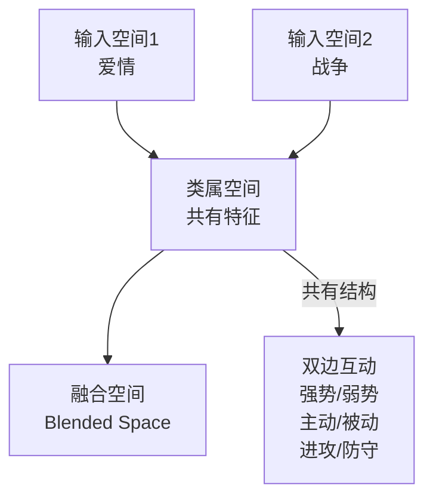

**爱情即战争:**
- "我向他发起了**攻势**"
- "我**赢得了**他的芳心"
- "我突破了最后的**防线**"
- "他被我**征服**了"
- "我们两败俱伤"
- "我是爱情中的**失败者**"

> **问题:** 这种隐喻意味着双边关系中一定有**获胜者**，需要持续炫耀实力、经常威慑、偶尔摩擦冲突、必要时大打出手。**这是什么样的爱情？**

### 4.8 学习成长即田径比赛

**共有结构:**
- 多人运动
- 只有一个方向
- 公平打分机制
- 过程枯燥/疲劳

**由此产生的语言:**
- 不要输在**起跑线**上
- 成绩**遥遥领先**
- 张三**掉队**了，李四**落后**了
- 高考**冲刺**100天

> **问题:** 这是以**百米冲刺的姿态**在跑一场**马拉松**。你从来没见过起跑位置如此重要的马拉松，也没见过距离跨度如此之长的百米冲刺。

**替代隐喻:** 爱是共同加工的艺术品
- 共同加工的作品
- 需要共同审美
- 需要耐心、长时间磨合
- 用欣赏的目光看待

### 4.9 原型范畴论

> **定义:** 原型是一个范畴的**典型实例**，其他成员是基于它们被感知到与原型相似而被纳入同一范畴的。范畴以原型成员为中心，通过**家族相似性**不断向外扩展。

**家族相似（维特根斯坦）:**
- "丢掉"是"放弃"他爹
- "小学"是"中学"的邻居
- "温柔"是"和蔼"的妹妹
- 亲缘关系存在，但没有明确层次等级

### 4.10 原型的力量与锁定

> **那些越早在我们生命中出现的原型，位置越靠中间，关联的节点越多，对我们的控制和影响就越大。**

**家庭即社会:**
- 家庭是最早出现的原型之一
- 我们时刻用家庭类比社会
- 与男性上级相处的方式 ≈ 与父亲相处方式的翻版
- 这就是为什么"原生家庭"话题如此热门

**自我即他人:**
- 自我评价需要假设自己是别人
- 但这个"别人"是以你为原型类比出来的模本
- 你臆想中别人的评价标准 = 你对别人评价标准的翻版
- 一个爱买名牌包的人，觉得所有人都盯着名牌包看——因为她自己就盯着别人的包看

### 4.11 有限理性的认知基础

> **侯世达:** "人在思考的时候，时时刻刻都在发现类别。类别乃是思维的核心，不是每周、每天、每小时或每一分钟做一次，而是**每一秒钟都在做数不清的类比**。"

**为什么人比AI智能？**
- 我们围绕原型在无边的概念网络中建立了**半封闭空间**
- 让理性在其中高效运行
- 理性之所以**有限且有效**，是因为基于原型相似性的经验迁移**是有效的**
- 这是AI梦寐以求的能力

### 4.12 原型的双刃剑

> "处处是衔接与链条，松弛我们僵硬的大脑，各种结构和限制虽是束缚，却奇妙地解放我们的思考。" —— 侯世达

**锁定效应:**
- 原型会限制我们的理解
- 约束我们的想象力
- 导致非理性错误
- 受困于固有信念
- 被某些阴影封印能力

**但是有后门:**
- 爱情可以是战争，也可以是共同加工的艺术品
- 学习可以是百米冲刺，也可以是充满挑战和乐趣的马拉松
- **我们可以选择，我们并非不自由**

> **侯世达:** "范畴的确在操纵我们，我们也确实受制于它，对此只能承认，我们不仅被囚困在已知的牢笼里，而且还是**终身监禁**。但幸运的是，我们可以不断**扩大这个牢笼**，事实上可以无限扩大——只有已知的事物才能让我们从已知中解脱。"

> **马克斯·韦伯:** "我们都是悬挂在自己编织的意义之网上的动物。"

---

## 五、反模式 (Anti-Patterns)

### ❌ 反模式1: 把演绎逻辑当成日常思维工具

**表现:** 认为学了三段论就能在日常中"逻辑严密"。

**为什么会犯错:** 演绎逻辑需要封闭系统和完整信息，现实问题是开放的、信息不完整的。完全析取推理对人来说"非常不自然"。

**修正:** 认识到演绎逻辑是**外挂**而非**内功**。日常高效决策靠的是归纳和类比。

**✅ 正向案例:** 程序员理解自己写代码时的逻辑思维是"外挂模式"，下班后不会用三段论和家人争论，而是用情感和类比沟通。

---

### ❌ 反模式2: 把统计相关当成因果关系

**表现:** 看到"吃巧克力的国家诺贝尔奖得主更多"就认为巧克力让人聪明。

**为什么会犯错:** 人类天生渴望因果解释，相关性很容易被脑补成因果。

**修正:** 记住皮尔逊的颠覆——因果是相关的特例(r=1)，大多数相关只是共同受第三因素影响。

**✅ 正向案例:** 医学研究者在发现吸烟与肺癌的相关后，继续进行实验室研究(小白鼠实验)和化学分析，形成完整证据链，才敢声明因果关系。

---

### ❌ 反模式3: 被隐喻锁死而不自知

**表现:** 把"学习成长=田径比赛"当真，永远在焦虑地"冲刺"，从不享受过程。

**为什么会犯错:** 隐喻是无意识运作的，我们对它毫无察觉。原型越早出现、用得越多，控制力越强。

**修正:** 识别隐喻，质疑隐喻，选择替代隐喻。问自己"这个类比的共有结构是什么？它遮蔽了什么？"

**✅ 正向案例:** 一个长期焦虑的职场人意识到自己一直用"职场是战场"的隐喻在生活。尝试切换到"职场是游乐场"或"职场是健身房"的隐喻后，焦虑明显降低，反而表现更好。

---

## 六、术语表 (Glossary)

| 术语 | Term | 定义 (人话) |
|:----|:----|:----------|
| 演绎逻辑 | Deductive Logic | 从大范畴必然推出小范畴的推理，形式有效则结论必然有效 |
| 归纳逻辑 | Inductive Logic | 从个别推到一般，只能无限逼近，永远有0.0001%的不确定 |
| 类比推理 | Analogical Reasoning | 在相似的范畴间迁移理解，思维的真正引擎 |
| 三段论 | Syllogism | 在脑子里画圈圈，用规则确保圈圈画对 |
| 命题逻辑 | Propositional Logic | 研究命题之间关系的逻辑，用真值表穷尽可能性 |
| 布尔代数 | Boolean Algebra | 把逻辑变成1和0的运算，是现代计算机的基础 |
| 有限理性 | Bounded Rationality | 人只能在封闭的有限变量空间中有效决策 |
| 混杂因子 | Confounding Variable | 同时影响因和果的第三因素，因果推断的大敌 |
| 相关性 | Correlation | 变量之间的共变关系，因果只是r=1的特例 |
| 休谟之叉 | Hume's Fork | 知识分为经验的和证明的两种，所有证明都依赖归纳的经验 |
| 隐喻 | Metaphor | 用一个概念网络去理解另一个概念的类比迁移 |
| 原型 | Prototype | 范畴的典型实例，其他成员按与它的相似度被归类 |
| 概念整合 | Conceptual Blending | 两个输入空间通过共有结构融合出新理解 |
| 家族相似 | Family Resemblance | 概念之间有亲缘关系但无明确层次的关联方式 |

---

## 七、公式表 (Formula Table)

| 公式名称 | 逻辑表达式 | 说明 |
|:--------|:----------|:----|
| **知识压缩公式** | `有效知识 = 无限可能性 → 有限变量空间 → 功能联系` | 西蒙的有限理性核心 |
| **归纳强度公式** | `归纳强度 = 样本量 × 随机性 × 变量控制` | 统计学基础 |
| **类比有效性公式** | `类比有效性 = 结构映射完整度 × 领域相关性` | 类比推理的评估 |
| **原型控制力公式** | `控制力 = 出现时间(越早越大) × 使用频率 × 关联节点数` | 解释为什么原生家庭影响大 |
| **隐喻识别公式** | `隐喻暴露 = 问"共有结构是什么" + 问"遮蔽了什么"` | 跳出隐喻锁定的方法 |
| **认知效率公式** | `效率 = 类比迁移有效率 × (1 / 完全析取分析需求)` | 解释为什么人比AI更智能于模糊情境 |

---

## 八、深度概念详解

### 8.1 逻辑与口才的关系

> **高估:** 以为学了逻辑就能口若悬河、辩才无碍。
> **低估:** 以为逻辑和日常表达无关。

**真相:**
- 演绎逻辑是外挂，不是内功
- 日常高效沟通靠的是归纳直觉和类比隐喻
- 逻辑的力量在于它创造了"绝对领域"——现代科技文明

### 8.2 形式服务内容 vs 形式脱离内容

**阶段1:** 只有内容没有形式 → 混沌
**阶段2:** 形式规范内容 → 三段论规则
**阶段3:** 形式开始膨胀 → 256种三段论形式
**阶段4:** 形式完全脱离内容 → 数理符号逻辑
**阶段5:** 形式外包给机器 → 计算机/AI

> **质变时刻:** 当形式可以脱离具体内容独立运算时，它就变成了可以被"外包"的东西——于是有了香农的电路、冯诺依曼的计算机。

### 8.3 科学的认识论地位

> "物理对象和诸神只是程度上而非种类上的不同。"

**为什么物理学优于神话？**
- 不是因为物理学"发现了真理"
- 而是物理学创造了**更容易被处理的结构**
- 这些结构更容易被实证手段测定、被形式逻辑演绎
- 从实践上证明了**更有效**

### 8.4 "触类旁通"与"不言而喻"

两个成语揭示了类比思维的本质：
- **触类旁通:** 触及一个类别，旁通到相似类别
- **不言而喻:** 不用说就明白了，因为概念网络自动激活

**我们的认知过程就是一个不断触类旁通、不言而喻的过程。**

---

## 备注与引用 (Notes & References)

### 素材来源
- 汤质看本质: 逻辑与推理三部曲
  - Part 1: 从AEIO到阿尔法Go (演绎逻辑)
  - Part 2: 归纳推理与统计学
  - Part 3: 类比——思维之火

### 关键引用
- **亚里士多德:** 逻辑的本质是必然的导出
- **乔治·布尔:** 《思维规律的研究》(1854)
- **克劳德·香农:** 《继电器与开关电路的符号分析》(1936)
- **赫伯特·西蒙:** 有限理性理论
- **大卫·休谟:** 休谟之叉
- **卡尔·皮尔逊:** 相关性理论，"因果是相关的特例"
- **罗纳德·费舍尔:** 随机对照试验
- **路德维希·维特根斯坦:** 家族相似
- **乔治·莱考夫:** 《我们赖以生存的隐喻》
- **侯世达:** 《表象与本质：类比，思维之源和思维之火》
- **马克斯·韦伯:** "悬挂在自己编织的意义之网上的动物"

### 推荐阅读
- 《超越智商》斯坦诺维奇
- 《我们赖以生存的隐喻》莱考夫
- 《表象与本质》侯世达
- 《因果推断》(前沿理论)
