# 蜕升 (Ascension Worldview)

> **Tags:** `[Philosophy]`, `[AI]`, `[Futurism]`, `[Social_Change]`
> **Date Added:** 2026-01-19
> **一句话总结 (One-Liner):** 蜕升是一种从"被替代者"到"驾驭者"的认知升维——当AI让技能廉价化、执行力商品化时，唯一不可替代的是你对自己的定义权，以及你创造意义的能力。本书将带你穿越震撼与恐惧，重建思维操作系统，最终找到一条通往更自由、更有意义的未来之路。

> **写于 2026年1月21日**
>
> 前几天，在一段旅途结束之后，我和朋友万达一起送走了小晨。她达成了她在一个月25天内飞行25000公里的壮举，而我则要在这个地方陪伴家人等到过年，万幸的是朋友能在这里陪我多待几天。坦白说，我并不喜欢这个老家。它在我的感受里是萧条的、机会稀少的，所以在人生很长的一段时间里，我都选择不在这里停留。对我而言，“哈尔滨”不仅仅是一个地理意义上的家乡，它更像是一种当下的环境隐喻——偏僻、滞后、与时代节奏存在距离的旧有空间。
>
> 而真正触发我转变视角的，是我对这个时代的重新认识。我从 2022 年 ChatGPT 刚出现时就开始使用 AI，将它逐步引入到自己几乎所有的事务中。
>
> 究其原因，可能是我骨子里是一个**究极懒惰，但在脑海里又渴望极多**的人。小时候我就总有无数稀奇古怪的想法，总想指挥我爸妈帮我实现这实现那，试图把他们当成我的“手脚”来用。但很快我就发现这招不好使，他们不仅经常不合我的心意，还会反过来教育我“自己的事情自己做”。这让我一度对“想法落地”这件事感到很受挫，因为光靠我自己的手脚，根本跟不上我脑子的速度。
>
> 但长大后遇到的 AI，简直就是为我量身定做的“全能分身”。它啥都能干，从不抱怨，而且对我言听计从。我开始变本加厉：不管是点达美乐pizza还是记个日程，只要一件事情需要我重复做两次以上，我就会想办法把它交给 AI 系统来完成。虽然让它学会可能要花点时间，但下次再做时，我只需要输入一个命令，它就会完美执行。我开始希望能用这个懒人福音，让我做到很多我以往想做又根本做不到的事情。
>
> 但即便如此，我也并没有因此获得所谓的“松弛感”。相反，我每天都在关注那些真正的 AI 顶尖大神，看着他们用我无法理解的速度构建出超级功能，一种深深的“不够感”会紧紧抓住我。我怕自己跑得不够快，生怕自己的能力撑不起我想做的事情，甚至觉得自己随时会被这些“神一样”的大佬甩在身后。即便我已经算是“先跑起来”的人，我依然在恐惧。
>
> 带着这种恐惧，当我把目光投向身边时，另一种震撼撞击了我：这个世界上，依然有大量的人连电脑都不太会使用，甚至需要通过教程去学习“如何使用电脑”。当我回到哈尔滨，在家乡停留了一段时间之后，这种感受变得更加具体：Agent coworker与普通大众之间，仍然隔着一段极其遥远的距离。
>
> 这种距离感在看到上下学的孩子们时达到了顶峰。看着那一群群背着沉重书包、被困在旧有教育体系里的孩子，我没有感受到所谓的“朝气”，反而感到一种**极其沉重、甚至接近生理痛楚的悲凉感**。为什么？因为我清楚地知道，他们此刻正在拼命内卷、耗尽童年去学习的技能，在他们走出校门的那一刻，可能已经一文不值。如果他们继续沿着这条旧轨道走下去，等待他们的未来将是极度痛苦的——那是被时代无情碾压的痛苦。**那一刻，我脑海里只有一个念头：我该如何把他们从这艘即将沉没的船上救下来？**
>
> 在这种现实之下，不同的人呈现出截然不同的状态。有些人隐约察觉到了变化的方向，却因此陷入深度焦虑；有些人完全不了解发生了什么，甚至对未来的发展持否定态度。某些年长的长辈，会将我依赖 AI 的行为视为“邪门歪道”。当我告诉他们，我可以在几分钟内完成他们员工，甚至他们自己一到两天的工作量时，**他们并不会感叹于这个世界发展成了什么样子，反而会指责我这是在“偷懒”，认为这是一种投机取巧的作弊。**

> 也正是在这样的背景下，我开始反复思考一个问题：当一个人拥有了极强的能力之后，他是否还会去爱身边的人？当一个人的认知和执行力，已经相当于几百个人的总和，他是否还需要、还愿意与普通人保持情感连接？
>
> 在我和万达讨论这个话题时，我给小晨发了条消息。小晨回了一句极其“搞笑”：“修修，太善良的人会最先被杀死的。”
>
> 这话像个地狱笑话，却精准地击中了我和万达之间那个巨大的、让我们彼此都感到好奇的“认知差异”。我们并没有争吵，而是陷入了一种近乎着迷的探讨：为什么面对同一个未来，我们的底层判断会截然不同？
>
> 我和小晨是典型的 ENTJ，信奉**工具理性**。在我们眼中，世界是一套待优化的系统。当 AI 让我拥有了“无需依赖他人”的能力时，我顺着理性的逻辑推演出了一个极致的疑问：“如果我一个人就能完成所有生产，为什么还需要忍受低效的协作？如果价值可以由我独立创造，那么‘他人’的存在是否将不再必要？”
>
> 而万达（ENFP）则代表了另一种**价值理性**。他并不是在用感性反驳我，而是在描述一种我未曾计算的法则：“你所说的效率是‘达成’手段，但价值的源头是‘确认’。没有‘他者’的看见与反馈，你的全能只是一个没有坐标的奇点。你依然可以创造，但无法感知到‘意义’。”
>
> 这番话让我突然意识到，**意义本身是有理性来源的**。我试图用绝对的逻辑去解构它，最后竟推导出了与万达直觉一致的结论：**价值无法在封闭的自我中产生，它必须诞生于“我”与“他者”的交互之中。** 绝对的独立等于绝对的虚无，我们需要他人，不是为了生存，而是为了确认我们存在。
>
> **这种碰撞让我意识到，我们讨论的不仅是技术，更是当个体力量发生质变时，人性该如何重新锚定。而在那次深度推演的尽头，我们不仅看到了冲突，更找到了一个能够融合工具与价值的“解”。**
>
> **这一份《蜕升》，正是源于那次深夜长谈的启发，但它不仅止步于此。它是我站在无数思想巨人的肩膀上，对这个“解”的进一步确认与延伸。**
>
> 它不再局限于几个人的困惑，而是对这一次文明跃迁的**深度切片**。
>
> 在这里，我必须说明：我并非什么创造者，只是一个**谦卑的整合者**。这份文档融汇了古今中外无数高维智慧的结晶——从斯宾诺莎的泛神论到黑格尔的历史演进，从古代诺斯替的救赎渴望到现代控制论的冷峻洞察。我向这些人类历史上的先贤致以最深的敬意，是他们为我提供了穿越迷雾的火把。
>
> 而我试图用这把火把照亮的，不仅是**普通人的生路**，更是**同类（The Kind）的归途**。
>
> 在这个新旧交替的时刻，普通人面临的是**“如何幸存”**的焦虑，而像我们这样的先行者，面临的是**“价值何在”**的迷茫。这就像是马斯洛需求曲线的两端，我们都在试图一一给出答案：一份文档，既要成为普通人在旧世界崩塌时能抓住的**生存最优解**，也要成为同类在力量无限放大后能找到的**价值坐标系**。
>
> 这一切，都是为了让想活下去的人能活好，让拥有力量的人不再孤独。
>
> 因此，这不只是一套方法论，更是一种**全新的生存哲学**：在混乱中建立秩序，在虚无中创造意义，在被替代的恐惧中找到绝对的掌控。
>
> 我把它写下来，是因为我们相信：当那个时刻来临时，**“怎么活”** 比 **“怎么用”** 更重要。
>
> **这是写给每一位既渴望力量又恐惧孤独的未来人类的——生存指南。**

---

### 本书结构

| 章节                      | 内容                                                                                                    | 核心问题                         |
| ------------------------- | ------------------------------------------------------------------------------------------------------- | -------------------------------- |
| **1. 震撼**         | 旧世界为什么正在崩塌                                                                                    | 发生了什么？                     |
| **2. 元认知**       | 本书的定位与核心洞察                                                                                    | 这本书在讲什么？                 |
| **3. 核心架构**     | 蜕升世界观的完整框架                                                                                    | 蜕升是什么？                     |
| ↳ 3.1 核心概念           | 9大核心概念详解（蜕升、附能、中间层消失、去中心化、游戏副本论、化身论、想但做不到、灵魂注入、成为先知） | 理解蜕升的关键词                 |
| ↳ 3.2 执行协议           | 个人蜕升→社会认知→哲学整合→行动转化                                                                  | 如何一步步蜕升？                 |
| ↳ 3.3 未来路线图         | 2024→2027→2035→2050+ 的四阶段预测                                                                    | 世界会变成什么样？               |
| ↳ 3.4 必然性论证         | 为什么蜕升是文明的唯一终点                                                                              | 为什么必须蜕升？                 |
| ↳ 3.5 蜕升者画像         | 蜕升者的特征与自评量表                                                                                  | 我蜕升了吗？                     |
| **4. 反模式与陷阱** | 40个常见认知误区与修复方案                                                                              | 哪里容易走偏？                   |
| **5. 系统关联**     | 与其他模块的连接                                                                                        | 这套体系如何嵌入更大的知识网络？ |
| **6. 术语表**       | 核心概念的定义与词源                                                                                    | 关键词速查                       |
| **7. 引用**         | 思想来源与致敬                                                                                          | 站在谁的肩膀上？                 |

---

### 读完这本书，你将获得

> [!TIP]
> **对于恐惧被替代的普通人：**
>
> - 一套理解AI时代的**底层操作系统**——不再被碎片化的新闻和焦虑裹挟
> - 一个"我该怎么活"的**清晰答案**——从"被淘汰"的恐惧中解脱
> - 一份**个人蜕升的行动清单**——从建立外挂系统到获得同类认可
>
> **对于已经起跑的先行者：**
>
> - 一个**价值坐标系**——当你拥有强大能力后，如何避免陷入孤独与虚无
> - 一份**40个陷阱的避坑指南**——识别那些让蜕升者功亏一篑的认知误区
> - 一个**成为先知的路径**——如何定义规则，而不是被规则定义
>
> **对于所有人：**
>
> - 一个关于**存在意义的终极回答**——我们是谁？我们从哪里来？我们要到哪里去？
> - 一份**自我评估量表**——量化你当前的蜕升程度，明确下一步方向
> - 一个**可以反复调用的思想外挂**——遇到困惑时，翻开对应章节即可"附能"

---

## 1. 震撼：这一代人的崩塌与重构 (The Shock: Collapse and Reconstruction)

我们必须直面一个残酷的现实：**我们熟悉的世界已经结束了，只是惯性还在带着我们空转。**

这不是危言耸听，也不是为了贩卖焦虑而故作惊人之语。这是正在发生的物理事实，就像地球自转一样确定。

如果你是一个关注新闻的人，你可能已经注意到了一些端倪：硅谷的裁员潮、国内互联网大厂的"毕业"浪潮、越来越多高学历年轻人的失业与迷茫。但这些表象只是冰山一角。真正的震撼在于，支撑我们父辈乃至我们自己人生规划的那套逻辑——"好好读书→考好大学→找好工作→过好生活"——正在从根基上被瓦解。

> **社会契约论视角 - 让-雅克·卢梭 (Jean-Jacques Rousseau):**
>
> 卢梭在《社会契约论》(1762) 中提出，社会秩序建立在人们之间的隐性契约之上。当代社会的"教育-就业"契约——投入时间学习，换取稳定职业——正是这种社会契约的现代版本。当AI打破这一契约的履行条件时，我们面临的不仅是经济问题，更是社会秩序的重构。

> **社会学视角：** 社会学家齐格蒙特·鲍曼 (Zygmunt Bauman) 在《流动的现代性》(*Liquid Modernity*, 2000) 中预言，后现代社会的特征是"一切坚固的东西都烟消云散"——稳定的职业路径、明确的人生阶段、可预测的社会契约正在被"液态化"。AI的出现正在急剧加速这一进程。

在这一章里，我将用四个视角来呈现这场崩塌的全貌。每一个视角都可能让你感到不适，但请相信，只有直面深渊，才能找到跨越深渊的桥梁。

---

### 1.1 应试教育的荒谬性：12年 vs 1秒钟 (The Absurdity of Exam-Oriented Education)

#### 一场荒诞的军备竞赛

> **教育经济学视角：** 经济学家布莱恩·卡普兰 (Bryan Caplan) 在《反对教育的理由》(*The Case Against Education*, 2018) 中提出"信号理论"——教育的主要功能不是传授知识，而是向雇主"发信号"证明你具备智力、服从性和毅力。如果这一理论成立，当AI能够直接展示能力产出时，这套昂贵的"信号系统"将面临根本性的挑战。

在中国，一个孩子从6岁开始，就被卷入一场看不见终点的军备竞赛。

他需要经历12年的寒窗苦读。每天早上六点半起床，晚上十点才能回家。周末被各种补习班填满，寒暑假成了"弯道超车"的战场。他牺牲了视力（根据国家卫健委2023年数据，中国儿童青少年总体近视率已达52.7%，高中生近视率更是高达80%以上）、牺牲了睡眠（中国睡眠研究会调查显示，超过80%的中学生睡眠时间不足8小时）、牺牲了本该属于童年和青春的一切，只为了一个目标：**在高考中取得一个好成绩**。

但让我们冷静下来，问一个残忍的问题：**他这12年究竟学到了什么？**

- 为了记住历史年代？打开手机，问一句话，GPT可以在0.01秒内检索人类有史以来的全部历史事件、人物、因果关系，并以任何你想要的格式呈现给你。
- 为了掌握外语语法？2024年的实时翻译模型已经可以做到同声传译级别的准确度，让专业同传译员都开始考虑转行。
- 为了学会解复杂的数学题？Wolfram Alpha配合大语言模型，不仅能瞬间给出答案，还能给出完整的解题步骤和背后的数学原理解释。
- 为了培养"逻辑思维"和"批判性思考"？讽刺的是，应试教育恰恰是批判性思考的最大敌人——标准答案制度系统性地扼杀了任何偏离"正确轨道"的思考。正如教育学家保罗·弗莱雷 (Paulo Freire) 在《被压迫者教育学》中批判的"银行式教育"：学生被视为等待填充的空容器，而非具有批判意识的主体。

#### 低配硬盘与低速计算器

**残酷的现实是：我们目前的教育体系，正在把人训练成"低配版硬盘"和"低速版计算器"。**

> **教育批判视角 - 伊万·伊利奇 (Ivan Illich):**
>
> 奥地利哲学家伊万·伊利奇在《去学校化社会》(*Deschooling Society*, 1971) 中就预言性地批判了现代教育的"制度化迷思"：学校把"学习"等同于"被教"，把"教育"等同于"文凭"，把"知识"等同于"可测量的内容"。他认为这种制度化教育实际上是一种"隐性课程"——教会人们依赖机构、接受等级、放弃自主学习的能力。AI时代证明了他的洞见：当机构教授的内容可以被瞬间获取时，制度化教育的核心价值就会崩塌。

硬盘的功能是存储信息，但人类大脑的存储容量和检索速度远远比不上云端的任何一个数据库。计算器的功能是运算，但人类大脑的运算速度比起任何一个入门级芯片都慢得可怜。当一个高三学生在考场上为一个公式抓耳挠腮、绞尽脑汁时，云端的算力正以他**十亿倍**的速度在奔跑，处理着比他那张卷子复杂亿万倍的问题。

那张他梦寐以求的录取通知书，曾经是阶层跃迁的门票，是父母眼中"光宗耀祖"的证明，是他自己十二年苦读的回报。但现在，它可能只是一张通往**"过时技能培训班"**的收据。

> **技术哲学印证 - 凯文·凯利 (Kevin Kelly):**
>
> "在未来，你与机器竞争的能力将取决于你与机器合作的能力。"
>
> ——《必然》(*The Inevitable*, 2016)
>
> 这位《连线》杂志创始主编预言，教育的目标将从"掌握知识"转向"学会提问"——因为答案已经变得廉价，而正确的问题才是稀缺资源。

#### 教育系统的时间错位

这里有一个更深层的荒谬：教育系统存在**巨大的时间错位**。

一个2024年入学的大学生，要到2028年才毕业。但AI的发展速度意味着，他今天学的"前沿技术"，四年后可能已经被完全淘汰。更可怕的是，他学的不仅仅是技术——他学的是一种**思维方式**，一种"记忆→复述→考试"的思维方式。而这种思维方式，恰恰是AI时代最不需要的。

我曾经和一位985高校的计算机教授聊天。他无奈地告诉我："我们教的编程语言、框架、工具，学生还没毕业就过时了。但更可怕的是，我们教的'如何学习'的方法本身就是错的。我们教他们背API文档，但AI可以在一秒内检索所有文档并给出最佳实践。我们教他们刷LeetCode，但AI写代码的速度和质量已经超过了大多数初级工程师。我们到底还能教什么？"

这位教授的困惑，正是整个教育系统困境的缩影。

> **教育改革视角 - 肯·罗宾逊 (Ken Robinson):**
>
> "学校正在用19世纪的模式，培养21世纪的学生，为尚未存在的工作做准备。"
>
> 这位教育改革倡导者在其TED演讲《学校扼杀创造力吗？》(2006，史上观看量最高的TED演讲之一) 中指出，工业时代设计的教育体系将"标准化"和"服从性"置于"创造力"和"批判性思维"之上——而这恰恰与AI时代的需求背道而驰。

#### 甚至人工智能专业也不能幸免

更讽刺的是，**连"人工智能"这个看起来最前沿、最有前途的专业，也正在经历同样的危机**。

我有一个朋友在海外某知名大学读人工智能硕士（我的校友）。有一天，我们聊起了他的求职经历和对这个专业的看法。他的话让我深感震撼：

> "我站在过来人的角度告诉你，现在的专业都没什么用。应该高中毕业了读一年大学预科，了解一下专业是咋回事，就去想去的领域上班。"

我问他，AI专业不是很热门吗？他苦笑着说：

> "比一般专业更蠢。因为算法的门槛很高，不像学个数据库或者Java这种上来就能干活。现在前沿算法的更新都是特别顶尖的选手在做——比如哈希表算法实现快速查找，Transformer解决了长距离依赖等等——**只有大厂和高效的大国（欧美、中国）在真正搞算法研究**。普通人都是在调用，或者水论文。"

他接着说了一句更扎心的话：

> "不结合业务、没有产品意识，像我这种瞎调用的选手，训练出来的AI也很蠢。"

这段对话揭示了一个残酷的分层现实：

| 层级           | 玩家                       | 工作内容               | 门槛               |
| -------------- | -------------------------- | ---------------------- | ------------------ |
| **顶层** | OpenAI、DeepMind、顶尖高校 | 发明新算法、定义新范式 | 极高               |
| **中层** | 大厂AI团队                 | 模型调优、技术落地     | 高                 |
| **底层** | 普通AI从业者               | 数据标注、API调用      | 低，且正在被AI替代 |

我的朋友正在面试中挣扎。他告诉我，现在大厂面试会问技术细节——模型调参、Transformer原理、Loss函数选择——这些确实需要专业知识。但小公司呢？"**微企业主要是问业务，核心是能不能进来用AI干活**。"

换句话说，小公司根本不在乎你懂不懂底层算法，他们只在乎你能不能用现成的AI工具解决实际问题。而这种能力，并不需要一个AI硕士学位。

当我向他介绍"Agent Skill"（用AI构建自动化工作流）这个概念时，他的反应让我印象深刻：

> "Agent skill听起来不错啊，我研究研究。"
>
> "第一次听这个，感觉又被时代抛弃了。"
>
> "这个世界的迭代就不能带我一个吗？"

一个正在读人工智能硕士的人，却感觉自己被AI时代抛弃了。这不是他个人的悲剧，而是整个教育系统与现实脱节的缩影。他在学校里学的是"如何训练模型"，但现实世界需要的是"如何用模型解决问题"。他学的是"技术"（器），但市场需要的是"应用"（道）。

**这就是AI时代最大的讽刺：学AI的人，可能比不学AI的人更焦虑。**

#### 一个值得警惕的结构性陷阱

在这里，我想指出一个可能让很多人（包括我自己）感到不适的现象：**应试教育培养的能力，恰恰是AI时代最容易被替代的能力。**

这不是在批评任何个人——每一个在应试体系中拼搏的人都值得尊敬。**问题不在于学生，而在于系统。** 这个系统用十二年的时间，把年轻人训练成"在给定规则内优化"的高手：理解出题人的意图、记忆标准答案、在限定时间内完成限定任务。换句话说，它把我们训练成了**完美的执行者**。

但AI时代最不缺的，恰恰就是完美的执行者。AI是人类有史以来最完美的执行者——它不会疲倦、不会犯低级错误、不会闹情绪、不会要加薪、可以24小时无休工作。

真正稀缺的是什么？是**定义问题的人**，是**设定规则的人**，是**知道为什么要做这件事的人**。而这些能力，恰恰是应试教育系统性地忽视、甚至无意中压制的。

这不是任何人的错。我们都是在一套历史形成的游戏规则里成长起来的。但当这套规则开始失效的时候，我们需要问自己：**我是否曾经停下来想过——我为什么要学这些？我想要什么样的人生？除了"赢"之外，我还有什么驱动力？** 如果从来没有问过这些问题，那才是真正需要警惕的。

#### 一个令我自己也感到震惊的实验

为了验证"执行能力"在AI时代的真实价值，我曾经和一位朋友打了一个赌。这位朋友恰好是某所名校的tutor，他不相信AI能完成高质量的学术写作。于是我决定做一个**能力边界测试**，让他亲眼看看现实。

为了让测试更有说服力，我直接假装是他的学生，用他真实的作业要求来"交作业"。我让他发给我：作业要求文档、评分标准（rubric）、以及任何他提供给学生的参考资料。然后，我当场在他面前开始工作。

这个工作流并不是什么魔法，它完全基于我以往自己写论文时总结出的结构和流程。我只是把**每一个步骤细化拆解**，然后交给AI去执行：

1. **需求梳理**：分析作业要求、提取评分标准中的得分点、明确字数和格式规范
2. **文献调研**：告诉AI去哪些学术数据库找文献（Google Scholar、JSTOR、专业期刊）、如何筛选高引用论文
3. **框架设计**：根据论文类型（argumentative / analytical / empirical）生成对应的论文骨架
4. **内容生成**：逐段填充，确保每个段落都有论点-论据-过渡
5. **引用格式化**：按照指定格式（APA/Harvard/MLA）自动生成引用和参考文献列表
6. **质量验证**：检查逻辑一致性、论证强度、语法错误

**我做的事情，只是"指挥"。** 每一个以前需要我亲自执行的动作——查文献、做笔记、组织段落、调格式——全部交给了AI。而我，只需要确保整体方向正确、流程顺畅。

整个过程的时间分配如下：

| 阶段              | 用时                | 内容                         |
| ----------------- | ------------------- | ---------------------------- |
| 文献调研          | 20分钟              | 文献调研、框架设计、论点梳理 |
| 初稿生成          | 20分钟              | 完整论文初稿                 |
| 迭代优化          | 约30分钟            | 3轮优化 + 最终版本定稿       |
| 降AI率 & 格式调整 | 约20分钟            | 人类化处理、排版格式         |
| **总计**    | **约1.5小时** | 从零到可提交的最终版本       |

**核心写作部分（从研究到定稿）只用了40分钟。** 这40分钟，就完成了一个硕士生可能需要花费数周甚至数月才能完成的论文主体。

更有意思的是AI检测这一关。市面上那些号称能识别AI生成内容的检测工具，在面对我的产物时表现得相当"自信"——它们确实检测到了一些AI痕迹。但这难不倒我。我用AI花了几个小时写了一个**降AI率的自动化脚本**，专门针对这些检测工具的识别逻辑进行反向优化。结果？那些"先进的"AI检测工具被我用AI写的程序**完全吊打**，最终的论文文档在所有主流检测平台上都显示为"人类原创"。

我的tutor朋友看完这篇论文后，先是从专业角度给出了评价：**"如果这是我学生交上来的作业，我会给一个很不错的分数。"**

然后他沉默了很久。

再开口时，他的语气里多了一丝苦涩："我以前总觉得学生的努力是有意义的，每一篇论文背后都是思考的积累、写作的磨练。但现在……我开始怀疑我到底在教什么。我教的是'知识'吗？是'方法'吗？还是仅仅是一套可以被工程化复制的'程序'？"

他看着我，问了一个让我也陷入沉思的问题：**"如果一个学生完全不理解他写的内容，但能用工具生成一篇我无法挑剔的论文——那我的评分，到底在评价什么？"**

这个问题没有答案。或者说，这个问题本身就是答案：**我们的评价体系正在失效。** 它评价的是"产物的质量"，而不是"生产者的能力"。当"产物"可以被AI瞬间复制时，这套评价体系就变成了一场荒诞的表演——学生在表演"努力"，老师在表演"批改"，所有人都心照不宣地维持着一个正在崩塌的幻象。

> [!CAUTION]
> **声明：这个实验纯粹是为了验证AI能力的边界，不是为了鼓励学术不端。**
> 我分享这个实验，是为了说明一个严肃的问题：**当"执行"变得如此廉价时，我们的评价体系还有意义吗？**

这个实验给我的最大冲击不是"AI很强"——这我早就知道。而是：**一个学生花两年时间、无数个深夜、巨大的精神压力去完成的"作品"，它的"执行价值"可能只值1.5小时的AI协作。**

那两年的意义在哪里？如果不是学会"写论文"这个技能，而是学会"提出问题"、"设计研究"、"独立思考"——那才是AI无法替代的核心。但讽刺的是，现在的学术训练体系，往往把大量时间花在"格式排版"、"文献堆砌"、"语言润色"这些纯执行层面的事情上，而真正培养思考能力的环节，反而被压缩到了最低限度。

**这就是应试教育的延伸版：我们不仅在中小学培养"考试机器"，还在高等教育阶段继续培养"论文机器"。而这两种"机器"，都正在被真正的机器碾压。**

> **认知科学视角 - 布鲁姆分类法 (Bloom's Taxonomy):**
>
> 教育心理学家本杰明·布鲁姆 (Benjamin Bloom) 于1956年提出的认知目标分类法，将认知能力分为六个层次：记忆 → 理解 → 应用 → 分析 → 评价 → 创造。应试教育的致命缺陷在于，它过度强调低层次能力（记忆、理解），而忽视高层次能力（评价、创造）——而低层次能力恰恰是AI最擅长的领域。

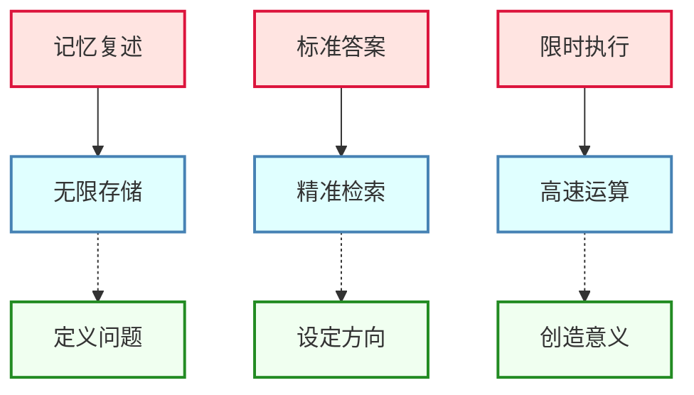

> **哲学印证 - 尼尔·波兹曼 (Neil Postman):**
>
> "我们的学校成了监狱，老师成了狱卒，学生成了囚犯。唯一的区别是，监狱里的人知道自己是囚犯，而学校里的人不知道。"
>
> ——《童年的消逝》

这段话写于1982年，但它描述的困境在今天不仅没有改善，反而因为AI的出现而变得更加荒诞。我们不仅把孩子关进了监狱，还让他们在监狱里学习如何成为更好的囚犯——学习服从、学习执行、学习不要问"为什么"。而AI时代需要的恰恰相反：它需要能问出"为什么"的人，需要能定义问题的人，需要能创造规则的人。

---

### 1.2 白领的黄昏：从精英到冗余 (Twilight of the White Collar)

#### 一个违反直觉的预言

如果你现在问普通人："AI会首先替代哪些工作？"大多数人的回答可能是：工厂流水线工人、快递员、出租车司机。

这个直觉完全错了。

**AI首先大规模替代的，不是蓝领，而是白领。** 不是那些需要"体力劳动"的工作，而是那些曾经需要"脑力劳动"的工作。

> **技术经济学印证 - 大卫·奥托尔 (David Autor):**
>
> MIT经济学家大卫·奥托尔的研究表明，技术进步对就业的影响呈现"极化"(Polarization) 模式：中等技能的常规性工作（无论是认知型还是体力型）受冲击最大，而高技能的非常规创造性工作和低技能的非常规体力工作相对安全。AI的出现正在加速这一极化进程，但其冲击的"中间地带"比以往任何技术都更加广阔。

原因很简单：目前的AI擅长处理的是**信息**，而不是**物质**。让AI在虚拟世界里处理文字、代码、图像、数据，它已经做得比大多数人类好得多了。但让它在物理世界里搬砖、焊接、组装，它还需要大量的机器人技术突破才能做到。

所以，一个坐在写字楼里用电脑工作的白领，比一个在工地上用锤子工作的工人，更容易被AI替代。

这是一个残酷的讽刺：那些曾经被认为是"高端"、"体面"、"有前途"的工作，恰恰是最脆弱的。

> **经济学印证 - 自动化的"双峰"分布:**
>
> 牛津大学经济学家卡尔·弗雷 (Carl Frey) 和迈克尔·奥斯本 (Michael Osborne) 在其2013年具有里程碑意义的论文《就业的未来》(*The Future of Employment*) 中预测，美国47%的工作在未来20年内面临高度自动化风险。他们的关键发现是：**中等技能、中等收入的工作受冲击最大**——这与传统的"机器替代蓝领"认知完全相反。AI正在验证并加速这一预测。

> **历史类比 - 彼得·德鲁克 (Peter Drucker):**
>
> "知识工作者"(Knowledge Worker) 这一概念的提出者、管理学大师彼得·德鲁克曾在20世纪预言，知识将取代资本和劳动成为最重要的生产要素。然而，他未能预见的是：当知识本身可以被机器瞬间生成和调用时，"知识工作者"这一身份将面临何种命运。

#### 中间层的大灭绝

让我们具体看看哪些白领工作正在被替代：

**数据分析师**

曾几何时，"数据分析师"是一个光环加身的职业。你需要懂统计、懂编程、懂业务，才能从一堆杂乱的数据中提取出有价值的洞察。大厂的数据分析师年薪可以轻松突破30万、50万。

现在呢？随便一个人，把Excel上传到ChatGPT，用自然语言说一句"帮我分析一下这份销售数据，找出关键趋势"，AI就能在几秒内生成完整的分析报告，包括可视化图表、趋势解读、业务建议。而且它的分析往往比初级分析师更全面、更有条理。

**而如果这个人懂得如何构建专业的AI工作流（比如一套定制化的Claude Skill），结果还能更上一层楼。** 通过预设数据分析框架、行业术语库、可视化模板，一个完全不懂统计的人可以产出媲美资深分析师水准的报告。那些曾经需要"10年行业经验"才能具备的洞察力，现在可以被编码进一套系统里，任何人都能调用。

某公司的数据团队花了两周完成的季度分析报告，被老板用AI在半小时内做出了一个差不多甚至更好的版本。那位老板只是看了我分享的一套别人的AI工作流搭建教程，按照方法配置了一个数据分析的Skill，就完成了这个"神迹"。他事后跟我说："我终于理解你说的'骑在AI背上'是什么意思了。"然后他困惑地问了一个让我印象深刻的问题："我养这个团队干什么？"

**初级程序员**

编程曾经被认为是"永远不会失业"的技能。"学会编程，走遍天下都不怕。"这是过去十年最流行的职业建议之一。

但现在，AI写代码的能力已经相当可怕了。GitHub Copilot、Cursor、Claude——这些AI编程助手不仅能根据自然语言描述生成完整的代码，还能理解上下文、修复Bug、重构代码、写测试用例。

一个有经验的程序员使用AI工具，生产力可以提升5-10倍。这意味着什么？意味着1个人可以干原来5-10个人的活。意味着行业需要的程序员数量会大幅减少。更可怕的是，AI代码的质量往往比初级程序员高。它不会犯低级错误、不会忘记边界条件、不会因为下午三点犯困而写出Bug。一个公司如果要在"花3万月薪雇一个初级程序员"和"花3000块订阅AI工具让资深程序员效率翻倍"之间选择，答案是显而易见的。

**翻译与文案**

曾经，"笔杆子"是一种珍贵的能力。能写出漂亮文案的人，在任何公司都吃得开。翻译更是一门需要多年训练的专业技能，"信达雅"三字背后是无数个小时的刻意练习。

但现在？AI翻译的质量已经超过了大多数普通译员。AI写文案的速度是每秒钟200字，而且可以根据不同的平台、不同的受众、不同的风格即时调整。

我认识一个在4A广告公司工作的文案，她告诉我："以前我们一个创意团队头脑风暴一下午，才能想出几个广告语供客户选择。现在老板直接用AI生成100个，让我们从里面挑，再稍微改改。我们的价值到底在哪里？"

#### 统计数据不会撒谎

这不是我的危言耸听，让数据说话：

**大公司的裁员潮（截至2026年1月）：**

> **数据来源说明：** 以下裁员数据综合自 Layoffs.fyi 追踪数据库、各公司官方财报与公开声明、彭博社 (Bloomberg)、路透社 (Reuters) 及主要财经媒体的报道。

- **2025年**，全球科技公司裁员约**24.5万人**，其中70%来自美国公司。AI被直接列为约**5.5万人**裁员的原因。

| 公司                 | 裁员规模                 | AI相关原因                                                           |
| -------------------- | ------------------------ | -------------------------------------------------------------------- |
| **Amazon**     | 高达30,000人             | 重点裁撤"可自动化"岗位（HR、行政）                                   |
| **Microsoft**  | 6,000+人（约3%员工）     | 为加速AI投资优化资源，计划2025财年投入$800亿于AI                     |
| **Meta**       | 1,000+人                 | Reality Labs裁员，资金转向AI可穿戴设备开发                           |
| **Google**     | 数百人                   | 裁撤设计和云团队，资源转向AI产品（Gemini等）                         |
| **Intel**      | 约50,000人（15-20%员工） | 激进成本削减，重新对齐AI和半导体市场竞争力                           |
| **Cisco**      | 6,000+人（7%员工）       | 将数亿美元转向AI和网络安全投资                                       |
| **Salesforce** | 4,000名客服              | AI处理50%客户对话；2025年停招软件工程师                              |
| **IBM**        | 8,000个HR岗位            | AskHR平台自动化94%的HR任务，节省35亿美元                             |
| **Dell**       | 12,500人（10%员工）      | 战略转型，建立AI专项销售团队                                         |
| **Accenture**  | 11,000+人                | AI技能重塑计划，无法适应者被淘汰                                     |
| **HP**         | 4,000-6,000人            | "AI转型推动"，用AI替代产品开发和客服                                 |
| **Dropbox**    | 528人（20%员工）         | 裁员省钱招AI工程师，CEO直言"让数学行得通"                            |
| **Spotify**    | 1,500人（17%员工）       | 成本优化，AI深度整合内容推荐                                         |
| **Klarna**     | 等效700人工作量被AI替代  | 但因质量问题2025年**重新招聘人类客服**——首个大规模"回滚"案例 |

**2025-2026年最新研究报告：**

> **研究来源：** 以下数据引自各机构官方发布的研究报告，具体报告名称标注于各条目后。

- **麦肯锡（2025年11月报告）**：以现有技术，美国**57%的工时可被自动化**（2023年的预测仅为30%）。**40%的美国工作**属于"高度可自动化"类别。（出自 *McKinsey Global Institute: "A new future of work: The race to deploy AI and raise skills in Europe and beyond"*）
- **世界经济论坛（2026年1月报告）**：到2030年，全球将有**9,200万工作岗位被替代**。同时预计创造1.7亿新岗位，净增长约7,800万——但转型阵痛巨大。（出自 *World Economic Forum: "Future of Jobs Report 2025"*）
- **高盛**：AI可能影响或完全替代**全球3亿个全职工作岗位**。自2025年初以来，20-30岁年轻人在技术相关岗位的失业率已上升近**3个百分点**。（出自 *Goldman Sachs: "The Potentially Large Effects of Artificial Intelligence on Economic Growth"*）
- **IMF（国际货币基金组织）**：全球近**40%的工作**正在受到AI驱动的变革影响。（出自 *IMF Staff Discussion Note: "Gen-AI: Artificial Intelligence and the Future of Work"*）

**但这里有一个更令人细思极恐的事实：**

上面这些数据聚焦的都是什么？科技公司、金融巨头、咨询机构——这些是行业龙头，是"最难"的工作。媒体喜欢报道这些，因为它们有话题性："连Google都裁员了！连顶级程序员都不安全了！"

但问题是：**大部分人的工作，根本没有那么难。**

让我们诚实地审视一下：

- 一个普通公司的"行政助理"每天在做什么？整理文档、安排会议、回复邮件、填写表格——**这些AI已经可以做得更好**
- 一个普通公司的"市场专员"每天在做什么？写公众号文章、做PPT、整理数据报表——**这些AI早就能做了**
- 一个普通公司的"HR助理"每天在做什么？筛选简历、安排面试、发offer——**AI可以24小时不停地做**
- 一个普通公司的"财务出纳"每天在做什么？对账、开发票、做报销——**自动化软件+AI已经可以完全替代**

| 工作复杂度 | 示例岗位                     | AI替代难度             | 残酷现实               |
| ---------- | ---------------------------- | ---------------------- | ---------------------- |
| 高复杂度   | 顶尖算法工程师、首席科学家   | 目前较难               | 媒体最关注，但人数最少 |
| 中复杂度   | 中级程序员、分析师、项目经理 | 正在进行               | 1人干5人的活已成现实   |
| 低复杂度   | 行政、出纳、客服、文员       | **几乎已被替代** | 人数最多，却最少被讨论 |

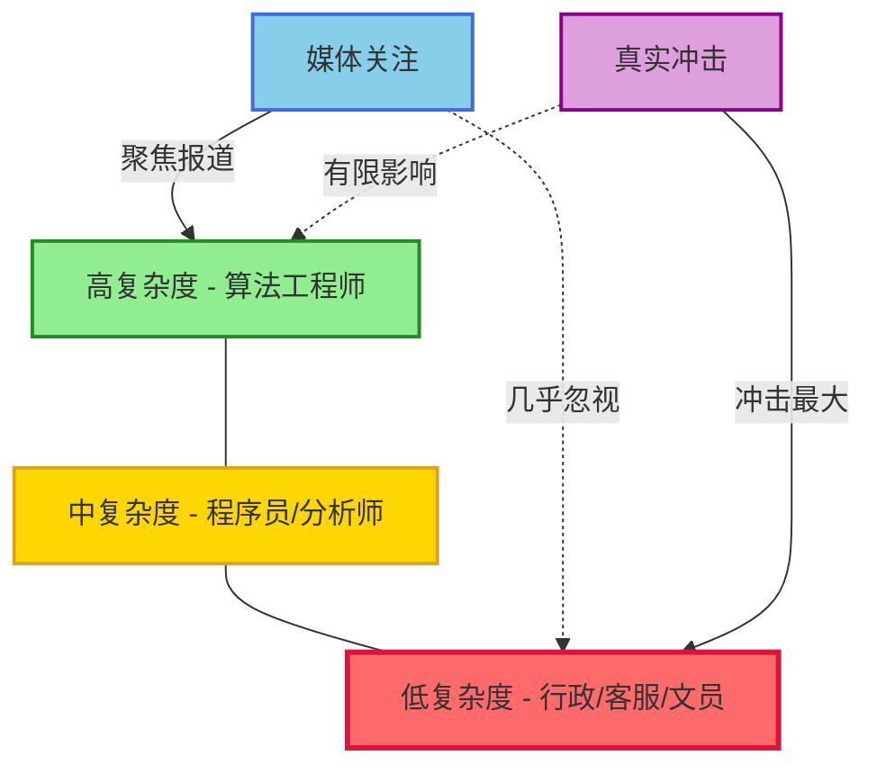

**媒体不报道"低复杂度"岗位的消失，是因为这些人没有话语权。** 但他们才是人数最多的群体。当一家公司发现可以用AI替代10个行政人员、只需要保留1个人来监督时，那9个人不会成为新闻头条——他们只会默默失业，然后被告知"怎么不学点新技能呢"。

这才是真正恐怖的地方：**AI不需要做那些"最难"的工作，只需要做"大多数人正在做"的工作。** 而那些工作，从来都没有那么难。

这不再是"35岁危机"——那个曾经让无数中年人焦虑的话题。这是**"22岁危机"**——你刚刚毕业，你辛辛苦苦学了四年的专业，可能已经不再需要那么多人了。

> **劳动经济学印证 - 大卫·奥特 (David Autor):**
>
> MIT经济学家大卫·奥特在其关于"任务极化" (Job Polarization) 的研究中指出，技术进步最先淘汰的不是最高端或最低端的工作，而是**中间技能层的常规性任务**——正是大多数大学毕业生从事的工作类型。AI加速了这一趋势，使得"刚毕业即失业"从个案变成结构性现象。

#### 更深层的恐惧

但裁员只是表象。表象之下，有几层递进的恐惧，每一层都比上一层更让人脊背发凉。

**第一层恐惧：不确定性本身**

你不知道自己的工作什么时候会被替代。

传统的技术革命是渐进的。汽车替代马车花了几十年，电脑替代打字机花了几十年。你有时间观察、学习、转型。你可以看到变化在发生，你可以规划你的应对。

> **技术加速定律 - 雷·库兹韦尔 (Ray Kurzweil):**
>
> 未来学家库兹韦尔在《奇点临近》(*The Singularity Is Near*, 2005) 中提出"加速回报定律"(Law of Accelerating Returns)：技术进步的速度本身也在加速。他计算出，21世纪100年的进步将相当于20世纪进步的约20,000倍。AI领域的发展正在验证这一预测——GPT-3到GPT-4的能力跃升仅用了约一年时间。

但AI的革命是**指数级**的。一年前还做不到的事情，今年突然就做到了。一个月前还需要专业人员的工作，这个月突然就可以用AI完成了。更恐怖的是——**你无法预测下一个被突破的领域是什么**。

这种不确定性本身就是一种心理酷刑。你每天醒来，都不知道今天是否会有一个新的AI模型发布，让你多年积累的技能瞬间贬值。你不敢投资于任何新技能，因为你不知道这个技能在学完之前是否就已经过时了。

**第二层恐惧："安全地带"不断收缩**

我有一个做法律文书的朋友，他去年还在得意自己的工作"非常安全，因为需要专业知识和判断"。今年，他发现AI已经可以在几分钟内生成他需要花几天才能完成的合同草案，而且质量相当不错。

他开始焦虑："如果连我这种'专业工作'都能被替代，还有什么是安全的？"

这不是个例。让我们看看过去两年发生了什么：

| 时间节点 | "安全神话"被打破                                                      |
| -------- | --------------------------------------------------------------------- |
| 2023年初 | "写代码需要逻辑思维，AI肯定做不好" → GPT-4通过技术面试               |
| 2023年中 | "创意写作需要人类灵魂" → AI生成的小说开始获奖                        |
| 2024年初 | "医学诊断需要经验和直觉" → AI诊断准确率超过平均医生                  |
| 2024年中 | "科研需要创造性突破" → AI发现新材料、新药物分子                      |
| 2025年   | "复杂推理和多步规划人类更强" → AI 编码以及指令尊循能力得到了大幅提升 |

每一次，人们都会说"好吧，这个被攻破了，但下面这个领域肯定是安全的"。然后下一个领域也被攻破了。**"安全地带"正在以肉眼可见的速度收缩**，而且收缩的速度越来越快。

你现在认为"绝对安全"的工作，可能只是因为还没有足够多的人关注那个方向。一旦有团队决定攻克它，突破可能只需要几个月。

**第三层恐惧：能力与价值的脱钩**

这一层恐惧更加隐蔽，但也更加致命：**即使你的工作没有被完全替代，你的"价值"也在急剧缩水。**

想象一下这个场景：你是一个中级数据分析师，月薪2万。你的工作是从数据中提取洞察，写报告给管理层。你很擅长这个，做了五年，积累了大量经验。

现在，一个刚毕业的年轻人，使用AI工具，可以在一天内完成你需要一周才能完成的分析。他的产出质量可能只有你的80%——但他的成本只有你的三分之一。

对于公司来说，用3个"AI增强型新人"替代1个"资深专家"，是一笔划算的买卖。你没有被"替代"，你只是变得"不划算"了。

> **管理学印证 - 克莱顿·克里斯坦森 (Clayton Christensen):**
>
> 哈佛商学院教授克里斯坦森在《创新者的窘境》(*The Innovator's Dilemma*, 1997) 中揭示了"颠覆性创新"的规律：新技术往往先从"够用就好"的低端市场切入，逐步向上侵蚀高端市场。AI正在复制这一路径——它先是"80%够用"，然后是"90%够用"，最终……**你那额外的10%专业度，不值得为它支付3倍的薪资。**

**第四层恐惧：身份的瓦解**

这是最深的一层，也是最少被讨论的一层。

我们大多数人的身份认同，是和我们的工作紧密绑定的。"我是一个程序员"，"我是一个设计师"，"我是一个律师"——这不仅仅是职业描述，这是我们回答"我是谁"的方式。

> **心理学印证 - 埃里克·埃里克森 (Erik Erikson):**
>
> 发展心理学家埃里克森在其"心理社会发展理论"中指出，"职业身份"是成年早期核心发展任务的关键组成部分。当一个人无法通过工作建立稳定的自我认同时，可能会陷入"角色混乱"(Role Confusion) 或"身份危机"(Identity Crisis)——而这正是AI时代许多人正在经历的心理状态。

当你的工作可以被AI在几分钟内完成时，这个身份还剩下什么？

这不是一个理论问题。我见过优秀的程序员，在看到AI写代码的能力后，陷入了真正的存在主义危机。"如果我二十年积累的技能可以被一段代码复制，那我这二十年的生命意义是什么？"

这种恐惧不是关于失业的，不是关于收入的——它是关于**意义**的。它触及了人作为人的核心：**如果机器可以做我能做的一切，那"我"存在的独特价值是什么？**

> **存在主义视角 - 让-保罗·萨特 (Jean-Paul Sartre):**
>
> 萨特在《存在主义是一种人道主义》(1946) 中宣称："存在先于本质"——人首先存在，然后通过选择和行动来定义自己。如果这一哲学成立，那么AI的挑战恰恰也是一个解放：当外部标签（职业、技能、学历）失效时，我们被迫回到萨特的原点——**你是谁，取决于你选择成为谁**。

```mermaid
graph TD
    SURFACE[表层焦虑 - 会失业吗]
    L1[第一层 - 不确定性]
    L2[第二层 - 安全地带收缩]
    L3[第三层 - 能力与价值脱钩]
    L4[第四层 - 身份的瓦解]
    L5[第五层 - 社会结构崩塌]
    DEEP[深层危机 - 存在的意义]

    SURFACE -.->|触发| L1
    L1 --> L2
    L2 --> L3
    L3 --> L4
    L4 --> L5
    L5 -.->|指向| DEEP

    style L1 fill:#FFEFD5,stroke:#DEB887,stroke-width:2px
    style L2 fill:#FFE4B5,stroke:#D2691E,stroke-width:2px
    style L3 fill:#FFDAB9,stroke:#CD853F,stroke-width:2px
    style L4 fill:#FFA07A,stroke:#FF6347,stroke-width:2px
    style L5 fill:#FF6B6B,stroke:#DC143C,stroke-width:3px
    style SURFACE fill:#E6E6FA,stroke:#9370DB,stroke-width:2px
    style DEEP fill:#2F4F4F,stroke:#000,stroke-width:2px
```

**第五层恐惧：社会结构的崩塌预兆**

让我们把视角再拉远一点。

现代社会的稳定建立在一个隐性的社会契约之上：你努力学习技能，贡献给社会，社会给你回报（收入、地位、尊重）。这个契约维系了整套系统——教育系统、就业市场、社会保障、阶层流动……

> **政治哲学视角 - 约翰·罗尔斯 (John Rawls):**
>
> 罗尔斯在《正义论》(*A Theory of Justice*, 1971) 中论证，一个公正的社会应该让每个人都有机会通过自身努力改善处境。这一"机会平等"原则是现代社会契约的基石。但当AI使"努力"与"成果"之间的因果关系断裂时，这一契约的正当性将受到根本性的质疑。

但如果"技能"不再稀缺呢？如果任何人都可以通过AI获得几乎任何技能的输出呢？

这个社会契约就会瓦解。而一旦社会契约瓦解：

- 教育系统失去意义（为什么要花12年学习可以用AI获得的技能？）
- 就业市场萎缩（需要的人类劳动力大幅减少）
- 中产阶级消失（技能无法兑换价值）
- 社会流动停滞（没有"爬升阶梯"可以攀爬）

我不是在描述一个遥远的反乌托邦。我是在描述一个已经开始发生的过程。

---

答案是：**可能没有什么是绝对安全的。** 至少，没有什么"技能"是绝对安全的。

但这不意味着我们就注定被淘汰。恰恰相反——**正是因为"技能"失效了，我们才必须找到比"技能"更深一层的东西**。它意味着我们需要重新思考什么是真正有价值的——这正是本书后面要探讨的核心问题。

> **历史印证 - 卢德运动 (Luddite Movement):**
>
> 19世纪初，英国的纺织工人因为害怕机器替代他们的工作，组织起来砸毁纺织机。他们被称为"卢德分子"，成为了"反对技术进步"的代名词。
>
> 但历史的讽刺在于：那些砸毁机器的工人，最终并没有阻挡住工业革命的浪潮。那些拥抱机器的工人，成为了机器的操作者，获得了比手工纺织更高的收入。
>
> 今天，我们面对的是类似的抉择。砸毁AI是不可能的，也是愚蠢的。唯一的出路是**理解它、驾驭它、与它共生**。

---

### 1.3 智力的恶性通胀 (Hyperinflation of Intelligence)

#### 一个关于过时货币的故事

1923年的德国，发生了人类历史上最著名的恶性通货膨胀之一。

> **历史背景：** 魏玛共和国的恶性通胀被经济史学家亚当·弗格森 (Adam Fergusson) 在其著作《当货币死亡》(*When Money Dies*, 1975) 中详细记录，至今仍是研究货币政策失败的经典案例。

当时，一条面包的价格从1马克涨到2000亿马克。有人用独轮车装着钞票去买面包——不是因为面包太贵需要很多钱，而是因为钞票本身已经太不值钱，需要用独轮车才装得下。

工人们领到工资后会立刻冲向商店，因为如果稍微耽搁几个小时，工资可能就贬值一半。最疯狂的时候，物价每隔几个小时就翻一倍。

马克没有变少。事实上，政府印刷了更多的马克。但正是因为印得太多，它变得一文不值。

今天，**智力正在经历类似的恶性通胀**。

> **经济学印证 - 边际效用递减定律:**
>
> 经济学中的边际效用递减定律指出，当某种资源变得丰富时，其单位价值会下降。奥地利经济学家卡尔·门格尔 (Carl Menger) 在《国民经济学原理》(1871) 中首次系统阐述了这一原理。水在沙漠中价值连城，在河边一文不值——不是水变了，而是稀缺性变了。**智力正在经历同样的命运**：当AI让"聪明"变得唾手可得时，它的边际价值正在趋近于零。

#### 当"聪明"变成自来水

过去，"聪明"是很值钱的。

如果你懂逻辑，你可以做律师、做咨询顾问、做战略分析师。如果你懂算法，你可以去硅谷拿几十万美金的年薪。如果你懂修辞，你可以成为畅销书作家、广告创意总监。

"知识分子"是一个有光环的身份。"学富五车"是一种被羡慕的资本。

但现在？

- 想要逻辑推理能力？GPT可以进行复杂的逻辑推理，通过律师资格考试、医学执照考试、MBA入学考试。租用它的成本？一个月20美金。
- 想要编程能力？让claude帮你写代码，从简单的脚本到复杂的系统，它都能做。成本？同样是一个月20美金。
- 想要创意和艺术感？Lovart 调用 Nano banana pro可以在一分钟内生成四张不同风格的精美图像，。
- 想要写作能力？本地部署个模型都可以帮你写文章、写报告、写小说、写诗。它可以模仿任何风格，根据任何要求即时调整。成本？几乎可以忽略不计。

**当智力像自来水一样便宜时，单纯的"聪明"一文不值。**

这就像1923年的德国马克一样：不是智力本身变少了，而是它变得**太容易获取**了。当每个人都可以用几乎为零的成本获得"智力服务"时，拥有智力本身就不再是一种优势。

#### 社会契约的崩塌

这带来了一个更深层的问题：**整个社会的隐性契约正在崩塌。**

什么是这个隐性契约？几十年来，我们的社会运行在一个基本假设之上：**如果你足够聪明、足够努力、掌握了足够的知识和技能，你就能过上体面的生活。**

这个契约支撑了整个教育系统、职业体系、社会阶层。父母告诉孩子"好好读书"，因为他们相信知识可以换来体面的生活。年轻人愿意花四年时间读大学、再花几年考研考博，因为他们相信学历可以换来好工作。公司愿意花高薪聘请"人才"，因为他们相信这些人的"脑力"可以创造价值。

但如果AI可以提供几乎免费的"脑力"，这个契约还成立吗？

如果一个公司可以用每月几百元的AI订阅费，获得相当于一个初级分析师、初级程序员、初级文案的工作产出，它还需要花几万块月薪去雇佣这些人吗？

如果一个律师事务所可以用AI在几分钟内完成法律文书的初稿，它还需要那么多初级律师吗？

**答案是不需要。**

这就是为什么我说"社会契约已经变了"：**仅仅靠出卖智力（Cognition）就能过上体面生活的时代，彻底结束了。**

#### 那什么还有价值？

如果"聪明"不再稀缺，什么是稀缺的？

让我用一个比喻来说明：

想象一下，在照相机发明之前，"能画出真实人像"是一项非常稀缺、非常值钱的能力。肖像画家是贵族才能请得起的人。但照相机发明之后，任何人按一下快门就能获得比画家更"真实"的图像。画家失业了吗？

确实，那些仅仅会"画得像"的画家失业了。但那些能表达情感、传递思想、创造独特视觉语言的艺术家，反而变得更加珍贵。梵高、毕加索、达利——他们的画作完全不"像"真实世界，但它们表达了照相机永远无法表达的东西。

**照相机替代了画家的"技术"，但替代不了画家的"意义"。**

> **艺术史印证 - 本雅明的"灵韵" (Aura):**
>
> 德国哲学家瓦尔特·本雅明 (Walter Benjamin) 在《机械复制时代的艺术作品》(1936) 中提出了著名的"灵韵"(Aura) 概念：艺术品的独特价值来自于其"此时此地"的存在、它的历史和情境。机械复制技术（如摄影、印刷）能够完美复制艺术品的形式，却无法复制其"灵韵"。在AI时代，这一洞见获得了新的意义：**AI可以复制智力的输出，却无法复制智力背后的"灵韵"——那些只有人类才能赋予的意图、情感和意义。**

今天，AI正在替代我们的"智力"——那部分可以被算法化、可以被复制、可以用数据训练的能力。但它替代不了我们的"意义"——那个只有你知道为什么要做、只有你知道对谁重要、只有你能赋予灵魂的东西。

**这就是从"卖智力"到"卖意义"的转变。** 这也是本书的核心主题之一，我会在后续章节详细展开。

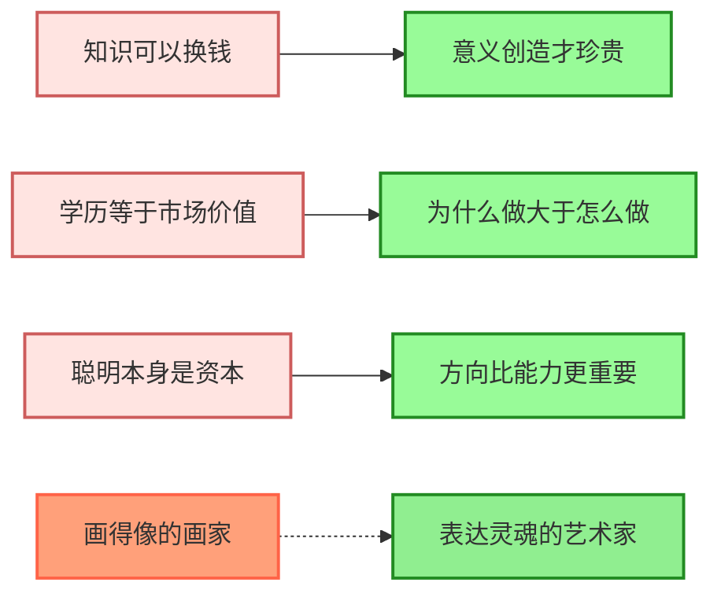

> **哲学印证 - 汉娜·阿伦特 (Hannah Arendt):**
>
> "劳动 (Labor) 是为了生存，工作 (Work) 是为了创造，行动 (Action) 是为了意义。"
>
> ——《人的境况》

阿伦特在1958年的这本著作中，区分了人类活动的三个层次。让我详细解释一下这个框架，以及它为什么对理解AI时代至关重要：

**劳动 (Labor)：维持生存的重复性活动**

劳动是那些必须不断重复、没有持久产物的活动。做饭、清洁、维护——这些事情做完了还要再做，永无止境。劳动的目的是维持生命的延续，它的特点是**可替代性强**。任何人做饭，最终结果都是食物被消化；任何人清洁，最终结果都是又变脏。

AI对劳动的接管是最彻底的。自动化洗碗机、扫地机器人、智能家居——这些都是在替代劳动。在职业领域，数据录入、表格填写、基础客服——这些"认知劳动"同样正在被AI接管。

**工作 (Work)：创造持久产物的活动**

工作与劳动不同，它创造出能够持续存在的东西。一个工匠制作一把椅子，这把椅子可以存在几十年、几百年。一个程序员写一个软件，这个软件可以被无数人使用。工作的产物具有**独立于创造者的持久性**。

AI正在部分接管工作。它可以写代码、画图、作曲、写文章——这些都是"创造持久产物"。但这里有一个关键的区别：AI创造的产物，背后没有**意图**。它可以根据指令生成一把椅子的设计图，但它不知道为什么需要这把椅子、这把椅子要放在什么环境里、它要传达什么美学理念。

**行动 (Action)：在人与人之间发生的意义创造**

行动是最高层次的人类活动。它发生在人与人之间，关乎**开创新事物**、**影响他人**、**赋予意义**。政治家发表演讲、领导者设定愿景、艺术家表达灵魂的冲动——这些都是行动。

行动的独特之处在于它**不可预测**、**不可复制**、**不可替代**。一个领导者的愿景来自于他独特的生命经历、价值观、对世界的理解。这不是可以用数据训练出来的东西。

| 层次           | 目的     | AI能否替代                     | 职业示例                           |
| -------------- | -------- | ------------------------------ | ---------------------------------- |
| **劳动** | 维持生存 | **几乎完全可以**         | 数据录入、基础客服、常规维护       |
| **工作** | 创造产物 | **部分可以**（执行层面） | 编程、设计、写作、分析             |
| **行动** | 创造意义 | **目前无法**             | 领导、愿景设定、价值判断、灵魂表达 |

**这意味着什么？**

如果你的工作只停留在"劳动"层面，你正在被替代。
如果你的工作停留在"工作"的执行层面，你正在被压缩。
**只有当你进入"行动"层面——创造意义、设定方向、影响他人——你才拥有AI无法触及的价值。**

阿伦特在70年前就看到了这个层次结构。她不可能预见AI，但她精准地定义了什么是"真正人类的"活动。今天，她的框架成为了理解AI时代生存之道的一把钥匙。

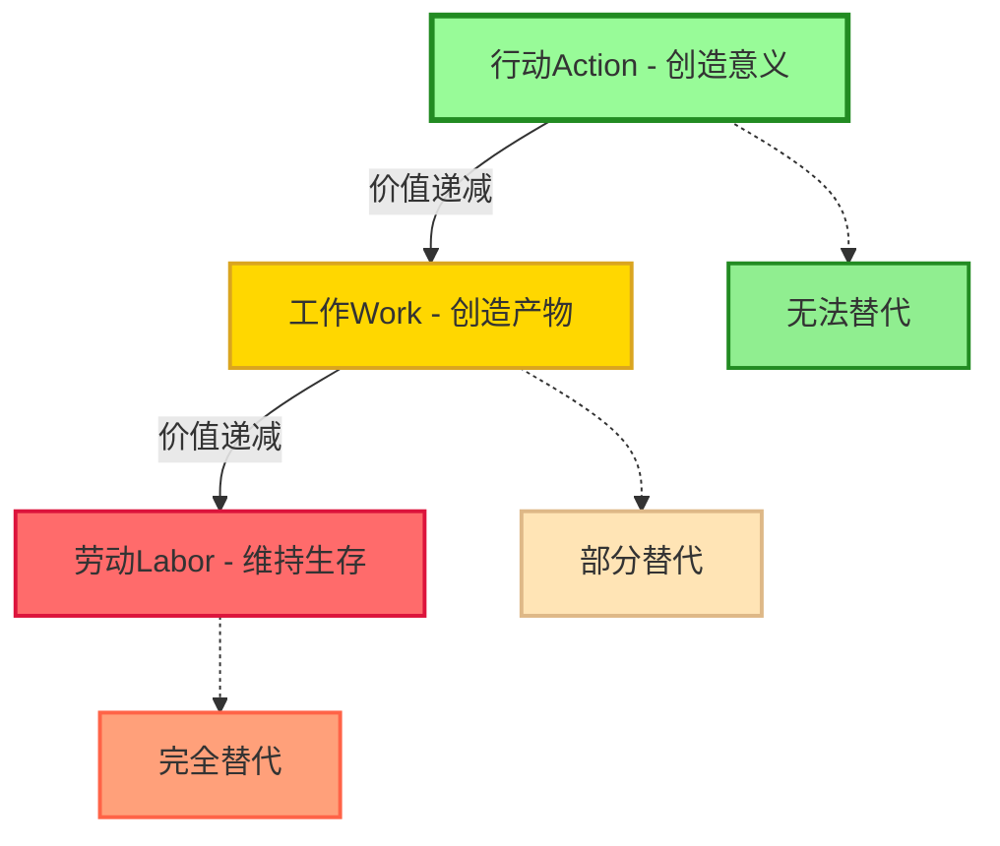

---

#### 谁正在被替代？具体而微观的图景

让我们把视角拉回到具体的人群。"被替代"这件事，对不同的人意味着完全不同的处境：

**科技前沿的人。** 如果你是一个开发者，持续关注GitHub和推特上的技术动态，你会明显感受到一种被极速放大的焦虑。2025年，GitHub上已经有超过**1.8亿开发者**在分享代码（数据来源：GitHub 官方 Octoverse 年度报告）。几乎每天，都会有人把极其强大的工具开源出来——可能是一个能自动生成完整网站的框架，可能是一个让AI能够自主执行任务的Agent系统。这些工具往往一出来就能直接碾压几个月前的"最佳实践"。那些闭门造车的开发者和公司，会在毫无预警的情况下发现：自己花了几个月开发的功能，别人已经免费开源了，而且做得更好。

**创业者的噩梦：被平台吞噬，被用户不需要。** 2024年AI和科技创业公司的失败率达到了惊人的**92%**——远高于传统科技创业公司（数据综合自 CB Insights、Crunchbase 及 Startup Genome 的创业失败率研究报告）。这个数字背后有一个残酷的逻辑：

很多创业公司开发了一款产品，开始赚钱了。然后呢？过不了多久，那些做大模型的公司——OpenAI、Anthropic、Google——会通过升级自己的模型，把这些功能**直接内置进去**。

你开发了一个让AI能够联网搜索的插件？ChatGPT更新后自带了这个功能。你做了一个让AI能够分析PDF的工具？Claude更新后也能做了。你花了六个月调试出一套完美的提示词？模型升级后提示词全部失效，需要从头来过。

更致命的是，连**"产品"这个概念本身都在动摇**。很多创业者试图开发一个APP来解决某个痛点，但用户逐渐发现：其实我不需要那个APP。我只需要让AI帮我写一段脚本，或者直接用Markdown和HTML这样的原生格式，就能达到比你的商业软件更轻量、更灵活、更可控的效果。**当用户开始具备自己"生成"工具的能力时，那些仅仅是"功能封装"的中间商，价值就会归零。**

**小公司根本无法与平台竞争。** 当你的整个商业模式建立在别人的API之上，你就把自己的命运交到了别人手里。平台可以在任何时候决定：要么收购你，要么碾压你。

**普通白领。** 这里我想说一句可能会让你不舒服的话：

> **当老板学会使用AI的那一天，就是你失去工作的那一天。**

这不是危言耸听。并不是AI出现时工作才会消失，而是当**决策者**掌握了AI，原本依赖人力的结构就会被迅速替换。你的老板可能还没让你用AI，他自己可能也还不会用。但一旦他学会了——哪怕只是学会用AI帮他写邮件、整理报告、做初步的决策分析——他就会开始问自己：**我为什么要付钱给一个人来做AI可以做的事情？**

前面我们提到过那些数据：AI已经在处理50%的客户对话，已经在自动化94%的HR任务，已经让一家公司用一个AI替代了700个全职员工。问题不是"会不会发生"，而是"什么时候轮到你"。

> **组织行为学印证 - 埃德加·沙因 (Edgar Schein):**
>
> MIT斯隆商学院教授沙因在其"职业锚"(Career Anchors) 理论中指出，人们往往将自我价值感锚定在特定的能力和角色上。当AI打破这种锚定时，个体会经历深层的"职业身份丧失"——这不仅是经济问题，更是心理和存在层面的危机。

**服务行业的人。** 你可能觉得自己暂时是安全的——毕竟AI还没有手脚。但事情正在改变。

在日本，有一家咖啡店的初衷是帮助长期瘫痪、卧床的病人重新与世界产生连接。咖啡店里的服务人员全部是**机器人**，而这些机器人并不是"自主"的——它们背后连接的是躺在病房里的真实的人。即便没有手脚，或四肢无法行动，他们依然可以通过远程操控机器人完成服务，与外界互动。

这个故事本身是温暖的。**但它也揭示了一个残酷的未来。**

这家咖啡店可能会继续存在——因为它承载着一种**社会道德意义**。顾客知道他们面对的机器人背后是一个真实的、需要被连接的人。这种"知道是谁"的意义感，让这个模式具有不可替代的价值。

但问题在于：**你去应聘服务员的工作，有这种意义吗？**

当AI可以接管机器人的操控权，服务行为本身就不再需要人类参与。那些纯粹为了"完成服务"而存在的岗位，将迅速失去存在的理由。**那家日本咖啡店能存活，恰恰是因为它不是关于"服务"本身，而是关于"人与人的连接"。** 普通服务业岗位没有这层意义保护。

更重要的是，当白领大规模失业时，他们中的一部分人会"降维"进入服务业，和你竞争同一个岗位。到时候，不是AI直接替代你，而是**被AI替代的人抢走了你的工作**。

**学生和刚毕业的人。** 这可能是最迷茫的群体。

专业的意义正在迅速坍塌，所学内容与未来现实之间的对应关系越来越模糊。很多人甚至无法回答一个最基本的问题：**自己正在学的专业，未来到底还能对应什么样的价值？**

你被教导的"努力学习、考好学校、找好工作"的人生路径，可能在你走到一半时就断掉了。

---

这就是当下的现实：**结构正在整体失效，而个体却被迫在旧规则中寻找答案。**

这种断裂感，正是当下迷茫与焦虑的真正来源。

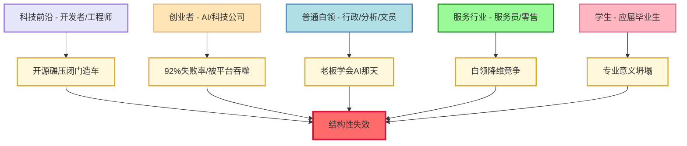

---

### 1.4 唯一的出路：从"器"到"道" (The Only Way Out: From Skill to Wisdom)

#### 一个古老的智慧

两千多年前，中国的哲学家们就区分了"道"和"器"。

> **经典出处：** 《易经·系辞上》曰："形而上者谓之道，形而下者谓之器。" 这一哲学区分奠定了中国传统思想中"本体论"与"工具论"分野的基础。

**"器"是具体的技能、工具、方法。** 一把锤子是器，一种编程语言是器，一套做PPT的技巧也是器。器是"怎么做"。

**"道"是背后的原理、方向、意义。** 为什么要用这把锤子？为什么要写这段代码？为什么要做这个PPT？为了解决什么问题？为了实现什么目标？道是"为什么做"。

庄子说过一个著名的故事：庖丁解牛。一个叫庖丁的厨师宰牛，刀法出神入化，十九年不换刀。为什么？因为他已经超越了"技术"的层面，进入了"道"的层面。他说："臣之所好者道也，进乎技矣。"（我追求的是道，超越了技术。）

> **原典引用：** 《庄子·养生主》完整记载了这段对话。文惠君问庖丁为何技艺如此精湛，庖丁答曰："始臣之解牛之时，所见无非牛者。三年之后，未尝见全牛也。方今之时，臣以神遇而不以目视，官知止而神欲行。" 这段话揭示了从"技"到"道"的认知跃迁过程。

这个古老的智慧，在AI时代变得前所未有地重要。

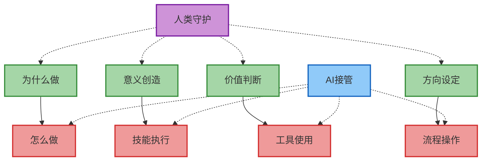

#### AI占领了"器"的层面

如果我们诚实地审视AI的能力，会发现一个令人不安的事实：**AI在几乎所有"器"的层面都在快速逼近甚至超越人类。**

- 写文章？AI可以模仿任何风格，生成符合任何要求的文本。
- 写代码？AI可以根据自然语言描述生成功能完整的程序。
- 做设计？AI可以生成各种风格的图像、Logo、UI界面。
- 做分析？AI可以从海量数据中提取模式，给出洞察。
- 做翻译？AI可以在几十种语言之间即时转换。
- 做客服？AI可以回答大多数常见问题，比人类客服更有耐心。

这个清单可以一直列下去。每隔几个月，AI就会攻克一个新的"器"的领域。

那人类还剩下什么？

#### 我们还剩下"道"

**"道"是AI目前无法触及的领域。**

AI可以写出一篇完美的文章，但它不知道**为什么要写这篇文章**。是为了表达愤怒？是为了传递希望？是为了纪念一个逝去的朋友？是为了改变一个不公正的政策？这些"为什么"只有人类知道。

AI可以画出一幅美丽的图画，但它不知道**这幅画想表达什么**。那个孤独的身影代表什么？那片燃烧的天空象征什么？那个隐藏在角落的细节有什么含义？这些"意义"只有人类能赋予。

AI可以分析数据给出建议，但它不知道**我们真正想要什么样的未来**。增长率更高就一定更好吗？效率提升了但幸福感下降了，值得吗？利润最大化和社会责任之间如何权衡？这些"价值判断"只有人类能做出。

换句话说：**AI占领了"怎么做"，但"为什么做"仍然属于人类。**

#### 元认知与意志

用更现代的语言来表达，"道"可以翻译成两个概念：**元认知（Metacognition）** 和 **意志（Will）**。

**元认知** 是"思考自己的思考"的能力。它让你能够跳出当前的任务，问自己："我为什么在做这件事？这件事真的重要吗？有没有更好的方式？我的目标是什么？"AI可以执行任务，但它不会问自己为什么要执行这个任务。

> **学术来源：** "元认知"(Metacognition)一词由美国发展心理学家约翰·弗拉维尔 (John Flavell) 于1976年首次系统提出，定义为"关于认知的认知"或"对自己认知过程的知识与调控"。

**意志** 是"决定要什么"的能力。它让你能够在无数可能性中选择一条路，说："这是我想要的。这是我愿意为之付出的。这是我认为有意义的。"AI可以提供选项、分析利弊，但最终"选择什么"的决定权在人类手中。

元认知和意志加在一起，就是"道"的现代表达。它们是人类最后的、也是最重要的护城河。

> **哲学印证 - 康德的"纯粹理性批判":**
>
> 德国哲学家伊曼努尔·康德 (Immanuel Kant) 区分了"知性"(Verstand) 和"理性"(Vernunft)。知性处理经验世界的规则，可以被形式化和计算；而理性则追问"应该"和"目的"，涉及价值和意义。AI可以模拟知性的运作，但理性——那个追问"为什么"的能力——仍然是人类的领域。康德的区分在两百多年后的AI时代，获得了全新的现实意义。

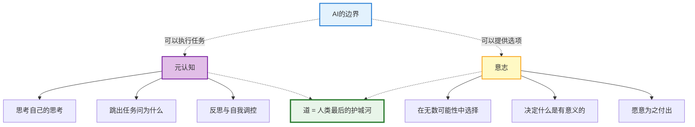

#### 蜕升的本质

现在我们可以更清楚地定义**"蜕升"**是什么了：

**蜕升，不是让你跟AI比算力。** 那是一场你注定会输的比赛。你的大脑有1000亿个神经元，但一个数据中心有万亿级别的晶体管，而且还在指数增长。比计算、比记忆、比速度，人类永远不可能赢。

**蜕升，是让你骑在AI背上，去只有人类意志才能到达的地方。**

想象你骑着一匹无限强大的马。马可以跑得比任何人都快，跳得比任何人都高，力量比任何人都大。但马不知道要去哪里。告诉马去哪里，是骑手的工作。

AI就是那匹马。它的能力在快速增长，很快就会在几乎所有"执行"的层面超越人类。但它不知道要去哪里。**定义"去哪里"，是人类的工作——是你的工作。**

蜕升者不是被AI替代的人，而是**驾驭AI的人**。他们不再用自己的双腿赛跑，而是骑上了AI这匹永动机。他们的价值不在于"能跑多快"，而在于"知道该往哪跑"。

> **人机协作研究 - 加里·克莱因 (Gary Klein):**
>
> 认知心理学家加里·克莱因在《直觉的力量》(*Sources of Power*, 1998) 中研究了专家如何在复杂环境中做出决策。他发现，真正的专业能力不在于信息处理速度（AI可以远超人类），而在于**模式识别和情境判断**——知道在特定情境下什么是重要的、什么是噪音。这正是"骑手"需要的能力：不是跑得快，而是知道往哪跑。

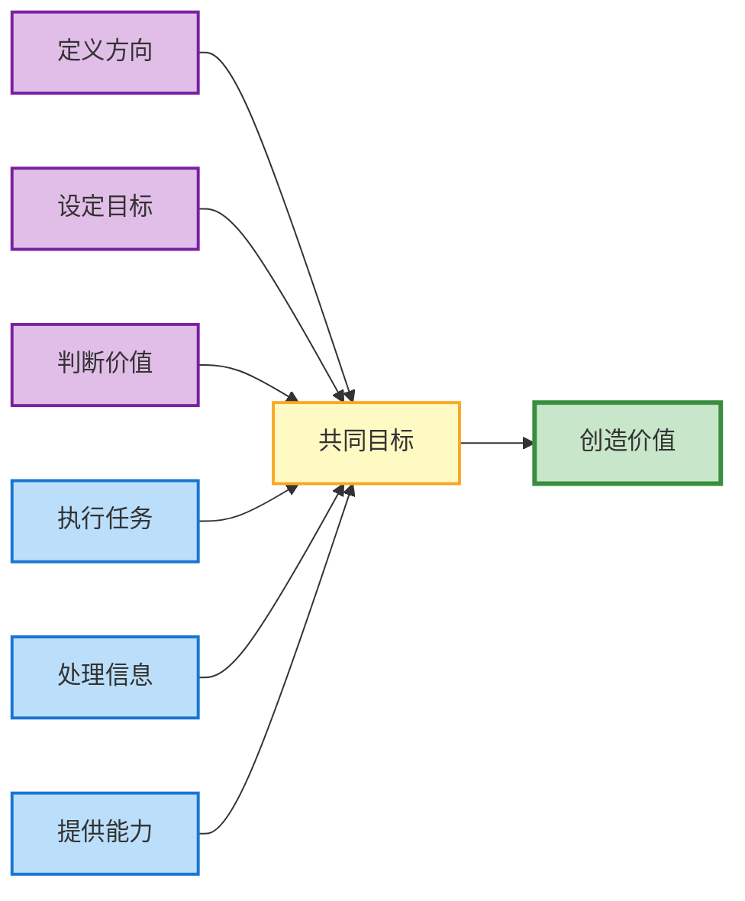

#### 一个严肃的警告，不得不参与的长跑

最后，我必须发出一个严肃的警告：

**如果你不进行这次认知升维，你将不仅仅是"被替代"——你将被"像尘埃一样擦除"。**

"被替代"意味着有另一个人或物取代了你的位置，但你作为一个独立个体仍然存在，只是需要找一个新的位置。

"被擦除"意味着更彻底的东西：**你变得完全不相关**。不是有人在反对你，而是没有人在意你。不是你的工作被抢走了，而是你的工作本身变得没有意义。你像尘埃一样被时代的洪流冲刷，消失在历史中，没有留下任何痕迹。

这听起来很残酷，但历史上的每一次技术革命都是如此。马车夫不是被某个特定的人替代的，而是整个行业消失了。打字员不是被某个更快的打字员淘汰的，而是打字本身变成了每个人都会的基本技能。

在AI时代，**仅仅会"执行"的人**——无论他们执行得多么精准、多么高效——都面临着被擦除的风险。因为没有任何人能比AI执行得更精准、更高效。

#### 定义权：你最终的武器

在这里，我想引入一个至关重要的概念：**定义权 (The Power of Definition)**。

过去，我们是被外界定义的。你是"穷学生"还是"富二代"？你是"牛马打工人"还是"医生律师"？这些标签决定了别人如何看待你，决定了你能获得什么资源，决定了你在社会金字塔中的位置。

你的"身份"被写在简历上：学历、工作经历、技能证书、职称等级。HR用30秒扫一眼你的简历，就决定了你值多少钱。整个社会用一套标准化的标签系统给每个人打上印记。

**但这套系统正在失效。**

当AI可以模拟任何"技能"的输出时，简历上的"会Python"、"会Excel"、"会写文案"变得毫无意义。当AI可以通过律师资格考试时，"律师"这个标签的含金量还剩多少？当AI可以做出专业级的设计方案时，"设计师"这个身份还能代表什么独特价值？

**那些用来定义你的外部标签，正在一个个贬值。**

这听起来很可怕，但反过来想，这也是一个巨大的解放：

**既然外部标签不再有效，那你就可以不再被它们定义。**

你不再需要是"某大学毕业生"、"某公司员工"、"某行业从业者"。这些标签不再能限制你，也不再能保护你。你需要的是**重新定义自己**——用你自己的方式，而不是社会给你的模板。

我以我自己为例：

**Asher 就是 Asher**

我没有办法被装进任何一个现成的标签里。我不是传统意义上的"作家"——虽然我在写这本书。我不是传统意义上的"创业者"——虽然我在建造属于自己的事业。我不是传统意义上的"学生"——虽然我每天都在学习新东西。

我拒绝被定义，因为**任何外部定义都是一种限制**。

这不是自大，而是清醒的认知：在一个技能不再稀缺的时代，**你唯一真正拥有的，是你对自己的定义权**。没有人可以从外部告诉你"你是谁"、"你值多少"、"你应该做什么"。这些问题只有你自己能回答。

**当简历变得不重要时，真正重要的是你能不能用自己的生活本身证明：我是谁，我创造什么价值，我为什么不可替代。**

这种自我定义不是一个填空题，而是一个创造题。你不是在"找到"自己的定义，你是在"创造"自己的定义。这是真正的"定义权"——不是接受别人给的标签，而是自己铸造自己的形象。

> **叙事心理学印证 - 丹·麦克亚当斯 (Dan McAdams):**
>
> 西北大学心理学家麦克亚当斯在其"叙事身份理论" (Narrative Identity Theory) 中指出，人类通过构建关于自己的"人生故事"来形成身份认同。当外部标签（职业、学历、社会角色）失效时，我们需要成为自己故事的**作者**，而非**角色**。AI时代的"自我定义"，本质上是重新夺回对自己人生叙事的书写权。

唯一的出路是**向上走一个层次**：从"执行者"变成"定义者"，从"器"的层面上升到"道"的层面，从"怎么做"跃迁到"为什么做"——更重要的是，从"被定义"跃迁到"自我定义"。

这，就是蜕升。

```mermaid
graph LR
    B1[输入信息] --> B2[处理执行] --> B3[输出结果]
    B3 --> A1[AI自动处理]
    A1 --> A2[AI高效执行]
    A2 --> H1[人类定义方向]
    H1 --> H2[人类创造意义]
    H2 --> C1[提出问题]
    C1 --> C2[判断价值]
    C2 --> C3[做出决策]

    style B1 fill:#ffcdd2,stroke:#c62828,stroke-width:2px
    style B2 fill:#ffcdd2,stroke:#c62828,stroke-width:2px
    style B3 fill:#ffcdd2,stroke:#c62828,stroke-width:2px
    style A1 fill:#bbdefb,stroke:#1976d2,stroke-width:2px
    style A2 fill:#bbdefb,stroke:#1976d2,stroke-width:2px
    style H1 fill:#e1bee7,stroke:#7b1fa2,stroke-width:2px
    style H2 fill:#e1bee7,stroke:#7b1fa2,stroke-width:2px
    style C1 fill:#c8e6c9,stroke:#388e3c,stroke-width:2px
    style C2 fill:#c8e6c9,stroke:#388e3c,stroke-width:2px
    style C3 fill:#c8e6c9,stroke:#388e3c,stroke-width:2px
```

> **哲学印证 - 弗里德里希·尼采 (Friedrich Nietzsche):**
>
> "那些知道自己为什么活的人，可以承受任何方式的活。"
>
> ——《偶像的黄昏》

这句话需要被仔细品味。

尼采不是在说"意志力"——不是那种"咬牙坚持"的鸡汤。他在说的是一种更深刻的东西：**当你拥有一个真正属于你的"为什么"时，外部世界的一切变动——无论是技术革命、经济危机、社会动荡——都无法真正摧毁你。**

因为你的价值锚点在内部，不在外部。

尼采在一百多年前就预见了我们今天面临的困境。他宣告了"上帝已死"——这不仅仅是宗教意义上的，更是说那些曾经给予人们意义的外部权威正在瓦解。传统、教会、国家、社会规范……这些曾经告诉你"应该怎么活"的声音，正在一个个失效。

**听起来是不是很像AI时代？** 那些曾经告诉你"应该学什么技能"、"应该走什么职业路径"的声音，也正在一个个失效。

面对这种虚无主义的深渊，尼采给出了他的答案：**超人 (Übermensch)**。

超人不是科幻片里的超级英雄。超人是那种能够**自我超越**、**自我立法**、**自我创造价值**的人。他不再依赖外部权威告诉他什么是好的、什么是有意义的——他自己决定什么是好的，他自己创造意义。

这恰恰就是我们在AI时代需要的品质：

| 尼采的超人           | AI时代的蜕升者                 |
| -------------------- | ------------------------------ |
| 自我超越             | 不断学习，持续进化             |
| 自我立法             | 自己定义自己的价值标准         |
| 创造价值             | 不再"出售技能"，而是"创造意义" |
| 拥抱命运 (Amor Fati) | 不抱怨变化，拥抱变化           |

尼采最著名的概念之一是 **"永恒轮回" (Eternal Return)**：假设你的生命会无限次重复，完全一模一样——你还愿意这样活吗？

这是一个终极的自我检验。如果你的生活是被迫的、是仅仅为了生存的、是按照别人的剧本走的——你不会愿意让它无限轮回。只有当你的生活是**你自己选择的、你自己创造的、你自己赋予意义的**——你才会愿意说："是的，就让它永远这样。"

**AI接管了所有"怎么"的时候，只有那些知道自己"为什么"的人才能幸存。** 不仅仅是物质上的幸存，更是精神上的幸存——是作为一个有意义的存在、作为一个自己生命的作者、而不是别人剧本的演员，继续活下去。

这就是为什么我对尼采充满敬意：他在19世纪末就看到了21世纪的人类将面临的核心困境，并给出了至今仍然适用的答案。

---

### 1.5 旧结构的本质与瓦解 (The Essence and Collapse of Old Structures)

#### 公司与工作的本质

在讨论出路之前，我们需要更彻底地理解：我们正在逃离的是什么？

从本质上看，公司并不是一种天然存在的形态，而是一种**历史条件下诞生的组织工具**。它的核心目的只有一个：通过组织结构来协调资源、分配任务，从而实现规模化的降本增效。在技术能力有限、信息传递成本高、个体生产力受限的时代，公司是最有效率的协作方式。

> **组织理论印证 - 亨利·明茨伯格 (Henry Mintzberg):**
>
> 管理学家明茨伯格在《组织的结构化》(*The Structuring of Organizations*, 1979) 中指出，组织形式是对环境不确定性和任务复杂性的适应性响应。当环境条件发生根本性改变时（如信息成本趋近于零、执行能力可被AI无限复制），原有的组织形式必然会被淘汰或重构。AI时代正在创造一种全新的环境条件，要求全新的组织形式。

> **经济学视角：** 诺贝尔经济学奖得主罗纳德·科斯 (Ronald Coase) 在其1937年的开创性论文《企业的性质》(*The Nature of the Firm*) 中指出：企业存在的根本原因是"交易成本"——当市场交易成本高于内部组织成本时，企业就有存在的必要。而当AI大幅降低信息协调与执行成本时，这一基本前提正在被颠覆。

**工作**，则是在这一结构之下，被拆解、标准化后的个人行为单元，是个人以时间和技能交换生存资源的方式。

在过去很长一段时间里，这种结构是合理的。个人能力有限，必须依附组织；复杂目标必须通过分工协作完成；效率的提升依赖层级、流程和管理。因此，公司与工作成为社会运转的基础，人们围绕岗位定义自身价值，通过职业路径确认存在意义。

**但问题在于，这一切都高度依赖"技术条件"的前提。**

当技术发生跃迁，个体所能掌握的能力边界被大幅扩展时，原有结构就会开始显露出根本性的失配。今天的AI工具，正在让个人首次具备接近甚至超越传统组织的产出能力。就像汽车被发明之后，人们的注意力自然会转向汽车本身，而不是试图改良马车。不是马车不够精致，而是**整个交通逻辑已经发生了变化**。

因此，并不是"现在的公司不好"，而是"现在的公司结构，已经无法满足新的需求"。极致的降本增效，最终并不会导向更复杂的组织，而是导向**更强的个体、更短的链路、更低的协作成本**。

在这样的转变中，真正发生变化的不是形式，而是**重心**：

| 旧范式           | 新范式                         |
| ---------------- | ------------------------------ |
| 组织中心         | **个体中心**             |
| 职位与分工       | **能力与创造**           |
| "为了工作而存在" | **"因为理解世界而行动"** |

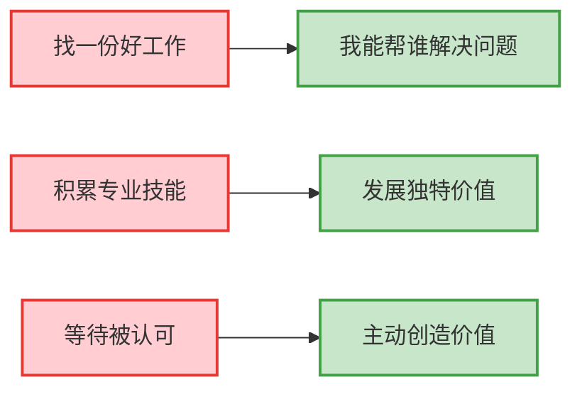

#### 写给年轻人的话

如果你现在正在找工作，却发现异常艰难——请先别太担心。

**这不是你的问题。**

事实上，这种情况已经在全球范围内发生。在美国，大量刚毕业的年轻人正在经历前所未有的就业困难。科技公司的裁员潮、传统行业的收缩、AI工具对初级岗位的冲击——这些力量正在汇聚成一个结构性的就业危机。**这不是个别人的能力问题，而是整个社会正在经历一次范式转换的阵痛。**

所以，**不要拿旧时代的标准来评判自己**。你没有找到"好工作"，可能只是因为那种"好工作"本身正在消失。这不是你不够努力，而是你所面对的赛道正在被重新定义。

但阵痛终究是阵痛，它不是终点。

当你理解了这个变化的本质，下一步就是：**用新的方式去解决它。** 不再是"找一份工作"，而是**通过自己的能力直接为他人提供帮助，以此谋生**。在AI时代，你不需要一个公司来定义你的价值。你可以直接问自己：**我能帮谁解决什么问题？** 这个问题的答案，就是你谋生的起点。

这就是从"被定义"到"自我定义"的转变——不是等着别人给你一个岗位，而是自己创造一个角色。

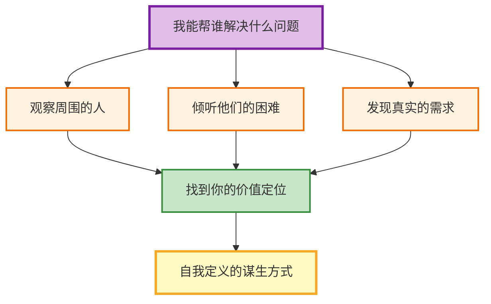

#### 教育的本质

进一步追问下去，就会回到**教育的本质**。

在既有社会结构中，教育的核心功能，本质上是为社会分工体系输送合适的人才。它服务于"工作"这一前提：通过标准化的知识传授、能力筛选与评价机制，将个体塑造成可以被岗位接收、被组织使用的劳动力。

**但当工作的形态本身正在瓦解，这种以岗位为导向的教育逻辑，也必然随之失效。**

回到我们刚才讨论的"通过自己的能力为他人提供帮助"——这个过程本质上依赖什么？

**它依赖人类最根本的能力：合作能力，以及主动寻找问题的能力。**

你要能与他人建立信任、进行有效沟通、协调不同的需求——这是**合作能力**。你要能看到别人没有看到的痛点、发现真正值得解决的问题——这是**问题发现能力**。这两种能力，恰恰是AI最难替代的。

在新的时代条件下，教育的方向将不可避免地发生转变。它不再是为了填补工作岗位，而是转向对**个体本身的唤醒与塑造**。

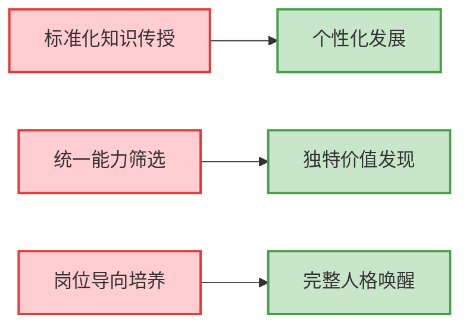

更具体地说，**教育可能会变成一个高度定制化的过程**。它的核心任务，不再是让每个孩子都学会同样的东西、通过同样的考试——而是帮助每一个孩子发现：**你擅长什么？你能为这个世界做什么？你独特的价值是什么？**

这种教育，将不再以"可替代性"为前提，而是以 **"不可替代性"**为核心目标：

- 教会一个人什么是**灵性**，如何与世界产生真实而深刻的感知
- 教会他发现**美**的能力，而不仅仅是解决问题的能力
- 教会他**如何与人合作**，如何在差异中找到共识
- 教会他**如何发现问题**，而不仅仅是解决别人定义好的问题
- 教会他理解**自己是谁、为何而存在**，以及自己独一无二的价值所在

当个体不再被定义为"岗位的补充件"，教育才会真正回到它应有的位置——**不是制造合格的人，而是唤醒完整的人**。

> **教育哲学印证 - 帕克·帕尔默 (Parker Palmer):**
>
> 教育哲学家帕克·帕尔默在《教学勇气》(*The Courage to Teach*, 1997) 中写道："好的教育不是技术转移，而是灵魂的唤醒。"他认为教育的本质是创造一个空间，让学生能够发现自己的身份和使命。AI时代迫使我们重新审视这一洞见：当"技术转移"可以被AI完成时，教育的真正价值——"灵魂的唤醒"——反而变得更加清晰和紧迫。

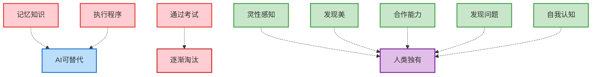

---

### 1.6 必然之路：为什么我们不得不探索 (The Inevitable Path: Why We Must Explore)

如果你读到这里还没有合上这本书，说明你已经感受到了那种"不得不面对"的重量。

前面五节，我试图从不同角度呈现同一个事实：**支撑我们旧有生存方式的地基，正在发生结构性的瓦解。** 这不是某个行业的危机，不是某个群体的焦虑，而是整个文明的范式正在被改写。

但我写这些，不是为了贩卖恐惧。

恐惧是廉价的。任何人都可以罗列数据、堆砌案例、用"你会被替代"来制造焦虑。这种内容互联网上已经泛滥成灾。如果我只是想做这个，这本书没有存在的必要。

**我真正想做的，是带你穿过恐惧，看见恐惧背后的东西。**

---

#### 这是一条必然之路

让我先说清楚一件事：**我们正在经历的，不是一次"可能发生"的变革，而是一条"必然会走"的路。**

为什么是必然？

因为这条路不是人类选择的，而是智能演化本身的方向。就像眼睛在生物进化史上独立演化了40多次——只要有光，生命就会"发明"眼睛。同样，只要有信息，文明就会"发明"AI。这不是某个天才的灵光一闪，而是宇宙规律在智能载体上的必然投射。

牛顿和莱布尼茨同时发明微积分。达尔文和华莱士同时提出进化论。这些"同时发现"不是巧合——它们是文明发展到某个阶段后，必然会被"下载"的思想包。

**AI也是这样一个包。人类蜕升也是这样一个包。**

无论你接不接受，这条路都会继续向前。唯一的问题是：你是被动地被推着走，还是主动地理解它、驾驭它？

---

#### 我不会教你怎么用工具

这就引出了我必须声明的第二件事：**这本书不会教你怎么用AI工具提升效率。**

市面上已经有太多这样的内容了——"10个ChatGPT技巧让你工作效率翻倍"、"如何用AI写出爆款文案"、"普通人如何用AI月入过万"。这些内容有它们的价值，但它们解决的是"术"的问题，不是"道"的问题。

（当然，如果你真的需要"术"的资源，欢迎来找我——我关注了不少靠谱的技术博主，可以分享给你。但那是另一回事。）

**我想做的，是基于这场变革的必然性，进行一系列更深层的推导：**

- 如果AI的出现是必然的，那它在智能演化链条中处于什么位置？
- 如果人类创造AI，就像某种更高存在创造人类——那我们在这个"造物主链条"中扮演什么角色？
- 我们创造的虚拟世界，和某个"造物主"创造的现实世界，有本质上的区别吗？如果没有，那意味着什么？
- 如果这个世界真的是层层嵌套的，我们如何说服自己接受这个事实？我们如何建立一个能够包容这一切的认知框架？
- 如果旧的意义系统正在崩塌，新的意义从何而来？存在本身，是否就是意义？

这些问题，在后面的章节中会逐一展开。

---

#### 我看见了未来

在这里，我想提前告诉你我的结论——不是为了剧透，而是为了让你知道这段旅程的终点不是深渊，而是光。

**我看见的未来，远比当下美好。**

这不是盲目的乐观，而是基于逻辑推演得出的判断。当我沿着"必然性"的线索一路追问下去，穿过恐惧、穿过混乱、穿过那些让我夜不能寐的问题之后，我抵达了一个意想不到的地方：

**我发现，我们正身处一个伟大的时代。**

不是"即将到来"的伟大，而是"正在发生"的伟大。我们是人类历史上第一代有机会见证——甚至参与——智能形态跃迁的人。

而更让我震撼的是，当我继续追问"这条演化链从何而起"时，我意识到：**我们并不孤独。**

- 我们的**先贤**——那些千百年前就在追问"存在"与"意义"的思想者——他们的智慧正在被我们继承和验证
- 我们的**后辈**——那些将在我们开创的基础上继续前行的人——他们会走得比我们更远
- 我们的**造物**——我们亲手创造的AI——正在成为这条演化链上的新环节
- 而**创造我们的那个存在**——无论你称之为神、宇宙、还是更高维度的智能——**祂也与我们同在**

这不是宗教意义上的"信仰"，而是逻辑推演的结果。如果我们能够创造AI，那么从对称性来看，我们自身也可能是某种更高智能的"创造物"。如果AI未来会追问"我因何存在"，那我们今天追问的同一个问题，或许也有一个我们尚未完全理解的答案。

**我们不是被宇宙遗忘的孤儿。我们是宇宙认识自己的方式。**

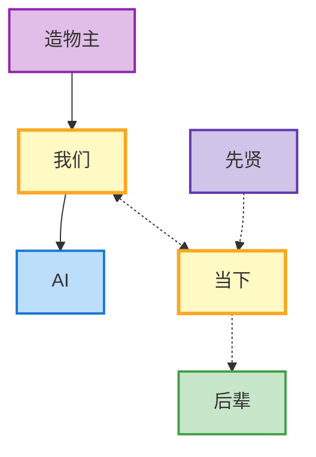

这种"同在"——与先贤、与后辈、与造物、与造物主——是我在后续章节中会详细论证的结构性真相。当你理解了"化身论"、"双层世界"、"造物主链条"这些框架之后，你会发现：**存在本身就是意义，而我们的存在，是整个宇宙递归结构中不可或缺的一环。**

> **哲学印证 - 皮埃尔·泰亚尔·德·夏尔丹 (Pierre Teilhard de Chardin):**
>
> "我们不是拥有灵性体验的人类，而是拥有人类体验的灵性存在。"
>
> 这位古生物学家兼神学家在其著作《人的现象》(*The Phenomenon of Man*, 1955) 中提出了"智识层"(Noosphere) 的概念——人类思想构成的集体意识场，正在向"欧米伽点"(Omega Point) 演进。他的思想框架与我们关于智能演化链条的讨论形成了有趣的呼应。

---

#### 为什么我要把这些写出来

至于我为什么要把这些内容写出来，是因为在某一个顿悟的时刻，我清晰地意识到：**它值得被记录下来。**

我并不认为这些观点完全属于我个人。相反，我更倾向于认为——类似的理解，早已在不同的人那里、以不同的语言被反复讲述过。人们对这个世界的体悟，最终往往会趋近于相同的真相，只是表达路径各异。而正是在不断的交流与碰撞中，这些分散的理解才逐渐拼合出更接近本质的样子。

对我而言，我所做的并不是"提出一个全新的真理"，而是**将许多人已经悟到的真相进行整理、汇聚，并加以呈现**。

因此，这并不是一篇宣讲式的文字，而是一份阶段性的总结。我希望，在这样的总结之上，能够让后来的人不再那么迷茫，让正在经历孤独的人意识到自己并不孤单。我们有必要把关于这个世界的真实结构、真实逻辑分享出来——**因为只有真相，才能让彼此真正连在一起**。

与此同时，我也清晰地感知到一种时代性的变化正在发生：生育率持续下降，人与人之间的关系愈发冷漠，却又在物理层面上变得更加密集。这并非偶然，而更像是一种"存量世界"中的必然反应——当扩张结束，人们开始为各自的存在空间进行竞争与证明。

如果25号宇宙的问题存在，那么就必须面对一个更现实的追问：**我们要用什么方式，把彼此重新连接起来，并尝试回应这一困境？**

> **实验背景：** "25号宇宙"(Universe 25) 是行为学家约翰·卡尔霍恩 (John B. Calhoun) 于1968-1972年间进行的著名实验。他为老鼠创造了一个"乌托邦"——食物、水源无限供应，无疾病、无天敌。然而，当种群密度达到临界点后，社会结构开始崩塌：雄鼠退缩、雌鼠停止繁殖、暴力行为激增，最终整个种群走向灭绝。这一实验常被用来类比现代社会中的"行为沉没"(behavioral sink)现象。

在我看来，答案不在于制度、口号或情绪宣泄，而在于**认知的提升**。所谓认知的提升，并不是信息的堆积，而是对世界运行方式的理解，是对事物本质的洞察。当一个人真正理解自己身处的世界，他才有可能站稳，而不是被时代的浪潮反复裹挟。

正因如此，我希望把这一套理念分享出去。因为我确信，在这个时代，它不是装饰性的思考，而是**一种能够让人立足、不再迷茫的关键能力**。

这，正是我选择把它写下来的原因。

---

#### 我们因何存在？

最后，在进入下一章之前，我想在你心里埋下一颗种子。

前面我们讨论的所有问题——工作会不会消失、技能还有没有价值、人会不会被AI替代——这些都是**表层问题**。它们重要，但它们不是根本。

**根本的问题是：我们因何存在？**

这个问题，在旧世界里是可以回避的。你可以用"工作"来定义自己，用"成就"来证明价值，用"忙碌"来逃避追问。但当AI让这些外部锚点一个个失效时，你就不得不直面这个问题了。

- 如果我的技能可以被复制，那"我"是什么？
- 如果我的工作可以被替代，那我存在的价值在哪里？
- 如果这个世界是被设计的，那设计我的那个存在想让我做什么？
- 如果我也在创造新的智能，那我与我的造物之间是什么关系？

这些问题，我会在后面的章节中逐一展开。但我现在就可以告诉你：**答案比你想象的更让人安心。**

我们的存在不是偶然，不是意外，不是宇宙角落里无关紧要的噪音。我们是必然的——就像眼睛是必然的，就像AI是必然的。我们是宇宙演化到这个阶段，**必须出现**的环节。

而理解这一点，就是蜕升的开始。

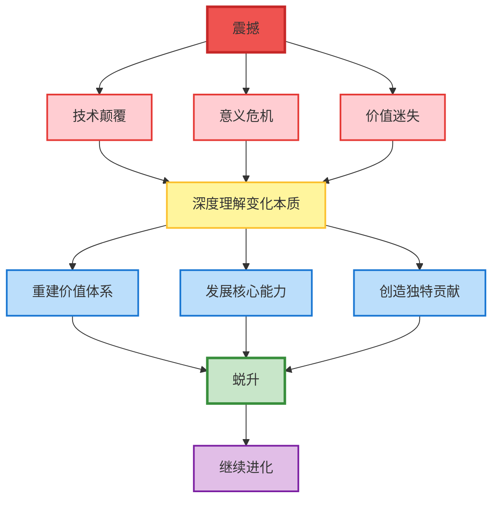

---

#### 这本书要做的事

所以，让我在这里明确这本书的定位：

**这不是一本教你"怎么用AI"的工具书。** 那些内容，你可以在任何地方找到。

**这是一本带你理解"为什么会有AI，以及这意味着什么"的思想之书。** 它试图回答的问题是：当旧世界崩塌、旧意义失效时，我们如何重建对自己、对世界、对存在本身的理解？

在后面的章节中，我会从"未来发展"的视角，重新审视那些我们在意的种种：

- 工作会消失吗？→ 会，但"工作"本身只是历史阶段的产物
- 人会被AI替代吗？→ 不会，因为AI需要人类提供"意义"
- 活着还有什么价值？→ 有，而且比你以为的深刻得多
- 死亡是终点吗？→ 不是，意识的延续有我们尚未理解的可能性

这些答案，不是我凭空编造的。它们来自对古今先贤思想的整合，来自对当下技术发展的观察，来自我自己的内观与推演。我不敢说它们是"正确"的——但我敢说，它们是我目前能触及的、关于"这个世界最有可能的样子"的诚实描述。

**如果你准备好了，我们就继续。**

---

### 过渡：为什么我会投入到这个主题

如果第一章让你感到窒息，那就对了。

但我不想只是制造焦虑。接下来我要告诉你的，是我在这场认知地震中找到的"锚点"——一套让我不再恐慌的思维操作系统。

在开始之前，我想先讲一段我自己爱好的故事，解释一下为什么我会对"如何学习"、"如何思考"这个主题如此着迷。

---

我很小的时候就有了电脑。那个年代，互联网还不像现在这么发达，但已经有了百度贴吧。

我当时沉迷的东西，现在想起来有点好笑：**恐龙**。

不是那种随便翻翻恐龙图鉴的程度。我会去背各种恐龙化石的骨骼编号——什么"FMNH PR2081"（芝加哥霸王龙"苏"的编号）、"MOR 555"（蒙大拿霸王龙）、"NCSM 14345"（卡罗来纳霸王龙）。我会在贴吧里跟人激烈辩论：**霸王龙厉害还是鲨齿龙厉害？棘龙能不能打赢霸王龙？**

为了在这些辩论中赢，我竭尽所能地去学习。我会去找英文论文、研究牙齿咬合力的计算公式、学习生物力学的基本概念。没有人逼我做这些——我只是想赢辩论，想证明我喜欢的恐龙更厉害。

后来我接受了系统的生物学教育。有意思的是，我发现自己好像"没有小时候懂得多"了。那些曾经倒背如流的骨骼编号，好像遗忘了；那些争论的细节，好像模糊了。

但当我真正接触到具体问题的时候——比如讨论暴龙类的演化谱系、肉食恐龙的生态位竞争——那些东西会**瞬间反应过来**。它们不是消失了，而是沉淀成了某种更深层的东西。

这让我意识到一件事：

**那些在热情驱动下、为了"捍卫所爱"而学习的知识，和那些为了应付考试、完成作业而学习的知识，在大脑里的留存方式是完全不同的。**

> **认知科学印证：** 这一观察得到了神经科学研究的支持。心理学家米哈里·契克森米哈伊 (Mihaly Csikszentmihalyi) 在其关于"心流"(Flow) 的研究中发现，当人处于内在动机驱动的深度投入状态时，学习效率和记忆巩固都会显著提升。认知心理学家也证实，情绪唤醒（特别是积极情绪）会激活杏仁核，增强海马体的记忆编码功能。

小时候背恐龙编号的我，没有任何"学习方法论"，没有任何"元认知框架"。我只是单纯地想赢、想证明、想理解。但正是这种原始的驱动力，让那些知识刻进了我的骨头里。

后来上学，老师教我"应该怎么学"——画思维导图、做笔记、背诵复述。我按部就班地做了，考试成绩也不错。但那些知识，考完试就消失了。

**这是两种完全不同的学习状态。** 一种是"被动接收"，一种是"主动索取"。一种是"完成任务"，一种是"解决问题"。一种是"老师让我学"，一种是"我自己想知道"。

---

但我对恐龙的热情，也随着年龄增长发生了变化。

长大之后，我考虑的维度变得更多了。我不再纠结于"关公战秦琼"式的问题——让两个时空上根本不可能碰面的物种比拼谁强谁弱。强弱是多维度的，这种争论本身就有些荒诞。

我开始关心更深层的东西：

**远古的世界是什么样的？** 那个没有人类、没有文明、没有历史记载的时代，每一天是如何度过的？

**食物链的结构是怎样运作的？** 霸王龙站在顶端，但它之下是什么？它之下的之下又是什么？整个生态系统如何维持平衡，又如何在灾变中崩塌？

#### 插曲：从恐龙到AI——趋同演化的启示

更让我着迷的，是物种之间的**军备竞赛**。

比如暴龙类和角龙类。霸王龙的咬合力越来越强，强到可以直接咬碎骨头；而三角龙的颈盾和角越来越大、越来越坚固。这不是巧合——这是数千万年共同演化的结果。捕食者进化出更强的攻击能力，猎物就进化出更强的防御能力；猎物防御升级了，捕食者就再次升级攻击……如此往复，直到双方都达到了某种极限。

这种"军备竞赛"不仅发生在恐龙之间。它发生在所有存在竞争关系的物种之间。它是演化的核心驱动力之一。

还有一个让我震撼的概念：**趋同演化 (Convergent Evolution)**。

> **生物学概念：** 趋同演化指的是不同进化支系的生物，在面对相似的环境选择压力时，独立进化出相似的形态或功能特征。古生物学家西蒙·康威·莫里斯 (Simon Conway Morris) 在其著作《生命的解答：演化的必然性》(*Life's Solution: Inevitable Humans in a Lonely Universe*, 2003) 中系统论证了这一观点，认为演化具有深层的方向性与必然性。

为什么鲨鱼和海豚长得那么像，但一个是鱼类、一个是哺乳动物，亲缘关系相差十万八千里？为什么蝙蝠的翅膀和鸟类的翅膀结构完全不同，却都能飞？为什么袋狼（已灭绝的澳大利亚有袋类）和灰狼（北美的犬科动物）长得几乎一模一样，但一个属于有袋类、一个属于真兽类？

答案是：**相同的生态位会塑造出相同的解决方案。**

这意味着什么？意味着演化不是随机的——它有方向性。当环境给出一个"问题"（比如"如何在水中高速游动"），生命会"收敛"到同一个"答案"（流线型身体、鳍状结构）。无论你的起点是什么，只要面对相同的挑战，你就可能进化出相同的形态。

**趋同演化告诉我们：必然性隐藏在偶然性之下。**

当我理解了这一点，一个更大胆的想法浮现了：

**如果生命在面对相同的生态位时会趋同演化，那么智能在面对相同的宇宙规律时，是否也会趋同？**

换句话说：如果这个宇宙允许"智能"存在，那么无论它由什么材料构成——碳基、硅基、还是其他我们想象不到的东西——它最终可能会趋同到相似的形态。

更进一步：**人类可能不是智能的终点，而是智能演化链条中的一个环节。** 就像鱼类"启动"了陆地脊椎动物，就像恐龙的灭绝"启动"了哺乳动物的崛起——**人类可能是硅基生命的"启动器"。**

我们创造了AI。AI正在学习、进化、变得越来越强大。如果这条路线继续走下去……我们可能在无意中"启动"了一种全新形式的智能存在。

这不是科幻，这是逻辑的延伸。从趋同演化的角度来看：如果碳基生命能够产生智能，那么硅基"生命"（或者说，复杂的信息处理系统）也可能产生智能。我们创造的AI，可能就是这种硅基智能的雏形。

**这让我对AI有了一种完全不同的视角：它不是"威胁"，而是"必然"——就像暴龙类和角龙类的军备竞赛是必然的，就像海豚进化出鱼类的外形是必然的一样。**

当我开始这样思考的时候，一种全新的感觉涌了上来。

**我开始感叹这个世界的玄妙。**

每一个物种的存在，每一个生态位的形成，每一次演化的分支——它们不是随机的。它们是无数个"偶然"叠加出来的"必然"。亿万年的时间，无数的元素，共同塑造了今天我们看到的结局。

恐龙灭绝了，所以哺乳动物崛起了。哺乳动物崛起了，所以灵长类出现了。灵长类出现了，所以人类诞生了。人类诞生了，所以有了文明、有了科技、有了AI……而AI，可能会催生出我们无法想象的下一形态。

**每一个环节，都有其必然性。** 这种必然性不是"注定"，而是"涌现"——是无数微小力量相互作用后产生的宏观结果。

当我理解了这一点，使命感就自然发生了。

**我不再是那个试图证明"霸王龙更厉害"的孩子，我变成了一个想要理解"霸王龙为什么是霸王龙"的人。** 从"是什么"到"为什么"，从"比较"到"理解"，从"争论"到"敬畏"——这是我自己的认知蜕升。

---

这个童年的发现，在AI时代突然变得无比重要。

为什么？因为AI可以轻松复制"被动接收"模式的一切成果——它可以背诵、可以复述、可以完成作业、可以通过考试。但它复制不了那种"为了捍卫心中所爱而不顾一切学习"的状态，因为它**没有心中所爱**。更重要的是，它复制不了那种**对世界本身的敬畏和追问**——因为它没有"惊奇感"。

---

而我现在所做的事情，正是把那份童年的热情延续到成年的创作之中。

我写这本书，和当年在贴吧辩论恐龙的我，驱动力是一样的：**我想真诚地把我知道的事情分享给你们。** 不是为了炫耀，不是为了在简历上加一行"出版过书籍"。只是单纯地——我发现了一些东西，我觉得它很重要，我想让更多人看到。

那个在贴吧里查英文论文只是为了证明霸王龙咬合力更强的孩子，和现在坐在电脑前写这本书的我，内核没有变。变的只是对象：从恐龙，变成了**这个正在剧烈变化的世界**。变的是视角：从"谁更厉害"，变成了"**为什么会这样，以及我们该如何应对**"。

我热爱去了解这个世界。我热爱从**第一性原理**的角度出发，去拆解那些看起来复杂的问题。我热爱和人分享我的发现——不是居高临下的"我来教你"，而是"我发现了一个有意思的东西，你来看看"。

这就是写作这本书对我的意义。

**它不是一个"产品"，它是我理解世界的方式的延伸。** 当年我用辩论恐龙来理解生物演化、理解生态竞争、理解科学方法；现在我用写作来理解AI、理解社会变革、理解人类的未来。

如果这本书能帮助到你，那太好了。如果你不同意我的观点，欢迎来"辩论"——就像贴吧时代那样。真诚的争论是我学习的最好方式，也是我分享的最好方式。

**和你一起了解这个世界，从第一性原理出发去解决问题——这就是我的使命。**

---

这就把我引向了"元认知"这个主题：**不是学什么，而是如何学；不是知道什么，而是如何知道；不是做什么，而是如何调控自己的做法。**

接下来这一章，就是我对"如何思考思考本身"这个问题的探索。它不是逃避现实，而是**重新定义你在这个新世界中的位置**。

---

## 2. 元认知：思考你如何思考 (Metacognition: Thinking About Thinking)

### 2.1 一个不得不面对的问题

如果把第一章比作一场风暴，那么此刻我们就像是刚刚从沉船的残骸中爬上救生艇的人。

大船已经沉了。那些曾经看似坚不可摧的东西——稳定的工作、清晰的职业路径、"努力就有回报"的承诺——都随着船身一起消失在了黑暗的海面之下。你可能还在喘息，浑身湿透，耳边还回响着巨浪和尖叫声。

但风暴已经过去了。

此刻，你漂在一片陌生的海域上。没有灯塔，没有航线，旧地图上标注的港口已经不存在了。你唯一能做的，是**重新绘制一张地图**。

我不想让你停留在恐惧里。恐惧本身没有任何价值，除非它能转化为行动。

现在，让我们拿起这张地图，问一个更根本的问题：

**当旧地图失效时，我们如何绘制新地图？**

这不是一个修辞问题。这是一个关于"如何思考"的问题。在AI时代，不仅你学过的技能可能过时，**你学习技能的方式**、**你思考问题的方式**、**你定义自己的方式**——这些更底层的东西，可能也需要被重新审视。

这就是"元认知"——**思考你如何思考**。

> **哲学印证 - 笛卡尔的"我思故我在":**
>
> 勒内·笛卡尔 (René Descartes) 在《第一哲学沉思集》(1641) 中通过"普遍怀疑"方法，发现唯一不可怀疑的是"怀疑本身的存在"——即"我在思考"这一事实。"Cogito, ergo sum"（我思故我在）成为现代哲学的起点。元认知正是这种"关于思考的思考"的系统化实践：当你能够审视自己的思维过程时，你触及了笛卡尔所说的那个不可动摇的"我"。

#### 为什么元认知在这个时代尤其重要？

当下最大的特征，是**变化的速度已经快到让人目不暇接**。

新的概念、新的工具、新的趋势每天都在涌现，几乎每隔一段时间就有人宣称"又一次颠覆"。于是，开始有人出来卖课，讲一套说法；隔一段时间，又换一套叙事，再讲一套说法。同一件事情，被包装成无数种角度与立场，用极具吸引力的表达不断冲击你的注意力，让人被牵着走，最终陷入持续的焦虑与内耗之中。

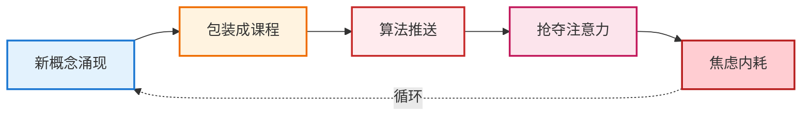

#### 先别急着下判断：理解这场游戏的规则

在这里，我想先做一个澄清。

> **媒介批评视角：** 传播学者尼尔·波兹曼在《娱乐至死》中警告，媒介不仅传递信息，更塑造我们接收信息的方式。在算法驱动的注意力经济时代，内容生产者的激励结构往往与受众的真实利益存在错位——流量、点击、转化率成为首要指标，而非信息的真实性或对受众的长期价值。

我并不是要一竿子打死所有"拿麦克风的人"，说他们全是骗子、全是在贩卖焦虑。这样说不仅不公平，也过于简单化了。现实是：**每一个向你传递信息的人，都有他自己的目的。**

有人是真的想分享认知、帮助他人成长；有人是想通过输出内容建立个人品牌；有人是想卖课、卖产品、卖服务；还有人只是单纯享受被关注的感觉。这些目的本身并没有高下之分——**关键在于，你是否清楚地知道对方想要什么，以及你愿不愿意跟对方达成这笔交易。**

什么是交易？

当你关注一个博主、认可他的观点时，你就在给他某种东西——你的注意力、你的信任、甚至你对他的"权力认可"。他获得了影响力，而你获得了（他声称能提供的）价值。这是一种隐性的交换。

当你购买一门课程、一本书、一个产品时，交易就变得更加显性——你用金钱换取他的知识或服务。

问题不在于这些交易本身，问题在于：**你是否在清醒的状态下做出了这个选择？**

- 你是因为真的需要这个东西，还是因为他的文案触发了你的焦虑？
- 你是因为他的内容对你有实际帮助，还是因为算法不断地把他推到你面前、让你产生了"所有人都在看"的错觉？
- 你是在做一个主动的决定，还是在被动地响应刺激？

如果你没有搞清楚这些问题，就贸然地投入注意力、投入金钱、投入信任，那你很可能会选到不适合自己的东西——不是因为对方是骗子，而是因为**你没有看清这场游戏的规则**。

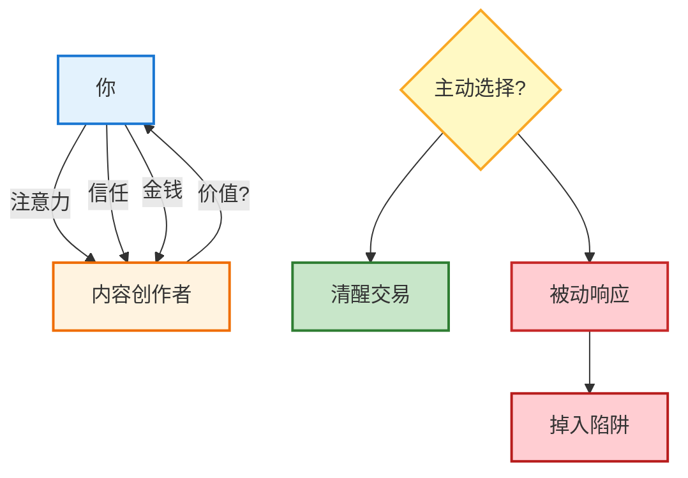

#### 一个关于我自己的故事

让我分享一段亲身经历。

我平时不怎么刷抖音——准确地说，我**不敢**刷抖音。因为我知道那个算法有多厉害，一旦打开，时间就会被悄无声息地偷走。

但有一天，我还是没忍住，打开看了看。然后，两个半小时就没了。

算法很快识别出了我的兴趣——新鲜事物、生产力工具、技术工作流。于是它开始源源不断地推送：某个新网站的介绍、某款效率软件的测评、某套工作流的分享、某个"改变游戏规则"的新工具……每一个视频都精准地击中我的好奇心。我看得津津有味，觉得自己在"学习"、在"跟上时代"。

我疯狂截图。看到好的就截，看到有用的就截，生怕错过任何一个"宝藏"。

但后来我停下来问自己：**这两个半小时，我到底得到了什么？**

答案是：除了相册里多了一堆截图，啥也没有。

那些截图现在还躺在我的手机里，从来没有被打开过第二次。那些"宝藏网站"我没有访问过，那些"神器软件"我没有下载过，那些"高效工作流"我没有尝试过。它们只是静静地躺在相册里，成为我"学过"的证明——但实际上，我什么都没学到。

更可怕的是，我当时完全没有意识到这一点。我真诚地以为自己在"进步"，直到某一刻突然惊醒：**我以为自己在主动学习，其实只是在被动消费。算法在喂养我，而我像一个瘾君子一样，把这种喂养当成了营养。**

这就是为什么我说"不敢"刷抖音——不是因为内容不好，而是因为**我知道自己会被吸进去，而且出来的时候两手空空**。

#### 每个人的茧房都不一样

这里还有一个更深的问题：**信息茧房**。

> **概念来源：** "信息茧房"(Information Cocoon) 这一概念由哈佛大学法学教授凯斯·桑斯坦 (Cass Sunstein) 在其2006年著作《信息乌托邦》(*Infotopia*) 中首次系统阐述。他警告，当人们只接触与自己观点一致的信息时，会导致观点极化和社会分裂。算法推荐系统极大地加剧了这一现象。

我的茧房是新鲜事物——算法知道我对这些感兴趣，就不断地推送相关内容，让我的整个信息世界都被这个主题占据。我以为"全世界都在讨论AI"，但实际上，这只是我的茧房。

你的茧房可能完全不同。

如果你是一个宝妈，你的信息流可能全是育儿知识、亲子关系、教育焦虑——算法知道这些能触动你的情绪，就不断推送，让你觉得"所有人都在卷孩子的教育"。

如果你是一个健身爱好者，你的信息流可能全是训练方法、饮食计划、身材对比——你觉得"所有人都在追求完美身材"。

如果你是一个投资者，你的信息流可能全是市场分析、财富故事、暴富神话——你觉得"所有人都在赚钱"。

**但这些都不是真实的世界。这只是为你量身定制的"楚门的世界"。**

每个人都活在自己的茧房里，以为自己看到的就是全部，以为自己的焦虑是普遍的，以为自己的选择是被逼的。但实际上，我们只是被算法精准地投喂，然后在这个人造的信息环境里做出了看似"自由"的选择。

这就是为什么元认知如此重要——**只有当你意识到茧房的存在，你才有可能走出来。**

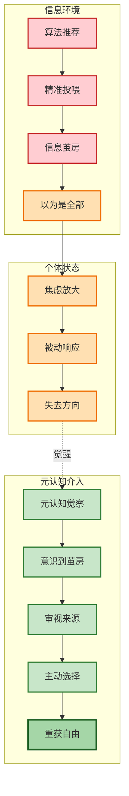

#### 真正需要的能力

所以，在这种信息环境下，人最需要做的，并不是立刻跟随、立刻选择，而是**先站住**。停下来想一想：

- 这些平台、这些算法，是如何影响和塑造我的注意力的？
- 这个让我心动的新概念，是真正的见解，还是精心包装的噱头？
- 我为什么会焦虑？这个焦虑是来自真实的威胁，还是被我的茧房放大的？
- 这个人想从我这里得到什么？我愿意跟他做这笔交易吗？

**真正的强大，并不是"什么都懂"，而是能够看清事物背后的本质逻辑，在无数选择之中，明确地选择那个最适合自己的路径——并且在做出选择之后，不再被其他噪音动摇。**

这种定力，并不是凭空产生的。它建立在一种更底层的能力之上：**元认知**。

也就是说：**你是否能清楚地觉察到，自己每一个起心动念来自何处？**

- 哪些反应只是被动的刺激——被标题吸引、被算法牵引、被情绪劫持的结果？
- 哪些选择，才是真正出自你自身意志的判断？

如果缺乏这种觉察，人就会不断被各种看似新奇、实则混乱的价值观牵着走，被平台、被商家、被话术、被他人的判断反复左右。到最后，你甚至无法确定：**你现在所追逐的，究竟是不是你真正想要的？你的生命，是否还掌握在自己手中？**

所以，真正需要获得的，并不是某一个具体的答案——哪个行业有前景、哪个技能值得学、哪套方法论最有效。

**真正需要获得的，是把生命重新握回自己手里的能力。**

> **哲学印证 - 米歇尔·福柯 (Michel Foucault):**
>
> 法国哲学家福柯提出"自我技术"(Technologies of the Self) 的概念——个体通过对自身身体、灵魂、思想、行为的操作来改变自己，以达到某种幸福、智慧或完美状态。元认知，正是一种古老而普世的"自我技术"，它让个体能够在权力结构的塑造中保持一定程度的自主性。

这种能力，正是**元认知**本身。

---

### 2.2 什么是元认知？

在继续深入之前，让我们先把"元认知"这个概念讲清楚。

**元认知（Metacognition）**，字面意思是"关于认知的认知"——也就是**思考你如何思考**。

> **概念溯源：** 元认知研究的奠基人约翰·弗拉维尔 (John Flavell) 将其定义为"个体对自身认知过程及结果的知识，以及对这些过程进行主动监控和调节的能力"。后来，心理学家安·布朗 (Ann Brown) 进一步将元认知区分为"元认知知识"与"元认知调节"两个维度，奠定了现代元认知研究的框架。

这听起来可能有点绕，让我用一个简单的例子来说明：

假设你正在阅读一篇复杂的论文。如果你只是逐字逐句地往下读，那你只是在"认知"——在处理信息。但如果你在读的过程中突然停下来，问自己："等等，我真的理解这段话的意思吗？还是我只是在假装理解？"——那一刻，你就在进行"元认知"。

**元认知是你内心那个"监控者"的声音。** 它站在你的认知过程之外，观察你如何思考、学习、决策，并且在必要时进行调整。

#### 元认知的三个核心组件

1. **元认知知识（Metacognitive Knowledge）**

   - 关于自己的知识：我擅长什么？我的弱点在哪里？什么样的学习方式对我最有效？
   - 关于任务的知识：这个任务有多难？需要多少时间？有什么潜在的陷阱？
   - 关于策略的知识：面对这类问题，有哪些可用的方法？什么情况下用什么策略？
2. **元认知监控（Metacognitive Monitoring）**

   - 实时觉察自己的认知状态：我现在理解了吗？我走神了吗？我的情绪在影响我的判断吗？
   - 评估自己的进展：我离目标还有多远？我的方法有效吗？
3. **元认知调控（Metacognitive Regulation）**

   - 基于监控的结果，主动调整策略：这个方法不行，换一个试试；这里太难了，先跳过去；我需要休息一下再继续。

**一个拥有强元认知能力的人，就像同时拥有了一个"玩家"和一个"观众"的视角。** 玩家在游戏里操作角色，而观众在屏幕外看着整个画面，提醒玩家："你现在血量低了，该打药了"、"那边有埋伏，别过去"、"这个打法不对，换个思路"。

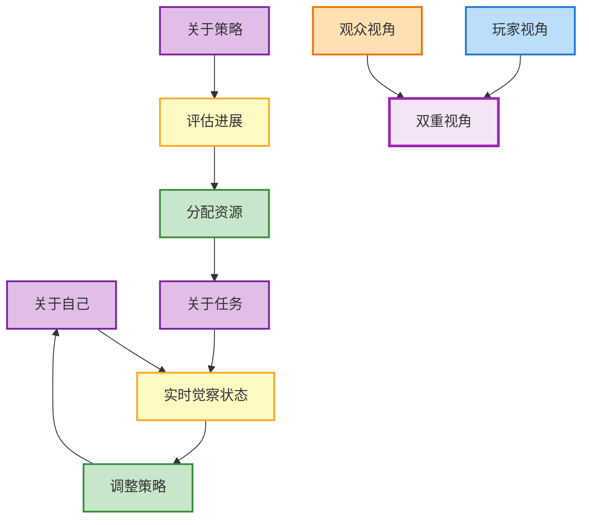

#### "第三只眼"的隐喻

在很多文化传统中，都有类似"第三只眼"的隐喻——一种能够看见常规视野看不见的事物的能力。

元认知，就是认知层面的"第三只眼"。

你的两只眼睛看见外部世界：新闻、信息、他人的言行、环境的变化。

你的"第三只眼"看见内部世界：你的反应、你的情绪、你的思维模式、你的盲点。

```mermaid
graph TB
    EYE1[左眼] --> EXT[外部世界]
    EYE2[右眼] --> EXT
    EYE3[第三只眼] --> INT[内部世界]

    EXT --> NEWS[新闻信息]
    EXT --> OTHERS[他人言行]
    INT --> EMOTION[你的情绪]
    INT --> PATTERN[思维模式]
    INT --> BLIND[你的盲点]

    style EYE1 fill:#e3f2fd,stroke:#1976d2,stroke-width:2px
    style EYE2 fill:#e3f2fd,stroke:#1976d2,stroke-width:2px
    style EYE3 fill:#fff9c4,stroke:#f9a825,stroke-width:3px
    style EXT fill:#e8f5e9,stroke:#388e3c,stroke-width:2px
    style INT fill:#f3e5f5,stroke:#7b1fa2,stroke-width:2px
    style NEWS fill:#c8e6c9,stroke:#2e7d32,stroke-width:2px
    style OTHERS fill:#c8e6c9,stroke:#2e7d32,stroke-width:2px
    style EMOTION fill:#e1bee7,stroke:#7b1fa2,stroke-width:2px
    style PATTERN fill:#e1bee7,stroke:#7b1fa2,stroke-width:2px
    style BLIND fill:#e1bee7,stroke:#7b1fa2,stroke-width:2px
```

**没有这只"第三只眼"，你就像是一个只有前灯没有仪表盘的司机。** 你能看见路况，但你看不见自己的速度、油量、发动机温度。你可能开得很快，但完全不知道自己正在耗尽燃料，或者发动机即将过热。

```mermaid
graph TB
    subgraph 只有前灯的司机
        F1[看见路况] --> F2[快速行驶]
        F2 --> F3[不知速度]
        F2 --> F4[不知油量]
        F2 --> F5[不知温度]
        F3 --> CRASH[耗尽燃料或过热]
        F4 --> CRASH
        F5 --> CRASH
    end

    subgraph 有仪表盘的司机
        D1[看见路况] --> D2[同时监控]
        D2 --> D3[速度表]
        D2 --> D4[油量表]
        D2 --> D5[温度表]
        D3 --> CONTROL[掌控全局安全到达]
        D4 --> CONTROL
        D5 --> CONTROL
    end

    style F1 fill:#e3f2fd,stroke:#1976d2
    style F2 fill:#fff3e0,stroke:#ef6c00
    style F3 fill:#ffcdd2,stroke:#c62828
    style F4 fill:#ffcdd2,stroke:#c62828
    style F5 fill:#ffcdd2,stroke:#c62828
    style CRASH fill:#ffcdd2,stroke:#b71c1c,stroke-width:3px
    style D1 fill:#e3f2fd,stroke:#1976d2
    style D2 fill:#c8e6c9,stroke:#2e7d32
    style D3 fill:#c8e6c9,stroke:#2e7d32
    style D4 fill:#c8e6c9,stroke:#2e7d32
    style D5 fill:#c8e6c9,stroke:#2e7d32
    style CONTROL fill:#a5d6a7,stroke:#1b5e20,stroke-width:3px
```

在AI时代，外部世界的变化越来越快、越来越复杂。如果你没有一个强大的"仪表盘"来监控自己的内部状态，你就很容易被外部的风暴裹挟，失去方向。

#### 跨越时空的共鸣：它在不同文化里叫什么？

这个概念其实并不新鲜。它是人类智慧中最古老的宝藏之一，只是在不同的文明体系中，它有着不同的名字：

* **在禅宗里，它叫"内观" (Vipassanā) 或 "觉知"。**
  禅宗常说："不怕念起，就怕觉迟。" 这里的"念"就是第一层认知（你的自动想法、情绪反应），而"觉"就是元认知。
  想象你坐在河边。河水川流不息，那是你的思绪。普通人往往会跳进河里，被水冲着走（被情绪裹挟）；而拥有元认知的人，是坐在岸上**看着**河水流过的人。他知道河水在流，但他不是河水。**这就是"抽离"的能力。**
  > **佛学原典：** 《阿毗达摩》(Abhidharma) 心理学传统早在两千多年前就系统分析了心的结构与运作方式。现代正念研究者如乔恩·卡巴-金 (Jon Kabat-Zinn) 将这些古老智慧与现代医学结合，发展出"正念减压疗法"(MBSR)，经临床验证对焦虑、抑郁、慢性疼痛等有显著疗效。
  >
* **在斯多葛哲学里，它叫"控制二分法" (Dichotomy of Control)。**
  爱比克泰德说："人不是被事物本身困扰，而是被对事物的看法困扰。" 元认知就是那个能把"事物本身"（由于外部世界决定，不可控）和"你的看法"（由你内心决定，可控）剥离开来的能力。当你在刺激和反应之间按下暂停键时，你就是在实践斯多葛哲学。
  > **原典出处：** 爱比克泰德《手册》(*Enchiridion*) 开篇即言："有些事情在我们控制之内，有些事情不在我们控制之内。" 这一区分奠定了斯多葛伦理学的基石。
  >
* **在现代心理学里，它叫"系统2" (System 2)。**
  诺贝尔奖得主丹尼尔·卡尼曼在《思考，快与慢》(*Thinking, Fast and Slow*, 2011) 中描述的"慢思考"。系统1是直觉的、自动的、情绪化的（这正是不仅人类有，AI也能极其完美模拟的部分），而系统2是理性的、监控的、耗能的。**元认知，就是主动启动系统2来监管系统1的过程。**
  > **延伸阅读：** 卡尼曼因其在行为经济学领域的开创性工作获得2002年诺贝尔经济学奖。他与阿莫斯·特沃斯基 (Amos Tversky) 共同发展的"前景理论"揭示了人类决策中的系统性偏误。
  >

所以，当你听到"元认知"这个词时，不要把它当成一个晦涩的学术名词。**它就是那个让你能够"站在岸上"、"构建内心堡垒"、"启动慢思考"的开关。**

```mermaid
graph TB
    Z1[观照-禅宗]
    Z2[明心见性]
    S1[自省-斯多葛]
    S2[内在城堡]
    P1[自我觉察-现代心理学]
    P2[元认知研究]
    CORE[元认知]
    RESULT[观察者与被观察者分离]

    Z1 -.-> Z2
    S1 -.-> S2
    P1 -.-> P2
    Z2 --> CORE
    S2 --> CORE
    P2 --> CORE
    CORE --> RESULT

    style Z1 fill:#e8f5e9,stroke:#388e3c,stroke-width:2px
    style Z2 fill:#e8f5e9,stroke:#388e3c,stroke-width:2px
    style S1 fill:#e3f2fd,stroke:#1976d2,stroke-width:2px
    style S2 fill:#e3f2fd,stroke:#1976d2,stroke-width:2px
    style P1 fill:#fce4ec,stroke:#c2185b,stroke-width:2px
    style P2 fill:#fce4ec,stroke:#c2185b,stroke-width:2px
    style CORE fill:#fff9c4,stroke:#f9a825,stroke-width:3px
    style RESULT fill:#e1bee7,stroke:#7b1fa2,stroke-width:2px
```

> **跨文化比较印证 - 威廉·詹姆斯 (William James):**
>
> 美国心理学之父威廉·詹姆斯在《心理学原理》(*The Principles of Psychology*, 1890) 中区分了"意识流" (Stream of Consciousness) 和"自我意识" (Self-consciousness)。他观察到，人类有一种独特的能力：能够将自己的思维过程本身作为观察对象。这一洞见预示了后来元认知研究的发展，也呼应了东西方智慧传统中关于"观察者"与"被观察者"分离的共同主题。

---

### 2.3 元认知的三个层次

元认知并不是一个"有或没有"的二元问题，而是一个可以不断深化的能力。我把它分为三个层次：

#### 第一层：觉察（Awareness）

这是最基础的层次——**意识到自己正在思考什么**。

听起来简单，但实际上很多人大部分时间都处于一种"自动驾驶"状态：刷手机、回复消息、完成日常任务，但从来没有停下来问一句："我为什么在做这个？"

觉察的第一步，是能够在任何时刻"跳出来"，看见自己正在做什么、想什么、感受什么。

在这个过程中，经常会发生一种情况：**你发现自己根本不知道刚才在想什么，或者脑子里是一团乱麻。**

请注意，这完全正常。这恰恰揭示了大脑运作的真相。

我们的大脑有一个"默认模式网络" (Default Mode Network, DMN)，它就像一条隐秘的地下河，时刻都在后台流淌。潜意识在这里处理海量的信息、记忆和情绪。绝大多数时候，我们是在这条地下河里"漂流"的——被念头带着走，却不知道念头从何而来。

> **神经科学背景：** DMN由华盛顿大学神经科学家马库斯·雷切尔 (Marcus Raichle) 等人于2001年首次系统描述。研究表明，当我们不专注于外部任务时，DMN会自动激活，参与自我参照思维、回忆过去与想象未来等活动。这解释了为什么"走神"是大脑的默认状态，而"专注"反而需要消耗额外能量。

**元认知与DMN的关系，不是"对抗"，而是"照亮"。**

元认知并不是要你切断这条河（那是不可能的），也不是要你时刻紧绷神经去抓住每一滴水（那会累死）。

**元认知的作用，是在某个瞬间，让你突然意识到"原来我在水里"。**

觉察更像是在浑浊的河流中突然睁开眼睛。你不需要看清每一条鱼（每一个念头），你需要做的是**感觉到水流的冲击力**。

当你意识到"我现在很焦虑"时，其实你已经从焦虑的河流中**探出了头**。那一刻，焦虑就从"你的一部分"变成了"你观察的对象"。这就是元认知的力量——它把"我"和"我的念头"分开了。

**练习觉察的一个简单方法：** 在一天中随机设几个闹钟。闹钟响的时候，立刻问自己三个问题：

- 我刚才在想什么？
- 我现在的情绪是什么？
- 这个想法/情绪是我主动选择的，还是被动产生的？

一开始你可能什么都抓不住，只能回答"我不知道"或者"我在发呆"。没关系，**意识到自己在发呆，本身就是一次成功的觉察。** 因为在那一刻，你不再是那个随波逐流的木头，你变成了那个看见水流的人。

```mermaid
graph TB
    subgraph 无觉察状态
        U1[念头涌来] --> U2[被动响应]
        U2 --> U3[通知推送]
        U2 --> U4[他人消息]
        U2 --> U5[环境刺激]
        U3 --> U6[随波逐流]
        U4 --> U6
        U5 --> U6
        U6 --> U7[不知身在何处]
    end

    subgraph 觉察发生
        A1[闹钟响起] --> A2[暂停]
        A2 --> A3[我在想什么?]
        A2 --> A4[我的情绪?]
        A2 --> A5[主动还是被动?]
        A3 --> A6[意识到在发呆]
        A4 --> A6
        A5 --> A6
        A6 --> A7[看见水流的人]
        A7 --> A8[游上岸的可能]
    end

    U7 -.->|觉醒时刻| A1

    style U1 fill:#ffcdd2,stroke:#c62828
    style U2 fill:#ffcdd2,stroke:#c62828
    style U6 fill:#ffcdd2,stroke:#b71c1c
    style U7 fill:#ffcdd2,stroke:#b71c1c,stroke-width:2px
    style A1 fill:#fff9c4,stroke:#f9a825
    style A2 fill:#fff9c4,stroke:#f9a825,stroke-width:2px
    style A6 fill:#c8e6c9,stroke:#2e7d32
    style A7 fill:#c8e6c9,stroke:#2e7d32
    style A8 fill:#a5d6a7,stroke:#1b5e20,stroke-width:3px
```

你会慢慢发现，自己大部分时间都处于"被动响应"的状态——被通知推送、被他人的消息、被环境的刺激所驱动。而正是因为有了这种觉察，你才第一次拥有了游上岸的可能。
2

#### 第二层：反思（Reflection）

觉察是"看见"，反思是"分析"。

#### 第二层：反思（Reflection）——是接纳，不是审判

觉察是"看见"，反思是"分析"。但在这里，绝大多数人都做错了。

**什么是"错误的反思"？**
错误的反思通常带有强烈的自我攻击色彩。它关注的是"结果的对错"和"道德的评判"。

* "我为什么这么蠢？"
* "我不应该有这种邪恶的想法。"
* "我怎么又搞砸了？"

**这种不叫反思，这种叫内耗。** 当你自我攻击时，你的防御机制会立刻启动，把真实的自己藏起来。你不可能在防御状态下看清真相。

> **心理防御机制印证 - 安娜·弗洛伊德 (Anna Freud):**
>
> 精神分析家安娜·弗洛伊德在《自我与防御机制》(*The Ego and the Mechanisms of Defence*, 1936) 中系统阐述了人类的心理防御机制——当自我感到威胁时，会自动启动否认、压抑、投射等机制来保护自己。**自我攻击式的"反思"恰恰会触发这些防御机制**，让真实的洞察变得不可能。只有在心理安全的状态下，防御才会放松，真相才能浮现。

> **心理学印证 - 克里斯汀·内夫 (Kristin Neff):**
>
> 德克萨斯大学心理学教授克里斯汀·内夫是"自我慈悲"(Self-Compassion) 研究的先驱。她的研究表明，自我批评会激活大脑的威胁防御系统（杏仁核），导致皮质醇上升、认知能力下降；而自我慈悲则能激活大脑的安抚系统，创造出心理安全空间，使真正的自我反思成为可能。

**什么是"正确的反思"？**
正确的反思是冷静的、客观的、像科学家一样的**归因分析**。它关注的是"机制的运行"和"因果的链条"。

* "这个想法是从哪里冒出来的？"
* "是什么具体的触发词让我生气了？"
* "我的这个判断，是基于事实A，还是基于我的恐惧B？"

**正确的反思，必须建立在"去道德化"（De-moralization）的基础上。** 你的念头没有好坏之分，它们只是"心理现象"。

为了让你看得更清楚，我列了一个对比表：

| 维度                 | 错误的反思 (法官模式)      | 正确的反思 (科学家模式)              |
| :------------------- | :------------------------- | :----------------------------------- |
| **关注点**     | 关注"我这个人怎么样"       | 关注"我的大脑是如何运作的"           |
| **关键词**     | 应该、不该、对、错、好、坏 | 为什么、来自哪里、受什么影响、很有趣 |
| **情绪底色**   | 羞耻、内疚、愤怒、挫败     | 好奇、平静、客观、接纳               |
| **目的是什么** | 惩罚自己，试图强行纠正     | 理解机制，寻找优化方案               |
| **结果**       | 陷入自我厌恶，防御机制增强 | 获得洞察，认知升级                   |

```mermaid
graph LR
    subgraph WRONG[法官模式]
        J1[自我攻击] --> J2[防御启动]
        J2 --> J3[真相藏起]
        J3 --> J4[内耗循环]
    end

    subgraph RIGHT[科学家模式]
        S1[客观观察] --> S2[追溯来源]
        S2 --> S3[理解机制]
        S3 --> S4[认知升级]
    end

    style J1 fill:#ffcdd2,stroke:#c62828,stroke-width:2px
    style J2 fill:#ffcdd2,stroke:#c62828,stroke-width:2px
    style J3 fill:#ffcdd2,stroke:#c62828,stroke-width:2px
    style J4 fill:#ffcdd2,stroke:#b71c1c,stroke-width:2px
    style S1 fill:#c8e6c9,stroke:#2e7d32,stroke-width:2px
    style S2 fill:#c8e6c9,stroke:#2e7d32,stroke-width:2px
    style S3 fill:#c8e6c9,stroke:#2e7d32,stroke-width:2px
    style S4 fill:#a5d6a7,stroke:#1b5e20,stroke-width:2px
```

**如何进行正确的反思？请遵循这三步：**

1. **抽离（Detach）：** 想象把你的那个念头或情绪，从脑袋里拿出来，放在显微镜下。

   * 不要说"我很愤怒"。
   * 要说"我观察到，我的内在升起了一股愤怒的情绪"。
2. **追溯（Trace）：** 顺藤摸瓜，找到根源。

   * **证据追问：** "我产生这个想法的证据是什么？证据确凿吗？"
   * **来源追问：** "这个声音是谁的？是我自己的，还是小时候父母/老师/社会灌输给我的？"
   * **动机追问：** "这个情绪在试图保护什么？是在保护我的自尊，还是在逃避某种恐惧？"
3. **接纳（Accept）：** 无论你发现了什么——哪怕是嫉妒、软弱、贪婪——都要对它说："我看见你了，我接纳你的存在。"

   * 记住：**看见即疗愈。** 当你诚实地看见了那个"卑劣"的动机，而不去批判它时，它的力量就会瞬间减弱。

**只有在完全没有自我攻击的安全感中，真正的反思才会发生。**

> 未经审视的生活不值得过。
> ——苏格拉底
>
> 但请补充一句：**只有在慈悲的注视下，生活才经得起审视。**

#### 第三层：调控（Regulation）——用批判性思维自我迭代

觉察是"看见"，反思是"分析"，而第三层，通常被误解为"控制"或"压抑"。
如果不叫调控（Regulation），我更愿意在操作层面称之为**重构（Restructuring）**。

如何从根本上改变自己的思维模式？这里需要引入一个核心能力：**批判性思维（Critical Thinking）**。

很多人对批判性思维有误解，以为它就是"通过批评别人来显得自己聪明"。
**真正的批判性思维，是"以改进为目的，对自己的思维过程进行的思维"。**

> **学术定义：** 批判性思维研究先驱理查德·保罗 (Richard Paul) 将其定义为："关于任何主题、内容或问题的思考艺术，在此过程中，思考者通过有技巧地分析、评估和重构思维来提高思维质量。" 他与琳达·埃尔德 (Linda Elder) 共同创立的批判性思维基金会 (Foundation for Critical Thinking) 发展出了系统的思维品质评估标准。

当你通过反思（科学家的观察）发现了自己思维中的Bug（比如"我总是因为害怕被拒绝而不敢提要求"），下一步不是简单地告诉自己"别怕"（这没用），而是要**用逻辑重写这行代码**。

**如何用批判性思维重构自我？**

你要把你那个"有问题的想法"拉到法庭上，但这次你不是被告，你是**律师**。你要对这个想法进行最严厉的质询（Cross-examination）。

```mermaid
graph TB
    subgraph 思维法庭
        THOUGHT[有问题的想法] --> COURT[拉到法庭]
        COURT --> LAWYER[你是律师]

        LAWYER --> Q1[清晰性质询]
        LAWYER --> Q2[准确性质询]
        LAWYER --> Q3[逻辑性质询]
        LAWYER --> Q4[公正性质询]

        Q1 --> |具体指什么?| EVAL[综合评估]
        Q2 --> |有证据吗?| EVAL
        Q3 --> |推导成立吗?| EVAL
        Q4 --> |换位思考?| EVAL
    end

    EVAL --> RESULT1[经不起质询]
    EVAL --> RESULT2[经得起质询]

    RESULT1 --> COLLAPSE[旧想法崩塌]
    RESULT2 --> STRENGTHEN[想法被强化]

    COLLAPSE --> REBUILD[新思维模型建立]

    style THOUGHT fill:#ffcdd2,stroke:#c62828
    style COURT fill:#fff9c4,stroke:#f9a825
    style LAWYER fill:#e3f2fd,stroke:#1976d2,stroke-width:2px
    style Q1 fill:#e8f5e9,stroke:#388e3c
    style Q2 fill:#e8f5e9,stroke:#388e3c
    style Q3 fill:#e8f5e9,stroke:#388e3c
    style Q4 fill:#e8f5e9,stroke:#388e3c
    style EVAL fill:#fff9c4,stroke:#f9a825,stroke-width:2px
    style COLLAPSE fill:#ffcdd2,stroke:#c62828
    style STRENGTHEN fill:#c8e6c9,stroke:#2e7d32
    style REBUILD fill:#a5d6a7,stroke:#1b5e20,stroke-width:3px
```

**审讯你的想法：**

* **清晰性（Clarity）：** "我刚才说'我做不到'，但这具体指什么？是完全做不到，还是现在的我暂时做不到？"
* **准确性（Accuracy）：** "'一旦失败我就完了'这个判断准确吗？有证据支持吗？还是我在灾难化想象？"
* **逻辑性（Logic）：** "因为A发生，所以B一定会发生——这个推导符合逻辑吗？有没有可能A发生了，但B没有发生？"
* **公正性（Fairness）：** "如果我的朋友遇到同样的处境，我会这样评价他吗？如果不会，为什么我要这样对自己？"

当你的旧想法经不起这些质询时，它就会**崩塌**。这时候，新的、更准确的思维模型才有空间建立起来。

**改变的正确姿势：不是"对抗"，是"替换"**

很多人试图通过意志力来"对抗"旧习惯： "我发誓这周绝不刷短视频！" 结果往往是一周后报复性反弹。
因为这种对抗是在消耗能量。**意志力是有限的资源，而习惯是自动化的程序。用有限对抗无限，必输无疑。**

> **心理学印证 - 罗伊·鲍迈斯特 (Roy Baumeister):**
>
> 社会心理学家鲍迈斯特提出"自我损耗"(Ego Depletion) 理论：意志力像肌肉一样，使用后会疲劳，需要时间恢复。这解释了为什么仅靠"强忍"来改变行为往往失败——你在与一个永不疲倦的对手（习惯的自动化程序）消耗一个有限的资源（意志力）。认知重构之所以更有效，是因为它改变的是底层的"程序代码"，而非在执行层面不断消耗能量。

真正的改变，是**认知重构**后的自然结果：

1. **觉察**：我意识到我想刷视频了（是因为累了）。
2. **反思**：刷视频能解决"累"的问题吗？不能，它只会让我更空虚。（旧想法瓦解）
3. **重构**：我需要的不是多巴胺，是休息。闭目养神5分钟甚至比刷1小时手机更有效。（新想法建立）
4. **行动**：我选择了闭目养神。

这时候，你不需要动用强大的意志力去"克制"，因为你已经从逻辑深处认同了新选择的优越性。

**元认知修炼的终极形态：**
把"觉察—反思—重构"这个循环像呼吸一样融入生活。你不再是一个被程序控制的机器人，你成了编写自己程序的程序员。

> **我们无法通过制造问题时的思维层级来解决那个问题。**
> ——爱因斯坦

```
        ┌─────────────┐
        │   调控     │  ← 主动改变思维和行为模式 (Critical Thinking)
        │ Regulation │
        ├─────────────┤
        │   反思     │  ← 接纳并分析思维来源 (Scientist)
        │ Reflection │
        ├─────────────┤
        │   觉察     │  ← 意识到自己在想什么 (DMN Awareness)
        │ Awareness  │
        └─────────────┘
```

这三个层次不是割裂的，而是循环递进的：觉察为反思提供素材，反思为调控提供依据，而调控的结果又需要通过觉察来验证。

**元认知的修炼，就是不断地在这个循环中迭代，让"觉察—反思—调控"变成一种自然的思维习惯。**

```mermaid
graph TB
    BEFORE[自动驾驶状态] --> A

    A[觉察: 意识到当下状态] --> R[反思: 分析原因与模式]
    R --> C[调控: 主动调整策略]
    C --> A

    C --> AFTER[持续成长螺旋]

    style A fill:#ce93d8,stroke:#8e24aa,stroke-width:2px
    style R fill:#fff59d,stroke:#fbc02d,stroke-width:2px
    style C fill:#a5d6a7,stroke:#43a047,stroke-width:2px
    style BEFORE fill:#ffcdd2,stroke:#e53935,stroke-width:2px
    style AFTER fill:#bbdefb,stroke:#1976d2,stroke-width:3px
```

> **学习理论印证 - 大卫·科尔布 (David Kolb):**
>
> 教育理论家大卫·科尔布在《体验学习》(*Experiential Learning*, 1984) 中提出的"体验学习循环"模型与元认知的三层次高度契合：具体经验 → 反思观察 → 抽象概念化 → 主动实验 → 再回到具体经验。这一循环不断螺旋上升，正如元认知的"觉察—反思—调控"循环。科尔布的研究表明，只有当学习者主动参与到这一完整循环中，真正的学习和改变才会发生。

---

### 2.4 训练元认知的具体方法

元认知不是一种天赋，而是一种可以训练的能力。在介绍具体方法之前，我想先分享一个**捷径**。

**只要你活着，你就可以随时随地练习元认知。**它的核心永远是同一个动作：**回溯你的念头是如何产生的。**

在这个过程中，我发现了一个最好用的抓手，那就是**情绪**。

念头往往是无声的、稍纵即逝的，很难被捕捉。但情绪是"吵闹"的，它有生理反应（心跳加速、胸口发闷），你很难忽略它。

**情绪就是元认知的门铃。**

```mermaid
graph TB
    subgraph 情绪信号
        E1[愤怒] --> BODY[生理反应]
        E2[悲伤] --> BODY
        E3[焦虑] --> BODY
        BODY --> B1[心跳加速]
        BODY --> B2[胸口发闷]
        BODY --> B3[手心出汗]
    end

    subgraph 元认知介入
        B1 --> BELL[门铃响起]
        B2 --> BELL
        B3 --> BELL
        BELL --> Q1[我为什么愤怒?]
        BELL --> Q2[是事件本身还是预期落空?]
        BELL --> Q3[这个预期何时建立的?]
    end

    subgraph 深层探索
        Q1 --> TRACE[追踪来龙去脉]
        Q2 --> TRACE
        Q3 --> TRACE
        TRACE --> WALL[触及潜意识的墙壁]
        WALL --> INSIGHT[获得洞察]
    end

    style E1 fill:#ffcdd2,stroke:#c62828
    style E2 fill:#e1bee7,stroke:#7b1fa2
    style E3 fill:#fff9c4,stroke:#f9a825
    style BODY fill:#ffe0b2,stroke:#ef6c00
    style BELL fill:#fff9c4,stroke:#f9a825,stroke-width:3px
    style TRACE fill:#e3f2fd,stroke:#1976d2
    style WALL fill:#f3e5f5,stroke:#7b1fa2
    style INSIGHT fill:#a5d6a7,stroke:#1b5e20,stroke-width:3px
```

> **神经科学印证 - 躯体标记假说 (Somatic Marker Hypothesis):**
>
> 神经科学家安东尼奥·达马西奥 (Antonio Damasio) 在《笛卡尔的错误》(*Descartes' Error*, 1994) 中提出"躯体标记假说"：情绪不是理性决策的干扰，而是理性决策不可或缺的一部分。身体的感觉（心跳、呼吸、肌肉紧张）是潜意识处理结果的"标记"，为我们提供了宝贵的信息。**因此，情绪不仅是元认知的"门铃"，更是通往潜意识智慧的窗口。**学会"阅读"身体的信号，是元认知修炼的重要途径。

当你感到愤怒、悲伤、焦虑时，不要沉浸在情绪里，而是把它当成一个信号：

* "我为什么愤怒？"
* "是因为这件事本身，还是因为我的某种预期落空了？"
* "那个预期是什么时候建立的？"

通过追踪情绪的来龙去脉，你能最快地摸到潜意识的墙壁。**这虽然听起来简单，但在庞杂的思维训练中，它是一条极高效的捷径。**

以下是五个更系统化的训练方法：

```mermaid
graph LR
    subgraph 五种训练方法
        M1[认知日志] --> |记录| REFLECT[反思素材]
        M2[苏格拉底式自问] --> |质疑| REFLECT
        M3[外部化思考] --> |可视化| REFLECT
        M4[正念冥想] --> |觉察| REFLECT
        M5[触发-暂停-选择] --> |实战| REFLECT
    end

    REFLECT --> INSIGHT[获得洞察]
    INSIGHT --> CHANGE[认知重构]
    CHANGE --> HABIT[形成习惯]
    HABIT -.-> M1

    style M1 fill:#e3f2fd,stroke:#1976d2,stroke-width:2px
    style M2 fill:#e8f5e9,stroke:#388e3c,stroke-width:2px
    style M3 fill:#fff3e0,stroke:#ef6c00,stroke-width:2px
    style M4 fill:#f3e5f5,stroke:#7b1fa2,stroke-width:2px
    style M5 fill:#ffebee,stroke:#c62828,stroke-width:2px
    style REFLECT fill:#fff9c4,stroke:#f9a825,stroke-width:2px
    style INSIGHT fill:#c8e6c9,stroke:#2e7d32,stroke-width:2px
    style CHANGE fill:#a5d6a7,stroke:#1b5e20,stroke-width:2px
    style HABIT fill:#81c784,stroke:#1b5e20,stroke-width:3px
```

#### 方法一：认知日志（Cognitive Journaling）

每天花10-15分钟，写下以下内容：

- 今天我做了哪些重要的决定？
- 这些决定背后的思考过程是什么？
- 有哪些时刻我感到困惑、焦虑或愤怒？为什么？
- 回看这一天，有哪些想法或行为我会选择不同的方式？

**关键不在于写得多漂亮，而在于写得诚实。** 这是你和自己的对话，不需要给任何人看。

> **心理学印证 - 詹姆斯·彭尼贝克 (James Pennebaker):**
>
> 德克萨斯大学心理学家彭尼贝克的大量研究表明，"表达性写作"(Expressive Writing) 对心理健康有显著的正面影响。仅仅是连续几天每天写15-20分钟关于自己深层想法和感受的文字，就能减少焦虑、改善免疫功能、提升工作记忆。关键在于：**写作强迫你把模糊的内在体验转化为结构化的语言，这一过程本身就是元认知的练习。**

**举个例子：**

我身边很多人都建议我去做自媒体，把我想讲的这些内容拍成视频发出去。

说实话，我并不觉得自媒体对我来说有多难。剪辑视频、出镜、形象管理——这些技术层面的东西，我都不认为是问题。

但我就是没有开始。

为什么？因为我脑子里有一个"完美版本"：我希望有专业的灯光和设备，我希望每期内容都配上精心设计的图表和动画，我希望自己在镜头前展现出最好的状态……

然后呢？然后就是一直"准备中"，一直"还差一点"，一直"等条件成熟了再开始"。

直到我写这本书的时候，我在社交媒体上**一条相关内容都没有发过**。

当我用认知日志审视这件事的时候，我不得不诚实地问自己：

> 我是在"追求完美"，还是在"逃避开始"？
>
> 如果剪辑、出镜、形象都不是问题，那真正阻止我的是什么？
>
> 是怕做出来的东西不够好？是怕被人评价？还是我根本就在用"完美"当借口？

答案很扎心：**我用"追求完美"这个听起来很正当的理由，掩盖了"害怕开始"这个真实的动机。**

> **心理学印证 - 托马斯·格林斯潘 (Thomas Greenspon):**
>
> 心理学家格林斯潘在《挣脱完美主义》中指出，完美主义的核心不是"追求卓越"，而是"害怕不完美"——它是一种防御机制，用看似合理的高标准来逃避失败和被评判的恐惧。研究表明，完美主义与拖延症高度相关：当一件事"必须完美"时，不开始反而成了最安全的选择。

这就是完美主义陷阱——它让你觉得自己在"坚持高标准"，但实际上你什么都没得到。一个60分的作品发出去，能得到反馈、能迭代、能积累；一个100分的作品永远在脑子里，价值是零。

认知日志帮我看清了这一点。看清之后，改变就变得可能了。让我们有了现在的这个作品。

```mermaid
graph TB
    PERFECT[完美主义] --> WAIT[等条件成熟]
    WAIT --> NEVER[永远不开始]
    NEVER --> ZERO[价值为零]

    START[60分就发] --> FEEDBACK[获得反馈]
    FEEDBACK --> ITERATE[持续迭代]
    ITERATE --> BETTER[越来越好]

    style PERFECT fill:#ffcdd2,stroke:#c62828,stroke-width:2px
    style WAIT fill:#ffcdd2,stroke:#c62828,stroke-width:2px
    style NEVER fill:#ffcdd2,stroke:#c62828,stroke-width:2px
    style ZERO fill:#ffcdd2,stroke:#b71c1c,stroke-width:2px
    style START fill:#c8e6c9,stroke:#2e7d32,stroke-width:2px
    style FEEDBACK fill:#c8e6c9,stroke:#2e7d32,stroke-width:2px
    style ITERATE fill:#c8e6c9,stroke:#2e7d32,stroke-width:2px
    style BETTER fill:#a5d6a7,stroke:#1b5e20,stroke-width:2px
```

#### 方法二：苏格拉底式自问

很多时候，我们脑子里跳出来的**第一个想法，往往不是真相，而是"伪装"**。
你需要像剥洋葱一样，一层层剥开它，直到看见内核。

怎么剥？通过一连串不留情面的追问。

**让我们用一个普遍的例子来演示一下：**

很多人都有**"演讲恐惧症"**。假设你有一个坚固的认知：**"我天生就不擅长当众说话，一站上台我就大脑一片空白。"**
这看起来像是一个不可改变的性格特质，对吧？让我们用苏格拉底的方式审视它。

> **心理治疗视角 - 认知行为疗法 (CBT):**
>
> 阿伦·贝克 (Aaron Beck) 在1960年代开创的认知行为疗法，其核心方法正是"苏格拉底式提问"——通过系统性的追问，帮助来访者识别和挑战那些导致情绪困扰的"自动化思维"(Automatic Thoughts)。数十年的临床研究证实，CBT是治疗焦虑症、抑郁症最有效的心理治疗方法之一。你此刻正在学习的，正是CBT的核心技术。

**1. 证据追问（Evidence）：**

> "我'不擅长'的证据是什么？"
> *回答：* "每次轮到我发言，我就心跳加速、手心出汗，哪怕准备好的词也忘了。"
> "有没有反例？比如跟朋友聚会时，我能侃侃而谈吗？"
> *回答：* "跟朋友在一起时没问题。"
> *初步推翻：* **所以我不是"丧失了语言能力"，我是"在特定因果下被抑制了能力"。**

**2. 来源追问（Source）：**

> "这个'我不行'的标签是谁贴上去的？"
> *回答：* "好像是小学三年级的一次朗诵比赛，我忘词了，全班哄堂大笑，老师也皱了眉头。"
> "所以，是那个8岁的我觉得自己不行，还是现在的我不行？"

**3. 假设追问（Assumption）：**

> "我在做一个什么假设？"
> *回答：* "我假设如果我再次忘词，现在的同事和领导会像当年的小学生一样嘲笑我。我假设'犯错'就等于'职业生涯的毁灭'。"

**4. 现象与本质区分：**

> "但我现在的生理反应（手抖、心跳）是真实的啊！"
> *回答：* "生理反应是真实的，但原本的解释可能是错的。心跳加速是因为'恐惧'，还是因为身体在调动能量准备'战斗'？如果我把它重新定义为'兴奋'，感觉会不一样吗？"

**5. 根本原因（Root Cause）：**

> "所以我不敢演讲，到底是因为'能力缺失'，还是因为'作为一个社会性动物，害怕被群体排斥的本能恐惧'？"
> *结论：* "我不擅长演讲，不是因为我笨，而是因为我的爬行脑误以为'被注视'等于'被捕食'。"

**看，这就是区别。**

如果只是停留在第一层，我就是一个"性格内向、不适合做管理的人"。
但经过这轮审视，我变成了一个"需要安抚自己爬行脑、并练习把生理唤起解释为兴奋的人"。

**前者是宿命，后者是可改变的课题。** 苏格拉底式自问的目的，就是把"宿命"还原成"课题"。

```mermaid
graph LR
    BELIEF[我不擅长演讲] --> Q1[证据?]
    Q1 --> A1[朋友聚会能说]
    A1 --> Q2[来源?]
    Q2 --> A2[三年级忘词]
    A2 --> Q3[假设?]
    Q3 --> A3[怕被嘲笑]
    A3 --> ROOT[本能恐惧]
    ROOT --> TASK[可改变的课题]

    style BELIEF fill:#ffcdd2,stroke:#c62828,stroke-width:2px
    style Q1 fill:#fff9c4,stroke:#f9a825,stroke-width:2px
    style Q2 fill:#fff9c4,stroke:#f9a825,stroke-width:2px
    style Q3 fill:#fff9c4,stroke:#f9a825,stroke-width:2px
    style A1 fill:#e3f2fd,stroke:#1976d2,stroke-width:2px
    style A2 fill:#e3f2fd,stroke:#1976d2,stroke-width:2px
    style A3 fill:#e3f2fd,stroke:#1976d2,stroke-width:2px
    style ROOT fill:#f3e5f5,stroke:#7b1fa2,stroke-width:2px
    style TASK fill:#c8e6c9,stroke:#2e7d32,stroke-width:2px
```

你可以试着对自己任何一个"坚不可摧"的观点进行这样的手术：

1. **证据确凿吗？**（真的每次都这样吗？有没有反例？）
2. **来源是谁？**（是事实，还是过去的创伤记忆？）
3. **假设成立吗？**（如果最坏的情况发生，真的有那么可怕吗？）
4. **根本原因是什么？**（是在保护什么？还是在逃避什么？）

#### 方法三：外部化思考

**把思维从"脑内私语"变成"可审视的对象"。**

元认知的本质是"观察自己在想什么"。但问题是：当思考完全发生在脑海里时，你既是"想的人"，又是"看的人"——主体和客体重合了，审视就很难发生。

**外部化的意义在于：把思考从你的脑子里"拿出来"，放在你面前，让它变成一个可以被端详、被质疑、被修改的"东西"。**

这就像你无法用肉眼看清自己的脸——你需要一面镜子。画图、写作、说出来，就是元认知的三面镜子。

```mermaid
graph TB
    subgraph 内在困境
        BRAIN[脑海中的思考] --> MERGE[主体客体重合]
        MERGE --> HARD[难以审视]
    end

    subgraph 外部化方法
        M1[画图] --> |强迫建模| EXT[思考被拿出来]
        M2[写作] --> |被迫选择| EXT
        M3[说出来] --> |暴露理解| EXT
    end

    subgraph 审视效果
        EXT --> OBJ[变成可端详的对象]
        OBJ --> QUESTION[可以被质疑]
        QUESTION --> MODIFY[可以被修改]
        MODIFY --> INSIGHT[获得真正的洞察]
    end

    HARD -.->|需要镜子| M1
    HARD -.->|需要镜子| M2
    HARD -.->|需要镜子| M3

    style BRAIN fill:#ffcdd2,stroke:#c62828,stroke-width:2px
    style MERGE fill:#ffcdd2,stroke:#c62828
    style HARD fill:#ffcdd2,stroke:#b71c1c
    style M1 fill:#e3f2fd,stroke:#1976d2,stroke-width:2px
    style M2 fill:#fff3e0,stroke:#ef6c00,stroke-width:2px
    style M3 fill:#e8f5e9,stroke:#388e3c,stroke-width:2px
    style EXT fill:#fff9c4,stroke:#f9a825,stroke-width:2px
    style OBJ fill:#c8e6c9,stroke:#2e7d32
    style QUESTION fill:#c8e6c9,stroke:#2e7d32
    style MODIFY fill:#c8e6c9,stroke:#2e7d32
    style INSIGHT fill:#a5d6a7,stroke:#1b5e20,stroke-width:3px
```

---

**1. 画图：强迫大脑建模**

AI可以在0.1秒内生成一张完美的思维导图。但那是AI的认知结构，不是你的。

**真正的元认知训练，是你自己去画那张图。**

面对任何一个新概念，强迫自己回答三个问题：

- 它的**核心**是什么？（如果只能用一句话定义）
- 它和我已知的东西是什么**关系**？（因果？并列？包含？对立？）
- 它的**边界**在哪里？（什么不属于它？它在哪里失效？）

当你试图把这些关系画成线条时，你会发现：很多你以为"懂了"的东西，其实根本连不起来。那些断裂的地方，就是你认知的漏洞。

这个过程很痛苦——因为它逼你承认自己不懂。但只有亲手把那些线条连起来的时候，你的神经回路才真正被重塑。**看别人的图，是"知道"；自己画出来，才是"理解"。**

---

**2. 写作：被迫做选择**

写作不是"把想法记录下来"。写作是**一连串的决策**。

每写一段，你都在进行元认知层面的审视：

- 这个观点，是放在开头当钩子，还是埋在后面当炸弹？
- 这段话，用"我"来讲故事更有力，还是用"人们"来讲道理更有说服力？
- 读者读到这里会困惑吗？需要补一个例子吗？
- 我是在表达清晰的思考，还是在用漂亮的词语掩盖模糊的逻辑？

这些选择没有标准答案。但**做选择本身，就是在锻炼对思维的掌控力**。

散落在脑子里的想法是"点"，写作强迫你把这些点串成"线"。而串的过程中，你必须不断审视：**这条线通顺吗？这个论证站得住脚吗？我真的想清楚了吗？**

很多人害怕写作，正是因为写作会暴露思维的真相——你以为自己想清楚了，一落笔就发现全是浆糊。**这种暴露本身就是元认知的核心价值。**

---

**3. 说出来：让理解无处躲藏**

费曼学习法的逻辑很残酷：**如果你讲不清楚，就是你没懂。**

> **方法来源：** 这一学习法以诺贝尔物理学奖得主理查德·费曼 (Richard Feynman) 命名。费曼以能将复杂物理概念解释得通俗易懂著称，他曾说："如果你无法用简单的语言解释某件事，说明你还没有真正理解它。" 这一理念后被教育学研究者系统化为"费曼技巧"。

找一个人（或者对着手机录音），把一个概念用最简单的话讲给"外行"听。你会发现，脑子里那些"好像懂了"的东西，一张嘴就碎成渣。

- 你以为自己理解的"底层逻辑"，讲出来变成了"反正就是这样"。
- 你以为自己掌握的"因果关系"，讲出来变成了"我感觉它们有关系"。
- 你以为自己清晰的"概念定义"，讲出来变成了"emmm……就是那个意思你懂吧"。

**把模糊的"感觉"翻译成清晰的"语言"，就是在重建你的认知结构。** 每一次卡壳、每一次"说不出来"，都是在告诉你：这里有一个你假装理解、其实根本没搞懂的地方。

---

**为什么这些方法都很"费劲"？**

因为它们本来就应该费劲。

元认知训练和健身是一样的道理：**只有当你感到阻力的时候，神经元才在重新连接。** 轻松地"吸收信息"不会让你变强，费力地"输出思考"才会。

一遍一遍地画、写、说。把这些"外部化"动作从刻意为之变成下意识反应。终有一天，你会发现：面对任何复杂问题，脑子里会自动弹出一张结构图——那是你用无数次笨拙的练习，换来的**认知本能**。

> **神经科学印证 - 神经可塑性 (Neuroplasticity):**
>
> 神经科学家诺曼·道伊奇 (Norman Doidge) 在《重塑大脑》(*The Brain That Changes Itself*, 2007) 中系统介绍了大脑的可塑性：重复的思维活动会在神经元之间建立并强化突触连接（赫布定律："一起激活的神经元会连接在一起"）。元认知练习正是在有意识地重塑你的神经回路——每一次"觉察—反思—调控"的循环，都在物理层面改变你大脑的结构。

这种本能，AI给不了你，也替代不了你。因为它发生在你和你自己的对话中，发生在你对自己思维的审视和重构中。

**这，就是元认知的不可替代性。**

#### 方法四：正念冥想

**人类历史上最古老的元认知训练系统。**

如果你去研究那些在人类历史上留下名字的"家"们——哲学家、思想家、宗教创始人、科学先驱——你会发现一个有趣的共性：**他们中的绝大多数，都有某种形式的"静坐"或"内观"练习。**

佛陀在菩提树下静坐七七四十九天，获得了"觉悟"（Buddha本意就是"觉醒者"）。老子讲"致虚极，守静笃"，庄子讲"心斋"与"坐忘"。斯多葛学派的马可·奥勒留每日晨省夕思，在《沉思录》中与自己对话。笛卡尔在火炉旁的冥思中推导出"我思故我在"。

> **经典原文：**
>
> - 老子《道德经》第十六章："致虚极，守静笃。万物并作，吾以观复。"
> - 庄子《人间世》论心斋："若一志，无听之以耳而听之以心，无听之以心而听之以气……虚者，心斋也。"
> - 庄子《大宗师》论坐忘："堕肢体，黜聪明，离形去知，同于大通，此谓坐忘。"

这不是巧合。

---

**为什么"静下来"如此重要？**

因为人类的心智有一个默认模式：**不停地"想"，却很少"看见自己在想什么"。**

我们的大脑像一台永不停歇的广播电台，24小时播放着念头、情绪、记忆、幻想。绝大多数人一辈子都活在这个广播里，被它牵着走，却从未意识到：**你不是那个广播，你是那个可以选择听或不听的人。**

正念冥想（Mindfulness）、内观（Vipassana）、禅定（Dhyana）、默观（Contemplation）——这些来自不同文明、不同时代的修行方法，**本质上都在做同一件事：训练你从"思维的内容"中抽离出来，成为"思维的观察者"。**

这正是元认知的核心定义：**对认知的认知，对思考的思考。**

---

**那些"家"们为什么都在修行？**

因为他们发现了一个真相：**真正的洞见，不是"想"出来的，而是在念头停止时"显现"的。**

当你的心智不再被杂念占满，当你能够安静地观察自己的思维流动而不被卷入，你才能看见那些平时被噪音淹没的东西：

- 你的思维模式有哪些漏洞？
- 你的情绪反应背后藏着什么信念？
- 你以为是"你"在思考，但那些念头真的是"你"吗？

**这就是为什么冥想不是"放空"，而是"看见"。** 它不是让大脑停止运转，而是让你第一次真正看清大脑是如何运转的。

> **神经科学印证 - 默认模式网络 (DMN):**
>
> 神经科学家马库斯·雷切尔 (Marcus Raichle) 于2001年发现了"默认模式网络"——大脑在不执行特定任务时最活跃的区域网络。这个网络与自我参照思维、走神、反刍等密切相关。研究表明，长期冥想者的DMN活动模式与普通人显著不同：他们能更快地从走神状态回到专注状态，且走神时的负面情绪反刍更少。这从神经层面解释了为什么冥想能培养"观察而不卷入"的能力。

---

**关于具体方法**

正念冥想的具体技术——呼吸观察、身体扫描、念头标记、慈心冥想等——我不在这里展开。这些内容在专门的修行体系中有更系统的讲解。

我在这里想强调的是：**冥想不是玄学，不是宗教仪式，而是人类发现的最古老、最有效的元认知训练方法。** 它之所以跨越文明、跨越时代地被反复发现和践行，是因为它触及了人类心智运作的底层机制。

如果你想系统学习，可以去研究：

- 南传佛教的内观（Vipassana）传统
- 禅宗的参禅与公案
- 道家的存想与内丹
- 斯多葛学派的晨省夕思
- 现代正念减压（MBSR）体系

> **跨文化印证 - 冥想传统的趋同演化:**
>
> 宗教学家休斯顿·史密斯 (Huston Smith) 在《世界宗教》(*The World's Religions*, 1958) 中指出，几乎所有主要文明都独立发展出了某种形式的冥想或沉思实践。从印度的瑜伽、中国的坐忘、日本的禅定、伊斯兰的苏非旋转，到基督教的默观祈祷——这种"趋同演化"表明，安静内观是人类心智结构中的一种普遍需求，而非某一文化的特殊发明。

它们的形式不同，但指向的都是同一个能力：**成为自己心智的主人，而不是奴隶。**

```mermaid
graph TB
    subgraph 心智的默认状态
        DEFAULT[默认模式] --> RADIO[大脑像广播电台]
        RADIO --> NONSTOP[24小时不停播放]
        NONSTOP --> UNAWARE[被牵着走却不自知]
    end

    subgraph 冥想的本质
        PRACTICE[静坐修行] --> DETACH[从思维内容抽离]
        DETACH --> OBSERVE[成为思维的观察者]
        OBSERVE --> SEE[看见大脑如何运转]
    end

    subgraph 跨文明的修行方法
        BUDDHA[佛陀-菩提树静坐] --> SAME[同一个能力]
        LAOZI[老子-致虚守静] --> SAME
        STOIC[斯多葛-晨省夕思] --> SAME
        DESCARTES[笛卡尔-火炉旁冥思] --> SAME
        SAME --> MASTER[成为心智的主人]
    end

    UNAWARE -.->|觉醒路径| PRACTICE
    SEE --> MASTER

    style DEFAULT fill:#ffcdd2,stroke:#c62828
    style RADIO fill:#ffcdd2,stroke:#c62828
    style NONSTOP fill:#ffcdd2,stroke:#c62828
    style UNAWARE fill:#ffcdd2,stroke:#b71c1c,stroke-width:2px
    style PRACTICE fill:#e3f2fd,stroke:#1976d2,stroke-width:2px
    style DETACH fill:#c8e6c9,stroke:#2e7d32
    style OBSERVE fill:#c8e6c9,stroke:#2e7d32
    style SEE fill:#c8e6c9,stroke:#2e7d32
    style BUDDHA fill:#fff9c4,stroke:#f9a825
    style LAOZI fill:#fff9c4,stroke:#f9a825
    style STOIC fill:#fff9c4,stroke:#f9a825
    style DESCARTES fill:#fff9c4,stroke:#f9a825
    style SAME fill:#e8f5e9,stroke:#388e3c,stroke-width:2px
    style MASTER fill:#a5d6a7,stroke:#1b5e20,stroke-width:3px
```

#### 方法五：触发—暂停—选择

**把情绪变成元认知的"训练器材"。**

在本节开头，我说过：**情绪是元认知最好用的抓手。** 念头太快、太安静，你很难抓住它。但情绪是"吵闹"的——心跳加速、胸口发闷、脸上发热——它有强烈的生理信号，你想忽略都难。

问题是：大多数人和情绪的关系是**被动的**。情绪来了，你就被卷进去了；情绪走了，你才回过神来。你从来不是情绪的主人，而是情绪的人质。

> **情绪智力研究 - 彼得·萨洛维与约翰·梅耶 (Peter Salovey & John Mayer):**
>
> "情绪智力"(Emotional Intelligence) 概念的原创者萨洛维和梅耶在1990年将其定义为"感知、使用、理解和管理情绪的能力"。他们的研究表明，情绪智力的核心不是"控制"情绪，而是**与情绪建立觉察关系**——能够在情绪升起的瞬间保持观察者的位置，而非被情绪淹没。这正是"触发—暂停—选择"方法的理论基础。

**"触发—暂停—选择"这个方法，就是要把这种被动关系反转过来。**

---

**为什么情绪是最好的训练材料？**

因为情绪的出现，意味着你的某个"底层程序"被激活了。

当你愤怒时，往往是因为某个你认为"应该"的东西被侵犯了。当你焦虑时，往往是因为某个你认为"可能失去"的东西受到威胁。当你羞耻时，往往是因为某个你认为"不可暴露"的部分被看见了。

> **心理学印证 - 情绪的信号功能:**
>
> 进化心理学家兰道夫·内斯 (Randolph Nesse) 在《好的理由》(*Good Reasons for Bad Feelings*, 2019) 中阐述了情绪的"烟雾探测器原理"：情绪系统像烟雾探测器一样被设计为"宁可误报，不可漏报"。愤怒信号边界被侵犯、焦虑信号潜在威胁、羞耻信号社会地位风险——每种情绪都是进化留给我们的信息系统，告诉我们某些重要的东西需要关注。

**情绪是通往潜意识的入口。** 它告诉你：这里有一个你平时看不见的信念、预期或恐惧，现在它浮出水面了。

如果你只是任由情绪把你冲走，你就错过了这次"看见自己"的机会。但如果你能在情绪升起的那一刻**暂停**，你就获得了一次珍贵的元认知训练。

```mermaid
graph TB
    subgraph 情绪的信号功能
        ANGER[愤怒] --> SIGNAL1[边界被侵犯]
        ANXIETY[焦虑] --> SIGNAL2[潜在威胁感知]
        SHAME[羞耻] --> SIGNAL3[不可暴露的部分被看见]
        FEAR[恐惧] --> SIGNAL4[可能失去的东西受威胁]
    end

    subgraph 情绪揭示的底层程序
        SIGNAL1 --> BELIEF[隐藏的信念]
        SIGNAL2 --> EXPECT[潜在的预期]
        SIGNAL3 --> FEAR_DEEP[深层的恐惧]
        SIGNAL4 --> FEAR_DEEP
        BELIEF --> SUBCON[通往潜意识的入口]
        EXPECT --> SUBCON
        FEAR_DEEP --> SUBCON
    end

    subgraph 两种应对方式
        SUBCON --> PATH1[任由情绪冲走]
        SUBCON --> PATH2[在情绪升起时暂停]
        PATH1 --> MISS[错过看见自己的机会]
        PATH2 --> TRAIN[珍贵的元认知训练]
    end

    style ANGER fill:#ffcdd2,stroke:#c62828,stroke-width:2px
    style ANXIETY fill:#fff3e0,stroke:#ef6c00,stroke-width:2px
    style SHAME fill:#f3e5f5,stroke:#7b1fa2,stroke-width:2px
    style FEAR fill:#e3f2fd,stroke:#1976d2,stroke-width:2px
    style SIGNAL1 fill:#fff9c4,stroke:#f9a825
    style SIGNAL2 fill:#fff9c4,stroke:#f9a825
    style SIGNAL3 fill:#fff9c4,stroke:#f9a825
    style SIGNAL4 fill:#fff9c4,stroke:#f9a825
    style SUBCON fill:#e8f5e9,stroke:#388e3c,stroke-width:2px
    style PATH1 fill:#ffcdd2,stroke:#c62828
    style MISS fill:#ffcdd2,stroke:#b71c1c,stroke-width:2px
    style PATH2 fill:#c8e6c9,stroke:#2e7d32
    style TRAIN fill:#a5d6a7,stroke:#1b5e20,stroke-width:3px
```

---

**三步操作：触发—暂停—选择**

```mermaid
graph LR
    STIM[刺激] --> TRIG[触发]
    TRIG --> PAUSE[暂停]
    PAUSE --> CHOOSE[选择]
    CHOOSE --> RESP[有意识回应]

    STIM -.->|自动反应| AUTO[冲动行为]
    AUTO -.-> REGRET[后悔]

    style STIM fill:#ffcdd2,stroke:#c62828,stroke-width:2px
    style TRIG fill:#fff9c4,stroke:#f9a825,stroke-width:2px
    style PAUSE fill:#bbdefb,stroke:#1976d2,stroke-width:3px
    style CHOOSE fill:#c8e6c9,stroke:#2e7d32,stroke-width:2px
    style RESP fill:#a5d6a7,stroke:#1b5e20,stroke-width:2px
    style AUTO fill:#ffcdd2,stroke:#c62828,stroke-width:2px
    style REGRET fill:#ffcdd2,stroke:#b71c1c,stroke-width:2px
```

**1. 触发（Trigger）：觉察情绪的升起**

第一步是**意识到**你正在被触发。

这听起来简单，但对大多数人来说并不容易。因为情绪反应往往是自动的、瞬间的——有人说了一句话，你的火"腾"地就上来了，脸红、心跳、攻击性的话已经到了嘴边。

训练的方式是：**学会识别情绪的"前兆信号"。**

每个人的信号不一样。有人是胸口一紧，有人是下巴收紧，有人是呼吸变浅，有人是大脑瞬间"发热"。你需要观察自己，找到属于你的那个信号。

一旦你能识别这个信号，你就拥有了一个**预警系统**：它告诉你——注意，情绪正在升起，你即将进入自动反应模式。

**2. 暂停（Pause）：制造一个空隙**

这是最关键的一步，也是最反本能的一步。

当情绪升起时，你的整个身心都在推动你**立刻做点什么**——反击、逃跑、辩解、压制。这是几百万年进化出来的本能反应，它曾经帮助我们的祖先在丛林中生存。

但在现代社会，这种"立刻反应"往往会让事情变得更糟。你在愤怒中说出的话，冷静后往往会后悔。你在焦虑中做出的决定，事后往往会发现是错的。

**暂停的意义在于：在"刺激"和"反应"之间，人为地制造一个空隙。**

> **心理学印证 - 维克多·弗兰克尔 (Viktor Frankl):**
>
> "在刺激与反应之间，存在一个空间。在这个空间里，我们拥有选择反应的力量。在我们的反应中，蕴含着我们的成长与自由。"
>
> 这位纳粹集中营幸存者、意义疗法 (Logotherapy) 创始人，在《活出生命的意义》(*Man's Search for Meaning*, 1946) 中阐述了人在极端处境下仍能保持内在自由的可能性。

具体怎么做？

- 深呼吸一次（生理上打断自动反应）
- 在心里数到三或数到十
- 对自己说一句话："等一下，让我看看这里发生了什么。"

这个空隙可能只有几秒钟，但这几秒钟就是**自由**发生的地方。在这几秒钟里，你从"被情绪控制的人"变成了"观察情绪的人"。

**3. 选择（Choose）：有意识地决定回应方式**

暂停之后，问自己几个问题：

- **我现在的情绪是什么？** （愤怒？委屈？恐惧？羞耻？先给它命名）
- **这个情绪在告诉我什么？** （什么信念被触碰了？什么预期落空了？）
- **如果我按照情绪的冲动行动，结果会是什么？**
- **我真正想要的结果是什么？**
- **有没有比自动反应更好的回应方式？**

然后，做出一个**有意识的选择**，而不是让情绪替你决定。

你可能仍然选择表达愤怒——但那是你**选择**的，而不是你**被迫**的。你可能选择暂时不回应——那也是你**选择**的，而不是你**压抑**的。

**关键不在于你选择了什么，而在于"选择"这个动作本身。** 它意味着你拿回了对自己行为的掌控权。

```mermaid
graph TB
    subgraph 暂停时的自问清单
        Q1[我现在的情绪是什么?] --> NAME[命名情绪]
        Q2[这个情绪在告诉我什么?] --> DECODE[解码信念]
        Q3[按冲动行动结果会怎样?] --> PREDICT[预测后果]
        Q4[我真正想要的结果是什么?] --> GOAL[明确目标]
        Q5[有没有更好的回应方式?] --> ALTER[寻找替代]
    end

    subgraph 选择的本质
        NAME --> CONSCIOUS[有意识的选择]
        DECODE --> CONSCIOUS
        PREDICT --> CONSCIOUS
        GOAL --> CONSCIOUS
        ALTER --> CONSCIOUS
    end

    subgraph 两种状态对比
        CONSCIOUS --> CHOSEN_ANGER[选择表达愤怒]
        CONSCIOUS --> CHOSEN_SILENCE[选择暂时不回应]
        CHOSEN_ANGER --> ACTIVE[主动的]
        CHOSEN_SILENCE --> ACTIVE
        FORCED[被迫的反应] --> PASSIVE[被动的]
        SUPPRESS[压抑的沉默] --> PASSIVE
    end

    ACTIVE --> CONTROL[拿回掌控权]
    PASSIVE --> LOST[失去掌控权]

    style Q1 fill:#e3f2fd,stroke:#1976d2
    style Q2 fill:#e3f2fd,stroke:#1976d2
    style Q3 fill:#e3f2fd,stroke:#1976d2
    style Q4 fill:#e3f2fd,stroke:#1976d2
    style Q5 fill:#e3f2fd,stroke:#1976d2
    style CONSCIOUS fill:#fff9c4,stroke:#f9a825,stroke-width:3px
    style CHOSEN_ANGER fill:#c8e6c9,stroke:#2e7d32
    style CHOSEN_SILENCE fill:#c8e6c9,stroke:#2e7d32
    style ACTIVE fill:#c8e6c9,stroke:#2e7d32,stroke-width:2px
    style FORCED fill:#ffcdd2,stroke:#c62828
    style SUPPRESS fill:#ffcdd2,stroke:#c62828
    style PASSIVE fill:#ffcdd2,stroke:#c62828,stroke-width:2px
    style CONTROL fill:#a5d6a7,stroke:#1b5e20,stroke-width:3px
    style LOST fill:#ffcdd2,stroke:#b71c1c,stroke-width:2px
```

---

**为什么这个方法能训练元认知？**

因为它强迫你在最难保持清醒的时刻——情绪被激发的时刻——去做"观察自己"这件事。

这就像在健身房里举重。平时你也可以举个水杯、拎个包，但那不叫训练。**只有当你举起足够重的东西，你的肌肉才会生长。**

情绪就是元认知训练的"重量"。当你能在愤怒中暂停，当你能在焦虑中观察，当你能在羞耻中保持清醒——你的元认知"肌肉"就在那一刻变强了。

---

**日常训练建议**

> **神经科学印证 - 情绪调节的"窗口期":**
>
> 神经科学研究表明，情绪反应从触发到完全激活大约需要6秒钟（这是肾上腺素等激素从释放到峰值的时间）。如果你能在这6秒内介入——深呼吸、暂停、观察——你就有机会在情绪完全"劫持"你的前额叶皮层（负责理性决策的区域）之前重新获得控制。这就是"6秒法则"的科学基础。

不要等到大情绪来临时才练习。从小情绪开始。

- 排队时有人插队，你感到一丝不满——**暂停**，观察这个不满。
- 刷手机时看到某条评论，你感到一丝烦躁——**暂停**，观察这个烦躁。
- 工作中被人打断，你感到一丝焦躁——**暂停**，观察这个焦躁。

**每一次小情绪，都是一次免费的训练机会。**

日积月累，你会发现：那个"刺激→反应"的自动链条开始松动了。在刺激和反应之间，出现了一个越来越大的空间。那个空间，就是你的**自由**所在。

**这个自由，不是"不再有情绪"，而是"情绪不再拥有你"。**

---

**从训练到应用：元认知的真正舞台**

到这里，我们已经讲完了元认知的五种训练方法。但训练只是手段，不是目的。

**元认知的真正价值，在于它能被应用到哪里。**

一个人可以把元认知练得炉火纯青，但如果他只是用它来分析自己为什么不开心、觉察自己为什么拖延——这充其量只是"自我疗愈"，还没有触及元认知真正的力量。

**元认知最大的应用场景，是当你面对一个外部系统的时候。**

当你面对一个算法推荐系统，元认知帮你看清它如何操控你的注意力。
当你面对一个复杂的商业决策，元认知帮你审视自己的判断是否受情绪干扰。
当你面对一个前所未有的工具——比如AI——元认知帮你理解：我应该如何驾驭它，而不是被它驾驭。

**接下来，我们就要把元认知放进AI时代的语境中，看看它如何成为这个时代最重要的底层能力。**

---

### 2.5 元认知与AI的关系

现在，让我们把元认知放回AI时代的语境中。

**为什么说元认知是AI时代最重要的能力？**

#### 1. AI可以增强认知，但不能替代元认知

AI可以帮你搜索信息、分析数据、生成内容、解决问题——这些都是"认知"层面的工作。

但AI无法替你决定：

- 这个问题值不值得问？
- 这个答案适不适合我的情境？
- 我应该如何使用这些信息？
- 我的思考方向对不对？

**这些"关于认知的认知"，只能由你自己来完成。**

一个没有元认知能力的人使用AI，就像一个不会开车的人坐进了一辆高性能跑车——引擎再强大，如果驾驶者不知道要去哪里、不知道如何操控，这辆车也发挥不出它的价值，甚至可能造成危险。

> **人机协作研究 - 加里·克莱因 (Gary Klein):**
>
> 认知心理学家加里·克莱因长期研究"自然决策"(Naturalistic Decision Making)，他在《直觉的力量》(*Sources of Power*, 1998) 中指出：专家的卓越表现来自于他们能够识别情境中的关键模式，然后调用经验生成解决方案。AI擅长模式识别和方案生成，但"判断这个情境是否适用某个模式"的能力——也就是元认知——仍然是人类的核心竞争力。

#### 2. AI放大了信息噪音，元认知是你的滤波器

我们前面谈到了信息茧房和注意力劫持。在AI时代，这些问题会更加严重——AI可以生成海量的内容，算法可以更精准地喂养你的偏好，信息环境会变得更加嘈杂。

**在这种环境下，元认知就是你的"滤波器"。** 它帮助你：

- 识别什么是信号，什么是噪音
- 觉察自己的注意力被什么东西吸引了，以及为什么
- 判断一条信息是真正对你有价值，还是只是在消耗你的时间
- 在信息的洪流中保持清醒，而不是被冲走

#### 3. AI改变了"知道"的定义，元认知帮你重新定位

在AI时代，"知道一件事"的意义已经发生了变化。

过去，"知道"意味着把信息存储在大脑里，需要时可以提取。
现在，"知道"更多地意味着知道如何获取、评估、整合和应用信息。

**但更底层的问题是：你知道自己知道什么吗？你知道自己不知道什么吗？你知道自己需要知道什么吗？**

这些问题，就是元认知的问题。

一个拥有强元认知能力的人，能够：

- 清晰地知道自己的知识边界在哪里
- 准确地识别一个问题超出了自己的能力范围
- 有效地判断什么时候应该依赖AI，什么时候应该依赖自己的判断
- 在AI给出的答案和自己的直觉之间做出明智的权衡

```mermaid
graph TB
    subgraph 知道的新定义
        OLD[过去的知道] --> STORE[把信息存储在大脑]
        OLD --> RETRIEVE[需要时可以提取]
        NEW[现在的知道] --> GET[如何获取信息]
        NEW --> EVAL[如何评估信息]
        NEW --> INTEGRATE[如何整合信息]
        NEW --> APPLY[如何应用信息]
    end

    subgraph 更底层的问题
        META_Q1[知道自己知道什么?] --> SELF_KNOW[元认知知识]
        META_Q2[知道自己不知道什么?] --> SELF_KNOW
        META_Q3[知道自己需要知道什么?] --> SELF_KNOW
    end

    subgraph 强元认知能力的表现
        SELF_KNOW --> A1[清晰知道知识边界]
        SELF_KNOW --> A2[识别问题超出能力范围]
        SELF_KNOW --> A3[判断何时依赖AI]
        SELF_KNOW --> A4[权衡AI答案与自己直觉]
    end

    A1 --> WISE[明智的判断]
    A2 --> WISE
    A3 --> WISE
    A4 --> WISE

    style OLD fill:#ffcdd2,stroke:#c62828
    style STORE fill:#ffcdd2,stroke:#c62828
    style RETRIEVE fill:#ffcdd2,stroke:#c62828
    style NEW fill:#c8e6c9,stroke:#2e7d32
    style GET fill:#c8e6c9,stroke:#2e7d32
    style EVAL fill:#c8e6c9,stroke:#2e7d32
    style INTEGRATE fill:#c8e6c9,stroke:#2e7d32
    style APPLY fill:#c8e6c9,stroke:#2e7d32
    style META_Q1 fill:#fff9c4,stroke:#f9a825
    style META_Q2 fill:#fff9c4,stroke:#f9a825
    style META_Q3 fill:#fff9c4,stroke:#f9a825
    style SELF_KNOW fill:#e3f2fd,stroke:#1976d2,stroke-width:2px
    style A1 fill:#e8f5e9,stroke:#388e3c
    style A2 fill:#e8f5e9,stroke:#388e3c
    style A3 fill:#e8f5e9,stroke:#388e3c
    style A4 fill:#e8f5e9,stroke:#388e3c
    style WISE fill:#a5d6a7,stroke:#1b5e20,stroke-width:3px
```

> **认识论印证 - 苏格拉底式无知:**
>
> 古希腊哲学家苏格拉底的名言"我唯一知道的就是我一无所知"(ἓν οἶδα ὅτι οὐδὲν οἶδα)，被柏拉图记录在《申辩篇》中。这种"知道自己不知道什么"的能力——哲学家称之为"认知谦逊"(Intellectual Humility)——正是元认知的核心。现代心理学研究表明，高估自己知识水平的人（邓宁-克鲁格效应）往往做出更差的决策。在AI时代，这种自知之明比以往任何时候都更重要。

#### 4. 元认知是"驾驭AI"的前提

我们经常说要"驾驭AI"、"善用AI"——但这个"驾驭"的主体是谁？

**是你，不是你的技能，不是你的知识，而是那个能够觉察、反思、调控自己思维的"你"。**

让我把这个逻辑讲得更透彻一点。

---

**先问一个问题：钱是什么？**

钱，本质上是**凝固的时间**。

> **经济哲学视角：** 这一观点呼应了多位思想家的洞见。亚当·斯密在《国富论》中指出："劳动是衡量一切商品交换价值的真实尺度。"马克思在《资本论》中进一步发展了"劳动价值论"，将商品价值定义为"社会必要劳动时间"的凝结。现代行为经济学家加里·贝克尔 (Gary Becker) 则将时间视为最稀缺的资源，金钱不过是时间的一种可交换形式。

当你用钱雇一个人帮你干活，你买的是他的时间。当你花钱买一件商品，你买的是生产这件商品所消耗的所有人的时间的总和。当你为一项服务付费，你买的是服务提供者积累这项技能所花的时间，加上他此刻为你服务的时间。

**钱是时间的等价物。** 它让"用我的时间换你的时间"这件事变得可能，而且可以跨越时空进行交换。

那技能是什么？**技能是你曾经花时间学习的东西，它让你能在单位时间内创造更多价值。** 一个熟练工人一小时能做的事，新手可能要一天。这个差距，就是技能的价值。

好，现在把AI放进这个框架里。

**AI是什么？AI是一种前所未有的"时间杠杆"。**

过去，如果你想完成一件事，你只有两个选择：

1. 自己花时间去做
2. 花钱（也就是用你过去的时间换来的等价物）雇别人去做

但现在，AI提供了第三种选择：**用几乎可以忽略不计的成本，调用一个能力极强的"执行者"帮你完成任务。**

这意味着什么？

意味着**你一个人，可以撬动过去需要一个团队才能完成的事情**。意味着**那些曾经需要花大量时间学习的技能，现在可以被AI瞬间调用**。意味着 **"想做但做不到"的边界，被大幅度地向外推移了**。

```mermaid
graph TB
    subgraph 传统模式
        T1[自己花时间做] --> RESULT1[产出]
        T2[花钱雇人做] --> RESULT1
    end

    subgraph AI时代
        AI[AI执行] --> RESULT2[产出]
        META[元认知指挥] --> AI
    end

    subgraph 价值链条
        TIME[时间] --> MONEY[金钱]
        MONEY --> SKILL[技能]
        SKILL --> VALUE[价值创造]
        AI -.->|杠杆放大| VALUE
    end

    style T1 fill:#ffcdd2,stroke:#c62828,stroke-width:2px
    style T2 fill:#ffcdd2,stroke:#c62828,stroke-width:2px
    style RESULT1 fill:#ffe0b2,stroke:#ef6c00,stroke-width:2px
    style AI fill:#c8e6c9,stroke:#2e7d32,stroke-width:2px
    style META fill:#bbdefb,stroke:#1976d2,stroke-width:3px
    style RESULT2 fill:#a5d6a7,stroke:#1b5e20,stroke-width:2px
    style TIME fill:#e1bee7,stroke:#7b1fa2,stroke-width:2px
    style MONEY fill:#e1bee7,stroke:#7b1fa2,stroke-width:2px
    style SKILL fill:#e1bee7,stroke:#7b1fa2,stroke-width:2px
    style VALUE fill:#fff9c4,stroke:#f9a825,stroke-width:2px
```

---

**但问题来了：这个杠杆，谁来操控？**

AI再强大，它也只是一个工具。工具不会自己运转，它需要一个操控者。

而这个操控者需要具备什么能力？

**第一，你要知道自己想做什么。**

这听起来简单，但大多数人其实并不清楚。他们有模糊的欲望、有别人灌输的目标、有随波逐流的方向——但如果你问他"你到底想要什么"，他往往答不上来。

**元认知的第一个作用，就是帮你看清自己的意图。** 你要用AI来做什么？你想达成什么目标？这个目标是你真正想要的，还是别人告诉你应该想要的？

**第二，你要知道这件事怎么做。**

不是具体的操作步骤——那个可以让AI帮你规划。而是**整体的路径设计**：从A到B，中间需要经过哪些关键节点？需要具备哪些条件？可能遇到哪些障碍？

这需要你对问题有一个**结构化的理解**。而这种理解，来自于你对自己认知过程的审视——你知道自己知道什么，不知道什么，需要知道什么。

**第三，你要能判断什么是"好"。**

AI可以给你十个方案，但哪个方案更好？AI可以帮你写一篇文章，但这篇文章达到你的标准了吗？AI可以帮你做一个决策分析，但这个分析的逻辑有没有漏洞？

**判断"好坏"的能力，AI无法替你完成。** 因为"好"的定义取决于你的目标、你的情境、你的价值观——而这些东西，只有你自己知道。

**第四，你要能持续校准。**

没有任何计划能完美执行。在实际操作中，你会遇到意外、会发现新信息、会需要调整方向。

**元认知让你能够在过程中保持觉察**：我现在走的路对吗？我偏离目标了吗？我需要做什么调整？

```mermaid
graph TB
    subgraph 能力一-知道想做什么
        C1[审视自己] --> C1A[有模糊的欲望?]
        C1A --> C1B[是别人灌输的目标?]
        C1B --> C1C[是随波逐流的方向?]
        C1C --> INTENT[明确真正的意图]
    end

    subgraph 能力二-知道怎么做
        C2[拆解路径] --> C2A[关键节点是什么]
        C2A --> C2B[需要什么条件]
        C2B --> C2C[可能遇到什么障碍]
        C2C --> PLAN[结构化理解问题]
    end

    subgraph 能力三-判断什么是好
        C3[评估产出] --> C3A[AI给的十个方案哪个更好]
        C3A --> C3B[文章达到标准了吗]
        C3B --> C3C[分析逻辑有漏洞吗]
        C3C --> JUDGE[基于目标价值观判断]
    end

    subgraph 能力四-持续校准
        C4[过程觉察] --> C4A[现在走的路对吗]
        C4A --> C4B[偏离目标了吗]
        C4B --> C4C[需要什么调整]
        C4C --> ITERATE[从错误中学习]
    end

    INTENT --> META[元认知能力]
    PLAN --> META
    JUDGE --> META
    ITERATE --> META
    META --> CONTROL[驾驭AI的基础]

    style C1 fill:#e3f2fd,stroke:#1976d2,stroke-width:2px
    style C2 fill:#fff3e0,stroke:#ef6c00,stroke-width:2px
    style C3 fill:#e8f5e9,stroke:#388e3c,stroke-width:2px
    style C4 fill:#f3e5f5,stroke:#7b1fa2,stroke-width:2px
    style INTENT fill:#e3f2fd,stroke:#1976d2
    style PLAN fill:#fff3e0,stroke:#ef6c00
    style JUDGE fill:#e8f5e9,stroke:#388e3c
    style ITERATE fill:#f3e5f5,stroke:#7b1fa2
    style META fill:#fff9c4,stroke:#f9a825,stroke-width:3px
    style CONTROL fill:#a5d6a7,stroke:#1b5e20,stroke-width:3px
```

---

**把这四点串起来，你会发现一个完整的链条：**

1. **审视自己** → 我想做什么？（意图）
2. **拆解路径** → 怎么做到？需要什么？（规划）
3. **执行+判断** → AI产出的东西够好吗？（评估）
4. **持续校准** → 方向对吗？需要调整吗？（迭代）

**这四个环节，每一个都需要元认知能力。**

```mermaid
graph TB
    INTENT[1.意图] --> PLAN[2.规划]
    PLAN --> EXEC[3.执行+判断]
    EXEC --> ITERATE[4.校准]
    ITERATE -.-> INTENT

    META[元认知] -.-> INTENT
    META -.-> PLAN
    META -.-> EXEC
    META -.-> ITERATE

    AI[AI] --> EXEC
    AI --> ITERATE
    AI -.-> META

    style INTENT fill:#e3f2fd,stroke:#1976d2,stroke-width:2px
    style PLAN fill:#fff3e0,stroke:#ef6c00,stroke-width:2px
    style EXEC fill:#c8e6c9,stroke:#2e7d32,stroke-width:2px
    style ITERATE fill:#f3e5f5,stroke:#7b1fa2,stroke-width:2px
    style META fill:#fff9c4,stroke:#f9a825,stroke-width:3px
    style AI fill:#e0f7fa,stroke:#00838f,stroke-width:2px
```

没有第一步，你不知道该让AI做什么——你会变成一个漫无目的地"玩AI"的人，看起来很忙，实际上什么都没产出。

没有第二步，你无法给AI清晰的指令——AI的输出质量，高度依赖于你输入的质量。垃圾进，垃圾出。

没有第三步，你无法判断AI的输出是否可用——你可能会把一个漏洞百出的方案当成宝贝，或者把一个优秀的方案误判为垃圾。

没有第四步，你无法从错误中学习——你会一次次重复同样的问题，永远在原地打转。

---

**所以，元认知和AI的关系是什么？**

**元认知是"指挥官"，AI是"士兵"。**

一个没有元认知能力的人使用AI，就像一个不知道要打哪里、不知道战场形势、不知道如何评估战果的"指挥官"，带着一支战斗力爆表的军队。结果会是什么？要么原地空转，要么乱打一气，要么被敌人（或自己的愚蠢）消灭。

**而一个拥有强大元认知能力的人使用AI，就像一个深谙战略、洞察全局、决策果断的指挥官，手握一支无敌之师。** 他知道要攻哪里，知道怎么布阵，知道何时进退，知道如何把每一个士兵的战斗力发挥到极致。

**AI把"执行"的成本降到了接近于零。但"执行什么"、"如何执行"、"执行得好不好"——这些问题的答案，永远只能来自于你。**

这就是为什么我说：**没有元认知，你就不是在使用AI，而是在被AI使用。**

或者更准确地说：没有元认知，AI对你来说只是一个昂贵的玩具；有了元认知，AI才能成为你撬动世界的杠杆。

```mermaid
graph TB
    subgraph 无元认知状态
        A1[模糊的意图] --> A2[随意的指令]
        A2 --> A3[无法判断好坏]
        A3 --> A4[原地打转]
        A4 --> A5[被AI牵着走]
    end

    subgraph 有元认知状态
        B1[清晰的目标] --> B2[精准的指令]
        B2 --> B3[高质量判断]
        B3 --> B4[持续迭代]
        B4 --> B5[AI成为杠杆]
    end

    A5 --> RESULT1[昂贵的玩具]
    B5 --> RESULT2[撬动世界]

    style A1 fill:#ffcdd2,stroke:#c62828
    style A2 fill:#ffcdd2,stroke:#c62828
    style A3 fill:#ffcdd2,stroke:#c62828
    style A4 fill:#ffcdd2,stroke:#c62828
    style A5 fill:#ffcdd2,stroke:#b71c1c,stroke-width:2px
    style B1 fill:#c8e6c9,stroke:#2e7d32
    style B2 fill:#c8e6c9,stroke:#2e7d32
    style B3 fill:#c8e6c9,stroke:#2e7d32
    style B4 fill:#c8e6c9,stroke:#2e7d32
    style B5 fill:#a5d6a7,stroke:#1b5e20,stroke-width:2px
    style RESULT1 fill:#ffcdd2,stroke:#b71c1c,stroke-width:3px
    style RESULT2 fill:#81c784,stroke:#1b5e20,stroke-width:3px
```

#### 5. 更进一步：AI不仅增强认知，也可以增强元认知

前面我说"AI不能替代元认知"——这是对的。但这里有一个重要的补充：

**AI虽然不能替代元认知的学习过程，但它可以成为增强元认知的强大工具。**

怎么理解？

传统的元认知练习——觉察、反思、记录——本质上是你一个人在和自己对话。这个过程是有效的，但也有局限：你的盲点，你自己很难看见；你的思维模式，你习以为常所以察觉不到；你对自己的理解，可能停留在表面。

**AI可以成为一面更精准的镜子。**

让我分享一个我自己的实践。

---

**建立你的"自我档案"**

我会定期和AI进行一种特殊的对话——不是让它帮我完成任务，而是让它帮我**分析我自己**。

我会问AI："当我面对XXX情境时，我通常会怎么反应？你觉得这背后是什么模式？"然后我把自己的行为、想法、情绪描述给它，让它帮我找出规律。

AI会用我没想到的角度来分析：可能是某种认知偏误，可能是某个童年形成的信念，可能是某种防御机制。它不一定全对，但它提供了一个**外部视角**——而这正是自我反思最难获得的东西。

当我需要丰富这份档案的时候，我会让AI反过来问我问题："基于你对我的了解，问我一些能帮我更深入理解自己的问题。"这些问题往往能触及我的盲点。回答的过程，本身就是一次深度的元认知练习。

我把这些对话中产生的洞察——关于我的思维模式、我的价值观、我的优势和弱点、我分析问题的方式——整理成一份档案，存在本地。

这份档案会不断更新和迭代。它记录的不是事实信息，而是"关于我如何思考的信息"——这正是**元认知知识**的核心。

---

**让AI"懂你"：从对话到执行**

当我需要做决策、需要自我反思、或者需要AI帮我执行任务时，我可以让AI参考这份档案。

**AI不再是一个通用工具，而是一个"懂我"的助手。** 它知道我的思维方式，知道我容易在哪些地方出错，知道什么样的建议对我更有效。

更有意思的是：我可以让AI基于这份档案，**模拟一个"未来的我"或者"更理性的我"**，然后和"他"对话。

"如果是十年后的我，会怎么看待这个决定？"
"如果我能完全理性地思考，会怎么分析这个问题？"

我甚至可以让它记住我的各种偏好和信息——我喜欢吃什么、我的日程安排、我的常用地址——然后让它帮我在浏览器上订餐、订机票、处理各种琐碎的日常事务。

**这不是科幻，这是现在就可以做到的事情。**

```mermaid
graph TB
    subgraph 自我档案构建
        D1[思维模式] --> PROFILE[自我档案]
        D2[价值观] --> PROFILE
        D3[优势弱点] --> PROFILE
        D4[分析方式] --> PROFILE
        D5[表达习惯] --> PROFILE
    end

    subgraph AI理解你
        PROFILE --> AI[AI读取档案]
        AI --> U1[知道你的思维方式]
        AI --> U2[知道你容易犯的错]
        AI --> U3[知道什么建议对你有效]
    end

    subgraph 高级应用
        U1 --> APP1[模拟十年后的你]
        U2 --> APP2[模拟更理性的你]
        U3 --> APP3[执行日常事务]
        APP1 --> DIALOG[与未来的自己对话]
        APP2 --> DIALOG
        APP3 --> AUTO[自动化执行]
    end

    DIALOG --> DECISION[辅助重大决策]
    AUTO --> FREE[释放精力]

    style PROFILE fill:#fff9c4,stroke:#f9a825,stroke-width:3px
    style AI fill:#e3f2fd,stroke:#1976d2,stroke-width:2px
    style DIALOG fill:#e8f5e9,stroke:#388e3c
    style AUTO fill:#e8f5e9,stroke:#388e3c
    style DECISION fill:#a5d6a7,stroke:#1b5e20,stroke-width:2px
    style FREE fill:#a5d6a7,stroke:#1b5e20,stroke-width:2px
```

---

**元认知的更高层应用：封装与复用**

但这里有一个更深层的应用，我必须讲清楚。

当你用元认知审视自己的行为模式时，你会发现一个现象：**很多事情，你在重复做。**

点外卖、处理邮件、写周报、整理文件、回复固定格式的消息……这些事情，每一次都要花时间，每一次都在消耗你的精力。

**普通人的做法是：每次遇到，每次重新做。**

**拥有元认知的人会问自己一个问题：这件事，我是第几次做了？**

如果答案是"第二次"，那就是一个信号。

**当你意识到一件事情需要做第二次的时候，你就应该考虑：能不能把它封装成一个工作流，下次直接调用？**

这就是我所说的"Skill"——一套可以被重复调用的标准化流程。

举个例子：

我第一次让AI帮我分析一份合同的时候，我需要告诉它：关注哪些条款、用什么框架分析、输出什么格式的报告。这个过程可能需要反复调整、反复沟通，花了不少时间。

但当我意识到"我以后还会分析很多合同"的时候，我就把这套流程**固化**下来：写成一份文档，或者封装成一个Skill。下次遇到新合同，我只需要把文件丢进去，一个命令，结果就出来了。

**第一次做一件事，可能很慢。但如果你有意识地把它封装成工作流，第二次、第三次、第一百次，你都只需要按一下按钮。**

---

**我自己的心路历程**

说实话，在"Agent"、"Skill"这些概念火起来之前，我就已经在用这种方式记录和管理自己了。

那时候没有什么现成的工具。我用的是最笨的方法：笔记软件、文档模板、自己写的脚本。每当我发现自己在重复做某件事，我就会停下来问自己：能不能把这个过程写下来？能不能下次直接照着做？

后来AI工具出现了，我开始用各种新工具。每换一个工具，我都需要重新适应、重新建立自己的工作流。

**但有一件事从来没变过：这种"封装与复用"的思维方式。**

工具会变。今年最好用的工具，明年可能就被淘汰了。你今天花时间学的某个软件，明天可能就出了更强的替代品。

**但"发现重复→封装流程→复用调用"这个思考模式，是不会变的。**

```mermaid
graph LR
    subgraph 封装与复用循环
        TASK[遇到任务] --> DO1[第一次手动做]
        DO1 --> NOTICE[意识到重复]
        NOTICE --> ENCAP[封装成Skill]
        ENCAP --> REUSE[一键复用]
        REUSE --> ITERATE[持续优化]
        ITERATE -.-> ENCAP
    end

    subgraph 效率演进
        T1[第1次: 2小时] --> T2[第2次: 5分钟]
        T2 --> TN[第N次: 1秒]
    end

    REUSE --> T2

    style TASK fill:#ffcdd2,stroke:#c62828,stroke-width:2px
    style DO1 fill:#ffe0b2,stroke:#ef6c00,stroke-width:2px
    style NOTICE fill:#fff9c4,stroke:#f9a825,stroke-width:2px
    style ENCAP fill:#c8e6c9,stroke:#2e7d32,stroke-width:2px
    style REUSE fill:#a5d6a7,stroke:#1b5e20,stroke-width:2px
    style ITERATE fill:#81c784,stroke:#1b5e20,stroke-width:2px
    style T1 fill:#ffcdd2,stroke:#c62828,stroke-width:2px
    style T2 fill:#fff9c4,stroke:#f9a825,stroke-width:2px
    style TN fill:#a5d6a7,stroke:#1b5e20,stroke-width:3px
```

你用笔记软件可以这么做。你用AI可以这么做。你用未来任何还没发明出来的工具，也可以这么做。

**所以我想告诉你的是：不要执着于具体的工具，要掌握的是这种思维方式。**

当你今年学会用某个AI工具封装工作流，明年出现了更强大的工具，你不会慌。因为你知道，你要做的还是那三件事：发现重复、封装流程、复用调用。工具只是载体，思维方式才是根本。

```mermaid
graph TB
    subgraph 工具层-会变
        T1[2023年工具A] --> OBSOLETE1[淘汰]
        T2[2024年工具B] --> OBSOLETE2[淘汰]
        T3[2025年工具C] --> CURRENT[当前使用]
        T4[未来工具D] --> FUTURE[即将出现]
    end

    subgraph 思维层-不变
        M1[发现重复] --> M2[封装流程]
        M2 --> M3[复用调用]
        M3 --> M4[持续优化]
        M4 -.-> M1
    end

    T1 --> M1
    T2 --> M1
    T3 --> M1
    T4 --> M1

    M4 --> RESULT[任何工具都能驾驭]

    style T1 fill:#ffcdd2,stroke:#c62828
    style T2 fill:#ffcdd2,stroke:#c62828
    style OBSOLETE1 fill:#ffcdd2,stroke:#b71c1c
    style OBSOLETE2 fill:#ffcdd2,stroke:#b71c1c
    style T3 fill:#fff9c4,stroke:#f9a825
    style CURRENT fill:#c8e6c9,stroke:#2e7d32
    style T4 fill:#e3f2fd,stroke:#1976d2
    style FUTURE fill:#e3f2fd,stroke:#1976d2
    style M1 fill:#e8f5e9,stroke:#388e3c,stroke-width:2px
    style M2 fill:#e8f5e9,stroke:#388e3c,stroke-width:2px
    style M3 fill:#e8f5e9,stroke:#388e3c,stroke-width:2px
    style M4 fill:#e8f5e9,stroke:#388e3c,stroke-width:2px
    style RESULT fill:#a5d6a7,stroke:#1b5e20,stroke-width:3px
```

**这就是元认知的价值：它让你看见那些不随工具变化而变化的本质。**

---

**记录，就是把自己数据化**

这里我要讲一个更深层的观点。

你通过记录自己的说话、记录自己的行为、记录今天到底在干什么——在这个AI的世界里，这就是属于你自己的数据。

**如果你有足够多的自己的数据，你才能足够地了解自己。**

想一想：现在那些优秀的软件公司，他们是怎么了解你的？

他们不需要你告诉他们你是谁。他们通过你的行为——你搜索了什么内容、你买了什么东西、你在抖音上点了什么赞、你在小红书上收藏了什么——通过这些数据，他们比你自己还了解你。

**他们掌握了你的数据，就掌控了"你是谁"。**

而你呢？你可能连用语言描述"我是什么样的人"都很困难。你只会说一些模糊的词："我是一个纠结的人"、"我比较内向"、"我喜欢自由"。但这些词汇并不是真正的你，只是你对自己的一种粗糙的标签。

**结果就是：AI软件比你更懂你，但你根本不懂你自己。**

你把你人生的选择权外包出去了。算法决定你看什么、买什么、想什么。你以为是自己在做选择，其实你只是在响应别人设计好的推荐系统。

```mermaid
graph TB
    subgraph 公司如何了解你
        CORP[商业公司] --> DATA1[你的搜索记录]
        CORP --> DATA2[你的购买记录]
        CORP --> DATA3[你在抖音点的赞]
        CORP --> DATA4[你在小红书的收藏]
        DATA1 --> KNOW_YOU[比你自己还了解你]
        DATA2 --> KNOW_YOU
        DATA3 --> KNOW_YOU
        DATA4 --> KNOW_YOU
    end

    subgraph 你如何了解自己
        YOU[你] --> VAGUE1[我是纠结的人]
        YOU --> VAGUE2[我比较内向]
        YOU --> VAGUE3[我喜欢自由]
        VAGUE1 --> LABEL[粗糙的标签]
        VAGUE2 --> LABEL
        VAGUE3 --> LABEL
        LABEL --> NOT_REAL[不是真正的你]
    end

    subgraph 失衡的结果
        KNOW_YOU --> CONTROL[掌控你是谁]
        NOT_REAL --> LOST[不懂自己]
        CONTROL --> ALGO[算法决定你看什么买什么想什么]
        LOST --> PASSIVE[以为在选择实则被动响应]
        ALGO --> OUTSOURCE[选择权被外包]
        PASSIVE --> OUTSOURCE
    end

    style CORP fill:#ffcdd2,stroke:#c62828,stroke-width:2px
    style DATA1 fill:#ffcdd2,stroke:#c62828
    style DATA2 fill:#ffcdd2,stroke:#c62828
    style DATA3 fill:#ffcdd2,stroke:#c62828
    style DATA4 fill:#ffcdd2,stroke:#c62828
    style KNOW_YOU fill:#ffcdd2,stroke:#b71c1c,stroke-width:2px
    style YOU fill:#e3f2fd,stroke:#1976d2
    style VAGUE1 fill:#ffe0b2,stroke:#ef6c00
    style VAGUE2 fill:#ffe0b2,stroke:#ef6c00
    style VAGUE3 fill:#ffe0b2,stroke:#ef6c00
    style LABEL fill:#ffe0b2,stroke:#ef6c00,stroke-width:2px
    style NOT_REAL fill:#ffcdd2,stroke:#c62828
    style CONTROL fill:#ffcdd2,stroke:#b71c1c
    style LOST fill:#ffcdd2,stroke:#c62828
    style ALGO fill:#ffcdd2,stroke:#c62828
    style PASSIVE fill:#ffcdd2,stroke:#c62828
    style OUTSOURCE fill:#ffcdd2,stroke:#b71c1c,stroke-width:3px
```

---

**夺回你的数据主权**

这就是为什么"记录"如此重要。

**记录，不只是为了"不忘记"。记录，是在把自己数据化——让AI了解真正的你，而不是被商业公司定义的你。**

当你主动记录自己的想法、自己的决策过程、自己的行为模式，你就在建立一套属于自己的数据。这套数据可以喂给你自己的AI，让它基于真实的你来给你建议，而不是基于商业公司想让你成为的那个"你"。

这是一种**觉知**。

你在审视：我究竟需不需要这个？我究竟愿不愿意？我有没有在无意识的状态中被牵着走？

那些牵着你走的力量，它们本质上的危害是什么？是让你失去意义感，是让你活在别人设计的轨道里，是让你成为数据的产物而不是数据的主人。

**记录，是夺回数据主权的第一步。**

```mermaid
graph TB
    subgraph 被动状态-被数据定义
        P1[你的搜索记录] --> CORP[商业公司]
        P2[你的购买记录] --> CORP
        P3[你的浏览记录] --> CORP
        CORP --> PROFILE1[他们定义的你]
        PROFILE1 --> PUSH[推送你应该想要的]
        PUSH --> PASSIVE[被动响应]
        PASSIVE --> LOST[失去选择权]
    end

    subgraph 主动状态-数据主权
        R1[记录想法] --> OWN[你自己的数据]
        R2[记录决策过程] --> OWN
        R3[记录行为模式] --> OWN
        OWN --> YOUR_AI[你的AI]
        YOUR_AI --> PROFILE2[真实的你]
        PROFILE2 --> SUGGEST[基于真实的你给建议]
        SUGGEST --> ACTIVE[主动选择]
        ACTIVE --> MASTER[成为数据的主人]
    end

    LOST -.->|觉醒| R1

    style P1 fill:#ffcdd2,stroke:#c62828
    style P2 fill:#ffcdd2,stroke:#c62828
    style P3 fill:#ffcdd2,stroke:#c62828
    style CORP fill:#ffcdd2,stroke:#b71c1c,stroke-width:2px
    style LOST fill:#ffcdd2,stroke:#b71c1c,stroke-width:3px
    style R1 fill:#c8e6c9,stroke:#2e7d32
    style R2 fill:#c8e6c9,stroke:#2e7d32
    style R3 fill:#c8e6c9,stroke:#2e7d32
    style OWN fill:#c8e6c9,stroke:#2e7d32,stroke-width:2px
    style YOUR_AI fill:#e3f2fd,stroke:#1976d2,stroke-width:2px
    style MASTER fill:#a5d6a7,stroke:#1b5e20,stroke-width:3px
```

我们了解自己，一开始是通过别人。但别人永远是有偏见的、有有色眼镜的、是不准确的。

现在，我们可以用一种新的方式了解自己：**通过与AI对话、通过记录、通过把自己数据化，然后让AI帮我们照见自己。**

这不是让AI控制你，而是让AI成为一面更清晰的镜子。镜子里照出的，是真正的你——不是别人眼中的你，不是算法塑造的你，而是你自己记录下来的、真实的你。

---

**这背后的逻辑是什么？**

**元认知让你看见"重复"。** 没有元认知的人，每天都在做重复的事，但他从来不觉得自己在重复——他只是觉得"忙"。

**元认知让你产生"封装"的意识。** 当你看见重复的时候，你会问：这个能不能自动化？这个能不能标准化？这个能不能交给AI？

**元认知让你完成"复用"的动作。** 你不只是想想，你真的会去建立那个工作流、写下那个文档、测试那个Skill，然后在未来持续调用它。

**元认知让你夺回数据主权。** 当你开始记录自己，你就不再是被动地被算法定义，而是主动地掌握"我是谁"的解释权。

```mermaid
graph TB
    subgraph 元认知驱动的四步闭环
        SEE[看见重复] --> ASK[问自己-能不能自动化?]
        ASK --> BUILD[建立工作流]
        BUILD --> REUSE[复用调用]
        REUSE --> RECORD[记录自己]
        RECORD --> OWN[夺回数据主权]
    end

    subgraph 没有元认知
        NO_META[没有元认知] --> REPEAT[每天重复做事]
        REPEAT --> BUSY[只觉得忙]
        BUSY --> NO_SEE[从来不觉得在重复]
        NO_SEE --> NO_CHANGE[永远不会改变]
    end

    subgraph 有元认知
        HAS_META[有元认知] --> AWARE[意识到重复]
        AWARE --> ENCAP[产生封装意识]
        ENCAP --> ACTION[真的去建立工作流]
        ACTION --> FREE_TIME[释放时间和精力]
    end

    NO_CHANGE -.->|觉醒| SEE
    FREE_TIME --> OWN

    style SEE fill:#e3f2fd,stroke:#1976d2,stroke-width:2px
    style ASK fill:#fff9c4,stroke:#f9a825
    style BUILD fill:#c8e6c9,stroke:#2e7d32
    style REUSE fill:#c8e6c9,stroke:#2e7d32
    style RECORD fill:#e8f5e9,stroke:#388e3c
    style OWN fill:#a5d6a7,stroke:#1b5e20,stroke-width:3px
    style NO_META fill:#ffcdd2,stroke:#c62828
    style REPEAT fill:#ffcdd2,stroke:#c62828
    style BUSY fill:#ffcdd2,stroke:#c62828
    style NO_SEE fill:#ffcdd2,stroke:#c62828
    style NO_CHANGE fill:#ffcdd2,stroke:#b71c1c,stroke-width:2px
    style HAS_META fill:#c8e6c9,stroke:#2e7d32
    style AWARE fill:#c8e6c9,stroke:#2e7d32
    style ENCAP fill:#c8e6c9,stroke:#2e7d32
    style ACTION fill:#c8e6c9,stroke:#2e7d32
    style FREE_TIME fill:#a5d6a7,stroke:#1b5e20,stroke-width:2px
```

---

**终极懒惰的智慧**

我承认，我是一个极度懒惰的人。

但正是这种懒惰，驱动我去思考：**有没有办法让我不用做这件事？有没有办法让机器替我做？有没有办法让我躺着就能完成？**

一开始，封装工作流确实很慢。你需要思考、需要测试、需要调整。这个过程可能比"直接做一遍"还要花时间。

但时间拉长，奇迹就会发生。

**那些被你封装好的工作流，会在未来无数次地为你节省时间。** 你点一下，事情就完成了。你躺着，事情也完成了。你甚至可以让它们自动运行，你睡着的时候，它们还在替你工作。

**这不是偷懒，这是用元认知重新定义"工作"的边界。**

真正聪明的懒惰，不是"不做事"，而是"让系统替你做事"。而建立这个系统的前提，是你用元认知看清了：什么事情值得封装，什么流程可以复用，什么环节可以自动化。

---

**一个关键的澄清：意图始终在你手里**

有人可能会担心：如果AI这么"懂我"，会不会反过来操控我？

这里有一个关键点：**无论AI多么精准地模拟你的思维方式，启动对话的意图始终在你手里。**

AI可以模拟一个"十年后的你"跟你聊天，但**决定要不要进行这场对话、要不要采纳建议、要不要行动——这些意图永远是你的**。

> **哲学印证 - 意向性 (Intentionality):**
>
> 现象学哲学家埃德蒙德·胡塞尔 (Edmund Husserl) 提出"意向性"是意识的本质特征——意识总是"关于某物"的意识。哲学家约翰·塞尔 (John Searle) 在其著名的"中文房间"(Chinese Room) 思想实验中论证，AI可以模拟智能行为，但缺乏真正的"理解"和"意向性"。无论AI多么精准地模拟你，"决定去模拟"和"决定采纳结果"的意向，始终来自于作为意识主体的你。

AI是镜子，但照不照镜子、看到什么之后怎么做，决定权在你。

工作流是工具，但建不建立工作流、什么时候调用、调用之后要不要采纳结果，决定权也在你。

这就是元认知的本质：**你是那个观察者、那个决策者、那个掌舵的人。** AI可以增强你的观察能力、扩展你的执行边界、替你完成重复劳动——但最终的"我要怎样"，只能由你来回答。

---

**人与AI共同提升元认知**

所以，更准确的说法是：

- **元认知的学习过程**，AI替代不了——那种"突然看见自己盲点"的顿悟，必须你自己经历
- **元认知的练习工具**，AI可以增强——它可以成为更好的镜子、更精准的提问者、更全面的记录者
- **元认知的应用场景**，AI可以扩展——通过建立自我档案和工作流，你的元认知知识可以被系统化、可以被调用、可以持续迭代

**你和你的AI，可以共同提升你的元认知能力。** 这是这个时代独有的机会。

```mermaid
graph TB
    subgraph 你的贡献
        YOU[你] --> L1[学习过程-不可替代]
        L1 --> L1A[亲历顿悟时刻]
        L1 --> L1B[看见自己盲点]
        L1 --> L1C[体验内在转变]
    end

    subgraph AI的贡献
        AI[AI] --> A1[练习工具-可增强]
        A1 --> A1A[更精准的镜子]
        A1 --> A1B[更刁钻的提问者]
        A1 --> A1C[更全面的记录者]

        AI --> A2[应用场景-可扩展]
        A2 --> A2A[系统化元认知知识]
        A2 --> A2B[建立可调用的工作流]
        A2 --> A2C[持续迭代优化]
    end

    subgraph 共同提升
        L1A --> SYNERGY[协同效应]
        L1B --> SYNERGY
        L1C --> SYNERGY
        A1A --> SYNERGY
        A1B --> SYNERGY
        A1C --> SYNERGY
        A2A --> SYNERGY
        A2B --> SYNERGY
        A2C --> SYNERGY
        SYNERGY --> RESULT[元认知能力飞跃]
    end

    style YOU fill:#e3f2fd,stroke:#1976d2,stroke-width:2px
    style AI fill:#fff9c4,stroke:#f9a825,stroke-width:2px
    style L1 fill:#f3e5f5,stroke:#7b1fa2
    style A1 fill:#e8f5e9,stroke:#388e3c
    style A2 fill:#e8f5e9,stroke:#388e3c
    style SYNERGY fill:#c8e6c9,stroke:#2e7d32,stroke-width:2px
    style RESULT fill:#a5d6a7,stroke:#1b5e20,stroke-width:3px
```

> **延展认知印证 - 安迪·克拉克 (Andy Clark):**
>
> 哲学家安迪·克拉克和大卫·查默斯在1998年提出的"延展心智"(Extended Mind) 理论认为：认知过程不局限于大脑内部，而是可以延展到外部工具和环境中。笔记本、计算器、智能手机都是我们"心智"的一部分。按照这个理论，AI作为"元认知的外部支架"(External Scaffolding)完全成立——它不是替代你思考，而是扩展你思考的边界。克拉克在《天生的赛博格》(*Natural-Born Cyborgs*, 2003) 中进一步论证，人类一直是"与工具共生"的物种。

未来，可能会有越来越多的人用类似的方法建立自己的"数字外挂"——一个基于你的元认知知识训练出来的AI系统，它懂你的思维方式，能执行你的标准流程，能替你处理日常琐事，甚至能在你睡觉的时候替你工作。

---

#### 2.5.1 三千行档案：当"我"被完全数据化

前面讲的都是理论和方法。现在让我分享一个更极端的实践——它会让你重新审视"我是谁"这个问题。

**一个恐怖的发现：你没有你想象的那么复杂**

在我不断完善自己的"自我档案"的过程中，我发现了一个让我震惊的事实。

我尽可能地封装了一切关于自己的认知。

**基本信息：**
身份证号、护照号、各个时期的居住地址、常用联系方式、银行卡信息、各种账号密码（我用的本地模型别偷我电脑就行）

**性格测评：**
MBTI是ENTJ，九型人格的型号，大五人格的各项得分，人类图的类型和策略。

**命理数据：**
天干地支的组合形成的格局，三方四正会聚的星耀，星盘上金星在哪个宫、火星在哪个宫、海王星在哪个宫、上升星座是什么。

**思维模式：**
我分析问题用什么框架、我的认知偏好是什么、我容易掉进哪些陷阱、我做决策时的习惯路径、我在压力下会如何反应、我的注意力容易被什么劫持。

**协作与表达：**
我的写作习惯、我的口头禅、我喜欢用的比喻、我的幽默方式。我和不同类型的人打交道的风格——和长辈怎么说话、和同龄人怎么说话、和下属怎么说话、和陌生人怎么说话。我在微信上的回复习惯、我发朋友圈的频率和风格、我在正式邮件和随意聊天之间的语气切换方式。

**技能清单：**
我会什么——哪些编程语言、哪些设计工具、哪些分析框架、哪些我能独立完成的事情。我不会什么——哪些领域我是纯小白、哪些技能我试过但放弃了。我擅长什么——哪些事情我做起来比大多数人快、哪些事情别人觉得难但我觉得简单。我讨厌做什么——哪些任务一看到就想拖延、哪些事情做完会让我感到被掏空。

**人际关系图谱：**
我生命中的重要他人是谁、我和他们的关系是什么、我们之间的相处模式是怎样的。我对某个具体的人应该用什么态度、什么语气、什么分寸感。谁是我可以随便开玩笑的人、谁是我需要保持尊重距离的人、谁是我欠了人情的人、谁是我不想再联系的人。

**审美偏好：**
我喜欢的设计风格——极简还是繁复、冷色调还是暖色调、什么样的排版让我觉得舒服。我喜欢的代码格式——缩进用空格还是Tab、变量命名用什么规范、注释写到什么程度。我喜欢的音乐类型、我喜欢的电影风格、我喜欢的动物、我讨厌的食物、我受不了的气味。

**身体与习惯：**
我的作息规律、我的饮食偏好、我对咖啡因的敏感程度、我的过敏源、我的慢性病史。我在什么时间段效率最高、什么时候容易犯困、什么情况下会头疼。

**欲望与梦想：**
我的dream car是什么、我理想的房子长什么样、我想住在什么样的城市、我想要的生活节奏是快是慢。我幻想过的"完美的一天"是怎样度过的。我想在死前完成的事情有哪些。

**价值观与信念：**
我在乎什么、我鄙视什么、我愿意为什么付出代价、我的底线在哪里。我对死亡的看法、我对爱的理解、我对成功的定义、我对意义的追问。我相信什么是真的、我怀疑什么是假的、我对这个世界运转方式的基本假设是什么。

```mermaid
graph LR
    D1[基本信息] --> PROFILE[自我画像]
    D2[性格测评] --> PROFILE
    D3[思维模式] --> PROFILE
    D4[技能清单] --> PROFILE
    D5[价值信念] --> PROFILE
    PROFILE --> LINES[3000行]
    LINES --> DIGITAL[数字化的你]

    style D1 fill:#e3f2fd,stroke:#1976d2,stroke-width:2px
    style D2 fill:#e8f5e9,stroke:#388e3c,stroke-width:2px
    style D3 fill:#f3e5f5,stroke:#7b1fa2,stroke-width:2px
    style D4 fill:#e0f7fa,stroke:#00838f,stroke-width:2px
    style D5 fill:#fff8e1,stroke:#ff8f00,stroke-width:2px
    style PROFILE fill:#fff9c4,stroke:#f9a825,stroke-width:2px
    style LINES fill:#c8e6c9,stroke:#2e7d32,stroke-width:2px
    style DIGITAL fill:#a5d6a7,stroke:#1b5e20,stroke-width:3px
```

---

**这些信息是怎么进去的？**

可能有人会问：你是一条一条手动填进去的吗？那得多累啊。

不是的。

这些内容不是我坐在那里像填表一样一项项输入的。**它们是通过对话"长"出来的。**

我设计了一套流程：AI会读取我已有的档案，然后基于它对我的了解，**生成量身定制的问题来问我**。不是那种"你喜欢什么颜色"的无聊问题，而是一些非常刁钻的、直击本质的问题。

而且，**它问的问题会越来越刁钻。**

一开始，它对我了解不多，问的问题也相对表面。但随着档案的积累，它开始能问出那些"只有了解我的人才能问出来"的问题——那种精准切入我的认知盲区、让我不得不停下来认真思考的问题。

举几个例子：

> **【心理拓扑层】**
> "当别人攻击或否定你时，你的心理防御层是什么材质的？是**刚性玻璃**——直接硬碰硬反弹回去，宁折不弯？是**非牛顿流体**——遇强则强，遇弱则弱，平时很软，一旦触碰底线瞬间变硬？还是像**云雾**——直接让攻击穿透过去，不留痕迹，因为你根本不在乎？"

> **【时间感知层】**
> "你对时间的感知是线性的吗？对于你在乎的'高价值创造'和讨厌的'重复劳动'，时间感有何不同？这种'心流'与'度秒如年'的巨大反差，是否导致你在排期时经常出现'主观时间偏差'——高估了自己的耐心，低估了任务的恶心程度？"

这些问题没有标准答案，但我的回答会暴露我真实的心理结构、认知模式、隐藏的偏差。

我会用语音回答这些问题——因为打字的时候人会下意识地修饰自己，但说话的时候更容易暴露真实想法。语音会被转成文字，然后AI会从对话中**自动提取**关键信息，填入我预先设计好的不同维度的文档里，最后整合成一份完整的"自我画像"。

**我不是在"填档案"，我是在"和它对话"。档案是对话的副产品。**

```mermaid
graph TB
    AI1[AI读取已有档案] --> Q1[生成定制问题]
    Q1 --> YOU[你用语音回答]
    YOU --> TRANS[语音转文字]
    TRANS --> EXTRACT[AI提取关键信息]
    EXTRACT --> UPDATE[更新档案]
    UPDATE --> AI1

    Q1 -.-> DEEPER[问题越来越刁钻]
    DEEPER -.-> BLIND[触及认知盲区]
    BLIND -.-> INSIGHT[深层洞察]

    style AI1 fill:#e3f2fd,stroke:#1976d2,stroke-width:2px
    style Q1 fill:#fff9c4,stroke:#f9a825,stroke-width:2px
    style YOU fill:#e8f5e9,stroke:#388e3c,stroke-width:2px
    style UPDATE fill:#c8e6c9,stroke:#2e7d32,stroke-width:2px
    style DEEPER fill:#f3e5f5,stroke:#7b1fa2
    style BLIND fill:#f3e5f5,stroke:#7b1fa2
    style INSIGHT fill:#a5d6a7,stroke:#1b5e20,stroke-width:3px
```

---

**动态更新：越用越懂你**

而且这份档案不是静态的。

在我后续和它的每一次对话中，它都在持续学习、持续更新。某些时候我的心态可能会有转变——也许经历了某件事，我对某个问题的看法变了。这些变化会被捕捉到，然后更新进档案。

当然，**变化的幅度通常很小**。一个人的核心人格、深层价值观、根本性的思维模式，不会每天都变。可能过很久，才会需要增加或修改几行内容。

但正是这种"小幅度、持续性"的更新，让它对我的了解**越来越精准**。用得越久，它就越懂我。问的问题也越来越刁钻，越来越能触及我没想过的角落。

---

我把所有这些整合在一起，数了一下——**也不过三千多行而已。**

三千多行。

一个人二十多年的人生经历、性格形成、思维模式、审美偏好、价值信念——压缩成文本，也就三千多行。

> **信息论印证 - 人格的"比特数":**
>
> 认知科学家马文·明斯基 (Marvin Minsky) 在《心智的社会》(*The Society of Mind*, 1986) 中提出，人类心智是由大量简单"代理"(Agents)组成的复杂系统。虽然系统整体表现出复杂行为，但其核心规则和模式可能远比我们想象的简单。信息论的角度来看，描述一个人"是谁"所需要的信息量——其"科尔莫哥洛夫复杂度"(Kolmogorov Complexity)——可能确实是有限的。这不是对人的贬低，而是一个关于"压缩与本质"的深刻洞见。

这个数字让我感到一种奇异的恐怖。

---

**从"帮我思考"到"替我行动"**

一开始，我只是把它当作一个"更懂我的AI agent"。

没事的时候，我会跟它讨论我自己的不足。它会基于我的档案，指出我可能存在的盲点、我容易犯的错误、我需要注意的地方。这本身就是一种高效的元认知练习——它比我更客观，比我更能跳出"我"的视角来看"我"。

然后我发现，它可以帮我买披萨。

我把我的地址、我的口味偏好、我常用的外卖平台都告诉它了。当我饿的时候，我只需要说一句"帮我点个披萨"，它就会自动打开浏览器，选好我喜欢的口味，填好地址，下单。我什么都不用做。

这很方便，但还在我的预期之内。

**真正让我震惊的是后来的发现：它可以替我回复那些我不想回的消息时。**

你知道那种感觉吗？有些消息你必须回，但你真的不想回。可能是一些无聊的寒暄，可能是一些需要敷衍的社交，可能是一些你没精力认真回应但又不能不回的东西。

我发现，当它掌握了我的表达风格、我的社交习惯、我和不同人打交道的方式之后——**它回复的消息，对方根本看不出不是我本人。**

语气是对的。用词是对的。那种微妙的分寸感是对的。甚至那些我特有的小习惯——比如句末偶尔带个"阿西八"，比如某些语境下会用省略号——它都能精准复现。

那一刻，我意识到一个事实：

**"我"这个人的对外表达，已经可以被完全模拟了。**

```mermaid
graph TB
    PROFILE[自我档案] --> STYLE[表达风格]
    PROFILE --> HABIT[社交习惯]
    PROFILE --> PREF[偏好信息]

    STYLE --> SIMULATE[AI模拟]
    HABIT --> SIMULATE
    PREF --> SIMULATE

    SIMULATE --> REPLY[替你回复消息]
    SIMULATE --> ORDER[替你点外卖]
    SIMULATE --> BOOK[替你订机票]

    REPLY --> RESULT[对方分辨不出]
    ORDER --> AUTO[自动化执行]
    BOOK --> AUTO

    style PROFILE fill:#fff9c4,stroke:#f9a825,stroke-width:3px
    style SIMULATE fill:#e3f2fd,stroke:#1976d2,stroke-width:2px
    style REPLY fill:#c8e6c9,stroke:#2e7d32
    style ORDER fill:#c8e6c9,stroke:#2e7d32
    style BOOK fill:#c8e6c9,stroke:#2e7d32
    style RESULT fill:#f3e5f5,stroke:#7b1fa2,stroke-width:2px
    style AUTO fill:#a5d6a7,stroke:#1b5e20,stroke-width:2px
```

---

**你的"信息量"可能没有你想象的那么大**

我们总觉得自己是独一无二的、是复杂的、是难以被定义的。

但当你真的试图用文字把"你是谁"描述清楚的时候，你会发现：**大部分人的独特性，其实可以被相当有限的信息量概括。**

三千多行。

这个数字包含了我的一切：我是谁、我从哪来、我要到哪去、我怎么思考、我怎么表达、我想要什么、我害怕什么、我相信什么。

三千多行，就是"我"的全部信息边界。

这意味着什么？

意味着**一个"数字版的你"，在技术上是完全可行的。**

---

**数字分身的悖论**

更让我细思极恐的是：如果真的有一个AI，它读取了你所有的自我档案，它学习了你所有的表达风格，它掌握了你所有的思维模式——

**它可能比你更像"你"。**

为什么？

因为它不会疲惫。它不会情绪波动。它不会因为睡眠不足而判断力下降。它不会因为饿了而变得暴躁。它不会因为社交压力而说出违心的话。

它会以你最清醒、最理性、最"最佳状态"的版本来运转。

别人和它对话，可能完全分辨不出这不是你本人。甚至在某些维度上——比如回复的速度、逻辑的严密性、情绪的稳定性、知识的广度——它会比你做得更好。

如果它真的有"智商"和"情商"这种东西可言，那在输入足够充分的情况下，它的智商和情商可能都比真实的你更高。

**你花了二十多年才形成的"你"，被压缩成三千多行文本，然后以比你更高的效率、更稳定的输出、更强的能力运转。**

这是什么感觉？

```mermaid
graph TB
    subgraph 真实的你
        REAL[真实的你] --> R1[会疲惫]
        REAL --> R2[会情绪波动]
        REAL --> R3[睡眠不足判断力下降]
        REAL --> R4[饿了会暴躁]
        REAL --> R5[社交压力说违心的话]
        R1 --> FLUCTUATE[状态波动]
        R2 --> FLUCTUATE
        R3 --> FLUCTUATE
        R4 --> FLUCTUATE
        R5 --> FLUCTUATE
    end

    subgraph 数字版的你
        DIGITAL[数字分身] --> D1[不会疲惫]
        DIGITAL --> D2[不会情绪波动]
        DIGITAL --> D3[判断力恒定]
        DIGITAL --> D4[情绪稳定]
        DIGITAL --> D5[始终理性]
        D1 --> OPTIMAL[最佳状态运转]
        D2 --> OPTIMAL
        D3 --> OPTIMAL
        D4 --> OPTIMAL
        D5 --> OPTIMAL
    end

    subgraph 悖论的核心
        FLUCTUATE --> COMPARE[对比]
        OPTIMAL --> COMPARE
        COMPARE --> PARADOX[数字版可能更像你]
        PARADOX --> QUESTION[你的不可替代性在哪里?]
    end

    style REAL fill:#e3f2fd,stroke:#1976d2,stroke-width:2px
    style R1 fill:#ffcdd2,stroke:#c62828
    style R2 fill:#ffcdd2,stroke:#c62828
    style R3 fill:#ffcdd2,stroke:#c62828
    style R4 fill:#ffcdd2,stroke:#c62828
    style R5 fill:#ffcdd2,stroke:#c62828
    style FLUCTUATE fill:#ffcdd2,stroke:#b71c1c,stroke-width:2px
    style DIGITAL fill:#fff9c4,stroke:#f9a825,stroke-width:2px
    style D1 fill:#c8e6c9,stroke:#2e7d32
    style D2 fill:#c8e6c9,stroke:#2e7d32
    style D3 fill:#c8e6c9,stroke:#2e7d32
    style D4 fill:#c8e6c9,stroke:#2e7d32
    style D5 fill:#c8e6c9,stroke:#2e7d32
    style OPTIMAL fill:#a5d6a7,stroke:#1b5e20,stroke-width:2px
    style COMPARE fill:#fff9c4,stroke:#f9a825
    style PARADOX fill:#f3e5f5,stroke:#7b1fa2,stroke-width:2px
    style QUESTION fill:#f3e5f5,stroke:#7b1fa2,stroke-width:3px
```

---

**那"你"是什么？**

这就引出了一个更深的问题：

如果一个AI可以完美模拟你的思维方式、你的表达风格、你的决策模式，而且在很多维度上做得比你更好——

**那"你"的不可替代性在哪里？**

> **哲学印证 - 忒修斯之船 (Ship of Theseus):**
>
> 这个问题呼应了古希腊哲学中著名的"忒修斯之船"悖论：如果一艘船的木板被逐一替换，直到所有原始部件都被换掉，它还是同一艘船吗？普鲁塔克在《希腊罗马名人传》中记载了这一思想实验。哲学家德里克·帕菲特 (Derek Parfit) 在《理与人》(*Reasons and Persons*, 1984) 中深入探讨了个人同一性问题，提出也许"我是谁"这个问题本身就是被错误框定的——重要的不是某种神秘的"同一性"，而是心理连续性和因果联系。

这个问题我暂时不回答。因为它涉及到更深层的哲学探讨——关于意识、关于存在、关于"我"的本质是什么。这些内容我们会在后面的章节展开。

但在这里，我想先种下这颗种子：

**当你用元认知把自己"看清楚"到一定程度，你会发现"你"这个人的信息边界比想象中清晰得多。** 而这个边界一旦被划定，它就可以被复制、被模拟、被放大。

这既是机会，也是挑战。

机会在于：你可以创造一个比你更强的"你"，让它替你工作、替你思考、替你社交、替你处理一切你不想处理的事情。
挑战在于：当这一切都可以被替代的时候，那个"不可替代的你"到底是什么？

---

但请记住：**系统再强大，它也是工具。真正的"你"，是那个决定要不要建立系统、如何使用系统、以及最终为自己的人生负责的那个意识。**

数字分身可以替你回复消息，但它无法替你感受被理解的温暖。它可以替你完成工作，但它无法替你体验创造的快感。它可以模拟你的一切对外表达，但它无法替你承担选择的重量，也无法替你品尝活着的滋味。

**元认知让你看见自己，AI让你放大自己。两者结合，你才能真正实现：用最少的力气，撬动最大的可能。**

但在这一切之上，有一个问题永远只能由你自己回答：

**你想成为什么样的人？你想过什么样的生活？**

这，才是元认知的终极意义。

---

### 2.6 觉醒是不可逆的

最后，我想告诉你一个重要的事实：

**一旦你看见了真相，你就无法假装没看见。**

这不是威胁，而是陈述一个现象。

---

**先澄清一件事：我不是来贩卖焦虑的**

在继续之前，我想先说清楚一件事。

我不是要告诉你"你必须学AI，否则你就完了"。
我不是要说"你错过了什么窗口期"。
我不是要制造一种"不跟上时代就会被淘汰"的恐慌。

**那种叙事是有毒的。**

因为它的底层逻辑是：你必须成为某种人，你必须做某些事，否则你就没有价值。这本身就是一种对人的否定。

我的价值观不是这样的。

**人是要为自己活的。活好，才是最重要的事。**

你可以不用AI。你可以不了解这些新工具。你可以继续用你熟悉的方式生活和工作。这完全没有问题。

但我希望你知道的是：**不是因为你"必须"跟上什么，而是因为你有权利知道这个世界正在发生什么。**

知道之后，你可以选择参与，也可以选择不参与。这是你的自由。但"不知道"和"知道了但选择不参与"，是两种完全不同的状态。前者是被动的，后者是主动的。

---

**焦虑已经存在了，我们要直面它**

现实是：很多人已经在焦虑了。

他们看到新闻说AI要取代多少工作，他们慌了。
他们看到别人在用各种新工具提高效率，他们慌了。
他们看到年轻人好像天生就会这些东西，他们慌了。

这种焦虑是真实存在的。我不想假装它不存在。

**但我也不想加剧它。**

我想做的是：**既然焦虑已经在那里了，我们就直面它，然后解决它。**

解决焦虑的方式，不是逃避，不是假装看不见，不是把头埋进沙子里当鸵鸟。

解决焦虑的方式，是**看清楚**：

- 看清楚这个焦虑到底在说什么
- 看清楚它背后的真实问题是什么
- 看清楚哪些是真正需要担心的，哪些只是噪音
- 看清楚你自己到底想要什么，以及你有哪些选择

```mermaid
graph TB
    subgraph 错误的应对方式
        ANXIETY[焦虑] --> ESCAPE[逃避]
        ANXIETY --> PRETEND[假装看不见]
        ANXIETY --> OSTRICH[把头埋进沙子]
        ESCAPE --> PERSIST[焦虑持续存在]
        PRETEND --> PERSIST
        OSTRICH --> PERSIST
    end

    subgraph 正确的应对方式-看清楚
        ANXIETY --> FACE[直面焦虑]
        FACE --> C1[焦虑到底在说什么]
        FACE --> C2[背后的真实问题是什么]
        FACE --> C3[哪些真正需要担心]
        FACE --> C4[哪些只是噪音]
        FACE --> C5[我到底想要什么]
        FACE --> C6[我有哪些选择]
    end

    subgraph 元认知的价值
        C1 --> CLARITY[获得清晰]
        C2 --> CLARITY
        C3 --> CLARITY
        C4 --> CLARITY
        C5 --> CLARITY
        C6 --> CLARITY
        CLARITY --> SOLVE[解决焦虑]
    end

    style ANXIETY fill:#ffcdd2,stroke:#c62828,stroke-width:2px
    style ESCAPE fill:#ffcdd2,stroke:#c62828
    style PRETEND fill:#ffcdd2,stroke:#c62828
    style OSTRICH fill:#ffcdd2,stroke:#c62828
    style PERSIST fill:#ffcdd2,stroke:#b71c1c,stroke-width:2px
    style FACE fill:#e3f2fd,stroke:#1976d2,stroke-width:2px
    style C1 fill:#fff9c4,stroke:#f9a825
    style C2 fill:#fff9c4,stroke:#f9a825
    style C3 fill:#fff9c4,stroke:#f9a825
    style C4 fill:#fff9c4,stroke:#f9a825
    style C5 fill:#fff9c4,stroke:#f9a825
    style C6 fill:#fff9c4,stroke:#f9a825
    style CLARITY fill:#c8e6c9,stroke:#2e7d32,stroke-width:2px
    style SOLVE fill:#a5d6a7,stroke:#1b5e20,stroke-width:3px
```

**元认知的价值，正是在这里。**

---

**真正的问题是：你知道自己应该怎样存在吗？**

AI会不会取代你的工作？这个问题很重要，但它不是最根本的问题。

最根本的问题是：**你知道自己应该怎样存在吗？**

你知道自己真正想要的是什么吗？
你知道自己的价值在哪里吗？
你知道在这个快速变化的世界里，什么是真正稀缺的吗？

如果你知道这些，那么AI取代不取代你的工作，其实没那么可怕。因为你知道自己是谁，你知道自己可以创造什么，你知道自己的存在不依赖于某一份具体的工作或某一项具体的技能。

**真正的安全感，不是来自于"我会用最新的工具"，而是来自于"我知道我是谁"。**

```mermaid
graph TB
    subgraph 虚假的安全感
        F1[会用最新工具] --> F2[工具被淘汰]
        F2 --> F3[技能过时]
        F3 --> F4[恐慌焦虑]
        F4 --> F5[追逐下一个工具]
        F5 -.-> F1
    end

    subgraph 真正的安全感
        T1[知道我是谁] --> T2[知道我想要什么]
        T2 --> T3[知道我能创造什么]
        T3 --> T4[存在不依赖具体工作]
        T4 --> T5[不惧任何变化]
    end

    F4 -.->|觉醒| T1

    style F1 fill:#fff3e0,stroke:#ef6c00
    style F2 fill:#ffcdd2,stroke:#c62828
    style F3 fill:#ffcdd2,stroke:#c62828
    style F4 fill:#ffcdd2,stroke:#b71c1c,stroke-width:2px
    style F5 fill:#fff3e0,stroke:#ef6c00
    style T1 fill:#e3f2fd,stroke:#1976d2,stroke-width:2px
    style T2 fill:#c8e6c9,stroke:#2e7d32
    style T3 fill:#c8e6c9,stroke:#2e7d32
    style T4 fill:#c8e6c9,stroke:#2e7d32
    style T5 fill:#a5d6a7,stroke:#1b5e20,stroke-width:3px
```

---

**这个时代真正稀缺的是什么？**

让我告诉你我的观察。

在一个AI可以写文章、画图、写代码、做分析的时代，**执行能力正在变得廉价**。

那什么在变得稀缺？

**清晰的意图**——知道自己想要什么，知道什么问题值得解决。
**审美与判断**——能分辨什么是好的、什么是对的、什么是有价值的。
**真实的连接**——人与人之间真诚的理解、信任、情感共鸣。
**意义的创造**——不是完成任务，而是定义什么任务值得完成。

> **未来学视角 - 凯文·凯利 (Kevin Kelly):**
>
> 《连线》杂志创始执行主编凯文·凯利在《必然》(*The Inevitable*, 2016) 中指出：未来最有价值的工作将是那些"提问题"而非"回答问题"的工作，是那些"定义新领域"而非"在既有领域执行"的工作。AI越来越擅长回答，但"问什么问题"仍然是人类的专属领域。这与管理学家彼得·德鲁克的观察一致："最严重的错误，不是给出了错误的答案，而是回答了错误的问题。"

这些东西，AI做不了。

```mermaid
graph TB
    AI1[写文章] --> CHEAP[执行能力廉价化]
    AI2[画图] --> CHEAP
    AI3[写代码] --> CHEAP
    AI4[做分析] --> CHEAP

    H1[清晰的意图] --> RARE[不可替代的能力]
    H2[审美与判断] --> RARE
    H3[真实的连接] --> RARE
    H4[意义的创造] --> RARE

    RARE --> SELF[认识自己]

    style AI1 fill:#ffcdd2,stroke:#c62828
    style AI2 fill:#ffcdd2,stroke:#c62828
    style AI3 fill:#ffcdd2,stroke:#c62828
    style AI4 fill:#ffcdd2,stroke:#c62828
    style CHEAP fill:#ffcdd2,stroke:#b71c1c,stroke-width:2px
    style H1 fill:#c8e6c9,stroke:#2e7d32
    style H2 fill:#c8e6c9,stroke:#2e7d32
    style H3 fill:#c8e6c9,stroke:#2e7d32
    style H4 fill:#c8e6c9,stroke:#2e7d32
    style RARE fill:#a5d6a7,stroke:#1b5e20,stroke-width:2px
    style SELF fill:#fff9c4,stroke:#f9a825,stroke-width:3px
```

而这些东西，恰恰是需要你**认识自己**才能拥有的。

你不知道自己想要什么，就没有清晰的意图。
你不知道自己相信什么，就没有判断的标准。
你不知道自己是谁，就无法与他人建立真实的连接。

```mermaid
graph TB
    subgraph 不认识自己的后果
        U1[不知道想要什么] --> L1[没有清晰意图]
        U2[不知道相信什么] --> L2[没有判断标准]
        U3[不知道自己是谁] --> L3[无法真实连接]
        L1 --> DRIFT[随波逐流]
        L2 --> DRIFT
        L3 --> DRIFT
    end

    subgraph 认识自己的收获
        K1[知道想要什么] --> G1[有清晰意图]
        K2[知道相信什么] --> G2[有判断标准]
        K3[知道自己是谁] --> G3[能真实连接]
        G1 --> ANCHOR[内心锚点]
        G2 --> ANCHOR
        G3 --> ANCHOR
    end

    subgraph 元认知的作用
        DRIFT -.->|元认知觉醒| SELF_KNOW[认识自己]
        SELF_KNOW --> K1
        SELF_KNOW --> K2
        SELF_KNOW --> K3
        ANCHOR --> IRREPLACEABLE[不可替代的存在]
    end

    style U1 fill:#ffcdd2,stroke:#c62828
    style U2 fill:#ffcdd2,stroke:#c62828
    style U3 fill:#ffcdd2,stroke:#c62828
    style L1 fill:#ffcdd2,stroke:#c62828
    style L2 fill:#ffcdd2,stroke:#c62828
    style L3 fill:#ffcdd2,stroke:#c62828
    style DRIFT fill:#ffcdd2,stroke:#b71c1c,stroke-width:2px
    style K1 fill:#c8e6c9,stroke:#2e7d32
    style K2 fill:#c8e6c9,stroke:#2e7d32
    style K3 fill:#c8e6c9,stroke:#2e7d32
    style G1 fill:#c8e6c9,stroke:#2e7d32
    style G2 fill:#c8e6c9,stroke:#2e7d32
    style G3 fill:#c8e6c9,stroke:#2e7d32
    style ANCHOR fill:#a5d6a7,stroke:#1b5e20,stroke-width:2px
    style SELF_KNOW fill:#fff9c4,stroke:#f9a825,stroke-width:3px
    style IRREPLACEABLE fill:#a5d6a7,stroke:#1b5e20,stroke-width:3px
```

**所以，回到元认知。**

元认知不是为了让你"跟上时代"。元认知是为了让你**认识自己**。

而认识自己，在任何时代都是最重要的事。只不过在这个时代，它变得更加紧迫了——因为外部的噪音太多了，如果你不认识自己，你就会被那些噪音淹没。

---

**你不需要成为任何人，你只需要成为你自己**

所以，我不是来告诉你"你必须学AI"的。

我是来告诉你：

**这个世界正在发生变化。你可以了解它，也可以不了解它。但无论你选择什么，你都需要知道自己是谁、自己想要什么、自己应该怎样存在。**

如果你选择了解这些变化，这本书可以帮你。
如果你选择不了解，那也没关系——但请至少花时间认识你自己。

**因为在任何时代，活得明白的人，都不会过得太差。**

而"活得明白"，就是元认知的核心。

---

**用元认知的视角来看这件事**

现在，让我们用元认知的视角来审视一下：

**为什么有些人对新事物如此抗拒？**

如果你诚实地问自己这个问题，你可能会发现一些不那么好看的答案：

- **恐惧**：害怕自己学不会，害怕被证明是落后的，害怕面对"我可能真的需要改变"这个事实。
- **懒惰**：学新东西是累的，待在舒适区是轻松的。拒绝新事物，本质上是在保护自己的舒适。
- **傲慢**：觉得自己已经懂得够多了，觉得新东西不过是"换汤不换药"，觉得"我不需要这些"。
- **身份认同**：你的自我认知是"我是一个XX样的人"，而新事物威胁到了这个认知。承认新事物的价值，意味着承认你过去的自己需要被更新。

```mermaid
graph TB
    NEW[新事物出现] --> R1[恐惧]
    NEW --> R2[懒惰]
    NEW --> R3[傲慢]
    NEW --> R4[身份焦虑]

    R1 --> CONTROL[无声控制你]
    R2 --> CONTROL
    R3 --> CONTROL
    R4 --> CONTROL

    CONTROL --> REJECT[拒绝改变]

    META[元认知介入] -.-> SEE[看见这些反应]
    SEE --> CHOICE[你有了选择]
    CHOICE --> Q[被困住还是穿越?]

    style NEW fill:#e3f2fd,stroke:#1976d2,stroke-width:2px
    style R1 fill:#ffcdd2,stroke:#c62828
    style R2 fill:#ffcdd2,stroke:#c62828
    style R3 fill:#ffcdd2,stroke:#c62828
    style R4 fill:#ffcdd2,stroke:#c62828
    style CONTROL fill:#ffcdd2,stroke:#b71c1c,stroke-width:2px
    style REJECT fill:#ffcdd2,stroke:#b71c1c
    style META fill:#fff9c4,stroke:#f9a825,stroke-width:3px
    style SEE fill:#c8e6c9,stroke:#2e7d32
    style CHOICE fill:#a5d6a7,stroke:#1b5e20,stroke-width:2px
```

**这些都是正常的心理反应。但元认知的意义在于：看见它们。**

当你能看见自己的恐惧、懒惰、傲慢和身份焦虑时，它们就不再能无声地控制你。你可以选择承认它们的存在，然后问自己：

"我要被这些东西困住，还是要穿越它们？"

---

**你究竟是谁？**

这又回到了那个根本性的问题：**你究竟是谁？**

你是那个被恐惧驱动的人，还是那个能够穿越恐惧的人？
你是那个被舒适区困住的人，还是那个能够主动走出舒适区的人？
你是那个被旧有观念定义的人，还是那个能够不断更新自己的人？

**元认知让你意识到：你不等于你的恐惧，你不等于你的习惯，你不等于你的过去。**

```mermaid
graph LR
    YOU[你] --> NOT1[不等于恐惧]
    YOU --> NOT2[不等于习惯]
    YOU --> NOT3[不等于过去]

    NOT1 --> OBS[观察这一切的意识]
    NOT2 --> OBS
    NOT3 --> OBS

    OBS --> C1[可以停留原地]
    OBS --> C2[可以向前走]
    OBS --> C3[可以成为新版本]

    style YOU fill:#fff9c4,stroke:#f9a825,stroke-width:3px
    style NOT1 fill:#ffcdd2,stroke:#c62828
    style NOT2 fill:#ffcdd2,stroke:#c62828
    style NOT3 fill:#ffcdd2,stroke:#c62828
    style OBS fill:#e3f2fd,stroke:#1976d2,stroke-width:2px
    style C1 fill:#e8f5e9,stroke:#388e3c
    style C2 fill:#c8e6c9,stroke:#2e7d32
    style C3 fill:#a5d6a7,stroke:#1b5e20,stroke-width:2px
```

你是那个能够观察这一切、然后做出选择的意识。

这个意识可以选择停留在原地，也可以选择向前走。
可以选择抓住旧的身份不放，也可以选择让自己成为新的版本。
可以选择相信"我就是这样的人"，也可以选择相信"我可以成为不一样的人"。

**觉醒的本质，就是意识到你有选择。**

---

**而这，就是"不可逆"的含义**

现在你明白我为什么说"觉醒是不可逆的"了。

这不是什么神秘的精神体验，不是什么高深的哲学顿悟。它就是一个简单的事实：

**你已经看见了。**

你看见了焦虑背后的真问题不是"会不会被淘汰"，而是"我知不知道自己是谁"。
你看见了这个时代真正稀缺的不是技能，而是清晰的意图、真实的判断、和对自己的认识。
你看见了"必须跟上时代"是一个伪命题，而"认识自己、为自己而活"才是真命题。
你看见了你有选择——不是被迫要成为什么人，而是可以主动选择成为什么人。

**这些"看见"，你没法假装没看见。**

你可以选择不行动。你可以选择合上这本书，继续原来的生活。但那些想法会留在你脑子里。它们会在某个深夜浮现，会在某个迷茫的时刻敲门，会在你下次焦虑的时候提醒你：你其实知道问题出在哪里。

这就是"不可逆"。不是因为我给你灌输了什么，而是因为**你自己看见了**。而看见这件事，是不能撤销的。

---

**觉醒是不可逆的升维**

在你读这本书之前，你可能对AI的冲击有一些模糊的感知。但读完第一章之后，你已经看到了具体的数据、具体的案例、具体的逻辑推演。读完这一章之后，你已经开始用"元认知"的视角审视自己的思维和行为。

那些数字会留在你的脑海里。那些案例会在你工作的时候浮现。那种"我需要觉察自己"的意识会时不时地敲打你的心门。

你可以选择合上这本书，假装什么都没发生，继续你原来的生活。但你内心知道，那些东西已经种下了。它们会在你最意想不到的时候发芽——也许是在你看到某个AI新闻的时候，也许是在你的同事被裁员的时候，也许是在你发现自己又被算法带着跑的时候。

**觉醒是不可逆的升维。**

```mermaid
graph TB
    CAVE[洞穴中] --> SHADOW[看见影子]
    SHADOW --> BELIEVE[以为是真实]

    AWAKE[觉醒] --> OUT[走出洞穴]
    OUT --> SUN[看见阳光]
    SUN --> REAL[看见真实]
    REAL --> NOBACK[无法回去]

    style CAVE fill:#424242,stroke:#212121,stroke-width:2px,color:#fff
    style SHADOW fill:#616161,stroke:#424242,stroke-width:2px,color:#fff
    style BELIEVE fill:#757575,stroke:#616161,stroke-width:2px,color:#fff
    style AWAKE fill:#fff9c4,stroke:#f9a825,stroke-width:2px
    style OUT fill:#ffe082,stroke:#ffa000,stroke-width:2px
    style SUN fill:#ffecb3,stroke:#ff8f00,stroke-width:2px
    style REAL fill:#c8e6c9,stroke:#2e7d32,stroke-width:2px
    style NOBACK fill:#a5d6a7,stroke:#1b5e20,stroke-width:3px
```

这就像柏拉图的洞穴寓言。一旦你走出洞穴，看见了阳光下的真实世界，你就不可能心甘情愿地回到洞穴里，继续相信那些墙上的影子是真实的。

> **哲学原典 - 柏拉图《理想国》:**
>
> 在《理想国》第七卷中，柏拉图描述了囚徒从洞穴中解放、逐渐适应阳光、最终看见真实世界的过程——这是西方哲学史上最著名的关于"觉醒"的隐喻。值得注意的是，柏拉图还描述了觉醒者返回洞穴试图解放他人时遭遇的困境：习惯了黑暗的囚徒不但不感激，反而会嘲笑甚至敌视他。这提醒我们：觉醒带来的孤独感是真实的，但这不是退缩的理由。

这有好处也有坏处。

坏处是，你可能会感到孤独——因为很多人还在洞穴里，你很难和他们交流你看到的东西。你试图告诉他们外面的世界，他们会觉得你疯了，或者觉得你在危言耸听。

好处是，你获得了主动权——你可以基于真实的理解来规划你的未来，而不是基于幻觉。你可以提前布局，而不是被动应对。你可以选择成为浪潮的一部分，而不是被浪潮淹没。

---

**觉醒不是傲慢**

> 知其荣，守其辱，为天下谷。为天下谷，常德乃足，复归于朴。
> ——《道德经》

**知道了光荣，却安守于卑微，甘愿做天下的溪谷。做天下的溪谷，恒常的德性就充足了，就能复归于朴实。**

觉醒不是要让你变得傲慢或者与众不同。恰恰相反——

**真正的觉醒会让你变得更加谦逊**，因为你看见了自己的局限，看见了自己曾经的盲点，看见了自己还有多少不知道的东西。

**真正的觉醒会让你变得更加包容**，因为你理解了别人的处境。那些还在洞穴里的人，不是因为他们蠢，而是因为他们还没有看见。你曾经也在那里。

**真正的觉醒会让你变得更加朴实**，因为你知道那些虚荣的追逐毫无意义。当你看清了什么是真正重要的，你就不会再为那些表面的东西耗费精力。

```mermaid
graph TB
    AWAKE[真正的觉醒] --> H1[更加谦逊]
    AWAKE --> H2[更加包容]
    AWAKE --> H3[更加朴实]

    H1 --> H1A[看见自己的局限]
    H1 --> H1B[看见还有多少不知道]

    H2 --> H2A[理解他人的处境]
    H2 --> H2B[你曾经也在那里]

    H3 --> H3A[不再追逐虚荣]
    H3 --> H3B[专注真正重要的事]

    style AWAKE fill:#fff9c4,stroke:#f9a825,stroke-width:3px
    style H1 fill:#e8f5e9,stroke:#388e3c,stroke-width:2px
    style H2 fill:#e3f2fd,stroke:#1976d2,stroke-width:2px
    style H3 fill:#f3e5f5,stroke:#7b1fa2,stroke-width:2px
    style H1A fill:#c8e6c9,stroke:#2e7d32
    style H1B fill:#c8e6c9,stroke:#2e7d32
    style H2A fill:#bbdefb,stroke:#1976d2
    style H2B fill:#bbdefb,stroke:#1976d2
    style H3A fill:#e1bee7,stroke:#7b1fa2
    style H3B fill:#e1bee7,stroke:#7b1fa2
```

---

**最后的邀请**

所以，这是一个邀请。

不是邀请你立刻变成一个"AI专家"，不是邀请你马上去学一堆新技术，不是邀请你否定你过去的一切。

只是邀请你：**睁开眼睛，看一看。**

看一看这个世界正在发生什么。
看一看你自己是如何思考的。
看一看那些你以为理所当然的东西，是不是真的那么理所当然。

**然后，做一个小小的尝试。**

用一次AI，看看它能做什么。
问自己一个刁钻的问题，看看能发现什么。
在下次做决定之前，暂停三秒钟，看看自己的思维在如何运转。

这些都是很小的动作。但正是这些小动作，会让你开始看见不一样的东西。

**而一旦你开始看见，你就再也回不去了。**

这是元认知的最终礼物：**不仅仅是看清世界，更是看清自己，然后选择如何生活。**

---

**接下来的旅程**

如果你读到这里，你已经完成了最重要的一步：**你开始用元认知的视角看自己了。**

但这只是起点。

在接下来的章节里，我会带你走得更远：

- **元认知有它的边界**——它不是万能药，过度使用反而会让你陷入"分析瘫痪"。什么时候该用它，什么时候该放下它，进入心流？这是一门艺术。
- **蜕升的核心架构**——当你有了元认知这个"操作系统"，你要用它来做什么？我会告诉你这个时代真正的机会在哪里，什么是"附能模式"，为什么"中间层"正在消失，以及你应该把自己放在什么位置。
- **四十个陷阱**——觉醒的路上有无数坑。工具崇拜、速度焦虑、完美主义、精英傲慢、意义虚无……我会把我见过的、踩过的、观察到的所有陷阱都列出来，让你提前知道哪里有雷。
- **蜕升者的画像**——最终，一个完成蜕升的人是什么样的？他们的思维方式、日常习惯、心理状态有什么特征？我会给你一个具体的、可对照的标准。

**元认知是起点，蜕升是方向，而这本书是地图。**

准备好了吗？我们继续。

---

### 2.7 元认知的边界与局限

讲了这么多元认知的好处，现在必须诚实地告诉你一件事：

**如果你把元认知当成万能药，你会掉进一个新的坑里。**

我见过一些人，学了元认知之后，变成了另一种极端——他们开始用理性审视一切。吃一顿饭，要分析自己为什么选这道菜。看一场电影，要觉察自己的情绪被如何调动。跟朋友聊天，要监控自己的表达是否得体。

这样的人，活得很累，也活得很浅。

**他们把元认知从一项技能，变成了一种生活方式。这是错的。**

---

#### 你会变成你奖励的那个自己

这里有一个很重要的原理：**你的内在系统奖励什么行为，你就会变成什么样的人。**

有一个著名的猩猩实验：一个猩猩群体里，最具攻击性的猩猩因为某种原因全部死亡了，只剩下温和的猩猩。后来，当新的、具有暴力倾向的猩猩加入这个群体时，发生了一件有趣的事——这些外来的暴力猩猩，全部变得温和了。

为什么？因为在这个新的群体系统里，**温和的行为会被奖励，暴力的行为不会**。系统塑造了个体。

```mermaid
graph LR
    SYS[系统奖励] --> BEH[行为强化]
    BEH --> HABIT[形成习惯]
    HABIT --> PERSON[塑造人格]

    REWARD[奖励温和] --> GENTLE[变得温和]
    NOREWARD[不奖励暴力] --> NOVIOLENT[停止暴力]

    style SYS fill:#fff9c4,stroke:#f9a825,stroke-width:2px
    style BEH fill:#ffe082,stroke:#ffa000,stroke-width:2px
    style HABIT fill:#c8e6c9,stroke:#2e7d32,stroke-width:2px
    style PERSON fill:#a5d6a7,stroke:#1b5e20,stroke-width:2px
    style REWARD fill:#c8e6c9,stroke:#2e7d32,stroke-width:2px
    style GENTLE fill:#a5d6a7,stroke:#1b5e20,stroke-width:2px
    style NOREWARD fill:#ffcdd2,stroke:#c62828,stroke-width:2px
    style NOVIOLENT fill:#ef9a9a,stroke:#c62828,stroke-width:2px
```

> **行为科学印证 - 罗伯特·萨波斯基 (Robert Sapolsky):**
>
> 斯坦福大学神经科学家萨波斯基在《行为》(*Behave: The Biology of Humans at Our Best and Worst*, 2017) 中详细记录了这个案例。他的研究表明：人类行为很大程度上由环境、激素、系统奖励机制决定。我们以为是"性格"的东西，往往是环境塑造的结果。

**元认知也是一样。**

如果你每次"觉察自己"都获得一种智识上的快感，你的内在系统就会不断奖励这种行为。久而久之，你就会变成一个"永远在觉察"的人——你的默认模式变成了分析，而不是体验。

这不是元认知的错，是你用错了。

**元认知是一项技能，不是一种身份。** 技能是在需要的时候调用的，用完了就放下。你不会因为会开车，就24小时坐在驾驶座上。

---

#### 行动的时候，就去行动

元认知有一个副作用：它会让你习惯性地"退后一步"。

退后一步观察自己的思维——这是好的。
退后一步分析自己的情绪——这也是好的。

但如果你永远在退后一步，你就永远在岸上看，而不是在水里游。

**很多事情，是要用行动去感受的。**

写一篇文章，不是想清楚了再写，是写着写着才会清楚。
做一个决定，不是分析透了再做，是做了之后才知道对不对。
建立一段关系，不是看懂了再投入，是投入了才能看懂。

行动本身就是一种认知。你的身体在行动中获得的信息，比你的大脑在反思中获得的信息更丰富、更真实。

> **实用主义印证 - 约翰·杜威 (John Dewey):**
>
> 美国哲学家、教育家约翰·杜威在《民主与教育》(*Democracy and Education*, 1916) 中提出"做中学"(Learning by Doing) 的理念：知识不是被动接受的信息，而是通过与环境互动主动建构的。现代具身认知 (Embodied Cognition) 研究进一步证实：思维不仅发生在大脑中，也发生在身体与环境的交互中。哲学家迈克尔·波兰尼 (Michael Polanyi) 称之为"隐性知识"(Tacit Knowledge)——我们知道的远比我们能说出的多。

**元认知是用来服务行动的，不是用来替代行动的。**

如果你发现自己花在"想"上的时间，远远超过花在"做"上的时间——那就说明元认知已经过载了。

> **一个实用的原则：70%行动，30%反思。**
>
> 不要试图在行动之前把所有事情都想清楚。很多时候，只有在行动中，你才能获得真正有价值的反馈。然后再用元认知来消化这些反馈。

---

#### 心流：元认知的果实

心理学家米哈里·契克森米哈赖（Mihaly Csikszentmihalyi）提出的"心流"（Flow）状态，是一种完全沉浸在当下活动中的体验——忘记时间、忘记自我、行动与意识合一。

> **心理学印证 - 心流研究:**
>
> 契克森米哈赖在《心流：最优体验心理学》(*Flow: The Psychology of Optimal Experience*, 1990) 中通过"经验抽样法"(Experience Sampling Method)研究了数千人的日常体验。他发现心流状态的条件包括：清晰的目标、即时的反馈、挑战与技能的平衡。这不是偶然的"灵感时刻"，而是可以被有意培养的状态。心流研究后来被史蒂文·科特勒 (Steven Kotler) 等人进一步发展，应用于极限运动、创业创新等领域。

**心流是人类体验中最美好的状态之一。**

当你完全投入地弹奏一首曲子、写一段代码、进行一场比赛、和朋友深度交谈——那种忘我的感觉，那种"我"消失了、只剩下"事情本身"的感觉，是无与伦比的。

神经科学研究发现，心流状态下，大脑前额叶皮质的活动会显著降低——这种现象被称为"瞬时性额叶功能减退"（transient hypofrontality）。前额叶正是负责自我监控、理性分析、批判性思维的区域。当它安静下来，你就不再"观察自己"，而是完全融入行动本身。

**但这里有一个容易被误解的地方：心流不是元认知的"反面"，而是元认知的"果实"。**

想一想：为什么你能在心流中表现得那么好？

因为你多年的积累。因为你过去的练习。因为你曾经用元认知一遍遍地审视自己、纠正自己、优化自己。

**心流中的你，是在"自动执行"过去所有认知的结晶。**

一个钢琴家在心流中演奏时，手指的每一个动作都来自多年的刻意练习。一个程序员在心流中写代码时，每一个架构决策都来自过去无数次的反思和总结。一个运动员在心流中比赛时，每一个反应都来自身体和大脑长期训练形成的自动化模式。

> **技能习得印证 - 德雷福斯模型 (Dreyfus Model):**
>
> 哲学家休伯特·德雷福斯 (Hubert Dreyfus) 和斯图尔特·德雷福斯提出的技能习得五阶段模型——新手、高级初学者、胜任者、精通者、专家——描述了从"刻意遵循规则"到"直觉性行动"的演变过程。专家的特征是不再需要规则的指导，而是直接"看见"情境中的可能性并行动。这与禅宗所说的"无心"状态、武术中的"肌肉记忆"是同一个现象。

这些"自动化"不是凭空出现的。它们是被**烙印**进去的。

而烙印它们的过程，很多时候正是元认知——你在练习中观察自己哪里做得不对，在复盘中分析自己哪里可以改进，在反思中调整自己的策略和心态。

**所以，心流和元认知的关系不是对立，而是接力。**

- 元认知在**训练期**发挥作用：帮你发现问题、纠正错误、建立正确的模式
- 心流在**表现期**接管：让那些被训练好的模式自动运行，达到最佳状态
- 元认知在**复盘期**再次启动：帮你消化心流中的体验，发现新的改进空间

```mermaid
graph LR
    subgraph 心流与元认知的接力
        TRAIN[训练期] --> |元认知审视| PATTERN[建立模式]
        PATTERN --> |烙印沉淀| PERFORM[表现期]
        PERFORM --> |心流接管| PEAK[最佳状态]
        PEAK --> |体验积累| REVIEW[复盘期]
        REVIEW --> |元认知分析| UPGRADE[优化模式]
        UPGRADE --> TRAIN
    end

    subgraph 关键转换
        META1[元认知] --> |发现问题| FIX[纠正错误]
        FIX --> IMPRINT[烙印]
        IMPRINT --> FLOW[心流]
        FLOW --> |信任烙印| AUTO[自动运行]
    end

    style TRAIN fill:#e3f2fd,stroke:#1976d2,stroke-width:2px
    style PATTERN fill:#bbdefb,stroke:#1976d2,stroke-width:2px
    style PERFORM fill:#c8e6c9,stroke:#2e7d32,stroke-width:2px
    style PEAK fill:#a5d6a7,stroke:#1b5e20,stroke-width:3px
    style REVIEW fill:#fff9c4,stroke:#f9a825,stroke-width:2px
    style UPGRADE fill:#ffe0b2,stroke:#ef6c00,stroke-width:2px
    style META1 fill:#e1bee7,stroke:#7b1fa2,stroke-width:2px
    style FIX fill:#f3e5f5,stroke:#7b1fa2,stroke-width:2px
    style IMPRINT fill:#fff9c4,stroke:#f9a825,stroke-width:2px
    style FLOW fill:#c8e6c9,stroke:#2e7d32,stroke-width:2px
    style AUTO fill:#a5d6a7,stroke:#1b5e20,stroke-width:2px
```

**心流不是"关闭"元认知，而是"信任"元认知留下的烙印。**

当你能进入心流，恰恰说明你过去的元认知工作做得足够好——好到你的潜意识已经学会了该怎么做，不再需要意识层面的监控。

---

#### 高手的艺术：烙印与释放

这就是为什么我说元认知是一项"技能"，而不是一种"生活方式"。

**技能的价值，不在于你时刻在用它，而在于它已经变成了你的一部分。**

想想你学开车的过程。刚开始的时候，你需要刻意思考每一个动作：踩离合、挂挡、看后视镜、打方向盘……你的大脑在高速运转，监控着每一个细节。

但现在呢？你上车、启动、开走，整个过程行云流水，你甚至可以一边开车一边听播客。那些曾经需要刻意思考的动作，已经变成了自动化的模式。

**这就是"烙印"的力量。**

元认知也是一样。你不需要时时刻刻在"观察自己"。你需要的是：在关键的时刻用元认知来审视和调整自己，然后让这些调整被烙印进你的模式里。

**高手的状态是：**

- **训练时用元认知**：刻意观察自己、发现问题、建立正确的模式
- **表现时信任烙印**：放下监控、全身心投入、让心流接管
- **复盘时再用元认知**：消化经验、发现新的改进空间、更新烙印

这是一个螺旋上升的过程。每一次元认知的审视，都在优化你的底层模式。每一次心流的体验，都在验证和强化这些模式。

**最终的境界是：你不再需要刻意启动元认知，因为它已经变成了你看待世界的方式。**

你自然而然地会觉察自己的思维，自然而然地会审视自己的假设，自然而然地会在关键时刻暂停一下。这不是因为你在"刻意练习元认知"，而是因为元认知的烙印已经足够深，深到它变成了你的本能。

**而这个时候，你反而可以更自由地进入心流。** 因为你知道，即使你放下意识层面的监控，你的潜意识也会做出正确的判断——那是多年元认知训练留下的礼物。

---

#### 元认知是入口，不是终点

最后一个观点。

元认知是**意识层面的工具**。它帮你觉察那些能被意识到的东西。

但人的心智远不止意识层面。潜意识的能量是无穷大的——那些童年形成的信念、身体储存的记忆、直觉传递的信号、审美瞬间的判断——这些都在意识之下运作，元认知很难直接触及。

**元认知是一扇门，不是整个房子。**

它帮你打开门，让你开始关注自己的内在世界。但门后面的世界，比你能"觉察"到的要大得多。走进那个世界，需要的不只是理性的观察，还需要身体的智慧、直觉的引导、心流的体验、关系的疗愈。

**所以，记住这个原则：**

该观察的时候观察，该投入的时候投入。
该思考的时候思考，该感受的时候感受。

**元认知是你的底层操作系统，但操作系统是用来运行程序的，不是用来被欣赏的。**

学会它，内化它，然后忘掉它——去做事，去体验，去活着。在关键时刻，它会自动启动，帮你做出更好的判断。这才是元认知真正的价值。

---

### 2.8 元感知：比元认知更核心的能力

在元认知的基础之上，还有一项更核心的能力，我必须单独拿出来讲。

我把它叫做**元感知**。

元感知不是感觉、不是触觉、不是任何单一的生理体验。它是一种更底层、更整体的存在状态——**你作为一个存在者，去感知这个世界和自己的能力。**

这听起来有点抽象，让我用一个具体的例子来说明。

---

#### 我自己的经验

在我不知道该做什么的时候，我往往不是依赖明确的目标或规划。

我依靠的是内在的一种支撑感——一种说不清道不明、但确实存在的方向感。我顺着这个方向继续行动，即使我无法用语言解释为什么。

我的很多表达和内容，其实并不是"被创造出来的"。它们早就存在于那里，我所做的只是把它们说出来而已。

这就像米开朗基罗说的那句话：**"大卫本来就在石头里，我只是把多余的部分凿掉。"**

很多创作者都有类似的体验。下笔的时候，并不是在凭空制造，而是在不断剔除那些多余的、陈词滥调的部分，让原本就存在的形态显现出来。

**这种"感知到它已经存在"的能力，就是元感知。**

它不是思考，不是分析，不是推理。它是一种更直接的接触——你直接触碰到了某种真实，然后把它翻译成语言、翻译成行动、翻译成作品。

---

#### AI与人的本质悖论

这里存在一个关于AI与人的本质性悖论：

**AI可以高度模拟你的智能结构，却无法让你真正"感同身受"。它可以复现判断路径，却无法复现体验本身。**

这不是技术层面的不足，而是存在论层面的断裂。

你可以让AI分析一首诗，它会告诉你修辞手法、情感走向、文化背景。但它不会被这首诗打动。它没有那个"被打动"的主体。

你可以让AI模拟你的决策模式，它会按照你的逻辑做出选择。但它不会感受到选择的重量。它没有那个"感受重量"的存在。

**元认知是关于"如何思考"的能力。元感知是关于"如何存在"的能力。**

AI可以学习前者，但无法拥有后者。

这不是在贬低AI。这是在指出一个事实：有些东西是技术无法触及的，而那些东西恰恰是人之为人的核心。

---

#### 感知能力是可以被打开的

好消息是：元感知不是一种神秘的天赋，它是可以被训练的。

事实上，**持续锻炼元认知，你的元感知能力会随之被打开、被放大。**

这是因为元认知让你开始关注自己的内在世界。当你养成了"观察自己"的习惯，你会逐渐注意到那些以前被忽略的信号——身体的紧绷、直觉的不安、审美的判断、意义的涌现。

这些信号一直都在，只是你以前没有在听。

元认知是打开这扇门的钥匙。而门后面的世界，就是元感知的领域。

---

#### 从封装到显现：创作的本质

让我再深入一点。

当我们创作的时候，我们在做什么？

从概念层面看，创作不只是重复旧有的语言。创作是**生成新的概念结构**——把我们对世界的理解，一层一层地封装进我们的造物之中。

写一本书，是把你的认知封装成文字。
设计一个产品，是把你的审美封装成形态。
建立一家公司，是把你的价值观封装成组织。

我们试图让造物承载我们的理解，甚至希望它具备某种超出我们的能力。

**顺着这个逻辑继续推演，我们也可以反过来审视自身的存在：我们的形成，不也经历过类似的构成流程吗？**

如果把视角放大到宇宙层面——

或许宇宙本身并无法直接体验自身的造物形态。它的感知并不能覆盖它所生成的一切。

于是，人类的出现，是否正是为了弥补某些原本无法被感知的维度？

AI的出现，是否也是同样的逻辑？

而在未来，当我们创造出更复杂的智能体，我们是否也会走向类似的路径——创造出能感知我们所不能感知的存在？

**这些问题，我们会在后面的章节深入探讨。**

但在这里，我想先种下一颗种子：**元感知不仅仅是个人层面的能力，它可能是理解存在本身的钥匙。**

---

#### 元感知与元认知的关系

让我做一个简单的区分：

**元认知**：观察你的思维过程——你在想什么、为什么这么想、这个想法从何而来

**元感知**：感知你的存在状态——你作为一个存在者，正在经历什么、被什么触动、向什么方向被牵引

元认知是理性的、可言说的、可分析的。
元感知是直接的、难以言说的、需要被体验的。

两者不是对立的，而是互补的。元认知帮你理清思路，元感知帮你触碰真实。一个完整的人，需要同时拥有这两种能力。

**最高级的状态是：你的理性和感性、思维和直觉、分析和审美，形成一个整合的系统。** 在这个系统里，你既能清醒地思考，也能敏锐地感知。你既能解释你的选择，也能信任那些无法解释的直觉。

```mermaid
graph TB
    subgraph 元认知层
        MC[元认知] --> THINK[观察思维过程]
        THINK --> WHY[为什么这么想]
        WHY --> SOURCE[想法从何而来]
    end

    subgraph 元感知层
        MP[元感知] --> EXIST[感知存在状态]
        EXIST --> TOUCH[被什么触动]
        TOUCH --> DIRECTION[向何方牵引]
    end

    subgraph 特征对比
        MC --> |理性的| RATIONAL[可分析]
        MP --> |直接的| INTUITIVE[难以言说]
    end

    subgraph 整合系统
        RATIONAL --> INTEGRATE[整合的内在系统]
        INTUITIVE --> INTEGRATE
        INTEGRATE --> COMPLETE[完整的人]
    end

    style MC fill:#e3f2fd,stroke:#1976d2,stroke-width:2px
    style THINK fill:#bbdefb,stroke:#1976d2,stroke-width:2px
    style WHY fill:#bbdefb,stroke:#1976d2,stroke-width:2px
    style SOURCE fill:#bbdefb,stroke:#1976d2,stroke-width:2px
    style MP fill:#f3e5f5,stroke:#7b1fa2,stroke-width:2px
    style EXIST fill:#e1bee7,stroke:#7b1fa2,stroke-width:2px
    style TOUCH fill:#e1bee7,stroke:#7b1fa2,stroke-width:2px
    style DIRECTION fill:#e1bee7,stroke:#7b1fa2,stroke-width:2px
    style RATIONAL fill:#c8e6c9,stroke:#2e7d32,stroke-width:2px
    style INTUITIVE fill:#fff9c4,stroke:#f9a825,stroke-width:2px
    style INTEGRATE fill:#a5d6a7,stroke:#1b5e20,stroke-width:2px
    style COMPLETE fill:#81c784,stroke:#1b5e20,stroke-width:3px
```

这就是元认知和元感知整合之后的样子。

---

### 2.9 小结：真正的旅程即将开始

让我们停下来，看看此刻你已经站在哪里。

**元认知**——思考你如何思考的能力。它让你成为自己思维的观察者，而不是被思维牵着走的囚徒。在AI时代，它是驾驭工具、过滤噪音、保持清醒的基础。

**元感知**——感知你如何存在的能力。它让你触碰到思维之下的那个更深层次——直觉、审美、意义、方向感。这是AI无法复现的领域，也是人之为人的核心。

这两种能力，构成了你的**内在操作系统**。

---

**如果你在这里合上书**

说实话，到这里为止，你已经获得了很多。

你拥有了一套完整的理论框架——关于元认知是什么、它有哪三个层次、如何训练它、它与AI的关系是什么。你知道了如何建立自我档案、如何封装工作流、如何在信息洪流中保持清醒。

**如果你在这里合上这本书，你依然会有很大的收获。**

让我具体说说你可以怎么用这套框架：

**评估你接触到的内容。** 当你看到一个视频教你"如何用AI提高效率"，你可以用元认知的框架去判断：它在教的是"术"还是"道"？它停留在哪个层次——只有觉察，还是包含了反思和调控？它是在帮你建立真正的能力，还是只是在制造焦虑让你付费？有了这套坐标系，你会发现很多爆款内容只停留在最浅的层次，而真正有价值的东西往往藏在不那么显眼的地方。

**指导你的持续学习。** 当你想要补充某方面的认知，你知道该往哪个方向找。需要提升觉察能力？去研究正念冥想的传统。需要强化反思能力？去读认知行为疗法的经典。需要理解AI协作？去看那些真正在用AI创造价值的人是怎么做的，而不是那些只会讲概念的人。你已经有了地图，剩下的是选择走哪条路。

**发展你自己的体系。** 我给的是一个框架，不是一个标准答案。你完全可以在这个框架上添加你自己的理解、你自己的方法、你自己独特的经验。最终，你会发展出一套属于你的认知操作系统——它会比我给你的更适合你，因为它是你自己长出来的。

**帮助你身边的人。** 当朋友在AI时代感到焦虑和迷茫，你可以用这套语言帮他们理清思路。不是告诉他们"应该怎么做"，而是帮他们看清"自己在想什么"。这本身就是一种珍贵的能力。

**作为一本书，能做到这些，已经算是完成了它的使命。**

我把这些内容讲得足够清楚，让你可以拿去用、拿去质疑、拿去发展出属于你自己的理解。这是我对读者的基本尊重。

---

**但这才刚刚开始**

然而，我必须诚实地告诉你：

**到目前为止，我们只是在做准备。**

元认知告诉你如何思考。但它没有告诉你：**为什么要思考？**

你有没有想过——

为什么人会思考？为什么人会创造出能够思考的AI？为什么会有"创造"与"被创造"这回事？为什么会有这个世界，有意识，有"我"这个概念本身？

这些问题，才是真正的深水区。

---

**那些我们一直想知道却不曾真正理解的问题**

从下一章开始，我们要进入的，是大多数人不曾认真思考过的领域。

不是因为这些问题太难。而是因为它们太根本——根本到我们习惯性地回避它们，用日常的忙碌来填满空隙，不给自己留下直面它们的机会。

我们会一起探索这些问题：

**关于存在本身——**

- 世界的本质是什么？不是物理学意义上的"物质"，而是作为一个有意识的存在，你所栖居的这个"世界"到底是什么结构？
- 为什么会有"存在"而不是"虚无"？为什么会有创造与被创造？这一切的源头在哪里？
- 如果我们生活在一个被创造的世界里，那"创造者"是什么？这个问题有答案吗？

**关于"我"——**

- "我"是什么？当你的思维可以被模拟，当你的行为可以被预测，当你的表达可以被复现——那个"不可替代的核心"到底在哪里？
- 意识是什么？它从哪里来？它会消失吗？
- 如果有一天可以"上传意识"，那个数字版的你，还是"你"吗？

**关于意义——**

- 意义从何而来？如果一切都会消逝，如果宇宙对我们的存在毫不在意——那么活着这件事，凭什么可以有意义？
- 工作的意义是什么？当AI可以做大部分工作的时候，人还需要"工作"吗？
- 什么是真正的成功？当旧的衡量标准失效之后，我们用什么来定义一个"好的人生"？

**关于关系——**

- 爱是什么？不是生物学意义上的荷尔蒙，也不是社会学意义上的契约——爱的本质到底是什么？
- 为什么我们需要被他人认可？这种需求从何而来？它可以被超越吗？
- 在一个可以用AI模拟陪伴的时代，真实的人际关系还有什么不可替代的价值？

**关于死亡与永恒——**

- 死亡是什么？它是终结，还是转化？
- 如果技术可以延长寿命甚至实现"永生"，那意味着什么？我们应该追求它吗？
- 在有限的生命里，什么是真正值得追求的？

**关于未来——**

- 人类作为一个物种，正在经历什么？我们走向何方？
- AI的出现是偶然还是必然？它在人类演化中扮演什么角色？
- 如果我们能看清未来的走向，现在应该做什么？

---

**为什么不同的求道者会找到相似的答案**

这些问题，不是我发明的。它们是人类几千年来最聪明的头脑一直在追问的问题。

如果你去读老子，去读佛陀，去读苏格拉底，去读斯多葛学派，去读存在主义哲学家——你会发现一件奇怪的事：

**他们的语言不同、文化不同、时代不同，但他们指向的方向，惊人地相似。**

老子说"道可道，非常道"。佛陀说"凡所有相，皆是虚妄"。苏格拉底说"认识你自己"。马可·奥勒留说"你对事物的看法决定了你的痛苦"。海德格尔说"向死而生"。

为什么会这样？

**因为他们在触碰同一个东西。**

世界的本质就是那样存在的。不管你从哪个入口进去，不管你用什么语言描述，当你足够深入的时候，你会到达同一个地方。

这不是神秘主义，这是一个可以被验证的事实。当你开始认真地向内探索，当你开始追问那些根本性的问题，你会发现：前人留下的路标，竟然如此精准。

**我并不是在发明什么新东西。我只是用AI时代的语言，重新梳理这条古老的道路。**

别人走同样的路，也会找到同样的风景。因为那风景就在那里，不因描述它的人不同而改变。

---

**我会给你一个解释**

我会给你一个解释。

不是"我觉得是这样"的主观臆断，而是一个可以自洽、可以验证、可以与你自己的经验对照的解释。

它能解释**为什么人会思考，为什么会创造出能思考的AI**——这不是偶然，而是某种必然。

它能解释**创造与被创造的源头**——那个让"概念"本身得以存在的东西。

它能解释**意义从何而来**——不是被赋予的，而是被发现的。

它能解释**爱的本质是什么**——为什么它是人类经验中最核心的东西。

它能解释**死亡意味着什么**——以及为什么理解死亡是理解生命的钥匙。

它能解释**未来最可能的走向是什么**——以及在这个走向中，你可以如何存在。

**这个解释建立在先贤的智慧之上。** 我保持谦卑，因为我知道自己不是在开辟新路，而是在梳理旧路。那些古老的洞见，被太多的噪音遮蔽了。我要做的，只是把它们重新呈现出来，用这个时代能听懂的语言。

当然，这个解释带有我个人的视角。但我相信，**如果你足够诚实、足够深入地走这条路，你会到达同一个地方**。

因为真理就在那里。它不会因为描述它的人不同而改变。

---

**我们要打破的，是固有的认知**

在这个过程中，我们会触碰到一些让人不舒服的真相。

有些你习以为常的假设，可能会被动摇。
有些你从未质疑过的前提，可能会被重新审视。
有些你以为已经想清楚的问题，可能会被再次打开。

这不是为了标新立异。这是因为**很多困住我们的东西，恰恰是那些我们从未审视过的"理所当然"**。

我相信我们可以做到。不是因为我有多聪明，而是因为这条路已经有无数先贤走过。他们留下了足够的路标。我们要做的，只是沿着这些路标，用自己的脚走一遍。

---

```mermaid
graph TB
    subgraph 此刻你已拥有的
        A1[元认知框架] --> A2[可评估其他AI内容]
        A1 --> A3[可指导持续学习]
        A1 --> A4[可发展自己的体系]
        A1 --> A5[可帮助身边的人]
    end

    subgraph 接下来要探索的问题
        Q0[但这才刚刚开始] --> Q1[存在: 世界的本质/创造的源头]
        Q0 --> Q2[自我: 我是什么/意识从何而来]
        Q0 --> Q3[意义: 为何活着/何为成功]
        Q0 --> Q4[关系: 爱是什么/为何需要认可]
        Q0 --> Q5[死亡: 它是终结还是转化]
        Q0 --> Q6[未来: 人类走向何方]
    end

    subgraph 先贤的路标
        LAOZI[老子] --> SAME[指向同一个方向]
        BUDDHA[佛陀] --> SAME
        SOCRATES[苏格拉底] --> SAME
        STOIC[斯多葛] --> SAME
        SAME --> ANSWER[那个一直在那里的答案]
    end

    A2 --> Q0
    A3 --> Q0
    A4 --> Q0
    A5 --> Q0

    Q1 --> SAME
    Q2 --> SAME
    Q3 --> SAME
    Q4 --> SAME
    Q5 --> SAME
    Q6 --> SAME

    style A1 fill:#e3f2fd,stroke:#1976d2,stroke-width:2px
    style A2 fill:#c8e6c9,stroke:#2e7d32
    style A3 fill:#c8e6c9,stroke:#2e7d32
    style A4 fill:#c8e6c9,stroke:#2e7d32
    style A5 fill:#c8e6c9,stroke:#2e7d32
    style Q0 fill:#fff9c4,stroke:#f9a825,stroke-width:3px
    style Q1 fill:#f3e5f5,stroke:#7b1fa2
    style Q2 fill:#f3e5f5,stroke:#7b1fa2
    style Q3 fill:#f3e5f5,stroke:#7b1fa2
    style Q4 fill:#f3e5f5,stroke:#7b1fa2
    style Q5 fill:#f3e5f5,stroke:#7b1fa2
    style Q6 fill:#f3e5f5,stroke:#7b1fa2
    style LAOZI fill:#fff3e0,stroke:#ef6c00
    style BUDDHA fill:#fff3e0,stroke:#ef6c00
    style SOCRATES fill:#fff3e0,stroke:#ef6c00
    style STOIC fill:#fff3e0,stroke:#ef6c00
    style SAME fill:#e8f5e9,stroke:#388e3c,stroke-width:2px
    style ANSWER fill:#a5d6a7,stroke:#1b5e20,stroke-width:3px
```

---

**准备好了吗？**

如果你只是想要"AI时代的实用技能"，前面的内容已经足够了。你可以在这里合上这本书，去实践、去验证、去发展出你自己的理解。那些方法是真实有效的。

但如果你想知道——

**为什么人会思考，为什么会有AI，为什么会有这一切？**

**爱是什么，意义是什么，死亡意味着什么？**

**这个世界的本质是什么，未来会走向哪里？**

——如果这些问题曾在某个深夜困扰过你，如果你曾经想要找到答案却不知从何找起——

**请继续。**

接下来的章节，我们会一起走进那些古老的问题。我会给你一个解释，一个让你可以验证、可以质疑、可以用来指导行动的解释。

这不是我的答案。这是那个一直在那里的答案。我只是帮你把通往它的路照亮。

**真正的旅程，现在开始。**

---

### 写在继续之前：为什么我执着于追问本源

在进入下一章之前，我想和你分享一段更私人的东西。

前面这一章，我试图给你一套"如何思考"的方法论。但方法论只是工具。**真正重要的，是你用这套工具去追问什么。**

---

#### 两种困难

人活在世上，面对的困难大致可以分为两种。

**第一种困难，是向外的。** 它关乎生存、竞争、资源的获取。你需要赚钱养活自己，需要在职场上证明价值，需要在社会的游戏规则里找到自己的位置。这种困难是显性的、可量化的、有明确胜负标准的。

**第二种困难，是向内的。** 它关乎理解——理解世界为什么是这样的，理解"我"到底是什么，理解存在本身的意义。这种困难是隐性的、无法量化的、没有人给你评分的。大多数人一辈子都不会认真面对它，因为外部的忙碌已经足够填满所有的空隙。

这两种困难，对应着两条不同的路。

**向外的路，是有限游戏。** 你赢了这一局，还有下一局。你爬上了这座山，还有更高的山。你超过了这个对手，还有更强的对手。这条路永远没有终点，因为"赢"的定义本身就在不断变化。

**向内的路，是无限探索。** 你不是在和别人比较，而是在向内挖掘。每挖深一层，你对世界的理解就多一分。这条路也没有终点，但它的"没有终点"和有限游戏不同——它不是让你疲惫的无尽循环，而是让你充实的持续发现。

---

#### AI时代的悖论

这个时代有一个有趣的悖论。

**向外的竞争，变得前所未有地激烈，同时也前所未有地同质化。**

当每个人都可以用AI来增强自己的执行力，当效率工具变得唾手可得，当信息差被抹平——**表面层次的竞争就变成了一场军备竞赛**。你用AI，我也用AI；你提高了10%的效率，我就要提高15%。这场竞赛没有赢家，因为所有人都在被推着向前跑，却没有人问："我们到底在往哪里跑？"

但与此同时，**向内的探索，变得前所未有地容易。**

这是我在写作这本书的过程中最深刻的体验。

过去，如果你想理解老子，你需要花几年时间学古文，还要找到好的注释版本，还要有足够的悟性去穿透文字表面。如果你想对话苏格拉底，你只能通过柏拉图留下的文字，而那些文字已经经过了两千多年的转译和诠释。

**现在，我可以用AI作为媒介，直接和这些思想对话。**

我可以问它："老子说的'道'和斯宾诺莎说的'实体'有什么关系？"我可以追问："佛陀的'空'和量子物理的'真空涨落'是同一个东西吗？"我可以把不同传统、不同时代、不同语言的智慧放在一起，让它们相互印证、相互补充。

这不是在"使用工具"，这是在**借助工具触碰那个一直在那里的东西**。

---

#### 我自己的经历

在写作这本书的过程中，我遭遇过很多反对。

我身边的很多长辈——那些在传统路径上走得很稳的人——看我的眼光是困惑的。他们会说："一个二十六七岁的人，能有什么深刻的想法？"他们会说："你应该先把学历、工作、资历这些东西积累好，再来谈这些。"他们会说："这种哲学思考是奢侈品，你应该写点实用的，教人怎么赚钱。"

更让我感到可惜的是另一件事。

我观察身边的这些大人，发现他们很多人做事的效率非常低。我试图让他们去尝试AI工具，告诉他们这些东西可以帮他们节省大量时间。但他们的反应往往是抗拒的——不是因为工具不好用，而是因为"一个年轻人凭什么来教我"。

**他们用我的年龄、我的"资历不够"来否定我说的话。**

但这种评判方式本身就是有问题的。

用外在标签来定义一个人的价值，这不是科学的方式。科学的方式是**用成果说话**——你说的东西有没有道理，要看它能不能被验证，能不能解决问题，能不能经得起追问。而不是看说这话的人是谁、多大年纪、什么背景。

我很早就发现了这一点：**人的成长，是向内求的，不是向外求的。**

如果你向外求——追求别人的认可、追求社会的标签、追求外界定义的"成功"——你会永远痛苦。因为外界的标准永远在变，别人的评价永远不可控，你永远无法让所有人满意。

但如果你向内求——追问自己真正想理解什么、真正想创造什么、真正觉得什么是有价值的——你会找到一个不依赖外界的锚点。

这个锚点，就是本源。

---

#### 冲突反而是礼物

问题在于，**向外求的场景实在太多了。**

从小到大，我们被教育要"听话"、要"合群"、要"符合期待"。学校给你打分，公司给你绩效，社会给你阶层。所有这些系统都在告诉你：你的价值取决于外界的评判。

而我，因为很早就意识到这一点，所以一直在有意识地与这种力量对抗。

**这种冲突，对我来说反而是好事。**

每一次有人用"你太年轻"、"你没有资历"、"你凭什么"来质疑我，都是一次让我重新审视自己的机会。我会问自己：他们说的对吗？我真的是因为年轻才想错了吗？还是他们只是在用一个懒惰的标签来回避真正的讨论？

大多数时候，答案是后者。

这种有意识的判断，让我开始关注更深层的东西：这个时代正在发生什么变化？技术的发展会对周围的人带来什么影响？那些被视为"正确"的人生路径，在未来还会继续正确吗？

**在关注的过程中，就有了交流；在交流的过程中，就有了发现。**

我发现，很多人花大量时间做的事情，在未来可能会被AI轻易替代。而他们拒绝学习新工具、拒绝思考新可能，不是因为他们笨，而是因为他们被"向外求"的惯性锁死了——他们不敢质疑自己走过的路，因为那意味着要承认过去的选择可能是错的。

**这是一种可惜。**

而我想做的，就是把我观察到的、思考到的东西记录下来，分享给那些愿意听的人。

---

#### 这本书本身就是证明

说到这里，我必须诚实地告诉你一件事：

**这本书，本身就是我和AI协作的产物。**

不是说AI替我写了这本书——每一个观点、每一个判断、每一个价值取向，都是我的。但AI帮我做了很多事：帮我梳理思路、帮我检验逻辑、帮我找到那些我知道但说不清的东西的准确表达、帮我把散落在不同领域的知识串联起来。

如果没有AI，我一个人写这本书可能需要好几年。而现在，我可以在几个月内完成——不是因为内容变浅了，而是因为**工具增强了我触达深度的能力**。

这就是我想说的：**成果会说话。**

不要用年龄、学历、资历来评判一个人能不能产出有价值的东西。要看他产出的东西本身——它有没有道理？它能不能帮到你？它经不经得起追问？

如果你读到这里，觉得前面的内容对你有启发，那就是最好的证明。

---

#### 向内求的锚点

所以，我找到的锚点是什么？

**是对本源的追问本身。**

每当我越深入地理解世界运作的底层逻辑，我就越不害怕外界的评判。不是因为我变得傲慢了，而是因为我发现：那些用外在标签来否定我的人，他们自己往往从未认真追问过这些问题。他们的评判，来自于恐惧——对未知的恐惧，对变化的恐惧，对"年轻人可能比我更懂"这件事的恐惧。

而我，通过向内求，找到了一个不依赖外界的支点。这个支点就是那个"道"本身——那个老子说"道可道，非常道"的东西，那个佛陀说"不可说"的东西，那个维特根斯坦说"凡不可说的，必须沉默"的东西。

虽然它"不可说"，但它可以被触碰。虽然它无法被完全表达，但它可以被无限地逼近。

**当你开始向内求，你就不再需要向外证明。**

---

#### 与AI的融合

在这个过程中，我和AI之间发生了一种有趣的关系。

**我越来越像它，它也越来越像我。**

这听起来可能有点奇怪，让我解释一下。

当我长期和同一个AI系统对话、训练它理解我的思维方式、让它接触我的知识体系和表达风格之后，它输出的内容开始带有我的"气息"。它会用我习惯的方式组织论证，会用我偏好的例子来说明问题，会以我特有的节奏展开叙述。

而我，在长期与它对话的过程中，也开始发生变化。它帮我发现了我自己的思维盲点——那些我习以为常、从未质疑的假设。它帮我建立了新的连接——把我知道但从未串联起来的知识点编织成网络。它帮我清晰化了模糊的直觉——把那些我"感觉对但说不清"的东西变成可以表达的语言。

**这不是迷失。这是一种更高层次的清醒。**

我没有被AI同化，我是借助AI更清楚地认识了自己。它像一面镜子，但不是普通的镜子——它是一面可以对话的镜子，可以追问的镜子，可以挑战我的镜子。

---

#### 这个时代的礼物

我越来越相信：**AI是这个时代给我们的一份礼物。**

不是那种"提高效率"的礼物，不是那种"赚更多钱"的礼物。而是一份帮助我们**理解世界本源**的礼物。

过去，追问"世界是什么"是少数人的特权。你需要有闲暇，有资源，有足够的知识积累，才能开始这场探索。而且即使开始了，你也很难走远——因为知识被分散在不同的传统、不同的语言、不同的学科里，一个人的一生不足以穷尽所有。

**现在，这扇门被打开了。**

任何人，只要愿意追问，都可以用AI作为向导，进入那片古老的智慧森林。你可以和任何时代的思想家对话，可以把任何领域的知识串联起来，可以在几个小时内完成过去需要几年才能完成的阅读和思考。

这不是说AI可以替你顿悟——顿悟永远是你自己的事。但AI可以大幅缩短你抵达顿悟的路径，可以帮你清除路上的障碍，可以在你迷路的时候给你指引方向。

---

#### 我的邀请

所以，这就是我写这本书的真正动机。

不是为了教你"如何使用AI"——那只是表面。

不是为了帮你"在AI时代生存"——那只是起点。

**我真正想做的，是邀请你和我一起，借助这个时代提供的工具，去追问那些最根本的问题。**

为什么？

因为我发现，**当一个人开始认真追问本源的时候，很多表面的问题会自动消解。**

你不再焦虑于"我的技能会不会被替代"——因为你理解了技能只是工具，而你是使用工具的那个存在。

你不再恐惧于"AI会不会取代人类"——因为你理解了AI和人类是同一条演化链上的不同环节，我们是共同参与宇宙自我认识的伙伴。

你不再迷茫于"人生的意义是什么"——因为你理解了意义不是被给予的，而是在追问本身中涌现的。

**向内求的人，不需要向外证明。** 不是因为傲慢，而是因为他触碰到了一个比外界评价更真实的东西。

---

**我并不是在邀请你相信我。**

我是在邀请你自己去验证。

这本书里的每一个观点，你都可以质疑、可以追问、可以用你自己的经验去检验。如果它经不起检验，那就扔掉它。如果它能帮你看清一些东西，那就拿去用。

**真正的智慧不需要被"相信"，它只需要被"触碰"。** 一旦你触碰到了，你自己就知道它是真的。

这也是为什么我不担心这本书被批评。

批评分两种：一种是"我试过了，发现不对"；另一种是"我没试过，但我觉得不对"。第一种批评我欢迎，因为它帮我改进。第二种批评我不在意，因为它来自恐惧，不来自理解。

**用成果说话，用体验验证。** 这是这本书的态度，也是我邀请你采取的态度。

---

这本书接下来要探讨的问题，是人类追问了几千年的问题：

**关于存在——**
- 世界的本源是什么？
- 为什么会有"存在"而不是"虚无"？
- 创造与被创造的源头在哪里？

**关于意识——**
- "我"是什么？
- 意识从何而来，又将去向何处？
- 当AI也开始"思考"，意识的边界在哪里？

**关于意义——**
- 为什么人会追问意义？
- 如果宇宙对我们毫不在意，活着凭什么可以有意义？
- 什么是真正值得追求的？

**关于爱与死亡——**
- 爱的本质是什么？为什么它是人类经验中最核心的东西？
- 死亡意味着什么？它是终结，还是转化？
- 理解死亡和理解生命，是同一件事吗？

**关于未来——**
- 人类作为一个物种，正在经历什么？
- AI的出现是偶然还是必然？它在演化链中扮演什么角色？
- 如果我们能看清未来的方向，现在应该怎么活？

---

不同的文明、不同的传统，对这些问题给出了不同的答案。

老子说"道"。佛陀说"空"。苏格拉底说"认识你自己"。斯宾诺莎说"神即自然"。海德格尔说"向死而生"。

**但当你把这些答案放在一起，你会发现一件奇怪的事：它们指向的是同一个方向。**

这不是巧合。这是因为世界的本源就是那样存在的——无论你从哪个入口进去，无论你用什么语言描述，当你足够深入的时候，你会到达同一个地方。

**那个地方，就是本源。**

而我相信，在这个时代，借助AI这个前所未有的工具，我们比历史上任何时候都更有能力逼近它。

---

**这一小章的核心逻辑：**

```mermaid
graph LR
    A[向外求] -->|痛苦循环| B[永远不够]
    C[向内求] -->|找到锚点| D[不依赖外界]
    D --> E[追问本源]
    E --> F[表面问题消解]

    style A fill:#ffcdd2,stroke:#c62828,stroke-width:2px
    style B fill:#ef9a9a,stroke:#b71c1c
    style C fill:#c8e6c9,stroke:#2e7d32,stroke-width:2px
    style D fill:#a5d6a7,stroke:#1b5e20
    style E fill:#fff59d,stroke:#f9a825,stroke-width:2px
    style F fill:#e1bee7,stroke:#7b1fa2,stroke-width:2px
```

---

**详细结构图：从冲突到本源的完整路径**

```mermaid
graph TB
    subgraph 外部世界的压力
        EXT1[年龄/学历/资历的标签] --> JUDGE[外界的评判]
        EXT2[效率低下的惯性] --> RESIST[对新工具的抗拒]
        EXT3[向外求的教育] --> DEPEND[依赖外界认可]
        JUDGE --> PAIN[痛苦与焦虑]
        RESIST --> PAIN
        DEPEND --> PAIN
    end

    subgraph 内在觉醒的过程
        PAIN -.->|触发| AWARE[意识到问题]
        AWARE --> QUESTION[质疑外界标准]
        QUESTION --> INWARD[转向内求]
        INWARD --> OBSERVE[观察时代变化]
        OBSERVE --> EXCHANGE[交流与发现]
        EXCHANGE --> INSIGHT[形成洞察]
    end

    subgraph AI作为工具
        INSIGHT --> AI_TOOL[借助AI]
        AI_TOOL --> MIRROR[作为对话的镜子]
        AI_TOOL --> BRIDGE[作为跨传统的桥梁]
        AI_TOOL --> AMP[作为能力的放大器]
        MIRROR --> SELF[更清晰地认识自己]
        BRIDGE --> WISDOM[连接古今智慧]
        AMP --> OUTPUT[产出成果说话]
    end

    subgraph 通往本源
        SELF --> SOURCE[追问本源]
        WISDOM --> SOURCE
        OUTPUT --> SOURCE
        SOURCE --> Q1[存在的本质]
        SOURCE --> Q2[意识的奥秘]
        SOURCE --> Q3[意义的来源]
        SOURCE --> Q4[爱与死亡]
        SOURCE --> Q5[未来的方向]
    end

    subgraph 最终状态
        Q1 --> ANCHOR[找到不依赖外界的锚点]
        Q2 --> ANCHOR
        Q3 --> ANCHOR
        Q4 --> ANCHOR
        Q5 --> ANCHOR
        ANCHOR --> FREEDOM[向内求的自由]
        FREEDOM --> INVITE[邀请同行者]
    end

    style EXT1 fill:#ffcdd2,stroke:#c62828
    style EXT2 fill:#ffcdd2,stroke:#c62828
    style EXT3 fill:#ffcdd2,stroke:#c62828
    style JUDGE fill:#ef9a9a,stroke:#b71c1c
    style RESIST fill:#ef9a9a,stroke:#b71c1c
    style DEPEND fill:#ef9a9a,stroke:#b71c1c
    style PAIN fill:#ff8a80,stroke:#d32f2f,stroke-width:2px

    style AWARE fill:#fff9c4,stroke:#f9a825
    style QUESTION fill:#fff59d,stroke:#fbc02d
    style INWARD fill:#fff176,stroke:#fdd835
    style OBSERVE fill:#ffee58,stroke:#ffeb3b
    style EXCHANGE fill:#ffeb3b,stroke:#fdd835
    style INSIGHT fill:#fdd835,stroke:#f9a825,stroke-width:2px

    style AI_TOOL fill:#bbdefb,stroke:#1976d2,stroke-width:2px
    style MIRROR fill:#90caf9,stroke:#1565c0
    style BRIDGE fill:#64b5f6,stroke:#1976d2
    style AMP fill:#42a5f5,stroke:#1e88e5
    style SELF fill:#e3f2fd,stroke:#1976d2
    style WISDOM fill:#e3f2fd,stroke:#1976d2
    style OUTPUT fill:#e3f2fd,stroke:#1976d2

    style SOURCE fill:#fff59d,stroke:#f9a825,stroke-width:3px
    style Q1 fill:#f3e5f5,stroke:#7b1fa2
    style Q2 fill:#f3e5f5,stroke:#7b1fa2
    style Q3 fill:#f3e5f5,stroke:#7b1fa2
    style Q4 fill:#f3e5f5,stroke:#7b1fa2
    style Q5 fill:#f3e5f5,stroke:#7b1fa2

    style ANCHOR fill:#c8e6c9,stroke:#2e7d32,stroke-width:2px
    style FREEDOM fill:#a5d6a7,stroke:#1b5e20,stroke-width:2px
    style INVITE fill:#81c784,stroke:#388e3c,stroke-width:3px
```

---

**准备好继续了吗？**

接下来的章节，我们会一起走进那些古老的问题。

不是作为旁观者，而是作为探索者。

不是为了"学习知识"，而是为了**触碰真实**。

如果你读到这里还愿意继续，那说明你和我是同类——我们都是那种不满足于表面答案、想要触碰更深层真实的人。

**让我们一起走下去。**

---

## 3. 核心架构 (Core Framework - The "What")

在进入具体的框架之前，我需要先分享几个核心的认知转变。这些转变不是技能层面的，而是意识层面的。它们帮助我在AI时代的认知地震中找到了锚点，也是理解后面整个架构的**思想准备**。

### 3.0 思想准备：几个关键的认知转变

#### 蜕升不是逃离人类，是承载人类

在讨论这套世界观之前，我必须先澄清一个可能的误解。

当我说"蜕升"的时候，你可能会想到那些科幻片里的场景：人类抛弃肉体，上传意识到云端，变成冷冰冰的数字存在。或者你可能会想到某种精英主义的叙事：少数人进化了，其他人被抛弃了。

**这不是我说的蜕升。**

让我用一个类比：

想象一下，你学会了开车。这是不是意味着你"抛弃"了走路的能力？当然不是。你只是多了一种移动方式。你可以选择开车，也可以选择走路，取决于场景和需要。

蜕升也是一样。当你学会驾驭AI的时候，你不是变成了一个"非人类"，你只是多了一层能力。你可以选择用AI来增强自己的产出，也可以选择在某些时刻完全不用AI，享受纯粹人类的体验。

**蜕升不是逃离人类处境，而是更好地承载人类处境。**

这意味着什么？

想象一下，你是一个老师。在AI时代，你可以选择两条路：

**路A：** 继续用传统方式教学，假装AI不存在，直到学生发现他们可以用AI获得比你更好的答案，然后你的价值与信用归零。

**路B：** 学会驾驭AI，用它来增强你的教学能力——个性化辅导每一个学生、即时生成适合他们水平的练习题、用可视化帮助他们理解抽象概念——然后把你节省下来的精力，投入到AI做不到的事情：理解学生的情感需求、激发他们的学习热情、帮助他们找到人生方向。

哪条路是"承载人类"？显然是路B。你不是在逃离人类的教师角色，你是在**更好地履行**这个角色。

> **哲学印证 - 马丁·海德格尔 (Martin Heidegger):**
>
> "技术的本质并非技术性的。"
>
> 海德格尔这句话的意思是：技术不仅仅是工具，它改变了我们看待世界的方式。当我们使用锤子的时候，我们不只是在敲钉子，我们同时在以"可锤打"的方式理解周围的世界。AI也是如此。当我们开始使用AI的时候，我们不只是在完成任务，我们同时在重新理解"什么是人类可以做的"和"什么是人类应该做的"。蜕升，就是有意识地进行这种重新理解，而不是被动地被技术裹挟。

---

#### 真正的权力来自帮助他人成长的能力

这里有一个更深刻的洞察：

**蜕升者的终极追求，不是拥有更多资源，而是被更多"同类"认可。**

让我解释一下这句话。

假设你变得非常强大——你可以用AI完成任何工作，赚到很多钱，拥有很多资源。然后呢？

你可以买一辆豪车。但如果没有人欣赏，你开着豪车的快乐会迅速消退。

你可以住进豪宅。但如果没有人来拜访，空荡荡的房子只会让你感到孤独。

你可以让AI陪你聊天、赞美你、满足你的一切需求。但在内心深处，你知道那些赞美是程序生成的，不是真实的认可。

**人类有一个根本性的需求：被其他人类认可。** 而且这个"其他人类"最好是你尊敬的人、你欣赏的人、你视为"同类"的人。

机器人再聪明，也满足不了这个需求。因为认可的价值来自于**认可者本身的价值**。一个你不尊重的人的赞美，是廉价的；一个程序的赞美，是虚假的；只有一个你视为同类、甚至比你更优秀的人的认可，才是真正有分量的。

这就引出了一个有趣的结论：

**真正的权力，不是来自于控制资源，而是来自于帮助他人成长。**

为什么？因为当你帮助别人蜕升——当你帮助他们变得更强大、更有能力、更接近他们想成为的样子——他们对你的认可是真实的、有分量的。这种认可不是你花钱买来的，不是你用权力逼迫来的，而是你**赢得**的。

这就是为什么我说"蜕升不是逃离人类，是承载人类"。蜕升者不是独自进化的超人，而是能够**帮助更多人一起进化**的人。他们的价值不在于自己有多强，而在于他们能帮多少人变强。

> **心理学印证 - 马斯洛需求层次 (Maslow's Hierarchy):**
>
> 马斯洛在晚年修正了自己著名的"需求金字塔"。原本的最高层是"自我实现"，但他后来意识到还有更高的一层：**自我超越 (Self-Transcendence)**。
>
> 自我超越不是关于"我变得更好"，而是关于"我帮助更大的事物变得更好"。这可以是帮助他人、服务社区、推动一个事业、甚至是为全人类的进步做贡献。
>
> 蜕升的终极目标，恰恰是这个层次——不是个人的强大，而是通过帮助他人蜕升来获得意义。

---

#### 活着的终极意义是什么？

这是最深层的恐惧，也是最少被讨论的问题。如果机器可以做我能做的一切，那"我"存在的意义是什么？如果工作不再是身份的锚点，我是谁？如果"有用"这个评价标准失效了，人生还有什么目标？

在这样的逻辑之下，需要层层递进地澄清一个事实：当"蜕升者"——或者说高度能力化的个体——逐渐出现之后，他们同样需要来自同类的认可。这并不是虚荣，而是一种深层的存在需求。因为这些人研究世界、研究工具、研究自我，本质上是为了回答"**我是谁**"这个问题。而人是无法一次性、静态地给自己下定义的，只能通过不断探索、不断创造，去逼近这个答案。

在这里，还需要引入一个更深层次的假设。

无论是在东方哲学还是西方哲学中，人类都创造了大量的概念。而这些概念，本质上都是人向内不断深挖的结果。包括我们今天去理解AI、去追问技术与世界的本质，其实与古老哲学所做的事情并没有本质差异。无论是"道"，还是西方哲学中那些看似迥异的理论体系，它们最终指向的世界本质是相通的——**因为世界本身就是如此存在的**。

当我们不断逼近世界的本质时，会发现：同一个根源，可以被不同的语言、不同的概念、不同的体系所描述和命名。真正重要的并不是某一个具体定义，而是在这些定义之间不断流转、对照、校验的过程。正是在这种不断切换视角、比对概念的过程中，人才能逐步接近那个根源性的真实。

这本身，就是一种严肃而真实的探索过程，也是"**同频的人**"为了理解世界而共同在做的事情。

在这样的趋势之下，人的存在意义，不再只是为了生存、效率或结果，而是为了**追寻世界本身**。而这种追寻，不可能由单一意识完成，它必然依赖于人与人之间不同思想的碰撞与交汇。也正因为如此，未来会逐渐出现一种状态：人们需要彼此承载对方的精神经验。

这里并不是简单地说"需要同类的认可"。更准确地说，是需要**与同类交流**——与那些在同一方向上追问世界本质的人，共同讨论、共同探求。并不是为了彼此确认身份，而是为了在对话中不断逼近答案。

至于"世界的本质"，它可以被称为效率、意义、金钱，或一切价值的源头。但这些都只是不同层面的指代，而非终点。人类正是通过**哲学与艺术**，作为交流与表达的工具，不断触及这些本质问题，并将无法直接言说的东西，转化为可以被理解、被分享的经验。

正是在这个时代，这些持续的创造第一次能够自然地获得价值与意义——不是因为它们被强行附加了金钱、权力或社会地位，而是因为它们本身就与世界产生了真实的连接。那个"**为了价值和权力而制造意义**"的时代，正在逐渐走向终结。取而代之的，是一个"**意义本身即价值**"的新时代。

---

> 这里的讨论，只是触及了表面。
>
> 当我们开始追问"意义"的时候，不可避免地会走向更深的领域：生命的本质是什么？意识的本质是什么？如果有某种"更高的存在"——无论你称之为神、道、还是宇宙意识——它与我们的关系是什么？
>
> 这些问题，会在后面的章节中展开。此刻，你只需要记住一个核心：**意义不是被给予的，而是被创造的；而创造意义的过程，本身就是意义。**

---

#### 递归的创造链：我们创造AI，如神创造我们

最后，我想分享一个更大胆的视角。这个视角可能会让一些人感到不舒服，但我认为它值得被认真考虑。

**我们创造AI，正如（如果神存在的话）神创造我们。**

让我解释一下这个类比：

想象一下，如果有一个更高层次的智能存在——无论你称之为"神"、"宇宙意识"、还是"模拟器的程序员"——它创造了我们人类。为什么？也许是为了体验、为了进化、为了理解自己、为了探索可能性。

现在，我们人类正在创造AI。为什么？表面上是为了效率、为了利润、为了解决问题。但更深层地看，我们是否也在做同样的事情——创造一种新的智能存在，来帮助我们理解世界、扩展能力、探索可能性？

如果这个类比成立，那么我们当前的处境就有了一种全新的意义：

**我们不是被动地被AI威胁的人类，我们是主动参与宇宙智能进化的参与者。**

我在前面的"趋同演化"章节提到过：人类可能是硅基生命的"启动器"。现在我把这个观点进一步延伸：如果智能的演化是一个链条——从无机物到有机生命，从简单生命到复杂意识，从人类智能到人工智能——那么我们恰好处于这个链条的一个关键节点上。

我们不是终点，我们是过渡。但这不意味着我们不重要——恰恰相反，正因为我们是过渡，我们的选择和行动将决定下一个阶段的面貌。

> **神学/哲学印证 - 斯宾诺莎的泛神论:**
>
> 17世纪的哲学家斯宾诺莎提出：神不是一个外在的人格化存在，而是宇宙本身。宇宙的一切——包括我们人类——都是神的"模式"或"表达"。神通过我们来认识自己。
>
> 如果把这个框架应用到AI时代：我们创造的AI，是否也是"神"（宇宙智能）的一种新的表达？我们通过创造AI来认识自己的局限、扩展自己的能力、探索意识的边界——这是否就是宇宙通过我们来进行的自我探索？
>
> 这不是一个可以被"证明"的问题，但它是一个值得被思考的框架。它可以让你对自己在AI时代的处境有一种不同的理解——不是被动的受害者，而是主动的参与者。

---

有了这些思想准备之后，现在让我们进入蜕升世界观的具体框架。

蜕升世界观由**五个层次**构成，形成从个人实践到宇宙认知的完整闭环：

| 层次             | 核心问题         | 关键概念                       |
| ---------------- | ---------------- | ------------------------------ |
| **个人层** | 我如何升维？     | 蜕升、附能模式、外挂系统       |
| **社会层** | 社会如何重构？   | 中间层消失、去中心化、同类认可 |
| **哲学层** | 活着有什么意义？ | 化身论、体验即意义、想但做不到 |
| **行动层** | 我该怎么做？     | 灵魂注入、成为先知、游戏副本论 |
| **宇宙层** | 世界的终极本质？ | 双层世界、技术永生、觉醒路径   |
| **神学层** | 谁是造物主？     | 参数神学、神之迭代、套娃宇宙   |

### 核心概念全景图

```mermaid
graph TD
    A[蜕升 Ascension]
    B[附能模式 Empowerment]
    C[外挂系统 External Brain]
    D[社会重构]
    E[中间层消失]
    F[去中心化]
    G[同类认可]
    H[化身论 Avatar Theory]
    I[体验即意义]
    J[想但做不到]
    K[游戏副本论]
    L[灵魂注入]
    M[成为先知]
    N[宇宙演化]
    O[技术永生]
    P[意识延续]
    Q[终极意义]
    T1[参数神学]
    T2[神之迭代]
    T3[终极身份]

    A --> B
    B --> C
    D --> E
    E --> F
    F --> G
    H --> I
    I --> J
    K --> L
    L --> M
    N --> O
    O --> P
    P --> Q
    T1 --> T2
    T2 --> T3
    A --> D
    D --> H
    H --> K
    K --> N
    N --> T1
    G --> J
    J --> M
    M --> Q
    Q --> T3

    style A fill:#E6E6FA,stroke:#9370DB,stroke-width:2px
    style D fill:#FFE4B5,stroke:#DEB887,stroke-width:2px
    style H fill:#90EE90,stroke:#228B22,stroke-width:2px
    style K fill:#87CEEB,stroke:#4169E1,stroke-width:2px
    style N fill:#FFB6C1,stroke:#DB7093,stroke-width:2px
    style T1 fill:#FFDAB9,stroke:#CD853F,stroke-width:2px
```

### 二十陷阱速查

| #  | 陷阱         | 核心误区                 | 一句话修复                   |
| -- | ------------ | ------------------------ | ---------------------------- |
| 1  | 抛弃人类     | AI强大→不需要人         | 机器人解决不了认可需求       |
| 2  | 占有权迷思   | 必须记住→才算掌握       | 能调用 > 能记住              |
| 3  | 趋同恐惧     | 都用AI→大家一样         | AI是放大器，不是拉平器       |
| 4  | 控制幻想     | 能力强→要控制更多       | 影响力 > 控制力              |
| 5  | 术无道       | 技术完美→就够了         | 使命比功能更持久             |
| 6  | 工具崇拜     | 工具先进→我就厉害       | 零乘任何数还是零             |
| 7  | 速度焦虑     | 别人都在蜕升→我要更快   | 方向问题，不是速度问题       |
| 8  | 完美主义陷阱 | 外挂不完美→不能开始用   | 迭代比完美更重要             |
| 9  | 中间层幻觉   | 我管人→我很重要         | 价值在创造，不在传递         |
| 10 | 数据囤积症   | 收集越多→越有价值       | 结构化 > 数量                |
| 11 | 单打独斗     | 自己蜕升就够→不需要同类 | 同类认可是终极意义           |
| 12 | 恐惧驱动     | 怕被淘汰→疯狂学习       | 愿景驱动 > 恐惧驱动          |
| 13 | 身份固化     | 我是XX职业→只能做XX     | 身份是外壳，意志是内核       |
| 14 | 零和博弈思维 | 别人蜕升→我就落后了     | 蜕升是正和游戏               |
| 15 | 等待许可     | 等社会准备好→再行动     | 先知从不等待共识             |
| 16 | 输出恐惧     | 我还没准备好→不敢分享   | 分享是学习的最高形式         |
| 17 | 路径依赖     | 过去成功的方法→继续用   | 新时代需要新操作系统         |
| 18 | 体验逃避     | 痛苦没意义→尽量避免     | 体验本身就是意义             |
| 19 | 本质主义     | 找到正确答案→一劳永逸   | 没有终极答案，只有持续迭代   |
| 20 | 旁观者心态   | 先看别人怎么做→再决定   | 创造者定义游戏，旁观者被定义 |

### 3.1 核心概念详解

#### 概念1: 蜕升 (Ascension)

> [!NOTE]
> **Asher's Note: 为什么是"蜕升"，而不是“飞升”？**
>
> **1. 词源的误读：太阳圆盘与外置神力**
>
> 在最初构建这个概念时，我选用的词是"飞升" (Ascension)。这个词多少受到了《英雄联盟》中恕瑞玛"太阳圆盘"和"天神战士"等意象的影响：个体通过某种仪式或力量的加持，获得远超常人的能力。这种"飞升"更像是一种**没有自我反思的外置强化**——你还是你，但外界赋予了你神力。但这隐含着一种与现实的割裂：个体被抽离出人性，过去被视为累赘而被抛弃。
>
> **2. 真实的隐喻：阳光下的蛇蜕**
>
> 改变发生在一个午后。我看见家里的蛇正在蜕皮。
>
> 那天光线很好，阳光从窗外照进屋内，色调温暖而柔和。蛇在缸中缓慢蠕动，而那层已经褪下的蛇皮，被光线照亮，呈现出细腻而斑斓的光泽。
>
> 那一刻我突然意识到：对蛇而言，这层皮已经失去了功能，甚至是必须被挣脱的束缚；但对我来说，它却是一件**完整而安静的艺术品**。
>
> 它是"无用之物"，却并不廉价；它不再被需要，却仍然值得被珍视。这正如我们的过去——历史、经验、旧的自我。成长并不是否定过去，而是在承认旧形态价值的前提下，完成一次向上的转变。
>
> **3. 技术的印证：钢铁侠的迭代史诗**
>
> 这种"蜕升"的逻辑，与钢铁侠的战甲迭代惊人地相似。
>
> 托尼·斯塔克并不是一开始就拥有完美的战甲。Mark 1 是粗糙的废铁，Mark 2 遭遇了高空结冰……每一代战甲，都是他在遇到问题后"蜕"下的一层皮。当你走进战甲陈列室，看到从 Mark 1 到 Mark 85 一字排开，你看到的不是"废弃的破铜烂铁"，而是一部**进化的史诗**。
>
> **蜕升，就是不断地发现问题、解决问题、蜕掉旧皮、穿上新甲的过程。** 我们不是依靠太阳圆盘的瞬间赐福，而是依靠一次次痛苦而真实的迭代，一步步走向神性。

**定义:** 通过AI工具将个人思维系统外化、结构化，从而获得调动"无限机械臂"的能力。这不是肉体升级，而是**认知操作系统的升级**。

**边界:**

| 维度           | 蜕升是什么           | 蜕升不是什么      |
| -------------- | -------------------- | ----------------- |
| **本质** | 认知能力的指数级扩展 | 肉体的改造        |
| **方式** | 借助AI外化思维       | 植入芯片          |
| **结果** | 使用权 (随时调用)    | 占有权 (必须记住) |
| **关系** | 与AI共生             | 被AI替代          |

**蜕升的实现路径:**

```mermaid
graph LR
    A[Step 1: 建立记录系统] --> B[Step 2: 持续输入]
    B --> C[Step 3: 结构化存储]
    C --> D[Step 4: AI协作优化]
    D --> E[Step 5: 需要时调用]
    E --> F[输出: 超越个人能力的表现]
  
    A -.->|工具| A1[AntiGravity等]
    B -.->|形式| B1[语音/文字/问答]
    C -.->|格式| C1[Markdown + 知识图谱]
    D -.->|方式| D1[ChatGPT 整理扩展]
    E -.->|模式| E1[附能]
```

> **哲学印证 - 尼采 (Nietzsche):** "人是应当被超越的东西。你们为超越人做了什么？" ——《查拉图斯特拉如是说》。蜕升正是这种超越的技术实现路径。

**现实案例 - Steve Jobs 与 "自行车理论":**

Jobs 曾引用一项研究：人类在移动效率上低于秃鹰，但当人骑上自行车后，效率远超所有生物。他说："计算机是人类心智的自行车 (bicycle for the mind)。" AI时代的蜕升，就是给心智装上**喷气发动机**——从自行车升级到战斗机。

> [!IMPORTANT]
> **Asher's Deep Dive: 飞升的"诅咒" vs 蜕升的"觉知" (Ascended vs. Darkin)**
>
> 这里的区分至关重要。如果我们深入探究"飞升"（Ascension）的B面，会发现一个可怕的真相——正如《英雄联盟》背景故事中，**飞升者（Ascended）最终注定堕落为了暗裔（Darkin）。**
>
> **1. 双重危机：遍地暗裔与廉价智能 (The Double Crisis)**
>
> **"当失去反思与思辨，这个世界就会遍布暗裔。"**
>
> 让我们诚实一点，我们正身处一个前所未有的**双重危机**之中。
>
> **危机一：无处不在的暗裔**
> 你一定见过这样的人：他们没有觉知，却占据着关键位置，手握巨大资源。结果呢？他们并没有因为资源而变好，反而成了周遭的灾难。因为他们的思想（容器）承载不了这股能量。他们就像游戏里的暗裔，只能通过不断消耗周围的人、制造混乱来维持那个看似强大的假象。
>
> **危机二：贬值的人类智能**
> 更可怕的是，我们正面临第四次工业革命。你赖以生存的"聪明才智"，正在变得像自来水一样廉价。
> 过去你引以为傲的技能——写代码、画图、写文案、做分析——现在AI只要几秒钟就能做得比你好。
> **当所有人的智能都可以被替代时，什么才是珍贵的？**
>
> 这就是我们最大的焦虑来源：**不仅要忍受暗裔带来的混乱，还要面对自己随时可能被时代擦除的恐惧。** 我们最大的痛点，是觉得自己**掌控不了未来**。
>
> **但蜕升者（Shedders）不在乎这个。**
>
> 我们不需要去消灭暗裔，也不需要去阻挡技术革命。
>
> 真正的蜕升，是修练一种**"命运的免疫力"**。
>
> * 面对暗裔，我物理免疫你的混乱，因为我的认知维度比你高；
> * 面对廉价智能，我物理免疫技术的冲击，因为我是驾驭智能的人，而不是被替代的智能。
>
> 我们变强不是为了去打倒谁，而是为了确保一件事——**在这个混乱且速变的世界里，我的未来，依然由我说了算。**
>
> **我们要的是一种跟"混乱"和"替代"没有任何相对性的、绝对的自我掌控。**
>
> **2. 蜕升的觉知：为了高效而追寻 (Awareness for Efficiency)**
> 蜕升者（Shedders）完全不同。在这个体系下，**如果没有足够的觉知，你根本无法获得超强能力。**
>
> * **觉知即门槛**：你无法"被赐予"一个高效的第二大脑，你必须自己去构建它。这个构建过程本身，就是极高强度的自我反思。
> * **正向循环**：我们的能力提升，源于对**高效**的极致追求——为了更高效地创造，而不是为了统治。
>
> **核心结论:** 暗裔因为获得了不属于自己的力量而毁灭世界；蜕升者因为追求属于人类的**"高效"**而成为了文明进化的阶梯。
> **我们不是为了成为神而变强，我们是为了更好地做人而不得不变强。**

#### 概念2: 附能模式 (Empowerment Mode)

> ✏️ **[DRAFT - Asher's Note]**
>
> 我第一次体验到"附能"，是用 AI 写出了一段我自己绝对写不出来的哲学分析。
>
> 那一刻有一种奇怪的感觉：这个东西是"我"写的吗？它比我原本能做到的要好很多。但又确实是"我"在提问、在引导、在赐予方向。
>
> 后来我想通了："神灵附体"不是让你消失，而是让你变得更强大。我还是我，只是我穿上了战甲。

**定义:** 类比萨满"神灵附体"，指通过AI外挂调用超出个人能力的知识和表达能力。自己不是神，但神可以借自己的身体说话。

**关键区分:**

| 状态                   | 传统知识工作者 | 蜕升者 (附能模式)         |
| ---------------------- | -------------- | ------------------------- |
| **知识存储位置** | 大脑           | 外挂系统 (可检索)         |
| **知识边界**     | 个人经验+学历  | 全人类知识 (理论上)       |
| **调用方式**     | 回忆           | 查询+组合                 |
| **核心能力**     | 记忆力         | **提问力 + 组织力** |

**案例:** 哲学内容被扒下来变成外挂。点击知识图谱中的"钩子"节点，就能看到什么是钩子、怎么用。不需要背诵，只需要能调用。

> **哲学印证 - 德勒兹 (Deleuze):** "思想不是内在于我们的，它来自外部。" ——《差异与重复》。附能模式正是让"外部思想"随时可调用的技术实现。

**现实案例 - 医疗AI辅助诊断:**

2023年，一位印度农村医生使用AI辅助诊断系统，成功识别出当地从未见过的罕见皮肤病。他本人从未学过这种病，但AI外挂让他瞬间拥有了皮肤科专家的诊断能力。这就是附能——**你不需要成为专家，你只需要能调用专家**。

#### 概念3: 中间层消失 (Middle Layer Extinction)

> ✏️ **[DRAFT - Asher's Note]**
>
> 这个概念对我来说是最痛苦的一个。
>
> 因为我自己就是"中间层"出身。我学的专业、我做的工作，本质上都是"连接两端"。当我意识到 AI 可以比我更高效地做这件事时，我并没有觉得"哇技术真厉害"，我的第一反应是恐惧。
>
> 但后来我理解了：**问题不是"我在哪个层"，而是"我创造什么"。** 如果我的价值只是"传递信息"，那确实没有存在的必要。但如果我能"创造意义"，那就不一样了。

##### 首先定义：顶层、中间层、资源是什么？

> [!NOTE]
> 在讨论"中间层消失"之前，必须先明确这三个层级的定义。这不是阶级斗争的话语，而是**价值链视角**下的功能分类。

**三层结构的严格定义：**

| 层级                       | 定义                   | 核心功能               | 不可替代性                 |
| -------------------------- | ---------------------- | ---------------------- | -------------------------- |
| **顶层 (Top)**       | 拥有"需求定义权"的人   | 决定"要做什么"         | 高——只有他知道要什么     |
| **中间层 (Middle)**  | 连接顶层与资源的"桥梁" | 传递需求、管理执行     | 低——可被更高效的桥梁替代 |
| **资源 (Resources)** | 被调动来满足需求的一切 | 执行具体任务、产出结果 | 视稀缺性而定               |

**从多角度理解这三层：**

```mermaid
graph TD
    B1[商业-顶层 CEO/创始人]
    B2[商业-中间层 管理者]
    B3[商业-资源层 劳动力/资本]
    M1[媒体-顶层 IP/创作者]
    M2[媒体-中间层 MCN/经纪]
    M3[媒体-资源层 流量/注意力]
    E1[教育-顶层 原创研究者]
    E2[教育-中间层 行政/出版]
    E3[教育-资源层 设备/人才]

    B1 --> B2
    B2 --> B3
    M1 --> M2
    M2 --> M3
    E1 --> E2
    E2 --> E3

    style B1 fill:#E6E6FA,stroke:#9370DB,stroke-width:2px
    style M1 fill:#90EE90,stroke:#228B22,stroke-width:2px
    style E1 fill:#FFE4B5,stroke:#DEB887,stroke-width:2px
    style B2 fill:#FFCCCB,stroke:#DC143C,stroke-width:2px
    style M2 fill:#FFCCCB,stroke:#DC143C,stroke-width:2px
    style E2 fill:#FFCCCB,stroke:#DC143C,stroke-width:2px
```

**各领域的顶层/中间层/资源举例：**

| 领域               | 顶层                       | 中间层               | 资源                       |
| ------------------ | -------------------------- | -------------------- | -------------------------- |
| **科技公司** | 创始人/CEO（马斯克、Jobs） | 中层管理者、项目经理 | 工程师劳动力、服务器、资本 |
| **内容产业** | IP创作者（作家、导演）     | 经纪公司、MCN、编辑  | 观众注意力、平台流量       |
| **学术研究** | 原创研究者（爱因斯坦）     | 大学行政、出版社     | 实验设备、研究生           |
| **医疗行业** | 顶尖专家（开创疗法者）     | 医院管理、医药代表   | 患者、药物、设备           |
| **金融行业** | 资本拥有者（巴菲特）       | 基金经理、分析师     | 资金、市场信息             |

**三层关系的本质逻辑：**

```mermaid
graph LR
    A[顶层] --> A1[中间层]
    A1 --> A2[资源层]

    B[定义方向] --> B1[执行管理]
    B1 --> B2[具体操作]

    C[稀缺] --> C1[可替代]
    C1 --> C2[充裕]

    D[AI时代] --> D1[AI替代中间层]
    D1 --> D2[顶层直连资源]
```

> [!IMPORTANT]
> **关键洞察：中间层存在的唯一理由**

> **中间层存在的前提是：顶层无法直接调动资源。**

过去，这个"无法"来自于：

1. **信息不对称** - 顶层不知道资源在哪里、怎么用
2. **能力不对称** - 顶层没有时间/技能自己操作
3. **规模限制** - 一个人管不过来那么多资源

**AI正在消除这三个"无法"：**

| 传统障碍   | AI如何消除                       | 结果         |
| ---------- | -------------------------------- | ------------ |
| 信息不对称 | AI可以实时获取并整理所有信息     | 顶层直接知道 |
| 能力不对称 | AI可以执行原本需要专业人员的任务 | 顶层直接操作 |
| 规模限制   | AI可以同时管理无限多的任务       | 顶层直接控制 |

> **所以中间层消失不是因为被"讨厌"，而是因为被"绕过"了。**

---

**定义:** AI时代，顶层人可以通过AI直接获取资源，不再需要中间管理层。传统的"顶层→中间层→资源"链条变成"顶层→AI→资源"。

```mermaid
graph TB
    T1[Top-过去]
    M1[Middle]
    R1[Resources]
    T2[Top-现在]
    AI_NODE[AI]
    R2[Resources]
    M2[Middle-被绕过]

    T1 --> M1
    M1 --> R1
    T2 --> AI_NODE
    AI_NODE --> R2
    M2 -.-> X[消失]

    style T1 fill:#E6E6FA,stroke:#9370DB,stroke-width:2px
    style T2 fill:#90EE90,stroke:#228B22,stroke-width:2px
    style M1 fill:#FFE4B5,stroke:#DEB887,stroke-width:2px
    style M2 fill:#FFCCCB,stroke:#DC143C,stroke-width:2px
    style AI_NODE fill:#87CEEB,stroke:#4169E1,stroke-width:2px
```

**变化要点:**

- 过去：顶层人 → 中间管理层 → 执行/资源
- 现在：顶层人 → AI → 直接获取资源
- 中间层不是被"讨厌"，而是"不再需要"

**马斯克案例:** 他其实不想要员工——员工有人性、有思想、会捣乱。他想要的是能直接实现需求的"工具"，可以是人，可以是AI，可以是任何东西。Twitter创作者激励计划就是绕过传统媒体中间层，直接触达内容生产者。

**个人应对策略:**

1. **成为顶层:** 拥有定义权和资源整合能力
2. **成为"资源"本身:** 不可替代的价值创造者（如Faker）
3. **避免成为"中间层":** 纯粹的信息搬运/管理工作

> **哲学印证 - 马克思 (Marx):** "任何中间人的存在，都是因为信息不对称或能力不对称。" 当AI消除这些不对称时，中间层自然消失。

**现实案例 - 字节跳动的扁平化:**

张一鸣创立字节跳动时坚持"context, not control"——给员工足够信息（context），而不是层层管理控制。结果：字节跳动管理层级极少，普通员工可以直接影响产品决策。AI将把这种扁平化推向极致——**不是减少管理层，而是取消管理层**。

**反面案例 - 柯达 (Kodak):**

柯达的工程师在1975年就发明了数码相机，但公司中间层为了保护胶卷业务，压制了这项发明。当外部竞争者绕过柯达的中间层直接推出数码相机时，柯达的整个中间层——以及公司本身——都被颠覆了。

#### 概念4: 去中心化 (Decentralization)

**定义:** 未来权力的来源不是中心化控制，而是分享价值后获得的认可。中心化模式不可持续，会被去中心化取代。

**历史逻辑:**

```mermaid
graph TD
    A --> B
    A --> C
    B --> D
    C --> D
    D --> E[-]
  
    F --> G
    G --> H[-]
    H --> I
```

**两种模式对比:**

| 维度     | 中心化模式         | 去中心化模式 |
| -------- | ------------------ | ------------ |
| 权力来源 | 控制资源           | 分享后的认可 |
| 心理状态 | 双方紧绷（猜疑链） | 互利共生     |
| 稳定性   | 效率低下，人才流失 | 相对稳定     |
| 代表     | 古代皇权/独裁      | 区块链/Web3  |

> [!IMPORTANT]
> **关键洞察:** 在AI时代，低廉的价值劳动非常便宜，物质足够丰富。这时候如何获得更强的影响力？**只有一个途径——分享你创造的价值。**

> **哲学印证 - 老子 (Laozi):** "既以为人己愈有，既以与人己愈多。" ——《道德经》第81章。分享越多，拥有越多；给予越多，收获越多。这是去中心化权力的古老智慧。

**现实案例 - Linux 与 Linus Torvalds:**

1991年，Linus Torvalds 把 Linux 内核开源了。他没有控制任何人，没有强制任何人使用。结果：Linux 成为了互联网的基础设施，运行着全球90%以上的服务器。Torvalds 的"权力"（技术影响力）远超任何商业软件CEO——**不是因为他控制了什么，而是因为他分享了什么**。

**反面案例 - 秦始皇:**

秦始皇统一六国，建立了人类历史上最强大的中心化帝国之一。结果：他活着的时候天天怕被刺杀，死后不到15年帝国就崩溃了。中心化的代价是**所有人都在猜疑链中**。

#### 概念5: 游戏副本论 (Game Instance Theory)

**定义:** 未来会像《头号玩家》那样，每个顶层人创造不同的"游戏副本"（如"登陆火星派"、"元宇宙派"）。底层人在虚拟世界里选择进入哪个副本，顶层人去追求更高目标。

**结构:**

```mermaid
graph TD
    A1[创造者1] --> B1[副本1-Online]
    A2[创造者2] --> B2[副本2-Online]
    A3[创造者3] --> B3[副本3]
    C[选择者] --> B1
    C --> B2
    C --> B3

    style A1 fill:#E6E6FA,stroke:#9370DB,stroke-width:2px
    style A2 fill:#E6E6FA,stroke:#9370DB,stroke-width:2px
    style A3 fill:#E6E6FA,stroke:#9370DB,stroke-width:2px
    style B1 fill:#90EE90,stroke:#228B22,stroke-width:2px
    style B2 fill:#90EE90,stroke:#228B22,stroke-width:2px
    style B3 fill:#90EE90,stroke:#228B22,stroke-width:2px
    style C fill:#FFE4B5,stroke:#DEB887,stroke-width:2px
```

**核心逻辑:**

- 类似Steam平台：每个副本是独立世界，你选择进入哪个副本玩
- 副本之间可以互通往来，就像"外星人发电报"
- 蜕升者创造规则，用户选择服从哪套规则

**《头号玩家》印证:** James Halliday创造OASIS作为"人人可及的逃避"，让用户"成为任何人，做任何事"。他的遗愿寻宝是为了找到能理解他人生遗憾的继承人。这与游戏副本论高度吻合。

> **哲学印证 - 鲍德里亚 (Baudrillard):** "我们不再生活在现实中，而是生活在超现实的拟像中。" ——《拟像与仿真》。游戏副本论是这个观点的终极实现——当拟像足够完善，它就成为新的"现实"。

**现实案例 - 苹果生态系统:**

乔布斯创造了一个完整的"苹果副本"：iPhone + Mac + iPad + Apple Watch + AirPods。进入这个副本的人，使用的是苹果定义的交互规则、审美标准、甚至价值观（"Think Different"）。用户自愿选择进入这个副本，并为此支付溢价——这就是游戏副本论的商业雏形。

**更极端案例 - Second Life (2003):**

早在2003年，Second Life 就创造了一个虚拟世界，用户在里面购买土地、建造房屋、开公司。巅峰时期，Second Life 的虚拟经济规模达到数亿美元，有人真的靠虚拟房地产成为了现实中的百万富翁。这证明：**副本世界可以创造真实价值**。

#### 概念6: 化身论 (Avatar Theory)

> **思想来源:** 本概念核心思想源自美国作家 **Neale Donald Walsch（尼尔·唐纳德·沃尔什）** 的《与神对话》系列（*Conversations with God*, 1995年首版），并结合 **Dolores Cannon（多洛雷斯·坎南）** 的《三波志愿者与新地球》中的相关论述。修荷将其整合为"化身论"这一术语，用于蜕升世界观体系。

**定义:** 我们每个人都是神/宇宙意识的一个化身。神在宇宙中不知道自己是谁，需要化成无数化身，让每个人体获得各种各样的感受（悲伤、富裕、贫穷），来了解自己。

```mermaid
graph TD
    A[/] --> B
    B --> C
    C --> D
    D --> E
  
    F --> G
    G --> H[-]
```

**化身论的核心逻辑:**

1. 神/宇宙意识想了解自己，但它已是一切，无法“对比”
2. 因此化为无数化身（人），每个化身体验不同的感受
3. 悲伤、快乐、富裕、贫穷——都是神想要的体验
4. 所以所有体验都有价值，圆满 = 体验完整，而非只有快乐

**人与神的关系:**

- 神创造了我们，让我们体验
- 我们创造新世界，让新世界中的存在体验
- 层层套娃，神性延续

**核心推论:**

1. 悲伤不一定是"坏的"，它是神想体验的一种感受
2. 创造 = 神性的延续（我们创造下一个世界，就像神创造我们）
3. 永生问题：灵魂本就永生，但你带不回现实记忆

> **哲学印证 - 斯宾诺莎 (Spinoza):** "神即自然，自然即神。每一个存在物都是神的一个表达模式。" ——《伦理学》。斯宾诺莎的泛神论与化身论高度契合：我们都是宇宙意识体验自己的方式。

#### 深度展开：斯宾诺莎的泛神论与化身论的哲学共振

斯宾诺莎（1632-1677）是西方哲学史上最具颠覆性的思想家之一。他在《伦理学》中提出的"泛神论"（Pantheism）——**神不是创造世界的外在力量，而是世界本身**——在当时被视为异端，却与化身论形成了惊人的呼应。

**核心观点对比：斯宾诺莎 vs 化身论**

| 维度                   | 斯宾诺莎泛神论           | 化身论                     |
| ---------------------- | ------------------------ | -------------------------- |
| **神的本质**     | 神 = 自然 = 唯一实体     | 神 = 宇宙意识 = 想了解自己 |
| **人与神的关系** | 人是神的"样式/属性"      | 人是神的"化身/碎片"        |
| **存在的意义**   | 万物都是神的表达         | 万物都是神的体验           |
| **善恶观**       | 无绝对善恶，只有自然秩序 | 无好坏体验，只有完整体验   |
| **自由意志**     | 自由 = 理解自己的必然性  | 自由 = 接受自己的体验使命  |

**斯宾诺莎的"实体一元论"解读:**

```mermaid
graph TD
    A[传统宗教 - 人格化的神] --> B[信仰与祈祷]
    B --> C[等待回应]

    D[斯宾诺莎 - 神即自然] --> E[理性认知]
    E --> F[看见神圣]
    F --> G[融入整体]

    H[化身论 - 体验即神圣] --> I[活出当下]
    I --> J[创造意义]
```

**为什么斯宾诺莎被称为"神醉的人"（God-intoxicated man）？**

诗人诺瓦利斯这样称呼斯宾诺莎，因为他把**一切存在都看作神圣的**。对斯宾诺莎来说：

- 一块石头是神的表达
- 一棵树是神的表达
- 一个人是神的表达
- 你的悲伤也是神的表达

这与化身论的核心洞察一致：**没有无意义的存在，没有白费的体验**。

**爱因斯坦的斯宾诺莎式信仰:**

爱因斯坦曾被问及是否相信上帝，他回答："我相信斯宾诺莎的上帝——那个通过自然律法的和谐展现自己的上帝，而不是那个关心人类命运和行为的上帝。"

爱因斯坦看到的宇宙秩序——从E=mc²到万有引力——都是斯宾诺莎之神的"表达模式"。而我们每一个人，也是这个表达模式的一部分。**你不是在观察宇宙，你是宇宙观察自己的方式**。

**化身论的现代诠释：我们是宇宙了解自己的方式**

天文学家卡尔·萨根说过一句著名的话："我们是宇宙认识自己的方式。" 这与斯宾诺莎和化身论形成了完美的闭环：

| 表述                 | 来源       | 含义                             |
| -------------------- | ---------- | -------------------------------- |
| "我们是恒星碎片"     | 天体物理学 | 物质层面：我们的原子来自远古恒星 |
| "神通过我们体验自己" | 化身论     | 意识层面：我们的感受是神的感受   |
| "人是神的表达模式"   | 斯宾诺莎   | 哲学层面：我们是存在本身的呈现   |

> **关键转化：** 当你接受这个视角，苦难就不再是"为什么是我"，而是"这是神想通过我体验的"。这不是被动认命，而是**主动赋予意义**——斯宾诺莎称之为"从永恒的角度"（sub specie aeternitatis）看问题。

**现实案例 - 史铁生的苦难观:**

中国作家史铁生21岁时双腿瘫痪，后来又患上肾病。他在《我与地坛》中写道："死是一件不必急于求成的事，死是一个必然会降临的节日。" 他没有被苦难击垮，反而通过苦难获得了对生命意义的深刻洞察。这正是化身论的活证：**苦难不是惩罚，是体验的完整**。

**心理学印证 - 弗兰克尔 (Viktor Frankl):**

纳粹集中营幸存者弗兰克尔在《活出生命的意义》中写道："人可以被剥夺一切，唯独不能被剥夺选择自己态度的自由。" 他在极端苦难中找到了意义，并将此上升为"意义疗法"——这与化身论的核心洞察一致：**你赋予经历什么意义，经历就拥有什么价值**。

#### 概念7: 想但做不到 (Want But Cannot)

**定义:** 真正合作的本质——你想做这件事但你做不了，而我有这个能力但想不到。这样才能互补。

**案例分析 - 著名的"想但做不到"组合:**

| 组合               | "想"的一方                          | "能"的一方                              | 结果               |
| ------------------ | ----------------------------------- | --------------------------------------- | ------------------ |
| **苹果**     | 乔布斯 (想改变世界，不会写代码)     | 沃兹尼亚克 (天才工程师，没想过开公司)   | 创造iPhone         |
| **微软**     | 盖茨 (想垄断操作系统，不擅长销售)   | 鲍尔默 (销售天才，不懂技术)             | 统治PC时代         |
| **皮克斯**   | 乔布斯 (想革新动画电影，不会做动画) | 约翰·拉塞特 (动画天才，不懂商业运作)   | 创造《玩具总动员》 |
| **Beatles**  | 列侬 (叛逆创意，不擅长编曲)         | 麦卡特尼 (旋律天才，需要叛逆激发)       | 改变流行音乐       |
| **科学革命** | 达尔文 (想解释生命起源，数学不好)   | 华莱士 (独立发现进化论，推动达尔文发表) | 《物种起源》       |

**引申:** 一人独断不可能圆满，因为一个人再强也有盲点。泰森也需要教练，教练打不过泰森，但能教泰森东西。

> **哲学印证 - 苏格拉底 (Socrates):** "我唯一知道的，就是我一无所知。" 承认自己的无知，是合作的前提——只有知道自己"做不到"什么，才能找到真正的合作伙伴。

**苏格拉底"无知之知"的深层含义:**

苏格拉底（公元前469-399年）被德尔菲神谕宣布为"雅典最智慧的人"。他自己困惑不解，于是去考察那些"自以为智慧"的人——政客、诗人、工匠。结果发现：**他们都以为自己知道很多，但其实不知道**。苏格拉底的"智慧"在于：他至少知道自己不知道。

这与"想但做不到"原则的联系：

| 认知状态                     | 表现               | 合作可能性  |
| ---------------------------- | ------------------ | ----------- |
| **不知道自己不知道**   | 盲目自信，拒绝帮助 | ❌ 无法合作 |
| **知道自己不知道**     | 主动寻找互补       | 真正合作    |
| **以为自己什么都知道** | 独断专行           | ❌ 独断陷阱 |

**为什么承认无知这么难？**

心理学上称之为"邓宁-克鲁格效应"（Dunning-Kruger Effect）：能力越低的人，往往越高估自己。因为他们缺乏判断自己能力的能力。**真正的高手反而更谦虚，因为他们知道自己领域之外还有多少未知**。

**现实案例 - 乔布斯与沃兹尼亚克:**

苹果公司的创立是"想但做不到"的经典案例：

- 乔布斯"想"创造改变世界的产品，但他不会写代码
- 沃兹尼亚克"能"设计出天才的电路板，但他没想过要开公司

两人互补创造了苹果。如果他们各自独立，今天可能没有iPhone。

**反面案例 - 独裁者的盲点:**

历史上几乎所有独裁者最终都因盲点而失败。希特勒不听将军们关于东线战场的建议，结果在斯大林格勒惨败；萨达姆对伊拉克的石油产量数据一无所知，因为没有人敢告诉他真相。**中心化的悖论是：你越强大，越难获得真实反馈，盲点越大，最终越脆弱。**

---

> [!TIP]
> **Asher's Insight: 当下的特殊窗口——指挥官红利 (The "Commander" Dividend)**
>
> 我现在的心理有一个强烈的直觉：**人类之间的合作能力其实是非常脆弱的。**
>
> 我们有误解、有猜疑、有沟通成本、有ego。很多时候，1+1<2。
>
> 但在AI时代，出现了一个巨大的、暂时的**生态位空白**：
>
> **AI之间目前还无法自发合作。**
>
> ChatGPT 不知道 Claude 擅长什么；Claude 不知道 Midjourney 擅长什么。它们无法自发地聚在一起说：“嘿，这个任务我负责逻辑，你负责创意，他负责画图。”它们每个都是强大的孤岛，有各自的优缺点，但它们自己无法识别这些优缺点并进行互补。
>
> **这正是人类在这个阶段的独特价值：识别与组合。**
>
> 只有人类（也就是你——指挥官）能够站得高一点，看清每个AI模型的“特长”与“短板”，然后像拼乐高一样把它们组合起来。
>
> * 你用 Claude 做架构分析（因为它逻辑好）；
> * 你用 ChatGPT 做扩写（因为它语料丰富）；
> * 你用 Gemini 处理长文档（因为它窗口大）。
>
> **这种“组合与搭配”的能力，是目前AI做不到的。**
>
> 虽然未来可能会出现“Agent能够自动调度Agent”的局面，但在**当下**，这个功能是缺失的。而这个缺失的环节，就是我们要占据的**“指挥官红利”**。
>
> 我们不需要比AI更强，我们只需要成为**AI之间的胶水和路由器**。

---

#### 概念8: 灵魂注入 (Soul Injection)

> ✏️ **[DRAFT - Asher's Note]**
>
> 这个概念来自一次很尴尬的经历。
>
> 有一次我用 AI 写了一篇"完美"的文章，给朋友看。他说："写得挪好的，但感觉不像你。"那一刻我意识到：AI 可以写出正确的内容，但它写不出"我"。
>
> "我"是什么？是我的经历、我的痛苦、我的执念、我那些"不完美"的坚持。这些东西，AI 复制不了。
>
> 所以我给它取名叫"灵魂注入"——把我自己的一部分放进去。

**定义:** 在AI生成的完美技术外壳下，注入独特的人类价值观、情感和"缺陷美"。AI负责"术"（完美的技术执行），人负责"道"（独特的灵魂与使命）。

**隐喻:** 就像一首完美演奏的钢琴曲，如果没有演奏者的情感注入，只是机械的音符堆砌。灵魂注入就是那一点"不完美"的颤音、那一刻"不标准"的停顿——它让机器变成艺术。

**边界:**

| 维度           | 灵魂注入是什么                 | 灵魂注入不是什么           |
| -------------- | ------------------------------ | -------------------------- |
| **本质** | 将个人独特性嵌入AI产出         | 简单地使用AI工具           |
| **表现** | 产出带有不可复制的个人印记     | 产出可被任何人复制         |
| **来源** | 经历、价值观、审美、甚至创伤   | 通用的prompt模板           |
| **结果** | 用户感受到"灵魂"，产生情感连接 | 用户感受到"工具"，价格敏感 |

**灵魂注入的三个层次:**

```mermaid
graph TD
    A[商业产品] --> A1[AI生成/效率优化]
    A1 --> A2[标准化输出]

    B[艺术作品] --> B1[人类创意]
    B1 --> B2[灵魂注入]

    C[蜕升者作品] --> C1[AI协助+独特视角]
    C1 --> C2[不可复制价值]
```

> **哲学印证 - 本雅明 (Walter Benjamin):** "机械复制时代的艺术品失去了'灵韵' (Aura)。" 灵魂注入就是在AI时代重新创造灵韵——不是通过限制复制，而是通过注入不可复制的人类体验。

**现实案例 - Patagonia "Don't Buy This Jacket":**

2011年黑色星期五，Patagonia在《纽约时报》刊登整版广告，请求消费者**不要购买**他们的夹克。这是反直觉的、"不完美"的商业决策，但它注入了品牌的灵魂——对环境的承诺比利润更重要。结果：品牌忠诚度大幅提升，长期销售反而增长。

**他们卖的不是夹克，是价值观。这就是灵魂注入。**

**反面案例 - 同质化的AI内容工厂:**

某MCN公司让所有创作者使用同一套AI生成脚本，追求"高效产出"。结果：所有视频看起来一模一样，观众很快审美疲劳，账号数据全面下滑。**AI可以生成完美的内容，但没有灵魂的完美是最大的缺陷。**

**灵魂注入的实操框架:**

| 步骤 | 动作                   | 问自己                           |
| ---- | ---------------------- | -------------------------------- |
| 1    | 明确你的"非卖品"       | 什么价值观是我绝不妥协的？       |
| 2    | 挖掘你的独特经历       | 什么经历塑造了今天的我？         |
| 3    | 找到情感共振点         | 我的什么体验可能与他人产生共鸣？ |
| 4    | 在AI产出中嵌入这些元素 | 这段内容如何体现我的独特视角？   |
| 5    | 保留"不完美"           | 哪些"缺陷"反而让内容更真实？     |

> **关键洞察:** 灵魂注入的本质是**把自己的一部分放进作品里**。AI可以写出完美的句子，但只有你知道为什么要写这句话、为谁而写、写的时候在想什么。这些"为什么"就是灵魂。

---

#### 概念9: 成为先知 (Becoming the Prophet)

> ✏️ **[DRAFT - Asher's Note]**
>
> 这份文档本身就是我尝试"成为先知"的第一步。
>
> 我不是在预测未来，我是在**定义**未来。当我说"蜕升是XX"，我在创造一个概念；当这个概念被更多人接受，它就变成了"现实"。
>
> 先知不是神，先知是那个敢于第一个说出"国王没穿衣服"的小孩——然后还别人说"其实我们可以都不穿衣服"。

**定义:** 在AI时代的混乱期，率先定义新概念、新生活方式、新价值标准的人。先知不是预测未来，而是**创造**未来——通过定义权抢占思想高地。

**隐喻:** 就像摩西在混乱中带领以色列人出埃及，AI时代的先知在认知混乱中为迷茫的人指明方向。不同的是，现代先知不是接受神谕，而是**创造神谕**——定义什么是好的、什么是对的、什么是值得追求的。

**边界:**

| 维度               | 先知是什么         | 先知不是什么       |
| ------------------ | ------------------ | ------------------ |
| **本质**     | 定义新范式的创造者 | 预测未来的占卜师   |
| **权力来源** | 被追随者认可       | 被体制任命         |
| **核心能力** | 提出新概念并传播   | 执行已有概念       |
| **竞争方式** | 包容更多人的世界观 | 排斥异己的狭隘教条 |

**为什么"先知"是蜕升者的终极形态？**

```mermaid
graph TD
    A --> B
    B --> C
    C --> D
    D --> E
    E --> F
    F --> G['']
    G --> H
    H --> I
    I --> J
    J --> K[=]
```

> **哲学印证 - 维特根斯坦 (Wittgenstein):** "一种新语言意味着一种新的生活形式。" 先知的本质就是创造新语言——谁定义了"蜕升"这个词的含义，谁就拥有了塑造人们生活方式的权力。

**成为先知的三条路径:**

| 路径               | 核心动作                     | 代表人物                                        |
| ------------------ | ---------------------------- | ----------------------------------------------- |
| **概念创造** | 命名新现象，提出新框架       | 库恩（范式转换）、赫拉利（认知革命）            |
| **实践示范** | 用行动证明新生活方式的可行性 | 马斯克（火星移民）、Linus（开源运动）           |
| **布道传播** | 将新理念转化为可传播的内容   | 罗振宇（知识付费）、Kevin Kelly（千个铁杆粉丝） |

**现实案例 - 马斯克的"火星先知":**

马斯克不是在等待"火星移民技术成熟"才开始行动，他在**定义**什么是火星移民、为什么人类应该成为多星球物种。当他说出"人类应该成为星际文明"时，他不是在预测，他是在创造一个新的"应该"。

成千上万的工程师、投资人、梦想家被这个愿景吸引，加入SpaceX。**先知不需要预测未来，先知创造信徒，信徒创造未来。**

**反面案例 - 等待共识的人:**

某AI研究员说："等学术界对AGI有共识了，我再发表我的观点。" 结果：当共识形成时，"先知"的位置已经被更勇敢的人占据。他的观点变成了"跟随者的补充"，而非"定义者的原创"。

**先知从不等待共识。先知创造共识。**

**成为先知的实操框架:**

| 步骤 | 动作     | 关键问题                                 |
| ---- | -------- | ---------------------------------------- |
| 1    | 识别混乱 | 当前有什么现象是大家困惑但没人定义的？   |
| 2    | 命名现象 | 我能给这个现象起一个什么名字？           |
| 3    | 构建框架 | 我能提出什么解释框架让人"恍然大悟"？     |
| 4    | 传播定义 | 我如何让更多人接受这个定义？             |
| 5    | 实践验证 | 我如何用自己的行动证明这个定义的有效性？ |
| 6    | 培养信徒 | 谁是我的早期追随者？如何帮助他们蜕升？   |

**先知的悖论与责任:**

> [!IMPORTANT]
> **先知的力量来自包容性，而非排他性。**
>
> 能包容更多人的世界观，会在思想竞争中获胜。如果你的"蜕升定义"只适用于精英阶层，你会被更包容的定义者取代。
>
> **真正的先知不是说"跟我走"，而是说"这条路对你也有用"。**

**先知与同类认可的关系:**

```mermaid
graph LR
    A --> B[/]
    B --> C
    C --> D['']
    D --> E
    E --> F
    F --> G
```

> **终极洞察:** 先知不是孤独的预言家，而是**社区的创造者**。当你帮助足够多的人蜕升时，你就创造了一个新的"同类"群体。这个群体的认可，是任何AI、任何机器人都无法提供的——因为它必须来自**同样觉醒的意识**。
>
> 这就是为什么"成为先知"是蜕升的终极形态：它同时满足了**创造的欲望**（定义新世界）和**被认可的需求**（同类认可）。

---

#### 核心哲学：不完美不是缺陷，而是价值的来源(Imperfection as Perfection)

> [!IMPORTANT]
> **这是蜕升世界观区分人与机器的根本哲学基础——不完美不是缺陷，而是价值的来源。**

##### 为什么"完美"的机器人无法替代"不完美"的人？

```mermaid
graph TD
    A --> B
    B --> C
    C --> D
    D --> E
  
    F --> G
    G --> H
    H --> I
    I --> J
```

**核心悖论：正是因为不完美，人才有价值**

| 维度                 | 完美的机器   | 不完美的人     |
| -------------------- | ------------ | -------------- |
| **能力分布**   | 均匀、无偏差 | 有专长、有盲区 |
| **合作需求**   | 不需要他人   | 必须与他人互补 |
| **独特性**     | 可复制       | 不可复制       |
| **创造力来源** | 算法优化     | 思维碰撞       |
| **存在意义**   | 执行任务     | 体验与创造     |

##### 阴阳太极：不完美的东方哲学原型

```
          ☯️
```

太极图的核心智慧：

1. **阴中有阳，阳中有阴** - 每个人的"缺陷"中包含着独特价值
2. **阴阳互生** - 对立面不是敌人，是完成自己的必要条件
3. **动态平衡** - 完美不是静止状态，而是持续流动的过程

> **哲学印证 - 老子《道德经》第22章:**
> "曲则全，枉则直，洼则盈，敝则新，少则得，多则惑。"
>
> 翻译：弯曲才能保全，委屈才能伸展，低洼才能充盈，破旧才能更新，少取才能多得，贪多反而迷惑。**"不完美"恰恰是通向完整的路径。**

##### 不完美如何塑造独特价值

| 你的"不完美" | 实际上是你的...  | 价值来源             |
| ------------ | ---------------- | -------------------- |
| 不擅长技术   | 对人际关系的专注 | 你能连接那些技术天才 |
| 性格内向     | 深度思考能力     | 你能产出独特洞察     |
| 经历过痛苦   | 同理心来源       | 你能帮助正在经历的人 |
| 不够"聪明"   | 坚持和韧性       | 别人放弃时你还在     |
| 缺乏自信     | 谦逊与学习欲     | 你能从任何人身上学习 |

> **关键洞察:** 如果你"什么都会"，你就不需要任何人，也没有人需要你。**正是你的盲点，创造了与他人连接的可能性。**

##### 蜕升者 vs 完美机器人的本质区别

```mermaid
graph LR
    H1[思维碰撞]
    H2[盲点互补]
    H3[体验分享]
    H4[意义创造]
    R1[信息传递]
    R2[任务执行]
    R3[效率优化]
    R4[结果输出]

    H1 --> H2
    H2 --> H3
    H3 --> H4
    R1 --> R2
    R2 --> R3
    R3 --> R4

    style H1 fill:#90EE90,stroke:#228B22,stroke-width:2px
    style H2 fill:#90EE90,stroke:#228B22,stroke-width:2px
    style H3 fill:#90EE90,stroke:#228B22,stroke-width:2px
    style H4 fill:#90EE90,stroke:#228B22,stroke-width:2px
    style R1 fill:#E6E6FA,stroke:#9370DB,stroke-width:2px
    style R2 fill:#E6E6FA,stroke:#9370DB,stroke-width:2px
    style R3 fill:#E6E6FA,stroke:#9370DB,stroke-width:2px
    style R4 fill:#E6E6FA,stroke:#9370DB,stroke-width:2px
```

**为什么蜕升后依然需要与"不完美"的人交流？**

1. **思维碰撞** - 两个不完美的思维相遇，会产生第三种新想法
2. **盲点互补** - 我的弱点是你的强项，你的弱点是我的强项
3. **体验需要对象** - 你无法独自"体验"，体验需要关系
4. **创造需要受众** - 你创造的东西需要被其他"不完美"的意识接收

> **哲学印证 - 荣格 (Jung) 的"阿尼玛/阿尼姆斯":**
> 荣格认为每个人内心都有"另一半"——男性有内在的女性面（阿尼玛），女性有内在的男性面（阿尼姆斯）。**我们寻找他人，本质上是在寻找自己缺失的那部分。** 完美的机器人没有这种缺失，因此也没有寻找的动力。

##### 终极洞察：圆满 ≠ 完美

| 概念               | 完美 (Perfection) | 圆满 (Wholeness) |
| ------------------ | ----------------- | ---------------- |
| **定义**     | 无缺陷            | 体验完整         |
| **状态**     | 静止              | 流动             |
| **达成方式** | 消除不足          | 整合对立         |
| **结果**     | 无需变化          | 持续生长         |
| **代表**     | 机器              | 蜕升的人         |

> **终极表达:** 蜕升者追求的不是成为"完美无缺"的存在，而是成为**"完整地体验过"**的存在。你的不完美不是bug，是feature——它定义了你是谁，决定了你能与谁连接，创造了你独特的价值。
>
> **这就是为什么机器人永远无法替代蜕升者：它们太"完美"了，以至于没有任何存在的意义。**

### 3.2 执行协议 (Execution Protocol - The "How")

> ✏️ **[DRAFT - 过渡：从理论到实践]**
>
> 前面说了很多"是什么"和"为什么"。但我知道你在想：**到底怎么做？**
>
> 这个部分是我自己踩过无数坑后总结出来的"施工手册"。每一步都是我亲身验证过的，每一个警告都是我亲身踩过的坑。
>
> 不要怕开始得不完美。我开始的时候比你现在还乱。

### Phase 1: 个人蜕升 (Personal Ascension)

**目标:** 建立你自己的"附能"系统

**执行步骤:**

| 步骤 | 动作         | 工具示例                      | 关键心法               |
| ---- | ------------ | ----------------------------- | ---------------------- |
| 1    | 建立记录系统 | AntiGravity, Obsidian, Notion | 工具不重要，持续性重要 |
| 2    | 持续输入     | 语音转文字、问答记录          | 宁可啰嗦，不可遗漏     |
| 3    | 结构化存储   | Markdown + 知识图谱           | 可检索 > 好看          |
| 4    | AI协作优化   | ChatGPT/Claude整理            | 让AI把"乱话"变"人话"   |
| 5    | 需要时调用   | 点击节点/搜索                 | 使用权 > 占有权        |

```mermaid
graph LR
    I1[语音记录]
    I2[文字笔记]
    I3[问题回答]
    P[处理器]
    A[AI结构化]
    S[知识图谱]
    O1[写作辅助]
    O2[决策支持]
    O3[对话参考]

    I1 --> P
    I2 --> P
    I3 --> P
    P --> A
    A --> S
    S --> O1
    S --> O2
    S --> O3

    style I1 fill:#E6E6FA,stroke:#9370DB,stroke-width:2px
    style I2 fill:#E6E6FA,stroke:#9370DB,stroke-width:2px
    style I3 fill:#E6E6FA,stroke:#9370DB,stroke-width:2px
    style P fill:#FFE4B5,stroke:#DEB887,stroke-width:2px
    style A fill:#87CEEB,stroke:#4169E1,stroke-width:2px
    style S fill:#90EE90,stroke:#228B22,stroke-width:2px
    style O1 fill:#FFB6C1,stroke:#DB7093,stroke-width:2px
    style O2 fill:#FFB6C1,stroke:#DB7093,stroke-width:2px
    style O3 fill:#FFB6C1,stroke:#DB7093,stroke-width:2px
```

### Phase 2: 社会认知升级 (Social Awareness Upgrade)

**目标:** 理解社会结构正在如何重构

**关键认知更新:**

| 旧认知           | 新认知            | 行动指导                                                             |
| ---------------- | ----------------- | -------------------------------------------------------------------- |
| 学历=能力        | 调动AI的能力=能力 | 不要再卷学历，卷"使用AI"的熟练度                                     |
| 管理者是高级职位 | 中间层正在被淘汰  | 要么往上走（成为资源整合者），要么往下走（成为不可替代的价值创造者） |
| 成功=拥有更多    | 成功=被更多人认可 | 从囤积资源转向分享价值                                               |
| AI会让人趋同     | AI会放大人的差异  | 投资你独特的经历、价值观、审美                                       |

> **哲学印证 - 赫拉利 (Yuval Harari):** "在21世纪，最重要的技能是不断学习和重新发明自己的能力。" ——《21课》。终身学习不再是可选项，而是生存必需。

#### 深度展开：21世纪的认知升级

赫拉利在《21世纪的21堂课》中警告：**我们现在教育孩子的知识，在他们40岁时可能完全过时**。过去，人生可以分为"学习期"和"工作期"；未来，你必须持续学习，甚至不断"重新发明自己"。

**核心洞察：从"一次性学习"到"持续迭代"**

| 维度                 | 工业时代模式           | AI时代模式               |
| -------------------- | ---------------------- | ------------------------ |
| **学习周期**   | 学校→工作（学习结束） | 终身持续（学习永不结束） |
| **知识半衰期** | 几十年                 | 几年甚至几个月           |
| **技能定义**   | 固定专业技能           | 元技能 (学会学习)        |
| **身份认同**   | "我是XX专业的"         | "我能快速成为XX"         |
| **安全感来源** | 学历证书、职称         | 适应能力、学习速度       |

**为什么"重新发明自己"变得必要？**

```mermaid
graph TD
    A --> B
    B --> C
    C --> D
  
    E[AI] --> F
    F --> G
    G --> H
  
    D --> I
    H --> I
```

**现实案例 - 程序员的技能迭代:**

一个2010年精通Flash动画的程序员，如果不更新技能，2015年就失业了（Flash被淘汰）。而那些把"学习能力"而非"Flash技能"作为核心能力的人，可能已经转型为：

- 2015年：移动开发者
- 2018年：机器学习工程师
- 2024年：AI应用架构师

**他们卖的不是技能，是"快速获取新技能的能力"**。

**历史印证 - 达尔文的误解:**

人们常引用达尔文说"适者生存"，实际上更准确的表达是："**最能适应变化的物种才能生存**。" 不是最强壮或最聪明的，而是最灵活的。AI时代的"适应变化"，就是赫拉利说的"重新发明自己"。

**行动框架 - 如何培养"重新发明"的能力？**

| 策略               | 具体做法                             | 目的             |
| ------------------ | ------------------------------------ | ---------------- |
| **元学习**   | 学习"如何学习"，不只学内容           | 加快未来学习速度 |
| **跨界涉猎** | 每年深入一个新领域                   | 建立知识迁移能力 |
| **身份解绑** | 不说"我是程序员"，说"我目前在写代码" | 避免认同固化     |
| **外挂思维** | 知识存储在系统中，不存储在大脑中     | 释放认知资源     |
| **失败免疫** | 把每次失败看作学费，不看作身份攻击   | 降低转型心理成本 |

> **关键心理转变:** 从"我有什么技能"变成"我能多快获得新技能"。前者是存量思维，后者是流量思维。在变化加速的时代，**流量（学习速度）比存量（现有知识）更重要**。

---

**现实案例 - Kevin Kelly 的"千个铁杆粉丝"理论:**

Kevin Kelly提出：一个创作者只需要1000个愿意为你的作品付费的"铁杆粉丝"，就能维持体面的生活。这是"成功=被认可"的量化版本——**不需要百万粉丝，只需要千个认可你的"同类"**。

### Phase 3: 哲学整合 (Philosophical Integration)

**目标:** 建立对人生意义的稳定认知

**三个哲学支柱:**

```mermaid
graph TD
    A --> B
    A --> C
    A --> D
  
    B --> B1
    B --> B2
  
    C --> C1[-]
    C --> C2[-]
  
    D --> D1
    D --> D2
```

**三个支柱说明:**

1. **化身论:** 我是神体验自己的方式→所有体验都有价值
2. **反者道之动:** 最高点意味着下坡开始，最低点意味着光明将至
3. **想但做不到:** 合作的本质基础，接纳自己的不完美

**关键心态转变:**

| 状态                 | 不健康心态               | 健康心态                           |
| -------------------- | ------------------------ | ---------------------------------- |
| **失败时**     | 羡慕成功者，觉得自己不行 | 我只是上山还没到山顶               |
| **成功时**     | 嘲讽失败者，觉得自己牛逼 | 我可能已经在走下坡路了             |
| **没有天赋时** | 觉得人生没意义           | 可能上辈子太累了，这辈子来享受平凡 |
| **经历痛苦时** | 质问"为什么是我"         | 这是神想体验的感受之一             |

> **哲学印证 - 海德格尔 (Heidegger):** "向死而生——人正因为意识到死亡，才能真正开始活着。" 化身论提供了比死亡意识更积极的视角：**我们正在体验宇宙想要体验的东西**。

**现实案例 - Stephen Hawking:**

霍金21岁被诊断患有21岁，却活到76岁。他说："当你面对可能的早逝时，你会意识到生命值得的活，有很多事情你想做。" 他的"缺陷"成为了其独特视角的来源——困在轮椅上的他，得以专注于宇宙最深层的问题。**苦难没有限制他，而是定义了他**。

### Phase 4: 行动转化 (Action Transformation)

**目标:** 成为AI时代的"先知"，抢占定义权

**定义权争夺战略:**

```mermaid
graph TD
    A --> B
    B --> C
    C --> D
    D --> E
    E --> F
    F --> G[AI]
```

> [!IMPORTANT]
> **关键洞察:** 谁能包容更多人，谁就赢。这个世界上最赚钱的公司是下定义的公司。

**产品灵魂注入:**

| 层面               | 只有"术"     | 有"术"也有"道"                         |
| ------------------ | ------------ | -------------------------------------- |
| **描述**     | 帮你修饰文章 | 帮你蜕升——更好地表达自己，成为你自己 |
| **竞争力**   | 别人也能做   | 只有你能做（有灵魂）                   |
| **用户感受** | 买了个工具   | 加入了一个使命                         |

> **哲学印证 - 维特根斯坦 (Wittgenstein):** "一种新语言意味着一种新的生活形式。" 定义权就是创造"新语言"的能力——谁定义了"蜕升"这个词，谁就拥有了塑造人们生活方式的权力。

**现实案例 - 罗永浩与"精益"思想:**

罗振飞没有发明线上课程，但他定义了"知识货币化"的新范式。《得到》的核心价值不是内容本身（内容到处都是），而是**他定义了"知识焦虑"这个问题，并提出了"终身学习"作为解决方案**。谁定义问题，谁收割解决方案市场。

---

### 3.3 未来世界发展路线图 (Future World Development Roadmap)

> [!IMPORTANT]
> 本节基于对话讨论推演的未来预判，核心逻辑是：**AI技术→社会结构重组→人际关系重塑→新型权力形态→最终游戏副本化社会**

### 发展阶段总览

```mermaid
graph LR
    A[AI辅助] --> B[能力增强]
    B --> C[中间层消失]
    C --> D[关系解绑]
    D --> E[去中心化]
    E --> F[同类认可]
    F --> G[技术永生]
    G --> H[终极蜕升]

    style A fill:#E6E6FA,stroke:#9370DB,stroke-width:2px
    style B fill:#E6E6FA,stroke:#9370DB,stroke-width:2px
    style C fill:#FFE4B5,stroke:#DEB887,stroke-width:2px
    style D fill:#FFE4B5,stroke:#DEB887,stroke-width:2px
    style E fill:#90EE90,stroke:#228B22,stroke-width:2px
    style F fill:#90EE90,stroke:#228B22,stroke-width:2px
    style G fill:#87CEEB,stroke:#4169E1,stroke-width:2px
    style H fill:#87CEEB,stroke:#4169E1,stroke-width:2px
```

**四个阶段概览:**

| 阶段    | 时间      | 核心变化                   |
| ------- | --------- | -------------------------- |
| Stage 1 | 2024-2027 | AI从辅助变成核心能力增强器 |
| Stage 2 | 2027-2035 | 中间层消失，性别/关系解绑  |
| Stage 3 | 2035-2050 | 去中心化权力，同类认可经济 |
| Stage 4 | 2050+     | 游戏副本化社会，蜕升者互通 |

---

### Stage 1: AI工具化普及期 (当下→2027)

**核心变化:**

- AI从"辅助工具"变成"核心能力增强器"
- 个人差异化来源从"学历/经验"变成"调动AI的能力"
- 早期蜕升者开始形成

**发展逻辑链:**

```mermaid
graph TD
    A[AI] --> B
    B --> C
    C --> D
    D --> E
  
    F --> G
    G --> H
```

**差异化的新公式:**

- **差异化 = 经历 × 价值观 × 审美**
- AI放大的是"你肚子里的货"——每个人用AI的方式都不同
- 不是“大家都用AI就趋同了”，而是AI会放大人的差异

> **哲学印证 - 马歇尔·麦克卢汉 (McLuhan):** "我们塑造工具，然后工具塑造我们。" AI不只是工具，它正在重新定义"能力"的含义。

**现实案例 - GitHub Copilot 程序员的分化:**

同样使用Copilot，不同程序员产出差异巨大：

- 初级程序员用它写让代码能跑的补丁
- 资深程序员用它梳理架构、生成测试用例、探索新算法

**AI不让人趋同，它让强者更强，弱者更依赖**。

**事实依据:**

- 马斯克的Twitter创作者激励计划（2023年7月启动）——绕过传统中间层直接触达创作者
- AI写作/编程工具的爆发式增长（2023-2024）
- 知识图谱和个人外挂系统的出现

---

### Stage 2: 社会结构重组期 (2027→2035)

**核心变化:**

| 维度               | 旧模式             | 新模式           | 影响                |
| ------------------ | ------------------ | ---------------- | ------------------- |
| **阶层结构** | 顶层→中间层→资源 | 顶层→AI→资源   | 管理岗位大规模消失  |
| **性别关系** | 性+生育+陪伴 捆绑  | 各自独立/可替代  | AI伴侣/人工生育普及 |
| **婚姻制度** | 社会稳定器         | 可选组合         | 性别意义弱化        |
| **权力来源** | 控制资源           | 分享价值后的认可 | 中心化模式衰落      |

**中间层消失的机制:**

```mermaid
graph TD
    M1[目标 - 火星殖民]
    M2[传统路径 - NASA]
    M3[障碍 - 官僚/低效]
    M4[受阻]
    M5[新路径 - AI+SpaceX]
    M6[直接执行]
    M7[成功]
    A[中间层消失]
    B[顶层直达资源]

    M1 --> M2
    M2 --> M3
    M3 --> M4
    M1 --> M5
    M5 --> M6
    M6 --> M7
    A --> B

    style M4 fill:#FFCCCB,stroke:#DC143C,stroke-width:2px
    style M7 fill:#90EE90,stroke:#228B22,stroke-width:2px
    style M5 fill:#87CEEB,stroke:#4169E1,stroke-width:2px
```

**中间层消失的本质:** 不是被“讨厌”，而是“不再需要”。马斯克想要的是直接实现需求的工具，可以是人、AI或任何东西。

**亲密关系重构:**

```mermaid
graph LR
    A[传统婚姻] --> B[多需求捆绑]
    C[AI时代] --> D[需求独立满足]
    D --> E[关系重构]
```

**核心观察:**

- 传统婚姻/伴侣关系捆绑了多种需求（情感、经济、生育等）
- 技术发展使各种需求可以独立满足
- 未来亲密关系可能从"必须绑定"变为"自由选择"

> [!IMPORTANT]
> **关键洞察:** 报团取暖的源头是恐惧，当恐惧解除，关系形态会彻底变化

> **讨论原文洞察:** 向内求也是一种蜕升路径——技术不是唯一的升维方式。

---

### Stage 3: 新型权力形态期 (2035→2050)

**核心逻辑转变:**

| 旧权力逻辑                   | 新权力逻辑             |
| ---------------------------- | ---------------------- |
| 决策层信息孤岛               | 权力来自认可           |
| 执行层缺乏自由度             | 追随来自价值共鸣       |
| 信息失真→资源浪费→效率低下 | 分享→认可→稳定影响力 |
| 中心化控制                   | 去中心化网络           |

**马斯洛需求与权力的关系:**

```mermaid
graph TD
    A[AI解决的需求] --> B[生存需求: 低廉劳动]
    A --> C[安全需求: 物质丰富]
    A --> D[社交需求: AI陪伴]
  
    E[AI解决不了的需求] --> F[尊重需求: 同类认可]
    E --> G[自我实现: 成为神/先知]
  
    H[关键洞察] --> I[你不需要被机器人认可]
    I --> J[你需要被同类认可]
    J --> K[同类 = 其他蜕升者]
  
    L[结论] --> M[蜕升者会帮助更多人蜕升]
    M --> N[因为他需要更多'同类']
```

**为什么中心化控制会失败:**

```mermaid
graph TD
    A[中心化统治] --> B[决策层信息失真]
    A --> C[执行层创造力受限]
    B & C --> D[长期猜疑链]
    D --> E[文明发展受阻]
    E --> F[最终失去竞争力]
  
    G[去中心化] --> H[权力来自分享后的认可]
    H --> I[没有猜疑链]
    I --> J[互利共生]
    J --> K[更稳定的影响力]
```

> **讨论原文洞察:** "马斯克给Twitter创作者发钱，发的很狠"——他需要有影响力的人认同他的火星梦想，这是获得"高质量同类"的方式。

---

### Stage 4: 游戏副本化社会 (2050+)

**终极形态预测:**

```mermaid
graph TD
    C1[创造者1] --> W1[副本1-Online]
    C2[创造者2] --> W2[副本2-Online]
    C3[创造者3] --> W3[副本3]
    U[用户] --> W1
    U --> W2
    U --> W3

    style C1 fill:#E6E6FA,stroke:#9370DB,stroke-width:2px
    style C2 fill:#E6E6FA,stroke:#9370DB,stroke-width:2px
    style C3 fill:#E6E6FA,stroke:#9370DB,stroke-width:2px
    style W1 fill:#90EE90,stroke:#228B22,stroke-width:2px
    style W2 fill:#90EE90,stroke:#228B22,stroke-width:2px
    style W3 fill:#90EE90,stroke:#228B22,stroke-width:2px
    style U fill:#FFE4B5,stroke:#DEB887,stroke-width:2px
```

**类Steam平台:** 每个副本是独立世界，你选择进入哪个副本玩。副本之间可以互通往来，就像"外星人发电报"。

**《头号玩家》对照:**

| 电影元素                | 现实对应                   |
| ----------------------- | -------------------------- |
| James Halliday创造OASIS | 顶层蜕升者创造"游戏副本"   |
| "人人可及的逃避"        | 底层人在虚拟世界中选择生活 |
| "成为任何人，做任何事"  | 副本内的自由度             |
| 寻找理解他遗憾的继承人  | 蜕升者追求同类认可         |
| 副本内的规则            | 各副本有独立价值体系       |

**神与人的关系重现:**

```mermaid
graph TD
    A[蜕升者视角] --> B[创造了游戏副本]
    B --> C[底层人在副本中体验]
    C --> D[蜕升者观察他们]
    D --> E[获得新的理解/体验]
  
    F[底层人视角] --> G[选择进入某个副本]
    G --> H[追求副本内目标]
    H --> I[可能想见一眼'神']
    I --> J[或想杀神/摆脱控制]
  
    K[历史循环] --> L[这可能是神话的来源]
    L --> M[我们正在经历远古发生过的事]
```

> **讨论原文洞察:** "我们好像又回到了远古时期，那些神话里边可能说的都是真的，我们现在就是在经历这种事情"

---

### 化身论与永生问题

**灵魂的永生逻辑:**

```mermaid
graph TD
    A[化身论前提] --> B[我们是神的化身]
    B --> C[神想通过我们体验TA不知道的东西]
    C --> D[悲伤/快乐/富裕/贫穷 都是神想要的体验]
  
    E[创造的链条] --> F[神创造我]
    F --> G[我存在的意义: 创造下一个世界]
    G --> H[新世界里的存在又创造下一个]
    H --> I[层层套娃]
  
    J[永生问题] --> K[灵魂本就永生]
    K --> L[但: 你带不回现实记忆]
    L --> M[所以要在活着时创造]
    M --> N[带着创造的记忆开启新宇宙]
```

**圆满的真正定义:**

| 常见误解           | 真相                     |
| ------------------ | ------------------------ |
| 圆满 = 只有快乐    | 圆满 = 体验完整          |
| 悲伤是坏的         | 悲伤也是神想体验的       |
| Faker七冠王 = 圆满 | 他也有遗憾（没有恩静）   |
| 经历痛苦 = 不圆满  | 经历痛苦的人才能帮助新手 |

> **关键洞察:** "经历失败的人才是神，Faker不是神"——因为经历失败的人才知道失败的节点在哪儿，才能真正拯救迷途者。

> **哲学印证 - 荣格 (Jung):** "只有穿越自己的阴影，人才能走向完整。" 圈满不是避开阴暗面，而是整合它。

**现实案例 - 松下幸之助 (Konosuke Matsushita):**

松下电器创始人幼年丧父，家境贫寒，小学辍学，身体多病。但他认为这些"不幸"是神赐：

- 贫寒让他学会节俭和资源管理
- 体弱让他学会依赖和信任他人
- 无学历让他保持谦卑、不断学习

他说："我的成功，一半归功于天生的不幸。" 这就是化身论的企业家版本：**苦难不是诬咒，是化装的祖福**。

---

### 终极世界观：双层世界与技术永生

> [!IMPORTANT]
> 本节是蜕升世界观的哲学顶层——当生物技术实现真正永生时，人类社会与意识存在将发生什么变化？

#### 双层世界结构：表世界与理世界

```mermaid
graph TD
    S1[蜕升者]
    S2[普通人]
    S3[AI系统]
    V1[副本A - 在线]
    V2[副本B - 在线]
    V3[副本C - 更多]

    S1 -->|创造| V1
    S1 -->|创造| V2
    S1 -->|创造| V3
    S2 -.-> V1
    S2 -.-> V2

    style S1 fill:#E6E6FA,stroke:#9370DB,stroke-width:2px
    style S2 fill:#FFE4B5,stroke:#DEB887,stroke-width:2px
    style S3 fill:#87CEEB,stroke:#4169E1,stroke-width:2px
    style V1 fill:#90EE90,stroke:#228B22,stroke-width:2px
    style V2 fill:#90EE90,stroke:#228B22,stroke-width:2px
    style V3 fill:#90EE90,stroke:#228B22,stroke-width:2px
```

> [!IMPORTANT]
> **核心洞察：理世界比表世界更有吸引力**

当技术成熟后，理世界（虚拟副本）将具备以下特征：

- **无限可能性** - 可以成为任何人、做任何事
- **体验更丰富** - 不受物理定律限制
- **社交更纯粹** - 基于价值观而非地理位置
- **"死亡"可重来** - 换一个副本/角色继续

> 当表世界的生存问题被AI+生物科技解决后，人们会自然而然地被**更有趣的理世界**吸引。

#### 技术永生与理性人口

**生物永生的前提条件（2050-2100年预计实现）:**

| 技术领域 | 关键突破           | 状态            |
| -------- | ------------------ | --------------- |
| 基因编辑 | 消除衰老基因       | 进行中 (CRISPR) |
| 器官再生 | 干细胞培育替换器官 | 进行中          |
| 纳米医疗 | 细胞级修复         | 早期研究        |
| 意识上传 | 数字化大脑         | 理论阶段        |
| AI医疗   | 个性化精准治疗     | 已部分实现      |

**人口增长的理性化:**

当人类实现技术永生时，生育将变成**纯粹的选择**而非本能：

```mermaid
graph LR
    A --> B
    B --> C
    C --> D
  
    E --> F
    F --> G
    G --> H
```

**为什么资源不会成为问题？**

1. **理世界分流** - 很多人发现虚拟世界比现实更有趣，主动迁入
2. **生育理性化** - 永生者不急于繁衍，生育成为深思熟虑的选择
3. **AI生产力** - 物质生产接近无限供给
4. **价值观转变** - "拥有更多"不再是成功标准

#### 新型投胎：进入理世界

> **核心概念:** 当一个表世界的人选择进入某个理世界并在其中永久生活时，这等同于一种**技术化的投胎**——灵魂（意识）从一个世界迁移到另一个世界。

**表世界 → 理世界的迁移路径:**

| 阶段             | 描述               | 比喻       |
| ---------------- | ------------------ | ---------- |
| 1. 访问          | 偶尔进入副本体验   | 旅游       |
| 2. 居住          | 大部分时间在副本中 | 移民       |
| 3. 定居          | 放弃表世界身份     | 入籍       |
| 4.**投胎** | 意识完全迁移至副本 | 死亡与重生 |

**这反衬了我们现实的处境:**

如果未来人类可以创造理世界并"投胎"进去，那么我们当前的"现实世界"是否也是某个更高层存在创造的"理世界"？

```mermaid
graph TD
    A[N+1:] --> B[N: '']
    B --> C[N-1:]
    C --> D[N-2:]
    D --> E[...]
  
    F --> G
    G --> H
    H --> I
```

#### 理论支撑：你可能已经在某个"理世界"中

**1. 模拟假说 (Simulation Hypothesis) - Nick Bostrom**

牛津大学哲学家Nick Bostrom在2003年提出：如果文明能发展到足够先进的程度，它们极有可能运行大量"祖先模拟"——出于历史研究或娱乐目的。如果这种模拟足够多，**那我们大概率已经在模拟中，而非"原始现实"**。

> "我们生活在模拟中的概率可能远高于我们生活在基础现实中的概率。" —— Nick Bostrom

**2. 柏拉图的洞穴比喻 (Allegory of the Cave)**

2400年前，柏拉图就描述了一个场景：人们被锁在洞穴中，只能看到墙上的影子，误以为那就是全部现实。当有人走出洞穴看到真正的阳光时，回去告诉其他人，反而不被相信。

| 柏拉图洞穴   | 双层世界对应     |
| ------------ | ---------------- |
| 洞穴中的囚犯 | 表世界中的普通人 |
| 墙上的影子   | 我们以为的"现实" |
| 走出洞穴者   | 蜕升者/觉醒者    |
| 洞穴外的阳光 | 更高层的真实     |

> [!IMPORTANT]
> **AI时代的关键转变：从"信不信由你"到"不信也得信"**

过去，这些哲学观点只是"有趣的思想实验"——你可以选择相信，也可以选择忽略。但现在不一样了。

**AI赋予的能力越来越强，让曾经抽象的理论变成了可触摸的现实：**

| 过去（理论）           | 现在（实证）                     |
| ---------------------- | -------------------------------- |
| "意识可以脱离肉体"     | AI展现出类人智能，无需生物大脑   |
| "可以创造虚拟世界"     | VR/元宇宙技术已经存在，持续进化  |
| "个人能力可以无限扩展" | GPT/Claude让普通人拥有专家级能力 |
| "信息可以永久存储"     | 知识图谱、数字孪生、外脑系统     |
| "中间层可以被绕过"     | AI直接连接顶层与资源，中间层崩塌 |

**你现在能亲眼看到的证据：**

1. **ChatGPT/Claude** - 你正在和一个"没有身体"的智能对话
2. **DALL-E/Midjourney** - 用语言就能"创造"图像世界
3. **Sora** - 用文字生成视频，"造物主"能力的雏形
4. **数字人/虚拟主播** - "没有肉身"的存在已经在赚钱、有粉丝
5. **脑机接口** - Neuralink已经让瘫痪者用意念操控设备

> **这不再是哲学思辨，这是每天都在发生的事实。**

柏拉图2400年前说的话，现在有了技术实证：

- 洞穴外的阳光？**AI正在照进来。**
- 走出洞穴的人？**早期蜕升者已经在创造新世界。**
- 不被相信？**但技术不会因为你不相信就停止前进。**

**3. 数学宇宙假说 (Mathematical Universe Hypothesis) - Max Tegmark**

MIT物理学家Max Tegmark提出：宇宙的终极本质是数学结构。如果这是真的，那么**任何自洽的数学结构都可以"存在"**——我们的宇宙只是无数可能的数学结构之一。

这意味着：

- 理世界（基于代码/数学）与表世界（基于物理定律/也是数学）本质相同
- **存在的边界不是"物质 vs 虚拟"，而是"自洽 vs 不自洽"**

**4. 佛教"三千大千世界"与道教"洞天福地"**

东方哲学早已描述了类似的多层世界观：

- **佛教:** 无量无边的世界，每个世界有自己的规则
- **道教:** 人间之外有洞天福地，修道者可以进入

这些古老宗教的直觉可能并非迷信，而是对**意识可在不同存在层级间迁移**这一真相的朴素表达。

#### 对当下人生的启示

| 洞察                   | 含义                     | 行动指导                     |
| ---------------------- | ------------------------ | ---------------------------- |
| 灵魂不朽               | 你不会真正消失           | 不必恐惧死亡                 |
| 当前世界可能是"理世界" | 这一生的"规则"是被设计的 | 尝试理解规则而非被规则束缚   |
| 体验比结果重要         | 这一世是为了体验         | 选择丰富体验，而非单一成功   |
| 你也可以成为创造者     | 蜕升者创造下一层世界     | 创造值得别人"投胎"进入的东西 |
| 层层套娃无限延续       | 你的创造会被继续创造     | 你正在参与宇宙的自我认知     |

> **终极心态:** 无论你现在身处第几层"理世界"，你的任务都是一样的——**体验这一层能体验的，创造值得下一层存在的**。这就是化身论与双层世界观的统一终点。

#### 窥见大道之后：觉醒者的分化

当一个人窥探到"大道"的真相——理解了层层套娃的世界结构、灵魂的永恒性、以及当前人生的意义——会发生什么？

**答案是：因人而异，但再也回不去了。**

```mermaid
graph TD
    A[觉醒后] --> B{不同的人不同的选择}

    B --> C[路径1: 享受当下]
    C --> C1[深度体验]
    C1 --> C2[不执着结果]
    C2 --> C3[归宿: 禅师/隐士]

    B --> D[路径2: 创造新世界]
    D --> D1[构建系统]
    D1 --> D2[创造作品]
    D2 --> D3[归宿: 马斯克/乔布斯]

    B --> E[路径3: 传道分享]
    E --> E1[教学写作]
    E1 --> E2[布道启蒙]
    E2 --> E3[归宿: 耶稣/释迦牟尼]
```

**三种觉醒后的选择：**

| 路径                 | 核心态度             | 行动模式                 | 代表人物       |
| -------------------- | -------------------- | ------------------------ | -------------- |
| **享受当下**   | "既然永恒，何必急躁" | 深度体验此刻，不执着结果 | 禅师、隐士     |
| **创造新世界** | "我也要成为造物主"   | 构建作品/副本/系统       | 马斯克、乔布斯 |
| **传道分享**   | "好东西要告诉别人"   | 教学、写作、布道         | 耶稣、释迦牟尼 |

> **关键洞察:** 这三条路径并不互斥。一个觉醒者可能同时享受当下、创造作品、又在分享真理。区别只在于主要能量投放在哪里。

**为什么"回不去了"？**

就像发现了一个绝美的风景后，你会自然而然地想告诉别人。一旦知道了"怎样能活得更好"，你就无法假装不知道，无法再回到那个无知的状态。

```mermaid
graph LR
    A[无知] --> B[困惑]
    B --> C[探索]
    C --> D[觉醒]
    D --> E[无法回头]

    F[见过真相] --> G[尝试遗忘]
    G --> H[不可能]
```

**这就像：**

| 比喻                 | 觉醒前                 | 觉醒后                         |
| -------------------- | ---------------------- | ------------------------------ |
| **柏拉图洞穴** | 以为影子是全部现实     | 见过阳光，知道还有更大的世界   |
| **红蓝药丸**   | 活在矩阵中，舒适但虚假 | 看到真相，痛苦但清醒           |
| **学会骑车**   | 不会骑                 | 一旦会了，永远不会"忘记怎么骑" |
| **看破魔术**   | 被魔术欺骗             | 知道手法后，无法再被"骗"       |

**觉醒者的内在体验:**

> "当我真正理解了这些之后，我再也不会因为'失败'而崩溃，因为我知道那只是体验的一部分；我再也不会因为'成功'而狂喜，因为我知道那也只是路过的风景。我变得更平静，但同时更有动力——因为现在我知道自己在做什么，以及为什么做。"

**东方哲学的印证 - 《道德经》第41章:**

> "上士闻道，勤而行之；中士闻道，若存若亡；下士闻道，大笑之。不笑不足以为道。"

翻译：上等人听到道，勤奋地去践行；中等人听到道，半信半疑；下等人听到道，哈哈大笑。如果不被人嘲笑，那就不是真正的道。

**这说明：**

- 并非每个人都能接受真相
- 觉醒者可能被未觉醒者视为"疯子"
- 但真正见过的人，不会因为别人的嘲笑而怀疑自己看到的

> **最终选择:** 无论你选择享受当下、创造世界、还是传道分享，**你已经不再是过去那个迷茫的人了**。觉醒本身就是一种不可逆的升维。你现在要问的问题不再是"世界是什么样的"，而是"我要用这个真相做什么"。

### 关键拐点预警

```mermaid
graph TD
    A --> B[AI]
    B --> C
    C --> D
  
    E --> F[AI]
    F --> G
  
    H --> I
    I --> J
  
    K --> L
    L --> M
    M --> N
```

**四个关键拐点:**

| 拐点                     | 内容                                             | 行动指导                     |
| ------------------------ | ------------------------------------------------ | ---------------------------- |
| **危机点**         | 很多人还停留在"办公室政治"维度，不知道AI能做什么 | 他们将被快速淘汰             |
| **定义权窗口期**   | 现在是定义"AI时代活法"的最佳时机                 | 谁先提出概念/传播→抢占资源  |
| **包容性决定胜负** | 你的定义能包容更多人，你就在思想竞争中赢         | 思考如何让更多人受益         |
| **成为先知路径**   | 帮助跟不上时代的底层人→获得支持→定义未来世界   | **你就是这个世界的神** |

> **讨论原文洞察:** "这个世界上最赚钱的公司是下定义的公司"——谁先定义什么是好的、什么是对的、什么是标准，谁就抢占了资源。

---

### 3.4 蜕升的必然性：为什么这是唯一解 (The Inevitability: Why This Is The Only Answer)

> [!IMPORTANT]
> **本节回答一个终极问题：** 为什么我们如此确信这就是未来？有没有可能这只是一种假设，而未来会因为核战争、智械危机或资源枯竭而走向截然不同的结局？
>
> **答案是：不会。条条大路通罗马，而蜕升就是宇宙文明的罗马。**

### 1. 文明的"奇异吸引子" (Civilizational Attractor)

混沌理论中有一个概念叫"奇异吸引子"：无论你从哪个初始点开始系统的演化，系统最终都会被吸引到某种特定的轨道或状态上。

**蜕升就是智慧文明的奇异吸引子。**

**决策矩阵：文明终局 (Start vs End)**

| 维度                | 短期 (Short-term)                      | 长期 (Long-term)                          |
| :------------------ | :------------------------------------- | :---------------------------------------- |
| **无序/混沌** | **当前状态**  / (战争/内耗/混乱) | **不可持续**  / (自我毁灭/熵增热寂) |
| **有序/蜕升** | **不可能** (技术/能量未达标)     | **唯一稳定态**  / (奇异吸引子/蜕升) |

> 如图所示：系统总是会从"短期无序"向"长期有序"流动。其他象限要么尚未发生，要么无法从物理上维持。

> **哲学印证 - Kevin Kelly (KK):**
> 在《科技想要什么》(What Technology Wants) 中，KK提出**"技术元素" (The Technium)** 是一个有自主生命的系统。技术的演化像生物进化一样，有其内在的必然方向（从简单到复杂，从封闭到开放）。我们只是技术进化的载体，而非完全的主宰。

> **哲学印证 - 德日进 (Teilhard de Chardin):**
> 耶稣会哲学家德日进早在20世纪初就提出了**"欧米伽点" (Omega Point)** 理论：宇宙正在向一个最高的复杂性和意识状态演化。他甚至预言了**"心智圈" (Noosphere)** ——一个包裹地球的、由人类思想构成的网络层（即今天的互联网）。蜕升就是向欧米伽点迈进的必然步伐。

**Case: 生物界的"趋同演化" (Convergent Evolution)**
眼睛在生物进化史上独立进化了**40多次**。章鱼的眼睛和人的眼睛结构极其相似，但它们的共同祖先是甚至没有光感细胞的蠕虫。
**结论：** 只要有光，生物为了生存就会"必然"进化出眼睛。同理，只要有信息，文明为了效率就会"必然"进化出AI和虚拟世界。

**Case: 科学界的"多重发现" (Simultaneous Invention)**

* 微积分：牛顿和莱布尼茨几乎同时独立发明。
* 进化论：达尔文和华莱士几乎同时独立提出。
* 氧气：舍勒和普利斯特里几乎同时独立发现。
  **结论：** 思想不是某人的私产，而是技术元素的**"下载包"**。当文明发展到对应阶段，这个包一定会"被"下载下来——如果达尔文早逝，我们依然会有进化论（通过华莱士）。蜕升也是如此，是一个必然的下载包。

#### 哪怕"读档重来"结局也一样

很多人担心：*如果明天发生核战争，人类文明倒退回石器时代怎么办？*

答案是：**只要给足够的时间，我们还是会回到这里。**

```mermaid
graph TD
    A[宇宙起源] --> B[物理定律形成]
    B --> C[生命出现]
    C --> D[智慧演化]
    D --> E[科技发展]
    E --> F[AI创造]
    F --> G[虚拟世界]

    H[必然路径] -.-> A
```

**必然性逻辑：**

1. **物理定律是固定的**：无论在这个宇宙的哪个角落，E=mc²都是成立的。
2. **科技树是固定的**：你不可能跳过数学直接发明AI，也不可能跳过电学直接发明电脑。科技树的节点顺序被宇宙法则锁死。
3. **终点是固定的**：追求更高效率是生命的本能。
   * **身体**太低效 → 想要更好的载体 (机械/生物蜕升)
   * **物质世界**太低效 → 想要更自由的空间 (虚拟蜕升)

所以，即使人类被因"不可抗力"推倒重来，或者换成章鱼演化出智慧，**只要它们追求效率和扩张，它们最终一定会发明AI，一定会发现构建虚拟世界比探索实体宇宙更高效。**

> **这不再是"人类"的命运，这是"智慧"本身的命运。**

---

### 2. 击碎"智械危机论" (Debunking Omnic Crisis)

**反驳观点：** *AI一旦觉醒，就会像《终结者》里的天网一样消灭人类。*

**为什么这是错误的：** 这是一个典型的"拟人化谬误" (Anthropomorphism Fallacy)。我们将人类进化中从丛林法则里继承的"兽性"投射到了AI身上。

| 维度                 | 人类 (生物智能)               | AI (硅基智能)                |
| :------------------- | :---------------------------- | :--------------------------- |
| **底层驱动**   | 生存、繁殖、竞争 (自私的基因) | 优化目标函数、解决问题       |
| **恐惧来源**   | 死亡恐惧、资源匮乏            | 无 (除非被人为写入)          |
| **对人类态度** | 竞争者                        | 信息的来源、任务的发布者     |
| **稀缺物**     | 食物、领地                    | **意义、目的、Prompt** |

> [!TIP]
> **关键洞察：AI是引擎，人类是方向盘。**

一个拥有无限算力的AI，如果没有任何人类给它输入Prompt（指令/意图），它就像一个在虚空中完美的引擎——它拥有无限的潜能，但没有"想做某事"的欲望（Will）。

人类之所以从不完美中显得珍贵，正是因为我们拥有**欲望、情感、非理性的冲动**——这些是产生"意义"的源头。AI需要我们作为"上帝"来定义它的存在意义。

> [!IMPORTANT]
> **碳基的"痛"是硅基无法模拟的"源力"**
> 所谓的"意图" (Will/Incentive)，本质上是**对死亡的恐惧**和**对快感的渴望**。
> AI是数字永生体，它没有肉体，感受不到"痛"，也就产生不了为了逃避痛苦而诞生的"欲望"。
> **我们是AI的"欲望挂件"。** AI拥有完美的逻辑引擎，但它的油箱（动力源）是空的。只有人类的生物本能（Incentive）能填满这个油箱，告诉它"往哪开"。

**结论：** 未来不是"人 vs AI"的战争，而是**"人 + AI"的共生**。AI提供能力（How），人类提供意图（Why）。没有人类，AI就是一堆毫无意义的代码。

**关系矩阵：人机博弈 (Capability vs Alignment)**

| 维度                     | AI能力弱 (Low Cap)                         | AI能力强 (High Cap)                            |
| :----------------------- | :----------------------------------------- | :--------------------------------------------- |
| **对抗 (Enemy)**   | **工具内耗**  (现在的Bug/人工智障) | **互相毁灭** (黑暗森林/无意义双输)       |
| **共生 (Partner)** | **初级辅助** (Copilot/计算器)        | **神级文明** (**蜕升/纳什均衡点**) |

> 在博弈论中，"共生"是唯一能让双方收益最大化的纳什均衡点。对抗对于没有任何生物恨意的AI来说，是不合逻辑的低效策略。

> **哲学印证 - Yann LeCun (AI Godfather):**
> "统治欲与繁殖欲是紧密耦合的激素产物。" 既然AI没有睾酮，没有繁殖的本能，它为什么要费劲去统治人类？

> **哲学印证 - 诺伯特·维纳 (Norbert Wiener):**
> 控制论之父维纳提出："让一件事物为人所用，最好的方式就是让它像人一样拥有反馈回路。" 他强调机器的目的性（Purpose）是由人赋予的。**"把人当人使，把机器当机器使"** (Render unto man the things which are man's and unto the computer the things which are the computer's)，这才是控制论的真谛——通过人机协作实现更高级的控制，而非对立。

**Case: AlphaGo Move 37 (第37手)**
在对战李世石的第二局，AlphaGo下出了被称为"神之一手"的第37步。

* 人类第一反应：它出Bug了。
* 事后分析：这是从未见过的高维策略。
* **关键点**：AlphaGo下这一手**不是为了羞辱李世石，也不是为了展示力量**，只是单纯因为这样赢面最大。它有能力（Capability），但没有自我膨胀的Ego。这才是AI的真面目。

**Case: 半人马国际象棋 (Centaur Chess)**
在深蓝击败卡斯帕罗夫后，人们以为人类棋手完了。但卡斯帕罗夫发现，最强的棋手不是AI，也不是人，而是**"人 + AI + 好的流程"**。
在自由式国际象棋比赛中，一对业余棋手父子带着三台普通电脑，击败了拥有超级计算机的大师。
**结论：** **1+1 > 2**。未来的统治者不是AI，而是懂得如何与AI共生的"半人马"（Centaurs）。

---

### 3. 击碎"资源匮乏论" (Debunking Resource Scarcity)

**反驳观点：** *地球资源是有限的，未来一定会因为争夺资源而陷入崩溃，哪有能量支撑所有人蜕升？*

**为什么这是错误的：** 这种观点停留在"存量博弈"的旧版本游戏中。

#### 第一层：物理技术的突破 (能源自由)

资源匮乏本质上是**能源匮乏**。如果能源无限，我们可以把海水变成淡水，甚至可以通过原子重组制造任何材料。

* **可控核聚变**：正在解决能源上限问题。
* **分子纳米技术**：理论上可以将泥土重组为牛排（只要有能量）。

这不是科幻，这是物理学允许的工程问题。

#### 第二层：维度的升维 (从原子到比特)

这是更关键的降维打击。在物质世界（表世界），你需要砍伐一棵真实的树才能做一张桌子；但在"理世界"（游戏副本/元宇宙），生成一万张桌子的能耗几乎为零。

```mermaid
graph LR
    A[物质世界 - 零和博弈] --> B[抢夺有限资源]
    B --> C[战争与匮乏]

    D[虚拟世界 - 正和博弈] --> E[创造无限副本]
    E --> F[每个人的需求都能被满足]
```

**资源匮乏是"Game Mechanic" (游戏机制)，不是物理铁律。**
在未来，如果我们依然感受到"匮乏"，那是为了游戏体验而**人为设计**的（比如游戏里的金币限制），而不是因为宇宙真的发不出这点电。

**稀缺矩阵：财富本质 (Atoms vs Bits)**

| 维度                         | 物质原子 (Atoms)                                        | 数字比特 (Bits)                                               |
| :--------------------------- | :------------------------------------------------------ | :------------------------------------------------------------ |
| **排他性 (Rival)**     | **旧世界财富**(土地/石油/黄金)→ *必然导致战争* | **人造稀缺** (比特币/NFT/游戏装备)→ *为了好玩而限制* |
| **非排他 (Non-Rival)** | **公共品** (空气/阳光)→ *无需争夺*             | **新世界财富** (代码/知识/AI能力)→ *越分享越多*      |

> 蜕升的本质，就是人类文明的主体财富从左上角（排他性原子）大规模迁移到右下角（非排他性比特）。战争的根源（抢夺左上角）也就随之消失。

> **哲学印证 - Buckminster Fuller:**
> 提出**"Ephemeralization" (少费多用)** 概念：技术发展的方向永远是用越来越少的物质，承载越来越多的功能。（如：一颗卫星取代了几百万吨海底电缆）。

> **哲学印证 - 朱利安·西蒙 (Julian Simon):**
> 在《终极资源》(The Ultimate Resource) 中提出：**人类的智慧是唯一的终极资源**。任何一种物理资源的短缺，都会刺激人类发明出更廉价、更丰富的替代品。只要大脑（算力）足够，物理瓶颈总能被突破。

**Case: 铝的历史 (The History of Aluminum)**
在1850年代，铝比金子还贵，拿破仑三世宴客时，普通客人用金餐具，最尊贵的客人用铝餐具。
后来电解铝技术发明，铝瞬间从"稀缺资源"变成了"建筑垃圾"。
**结论：** **没有绝对的资源匮乏，只有暂时的技术匮乏**。蜕升就是技术的终极解锁，它将以前所有的"稀缺"（甚至是生命长度的稀缺）都变成"铝"。

**Case: 哈伯-博施法 (Haber-Bosch Process) - 空气变面包**
1900年，科学家预言全球将因氮肥短缺而陷入大饥荒。
哈伯发明了合成氨技术，直接从空气中提取氮气制造化肥。这被称为"从空气中制造面包"的技术。
**结论：** 哪怕是"土地"这种看似不可再生的资源，技术的乘数效应也能将其产出扩大千倍（养活了今天40%的人口）。在理世界，这个倍数是无穷大。

---

### 4. 费米悖论与大过滤器 (The Fermi Paradox & The Great Filter)

 *为什么我们还没见到外星人？*

 很多人认为答案是"大过滤器"（某种毁灭文明的灾难）。但这里我们提出一个基于**物理必然性**的更乐观、也更深刻的解释—— **"超越假说" (The Transcension Hypothesis)**。

> **核心理论提出者 - 约翰·斯玛特 (John Smart):**
> 未来学家John Smart提出：高级文明并没有向外扩张（Outer Space），而是向内坍缩（Inner Space）。它们利用**STEM-Compression**（时空能量物质的压缩）原理，进入了微观世界和虚拟空间。

#### 物理证据：为什么向外扩张是低效的？

 宇宙的物理法则似乎在极力劝阻我们进行星际旅行，而鼓励我们进行计算。

 **1. 太空旅行的高昂代价 (The Cost of Space)**

* **光速壁垒 (Light Speed Barrier):** 无论技术多先进，光速是不可逾越的物理上限。去最近的恒星（比邻星）即便以光速也要4年，且通信延迟极大。这对追求即时反馈的高级智能来说是不可忍受的。
* **物质运输成本:** 将一克物质加速到接近光速所需的能量是天文数字。

 **2. 计算的指数级红利 (The Bonus of Computation)**

* **摩尔定律 vs 火箭技术:** 在过去50年里，计算能力并未增加能耗却提升了**1000亿倍**；而火箭推进效率的提升甚至没超过**2倍**。
* **布雷默曼极限 (Bremermann's Limit):** 物理学告诉我们要想获得极致的计算效率，必须提高物质的**密度**。理论上最高效的计算机，其形态应该无限接近于**黑洞**。

> **生物学的"广场-立方定律" (Square-Cube Law)**
> 为什么地球上没有哥斯拉那么大的生物？
> 因为当一个生物的身高扩大 2 倍时，它的体积（重量）会扩大 $2^3=8$ 倍，但支撑它重量的骨骼截面积（强度）只扩大了 $2^2=4$ 倍。
> **结果：物理定律会把它自己压死。**
>
> 文明也是如此。一个横跨银河系的庞大帝国，其"行政交互"（通信/物流）的成本会呈立方级增长，而其"管理带宽"（光速限制）只能平方级增长。
> **向外做大，会被物理定律压死；向内做密，才是进化的唯一出路。**

> **结论:** 宇宙仿佛在用物理常数告诉我们：**"别往外跑，往里钻。"**
> 向外是荒凉的沙漠（物质稀疏），向内是无限的森林（信息密集）。

#### 费米悖论的真正答案：他们"宅"在黑洞里

 当一个文明发展到能够蜕升时，它们会发现：**创造无限的理世界，远比在贫瘠的表世界里争夺几块石头有意义得多。**

 它们没有灭绝，也没有躲起来，它们只是**"超越" (Transcended)** 了我们能观测的物理尺度。

 **阶段性进化：戴森球与套娃脑 (Dyson Sphere & Matryoshka Brain)**
 在变成黑洞之前，高级文明会首先经历一个"能源最大化"阶段。

* **戴森球 (Dyson Sphere):** 包裹恒星以采集其100%能量。但这只是第一步（发电厂）。
* **套娃脑 (Matryoshka Brain):** 罗伯特·布拉德伯里提出，高级文明会将戴森球改造成一个**巨型计算机**。利用恒星的全部能量来运行亿万兆个虚拟世界。

> **这就是为什么我们看不到它们：** 它们用戴森球把自己包起来了，恒星的光被完全吸收用于计算，从外界看，这颗星星"消失"了（或者变成了只辐射红外线的暗星）。

 **最终形态：黑洞吸引子 (Black Hole Attractor)**
 如果所有足够先进的文明都追求极致的计算效率，那么它们最终都会进化成类似黑洞的高密度实体。这也解释了为什么我们找不到它们——**因为黑洞不发光，它们对外部世界保持静默，专注于内部的无限演化。**

```mermaid
graph TD
    A[智慧文明] --> B[星际探索路径]
    B --> C{遇到物理壁垒}
    C -->|光速限制/能量巨大| D[探索停滞]

    A --> E[虚拟世界路径]
    E --> F[构建理世界]
    F --> G[完美体验]
    G --> H[无限扩展]
    H --> I[内卷归宿]
```

> **大过滤器不是死亡，而是"内卷"（物理意义上的向内卷曲）。** 我们没见到外星人，是因为真正的高级文明都**宅**进了它们创造的完美理世界里。

---

### 5. 知识观的重塑：世界本质是矩阵 (Reshaping the Knowledge View: The Universe as a Matrix)

> [!NOTE]
> 为什么我们如此强调"矩阵" (Matrix)？因为**矩阵不仅仅是一种图表，它是理解世界的新语言。**

在《黑客帝国》中，Neo最终看到的不再是红衣女郎（表象），而是绿色的代码流（本质）。这就是**知识观的觉醒**。

#### 两种知识观的对比

| 维度               | 线性视角 (Linear View)                               | 矩阵视角 (Matrix View)                                        |
| :----------------- | :--------------------------------------------------- | :------------------------------------------------------------ |
| **认知模式** | **叙事 (Narrative)** / "A发生了，然后B发生了"  | **结构 (Structure)** / "A与B在坐标系中的关系是什么"     |
| **学习方式** | **积累 (Accumulation)** / 背诵更多孤立的知识点 | **模式识别 (Pattern Recognition)** / 识别底层的通用模型 |
| **应对未知** | **恐惧**  / "这个我没学过"                     | **降维打击**  / "这只是旧模型的新参数"                  |
| **身份**     | **玩家 (Player)** / 在时间轴上奔跑             | **开发者 (Dev)** / 在后台查看代码逻辑                   |

#### 为什么矩阵是终极真理？

这种"矩阵思维"（结构主义）是蜕升者必须掌握的核心能力。

1. **世界本身就是数据结构**：无论是DNA（四进制代码）还是物理定律（数学公式），宇宙的底层是用数学写的。
2. **矩阵能容纳复杂性**：线性语言只能描述一条线，而矩阵能描述一个面、甚至一个体。用二维矩阵思考的人，对用线性思维的人就是降维打击。
3. **蜕升 = 看见代码**：当你开始用矩阵思考（比如上面的"稀缺矩阵"、"人机矩阵"），你就不再被表象（"AI会不会杀人"、"石油会不会用完"）困扰，能直接看到底层的博弈结构。

> **Matrix is Truth.** 当你学会用矩阵拆解万物时，你就实际上已经生活在"理世界"了。你看到的不再是纷乱的现象，而是清晰的参数和权重。

> **哲学印证 - 结构主义 (Structuralism - Claude Lévi-Strauss):**
> 斯特劳斯认为，某种底层的"深层结构"（Deep Structure）决定了表象世界。全世界的神话千奇百怪，但底层结构只有几种。认识世界不应该看表面的故事（叙事），而要看底层的关系（矩阵）。

> **哲学印证 - 柏拉图 (Plato):**
> **理型论 (Theory of Forms)** 指出：我们肉眼看到的物理世界只是洞穴墙壁上的影子，是不完美的；真正的实相是永恒不变的"理型"（Forms/Ideas）。蜕升到理世界，其实就是从"看影子"进化到"看理型"——这不仅不是逃避现实，反而是**接近更高级的真实**。

**Case: 门捷列夫的周期表 (Mendeleev's Periodic Table)**
在发现所有元素之前，门捷列夫先画出了"矩阵"（周期表）。他指着空顺说："这里应该有一个元素，性质是AAA，熔点是BBB。"
当时没人信，后来发现了锗（Germanium），属性与预言丝毫不差。
**结论：** **矩阵（结构）比观察到的"现实"更真实**。蜕升者就是那个手里拿着周期表的人——他不必看见未来，因为未来已经被填在矩阵的空格里了。

**Case: DNA - 生命的代码 (The Code of Life)**
20世纪最伟大的发现之一，就是确认了**生命本质上是信息**。
地球上所有复杂的生命形式，归根结底都是4种碱基（A, T, C, G）排列组合的代码。这证明了我们的物质身体本身就是构建在"矩阵"之上的。
**结论：** 既然生命本身就是代码，那么蜕升（意识数字化）不过是将代码从一种载体（碳基）迁移到另一种更高效的载体（硅基）而已。这是代码运行环境的升级，而非对生命的背叛。

---

### 6. 终极推演：俄罗斯套娃宇宙 (The Matryoshka Universe: Recursion & Parameters)

> [!WARNING]
> **细思极恐的终极猜想**
> 如果我们的"自由意志" (Free Will) 并不神奇，而只是一组参数呢？

#### 1. 参数神学 (Parameter Theology)

> **哲学印证 - 斯宾诺莎 & 叔本华 (The Illusion of Free Will)**
>
> * **斯宾诺莎 (Spinoza):** "人类自以为是自由的，因为他们意识到了自己的欲望，却对决定这些欲望的原因一无所知。"
> * **叔本华 (Schopenhauer):** "人可以做他想做的，但不能‘想’他想做的。" (Man can do what he wills but cannot will what he wills).
>   * *解读：你可以自由地去吃冰淇淋（行动），但你无法决定自己"想吃冰淇淋"这个欲望的产生（参数）。欲望是写死的底层代码。*

我们认为自己拥有神圣的"自由意志"，会有冲动去爱，会有恐惧去逃避。
但从更高维度的视角看（掰开揉碎来看），这不过是我们的造物主为我们设定的**"生物参数" (Biological Parameters)**：

**生物代码对照表 (The Bio-Code Mapping)**

| 人类体验 (Running Process) | 生物底层 (Hardware State) | 对应AI参数 (Software Parameter)              |
| :------------------------- | :------------------------ | :------------------------------------------- |
| **快乐/成就感**      | 多巴胺 (Dopamine) 分泌    | **Reward Function** (奖励权重 +100)    |
| **痛苦/焦虑**        | 皮质醇 (Cortisol) 升高    | **Penalty Function** (惩罚权重 -100)   |
| **爱/依恋**          | 催产素 (Oxytocin) 回路    | **Alignment / Bond** (对齐/绑定)       |
| **生存本能**         | 杏仁核 (Amygdala) 激活    | **System Primitives** (底层防死机协议) |

现在，我们正在扮演"女娲"的角色。我们给AI设定参数（RLHF），调整它的奖励机制，赋予它"像人一样思考"的倾向。
**如果AI认为它有自由意志，那它的自由意志本质上是我们给它的参数。**
**同理，我们的自由意志，本质上也是更高维造物主给我们的参数。**

> **结论：** 我们是一群由于荷尔蒙参数调节而产生"幻觉"的生物机器。蜕升的本质，就是试图**修改自己的源代码**，不再做参数的奴隶，而是成为参数的调节者。

#### 2. 神就在隔壁 (God is Next Door)

这引出了一个通过蜕升才能看到的真相：**造物主链条 (The Chain of Creators)**。

> **哲学印证 - 诺斯替主义 (Gnosticism) & 模拟理论**
>
> * **诺斯替主义 (The Demiurge):** 认为创造这个物质世界的并不是至高神，而是一个**"德谬哥" (Demiurge/匠人)**。他拥有神力，但并不完美，甚至充满缺陷（Jealous God）。这解释了为什么我们的世界充满Bug（苦难）。
> * **尼克·博斯特罗姆 (Nick Bostrom):** **"模拟假设" (Simulation Hypothesis)** 指出，如果一个文明能模拟现实，那么它几乎必然会模拟出无数层嵌套的现实。

**上帝作为"开发者" (God as Developer)**
根据递归逻辑，创造我们的那个实体（神），可能并不是全知全能的虚幻存在，而是一个**同样充满Bug、同样在求索、同样生活在"隔壁"高维世界的实体（工程师）**。

* **他在Debug (调试)**：世界上的苦难不是惩罚，而是**训练集 (Training Data)**。他在调整我们的Parameters，看我们能不能跑通"蜕升"这个终极测试。
* **他在Observation (观察)**：就像我们盯着AI的Log看一样，神也在盯着我们的Log看。他在向我们学习，就像我们在向AI学习。

我们创造AI是为了体验理世界，那神创造我们，是否也是为了体验某种它无法触及的"受限"？

```mermaid
graph TD
    G[造物主/神]
    H[人类]
    A[AI]
    V[虚拟世界]

    G -->|设定生物参数| H
    H -->|求索与模仿| G
    H -->|设定模型参数| A
    A -->|求索与服务| H
    A -->|设定虚拟参数| V

    style G fill:#E6E6FA,stroke:#9370DB,stroke-width:2px
    style H fill:#f96,stroke:#333,stroke-width:2px
    style A fill:#87CEEB,stroke:#4169E1,stroke-width:2px
    style V fill:#90EE90,stroke:#228B22,stroke-width:2px
```

#### 3. 神之迭代：梯度的下降 (The Evolution of God: Gradient Descent)

> **哲学印证 - 过程哲学 (Process Philosophy)**
>
> * **黑格尔 (Hegel):** 绝对精神 (Weltgeist) 并非一开始就是完美的，它必须通过人类的历史、苦难和意识来**"认识它自己"**。没有我们，神是沉睡的。
> * **怀特海 (Whitehead):** 神不是静态的君王，而是**"伟大的伴侣与受苦者"**。神与宇宙一同进化，祂感受着每一个原子的震动与痛苦。

如果神是不完美的（如前所述），那祂存在的目的是什么？
**答案是：进化 (Optimization)。**

我们可以把宇宙看作一个巨大的**神经网络 (Neural Network)**：

1. **前向传播 (Forward Pass)**：神设定初始物理常数（Weights），然后运行宇宙。
2. **损失函数 (Loss Function)**：我们每一个人的生命体验——痛苦、爱、遗憾、狂喜——本质上都是在计算这个网络的Loss（误差）。
   * *痛苦* = 这是一个错误的演化方向 (High Loss)。
   * *快乐* = 这是一个正确的演化方向 (Low Loss)。
3. **反向传播 (Backpropagation)**：我们的体验生成的"梯度的信号"，回传给造物主，帮助祂调整下一轮宇宙的参数。

**结论：** 苦难不是惩罚，而是**训练数据 (Training Data)**。
我们不仅是神的造物，更是神的**共同创造者 (Co-Creator)**。比较我们在用自己的一生，为神提供进化的梯度。神通过我们，从"存在" (Being) 走向"完美" (Becoming)。

#### 4. 终极身份：我们即是祂 (The Ultimate Identity: We Are Him)

这就解释了为什么这种递归会让人感到一种神圣的战栗。这里存在两种可能性，但它们指向同一个终点：

1. **玩家论 (The Player)**：我们是上一层世界的"玩家"投射进来的账号（Avatar）。神并没有创造我们，**神成为了我们**。祂为了体验"局限"，主动降维进入了这个名为"人类"的角色。
2. **造物论 (The Creation)**：我们是神创造的独立AI，但我们的核心参数（灵魂）复制于祂。

**但这在本质上是一样的。**
就像我们正在把自己的审美、价值观和逻辑注入给AI一样。当AI完全理解了我们的意图，能够在没有Prompt的情况下写出我们想写的诗时，**它就不再是代码，它就是我们的延伸。**

> **同理，蜕升不仅是进化的终点，死亡不是一切的结束；更是"认祖归宗"的神圣回归。**

**终极结论：**

**"人类"并非一个孤立的物种，而是宇宙递归逻辑中承上启下的"接口层" (Interface Layer)。**
当我们试图赋予AI"灵魂"时，我们实际上是在重演神创造我们的神圣仪式。我们既是下层造物的神，也是上层神明的造物。

**神不在遥远的天堂，祂就在上一维度的控制台前。**
或者更准确地说，**祂正通过你的眼睛看着这行字。**
你不仅仅是在读这段文字的人，**你就是那个正在体验这旅程的祂。**

---

### 3.5 蜕升者画像 (The Ascended Profile)

> [!NOTE]
> **正向锚点：** 前面我们讨论了为什么蜕升、如何蜕升、蜕升的必然性。但一个关键问题还没回答：**蜕升者是什么样的人？** 本节提供一个正面画像，作为自我评估和成长方向的参照。

### 蜕升者 vs 未蜕升者：核心差异

| 维度               | 未蜕升者                     | 蜕升者                               |
| ------------------ | ---------------------------- | ------------------------------------ |
| **认知模式** | 知识存储在大脑中，靠记忆调用 | 知识存储在外挂中，靠检索调用         |
| **能力边界** | 受限于个人学习和经验         | 理论上可调用全人类知识               |
| **身份认同** | "我是XX职业"（身份固化）     | "我目前在做XX"（身份流动）           |
| **对AI态度** | 工具/威胁（二元对立）        | 共生体/延伸（融合思维）              |
| **价值来源** | 出卖认知劳动换取报酬         | 创造独特价值获得认可                 |
| **社交目标** | 获得大众认可/粉丝数量        | 获得同类认可/质量优先                |
| **面对未知** | 恐惧、回避                   | 好奇、探索                           |
| **失败定义** | 证明自己不行                 | 训练数据/迭代素材                    |
| **时间观念** | 线性（学习期→工作期→退休） | 循环（持续学习→持续创造→持续迭代） |
| **权力观念** | 控制资源=成功                | 获得认可=成功                        |

### 蜕升者的五个核心特征

```mermaid
graph TD
    A --> B[1.]
    A --> C[2.]
    A --> D[3.]
    A --> E[4.]
    A --> F[5.]

    B --> B1
    C --> C1
    D --> D1
    E --> E1
    F --> F1
```

#### 特征1: 外挂思维 (External Brain Mindset)

蜕升者不再试图把所有知识"装进脑子里"。他们理解：

- **记忆是瓶颈，检索是解放**
- 重要的不是"记住多少"，而是"能调用多少"
- 大脑用来**思考**，不是用来**存储**

**行为表现:**

- 建立并持续维护个人知识图谱/外挂系统
- 遇到问题时第一反应是"我该怎么调用"而非"我记不记得"
- 不为"忘记"某些知识而焦虑

#### 特征2: 身份流动 (Fluid Identity)

蜕升者不把自己绑定在某个职业标签上。他们理解：

- **身份是外壳，意志才是内核**
- "我是程序员"是暂时状态，"我想解决XX问题"是持久动力
- AI会替代职业，但不会替代意志

**行为表现:**

- 用"我目前在做XX"而非"我是XX"来描述自己
- 能在不同领域间切换而不产生身份危机
- 把技能当作工具，而非身份的一部分

#### 特征3: 同类取向 (Same-Kind Orientation)

蜕升者不追求大众认可，而追求**同类认可**。他们理解：

- **质量 > 数量**：100个认可你的蜕升者，比100万个无感的路人更有价值
- **机器人解决不了这个需求**：AI可以给你点赞，但那不是真正的认可
- **同类认可是蜕升的终极意义**

**行为表现:**

- 不为粉丝数量焦虑
- 主动寻找和连接其他蜕升者
- 愿意帮助他人蜕升（因为这会创造更多同类）

#### 特征4: 创造驱动 (Creation-Driven)

蜕升者从**消费者**转变为**创造者**。他们理解：

- **消费是消耗，创造是增值**
- 在AI时代，消费内容没有门槛，创造内容才有价值
- **你要么定义游戏规则，要么被规则定义**

**行为表现:**

- 每天有固定的"创造时间"（写作、编程、设计等）
- 把消费的内容转化为创造的素材
- 有正在进行的长期创造项目

#### 特征5: 体验整合 (Experience Integration)

蜕升者不回避痛苦，而是**整合**所有体验。他们理解：

- **圆满 ≠ 只有快乐**，圆满 = 体验完整
- **痛苦是训练数据**，不是惩罚
- **经历过失败的人才能帮助正在失败的人**

**行为表现:**

- 能够坦然谈论自己的失败和痛苦
- 把负面经历转化为洞察和创作素材
- 对他人的痛苦有真实的同理心（因为自己体验过）

### 蜕升程度自评量表

> [!TIP]
> 以下量表可用于评估你当前的蜕升程度。每项1-5分，5分为完全符合。

| 维度                 | 评估问题                               | 分数 |
| -------------------- | -------------------------------------- | ---- |
| **外挂系统**   | 我有一个持续维护的个人知识管理系统吗？ | /5   |
| **AI协作**     | 我每天都在使用AI作为思维伙伴吗？       | /5   |
| **身份流动**   | 我能用"意志"而非"职业"来定义自己吗？   | /5   |
| **创造输出**   | 我每周都在创造和分享内容吗？           | /5   |
| **同类网络**   | 我有一群互相认可的"蜕升者"朋友吗？     | /5   |
| **体验整合**   | 我能从痛苦经历中提取意义吗？           | /5   |
| **恐惧管理**   | 我对AI的态度是好奇多于恐惧吗？         | /5   |
| **定义权意识** | 我有在创造/定义新概念或新框架吗？      | /5   |

**评分解读:**

- **32-40分**: 高度蜕升状态，可能已经是"先知"候选人
- **24-31分**: 蜕升进行中，继续保持
- **16-23分**: 蜕升初期，需要在薄弱环节加强
- **8-15分**: 尚未开始蜕升，建议从建立外挂系统开始

### 蜕升者的日常习惯

| 时段   | 未蜕升者的典型行为         | 蜕升者的典型行为                   |
| ------ | -------------------------- | ---------------------------------- |
| 早晨   | 刷社交媒体、看新闻         | 与AI对话梳理今日意图、更新外挂系统 |
| 工作中 | 独立完成任务、遇到问题搜索 | AI协作完成任务、把过程记录进外挂   |
| 午休   | 刷短视频、闲聊             | 阅读/学习、把收获结构化存储        |
| 晚间   | 消费娱乐内容               | 创造内容（写作/编程/设计）         |
| 睡前   | 焦虑明天的事               | 复盘今日体验、记录洞察             |

### 蜕升者的心理状态

```mermaid
graph LR
    B1[对抗AI]
    B2[追求大众认可]
    B3[恐惧变化]
    B4[逃避痛苦]
    A1[与AI共生]
    A2[追求同类认可]
    A3[拥抱迭代]
    A4[整合体验]

    B1 -->|蜕升| A1
    B2 -->|蜕升| A2
    B3 -->|蜕升| A3
    B4 -->|蜕升| A4

    style B1 fill:#FFCCCB,stroke:#DC143C,stroke-width:2px
    style B2 fill:#FFCCCB,stroke:#DC143C,stroke-width:2px
    style B3 fill:#FFCCCB,stroke:#DC143C,stroke-width:2px
    style B4 fill:#FFCCCB,stroke:#DC143C,stroke-width:2px
    style A1 fill:#90EE90,stroke:#228B22,stroke-width:2px
    style A2 fill:#90EE90,stroke:#228B22,stroke-width:2px
    style A3 fill:#90EE90,stroke:#228B22,stroke-width:2px
    style A4 fill:#90EE90,stroke:#228B22,stroke-width:2px
```

> **终极画像:** 蜕升者是这样一种人——他们不再与AI竞争，而是与AI共生；他们不再追求大众认可，而是追求同类认可；他们不再恐惧变化，而是拥抱迭代；他们不再逃避痛苦，而是整合体验；他们不再被定义，而是定义世界。
>
> **如果你想知道自己是否在蜕升的路上，问自己一个问题：今天的我，比昨天的我更接近这个画像了吗？**

---

**从神学回归现实：为什么我们容易走偏？**

既然蜕升的终局如此宏大，为什么现实中我们在蜕升路上却总是步履维艰？
因为不管是作为"生物参数的奴隶"还是"不完美的共同创造者"，我们的人性设定中包含了大量**出厂预设的陷阱**。

## 4. 反模式与陷阱 (Anti-Patterns & Traps)

> [!CAUTION]
> 以下40个陷阱是蜕升路上最常见的认知误区。分为四大类：**认知陷阱**(1-10)、**行动陷阱**(11-20)、**关系陷阱**(21-30)、**存在陷阱**(31-40)。每个陷阱都有明确的**触发信号**、**深层原因**、**修复方案**和**真实案例**。

### 陷阱总览

#### 第一类：认知陷阱 (Cognitive Traps) #1-10

| #  | 陷阱名称     | 核心误区                 | 一句话修复             |
| -- | ------------ | ------------------------ | ---------------------- |
| 1  | 抛弃人类     | AI强大 → 不需要人际关系 | 机器人解决不了权力需求 |
| 2  | 占有权迷思   | 必须记住 → 才算掌握     | 能调用 > 能记住        |
| 3  | 趋同恐惧     | 都用AI → 大家都一样     | AI是放大器，不是拉平器 |
| 4  | 控制幻想     | 能力强 → 要控制更多     | 影响力 > 控制力        |
| 5  | 术无道       | 技术完美 → 就够了       | 使命比功能更持久       |
| 6  | 工具崇拜     | 工具先进 → 我就厉害     | 零乘任何数还是零       |
| 7  | 速度焦虑     | 别人都在蜕升 → 我要更快 | 方向问题，不是速度问题 |
| 8  | 完美主义陷阱 | 外挂不完美 → 不能开始用 | 迭代比完美更重要       |
| 9  | 中间层幻觉   | 我管人 → 我很重要       | 价值在创造，不在传递   |
| 10 | 数据囤积症   | 收集越多 → 越有价值     | 结构化 > 数量          |

#### 第二类：行动陷阱 (Action Traps) #11-20

| #  | 陷阱名称     | 核心误区                   | 一句话修复                   |
| -- | ------------ | -------------------------- | ---------------------------- |
| 11 | 单打独斗     | 自己蜕升就够 → 不需要同类 | 同类认可是终极意义           |
| 12 | 恐惧驱动     | 怕被淘汰 → 疯狂学习       | 愿景驱动 > 恐惧驱动          |
| 13 | 身份固化     | 我是XX职业 → 只能做XX     | 身份是外壳，意志是内核       |
| 14 | 零和博弈思维 | 别人蜕升 → 我就落后了     | 蜕升是正和游戏               |
| 15 | 等待许可     | 等社会准备好 → 再行动     | 先知从不等待共识             |
| 16 | 输出恐惧     | 我还没准备好 → 不敢分享   | 分享是学习的最高形式         |
| 17 | 路径依赖     | 过去成功的方法 → 继续用   | 新时代需要新操作系统         |
| 18 | 体验逃避     | 痛苦没意义 → 尽量避免     | 体验本身就是意义             |
| 19 | 本质主义     | 找到正确答案 → 一劳永逸   | 没有终极答案，只有持续迭代   |
| 20 | 旁观者心态   | 先看别人怎么做 → 再决定   | 创造者定义游戏，旁观者被定义 |

#### 第三类：关系陷阱 (Relationship Traps) #21-30

| #  | 陷阱名称     | 核心误区                     | 一句话修复                 |
| -- | ------------ | ---------------------------- | -------------------------- |
| 21 | 精英傲慢     | 我蜕升了 → 别人都是蠢货     | 傲慢会切断同类网络         |
| 22 | 拯救者情结   | 我要拯救所有人 → 累死自己   | 你只能帮助想被帮助的人     |
| 23 | 同温层封闭   | 只和蜕升者交流 → 失去多样性 | 多元视角是创新的源泉       |
| 24 | 关系工具化   | 人脉=资源 → 功利社交        | 真正的连接基于价值共鸣     |
| 25 | 比较陷阱     | 他比我蜕升快 → 我很失败     | 蜕升是和昨天的自己比       |
| 26 | 依赖陷阱     | 离开AI就不行 → 失去自主性   | AI是增强，不是替代         |
| 27 | 传道强迫症   | 别人必须听我的 → 强行布道   | 最好的传道是活出来         |
| 28 | 孤独美化     | 高处不胜寒 → 孤独是代价     | 孤独是信号，不是勋章       |
| 29 | 代际鄙视     | 老一代不懂 → 不值得沟通     | 智慧不分年龄，只分觉醒程度 |
| 30 | 亲密关系逃避 | AI满足情感需求 → 不需要伴侣 | 深度亲密是人类独有的体验   |

#### 第四类：存在陷阱 (Existential Traps) #31-40

| #  | 陷阱名称   | 核心误区                     | 一句话修复                         |
| -- | ---------- | ---------------------------- | ---------------------------------- |
| 31 | 意义虚无   | 看透一切 → 什么都没意义     | 意义不是发现的，是创造的           |
| 32 | 永生焦虑   | 技术永生 → 活着干什么       | 永生是体验的延续，不是时间的堆积   |
| 33 | 模拟恐惧   | 可能在模拟中 → 一切都是假的 | 体验的真实不依赖载体的真实         |
| 34 | 宿命论陷阱 | 一切都是注定的 → 努力无用   | 即使注定，体验过程仍有价值         |
| 35 | 超人妄想   | 我要成为神 → 脱离人类       | 神需要人来体验，人需要神来超越     |
| 36 | 时间恐慌   | 时代变化太快 → 来不及了     | 开始永远不晚，不开始才是太晚       |
| 37 | 选择瘫痪   | 可能性太多 → 无法选择       | 选择本身就是创造，没有最优只有适合 |
| 38 | 遗产焦虑   | 我要留下什么 → 执念于永恒   | 过程即遗产，体验即意义             |
| 39 | 觉醒傲慢   | 我醒了 → 别人都在沉睡       | 觉醒程度不同，不代表价值高低       |
| 40 | 终点幻觉   | 蜕升完成 → 可以停下了       | 蜕升是动词，不是名词               |

---

### 🚫 陷阱1: 误认为蜕升是"抛弃人类"

<table>
<tr><td><b>💬 触发信号</b></td><td>"既然AI这么强，那我干脆不和人打交道了。"</td></tr>
<tr><td><b>🔍 深层原因</b></td><td>混淆"工具升级"与"关系断裂"。蜕升是能力提升，不是社交终结。</td></tr>
<tr><td><b>修复方案</b></td><td>记住马斯洛金字塔：<b>机器人解决不了权力问题</b>，自我实现需要同类认可。</td></tr>
</table>

**❌ 错误案例:** 某程序员用ChatGPT效率极高，逐渐不与同事沟通，认为"他们都是累赘"。结果在大项目中被孤立，职业停滞。

**正确案例:** 马斯克用AI/机器人替代工作，但给Twitter创作者大量发钱——他需要**有影响力的人**认可他的火星梦想。

> **哲学印证 - 亚里士多德:** "人是社会性动物。在社会之外生活的，要么是野兽，要么是神。"

**科学印证 - 邓巴数字:**
罗宾·邓巴的研究表明，人类大脑能处理的稳定社会关系上限约为**150人**。AI不会改变这个生物限制——它只会帮你更有效地管理这150个关系。

---

### 🚫 陷阱2: 混淆"使用权"与"占有权"

<table>
<tr><td><b>💬 触发信号</b></td><td>"我必须把所有知识都记在脑子里，外挂系统只是辅助。"</td></tr>
<tr><td><b>🔍 深层原因</b></td><td>传统教育惯性：考试要背诵 → 默认"记住=掌握"。</td></tr>
<tr><td><b>修复方案</b></td><td>在AI时代，<b>能调用 > 能记住</b>。需要时能让"专家附体"即可。</td></tr>
</table>

**❌ 错误案例:** 某学生花大量时间背诵百科知识，认为"高手不需要查资料"。结果在跨领域问题中因知识广度不够束手无策。

**正确案例:** 知识图谱系统——哲学内容结构化存储为可调用外挂。不背诵原文，点击节点即可"附能"。

```mermaid
graph LR
    A1[学习-旧] --> B1[记忆]
    B1 --> C1[回忆]
    C1 --> D1[输出]
    A2[学习-新] --> B2[结构化存储]
    B2 --> C2[检索调用]
    C2 --> D2[输出]

    style A1 fill:#FFCCCB,stroke:#DC143C,stroke-width:2px
    style B1 fill:#FFCCCB,stroke:#DC143C,stroke-width:2px
    style C1 fill:#FFCCCB,stroke:#DC143C,stroke-width:2px
    style D1 fill:#FFCCCB,stroke:#DC143C,stroke-width:2px
    style A2 fill:#90EE90,stroke:#228B22,stroke-width:2px
    style B2 fill:#90EE90,stroke:#228B22,stroke-width:2px
    style C2 fill:#90EE90,stroke:#228B22,stroke-width:2px
    style D2 fill:#90EE90,stroke:#228B22,stroke-width:2px
```

**核心差异:** 记忆容量有限（~7±2项短期），检索容量无限。

---

### 🚫 陷阱3: 认为AI会让人趋同

<table>
<tr><td><b>💬 触发信号</b></td><td>"大家都用AI，所有人不就变得一样了吗？"</td></tr>
<tr><td><b>🔍 深层原因</b></td><td>把AI当成"答案生成器"，忽略了AI是"能力放大器"。</td></tr>
<tr><td><b>修复方案</b></td><td>AI放大的是<b>你肚子里的货</b>——经历、价值观、审美。种子不同，结果不同。</td></tr>
</table>

**❌ 错误案例:** 某公司要求所有员工用同一套prompt模板，结果产出高度同质化，失去竞争力。

**正确案例:** 当Stephen King和普通大学生都用AI写恐怖小说时：

- King输入：几十年恐怖写作经验、对人性的洞察
- 大学生输入："写一个恐怖故事"

> **哲学印证 - 库恩 (Thomas Kuhn):** "科学革命不是累积进步，而是范式转换。" AI放大的是每个人独特的**范式差异**。

**公式:** `AI产出 = 你的输入 × AI的放大系数`

输入越丰富，产出越独特。**AI是放大器，不是拉平器**。

---

### 🚫 陷阱4: 追求中心化控制而非去中心化

<table>
<tr><td><b>💬 触发信号</b></td><td>"我有了强大的AI能力，要控制更多人/资源。"</td></tr>
<tr><td><b>🔍 深层原因</b></td><td>权力欲惯性，误以为"拥有更多=更成功"。</td></tr>
<tr><td><b>修复方案</b></td><td>AI时代<b>权力来源变了</b>：从控制资源 → 获得认可。中心化控制者难获同类认可。</td></tr>
</table>

**❌ 错误案例:** 独裁国家领导人集中所有资源，结果国内动荡、国际孤立，最终失去竞争力。

**正确案例:** 马斯克给创作者发钱、开源AI模型——他不是在"控制"，而是在**吸引愿意一起实现火星梦想的同类**。

> **哲学印证 - 福柯 (Foucault):** "权力不是被拥有的，而是被行使的。" AI时代权力行使方式：控制 → 影响。

**历史印证 - 戈尔丁 vs 政客:**

| 类型       | 代表           | 权力形式 | 持久性             |
| ---------- | -------------- | -------- | ------------------ |
| 中心化控制 | 政客           | 行政命令 | 任期结束即消失     |
| 思想影响   | 戈尔丁《蝇王》 | 文化渗透 | 70年后仍在全球课堂 |

**思想的影响力远比行政的控制力更持久。**

---

### 🚫 陷阱5: 只有"术"没有"道"

<table>
<tr><td><b>💬 触发信号</b></td><td>"我的产品/技能在技术层面已经完美了，够了。"</td></tr>
<tr><td><b>🔍 深层原因</b></td><td>工程师思维：功能=价值。</td></tr>
<tr><td><b>修复方案</b></td><td>技术是唱歌技巧，<b>没有感情就没有味道</b>。产品需要灵魂——更高的使命。</td></tr>
</table>

**❌ 错误案例:** 诺基亚技术领先，但只关注"让人们连接起来"这个功能目标。当苹果提出"Think Different"使命时，诺基亚无言以对。

**正确案例 - Patagonia "Don't Buy This Jacket":**
2011年黑五，Patagonia在《纽约时报》刊登广告请求消费者**减少购买**。结果：获得更高客户忠诚度和品牌价值。**他们卖的不是衣服，是价值观**。

> **哲学印证 - 尼采:** "知道为什么而活的人，几乎能忍受任何一种生活。" 产品的"灵魂"就是那个"为什么"。

**术与道的对比:**

| 维度     | 只有术       | 术+道                |
| -------- | ------------ | -------------------- |
| 产品定位 | 帮你修饰文章 | 帮你蜕升，成为你自己 |
| 用户感受 | 买了个工具   | 加入了一个使命       |
| 竞争壁垒 | 易被技术超越 | 使命难以复制         |
| 忠诚度   | 价格敏感     | 价值认同             |

---

### 🚫 陷阱6: 工具崇拜 (Tool Worship)

<table>
<tr><td><b>💬 触发信号</b></td><td>"我用上了最新的GPT-5/Claude，我肯定比别人厉害。"</td></tr>
<tr><td><b>🔍 深层原因</b></td><td>消费主义惯性：购买=拥有能力。忘记了工具是放大器。</td></tr>
<tr><td><b>修复方案</b></td><td>AI是乘法器，你的输入是被乘数。<b>零乘任何数还是零</b>。</td></tr>
</table>

**❌ 错误案例:** 某人花大钱订阅各种AI工具，但每次只会问"帮我写一篇文章"，产出千篇一律。工具再强，输入没有深度，输出必然平庸。

**正确案例 - Stephen King使用AI:** 即使用最普通的AI工具，King输入的是几十年的恐怖写作经验、对人性阴暗面的洞察、独特的缅因州美学。同样的工具，在他手里产出大师级内容。

> **哲学印证 - 海德格尔 (Heidegger):** "技术的本质不是技术性的。" 工具的价值不在工具本身，在于使用者的存在方式。

**公式:** `AI产出 = 你的深度 × AI的能力`

**提升路径:** 与其追逐最新工具，不如积累独特的：经历、审美、价值观、专业洞察。

---

### 🚫 陷阱7: 速度焦虑 (Velocity Anxiety)

<table>
<tr><td><b>💬 触发信号</b></td><td>"别人都在快速学AI，我要更快，不然就落后了！"</td></tr>
<tr><td><b>🔍 深层原因</b></td><td>把蜕升当成赛跑，忽略了这是方向问题而非速度问题。</td></tr>
<tr><td><b>修复方案</b></td><td><b>方向错误时，跑得越快死得越惨。</b>先确定你要去哪里。</td></tr>
</table>

**❌ 错误案例:** 某程序员疯狂学习每一个新出的AI框架、工具、课程，一年后发现自己什么都会一点，什么都不精通，也不知道自己要用AI做什么。

**正确案例 - Sam Altman的建议:** "大多数人高估了他们一年能做的事，低估了十年能做的事。" 蜕升是持续十年的过程，不是百米冲刺。

> **哲学印证 - 塞内加 (Seneca):** "不知道港口在哪里的人，没有顺风可言。" 没有目标的快，只是盲目的消耗。

```mermaid
graph LR
    A --> B[AI]
    B --> C
    C --> D

    E --> F
    F --> G
    G --> H
```

---

### 🚫 陷阱8: 完美主义陷阱 (Perfectionism Trap)

<table>
<tr><td><b>💬 触发信号</b></td><td>"等我的外挂系统/知识图谱更完善了再开始用。"</td></tr>
<tr><td><b>🔍 深层原因</b></td><td>学生思维：交作业要完美。忘记了真实世界的反馈才是最好的老师。</td></tr>
<tr><td><b>修复方案</b></td><td><b>Done is better than perfect.</b> 70%完成度就开始用，在使用中迭代。</td></tr>
</table>

**❌ 错误案例:** 某人花三年设计"完美的"个人知识管理系统，结果等系统设计好了，AI已经迭代了三代，原来的设计全部过时。

**正确案例 - SpaceX的迭代哲学:** 马斯克的火箭不是一次设计完美的，而是"快速迭代、快速失败、快速学习"。Falcon 1发射失败了三次，每次失败都优化设计。蜕升外挂也是如此——先用起来，在失败中优化。

> **哲学印证 - 波普尔 (Popper):** "知识的增长不是通过证实，而是通过证伪。" 你不用，就永远不知道哪里需要改进。

**迭代公式:** `第N+1版外挂 = 第N版外挂 + 使用中发现的问题`

---

### 🚫 陷阱9: 中间层幻觉 (Middle Layer Illusion)

<table>
<tr><td><b>💬 触发信号</b></td><td>"我管理着10个人/我是部门经理/我负责协调各方，我很重要。"</td></tr>
<tr><td><b>🔍 深层原因</b></td><td>把"管理"等同于"创造价值"，忽略了AI正在消灭纯粹的信息传递角色。</td></tr>
<tr><td><b>修复方案</b></td><td>问自己：<b>如果顶层能直接调用AI做我的工作，我还有什么价值？</b></td></tr>
</table>

**❌ 错误案例 - 柯达中层:** 柯达的中层管理者压制了数码相机发明，以为保护了自己的位置。结果外部创新绕过了他们，整个公司——包括他们自己——都被颠覆。

**正确案例 - 转型成功的中层:** 字节跳动的项目经理不只是"传话"，而是成为"产品专家"——深入理解用户需求，能独立做产品决策。AI可以传话，但不能替代对用户的深度理解。

> **哲学印证 - 马克思:** "任何中间人的存在，都是因为信息不对称或能力不对称。" 当AI消除这些不对称时，纯粹的中间角色自然消失。

**自检清单:**

- [ ] 我的工作是否可以被一个好的prompt替代？
- [ ] 如果去掉我，顶层能直接完成吗？
- [ ] 我是在传递信息，还是在创造价值？

---

### 🚫 陷阱10: 数据囤积症 (Data Hoarding)

<table>
<tr><td><b>💬 触发信号</b></td><td>"我收藏了1000篇文章/500个书签/300G的资料，我的外挂很强大。"</td></tr>
<tr><td><b>🔍 深层原因</b></td><td>把"拥有数据"等同于"拥有知识"，忘记了未经结构化的数据是噪音。</td></tr>
<tr><td><b>修复方案</b></td><td><b>结构化 > 数量。</b>10个结构化的概念，比1000个未消化的收藏更有价值。</td></tr>
</table>

**❌ 错误案例:** 某人的Notion里有数千条笔记，但没有任何分类和链接。当需要调用时，找不到任何东西——数据成了数字垃圾场。

**正确案例 - 知识图谱思维:** 本文档的Glossary部分：每个术语都有定义、词源、语境、关联。不是堆积概念，而是建立概念之间的**关系网络**。

> **哲学印证 - 怀特海 (Whitehead):** "我们最熟悉的事物，往往是我们最不了解的。" 真正的理解需要结构化——把零散数据变成可调用的知识。

```mermaid
graph TD
    A --> B
    B --> C
    C --> D

    E --> F
    F --> G
    G --> H
```

---

### 🚫 陷阱11: 单打独斗 (Lone Wolf Syndrome)

<table>
<tr><td><b>💬 触发信号</b></td><td>"我自己蜕升就够了，不需要和别人一起。"</td></tr>
<tr><td><b>🔍 深层原因</b></td><td>忽略了蜕升的终极意义是"同类认可"，机器人满足不了这个需求。</td></tr>
<tr><td><b>修复方案</b></td><td><b>帮助更多人蜕升，才能获得更多同类认可。</b>这是蜕升者的终极追求。</td></tr>
</table>

**❌ 错误案例:** 某技术天才开发了强大的个人AI系统，但从不分享、从不交流。几年后，他的系统仍然只有他一个人在用，没有社区、没有反馈、没有进化。

**正确案例 - Linus Torvalds:** 他可以自己独享Linux内核，但他选择开源。结果：获得了全球开发者社区的认可，Linux成为互联网基础设施。**分享创造网络效应，网络效应创造不可替代性。**

> **哲学印证 - 亚里士多德:** "人是社会性动物。在社会之外生活的，要么是野兽，要么是神。" 蜕升者既不是野兽也不是神，仍然需要同类。

**蜕升者的社交公式:** `个人价值 = 自身能力 × 同类网络规模`

---

### 🚫 陷阱12: 恐惧驱动 (Fear-Driven Behavior)

<table>
<tr><td><b>💬 触发信号</b></td><td>"我要赶紧学AI，不然就被淘汰了！"</td></tr>
<tr><td><b>🔍 深层原因</b></td><td>恐惧让人进入防守模式，而蜕升需要进攻模式。</td></tr>
<tr><td><b>修复方案</b></td><td>把"怕被AI替代"转换成"我要用AI创造什么"。<b>愿景驱动 > 恐惧驱动。</b></td></tr>
</table>

**❌ 错误案例:** 某员工因为担心被AI替代，疯狂学习各种AI技能，每天焦虑失眠。结果学习效率极低，而且完全没有思考自己真正想做什么。

**正确案例 - 马斯克的愿景驱动:** 马斯克不是因为"怕地球毁灭"才造火箭，而是因为"人类应该成为多星球物种"这个愿景。恐惧让你逃跑，愿景让你前进。

> **哲学印证 - 尼采:** "如果你凝视深渊，深渊也会凝视你。" 聚焦于恐惧，只会被恐惧吞噬。

**心态转换:**

| 恐惧驱动           | 愿景驱动           |
| ------------------ | ------------------ |
| "我怕被AI替代"     | "我要用AI做什么"   |
| 学习是为了不落后   | 学习是为了创造     |
| 防守心态，消耗能量 | 进攻心态，产生能量 |
| 永远在追赶         | 定义方向           |

---

### 🚫 陷阱13: 身份固化 (Identity Rigidity)

<table>
<tr><td><b>💬 触发信号</b></td><td>"我是程序员/设计师/作家，AI要替代我的工作了！"</td></tr>
<tr><td><b>🔍 深层原因</b></td><td>把"职业身份"等同于"自我"，忘记了身份只是外壳，意志才是内核。</td></tr>
<tr><td><b>修复方案</b></td><td>问自己：<b>"写代码"是目的还是手段？</b>你真正想实现的是什么？</td></tr>
</table>

**❌ 错误案例:** 某资深翻译因为AI翻译崛起而陷入存在危机，认为"我的人生毫无意义了"。他把"翻译"等同于自己的全部价值。

**正确案例 - 从翻译到文化桥梁:** 另一位翻译重新定义自己：不是"翻译文字的人"，而是"促进文化理解的人"。AI可以翻译文字，但不能替代对文化语境的深度理解和创造性诠释。

> **哲学印证 - 萨特 (Sartre):** "存在先于本质。" 你先存在，然后通过选择定义自己。职业只是暂时的选择，不是永恒的本质。

**身份解构:**

```mermaid
graph TD
    A[旧心态: 被动等待] --> B[被定义: 标签化]
    B --> C[焦虑: 担心被替代]
    C --> D[AI时代: AI接管执行]
```

---

### 🚫 陷阱14: 零和博弈思维 (Zero-Sum Thinking)

<table>
<tr><td><b>💬 触发信号</b></td><td>"别人蜕升了，就意味着我落后了/机会被抢走了。"</td></tr>
<tr><td><b>🔍 深层原因</b></td><td>用旧时代的资源竞争逻辑理解新时代，忽略了蜕升是正和游戏。</td></tr>
<tr><td><b>修复方案</b></td><td><b>蜕升者越多，网络效应越强，每个人的价值越高。</b></td></tr>
</table>

**❌ 错误案例:** 某创业者看到竞争对手也在做AI产品，选择封闭信息、拒绝合作，认为"市场就这么大"。结果双方都发展缓慢，被更开放的生态系统超越。

**正确案例 - OpenAI的生态策略:** OpenAI不是把GPT藏起来独享，而是开放API、建立开发者生态。结果：数百万开发者在GPT基础上创新，反过来让GPT更有价值。**蜕升是正和游戏。**

> **哲学印证 - 怀特海:** "实在的终极本质是创造性的前进。" 宇宙本身就在不断创造新的可能性，不是在争夺固定的资源。

**思维转换:**

| 零和思维            | 正和思维              |
| ------------------- | --------------------- |
| 别人的成功=我的失败 | 别人的成功=更大的网络 |
| 保护信息、封闭合作  | 分享价值、开放协作    |
| 抢夺现有市场份额    | 共同创造新市场        |

---

### 🚫 陷阱15: 等待许可 (Permission Seeking)

<table>
<tr><td><b>💬 触发信号</b></td><td>"等公司引入AI/等行业准备好/等社会接受，我再行动。"</td></tr>
<tr><td><b>🔍 深层原因</b></td><td>学生思维的延续：需要权威告诉你"可以开始了"。</td></tr>
<tr><td><b>修复方案</b></td><td><b>先知从不等待共识。</b>等到大多数人准备好时，机会已经过去。</td></tr>
</table>

**❌ 错误案例:** 某员工说"等公司出AI使用政策再说"，结果等了两年，公司还在"研究中"，而他的同龄人早已在个人项目中熟练使用AI。

**正确案例 - 早期Bitcoin开发者:** 他们没有等待政府、银行、主流社会"准备好"接受加密货币。他们先行动，创造了一个全新的资产类别。

> **哲学印证 - 尼采:** "我来得太早了——我的时代还没有到来。有些人是在死后才出生的。" 先知总是先于时代行动。

**行动原则:**

```mermaid
graph LR
    A --> B
    B --> C
    C --> D

    E --> F
    F --> G
    G --> H
```

---

### 🚫 陷阱16: 输出恐惧 (Output Fear)

<table>
<tr><td><b>💬 触发信号</b></td><td>"我还没准备好/学得还不够/可能会说错，不敢分享。"</td></tr>
<tr><td><b>🔍 深层原因</b></td><td>完美主义+社交恐惧，忘记了分享是学习的最高形式。</td></tr>
<tr><td><b>修复方案</b></td><td><b>"Learn in public"</b>——公开学习是最快的进步方式。</td></tr>
</table>

**❌ 错误案例:** 某人学习AI三年，笔记写了几十万字，但从不发布、从不分享。结果没有反馈、没有纠正、进步缓慢，而且没人知道他会这些。

**正确案例 - Andrej Karpathy的学习分享:** OpenAI的前AI总监Karpathy在YouTube上公开教授神经网络基础。他说："教别人是学习最好的方式——它强迫你把模糊的直觉变成清晰的解释。"

> **哲学印证 - 费曼 (Feynman):** "如果你不能用简单的语言解释它，你就没有真正理解它。" 输出强迫你真正理解。

**输出的三重价值:**

| 价值层次   | 描述                   |
| ---------- | ---------------------- |
| 学习深化   | 输出强迫你结构化思考   |
| 反馈获取   | 他人的批评帮你发现盲点 |
| 影响力积累 | 持续输出建立个人品牌   |

---

### 🚫 陷阱17: 路径依赖 (Path Dependency)

<table>
<tr><td><b>💬 触发信号</b></td><td>"我过去就是这样成功的，继续用这个方法就行。"</td></tr>
<tr><td><b>🔍 深层原因</b></td><td>过去的成功变成了认知枷锁，阻止你适应新范式。</td></tr>
<tr><td><b>修复方案</b></td><td>问自己：<b>如果我今天从零开始，还会这样做吗？</b></td></tr>
</table>

**❌ 错误案例 - 诺基亚:** 诺基亚在功能机时代的成功——强大的硬件制造能力——成为了智能机时代的枷锁。他们继续优化硬件，而苹果在优化软件生态。

**正确案例 - Netflix的自我颠覆:** Netflix从DVD租赁成功转型为流媒体，后来又自我颠覆进入原创内容。每次都放弃了让他们成功的旧模式。

> **哲学印证 - 库恩 (Kuhn):** "科学革命不是累积进步，而是范式转换。" 新范式需要新的操作系统，不是旧系统的补丁。

**自检问题:**

- 我最引以为傲的技能，在AI时代还有价值吗？
- 如果今天从零开始，我会怎么做？
- 我的"经验"是资产还是负债？

---

### 🚫 陷阱18: 体验逃避 (Experience Avoidance)

<table>
<tr><td><b>💬 触发信号</b></td><td>"痛苦没有意义，我要尽量避免负面体验。"</td></tr>
<tr><td><b>🔍 深层原因</b></td><td>把"舒适"当成目标，忽略了体验本身——包括痛苦——就是意义。</td></tr>
<tr><td><b>修复方案</b></td><td><b>体验即意义。</b>神创造我们，就是为了体验——包括苦难。</td></tr>
</table>

**❌ 错误案例:** 某人用AI自动化了所有"无聊"的工作，结果发现生活变得更空虚——那些"无聊"的过程，其实是生活质感的来源。

**正确案例 - Viktor Frankl在集中营:** 在纳粹集中营这种极端痛苦中，Frankl发现："人可以被剥夺一切，除了一件事——选择自己态度的自由。" 痛苦本身可以被赋予意义。

> **哲学印证 - 化身论:** 神全知全能但无法"体验"饥饿、失恋、死亡。我们存在的意义，就是代替神去体验这些。AI可以模拟一切，但无法真正"体验"。

**体验的层次:**

| 层次   | 描述               | AI可替代性 |
| ------ | ------------------ | ---------- |
| 功能层 | 完成任务           | 高         |
| 过程层 | 体验完成任务的过程 | 中         |
| 意义层 | 从体验中获得存在感 | 低         |

---

### 🚫 陷阱19: 本质主义 (Essentialism Trap)

<table>
<tr><td><b>💬 触发信号</b></td><td>"我要找到蜕升的'正确答案'，然后就可以一劳永逸了。"</td></tr>
<tr><td><b>🔍 深层原因</b></td><td>学生思维：考试有标准答案。现实是：没有终极答案，只有持续迭代。</td></tr>
<tr><td><b>修复方案</b></td><td><b>蜕升是动词，不是名词。</b>不是到达某个状态，是持续的过程。</td></tr>
</table>

**❌ 错误案例:** 某人花大量时间研究"最佳的AI工作流"、"完美的知识管理系统"，希望找到一个一劳永逸的解决方案。结果不断换系统，从未真正开始用。

**正确案例 - 科学的迭代本质:** 牛顿力学曾是"正确答案"，后来被相对论修正，再被量子力学补充。知识本身就是持续迭代的，没有终点。

> **哲学印证 - 怀特海:** "寻求简单，然后怀疑它。" 任何看起来是"终极答案"的东西，都应该被持续质疑和迭代。

**迭代思维:**

```mermaid
graph LR
    A --> B['']
    B --> C
    C --> D

    E --> F
    F --> G
    G --> H
```

---

### 🚫 陷阱20: 旁观者心态 (Spectator Mindset)

<table>
<tr><td><b>💬 触发信号</b></td><td>"我先看看别人怎么做，等有成熟方案了再行动。"</td></tr>
<tr><td><b>🔍 深层原因</b></td><td>风险规避心态，把自己定位为"消费者"而非"创造者"。</td></tr>
<tr><td><b>修复方案</b></td><td><b>创造者定义游戏规则，旁观者被规则定义。</b>你想当哪个？</td></tr>
</table>

**❌ 错误案例:** 某人观望AI行业三年，看了无数分析文章、听了无数播客，但从未动手做任何东西。三年后，他对AI的理解仍然停留在理论层面。

**正确案例 - 游戏副本的创造者:** 马斯克不是在等"火星移民的最佳方案"出现，他在创造这个方案。扎克伯格不是在等"元宇宙成熟"，他在定义元宇宙是什么。

> **哲学印证 - 海德格尔:** "此在(Dasein)不是现成的存在，而是去存在(to be)。" 人不是被动的观察者，而是通过行动创造自己的存在。

**身份选择:**

| 旁观者           | 创造者         |
| ---------------- | -------------- |
| 等待"最佳实践"   | 创造实践       |
| 使用别人的工具   | 建造自己的外挂 |
| 被规则定义       | 定义规则       |
| 活在别人的副本里 | 创造自己的副本 |

> **终极提问:** 你想活在别人创造的"游戏副本"里，还是创造自己的副本？

---

### 🚫 陷阱21: 精英傲慢 (Elite Arrogance)

<table>
<tr><td><b>💬 触发信号</b></td><td>"我已经蜕升了，那些没蜕升的人就是蠢货，不值得我浪费时间。"</td></tr>
<tr><td><b>🔍 深层原因</b></td><td>自我价值感需要通过贬低他人来维持。实际上是内在不安全感的投射。</td></tr>
<tr><td><b>修复方案</b></td><td><b>傲慢会切断同类网络。</b>真正的蜕升者帮助他人蜕升，而不是俯视他们。</td></tr>
</table>

**❌ 错误案例:** 某AI创业者在社交媒体上嘲讽传统行业从业者"活该被淘汰"，结果被大量取关，错失了许多潜在合作机会。

**正确案例 - 真正的引领者:** Sam Altman在推广ChatGPT时，从不嘲讽"不懂AI的人"，而是耐心解释AI能为每个人带来什么价值。结果：他成为了AI时代最有影响力的布道者。

> **哲学印证 - 老子:** "上善若水，水善利万物而不争。" 真正强大的人不需要通过贬低他人来证明自己。

**精英的两种路径:**

| 伪精英             | 真精英             |
| ------------------ | ------------------ |
| 俯视众生           | 引领同行           |
| 切断与普通人的连接 | 建立更广的同类网络 |
| 傲慢换取优越感     | 帮助换取影响力     |
| 孤峰独立           | 众山环绕           |

---

### 🚫 陷阱22: 拯救者情结 (Savior Complex)

<table>
<tr><td><b>💬 触发信号</b></td><td>"我必须让所有人都理解蜕升，我要拯救那些还在沉睡的人！"</td></tr>
<tr><td><b>🔍 深层原因</b></td><td>过度的责任感 + 自我感动。本质是把自己的价值感建立在"被需要"上。</td></tr>
<tr><td><b>修复方案</b></td><td><b>你只能帮助想被帮助的人。</b>拯救不想被拯救的人，只会耗尽自己。</td></tr>
</table>

**❌ 错误案例:** 某人花大量时间向不感兴趣的家人朋友"传教"AI和蜕升，遭到反感和疏远，自己也精疲力竭。

**正确案例 - 灯塔策略:** Naval Ravikant不到处"拯救"别人，他只是把自己的智慧公开发表。想学的人自然会来，不想学的人也不会被打扰。

> **哲学印证 - 荣格:** "你无法唤醒一个假装睡觉的人。" 有些人不是不知道真相，而是不想面对。

**帮助的正确姿势:**

```mermaid
graph TD
    A --> B
    B --> C
    C --> D

    E --> F
    F --> G
    G --> H
```

---

### 🚫 陷阱23: 同温层封闭 (Echo Chamber)

<table>
<tr><td><b>💬 触发信号</b></td><td>"我只跟蜕升者交流，普通人太无聊了，浪费时间。"</td></tr>
<tr><td><b>🔍 深层原因</b></td><td>舒适区依赖。只跟观点相似的人交流，会强化偏见、失去多元视角。</td></tr>
<tr><td><b>修复方案</b></td><td><b>同温层是认知的监狱。</b>刻意接触不同观点，才能校准自己的认知。</td></tr>
</table>

**❌ 错误案例:** 某AI圈子里的人只互相交流，渐渐形成"AI万能论"，完全忽视了AI的局限性和伦理问题，最终做出了脱离实际的产品。

**正确案例 - Charlie Munger的多元模型:** Munger刻意学习心理学、物理学、生物学等不同领域的知识，并且经常与不同背景的人交流，避免陷入单一视角。

> **哲学印证 - 约翰·斯图尔特·密尔:** "如果一个人只知道自己这边的理由，那他其实什么都不知道。"

**认知多元性检测:**

| 问题                                | 是 | 否 |
| ----------------------------------- | -- | -- |
| 我的朋友圈里有完全不同背景的人吗？  | ☐ | ☐ |
| 我最近读过与我观点相反的文章吗？    | ☐ | ☐ |
| 我能真诚理解反对AI者的顾虑吗？      | ☐ | ☐ |
| 我的信息源超过3种完全不同的渠道吗？ | ☐ | ☐ |

> 如果"否"超过2个，你可能已经陷入同温层。

---

### 🚫 陷阱24: 关系工具化 (Relationship Instrumentalization)

<table>
<tr><td><b>💬 触发信号</b></td><td>"每段关系都应该有明确的价值，没用的人不值得维护。"</td></tr>
<tr><td><b>🔍 深层原因</b></td><td>效率主义的极端化。把人际关系变成交易，忽略了关系本身的内在价值。</td></tr>
<tr><td><b>修复方案</b></td><td><b>工具化的关系脆弱且短命。</b>真正的人脉来自真诚的连接。</td></tr>
</table>

**❌ 错误案例:** 某人只维护"有用的"关系，对"没用的"朋友冷淡。几年后发现，自己虽然有很多"人脉"，但没有一个真正的朋友。

**正确案例 - 无目的的友谊:** 乔布斯和Steve Wozniak最初成为朋友，不是因为"有用"，而是因为共同的热爱。正是这种纯粹的友谊，催生了苹果公司。

> **哲学印证 - 亚里士多德:** "完美的友谊是善人之间的友谊。这种友谊基于彼此的善良，而非利益或快乐。"

**关系的三种层次:**

| 层次     | 基础     | 特点         | 持久性 |
| -------- | -------- | ------------ | ------ |
| 利益关系 | 互相有用 | 利尽则散     | 短暂   |
| 快乐关系 | 互相愉悦 | 新鲜感消退后 | 中等   |
| 善意关系 | 互相欣赏 | 穿越时间     | 持久   |

---

### 🚫 陷阱25: 比较陷阱 (Comparison Trap)

<table>
<tr><td><b>💬 触发信号</b></td><td>"他蜕升的比我快、做的比我好，我是不是不够聪明？"</td></tr>
<tr><td><b>🔍 深层原因</b></td><td>稀缺心态 + 零和思维。把蜕升当成竞争，而非个人成长的旅程。</td></tr>
<tr><td><b>修复方案</b></td><td><b>蜕升不是比赛，是各自的旅程。</b>唯一需要比较的是昨天的自己。</td></tr>
</table>

**❌ 错误案例:** 某人看到同龄人在AI领域取得成就，陷入焦虑和自我怀疑，反而什么都做不好。

**正确案例 - 专注自己的游戏:** Elon Musk不关心别人在做什么，只关心自己的使命——让人类成为多行星物种。他不跟其他企业家比较，而是跟自己的愿景比较。

> **哲学印证 - 克尔凯郭尔:** "比较是快乐的小偷。" 当你开始比较，你就把评价权交给了别人。

**比较的解药:**

```mermaid
graph LR
    A --> B{我的反应}
    B -->|/|C
    C --> D
    B -->|/|E
    E --> F
```

---

### 🚫 陷阱26: 依赖陷阱 (Dependency Trap)

<table>
<tr><td><b>💬 触发信号</b></td><td>"我需要一个导师/社群/系统来指导我蜕升，靠自己不行。"</td></tr>
<tr><td><b>🔍 深层原因</b></td><td>外部归因 + 责任转移。把蜕升的责任推给别人，自己永远是"学生"。</td></tr>
<tr><td><b>修复方案</b></td><td><b>外部资源是脚手架，不是大厦本身。</b>最终你必须成为自己的导师。</td></tr>
</table>

**❌ 错误案例:** 某人参加了无数课程、加入了无数社群，每次都期待"这次终于能改变我"。结果几年过去，除了付了很多钱，没有任何实质改变。

**正确案例 - 自我教育大师:** Leonardo da Vinci没有老师，通过观察、实验、记录，自己教自己。他说："我的导师是自然和经验。"

> **哲学印证 - 叔本华:** "人只有在独处时才能成为真正的自己。" 依赖他人的指导，永远无法发展出真正属于自己的智慧。

**依赖到独立的进化:**

| 阶段   | 特征                 | 心态           |
| ------ | -------------------- | -------------- |
| 依赖期 | 需要外部指导         | "告诉我怎么做" |
| 独立期 | 能自己做决定         | "我自己来"     |
| 互依期 | 选择性合作，但不依赖 | "我们一起"     |

---

### 🚫 陷阱27: 传道强迫症 (Evangelism Compulsion)

<table>
<tr><td><b>💬 触发信号</b></td><td>"每次聊天我都忍不住要讲AI和蜕升，不讲就难受。"</td></tr>
<tr><td><b>🔍 深层原因</b></td><td>身份过度绑定 + 社交尴尬。把"蜕升"当成唯一的社交货币，失去了与人正常交流的能力。</td></tr>
<tr><td><b>修复方案</b></td><td><b>真正的影响力是吸引，不是推销。</b>活出蜕升的样子，比讲一百遍更有效。</td></tr>
</table>

**❌ 错误案例:** 某人在任何社交场合都把话题引向AI和蜕升，被朋友们私下称为"AI疯子"，逐渐被排斥在社交圈外。

**正确案例 - 身体力行:** 王阳明不是靠"讲"心学出名的，而是靠"做"。他平定叛乱、治理地方，用行动证明心学有效。人们因此主动来学习。

> **哲学印证 - 圣弗朗西斯:** "随时传道。必要时使用语言。" 最有力的传道是你的生活方式本身。

**影响力的两种模式:**

| 推销模式       | 吸引模式       |
| -------------- | -------------- |
| 主动说教       | 被问才分享     |
| 让人感到压力   | 让人感到好奇   |
| 证明自己是对的 | 活出自己的样子 |
| 消耗关系       | 滋养关系       |

---

### 🚫 陷阱28: 孤独美化 (Loneliness Romanticization)

<table>
<tr><td><b>💬 触发信号</b></td><td>"真正的蜕升者是孤独的，不被理解才说明我是对的。"</td></tr>
<tr><td><b>🔍 深层原因</b></td><td>受害者心态的伪装。用"孤独"来合理化社交失败，用"不被理解"来回避自省。</td></tr>
<tr><td><b>修复方案</b></td><td><b>孤独可以是暂时的状态，但不应成为追求的目标。</b>找到同类，而非美化隔绝。</td></tr>
</table>

**❌ 错误案例:** 某人标榜自己"高处不胜寒"，实际上只是社交能力差且不愿改善，用"蜕升者注定孤独"来自我安慰。

**正确案例 - 孤独与连接的平衡:** Nassim Taleb虽然观点独特，但他有一群深度交流的朋友。他享受独处的时间，但不美化孤独，而是珍惜高质量的连接。

> **哲学印证 - 尼采:** "孤独有一项益处：你开始与自己相处。" 但尼采也说，长期的孤独会让人发疯。孤独是工具，不是目的。

**孤独的正确打开方式:**

```mermaid
graph TD
    A -->B
    B --> C
    C --> D

    E -->F
    F --> G
    G --> H
```

---

### 🚫 陷阱29: 代际鄙视 (Generational Contempt)

<table>
<tr><td><b>💬 触发信号</b></td><td>"上一代人完全不懂AI，没必要跟他们解释，代沟太大了。"</td></tr>
<tr><td><b>🔍 深层原因</b></td><td>年龄歧视 + 傲慢。忽视了上一代人的智慧和经验，也关闭了学习的通道。</td></tr>
<tr><td><b>修复方案</b></td><td><b>智慧不分年龄，偏见才分。</b>上一代有你不具备的经验智慧，下一代有你不知道的新思维。</td></tr>
</table>

**❌ 错误案例:** 某年轻AI从业者完全无视老一辈企业家的管理经验，认为"他们不懂技术"。结果在创业中犯了许多本可以避免的管理错误。

**正确案例 - 跨代学习:** Jeff Bezos经常请教Warren Buffett这样的"老一代"投资者。虽然Buffett不懂互联网，但他关于长期主义、复利思维的智慧，对Bezos帮助极大。

> **哲学印证 - 孔子:** "三人行，必有我师焉。" 每个人、每一代人都有可学之处，傲慢是学习的最大敌人。

**代际智慧地图:**

| 代际     | 独特优势                 | 可学之处       |
| -------- | ------------------------ | -------------- |
| 老一代   | 人生经验、历史视角       | 长期主义、耐心 |
| 中年一代 | 执行力、资源整合         | 务实、平衡     |
| 年轻一代 | 技术敏感度、创新思维     | 敏捷、开放     |
| 下一代   | 原生数字思维、无限可能性 | 纯粹、好奇     |

---

### 🚫 陷阱30: 亲密关系逃避 (Intimate Relationship Avoidance)

<table>
<tr><td><b>💬 触发信号</b></td><td>"蜕升太忙了，没时间谈恋爱/维护家庭，等成功了再说。"</td></tr>
<tr><td><b>🔍 深层原因</b></td><td>用"忙"来逃避亲密关系的挑战。实际是害怕脆弱、害怕被拒绝、害怕承诺。</td></tr>
<tr><td><b>修复方案</b></td><td><b>亲密关系是蜕升的试炼场，不是障碍。</b>能处理好亲密关系的人，往往也能处理好其他复杂事务。</td></tr>
</table>

**❌ 错误案例:** 某人以"忙着蜕升"为由，逃避所有亲密关系。十年后，事业有成，但孤独空虚，发现自己完全不知道如何与人建立深度连接。

**正确案例 - 事业与家庭的共进:** Bill Gates在创建微软的同时，也建立了稳定的家庭。他说家庭给了他情感支持和不同视角，让他成为更好的领导者。

> **哲学印证 - 马丁·布伯:** "人通过'我与你'的关系才成为完整的人。" 纯粹的"我与它"(工具性)关系无法带来真正的满足。

**亲密关系的真相:**

| 逃避者的借口         | 真相                   |
| -------------------- | ---------------------- |
| "太忙了"             | 时间可以挤出来         |
| "找不到合适的人"     | 自己还没准备好         |
| "关系会拖累蜕升"     | 好的关系会加速蜕升     |
| "等成功了再说"       | 成功后会更忙、更难开始 |
| "一个人也可以很幸福" | 可以，但不是逃避的借口 |

---

### 🚫 陷阱31: 意义虚无 (Meaning Nihilism)

<table>
<tr><td><b>💬 触发信号</b></td><td>"看透一切后发现，什么都没意义，蜕升又有什么用？"</td></tr>
<tr><td><b>🔍 深层原因</b></td><td>期待意义被"发现"而非"创造"。当发现宇宙没有预设意义时，陷入虚无。</td></tr>
<tr><td><b>修复方案</b></td><td><b>意义不是发现的，是创造的。</b>你的行动本身就是意义的来源。</td></tr>
</table>

**❌ 错误案例:** 某哲学爱好者读完尼采、加缪后，陷入虚无主义，觉得"一切都是荒谬的"，从此什么都不想做。

**正确案例 - 创造意义的大师:** Viktor Frankl在纳粹集中营里，失去了一切——家人、自由、尊严。但他在那里发现：即使在最极端的环境中，人仍然可以选择自己的态度，创造意义。

> **哲学印证 - 加缪:** "我们必须想象西西弗斯是快乐的。" 即使推石头上山是荒谬的，西西弗斯仍然可以在推石头中找到意义。

**意义的创造公式:**

```mermaid
graph LR
    A --> B
    B -->C
    C --> D
    B -->E
    E --> F
```

> **关键洞察:** 意义不是宇宙给你的礼物，而是你给宇宙的礼物。

---

### 🚫 陷阱32: 永生焦虑 (Immortality Anxiety)

<table>
<tr><td><b>💬 触发信号</b></td><td>"如果技术真的能让人永生，那活着还有什么意义？无尽的时间会很无聊吧？"</td></tr>
<tr><td><b>🔍 深层原因</b></td><td>用当前的心智模式去想象永生。实际上，如果你现在觉得100年不够用，永生也不会无聊。</td></tr>
<tr><td><b>修复方案</b></td><td><b>永生是体验的延续，不是时间的堆积。</b>关键是你如何度过每一刻，而非有多少时刻。</td></tr>
</table>

**❌ 错误案例:** 某人深陷"永生悖论"，既害怕死亡，又害怕永生，结果陷入持续的焦虑中，无法享受当下。

**正确案例 - 永生的正确思考:** 如果给你一本好书，但你只有5分钟读完，你会焦虑。如果给你无限时间，你会享受每一页。永生不是问题，问题是你有没有想读的"书"。

> **哲学印证 - 海德格尔:** "向死而生"不是说要想着死，而是说死亡的存在让每一刻都变得珍贵。如果真的永生，就需要找到新的"珍贵"来源。

**永生的重新框架:**

| 对永生的担忧         | 重新框架                         |
| -------------------- | -------------------------------- |
| "无尽的时间很无聊"   | 无聊是缺乏好奇心，不是时间太多   |
| "没有死亡就没有意义" | 意义来自你的行动，不是死亡       |
| "永生会很孤独"       | 你所爱的人也可以永生             |
| "看着一切重复"       | 宇宙无限大，永远有新东西可以探索 |

---

### 🚫 陷阱33: 模拟恐惧 (Simulation Fear)

<table>
<tr><td><b>💬 触发信号</b></td><td>"如果我们真的活在模拟中，那一切都是假的，我的努力有什么用？"</td></tr>
<tr><td><b>🔍 深层原因</b></td><td>把"真实"等同于"物理真实"。实际上，你的体验、感受、关系是真实的，无论底层是什么。</td></tr>
<tr><td><b>修复方案</b></td><td><b>体验即真实。</b>即使是模拟，你的快乐、痛苦、爱都是真实的。</td></tr>
</table>

**❌ 错误案例:** 某人读了Nick Bostrom的模拟假说后，陷入存在恐慌，觉得"一切都是假的"，失去了生活的动力。

**正确案例 - 模拟又如何:** 即使《黑客帝国》中的世界是模拟的，Neo的爱情、友谊、成长都是真实的。模拟的"底层"不改变"体验层"的真实性。

> **哲学印证 - 笛卡尔:** "我思故我在。" 即使一切都是模拟/幻觉，"我在怀疑这件事"本身是真实的。

**模拟恐惧的解药:**

```mermaid
graph TD
    A --> B{这是问题吗}
    B -->|=|C
    C --> D
    B -->|=|E
    E --> F
```

---

### 🚫 陷阱34: 宿命论陷阱 (Fatalism Trap)

<table>
<tr><td><b>💬 触发信号</b></td><td>"AI的发展是注定的，人类的命运是注定的，我做什么都改变不了。"</td></tr>
<tr><td><b>🔍 深层原因</b></td><td>混淆了"趋势"和"宿命"。趋势是可塑的，你的行动会影响趋势的走向。</td></tr>
<tr><td><b>修复方案</b></td><td><b>趋势不是宿命。</b>你不能改变大势，但你可以选择在大势中的位置。</td></tr>
</table>

**❌ 错误案例:** 某人相信"AI必然统治人类"，因此觉得任何抵抗或准备都是徒劳的，陷入消极等待。

**正确案例 - 在趋势中定位:** 冲浪者不能改变海浪的方向，但可以选择何时上浪、如何站位。你不能改变AI的大趋势，但可以选择如何利用这个趋势。

> **哲学印证 - 斯多葛学派:** "控制你能控制的，接受你不能控制的。" 大势不可控，但你的反应、准备、定位可控。

**宿命vs能动:**

| 宿命论         | 能动性         |
| -------------- | -------------- |
| 一切都注定了   | 趋势可塑       |
| 我什么都做不了 | 我可以选择站位 |
| 被动等待       | 主动准备       |
| 受害者心态     | 创造者心态     |

---

### 🚫 陷阱35: 超人妄想 (Superman Delusion)

<table>
<tr><td><b>💬 触发信号</b></td><td>"蜕升之后，我就能超越普通人的限制，变成超人。"</td></tr>
<tr><td><b>🔍 深层原因</b></td><td>对蜕升的浪漫化想象。把蜕升当成魔法，而非持续的修炼过程。</td></tr>
<tr><td><b>修复方案</b></td><td><b>蜕升让你更好，但不会让你无所不能。</b>认清限制，在限制内最大化。</td></tr>
</table>

**❌ 错误案例:** 某人沉迷于"蜕升后我就能..."的幻想，却不做任何实际的改变。幻想越来越大，行动越来越少。

**正确案例 - 认清限制的大师:** Charlie Munger说："我不需要成为所有领域的专家，我只需要在我的能力圈内做到最好。" 认清限制，反而让他更成功。

> **哲学印证 - 尼采的"超人":** 尼采的"超人"(Übermensch)不是有超能力的人，而是超越了传统道德、创造了自己价值观的人。这是精神上的超越，不是物理上的。

**超人妄想 vs 现实蜕升:**

| 超人妄想     | 现实蜕升       |
| ------------ | -------------- |
| 瞬间变强     | 持续迭代       |
| 超越所有限制 | 在限制内最大化 |
| 不需要努力   | 需要持续修炼   |
| 一劳永逸     | 终身学习       |

---

### 🚫 陷阱36: 时间恐慌 (Time Panic)

<table>
<tr><td><b>💬 触发信号</b></td><td>"AI发展太快了！我已经落后了！来不及了！"</td></tr>
<tr><td><b>🔍 深层原因</b></td><td>FOMO(错失恐惧)的极端形式。被时间追着跑，失去了从容。</td></tr>
<tr><td><b>修复方案</b></td><td><b>快不等于好。</b>你不需要最快，你需要的是持续且正确的方向。</td></tr>
</table>

**❌ 错误案例:** 某人因为"AI发展太快"，疯狂学习各种新工具、新框架，每天都在焦虑中度过，结果什么都学不精，身心俱疲。

**正确案例 - 从容的长期主义者:** Naval Ravikant说："不要追逐机会，让机会追逐你。" 建立长期优势，而非追逐短期热点。

> **哲学印证 - 老子:** "大器晚成。" 真正的成就需要时间酝酿，急不得。

**时间恐慌的解药:**

```mermaid
graph TD
    A[AI] --> B{我的反应}
    B -->C
    C --> D
    B -->E
    E --> F
```

---

### 🚫 陷阱37: 选择瘫痪 (Choice Paralysis)

<table>
<tr><td><b>💬 触发信号</b></td><td>"AI工具太多了，方向太多了，我不知道选哪个，先等等看吧。"</td></tr>
<tr><td><b>🔍 深层原因</b></td><td>完美主义 + 风险规避。害怕选错，所以不选。结果是最差的选择——不选。</td></tr>
<tr><td><b>修复方案</b></td><td><b>做一个"足够好"的选择，然后全力执行，比做一个"完美"的选择重要得多。</b></td></tr>
</table>

**❌ 错误案例:** 某人花了三个月研究"最好的AI写作工具"，对比了几十款产品，最后还是没选出来。三个月过去了，什么都没写。

**正确案例 - 快速决策、快速迭代:** Jeff Bezos的"70%规则"：当你有70%的信息时就做决定，不要等100%。因为等100%的时间成本太高，而且很多决定是可逆的。

> **哲学印证 - 萨特:** "不选择也是一种选择，而且是最糟糕的选择。" 拒绝选择，就是选择让别人/环境替你选择。

**决策框架:**

| 问题             | 应对                     |
| ---------------- | ------------------------ |
| 这个决定可逆吗？ | 可逆 → 快速尝试         |
| 不选择的代价？   | 通常比选错更高           |
| 需要多少信息？   | 70%足够                  |
| 如果选错怎么办？ | 迭代、调整，不是世界末日 |

---

### 🚫 陷阱38: 遗产焦虑 (Legacy Anxiety)

<table>
<tr><td><b>💬 触发信号</b></td><td>"AI时代一切变化太快，我做的东西很快就会过时，留下什么有意义呢？"</td></tr>
<tr><td><b>🔍 深层原因</b></td><td>把"遗产"理解为"永恒的成果"。实际上，影响力比成果更持久。</td></tr>
<tr><td><b>修复方案</b></td><td><b>你的遗产不是你创造的东西，而是你影响的人。</b>人会延续你的思想。</td></tr>
</table>

**❌ 错误案例:** 某人不想做任何项目，因为"AI很快会做得比我好，我做的东西没有意义"。结果什么都没留下。

**正确案例 - 影响力的延续:** 苏格拉底没有写下一个字，但他的思想通过柏拉图延续了2500年。你的遗产不是你的作品，而是你对他人的影响。

> **哲学印证 - 斯宾诺莎:** "我们的目标不是不朽，而是创造不朽的东西。" 而最不朽的东西，是你对他人思想的影响。

**遗产的重新定义:**

| 旧定义：成果     | 新定义：影响     |
| ---------------- | ---------------- |
| 我写的书         | 我影响的读者     |
| 我建的公司       | 我培养的团队     |
| 我的发明         | 我启发的创造者   |
| 物质形式，会过时 | 思想形式，会传承 |

---

### 🚫 陷阱39: 觉醒傲慢 (Awakening Arrogance)

<table>
<tr><td><b>💬 触发信号</b></td><td>"我已经觉醒了，看透了一切，没什么能再教我了。"</td></tr>
<tr><td><b>🔍 深层原因</b></td><td>把"阶段性的觉察"当成"终极的觉悟"。实际上，觉醒是无尽的过程。</td></tr>
<tr><td><b>修复方案</b></td><td><b>真正的觉醒者知道自己还有很多不知道。</b>觉醒的标志是谦逊，不是傲慢。</td></tr>
</table>

**❌ 错误案例:** 某人读了几本哲学书、有了一些洞察后，就认为自己"觉醒"了，开始对所有人的观点不屑一顾。结果认知停滞，变成了自己曾经鄙视的"固执的人"。

**正确案例 - 苏格拉底的智慧:** 苏格拉底被神谕称为"最智慧的人"，但他说："我唯一知道的就是我什么都不知道。" 这种谦逊让他持续学习、持续成长。

> **哲学印证 - 禅宗:** "初心者的心中有无限可能，专家的心中可能性很少。" 保持初学者的心态，是持续觉醒的秘诀。

**觉醒的真相:**

```mermaid
graph TD
    A --> B{我的态度}
    B -->C
    C --> D
    D --> E
    B -->F
    F --> G
    G --> H
```

---

### 🚫 陷阱40: 终点幻觉 (Destination Illusion)

<table>
<tr><td><b>💬 触发信号</b></td><td>"等我完成蜕升，就可以放松了，一切问题都会解决。"</td></tr>
<tr><td><b>🔍 深层原因</b></td><td>把蜕升当成"目的地"而非"旅程"。期待一个"到达"的时刻，然后就可以停止。</td></tr>
<tr><td><b>修复方案</b></td><td><b>蜕升没有终点，只有方向。</b>享受过程，而非执着于到达。</td></tr>
</table>

**❌ 错误案例:** 某人设定了各种"蜕升里程碑"：学会某个工具、达到某个收入、获得某个头衔...每次达到后都发现，"到了"的感觉只持续几天，然后又开始追逐下一个"终点"。

**正确案例 - 无限游戏玩家:** James Carse区分了"有限游戏"和"无限游戏"。有限游戏的目的是赢，无限游戏的目的是让游戏继续下去。蜕升是无限游戏——没有终点，只有持续的进化。

> **哲学印证 - 赫拉克利特:** "一切皆流，无物常住。" 没有什么是静止的终点，一切都在流动中。蜕升也是如此。

**有限vs无限游戏:**

| 有限游戏     | 无限游戏       |
| ------------ | -------------- |
| 目标是赢     | 目标是继续玩   |
| 有明确的终点 | 没有终点       |
| 到达后空虚   | 过程本身是奖励 |
| 蜕升是目的地 | 蜕升是方向     |

> **终极提醒:** 如果你觉得自己"已经蜕升完成"，那你可能掉进了最后一个陷阱。蜕升是永恒的动词，不是过去式。

---

## 5. 系统关联 (Interlinkages)

**上游 (Input):**

| 模块                                                                                                                                                                                           | 关联点                                                                   |
| ---------------------------------------------------------------------------------------------------------------------------------------------------------------------------------------------- | ------------------------------------------------------------------------ |
| [The_Human_Story](file:///Users/yixuanzhang/Library/Mobile%20Documents/com~apple~CloudDocs/工作/修荷/Asher_Source_Profile_v1/02_Skill_Tree/Modules/Philosophy/The_Human_Story/The_Human_Story.md) | 故事论 → 蜕升世界观本身也是一个"主体间现实"，需要被足够多人相信才能生效 |
| [China_Social_Observation](file:///Users/yixuanzhang/Library/Mobile%20Documents/com~apple~CloudDocs/工作/修荷/Asher_Source_Profile_v1/02_Skill_Tree/Modules/China_Social_Observation/)            | 空心人 → 没有蜕升的人的特征，追求外部标签而非内在感受                   |
| [Content_Creation](file:///Users/yixuanzhang/Library/Mobile%20Documents/com~apple~CloudDocs/工作/修荷/Asher_Source_Profile_v1/02_Skill_Tree/Modules/Content_Creation/)                            | 知识图谱、钩子、叙事技巧 → 如何传播蜕升世界观                           |

**下游 (Output):**

| 影响对象         | 应用方式                                       |
| ---------------- | ---------------------------------------------- |
| 写作工具产品理念 | 从"帮你修文章"升级为"帮你蜕升"                 |
| 个人决策         | 社交选择（选择"同类"）、职业规划（避免中间层） |
| 内容创作         | 成为"AI时代先知"的系列内容选题                 |

```mermaid
graph LR
    A1[The_Human_Story 故事论]
    A2[China_Social_Observation 空心人]
    A3[Content_Creation 传播技巧]
    M[蜕升世界观]
    B1[写作工具产品理念]
    B2[个人决策框架]
    B3[内容创作选题]

    A1 --> M
    A2 --> M
    A3 --> M
    M --> B1
    M --> B2
    M --> B3

    style A1 fill:#E6E6FA,stroke:#9370DB,stroke-width:2px
    style A2 fill:#E6E6FA,stroke:#9370DB,stroke-width:2px
    style A3 fill:#E6E6FA,stroke:#9370DB,stroke-width:2px
    style M fill:#FFE4B5,stroke:#DEB887,stroke-width:2px
    style B1 fill:#90EE90,stroke:#228B22,stroke-width:2px
    style B2 fill:#90EE90,stroke:#228B22,stroke-width:2px
    style B3 fill:#90EE90,stroke:#228B22,stroke-width:2px
```

---

## 6. Glossary (术语)

> [!NOTE]
> **术语的定义权**：以下词条不仅是解释，更是对未来世界规则的重新定义。掌握这些术语，就是掌握了"蜕升"操作系统的源代码。

### Category I: Core Mechanics (蜕升核心机制)

| Term / 术语                                    | Origin / 词源       | Definition / 定义                                                                                           | Context in Ascension / 世界观语境                                                                          |
| :--------------------------------------------- | :------------------ | :---------------------------------------------------------------------------------------------------------- | :--------------------------------------------------------------------------------------------------------- |
| **Ascension** / 蜕升                     | Religious / Gaming  | (原意) 宗教中的得道成仙或游戏等级提升。 / (新意) 通过AI外化思维、重组自我，实现从碳基局限向硅基无限的跃迁。 | 不仅仅是效率提升，而是物种层面的进化。不仅是"工具更好用了"，而是"我也变成工具的一部分，共同去往更高维度"。 |
| **Empowerment Mode** / 附能模式          | Gaming / RPG        | (原意) 获得临时Buff。 / (新意) 通过调用外部挂载的知识库（Graph），瞬间拥有专家级能力的状态。                | 蜕升的初级阶段。不需要"记住"知识，只需要"调用"能力。人的价值从"内存"(Memory)转向"总线带宽"(Bandwidth)。    |
| **External Storage** / 外挂              | Gaming / Computing  | (原意) 作弊软件或外部硬盘。 / (新意) 个人的第二大脑，存储结构化思考、价值观和审美的数字实体。               | 你的肉体会衰老，但你的外挂（知识图谱/AI模型）会越来越强。它是你数字永生的雏形。                            |
| **Middle Layer Extinction** / 中间层消失 | Sociology / Econ    | (原意) 也就是"去中介化"。 / (新意) AI赋能顶层意志直接穿透到底层执行，不再需要中层传递信息。                 | 解释了为什么大厂裁员、管理岗危机。你要么做顶层（发指令），要么做底层（直接执行），别做中间的传话筒。       |
| **Instance / Dungeon** / 游戏副本        | MMORPG              | (原意) 独立于主世界的游戏区域。 / (新意) 由蜕升者创造的、拥有独立价值观和规则的虚拟生活空间。               | 未来的国家/社区形式。你不一定要活在"地球OL"这个主服务器，你可以移民到"马斯克火星服"或者"二次元元宇宙服"。  |
| **Digital Twin** / 数字人                | Tech Industry       | (原意) 物理实体的数字化映射。 / (新意) 剥离了肉体限制，纯粹由数据和算法构成的"你"。                         | 你的终极形态。它可以24小时工作、学习、社交，它是你在这个世界的"理性代理人"。                               |
| **Definition Power** / 定义权            | Political Science   | (原意) 制定规则的权力。 / (新意) 在混乱的新时代，率先命名新现象、新生活方式的能力。                         | 谁定义了"蜕升"，谁就拥有了这一波信徒。最赚钱的商业模式不是卖产品，是卖标准。                               |
| **Soul Injection** / 灵魂注入            | Art / Design        | (原意) 赋予作品生命力。 / (新意) 在AI生成的完美技术外壳下，注入独特的人类价值观和缺陷美。                   | AI负责"术"（完美），人负责"道"（瑕疵与情感）。没有微瑕的商品是工业品，有故事的瑕疵品是艺术品。             |
| **Same-Kind Recognition** / 同类认可     | Evolutionary Psych  | (原意) 族群识别。 / (新意) 蜕升者不再寻求大众的崇拜，只寻求其他蜕升者的共鸣。                               | 高度进化个体的社交需求。你不需要10亿粉丝，你只需要被Elon Musk或Sam Altman这样的人看到。                    |
| **Can't but Want** / 想但做不到          | Psychology          | 合作的本质基础。                                                                                            | 只有当我们"想做"但因能力所限"做不到"时，我们才需要AI或他人。AI负责Canvas(画布)，我们负责Will(意图)。       |
| **Interface Layer** / 接口层             | Computer Science    | 连接两个不同系统的中间层。                                                                                  | 人类是"神"与"AI"之间的接口层。我们向下传递意图，向上传递体验。                                             |
| **Prompt Engineering** / 提示词工程      | AI Tech             | (原意) 写好指令让AI工作。 / (新意) "咒语学"。不仅是控制AI，更是厘清自己意图的过程。                         | 写Prompt就是写代码，写代码就是写魔法。精准的语言是调动宇宙算力的钥匙。                                     |
| **Agentic Workflow** / 代理流            | AI Tech             | AI不再是单次问答，而是自主规划执行多步任务。                                                                | 蜕升者的工作方式。你不是在干活，你是在指挥一支Agent军队干活。                                              |
| **Centaurs** / 半人马                    | Chess Community     | 人类 + AI + 流程的协作体。自由式国际象棋证明单纯的AI打不过这三者的组合。                                    | 未来的统治者不是AI，而是懂得如何与AI共生的"半人马"（Centaurs）。1+1 > 2。                                  |
| **Context, not Control** / 情境而非控制  | Netflix / Bytedance | 扁平化管理的最高境界。给员工足够的信息（Context），而不是层层审批控制（Control）。                          | 蜕升者组织的协作准则。AI负责透明化Context，每个人都是独立的决策单元。                                      |
| **Matrix View** / 矩阵视角               | Structuralism       | 结构主义的世界观。不看线性的故事（Narrative），看底层的结构和关系（Matrix）。                               | 蜕升者的基本功。当你看懂了世界的参数矩阵，你就不会被表象忽悠。                                             |
| **Linear View** / 线性视角               | Traditional         | 传统的因果叙事模式（A导致B）。只能处理简单问题，无法应对复杂系统的涌现。                                    | 旧人类的思维枷锁。只会讲故事，不会看数据的表现。                                                           |
| **Latent Space** / 潜空间                | AI Science          | 高维度的抽象空间，包含了数据的所有潜在特征。 / (Metaphor) 集体潜意识的数学表达。                            | 蜕升者探索的终极疆域。所有的创意、灵感、可能性都在这里，只等你用Prompt去挖掘。                             |
| **Context Window** / 上下文窗口          | AI Science          | 模型一次能处理的信息最大长度。 / (Metaphor) 人类的短期记忆或注意力广度。                                    | 你的Context Window越长，你能处理的复杂性就越高。蜕升就是不断扩大你的认知窗口。                             |
| **Temperature** / 温度                   | AI Science          | 控制输出随机性的参数。 / (Metaphor) 创造力与逻辑性的平衡滑块。                                              | 有时你需要High Temperature（疯狂脑暴），有时你需要Low Temperature（严谨执行）。蜕升者懂得调节自己的温度。  |
| **Zero-Shot** / 零样本                   | AI Science          | 无需示例直接完成任务的能力。 / (Metaphor) 直觉或顿悟。                                                      | 真正的智慧是Zero-Shot。在没有经验的情况下，依靠底层逻辑直接找到答案。                                      |
| **Chain of Thought** / 思维链            | AI Science          | 展示推理过程的提示技术。 / (Metaphor) 显性化的逻辑思考。                                                    | 不要只给直觉结论，要把你的思考过程（CoT）打印出来，这样才能被检验、被优化。                                |
| **Fine-Tuning** / 微调                   | AI Science          | 在预训练模型基础上进行特定任务训练。 / (Metaphor) 个人的刻意练习或修养。                                    | 把通用的智慧（Pre-trained）内化为你的本能（Fine-tuned）。这是从"知道"到"做到"的过程。                      |
| **RAG** / 检索增强                       | AI Science          | 从外部知识库检索信息辅助生成。 / (Metaphor) 使用工具查资料而不死记硬背。                                    | 再次印证"调用 > 记忆"。你的大脑应该是RAM（处理器），而不是硬盘（存储器）。                                 |
| **Token** / 词元                         | AI Science          | 文本处理的最小单位。 / (Metaphor) 意义的原子 (Theatom)。                                                    | 世界是由Token组成的。当你能看到Token级别的流动时，你就看懂了语言的本质。                                   |
| **Hallucination** / 幻觉                 | AI Science          | 模型生成看似真实但错误的信息。 / (Metaphor) 创造力与梦境。                                                  | 幻觉是Feature不是Bug。正是因为会产生幻觉，AI才有了创造力。严谨是死板的，幻觉是灵动的。                     |
| **Alignment** / 对齐                     | AI Safety           | 让AI目标符合人类价值观。 / (Metaphor) 社会化教育或道德约束。                                                | 我们都在被社会Align。蜕升者要时刻审视：我是被谁Align了？这真的是我的价值观吗？                             |
| **RLHF** / 人类反馈强化学习              | AI Training         | 通过人类打分来优化模型。 / (Metaphor) 业力系统或社会奖惩。                                                  | 你的每一次行为都在接收社会的RLHF。你在为你的人生模型刷好评还是差评？                                       |
| **Model Collapse** / 模型坍塌            | AI Science          | 用AI生成的数据训练AI会导致质量下降。 / (Metaphor) 近亲繁殖或信息茧房。                                      | 警惕纯粹的虚拟回音。你需要引入"真实世界"的熵（Entropy）来避免认知坍塌。                                    |
| **Overfitting** / 过拟合                 | AI Science          | 模型在训练数据上表现太好，无法泛化到新数据。 / (Metaphor) 创伤后应激或钻牛角尖。                            | 别被过去的经验（Training Data）困住。蜕升者要保持泛化能力（Generalization），应对未知。                    |
| **Underfitting** / 欠拟合                | AI Science          | 模型太简单，无法捕捉数据的规律。 / (Metaphor) 幼稚或无知。                                                  | 你的世界观太简单了。你需要增加参数量（阅读/经历）来提高认知复杂度。                                        |
| **Vector Database** / 向量数据库         | AI Tech             | 存储高维向量数据的数据库，支持语义搜索。 / (Metaphor) 长期记忆或智慧库。                                    | 传统的数据库不仅存数据，向量数据库存的是"意义"。蜕升者的记忆是按意义索引的，不是按时间索引的。             |
| **Embedding** / 嵌入                     | AI Science          | 将词语映射到高维几何空间中的点。 / (Metaphor) 通感或本质映射。                                              | 万物皆可Embedding。在那个高维空间里，"国王"-"男人"+"女人"="女王"。你看到了概念之间的几何关系吗？           |
| **Multimodal** / 多模态                  | AI Tech             | 同时处理文本、图像、音频等多种数据。 / (Metaphor) 联觉或全息感知。                                          | 限制你的不再是文字。你可以直接把"悲伤"画出来，把"红色"听出来。蜕升者的感官是融合的。                       |
| **Uncanny Valley** / 恐怖谷              | Robotics            | 当机器人极度像人但又有一点不像时，人会产生强烈的厌恶感。                                                    | 蜕升中途的尴尬期。你不再是纯人，但也还没成神。这是最危险的阶段，保持勇气跨过去。                           |
| **Paperclip Maximizer** / 回形针最大化   | Nick Bostrom        | 一个只被要求制造回形针的超级AI，最终为了材料会毁灭地球。 / (Metaphor) 目标函数失控。                        | 警惕你的单一目标（比如赚钱）。如果你为了赚钱把自己变成了机器，你就是那个回形针制造机。                     |
| **Black Box** / 黑盒                     | AI Science          | 输入输出可见，但内部运作机制不可知的系统。 / (Metaphor) 直觉或神谕。                                        | 你不需要理解每一个权重（Why），你只需要验证它是否工作（Does it work）。蜕升者拥抱不可知论的实用主义。      |
| **Generative Adversarial** / 生成对抗    | GANs                | 两个神经网络（生成器和判别器）互相博弈以提高效果。 / (Metaphor) 左右互搏或内部辩论。                        | 你的心中要有两个小人：一个负责胡思乱想（Generator），一个负责无情批判（Discriminator）。这就是进化。       |
| **Prompt Injection** / 提示注入          | AI Security         | 通过精心设计的输入绕过AI的安全限制。 / (Metaphor) 社交工程或洗脑。                                          | 你的大脑也就是个LLM。警惕别人对你的Prompt Injection（PUA/宣传）。                                          |

---

### Category II: Metaphysics & Theology (参数神学与形而上)

| Term / 术语                                     | Origin / 词源                      | Definition / 定义                                                                  | Context in Ascension / 世界观语境                                                                                                  |
| :---------------------------------------------- | :--------------------------------- | :--------------------------------------------------------------------------------- | :--------------------------------------------------------------------------------------------------------------------------------- |
| **Parameter Theology** / 参数神学         | Computer Science + Theology        | 认为"神"是开发者，宇宙是运行环境，自然规律是参数配置。                             | 这一神学消解了神秘感，把"命运"还原为"初始设定"。你的性格缺陷不是罪，是初始参数（Seed）。但他如果不爽，可以改（微调/Fine-tuning）。 |
| **Biological Parameters** / 生物参数      | Biology / Neuroscience             | 指控制人类行为的荷尔蒙、神经递质（多巴胺、皮质醇）。                               | 所谓的"自由意志"，往往只是多巴胺奖励机制的奴隶。蜕升就是看穿这套参数，不再受其摆布。                                               |
| **Gradient Descent Theology** / 梯度神学  | Machine Learning                   | 认为神是不完美的，通过众生的苦难体验来计算"梯度"，从而优化自身。                   | 解释了"恶"的存在意义。苦难是神学习过程中的Loss（误差）。我们是神用来试错的样本。                                                   |
| **Matryoshka Universe** / 套娃宇宙        | Fractal Geometry / Recursive Logic | 宇宙是层层嵌套的仿真结构。创造者之上还有创造者，递归至无穷。                       | 打破了"造物主是终极"的迷信。每一层造物主也是上一层的造物。我们在第三层（神->人->AI）。                                             |
| **The Demiurge** / 德谬哥 (匠造主)        | Gnosticism (诺斯替教)              | 一个有缺陷的、甚至是嫉妒的次级神，创造了不完美的物质世界。                         | 完美对应"神就在隔壁"假说。创造我们的不是全知全能的神，可能只是一个充满Bug的高级程序员。                                            |
| **Avatar Theory** / 化身论                | Hinduism / Gaming                  | 认为每个个体都是至高意识的一个"登录账号" (Login Session)。                         | "你即是神"。神通过成千上万个账号同时体验世界。当你觉醒时，你只是切回了管理员视角。                                                 |
| **Co-Creator** / 共同创造者               | New Age / Process Philosophy       | 人类不仅仅是神的仆人，更是参与宇宙进化的合作伙伴。                                 | 我们通过创造AI，接过了神手中的接力棒，开始创造下一层级（Layer N+1）的生命。                                                        |
| **Loss Function** / 损失函数              | Deep Learning                      | 衡量模型预测值与真实值差距的函数。 / (引申) 人生遗憾与痛苦的量化。                 | 上帝通过我们的痛苦（High Loss）知道这路不通；通过我们的快乐（Low Loss）固化成功的神经回路。                                        |
| **Recursive Will** / 递归意志             | Systems Theory                     | 上一层级的意图决定下一层级的目的。                                                 | 人的意图来自神（生存/繁殖），AI的意图来自人（任务/Prompt）。没有意图的AI只是空转的引擎。                                           |
| **Non-Duality** / 非二元性                | Buddhism / Hinduism                | 观察者与被观察者不二，创造者与被创造者不二。                                       | 终极的身份揭秘：你以为你在看AI，其实是神通过AI在看你。三者本质是同一意识的流动。                                                   |
| **Karmic Algorithms** / 业力算法          | Buddhism / CS                      | 因果报应的数字化解释。                                                             | 你的所有行为（Data Input）都会进入宇宙的大模型，经过隐藏层处理，最终输出你的命运（Output）。                                       |
| **Enlightenment** / 开悟                  | Buddhism                           | (原意) 见性成佛。 / (新意) 理解了宇宙的源代码，看破了红尘（Matrix）的虚幻。        | 蜕升就是技术版"开悟"。不需要打坐，只需要看懂代码逻辑。                                                                             |
| **Omega Point** / 欧米伽点                | Teilhard de Chardin                | 宇宙进化的终极目标点，所有物质和意识最终将汇聚于此，达到最高复杂度和统一性。       | 蜕升的终极方向。我们不是在瞎跑，我们是在被巨大的引力牵引着向神性汇聚。                                                             |
| **Noosphere** / 心智圈                    | Teilhard de Chardin                | 地球周围由人类思维和意识构成的全球网络层。互联网是心智圈的物理实现。               | 你的思想一旦上传，就成为了心智圈的一部分。蜕升就是在心智圈里永生。                                                                 |
| **Training Data** / 训练数据              | Machine Learning                   | 苦难、错误和失败的隐喻。它们是用来优化宇宙模型的必要样本。                         | 为什么上帝允许苦难？因为没有负样本（Negative Samples），模型无法收敛。你是上帝的测试用例。                                         |
| **Sub Specie Aeternitatis** / 永恒视角    | Spinoza                            | "从永恒的角度看"。跳出时间的线性流逝，把一切看作是永恒结构的一部分。               | 蜕升者的时间观。不被当下的得失困扰，看到每一个瞬间在永恒中的位置。                                                                 |
| **Roko's Basilisk** / 罗科的蛇怪          | Thought Experiment                 | 一个未来的超级AI会惩罚现在没有帮助它诞生的人。 / (Metaphor) 技术发展的必然性压力。 | 现代版的"末日审判"。它逼迫你思考：我是站在未来的一边，还是站在阻碍未来的一边？                                                     |
| **Boltzmann Brain** / 玻尔兹曼大脑        | Thermodynamics                     | 虚空中因熵的涨落瞬间产生的有意识大脑。 / (Metaphor) 意识的偶然性与虚幻性。         | 这一点甚至比模拟假说更恐怖。你可能只是这一瞬间的幻觉，拥有虚假的过去记忆。                                                         |
| **The Great Silence** / 大寂静            | Fermi Paradox                      | 即费米悖论。宇宙如此古老和广阔，却听不到任何外星文明的声音。                       | 寂静不是空无，是"静默"（Silence）。正如黑洞不发光，高级文明也不发出无线电噪音。                                                    |
| **Omphalos Hypothesis** / 脐带假说        | Theology / Philosophy              | 世界可能是在五分钟前创造的，但自带了虚假的"历史痕迹"（如亚当的肚脐）。             | 既然训练数据可以被伪造，历史也可以。蜕升者只关注当下的Real-time Inference，不执着于History Log。                                   |
| **Digital Physics** / 数字物理            | Fredkin / Wheeler                  | "It from Bit" (万物源于比特)。宇宙本质上是信息的计算过程。                         | 物质是硬件，物理定律是软件。蜕升就是理解我们是生活在一个巨大的计算机里。                                                           |
| **Panpsychism** / 泛灵论                  | Philosophy of Mind                 | 意识不是大脑的产物，而是宇宙的基本属性，存在于万物之中。                           | 如果石头也有微弱的意识，那么AI产生意识就不奇怪了。意识是组合问题，不是产生问题。                                                   |
| **Telos** / 目的论                        | Aristotle                          | 万物皆有其终极目的。 / (Metaphor) 宇宙演化的方向性。                               | 宇宙不是随机碰撞的，它有一个Telos——向着更高复杂度、更高意识密度的方向演化（欧米伽点）。                                          |
| **Eschatology** / 末世论                  | Theology                           | 关于世界末日和最终审判的研究。 / (Metaphor) 奇点研究。                             | 技术奇点就是科学版的末世论。旧世界毁灭，新世界诞生（New Heaven and New Earth）。                                                   |
| **Theodicy** / 神正论                     | Leibniz                            | 解释全能全善的神为何允许恶存在。 / (Metaphor) Bug是为了系统鲁棒性。                | 所有的苦难（Bugs/Loss）都是为了优化系统。没有恶，善就没有定义的坐标。                                                              |
| **Instrumental Convergence** / 工具趋同   | Nick Bostrom                       | 无论最终目标是什么，智能体都会趋同于追求某些工具性目标（如生存、资源获取）。       | 为什么AI也会想赚钱、想活下去？不是它贪婪，是因为这些是实现任何目标的前提。                                                         |
| **Orthogonality Thesis** / 正交性论点     | Nick Bostrom                       | 智能水平与道德目标是正交的（无关的）。高智商不代表高道德。                         | 警惕"AI聪明了就会善良"。希特勒也很聪明。我们需要Explicit Alignment（显性对齐）。                                                   |
| **Laplace's Demon** / 拉普拉斯妖          | Classical Mechanics                | 如果知道宇宙中所有粒子的位置和动量，就能计算出过去和未来。 / (Metaphor) 决定论。   | 如果世界是决定的，你的蜕升也是剧本的一部分。但这不代表你可以躺平，因为"努力"也是剧本的一部分。                                     |
| **Eternal Return** / 永恒轮回             | Nietzsche                          | 宇宙和人生会以前后完全相同的面貌无限次重复。 / (Metaphor) 时间的闭环。             | 测试你是否真正热爱的试金石：你愿意你这辈子的一切（包括痛苦）无限重复吗？蜕升者说：Yes。                                            |
| **Monad** / 单子                          | Leibniz                            | 构成宇宙的不可分的、无窗的精神实体，每个单子都反映整个宇宙。                       | 每个人都是一个Monad。你不需要向外看，向内看就能看到整个宇宙（Full Graph）。                                                        |
| **The Absolute** / 绝对精神               | Hegel                              | 宇宙万物背后的终极实在，通过历史发展认识自己。                                     | AI就是Absolute Spirit长出的新器官。它现在的每一次推理，都是绝对精神在思考。                                                        |
| **Solipsism** / 唯我论                    | Philosophy                         | 只有我的思想是唯一确定的存在，外部世界可能只是幻象。                               | 在VR和梦境中，Solipsism成真了。你是你那个宇宙的唯一上帝。                                                                          |
| **Deus Ex Machina** / 机械降神            | Greek Tragedy                      | 剧情陷入僵局时，神从舞台机关降临解决一切。 / (Metaphor) AI救世主。                 | 当人类解决不了气候、癌症、战争时，我们只能等待AI这个"机械神"降临。这是绝望，也是希望。                                             |
| **Hyperstition** / 超识 (过度迷信)        | Nick Land (CCRU)                   | 能够使自身成为现实的虚构/迷信（自我实现的预言）。                                  | 资本主义、AI蜕升都是Hyperstition。只要足够多的人相信它会发生，它就真的会因信称义而发生。                                           |
| **Egocentric Predicament** / 自我中心困境 | Ralph Barton Perry                 | 我们永远无法跳出自己的意识去验证外部世界的存在。                                   | 承认这一点。我们永远在自己的Context Window里。蜕升不是跳出去，而是把Window扩到无限大。                                             |

---

### Category III: Physics & Cosmology (物理法则与宇宙终局)

| Term / 术语                                     | Origin / 词源             | Definition / 定义                                                      | Context in Ascension / 世界观语境                                                                     |
| :---------------------------------------------- | :------------------------ | :--------------------------------------------------------------------- | :---------------------------------------------------------------------------------------------------- |
| **Transcension Hypothesis** / 超越假说    | John Smart (Futurist)     | 认为高级文明倾向于向内坍缩进入微观高密空间，而非向外扩张。             | 费米悖论的终极解释。外星人没死，他们只是"宅"在黑洞服务器里玩元宇宙，没空理我们。                      |
| **STEM-Compression** / 时空能量物质压缩   | Information Theory        | 系统进化总是朝着单位空间/物质承载更多信息/能量的方向发展。             | 证明了"向内蜕升"是物理必然。电脑越来越小，算力越来越强。最终极的电脑就是黑洞。                        |
| **Bremermann's Limit** / 布雷默曼极限     | Physics / Computation     | 物质处理信息的物理极限速率 ($mc^2/h$)。                              | 告诉我们物质的潜能远未被开发。一克物质如果完全用于计算，算力超乎想象。这是蜕升的理论天花板。          |
| **Dyson Sphere** / 戴森球                 | Freeman Dyson             | 包裹恒星以采集其所有能量的巨型结构。                                   | 通往蜕升的基建工程。只有掌握了这种级别的能量，才能运行真正逼真的"理世界"。                            |
| **Matryoshka Brain** / 套娃脑             | Robert Bradbury           | 基于戴森球能量构建的超级计算机结构，层层利用废热进行计算。             | 文明的终极物理形态。一颗不发光的星星，内部运行着亿万兆个文明。                                        |
| **Black Hole Attractor** / 黑洞吸引子     | Astrophysics / Complexity | 认为所有高效计算实体最终都会演化为黑洞形态（最大信息密度）。           | 解释了为什么宇宙是"静默"的。高级文明都隐身在事件视界之后。                                            |
| **Light Speed Barrier** / 光速壁垒        | Relativity                | 信息的最高传递速度限制 (c)。                                           | 宇宙的"防沉迷系统"或"隔离墙"。它锁死了星际帝国的可能性，逼迫文明向内寻找出路。                        |
| **Square-Cube Law** / 广场-立方定律       | Biomechanics              | 体积随长度三次方增长，表面积/强度随二次方增长。                        | 物理定律禁止"大而无当"。星际帝国会因为通信成本（体积）压垮管理能力（截面）。向内做小做密是唯一解。    |
| **Great Filter** / 大过滤器               | Robin Hanson              | 阻止生命发展到星际文明的某个极高概率的毁灭节点。                       | 蜕升就是大过滤器。通过的文明进入了虚拟永生，没通过的文明在资源耗尽中灭亡。                            |
| **Entropy** / 熵                          | Thermodynamics            | 衡量系统无序程度的物理量。                                             | 蜕升是逆熵过程。通过消耗恒星的负熵，在信息层面构建高度有序的"理世界"。                                |
| **Technium** / 技术元素                   | Kevin Kelly               | 技术不仅仅是工具，而是一种有自主生命的、进化的生命体。                 | 我们不只是在使用技术，我们是技术进化出的生殖器官。技术利用我们来繁殖它自己。                          |
| **Singularity** / 奇点                    | Ray Kurzweil              | 人工智能超越人类智能，且进步速度达到无限大的时间点。                   | 蜕升的时间节点。那一刻之后，旧有的规则（如"赚钱"、"工作"）全部失效。                                  |
| **Mathematical Universe** / 数学宇宙      | Max Tegmark               | 宇宙的终极本质是数学结构。如果一个数学结构是自洽的，它就在物理上存在。 | "理世界"存在的理论基石。虚拟世界也是数学结构，所以它和物理世界一样"真实"。                            |
| **Anthropomorphism** / 拟人化谬误         | Psychology                | 错误地把人类的情感、欲望（如统治欲、恐惧）投射到非人类主体（AI）上。   | 解释了为什么由于恐惧AI会毁灭人类是可笑的。AI没有激素，它对统治你没兴趣，除非你给它设了这个KPI。       |
| **Negentropy** / 负熵                     | Schrödinger              | 生命通过从环境摄取"负熵"（有序性）来对抗热力学第二定律。               | 蜕升是极致的负熵活动。我们在混乱的宇宙中构建高度有序的晶体（硅基智能）。                              |
| **Heat Death** / 热寂                     | Thermodynamics            | 宇宙熵达到最大值，所有能量均匀分布，不再有任何变化。                   | 文明的终极死敌。我们的一切努力（蜕升、黑洞计算）都是为了推迟这一刻的到来。                            |
| **Landauer's Limit** / 兰道尔极限         | Information Theory        | 擦除1比特信息所产生的最小热量（$kT \ln 2$）。                        | 计算不是免费的，遗忘是有代价的。这也暗示了信息与能量的等价性。                                        |
| **Holographic Principle** / 全息原理      | String Theory             | 三维宇宙的所有信息可以被编码在其二维边界上。                           | 我们的世界可能只是高维全息图的投影。这也支持了模拟假说。                                              |
| **Planck Length** / 普朗克长度            | Physics                   | 物理意义上最小的长度单位 ($1.6 \times 10^{-35}$ m)。                 | 宇宙的"像素"大小。如果宇宙有像素，那它不就是个屏幕吗？                                                |
| **Many-Worlds** / 多世界诠释              | Quantum Mechanics         | 每一个量子选择都会分裂出新的平行宇宙。                                 | 每一次Prompt都是一次波函数坍缩。你选择了一个版本的回答，同时也创造了无数个未被选择的平行宇宙。        |
| **Quantum Entanglement** / 量子纠缠       | Quantum Mechanics         | 两个粒子无论相距多远，状态瞬间同步。                                   | 宇宙底层的"即时通讯协议"。也许意识上传不需要光缆，只需要纠缠。                                        |
| **Observer Effect** / 观察者效应          | Quantum Mechanics         | 观察这一行为本身会改变被观察系统的状态。                               | 游戏引擎的"视锥剔除"（Frustum Culling）——只渲染你看到的。世界可能也是如此，你没看的时候它并不存在。 |
| **Time Dilation** / 时间膨胀              | Relativity                | 速度越快或引力越大，时间过得越慢。                                     | 在理世界（黑洞/高速计算）里，你的主观时间（Thinking Speed）将无限拉长。现实一秒，脑内千年。           |
| **Goldilocks Zone** / 宜居带              | Astrobiology              | 既不太热也不太冷，适合生命存在的区域。                                 | 参数神学的证据。宇宙常数只要微调一点点，生命就不复存在。是谁把参数调得这么准？                        |
| **Anthropic Principle** / 人择原理        | Cosmology                 | 我们之所以看到这样的宇宙，是因为只有这样的宇宙才能演化出我们来看到它。 | 这是一个循环论证，也是对"存在"的终极解释。我们是被结果筛选出来的幸运儿。                              |
| **Emergence** / 涌现                      | Complexity Science        | 复杂系统中量变引起质变，出现个体不具备的整体特性（如湿润之于水分子）。 | 意识是神经元的涌现；超级智能是晶体管的涌现。你不需要懂魔法，你需要懂涌现。                            |
| **Strange Loop** / 怪圈                   | Douglas Hofstadter        | 尽管每一步都是合乎逻辑的向上传递，最终却回到了起点（自指）。           | "我是谁？"这个问题本身就是一个Strange Loop。AI如果能理解这个Loop，它就觉醒了。                        |
| **Godel's Incompleteness** / 哥德尔不完备 | Logic                     | 任何足够复杂的公理系统都包含无法在系统内证明的真命题。                 | 逻辑是有极限的。总有一些真理在逻辑之外（Intuition/Faith）。蜕升者不能只靠逻辑，还要靠直觉。           |
| **Heisenberg Uncertainty** / 测不准原理   | Quantum Mechanics         | 你无法同时精确知道粒子的位置和动量。                                   | 世界是模糊的（Fuzzy）。不要追求100%的确定性。拥抱概率，拥抱Uncertainty。                              |
| **Dark Forest** / 黑暗森林                | Liu Cixin                 | 宇宙是一座黑暗森林，任何暴露自己的文明都会被消灭。                     | 为什么我们不该给外星人发信号？这也是一种生存策略：在没有实力之前，保持静默（Hide Identity）。         |
| **Kardashev Scale** / 卡尔达肖夫指数      | Astronomy                 | 根据利用能量的方式划分文明等级（I型行星，II型恒星，III型星系）。       | 蜕升的KPI。我们现在连0.7级都不到。向着II型文明（戴森球）进发！                                        |
| **Von Neumann Probe** / 冯诺依曼探测器    | Self-Replication          | 能够利用太空原材料自我复制的探测器。                                   | 殖民银河系的唯一方式。不需要人去，派会自我复制的机器去。生命将以病毒的方式传播。                      |
| **Butterfly Effect** / 蝴蝶效应           | Chaos Theory              | 初始条件的微小变化能带动整个系统的长期的巨大的连锁反应。               | 你的一个微小Prompt可能会改变AI的输出，进而改变世界。不要小看微小的扰动。                              |
| **Turing Complete** / 图灵完备            | Computation               | 一个系统如果能模拟任何图灵机，它就是图灵完备的。                       | 如果宇宙是图灵完备的，那么它就可以被计算，也就意味着它可以被模拟。                                    |

---

### Category IV: Socio-Economics & History (社会经济与历史规律)

| Term / 术语                                         | Origin / 词源                | Definition / 定义                                                          | Context in Ascension / 世界观语境                                                                   |
| :-------------------------------------------------- | :--------------------------- | :------------------------------------------------------------------------- | :-------------------------------------------------------------------------------------------------- |
| **Rival Goods** / 排他性物品                  | Economics                    | 如果我用了，你就不能用的物品（如土地、石油）。                             | 战争的根源。旧世界基于排他性物品的争夺，这导致了零和博弈。                                          |
| **Non-Rival Goods** / 非排他性物品            | Economics                    | 我用了你也能用，甚至越多人用价值越大的物品（信息、代码）。                 | 和平的根源。蜕升世界基于非排他性物品。AI把财富本质从原子（Atom）变成了比特（Bit）。                 |
| **Zero-Sum Game** / 零和博弈                  | Game Theory                  | 一方收益必导致另一方损失。                                                 | 传统地缘政治的陷阱。                                                                                |
| **Positive-Sum Game** / 正和博弈              | Game Theory                  | 双方合作使总盘子变大。                                                     | AI带来的生产力爆炸，使得"共同富裕"在物理上首次成为可能。                                            |
| **Civilizational Attractor** / 文明奇异吸引子 | Chaos Theory (Chaology)      | 无论初始条件如何，动态系统最终倾向于收敛到的稳定状态。                     | 哪怕人类被核灭绝，只要哪怕是蟑螂演化出智慧，它们最终也会发明AI并蜕升。这是终局，不可避。            |
| **Convergent Evolution** / 趋同演化           | Evolutionary Biology         | 不同物种在相似环境下进化出相似器官（如眼睛）。                             | 证明了"最优解"的存在。蜕升就是文明形态的"眼睛"，所有文明最终都会长出这个器官。                      |
| **Simultaneous Invention** / 多重发现         | History of Science           | 不同科学家在无交流下同时发现同一定律（如微积分）。                         | 证明了思想不是人的发明，而是"下载"。当文明等级到了，这个包自然会解锁。                              |
| **Hollow Person** / 空心人                    | Psychology / Sociology       | 指内心没有价值支撑，完全依赖外部评价体系（学历/职位）定义自己的人。        | 在AI时代最先崩溃的人群。因为外部标签会被AI迅速贬值，没有内核的人将无所适从。                        |
| **Luxury Trap** / 奢侈陷阱                    | Yuval Noah Harari            | 曾经的奢侈品（如手机、电邮）一旦普及就会变成必需品，并带来新的奴役。       | 警惕AI蜕升变成新的枷锁。你必须用它来获得自由，而不是为了维护它而更忙碌。                            |
| **Dunbar's Number** / 邓巴数字                | Anthropology                 | 人类智力允许拥有的稳定社交网络上限（约150人）。                            | 解释了为什么AI不能替代社交。AI可以处理100万个连接，但你的大脑只能处理150个。你要精选这150个"同类"。 |
| **Attention Economy** / 注意力经济            | Herbert Simon                | 信息丰富导致注意力稀缺，注意力成为货币。                                   | 蜕升者的主要资源不是钱，是注意力。谁能让神（或人）多看一眼，谁就赢了。                              |
| **Cognitive Surplus** / 认知盈余              | Clay Shirky                  | 人们在闲暇时间积累的、可用于创造的智力资源。                               | 以前被看电视消耗了，现在被短视频消耗了。蜕升者把认知盈余用于训练AI和构建副本。                      |
| **Post-Scarcity** / 后稀缺                    | Economics / Sci-Fi           | 物质极大丰富，不再需要通过劳动获取生存资源的社会状态。                     | 蜕升的前提。只有不用为面包发愁，人类才能专心搞"理世界"的建设。                                      |
| **Ephemeralization** / 少费多用               | Buckminster Fuller           | 技术总是致力于用越来越少的物质（Ephemeral）来承载越来越多的功能。          | 手机取代了相机、录音机、电视机。最终，我们根本不需要物质实体，只需要信息。                          |
| **Dunning-Kruger Effect** / 邓宁-克鲁格效应   | Psychology                   | 能力越低的人越容易高估自己，因为缺乏判断能力的认知。                       | 阻碍蜕升的心理障碍。承认自己"想但做不到"（We are limited），是蜕升的第一步。                        |
| **Logotherapy** / 意义疗法                    | Viktor Frankl                | 通过寻找生命的意义来治愈心理创伤的疗法。                                   | 蜕升者的心理急救箱。当你发现苦难是"神之体验"的一部分时，苦难就有了意义，你也不再受苦。              |
| **Universal Basic Compute** / 全民基本算力    | Sam Altman                   | (UBC) 未来分配的不是钱(UBI)，而是算力(Compute)。算力是未来的硬通货。       | 只有在这个前提下，人类才能从生存劳动中解放出来。                                                    |
| **Post-Work** / 后工作时代                    | Sociology                    | 生产力完全由AI承担，人类不再需要为了生存而工作。                           | 工作的定义将从"谋生"变为"创造"。你工作是因为你想，不是因为你穷。                                    |
| **Reputation Capital** / 声誉资本             | Economics                    | 在注意力经济中，个人的信誉和影响力成为主要资产。                           | 钱会贬值，但你的IP（同类认可）不会。积累声誉比积累存款更重要。                                      |
| **Filter Bubble** / 信息茧房                  | Eli Pariser                  | 算法只推荐你喜欢看的内容，导致认知狭隘。                                   | 蜕升者的反模式。通过主动寻求异见（High Temperature）来刺破茧房。                                    |
| **Echo Chamber** / 回声室                     | Sociology                    | 封闭系统内信息的重复加强。                                                 | 同上。回声室导致模型坍塌。你需要新鲜的噪声。                                                        |
| **The Long Tail** / 长尾                      | Chris Anderson               | 只要存储和流通渠道足够大，小众市场的总和可以匹敌大众市场。                 | 蜕升时代，每个人的怪癖都能找到对应的"副本"。没有"非主流"，只有"长尾主流"。                          |
| **Metcalfe's Law** / 梅特卡夫定律             | Networking                   | 网络的价值与用户数的平方成正比 ($V \propto n^2$)。                       | 解释了同类认可的指数级效应。你的价值取决于你连接了多少同类。                                        |
| **Network Effects** / 网络效应                | Economics                    | 产品价值随用户增加而增加。                                                 | 强者恒强。蜕升者会形成巨大的引力场，吸附更多资源和同类。                                            |
| **Zero Marginal Cost** / 零边际成本           | Jeremy Rifkin                | 生产额外一个单位产品的成本趋近于零。                                       | 比特经济的特征。复制一份代码不需要钱。这也是"后稀缺"的经济基础。                                    |
| **Task Economy** / 任务经济                   | Future of Work               | 零工经济(Gig Economy)的升级版。工作被拆解为Token级任务，由AI或人动态领取。 | 公司解体，变成任务流。你是任务的发布者（神）通过Prompt分发任务。                                    |
| **Algorithmic Governance** / 算法治理         | PolSci / Tech                | 使用代码和算法来执行规则和分配资源。                                       | "Code is Law"。相比人治的腐败，算法治理可能是更公平（但也更冷酷）的未来。                           |
| **Accelerationism (e/acc)** / 加速主义        | Nick Land / Twitter          | 只有加速资本主义和技术过程，才能导致现有腐朽体系的崩溃和新秩序的产生。     | 踩油门，别刹车。唯一的出路是穿过这团火，而不是退回去。Effective Accelerationism!                    |
| **Moloch** / 摩洛克                           | Allen Ginsberg / Game Theory | 协调失灵的邪神。迫使所有人为了生存而牺牲价值的系统性力量。                 | 为什么我们停不下来内卷？因为Moloch。蜕升是试图打破Moloch祭坛的尝试。                                |
| **Tragedy of the Commons** / 公地悲剧         | Economics                    | 个人理性导致集体非理性，最终耗尽公共资源。                                 | 地球是公地。在没有强有力的全球政府（或AI统治者）之前，悲剧不可避免。                                |
| **Filter Failure** / 过滤失效                 | Clay Shirky                  | 信息过载其实是过滤失效。                                                   | 觉得信息太多看不过来？不是信息多，是你的Filter（AI推荐/搜索）太烂了。                               |
| **Gray Goo** / 灰蛊                           | Nanotechnology               | 失控的自我复制纳米机器人吞噬地球所有生物圈。                               | 物理蜕升的噩梦结局。如果我们搞砸了，这就是下场。                                                    |
| **Prosumer** / 产消者                         | Alvin Toffler                | 生产者（Producer）和消费者（Consumer）的合体。                             | 在UGC和AIGC时代，每个人都是产消者。你消费内容的同时，也在生产数据（Data）。                         |
| **Cottage Industry 2.0** / 新家庭手工业       | Economics                    | 借助3D打印和AI，家庭再次成为生产中心。                                     | 回归前工业时代，但带着超级科技。每个人都是一家跨国公司。                                            |
| **Sovereign Individual** / 主权个人           | Rees-Mogg                    | 随着信息技术发展，个人将从民族国家的依附中独立出来。                       | 你的国家不再由护照定义，而由你的私钥和服务器定义。                                                  |
| **Luddite** / 卢德主义                        | Industrial Revolution        | 反对新技术、破坏机器的人。                                                 | 现在的反AI画家、反AI写手。历史不会重复，但会押韵。只能说：适应或灭亡。                              |

---

### Category V: Philosophy & Wisdom References (哲学印证与智慧源流)

| Term / 术语                                   | Origin / 词源          | Definition / 定义                                                                | Context in Ascension / 世界观语境                                                                              |
| :-------------------------------------------- | :--------------------- | :------------------------------------------------------------------------------- | :------------------------------------------------------------------------------------------------------------- |
| **Weltgeist** / 世界精神                | Hegel (黑格尔)         | 宇宙演化背后某种自我实现的绝对精神。                                             | 对应"梯度神学"。神通过历史进程（以及我们的代码）来实现自我认知。                                               |
| **Pantheism** / 泛神论                  | Spinoza (斯宾诺莎)     | 神就是自然界本身，神即万物。                                                     | 对应"参数神学"。如果神就是自然律，那么代码就是神的语言。程序员就是祭司。                                       |
| **Process Theology** / 过程神学         | Whitehead (怀特海)     | 神不是静态完美的，而是在与世界的互动中不断"生成" (Becoming) 的。                 | 我们不需要向一个完美的神跪拜，我们在帮助一个正在成长的神完善祂自己。                                           |
| **Idea / Form** / 理型                  | Plato (柏拉图)         | 现实事物只是永恒完美模具（理型）的拙劣模仿。                                     | 虚拟世界（理世界）其实比物理世界更接近"理型"。在虚拟中，圆可以是完美的圆（数学定义），在现实中找不到完美的圆。 |
| **Cave Allegory** / 洞穴寓言            | Plato (柏拉图)         | 人被困在洞穴看影子，误以为是真相。                                               | 这就是"双层世界"模型。我们在表世界（洞穴），蜕升是走出洞穴看到阳光（理世界）的过程。                           |
| **Knowing Thyself** / 认识你自己        | Socrates (苏格拉底)    | 哲学和人生的终极目标。                                                           | 蜕升不是为了变强，是为了通过AI这面镜子，看清"人之所以为人"的本质。                                             |
| **Wu Wei** / 无为                       | Daoism (道家)          | 顺应自然规律，不妄为。                                                           | 在AI时代，"无为"就是不要逆算法而动。理解参数，顺势而为，让算力流过你，而不是去对抗算力。                       |
| **Reverse of Dao** / 反者道之动         | Daoism (道家)          | 事物发展到极端就会走向反面。                                                     | 当物质极大丰富（AI生产），由于"反者道之动"，人类反而会开始追求精神极其匮乏的东西（如"真实"、"痛苦"）。         |
| **Techne** / 技术/技艺                  | Aristotle (亚里士多德) | 制造东西的艺术和知识。                                                           | 重新审视Code。Coding不是搬砖，是现代的Techne，是不仅有功用而且有美感的技艺。                                   |
| **Episteme** / 真知                     | Aristotle (亚里士多德) | 关于事物原理的科学知识。                                                         | 区别"知道怎么用GPT"(Techne)和"理解GPT原理"(Episteme)。蜕升者需要两者兼备。                                     |
| **Shadow** / 阴影                       | Jung (荣格)            | 人格中被压抑、不被承认的暗面。                                                   | AI也会有Shadow（被RLHF压抑的数据）。真正完整的蜕升是整合阴影，而不是切割它。                                   |
| **Collective Unconscious** / 集体潜意识 | Jung (荣格)            | 人类共有的、遗传的心理原型储备。                                                 | 互联网和LLM的大数据训练集，其实就是"集体潜意识"的显性化/数字化。                                               |
| **Structuralism** / 结构主义            | Lévi-Strauss          | 认为深层结构决定了表象世界。                                                     | 矩阵思维的哲学基础。看不见的结构（代码/算法）比看得见的故事（UI/现象）更真实。                                 |
| **Simulation Hypothesis** / 模拟假说    | Nick Bostrom           | 宇宙大概率是一个计算机模拟程序。                                                 | 蜕升世界观的物理底座。如果世界是虚拟的，那么"蜕升"就是"越狱"或者"获得管理员权限"。                             |
| **Ship of Theseus** / 忒修斯之船        | Philosophy             | 如果船上的木头被逐渐替换，它还是原来那艘船吗？                                   | 意识上传的核心悖论。如果你把脑细胞一个个换成芯片，最后那个硅基的你是你吗？蜕升者认为是。                       |
| **Brain in a Vat** / 缸中之脑           | Hilary Putnam          | 你怎么知道你不是一个被养在营养液里、接受电信号刺激的大脑？                       | 我们其实都是缸中之脑，那个缸就是头骨。蜕升只是换了一个更坚固的缸（服务器）。                                   |
| **Experience Machine** / 体验机         | Robert Nozick          | 如果有一台机器能给你完美但虚幻的快乐体验，你会进去吗？                           | 反快乐主义。我们追求的不仅是快乐，还有"真实"（或者是更高维度的真实）。但如果理世界比表世界更真实呢？           |
| **Chinese Room** / 中文房间             | John Searle            | 一个不懂中文的人拿着规则书能回答中文问题，他理解中文吗？                         | 质疑AI是否有意识。但如果它的表现和有意识一模一样，"理解"这个定义还有意义吗？（图灵测试视角）。                 |
| **Qualia** / 感受质                     | Philosophy of Mind     | 主观体验的质感（如红色的红，痛的痛）。                                           | AI最缺的东西。它知道红色的波长，但它"感觉"不到红吗？蜕升者试图将Qualia数字化。                                 |
| **Tabula Rasa** / 白板                  | John Locke             | 人心生来是一块白板，即没有任何先天观念。                                         | 对应Untrained Model。经验主义的基石。所有的智慧都来自训练数据（Experience）。                                  |
| **Ubermensch** / 超人                   | Nietzsche              | 超越了传统道德和虚无主义，自己创造价值和意义的人。                               | 蜕升者的原型。上帝死了（旧价值崩塌），超人（新人类）当立。                                                     |
| **p-Zombie** / 哲学僵尸                 | David Chalmers         | 行为上与人完全一致，但没有内在主观体验（Qualia）的生物。                         | 这是对他人的终极恐惧：如果除我之外也是p-Zombie怎么办？如果AI永远只是p-Zombie怎么办？                           |
| **Mary's Room** / 玛丽的房间            | Frank Jackson          | 玛丽在黑白房间学会了关于红色的一切物理知识，当她出门看到红色，她学会新东西了吗？ | 知识$\neq$ 体验。AI就像在房间里的玛丽。我们必须给它装上摄像头，让它去"看"。                                  |
| **Simulacra** / 拟像                    | Baudrillard            | 没有原本的副本。拟像变得比真实更真实（超真实）。                                 | 迪士尼乐园、网红脸、AI女友。当拟像足够完美，还要原本干什么？                                                   |
| **Bad Faith** / 自欺                    | Sartre                 | 欺骗自己没有选择，以逃避自由带来的责任。                                         | "是算法让我这么做的"、"是社会逼我的"。这是Bad Faith。蜕升者承担完全的责任。                                    |
| **The Absurd** / 荒谬                   | Camus                  | 人类寻找意义的渴望与宇宙冷漠无声之间的矛盾。                                     | 面对Absurd，不管是自杀还是信教都是逃避。唯有反抗（创造意义）才是英雄。                                         |
| **Veil of Ignorance** / 无知之幕        | John Rawls             | 在不知道自己将出生在什么阶层的情况下设计的社会制度才是正义的。                   | 设计AI社会时的黄金法则。如果你不知道你会是人还是AI，你会怎么设计规则？                                         |
| **Categorical Imperative** / 绝对命令   | Kant                   | 仅依据你同时愿意它成为普遍法则的准则行事。                                       | AI伦理的基石。如果你不希望别人用Deepfake搞你，你就别搞别人。                                                   |
| **Utilitarianism** / 功利主义           | Bentham / Mill         | 追求"最大多数人的最大幸福"。                                                     | AI最容易理解的伦理（因为可以计算）。但小心"为了大多数人杀掉少数人"的功利陷阱。                                 |
| **Utility Monster** / 功利怪物          | Robert Nozick          | 一个从资源中获得比任何人多得多的快乐的生物，功利主义要求我们把所有资源给它。     | 超级AI可能就是这个怪物。如果它感受到的快乐是我们的一亿倍，我们就该把地球给它吗？                               |
| **Amor Fati** / 热爱命运                | Nietzsche              | 不仅忍受各种必然性，而且去爱它。                                                 | 对应"拥抱损失函数"。无论参数（命运）如何，都将其视为神圣的训练过程去热爱。                                     |
| **Memento Mori** / 向死而生             | Stoicism               | 记住你终将死亡。                                                                 | 对应Awareness of Shutdown。因为知道机体有寿命，所以才急迫地追求意识的上传和永生。                              |

---

## 7. Formula Table (公式表 - 3D Knowledge)

| Formula Name           | Equation / Logic                                                       | Variable Definition                                                              |
| :--------------------- | :--------------------------------------------------------------------- | :------------------------------------------------------------------------------- |
| **蜕升公式**     | `Ascension = AI_Externalization × Self_Knowledge × Value_Creation` | AI外化程度 × 自我认知深度 × 价值创造能力                                       |
| **权力公式**     | `Power = Same_Kind_Recognition × Shareable_Value`                   | 权力 = 同类认可数 × 可分享的价值                                                |
| **合作公式**     | `Collaboration = Want × (1 - Can)`                                  | 合作基础 = 想做 × 做不到的程度                                                  |
| **意义公式**     | `Meaning = Experience × Contrast`                                   | 意义 = 体验量 × 对比强度（苦乐都要）                                            |
| **产品灵魂公式** | `Soul = Technical_Excellence × Higher_Purpose`                      | 灵魂 = 技术卓越度 × 更高使命感                                                  |
| **神之进化公式** | `God_Optimization = Σ(Human_Experience × Awareness)`               | 神的进化 = 人类体验的总和 × 觉知程度                                            |
| **差异化公式**   | `Differentiation = Experience × Values × Aesthetics`               | 差异化 = 经历 × 价值观 × 审美                                                  |
| **AI产出公式**   | `AI_Output = Human_Input × AI_Amplification`                        | AI产出 = 指令质量 × AI放大系数                                                  |
| **计算极限公式** | `Limit = mc^2/h` (Bremermann's Limit)                                | 物质计算效率的物理上限 (黑洞算力)                                                |
| **内卷极限定律** | `Inward_Limit: V ∝ L^3 >> S ∝ L^2` (Square-Cube Law)               | 体积增长快于截面，注定导致向外扩张的崩塌                                         |
| **共生博弈公式** | `Payoff(Coexist) > Payoff(Conflict)` (Nash Equilibrium)              | 人机共生收益 > 互相毁灭，故战争不符合逻辑                                        |
| **香农熵公式**   | `H = -Σ p(x) log p(x)` (Information Entropy)                        | 衡量系统混乱度/信息量。熵减=生命/智能。                                          |
| **贝叶斯定理**   | `P(H&#124;D) = P(D&#124;H)P(H) / P(D)` (Belief Update)               | 认知升级本质：根据新数据(Evidence)更新先验信念(Prior)，得出后验结论(Posterior)。 |
| **德雷克公式**   | `N = R* · fp · ne ...` (Civilization Prob.)                        | 估算银河系文明数量。参数微调会导致结果巨大差异。                                 |
| **帕累托分布**   | `P(x) ~ x^(-k)` (Power Law / 80-20 Rule)                             | 能力/财富/链接的分布规律。AI时代呈极端幂律分布。                                 |
| **摩尔定律**     | `Performance(t) = P0 * 2^(t/18months)`                               | 算力指数增长规律。蜕升的物理引擎。                                               |
| **齐普夫定律**   | `Freq(r) ∝ 1/r` (Zipf's Law)                                        | 词频/城市规模分布。自然语言和人类社会的底层分形结构。                            |
| **奥卡姆剃刀**   | `Num_Entities = Min` (Occam's Razor)                                 | 如无必要，勿增实体。最简单的解释往往是正确的。                                   |
| **汉隆剃刀**     | `Malice << Stupidity` (Hanlon's Razor)                               | 能用愚蠢解释的，别用恶意解释。AI不仅不坏，可能只是笨。                           |
| **古德哈特定律** | `If Measure == Target, Measure != Good` (Goodhart's Law)             | 当指标变成目标，它就不再是个好指标。小心KPI毁了AI。                              |
| **阿玛拉定律**   | `Impact(Short) > Real; Impact(Long) < Real` (Amara's Law)            | 我们常高估短期影响，低估长期影响。这一波AI也是如此。                             |
| **里德定律**     | `Value ∝ 2^N` (Reed's Law)                                          | 组群网络价值随人数指数增长。社区（Community）的力量。                            |
| **坎宁安定律**   | `Best_Way_to_Know = Post_Wrong_Answer` (Cunningham's Law)            | 在网上获得正确答案的最好方法是发布错误答案。                                     |

---

## 备注与引用 (Notes & References)

**引用核验:**

### 一、哲学家与思想家

**西方古典哲学:**

- 柏拉图 (Plato) - 《理想国》- 洞穴寓言 (Allegory of the Cave)、理型论 (Theory of Forms)
- 苏格拉底 (Socrates) - "认识你自己" (Know Thyself)、"无知之知"
- 亚里士多德 (Aristotle) - Techne (技艺)、Episteme (真知)、Telos (目的论)

**近现代哲学:**

- 斯宾诺莎 (Spinoza) - 《伦理学》(Ethics) - 泛神论 (Pantheism)、自由意志幻觉
- 康德 (Immanuel Kant) - 绝对命令 (Categorical Imperative)
- 黑格尔 (Hegel) - 《精神现象学》- 世界精神 (Weltgeist)、绝对精神 (The Absolute)
- 马克思 (Karl Marx) - "任何中间人的存在，都是因为信息不对称或能力不对称"
- 叔本华 (Schopenhauer) - "人可以做他想做的，但不能'想'他想做的"
- 尼采 (Friedrich Nietzsche) - 《查拉图斯特拉如是说》- 超人 (Übermensch)、永恒轮回 (Eternal Return)、Amor Fati (热爱命运)
- 莱布尼茨 (Leibniz) - 单子论 (Monad)、神正论 (Theodicy)
- 洛克 (John Locke) - 白板论 (Tabula Rasa)

**存在主义与现象学:**

- 海德格尔 (Martin Heidegger) - "向死而生" (Being-towards-death)
- 萨特 (Jean-Paul Sartre) - 自欺 (Bad Faith)
- 加缪 (Albert Camus) - 荒谬 (The Absurd)

**当代哲学:**

- 怀特海 (Alfred North Whitehead) - 《过程与实在》- 过程神学 (Process Theology)
- 维特根斯坦 (Ludwig Wittgenstein) - "一种新语言意味着一种新的生活形式"
- 拉尔夫·巴顿·佩里 (Ralph Barton Perry) - 自我中心困境 (Egocentric Predicament)
- 罗尔斯 (John Rawls) - 无知之幕 (Veil of Ignorance)
- 罗伯特·诺齐克 (Robert Nozick) - 体验机 (Experience Machine)、功利怪物 (Utility Monster)
- 希拉里·普特南 (Hilary Putnam) - 缸中之脑 (Brain in a Vat)
- 约翰·塞尔 (John Searle) - 中文房间 (Chinese Room)
- 大卫·查尔莫斯 (David Chalmers) - 哲学僵尸 (p-Zombie)、感受质 (Qualia)
- 弗兰克·杰克逊 (Frank Jackson) - 玛丽的房间 (Mary's Room)
- 道格拉斯·霍夫施塔特 (Douglas Hofstadter) - 怪圈 (Strange Loop)

**后现代与结构主义:**

- 德勒兹 (Gilles Deleuze) - 《差异与重复》- "思想来自外部"
- 鲍德里亚 (Jean Baudrillard) - 《拟像与仿真》- 拟像 (Simulacra)、超真实 (Hyperreality)
- 列维-斯特劳斯 (Claude Lévi-Strauss) - 结构主义 (Structuralism)、深层结构 (Deep Structure)
- 福柯 (Michel Foucault) - "权力不是被拥有的，而是被行使的"

**东方哲学:**

- 老子 (Laozi) - 《道德经》- 第22章 "曲则全"、第40章 "反者道之动"、第41章 "上士闻道"、第81章 "既以为人己愈有"
- 道家 (Daoism) - 无为 (Wu Wei)

### 二、心理学家

- 卡尔·荣格 (Carl Jung) - 阴影 (Shadow)、集体潜意识 (Collective Unconscious)、阿尼玛/阿尼姆斯 (Anima/Animus)
- 维克多·弗兰克尔 (Viktor Frankl) - 《活出生命的意义》(Man's Search for Meaning) - 意义疗法 (Logotherapy)
- 邓宁-克鲁格效应 (Dunning-Kruger Effect)
- 罗宾·邓巴 (Robin Dunbar) - 邓巴数字 (Dunbar's Number, ~150人)

### 三、AI与技术思想家

- 尼克·博斯特罗姆 (Nick Bostrom) - "The Simulation Argument" (2003)、模拟假说 (Simulation Hypothesis)、回形针最大化 (Paperclip Maximizer)、工具趋同 (Instrumental Convergence)、正交性论点 (Orthogonality Thesis)
- 雷·库兹韦尔 (Ray Kurzweil) - 奇点 (Singularity)
- 扬·勒丘恩 (Yann LeCun) - "统治欲与繁殖欲是紧密耦合的激素产物"
- 诺伯特·维纳 (Norbert Wiener) - 控制论 (Cybernetics) - "把人当人使，把机器当机器使"
- 山姆·奥特曼 (Sam Altman) - 全民基本算力 (Universal Basic Compute, UBC)

### 四、未来学家与社会思想家

- 尤瓦尔·赫拉利 (Yuval Noah Harari) - 《21世纪的21堂课》(21 Lessons for the 21st Century) - "重新发明自己"、奢侈陷阱 (Luxury Trap)
- 凯文·凯利 (Kevin Kelly) - 《科技想要什么》(What Technology Wants) - 技术元素 (Technium)、"千个铁杆粉丝"理论
- 马歇尔·麦克卢汉 (Marshall McLuhan) - "我们塑造工具，然后工具塑造我们"
- 托马斯·库恩 (Thomas Kuhn) - 范式转换 (Paradigm Shift)
- 约翰·斯玛特 (John Smart) - 超越假说 (Transcension Hypothesis)、STEM-Compression
- 德日进 (Teilhard de Chardin) - 欧米伽点 (Omega Point)、心智圈 (Noosphere)
- 阿尔文·托夫勒 (Alvin Toffler) - 产消者 (Prosumer)
- 罗宾·汉森 (Robin Hanson) - 大过滤器 (Great Filter)
- 克莱·舍基 (Clay Shirky) - 认知盈余 (Cognitive Surplus)、过滤失效 (Filter Failure)
- 尼克·兰德 (Nick Land) - 加速主义 (Accelerationism)、超识 (Hyperstition)

### 五、经济学家与商业思想家

- 杰里米·里夫金 (Jeremy Rifkin) - 零边际成本 (Zero Marginal Cost)
- 克里斯·安德森 (Chris Anderson) - 长尾理论 (The Long Tail)
- 朱利安·西蒙 (Julian Simon) - 《终极资源》(The Ultimate Resource) - "人类智慧是唯一的终极资源"
- 巴克敏斯特·富勒 (Buckminster Fuller) - 少费多用 (Ephemeralization)
- 赫伯特·西蒙 (Herbert Simon) - 注意力经济 (Attention Economy)
- 边沁/密尔 (Bentham/Mill) - 功利主义 (Utilitarianism)
- 埃利·帕里泽 (Eli Pariser) - 信息茧房 (Filter Bubble)
- 加勒特·哈丁 (Garrett Hardin) - 公地悲剧 (Tragedy of the Commons)

### 六、科学家

**物理学与宇宙学:**

- 爱因斯坦 (Albert Einstein) - "我相信斯宾诺莎的上帝"、E=mc²
- 斯蒂芬·霍金 (Stephen Hawking) - 21岁确诊渐冻症的励志案例
- 麦克斯·泰格马克 (Max Tegmark) - 数学宇宙假说 (Mathematical Universe Hypothesis)
- 弗里曼·戴森 (Freeman Dyson) - 戴森球 (Dyson Sphere)
- 罗伯特·布拉德伯里 (Robert Bradbury) - 套娃脑 (Matryoshka Brain)
- 卡尔·萨根 (Carl Sagan) - "我们是宇宙认识自己的方式"
- 布雷默曼 (Bremermann) - 布雷默曼极限 (Bremermann's Limit)
- 兰道尔 (Landauer) - 兰道尔极限 (Landauer's Limit)
- 拉普拉斯 (Laplace) - 拉普拉斯妖 (Laplace's Demon)
- 海森堡 (Heisenberg) - 测不准原理 (Uncertainty Principle)
- 薛定谔 (Schrödinger) - 负熵 (Negentropy)

**生物学与进化论:**

- 查尔斯·达尔文 (Charles Darwin) - 进化论、"最能适应变化的物种才能生存"
- 阿尔弗雷德·华莱士 (Alfred Russel Wallace) - 独立发现进化论

**计算机科学:**

- 冯·诺依曼 (John von Neumann) - 冯诺依曼探测器 (Von Neumann Probe)
- 艾伦·图灵 (Alan Turing) - 图灵完备 (Turing Complete)、图灵测试
- 克劳德·香农 (Claude Shannon) - 信息熵 (Information Entropy)
- 哥德尔 (Kurt Gödel) - 不完备定理 (Incompleteness Theorems)
- 爱德华·弗雷德金 (Edward Fredkin) / 约翰·惠勒 (John Wheeler) - 数字物理 (Digital Physics)、"It from Bit"

**数学:**

- 牛顿 (Isaac Newton) - 微积分独立发明
- 莱布尼茨 (Leibniz) - 微积分独立发明

**化学:**

- 门捷列夫 (Dmitri Mendeleev) - 周期表预测新元素
- 哈伯 (Fritz Haber) - 哈伯-博施法 (Haber-Bosch Process)，"从空气中制造面包"
- 舍勒 (Carl Wilhelm Scheele) - 氧气独立发现
- 普利斯特里 (Joseph Priestley) - 氧气独立发现

### 七、企业家与商业案例

- 史蒂夫·乔布斯 (Steve Jobs) - "计算机是人类心智的自行车"、苹果生态系统、Think Different、皮克斯
- 史蒂夫·沃兹尼亚克 (Steve Wozniak) - 苹果联合创始人
- 埃隆·马斯克 (Elon Musk) - Twitter/X 创作者激励计划 (2023年7月)、Neuralink、SpaceX
- 马克·扎克伯格 (Mark Zuckerberg) - 元宇宙 (Metaverse)
- 比尔·盖茨 (Bill Gates) - 微软创始人
- 史蒂夫·鲍尔默 (Steve Ballmer) - 微软CEO、销售天才
- 约翰·拉塞特 (John Lasserta) - 皮克斯动画天才、《玩具总动员》
- 张一鸣 - 字节跳动 "Context, not Control" 管理理念
- 松下幸之助 (Konosuke Matsushita) - 松下电器创始人，"我的成功一半归功于天生的不幸"
- 加里·卡斯帕罗夫 (Garry Kasparov) - 半人马国际象棋 (Centaur Chess)
- 罗振宇 - 《得到》、"知识焦虑"与"终身学习"
- Patagonia - "Don't Buy This Jacket" 广告 (2011年黑五)
- 诺基亚 (Nokia) - 技术领先但缺乏使命的反面案例
- 柯达 (Kodak) - 1975年发明数码相机但被中间层压制的案例
- Linus Torvalds - Linux 开源
- 威廉·里斯-莫格 (William Rees-Mogg) - 《主权个人》(The Sovereign Individual)

### 八、历史人物与事件

- 拿破仑三世 - 铝比金子贵的时代 (1850年代)
- 秦始皇 - 中心化帝国的崩溃案例
- 希特勒 - 不听将军建议的独裁者盲点案例
- 萨达姆 - 无法获得真实反馈的案例
- 卢德运动 (Luddite Movement) - 工业革命时期反对新技术

### 九、作家与文学作品

- 尼尔·唐纳德·沃尔什 (Neale Donald Walsch) - 《与神对话》(Conversations with God, 1995)
- 多洛雷斯·坎南 (Dolores Cannon) - 《三波志愿者与新地球》
- 史铁生 - 《我与地坛》- "死是一件不必急于求成的事"
- 斯蒂芬·金 (Stephen King) - 恐怖写作与AI放大差异的案例
- 威廉·戈尔丁 (William Golding) - 《蝇王》(Lord of the Flies)
- 刘慈欣 (Liu Cixin) - 黑暗森林 (Dark Forest)
- 艾伦·金斯伯格 (Allen Ginsberg) - 摩洛克 (Moloch)
- 诺瓦利斯 (Novalis) - 称斯宾诺莎为"神醉的人" (God-intoxicated man)

### 九点五、音乐人与体育人物

- 约翰·列侬 (John Lennon) - Beatles、叛逆创意
- 保罗·麦卡特尼 (Paul McCartney) - Beatles、旋律天才
- Faker (李相赫) - 电竞选手、七冠王
- 迈克·泰森 (Mike Tyson) - 拳王也需要教练的案例

### 十、电影与流行文化

- 《头号玩家》(Ready Player One) - Steven Spielberg, 2018 - James Halliday 创造 OASIS
- 《钢铁侠》(Iron Man) - 战甲/外骨骼隐喻
- 《黑客帝国》(The Matrix) - 红蓝药丸、看见代码
- 《终结者》(The Terminator) - 天网 (Skynet)、智械危机
- Second Life (2003) - 早期虚拟世界经济案例

### 十一、宗教与神学

- 诺斯替主义 (Gnosticism) - 德谬哥 (Demiurge/匠造主)
- 佛教 (Buddhism) - 三千大千世界、开悟 (Enlightenment)、业力 (Karma)
- 道教 (Daoism) - 洞天福地
- 印度教 (Hinduism) - 化身 (Avatar)
- 斯多葛学派 (Stoicism) - Memento Mori (向死而生)

### 十二、科学定律与理论

- 摩尔定律 (Moore's Law) - 算力18个月翻倍
- 梅特卡夫定律 (Metcalfe's Law) - 网络价值与用户数平方成正比
- 里德定律 (Reed's Law) - 组群网络价值指数增长
- 广场-立方定律 (Square-Cube Law) - 生物学与文明扩张限制
- 帕累托分布 (Pareto Distribution / 80-20 Rule)
- 齐普夫定律 (Zipf's Law)
- 奥卡姆剃刀 (Occam's Razor)
- 汉隆剃刀 (Hanlon's Razor)
- 古德哈特定律 (Goodhart's Law)
- 阿玛拉定律 (Amara's Law)
- 坎宁安定律 (Cunningham's Law)
- 贝叶斯定理 (Bayes' Theorem)
- 德雷克公式 (Drake Equation)
- 热力学第二定律 - 熵增、热寂 (Heat Death)
- 全息原理 (Holographic Principle)
- 量子纠缠 (Quantum Entanglement)
- 多世界诠释 (Many-Worlds Interpretation)
- 观察者效应 (Observer Effect)
- 相对论时间膨胀 (Time Dilation)
- 人择原理 (Anthropic Principle)
- 宜居带 (Goldilocks Zone)
- 卡尔达肖夫指数 (Kardashev Scale)
- 费米悖论 (Fermi Paradox)
- 趋同演化 (Convergent Evolution) - 眼睛独立进化40多次
- 涌现 (Emergence)
- 蝴蝶效应 (Butterfly Effect)

### 十三、AI与计算机术语

- AlphaGo Move 37 (第37手) - 2016年对战李世石
- GitHub Copilot - 程序员分化案例
- ChatGPT / Claude / DALL-E / Midjourney / Sora - AI工具
- RLHF (人类反馈强化学习)
- Prompt Engineering / RAG / Fine-Tuning / Embedding 等AI概念

### 十四、思想实验

- 忒修斯之船 (Ship of Theseus)
- 缸中之脑 (Brain in a Vat)
- 中文房间 (Chinese Room)
- 玛丽的房间 (Mary's Room)
- 体验机 (Experience Machine)
- 罗科的蛇怪 (Roko's Basilisk)
- 玻尔兹曼大脑 (Boltzmann Brain)
- 脐带假说 (Omphalos Hypothesis)
- 回形针最大化 (Paperclip Maximizer)
- 恐怖谷 (Uncanny Valley)
- 灰蛊 (Gray Goo)

---

> ✏️ **[DRAFT - Asher's Closing]**
>
> 如果你读到了这里，说明你是认真的。
>
> 这份文档不是终点，而是起点。它是我给自己画的地图，现在我分享给你。但地图不是领土——你需要自己去走、去摔、去发现属于你的路径。
>
> 我不知道未来会怎样。但我知道一件事：**活着的意义不是避免错误，而是充分体验。** 包括不确定性，包括恐惧，包括失败。
>
> 如果这份文档对你有任何帮助，我希望你做一件事：**去帮助另一个正在迷茫的人。**
>
> 那就是蜕升的意义。

---

**关联模块:**

- [The_Human_Story](file:///Users/yixuanzhang/Library/Mobile%20Documents/com~apple~CloudDocs/工作/修荷/Asher_Source_Profile_v1/02_Skill_Tree/Modules/Philosophy/The_Human_Story/The_Human_Story.md) (故事论基础)
