# Cognitive Philosophy: Systemic Cognition Upgrade

> **Tags:** `[Philosophy]`, `[Cognition]`, `[Critical_Thinking]`, `[Epistemology]`, `[Kant]`
> **Date Added:** `2026-01-09`
> **一句话总结 (One-Liner):** 借用康德的"批判性思维"和中世纪"七艺"作为心智操作系统，将碎片化的"标签式认知"升级为网状的"系统性认知"，以捕捉世界的复杂性。
> **关键协议 (Critical Protocol):**
> 1.  **破折号原则 (The Dash Protocol):** 认知的终点不是句号（命名），而是破折号（关系）。永远不要停留在"这是一个苹果"。
> 2.  **织网思维 (Weaving):** 波普尔之网越细，捕捉的世界越真实。单一学科是线，系统认知是网。
> 3.  **溯源原则 (Rooting):** 一切学科皆分化自哲学。不理解树根（First Principles），就无法真正掌握树枝（Tactic）。

---

## 1. 元认知 (Metacognition)

### Why does this module exist?

*   **问题定义:** 现代人面临"学科孤岛"（Silo Effect）和"信息碎片化"的双重危机。我们被训练成只懂技术的程序员、只懂营销的销售，面对跨学科的复杂挑战（如AI伦理、全球宏观经济）时，大脑直接宕机。
*   **核心哲学:** **Sapere Aude (敢于认知)**。康德的启蒙口号，意为"有勇气运用你自己的理智"。认知不是被动接收（Level 1），而是主动构建（Level 2）。
*   **系统定位:** 这是 `Asher_System` 的 **Kernel (内核)**。它不是一个具体的APP（技能），而是安装所有APP之前的 **BIOS**。没有这个内核，所有的商业技巧（Enterprise）和生活黑客（Lifestyle）都只是无根之木。

> [!IMPORTANT]
> **核心洞察 (Key Insight):** 你看到的"苹果"并不是客观存在的"物自体"（Thing-in-itself），而是经过你大脑"范畴"（Category）加工后的"现象"（Phenomenon）。**你的认知网眼有多细，你的世界就有多清晰。** 如果你只有一把锤子（编程），你看世界全是钉子（Bug）；如果你有七艺工具箱，你看世界是生态系统。

---

## 2. 核心架构 (Core Framework - The "What")

### 核心概念 (Key Concepts)

*   **系统性认知 (Systemic Cognition):**
    *   *定义:* 一种超越单一标签，能够整合、分析、预测并创造新知识的网状认知能力。它要求不仅仅看到孤立的点，还要看到点与点之间的连线，以及连线背后的动力学结构。
    *   *隐喻:* **波普尔之网 (Popper's Net)** - 理论是我们撒向世界的网，只有网眼足够细密，我们才能捕捉到世界的真实面貌。
*   **标签化认知 (Labeling Cognition):**
    *   *定义:* 认知吝啬者的默认模式。识别即终止。为了节省能量，大脑将复杂对象简化为一个词。
    *   *隐喻:* **句号 (The Period)**。思考到此为止。
*   **认识论 (Epistemology):**
    *   *定义:* 研究"知识"本身的学科。我们如何知道我们知道的是真的？它是关于"检查工具"的学问。
    *   *隐喻:* **擦眼镜** - 在看世界之前，先检查一下你的眼镜（认知工具）脏不脏，度数对不对。

### 架构视觉化 (Structuring)

```mermaid
graph TD
    subgraph "Level 1: 标签化 (The Point)"
        Object["🍎 Apple"] --> Label["'It's an apple'"]
        Label --> Stop["End of Thought (句号)"]
    end

    subgraph "Level 2: 系统性 (The Network)"
        Node["🍎 Apple (Node)"] --> R1["Taxonomy (蔷薇科)"]
        Node --> R2["Physics (Gravity)"]
        Node --> R3["Economy (Commodity)"]
        Node --> R4["Symbolism (Original Sin)"]
        
        R1 --> Tree["Biology Tree"]
        R2 --> Law["Newton's Laws"]
        R3 --> Market["Supply Chain"]
        R4 --> Culture["Western Narrative"]
    end

    Stop -.->|"Upgrade Required"| Node

    style Object fill:#442222,stroke:#ff5555
    style Node fill:#224422,stroke:#55ff55
```

---

## 3. 历史脉络：重新发现"七艺" (The Seven Liberal Arts)

我们今天所说的"文科"（Liberal Arts），在古代并不是指文学历史，而是指"自由人应当具备的技艺"（Arts of the Free Man）。它是西方教育体系的一千年的基石，旨在培养能够独立思考、不被奴役的自由心灵。

### 3.1 Trivium (三艺): 心智操作系统
三艺是关于**语言和思维**的艺术，对应着信息处理的三个阶段：Input -> Process -> Output。

1.  **Grammar (语法) - The Art of Symbolizing (Input)**
    *   **定义:** 这不仅是拼写规则，而是关于如何准确地"解码"和"编码" reality。它包括理解词源、句法结构以及语言如何扭曲思想。
    *   **核心功能:** 确保输入信息的准确性。
    *   **现代Nuance:** 阅读一份合同，你能识别出其中的陷阱条款吗？阅读一段代码，你能理解变量名背后的设计意图吗？这就是Grammar的能力。

2.  **Logic (逻辑) - The Art of Thinking (Process)**
    *   **定义:** 关于有效推理的艺术。它教导如果 A 是真的，且 A 导致 B，那么 B 必然是真的。它是识别谬误（Fallacies）和构建论证的工具。
    *   **核心功能:** 确保思维过程的有效性（Validity）。
    *   **现代Nuance:** 能够区分"相关性"和"因果性"；能够识别"稻草人谬误"或"滑坡谬误"；能够编写无Bug的算法逻辑。

3.  **Rhetoric (修辞) - The Art of Communicating (Output)**
    *   **定义:** 关于说服和表达的艺术。不仅是华丽的辞藻，而是如何根据受众、场合和目的，有效地传递真理（或观点）。
    *   **核心功能:** 确保输出结果的影响力（Impact）。
    *   **现代Nuance:** Pitch Deck的叙事结构；销售谈判中的心理博弈；领导力演讲中的愿景构建。

### 3.2 Quadrivium (四艺): 宇宙的量化工具
如果说三艺是处理"词"（Word），四艺就是处理"数"（Number）。它们是理解物质世界秩序的工具。

1.  **Arithmetic (算术) - Number**
    *   **定义:** 纯粹的数。所有科学的基础。
    *   **现代应用:** 数据分析、概率论、统计学。所有商业决策的底层都是算术。

2.  **Geometry (几何) - Number in Space**
    *   **定义:** 空间中的数。关于形状、结构和位置。
    *   **现代应用:** 建筑设计、UI布局、物流网络规划、思维导图的空间结构。

3.  **Music (音乐) - Number in Time**
    *   **定义:** 时间中的数。关于比例、和谐、节奏和周期。古代视音乐为数学的分支（谐波学）。
    *   **现代应用:** 理解商业周期（Cycle）、用户体验的"节奏感"（Pacing）、视频剪辑的律动。

4.  **Astronomy (天文) - Number in Space & Time**
    *   **定义:** 时空中的数。关于运动、规律和预测。
    *   **现代应用:** 宏观经济趋势预测、物理学、对复杂动态系统的建模。

---

## 4. 康德体系：三大批判作为审查工具 (The Kantian Upgrade)

伊曼努尔·康德（Immanuel Kant）是现代哲学的珠穆朗玛峰。他的"批判"（Kritik）不是批评，而是"审查"或"划界"。他教导我们要审查理性的能力和边界。

### 4.1 第一批判：《纯粹理性批判》 (Critique of Pure Reason)
*   **核心问题:** **我能知道什么？ (What can I know?)**
*   **领域:** **真理 (Truth) / 科学 (Science) / 认识论 (Epistemology)**
*   **深度解析:** 康德认为，我们无法认识事物本身（物自体），只能认识经过我们大脑的时空形式（感性）和范畴（知性）处理后的"现象"。
*   **商业/生活应用 (Due Diligence):**
    *   *Fact Check:* 这个数据是真的吗？还是统计口径造成的假象？
    *   *Bias Check:* 我是否戴着有色眼镜（偏见）在看这个问题？
    *   *Limit Check:* 这是一个科学问题（可证伪），还是一个信仰问题？不要试图用科学证明上帝，也不要用信仰指导造桥。

### 4.2 第二批判：《实践理性批判》 (Critique of Practical Reason)
*   **核心问题:** **我应该做什么？ (What ought I to do?)**
*   **领域:** **善良 (Good) / 道德 (Ethics) / 自由 (Freedom)**
*   **深度解析:** 在自然界，一切服从因果律（物理定律）。但在道德界，人拥有"自由意志"。绝对命令（Categorical Imperative）要求我们："只按照你同时认为也能成为普遍规律的准则去行动。"
*   **商业/生活应用 (Ethics & Strategy):**
    *   *Sustainability:* 如果每个人都像我这样薅羊毛，这个系统会崩溃吗？如果会，我就不该做。（康德式商业伦理）
    *   *Humanity:* 永远把人当做目的，而不仅仅是手段。不要把员工作为耗材，要把他们作为合作伙伴。

### 4.3 第三批判：《判断力批判》 (Critique of Judgment)
*   **核心问题:** **我可以希望什么？ (What may I hope?)**
*   **领域:** **美 (Beauty) / 目的 (Purpose) / 艺术 (Art)**
*   **深度解析:** 它是连接自然（真）和自由（善）的桥梁。通过审美体验，我们感受到自然似乎是有目的的，从而产生崇高感（Sublime）。
*   **商业/生活应用 (Aesthetics & Branding):**
    *   *Design:* 为什么苹果的产品不仅好用（真），而且让人感到愉悦（美）？
    *   *Vision:* 我们公司的存在是为了什么？这种终极的意义感（Hope）是凝聚团队的最强粘合剂。

---

## 5. 执行协议 (Execution Protocol - The "How")

### Phase 1: 溯源 - 回到知识之树 (The Tree of Knowledge)

*   **动作 (Action):** 每当你通过大学专业（Branch）学习一个新知识时，强迫自己向下挖掘，找到它在知识之树上的根（Root）。
*   **心法 (Heuristic):** **学科分界是人为的，世界是连续的。** 不要因为你是"文科生"就不懂"量子力学"，也不要因为你是"理科生"就不读"康德"。
*   **Nuance (魔鬼细节):**
    *   *The "Why" Drill:* 遇到任何技术问题，连续问5个Why，通常第4-5个Why就会触及哲学或人性。
    *   *Trace Back:* 计算机 -> 数学逻辑 -> 莱布尼茨 -> 哲学符号学。找到这个脉络，你就不怕语言过时。

**阶段视觉化:**

```mermaid
graph TD
    Root("🫚 哲学 (Philosophy)") --> Trunk("📐 数学与逻辑 (Math/Logic)<br>[The Language]")
    
    Trunk --> BSci("⚛️ 自然科学<br>[Nature]")
    BSci --> Phy("物理<br>(从自然哲学分化)")
    BSci --> Chem("化学")
    BSci --> Bio("生物")
    
    Trunk --> BSoc("⚖️ 社会科学<br>[Society]")
    BSoc --> Econ("经济<br>(从道德哲学分化)")
    BSoc --> Pol("政治")
    BSoc --> Psy("心理<br>(从心灵哲学分化)")
    
    Trunk --> BHum("🎨 人文<br>[Human Spirit]")
    BHum --> Lit("文学")
    BHum --> Hist("历史")
    
    style Root fill:#442222,stroke:#ff5555,stroke-width:2px
    style Trunk fill:#444422,stroke:#ffff55,stroke-width:2px
```

### Phase 2: 装机 - 七艺工具箱 (Toolbox Check)

*   **动作:** 遇到问题卡住时，轮询七艺工具。
*   **实战 Checklist:**
    1.  **Grammar Check:** 我读懂问题了吗？术语定义清晰吗？没有歧义吗？
    2.  **Logic Check:** 因果链条断了吗？有幸存者偏差吗？
    3.  **Arithmetic Check:** 数据支持吗？样本量够吗？
    4.  **Rhetoric Check:** 即使方案是对的，我能说服老板执行吗？

---

## 6. Anti-Patterns (反模式 - The "Don'ts")

> **[MANDATORY] 必选章节**

*   **陷阱 1: 标签化认知 (The Labeling Trap)**
    *   *Trap:* 看到外卖员，脑子里只弹出一个标签 "送饭的"。看到老板，只弹出"剥削者"。
    *   *Why:* **认知吝啬 (Cognitive Miser)**。大脑默认开启节能模式，用最简单的符号覆盖复杂现实。
    *   *Fix:* 强制启动 **Context Expansion**。
    *   *Positive Real Scenario:* **星巴克创始人 Howard Schultz**。他没有把咖啡师视为"倒咖啡的工人"（Labeling），而是视为"连接者"（Network）。因此他设计了全员医保和期权计划（Bean Stock），结果创造了极高的员工忠诚度和独特的"第三空间"体验，把卖咖啡变成了卖生活方式。

*   **陷阱 2: 学科孤岛 (The Specialist Silo)**
    *   *Trap:* "我是搞技术的，我不懂人性/设计/历史。"
    *   *Why:* 工业化教育的**异化**。把自己当成了流水线上的一个零件。
    *   *Fix:* **Cross-Pollination (跨学科授粉)**。
    *   *Positive Real Scenario:* **Steve Jobs**。他不是最牛的程序员，也不是最牛的设计师。但他是站在"科技与人文十字路口"（Intersection of Liberal Arts and Technology）的人。因为他懂书法（Calligraphy - 美学/四艺中的Music/Geometry），才有了Mac的字体系统；因为他懂禅宗（哲学），才有了极简主义设计。

*   **陷阱 3: 伪批判 (Pseudo-Critical)**
    *   *Trap:* 认为批判性思维就是"杠精"，是为了赢过对方。
    *   *Why:* 混淆了 **Ego (小我)** 和 **Truth (真理)**。
    *   *Fix:* 目标置换。从"我要赢"变成"我要真"。
    *   *Positive Real Scenario:* **Charlie Munger (查理·芒格)**。他著名的"反过来想"（Invert, always invert）不是为了否定而否定，而是为了通过检查"什么会导致失败"（逆向思维）来构建坚不可摧的投资逻辑（Lollapalooza效应）。他一生都在用多学科模型（Multi-disciplinary approach）审查自己的判断，从而避免了无数次重大亏损。

---

## 7. 系统关联 (Interlinkages)

*   **上游 (Input):**
    *   `Science/Scientific_Method.md` (科学方法论的基础)
*   **下游 (Output):**
    *   `Enterprise_Operation_System/Decision_Making.md` (用于商业决策)
    *   `Social_Psychology/Cognitive_Bias.md` (用于识别偏差)
    *   `Lifestyle_Systems/1.0_Reverse_Shopping_Protocol.md` (消费中的批判性思维应用)

---

## 8. Glossary (术语表)

*   **Sapere Aude:** 拉丁语，意为"敢于求知"。康德定义的启蒙运动核心精神。
*   **Systemic Cognition (系统性认知):** 能够识别事物在复杂网络中的位置、关系和演化路径的认知能力。
*   **Epistemology (认识论):** 哲学分支，研究"我怎么知道这一知是不是真的"。它是大脑的元程序。
*   **Metaphysics (形而上学):** 物理学之后。研究"存在"（Being）本身。
*   **Trivium (三艺):** 中世纪"心智OS"：语法（输入整理）、逻辑（处理运算）、修辞（输出表达）。
*   **Quadrivium (四艺):** 中世纪"宇宙App"：算术、几何、音乐、天文。

---

## 9. Formula Table (公式表 - 3D Knowledge)

| Formula Name | Equation / Logic | Variable Definition |
| :--- | :--- | :--- |
| **Logic of Truth** | `Truth = Phenomenon - Bias` | 真相 = 我们看到的现象 - 我们的认知偏差 |
| **Cognitive Power** | `Power = Nodes * Connections` | 认知力 = 你脑中概念节点的数量 * 节点间的连接数 |
| **Business Innovation** | `Innovation = Technology + Liberal_Arts` | (乔布斯公式) 创新 = 科技硬实力 + 人文软实力 |
