# 1.0 直人与间人 (Direct vs Indirect People)

> **Tags:** `[Life-Philosophy]`, `[Value-Creation]`, `[Authenticity]`
> **Date Added:** `2026-01-10`
> **Source:** 汤智 - 写给未出生孩子的信
> **一句话总结:** 逃避直人的困境，就会陷入间人的死局——直面深刻的神秘，才能转化生命冲动为创造力。

---

## 1. 元认知 (Metacognition) - 为什么要学这个？

### 1.1 问题定义

这个世界上只有两种人：**直接的人 (直人)** 和 **间接的人 (间人)**。

- **直人** 是游戏的人、散步的人，他们的生活有一种**自身目的的直接性**
- **间人** 是竞争的人、赶路的人，他们的**手段与目的分离**，生活中充满了间接性

> [!IMPORTANT]
> **核心洞察:** 想办法当直人而不要做间人，这是汤智能给的最重要的人生经验。

### 1.2 核心哲学

愚蠢的重要来源之一：那些需要教会孩子如何生活的父母，自己都不知道该如何生活。常常是**两个巨婴拉扯了一个婴儿**，直到婴儿也长成巨婴，如此循环往复。

### 1.3 识别直人与间人

你很容易分辨出身边的直人和间人：

| 场景 | 直人关注 | 间人关注 |
|:---|:---|:---|
| **表达** | 思想 | 口音 |
| **写作** | 意境 | 拽词和用典 |
| **拍照** | 光影 | 设备 |
| **学习** | 知识 | 学习的工具 |

**总结：** 直人总是试图进入**事物的内核**，而间人总是满足于在**外围游荡**。

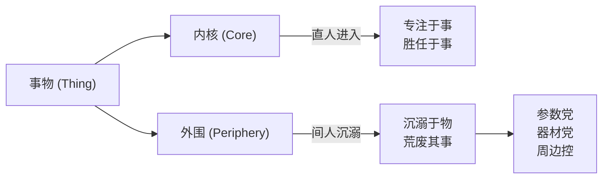

---

## 2. 核心架构 - 层层围观的认知结构

### 2.1 外围档的普遍存在

"差生文具多"现象普遍存在于这个世界的一切领域：
- 相比于摄影本身，他们更热衷于研究相机和镜头
- 相比于运动本身，他们更热爱折腾运动的装备

**事物事物，事在先，物在后。**

### 2.2 为什么外围更受欢迎？

外围提供了两个东西：
1. **简明的评价体系** - 参数可以比较
2. **虚假的参与感** - 买了装备就觉得参与了

这两者恰恰是人们构建**自我认同**的基本条件。

> [!TIP]
> **区分内核与外围的不是"事"合"物"，而是"难"与"易"。**

### 2.3 层层围观的金字塔

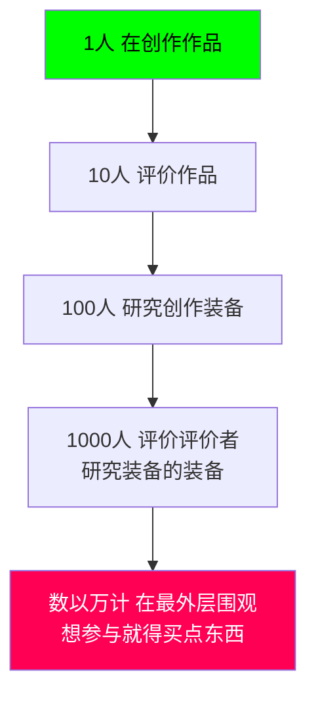

### 2.4 层层围观带来的两个麻烦

**麻烦一：错把评论者当成事物意义的最终代言人**

评论者 = **高级间人**，他们的工作是简化事物的复杂性。

普通间人的操作：
- 不直面困惑
- 而是追究"如何评价XXX"、"如何看待XXX"

这是**间人构建自己世界观融贯性的基本操作**。

**麻烦二：错把对物的消费当成意义实现的最终途径**

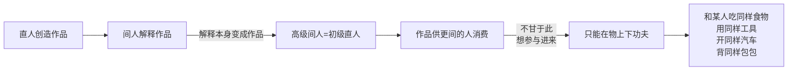

**核心真相：直人生产，间人消费。**

---

## 3. 金钱的本质 - 致间之物

### 3.1 钱的定位

钱是这个世界上**最间的东西之一**：
- 居于外围的外围之外
- 是一切产品的等价物
- 是**致间之物**

### 3.2 钱的悖论

一个自身毫无价值的东西：
- 成了**价值的载体**
- 成了间人所认同的**万物最清晰的评价尺度**
- 成了**最终极的解释依据**

> [!CAUTION]
> **这是人类文化中最根本的倒错现象：中介物与被中介物的倒错。**

### 3.3 两种世界观的战争

| 维度 | 直人世界观 (月亮世界观) | 间人世界观 (六便士世界观) |
|:---|:---|:---|
| **认为什么是表象** | 金钱与权力的流转 | 艺术作品背后的意义 |
| **认为什么是本质** | 人对意义的追求与创造 | 人对金钱与权力的欲求 |
| **金钱的地位** | 创造意义时产生的副产品 | 驱动世界运转的根本力量 |
| **作品的地位** | 意义的载体 | 追求金钱权利时创造的副产品 |

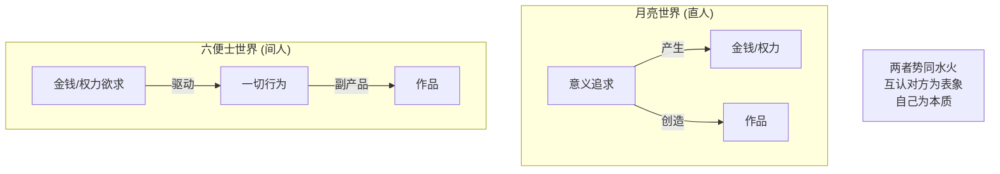

### 3.4 夹层人的悲剧

那句话：
> "一个人如果在14岁的时候不是一个理想主义者，他一定庸俗的可怕；如果一个人在40岁的时候仍然是理想主义者，他又未免幼稚的可笑。"

今天的年轻人被逼无奈**混入了夹层**：
- 有时幼稚的可笑
- 有时庸俗的可怕
- 缺乏因笃信而生的勇气
- 缺乏因偏见而起的鲁莽
- 是**患得患失的机会主义者**
- 像被困住的**布里丹之驴**

**最后的结果：**
- 既不具备生猛的技能收割世俗认同的目光
- 也没办法进入事物的内部转化生命冲动
- 只能发表一些评论或买一些周边来自慰

---

## 4. 两类困难 - 内核之路

### 4.1 困难的定义

当**现状与预期有着巨大的落差**，而且这种落差**无法被清晰认识**的时候，我们会体验到一种叫**困难**的笼统经验。

### 4.2 两类完全相反的困难

| 类型 | 第一类困难 | 第二类困难 |
|:---|:---|:---|
| **来源** | 深刻的神秘 | 肤浅的混乱 |
| **性质** | 无限导致的困难 | 有限导致的困难 |
| **特征** | 不存在标准流程 不存在公认评价体系 展现事态的无限可能性 | 参与者都有同样目标 资源有限 竞争白热化 |
| **场景** | 写出好文章 画出美丽作品 进入月亮世界的内核 | 中彩票 财务自由 坐拥香车美女 进入六便士世界的内核 |
| **约束** | 无限性：人人都有腾挪空间 | 有限性：大多数人注定匮乏 |

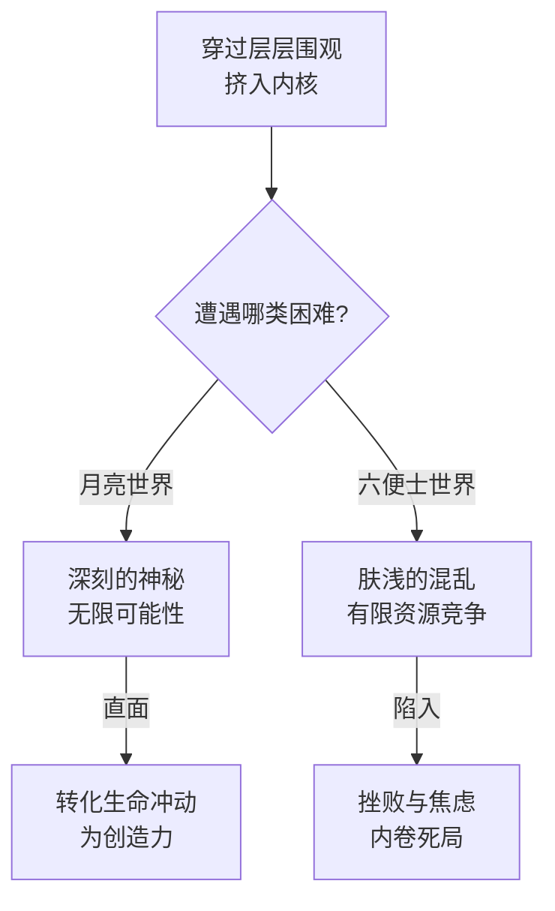

### 4.3 反直觉的真相

> [!WARNING]
> **把金钱当做欲求的目标，其实是选择了一条最容易走的路。**

为什么？
- 不涉及任何自我反思和自我辩证
- 是我们**动物精神的直接延伸**
- 只不过由于人人都如此，选择它变得非常困难

**结论：逃避直人的困境，就会陷入间人的死局。**

---

## 5. 三重倒错 (Three Inversions)

### 5.1 第一重倒错：中介物与价值

| 表象 | 实质 |
|:---|:---|
| 金钱是价值的度量 | 金钱本身毫无价值 |
| 价值来自金钱 | 金钱只是中介物 |

### 5.2 第二重倒错：理性与非理性

**根本上的非理性被当成了根本的理性。**

| 庸众认为 | 实际上 |
|:---|:---|
| 追求金钱是理性选择 | 是非理性的动物精神延伸 |
| 理想主义/艺术追求是非理性 | 是最理性的选择 |

**为什么追求创造是最理性的？**
> 每个人都能在展开自己的同时，**不挤压他人的生存空间**。

### 5.3 第三重倒错：当下瞬间与时间

**唯有时间能够摧毁神秘无限。深陷时间的人是最间的人。**

通过**贴现思维**，人们终结了无限解释的神秘循环：
- 一个商品有没有价值不重要了，只要有人愿意接盘就够了
- 我的人生有没有意义也不重要，只要别人觉得我找到了意义就可以了

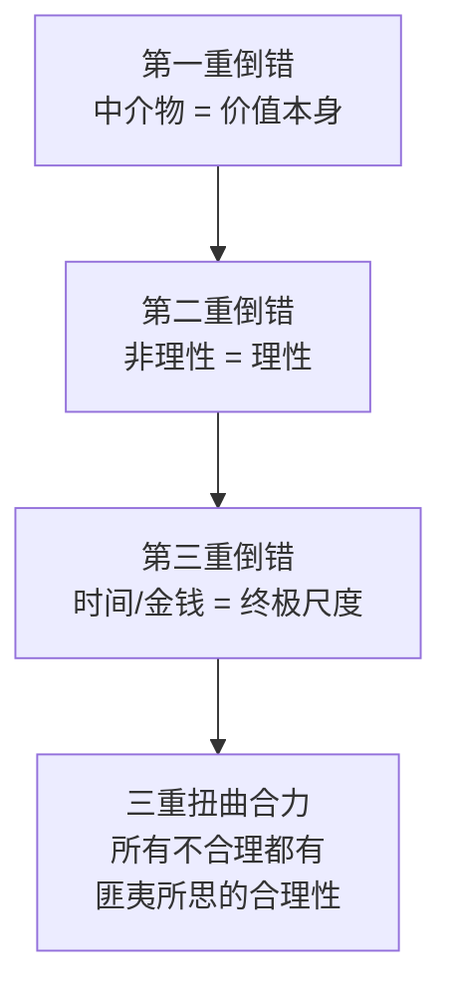

---

## 6. 价值的真正来源 - 无限与神秘

### 6.1 奇怪的现象

某位创作者的作品看似平平无奇，甚至潦草简陋，却能在市场上卖出天价。

**从内核与外围的角度解释：**
- 最内核的真迹对最外围的金钱构成了一种**蔑视**
- 某物是无价的，如果你非要买，就标出毫无道理的天价
- **不是真迹贵，而是在真迹面前，钱变间了**

**从有限与无限的角度解释：**
- 精明商人愿意一掷千金购买艺术品
- 因为判定这些艺术品将来会被其他人以更高价格接盘
- **无限可接盘性 ← 无限可解释性 ← 无限想象空间**

### 6.2 语言与价值的同构性

100多年前，语言学家分析语言的意义：
> "概念纯粹是表示差异的，不能根据其内容从正面确定它们，而只能根据它们与系统中其他成员的关系来确定它们的确切特征——它们**不是别的东西**。"

- 我们不知道"美"这个概念意味着什么，但我们知道**美是不丑**
- 我们不知道"善"意味着什么，但我们知道**善是不恶**

**差异 → 交流 → 更多差异 → 更多交流**

这个循环永远不能被彻底描述：
> 我们永远觉得有些东西没有被表达出来，总是差那么一点意思，正是**这点意思**驱动着我们不停的交流。

### 6.3 意义来自于被解释的潜力

**解释永远需要更多解释来解释。**

同样的逻辑适用于商品的价值：
> "一个商品如麻布，其价值相对的表现在其他一切商品的无限系列之上。"

**差异导致流通，流通导致更多差异。**

例如：同样一个包包
- 在法国工厂里：一只包包
- 在中国商场里：一只**法国的**包包 → 更贵

商家的利润来自于商品在流通中获得的**新的差异性**。

### 6.4 品牌 = 商业世界的黑话

人们试图解释"法国"背后的差异：浪漫、贵族、奢华、优雅……但总是**不止于此**，总是差那么一点儿意思。

> "一件商品只要被这些品牌附身，价值就会原地飙升。"

**品牌就是商业世界的黑话：**
- 圈内人用它标榜自身
- 圈外人对此不明觉厉

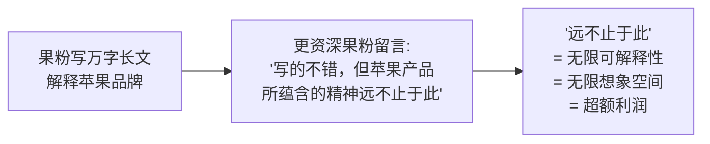

---

## 7. 执行协议 - 如何进入月亮世界

### 7.1 一念之间

世界的切换只在**一念之间**：
- **Positive (肯定的、积极的、阳性的)** → 陷入肤浅的混乱
- **Negative (否定的、消极的、阴性的)** → 把自己逼入深刻的神秘

### 7.2 写作的三种状态

| 状态 | 本质 | 自我意识 | 比喻 |
|:---|:---|:---|:---|
| **拼凑状态** | 增加/积累 | 高度介入 | 搭积木 |
| **推敲状态** | 删减/选择 | 高度介入 | 雕刻 |
| **灵感状态** | 自发流淌 | 不介入 | 最理想 |

**核心原则：**
- 如果自我意识一定要介入，那么一定是**推敲越多越好**
- 拼凑和推敲的占比直接决定文章质量
- **深刻就是深深雕刻的结果**

> [!TIP]
> **快写慢改原则：** 通过快写逼自己跳过拼凑思维进入灵感流淌状态，再通过慢改来仔细推敲。

### 7.3 大卫的启示

> "大卫本来就在石头里，他只是把不要的部分去掉而已。"

**但咱们好歹得有个石头吧。**

拼凑 = 自我肯定的思维
推敲 = 自我否定的活动

> [!IMPORTANT]
> **所有的庸俗都来自于自恋，所有的深刻都来自于自反。**

### 7.4 宽进严出原则

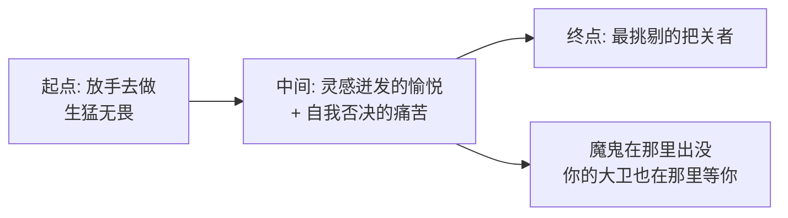

---

## 8. 盖楼与挖洞

### 8.1 两种努力的比较

| 维度 | 盖楼 (庸俗的肯定性努力) | 挖洞 (深刻的否定性努力) |
|:---|:---|:---|
| **性质** | 外显的 | 神秘性的 |
| **姿态** | 炫耀性的 | 吸引性的 |
| **效果** | 攻击性的 | 能吸纳和转化攻击的 |

### 8.2 挖洞的哲学

一位作家讨论人的孤独：
> "人人都是孤独的，但不能因为孤独切断与众人的联系，而应该**深深挖洞**。只要一个劲地往下挖，就会在某处与别人连在一起。"

城市里满眼都是耀武扬威的高楼大厦，那是**庸俗欲望的物化形态**。

但还有一群人在不那么显眼的地方挖出了一道一道神秘的深渊，这深渊成了**容纳人类生命意义的容器**。

### 8.3 性别隐喻

| 世界 | 性质 | 象征 |
|:---|:---|:---|
| 间人的六便士世界 | 男性式/阳性 | 盖楼、技术、膨胀 |
| 直人的月亮世界 | 女性式/阴性 | 挖洞、容器、深渊 |

> 倘若没有广义上的"女性们"持续创造着、维护着那些容器，这个世界恐怕已经被中年男人毁灭了好几次了。

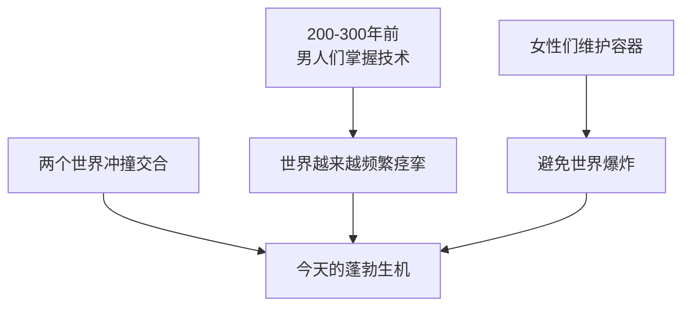

---

## 9. 两把铁锹 - 哲学与艺术

### 9.1 创作者的窘境

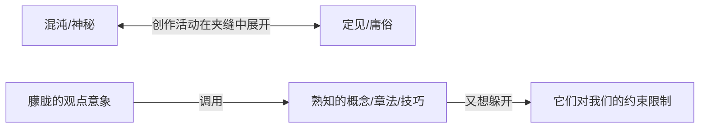

**作家下笔前，纸上已经写满了陈词滥调。**
**画家下笔前，画布上已经布置好了各种规则定式。**

### 9.2 哲学与艺术的定位

| 工具 | 定义 | 诉诸 |
|:---|:---|:---|
| **哲学** | 创造新概念的活动 | 理性与思维 |
| **艺术** | 划破画布的活动 | 感性与直觉 |

两者都是人类直面神秘与混沌、对抗庸俗与定见的**近路**，也是深深挖洞的**两把铁锹**。

**殊途同归：两者都要求人们在面对自己与世界的时候展现出彻底的真诚。**

### 9.3 为什么真诚重要？

孩子从来不需要考虑真诚的问题。但在成长过程中，人们的心灵会被**庸见和倒错所遮蔽**，真诚变成了成年人最宝贵的品质。

**唯有保持真诚，才能在与神秘与混沌的互动中展开自己。**

它与Negative的关系：
> 成年人展现真诚的唯一途径就是**承认自己是不真诚的、是间接的、是虚伪的**。

我们能在洞中扩展自己"不止于此"的可能性，是因为我们能在那里诚实地直面自己的**局限性**。

> [!IMPORTANT]
> **只有在自己狭小的、深不见底的洞中，我们才是真正自由的。**

---

## 10. Anti-Patterns (反模式)

### 陷阱 1: 在外围死磕 (Peripheral Obsession)

**Trap (错误做法):** 花大量时间研究工具、装备、方法论，而不进入事物本身。

**Why (为什么会犯):**
- 外围提供简明的评价体系（参数可比较）
- 外围提供虚假的参与感（买了就觉得懂了）
- 进入内核太难，外围是舒适区

**Fix (如何修正):**
- 强制自己"用破设备做出好作品"
- 用最简陋的工具完成第一个作品
- 先有"事"，再考虑"物"

**Positive Scenario (正向案例):**
汤智本人：不追求设备党的天花板，专注于内容创作本身，用内容的深度建立护城河。

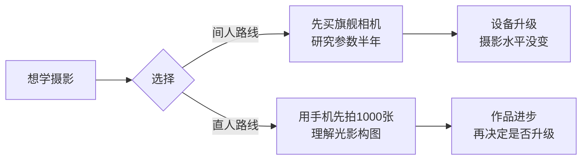

---

### 陷阱 2: 贴现思维 (Discounting Mindset)

**Trap (错误做法):** 用未来预期评价当下价值，把一切都换算成时间和金钱。

**Why (为什么会犯):**
- 化神秘为庸俗，把无限残化为有限
- 目的是评价不可评价之物，操纵不可操纵之事
- 社会默认的"理性"框架

**Fix (如何修正):**
- 问自己：这件事**本身**有没有意义？（不考虑未来回报）
- 做一些"没用"但让你快乐的事
- 警惕"这个能换多少钱"的第一反应

**Positive Scenario (正向案例):**
艺术家创作时不考虑是否能卖出，只追求表达的完整性。结果反而因为真诚而产生无限可解释性，被市场高价追捧。

---

### 陷阱 3: 夹层心态 (Stuck in the Middle)

**Trap (错误做法):** 既想理想主义，又想现实主义，结果两头不靠岸。

**Why (为什么会犯):**
- 表象与本质的倒错让人晕头转向
- 缺乏笃信的勇气，也缺乏偏见的鲁莽
- 是患得患失的机会主义者

**Fix (如何修正):**
- 在某个领域**彻底选择**月亮世界
- 用"挖洞"的方式深耕，而不是"盖楼"铺面
- 接受孤独，放弃被所有人认可的幻想

**Positive Scenario (正向案例):**
村上春树：彻底选择写作这个"洞"，放弃爵士乐酒吧事业，每天早起跑步写作，几十年如一日。

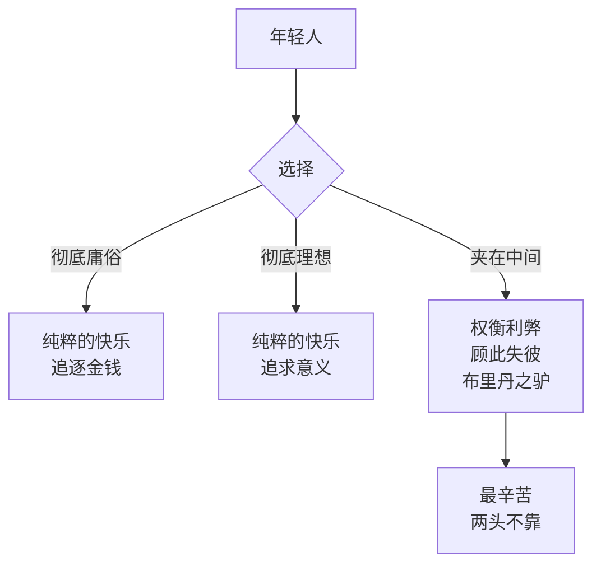

---

### 陷阱 4: 拼凑思维 (Additive Thinking)

**Trap (错误做法):** 创作时只会往上堆东西，不会删减雕刻。

**Why (为什么会犯):**
- 拼凑是自我肯定的思维，让人舒服
- 推敲是自我否定的活动，让人痛苦
- 删掉自己写的东西像割肉

**Fix (如何修正):**
- 快写慢改：先肆无忌惮写出"垃圾"，然后雕刻成佳作
- 每次修改必须删掉至少30%
- 把推敲当作"发现大卫在石头里"的过程

**Positive Scenario (正向案例):**
米开朗琪罗的大卫："大卫本来就在石头里，我只是把不要的部分去掉而已。"

---

## 11. 系统关联 (Interlinkages)

**上游 (Input):**
- 哲学：存在主义、结构主义符号学
- 经济学：马克思资本论（商品价值的差异性）
- 心理学：自恋与自反

**下游 (Output):**
- → `Content_Creation/` 内容创作方法论
- → `Enterprise_Operation_System/` 商业模式设计（品牌 = 黑话）
- → `Cognitive_Philosophy/` 认知哲学体系

---

## 7. Glossary (术语表)

| 术语 | 定义 |
|:---|:---|
| **直人** | 游戏的人、散步的人，生活有自身目的的直接性，进入事物内核 |
| **间人** | 竞争的人、赶路的人，手段与目的分离，满足于外围游荡 |
| **层层围观** | 人类社会中创作者、评论者、消费者形成的金字塔认知结构 |
| **致间之物** | 金钱的本质，居于外围的外围，自身无价值却成为价值度量 |
| **贴现思维** | 用未来预期评价当下价值，化神秘为庸俗的思维方式 |
| **深刻的神秘** | 无限导致的困难，不存在标准流程和评价体系 |
| **肤浅的混乱** | 有限导致的困难，资源有限竞争白热化 |
| **挖洞** | 深刻的、否定性的努力，神秘性、吸引性、能转化攻击 |
| **盖楼** | 庸俗的、肯定性的努力，外显性、炫耀性、攻击性 |

---

## 8. Formula Table (公式表)

| 公式名 | 等式/逻辑 | 变量定义 |
|:---|:---|:---|
| **困难定位** | `困难 = 落差 × 不可认识性` | 落差: 现状与预期的差距; 不可认识性: 无法清晰理解 |
| **价值来源** | `价值 = 差异性 × 可解释性` | 差异性: 与其他事物的区分度; 可解释性: 被解读的潜力 |
| **品牌溢价** | `利润 = 物理价值 + (流通差异 × 想象空间)` | 流通差异: 商品在流通中获得的新差异性 |
| **深刻公式** | `深刻 = 推敲次数 / 拼凑次数` | 推敲: 删减雕刻; 拼凑: 堆积增加 |
| **创作自由** | `自由 ∝ 1 / 洞的宽度` | 洞越窄越深，自由越大 |

---

## 备注与引用 (Notes & References)

**Source Material:**
- 汤智：写给未出生孩子的信（视频/音频转录）

**哲学参考:**
- 索绪尔 (Ferdinand de Saussure)：结构主义语言学，"概念纯粹表示差异"
- 马克思 (Karl Marx)：商品价值的相对表现，"价值相对于整个价值体系而存在"
- 德勒兹 (Gilles Deleuze)：哲学是创造概念的活动
- 村上春树：挖洞隐喻，孤独与创作的关系

**核心金句:**
- "逃避直人的困境，就会陷入间人的死局"
- "所有的庸俗都来自于自恋，所有的深刻都来自于自反"
- "只有在自己狭小的、深不见底的洞中，我们才是真正自由的"
- "大卫本来就在石头里，我只是把不要的部分去掉而已"
