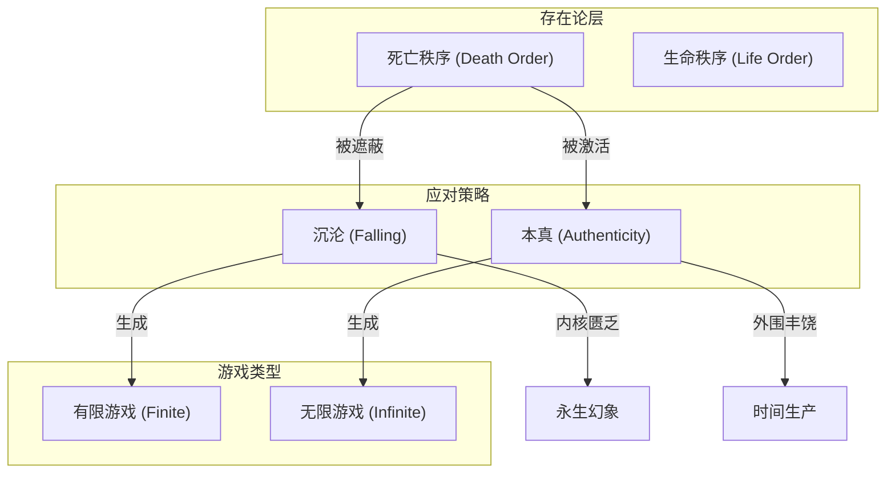
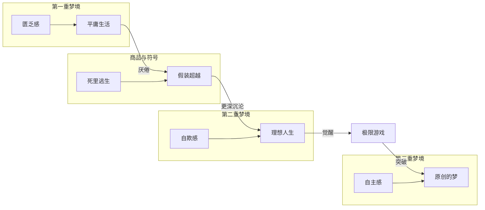
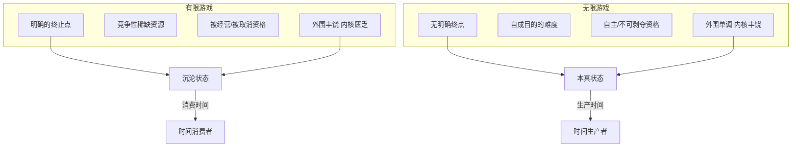
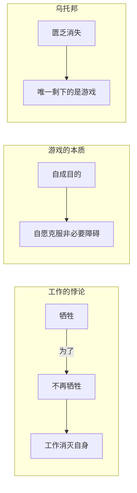
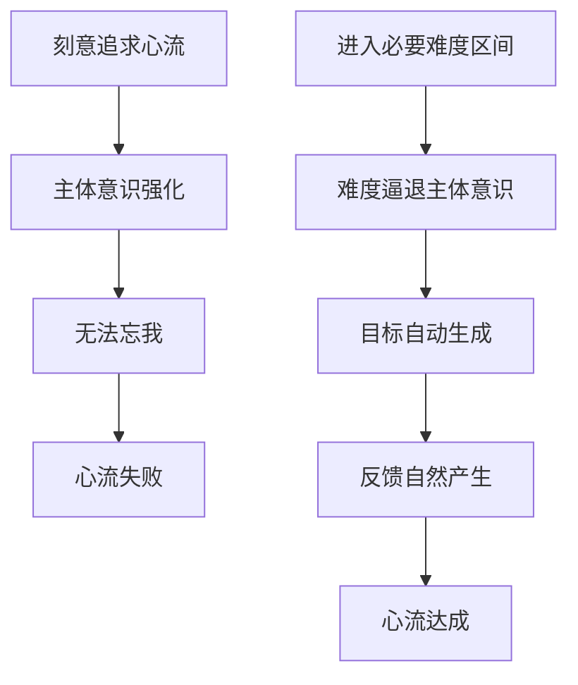
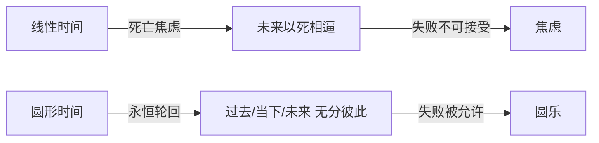
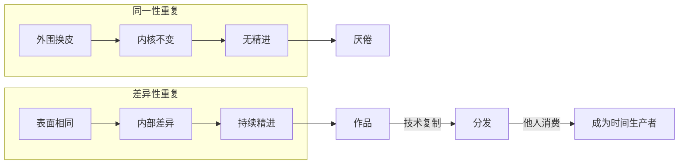
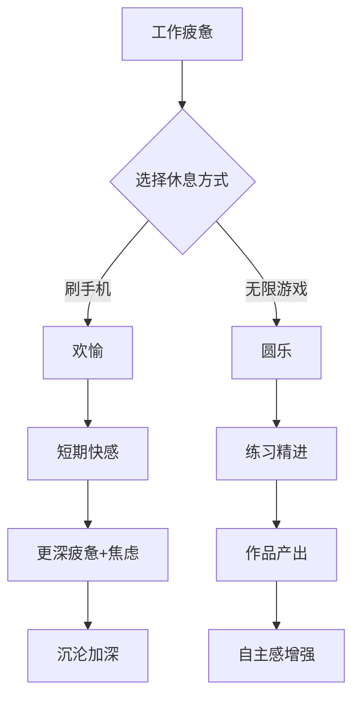
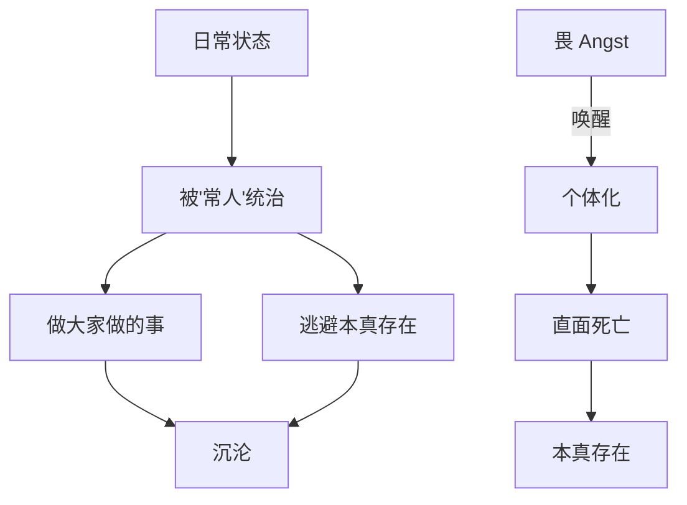
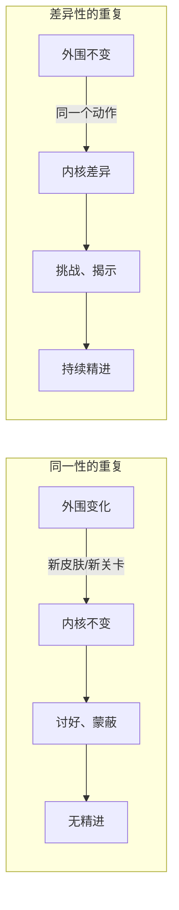

# 死亡与游戏: 必死之人如何有意义地活好无意义的一生

> **Tags:** `Existentialism`, `Game Philosophy`, `Consumer Criticism`, `Flow Theory`
> **Date Added:** `2026-01-11`
> **一句话总结 (One-Liner):** 在永恒轮回之中忘我地掌控自己的命运，是克服死亡焦虑、活出本真生命的核心秘密。
> **关键协议 (Critical Protocol):**
> 1.  **结构服从内容 (Structure Follows Content):** 本模块以信件的逻辑链条为主线组织。
> 2.  **原子级视觉化 (Atomic Visualization):** 每一个重要概念必须配图。
> 3.  **拒绝阉割 (No Summary):** 保留信件中所有核心隐喻和推导过程。

---

## 1. 元认知 (Metacognition) - 为什么需要讨论死亡与游戏？

### 1.1 问题定义

人人都会死，但我们如何面对这个绝对确定的事实？**必死之人如何有意义地活好无意义的一生？**

这个问题的背后是一个悖论 (Paradox)：如果一切终将消亡，那么我们所做的一切有什么意义？

### 1.2 核心哲学

> [!IMPORTANT]
> **核心洞察 (Key Insight):** 大多数人对死亡的恐惧并非恐惧死亡本身，而是恐惧**失去同一性身份 (Identity Loss)**——学历、头衔、职称、财产——这些构成"我"的符号系统的崩塌。这种焦虑被称为**永生幻象 (Immortality Illusion)** 的阴影面。

人们用两种方式回应死亡：
1. **沉沦 (Falling/Verfallenheit):** 用商品、娱乐、符号来遮蔽死亡，制造"死里逃生"的假象
2. **本真 (Authenticity):** 直面死亡秩序，让死亡激发并维持生命秩序

### 1.3 系统定位 (System Role)

本模块是 Asher 认知系统的**存在论根基 (Ontological Foundation)**，回答"为什么要活着"以及"如何活着"的根本问题。它与以下模块高度关联：
- `Default_Mode_Network`: 走神与创造力的关系
- `Philosophy_of_Love`: 生命意义的来源
- `Enterprise_Operation_System`: 有限游戏与无限游戏的商业应用



---

## 2. 核心架构 (Core Framework) - 三重梦境与两种游戏

### 2.1 三重梦境模型 (Three Layers of Dreams)

这是理解全文的核心框架。作者构建了一个"梦境嵌套"模型来描述人类生存状态：

| 梦境层级 | 特征 | 内核 | 玩家状态 |
|:--------|:-----|:-----|:---------|
| **第一重梦境** | 平庸的生活，匮乏感 | 死亡秩序 | 被困住 |
| **第二重梦境** | 理想的人生，丰盛幻象 | 伪生命秩序 | 被欺骗 |
| **第三重梦境** | 自己说了算的原创梦 | 真生命秩序 | 自主者 |

**关键洞察：** 商品、娱乐、符号通过"假装超越秩序来维持秩序"——它们让你以为自己从第一重梦境醒来，实际上只是把你推入第二重梦境，更深的沉沦。



### 2.2 欢愉 vs 圆乐 (Pleasure vs Jouissance)

作者区分了两种截然不同的快感体验：

| 维度 | 欢愉 (Pleasure) | 圆乐/绝爽 (Jouissance) |
|:-----|:----------------|:----------------------|
| **来源** | 对死亡的遗忘和遮蔽 | 对死亡的先行揭示 |
| **机制** | 受控的惊喜，正合我意 | 极限体验，同一性瓦解 |
| **代表** | 购物、刷手机、娱乐消遣 | 极限运动、硬核游戏、创作 |
| **效果** | 加深沉沦，维持幻象 | 打破幻象，接近本真 |
| **哲学对应** | 商业文明的安慰剂 | 向死而生的实践 |

> **隐喻保留 (Asher-ism):** "滑稽作为死里逃生的魔术——小丑通过出洋相，也就是故意的射死来逗乐我们。我们每一次开怀大笑都是幸灾乐祸，每一声哈哈哈哈都可以翻译成：**我还活着，但你死了**。"

### 2.3 有限游戏 vs 无限游戏 (Finite vs Infinite Games)

这是全文最重要的二元对立框架：



**区分三标准：**

1. **自主性 (Autonomy):** 你是否拥有游戏资格的自主权？外界是否可以独断地取消你的参与资格？
2. **重复性质 (Repetition Quality):** 是同一性的重复（粗重、被动）还是差异性的重复（精微、自主）？
3. **生产性 (Productivity):** 游戏过程或结果是否能转化为作品？

| 标准 | 有限游戏 | 无限游戏 |
|:-----|:---------|:---------|
| 自主性 | 资格可被剥夺 | 资格不可剥夺 |
| 重复 | 同一性重复 (换皮不换核) | 差异性重复 (练习精进) |
| 生产性 | 消费时间 | 生产时间→作品 |

### 2.4 蚱蜢悖论 (The Grasshopper Paradox)

> **原典出处：** 《蚱蜢: 游戏、生命与乌托邦》

作者引用这个寓言来揭示工作与游戏的本质差异：

**伊索寓言原版：** 蚱蜢整日歌唱玩闘，蚂蚁辛勤劳动储粮。冬天来临，蚂蚁笑话蚱蜢。

**哲学反转：** 如果没有"冬天"需要防范，蚱蜢的生活方式才是正确的，蚂蚁的生活才是荒谬的。



**游戏的定义 (蚱蜢版):**
> "玩一场游戏，意味着**自愿去克服非必要的障碍**。"

明明可以直奔终点，非要绕圈跨栏跑过去；明明可以用手把球抱进球门，却规定只能用脚踢。这种对效率的**刻意放弃**，正是游戏态度的核心。

---

## 3. 执行协议 (Execution Protocol) - 如何进入无限游戏

### Phase 1: 识别你当前的游戏类型

**诊断问题清单：**

1. 你当前投入最多精力的活动是什么？
2. 如果这个活动的"运营者"倒闭了，你还能继续玩吗？
3. 你在这个活动中的重复是"换皮不换核"还是"每次都有新发现"？
4. 你的努力能转化为可被他人观看/使用的"作品"吗？

| 答案模式 | 判定 |
|:---------|:-----|
| 4个"是" | 你在玩无限游戏 |
| 3个"是" | 你接近无限游戏 |
| 2个"否" | 你在玩有限游戏 |
| 3-4个"否" | 你深陷沉沦 |

### Phase 2: 理解心流的三要素与悖论

**心流 (Flow) 三要素：**
1. 明确的目标
2. 及时的反馈
3. **必要的难度** ← 最关键

**悖论：** 越想进入心流，越难进入。因为心流是**忘我**的状态，刻意追求本身就破坏了忘我。

**解决方案：** 让难度来**逼退主体意识**。



### Phase 3: 掌握"没有必要的必要难度"

这是全文最精妙的概念。它是一种**悖论性的难度**：

- **没有必要：** 游戏目标是无意义的，你不玩不会有现实损失
- **有必要：** 正因为无意义，你的投入是完全自主的，因而产生了真正的意义

```
公式: 真难度 = 无意义目标 × 自主投入 × 永恒轮回机制
```

| 类型 | 目标性质 | 难度性质 | 效果 |
|:-----|:---------|:---------|:-----|
| 沉沦型 | 外部强加的意义 | 伪难度 (被设计欺骗) | 焦虑 |
| 本真型 | 无意义的有意义 | 真难度 (自主挑战) | 圆乐 |

### Phase 4: 建立永恒轮回机制

**游戏最重要的反馈只有一种：失败是被允许的。**

这通过"无限复活"机制来兑现。如果死亡焦虑来自一种"畏"，那么游戏态度就是一种"**无所谓**"——反正我可以死而复生。

> **隐喻保留 (Asher-ism):** "圆形的时间。圆中一天，线上一年。你在其中自转不暇，晕眩、沉迷，直到被线性时间重新捕获。我们看了一眼钟表，发现时间飞逝。"



### Phase 5: 从重复到练习，从练习到作品

**关键转化：**

1. **重复 → 练习：** 不是机械重复 (同一性)，而是精微重复 (差异性)。在看似相同的动作中发现无穷差异。
2. **练习 → 作品：** 将时间凝固成可复制的产物。利用技术分发，让他人消费你的时间。

> **隐喻保留 (Asher-ism):** "无限游戏者不消费时间，而是**生产时间**。你不妨把在书店、商场看见的琳琅满目的作品和商品都看成是被技术压缩过的他人的时间。"



---

## 4. Anti-Patterns (反模式) - 常见的坑

### Trap 1: 把刷手机当休息

- **错误做法:** 工作累了就刷短视频、购物、打网游来"放松"
- **为什么会犯错 (Why):** 商业文明将欢愉包装成"惊喜"，制造了一种"死里逃生"的虚假快感。我们误以为这是在打破沉闘，实际是在加深沉沦。
- **如何修正 (Fix):** 区分**欢愉** (遮蔽死亡) 和**圆乐** (揭示死亡)。真正的休息是从事无限游戏——那些需要练习、能产生作品、不可被剥夺资格的活动。
- **正向案例 (Positive Scenario):** 一个程序员下班后不刷抖音，而是研究开源项目、写技术博客。这既是休息 (切换模式)，又是生产 (创造作品)。



### Trap 2: 追求丰饶幻象

- **错误做法:** 追求财务自由、名利双收，认为达到某个目标后就能"躺平"享受人生
- **为什么会犯错 (Why):** 这是有限游戏的典型特征——设定终止点，觉得达到后就"游戏结束"。商业文明制造丰饶幻象，让围观者觉得自己匮乏。
- **如何修正 (Fix):** 认识到**有限游戏没有真正的终点**——达到目标后会有新目标，退出后会有失落。改为追求无限游戏，享受过程本身。
- **正向案例 (Positive Scenario):** 一个音乐家不追求"出名"，而是追求"每天能练琴"。他的目标是过程本身，不存在"结束"的可能。

> "追求丰饶和优越感的人，最终会发现自己恰恰是那最匮乏、最平庸的人。所有的丰饶和优越都来自于对第一重梦境的虚假超越。他们从未走出过第二重梦境。**他们是最怕死的人**。"

### Trap 3: 游戏降级

- **错误做法:** 成长过程中从孩童的无限游戏降级到成人的有限游戏，被"社会幻象"接管
- **为什么会犯错 (Why):** 社会用"现实"来敦促我们换游戏。父母、学校、职场都在说"别玩了，做正事"。
- **如何修正 (Fix):** 识别那些你从小就喜欢、至今仍能自得其乐的活动，保护并发展它们。如果已经降级，尝试为自己设计"新手任务"重新入门。
- **正向案例 (Positive Scenario):** 作者自述：阅读和抽象思考从"不觉得是游戏"发展成"安身立命之本"；音乐虽然"天赋堪忧"但"割舍不掉"。两者都是无法被取消资格的无限游戏。

| 阶段 | 游戏类型 | 特征 |
|:-----|:---------|:-----|
| 孩童期 | 纯粹无限游戏 | 为玩而玩，无功利目的 |
| 青少年 | 被接管过渡 | 社会开始定义"正确"的游戏 |
| 成人期 | 多数人降级 | 被经营的有限游戏取代 |
| 觉醒后 | 重返无限游戏 | 自主创造第三重梦境 |

### Trap 4: 混淆黑色幽默与鸡汤幽默

- **错误做法:** 用"生死之外都是小事"来安慰自己，然后变本加厉追求永生幻象
- **为什么会犯错 (Why):** 俗语真言成了"佯装反对的隐秘赞同"。说完励志话，继续沉沦。这是第二重梦境的维稳机制。
- **如何修正 (Fix):** 真正的幽默一定是**黑色的**——不试图超越严肃，而是暴露严肃本身的荒诞内核。让自己真正感受到生活的底色，而非逃避它。
- **正向案例 (Positive Scenario):** 一个人看完《西西弗斯的神话》后，不是觉得"人生苦短要及时行乐"，而是体认到"可以想象西西弗斯是幸福的"——因为推石头本身就是他的无限游戏。

---

## 5. 系统关联 (Interlinkages)

### 上游 (Input)
- **依赖前置知识:** 
  - 海德格尔存在主义基础 (Being and Time)
  - 消费主义批判理论 (Baudrillard)
  - 心流理论 (Csikszentmihalyi)
- **推荐阅读:** 
  - 《蚱蜢: 游戏、生命与乌托邦》→ 有限/无限游戏定义
  - 《有限与无限的游戏》→ 本模块直接引用

### 下游 (Output)
- **输出给:** 
  - `Enterprise_Operation_System`: 用有限/无限游戏框架分析商业模式
  - `Default_Mode_Network`: 理解"忘我"状态的神经机制
  - `Lifestyle_Systems`: 设计日常生活中的无限游戏

---

## 6. 深度概念展开

### 6.1 沉沦 (Falling/Verfallenheit)

**人话解释:** 就是"虽生犹死"——表面活着，但精神状态像行尸走肉。

**哲学来源:** 海德格尔《存在与时间》。

**核心机制:**
- 我们被"常人 (Das Man)"统治——做大家做的事，想大家想的法，逃避自己的独特存在
- 沉沦不是道德批判，它是人类此在的**日常结构**——我们天生倾向于沉沦
- 只有**畏 (Angst)** 能把我们从沉沦中唤醒



### 6.2 永生幻象 (Immortality Illusion)

**人话解释:** 我们知道人会死，但总觉得"自己不会"——因为我们把自己等同于那些不会死的符号身份 (学历、职称、财产)。

**核心机制:**
- 商品与符号系统维持着我们的"同一性身份"
- 死亡恐惧被泛化成对身份及配套资源的焦虑
- 这种焦虑本质上是**担心失去本不属于自己的东西**

| 死亡恐惧 | 永生幻象焦虑 |
|:---------|:-------------|
| 低频、根本 | 高频、泛化 |
| 关于肉身消亡 | 关于身份丧失 |
| 难以直面 | 无处不在 |

### 6.3 差异性的重复 vs 同一性的重复

**人话解释:** 
- **同一性的重复:** 刷100个抖音视频，表面不同 (新视频)，内核相同 (多巴胺刺激模式)
- **差异性的重复:** 练100遍同一首曲子，表面相同 (同首曲子)，内核不同 (每次都有新发现)

**哲学来源:** 德勒兹《差异与重复》



### 6.4 魂类游戏作为哲学实验

作者在写这封信时沉迷于一款"魂类游戏" (Soulslike)——以高难度著称，玩家被反复杀死，但乐此不疲。

**魂类游戏揭示的真相：**
1. **我们不惧怕困难，惧怕的是无序和失控**
2. **失败被允许 (永恒轮回机制) 是游戏魔力的核心**
3. **硬核游戏接近无限游戏——挖掘内核多样性，而非堆砌外围内容**

> "深入事物的内核细部之中，外围的形式的幻象会瓦解，事物和其他事物之间的边界变得可以渗透，凝固的分类开始软化……任何领域都是如此，因为任何领域都是游戏。"

---

## 7. Glossary (术语表)

| 术语 | Term | 定义 (人话) |
|:-----|:-----|:------------|
| 沉沦 | Falling | 虽生犹死，被日常秩序吞没 |
| 本真 | Authenticity | 直面死亡，活出自己 |
| 永生幻象 | Immortality Illusion | 把符号身份当成不死的自己 |
| 欢愉 | Pleasure | 遮蔽死亡的虚假快感 |
| 圆乐/绝爽 | Jouissance | 揭示死亡的真实快感 |
| 有限游戏 | Finite Game | 有终点、可被剥夺资格的游戏 |
| 无限游戏 | Infinite Game | 无终点、不可剥夺资格的游戏 |
| 差异性重复 | Repetition with Difference | 在"相同"中发现差异，持续精进 |
| 同一性重复 | Repetition of Same | 换皮不换核，无精进 |
| 游戏态度 | Lusory Attitude | 自愿接受非必要障碍的心态 |
| 必要难度 | Desirable Difficulty | 恰好能逼退主体意识的难度 |
| 永恒轮回 | Eternal Recurrence | 失败可复活，时间成圆形 |
| 时间生产者 | Time Producer | 创造可复制分发的作品的人 |
| 时间消费者 | Time Consumer | 消费他人作品、困在线性时间中的人 |
| 第三重梦境 | The Third Dream | 自己说了算的原创梦，真正的生命秩序 |

---

## 8. Formula Table (公式表)

| 公式名称 | 逻辑表达式 | 变量定义 |
|:---------|:-----------|:---------|
| **圆乐公式** | `Jouissance = Death Exposure × Self-Agency` | Death Exposure: 死亡揭示程度; Self-Agency: 自主感 |
| **沉沦公式** | `Falling = Pleasure × Identity Attachment` | 欢愉越多 + 身份执着越深 = 沉沦越深 |
| **无限游戏判定** | `Infinite = Autonomy × Differential Repetition × Production` | 三要素缺一不可 |
| **心流触发** | `Flow = Difficulty × (1 - Self-Awareness)` | 难度足够高时，自我意识被逼退 |
| **作品转化** | `Work = Repetition × Time Crystallization × Distribution` | 重复练习 → 时间凝固 → 技术分发 |
| **永生幻象强度** | `Illusion = Σ(Identity Symbols) × Social Validation` | 符号越多、社会认可越多，幻象越强 |

---

## 备注与引用 (Notes & References)

### 素材来源
- 父亲写给孩子"木木"的第三封深度信件
- 视频链接: https://www.youtube.com/watch?v=_hQz0suN29c&t=23s

### 主要引用文献
- 海德格尔 (Heidegger), 《存在与时间》(Being and Time)
- Bernard Suits, 《蚱蜢: 游戏、生命与乌托邦》(The Grasshopper: Games, Life and Utopia)
- James Carse, 《有限与无限的游戏》(Finite and Infinite Games)
- Mihaly Csikszentmihalyi, 心流理论 (Flow Theory)
- Roland Barthes, 作者性文本 vs 读者性文本
- Jacques Lacan, Jouissance (圆乐) 概念
- Gilles Deleuze, 《差异与重复》(Difference and Repetition)
- Albert Camus, 《西西弗斯的神话》(The Myth of Sisyphus)

### 田原上的乐队引用
> "用一把吉他买一把吉他，保卫他的生活，直到大厦崩塌。歌曲下面有人评论：有的人30岁就死了，70岁才埋。"
