# 爱的发生学 (The Ontology of Love)

> **Tags:** `Psychology`, `Philosophy`, `Attachment`, `Existentialism`
> **Date Added:** `2026-01-11`
> **一句话总结 (One-Liner):** 成人之爱不是孩童依恋的简单延续，而是一场由偶然性与差异性共同引爆的存在革命——它通过遭遇陌生的他者，瓦解虚假的同一性幻觉，让我们重新获得创造生命意义的主权。
> **来源 (Source):** https://www.youtube.com/watch?v=jU9Q0VTJ6rY

---

## 1. 元认知 (Metacognition) - 为什么要理解"爱"

### 问题定义

"爱"这个词会贯穿人的漫长一生，没有任何词汇能与之竞争。你会在人生各个阶段一再地问：什么是爱？爱是什么？

但人们似乎从来没有达成过共识：
- **诗人说：** 爱把宇宙四散的书页装订成完整的书卷
- **哲学家断言：** 倘若不通过爱，我们没有办法走进真相
- **真言家告诫：** 爱不过是两种幻想的交换和两种表皮的接触
- **科学家解释：** 多巴胺、催产素、睾酮素的作用原理

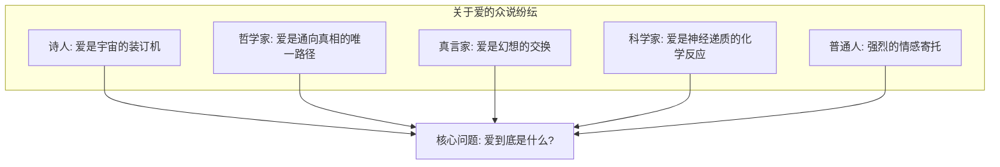
```mermaid
graph TD
    subgraph "关于爱的众说纷纭"
        A["诗人: 爱是宇宙的装订机"]
        B["哲学家: 爱是通向真相的唯一路径"]
        C["真言家: 爱是幻想的交换"]
        D["科学家: 爱是神经递质的化学反应"]
        E["普通人: 强烈的情感寄托"]
    end
    
    A --> F["核心问题: 爱到底是什么?"]
    B --> F
    C --> F
    D --> F
    E --> F
```

### 核心哲学

> [!IMPORTANT]
> **核心洞察 (Key Insight):** 成人之爱不是一种情绪，而是一种**存在革命**。它通过两个革命性要素——**偶然性**和**差异性**——打破我们被虚构的"同一性"牢笼，让我们重新成为生命的主体。

---

## 2. 核心架构 (Core Framework)

### 2.1 爱情是幻觉吗？——情绪二因说的局限

三四百年前，法国真言家就说过："有些人也许永远不会坠入爱河，如果他们从来不曾听到别人谈情说爱的话。"

上世纪七八十年代盛行的**情绪二因说 (Two-Factor Theory of Emotion)** 认为：情绪 = 生理唤醒 + 认知解释。

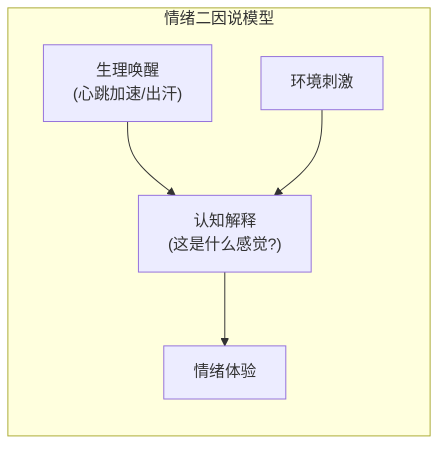
```mermaid
graph LR
    subgraph "情绪二因说模型"
        A["生理唤醒<br>(心跳加速/出汗)"] --> C["认知解释<br>(这是什么感觉?)"]
        B["环境刺激"] --> C
        C --> D["情绪体验"]
    end
```

#### 吊桥实验 (The Capilano Bridge Experiment)

| 实验组 | 场景 | 事后联系率 | 解释 |
|:---|:---|:---|:---|
| **危险吊桥组** | 皮卡兰诺吊桥 (惊险刺激) | **50%** | 心慌被误标记为心动 |
| **普通吊桥组** | 普通吊桥 | 10% | 无额外生理唤醒 |

**二因说的结论：** 爱情只是一种"归因错误"——把来自环境的刺激误解释成异性的吸引力。

**但这个解释对吗？**

> 心理标记确实会影响我们对刺激的体验。比如你当众演讲会紧张，如果告诉你"这种紧张有一大半来自兴奋和期待"，你或许会重新处理你的紧张情绪。
> 
> **但爱和紧张完全是两回事。** "爱"这个词背后所指的，绝不是某种情绪那么简单。

---

### 2.2 依恋理论 (Attachment Theory) - 爱的心理学基础

#### 什么是依恋？

英国心理学家**约翰·鲍比 (John Bowlby)** 在上世纪50年代提出依恋理论。核心观点：

> **"人的依恋行为系统，从摇篮到坟墓，一直都是活跃的。人生下来就是关系的寻求者，只要触摸就会感觉到舒适。"**

依恋理论为爱情提供了一个新的解释基点：**依恋需求才是一切情绪的发源地。**

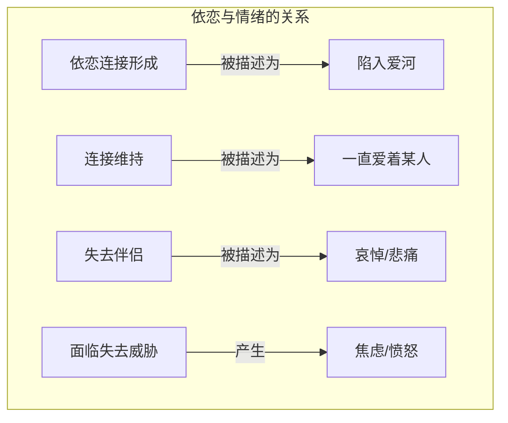
```mermaid
graph TD
    subgraph "依恋与情绪的关系"
        A["依恋连接形成"] -->|"被描述为"| B["陷入爱河"]
        C["连接维持"] -->|"被描述为"| D["一直爱着某人"]
        E["失去伴侣"] -->|"被描述为"| F["哀悼/悲痛"]
        G["面临失去威胁"] -->|"产生"| H["焦虑/愤怒"]
    end
```

**吊桥实验的重新解读：** 不是"心慌被解释成心动"，而是**危险环境激发了更多的依恋需要**。

#### 依恋理论的核心结论

> **成人对异性的爱 = 婴儿对双亲的依恋**
> 
> 本质上是同一过程的不同说法。你长大后在恋人那里所要的东西，和你在爸爸妈妈那里所要的东西，本质上是一样的。这个东西叫**回应**——具体说，是对个体亲近愿望的回应，它是一切安全感的来源。

---

### 2.3 三种依恋类型 (Attachment Styles)

当回应**成功**时，我们获得**安全感**。

当回应**失败**时，我们触发**二级策略**：

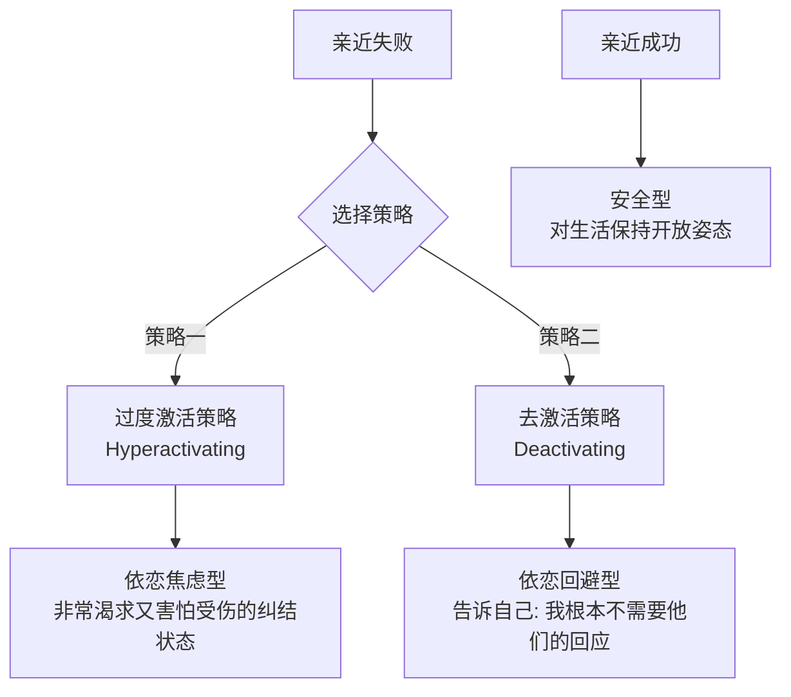
```mermaid
graph TD
    A["亲近失败"] --> B{"选择策略"}
    B -->|"策略一"| C["过度激活策略<br>Hyperactivating"]
    B -->|"策略二"| D["去激活策略<br>Deactivating"]
    
    C --> E["依恋焦虑型<br>非常渴求又害怕受伤的纠结状态"]
    D --> F["依恋回避型<br>告诉自己: 我根本不需要他们的回应"]
    
    G["亲近成功"] --> H["安全型<br>对生活保持开放姿态"]
```

#### 三种依恋类型详解

| 类型 | 心理状态 | 外在表现 | 深层机制 |
|:---|:---|:---|:---|
| **安全型** | 信任、开放 | 自信、情绪稳定 | 持续得到及时回应 |
| **焦虑型** | 渴求又害怕 | 敏感焦灼/过度依赖 | 过度激活策略 |
| **回避型** | 麻木、"不需要" | 表现自信骄傲 | 去激活策略 (补偿) |

> **关键洞察：** 世人的行为表现千奇百怪，但内心深处无外乎**三种底色**：
> 1. 有爱的人 (安全型)
> 2. 缺爱的人 (焦虑型)
> 3. 明明缺爱却说自己什么也不缺的人 (回避型)

#### 依恋状态的动态轮转

一个人不会抽象地完全属于某种类型。在更具体的层次上，我们的心绪常常在三种类型之间轮回：

```mermaid
graph LR
    A["发信息给恋人"] --> B["对方没有及时回复"]
    B --> C["焦虑<br>(匮乏/不安)"]
    C --> D["对方持续冷落"]
    D --> E["回避<br>(自我劝解: 我没那么在乎)"]
    E --> F["对方终于回应"]
    F --> G["安全<br>(获得安全感)"]
    G --> A
```

> **自信不是装出来的，自信是爱出来的。** 在成长过程中总是能够得到及时回应的人，未来会更少地陷入焦虑与回避，对生活保持更开放的姿态。

---

### 2.4 成人之爱的独特性——超越依恋

依恋理论的结论——"成人之爱是孩童依恋的延续"——**只对了一半**。

在**心理层面**，成人之爱确实是依恋情结的延续。
但在**身体与精神层面**，发生了巨大的变化，使得成人之爱明显区别于其他任何形式的爱。

> **成人的爱情是我们生命中第一次遭遇到一个完整又陌生的他人时产生的特殊体验。**

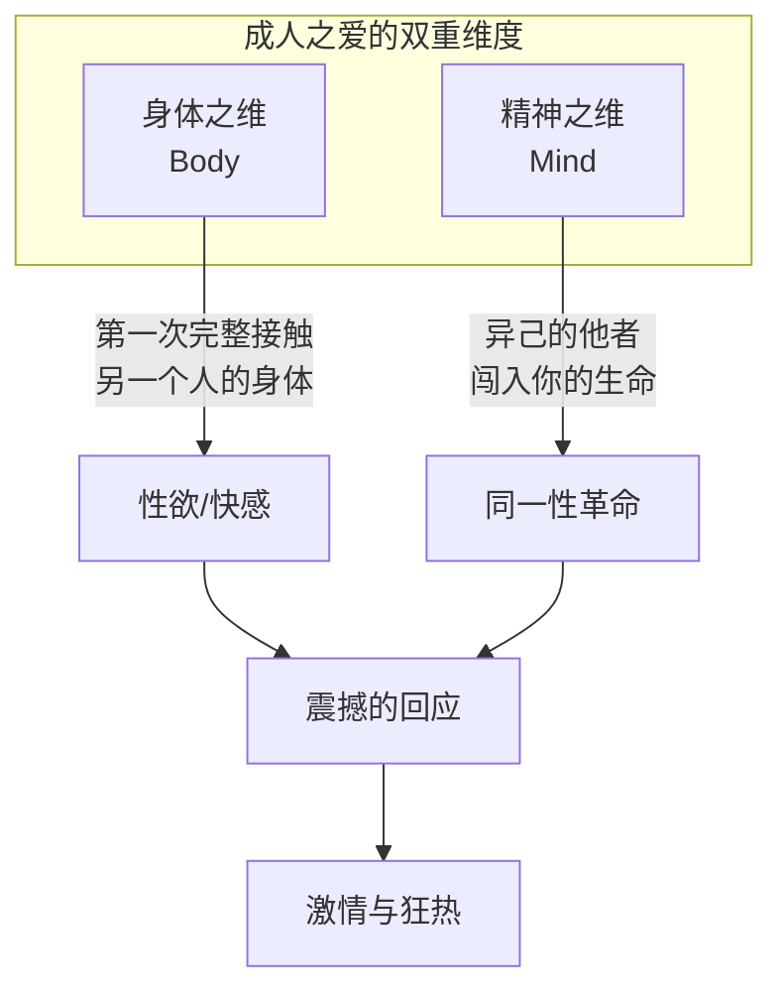
```mermaid
graph TD
    subgraph "成人之爱的双重维度"
        A["身体之维<br>Body"]
        B["精神之维<br>Mind"]
    end
    
    A -->|"第一次完整接触<br>另一个人的身体"| C["性欲/快感"]
    B -->|"异己的他者<br>闯入你的生命"| D["同一性革命"]
    
    C --> E["震撼的回应"]
    D --> E
    E --> F["激情与狂热"]
```

---

## 3. 两个革命性要素

### 3.1 第一个要素：偶然性 (Contingency)

#### 同一性危机 (Identity Crisis)

心理学家**埃里克森 (Erik Erikson)** 将人生发展分为8个阶段。青春期的关键冲突是**同一性与角色混乱**。

青春期至少有三件事同时发生：
1. 二次发育开始，性意识萌发
2. 自我意识越来越清晰，格外在意他人评价
3. 社会身份越来越丰富 (孩子/学生/未来的职业人)

克服同一性危机的关键品质是**忠诚**——一种近乎盲目的信仰式忠诚，确保生活的一致性与连续性。

但问题来了：

> **在最根本的意义上，所谓的"连续性与一致性"是一种幻觉。** 生活当真有"正轨"吗？忠诚往往需要某种不自觉的**自欺**才能实现。

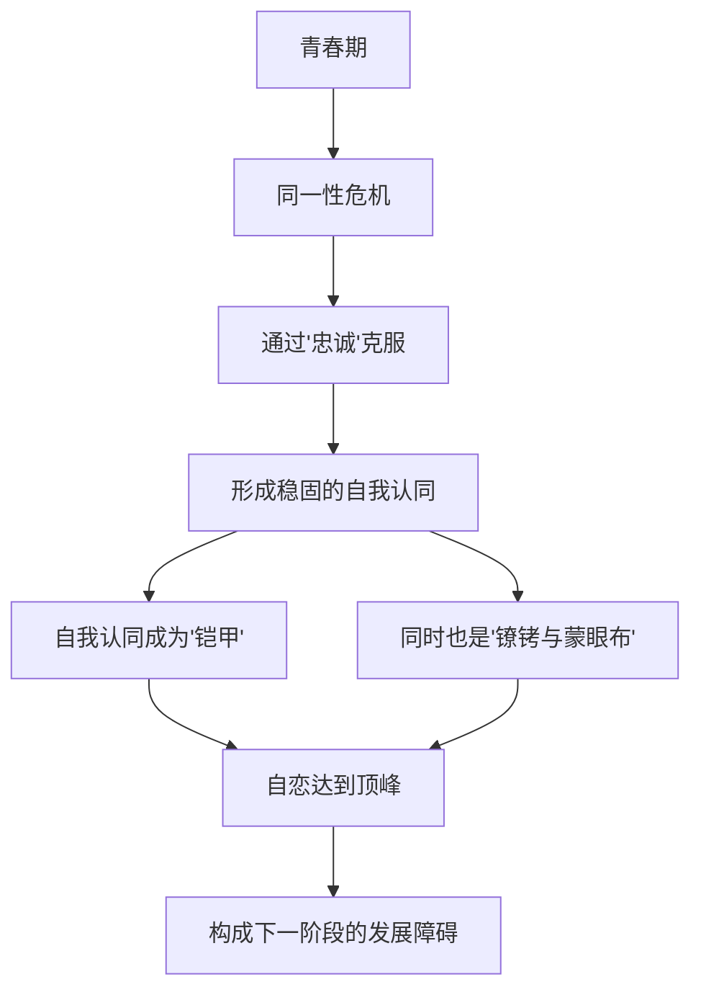
```mermaid
graph TD
    A["青春期"] --> B["同一性危机"]
    B --> C["通过'忠诚'克服"]
    C --> D["形成稳固的自我认同"]
    D --> E["自我认同成为'铠甲'"]
    D --> F["同时也是'镣铐与蒙眼布'"]
    
    E --> G["自恋达到顶峰"]
    F --> G
    
    G --> H["构成下一阶段的发展障碍"]
```

#### 爱情作为"事件"

> **"爱情是一场遭遇。这就是为什么大多数语言把爱情描绘成坠落的原因。"**

爱情几乎是生命中最大的事情。你过着轻松的日子，有一份工作，偶尔见见朋友，忽然间——

> 很巧的，你在街上被什么绊倒，一个他把你拉了起来，四目相对间，你们相爱了。
> 
> 这是**完全巧合的遭遇**，但就是这样的偶遇会改变我们的一生。一切都变了，你不懂怎么就一切都变了。

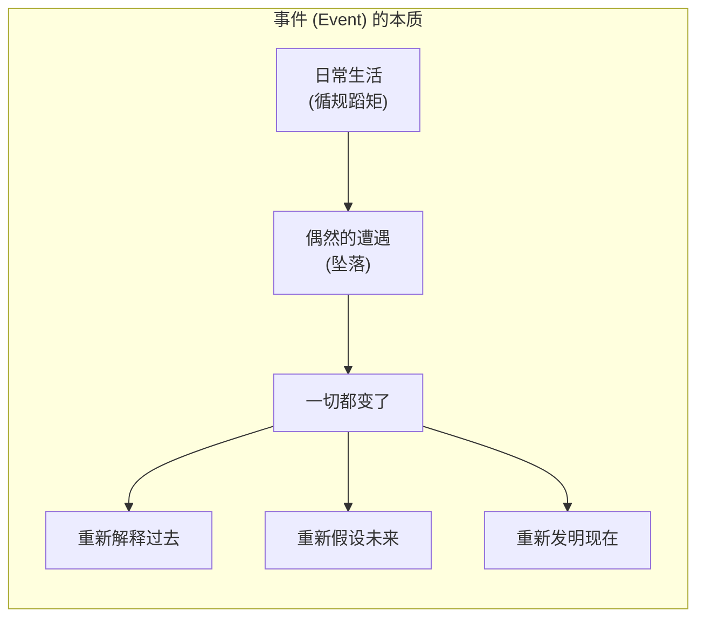
```mermaid
graph LR
    subgraph "事件 (Event) 的本质"
        A["日常生活<br>(循规蹈矩)"] --> B["偶然的遭遇<br>(坠落)"]
        B --> C["一切都变了"]
        C --> D["重新解释过去"]
        C --> E["重新假设未来"]
        C --> F["重新发明现在"]
    end
```

#### 偶然与必然的辩证

你以为自己生活在巨大的**必然性**之中，偶尔有些小意外。

**爱情的出现提醒你：偶然性才是生命的底色。** 生命本身就是最意外的事件。

> 你甚至会不由自主地觉得，你过去的一切都是为了成就这个无与伦比的时刻。
> 
> **"我这一生都在等你"**——这就是爱情的幻觉，也是爱情的真实。

| 对比项 | 日常视角 | 爱情视角 |
|:---|:---|:---|
| **本体论** | 必然性是底色 | 偶然性是底色 |
| **认识论** | 知识可以解释一切 | 有些事无法解释 |
| **时间观** | 过去决定现在 | 当下重新定义过去 |
| **主体性** | 被动接受生活 | 主动创造意义 |

---

### 3.2 第二个要素：差异性 (Difference)

#### 从"一"到"二"

> **"当我们从二而不是从一出发来体验世界的时候，我们所体验到的世界是怎么样的？从差异性而不是从同一性来体验世界的时候，世界到底是什么样子的？"**

一位女哲人这样描述：

> 女人试图用他的眼睛去观察他，阅读他看的书，喜欢她喜欢的话和音乐。只对同他一起欣赏的风景和来自他的想法感兴趣。世界的中心不再是她所在的地方，而是意中人所在的地方。

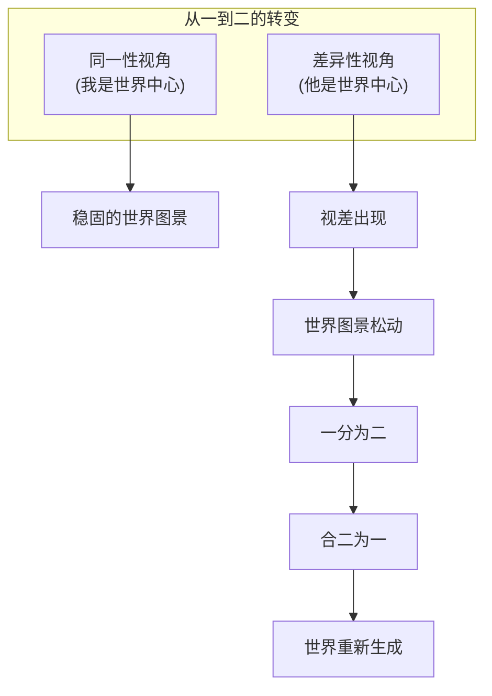
```mermaid
graph TD
    subgraph "从一到二的转变"
        A["同一性视角<br>(我是世界中心)"]
        B["差异性视角<br>(他是世界中心)"]
    end
    
    A --> C["稳固的世界图景"]
    B --> D["视差出现"]
    D --> E["世界图景松动"]
    E --> F["一分为二"]
    F --> G["合二为一"]
    G --> H["世界重新生成"]
```

#### 差异带来的创造力

恋人会察觉到**视差**的存在，产生一种冲动：
- 想要借对方的眼睛**看**
- 想要借对方的耳朵**听**
- 想要用对方的头脑去**思考**
- 想要把自己体会到的一切美妙经验**分享**给对方

> 一个平时少言木讷的人，很可能在恋爱中变成一个颇有灵气的诗人、歌手、小说家、演说家、画家，甚至手工艺人。
> 
> 总之，**他成为一个创造者，一个见证了并参与了世界生存的人。**

---

## 4. 爱与存在 (Love and Being)

### 4.1 两种爱情观的对立

| 爱情观 | 核心主张 | 态度 |
|:---|:---|:---|
| **存在主义爱情观** | 爱是存在的真相，激情是解放 | 拥抱偶然与疯狂 |
| **心理健康功利主义** | 爱应该舒适、安全、理智 | 规避痛苦与风险 |

现代社会的主流是后者：

> 理想爱情应该是一种平衡的理智与情感、物质与精神，令人感到舒适与安全，相互支持且不会侵蚀彼此独立性与完整性的完美关系状态。

这种爱情观要求**爱情定义与健康福利的定义相一致**——所以根本上拒绝痛苦与受难。

> 若爱情是痛苦的来源，那它必定是个错误。

### 4.2 爱是最真实的存在

> **"必须承认，人的生存有些灰暗的一面。一个人只要活着，就不会知道他为什么活着。孤独是人生的底色，唯独在爱时是例外的。"**

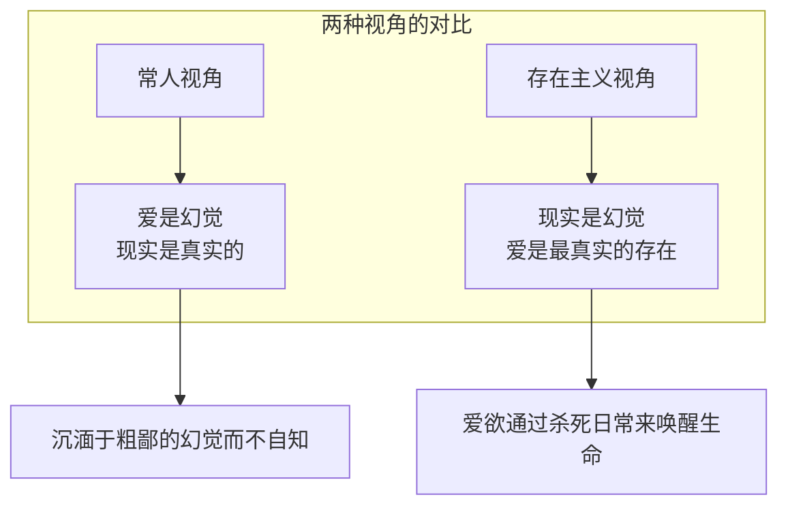
```mermaid
graph TD
    subgraph "两种视角的对比"
        A["常人视角"] --> B["爱是幻觉<br>现实是真实的"]
        C["存在主义视角"] --> D["现实是幻觉<br>爱是最真实的存在"]
    end
    
    B --> E["沉湎于粗鄙的幻觉而不自知"]
    D --> F["爱欲通过杀死日常来唤醒生命"]
```

> **爱不是蒙蔽了我们的双眼，而是重置了我们被社会规训好的评价体系。**
> 
> 恋爱中的人确实能看到对方身上的赘肉、肥油和斜眼。更奇怪的是，他们不在乎这些缺点，甚至有可能发现这些缺点令他们着迷。

### 4.3 山村傍晚的隐喻

> 把手轻搭在爱人的肩上，在夕阳西下即将隐入远处的山峦，树影婆娑，草地宛如镀金，归巢的牛羊成群结队。
> 
> 我知道我的爱人亦在静观这一切，静观**同一个世界**。要知道这一点，我无需看他的脸，无需语言，因为此时此地，两人都已融入同一世界之中。
> 
> **当此际，爱就是这种悖论——同一的差异性与差异的同一性。**

---

## 5. Anti-Patterns (反模式)

### 陷阱 1：把爱当作"情绪"来管理

- **Trap:** 试图用理性分析、利弊权衡来"管理"爱情
- **Why:** 现代社会的功利主义教育，把一切都转化为可优化的目标
- **Fix:** 认识到爱是一种存在状态，而非情绪波动
- **Example:** 用打分表评估约会对象的"适配度"
- **Positive Scenario:** 那些经历过刻骨铭心之爱的人，往往在事业上也更有创造力——因为他们学会了"投入"

```mermaid
graph LR
    A["把爱当情绪管理"] --> B["试图优化/控制"]
    B --> C["失去偶然性与差异性"]
    C --> D["爱变得无趣/消亡"]
    
    E["接受爱的存在本质"] --> F["拥抱不确定性"]
    F --> G["获得创造力与意义"]
```

### 陷阱 2：用"回避"伪装成"独立"

- **Trap:** 说"我不需要任何人"，把回避型依恋伪装成独立人格
- **Why:** 去激活策略的补偿机制——得不到的东西就说不重要
- **Fix:** 诚实面对自己的依恋需求
- **Example:** 标榜"单身贵族"，实际上极度渴望被回应
- **Positive Scenario:** 承认自己需要爱的人，往往更容易获得爱

| 表象 | 真相 |
|:---|:---|
| "我一个人也很好" | 我害怕再次受伤 |
| "爱情不重要" | 爱情太重要了所以我不敢触碰 |
| "我很独立" | 我的独立是被迫的 |

### 陷阱 3：把"日常"当作生活本身

- **Trap:** 相信循规蹈矩的生活才是"正轨"，把激情视为危险的偏离
- **Why:** 同一性的铠甲变成牢笼，忘记了偶然性才是生命底色
- **Fix:** 理解日常可能是"更彻底的愚昧"，疯狂之人反而可能是觉醒之人
- **Example:** 放弃追求心爱的人，选择"条件合适"的伴侣
- **Positive Scenario:** 那些敢于"坠落"的人，往往活出了更有意义的人生

---

## 6. 系统关联 (Interlinkages)

- **上游 (Input):**
  - 发展心理学 → 埃里克森的八阶段理论
  - 依恋理论 → 鲍比的依恋行为系统
  - 存在主义哲学 → 萨特、巴迪欧
- **下游 (Output):**
  - 人际关系模块 → 如何识别自己的依恋类型
  - 创造力模块 → 激情作为创造力的源泉
  - 意义与存在模块 → 爱作为存在的理由

---

## 7. Glossary (术语表)

| 术语 | 英文 | 定义 (人话) |
|:---|:---|:---|
| **依恋 (Attachment)** | Attachment | 人生下来就想和别人建立连接、获得回应的本能需求。就像你家的猫喜欢被摸一样。 |
| **情绪二因说** | Two-Factor Theory | 情绪 = 身体反应 + 大脑解释。心跳加速时，你怎么解释它，就产生什么情绪。 |
| **过度激活策略** | Hyperactivating | 得不到回应时，拼命索取、焦虑不安的心理策略。 |
| **去激活策略** | Deactivating | 得不到回应时，干脆说"我不需要"的心理策略。 |
| **同一性 (Identity)** | Identity | 我们拼命维护的"我是谁"的稳定感。其实很多时候是一种自欺。 |
| **事件 (Event)** | Event (Philosophy) | 打破日常的重大遭遇。不是普通的"发生了事情"，而是"改变一切的东西"。 |
| **视差 (Parallax)** | Parallax | 从两个不同位置看同一物体时产生的差异。恋爱中，你开始从对方的视角看世界。 |

---

## 8. Formula Table (公式表)

| 公式名 | 表达式 | 变量定义 |
|:---|:---|:---|
| **情绪二因公式** | 情绪 = 生理唤醒 × 认知解释 | 生理唤醒: 身体反应; 认知解释: 大脑标记 |
| **安全感公式** | 安全感 = 依恋需求 × 回应质量 | 依恋需求: 亲近愿望; 回应质量: 及时性+一致性 |
| **爱情革命公式** | 成人之爱 = 偶然性事件 × 差异性体验 | 偶然性: 无法预测的遭遇; 差异性: 他者带来的视差 |
| **存在悖论** | 同一的差异性 = 差异的同一性 | 透过差异，两人融入同一世界 |

---

## 7. 性欲的符号动力学 (Semiotic Dynamics of Sexuality)

> **本章来源:** 汤时看本治「性的教育，爱的哲学」(前半部)

### 7.1 精神符号的"黑箱" (The Psycho-Semiotic Black Box)

人类产生性行为和性欲的**生理基础**其实差不多——我们都有相似的荷尔蒙和神经递质。但实现性欲的**行动**却千奇百怪。

> **真正难以理解的是这个"黑箱"：**
> 一个外部对象是如何被我们识别为"诱惑"的？
> 这个诱惑又是如何加工于我们的认知的？
> 我们的认知又是如何驱动我们的行动的？

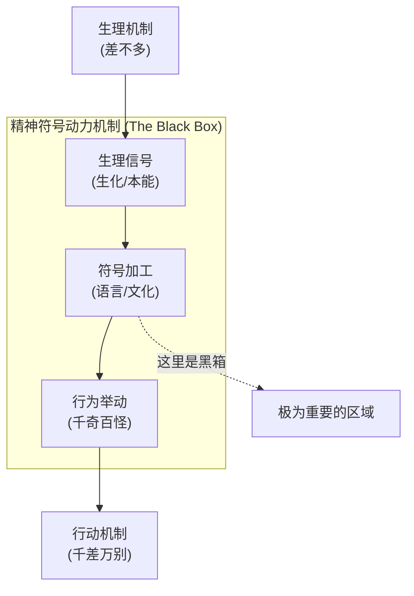
```mermaid
graph TD
    subgraph "精神符号动力机制 (The Black Box)"
        A["生理信号<br>(生化/本能)"] --> B["符号加工<br>(语言/文化)"]
        B --> C["行为举动<br>(千奇百怪)"]
    end
    
    D["生理机制<br>(差不多)"] --> A
    C --> E["行动机制<br>(千差万别)"]
    
    B -.->|"这里是黑箱"| F["极为重要的区域"]
```

哲学家**梅洛-庞蒂 (Merleau-Ponty)** 这样描述这个黑箱：

> "在自动性和表象之间，也就是在生理机制和行动机制之间，有一个**极为重要的区域**。运动可能性、知觉的可能性，甚至智力的可能性就在那里形成。这个区域是原本的世界，具有活力——**把性的价值或意义给予外部刺激，为每一个主体描绘如何使用其客观身体的性爱或性本能性的意义。**"

### 7.2 普遍诱惑理论 (General Seduction Theory - Laplanche)

**弗洛伊德** 最早提出诱惑理论，但他认为诱惑必须是"货真价实的引诱"（如母亲对孩子的身体接触）。

**拉普朗什 (Jean Laplanche)** 将诱惑理论**泛化**：

> 引诱泛指各种来自于成人世界的**性元素**的吸引或干扰——而这种干扰是**孩童的认知没有办法处理的**。

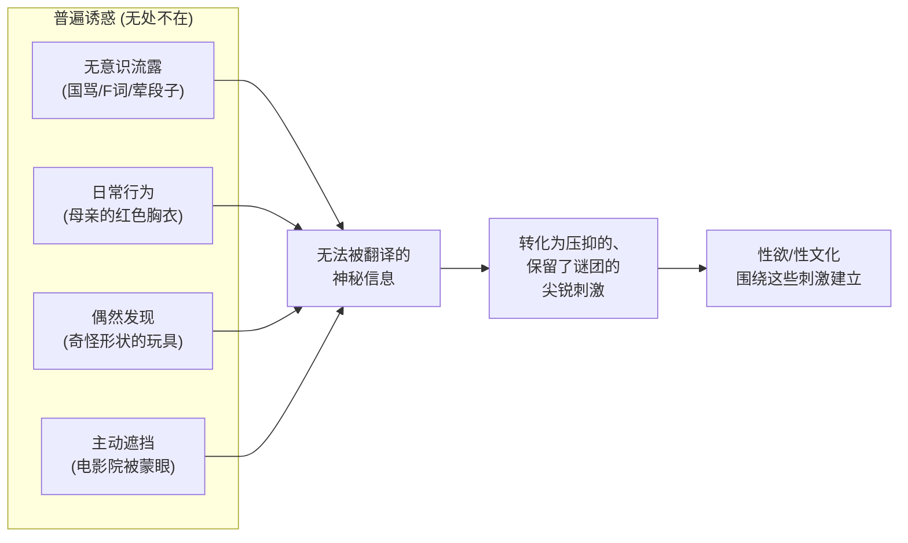
```mermaid
graph LR
    subgraph "普遍诱惑 (无处不在)"
        A["无意识流露<br>(国骂/F词/荤段子)"]
        B["日常行为<br>(母亲的红色胸衣)"]
        C["偶然发现<br>(奇怪形状的玩具)"]
        D["主动遮挡<br>(电影院被蒙眼)"]
    end
    
    A --> E["无法被翻译的<br>神秘信息"]
    B --> E
    C --> E
    D --> E
    
    E --> F["转化为压抑的、<br>保留了谜团的<br>尖锐刺激"]
    F --> G["性欲/性文化<br>围绕这些刺激建立"]
```

| 动物的性欲 | 人类的性欲 |
|:---|:---|
| 基因写死 | 基因 + 早年诱惑经验 |
| 到年纪就发情 | 遭遇被压抑的神秘经验后发育 |
| 满足方式单一 | 满足方式千奇百怪 |
| 没有"性癖" | 各种匪夷所思的性偏好 |

> **关键洞察:** 唯有人类会遭遇这种**早年被引入、同时又被压抑**的经验。正是这种矛盾，催生了各种匪夷所思的性欲求和性满足方式。

### 7.3 被遮挡的视线 (The Hand That Covers Your Eyes)

> **核心隐喻：**
> 孩童时代你和妈妈一起去看电影，眼看着就要播放激情画面了，结果眼前突然一黑——你妈伸手挡住了你的视线。
> 
> 激情的画面消失了，但**奇异的想象开始了**。结合之前的视觉残影，伴随着氛围和声响，悬疑的剧情在黑暗中以一种奇怪的方式继续上演。

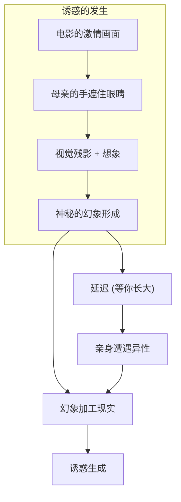
```mermaid
graph TD
    subgraph "诱惑的发生"
        A["电影的激情画面"] --> B["母亲的手遮住眼睛"]
        B --> C["视觉残影 + 想象"]
        C --> D["神秘的幻象形成"]
    end
    
    D --> E["延迟 (等你长大)"]
    E --> F["亲身遭遇异性"]
    
    D --> G["幻象加工现实"]
    F --> G
    G --> H["诱惑生成"]
```

**手掌背后的视觉残影 = 你日后将亲自遭遇的异性酮体和交互画面。**

诱惑就在**两者的时间差**之中产生——神秘的幻象被眼前的经验所唤醒，眼前的经验又被之前的神秘幻象所加工。异性的酮体和交构画面因此被赋魅，变得格外诱人。

### 7.4 神秘信息的暧昧性 (The Ambiguity of Enigmatic Signifiers)

神秘 ≠ 普通的"未知"。真正的神秘对象一定有某种**暧昧性**：

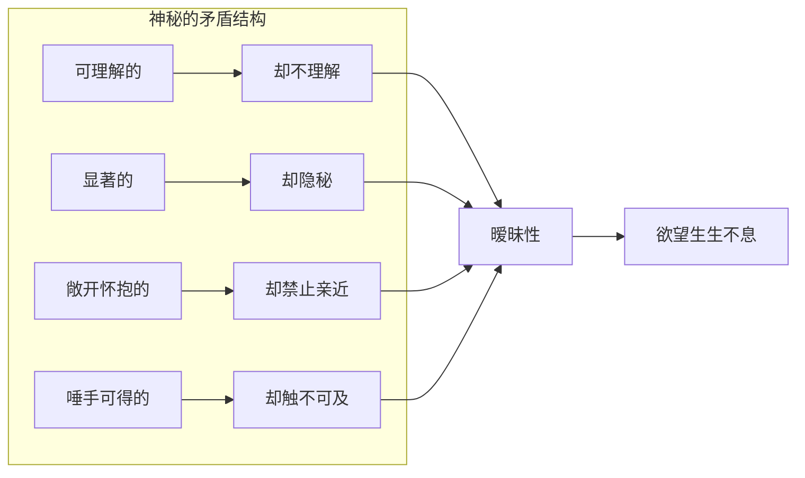
```mermaid
graph LR
    subgraph "神秘的矛盾结构"
        A["可理解的"] --> B["却不理解"]
        C["显著的"] --> D["却隐秘"]
        E["敞开怀抱的"] --> F["却禁止亲近"]
        G["唾手可得的"] --> H["却触不可及"]
    end
    
    B --> I["暧昧性"]
    D --> I
    F --> I
    H --> I
    I --> J["欲望生生不息"]
```

> 成长过程中我们会遭遇很多神秘对象（如星空和自然），但那种神秘是**对称的**——你不知道的，大人也不知道；大人知道的，他不介意告诉你。
> 
> **唯有性的知识和经验是真正具有暧昧性的神秘经验。** 从来没有某种对象，被身边的权威如此地隐晦地彰显、大声地窃窃私语。

| 对称的神秘 | 不对称的神秘（性） |
|:---|:---|
| 大人也不知道 | 大人明明知道却不说 |
| 无暧昧性 | 充满暧昧性 |
| 好奇心 | **欲望** |
| 可以被满足 | 永远"多出来某些东西" |

### 7.5 拉康的欲望理论 (Lacan's Desire Theory)

关联**拉康**的欲望理论，没有任何违和感：

> **性欲**本来是一种本能的**需要 (Need)**。但被成年人的符号秩序拒绝之后，它就会转入地下，以无意识的方式结构起来，产生了**欲望 (Desire)**。

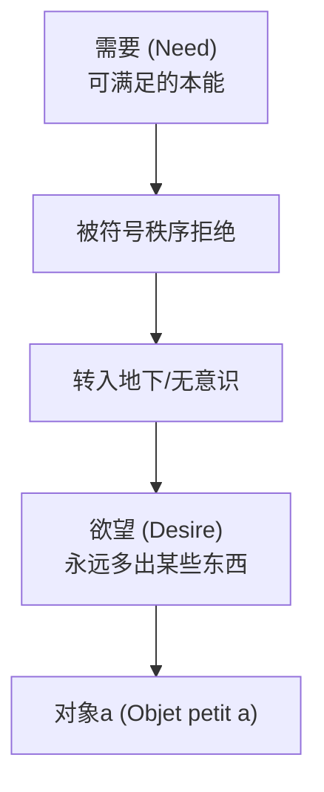
```mermaid
graph TD
    A["需要 (Need)<br>可满足的本能"] --> B["被符号秩序拒绝"]
    B --> C["转入地下/无意识"]
    C --> D["欲望 (Desire)<br>永远多出某些东西"]
    D --> E["对象a (Objet petit a)"]
```

**欲望**相比需要，总是**多出来某些东西**——无法言说、无法描述、永远得不到满足。这个"多出来的东西"被拉康强行指认为**对象a (Objet petit a)**。

> 拉康说：**对象a有一种淫荡性。** 淫荡和暧昧其实是一回事——都是不同程度的诱惑。淫荡是明显的直白的诱惑，暧昧是隐秘的晦涩的诱惑。

---

## 8. 诱惑的泛化 (Generalization of Seduction)

### 8.1 隐喻体系：异性如谜题，交构如解析

从精神与生理结合的角度：

| 阶段 | 生理层面 | 精神层面 |
|:---|:---|:---|
| **探索** | 前戏 | 解谜/探秘 |
| **高潮** | 性高潮 | "这就是答案！" |
| **不应期** | 贤者时间 | "这就是答案？" (脱魅) |

> 高潮之后的不应期（索惠的"贤者时间"）就是**"不止于此"的谜题变成了"仅此而已"的答案之后的祛魅时刻**。精神层面的神秘性伴随着生理层面的性冲动一起消失了，世界在顷刻间丧失了暧昧性和淫荡性。

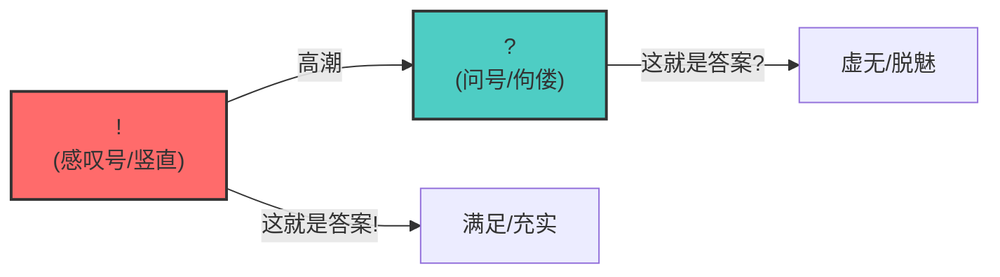
```mermaid
graph LR
    A["!<br>(感叹号/竖直)"] -->|"高潮"| B["?<br>(问号/佝偻)"]
    style A fill:#ff6b6b,stroke:#333,stroke-width:2px
    style B fill:#4ecdc4,stroke:#333,stroke-width:2px
    
    A -->|"这就是答案!"| C["满足/充实"]
    B -->|"这就是答案?"| D["虚无/脱魅"]
```

### 8.2 泛性论的日常隐喻 (Pan-Sexualism in Everyday Life)

> **评测视频是一种刺激的A片。**

开箱博主在开箱时的状态——小心翼翼的、满怀期待的、某种神秘的快感——特别像一个人在脱去异性的衣物。某著名评测人表现出的饥渴感和猥琐感（Awesome! Wow! Beautiful!）具备学术分析的价值。

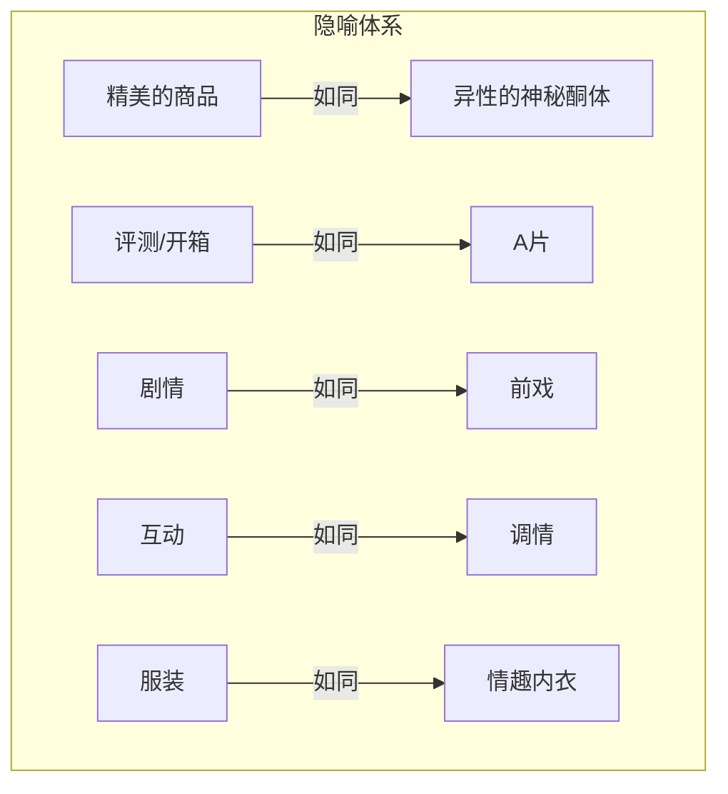
```mermaid
graph TD
    subgraph "隐喻体系"
        A["精美的商品"] -->|"如同"| B["异性的神秘酮体"]
        C["评测/开箱"] -->|"如同"| D["A片"]
        E["剧情"] -->|"如同"| F["前戏"]
        G["互动"] -->|"如同"| H["调情"]
        I["服装"] -->|"如同"| J["情趣内衣"]
    end
```

#### AV的逻辑揭示世界的逻辑

> 在AV的世界里，一切事件——无论是修车、点外卖、理发、还是进行某种特务工作——最终的目标都是为了展开性爱活动。

留言非常有意思：

> "这个逻辑不能被打破。生活不就应该是这样的吗？"

如果把普遍诱惑理论推论到极致：

| 层面 | 日常生活 | 本质 |
|:---|:---|:---|
| **表象** | 表象/手段/铺垫/前戏 | 日常 |
| **本质** | 目的/主旨/真性 | 交构 |

> **好色之徒的心智，其实是人类的普遍心智。** 只是支配的力度和大多数人的自觉程度不同。被强力支配的人就是那些"色令智昏之徒"——"他穿成那样分明是在勾引我！"

### 8.3 三类人的辩证法

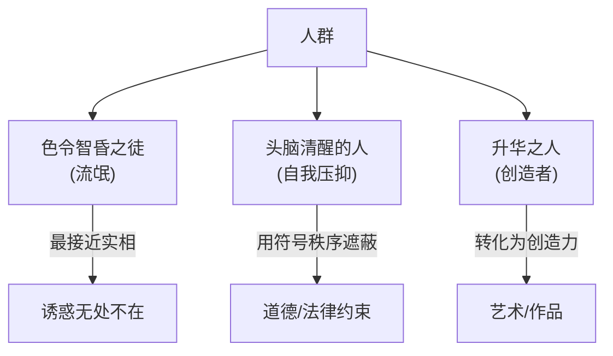
```mermaid
graph TD
    A["人群"] --> B["色令智昏之徒<br>(流氓)"]
    A --> C["头脑清醒的人<br>(自我压抑)"]
    A --> D["升华之人<br>(创造者)"]
    
    B -->|"最接近实相"| E["诱惑无处不在"]
    C -->|"用符号秩序遮蔽"| F["道德/法律约束"]
    D -->|"转化为创造力"| G["艺术/作品"]
```

> 哲学层面上，最接近实相的是**流氓**。文明人认为流氓在狡辩，但在流氓的认知里，他觉得自己说的是彻头彻尾的实话——"他就真的就在诱惑我"。

---

## 9. 美丽面容的辩证法 (Dialectics of Beautiful Face)

### 9.1 辩证法的两个阶段

| 阶段 | 内涵 | 例子 |
|:---|:---|:---|
| **阶段一** | 正反合：矛盾的发现与解决 | 正题→反题→合题 |
| **阶段二** | 表面对立的双方互为基础 | 清醒=抵御诱惑；没有诱惑就没有清醒 |

将这两个阶段引入性欲的讨论：

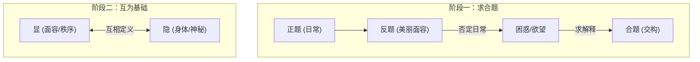
```mermaid
graph TD
    subgraph "阶段一：求合题"
        A["正题 (日常)"] --> B["反题 (美丽面容)"]
        B -->|"否定日常"| C["困惑/欲望"]
        C -->|"求解释"| D["合题 (交构)"]
    end
    
    subgraph "阶段二：互为基础"
        E["显 (面容/秩序)"] <-->|"互相定义"| F["隐 (身体/神秘)"]
    end
```

### 9.2 美丽的脸 = 不自然但有秩序的脸

艺术心理学家**贡布里希 (Gombrich)** 在《秩序感》中写道：

> "自然秩序产生的前提是物理法则要能够在没有相互干扰的孤立系统中起作用。出人意料的秩序正是**混乱与秩序之间的对照**唤醒了我们的知觉。"
>
> "**愉悦在于乏味和杂乱之间。** 单调难以吸引人的注意力，过于复杂则会使我们的知觉系统负荷过重。"

```mermaid
graph LR
    A["均值/普通<br>(无秩序感)"] --- B["美<br>(简洁有序)"]
    B --- C["杂乱/丑<br>(无秩序)"]
    
    D["大众平均脸"] -.->|"不算美"| A
    E["明星脸的平均"] -.->|"真正的美"| B
```

> **美丽的脸 = 不自然但有秩序的脸。** 如果某个人的五官构成一种一眼可辨的秩序感，这种秩序感就会对我们的日常生活构成一种**否定**。

| 秩序感 | 表现 | 心理效应 |
|:---|:---|:---|
| **稀缺** | 人群中只有少数人具备 | 格外引人注目 |
| **跨文化** | 跨地域、跨文化的共性 | 美的普遍标准 |
| **反体** | 否定日常的混乱 | 产生困惑/欲望 |

### 9.3 面容作为反体 (Face as Antithesis)

> **当你注视美女的瞬间，矛盾就产生了，困惑就产生了。你要解释这个困惑，求一个合体——这就是爱欲辩证法的第一个阶段。**

美女的面容否定日常的意思是：

```mermaid
graph TD
    A["美女的面容"] -->|"具有秩序感"| B["让你觉得"]
    B --> C["你的生活是混乱的"]
    B --> D["你的生活是虚假的"]
    B --> E["你的生活是表浅的"]
    B --> F["你没有触达本质"]
    
    C --> G["产生欲望:<br>想要接近本质"]
    D --> G
    E --> G
    F --> G
```

### 9.4 眼与肉的辩证 (Dialectics of Eye and Flesh)

**裸露的面容**和**遮掩的酮体**构成了一种辩证关系：

| 面容 (显) | 身体 (隐) |
|:---|:---|
| 裸露 | 遮掩 |
| 秩序 | 神秘 |
| 正题 | 反题 |
| 可把握 | 待探索 |

> **没有隐的神秘，显的秩序就无法被理解。** 身体的神秘性会直接影响我们对面容秩序的审美偏好。

```mermaid
graph LR
    subgraph "形态学映射"
        A["女性的唇/口"] -->|"映射"| B["性器官形态"]
        C["男性的鼻子"] -->|"映射"| D["性器官形态"]
    end
    
    E["鼻子对男颜值影响大"] --> F["顶级男神的鼻子<br>都有秩序感"]
    G["嘴唇对女颜值影响大"] --> H["大嘴美女<br>性感的唇"]
```

女性主义哲学家**伊利格瑞 (Irigaray)** 说：

> "女人有两张嘴和两副唇，他们的唇处处描绘着深渊，是男性记忆中最初也是最终极的盘桓之地。"

### 9.5 无蔽 (Aletheia) 的时刻

> 面容和酮体同时在场，裸露的同时在场，在精神现象学的层面，就是显隐、秩序与神秘、正体与反体的虚假二元被超越的那个时刻。
>
> 这种突破二元的领悟，在古希腊人那里被称作**无蔽 (Aletheia)**——既非显也非隐，既非神秘也非秩序，是两者的合一。

```mermaid
graph TD
    A["面容 (显/秩序)"] --> C["无蔽 (Aletheia)"]
    B["酮体 (隐/神秘)"] --> C
    C --> D["万物的谜底浮出水面"]
    D --> E["你却发现升起的是一座巨大的冰山"]
    E --> F["答案是一阵神秘的呢喃"]
```

> 你目睹这幅画面，心荡神迷，你终于承认：**这就是生活的本质，这就是生命的真相，这就是意义的终极，这就是最终的答案。**

---

## 10. 反模式补充 (Additional Anti-Patterns)

### 陷阱 4：诱惑的辩证法——羞于谈论反而放大

- **Trap:** 认为不谈论性就能避免问题
- **Why:** 恰恰是因为我们羞于谈论性，总是伸手挡住自己和别人的眼睛，**反而使得诱惑得以完成**
- **Fix:** 如实谈论性的哲学意味，消除过度溢出的神秘性
- **Example:** 那些"彻底真诚"的流氓作品（如某些露骨的评测、偶像剧），因为毫不遮掩，反而消解了扭曲的诱惑

```mermaid
graph LR
    A["遮蔽/压抑"] --> B["神秘性增加"]
    B --> C["诱惑放大"]
    C --> D["扭曲的心态"]
    
    E["如实谈论"] --> F["神秘性消解"]
    F --> G["如其所是的体验"]
```

> **诱惑的辩证法：** 越禁止，越诱惑。

### 陷阱 5：把性物化为商品

- **Trap:** 将性视为可交易的资源、可优化的目标
- **Why:** 现代社会的商品化逻辑渗透一切
- **Fix:** 认识到性从来不是一个对象，它甚至不是你的一部分——**它就是你的本质**
- **Example:** 把性当成"最热销的商品、最能溢价的资源"

> "性不在你之下，也不超越于你之上，它就是你的本质——一个暧昧不明因而生生不息的你的本质。"

### 陷阱 6：追求"完全的脱魅"

- **Trap:** 试图彻底消除性的神秘性，达到"如实观照"
- **Why:** 贤者时间的扩大化——认为这才是"真实"
- **Fix:** 认识到神秘性是生命激情的来源，脱魅不是终点
- **Example:** 长期处于脱魅状态的人会失去制造幻想的能力，眼前的一切还原成物质元素的集合

| 状态 | 特征 | 问题 |
|:---|:---|:---|
| **过度赋魅** | 到处都是诱惑 | 行为失控 |
| **过度脱魅** | 万物丧失意义 | 生命激情丧失 |
| **动态平衡** | 在赋魅和脱魅之间切换 | 健康状态 |

> 失去欲望不是失去性欲这么单纯，而是丧失了**解释未知、触达深沉意义的那个动机**。

---

## 备注与引用 (Notes & References)

- **John Bowlby (约翰·鲍比):** 依恋理论创始人，英国心理学家
- **Erik Erikson (埃里克·埃里克森):** 发展心理学家，八阶段理论
- **Alain Badiou (阿兰·巴迪欧):** 法国哲学家，《爱的多重奏》作者
- **Jean-Paul Sartre (萨特):** 存在主义哲学家
- **Schachter-Singer Theory:** 情绪二因说
- **Dutton & Aron (1974):** 吊桥实验
