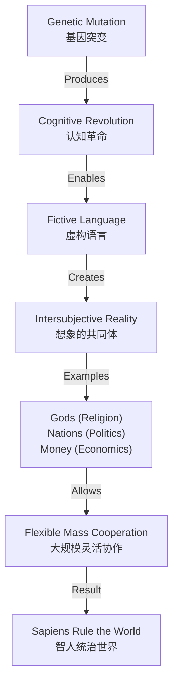
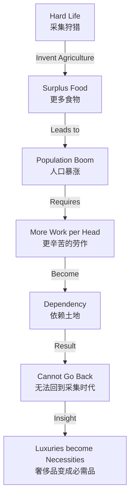
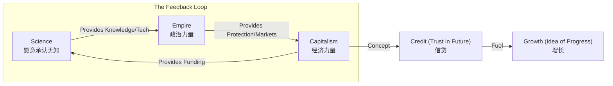

# The Human Story

> **Tags:** `[Philosophy]`, `[History]`, `[Anthropology]`, `[Sapiens]`
> **Date Added:** 2026-01-12
> **一句话总结 (One-Liner):** 智人之所以统治世界，是因为基因突变让我们能讲述并不存在的“故事”（主体间互信），从而实现了大规模灵活协作；而历史就是这些故事（宗教、国家、钱、公司）不断演化并反向驯化人类的过程。
> **关键协议 (Critical Protocol):**
> 1.  **结构服从内容:** 本文遵循《人类简史》的三大革命逻辑（认知、农业、科学）。
> 2.  **原子级视觉化:** 解析抽象的“故事”如何转化为物理力量。
> 3.  **拒绝阉割:** 保留“小麦驯化人”、“想象的共同体”等核心隐喻。

---

## 1. 元认知 (Metacognition)

*Why does this module exist?*

*   **问题定义:** 我们往往认为国家、法律、公司、货币是“客观存在”的实体，但实际上它们只存在于我们共同的想象中。不理解这一点，就无法理解人类社会的运作机制。
*   **核心哲学:** **Intersubjective Reality (主体间现实)** —— 既然这世界是编出来的，那你要做一个被故事驯化的角色，还是做一个改写剧本的作者？
*   **系统定位:** 这是理解所有社会科学（政治、经济、法律）的底层操作系统。

> [!IMPORTANT]
> **核心洞察 (Key Insight):** **Sapiens rule the world, because we are the only animal that can believe in things that don't exist.** (智人统治世界，因为我们是唯一能相信“不存在之物”的动物。)

---

## 2. 核心架构 (Core Framework - The "What")

人类历史是一部不断“挑战与应战”并最终被自己创造的工具（故事+技术）反噬的历史。

### 核心概念 (Key Concepts)

1.  **Shared Fictions (共同想象/故事):**
    *   **定义:** 不存在于物理世界，但存在于所有人的共同想象中，并能对物理世界产生巨大影响的事物。
    *   **例子:** 标致汽车公司（Peugeot）。它不是车，不是工厂，不是经理，它是一个"Limited Liability Company"（有限责任公司）——一个法律虚构的故事。只要大家都信，它就能指挥几万人造车。
2.  **The Trap of Luxury (奢侈生活的陷阱):**
    *   **机制:** 历史的铁律——**奢侈品往往变成必需品，并带来新的义务。**
    *   **案例:** 农业革命。小麦给智人提供了更多卡路里（奢侈），结果却导致人口暴涨，人们被锁死在土地上（必需），生活质量反而下降（义务）。
3.  **The Discovery of Ignorance (发现无知):**
    *   **定义:** 科学革命的起点。前现代知识体系（宗教）认为所有重要知识都已在经典中；现代科学承认“我不知道”，并试图通过观察和数学寻找答案。

### 逻辑推导 (Logic Chain)

---

## 3. 执行协议 (Execution Protocol - The "How")

### Phase 1: 认知革命 - 故事的诞生 (70,000 Years Ago)

*   **动作 (Action):** 识别你身边的“虚构故事”。
*   **心法 (Heuristic):** 区分“由原子构成的”和“由故事构成的”。
*   **细节:** 狮子是客观现实（原子），“狮子守护神”是想象现实（故事）；钱是客观现实（纸/数据），“美元”是想象现实（信用）。

**Reality Spectrum (现实光谱表):**

| 维度 | Objective Reality (客观现实) | Subjective Reality (主观现实) | **Intersubjective Reality** (主体间现实) |
| :--- | :--- | :--- | :--- |
| **定义** | 独立于人的意识之外存在 | 存在于单个人的意识中 | 存在于许多人的**交互**意识网络中 |
| **依赖性** | 不依赖任何人信不信 | 依赖于特定个人的感觉 | 依赖于**群体共识** |
| **例子** | 放射性、重力、病毒 | 头痛、恐惧、爱意 | **法律、金钱、国家、公司、人权** |
| **测试** | 你不信它，它还在吗？→ 在 | 你不信它，它还在吗？→ 不在 | 单个人不信没用，**大家都不信**它就崩塌了 |

### Phase 2: 农业革命 - 驯化的反转 (12,000 Years Ago)

*   **动作:** 警惕生活中的“奢侈陷阱”。
*   **心法:** **We did not domesticate wheat; wheat domesticated us.** (不是我们驯化了小麦，是小麦驯化了我们。)
*   **分析:** 小麦作为一个物种，DNA 拷贝数在这个过程中爆炸性增长（进化成功），但个体智人的生活变得更悲惨（腰椎间盘突出、营养单一、被束缚在土地上）。

**The Luxury Trap Cycle (奢侈陷阱循环):**

### Phase 3: 科学革命 - 力量的结合 (500 Years Ago)

*   **动作:** 理解现代世界的驱动引擎。
*   **心法:** 科学 + 帝国 + 资本 = 现代性。
*   **细节:** 科学需要钱（资本）和保护（帝国），帝国需要武器（科学）和理由（进步），资本需要回报（帝国扩张+科技红利）。

**The Engine of Modernity (现代性引擎):**

### Phase 4: 现代故事 - 自由与消费

*   **动作:** 识别控制你的现代神话。
*   **分析:** 以前信上帝，现在信“自由人文主义”（Liberal Humanism）。
    *   **浪漫主义:** "Listen to your heart" (听从你的内心) -> 你的感觉是最高权威。
    *   **消费主义:** "Just do it" / "Treat yourself" -> 你的快乐可以通过购买获得。
    *   **合流:** 浪漫主义告诉你“要有体验”，消费主义告诉你“去买体验”。

---

## 4. Fact Check & Nuance (事实核查与补充)

> **[USER REQUEST]** 针对用户输入内容的学术核查。

### Check 1: "Wheat Domesticated Humans" (小麦驯化人)
*   **Status:** ✅ **Valid (Evolutionary Perspective)**
*   **Nuance:** 这是一种**演化生物学**视角的修辞。从“基因拷贝数”来看，小麦确实利用人类将其传播到了全球。从“个体幸福感”来看，早期农民确实比采集者更辛苦、营养更差、疾病更多。
*   **Academic Context:** 这一观点并非Harari独创，Jared Diamond 在 *The Worst Mistake in the History of the Human Race* (1987) 中有更激进的论述。

### Check 2: "Cognitive Revolution 70k Years Ago" (70,000年前的认知革命)
*   **Status:** ⚠️ **Hypothesis (Likely but Debated)**
*   **Nuance:** 考古证据显示，大约7万-3万年前，智人确实出现了新的行为（艺术、复杂的工具、跨海迁徙）。但**具体的“单一基因突变”**导致脑部链接改变（Tree of Knowledge mutations）仍是一个**假说**，尚未在基因层面被完全证实。这是一种解释模型。

### Check 3: "Capitalism is a Story" (资本主义是故事)
*   **Status:** ✅ **Valid (Economic History)**
*   **Nuance:** 区别在于对“财富”的定义。
    *   **Pre-modern:** 零和博弈。我的蛋糕大了，你的就小了。财富=囤积的宝藏。
    *   **Modern (Capitalism):** 相信“明天会更好”（Idea of Progress）。财富=用于再生产的资本。基于对未来的**信任（Credit）**。
    *   Harari 的洞察：资本主义不仅是经济理论，更是一种**伦理**（增长就是善，也是正义）。

---

## 5. Anti-Patterns (反模式 - The "Don'ts")

*   **陷阱 1: 混淆“主体间现实”与“虚假”**
    *   *Trap:* 认为“既然国家和公司是编出来的故事，那它们就是假的，甚至不重要。”
    *   *Why:* 愤世嫉俗的虚无主义。
    *   *Fix:* 承认它们虽然在物理上不存在，但在此刻的社会互动中**真实有效**。你不能因为“法律是故事”就去抢银行，因为警察（故事的执行者）会把你抓进监狱（物理现实）。
    *   *Example:* 钱是纸（故事），但没钱会饿死（物理）。

*   **陷阱 2: 误解“自然选择”**
    *   *Trap:* 认为自然选择会让人越来越幸福/进步。
    *   *Why:* 混淆了演化成功（Evolutionary Success）和个体幸福（Individual Well-being）。
    *   *Fix:* 演化只在乎**生存和繁衍**，不在乎你快不快乐。焦虑基因让你通过考试（生存），但也让你痛苦。

*   **陷阱 3: 盲信“客观性”**
    *   *Trap:* 认为现代人比古人更不容易被洗脑。
    *   *Why:* 我们只是换了一套故事（人权、自由、国家），这套故事对我们来说就像空气一样透明。
    *   *Fix:* 经常问自己：**“如果我不相信它，它还存在吗？如果所有人都死了，它还存在吗？”** 如果前者不、后者在，是客观现实；如果全都不在，是故事。

---

## 6. Glossary (术语表)

*   See [Intersubjective_Reality](node:Intersubjective_Reality)
*   See [Cognitive_Revolution](node:Cognitive_Revolution)
*   See [Luxury_Trap](node:Luxury_Trap)

## 7. Formula Table (公式表 - 3D Knowledge)

| Formula Name | Equation / Logic | Variable Definition |
| :--- | :--- | :--- |
| **Cooperation Scale Formula** | `Scale = Story_Strength x Communication_Tech` | Scale: 协作规模, Story: 故事信度 |
| **Modern Growth Formula** | `Growth = Credit + Science + Empire` | Credit: 对未来的信任 |
| **Happiness Trap** | `Happiness = Biological_Set_Point + (Reality - Expectation)` | Expectation 会随现实改善而升高 |

---

## 备注与引用 (Notes & References)
*   Content based on Yuval Noah Harari, *Sapiens: A Brief History of Humankind*.
*   Jared Diamond, *Guns, Germs, and Steel*.
