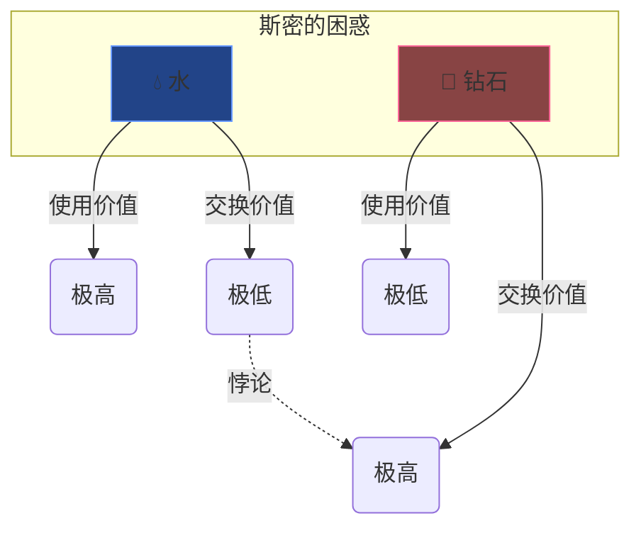
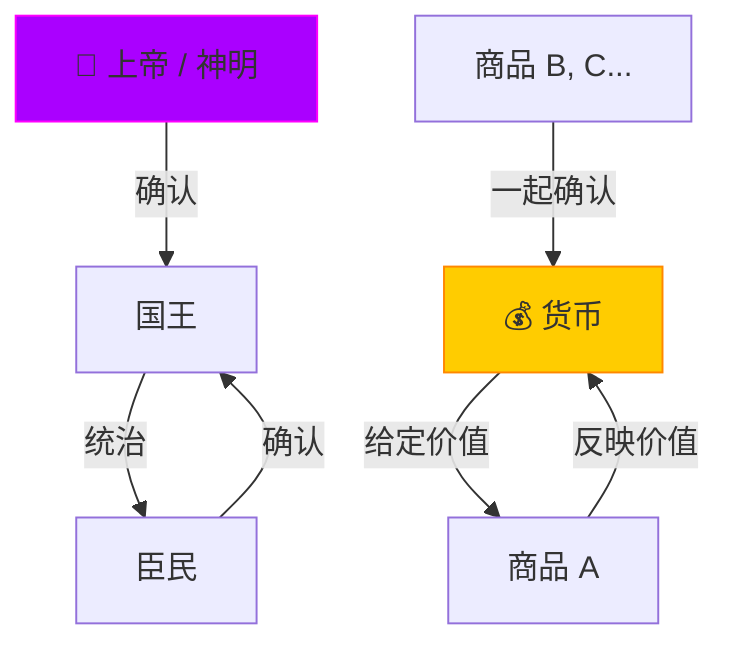
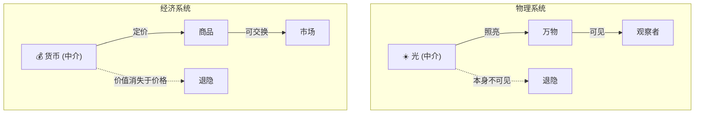
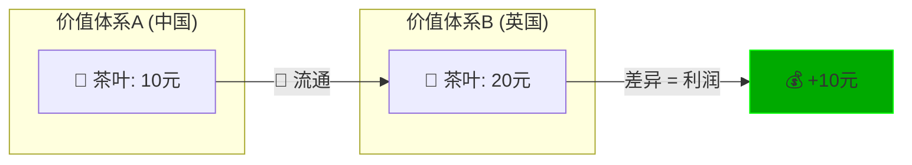
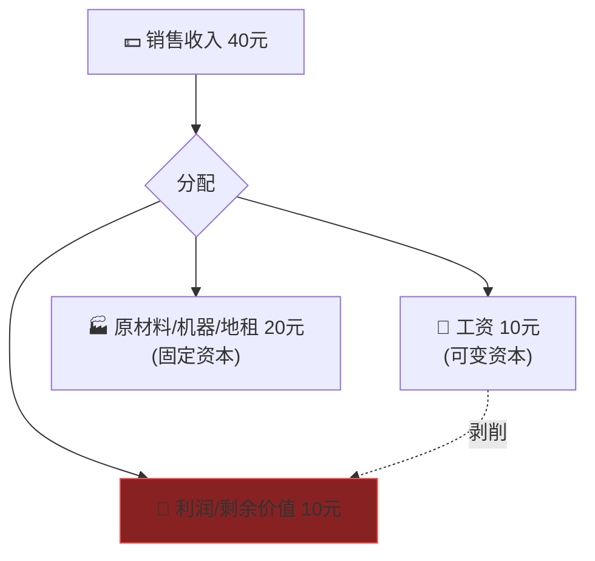
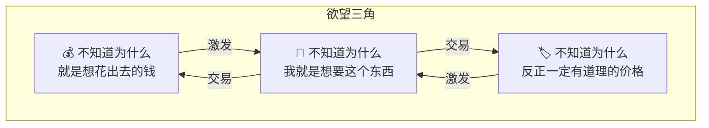

# Political Economy: 金钱哲学——资本与少年

> **Tags:** `[Philosophy]`, `[Economics]`, `[Marx]`, `[Critique]`, `[Value_Theory]`
> **Date Added:** `2026-01-09`
> **一句话总结 (One-Liner):** 金钱不是理性的中介，而是一种"真实的抽象"——它像上帝一样组织了我们的世界，却从未真正存在过；利润是差异运动排泄出来的"神圣的屎"。
> **关键协议 (Critical Protocol):**
> 1.  **宗教批判视角 (Religious Critique):** 理解金钱的第一步，是把它当成一种宗教来审视，而不是当作客观规律来接受。
> 2.  **辩证法原则 (Dialectics):** 正是对欲望的打压和否认，才使欲望得以真正有效地运行起来。声称"不是宗教"的宗教，才是最强有力的宗教。
> 3.  **价值相对论 (Value Relativity):** 商品的价值不在于自身，而在于它与其他商品的关系。利润来自于同一商品在不同价值体系中的差异。

---

## 1. 元认知 (Metacognition)

### Why does this module exist?

*   **问题定义:** 一个孩子问你："钱是什么？为什么会有富人和穷人？"你会发现，所有那些糊弄你的陈词滥调（一般等价物、交换媒介、自由工具）都不足以让你真正理解这个复杂的世界。这些庸俗的经济知识不仅无法澄清金钱与人生的纠结，反而带来了更多的迷思。
*   **核心哲学:** **必须把金钱还原成一个哲学课题**，用彻底反思的态度，寻求一种超越性的视角，才有希望拨开迷雾，洞见经济生活的复杂脉络，最终收获一份能指导生活实践的清醒自觉。
*   **系统定位:** 这是 `Asher_System` 理解资本主义运作的 **底层代码 (Source Code)**。没有这个模块，任何关于投资、创业、消费的技巧都只是在表面滑行。

> [!IMPORTANT]
> **核心洞察 (Key Insight):** 清醒的现代人对金钱的认识，和500年前被病态黄金欲驱动的西班牙征服者**毫无二致**。那些长成真理模样的理性经济学话语，恰恰强化了我们对金钱的宗教式认同。我们不是因为理性才相信金钱，而是因为我们**不把它当成信仰**，所以才成为了最忠实的信徒。

---

## 2. 历史脉络：古典金钱观的流变

### 2.1 重商主义 (Mercantilism)：黄金病

500年前，西班牙征服者科尔特斯来到墨西哥。阿兹特克国王搞不懂这帮"神明"为什么如此痴迷黄金。科尔特斯说："西班牙人都受到一种心病的折磨，这种病只有黄金才能治愈。"

*   **核心观念:** 金银本身就极具价值（与其稀缺性有关）。国家财富等于贵金属储备。
*   **隐喻:** 黄金是一种**心病** (A Disease of the Heart)。

### 2.2 古典经济学：劳动价值论 (Labor Theory of Value)

18世纪，亚当·斯密和李嘉图反驳了重商主义。他们认为货币的价值只是表象。

*   **核心观念:** **价值内在于商品，货币只是中介。** 决定商品价值的是生产一个商品所需要的**劳动时间**。
*   **亚当·斯密原话:** "对于任何一个物品来说，其真实的价值或者说取得它的实际代价，都是获得它所付出的辛苦和麻烦。"
*   **隐喻:** 劳动是**第一性价格**，用来购买财富的本来就是劳动，而不是金银。

### 2.3 斯密的困惑：钻石与水的悖论

劳动价值论听起来很清晰，但一个反常现象困扰了斯密：

| 商品 | 劳动投入 | 使用价值 | 交换价值 |
| :--- | :--- | :--- | :--- |
| **水** | 几乎为零 | 极高 (生存必需) | 极低 |
| **钻石** | 极高 | 几乎为零 (无卵用) | 极高 (价值连城) |

*   **价值二分法:** 斯密发明了"使用价值"和"交换价值"的区分来解释这个悖论。但这带来了更多问题：**为什么一个几乎没有使用价值的东西，居然能有如此高的交换价值？**

### 2.4 贝利的批判：相对价值论 (Relative Value Theory)

19世纪，哲学家塞缪尔·贝利提出了一个更激进的观点：

*   **核心命题:** 价值并非内在于商品。**一个商品的价值取决于它与另一个商品的关系。** 商品永远处于一个由其他商品共同构成的价值体系之中。
*   **贝利原话:** "价值即同时代各种商品之间的关系，因为只有这些商品才能够相互交换。"
*   **核心洞察:** **商品的价值并不先于交换活动而被人认识，价值来自于交换，它必须在交换中才能够展现。**

*这个循环往复的逻辑令人费解：如果一切价值都是相对的，那价值的源头在何处呢？*

---

## 3. 马克思的解答：真实的抽象 (Real Abstraction)

### 3.1 货币、上帝与国王

卡尔·马克思正是从贝利的相对价值论中获得了启发。他在《资本论》中写下了一段令人费解但至关重要的话：

> "这种反思规定十分奇特。例如，这个人所以是国王，是因为其他人作为臣民同他发生关系。反过来，他们所以认为自己是臣民，是因为他是国王。"

*   **类比关系:**
    | 政治系统 | 经济系统 |
    | :--- | :--- |
    | 国王 | 货币 |
    | 臣民 | 商品 |
    | 君权神授 | 货币的"中立"地位 |

*   **马克思的洞察:** 货币与商品的关系，类似于神明与人类的关系。君王的身份事实上来自于臣民的确认，但又不能具体到哪一位臣民的确认——他必须"奉天承运，君权神授"一番，如此双方才能忽略那个悖论，相安无事，继续"装疯卖傻"。

### 3.2 一般等价物：不是任何商品的商品

*   **马克思原话:** "这个商品（如麻布）之所以能处于与其他一切商品直接交换的形式，是因为，而且只是因为，其他一切商品都**不是**处于这种形式。"
*   **解读:** 一般等价物（货币）的价值，不是相对于某个商品而存在，而是相对于**整个商品的无限系列**而存在。它是一个**不是任何存在者**的存在，就像上帝一样。
*   **隐喻:** 货币是一种**真实的抽象** (Real Abstraction)。它不是金银或纸币等具体存在，而是一种抽象的介质。正是因为这种抽象的介质，世界才会显现为具象的、可以被理解的样子。

---

## 4. 核心概念：中介退隐，万物确认自身

### 4.1 光的类比

货币就像一道光，驱散了混沌，让万物在一个序列中得到了秩序。

*   **视觉系统:** 光为物质现象界提供了最基本的秩序。在光的中介之下，我们看见彼此。但有趣的是，可见光本身却变成了**不可见**的东西，隐去了。
*   **马克思原话:** "中介运动在它本身的结果中消失了，而且没有留下任何痕迹。"

### 4.2 镜子的类比

*   **马克思原话:** "通过价值关系，商品B的自然形式成了商品A的价值形式，或者说，商品B的物体成为了反映商品A价值的**一面镜子**。"
*   **解读:** 镜子脱离了光，什么都不是。但它一旦被光照见，就可以在**自身什么都不是**的情况下，让万物确认自身的价值。金银/纸币就是这面镜子。它自身啥也不是，但万物乃至我们每个人都表现为它的镜像。

> [!WARNING]
> **最恐怖的洞察:** 金银与纸币是价值的实现和补完。价值是"因为没有人知道它是什么，所以人人都觉得它重要的东西"。钞票恰恰是一个自身什么都不是，但却可以用来指代、反映一切的东西。我们审视每一件事情，无非是审视这件事情的损益比；我们打量一个人，也无非是看他处于什么样的价位。

---

## 5. 利润的本质：剩余是怎么来的？

### 5.1 商业资本：跨越价值体系

*   **核心命题:** 同一个商品的价值的变化，取决于这个商品所处价值体系的改变。
*   **例子:** 一箱茶叶从中国运往英国。
    *   中国价值体系：10块钱
    *   英国价值体系：20块钱
    *   **凭空多出来的10块钱（利润），到底是什么？**

*   **答案:** 利润来自**差异**，而且来自同一个商品在不同价值体系下的差异。商人就是能同时站在两个价值体系之间，反复横跳，捕捉差异，甚至凭空制造差异，以捕获更多剩余的那个人。

### 5.2 产业资本：劳动者与消费者的分裂

*   **马克思的发现:** 同一个具体的人，被当成劳动力商品的时候，也能够在不同的价值体系中产生差异。
    *   作为**被购买的劳动力商品**：工资 = 10块
    *   作为**购买劳动力商品的消费者**：消费 = 40块

| 角色 | 价值体系 | 价值 |
| :--- | :--- | :--- |
| 工人 (生产者) | 劳动力市场 | 10元 (工资) |
| 工人 (消费者) | 商品市场 | 40元 (消费) |
| **差异** | | **30元 (剩余)** |

### 5.3 剥削率公式

*   **利润率公式:** `利润率 = 剩余价值 / (固定资本 + 可变资本)`
*   **剥削率公式:** `剥削率 = 剩余价值 / 可变资本 (工资)`
*   **例子:**
    *   工人工作10小时，生产4斤茶叶（售价40元）。
    *   工资：10元。原材料/机器/地租：20元。利润：10元。
    *   剩余价值 = 10元。 剥削率 = 10/10 = **100%**。

---

## 6. 核心公式：利润的发生学定义

> **利润是一种剩余。同一个对象在两个价值体系之间运动，导致对象虚假的同一性，穿帮显现出差异。剩余或者利润就是伴随着这个差异生成运动而排泄出来的东西。**

*   **关键词:**
    *   **虚假的同一性 (Fake Identity):** 中国的茶叶和英国的茶叶被货币强行统一为"同一个商品"，但它们在各自体系中的文化意义、稀缺性完全不同。
    *   **穿帮 (Revelation of Difference):** 当差异无法被完全抹平时，多出来的部分就显现为剩余。
    *   **排泄 (Excretion):** 利润不是被"创造"出来的，而是被"排泄"出来的。

```mermaid
graph TD
    Object["🍵 同一商品"] --> SystemA["价值体系A"]
    Object --> SystemB["价值体系B"]
    
    SystemA -->|"定价"| PriceA["价格A"]
    SystemB -->|"定价"| PriceB["价格B"]
    
    PriceA -->|"差异"| Surplus["♻️ 剩余/利润"]
    PriceB -->|"差异"| Surplus
    
    Surplus -->|"被攫取"| Capitalist["💼 资本家"]
    
    style Surplus fill:#444400,stroke:#aaaa00
```

---

## 7. 品牌哲学：商品世界的黑话

### 7.1 "远不止于此"的诱惑

*   **LV包包的价值:** 它不仅是一个收纳容器，它的内涵要多于一个包（body）。
    *   身份的象征？阶级的证明？文化的符号？**但总是不止于此。**
*   **核心逻辑:** 一旦我们说"因为LV包是身份的象征，所以贵"，它反而会被祛魅，让人失去想要拥有它的欲望。真正的勾引必须是**"LV包包不仅是身份的象征，它还是……"** 后面的省略号，才是迷之利润的真正来源。

*   **品牌的定义:** 品牌是商品世界的**黑话 (Jargon)**。圈内人用它标榜自身，圈外人对此不明觉厉。

### 7.2 欲望的三角结构

---

## 8. Anti-Patterns (反模式 - The "Don'ts")

> **[MANDATORY] 必选章节**

*   **陷阱 1: 庸俗理性主义 (Vulgar Rationalism)**
    *   *Trap:* 认为市场是理性的、价值是客观的、价格反映真实价值。
    *   *Why:* 这是一种"声称不是宗教的宗教"。正因为我们不把它当信仰，反而成为了最忠实的信徒。
    *   *Fix:* 运用**启蒙辩证法**：启蒙理性在反对宗教之后就成为了新的宗教，必须被当成宗教来反对，才能获得新的启蒙。
    *   *Positive Real Scenario:* **乔治·索罗斯 (George Soros)**。他的"反身性理论"（Reflexivity Theory）就是对"市场价格=真实价值"这一信条的彻底否定。他认为市场参与者的认知偏差会影响基本面，基本面又反过来影响认知，形成永无止境的反馈循环。正是这种对"市场理性"的批判，让他成为了最伟大的投资者之一。

*   **陷阱 2: 劳动拜物教 (Labor Fetishism)**
    *   *Trap:* 认为只有劳动才创造价值，资本投入（机器、原材料）不贡献价值。
    *   *Why:* 这是马克思剥削理论的一个副产品。虽然他的分析深刻，但这个特定论断在现代资本构成中难以自洽。
    *   *Fix:* 理解**利润来自差异**，而不仅仅来自对劳动的压榨。技术进步、品牌溢价、跨体系套利都是利润的来源。
    *   *Positive Real Scenario:* **富士康/福耀玻璃的自动化**。他们不断用机器替代工人，减少可变资本的投入，却没有导致利润下降。这说明利润的来源比"剥削工人"要复杂得多。

*   **陷阱 3: 消费主义犬儒 (Consumer Cynicism)**
    *   *Trap:* 一边批判消费主义，一边继续被商品拜物教驱动。"我知道这是收智商税，但我还是想买。"
    *   *Why:* 这是一种**装疯卖傻**的策略。批判资本主义的姿态本身，已经成为了攫取人生资本的一种方式。
    *   *Fix:* 认识到**中介性的虚假答案**（他人的评价、品牌的光环）是如何充实所有人的。幸福感来自于"我认为他人认为我很幸福"，而非来自真实的满足。
    *   *Positive Real Scenario:* **早期巴菲特与比尔·盖茨的节俭**。他们是世界上最富有的人，却以节俭闻名。他们不需要通过"远不止于此"的商品来确认自身价值，因为他们跳出了那个由他人评价构成的欲望三角。

---

## 9. 系统关联 (Interlinkages)

*   **上游 (Input):**
    *   `Cognitive_Philosophy/1.0_Systemic_Cognition.md` (理解此模块需要系统性认知能力)
*   **下游 (Output):**
    *   `Enterprise_Operation_System/Pricing_Strategy.md` (品牌定价的哲学基础)
    *   `Lifestyle_Systems/Consumption_Philosophy.md` (个人消费决策)

---

## 10. Glossary (术语表)

*   **重商主义 (Mercantilism):** 16-18世纪的经济思想，认为金银本身就是财富，国家应累积贵金属。
*   **劳动价值论 (Labor Theory of Value):** 认为商品价值由生产它所需的劳动时间决定。
*   **相对价值论 (Relative Value Theory):** 认为商品价值来自于它与其他商品的关系，而非内在属性。
*   **真实的抽象 (Real Abstraction):** 马克思术语。指货币这类虽然抽象但却组织了真实世界秩序的介质。
*   **商品拜物教 (Commodity Fetishism):** 马克思术语。指把商品当成具有神秘力量的对象来崇拜的现象。
*   **剩余价值 (Surplus Value):** 马克思术语。劳动者创造的价值超出其工资的部分。
*   **启蒙辩证法 (Dialectic of Enlightenment):** 霍克海默和阿多诺术语。指启蒙理性在反对神话之后自身变成了新的神话。
*   **Holy Shit (神圣的屎):** 本模块定义。金钱既是神圣的律令（像上帝一样），又是多余的排泄物（像粪便一样）。

---

## 11. Formula Table (公式表 - 3D Knowledge)

| Formula Name | Equation / Logic | Variable Definition |
| :--- | :--- | :--- |
| **利润本质** | `Profit = Difference(SystemA, SystemB)` | 利润 = 同一商品在两个价值体系中的差异 |
| **剥削率** | `Exploitation Rate = Surplus Value / Wages` | 剥削率 = 剩余价值 / 工资 |
| **价值定义** | `Value = What nobody knows but everyone deems important` | 价值 = 因为没人知道是什么，所以人人觉得重要 |
| **品牌溢价** | `Brand Premium = "..." (The Unsaid)` | 品牌溢价 = "远不止于此"的省略号 |

---

## 备注与引用 (Notes & References)

*   **Source:** 汤池看本质《资本与少年》第一期
*   **Core Thinkers:** Adam Smith, Samuel Bailey, Karl Marx, Max Weber
*   **Key Works:** 《国富论》, 《资本论》, 《新教伦理与资本主义精神》
