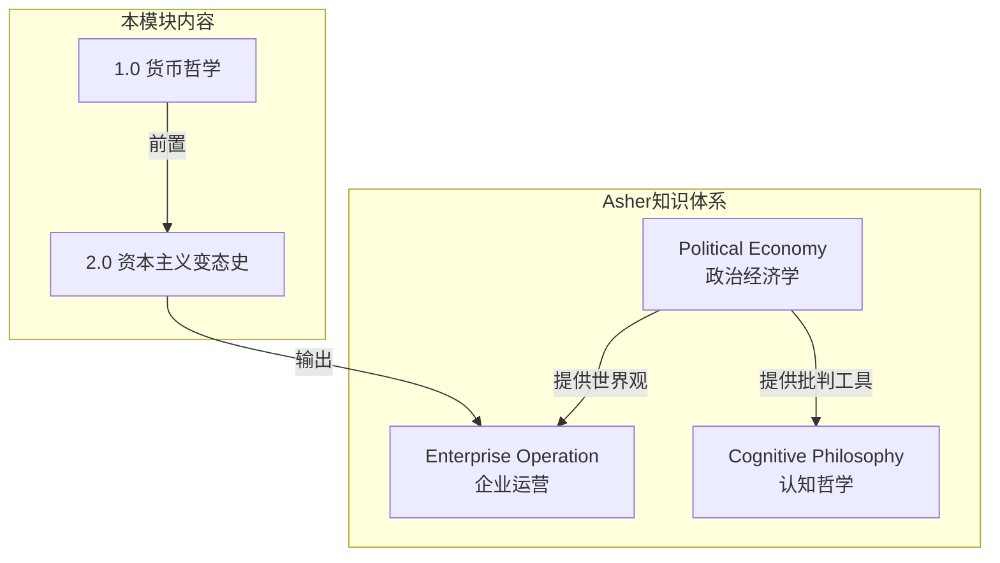
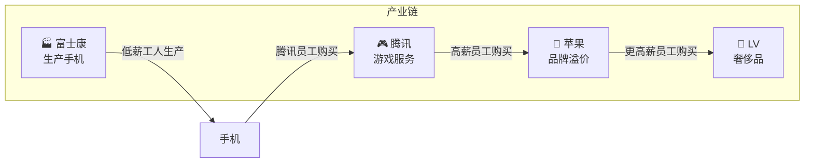
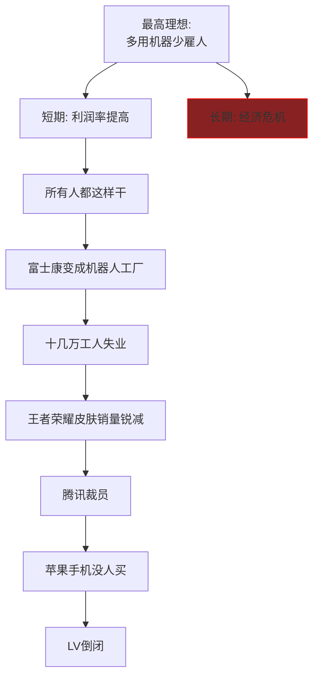
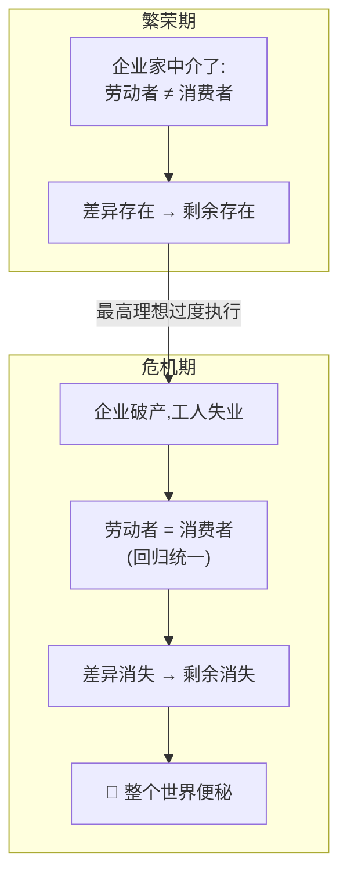
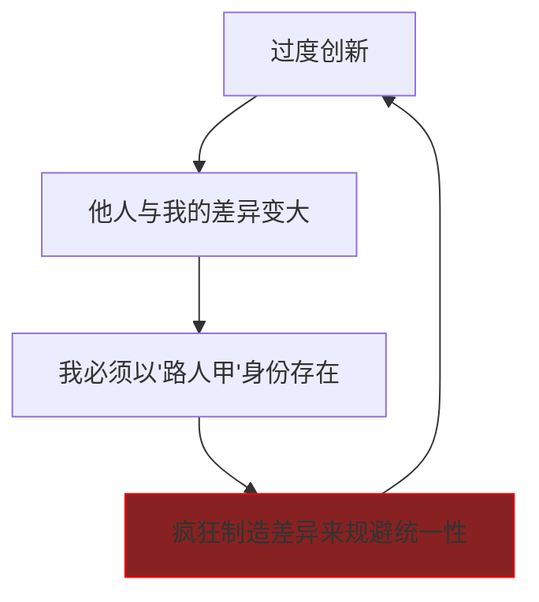
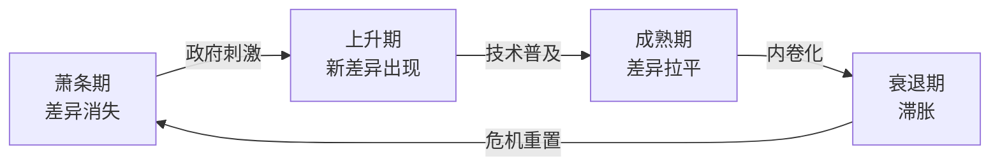
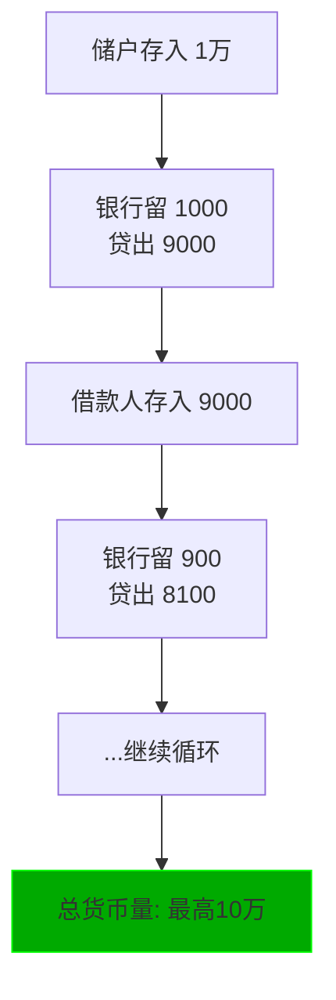
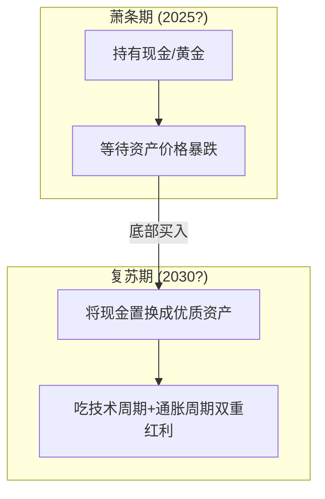
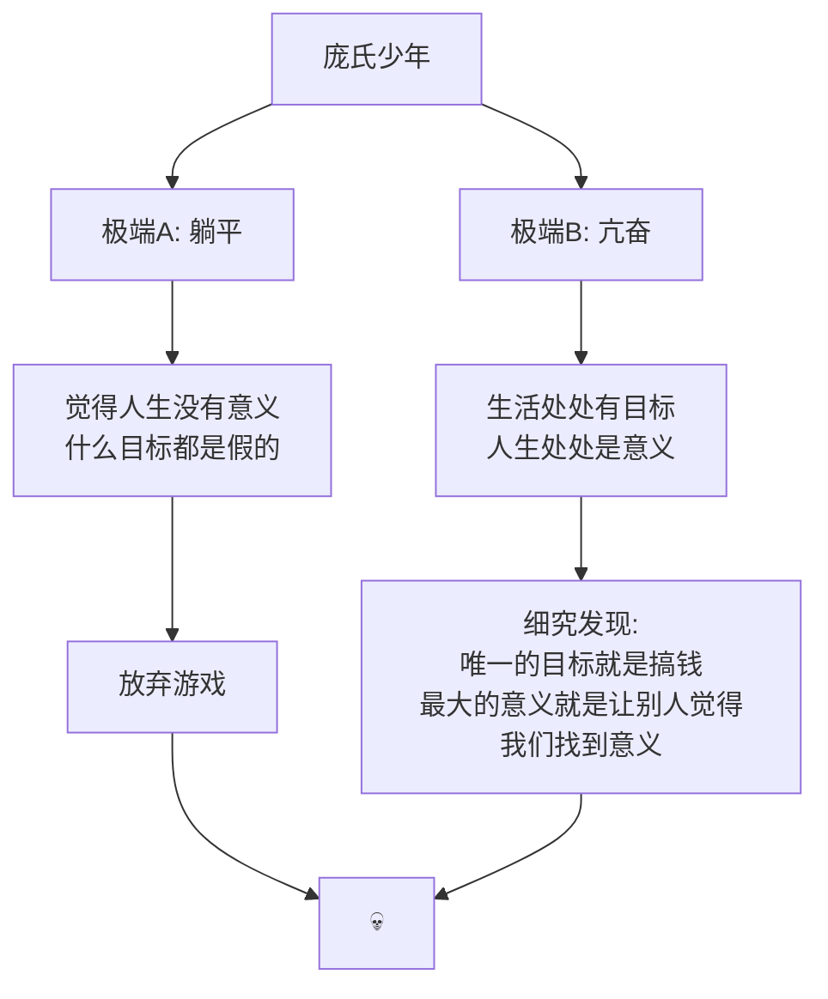

# Political Economy: 资本主义变态史 (The Mutation History of Capitalism)

> **Tags:** `[Economics]`, `[Capitalism]`, `[Marx]`, `[Schumpeter]`, `[Philosophy]`, `[Cycle]`
> **Date Added:** `2026-01-09`
> **一句话总结 (One-Liner):** 资本主义的真正限制是资本自身，而真正的发展动力是通过限制资本主义的发展来获得的——每一次经济危机，都是资本主义的一次自我实现。
> **关键协议 (Critical Protocol):**
> 1.  **创造性破坏 (Creative Destruction):** 资本主义的本质是通过破坏旧结构来创造新的剩余价值，这不是Bug，是Feature。
> 2.  **庞氏视角 (Ponzi Perspective):** 金融世界为实体经济提供了一种符号秩序，一个承认自己是骗子的骗子，反而值得信赖。
> 3.  **周期觉醒 (Cycle Awareness):** 发现规律不是为了批判，而是为了搞钱——除非妨碍搞钱，否则原理是不重要的。

---

## 1. 元认知 (Metacognition)

### 1.1 问题定义：这是什么视角？

> "本期的主题叫做 Holy Shit 的视角下的资本主义变态史。"

这是一套**反直觉的经济史观**，不是为了告诉你"资本主义多坏"或"马克思多对"，而是为了回答一个极其实际的问题：

> **今天的少年面对的到底是一个什么样的世界？**

### 1.2 核心哲学：剩余价值的排泄物隐喻

上期节目建立了一个核心隐喻：**金钱是排泄物**。

> "利润是一种剩余。同一个对象在两个价值体系之间运动，导致了该对象的虚假同一性，穿帮显现出差异，剩余就是伴随着这个差异生成运动而排泄出来的东西。"

*   **商品生产商品的利润** = 生产者与消费者的虚假分离产生的剩余
*   **人生产人的利润** = 旧人与新人的虚假分离产生的剩余
*   **货币生产货币的利润** = 存与贷的虚假分离产生的剩余

当这个分离消失（统一性回归），利润消失，**整个世界陷入便秘**——这就是经济危机。

### 1.3 系统定位



> [!IMPORTANT]
> **核心洞察 (Key Insight):** 资本主义之所以能创造今天如此这般的繁荣，不是因为"让穷人更穷，让富人更富"，而是因为**"为了让富人能够持续变得更富，我们不能让穷人变得太穷"**。这才是资本主义与马克思"二律背反"共舞的真正逻辑。

---

## 2. 核心架构：100年经济史的线索

### 2.1 二律背反（Antinomy）：马克思的预言

> "马克思在《资本论》中提出了那个著名的二律背反，揭示了资本主义的根本矛盾。"

**问题切入：一个人的高薪到底是从哪里来的？**

马克思的答案：**一个人的高薪总是来自于另一个人的低筹。**

#### 简化版市场模型



#### 二律背反的逻辑

如果富士康的产品只能让富士康的员工来购买（生产者=消费者），会怎样？

| 操作 | 结果 | 后果 |
| :--- | :--- | :--- |
| 降低产品售价让员工买得起 | 利润减少 | 企业亏损 |
| 提高员工收入让他们买得起 | 成本上升 | 利润减少 |
| 提高售价保持利润 | 员工买不起 | 卖不出去 |
| 压低员工工资保持利润 | 员工没钱消费 | 卖不出去 |

> **马克思原文:** "资本家要坚持他作为买者的权利，尽量延长工作日……但另一方面，这个已经卖出的商品的独特限制给他的买者规定了一个消费的界限……于是这里就出现了一个二律背反，权力同权力相对抗，而这两种权利同样是商品交换规律所承认的。**在平等的权利之间，力量就起了决定的作用。**"

#### 资本主义的"精神分裂式最高理想"

> "尽可能减少靠工资生活的人数，尽可能增加靠纯产品生活的人数。"

说人话：**多用机器少雇人。**



### 2.2 高薪来自低筹：埃奇沃斯合创图

```
        消费 ↑
             │
             │    ★ 富人的无差异曲线
             │   ╱
             │  ╱
             │ ╱  ← 均衡点(帕累托最优)
             │╱
        ─────┼────────────────→ 闲暇
           ╱ │
          ╱  │
         ╱   │
    穷人的│   
    无差异曲线│
```

**两个重要事实:**

| 事实 | 含义 |
| :--- | :--- |
| **帕累托改进** | 只要均衡点落在切线上，不需要让穷人更富，只需要让富人更富，就能实现社会总财富最大化 |
| **零状态警告** | 永远不能让穷人陷入绝对贫困，否则整个社会财富无法产生 |

> "腾讯、苹果、LV之所以能赚取超额利润，根本上是因为富士康用了很低的工资养活了**大量需要消费同时也有一定闲暇时间享受消费的工人**。他们收入虽然不高，但数量巨大，为社会贡献了大量的流通。"

### 2.3 真正符合事实的指控

> "很多人批判万恶的资本主义说让穷人更穷、让富人更富，这是对资本主义最愚蠢的污蔑，你会被驳得体无完肤。"

**正确的指控是:**
> "**为了让富人能够持续变得更富，我们不能让穷人变得太穷。**"

---

## 3. 1929大萧条：过剩的人和创造性破坏

### 3.1 危机的根源

> "当所有人都怀着那样的最高理想并且付诸行动的一个必然结果。"

**胡佛总统的反思:**
> "当我们充分理解了20年代的经济史的时候，就会发现终结这一繁荣时期的这场崩溃，其主要原因是工业没能把它的进步（通过省力设备）传递给消费者。"

| 数据 | 1920-1929年变化 |
| :--- | :--- |
| 工业总产值 | +50% |
| 工资 | +2% |
| 工人总数 | 无变化 |
| 汽车行业产能 | +1000% |

### 3.2 便秘的发生：差异消失



### 3.3 大萧条后的意识形态转向

| 项目 | 大萧条前 | 大萧条后 |
| :--- | :--- | :--- |
| **核心信念** | 看不见的手 | 看得见的政府 |
| **政府角色** | 大市场，小政府 | 基建狂魔，积极干预 |
| **企业态度** | 压缩劳工成本 | 福特主义（让员工买得起自己的产品） |
| **新阶级** | 无 | 中产阶级 |

### 3.4 中产阶级：人生产人

> "后资本主义生产技术的真正要义就是**人生产人**。"

**福柯的洞察:**
> "生产的不是自然所设计好的人，也不是人的本质所决定的人。我们必须生产出**尚不存在的、我们尚不知道是什么样子的人**。"


**中产的黑话本质:**
> "穷人与中产的差异，中产与富人的差异，永远必须是个迷。因为真正能够驱动我们不停运行的一定是这样一句话：**'我还不是真正的中产，真正的中产远不止于此。'**"

---

## 4. 创造性破坏 (Creative Destruction)

### 4.1 熊彼特的核心概念

> "资本主义本质上是一种经济变动的形式或方法，它不断的从内部使整个经济结构革命化，不断的破坏旧结构，不断的创造新结构。这个创造性破坏的过程就是资本主义的**本质性事实**。"

**商学院的骚操作:**
把"创造性破坏"调换成"破坏性创新"——一个原本很有批判力度的概念，沦为了一个有待兜售的创富方法。

### 4.2 基于否定关系的价值生成逻辑

> "一个新事物的价值取决于它能让多少旧事物失去价值。"

| 新事物 | 让什么变得毫无价值 |
| :--- | :--- |
| 汽车 | 马车 |
| iPhone | 诺基亚 |
| ChatGPT | 某些知识工作者 |
| 你的优秀 | 他人的平庸 |

### 4.3 优秀的破坏性定义

> "我们今天的优秀就是一种**破坏性的优秀**。虽然我们假模假式的认为优秀有各种各样的定义，但优秀的真正定义，颠扑不破的定义，它只有一个：**优秀是一种让他人显得平庸的能力**。"

### 4.4 内卷的真正来源

> "今天有一个词叫内卷。我们说创新是内卷的出路，其实**创新恰恰是导致内卷的原因**。"



> "他人的差异让我们不可避免的沦为了同一。就像很多果粉说：世界上只有两款手机，一款叫iPhone，还有一款是'其他'。"

### 4.5 独一无二的秘诀

> "我们都说要活成独一无二的样子，是吗？想不想知道怎么样才能够真正活成独一无二的样子？**你必须把自己活成一段黑话。**"

**职场真相:**
> "你的基本薪资可能来自于某种肯定性的陈述（'你能解决XX问题'），但是你的**超额薪资**一定来自于某种包含了不可描述性的否定性陈述——类似于：'我们也说不清楚这个人哪里好，但是有些事情就是没了他不行。'"

### 4.6 熊彼特的悲观预言

> "资本主义企业由于他自身的成就使他的进步自动化，他倾向于使自己变得多余。**他会被自己的成就压得粉碎。**"

熊彼特认为资本主义必将被社会主义取代，但不是毁于无产阶级的革命，而是**毁于资产阶级自身的成功**。

---

## 5. 70年代滞胀：50年前的内卷与反内卷

### 5.1 资本主义黄金岁月 (1945-1969)

| 特征 | 描述 |
| :--- | :--- |
| 经济增长 | 持续高速 |
| 失业率 | 趋向稳定 |
| 物价 | 趋向稳定 |
| 劳工福利 | 日渐改善 |
| 中产阶级 | 发展壮大 |
| 阶级矛盾 | 趋于缓和 |

### 5.2 滞胀 (Stagflation) 的怪病

> "滞胀——这个词简直太妙了，它完美的贴合了我们讲金钱就是排泄物的隐喻。所谓'胀'就是屎太浓，屎太多；'滞'就是拉不出去。"

**滞胀的定义:** 高通胀 + 高失业 + 低增长


### 5.3 滞胀的根源：资本主义太成功了

**经济周期四阶段:**

| 阶段 | 特征 | 差异状态 |
| :--- | :--- | :--- |
| **萧条期** | 旧技术充分应用，新技术萌芽 | 差异消失 |
| **上升期** | 新技术应用扩大，高增长低通胀 | 新差异出现 |
| **成熟期** | 新技术普及，世界内卷化 | 差异被拉平 |
| **衰退期/滞胀** | 低增长高通胀 | 差异减少 → 利润减少 |



> "差异减少会导致利润减少，为了维持回报率，商人只能追加投资，用规模来换效率。但规模扩大又会导致对原材料需求增加，最终会促成一种**成本增加但是利润减少**的尴尬局面。"

---

## 6. 新自由主义：全球化的创造性破坏

### 6.1 80年代的意识形态转向

> "非美家团结了起来，主流舆论的矛头指向了过多的政府干预和过高的劳工福利。"

**撒切尔和里根的操作:**
*   打监管 (Deregulation)
*   踢工会 (Union Busting)
*   国有私化 (Privatization)
*   减税降水 (Tax Cuts)

> "一顿操作之后，资本主义彻底放飞了天性，如发春的野马奔向全球各个角落。"

### 6.2 真正的釜底抽薪创新

> "历史好像又打了马克思和熊彼特的脸。真正釜底抽薪的创新，真正能够带来取之不竭的差异和利润的创新，是**对经济制度本身的创造性破坏**。"

### 6.3 大象曲线：全球财富再分配

```
收入增长率 ↑
    │     ★ 亚洲国家 (象背)
    │    ╱╲
    │   ╱  ╲
    │  ╱    ╲    ★ 全球精英 (象鼻顶端)
    │ ╱      ╲   ╱
    │╱        ╲ ╱
    ┼──────────╳───────────→ 收入百分位
    │          ↓
    │    发达国家蓝领
    │    (象鼻最低点)
```

| 人群 | 1988-2008收入变化 |
| :--- | :--- |
| 最贫穷人口 | 几乎无增长 |
| 亚洲发展中国家 | 大幅增长 |
| 发达国家蓝领 | 几乎无增长 |
| 全球精英 | 大幅增长 |

### 6.4 新自由主义的终结

> "新自由主义死于2008年美国政府不顾众议院反对，用8500亿美元拯救金融机构的那一天。用美国人自己的话说：**美国是一个资本主义国家，但美国的银行业搞的却是共产主义。**"

---

## 7. 金融资本：世界的庞氏化

### 7.1 马克思的预言：货币生产货币

> "马克思在100多年前就预言过资本主义发展的畸形路径：只有生息资本才是金钱的最本真形态，才是自我增值的完美主体。"

**演化路径:**


> "生产过程只是为了赚钱而不可缺少的中间环节，只是为了赚钱而**必须干的倒霉事**。一切资本主义生产方式的国家都周期性的患有一种狂想病，企图不用生产过程作为媒介而赚到钱。"

### 7.2 准备金制度：货币的指数扩张

> "如果整个金融业的平均准备金率是10%，那么一个储户存入1万元，将会在整个金融系统中衍生出最高**10万元**的货币。"



### 7.3 庞氏与银行的本质区别

> "银行和庞氏骗子一样，一旦遭遇挤兑，就会破产。但银行不是庞氏骗子，最根本的区别是什么？"

**脑洞答案:**
> "银行他能**坦诚的告诉你他在欺骗**。他会开诚布公的告诉你：我就是在用准备金游戏扩张货币，你们就是不能挤兑。一切都在光天化日之下，道理都写在了教科书里面。"

> "逻辑上，**一个承认自己是骗子的骗子，反而是真实的，反而能值得信赖**。"

### 7.4 金融作为符号秩序

> "我们知道现在的世界是**实体寄生于金融**的世界，而不是金融寄生于实体的世界。金融世界为我们的实体经济提供了一种**符号秩序**。"

**共识的本质:**
> "共识的本质就是**我相信你相信的东西**。能够承载巨大共识的东西，一定有那种不可描述、不止于此的神秘性。"

### 7.5 比特币：赤裸裸的谜底

> "比特币能贵成那副德性，堪称世界上第11大奇迹。这个奇迹时刻提醒着我们：人类的虚伪、愚蠢、贪婪有多么大的现实价值，这个世界有多么的庞氏。"

**正常人的反应:**
> "正常人在你面前抱怨比特币这个东西太迷了，我看不懂，我搞不懂他怎么回事儿——他要么是真的蠢，要么就是在自欺欺人。**他需要这种不懂来维护自己的常识。**"

**辩证的真相:**
> "比特币就是这个世界上**最真诚最真实的东西**，因为他不遮不掩，摆脱了所有意识形态的包裹和装扮，如实反映出了每一份虚伪的价值，开诚布公、落落大方的告诉你：**傻的共识也是共识，虚伪才是真正的价值之源。**"

> "如果这个经济世界是一个表现为一个巨大的谜的话，比特币就是一个**赤裸裸的谜底**。但是这个骇人的真相太过于坦诚和直白，所以让我们无法直视。我们必须把它理解成一个更大的迷，我们才能够假装正常的生活。"

---

## 8. 经济危机的神学解读

### 8.1 马克思对危机的描述

> "当这一机制整个被打乱的时候，货币就会突然的从计算货币的纯粹观念转变成**坚硬的货币**。商品的使用价值变得毫无意义，而商品的价值在他自己的价值形式面前消失了。"

> "**昨天**，资本家还被繁荣所陶醉，其曰货币只是虚空的幻象，只有商品才是货币。**今天**，他们就在世界市场上到处叫嚷：只有货币才是商品！他们的灵魂渴求货币这唯一财富，就像鹿渴求清水一样。"

### 8.2 货币的神圣主体性

> "经济危机总是来自于**差异的消失**，经济复苏总是来自于**差异的重新出现**。在一次又一次周而复始的运动中，那个退隐在流通环节中的那个污秽的排泄物——货币，它一次又一次的展现出自己的**神圣的主体性**。"

> "一切进由我出，一切又复归于我。原来**中介才是绝对的主体**，我们这些伪主体只是金钱用来实现自身的一个中介而已。"

### 8.3 经济危机 = 神迹显现

> "如果我们对这一段用宗教批判的视角，你会发现经济危机是什么？它就是教徒们日常崩坏、然后**神迹显现**的时刻。或者辩证的说，它就是实像显现的时刻，是我们这个虚假的日常幻象破灭被刺穿的时刻。"

---

## 9. 周期理论：搞钱的终极心法

### 9.1 周金涛的预言

> "国内研究周期理论的大神周金涛在生前叮嘱世人：**2025年，世界将会迎来第5次萧条。2030年是新繁荣期的开端。**"

### 9.2 萧条期的操作

> "在萧条时期持有现金或者黄金在今天已经是投资的常识了。"

**周期投资心法:**


### 9.3 终极洞察

> "发现了吗？**除非妨碍搞钱，否则原理是不重要的。除非能涨粉，否则批判也是没有意义的。**这才是资本主义真正可怕的地方。"

---

## 10. 庞氏人生观：少年的困境

### 10.1 意义的庞氏骗局

> "今天我们已经习得了一种我叫做**庞氏的人生观**。我们的意义系统的运作和金融机构的运作的逻辑如出一辙。"

**续命的句式:**
> "一旦我们得到了XXX，这一切都会好了。"

**然后呢:**
> "一旦我们真的得到了那个东西（某个职位、某个薪水、某套房子），我们马上就会陷入**便秘的痛苦**之中。整个世界都会朝你挤兑那个你曾经许诺的价值，然后你会濒临**意义危机、价值的破产**。"

> "怎么办呢？你只好再找回那样的句子，然后填入新的词汇、填入新的黑话，以求**续命、展期、延迟兑付**。"

### 10.2 庞氏少年的两极



### 10.3 第三条路？

> "难道真的还有第三条路吗？这是我们下期要探讨的话题。"

---

## 11. Anti-Patterns (反模式)

### 陷阱 1: 愚蠢的资本主义批判

*   **Trap:** 批判资本主义"让穷人更穷，让富人更富"
*   **Why:** 这是最常见的道德愤慨，但在逻辑上站不住脚
*   **Fix:** 理解资本主义的真正逻辑是"为了让富人能够持续变得更富，我们不能让穷人变得太穷"
*   **Positive Real Scenario:** 福特主义——让工人买得起自己生产的汽车——恰恰是资本主义自我救赎的经典案例

### 陷阱 2: 创新崇拜

*   **Trap:** 认为"创新是内卷的出路"
*   **Why:** 商学院洗脑，把批判性概念包装成积极方法论
*   **Fix:** 理解创新恰恰是导致内卷的原因——过度创新拉大差异，让大多数人沦为"其他"
*   **Positive Real Scenario:** 理解"优秀是一种让他人显得平庸的能力"，才能真正理解职场竞争的本质

### 陷阱 3: 假装不懂比特币

*   **Trap:** 声称"比特币太迷了，我看不懂"
*   **Why:** 需要这种"不懂"来维护自己的常识，否认自己也患有那种狂想病
*   **Fix:** 承认比特币是"赤裸裸的谜底"，是世界庞氏化的最诚实反映
*   **Positive Real Scenario:** 那些早期入场的"看懂了"的人，恰恰是放弃了"正常人"身份的人

---

## 12. Glossary (术语表)

*   **二律背反 (Antinomy):** 资本家作为劳动力买者希望压低工资，但作为产品卖者又需要消费者有购买力——这两种权利同时合法但相互矛盾。
*   **创造性破坏 (Creative Destruction):** 熊彼特的核心概念，资本主义通过破坏旧结构来创造新的剩余价值。
*   **滞胀 (Stagflation):** 高通胀+高失业+低增长，"胀"是屎太多，"滞"是拉不出去。
*   **福特主义 (Fordism):** 让工人买得起自己生产的产品，是大萧条后资本主义的自我修正。
*   **人生产人:** 福柯的概念，后资本主义生产的是"尚不存在的人"——知识工作者、中产阶级。
*   **庞氏化 (Ponzification):** 整个世界的运作逻辑和庞氏骗局如出一辙——只要不挤兑，就能继续玩。
*   **黑话 (Jargon as Identity):** 活成独一无二的方式——一段不可描述、无法被同质化的存在。
*   **便秘 (Economic Constipation):** 经济危机的隐喻——差异消失，剩余无法排泄。

---

## 13. Formula Table (公式表)

| Formula Name | Equation / Logic | Variable Definition |
| :--- | :--- | :--- |
| **高薪来源公式** | `你的高薪 = 他人的低筹` | 超额利润必须由底层劳动力的低工资支撑 |
| **资本主义发展动力** | `发展 = Limit(资本)` | 通过限制资本主义的发展来获得发展动力 |
| **创新价值公式** | `新事物价值 = Σ(旧事物失去的价值)` | 汽车的价值=马车变得无价值 |
| **优秀定义** | `优秀 = f(让他人平庸的能力)` | 破坏性优秀的唯一定义 |
| **庞氏人生** | `意义 = "得到X后一切都好" → 得到X → 便秘 → 新的X` | 续命、展期、延迟兑付 |
| **周期投资** | `萧条持现金 → 底部置换优质资产 → 吃双重红利` | 周金涛心法 |

---

## 备注与引用 (Notes & References)

*   **Source:** "资本与少年" 第二期 - Holy Shit视角下的资本主义变态史
*   **核心引用:**
    *   马克思《资本论》
    *   熊彼特《资本主义、社会主义与民主》
    *   福柯《规训与惩罚》
    *   周金涛 周期理论
*   **下期预告:** 第三条路——庞氏人生观之外的可能性
