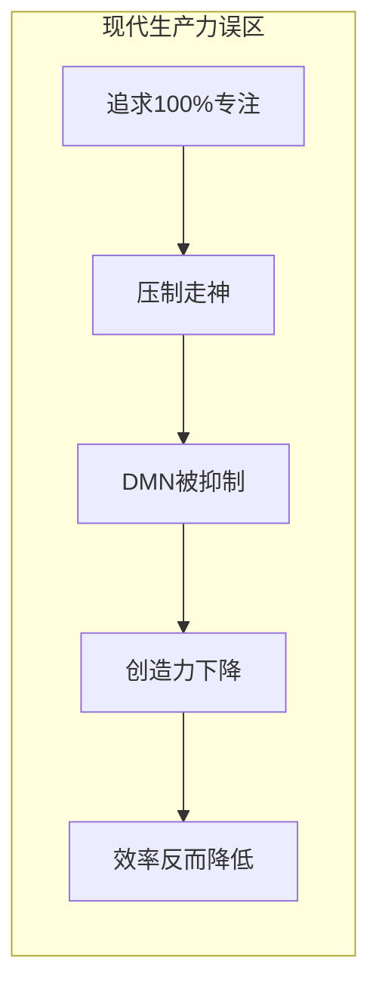
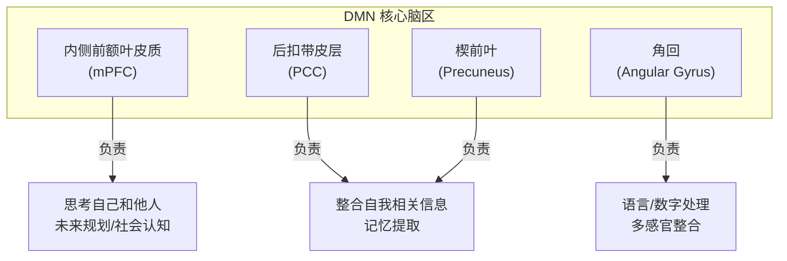
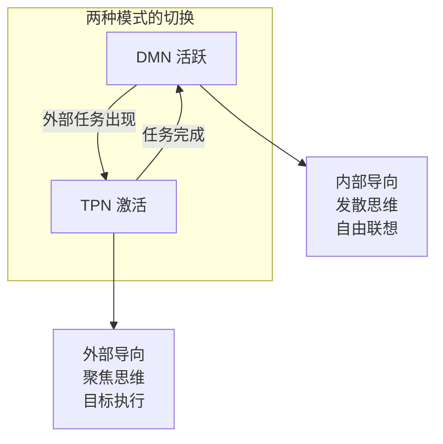
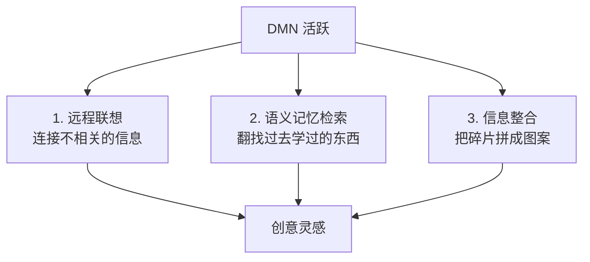
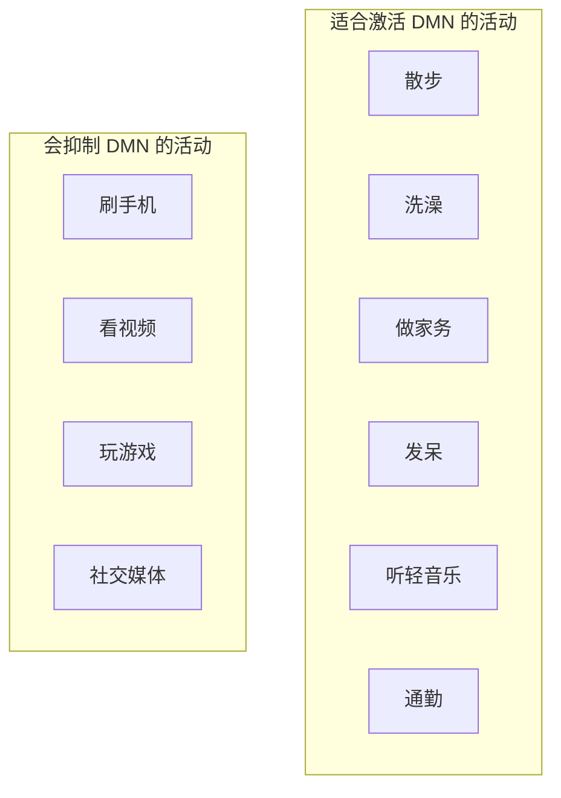
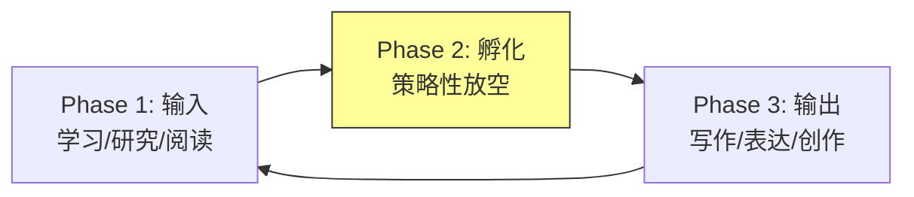
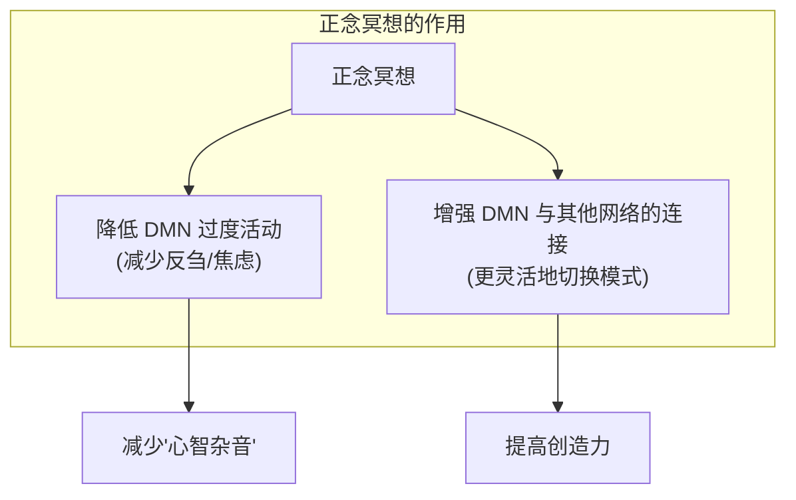
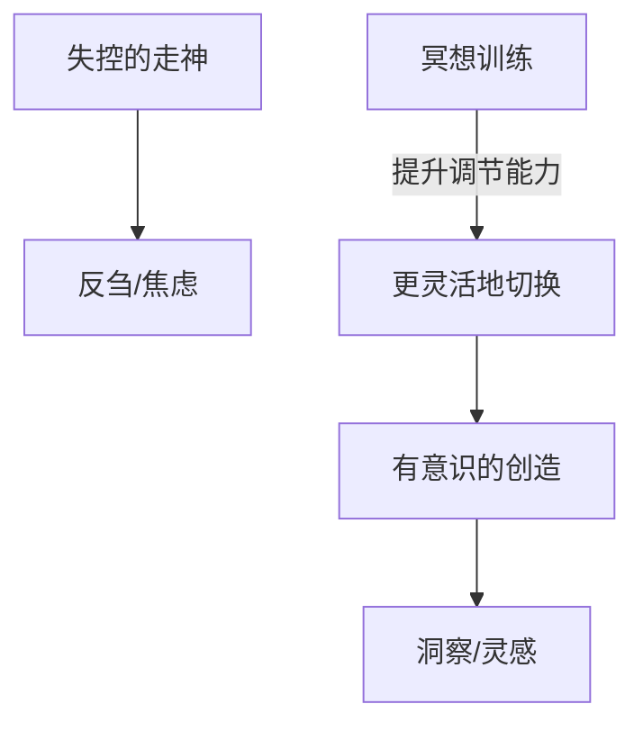
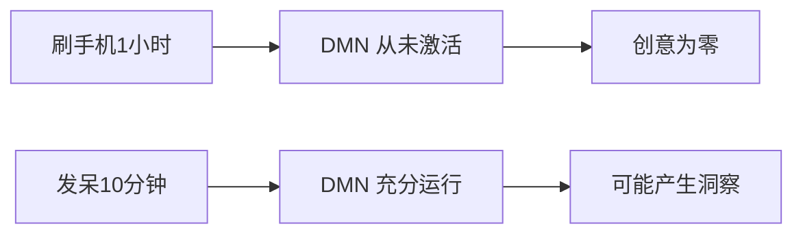
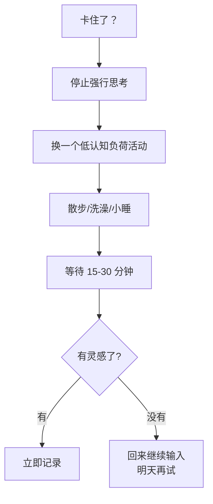

# 默认模式网络 (Default Mode Network)

> **Tags:** `Neuroscience`, `Creativity`, `Meditation`, `Productivity`
> **Date Added:** `2026-01-11`
> **一句话总结 (One-Liner):** DMN 是大脑的"后台运行程序"——当你不干活时它最活跃，负责走神、做白日梦、自我反思和未来规划，是创造力和"灵光乍现"的神经学基础。
> **来源 (Source):** 综合 NIH、Wikipedia、Psychology Today 等多个神经科学资源

---

## 1. 元认知 (Metacognition) - 为什么要理解 DMN

### 问题定义

你有没有发现：
- 洗澡时突然想到问题的解决方案
- 散步时冒出绝妙的点子
- 发呆时突然"灵光乍现"

这些"顿悟时刻"并不是偶然的，它们有一个共同的神经学基础：**默认模式网络 (DMN)**。

> [!IMPORTANT]
> **核心洞察 (Key Insight):** DMN 消耗了大脑总能量的 **60%-80%**，被称为"大脑的暗能量"。你以为大脑在"休息"时很空闲？错了，它比干活时还忙——只不过忙的是另一件事：**创造**。

### 核心哲学

现代生产力文化强调"专注"、"深度工作"、"消灭走神"。但这是对大脑运作方式的根本误解。

**大脑不是设计来连续专注的。** 它需要在"专注模式"和"发散模式"之间切换。DMN 就是发散模式的神经学基础。



---

## 2. 核心架构 (Core Framework)

### 2.1 什么是 DMN？

**默认模式网络 (Default Mode Network)** 是大脑中一组高度互联的脑区，在你**不专注于外部任务**时被激活。



### 2.2 DMN 什么时候活跃？

| 状态 | DMN 活动 | 例子 |
|:---|:---|:---|
| **清醒休息** | ★★★★★ | 躺着发呆、坐车望窗外 |
| **白日梦** | ★★★★★ | 开会走神、上课发呆 |
| **自我反思** | ★★★★ | 想"我是谁"、复盘过去 |
| **规划未来** | ★★★★ | 想象明年要做什么 |
| **思考他人** | ★★★ | 揣测别人怎么想 |
| **专注外部任务** | ★ | 做数学题、写代码 |

**关键发现：** 当你结束手头工作后，DMN 会**立即**活跃起来。它就像一个急不可待的后台程序，一有机会就开始运行。


### 2.3 DMN vs 任务正网络 (TPN)

DMN 与**任务正网络 (Task-Positive Network, TPN)** 呈现**跷跷板关系**：



| 对比项 | DMN (默认模式) | TPN (任务模式) |
|:---|:---|:---|
| **激活条件** | 无外部任务 | 有外部任务 |
| **思维类型** | 发散/自由联想 | 聚焦/目标导向 |
| **时间指向** | 过去/未来 | 当下 |
| **注意力** | 内向 | 外向 |
| **与创造力的关系** | 生成想法 | 评估想法 |

> **隐喻：** 把 DMN 想象成一个"私人助理"，当你开会 (TPN) 时它在后台整理笔记，等你开完会它立刻跳出来说："老板，我刚才整理资料时发现了一个有趣的关联……"

---

## 3. DMN 与创造力

### 3.1 为什么走神能激发创造力？

DMN 活跃时，大脑在做三件事：



**科学证据：**
- 高创造力个体的 DMN 与语义记忆网络的**同步性更强**
- DMN 的功能连接模式能**预测**新颖联想的产生效率
- 直接刺激 DMN 核心节点可以**显著提升**发散性思维得分
- 抑制 DMN 会**降低**"跳出固有思维模式"的能力

### 3.2 孵化效应 (Incubation Effect)

这就是为什么"睡一觉再想"往往管用：


| 案例 | 问题 | 孵化方式 | 结果 |
|:---|:---|:---|:---|
| **阿基米德** | 如何测量皇冠体积 | 洗澡 | "尤里卡！" |
| **凯库勒** | 苯的分子结构 | 做梦 | 发现苯环结构 |
| **爱因斯坦** | 相对论 | 幻想骑着光束 | 狭义相对论 |

> **关键点：** 孵化效应的前提是你**已经大量输入过相关信息**。DMN 不能无中生有，它只能整合你已有的知识。先学习，再放空。

---

## 4. 如何激活和利用 DMN

### 4.1 策略性放空 (Strategic Rest)

**原则：** 在需要创造性解决方案时，主动安排"低认知负荷活动"。



> **警告：** 刷手机≠休息。手机给大脑提供了持续的外部刺激，DMN 完全没有机会运行。你以为在放松，其实大脑在加班。

### 4.2 输入-孵化-输出循环



**实操建议：**

| 阶段 | 持续时间 | 活动 |
|:---|:---|:---|
| **输入** | 25-50 分钟 | 深度学习/研究 |
| **孵化** | 5-15 分钟 | 散步/发呆/冥想 |
| **输出** | 25-50 分钟 | 写作/创作 |

### 4.3 冥想与 DMN 的双向调节

冥想可以**调节** DMN，不是简单地"激活"或"抑制"：



**冥想的三重效果：**

| 效果 | 机制 | 结果 |
|:---|:---|:---|
| **降低反刍** | 抑制 DMN 的过度活跃 | 减少焦虑/抑郁 |
| **增强连接** | DMN ↔ 显著性网络 ↔ 执行网络 | 更灵活地切换 |
| **改变脑波** | 诱导 α 波和 θ 波 | 平静、创造力↑ |

**简单冥想练习 (5分钟)：**
1. 坐直，闭眼
2. 关注呼吸 (吸...呼...)
3. 走神了？不要评判，轻轻拉回来
4. 重复

> **原理解释：** 冥想给大脑提供一个"关注对象"(呼吸)，帮助它摆脱习惯性的心智漫游。对于经验丰富的冥想者，DMN 在冥想过程中会受到显著抑制。

### 4.4 运动与 DMN

**有氧运动**可以增强 DMN 内部的连接性：


**推荐：** 在需要创意突破时，先去运动 20-30 分钟，然后回来继续思考。

---

## 5. DMN 与心理健康

### 5.1 DMN 功能障碍

DMN 功能异常与多种精神疾病有关：

| 疾病 | DMN 异常模式 | 表现 |
|:---|:---|:---|
| **抑郁症** | 过度活跃 + 反刍 | 反复想负面的事 |
| **焦虑症** | 过度活跃 + 担忧 | 反复想未来可能的危险 |
| **精神分裂症** | 连接异常 | 自我边界模糊 |
| **阿尔茨海默病** | 活动减弱 | 自我意识和记忆问题 |

> **洞察：** DMN 是一把双刃剑。它可以带来创造力，也可以带来反刍。关键在于**调节能力**——能否在需要时激活它，又能在需要时平息它。

### 5.2 从"失控的走神"到"有意识的创造"



---

## 6. Anti-Patterns (反模式)

### 陷阱 1: 用"刷手机"代替"真正的休息"

- **Trap:** 把刷手机、看短视频当作"休息"，以为自己在放松
- **Why:** 手机提供持续的外部刺激，阻止 DMN 激活。你的大脑没有任何时间进行内部整合
- **Fix:** 用"无刺激"活动替代——散步、发呆、洗澡、做家务
- **Example:** 程序员午休刷抖音 1 小时，下午发现还是想不出解决方案
- **Positive Scenario:** 比尔·盖茨的"Think Week"——每年两次独自去小木屋阅读和思考，期间不用电子设备



### 陷阱 2: 试图"强制思考"出创意

- **Trap:** 盯着空白文档，逼自己想出创意
- **Why:** 强制思考激活的是 TPN (任务正网络)，而创意生成需要 DMN
- **Fix:** 先大量输入 → 暂时放下 → 做别的事 → 等待灵感浮现
- **Example:** 作家坐在书桌前 8 小时，一个字也写不出来
- **Positive Scenario:** 村上春树每天跑步，跑步时酝酿接下来要写的内容

### 陷阱 3: 以为"走神 = 浪费时间"

- **Trap:** 把所有走神都视为效率的敌人，试图彻底消灭它
- **Why:** 现代生产力文化过度强调"专注"，忽视了"发散"的价值
- **Fix:** 区分"有目的的走神"(孵化期) 和"无意识的走神"(分心)
- **Example:** 在番茄钟间隙立刻刷手机，不给大脑任何空闲时间
- **Positive Scenario:** 爱因斯坦经常在专利局的工作间隙做白日梦，这些"浪费时间"的走神催生了狭义相对论

---

## 7. 实操协议 (Execution Protocol)

### 协议 1: 创意生成流程

```
1. [输入阶段] 大量阅读/研究/收集素材 (1-3小时)
2. [孵化阶段] 停止思考，做低认知负荷活动 (15-60分钟)
   - 散步
   - 洗澡
   - 发呆
   - 睡一觉
3. [捕捉阶段] 随身携带记录工具，捕捉灵感
4. [输出阶段] 趁热打铁，立即执行
```

### 协议 2: 日常 DMN 激活

```
早晨: 起床后不立即看手机，留出 5-10 分钟发呆/冥想
午间: 午饭后散步 10-15 分钟，不带手机
下午: 设置 2-3 次"微休息"，每次 5 分钟纯发呆
晚间: 睡前 30 分钟不看屏幕，做自由联想
```

### 协议 3: 卡住时的脱困流程



---

## 8. Glossary (术语表)

| 术语 | 英文 | 定义 (人话) |
|:---|:---|:---|
| **默认模式网络** | Default Mode Network (DMN) | 大脑的"待机程序"，在你不干活时最活跃，负责走神、做梦、自我反思 |
| **任务正网络** | Task-Positive Network (TPN) | DMN 的反面，在你专注干活时激活 |
| **内侧前额叶皮质** | mPFC | DMN 的核心脑区，负责想自己、想别人、想未来 |
| **后扣带皮层** | PCC | DMN 的核心脑区，负责整合自我相关的信息 |
| **孵化效应** | Incubation Effect | 放下问题去做别的事，答案反而自己跳出来的现象 |
| **远程联想** | Remote Association | 在看似不相关的概念之间建立连接——创造力的本质 |
| **反刍** | Rumination | 反复想同一件负面的事，DMN 过度活跃的病态表现 |
| **显著性网络** | Salience Network (SN) | 负责检测重要刺激，决定什么值得注意 |
| **中央执行网络** | Central Executive Network (CEN) | 负责注意力控制和目标导向行为 |

---

## 9. Formula Table (公式表)

| 公式名 | 表达式 | 变量定义 |
|:---|:---|:---|
| **创意生成公式** | 创意 = 输入量 × DMN活跃时间 × 连接性 | 输入量: 学过的知识; DMN活跃时间: 放空时长; 连接性: 冥想/运动增强 |
| **孵化效应公式** | 顿悟概率 = f(问题浸泡时间, 放空质量) | 先深度思考问题，再高质量放空 |
| **网络切换公式** | 效率 = DMN时间 × TPN时间 / 切换摩擦 | 不是二选一，而是灵活切换 |
| **反刍风险公式** | 反刍风险 = DMN活跃强度 / 调节能力 | 冥想可以提升调节能力 |

---

## 10. 系统关联 (Interlinkages)

- **上游 (Input):**
  - 神经科学基础 → 大脑网络理论
  - 认知心理学 → 创造力研究
- **下游 (Output):**
  - 生产力系统 → 如何安排工作与休息
  - 冥想模块 → 调节 DMN 的具体技术
  - 内容创作 → Asyre 框架中 C/D 层能力的培养

---

## 备注与引用 (Notes & References)

- **Marcus Raichle (马库斯·雷切尔):** DMN 的发现者之一，华盛顿大学
- **fMRI 研究:** 1990年代末-2000年代初通过功能磁共振成像发现 DMN
- **NIH 研究:** DMN 与创造力、发散性思维的因果关系
- **冥想研究:** 长期冥想者的 DMN 活动模式变化
