# 任务正网络 (Task-Positive Network)

> **Tags:** `Neuroscience`, `Productivity`, `Focus`, `Deep Work`, `Flow State`
> **Date Added:** `2026-01-11`
> **一句话总结 (One-Liner):** TPN 是大脑的"执行引擎"——当你专注干活时它最活跃，负责工作记忆、目标追踪、注意力控制，是深度工作和心流状态的神经学基础。
> **来源 (Source):** 综合 NIH、Wikipedia、Medium、心理学研究等多个神经科学资源

---

## 1. 元认知 (Metacognition) - 为什么要理解 TPN

### 问题定义

你有没有发现：
- 有时候能连续专注 3 小时，效率惊人
- 有时候 5 分钟就开始走神，什么都做不了
- 明明很想专注，大脑就是不配合

这种"专注能力的波动"背后有一个神经学基础：**任务正网络 (TPN)**。

> [!IMPORTANT]
> **核心洞察 (Key Insight):** TPN 和 DMN 是跷跷板关系——**你不能同时专注和走神**。但现代人的问题是：休息时刷手机（TPN 还在工作），工作时想别的（DMN 入侵），两边都没做好。

### 核心哲学

理解 TPN 的价值不在于"如何一直专注"——那是不可能的，也是有害的。

**大脑不是设计来一直专注的。** 它需要在"专注模式 (TPN)"和"发散模式 (DMN)"之间切换。TPN 负责执行，DMN 负责整合。

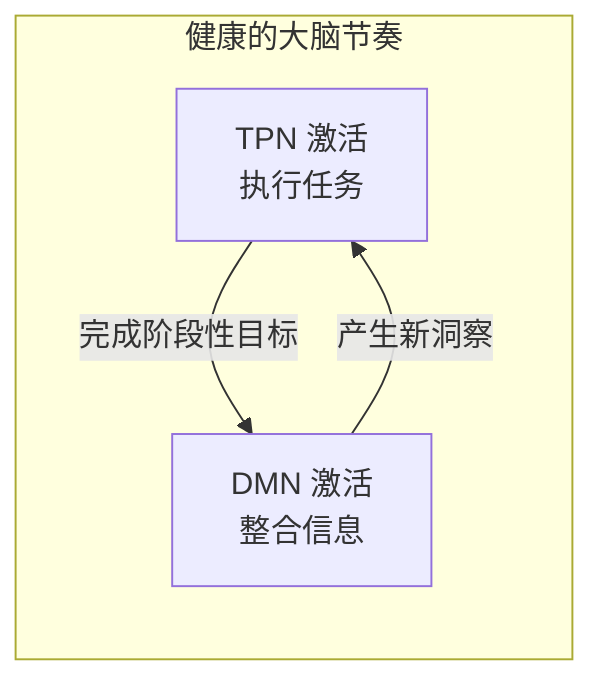

**隐喻：** 把 TPN 想象成"前台员工"——直接面对任务，处理客户（外部刺激）。DMN 则是"后台管理"——在你不接客的时候整理库存、思考战略。

---

## 2. 核心架构 (Core Framework)

### 2.1 什么是 TPN？

**任务正网络 (Task-Positive Network)** 是大脑中一组高度互联的脑区，在你**专注于外部任务**时被激活。它也被称为 **执行控制网络 (Executive Control Network)** 或 **中央执行网络 (Central Executive Network)**。

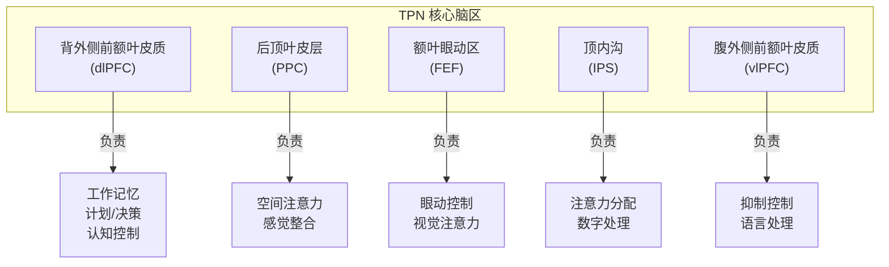

### 2.2 TPN 的核心功能

| 功能 | 描述 | 例子 |
|:---|:---|:---|
| **外部聚焦** | 将注意力指向外部任务，而非内部想法 | 专注阅读时忘记了时间 |
| **工作记忆** | 在脑中保持和操作信息 | 心算 37 × 24 |
| **目标追踪** | 维持目标意识，抵抗干扰 | 写论文时不去看手机 |
| **认知控制** | 抑制无关信息，包括走神 | 开会时不去想午饭吃什么 |
| **任务执行** | 把计划转化为行动 | 按步骤完成项目 |

### 2.3 TPN 什么时候最活跃？

| 状态 | TPN 活动 | 例子 |
|:---|:---|:---|
| **解决问题** | ★★★★★ | 调试代码、数学证明 |
| **专注阅读** | ★★★★★ | 看技术文档、学术论文 |
| **学习新技能** | ★★★★ | 学新语言、练乐器 |
| **规划执行** | ★★★★ | 制定项目计划并执行 |
| **心流状态** | ★★★★★ | 全神贯注，忘我工作 |
| **发呆/走神** | ★ | DMN 主导，TPN 休息 |

### 2.4 TPN vs DMN 的跷跷板

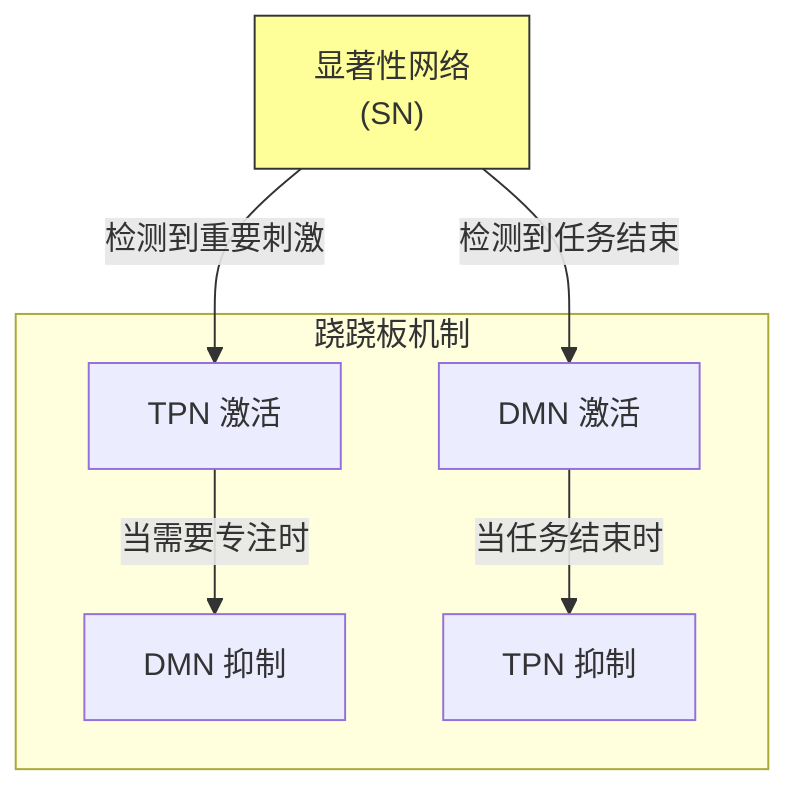

| 对比项 | TPN (任务模式) | DMN (默认模式) |
|:---|:---|:---|
| **激活条件** | 有外部任务 | 无外部任务 |
| **注意力方向** | 外向 (环境) | 内向 (自我) |
| **时间导向** | 当下 | 过去/未来 |
| **思维类型** | 聚焦/目标导向 | 发散/自由联想 |
| **与专注的关系** | 驱动专注 | 走神的来源 |
| **与创造力的关系** | 评估想法 | 生成想法 |

> **关键发现：** TPN 和 DMN 的反相关不仅在执行任务时存在，在静息状态下也存在。这种反相关的强度与个体的认知表现相关——反相关越强，认知灵活性越好。

---

## 3. TPN 的核心脑区

### 3.1 背外侧前额叶皮质 (dlPFC)

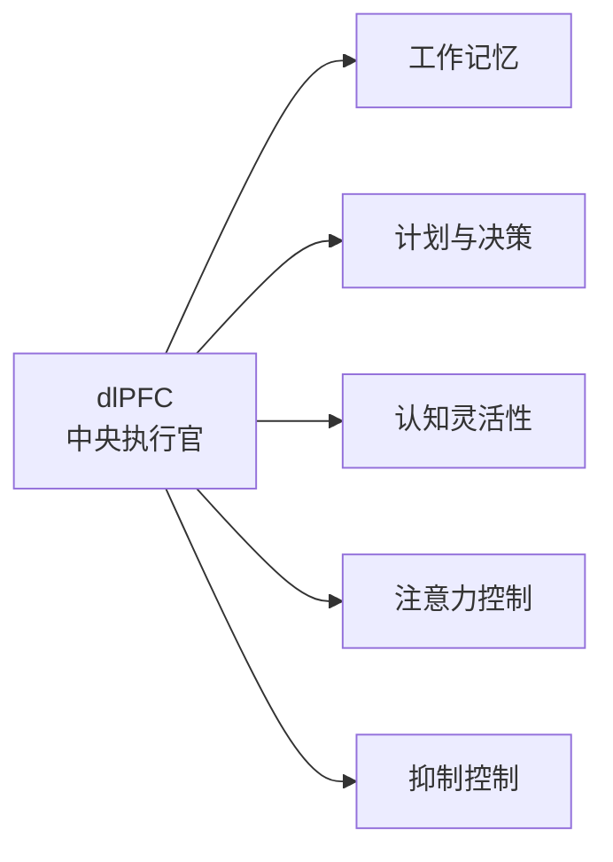

dlPFC 是 TPN 的"首席执行官"，负责：
- **工作记忆**：在脑中暂存和处理信息
- **目标维持**：记住"我现在要做什么"
- **认知灵活性**：根据新信息调整策略
- **抑制控制**：压制冲动和干扰

> **隐喻：** dlPFC 就像电脑的 RAM（内存）+ CPU——既负责暂存数据，又负责处理运算。

**如果 dlPFC 受损会怎样？**
- 难以维持目标
- 容易被干扰
- 决策能力下降
- 冲动控制困难

### 3.2 后顶叶皮层 (PPC)

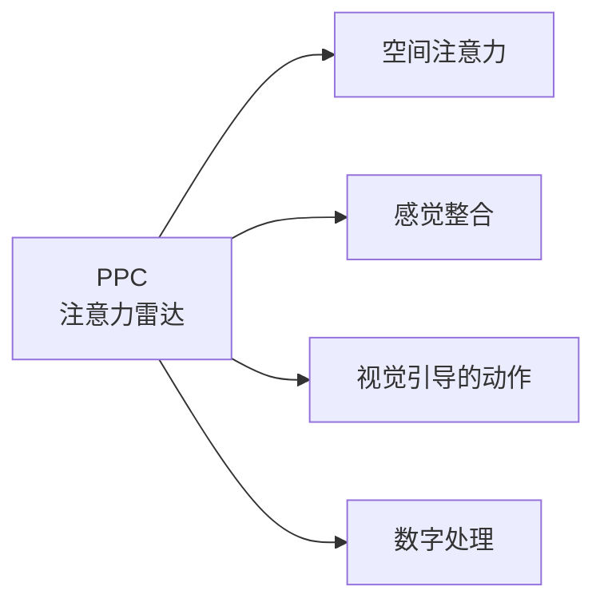

PPC 是 TPN 的"感知整合中心"：
- **空间注意力**：决定"关注哪里"
- **多感官整合**：把视觉、听觉、触觉信息整合
- **数字处理**：直觉数量感知

### 3.3 顶内沟 (IPS)

顶内沟是注意力的"分配器"——决定认知资源往哪里投放。它与视觉注意力、数字认知密切相关。

| 脑区 | 主要功能 | 损伤后果 |
|:---|:---|:---|
| **dlPFC** | 工作记忆、决策 | 执行功能障碍 |
| **PPC** | 空间注意力 | 忽视综合征 |
| **FEF** | 眼动控制 | 视觉搜索困难 |
| **IPS** | 注意力分配 | 注意力缺陷 |
| **vlPFC** | 抑制控制 | 冲动失控 |

---

## 4. 如何激活和增强 TPN

### 4.1 进入专注状态

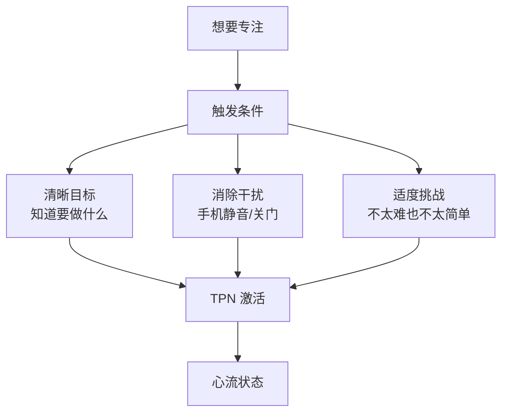

**TPN 激活的三大条件：**

| 条件 | 为什么重要 | 实操 |
|:---|:---|:---|
| **清晰目标** | dlPFC 需要知道"追踪什么" | 开始前写下：今天要完成什么？ |
| **消除干扰** | 减少 DMN 入侵的触发点 | 手机静音、关闭通知、关门 |
| **适度挑战** | 太简单会无聊，太难会焦虑 | 选择"努力一下能完成"的任务 |

### 4.2 深度工作策略

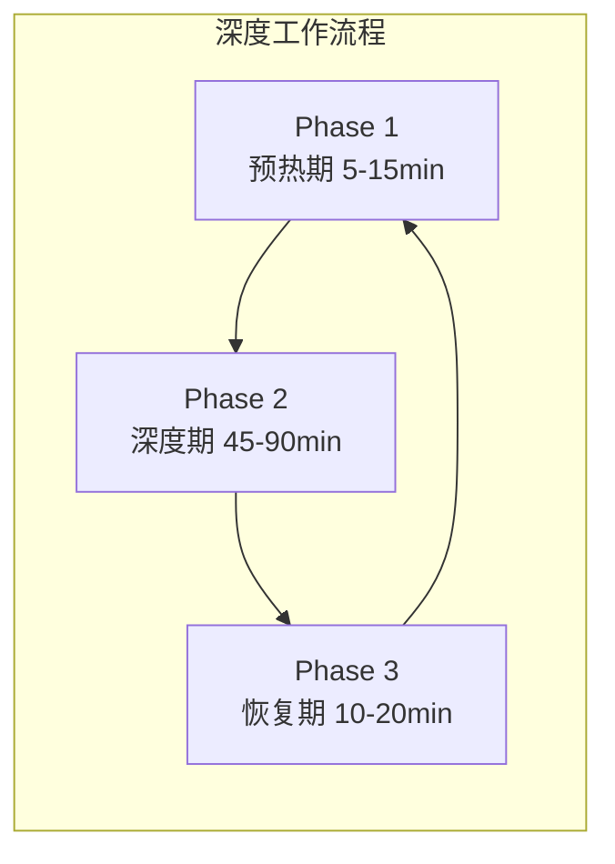

**深度工作定义：** 在无干扰状态下进行的职业活动，使个人认知能力达到极限，从而创造新价值。

| 策略 | 描述 | 效果 |
|:---|:---|:---|
| **时间阻断** | 固定时间段只做一件事 | 减少切换成本 |
| **番茄工作法** | 25 分钟专注 + 5 分钟休息 | 适合初学者 |
| **90 分钟周期** | 符合人体自然节律 | 适合深度任务 |
| **批处理** | 同类任务集中处理 | 减少认知切换 |

> **Cal Newport 的深度工作公式：**
> **高质量产出 = 专注时间 × 专注强度**
> 
> 碎片化的 8 小时 < 完整的 4 小时深度工作

### 4.3 心流状态入口

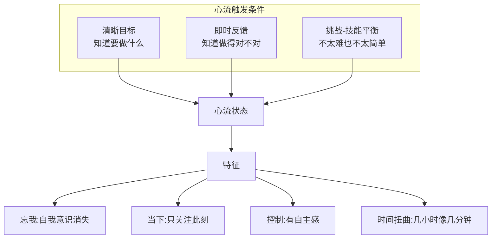

**心流状态的神经学特征：**
- TPN 高度激活（全力执行）
- DMN 强烈抑制（自我意识消失）
- 前额叶部分"下线"（停止自我监控）
- 多巴胺、内啡肽释放（愉悦感）

| 心流触发器 | 机制 | 实用方法 |
|:---|:---|:---|
| **清晰目标** | 让 dlPFC 知道追踪什么 | 开始前明确"今天完成什么" |
| **即时反馈** | 持续调整行为 | 写代码跑测试、画画看效果 |
| **挑战=技能+4%** | 在能力边缘工作 | 选难度适中的任务 |
| **高后果** | 增强注意力 | 设定 deadline |
| **深度专注** | 单一任务 | 关闭所有通知 |

### 4.4 冥想训练 TPN

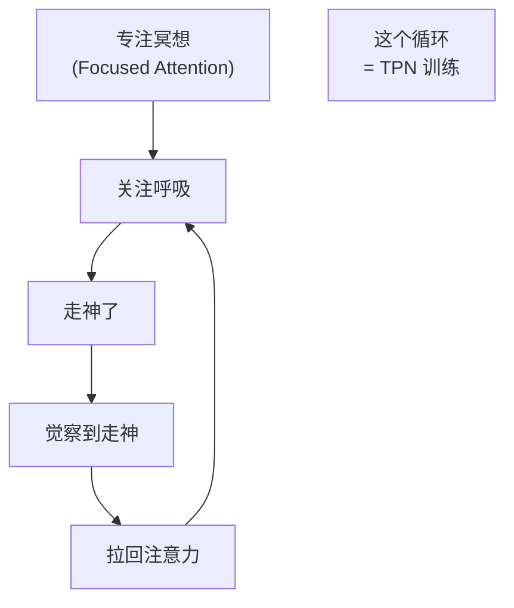

**专注冥想是 TPN 的"举重训练"：**

| 阶段 | TPN 状态 | 作用 |
|:---|:---|:---|
| 关注呼吸 | TPN 激活 | 练习外部聚焦 |
| 走神 | DMN 入侵 | 正常现象 |
| 觉察走神 | SN 激活 | 练习自我监控 |
| 拉回注意力 | TPN 重新激活 | 练习注意力切换 |

> **关键洞察：** 冥想的价值不在于"不走神"——那是不可能的。价值在于**反复练习"觉察-拉回"循环**，这会强化 TPN 和 SN 的连接，让你更快地发现走神并回到任务。

**冥想对 TPN 的效果（研究证据）：**
- 8 周正念训练 → 注意力测试提升 16%
- 增强 dlPFC 与 IPS 的功能连接
- 减少注意力切换时间
- 增强抗干扰能力

### 4.5 运动与 TPN


**运动增强 TPN 的机制：**
- 增加前额叶血流
- 提升多巴胺、去甲肾上腺素、血清素
- 促进 BDNF（脑源性神经营养因子）

**实操建议：**
- 开始深度工作前，先运动 20-30 分钟
- 不需要剧烈运动，中等强度最佳
- 走路也有效，但效果低于跑步/游泳

### 4.6 环境优化

| 干扰类型 | TPN 影响 | 解决方案 |
|:---|:---|:---|
| **手机通知** | 每次打断 = 20分钟恢复 | 静音/飞行模式 |
| **开放办公室** | 持续低水平干扰 | 降噪耳机 |
| **多任务** | 频繁切换消耗 TPN | 单任务模式 |
| **社交媒体** | 触发 DMN | 使用屏蔽工具 |

---

## 5. TPN 与心理健康

### 5.1 TPN-DMN 失衡与心理疾病

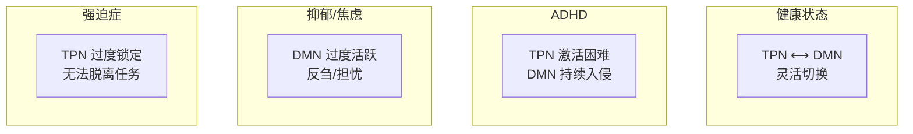

| 疾病 | TPN-DMN 模式 | 表现 |
|:---|:---|:---|
| **ADHD** | TPN 激活困难 | 注意力分散、冲动 |
| **抑郁症** | DMN 过度活跃 | 反刍、自我批评 |
| **焦虑症** | DMN 过度活跃 | 担忧未来 |
| **强迫症** | TPN 病理性锁定 | 无法从循环中脱离 |

### 5.2 注意力残留


**注意力残留定义：** 当你从任务 A 切换到任务 B 时，部分注意力仍然"卡在"任务 A 上。

**研究发现：**
- 每次任务切换后，需要约 **23 分钟** 才能完全回到原任务的专注水平
- 频繁切换会导致慢性认知疲劳
- 未完成的任务会产生更强的残留（Zeigarnik 效应）

**解决方案：**
- 在切换前完成一个"里程碑"
- 写下进度笔记，让大脑"放下"
- 批量处理同类任务

---

## 6. Anti-Patterns (反模式)

### 陷阱 1: 用多任务冒充高效

- **Trap:** 同时做多件事，以为自己效率很高
- **Why:** 多任务感觉很忙碌、很重要（自我欺骗）
- **Fix:** 单任务模式——同一时间只做一件事
- **Example:** 边开会边回邮件边写代码 → 三件事都没做好
- **Positive Scenario:** Cal Newport 每天只有 4 小时深度工作，但产出远超同行

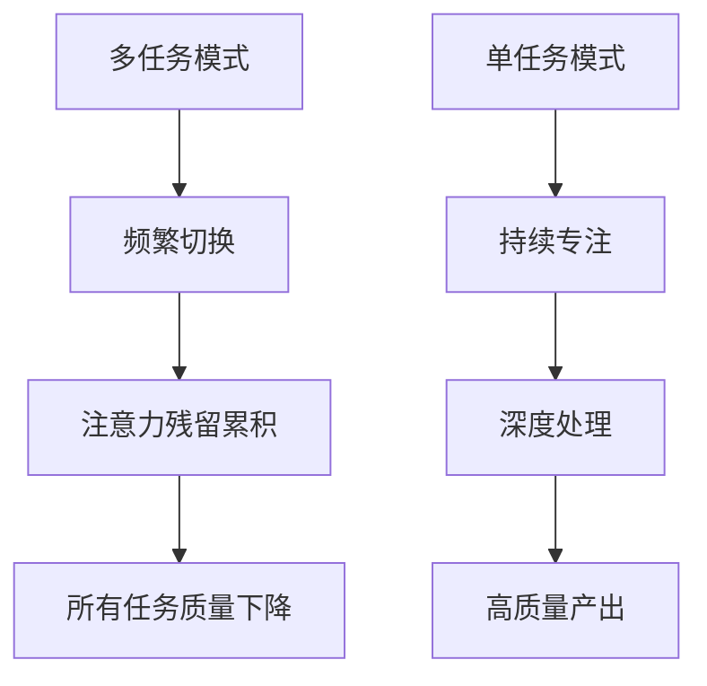

### 陷阱 2: 休息时刷手机

- **Trap:** 工作累了就刷手机"休息"
- **Why:** 手机提供即时多巴胺，让疲惫的大脑感觉好一点
- **Fix:** 用无刺激活动替代——发呆、散步、闭眼休息
- **Example:** 番茄钟间隙刷 5 分钟抖音 → TPN 根本没休息，DMN 也没激活
- **Positive Scenario:** 尼尔·盖曼每天散步 2 小时，期间不带手机，这是他创意的主要来源

> **关键洞察：** 刷手机不是休息——你的 TPN 仍然在接收和处理外部刺激。真正的休息需要激活 DMN（发呆、散步），或者完全放松（睡眠）。

### 陷阱 3: 追求"一直专注"

- **Trap:** 试图整天保持高度专注，认为这是高效的表现
- **Why:** 误解了"深度工作"的含义，以为越多越好
- **Fix:** 接受专注的自然节律——90 分钟周期，中间必须休息
- **Example:** 连续 8 小时"努力工作"→ 后半程效率极低，第二天更累
- **Positive Scenario:** 安德斯·艾利克森研究发现，顶尖专家的刻意练习每天不超过 4 小时

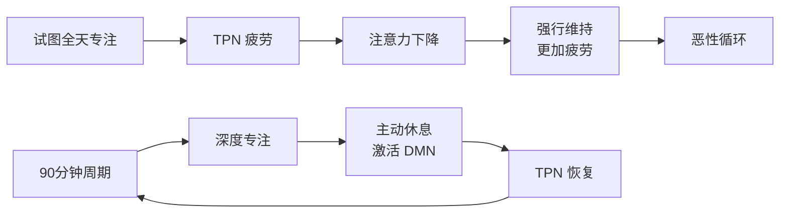

### 陷阱 4: 忽视"热身期"

- **Trap:** 期望一坐下就立刻进入心流状态
- **Why:** 低估了认知预热的必要性
- **Fix:** 允许 10-15 分钟的"预热时间"
- **Example:** 写了 5 分钟没找到感觉就放弃 → TPN 还没完全激活
- **Positive Scenario:** 村上春树每天早起，先喝咖啡、整理桌面、5 分钟"仪式感"启动，然后才开始写作

---

## 7. 实操协议 (Execution Protocol)

### 协议 1: 深度工作启动仪式

```
1. [环境] 关闭手机通知，手机放另一个房间
2. [目标] 写下今天要完成的具体产出 (非"工作 3 小时")
3. [预热] 做 5 分钟简单任务进入状态
4. [专注] 设定 50-90 分钟不间断工作
5. [休息] 离开屏幕，散步/发呆 10-15 分钟 (不刷手机)
6. [循环] 回到步骤 4，重复 2-4 个周期
```

### 协议 2: 日常 TPN 训练

```
早晨: 起床后做 5 分钟专注冥想 (关注呼吸)
上午: 安排最重要的任务 (TPN 最强时段)
午间: 午饭后小睡或散步 (DMN 恢复)
下午: 处理需要较少专注的任务
晚间: 睡前 1 小时不看屏幕 (让 TPN 休息)
```

### 协议 3: 注意力恢复流程

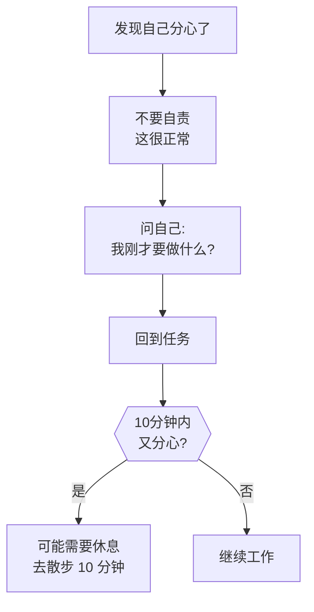

---

## 8. Glossary (术语表)

| 术语 | 英文 | 定义 (人话) |
|:---|:---|:---|
| **任务正网络** | Task-Positive Network (TPN) | 大脑的"执行引擎"，专注干活时激活 |
| **默认模式网络** | Default Mode Network (DMN) | TPN 的反面，发呆/走神时激活 |
| **背外侧前额叶皮质** | dlPFC | TPN 的"首席执行官"，负责工作记忆和决策 |
| **后顶叶皮层** | PPC | TPN 的"感知整合中心"，负责空间注意力 |
| **显著性网络** | Salience Network (SN) | 在 TPN 和 DMN 之间切换的"调度中心" |
| **工作记忆** | Working Memory | 脑中的"便签纸"，暂存和处理信息 |
| **深度工作** | Deep Work | 无干扰、高专注的工作状态，产出高质量 |
| **心流状态** | Flow State | 全神贯注的最优体验状态，忘我、愉悦 |
| **注意力残留** | Attention Residue | 任务切换后，注意力还"卡在"旧任务 |
| **认知控制** | Cognitive Control | 抑制干扰、维持目标的能力 |
| **执行功能** | Executive Function | 高级认知能力的统称：计划、决策、抑制 |
| **反相关** | Anticorrelation | TPN 和 DMN 的跷跷板关系 |
| **番茄工作法** | Pomodoro Technique | 25 分钟专注 + 5 分钟休息的时间管理 |
| **90 分钟周期** | Ultradian Rhythm | 人体自然的精力波动周期 |

---

## 9. Formula Table (公式表)

| 公式名 | 表达式 | 变量定义 |
|:---|:---|:---|
| **深度工作产出公式** | 产出 = 专注时间 × 专注强度 | 时间:无干扰时长; 强度:任务难度匹配程度 |
| **注意力恢复公式** | 恢复时间 = 23分钟 × 干扰次数 | 每次被打断后需要 23 分钟恢复 |
| **心流触发公式** | 心流 = 清晰目标 + 即时反馈 + (技能 ≈ 挑战) | 三条件同时满足 → 心流出现 |
| **TPN-DMN 效率公式** | 效率 = (TPN时间 × DMN时间) / 切换摩擦 | 需要两者都有足够时间，且切换顺畅 |
| **冥想 TPN 训练公式** | TPN 强度 = 冥想分钟 × 拉回次数 × 持续天数 | 每次"觉察走神并拉回"都是一次训练 |

---

## 10. 系统关联 (Interlinkages)

- **上游 (Input):**
  - 神经科学基础 → 大脑网络理论
  - 认知心理学 → 注意力研究
- **下游 (Output):**
  - 生产力系统 → 深度工作方法论
  - **DMN 模块** → 创造力与反刍
  - 内容创作 → Asyre 框架执行阶段
- **跨领域连接:**
  - 冥想 → TPN 训练
  - 运动 → TPN 增强
  - 睡眠 → TPN 恢复

---

## 备注与引用 (Notes & References)

- **Michael Posner:** 注意力网络理论的奠基人
- **Cal Newport:** 《深度工作》作者，TPN 应用的代表人物
- **Mihaly Csikszentmihalyi:** 心流理论的创始人  
- **NIH 研究:** TPN 与 DMN 的反相关机制
- **fMRI 研究:** 深度工作与心流状态下的脑活动模式
