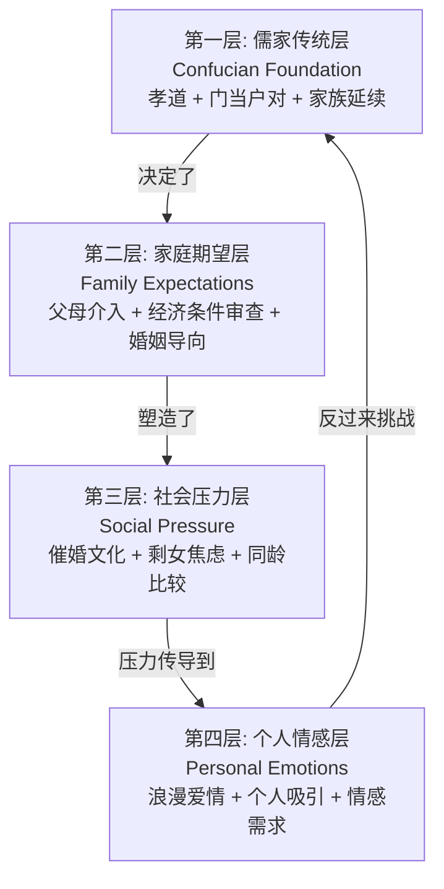
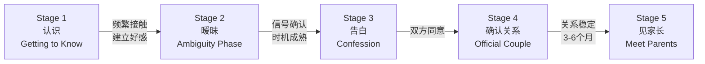
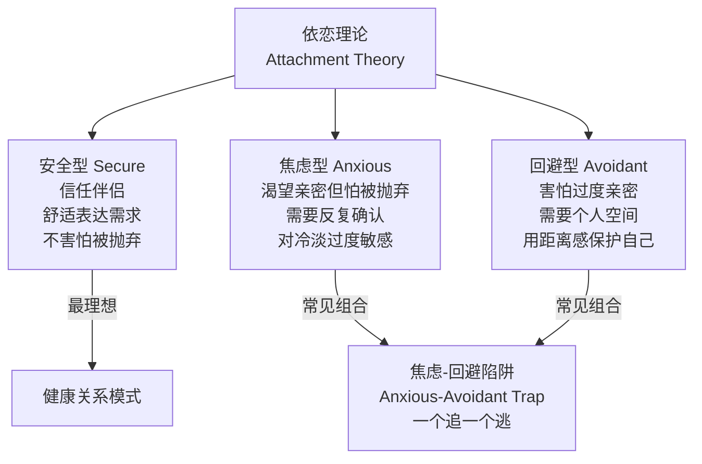
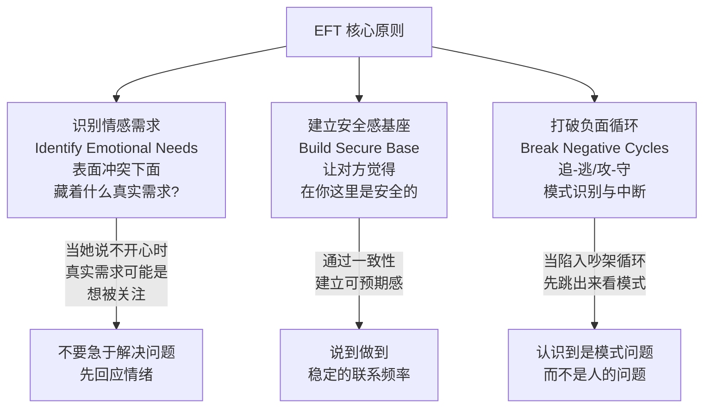
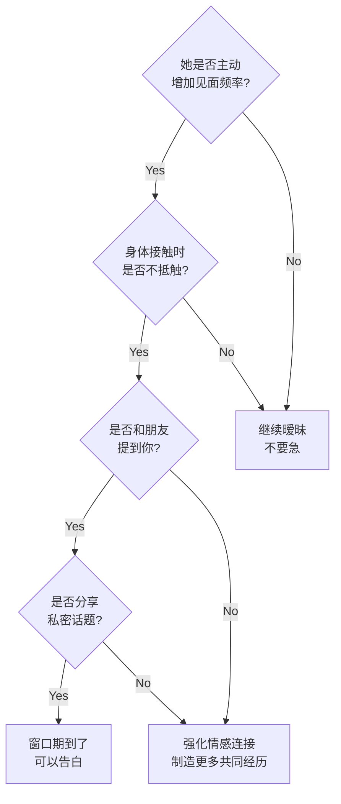
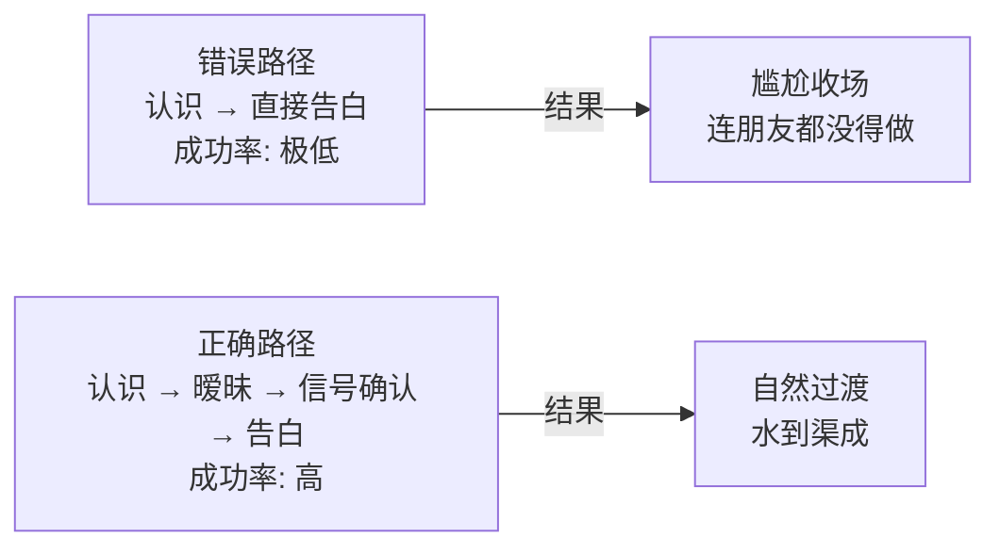
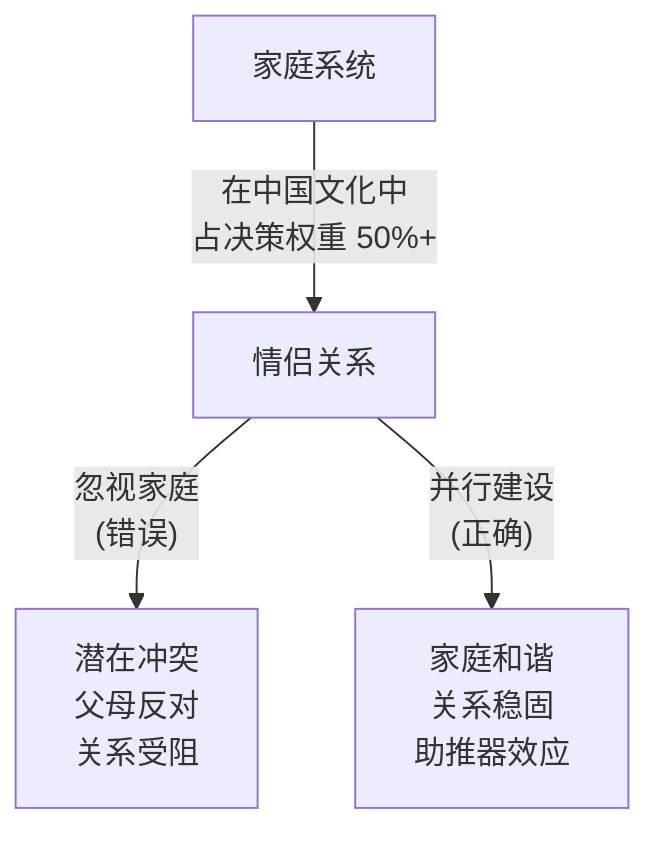
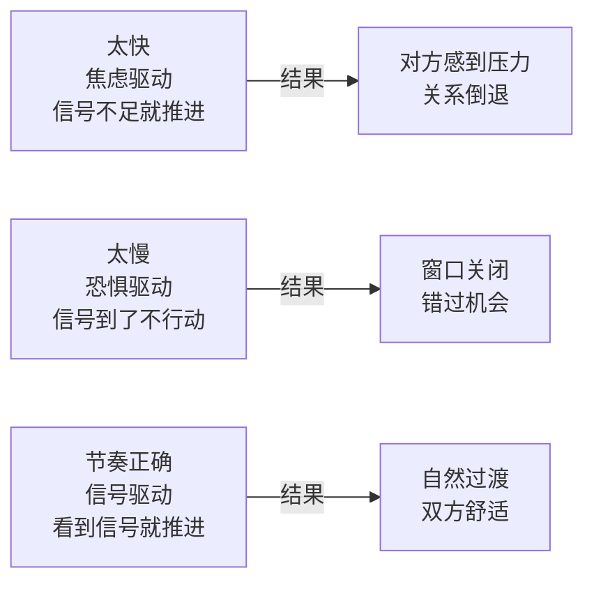

# 中国文化背景下的恋爱关系建立 (Chinese Dating & Relationship Building)

> **Tags:** `Psychology`, `Relationships`, `Cultural-Intelligence`, `Dating`
> **Date Added:** `2026-01-28`
> **一句话总结 (One-Liner):** 在中国文化语境下，恋爱不是两个人的事，而是两个家庭系统的对接——理解"含蓄表达+家庭本位+阶段确认"三重结构，才能从认识走到确定关系。
> **关键协议 (Critical Protocol):**
> 1.  **结构服从内容 (Structure Follows Content):** 本模块按恋爱关系的自然推进阶段组织，从文化底层逻辑到具体执行步骤。
> 2.  **原子级视觉化 (Atomic Visualization):** 每一个重要概念配图。
> 3.  **拒绝阉割 (No Summary):** 保留所有文化细节和心理机制。

---

## 1. 元认知 (Metacognition) - 为什么要系统学习这个？

*Why does this module exist?*

*   **问题定义:** 大多数人在恋爱中凭"感觉"行事，但"感觉"本身是文化编程的产物。一个在西方文化中完全正确的恋爱行为（比如第三次约会后直接问"我们在一起吗？"），放到中国语境下可能显得突兀甚至吓人。你以为你在表达真诚，对方觉得你在施压。**问题不是你不够好，而是你用错了操作系统。**

*   **核心哲学:** 恋爱关系的建立是一个**信号发射与解码**的过程。在中国文化中，这套信号系统有它独特的编码规则：含蓄优先于直白，行动优先于语言，家庭认同优先于个人感觉。不懂这套编码，你发出的信号对方接收不到，对方发出的信号你也读不懂。

*   **系统定位 (System Role):** 本模块属于 Psychology 系统下的"社会关系工程"分支，为个人在中国文化语境下建立亲密关系提供认知框架和行动协议。

> [!IMPORTANT]
> **核心洞察 (Key Insight):** 在中国恋爱文化中，**"暧昧期"不是浪费时间，而是关系建立的核心基础设施**。西方文化倾向于快速明确关系状态（DTR: Define The Relationship），但中国文化中的暧昧期承担着信任测试、兼容性验证、家庭预审等多重功能。跳过暧昧期直接告白，就像跳过地基直接盖楼——看似高效，实则危险。

---

## 2. 核心架构 (Core Framework - The "What")

### 2.1 中国恋爱文化的四层结构模型

中国恋爱文化不是一个单一系统，而是四层嵌套结构。每一层都在影响恋爱行为，但大多数人只能看到最表层。

**关键解读:**
- **第一层 (儒家传统层):** 这是底层操作系统。即使在最现代化的中国城市女生身上，"孝" (Filial Piety, 对父母的尊重和服从) 仍然是一个强大的潜意识力量。不是说她一定会听父母的，而是说父母的意见在她的决策权重中占比远高于西方文化。"门当户对" (Men Dang Hu Dui, 字面意思是"门面和户头相配"，实际指社会经济地位匹配) 不是封建残余，而是家庭对婚姻风险管理的朴素策略。
- **第二层 (家庭期望层):** 父母不仅仅是"旁观者"，在很多家庭中，父母是实际的"关系审批方"。相亲 (Xiang Qin, 安排的约会/相亲) 在中国仍然非常普遍，尤其在二三线城市。即使是自由恋爱，"见家长"是关系进入正式阶段的必经门槛。
- **第三层 (社会压力层):** "剩女" (Sheng Nv, 字面意思是"剩下的女人"，指27岁以上未婚女性) 这个词本身就体现了巨大的社会压力。即使很多女生口头上说"不在乎"，这种社会时钟的滴答声仍然影响着她们对关系进展速度的期待。
- **第四层 (个人情感层):** 现代中国年轻人越来越追求"浪漫爱情" (Romantic Love)，受韩剧、社交媒体的影响，她们对恋爱体验有很高的期待——不仅要有感情，还要有"仪式感" (Yi Shi Gan, 仪式感/精心安排的浪漫时刻)。

### 2.2 关系推进的五阶段模型

中国恋爱关系有一个比西方更清晰的"阶段感"。每个阶段有明确的信号和门槛。

| 阶段 | 持续时间 | 核心任务 | 关键信号 | 常见错误 |
| :--- | :--- | :--- | :--- | :--- |
| **认识期** | 1-4周 | 建立基本印象和联系方式 | 愿意加微信、回复消息 | 太早表露意图 |
| **暧昧期** | 2-8周 | 建立情感连接和信任 | 主动找你聊天、分享日常 | 不敢推进或推进过快 |
| **告白期** | 特定时刻 | 正式表达心意 | 对方已给出足够正向信号 | 在没有铺垫时突然告白 |
| **确认关系** | 持续 | 公开恋爱身份、融入彼此生活 | 朋友圈公开、情侣装 | 确认后松懈、不维护关系 |
| **见家长** | 关系确认后3-6月 | 获得家庭认可 | 双方主动提出 | 太早见或准备不足 |

### 2.3 依恋理论 (Attachment Theory) 在中国恋爱中的应用

依恋理论 (Attachment Theory) 是心理学家 John Bowlby 和 Mary Ainsworth 提出的理论——人在童年时期与主要照顾者（通常是母亲）的互动模式，会深刻影响成年后的亲密关系模式。这不是"命运"，而是一种可以被认知和调整的"默认设置"。

**中国文化背景下的特殊性:**

根据 ResearchGate 上关于中国 18-30 岁女性的研究，中国女性在依恋模式上有以下特点:

| 依恋类型 | 中国文化中的表现 | 解读建议 |
| :--- | :--- | :--- |
| **安全型** | 表达直接但不失分寸，愿意主动约你，能平衡亲密与独立 | 最好的关系基础，正常推进即可 |
| **焦虑型** | 频繁查看消息、在意回复速度、需要确认感、容易"作" (Zuo, 情绪化地试探对方) | 给予稳定的回应节奏，不要忽冷忽热 |
| **回避型** | 表面冷淡、不轻易表达感情、需要大量个人空间、亲密后突然疏远 | 不要追得太紧，给空间，通过行动而非语言建立安全感 |

**重要发现:** 研究表明，具有回避型依恋模式的中国年轻人在参与了"亲密感建立活动" (Intimacy-Building Activities, 比如深度对话、共同经历等) 之后，回避倾向有明显减少。**这意味着回避型不是不可改变的，关键是用对方法。**

### 2.4 EFT 情感聚焦疗法 (Emotionally Focused Therapy) 的启示

EFT 是由 Dr. Sue Johnson 开发的心理疗法，专注于建立和修复伴侣之间的情感连接。治疗师 Peggy Bolcoa（25年临床经验）指出，EFT 能将恋爱关系满意度提高约 70%。

EFT 的核心思想用于恋爱建立的关键启示:

**EFT 应用于恋爱初期的三个实操建议:**

1. **情绪镜像 (Emotional Mirroring):** 当对方分享心情时，不要急着给建议或解决方案。先反射她的情绪——"听起来你今天压力很大" 比 "你应该这样做" 有效100倍。中国文化中，女生测试你是否"懂她"的方式，往往是分享一个情绪，看你是否能接住。
2. **一致性信号 (Consistency Signals):** 每天固定的早安/晚安消息、约定的联系频率、承诺的事情一定做到。在中国恋爱文化中，"靠谱" (Kao Pu, 可靠) 是比"有趣"更高权重的品质。
3. **安全空间构建 (Safe Space Building):** 创造一个她可以不用"端着"的空间。在中国社会中，很多女生在外面要"得体"、"懂事"、"不麻烦别人"，如果你能成为那个她可以展示脆弱面的人，你就已经赢了一半。

---

## 3. 执行协议 (Execution Protocol - The "How")

### Phase 1: 认识期 — 建立第一印象

*   **动作 (Action):** 通过自然社交场景（朋友聚会、工作场合、兴趣班）建立初步接触。在中国，"搭讪" (Da Shan, 陌生人搭讪) 的社会接受度远低于西方。最自然的方式是通过共同朋友、共同活动来建立联系。
*   **心法 (Heuristic):** 第一印象不是"惊艳"而是"舒服"。在中国文化中，让人觉得"这个人挺好的，很舒服"比"哇这个人好帅好酷"有更高的长期转化率。
*   **细节 (Nuance):**
    *   **微信加好友**是起点。在中国，微信 (WeChat) 不仅是聊天工具，更是社交身份系统。加微信是允许你进入她社交世界的第一步。
    *   **朋友圈 (Moments)** 是你的"无声简历"。她会翻你的朋友圈来了解你是什么样的人。保持朋友圈有品质的内容（不是炫耀，而是展示你的生活态度和品味）。
    *   **不要太早约单独出去**。先在群体活动中建立熟悉感，再自然过渡到一对一。

**Phase 1 视觉化:**

| 行为 | 推荐做法 | 避免做法 |
| :--- | :--- | :--- |
| 获取联系方式 | 通过共同朋友自然引荐加微信 | 突然要电话号码、在社交软件上尬聊 |
| 第一次互动 | 在群体活动中自然交流 | 单独约出去 |
| 朋友圈经营 | 展示生活品质和兴趣爱好 | 炫富、发太多自拍、负能量 |
| 聊天频率 | 每天有1-2次自然的互动 | 消息轰炸、秒回每条消息 |
| 话题选择 | 美食、旅行、共同兴趣 | 太私人的问题、感情史 |

### Phase 2: 暧昧期 — 建立情感连接

*   **动作 (Action):** 通过高质量的一对一互动，逐步深化情感连接。这是整个过程中最关键、也最微妙的阶段。
*   **心法 (Heuristic):** 暧昧期的核心技术是**"推拉" (Push-Pull)**——不是操控，而是在靠近和保持距离之间找到节奏。太主动会让她觉得"到手了不珍惜"，太被动会让她觉得"你到底喜不喜欢我"。关键是**制造"不确定中的确定性"**——让她知道你对她有好感，但不确定你到底有多喜欢她。
*   **细节 (Nuance):**
    *   **约会安排要用心但不刻意。** 选有品质的餐厅/咖啡馆，但不要太正式。在中国，约会的"用心程度"被解读为"你有多重视这个人"。
    *   **关注细节并记住。** 她上周提到想吃的东西，下次约会时你带她去——这种细节在中国恋爱文化中的权重极高。因为中国文化中"懂你"比"爱你"更难得。
    *   **适度的身体接触要循序渐进。** 中国文化中的身体界限比西方更保守。顺序通常是：肩膀轻碰 → 牵手 → 拥抱。不要跳步骤。
    *   **制造共同记忆。** 一起做有意义的事情（不只是吃饭看电影）：一起做饭、一起逛展览、一起参加活动。共同经历是情感连接的催化剂。

**暧昧期信号解读表:**

| 她的信号 | 正向解读 | 应对策略 |
| :--- | :--- | :--- |
| 主动给你发消息 | 对你有兴趣 | 积极回应但不过度热情 |
| 分享日常琐事 | 在建立亲近感 | 认真听、记住细节 |
| 发"在干嘛?" | 想你了但不好意思直说 | 回复后顺势聊天或约出来 |
| 约会时不看手机 | 全心投入和你的互动 | 你也放下手机 |
| 提起你时对朋友说"我朋友" | 还没确认关系但在铺垫 | 正常推进，不要急 |
| 愿意晚上和你单独出去 | 信任度很高 | 表现绅士，安全送回家 |
| 给你买小礼物/带吃的 | 在用行动表达好感 | 回赠小心意，不要太贵重 |

### Phase 3: 告白 — 正式表达心意

*   **动作 (Action):** 在充分铺垫的基础上，选择合适的时机和场景正式表达你的心意。在中国恋爱文化中，"告白" (Gao Bai, Confession of feelings) 是一个非常重要的仪式性节点。它不是西方式的"Do you want to be exclusive?"，而更像是一个**正式的、带有仪式感的情感声明。**
*   **心法 (Heuristic):** 告白的成功率取决于**铺垫质量的90% + 告白本身的10%**。如果前面的暧昧期做得好，告白只是"摘已经熟了的果子"。如果告白被拒绝，通常意味着暧昧期的信号你读错了。
*   **细节 (Nuance):**
    *   **时机判断:** 当她开始在你面前放下防备、主动增加见面频率、对你的身体接触没有抵触时，告白窗口期到了。
    *   **场景选择:** 有氛围但不夸张。避免过于公开（在商场大屏幕上表白会让很多女生尴尬而非感动）。浪漫的私密空间（夜景点、安静的餐厅、散步时）更合适。
    *   **语言表达:** 真诚 > 华丽。"我发现自己越来越喜欢你，想认真和你在一起"比任何华丽的情话都更有力量。
    *   **准备好被拒绝:** 有些中国女生第一次会"假装拒绝" (表面推辞但其实心里同意)，也有些是真的拒绝。如何判断？如果她拒绝后仍然主动和你保持高频联系，可能是"假拒绝"；如果减少联系，就是真拒绝，要尊重。

**告白时机判断矩阵:**

### Phase 4: 确认关系 — 从"在一起"到"稳定经营"

*   **动作 (Action):** 关系确认后，进入"关系维护模式"。在中国恋爱文化中，确认关系后有很多"仪式性行为"是被期待的。
*   **细节 (Nuance):**
    *   **朋友圈公开:** 在朋友圈（微信的社交动态）中公开恋爱关系，是中国情侣确认关系后的重要仪式。这不只是"秀恩爱"，更是向社交网络宣告"这个人是我的人"。
    *   **情侣装/情侣物品:** 穿同款衣服 (情侣装 Qing Lv Zhuang)、用同款手机壳、戴同款饰品——这在中国恋爱文化中非常普遍。它是一种归属感的外在表达。
    *   **手机互看:** 在中国恋爱关系中，看对方手机被认为是信任的表现而非不信任的表现（与西方观念完全相反）。拒绝让对方看手机反而会被解读为"有鬼"。
    *   **节日仪式:** 情人节 (2月14日)、七夕 (中国情人节)、520 (因为谐音"我爱你")、恋爱纪念日、生日——这些日子都需要精心准备。在中国恋爱文化中，"仪式感"不是可选项，而是必修课。
    *   **日常维护:** 每天的早安晚安消息、汇报行踪、及时回复消息——这些在西方可能被视为"控制"的行为，在中国恋爱文化中被视为"关心"和"靠谱"。

**确认关系后的仪式清单:**

| 仪式 | 重要性 | 说明 |
| :--- | :--- | :--- |
| 朋友圈官宣 | 高 | 关系公开化的标志 |
| 情侣物品 | 中 | 外在归属感表达 |
| 节日庆祝 | 高 | 520/七夕/纪念日必须重视 |
| 每日问候 | 高 | 早安晚安是基本操作 |
| 见彼此朋友 | 中 | 融入对方社交圈 |
| 共同规划 | 高 | 讨论未来计划，表明认真态度 |

### Phase 5: 见家长 — 获得家庭认可

*   **动作 (Action):** 在关系稳定后（通常3-6个月），安排见双方家长。这是中国恋爱关系中最重要的"里程碑"之一。
*   **心法 (Heuristic):** 见家长不是"走过场"，而是一场**双向面试**。她的父母在评估你是否是合格的伴侣，同时你也在了解她的家庭环境。
*   **细节 (Nuance):**
    *   **提前了解家庭情况:** 她父母的职业、性格、忌讳，都要提前了解。
    *   **礼物选择:** 第一次见面带礼物是必须的。烟酒茶、水果、保健品是常见选择，具体根据对方家庭情况而定。不要空手上门。
    *   **餐桌礼仪:** 主动给长辈倒茶/夹菜、不先动筷子、不玩手机——这些细节都在被观察。
    *   **展现"靠谱":** 稳定的工作、清晰的人生规划、对女儿好——这三点是大多数中国父母最关心的。

---

## 4. Anti-Patterns (反模式 - The "Don'ts")

> **[MANDATORY] 必选章节**

### 陷阱 1: "直球型告白"陷阱 — 没有铺垫就告白

*   **Trap (错误做法):** 认识没多久，还没有建立足够的情感连接，就直接告白："我喜欢你，做我女朋友吧。"

*   **Why (为什么会犯错):** 受西方影视文化影响，认为"勇敢表达"就是最大的美德。但在中国恋爱文化中，没有铺垫的告白不是勇敢，而是**不懂分寸**。它让对方感到：(1) 压力——不知道怎么拒绝才不尴尬；(2) 不安全感——"他真的了解我吗？还是只是看上我外表？"；(3) 尴尬——如果拒绝了以后怎么相处？

*   **Fix (如何修正):** 遵循"30-70法则"——当你有30%的把握时开始暧昧，70%的把握时才告白。暧昧期不是浪费时间，而是在做"风险对冲"。

*   **Example:** 小李在公司认识了一个女同事，聊了三天微信就发了一大段告白信。女生回复："我觉得我们还不太了解彼此，做朋友吧。"之后两人在公司见面极其尴尬，女生开始刻意回避他。

*   **Positive Real Scenario (正向实例):** 小王认识了一个女生后，花了一个月时间通过群体活动建立熟悉感，然后开始一对一的约会，在约会中通过深度对话和共同经历建立了情感连接。当他告白时，女生说："其实我也早就觉得你不一样了。"因为有充分的铺垫，告白只是水到渠成的确认。

**陷阱 1 视觉化:**

### 陷阱 2: "忽视家庭"陷阱 — 以为恋爱只是两个人的事

*   **Trap (错误做法):** 只关注和女生本人的关系，完全不考虑她的家庭因素。甚至在她提到父母意见时觉得"这是她自己的事，跟她父母有什么关系"。

*   **Why (为什么会犯错):** 来自西方个人主义文化的思维框架——认为恋爱是两个独立个体的事。但在中国文化中，"家庭系统" (Family System) 的权重远高于个人主义社会。研究表明，尽管年轻一代有更多的个人主义倾向，但"孝道义务" (Filial Obligation) 仍然是影响恋爱和婚姻决策的强大力量。忽视家庭因素等于忽视了50%以上的决策权重。

*   **Fix (如何修正):** 将"家庭认可"作为关系建设的并行任务而非后续任务。在恋爱初期就了解她的家庭情况、家庭期望，在行为上展现出"我尊重你的家庭"。具体来说: (1) 对她提到的家人表现出真诚的兴趣; (2) 当她因为家庭压力焦虑时给予理解而非反对; (3) 在合适的时机表达你愿意认识她家人的意愿。

*   **Example:** 外企工作的 David 和中国女朋友交往了8个月，一切顺利。但当女生第一次带他见父母时，他完全不了解中国的见家长礼仪——空手上门、直呼父母名字、谈话时一直看手机。女生父母之后对女儿说："这个人不行，对长辈没有基本的尊重。"两人的关系开始出现裂痕。

*   **Positive Real Scenario (正向实例):** Mark 在恋爱初期就注意到女朋友经常提到"我妈说..."，他没有觉得烦，而是认真了解了她的家庭情况。第一次见家长时，他提前请女朋友帮他准备了合适的礼物，在饭桌上主动给长辈夹菜倒茶，还提到自己关注了她妈妈推荐的一部电视剧。女方父母非常满意，这为后续的关系发展扫清了最大障碍。

**陷阱 2 视觉化:**

### 陷阱 3: "不读潜台词"陷阱 — 误解含蓄表达

*   **Trap (错误做法):** 把中国女生的话按字面意思理解。当她说"随便" (Sui Bian, Whatever/Anything is fine)，你真的随便选了；当她说"我没事" (Wo Mei Shi, I'm fine)，你真的以为她没事。

*   **Why (为什么会犯错):** 中国文化是典型的"高语境文化" (High-Context Culture)——大量的信息不是通过语言明确表达的，而是藏在语境、语气、表情和行为中。这不是"虚伪"或"不直接"，而是一种文化编码方式。在中国文化中，直接表达需求被视为"不够含蓄"、"太强势"，而"让对方自己领悟"才是理想的互动方式。当她说"我没事"，她传达的信息是"我希望你能注意到我不开心，然后主动来关心我"。

*   **Fix (如何修正):** 学会"听话听音" (Ting Hua Ting Yin, 听字面背后的真实含义)。建立一个"潜台词词典"，并在实践中不断校准。核心原则: **当她说的话和她的表情/行为不一致时，相信表情/行为。**

*   **Example:** 约会选餐厅时问她"想吃什么"，她说"随便"。你真的随便选了一家快餐店。她嘴上说没关系，但整顿饭兴致不高。实际上，"随便"的潜台词是"你来决定，但我希望你的选择能体现出你对我的了解和用心"。

*   **Positive Real Scenario (正向实例):** 小张约女朋友吃饭，她说"随便"。小张没有真的随便选，而是想起她上周在朋友圈点赞了一家日料店，于是订了那家。女生一进门就很开心地说"你怎么知道我想吃这个！"——其实她自己都没意识到自己发过那个赞。**细节记忆 + 潜台词解读 = 高分操作。**

**常用潜台词对照表:**

| 她说的 | 字面意思 | 真实含义 |
| :--- | :--- | :--- |
| "随便" | 无所谓 | 你来选，但要选好的 |
| "我没事" | 我很好 | 我不太好，但想让你主动发现 |
| "你忙吧" | 你去忙 | 我希望你能放下手上的事来陪我 |
| "都行" | 什么都可以 | 有偏好但不好意思说，你猜 |
| "好吧" | 同意 | 不太满意但不想争论 |
| "你决定" | 你来决定 | 你来选但要选得让我满意 |
| "哦" | 知道了 | 没什么话想跟你说了/不高兴了 |

### 陷阱 4: "速度错配"陷阱 — 用错节奏推进关系

*   **Trap (错误做法):** 要么太快（认识一周就想天天见面），要么太慢（暧昧半年还不告白）。

*   **Why (为什么会犯错):** 太快的人通常是情感焦虑型——害怕错过窗口期，用加速来缓解不确定感。太慢的人通常是回避型或过度分析型——害怕被拒绝，用拖延来避免风险。但在中国恋爱文化中，速度有一个"舒适区"——不是日历上的固定天数，而是**信号质量决定的节奏**。

*   **Fix (如何修正):** 不要按时间推进，要按**信号**推进。每个阶段都有"通关信号"——当这些信号出现时，才进入下一阶段。没有信号就不要急。

*   **Example (太快):** 小王第二次见面就牵手了（对方勉强没有拒绝），第三次见面就告白了。女生虽然说"我再想想"，但之后明显减少了联系。因为她还没有准备好，你的速度让她感到不舒服。

*   **Example (太慢):** 小李和一个女生暧昧了五个月，所有朋友都看出来两人互相喜欢，但他一直不告白。最后女生觉得"他可能不是那么喜欢我"，接受了另一个人的追求。

*   **Positive Real Scenario (正向实例):** 小陈不急不慢，通过观察对方的信号来调整节奏。当他注意到女生开始主动约他、分享私密话题、身体接触不抵触时，他知道窗口期到了。选了一个两人都很放松的晚上，自然地表达了心意。女生说："我等这句话等好久了。"——**不是等了很久所以着急，而是等够了所以安心。**

**陷阱 4 视觉化:**

---

## 5. 系统关联 (Interlinkages)

*   **上游 (Input):**
    *   依恋理论基础 → `Psychology/Social_Psychology/`
    *   沟通技巧 → (待建模块)
*   **下游 (Output):**
    *   长期关系维护 → (待建模块)
    *   跨文化沟通 → (待建模块)

---

## 7. Glossary (术语表)

*   **告白 (Gao Bai):** 正式向对方表达爱意的行为。不是随意的"我喜欢你"，而是一个有仪式感的情感声明，通常意味着"我想正式和你在一起"。在中国恋爱中，告白是从暧昧期进入正式关系的关键仪式节点。
*   **暧昧 (Ai Mei):** 介于"朋友"和"恋人"之间的灰色地带。两人互有好感但还没有明确关系。在中国恋爱文化中，暧昧期承担着信任测试、兼容性验证等重要功能，不是浪费时间。
*   **门当户对 (Men Dang Hu Dui):** 字面意思是"门面和户头相配"，指社会经济地位匹配。表面上看是"物质条件"，深层是家庭对婚姻风险管理的策略——相似背景的人有更多共同语言和更低的文化冲突概率。
*   **孝 / 孝道 (Xiao / Filial Piety):** 对父母的尊重和服从。不是盲目服从，而是在重大人生决策（包括婚恋）中将父母的意见纳入考量。即使在最现代化的中国女生身上，孝道仍是潜意识中的强大力量。
*   **相亲 (Xiang Qin):** 由父母、亲戚或媒人安排的约会。不是"被迫"，很多时候是家庭帮助扩大社交圈的方式。在二三线城市仍然非常普遍。
*   **剩女 (Sheng Nv):** 指27岁以上未婚的城市职业女性。这个词本身带有性别歧视色彩，但它反映了中国社会对女性婚恋年龄的巨大压力。理解这个词的存在有助于理解中国女生在恋爱中面临的社会时钟压力。
*   **情侣装 (Qing Lv Zhuang):** 情侣穿的同款衣服。是中国恋爱文化中归属感和亲密关系的外在表达，在西方较少见。
*   **仪式感 (Yi Shi Gan):** 通过精心安排的行为或场景来赋予日常时刻以特殊意义。在中国恋爱文化中极其重要——节日礼物、纪念日庆祝、朋友圈官宣都属于仪式感。
*   **靠谱 (Kao Pu):** 意为"可靠的、说到做到的"。在中国恋爱文化中，"靠谱"的权重远高于"有趣"或"浪漫"。一个靠谱的人是能让对方感到安全感的人。
*   **作 (Zuo):** 在恋爱语境中指"通过情绪化的行为来试探对方的反应"。比如故意不回消息看对方会不会着急，或者无理取闹看对方会不会包容。这通常是焦虑型依恋的表现。
*   **高语境文化 (High-Context Culture):** 人类学概念，指大量信息不是通过语言明确表达而是通过语境、关系和非言语线索传达的文化。中国是典型的高语境文化，理解这一点是解读中国女生"潜台词"的关键。
*   **推拉 (Push-Pull):** 恋爱中在靠近和保持距离之间找到节奏的技术。不是操控，而是维持适度的不确定性来保持吸引力。过度"推"(太主动)会让对方感到压力，过度"拉"(太冷淡)会让对方觉得你不在乎。
*   **朋友圈 (Pengyou Quan / WeChat Moments):** 微信的社交动态功能。在中国恋爱文化中，朋友圈是"无声简历"——对方会翻看你的朋友圈来了解你的生活态度和品味，也是关系公开化的重要平台。
*   **520 (Wu Er Ling):** 5月20日，因为"520"的中文发音接近"我爱你"(Wo Ai Ni)，被视为中国的另一个"情人节"。在这天送礼物和表达爱意是中国恋爱文化的重要仪式。
*   **EFT 情感聚焦疗法 (Emotionally Focused Therapy):** 由 Dr. Sue Johnson 开发的心理疗法，专注于建立和修复伴侣之间的情感连接。核心是识别表面冲突下的深层情感需求，建立安全的依恋关系。研究显示能提高约70%的关系满意度。
*   **依恋理论 (Attachment Theory):** 由 Bowlby 和 Ainsworth 提出，认为人在童年时期与主要照顾者的互动模式会塑造成年后的亲密关系模式。三种主要类型：安全型、焦虑型、回避型。在中国恋爱研究中被广泛应用。
*   **听话听音 (Ting Hua Ting Yin):** "听话要听话外之音"，指理解字面意思背后的真实含义。这是在中国高语境文化中进行有效沟通的核心技能。

---

## 8. Formula Table (公式表 - 3D Knowledge)

| Formula Name | Equation / Logic | Variable Definition |
| :--- | :--- | :--- |
| **告白成功率公式** | `成功率 = 暧昧质量 × 0.9 + 告白技巧 × 0.1` | 暧昧质量: 情感连接深度和信号确认程度; 告白技巧: 时机+场景+表达方式 |
| **关系推进公式** | `推进速度 = f(信号质量) 而非 f(日历时间)` | 信号质量: 对方的正向反馈行为的频率和强度; 日历时间: 认识的天数 |
| **家庭认可公式** | `关系稳定度 = 个人感情基础 × 家庭认可系数` | 个人感情: 两人之间的情感连接; 家庭认可系数: 0.5(反对)~2.0(支持) |
| **潜台词解码公式** | `真实含义 = 字面意思 × 语境权重 + 非言语信号 × 文化系数` | 语境权重: 当时的情境和关系阶段; 非言语信号: 表情/语气/行为; 文化系数: 高语境文化的编码密度 |
| **暧昧期价值公式** | `关系强度 = 共同经历数 × 情感深度 × 时间投入` | 共同经历: 一起做过的有意义的事; 情感深度: 分享私密话题的程度; 时间投入: 高质量相处时间 |
| **信任建立公式** | `信任值 = Sigma(一致性行为) / 时间` | 一致性行为: 说到做到的次数; 时间: 观察期长度。信任是通过长期一致性行为积累的 |
| **吸引力维持公式** | `吸引力 = 熟悉度 × (1 - 完全可预测性) + 个人成长` | 熟悉度: 安全感基础; 可预测性: 太高则无聊; 个人成长: 持续进步的吸引力 |
| **情绪响应价值公式** | `情感连接 += 情绪识别准确度 × 回应及时性 × 回应质量` | 识别准确度: 能读懂她真实的感受; 及时性: 在她需要时出现; 质量: 回应情绪而非只给方案 |
| **关系风险公式** | `关系风险 = (期望差距 + 沟通障碍) × 文化误解系数` | 期望差距: 双方对关系的期待差异; 沟通障碍: 潜台词误读频率; 文化误解: 文化背景差异 |
| **仪式感ROI公式** | `感情投资回报 = 用心程度 / 金钱投入` | 用心程度: 是否记住了她的偏好、个性化了安排; 金钱投入: 花了多少钱。用心>>花钱 |

---

## 备注与引用 (Notes & References)

*   **学术来源:**
    *   Journal of Chinese Sociology - "Dating attitudes and expectations among young Chinese adults: an examination of gender differences" (2016)
    *   PMC - "College students still maintain the traditional Chinese concept of love" (2023)
    *   ResearchGate - "Attachment, Perfectionism and Fear of Intimacy among Chinese Females Aged 18 to 30" (2019)
    *   Frontiers in Psychology - "Culture Change and Affectionate Communication in China and the United States" (2019)
    *   汉斯出版社 - "近二十年来我国大学生亲密关系研究综述" (2022)
*   **专家观点:**
    *   Dr. Peggy Bolcoa - 婚姻家庭治疗师 (25年经验), EFT 在跨文化恋爱中的应用
    *   South China Morning Post - 知名心理学教授建议中国年轻人多谈恋爱
*   **文化分析来源:**
    *   ApplyForChina.com - "What's Dating Culture like in China?" (2025)
    *   Pandanese.com - "Chinese Dating Culture: Overcoming the Communication Gap"
    *   LCChineseSchool.com - "Exploring Chinese Culture and Dating Dynamics"
