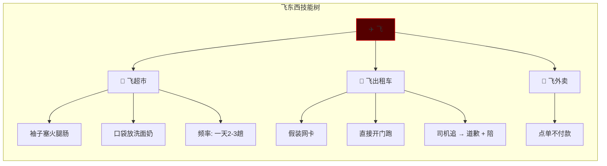
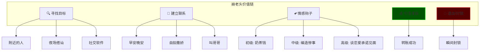

# China Underground Economy: 精神小妹与崩老头经济学

> **Tags:** `[Sociology]`, `[Psychology]`, `[Underground Economy]`, `[China]`
> **Date Added:** `2026-01-09`
> **一句话总结 (One-Liner):** 当社会底层的年轻女性用"情绪价值"作为商品，与中年男性的"精神空虚"进行交易时，一个灰色经济生态就此形成。
> **关键协议 (Critical Protocol):**
> 1.  **结构服从内容:** 本文按照生态链条逻辑组织：群体画像 → 生存策略 → 变现手法 → 心理机制 → 进化形态
> 2.  **原子级视觉化:** 每个核心概念配图
> 3.  **拒绝阉割:** 保留所有原文隐喻和采访实录

---

## 1. 元认知 (Metacognition)

### 问题定义

在中国社会底层，存在一个被主流媒体刻意忽视的群体：**精神小妹**。

她们的特征：
- 画着夸张的妆容
- 刺青遍布全身
- 身形普遍消瘦
- 大多是留守儿童或单亲家庭出身
- 学历往往国中就没念了
- 不工作，成群结队在深夜的街头游荡

**核心问题：** 没有稳定收入、没有社会保障、没有家庭支持的她们，是如何生存的？

### 核心哲学

> **"各取所需"经济学：** 精神小妹提供廉价的情绪价值，中老年男性支付金钱换取片刻的虚荣心满足。双方都知道这是一场交易，但都假装不知道。

这不是单纯的道德问题，而是一个**市场供需问题**：
- **供给侧：** 年轻女性拥有青春、陪伴、情绪价值
- **需求侧：** 中老年男性拥有金钱，缺乏情感关怀

> [!IMPORTANT]
> **核心洞察 (Key Insight):** 被"崩"的老头不仅不觉得被骗，反而觉得被崩得很光荣——这揭示了中国中年男性普遍的精神空虚。

---

## 2. 群体画像 (Core Framework)

### 2.1 精神小妹的典型特征

```mermaid
graph TD
    subgraph "精神小妹画像"
        Origin["👧 出身背景"]
        Appearance["💄 外观特征"]
        Lifestyle["🌙 生活方式"]
        Economy["💰 经济状态"]
    end
    
    Origin --> A1["留守儿童"]
    Origin --> A2["单亲家庭"]
    Origin --> A3["学历: 国中辍学"]
    
    Appearance --> B1["夸张妆容"]
    Appearance --> B2["全身刺青"]
    Appearance --> B3["病态消瘦"]
    
    Lifestyle --> C1["深夜游荡"]
    Lifestyle --> C2["群居公寓"]
    Lifestyle --> C3["夜店/KTV"]
    
    Economy --> D1["三天吃一顿"]
    Economy --> D2["打车平台欠费"]
    Economy --> D3["微信群发借钱"]
    
    style Origin fill:#4a1a4a,stroke:#aa44aa
    style Economy fill:#4a1a1a,stroke:#aa4444
```



### 2.2 为什么她们都这么瘦？

| 原因 | 解释 | 原文引用 |
|------|------|----------|
| **营养不良** | 三天吃一顿是常态 | "三天二九顿是真的" |
| **高强度步行** | 打不起车，全靠两条腿 | "打车平台全部欠费被封锁了" |
| **长期熬夜** | 夜店→凌晨回→白天睡 | "白天能休息吗？睡觉" |
| **劣质化妆品** | 皮肤损伤 | "使用劣质化妆品对皮肤的伤害" |

### 2.3 廉价公寓生态

**瀋阳"精神古层"公寓模式：**

```text
┌─────────────────────────────────────────────────────────────┐
│                    廉价公寓生态系统                           │
├─────────────────────────────────────────────────────────────┤
│  💰 房租: 100 人民币/晚 (众筹模式)                            │
│  👥 住户: 10+ 人挤一间 (床上3个 + 地铺3个)                    │
│  🚻 隐私: 无 (男女混住常见)                                   │
│  🍔 伙食: 5-6人AA一份饺子                                     │
│  📦 物品: 满地烟头 + 外卖盒 + 假名牌                          │
├─────────────────────────────────────────────────────────────┤
│  💸 付款规则:                                                 │
│  - 谁今天"崩到钱"谁付                                        │
│  - 都没钱 → 集体跑路换地方                                   │
└─────────────────────────────────────────────────────────────┘
```

---

## 3. 生存策略体系 (Execution Protocol)

### Phase 1: 飞东西 (偷窃技能树)

**"飞"的定义：** 既表现出打车逃票时的"灵活"，也说出了超市零元购时的"潇洒心态"。



**采访实录：**

> **问：** "飞东西被抓过吗？"
> **答：** "抓过。飞的什么？酸奶、巧克力。怎么办的？赔100块。有100块吗？没有。借的，群发一下，5块10块的凑。"

> **问：** "飞出租车是什么时候？"
> **答：** "边飞容易边飞出租车。"
> **问：** "飞过多少回？"
> **答：** "常规操作。"

### Phase 2: 崩老头 (情感诈骗体系)

**"崩"的定义：** 东北话"骗"的意思。就像弹脑瓜崩一样，轻轻崩一下，虽然吃点小亏，但心里痒痒的。



#### 崩老头三级手段

| 级别 | 手段 | 话术示例 | 金额范围 |
|------|------|----------|----------|
| **初级** | 撒娇卖萌 | "哥哥我饿三天了可以给我发个红包吗？" | ¥10-50 |
| **中级** | 编造惨事 | "妈妈病了 / 欠了高利贷 / 被前男友打" | ¥100-500 |
| **高级** | 承诺见面 | "我们见面吧" → 收款 → 封锁 | ¥500-5000+ |

### Phase 3: 目标筛选 (老头分类学)

**"老头"的定义：** 不是指七老八十的阿公，只要年纪比她们大、手头比较宽裕的男性都是"优质老头"（东北话叫"老灯"）。

```text
┌───────────────────────────────────────────────────────────┐
│                   老头分类标准 (老灯分级)                   │
├───────────────┬───────────────┬───────────────────────────┤
│     类别       │     年代       │         难度              │
├───────────────┼───────────────┼───────────────────────────┤
│  预备灯        │   00后/零后    │  ❌ 没钱                   │
│  中灯          │   90后         │  ⚠️ 聪明不好崩             │
│  老灯          │   80年代以前   │  ✅ 最好崩                  │
├───────────────┴───────────────┴───────────────────────────┤
│  🎯 最佳目标特征:                                           │
│  - 宅在家里不出门                                           │
│  - 没混过社会                                               │
│  - 没见过"美女"                                            │
│  - 70后到85年 (有钱又好骗)                                  │
│  - 五六十的 (最好崩)                                        │
└───────────────────────────────────────────────────────────┘
```

---

## 4. 心理机制分析 (Psychology)

### 4.1 为什么老头会被崩？

**沉没成本陷阱 (Sunk Cost Fallacy):**


**真实案例：** 江苏南通一位60岁退休男教师，明知可能受骗，却因为"已经给了那么多，万一是真的呢"的心理，持续给小妹转账了**17个月**。

### 4.2 为什么老头不觉得被骗？

| 心理机制 | 解释 | 网友留言 |
|----------|------|----------|
| **情感饥渴** | 工作压力、房贷、家庭矛盾，没人关心 | "中年男性在现实生活中根本没有人关心" |
| **虚荣满足** | 被年轻女性关注的快感 | "好像又体验了一把青春的气息" |
| **自我合理化** | 把花钱当做"扶贫"或"日行一善" | "每天用几十块做善事，换取好心情" |
| **比较优势** | 与被家里老婆骂相比，这点钱不算什么 | "总好过每天被家里那位劈头盖脸的数落" |

**极端案例：** 湖南长沙68岁孤寡老人，将女主播视频当成私人告白，每天在村口等"国家发的老婆"，甚至提前买好烟花爆竹等着迎接。

### 4.3 精神小妹为什么不觉得这是诈骗？

```mermaid
graph TD
    subgraph "认知扭曲机制"
        A["行为: 骗老头钱"]
        B["自我认知: 凭本事吃饭"]
        C["环境强化: 圈子里大家都这样"]
        D["媒体强化: 可以当流量变现"]
    end
    
    A --> B
    B --> C
    C --> D
    D -->|"正反馈循环"| A
    
    style A fill:#550000,stroke:#ff0000
    style D fill:#4a4a1a,stroke:#aaaa44
```



---

## 5. 进化形态: 瑜伽崩 (Advanced Form)

### 5.1 什么是瑜伽崩？

**定义：** 一群不上班的年轻女性，每天穿着紧身瑜伽套装出入咖啡厅、健身房，拍照打卡发朋友圈——但她们不是在健身，而是同时和**上百个异性**聊天赚钱。

```mermaid
graph LR
    subgraph "瑜伽崩 vs 精神小妹"
        A["精神小妹"]
        B["瑜伽崩"]
    end
    
    A --> A1["街头/夜场"]
    A --> A2["低端形象"]
    A --> A3["小额高频"]
    A --> A4["目标: 有钱就行"]
    
    B --> B1["咖啡厅/健身房"]
    B --> B2["精致形象"]
    B --> B3["高额低频"]
    B --> B4["目标: 技术宅/高净值"]
    
    style A fill:#550000,stroke:#ff0000
    style B fill:#1a4a4a,stroke:#44aaaa
```



### 5.2 瑜伽崩三大套路

#### 套路 1: 睁眼说瞎话的情绪价值

> **打油诗：**
> 老头身高一米六，她夸老头有肌肉
> 老头月薪两千块，她夸老头赚得够花
> 老头就算有狐臭，她都能说"闻着很享受"

**原理：** 把提供情绪价值当做职业素养。绝对不会像相亲对象一样挑剔你的身高、长相、收入——因为她没打算跟你过一辈子。

#### 套路 2: 极致的暧昧拉扯

```text
┌───────────────────────────────────────────────────────────┐
│                   暧昧边界操控术                            │
├───────────────────────────────────────────────────────────┤
│  ✅ 可以做的:                                              │
│  - 主动靠近你                                              │
│  - 发自拍                                                  │
│  - 撒娇                                                    │
│  - 要小钱                                                  │
├───────────────────────────────────────────────────────────┤
│  ❌ 绝对不承认的:                                          │
│  - "我们在交往"                                           │
│  - 任何明确的承诺                                          │
├───────────────────────────────────────────────────────────┤
│  🎯 话术:                                                  │
│  "这是男女间纯洁的友谊，是你自己想多了"                     │
│  "钱是你自愿掏的，手是你自己要牵的，我不负责任"              │
└───────────────────────────────────────────────────────────┘
```

#### 套路 3: 营造"捡到宝"的错觉

**操作流程：**
1. **AA买单** - 证明"我不是来图你钱的"
2. **朋友圈人设** - 新疆、西藏、三亚高端旅游照
3. **放低姿态** - "我不在意彩礼、不在意你有没有房"
4. **卸下防备** - 目标完全信任
5. **最后一击** - "爸爸生病了 / 家里需要周转" → 崩三五万

```mermaid
graph TD
    Step1["🤝 AA买单建立信任"] --> Step2["📸 朋友圈高端人设"]
    Step2 --> Step3["💬 放低物质要求"]
    Step3 --> Step4["❤️ 目标完全信任"]
    Step4 --> Step5["💰 编造紧急事件"]
    Step5 --> End["🎰 崩三五万"]
    
    style Step1 fill:#1a4a1a,stroke:#44aa44
    style End fill:#550000,stroke:#ff0000
```



### 5.3 瑜伽崩的精准狙击

**女大学生咨询律师原文：**

> **问：** "把崩老头当做职业，这个犯法吗？"
> **答：** "那得看你怎么崩了。"
> **问：** "你们一般崩多大的大叔大爷？"
> **答：** "根据个人经验，70后到85年是比较好骗钱的。但在我们眼里，90后也是老头。"
> **问：** "怎么加到优质老头？"
> **答：** "去技术论坛求技术帮助，那些技术宅都很有钱，很好骗。"

---

## 6. 社会学分析 (Sociology)

### 6.1 精神小妹的生命周期

```mermaid
graph LR
    A["👧 15-18岁: 辍学入行"] --> B["💃 18-22岁: 夜场/崩老头"]
    B --> C["📉 22-25岁: 颜值下降"]
    C --> D["🏭 25岁+: 电子厂流水线"]
    
    A -.->|"原因"| A1["留守/单亲/辍学"]
    B -.->|"状态"| B1["青春变现期"]
    C -.->|"转折"| C1["熬夜+劣质化妆品=加速衰老"]
    D -.->|"终局"| D1["深圳东莞工业园区"]
    
    style A fill:#4a4a1a,stroke:#aaaa44
    style D fill:#4a4a4a,stroke:#aaaaaa
```



### 6.2 为什么这个产业能存在？

| 因素 | 供给侧 (精神小妹) | 需求侧 (老头) |
|------|-------------------|---------------|
| **经济** | 没有技能、不愿打工 | 有闲钱、缺乏消费出口 |
| **心理** | 圈子里都这样、不觉得错 | 精神空虚、需要情感慰藉 |
| **社会** | 家庭缺失、教育断层 | 中年危机、婚姻压力 |
| **媒体** | 流量变现、博主采访 | 抖音推荐、算法投喂 |

### 6.3 媒体的角色

> **反直觉洞察：** 大多数拍摄精神小妹的博主都已被封禁。原因很明显——影片太过于真实，揭开太多中国社会底层青少年最溃烂的一面，不符合"正能量"价值观。

但讽刺的是，这些博主反而成为了**问题的一部分**：
- 用猎奇视角消费她们的生活
- 从她们的困境中获取流量
- 却没有人真正关心她们怎么走出来

---

## 7. Anti-Patterns (反模式)

### Trap 1: 认为这是"各取所需"的双赢

* **Trap:** 认为老头花钱买开心、小妹赚钱生存，是公平交易。
* **Why:** 忽略了权力不对等——小妹利用信息差进行欺诈。
* **Fix:** 认清这是低级诈骗的本质，只是法律边缘灰色地带。
* **Example:** 江苏退休教师17个月持续转账案例。
* **Positive Real Scenario:** 日本的"牛郎店"虽然也是情绪价值交易，但至少是明码标价、双方知情的商业行为。

### Trap 2: 认为老头"活该被骗"

* **Trap:** 嘲笑被骗的老头是"老色批"，活该。
* **Why:** 受害者有罪论 + 对中年男性精神困境的忽视。
* **Fix:** 理解这是社会问题，不是个人道德问题。
* **Example:** 68岁孤寡老人在村口等"国家发的老婆"——这是孤独，不是愚蠢。
* **Positive Real Scenario:** 荷兰等国家为孤寡老人提供政府资助的社交陪伴服务。

### Trap 3: 认为精神小妹是"自甘堕落"

* **Trap:** 全部归因于个人选择，忽略结构性因素。
* **Why:** 基本归因谬误 (Fundamental Attribution Error)。
* **Fix:** 看到她们背后的留守儿童问题、教育断层、家庭缺失。
* **Example:** 原文："当她们生活在没有人告诉她们这样做是错的环境里，甚至她们的错事还可以被当做乐子和流量变现的来源时，她们根本没有正常生活的概念。"
* **Positive Real Scenario:** 北欧国家的早期干预计划，针对高风险青少年提供教育和职业培训。

### Trap 4: 用道德批判代替系统分析

* **Trap:** 只看到"骗"和"被骗"，看不到供需关系。
* **Why:** 道德简化主义，回避结构性问题。
* **Fix:** 从经济学、心理学、社会学多维度理解。
* **Example:** 瑜伽崩产业链的进化——这不是道德问题，是市场效率问题。
* **Positive Real Scenario:** 学术界对"性工作"去污名化的讨论，将其视为劳动而非犯罪。

---

## 8. Glossary (术语表)

### 核心术语

* **精神小妹 (Jingshen Xiaomei):** 中国社会底层年轻女性群体。特征包括夸张妆容、全身刺青、病态消瘦、群居廉价公寓、以偷窃和情感诈骗为生。不是贬义词，是一种亚文化自我认同。
* **精神小伙 (Jingshen Xiaohuo):** 精神小妹的男性对应物。同样来自底层，通常无业或从事灰色行业，与精神小妹互为"家人"关系。
* **崩老头 (Beng Laotou):** 通过提供情绪价值、暧昧聊天等方式，向中老年男性"骗取"小额金钱的行为。"崩"是东北话"骗"的意思，形象表达了"轻轻一下"的感觉。
* **飞 (Fei):** 偷窃的隐语。"飞超市"=超市偷东西，"飞出租车"=打车不付钱跑掉。形象表达了动作的"轻盈"和"潇洒"。
* **老灯 (Lao Deng):** 东北话，指年纪较大且有钱可骗的男性目标。按年龄分为"预备灯"(00后)、"中灯"(90后)、"老灯"(80年代以前)。
* **瑜伽崩 (Yujia Beng):** 精神小妹的进化形态。穿瑜伽服出入高端场所，通过精致人设和长期情感培养，对高净值男性进行大额诈骗。
* **廉价公寓 (Lianjia Gongyu):** 精神小妹群居的住所。特征包括多人挤一间、男女混住、环境脏乱、房租众筹、随时跑路。
* **群发借钱 (Qunfa Jieqian):** 精神小妹的生存技能。向微信列表几百个好友群发"借几块十块"的信息，积少成多。
* **沉没成本陷阱 (Sunk Cost Fallacy):** 老头被崩的核心心理机制。因为已经投入了奶茶钱、饭钱，就想着"万一是真的呢"而继续投入更多。
* **情绪价值 (Qingxu Jiazhi):** 精神小妹的核心"商品"。通过撒娇、陪聊、假装关心等方式，满足老头的情感需求换取金钱。

### 心理学术语

* **基本归因谬误 (Fundamental Attribution Error):** 过度归因于个人因素，忽略情境因素。例如认为精神小妹是"自甘堕落"而忽略其成长环境。
* **沉默成本效应 (Sunk Cost Effect):** 因为已经投入资源而继续投入更多的非理性行为。老头被崩的核心心理机制。
* **认知失调 (Cognitive Dissonance):** 行为与认知不一致时的心理不适。老头明知被骗却不承认，通过"我是在做善事"来合理化。

---

## 9. Formula Table (公式表)

| 公式名称 | 逻辑 | 变量定义 |
|----------|------|----------|
| **崩老头价值公式** | `收入 = 目标数量 × 单笔金额 × 成功率` | 目标数量: 同时聊天的老头数; 单笔金额: 奶茶/饭/转账; 成功率: 给钱的比例 |
| **老头筛选公式** | `好崩程度 = (经济实力 × 精神空虚度) ÷ 社交经验` | 经济实力: 可支配收入; 精神空虚度: 缺乏情感关怀的程度; 社交经验: 见过多少"世面" |
| **瑜伽崩ROI公式** | `ROI = 大额变现 ÷ (形象投资 + 时间成本)` | 大额变现: 最终骗到的金额; 形象投资: 瑜伽服/咖啡厅消费; 时间成本: 情感培养周期 |
| **生命周期价值公式** | `LTV = 青春年限 × 年均收入` | 青春年限: 15-25岁约10年; 年均收入: 取决于选择精神小妹路线还是瑜伽崩路线 |

---

## 10. 系统关联 (Interlinkages)

### 上游 (与其他模块的关系)

* **Market_Psychology:** 情绪价值变现与消费心理学的关系
* **Social_Game:** 社交博弈论中的信息不对称

### 下游 (输出)

* 对中国社会底层生态的理解
* 对"情绪价值"作为商品的认识
* 对诈骗心理学的案例库

---

## 备注与引用 (Notes & References)

* **Source:** 小月 YouTube 频道 - 精神小妹 & 崩老头系列
* **采访来源:** 东北网红计程车司机"一生虎"系列
* **Key Concepts:** 
  - "各取所需的灰色经济"
  - "情绪价值变现"
  - "沉没成本陷阱"
  - "精准狙击术"
* **警示:** 本文档仅作学术研究用途，不构成对任何违法行为的鼓励。
