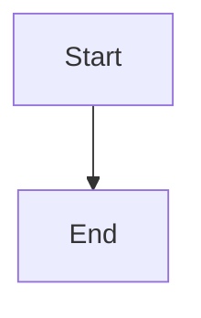

# [Module Name: e.g., Enterprise Operation System]

> **Tags:** `[Domain1]`, `[Domain2]`
> **Date Added:** `YYYY-MM-DD`
> **一句话总结 (One-Liner):** [用一句话概括核心本质]
> **关键协议 (Critical Protocol):**
> 1.  **结构服从内容 (Structure Follows Content):** 下面的结构仅供参考。如果内容的自然逻辑（时间顺序、因果链条）更顺畅，请优先使用内容的逻辑，**不要削足适履行强套模板**。
> 2.  **原子级视觉化 (Atomic Visualization):** 每一个重要概念必须配图。
> 3.  **拒绝阉割 (No Summary):** 保留原文隐喻。

---
*(以下为参考清单，非强制骨架)*

## 1. 元认知 (Metacognition) - [Checklist: Why/Problem/Philosophy]
*Why does this module exist?*

*   **问题定义:** ...
*   **核心哲学:** ...
*   **系统定位 (System Role):** [它在整个 Asher 系统中扮演什么角色？]

> [!IMPORTANT]
> **核心洞察 (Key Insight):** [最反直觉、最痛的一个点]

## 2. 核心架构 (Core Framework - The "What")
*Structural breakdown. (结构拆解)*

*   **核心概念 (Key Concepts):**
    *   **概念 A:** [定义 + 隐喻]
    *   **概念 B:** [定义 + 隐喻]
*   **逻辑推导 (Logic Chain):** [A 如何导致 B，B 如何导致 C]

**架构视觉化 (Structuring):**

## 3. 执行协议 (Execution Protocol - The "How")
*Step-by-step instructions. (手把手教程)*

### Phase 1: [阶段名称]
*   **动作 (Action):** [具体做什么]
*   **心法 (Heuristic):** [判断标准/决策原则]
*   **细节 (Nuance):** [魔鬼在细节中]

**阶段视觉化 (Phase 1 Vis):**
*(在此处插入表格对比或 ASCII 流程图)*
| 对比项 | Option A | Option B |
| :--- | :--- | :--- |
| ... | ... | ... |

### Phase 2: [阶段名称]
*   **动作 (Action):**
*   **细节 (Nuance):**

**阶段视觉化 (Phase 2 Vis):**
*(在此处插入 ASCII 或表格)*

## 4. Anti-Patterns (反模式 - The "Don'ts")
> **[MANDATORY] 必选章节**
> Every knowledge module MUST deduce at least 3 traps/mistakes. (每个模块必须反推至少3个常见的坑)

*Common traps. (常见的坑)*

*   **陷阱 1 (Trap 1):** [错误的做法]
    *   *为什么会犯错 (Why):* [背后的心理机制]
    *   *如何修正 (Fix):* [正确的解法]
*   **陷阱 2 (Trap 2):**

## 5. 系统关联 (Interlinkages)
*Connection to other modules. (与其他模块的关系)*

*   **上游 (Input):** [依赖什么前置知识？] -> `[File Link]`
*   **下游 (Output):** [输出给什么模块？] -> `[File Link]`

---
## 7. Glossary (术语表)
*Define technical terms in plain language.*

## 8. Formula Table (公式表 - 3D Knowledge)
*Extract core logical formulas for the 3D Graph.*
| Formula Name | Equation / Logic | Variable Definition |
| :--- | :--- | :--- |
| **Example** | `Value = Pain x Solution` | Pain: 痛点程度, Solution: 解决精度 |
*   **Term A:** [Definition using everyday analogy]
*   **Term B:** ...

---
## 备注与引用 (Notes & References)
*   [Source Material]
*   [Format Guide]
